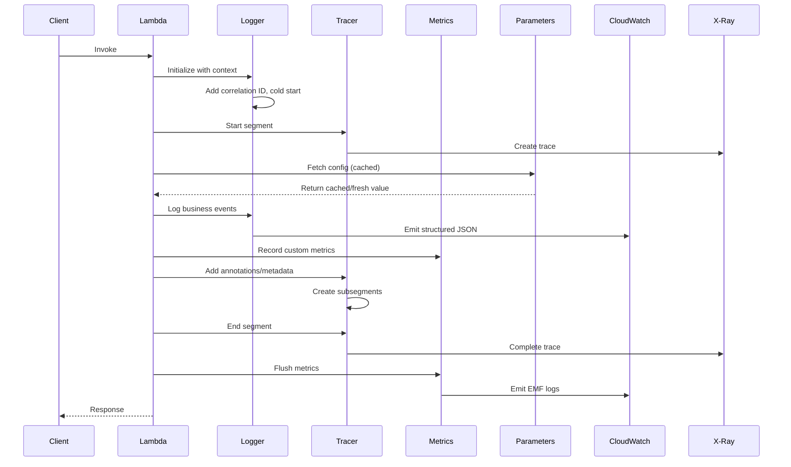
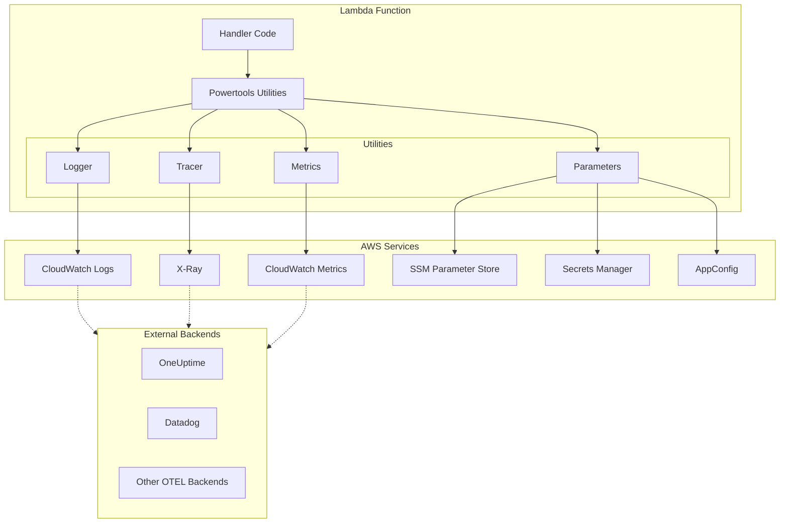

# How to Build AWS Lambda Powertools: A Complete Guide to Serverless Observability

Author: [nawazdhandala](https://github.com/nawazdhandala)

Tags: AWS, Lambda, Powertools, Observability

Description: A practical guide to implementing AWS Lambda Powertools for logging, tracing, metrics, and parameter management in Python and TypeScript serverless applications.

---

Serverless functions are great until they fail silently. You push a Lambda, it runs, and somewhere between invocation and response, something goes wrong. The CloudWatch logs are a wall of text. There's no correlation between requests. Metrics are either missing or meaningless.

AWS Lambda Powertools fixes this. It's a toolkit that brings structured logging, distributed tracing, custom metrics, and parameter utilities to your Lambda functions with minimal effort. Think of it as the observability layer your serverless code has been missing.

This guide walks through setting up Lambda Powertools in both Python and TypeScript, covering all four core utilities: Logger, Tracer, Metrics, and Parameters.

---

## Table of Contents

1. What is AWS Lambda Powertools
2. Installation and Setup
3. Logger: Structured Logging
4. Tracer: Distributed Tracing with X-Ray
5. Metrics: Custom CloudWatch Metrics
6. Parameters: SSM, Secrets Manager, AppConfig
7. Instrumentation Flow
8. Putting It All Together
9. Best Practices
10. Exporting to External Backends

---

## 1. What is AWS Lambda Powertools

AWS Lambda Powertools is an open-source library that provides utilities for implementing serverless best practices. It's available for Python, TypeScript/JavaScript, Java, and .NET.

Core utilities:

| Utility | Purpose |
|---------|---------|
| Logger | Structured JSON logging with correlation IDs |
| Tracer | AWS X-Ray integration with automatic capture |
| Metrics | Custom CloudWatch metrics with EMF format |
| Parameters | Caching and transformation for SSM, Secrets Manager, AppConfig |

Why use it:

- Correlate logs across Lambda invocations automatically
- Trace requests through your entire serverless architecture
- Emit custom metrics without managing CloudWatch API calls
- Cache parameters to reduce API calls and latency

---

## 2. Installation and Setup

### Python

```bash
pip install aws-lambda-powertools
```

Or with extras for tracing and validation:

```bash
pip install "aws-lambda-powertools[tracer,validation,parser]"
```

### TypeScript / Node.js

```bash
npm install @aws-lambda-powertools/logger \
            @aws-lambda-powertools/tracer \
            @aws-lambda-powertools/metrics \
            @aws-lambda-powertools/parameters
```

### Lambda Layer (Alternative)

AWS provides managed layers for Powertools:

```yaml
# SAM template
Globals:
  Function:
    Layers:
      - !Sub arn:aws:lambda:${AWS::Region}:017000801446:layer:AWSLambdaPowertoolsPythonV2:51
```

---

## 3. Logger: Structured Logging

The Logger utility replaces `print()` statements with structured JSON logs that include correlation IDs, cold start indicators, and custom context.

### Python Logger

```python
from aws_lambda_powertools import Logger
from aws_lambda_powertools.utilities.typing import LambdaContext

logger = Logger(service="payment-service")

@logger.inject_lambda_context(log_event=True)
def handler(event: dict, context: LambdaContext) -> dict:
    order_id = event.get("order_id")

    # Add persistent keys to all logs
    logger.append_keys(order_id=order_id)

    logger.info("Processing payment")

    try:
        result = process_payment(order_id)
        logger.info("Payment successful", extra={"amount": result["amount"]})
        return {"statusCode": 200, "body": "Success"}
    except Exception as e:
        logger.exception("Payment failed")
        raise
```

Output:

```json
{
    "level": "INFO",
    "location": "handler:12",
    "message": "Processing payment",
    "timestamp": "2026-01-30T10:15:30.123Z",
    "service": "payment-service",
    "cold_start": true,
    "function_name": "PaymentHandler",
    "function_memory_size": 256,
    "function_arn": "arn:aws:lambda:us-east-1:123456789:function:PaymentHandler",
    "function_request_id": "c6af9ac6-7b61-11e6-9a41-93e8deadbeef",
    "order_id": "ord_12345"
}
```

### TypeScript Logger

```typescript
import { Logger } from '@aws-lambda-powertools/logger';
import type { Context } from 'aws-lambda';

const logger = new Logger({ serviceName: 'payment-service' });

export const handler = async (event: any, context: Context) => {
    logger.addContext(context);

    const orderId = event.order_id;
    logger.appendKeys({ orderId });

    logger.info('Processing payment');

    try {
        const result = await processPayment(orderId);
        logger.info('Payment successful', { amount: result.amount });
        return { statusCode: 200, body: 'Success' };
    } catch (error) {
        logger.error('Payment failed', error as Error);
        throw error;
    }
};
```

### Logger Configuration Options

```python
logger = Logger(
    service="my-service",
    level="DEBUG",                    # Log level
    sampling_rate=0.1,                # Sample 10% of debug logs
    correlation_id_path="headers.x-correlation-id",  # Extract correlation ID
    log_record_order=["level", "message", "timestamp"],
)
```

---

## 4. Tracer: Distributed Tracing with X-Ray

The Tracer utility wraps AWS X-Ray SDK with a simpler interface. It automatically captures cold starts, responses, exceptions, and creates subsegments for annotated methods.

### Python Tracer

```python
from aws_lambda_powertools import Tracer

tracer = Tracer(service="order-service")

@tracer.capture_lambda_handler
def handler(event: dict, context) -> dict:
    order = create_order(event)
    return {"statusCode": 200, "body": order}

@tracer.capture_method
def create_order(event: dict) -> dict:
    # Add annotations for filtering in X-Ray
    tracer.put_annotation(key="order_type", value=event.get("type", "standard"))

    # Add metadata for debugging
    tracer.put_metadata(key="event", value=event, namespace="input")

    order_id = generate_order_id()
    save_to_database(order_id, event)

    return {"order_id": order_id}

@tracer.capture_method
def save_to_database(order_id: str, data: dict) -> None:
    # This creates a subsegment named "save_to_database"
    # Automatically captures exceptions if raised
    db_client.put_item(order_id, data)
```

### TypeScript Tracer

```typescript
import { Tracer } from '@aws-lambda-powertools/tracer';
import type { Context } from 'aws-lambda';

const tracer = new Tracer({ serviceName: 'order-service' });

export const handler = async (event: any, context: Context) => {
    const segment = tracer.getSegment();
    const handlerSegment = segment?.addNewSubsegment('handler');
    tracer.setSegment(handlerSegment!);

    tracer.annotateColdStart();
    tracer.addServiceNameAnnotation();

    try {
        const order = await createOrder(event);
        tracer.addResponseAsMetadata(order, 'handler');
        return { statusCode: 200, body: JSON.stringify(order) };
    } catch (error) {
        tracer.addErrorAsMetadata(error as Error);
        throw error;
    } finally {
        handlerSegment?.close();
        tracer.setSegment(segment!);
    }
};

const createOrder = async (event: any) => {
    const subsegment = tracer.getSegment()?.addNewSubsegment('createOrder');
    tracer.setSegment(subsegment!);

    try {
        tracer.putAnnotation('orderType', event.type || 'standard');
        tracer.putMetadata('input', event);

        const orderId = generateOrderId();
        await saveToDatabase(orderId, event);

        return { orderId };
    } finally {
        subsegment?.close();
    }
};
```

### Using the Middy Middleware (TypeScript)

For cleaner code, use the Middy middleware:

```typescript
import { Tracer } from '@aws-lambda-powertools/tracer';
import { captureLambdaHandler } from '@aws-lambda-powertools/tracer/middleware';
import middy from '@middy/core';

const tracer = new Tracer({ serviceName: 'order-service' });

const lambdaHandler = async (event: any) => {
    const order = await createOrder(event);
    return { statusCode: 200, body: JSON.stringify(order) };
};

export const handler = middy(lambdaHandler)
    .use(captureLambdaHandler(tracer));
```

---

## 5. Metrics: Custom CloudWatch Metrics

The Metrics utility uses CloudWatch Embedded Metric Format (EMF) to emit custom metrics without making API calls. Metrics are extracted from logs by CloudWatch.

### Python Metrics

```python
from aws_lambda_powertools import Metrics
from aws_lambda_powertools.metrics import MetricUnit

metrics = Metrics(service="order-service", namespace="OrderProcessing")

@metrics.log_metrics(capture_cold_start_metric=True)
def handler(event: dict, context) -> dict:
    # Add dimensions (indexed for filtering)
    metrics.add_dimension(name="environment", value="production")
    metrics.add_dimension(name="region", value="us-east-1")

    # Add metrics
    metrics.add_metric(name="OrderCreated", unit=MetricUnit.Count, value=1)
    metrics.add_metric(name="OrderAmount", unit=MetricUnit.Count, value=event.get("amount", 0))

    # Add high-resolution metric (1-second resolution)
    metrics.add_metric(
        name="ProcessingLatency",
        unit=MetricUnit.Milliseconds,
        value=calculate_latency(),
        resolution=MetricResolution.High
    )

    return process_order(event)
```

### TypeScript Metrics

```typescript
import { Metrics, MetricUnits } from '@aws-lambda-powertools/metrics';
import { logMetrics } from '@aws-lambda-powertools/metrics/middleware';
import middy from '@middy/core';

const metrics = new Metrics({
    serviceName: 'order-service',
    namespace: 'OrderProcessing'
});

const lambdaHandler = async (event: any) => {
    metrics.addDimension('environment', 'production');
    metrics.addDimension('region', 'us-east-1');

    metrics.addMetric('OrderCreated', MetricUnits.Count, 1);
    metrics.addMetric('OrderAmount', MetricUnits.Count, event.amount || 0);

    const startTime = Date.now();
    const result = await processOrder(event);

    metrics.addMetric('ProcessingLatency', MetricUnits.Milliseconds, Date.now() - startTime);

    return { statusCode: 200, body: JSON.stringify(result) };
};

export const handler = middy(lambdaHandler)
    .use(logMetrics(metrics, { captureColdStartMetric: true }));
```

### Multi-Value Metrics

```python
# Add multiple values for the same metric (creates percentile statistics)
metrics.add_metric(name="ResponseTime", unit=MetricUnit.Milliseconds, value=50)
metrics.add_metric(name="ResponseTime", unit=MetricUnit.Milliseconds, value=75)
metrics.add_metric(name="ResponseTime", unit=MetricUnit.Milliseconds, value=120)
```

### Default Dimensions

```python
metrics = Metrics(
    service="order-service",
    namespace="OrderProcessing"
)
metrics.set_default_dimensions(environment="production", version="1.2.3")
```

---

## 6. Parameters: SSM, Secrets Manager, AppConfig

The Parameters utility provides caching, transformation, and a unified interface for retrieving configuration from multiple sources.

### Python Parameters

```python
from aws_lambda_powertools.utilities import parameters

def handler(event: dict, context) -> dict:
    # SSM Parameter Store
    api_key = parameters.get_parameter("/myapp/api-key", decrypt=True)

    # Get multiple parameters by path
    db_config = parameters.get_parameters("/myapp/database/", decrypt=True)
    # Returns: {"host": "...", "port": "...", "password": "..."}

    # Secrets Manager
    db_credentials = parameters.get_secret("myapp/db-credentials", transform="json")
    # Automatically parses JSON: {"username": "admin", "password": "..."}

    # AppConfig
    feature_flags = parameters.get_app_config(
        name="feature-flags",
        environment="production",
        application="myapp",
        transform="json"
    )

    return process_with_config(api_key, db_config, feature_flags)
```

### TypeScript Parameters

```typescript
import { getParameter, getParameters, getSecret } from '@aws-lambda-powertools/parameters/ssm';
import { getSecret as getSecretFromSecretsManager } from '@aws-lambda-powertools/parameters/secrets';
import { getAppConfig } from '@aws-lambda-powertools/parameters/appconfig';

export const handler = async (event: any) => {
    // SSM Parameter Store
    const apiKey = await getParameter('/myapp/api-key', { decrypt: true });

    // Get multiple parameters
    const dbConfig = await getParameters('/myapp/database/', { decrypt: true });

    // Secrets Manager
    const dbCredentials = await getSecretFromSecretsManager('myapp/db-credentials', {
        transform: 'json'
    });

    // AppConfig
    const featureFlags = await getAppConfig('feature-flags', {
        environment: 'production',
        application: 'myapp',
        transform: 'json'
    });

    return processWithConfig(apiKey, dbConfig, featureFlags);
};
```

### Caching Configuration

```python
from aws_lambda_powertools.utilities import parameters
from datetime import timedelta

# Cache for 5 minutes (default)
api_key = parameters.get_parameter("/myapp/api-key", max_age=300)

# Force refresh, ignoring cache
api_key = parameters.get_parameter("/myapp/api-key", force_fetch=True)

# Custom cache configuration
parameters.DEFAULT_MAX_AGE_SECS = 600  # 10 minutes globally
```

### Custom Provider

```python
from aws_lambda_powertools.utilities.parameters import BaseProvider
import boto3

class DynamoDBProvider(BaseProvider):
    def __init__(self, table_name: str):
        super().__init__()
        self.table = boto3.resource("dynamodb").Table(table_name)

    def _get(self, name: str, **kwargs) -> str:
        response = self.table.get_item(Key={"id": name})
        return response["Item"]["value"]

    def _get_multiple(self, path: str, **kwargs) -> dict:
        response = self.table.scan(FilterExpression="begins_with(id, :path)",
                                   ExpressionAttributeValues={":path": path})
        return {item["id"]: item["value"] for item in response["Items"]}

# Usage
ddb_provider = DynamoDBProvider("config-table")
value = ddb_provider.get("my-config-key")
```

---

## 7. Instrumentation Flow

Here's how the utilities work together in a typical Lambda invocation:



### Data Flow Architecture



---

## 8. Putting It All Together

Here's a complete example combining all four utilities:

### Python Complete Example

```python
from aws_lambda_powertools import Logger, Tracer, Metrics
from aws_lambda_powertools.metrics import MetricUnit
from aws_lambda_powertools.utilities import parameters
from aws_lambda_powertools.utilities.typing import LambdaContext
import json

# Initialize utilities
logger = Logger(service="order-service")
tracer = Tracer(service="order-service")
metrics = Metrics(service="order-service", namespace="OrderProcessing")

@logger.inject_lambda_context(log_event=True)
@tracer.capture_lambda_handler
@metrics.log_metrics(capture_cold_start_metric=True)
def handler(event: dict, context: LambdaContext) -> dict:
    # Set dimensions for all metrics
    metrics.add_dimension(name="environment", value="production")

    # Get configuration
    db_config = parameters.get_secret("order-service/db", transform="json")

    order_id = event.get("order_id")
    logger.append_keys(order_id=order_id)
    tracer.put_annotation(key="order_id", value=order_id)

    logger.info("Processing order")

    try:
        order = process_order(event, db_config)

        metrics.add_metric(name="OrderProcessed", unit=MetricUnit.Count, value=1)
        metrics.add_metric(name="OrderAmount", unit=MetricUnit.Count, value=order["amount"])

        logger.info("Order processed successfully", extra={"amount": order["amount"]})

        return {
            "statusCode": 200,
            "body": json.dumps(order)
        }

    except ValueError as e:
        logger.warning("Invalid order data", extra={"error": str(e)})
        metrics.add_metric(name="OrderValidationError", unit=MetricUnit.Count, value=1)
        return {"statusCode": 400, "body": str(e)}

    except Exception as e:
        logger.exception("Order processing failed")
        metrics.add_metric(name="OrderProcessingError", unit=MetricUnit.Count, value=1)
        tracer.put_metadata(key="error", value=str(e), namespace="errors")
        raise


@tracer.capture_method
def process_order(event: dict, db_config: dict) -> dict:
    logger.debug("Validating order")
    validate_order(event)

    logger.debug("Saving to database")
    save_order(event, db_config)

    return {
        "order_id": event["order_id"],
        "amount": event["amount"],
        "status": "processed"
    }


@tracer.capture_method
def validate_order(event: dict) -> None:
    if not event.get("order_id"):
        raise ValueError("order_id is required")
    if not event.get("amount") or event["amount"] <= 0:
        raise ValueError("amount must be positive")


@tracer.capture_method
def save_order(event: dict, db_config: dict) -> None:
    # Database operations here
    tracer.put_metadata(key="db_operation", value="insert", namespace="database")
    pass
```

### TypeScript Complete Example

```typescript
import { Logger } from '@aws-lambda-powertools/logger';
import { Tracer } from '@aws-lambda-powertools/tracer';
import { Metrics, MetricUnits } from '@aws-lambda-powertools/metrics';
import { getSecret } from '@aws-lambda-powertools/parameters/secrets';
import { injectLambdaContext } from '@aws-lambda-powertools/logger/middleware';
import { captureLambdaHandler } from '@aws-lambda-powertools/tracer/middleware';
import { logMetrics } from '@aws-lambda-powertools/metrics/middleware';
import middy from '@middy/core';
import type { Context } from 'aws-lambda';

const logger = new Logger({ serviceName: 'order-service' });
const tracer = new Tracer({ serviceName: 'order-service' });
const metrics = new Metrics({ serviceName: 'order-service', namespace: 'OrderProcessing' });

interface OrderEvent {
    order_id: string;
    amount: number;
}

interface Order {
    orderId: string;
    amount: number;
    status: string;
}

const lambdaHandler = async (event: OrderEvent, context: Context) => {
    metrics.addDimension('environment', 'production');

    const dbConfig = await getSecret('order-service/db', { transform: 'json' });

    const orderId = event.order_id;
    logger.appendKeys({ orderId });
    tracer.putAnnotation('orderId', orderId);

    logger.info('Processing order');

    try {
        const order = await processOrder(event, dbConfig);

        metrics.addMetric('OrderProcessed', MetricUnits.Count, 1);
        metrics.addMetric('OrderAmount', MetricUnits.Count, order.amount);

        logger.info('Order processed successfully', { amount: order.amount });

        return {
            statusCode: 200,
            body: JSON.stringify(order)
        };
    } catch (error) {
        if (error instanceof ValidationError) {
            logger.warn('Invalid order data', { error: error.message });
            metrics.addMetric('OrderValidationError', MetricUnits.Count, 1);
            return { statusCode: 400, body: error.message };
        }

        logger.error('Order processing failed', error as Error);
        metrics.addMetric('OrderProcessingError', MetricUnits.Count, 1);
        throw error;
    }
};

const processOrder = async (event: OrderEvent, dbConfig: any): Promise<Order> => {
    const subsegment = tracer.getSegment()?.addNewSubsegment('processOrder');
    tracer.setSegment(subsegment!);

    try {
        logger.debug('Validating order');
        validateOrder(event);

        logger.debug('Saving to database');
        await saveOrder(event, dbConfig);

        return {
            orderId: event.order_id,
            amount: event.amount,
            status: 'processed'
        };
    } finally {
        subsegment?.close();
    }
};

const validateOrder = (event: OrderEvent): void => {
    if (!event.order_id) {
        throw new ValidationError('order_id is required');
    }
    if (!event.amount || event.amount <= 0) {
        throw new ValidationError('amount must be positive');
    }
};

const saveOrder = async (event: OrderEvent, dbConfig: any): Promise<void> => {
    const subsegment = tracer.getSegment()?.addNewSubsegment('saveOrder');
    tracer.setSegment(subsegment!);

    try {
        tracer.putMetadata('dbOperation', 'insert', 'database');
        // Database operations here
    } finally {
        subsegment?.close();
    }
};

class ValidationError extends Error {
    constructor(message: string) {
        super(message);
        this.name = 'ValidationError';
    }
}

export const handler = middy(lambdaHandler)
    .use(injectLambdaContext(logger, { logEvent: true }))
    .use(captureLambdaHandler(tracer))
    .use(logMetrics(metrics, { captureColdStartMetric: true }));
```

---

## 9. Best Practices

### Logging

- Always use `inject_lambda_context` to capture request IDs and cold starts
- Use `append_keys` for request-scoped context (user ID, order ID)
- Set appropriate log levels: ERROR for failures, INFO for business events, DEBUG for troubleshooting
- Use sampling for debug logs in production to reduce costs

### Tracing

- Use `capture_lambda_handler` decorator on all handlers
- Add annotations for filterable data (customer tier, region, order type)
- Add metadata for debugging context (full request/response when needed)
- Create subsegments for external calls that are not auto-instrumented

### Metrics

- Define a namespace per service or domain
- Use dimensions sparingly (max 10 dimensions per metric)
- Capture cold start metrics to monitor performance
- Use high-resolution metrics only when second-level granularity is needed

### Parameters

- Always enable caching (default 5 minutes)
- Use `decrypt=True` for sensitive SSM parameters
- Use `transform="json"` for structured secrets
- Implement circuit breaker patterns for parameter fetching

### IAM Permissions

```yaml
# Minimum IAM permissions for Powertools
Statement:
  - Effect: Allow
    Action:
      - xray:PutTraceSegments
      - xray:PutTelemetryRecords
    Resource: "*"
  - Effect: Allow
    Action:
      - ssm:GetParameter
      - ssm:GetParameters
      - ssm:GetParametersByPath
    Resource: !Sub "arn:aws:ssm:${AWS::Region}:${AWS::AccountId}:parameter/myapp/*"
  - Effect: Allow
    Action:
      - secretsmanager:GetSecretValue
    Resource: !Sub "arn:aws:secretsmanager:${AWS::Region}:${AWS::AccountId}:secret:myapp/*"
  - Effect: Allow
    Action:
      - kms:Decrypt
    Resource: !Sub "arn:aws:kms:${AWS::Region}:${AWS::AccountId}:key/*"
```

---

## 10. Exporting to External Backends

While Lambda Powertools natively integrates with AWS services (CloudWatch, X-Ray), you can export telemetry to external observability platforms for unified monitoring.

### Using Lambda Extensions

Lambda extensions can intercept logs and forward them to external backends:

```yaml
# SAM template with OpenTelemetry extension
Globals:
  Function:
    Layers:
      - !Sub arn:aws:lambda:${AWS::Region}:901920570463:layer:aws-otel-collector-amd64-ver-0-90-1:1
    Environment:
      Variables:
        OPENTELEMETRY_COLLECTOR_CONFIG_FILE: /var/task/collector.yaml
```

### Collector Configuration for OneUptime

```yaml
# collector.yaml
receivers:
  otlp:
    protocols:
      grpc:
        endpoint: localhost:4317
      http:
        endpoint: localhost:4318

processors:
  batch:
    timeout: 5s
    send_batch_size: 256

exporters:
  otlphttp:
    endpoint: https://oneuptime.com/otlp
    headers:
      x-oneuptime-token: ${ONEUPTIME_TOKEN}

service:
  pipelines:
    traces:
      receivers: [otlp]
      processors: [batch]
      exporters: [otlphttp]
    metrics:
      receivers: [otlp]
      processors: [batch]
      exporters: [otlphttp]
    logs:
      receivers: [otlp]
      processors: [batch]
      exporters: [otlphttp]
```

### Forwarding CloudWatch Logs

Use a Lambda function to forward logs from CloudWatch to your preferred backend:

```python
import json
import gzip
import base64
import requests

def handler(event, context):
    # Decode CloudWatch Logs data
    payload = base64.b64decode(event['awslogs']['data'])
    log_data = json.loads(gzip.decompress(payload))

    # Transform and forward to OneUptime
    for log_event in log_data['logEvents']:
        message = json.loads(log_event['message'])

        # Forward structured log
        requests.post(
            'https://oneuptime.com/api/logs',
            headers={'x-oneuptime-token': os.environ['ONEUPTIME_TOKEN']},
            json={
                'timestamp': log_event['timestamp'],
                'service': message.get('service'),
                'level': message.get('level'),
                'message': message.get('message'),
                'attributes': message
            }
        )
```

---

## Summary

AWS Lambda Powertools transforms serverless observability from an afterthought into a first-class concern. By combining structured logging, distributed tracing, custom metrics, and parameter management, you get:

| Utility | Without Powertools | With Powertools |
|---------|-------------------|-----------------|
| Logging | Unstructured print statements | Correlated JSON logs with context |
| Tracing | Manual X-Ray SDK calls | Decorator-based automatic tracing |
| Metrics | CloudWatch API calls | EMF-based zero-API-call metrics |
| Parameters | Direct boto3 calls | Cached, transformed config |

Start with Logger to get immediate value from structured logs. Add Tracer when you need to debug cross-function latency. Implement Metrics when you need custom business KPIs. Use Parameters to simplify configuration management.

For unified observability across your entire stack, export your Lambda telemetry to platforms like OneUptime that can correlate serverless data with your containers, VMs, and other infrastructure.

---

**Related Reading:**

- [What are Traces and Spans in OpenTelemetry](https://oneuptime.com/blog/post/2025-08-27-traces-and-spans-in-opentelemetry/view)
- [Logs, Metrics and Traces: Three Pillars of Observability](https://oneuptime.com/blog/post/2025-08-20-three-pillars-of-observability-logs-metrics-traces/view)
- [How to Structure Logs Properly in OpenTelemetry](https://oneuptime.com/blog/post/2025-08-28-how-to-structure-logs-properly-in-opentelemetry/view)
