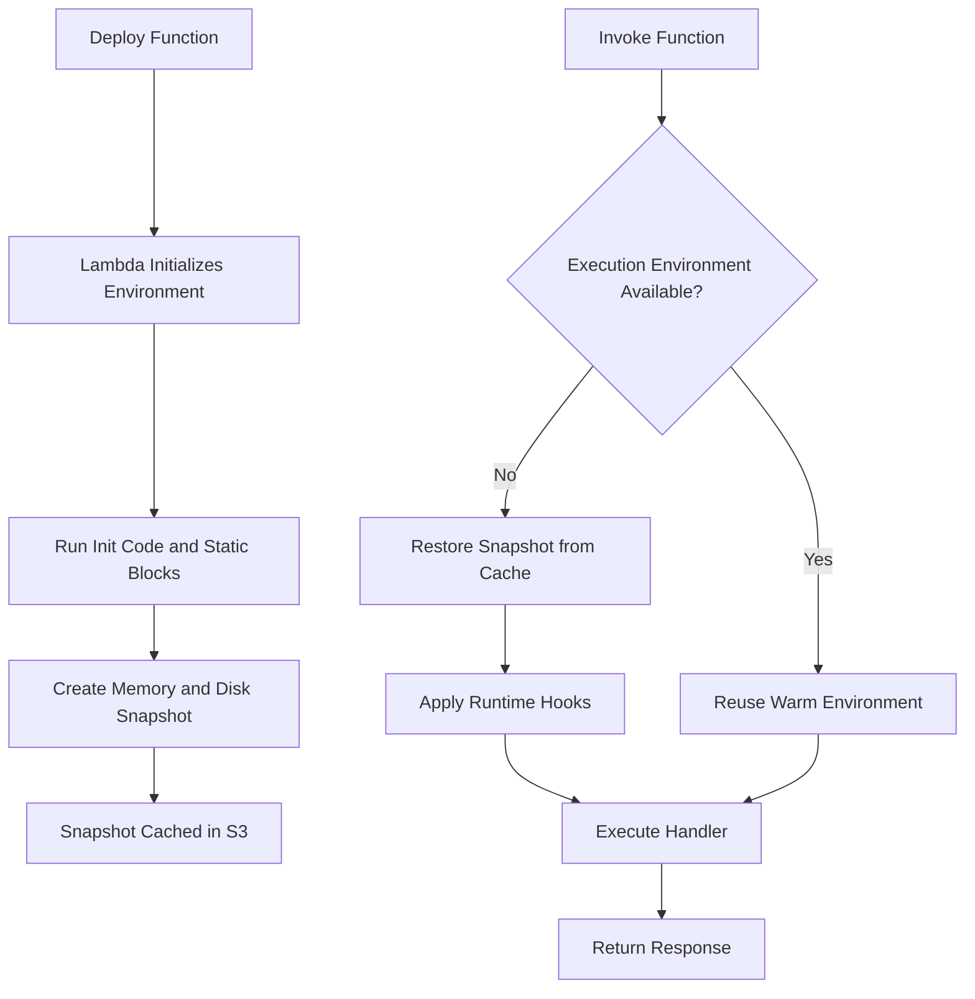
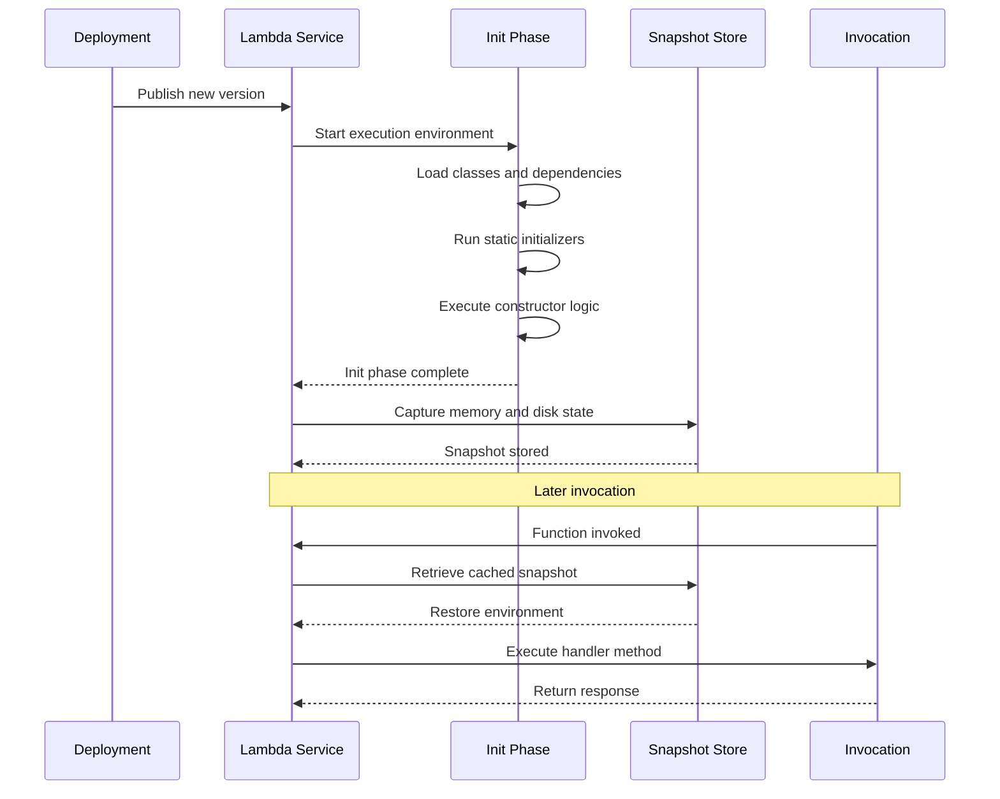

# How to Create AWS Lambda SnapStart

Author: [nawazdhandala](https://github.com/nawazdhandala)

Tags: AWS, Lambda, Serverless, Performance

Description: Eliminate cold starts in AWS Lambda functions using SnapStart to capture and restore initialization snapshots for near-instant invocations.

---

AWS Lambda cold starts have long been the Achilles heel of serverless architectures. When a function has not been invoked recently, Lambda must provision a new execution environment, download your code, and run initialization logic before handling the first request. For Java runtimes or functions with heavy dependencies, this delay can stretch into multiple seconds.

SnapStart changes the equation. Instead of repeating initialization on every cold start, Lambda takes a snapshot of the initialized execution environment and caches it. Subsequent cold starts restore from that snapshot, slashing startup latency by up to 90 percent.

---

## What Is SnapStart and Why It Matters

SnapStart is an AWS Lambda feature that snapshots the memory and disk state of your function after the initialization phase completes. When a new execution environment is needed, Lambda restores from that snapshot rather than running init code from scratch.

Key benefits:

- **Faster cold starts**: Initialization happens once at publish time, not at invocation time.
- **Consistent latency**: Users no longer experience the lottery of hitting a cold environment.
- **Lower total cost**: Reduced init time means less billed duration on first invocations.

SnapStart is available for Java 11, Java 17, Java 21, Python 3.12+, and .NET 8 runtimes.

---

## SnapStart Lifecycle

The following diagram shows how SnapStart changes the Lambda invocation flow:



With SnapStart enabled, the initialization phase (boxes B, C, D, E) happens at publish time. Cold invocations (box I) skip directly to snapshot restoration.

---

## Prerequisites and Configuration

Before enabling SnapStart, verify your function meets these requirements:

1. **Supported runtime**: Java 11, 17, or 21; Python 3.12+; or .NET 8.
2. **x86_64 architecture**: ARM64 (Graviton) is not supported yet.
3. **No provisioned concurrency**: SnapStart and provisioned concurrency are mutually exclusive.
4. **Ephemeral storage only**: Do not rely on EFS mounts during init.

### Enable SnapStart via AWS CLI

```bash
# Update function configuration to enable SnapStart
aws lambda update-function-configuration \
    --function-name my-function \
    --snap-start ApplyOn=PublishedVersions

# Publish a new version to trigger snapshot creation
aws lambda publish-version \
    --function-name my-function \
    --description "Enable SnapStart"
```

### Enable SnapStart via AWS SAM Template

```yaml
# template.yaml
AWSTemplateFormatVersion: '2010-09-09'
Transform: AWS::Serverless-2016-10-31

Resources:
  MyFunction:
    Type: AWS::Serverless::Function
    Properties:
      FunctionName: my-snapstart-function
      Runtime: java21
      Handler: com.example.Handler::handleRequest
      CodeUri: target/my-function.jar
      MemorySize: 512
      Timeout: 30
      # Enable SnapStart for published versions
      SnapStart:
        ApplyOn: PublishedVersions
      AutoPublishAlias: live
```

### Enable SnapStart via Terraform

```hcl
# main.tf
resource "aws_lambda_function" "my_function" {
  function_name = "my-snapstart-function"
  runtime       = "java21"
  handler       = "com.example.Handler::handleRequest"
  filename      = "target/my-function.jar"
  memory_size   = 512
  timeout       = 30
  role          = aws_iam_role.lambda_role.arn

  # Enable SnapStart
  snap_start {
    apply_on = "PublishedVersions"
  }
}

# Publish a version to trigger snapshot
resource "aws_lambda_alias" "live" {
  name             = "live"
  function_name    = aws_lambda_function.my_function.function_name
  function_version = aws_lambda_function.my_function.version
}
```

---

## How the Initialization Snapshot Works

Lambda creates the snapshot after your init code completes but before the first handler invocation. Understanding this boundary is critical for writing SnapStart-compatible code.



The snapshot captures:

- **Heap memory**: All objects created during initialization.
- **Disk state**: Files written to `/tmp` during init.
- **Loaded classes**: JVM class metadata and JIT-compiled code (for Java).

The snapshot does not capture:

- **Network connections**: TCP sockets, database pools, HTTP clients.
- **Thread state**: Background threads and timers.
- **Random number generator state**: Security-sensitive PRNG seeds.

---

## Runtime Hooks for Snapshot Restore

Because certain state should not be frozen in a snapshot, Lambda provides hooks to run code before snapshotting and after restoration.

### Java: CRaC (Coordinated Restore at Checkpoint)

Java SnapStart uses the CRaC API. Implement the `Resource` interface to hook into the lifecycle:

```java
package com.example;

import org.crac.Context;
import org.crac.Core;
import org.crac.Resource;
import java.sql.Connection;
import java.sql.DriverManager;

public class DatabaseClient implements Resource {

    private Connection connection;

    public DatabaseClient() {
        // Register this object for CRaC callbacks
        Core.getGlobalContext().register(this);
        initializeConnection();
    }

    private void initializeConnection() {
        // Create database connection
        // This runs during init AND after restore
        try {
            connection = DriverManager.getConnection(
                System.getenv("DB_URL"),
                System.getenv("DB_USER"),
                System.getenv("DB_PASSWORD")
            );
        } catch (Exception e) {
            throw new RuntimeException("Failed to connect to database", e);
        }
    }

    @Override
    public void beforeCheckpoint(Context<? extends Resource> context) {
        // Called before snapshot is taken
        // Close connections that should not be frozen
        try {
            if (connection != null && !connection.isClosed()) {
                connection.close();
                connection = null;
            }
        } catch (Exception e) {
            // Log but do not fail the checkpoint
            System.err.println("Error closing connection: " + e.getMessage());
        }
    }

    @Override
    public void afterRestore(Context<? extends Resource> context) {
        // Called after snapshot is restored
        // Recreate connections and refresh state
        initializeConnection();

        // Reseed random number generators
        // Refresh cached credentials
        // Restart background tasks
    }

    public Connection getConnection() {
        return connection;
    }
}
```

### Python: Runtime Hooks

Python 3.12+ SnapStart uses the `snapshot_restore` module:

```python
# handler.py
import os
import psycopg2
from snapshot_restore import register_before_snapshot, register_after_restore

# Global state that will be snapshotted
config = None
db_connection = None

def load_config():
    """Load configuration from environment or Parameter Store."""
    global config
    config = {
        "db_host": os.environ.get("DB_HOST"),
        "db_name": os.environ.get("DB_NAME"),
        "db_user": os.environ.get("DB_USER"),
        "db_password": os.environ.get("DB_PASSWORD"),
    }

def connect_database():
    """Establish database connection."""
    global db_connection
    db_connection = psycopg2.connect(
        host=config["db_host"],
        dbname=config["db_name"],
        user=config["db_user"],
        password=config["db_password"]
    )

@register_before_snapshot
def before_snapshot():
    """
    Called before Lambda takes the snapshot.
    Close connections and clear sensitive state.
    """
    global db_connection
    if db_connection:
        db_connection.close()
        db_connection = None
    print("Closed database connection before snapshot")

@register_after_restore
def after_restore():
    """
    Called after Lambda restores from snapshot.
    Reestablish connections and refresh state.
    """
    connect_database()
    print("Reestablished database connection after restore")

# Initialization code runs once at publish time
load_config()
connect_database()

def handler(event, context):
    """Lambda handler function."""
    # db_connection is available and fresh
    cursor = db_connection.cursor()
    cursor.execute("SELECT NOW()")
    result = cursor.fetchone()
    return {
        "statusCode": 200,
        "body": f"Current time: {result[0]}"
    }
```

---

## Best Practices for SnapStart Compatibility

### 1. Avoid Caching Time-Sensitive Data

Timestamps, tokens, and credentials captured in the snapshot will be stale when restored.

```java
// Bad: Token cached at snapshot time
public class TokenCache {
    private static final String TOKEN = fetchToken(); // Stale after restore
}

// Good: Refresh token after restore
public class TokenCache implements Resource {
    private String token;

    public TokenCache() {
        Core.getGlobalContext().register(this);
        refreshToken();
    }

    @Override
    public void afterRestore(Context<? extends Resource> context) {
        refreshToken(); // Get fresh token
    }

    private void refreshToken() {
        token = fetchToken();
    }
}
```

### 2. Use Uniqueness Hooks for Random State

Random number generators seeded during init will produce the same sequence across restored environments.

```python
# handler.py
import secrets
import random
from snapshot_restore import register_after_restore

# Global RNG initialized during init
rng = random.Random()

@register_after_restore
def reseed_rng():
    """Reseed RNG with fresh entropy after restore."""
    rng.seed(secrets.randbits(128))

def handler(event, context):
    # rng now produces unique sequences per restore
    return {"random_value": rng.randint(0, 1000000)}
```

### 3. Close Network Connections Before Snapshot

Open sockets cannot be serialized. Close them in `beforeCheckpoint` and reopen in `afterRestore`.

```java
// HttpClientWrapper.java
public class HttpClientWrapper implements Resource {

    private CloseableHttpClient httpClient;

    public HttpClientWrapper() {
        Core.getGlobalContext().register(this);
        createClient();
    }

    private void createClient() {
        httpClient = HttpClients.custom()
            .setConnectionManager(new PoolingHttpClientConnectionManager())
            .build();
    }

    @Override
    public void beforeCheckpoint(Context<? extends Resource> context) {
        try {
            httpClient.close();
        } catch (IOException e) {
            // Log error
        }
    }

    @Override
    public void afterRestore(Context<? extends Resource> context) {
        createClient(); // Fresh connection pool
    }
}
```

### 4. Prewarm Dependencies During Init

Move expensive operations to init so they are captured in the snapshot:

```java
// Handler.java
public class Handler implements RequestHandler<APIGatewayProxyRequestEvent, APIGatewayProxyResponseEvent> {

    // These run during init and are snapshotted
    private static final ObjectMapper MAPPER = new ObjectMapper();
    private static final Validator VALIDATOR = buildValidator();
    private static final Pattern REGEX = Pattern.compile("complex-pattern-here");

    static {
        // Force class loading during init
        MAPPER.writeValueAsString(Map.of("warmup", true));

        // Precompile templates
        TemplateEngine.compile("response-template");

        // Initialize SDK clients (they handle restore internally)
        DynamoDbClient.builder().build();
    }

    @Override
    public APIGatewayProxyResponseEvent handleRequest(
            APIGatewayProxyRequestEvent event,
            Context context) {
        // Handler code benefits from prewarmed state
        return processRequest(event);
    }
}
```

### 5. Test Locally with SnapStart Emulation

Use the AWS SAM CLI to test SnapStart behavior locally:

```bash
# Build the function
sam build

# Invoke with SnapStart simulation
sam local invoke MyFunction \
    --event event.json \
    --env-vars env.json

# Run integration tests
sam local start-api &
curl http://localhost:3000/endpoint
```

---

## Monitoring SnapStart Performance

Track these CloudWatch metrics to measure SnapStart effectiveness:

| Metric | Description |
|--------|-------------|
| `InitDuration` | Time spent in init phase (should be zero for restored environments) |
| `RestoreDuration` | Time to restore from snapshot |
| `Duration` | Handler execution time |
| `ConcurrentExecutions` | Number of active environments |

Create a CloudWatch dashboard to compare cold start performance:

```bash
# Query cold start durations before and after SnapStart
aws cloudwatch get-metric-statistics \
    --namespace AWS/Lambda \
    --metric-name InitDuration \
    --dimensions Name=FunctionName,Value=my-function \
    --start-time 2026-01-01T00:00:00Z \
    --end-time 2026-01-30T00:00:00Z \
    --period 86400 \
    --statistics Average Maximum
```

---

## Common Pitfalls and Troubleshooting

### Snapshot Creation Fails

If Lambda cannot create a snapshot, check for:

- **Unsupported native libraries**: Some JNI code is not checkpoint-safe.
- **Open file descriptors**: Close all files except `/tmp` writes.
- **Active threads**: Ensure no background threads are running.

```java
// Check for active threads before checkpoint
@Override
public void beforeCheckpoint(Context<? extends Resource> context) {
    Thread[] threads = new Thread[Thread.activeCount()];
    Thread.enumerate(threads);
    for (Thread t : threads) {
        if (t != null && t != Thread.currentThread()) {
            System.out.println("Warning: Active thread " + t.getName());
        }
    }
}
```

### Restored Environment Behaves Differently

If your function works during init but fails after restore:

1. **Check network connections**: They need to be reestablished.
2. **Verify credentials**: Tokens may have expired.
3. **Inspect cached state**: Timestamps and counters are frozen.

### SnapStart Not Reducing Latency

If restore times are still high:

- **Reduce snapshot size**: Minimize objects created during init.
- **Avoid `/tmp` writes**: Large files slow down restore.
- **Profile init code**: Use X-Ray to identify bottlenecks.

---

## Complete Example: Java API with SnapStart

Here is a full example of a SnapStart-optimized Java Lambda function:

```java
// pom.xml dependencies
/*
<dependencies>
    <dependency>
        <groupId>org.crac</groupId>
        <artifactId>crac</artifactId>
        <version>1.4.0</version>
    </dependency>
    <dependency>
        <groupId>software.amazon.awssdk</groupId>
        <artifactId>dynamodb</artifactId>
        <version>2.21.0</version>
    </dependency>
</dependencies>
*/

package com.example;

import com.amazonaws.services.lambda.runtime.Context;
import com.amazonaws.services.lambda.runtime.RequestHandler;
import com.amazonaws.services.lambda.runtime.events.APIGatewayProxyRequestEvent;
import com.amazonaws.services.lambda.runtime.events.APIGatewayProxyResponseEvent;
import org.crac.Core;
import org.crac.Resource;
import software.amazon.awssdk.services.dynamodb.DynamoDbClient;
import software.amazon.awssdk.services.dynamodb.model.GetItemRequest;
import software.amazon.awssdk.services.dynamodb.model.AttributeValue;

import java.util.Map;

public class ProductHandler implements RequestHandler<APIGatewayProxyRequestEvent, APIGatewayProxyResponseEvent> {

    // Static initialization captured in snapshot
    private static final DynamoDbClient dynamoClient;
    private static final String TABLE_NAME;

    static {
        // Initialize SDK client during init phase
        dynamoClient = DynamoDbClient.builder().build();
        TABLE_NAME = System.getenv("PRODUCTS_TABLE");

        // Prewarm the client by making a dummy request
        try {
            dynamoClient.describeTable(b -> b.tableName(TABLE_NAME));
        } catch (Exception e) {
            // Table access verified, ignore errors
        }

        // Register CRaC hook for connection management
        Core.getGlobalContext().register(new Resource() {
            @Override
            public void beforeCheckpoint(org.crac.Context<? extends Resource> context) {
                // DynamoDB client handles this internally
            }

            @Override
            public void afterRestore(org.crac.Context<? extends Resource> context) {
                // Refresh any cached credentials if needed
                System.out.println("Environment restored at " + System.currentTimeMillis());
            }
        });
    }

    @Override
    public APIGatewayProxyResponseEvent handleRequest(
            APIGatewayProxyRequestEvent event,
            Context context) {

        String productId = event.getPathParameters().get("id");

        // Query DynamoDB using prewarmed client
        GetItemRequest request = GetItemRequest.builder()
            .tableName(TABLE_NAME)
            .key(Map.of("productId", AttributeValue.builder().s(productId).build()))
            .build();

        Map<String, AttributeValue> item = dynamoClient.getItem(request).item();

        if (item == null || item.isEmpty()) {
            return new APIGatewayProxyResponseEvent()
                .withStatusCode(404)
                .withBody("{\"error\": \"Product not found\"}");
        }

        return new APIGatewayProxyResponseEvent()
            .withStatusCode(200)
            .withBody(formatProduct(item));
    }

    private String formatProduct(Map<String, AttributeValue> item) {
        return String.format(
            "{\"id\": \"%s\", \"name\": \"%s\", \"price\": %s}",
            item.get("productId").s(),
            item.get("name").s(),
            item.get("price").n()
        );
    }
}
```

---

## Summary

AWS Lambda SnapStart eliminates cold start latency by snapshotting the initialized execution environment. To use it effectively:

1. **Enable SnapStart** in your function configuration and publish a version.
2. **Implement runtime hooks** to close connections before snapshot and reopen after restore.
3. **Avoid freezing sensitive state** like credentials, timestamps, and random seeds.
4. **Prewarm dependencies** during initialization to maximize snapshot value.
5. **Monitor restore duration** in CloudWatch to verify performance gains.

With proper implementation, SnapStart can reduce cold start times from seconds to milliseconds, making Lambda viable for latency-sensitive workloads that previously required provisioned concurrency or alternative compute options.

---

**Related Reading:**

- [The Five Stages of SRE Maturity: From Chaos to Operational Excellence](https://oneuptime.com/blog/post/2025-09-01-the-five-stages-of-sre-maturity/view)
- [Why diversify away from AWS us-east-1](https://oneuptime.com/blog/post/2025-10-21-aws-us-east-1-region-of-last-resort/view)
- [Node.js Health Checks for Kubernetes](https://oneuptime.com/blog/post/2026-01-06-nodejs-health-checks-kubernetes/view)
