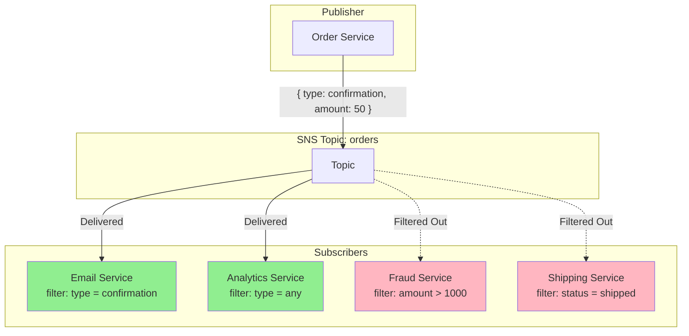
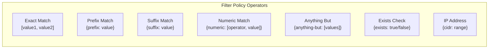
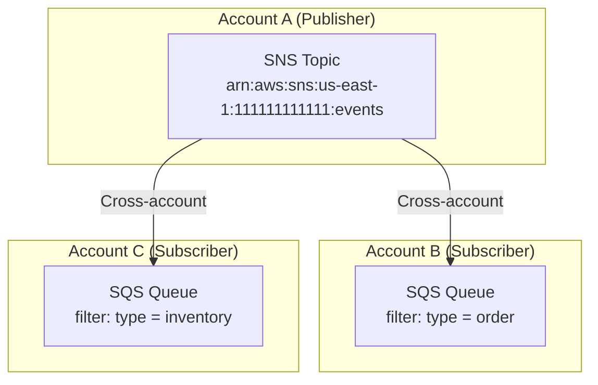

# How to Implement AWS SNS Message Filtering

Author: [nawazdhandala](https://github.com/nawazdhandala)

Tags: AWS, SNS, Messaging, Filtering

Description: Learn how to use AWS SNS filter policies to route messages to specific subscribers based on message attributes or payload content.

---

AWS SNS (Simple Notification Service) delivers messages to all subscribers by default. That creates noise. Subscribers receive messages they do not care about, wasting compute resources and adding complexity to message handling logic. Filter policies solve this by letting SNS route messages to only the subscribers that need them.

## How SNS Message Filtering Works

Without filtering, every message published to a topic goes to every subscriber. With filtering, SNS evaluates each message against subscriber filter policies and delivers only matching messages.



## Filter Policy Scope

SNS supports two filter policy scopes:

- **MessageAttributes** (default): Filters based on message attributes attached to the SNS message
- **MessageBody**: Filters based on the JSON content of the message body itself

### Attribute-Based Filtering

Message attributes are key-value pairs attached to SNS messages separately from the body. This is the traditional and most common approach.

```python
import boto3
import json

# Create SNS client
sns = boto3.client('sns', region_name='us-east-1')

# Publish message with attributes
response = sns.publish(
    TopicArn='arn:aws:sns:us-east-1:123456789012:orders',
    Message=json.dumps({
        'orderId': 'ORD-12345',
        'customerId': 'CUST-789',
        'items': ['item1', 'item2']
    }),
    # Message attributes for filtering
    MessageAttributes={
        'order_type': {
            'DataType': 'String',
            'StringValue': 'premium'
        },
        'order_amount': {
            'DataType': 'Number',
            'StringValue': '1500'  # Numbers are passed as strings
        },
        'region': {
            'DataType': 'String',
            'StringValue': 'us-west'
        }
    }
)

print(f"Message ID: {response['MessageId']}")
```

### Payload-Based Filtering

Payload filtering examines the JSON message body directly. This is useful when you cannot modify the publisher to add message attributes.

```python
import boto3
import json

sns = boto3.client('sns', region_name='us-east-1')

# Publish message - filter will examine this JSON body
message_body = {
    'orderId': 'ORD-12345',
    'orderType': 'premium',
    'amount': 1500,
    'customer': {
        'tier': 'gold',
        'region': 'us-west'
    }
}

response = sns.publish(
    TopicArn='arn:aws:sns:us-east-1:123456789012:orders',
    Message=json.dumps(message_body)
)

print(f"Message ID: {response['MessageId']}")
```

## Creating Filter Policies

Filter policies are JSON documents attached to subscriptions. They define which messages the subscriber should receive.

### Basic Filter Policy for Message Attributes

```python
import boto3
import json

sns = boto3.client('sns', region_name='us-east-1')

# Create subscription with attribute-based filter
response = sns.subscribe(
    TopicArn='arn:aws:sns:us-east-1:123456789012:orders',
    Protocol='sqs',
    Endpoint='arn:aws:sqs:us-east-1:123456789012:premium-orders',
    Attributes={
        # Filter on message attributes (default scope)
        'FilterPolicy': json.dumps({
            'order_type': ['premium']
        }),
        'FilterPolicyScope': 'MessageAttributes'
    }
)

print(f"Subscription ARN: {response['SubscriptionArn']}")
```

### Filter Policy for Message Body

```python
import boto3
import json

sns = boto3.client('sns', region_name='us-east-1')

# Create subscription with payload-based filter
response = sns.subscribe(
    TopicArn='arn:aws:sns:us-east-1:123456789012:orders',
    Protocol='sqs',
    Endpoint='arn:aws:sqs:us-east-1:123456789012:high-value-orders',
    Attributes={
        # Filter on message body content
        'FilterPolicy': json.dumps({
            'orderType': ['premium', 'enterprise'],
            'customer': {
                'tier': ['gold', 'platinum']
            }
        }),
        'FilterPolicyScope': 'MessageBody'
    }
)

print(f"Subscription ARN: {response['SubscriptionArn']}")
```

## Filter Policy Operators

SNS provides several operators for building complex filter conditions.



### Exact Match

Matches when the attribute value equals one of the specified values.

```json
{
  "order_type": ["premium", "enterprise"],
  "region": ["us-east", "us-west"]
}
```

### Prefix Match

Matches values that start with the specified prefix.

```json
{
  "order_id": [{"prefix": "ORD-"}],
  "customer_id": [{"prefix": "CUST-US-"}]
}
```

### Suffix Match

Matches values that end with the specified suffix.

```json
{
  "email": [{"suffix": "@company.com"}],
  "filename": [{"suffix": ".json"}]
}
```

### Numeric Operators

Compare numeric values using relational operators.

```json
{
  "order_amount": [{"numeric": [">=", 100, "<", 1000]}],
  "item_count": [{"numeric": [">", 0]}],
  "discount_percent": [{"numeric": ["=", 10]}]
}
```

Available numeric operators:
- `=` - equals
- `>` - greater than
- `>=` - greater than or equal
- `<` - less than
- `<=` - less than or equal

### Anything-But

Matches any value except the specified ones.

```json
{
  "status": [{"anything-but": ["cancelled", "failed"]}],
  "region": [{"anything-but": ["eu-west-1"]}]
}
```

### Exists

Checks whether an attribute exists or not.

```json
{
  "priority": [{"exists": true}],
  "test_flag": [{"exists": false}]
}
```

### IP Address (CIDR) Match

Matches IP addresses within a CIDR range. Only works with MessageBody scope.

```json
{
  "source_ip": [{"cidr": "10.0.0.0/8"}],
  "client_ip": [{"cidr": "192.168.1.0/24"}]
}
```

### Combining Operators with OR Logic

Values in an array use OR logic.

```json
{
  "order_type": [
    "premium",
    {"prefix": "enterprise-"},
    {"anything-but": ["test"]}
  ]
}
```

This matches: `premium` OR starts with `enterprise-` OR is not `test`.

### Combining Attributes with AND Logic

Multiple attributes use AND logic.

```json
{
  "order_type": ["premium"],
  "region": ["us-east"],
  "amount": [{"numeric": [">", 500]}]
}
```

This matches: order_type is `premium` AND region is `us-east` AND amount > 500.

## Nested Payload Filtering

For MessageBody scope, you can filter on nested JSON properties.

```python
import boto3
import json

sns = boto3.client('sns', region_name='us-east-1')

# Message with nested structure
message = {
    'order': {
        'id': 'ORD-12345',
        'type': 'premium',
        'shipping': {
            'method': 'express',
            'address': {
                'country': 'US',
                'state': 'CA'
            }
        }
    },
    'customer': {
        'tier': 'gold',
        'preferences': {
            'notifications': True
        }
    }
}

# Filter policy for nested properties
filter_policy = {
    'order': {
        'type': ['premium', 'enterprise'],
        'shipping': {
            'method': ['express'],
            'address': {
                'country': ['US', 'CA']
            }
        }
    },
    'customer': {
        'tier': [{'anything-but': ['basic']}]
    }
}

# Apply filter to subscription
sns.set_subscription_attributes(
    SubscriptionArn='arn:aws:sns:us-east-1:123456789012:orders:abc123',
    AttributeName='FilterPolicy',
    AttributeValue=json.dumps(filter_policy)
)

sns.set_subscription_attributes(
    SubscriptionArn='arn:aws:sns:us-east-1:123456789012:orders:abc123',
    AttributeName='FilterPolicyScope',
    AttributeValue='MessageBody'
)
```

## Cross-Account Subscription Filtering

SNS supports subscriptions from different AWS accounts. Filter policies work the same way across accounts.



### Step 1: Configure Topic Policy in Publisher Account

```python
import boto3
import json

sns = boto3.client('sns', region_name='us-east-1')

# Allow other accounts to subscribe
topic_policy = {
    'Version': '2012-10-17',
    'Statement': [
        {
            'Sid': 'AllowCrossAccountSubscription',
            'Effect': 'Allow',
            'Principal': {
                'AWS': [
                    'arn:aws:iam::222222222222:root',
                    'arn:aws:iam::333333333333:root'
                ]
            },
            'Action': [
                'sns:Subscribe',
                'sns:Receive'
            ],
            'Resource': 'arn:aws:sns:us-east-1:111111111111:events'
        }
    ]
}

sns.set_topic_attributes(
    TopicArn='arn:aws:sns:us-east-1:111111111111:events',
    AttributeName='Policy',
    AttributeValue=json.dumps(topic_policy)
)
```

### Step 2: Subscribe from Another Account with Filter

```python
import boto3
import json

# Run this in Account B (222222222222)
sns = boto3.client('sns', region_name='us-east-1')

# Subscribe to topic in Account A with filter policy
response = sns.subscribe(
    TopicArn='arn:aws:sns:us-east-1:111111111111:events',  # Account A topic
    Protocol='sqs',
    Endpoint='arn:aws:sqs:us-east-1:222222222222:my-queue',  # Account B queue
    Attributes={
        'FilterPolicy': json.dumps({
            'event_type': ['order_created', 'order_updated'],
            'priority': [{'numeric': ['>=', 5]}]
        }),
        'FilterPolicyScope': 'MessageAttributes'
    },
    ReturnSubscriptionArn=True
)

print(f"Subscription ARN: {response['SubscriptionArn']}")
```

### Step 3: Configure SQS Queue Policy

```python
import boto3
import json

# Run this in Account B (222222222222)
sqs = boto3.client('sqs', region_name='us-east-1')

# Allow SNS topic from Account A to send messages
queue_policy = {
    'Version': '2012-10-17',
    'Statement': [
        {
            'Sid': 'AllowSNSPublish',
            'Effect': 'Allow',
            'Principal': {
                'Service': 'sns.amazonaws.com'
            },
            'Action': 'sqs:SendMessage',
            'Resource': 'arn:aws:sqs:us-east-1:222222222222:my-queue',
            'Condition': {
                'ArnEquals': {
                    'aws:SourceArn': 'arn:aws:sns:us-east-1:111111111111:events'
                }
            }
        }
    ]
}

sqs.set_queue_attributes(
    QueueUrl='https://sqs.us-east-1.amazonaws.com/222222222222/my-queue',
    Attributes={
        'Policy': json.dumps(queue_policy)
    }
)
```

## Complete Example: Order Processing System

Here is a complete example showing how to set up an order processing system with filtered subscriptions.

```python
import boto3
import json
import time

# Initialize clients
sns = boto3.client('sns', region_name='us-east-1')
sqs = boto3.client('sqs', region_name='us-east-1')

# Create SNS topic
topic_response = sns.create_topic(Name='orders')
topic_arn = topic_response['TopicArn']
print(f"Created topic: {topic_arn}")

# Create SQS queues for different subscribers
queues = {}
for queue_name in ['premium-orders', 'high-value-orders', 'shipping-notifications', 'all-orders']:
    queue_response = sqs.create_queue(QueueName=queue_name)
    queues[queue_name] = {
        'url': queue_response['QueueUrl'],
        'arn': f"arn:aws:sqs:us-east-1:{boto3.client('sts').get_caller_identity()['Account']}:{queue_name}"
    }

    # Set queue policy to allow SNS
    policy = {
        'Version': '2012-10-17',
        'Statement': [{
            'Effect': 'Allow',
            'Principal': {'Service': 'sns.amazonaws.com'},
            'Action': 'sqs:SendMessage',
            'Resource': queues[queue_name]['arn'],
            'Condition': {'ArnEquals': {'aws:SourceArn': topic_arn}}
        }]
    }
    sqs.set_queue_attributes(
        QueueUrl=queues[queue_name]['url'],
        Attributes={'Policy': json.dumps(policy)}
    )

print("Created queues")

# Subscribe queues with different filter policies

# 1. Premium orders only
sns.subscribe(
    TopicArn=topic_arn,
    Protocol='sqs',
    Endpoint=queues['premium-orders']['arn'],
    Attributes={
        'FilterPolicy': json.dumps({
            'order_type': ['premium', 'enterprise']
        }),
        'FilterPolicyScope': 'MessageAttributes'
    }
)

# 2. High value orders (amount > 1000)
sns.subscribe(
    TopicArn=topic_arn,
    Protocol='sqs',
    Endpoint=queues['high-value-orders']['arn'],
    Attributes={
        'FilterPolicy': json.dumps({
            'amount': [{'numeric': ['>', 1000]}]
        }),
        'FilterPolicyScope': 'MessageAttributes'
    }
)

# 3. Shipping notifications only
sns.subscribe(
    TopicArn=topic_arn,
    Protocol='sqs',
    Endpoint=queues['shipping-notifications']['arn'],
    Attributes={
        'FilterPolicy': json.dumps({
            'event_type': [{'prefix': 'shipping_'}]
        }),
        'FilterPolicyScope': 'MessageAttributes'
    }
)

# 4. All orders (no filter)
sns.subscribe(
    TopicArn=topic_arn,
    Protocol='sqs',
    Endpoint=queues['all-orders']['arn']
)

print("Created subscriptions with filters")

# Wait for subscriptions to be ready
time.sleep(2)

# Publish test messages
messages = [
    {
        'body': {'orderId': 'ORD-001', 'items': ['item1']},
        'attributes': {
            'order_type': {'DataType': 'String', 'StringValue': 'standard'},
            'amount': {'DataType': 'Number', 'StringValue': '50'},
            'event_type': {'DataType': 'String', 'StringValue': 'order_created'}
        }
    },
    {
        'body': {'orderId': 'ORD-002', 'items': ['item2', 'item3']},
        'attributes': {
            'order_type': {'DataType': 'String', 'StringValue': 'premium'},
            'amount': {'DataType': 'Number', 'StringValue': '500'},
            'event_type': {'DataType': 'String', 'StringValue': 'order_created'}
        }
    },
    {
        'body': {'orderId': 'ORD-003', 'items': ['item4']},
        'attributes': {
            'order_type': {'DataType': 'String', 'StringValue': 'enterprise'},
            'amount': {'DataType': 'Number', 'StringValue': '5000'},
            'event_type': {'DataType': 'String', 'StringValue': 'order_created'}
        }
    },
    {
        'body': {'orderId': 'ORD-001', 'trackingNumber': 'TRK123'},
        'attributes': {
            'order_type': {'DataType': 'String', 'StringValue': 'standard'},
            'amount': {'DataType': 'Number', 'StringValue': '50'},
            'event_type': {'DataType': 'String', 'StringValue': 'shipping_dispatched'}
        }
    }
]

for msg in messages:
    response = sns.publish(
        TopicArn=topic_arn,
        Message=json.dumps(msg['body']),
        MessageAttributes=msg['attributes']
    )
    print(f"Published: {msg['body']['orderId']} - {msg['attributes']['event_type']['StringValue']}")

# Wait for messages to be delivered
time.sleep(2)

# Check what each queue received
print("\n--- Messages received by each queue ---")
for queue_name, queue_info in queues.items():
    response = sqs.receive_message(
        QueueUrl=queue_info['url'],
        MaxNumberOfMessages=10,
        WaitTimeSeconds=1
    )
    message_count = len(response.get('Messages', []))
    print(f"{queue_name}: {message_count} messages")
```

Expected output:
```
premium-orders: 2 messages (ORD-002 and ORD-003)
high-value-orders: 1 message (ORD-003)
shipping-notifications: 1 message (ORD-001 shipping)
all-orders: 4 messages (all messages)
```

## AWS CLI Examples

### Create Subscription with Filter Policy

```bash
# Create subscription with attribute-based filter
aws sns subscribe \
  --topic-arn arn:aws:sns:us-east-1:123456789012:orders \
  --protocol sqs \
  --notification-endpoint arn:aws:sqs:us-east-1:123456789012:premium-orders \
  --attributes '{
    "FilterPolicy": "{\"order_type\": [\"premium\"]}",
    "FilterPolicyScope": "MessageAttributes"
  }'
```

### Update Existing Subscription Filter

```bash
# Update filter policy on existing subscription
aws sns set-subscription-attributes \
  --subscription-arn arn:aws:sns:us-east-1:123456789012:orders:abc-123 \
  --attribute-name FilterPolicy \
  --attribute-value '{"order_type": ["premium", "enterprise"], "amount": [{"numeric": [">", 100]}]}'
```

### Get Current Filter Policy

```bash
# View subscription attributes including filter policy
aws sns get-subscription-attributes \
  --subscription-arn arn:aws:sns:us-east-1:123456789012:orders:abc-123
```

### Remove Filter Policy

```bash
# Remove filter policy (receive all messages)
aws sns set-subscription-attributes \
  --subscription-arn arn:aws:sns:us-east-1:123456789012:orders:abc-123 \
  --attribute-name FilterPolicy \
  --attribute-value '{}'
```

## Terraform Configuration

```hcl
# SNS Topic
resource "aws_sns_topic" "orders" {
  name = "orders"
}

# SQS Queue for premium orders
resource "aws_sqs_queue" "premium_orders" {
  name = "premium-orders"
}

# Queue policy to allow SNS
resource "aws_sqs_queue_policy" "premium_orders_policy" {
  queue_url = aws_sqs_queue.premium_orders.id

  policy = jsonencode({
    Version = "2012-10-17"
    Statement = [
      {
        Effect    = "Allow"
        Principal = { Service = "sns.amazonaws.com" }
        Action    = "sqs:SendMessage"
        Resource  = aws_sqs_queue.premium_orders.arn
        Condition = {
          ArnEquals = {
            "aws:SourceArn" = aws_sns_topic.orders.arn
          }
        }
      }
    ]
  })
}

# Subscription with filter policy
resource "aws_sns_topic_subscription" "premium_orders" {
  topic_arn = aws_sns_topic.orders.arn
  protocol  = "sqs"
  endpoint  = aws_sqs_queue.premium_orders.arn

  # Filter on message attributes
  filter_policy_scope = "MessageAttributes"
  filter_policy = jsonencode({
    order_type = ["premium", "enterprise"]
    amount     = [{ numeric = [">=", 500] }]
  })
}

# Subscription with payload-based filter
resource "aws_sns_topic_subscription" "high_value_orders" {
  topic_arn = aws_sns_topic.orders.arn
  protocol  = "sqs"
  endpoint  = aws_sqs_queue.high_value_orders.arn

  # Filter on message body
  filter_policy_scope = "MessageBody"
  filter_policy = jsonencode({
    order = {
      type   = ["premium"]
      amount = [{ numeric = [">", 1000] }]
    }
  })
}
```

## Best Practices

### 1. Use Attribute-Based Filtering When Possible

Attribute filtering is faster because SNS does not need to parse the message body. Add attributes at publish time.

### 2. Keep Filter Policies Simple

Complex nested filters are harder to debug. Break them into multiple subscriptions if needed.

### 3. Test Filter Policies Before Production

Create a test subscription and verify messages are routed correctly.

```python
# Create a test queue to verify filtering
test_queue = sqs.create_queue(QueueName='filter-test-queue')

# Subscribe with proposed filter
sns.subscribe(
    TopicArn=topic_arn,
    Protocol='sqs',
    Endpoint=test_queue_arn,
    Attributes={
        'FilterPolicy': json.dumps(proposed_filter)
    }
)

# Publish test messages and verify behavior
```

### 4. Monitor Filtered Message Metrics

Use CloudWatch metrics to track filtering behavior:

- `NumberOfMessagesPublished` - Total messages published
- `NumberOfNotificationsDelivered` - Messages that passed filters
- `NumberOfNotificationsFilteredOut` - Messages blocked by filters

### 5. Document Your Filter Policies

Keep filter policies in version control with your infrastructure code. Add comments explaining the business logic.

---

SNS message filtering reduces noise and cost by delivering messages only to subscribers that need them. Start with attribute-based filtering for performance, use payload filtering when you cannot modify publishers, and always test your filter policies before deploying to production.
