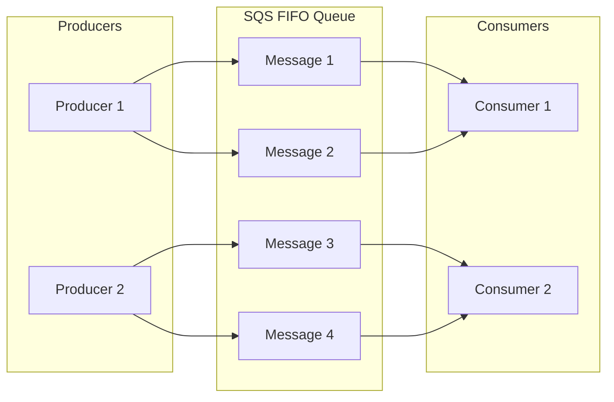
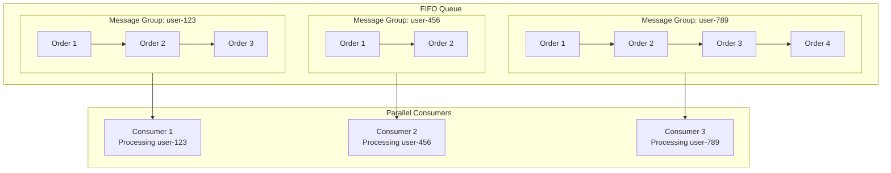
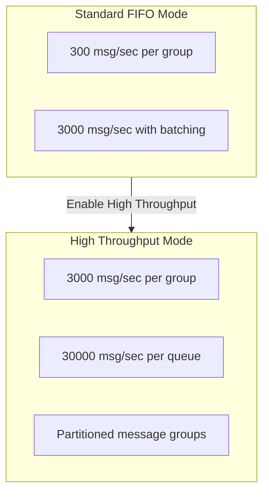
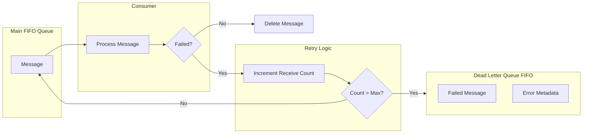

# How to Build AWS SQS FIFO Advanced

Author: [nawazdhandala](https://github.com/nawazdhandala)

Tags: AWS, SQS, Messaging, FIFO

Description: Master ordered message processing with AWS SQS FIFO queues using message groups, deduplication, high throughput mode, and dead letter queue integration.

---

Standard SQS queues deliver messages at least once but do not guarantee order. When your application requires strict ordering and exactly-once processing, SQS FIFO queues are the solution. This guide covers advanced patterns for building reliable, ordered message processing systems.

## Understanding FIFO Queue Fundamentals

FIFO (First-In-First-Out) queues guarantee that messages are processed exactly once, in the exact order they were sent. This is critical for applications like financial transactions, inventory updates, and event sourcing.



### Key FIFO Characteristics

- **Exactly-once processing**: Duplicates are automatically removed
- **Ordered delivery**: Messages arrive in the order they were sent
- **Queue name must end with .fifo**: For example, `orders-queue.fifo`
- **Default throughput**: 300 messages per second (or 3000 with batching)

## Creating a FIFO Queue with AWS SDK

Here is how to create a FIFO queue programmatically with all essential configurations.

```javascript
// createFifoQueue.js
// Creates an SQS FIFO queue with content-based deduplication enabled

import { SQSClient, CreateQueueCommand } from "@aws-sdk/client-sqs";

const sqsClient = new SQSClient({ region: "us-east-1" });

async function createFifoQueue(queueName) {
  // FIFO queue names must end with .fifo
  const fifoQueueName = queueName.endsWith(".fifo")
    ? queueName
    : `${queueName}.fifo`;

  const params = {
    QueueName: fifoQueueName,
    Attributes: {
      // Enable FIFO queue behavior
      FifoQueue: "true",

      // Use message body hash for deduplication instead of explicit IDs
      ContentBasedDeduplication: "true",

      // Message retention period in seconds (4 days)
      MessageRetentionPeriod: "345600",

      // Visibility timeout in seconds
      VisibilityTimeout: "60",

      // Maximum message size in bytes (256 KB)
      MaximumMessageSize: "262144",

      // Long polling wait time in seconds
      ReceiveMessageWaitTimeSeconds: "20",
    },
  };

  try {
    const command = new CreateQueueCommand(params);
    const response = await sqsClient.send(command);
    console.log("FIFO queue created:", response.QueueUrl);
    return response.QueueUrl;
  } catch (error) {
    console.error("Failed to create queue:", error);
    throw error;
  }
}

// Usage
createFifoQueue("order-processing");
```

## Message Group IDs: Parallel Processing with Order

Message Group IDs are the secret to scaling FIFO queues. Messages within the same group are processed in order, but different groups can be processed in parallel.



### Implementing Message Group IDs

```javascript
// sendOrderMessage.js
// Sends order messages using customer ID as the message group

import { SQSClient, SendMessageCommand } from "@aws-sdk/client-sqs";

const sqsClient = new SQSClient({ region: "us-east-1" });

async function sendOrderMessage(queueUrl, order) {
  const params = {
    QueueUrl: queueUrl,
    MessageBody: JSON.stringify(order),

    // Use customer ID as message group to maintain order per customer
    // All orders for the same customer will be processed in sequence
    MessageGroupId: order.customerId,

    // Unique identifier for deduplication (required if ContentBasedDeduplication is false)
    MessageDeduplicationId: `${order.customerId}-${order.orderId}-${Date.now()}`,

    // Optional: Add message attributes for filtering or routing
    MessageAttributes: {
      OrderType: {
        DataType: "String",
        StringValue: order.type,
      },
      Priority: {
        DataType: "Number",
        StringValue: String(order.priority || 1),
      },
    },
  };

  try {
    const command = new SendMessageCommand(params);
    const response = await sqsClient.send(command);
    console.log("Message sent:", {
      messageId: response.MessageId,
      sequenceNumber: response.SequenceNumber,
    });
    return response;
  } catch (error) {
    console.error("Failed to send message:", error);
    throw error;
  }
}

// Example: Send multiple orders for different customers
async function processOrders() {
  const queueUrl = "https://sqs.us-east-1.amazonaws.com/123456789/orders.fifo";

  const orders = [
    { customerId: "cust-001", orderId: "ord-101", type: "purchase", amount: 99.99 },
    { customerId: "cust-002", orderId: "ord-102", type: "purchase", amount: 149.99 },
    { customerId: "cust-001", orderId: "ord-103", type: "refund", amount: 50.00 },
    { customerId: "cust-001", orderId: "ord-104", type: "purchase", amount: 200.00 },
  ];

  // Orders for cust-001 will be processed in order: ord-101, ord-103, ord-104
  // Orders for cust-002 can be processed in parallel
  for (const order of orders) {
    await sendOrderMessage(queueUrl, order);
  }
}
```

## Deduplication Strategies

FIFO queues prevent duplicate messages within a 5-minute deduplication interval. You have two strategies to choose from.

### Strategy 1: Content-Based Deduplication

The queue generates a hash of the message body to detect duplicates.

```javascript
// contentBasedDedup.js
// Using content-based deduplication - same message body = duplicate

import { SQSClient, SendMessageCommand } from "@aws-sdk/client-sqs";

const sqsClient = new SQSClient({ region: "us-east-1" });

async function sendWithContentDedup(queueUrl, eventData) {
  // With ContentBasedDeduplication enabled on the queue,
  // identical message bodies are automatically deduplicated
  const params = {
    QueueUrl: queueUrl,
    MessageBody: JSON.stringify(eventData),
    MessageGroupId: eventData.entityId,
    // No MessageDeduplicationId needed - SQS computes it from body hash
  };

  const command = new SendMessageCommand(params);
  return sqsClient.send(command);
}

// Warning: If you need to send the same content twice intentionally,
// add a timestamp or unique field to the message body
async function sendUniqueMessage(queueUrl, eventData) {
  const params = {
    QueueUrl: queueUrl,
    MessageBody: JSON.stringify({
      ...eventData,
      timestamp: Date.now(),  // Ensures unique hash
      eventId: crypto.randomUUID(),
    }),
    MessageGroupId: eventData.entityId,
  };

  const command = new SendMessageCommand(params);
  return sqsClient.send(command);
}
```

### Strategy 2: Explicit Deduplication ID

You provide a unique identifier for each message.

```javascript
// explicitDedup.js
// Using explicit deduplication IDs for fine-grained control

import { SQSClient, SendMessageCommand } from "@aws-sdk/client-sqs";

const sqsClient = new SQSClient({ region: "us-east-1" });

async function sendWithExplicitDedup(queueUrl, payment) {
  // Generate a deterministic deduplication ID based on business logic
  // Same ID within 5 minutes = duplicate (rejected)
  const deduplicationId = `payment-${payment.transactionId}`;

  const params = {
    QueueUrl: queueUrl,
    MessageBody: JSON.stringify(payment),
    MessageGroupId: payment.accountId,
    MessageDeduplicationId: deduplicationId,
  };

  try {
    const command = new SendMessageCommand(params);
    const response = await sqsClient.send(command);
    return { success: true, messageId: response.MessageId };
  } catch (error) {
    if (error.name === "MessageDeduplicationIdNotProvided") {
      console.error("Queue requires explicit deduplication ID");
    }
    throw error;
  }
}

// Idempotent retry pattern - same transaction ID produces same dedup ID
async function processPaymentWithRetry(queueUrl, payment, maxRetries = 3) {
  for (let attempt = 1; attempt <= maxRetries; attempt++) {
    try {
      return await sendWithExplicitDedup(queueUrl, payment);
    } catch (error) {
      if (attempt === maxRetries) throw error;
      // Safe to retry - deduplication prevents double processing
      await new Promise(resolve => setTimeout(resolve, 1000 * attempt));
    }
  }
}
```

## High Throughput Mode

Standard FIFO queues support 300 messages per second per message group. High throughput mode increases this to 3000 messages per second per message group and up to 30000 messages per second per queue.



### Enabling High Throughput Mode

```javascript
// enableHighThroughput.js
// Configures a FIFO queue for high throughput mode

import { SQSClient, SetQueueAttributesCommand, CreateQueueCommand } from "@aws-sdk/client-sqs";

const sqsClient = new SQSClient({ region: "us-east-1" });

// Create a new queue with high throughput enabled
async function createHighThroughputQueue(queueName) {
  const params = {
    QueueName: `${queueName}.fifo`,
    Attributes: {
      FifoQueue: "true",
      ContentBasedDeduplication: "true",
      // Enable high throughput mode
      DeduplicationScope: "messageGroup",  // Required for high throughput
      FifoThroughputLimit: "perMessageGroupId",  // Enables per-group scaling
    },
  };

  const command = new CreateQueueCommand(params);
  return sqsClient.send(command);
}

// Update an existing queue to high throughput mode
async function enableHighThroughput(queueUrl) {
  const params = {
    QueueUrl: queueUrl,
    Attributes: {
      // Both attributes must be set together
      DeduplicationScope: "messageGroup",
      FifoThroughputLimit: "perMessageGroupId",
    },
  };

  const command = new SetQueueAttributesCommand(params);
  return sqsClient.send(command);
}

// Note: High throughput mode changes deduplication behavior
// Deduplication now happens within message groups, not across the entire queue
```

### Batch Sending for Maximum Throughput

```javascript
// batchSend.js
// Send up to 10 messages in a single API call for better throughput

import { SQSClient, SendMessageBatchCommand } from "@aws-sdk/client-sqs";

const sqsClient = new SQSClient({ region: "us-east-1" });

async function sendBatch(queueUrl, messages) {
  // Batch can contain up to 10 messages
  // Total batch size must not exceed 256 KB
  const entries = messages.map((msg, index) => ({
    Id: `msg-${index}`,  // Unique within batch
    MessageBody: JSON.stringify(msg.body),
    MessageGroupId: msg.groupId,
    MessageDeduplicationId: msg.deduplicationId,
  }));

  const params = {
    QueueUrl: queueUrl,
    Entries: entries,
  };

  try {
    const command = new SendMessageBatchCommand(params);
    const response = await sqsClient.send(command);

    // Check for partial failures
    if (response.Failed && response.Failed.length > 0) {
      console.error("Some messages failed:", response.Failed);
      // Implement retry logic for failed messages
    }

    return {
      successful: response.Successful,
      failed: response.Failed,
    };
  } catch (error) {
    console.error("Batch send failed:", error);
    throw error;
  }
}

// Chunk large message arrays into batches of 10
async function sendAllMessages(queueUrl, messages) {
  const batchSize = 10;
  const results = [];

  for (let i = 0; i < messages.length; i += batchSize) {
    const batch = messages.slice(i, i + batchSize);
    const result = await sendBatch(queueUrl, batch);
    results.push(result);
  }

  return results;
}
```

## Dead Letter Queue Integration

Dead letter queues (DLQ) capture messages that fail processing repeatedly. For FIFO queues, the DLQ must also be a FIFO queue.



### Setting Up a Dead Letter Queue

```javascript
// setupDLQ.js
// Creates main queue and dead letter queue with redrive policy

import {
  SQSClient,
  CreateQueueCommand,
  GetQueueAttributesCommand,
  SetQueueAttributesCommand
} from "@aws-sdk/client-sqs";

const sqsClient = new SQSClient({ region: "us-east-1" });

async function setupQueuesWithDLQ(baseName) {
  // Step 1: Create the dead letter queue first
  const dlqName = `${baseName}-dlq.fifo`;
  const dlqCommand = new CreateQueueCommand({
    QueueName: dlqName,
    Attributes: {
      FifoQueue: "true",
      ContentBasedDeduplication: "true",
      MessageRetentionPeriod: "1209600",  // 14 days for investigation
    },
  });

  const dlqResponse = await sqsClient.send(dlqCommand);
  const dlqUrl = dlqResponse.QueueUrl;

  // Step 2: Get the DLQ ARN
  const arnCommand = new GetQueueAttributesCommand({
    QueueUrl: dlqUrl,
    AttributeNames: ["QueueArn"],
  });
  const arnResponse = await sqsClient.send(arnCommand);
  const dlqArn = arnResponse.Attributes.QueueArn;

  // Step 3: Create the main queue with redrive policy
  const mainQueueCommand = new CreateQueueCommand({
    QueueName: `${baseName}.fifo`,
    Attributes: {
      FifoQueue: "true",
      ContentBasedDeduplication: "true",
      VisibilityTimeout: "60",
      // Redrive policy: send to DLQ after 3 failed attempts
      RedrivePolicy: JSON.stringify({
        deadLetterTargetArn: dlqArn,
        maxReceiveCount: 3,  // Number of receive attempts before DLQ
      }),
    },
  });

  const mainResponse = await sqsClient.send(mainQueueCommand);

  return {
    mainQueueUrl: mainResponse.QueueUrl,
    dlqUrl: dlqUrl,
    dlqArn: dlqArn,
  };
}

// Process messages from DLQ for investigation or replay
async function processDLQMessages(dlqUrl, handler) {
  const { SQSClient, ReceiveMessageCommand, DeleteMessageCommand } = await import("@aws-sdk/client-sqs");
  const sqsClient = new SQSClient({ region: "us-east-1" });

  const receiveCommand = new ReceiveMessageCommand({
    QueueUrl: dlqUrl,
    MaxNumberOfMessages: 10,
    WaitTimeSeconds: 20,
    AttributeNames: ["All"],
    MessageAttributeNames: ["All"],
  });

  const response = await sqsClient.send(receiveCommand);

  for (const message of response.Messages || []) {
    try {
      // Log failed message for analysis
      console.log("DLQ Message:", {
        body: message.Body,
        receiveCount: message.Attributes.ApproximateReceiveCount,
        firstReceived: message.Attributes.ApproximateFirstReceiveTimestamp,
        messageGroupId: message.Attributes.MessageGroupId,
      });

      // Optional: attempt to reprocess or archive
      await handler(message);

      // Delete from DLQ after handling
      await sqsClient.send(new DeleteMessageCommand({
        QueueUrl: dlqUrl,
        ReceiptHandle: message.ReceiptHandle,
      }));
    } catch (error) {
      console.error("Failed to process DLQ message:", error);
    }
  }
}
```

## Complete Consumer Implementation

Here is a production-ready consumer that handles FIFO message processing with proper error handling and visibility timeout management.

```javascript
// consumer.js
// Production FIFO queue consumer with graceful shutdown and error handling

import {
  SQSClient,
  ReceiveMessageCommand,
  DeleteMessageCommand,
  ChangeMessageVisibilityCommand
} from "@aws-sdk/client-sqs";

const sqsClient = new SQSClient({ region: "us-east-1" });

class FifoConsumer {
  constructor(queueUrl, options = {}) {
    this.queueUrl = queueUrl;
    this.isRunning = false;
    this.visibilityTimeout = options.visibilityTimeout || 60;
    this.waitTimeSeconds = options.waitTimeSeconds || 20;
    this.maxMessages = options.maxMessages || 10;
  }

  async start(messageHandler) {
    this.isRunning = true;
    console.log("Consumer started for queue:", this.queueUrl);

    while (this.isRunning) {
      try {
        await this.pollMessages(messageHandler);
      } catch (error) {
        console.error("Polling error:", error);
        // Brief pause before retry on error
        await this.sleep(5000);
      }
    }
  }

  async pollMessages(messageHandler) {
    const command = new ReceiveMessageCommand({
      QueueUrl: this.queueUrl,
      MaxNumberOfMessages: this.maxMessages,
      WaitTimeSeconds: this.waitTimeSeconds,
      VisibilityTimeout: this.visibilityTimeout,
      AttributeNames: ["All"],
      MessageAttributeNames: ["All"],
    });

    const response = await sqsClient.send(command);
    const messages = response.Messages || [];

    // Process messages sequentially within each message group
    // Messages from different groups can be processed in parallel
    const messagesByGroup = this.groupMessages(messages);

    const processingPromises = Object.entries(messagesByGroup).map(
      ([groupId, groupMessages]) =>
        this.processMessageGroup(groupId, groupMessages, messageHandler)
    );

    await Promise.all(processingPromises);
  }

  groupMessages(messages) {
    return messages.reduce((groups, message) => {
      const groupId = message.Attributes.MessageGroupId;
      if (!groups[groupId]) {
        groups[groupId] = [];
      }
      groups[groupId].push(message);
      return groups;
    }, {});
  }

  async processMessageGroup(groupId, messages, handler) {
    // Process messages in order within the group
    for (const message of messages) {
      try {
        // Parse message body
        const body = JSON.parse(message.Body);

        // Start heartbeat to extend visibility for long-running tasks
        const heartbeat = this.startHeartbeat(message.ReceiptHandle);

        // Process the message
        await handler(body, {
          messageId: message.MessageId,
          groupId: groupId,
          sequenceNumber: message.Attributes.SequenceNumber,
          receiveCount: parseInt(message.Attributes.ApproximateReceiveCount),
        });

        // Stop heartbeat and delete message on success
        heartbeat.stop();
        await this.deleteMessage(message.ReceiptHandle);

      } catch (error) {
        console.error(`Failed to process message in group ${groupId}:`, error);
        // Message will return to queue after visibility timeout
        // and potentially move to DLQ after max receive count
      }
    }
  }

  startHeartbeat(receiptHandle) {
    // Extend visibility timeout periodically for long-running tasks
    const intervalMs = (this.visibilityTimeout / 2) * 1000;
    let isActive = true;

    const interval = setInterval(async () => {
      if (!isActive) return;

      try {
        const command = new ChangeMessageVisibilityCommand({
          QueueUrl: this.queueUrl,
          ReceiptHandle: receiptHandle,
          VisibilityTimeout: this.visibilityTimeout,
        });
        await sqsClient.send(command);
      } catch (error) {
        console.error("Failed to extend visibility:", error);
      }
    }, intervalMs);

    return {
      stop: () => {
        isActive = false;
        clearInterval(interval);
      },
    };
  }

  async deleteMessage(receiptHandle) {
    const command = new DeleteMessageCommand({
      QueueUrl: this.queueUrl,
      ReceiptHandle: receiptHandle,
    });
    await sqsClient.send(command);
  }

  stop() {
    this.isRunning = false;
    console.log("Consumer stopping...");
  }

  sleep(ms) {
    return new Promise(resolve => setTimeout(resolve, ms));
  }
}

// Usage example
async function main() {
  const queueUrl = "https://sqs.us-east-1.amazonaws.com/123456789/orders.fifo";

  const consumer = new FifoConsumer(queueUrl, {
    visibilityTimeout: 120,  // 2 minutes for processing
    maxMessages: 10,
  });

  // Handle graceful shutdown
  process.on("SIGTERM", () => consumer.stop());
  process.on("SIGINT", () => consumer.stop());

  // Start consuming messages
  await consumer.start(async (message, metadata) => {
    console.log(`Processing order ${message.orderId} from group ${metadata.groupId}`);

    // Your business logic here
    await processOrder(message);

    console.log(`Completed order ${message.orderId}`);
  });
}

async function processOrder(order) {
  // Simulate processing time
  await new Promise(resolve => setTimeout(resolve, 1000));
  console.log("Order processed:", order);
}

main().catch(console.error);
```

## Infrastructure as Code with Terraform

```hcl
# main.tf
# Terraform configuration for FIFO queue with DLQ

resource "aws_sqs_queue" "orders_dlq" {
  name                        = "orders-dlq.fifo"
  fifo_queue                  = true
  content_based_deduplication = true
  message_retention_seconds   = 1209600  # 14 days

  tags = {
    Environment = "production"
    Purpose     = "dead-letter-queue"
  }
}

resource "aws_sqs_queue" "orders" {
  name                        = "orders.fifo"
  fifo_queue                  = true
  content_based_deduplication = true
  visibility_timeout_seconds  = 120
  message_retention_seconds   = 345600  # 4 days
  receive_wait_time_seconds   = 20

  # High throughput mode
  deduplication_scope   = "messageGroup"
  fifo_throughput_limit = "perMessageGroupId"

  # Dead letter queue configuration
  redrive_policy = jsonencode({
    deadLetterTargetArn = aws_sqs_queue.orders_dlq.arn
    maxReceiveCount     = 3
  })

  tags = {
    Environment = "production"
    Purpose     = "order-processing"
  }
}

# IAM policy for queue access
resource "aws_iam_policy" "sqs_access" {
  name        = "orders-queue-access"
  description = "Allow access to orders FIFO queue"

  policy = jsonencode({
    Version = "2012-10-17"
    Statement = [
      {
        Effect = "Allow"
        Action = [
          "sqs:SendMessage",
          "sqs:ReceiveMessage",
          "sqs:DeleteMessage",
          "sqs:ChangeMessageVisibility",
          "sqs:GetQueueAttributes",
          "sqs:GetQueueUrl"
        ]
        Resource = [
          aws_sqs_queue.orders.arn,
          aws_sqs_queue.orders_dlq.arn
        ]
      }
    ]
  })
}

output "queue_url" {
  value = aws_sqs_queue.orders.url
}

output "dlq_url" {
  value = aws_sqs_queue.orders_dlq.url
}
```

## Monitoring and Observability

Track these CloudWatch metrics for FIFO queue health:

| Metric | Description | Alert Threshold |
|--------|-------------|-----------------|
| ApproximateNumberOfMessagesVisible | Messages waiting to be processed | > 1000 for 5 min |
| ApproximateAgeOfOldestMessage | Age of oldest unprocessed message | > 300 seconds |
| NumberOfMessagesSent | Messages sent per period | Baseline variance |
| NumberOfMessagesDeleted | Messages successfully processed | Should match sent |
| ApproximateNumberOfMessagesNotVisible | Messages being processed | High = slow consumers |

### CloudWatch Alarm Configuration

```javascript
// createAlarms.js
// Sets up CloudWatch alarms for FIFO queue monitoring

import {
  CloudWatchClient,
  PutMetricAlarmCommand
} from "@aws-sdk/client-cloudwatch";

const cloudwatch = new CloudWatchClient({ region: "us-east-1" });

async function createQueueAlarms(queueName, snsTopicArn) {
  const alarms = [
    {
      AlarmName: `${queueName}-message-backlog`,
      MetricName: "ApproximateNumberOfMessagesVisible",
      Threshold: 1000,
      ComparisonOperator: "GreaterThanThreshold",
      EvaluationPeriods: 2,
      Period: 300,
      Statistic: "Average",
      AlarmDescription: "Message backlog exceeds threshold",
    },
    {
      AlarmName: `${queueName}-old-messages`,
      MetricName: "ApproximateAgeOfOldestMessage",
      Threshold: 300,
      ComparisonOperator: "GreaterThanThreshold",
      EvaluationPeriods: 1,
      Period: 60,
      Statistic: "Maximum",
      AlarmDescription: "Messages are not being processed quickly enough",
    },
    {
      AlarmName: `${queueName}-dlq-messages`,
      MetricName: "ApproximateNumberOfMessagesVisible",
      Threshold: 1,
      ComparisonOperator: "GreaterThanOrEqualToThreshold",
      EvaluationPeriods: 1,
      Period: 60,
      Statistic: "Sum",
      AlarmDescription: "Messages appearing in dead letter queue",
      // Override queue name for DLQ
      queueNameOverride: `${queueName}-dlq`,
    },
  ];

  for (const alarm of alarms) {
    const command = new PutMetricAlarmCommand({
      AlarmName: alarm.AlarmName,
      AlarmDescription: alarm.AlarmDescription,
      MetricName: alarm.MetricName,
      Namespace: "AWS/SQS",
      Dimensions: [
        {
          Name: "QueueName",
          Value: alarm.queueNameOverride || `${queueName}.fifo`,
        },
      ],
      Threshold: alarm.Threshold,
      ComparisonOperator: alarm.ComparisonOperator,
      EvaluationPeriods: alarm.EvaluationPeriods,
      Period: alarm.Period,
      Statistic: alarm.Statistic,
      AlarmActions: [snsTopicArn],
      OKActions: [snsTopicArn],
    });

    await cloudwatch.send(command);
    console.log(`Created alarm: ${alarm.AlarmName}`);
  }
}
```

## Best Practices Summary

1. **Choose message group IDs wisely**: Use natural business identifiers like customer ID, order ID, or account ID. Too few groups limits parallelism; too many reduces ordering benefits.

2. **Set appropriate visibility timeouts**: The timeout should be longer than your maximum expected processing time. Use heartbeats for variable-length processing.

3. **Implement idempotent consumers**: Even with exactly-once delivery, design your processors to handle duplicates safely in case of partial failures.

4. **Monitor DLQ actively**: Messages in the DLQ indicate processing failures. Set up alerts and investigate promptly.

5. **Use batching for throughput**: Send and receive messages in batches of 10 to maximize throughput and reduce API costs.

6. **Enable high throughput mode**: For workloads exceeding 300 messages per second per group, enable high throughput mode with per-message-group limits.

7. **Plan for message retention**: Default is 4 days. Increase for systems that may have extended outages.

---

FIFO queues provide the ordered, exactly-once processing guarantees that critical business workflows require. By leveraging message groups for parallelism, implementing proper deduplication, and integrating dead letter queues for failure handling, you can build reliable message processing systems that scale with your application.
