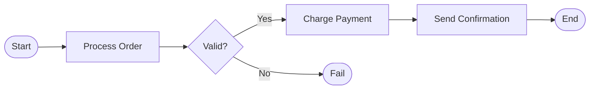
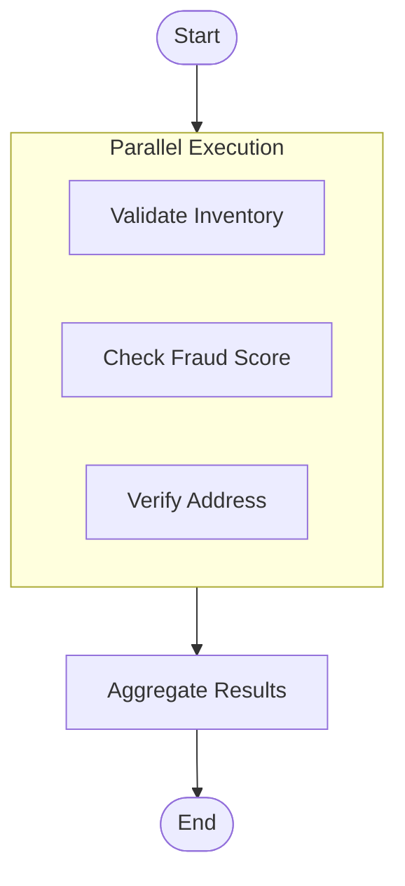
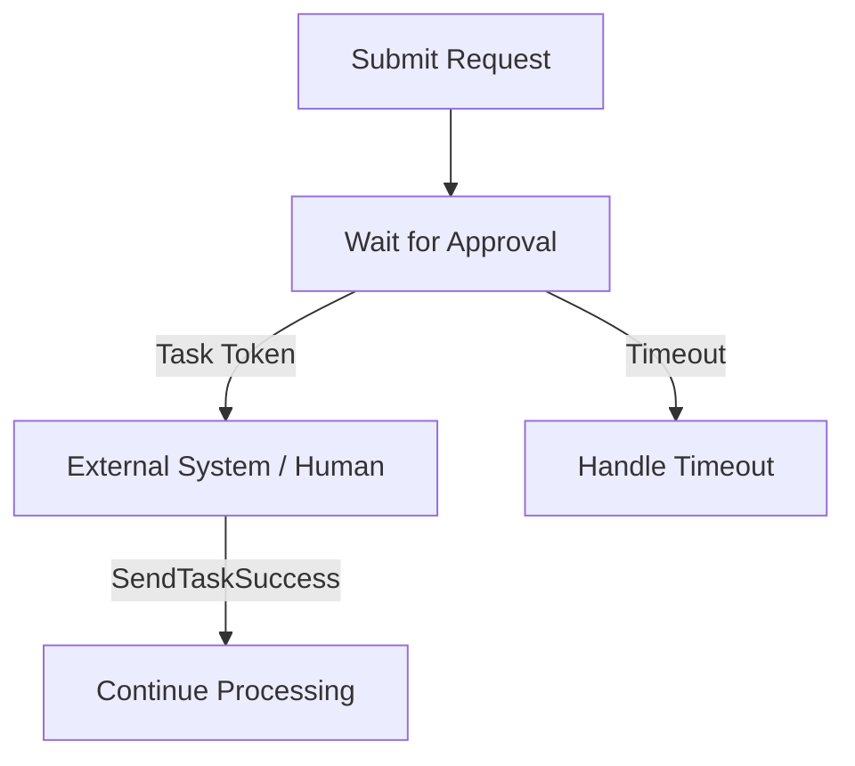
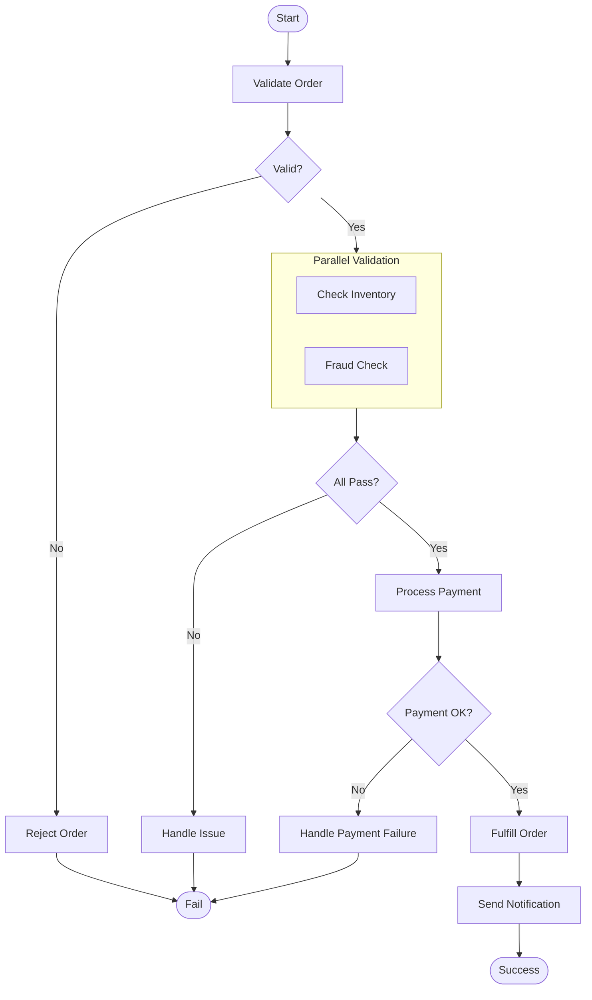

# How to Implement AWS Step Functions Best Practices

Author: [nawazdhandala](https://github.com/nawazdhandala)

Tags: AWS, Step Functions, Orchestration, Serverless

Description: A practical guide to building reliable, maintainable, and cost-effective workflows with AWS Step Functions using proven patterns for error handling, retries, parallel execution, and callbacks.

---

Step Functions is AWS's workflow orchestration service. It coordinates Lambda functions, ECS tasks, API Gateway calls, and dozens of other AWS services into state machines defined with Amazon States Language (ASL). Done right, it replaces fragile chains of event triggers with explicit, observable workflows. Done wrong, it becomes expensive spaghetti that is impossible to debug.

## What Are Step Functions?



Step Functions execute state machines. Each state performs work (Task), makes decisions (Choice), waits (Wait), runs states in parallel (Parallel), iterates over arrays (Map), or handles success/failure (Succeed/Fail). The service tracks execution history, handles retries, and provides built-in observability.

Two execution types exist:
- **Standard**: Exactly-once execution, up to one year duration, full execution history, priced per state transition
- **Express**: At-least-once execution, up to five minutes duration, no persistent history, priced per execution and duration

Pick Standard for long-running business processes. Pick Express for high-volume, short-lived workloads like API backends or stream processing.

## Structure Your State Machines for Maintainability

### Keep States Focused

Each state should do one thing. If a Lambda function handles validation, transformation, and database writes, split it into three states. This makes retries granular and debugging straightforward.

```json
{
  "Comment": "Order processing workflow",
  "StartAt": "ValidateOrder",
  "States": {
    "ValidateOrder": {
      "Type": "Task",
      "Resource": "arn:aws:lambda:us-east-1:123456789:function:validate-order",
      "Next": "TransformOrder"
    },
    "TransformOrder": {
      "Type": "Task",
      "Resource": "arn:aws:lambda:us-east-1:123456789:function:transform-order",
      "Next": "SaveOrder"
    },
    "SaveOrder": {
      "Type": "Task",
      "Resource": "arn:aws:states:::dynamodb:putItem",
      "Parameters": {
        "TableName": "Orders",
        "Item": {
          "orderId": {"S.$": "$.orderId"},
          "status": {"S": "pending"},
          "data": {"S.$": "States.JsonToString($.orderData)"}
        }
      },
      "Next": "Success"
    },
    "Success": {
      "Type": "Succeed"
    }
  }
}
```

### Use Meaningful State Names

State names appear in logs, metrics, and the visual workflow editor. Names like `State1` or `ProcessData` tell you nothing. Use `ValidateCustomerAddress` or `ChargePaymentMethod` instead.

### Pass Only Necessary Data Between States

Step Functions charge per state transition, and payloads have a 256 KB limit. Use `InputPath`, `Parameters`, `ResultPath`, and `OutputPath` to filter data.

```json
{
  "ProcessPayment": {
    "Type": "Task",
    "Resource": "arn:aws:lambda:us-east-1:123456789:function:process-payment",
    "InputPath": "$.payment",
    "ResultPath": "$.paymentResult",
    "OutputPath": "$",
    "Next": "SendReceipt"
  }
}
```

The `InputPath` selects which part of the input goes to the task. The `ResultPath` decides where to place the task output within the original input. The `OutputPath` filters what moves to the next state.

## Error Handling That Actually Works

### Define Explicit Catchers

Every Task state should handle errors. The `Catch` field lets you route specific error types to recovery states.

```json
{
  "ChargeCustomer": {
    "Type": "Task",
    "Resource": "arn:aws:lambda:us-east-1:123456789:function:charge-customer",
    "Catch": [
      {
        "ErrorEquals": ["PaymentDeclined"],
        "ResultPath": "$.error",
        "Next": "NotifyPaymentFailed"
      },
      {
        "ErrorEquals": ["States.Timeout"],
        "ResultPath": "$.error",
        "Next": "RetryPaymentLater"
      },
      {
        "ErrorEquals": ["States.ALL"],
        "ResultPath": "$.error",
        "Next": "HandleUnexpectedError"
      }
    ],
    "Next": "SendConfirmation"
  }
}
```

Order matters. Step Functions evaluates catchers top to bottom and uses the first match. Always put specific errors before `States.ALL`.

### Built-in Error Types

Step Functions defines several error types:
- `States.ALL`: Catches everything
- `States.Timeout`: Task exceeded `TimeoutSeconds`
- `States.TaskFailed`: Task reported failure
- `States.Permissions`: Insufficient IAM permissions
- `States.ResultPathMatchFailure`: ResultPath could not be applied
- `States.ParameterPathFailure`: Parameter path reference failed
- `States.BranchFailed`: Parallel or Map branch failed
- `States.NoChoiceMatched`: Choice state had no matching rule
- `States.IntrinsicFailure`: Intrinsic function call failed

Custom errors come from your Lambda functions. Throw errors with specific names to enable precise handling:

```javascript
// In your Lambda function
class PaymentDeclined extends Error {
  constructor(message) {
    super(message);
    this.name = 'PaymentDeclined';
  }
}

throw new PaymentDeclined('Card declined by issuer');
```

## Retry Logic That Prevents Cascading Failures

### Configure Retries Per State

The `Retry` field defines automatic retry behavior. Configure it for transient failures like network timeouts or rate limits.

```json
{
  "CallExternalAPI": {
    "Type": "Task",
    "Resource": "arn:aws:lambda:us-east-1:123456789:function:call-api",
    "Retry": [
      {
        "ErrorEquals": ["Lambda.ServiceException", "Lambda.TooManyRequestsException"],
        "IntervalSeconds": 2,
        "MaxAttempts": 6,
        "BackoffRate": 2,
        "JitterStrategy": "FULL"
      },
      {
        "ErrorEquals": ["RateLimitExceeded"],
        "IntervalSeconds": 60,
        "MaxAttempts": 3,
        "BackoffRate": 1
      }
    ],
    "Catch": [
      {
        "ErrorEquals": ["States.ALL"],
        "Next": "HandleAPIFailure"
      }
    ],
    "Next": "ProcessResponse"
  }
}
```

Key retry parameters:
- `IntervalSeconds`: Initial wait between retries
- `MaxAttempts`: Total retry count (0 means no retries)
- `BackoffRate`: Multiplier for each subsequent retry interval
- `JitterStrategy`: `FULL` adds randomness to prevent thundering herd, `NONE` uses exact intervals

With `IntervalSeconds: 2`, `MaxAttempts: 6`, and `BackoffRate: 2`, retries happen at approximately 2, 4, 8, 16, 32 seconds (plus jitter).

### Do Not Retry Business Logic Failures

Retrying a validation failure or a business rule violation wastes money and delays the inevitable. Only retry transient infrastructure errors.

```json
{
  "Retry": [
    {
      "ErrorEquals": ["ValidationError", "BusinessRuleViolation"],
      "MaxAttempts": 0
    },
    {
      "ErrorEquals": ["States.ALL"],
      "IntervalSeconds": 1,
      "MaxAttempts": 3,
      "BackoffRate": 2
    }
  ]
}
```

## Parallel Execution for Performance

### Use Parallel State for Independent Tasks

When tasks do not depend on each other, run them simultaneously with the Parallel state.



```json
{
  "ValidateOrderParallel": {
    "Type": "Parallel",
    "Branches": [
      {
        "StartAt": "ValidateInventory",
        "States": {
          "ValidateInventory": {
            "Type": "Task",
            "Resource": "arn:aws:lambda:us-east-1:123456789:function:validate-inventory",
            "End": true
          }
        }
      },
      {
        "StartAt": "CheckFraudScore",
        "States": {
          "CheckFraudScore": {
            "Type": "Task",
            "Resource": "arn:aws:lambda:us-east-1:123456789:function:check-fraud",
            "End": true
          }
        }
      },
      {
        "StartAt": "VerifyAddress",
        "States": {
          "VerifyAddress": {
            "Type": "Task",
            "Resource": "arn:aws:lambda:us-east-1:123456789:function:verify-address",
            "End": true
          }
        }
      }
    ],
    "ResultPath": "$.validationResults",
    "Next": "ProcessValidationResults"
  }
}
```

Parallel outputs an array with each branch's result in order. If any branch fails, the entire Parallel state fails (unless you catch the error).

### Use Map State for Dynamic Parallelism

When you need to process a list of items, the Map state iterates over an array and runs the same workflow for each element.

```json
{
  "ProcessLineItems": {
    "Type": "Map",
    "ItemsPath": "$.order.lineItems",
    "ItemSelector": {
      "item.$": "$$.Map.Item.Value",
      "orderId.$": "$.orderId"
    },
    "MaxConcurrency": 10,
    "ItemProcessor": {
      "ProcessorConfig": {
        "Mode": "INLINE"
      },
      "StartAt": "ReserveItem",
      "States": {
        "ReserveItem": {
          "Type": "Task",
          "Resource": "arn:aws:lambda:us-east-1:123456789:function:reserve-item",
          "End": true
        }
      }
    },
    "ResultPath": "$.reservationResults",
    "Next": "ConfirmReservations"
  }
}
```

`MaxConcurrency` limits simultaneous executions. Set it to prevent overwhelming downstream services. Use `0` for unlimited concurrency (dangerous for production).

For large datasets, use `DISTRIBUTED` mode instead of `INLINE`. Distributed Map can process millions of items using S3 as input and output, with child executions running in parallel.

```json
{
  "ProcessLargeDataset": {
    "Type": "Map",
    "ItemReader": {
      "Resource": "arn:aws:states:::s3:getObject",
      "ReaderConfig": {
        "InputType": "JSON"
      },
      "Parameters": {
        "Bucket": "my-bucket",
        "Key": "input/items.json"
      }
    },
    "ItemProcessor": {
      "ProcessorConfig": {
        "Mode": "DISTRIBUTED",
        "ExecutionType": "EXPRESS"
      },
      "StartAt": "ProcessItem",
      "States": {
        "ProcessItem": {
          "Type": "Task",
          "Resource": "arn:aws:lambda:us-east-1:123456789:function:process-item",
          "End": true
        }
      }
    },
    "MaxConcurrency": 1000,
    "ResultWriter": {
      "Resource": "arn:aws:states:::s3:putObject",
      "Parameters": {
        "Bucket": "my-bucket",
        "Prefix": "output/results"
      }
    },
    "Next": "Done"
  }
}
```

## Callbacks for Long-Running Operations

### Wait for Human Approval

Some workflows need external input. Use the callback pattern with task tokens.



```json
{
  "WaitForApproval": {
    "Type": "Task",
    "Resource": "arn:aws:states:::lambda:invoke.waitForTaskToken",
    "Parameters": {
      "FunctionName": "send-approval-request",
      "Payload": {
        "executionId.$": "$$.Execution.Id",
        "taskToken.$": "$$.Task.Token",
        "requestDetails.$": "$.request"
      }
    },
    "TimeoutSeconds": 86400,
    "Catch": [
      {
        "ErrorEquals": ["States.Timeout"],
        "Next": "ApprovalTimedOut"
      }
    ],
    "Next": "ProcessApprovedRequest"
  }
}
```

The Lambda function sends the task token to an external system (email, Slack, approval UI). When approved, that system calls Step Functions with the token:

```javascript
const { SFNClient, SendTaskSuccessCommand } = require('@aws-sdk/client-sfn');

const sfn = new SFNClient({});

async function approveRequest(taskToken, result) {
  await sfn.send(new SendTaskSuccessCommand({
    taskToken: taskToken,
    output: JSON.stringify(result)
  }));
}

async function rejectRequest(taskToken, error) {
  await sfn.send(new SendTaskFailureCommand({
    taskToken: taskToken,
    error: 'RequestRejected',
    cause: error
  }));
}
```

### Integrate with SQS for Async Processing

For message-based workflows, Step Functions can send to SQS and wait for a callback.

```json
{
  "SendToProcessingQueue": {
    "Type": "Task",
    "Resource": "arn:aws:states:::sqs:sendMessage.waitForTaskToken",
    "Parameters": {
      "QueueUrl": "https://sqs.us-east-1.amazonaws.com/123456789/processing-queue",
      "MessageBody": {
        "taskToken.$": "$$.Task.Token",
        "data.$": "$.processingData"
      }
    },
    "TimeoutSeconds": 3600,
    "Next": "HandleProcessingResult"
  }
}
```

The consumer processes the message and calls `SendTaskSuccess` or `SendTaskFailure` with the token.

## Direct Service Integrations

### Skip Lambda When Possible

Step Functions can call 220+ AWS services directly. Skipping Lambda reduces latency, cost, and code to maintain.

```json
{
  "WriteToS3": {
    "Type": "Task",
    "Resource": "arn:aws:states:::s3:putObject",
    "Parameters": {
      "Bucket": "my-bucket",
      "Key.$": "States.Format('reports/{}/report.json', $.reportId)",
      "Body.$": "States.JsonToString($.reportData)"
    },
    "Next": "NotifyComplete"
  },
  "QueryDynamoDB": {
    "Type": "Task",
    "Resource": "arn:aws:states:::dynamodb:getItem",
    "Parameters": {
      "TableName": "Users",
      "Key": {
        "userId": {"S.$": "$.userId"}
      }
    },
    "ResultPath": "$.user",
    "Next": "ProcessUser"
  },
  "PublishToSNS": {
    "Type": "Task",
    "Resource": "arn:aws:states:::sns:publish",
    "Parameters": {
      "TopicArn": "arn:aws:sns:us-east-1:123456789:notifications",
      "Message.$": "States.JsonToString($.notification)"
    },
    "Next": "Done"
  }
}
```

### Use Intrinsic Functions for Data Transformation

Step Functions provides intrinsic functions for common transformations without Lambda.

```json
{
  "TransformData": {
    "Type": "Pass",
    "Parameters": {
      "formattedDate.$": "States.Format('{}-{}-{}', $.year, $.month, $.day)",
      "itemCount.$": "States.ArrayLength($.items)",
      "uniqueId.$": "States.UUID()",
      "encodedData.$": "States.Base64Encode($.rawData)",
      "mergedObject.$": "States.JsonMerge($.defaults, $.overrides, false)",
      "partitionedArray.$": "States.ArrayPartition($.items, 10)"
    },
    "Next": "ProcessTransformedData"
  }
}
```

Available intrinsic functions:
- `States.Format`: String formatting
- `States.StringToJson` / `States.JsonToString`: JSON conversion
- `States.Array`: Create array from arguments
- `States.ArrayPartition`: Split array into chunks
- `States.ArrayContains` / `States.ArrayLength` / `States.ArrayRange`
- `States.Base64Encode` / `States.Base64Decode`
- `States.Hash`: Generate hash (MD5, SHA-1, SHA-256, SHA-384, SHA-512)
- `States.JsonMerge`: Merge JSON objects
- `States.MathRandom` / `States.MathAdd`: Numeric operations
- `States.StringSplit`: Split string into array
- `States.UUID`: Generate UUID

## Cost Optimization

### Standard vs Express: Choose Wisely

Standard workflows cost $0.025 per 1,000 state transitions. Express workflows cost $1.00 per million requests plus $0.00001667 per GB-second of duration.

For a workflow with 10 states running 1 million times:
- **Standard**: 10 million transitions = $250
- **Express (100ms avg, 1KB payload)**: 1M requests ($1) + duration (~$0.17) = ~$1.17

Express is dramatically cheaper for high-volume, short workflows. But Express has no execution history, so debugging production issues requires external logging.

### Reduce State Transitions

Fewer states means lower costs. Combine closely related operations when they do not need independent retry logic.

Before (5 transitions):
```json
{
  "GetUser": { "Type": "Task", "Next": "GetOrders" },
  "GetOrders": { "Type": "Task", "Next": "GetPayments" },
  "GetPayments": { "Type": "Task", "Next": "FormatResponse" },
  "FormatResponse": { "Type": "Task", "Next": "Done" },
  "Done": { "Type": "Succeed" }
}
```

After (3 transitions):
```json
{
  "FetchUserData": {
    "Type": "Parallel",
    "Branches": [
      { "StartAt": "GetUser", "States": { "GetUser": { "Type": "Task", "End": true } } },
      { "StartAt": "GetOrders", "States": { "GetOrders": { "Type": "Task", "End": true } } },
      { "StartAt": "GetPayments", "States": { "GetPayments": { "Type": "Task", "End": true } } }
    ],
    "Next": "FormatAndRespond"
  },
  "FormatAndRespond": { "Type": "Task", "Next": "Done" },
  "Done": { "Type": "Succeed" }
}
```

## Observability and Debugging

### Enable X-Ray Tracing

Step Functions integrates with X-Ray for distributed tracing across services.

```yaml
# SAM template
StepFunction:
  Type: AWS::Serverless::StateMachine
  Properties:
    DefinitionUri: statemachine.asl.json
    Tracing:
      Enabled: true
```

### Log to CloudWatch

For Express workflows (which lack execution history), enable CloudWatch Logs.

```yaml
StepFunction:
  Type: AWS::Serverless::StateMachine
  Properties:
    Type: EXPRESS
    Logging:
      Level: ALL
      IncludeExecutionData: true
      Destinations:
        - CloudWatchLogsLogGroup:
            LogGroupArn: !GetAtt StepFunctionLogGroup.Arn
```

Log levels:
- `OFF`: No logging
- `ALL`: Log all events
- `ERROR`: Log only errors
- `FATAL`: Log only fatal errors

### Set Up CloudWatch Alarms

Monitor execution metrics:

```yaml
ExecutionFailedAlarm:
  Type: AWS::CloudWatch::Alarm
  Properties:
    AlarmName: StepFunction-ExecutionsFailed
    MetricName: ExecutionsFailed
    Namespace: AWS/States
    Statistic: Sum
    Period: 300
    EvaluationPeriods: 1
    Threshold: 1
    ComparisonOperator: GreaterThanOrEqualToThreshold
    Dimensions:
      - Name: StateMachineArn
        Value: !Ref MyStateMachine
    AlarmActions:
      - !Ref AlertTopic
```

Key metrics to monitor:
- `ExecutionsFailed`: Workflows that failed
- `ExecutionsTimedOut`: Workflows that exceeded timeout
- `ExecutionThrottled`: Workflows throttled due to limits
- `ExecutionTime`: Duration of completed executions

## Complete Example: Order Processing Workflow



```json
{
  "Comment": "Production-ready order processing workflow",
  "StartAt": "ValidateOrder",
  "States": {
    "ValidateOrder": {
      "Type": "Task",
      "Resource": "arn:aws:lambda:us-east-1:123456789:function:validate-order",
      "Retry": [
        {
          "ErrorEquals": ["Lambda.ServiceException"],
          "IntervalSeconds": 2,
          "MaxAttempts": 3,
          "BackoffRate": 2
        }
      ],
      "Catch": [
        {
          "ErrorEquals": ["ValidationError"],
          "ResultPath": "$.error",
          "Next": "RejectOrder"
        },
        {
          "ErrorEquals": ["States.ALL"],
          "ResultPath": "$.error",
          "Next": "HandleUnexpectedError"
        }
      ],
      "Next": "ParallelValidation"
    },
    "ParallelValidation": {
      "Type": "Parallel",
      "Branches": [
        {
          "StartAt": "CheckInventory",
          "States": {
            "CheckInventory": {
              "Type": "Task",
              "Resource": "arn:aws:lambda:us-east-1:123456789:function:check-inventory",
              "Retry": [
                {
                  "ErrorEquals": ["States.ALL"],
                  "IntervalSeconds": 1,
                  "MaxAttempts": 3,
                  "BackoffRate": 2
                }
              ],
              "End": true
            }
          }
        },
        {
          "StartAt": "FraudCheck",
          "States": {
            "FraudCheck": {
              "Type": "Task",
              "Resource": "arn:aws:lambda:us-east-1:123456789:function:fraud-check",
              "Retry": [
                {
                  "ErrorEquals": ["States.ALL"],
                  "IntervalSeconds": 1,
                  "MaxAttempts": 3,
                  "BackoffRate": 2
                }
              ],
              "End": true
            }
          }
        }
      ],
      "ResultPath": "$.validationResults",
      "Catch": [
        {
          "ErrorEquals": ["States.ALL"],
          "ResultPath": "$.error",
          "Next": "HandleValidationFailure"
        }
      ],
      "Next": "EvaluateValidation"
    },
    "EvaluateValidation": {
      "Type": "Choice",
      "Choices": [
        {
          "And": [
            {
              "Variable": "$.validationResults[0].inventoryAvailable",
              "BooleanEquals": true
            },
            {
              "Variable": "$.validationResults[1].fraudScore",
              "NumericLessThan": 70
            }
          ],
          "Next": "ProcessPayment"
        }
      ],
      "Default": "HandleValidationFailure"
    },
    "ProcessPayment": {
      "Type": "Task",
      "Resource": "arn:aws:lambda:us-east-1:123456789:function:process-payment",
      "Retry": [
        {
          "ErrorEquals": ["PaymentGatewayTimeout"],
          "IntervalSeconds": 5,
          "MaxAttempts": 3,
          "BackoffRate": 2,
          "JitterStrategy": "FULL"
        }
      ],
      "Catch": [
        {
          "ErrorEquals": ["PaymentDeclined"],
          "ResultPath": "$.error",
          "Next": "HandlePaymentFailure"
        },
        {
          "ErrorEquals": ["States.ALL"],
          "ResultPath": "$.error",
          "Next": "HandleUnexpectedError"
        }
      ],
      "Next": "FulfillOrder"
    },
    "FulfillOrder": {
      "Type": "Task",
      "Resource": "arn:aws:states:::dynamodb:updateItem",
      "Parameters": {
        "TableName": "Orders",
        "Key": {
          "orderId": {"S.$": "$.orderId"}
        },
        "UpdateExpression": "SET orderStatus = :status, fulfilledAt = :time",
        "ExpressionAttributeValues": {
          ":status": {"S": "fulfilled"},
          ":time": {"S.$": "$$.State.EnteredTime"}
        }
      },
      "Retry": [
        {
          "ErrorEquals": ["States.ALL"],
          "IntervalSeconds": 1,
          "MaxAttempts": 3,
          "BackoffRate": 2
        }
      ],
      "Next": "SendConfirmation"
    },
    "SendConfirmation": {
      "Type": "Task",
      "Resource": "arn:aws:states:::sns:publish",
      "Parameters": {
        "TopicArn": "arn:aws:sns:us-east-1:123456789:order-notifications",
        "Message.$": "States.Format('Order {} has been fulfilled', $.orderId)",
        "MessageAttributes": {
          "orderId": {
            "DataType": "String",
            "StringValue.$": "$.orderId"
          }
        }
      },
      "Next": "OrderComplete"
    },
    "OrderComplete": {
      "Type": "Succeed"
    },
    "RejectOrder": {
      "Type": "Task",
      "Resource": "arn:aws:states:::sns:publish",
      "Parameters": {
        "TopicArn": "arn:aws:sns:us-east-1:123456789:order-notifications",
        "Message.$": "States.Format('Order {} rejected: {}', $.orderId, $.error.Cause)"
      },
      "Next": "OrderFailed"
    },
    "HandleValidationFailure": {
      "Type": "Pass",
      "Result": "Validation checks failed",
      "ResultPath": "$.failureReason",
      "Next": "OrderFailed"
    },
    "HandlePaymentFailure": {
      "Type": "Pass",
      "Result": "Payment processing failed",
      "ResultPath": "$.failureReason",
      "Next": "OrderFailed"
    },
    "HandleUnexpectedError": {
      "Type": "Pass",
      "Result": "Unexpected error occurred",
      "ResultPath": "$.failureReason",
      "Next": "OrderFailed"
    },
    "OrderFailed": {
      "Type": "Fail",
      "Error": "OrderProcessingFailed",
      "Cause.$": "$.failureReason"
    }
  }
}
```

## Summary

Building reliable Step Functions workflows comes down to these practices:

1. **Keep states focused** on single responsibilities for granular retries and clear debugging
2. **Handle errors explicitly** with specific catchers before the catch-all
3. **Configure retries** for transient failures only, with exponential backoff and jitter
4. **Use Parallel and Map** to improve throughput when operations are independent
5. **Prefer direct service integrations** over Lambda when possible
6. **Choose the right execution type** based on duration, volume, and debugging needs
7. **Monitor everything** with X-Ray, CloudWatch Logs, and alarms on key metrics

Step Functions moves orchestration logic out of your application code and into a managed service with built-in observability. The upfront investment in proper error handling and retry configuration pays off when you can trace exactly what happened in any failed execution without adding print statements to Lambda functions.
