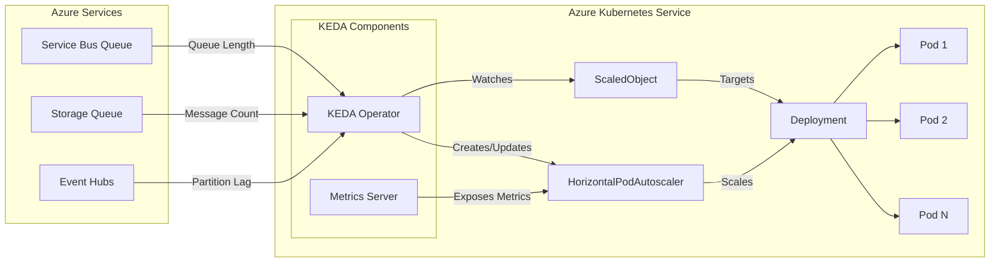

# How to Build Azure AKS KEDA Integration

Author: [nawazdhandala](https://github.com/nawazdhandala)

Tags: Azure, AKS, KEDA, Autoscaling

Description: Deploy KEDA on Azure Kubernetes Service to enable event-driven autoscaling using Azure Service Bus, Storage Queues, and Workload Identity.

---

The Horizontal Pod Autoscaler works well for CPU and memory, but modern applications often need to scale based on external event sources like message queues, databases, or custom metrics. KEDA (Kubernetes Event-driven Autoscaling) bridges this gap by allowing Pods to scale from zero to N based on event triggers.

## How KEDA Works

KEDA extends Kubernetes with custom resources that watch external event sources and drive the HPA accordingly. Here is the architecture:



The KEDA operator watches ScaledObject resources and creates corresponding HPAs. It polls external sources for metrics and feeds them to the Kubernetes metrics pipeline.

## 1. Install KEDA on AKS

You can install KEDA using the AKS add-on (managed by Azure) or Helm (self-managed). The add-on is simpler but offers less customization.

### Option A: AKS KEDA Add-on (Recommended)

This approach lets Azure manage KEDA upgrades and ensures compatibility with your AKS version.

```bash
# Enable the KEDA add-on on an existing AKS cluster
az aks update \
  --resource-group myResourceGroup \
  --name myAKSCluster \
  --enable-keda

# Verify KEDA pods are running in kube-system namespace
kubectl get pods -n kube-system -l app=keda
```

### Option B: Helm Installation

Use Helm when you need specific KEDA versions or custom configurations.

```bash
# Add the KEDA Helm repository
helm repo add kedacore https://kedacore.github.io/charts
helm repo update

# Create a dedicated namespace for KEDA
kubectl create namespace keda

# Install KEDA with default settings
helm install keda kedacore/keda --namespace keda

# Verify all KEDA components are running
kubectl get pods -n keda
```

You should see three pods: `keda-operator`, `keda-operator-metrics-apiserver`, and `keda-admission-webhooks`.

## 2. Configure Workload Identity for Scalers

KEDA scalers need credentials to read metrics from Azure services. Workload Identity is the secure, recommended approach that eliminates stored secrets.

### Enable Workload Identity on AKS

```bash
# Enable OIDC issuer and workload identity on the cluster
az aks update \
  --resource-group myResourceGroup \
  --name myAKSCluster \
  --enable-oidc-issuer \
  --enable-workload-identity

# Get the OIDC issuer URL (needed for federation)
export AKS_OIDC_ISSUER=$(az aks show \
  --resource-group myResourceGroup \
  --name myAKSCluster \
  --query "oidcIssuerProfile.issuerUrl" -o tsv)

echo "OIDC Issuer: $AKS_OIDC_ISSUER"
```

### Create User-Assigned Managed Identity

```bash
# Create a managed identity for KEDA to use
az identity create \
  --name keda-identity \
  --resource-group myResourceGroup \
  --location eastus

# Store the identity details for later use
export IDENTITY_CLIENT_ID=$(az identity show \
  --name keda-identity \
  --resource-group myResourceGroup \
  --query clientId -o tsv)

export IDENTITY_PRINCIPAL_ID=$(az identity show \
  --name keda-identity \
  --resource-group myResourceGroup \
  --query principalId -o tsv)
```

### Grant Permissions to Azure Resources

The identity needs read access to the Azure services KEDA will monitor.

```bash
# Get your Service Bus namespace resource ID
export SERVICEBUS_ID=$(az servicebus namespace show \
  --name myServiceBusNamespace \
  --resource-group myResourceGroup \
  --query id -o tsv)

# Grant "Azure Service Bus Data Receiver" role for queue monitoring
az role assignment create \
  --assignee $IDENTITY_PRINCIPAL_ID \
  --role "Azure Service Bus Data Receiver" \
  --scope $SERVICEBUS_ID

# For Storage Queue, grant "Storage Queue Data Reader" role
export STORAGE_ID=$(az storage account show \
  --name mystorageaccount \
  --resource-group myResourceGroup \
  --query id -o tsv)

az role assignment create \
  --assignee $IDENTITY_PRINCIPAL_ID \
  --role "Storage Queue Data Reader" \
  --scope $STORAGE_ID
```

### Create Federated Credential

This links the Kubernetes ServiceAccount to the Azure managed identity.

```bash
# Create federation between AKS service account and managed identity
az identity federated-credential create \
  --name keda-federated-credential \
  --identity-name keda-identity \
  --resource-group myResourceGroup \
  --issuer $AKS_OIDC_ISSUER \
  --subject system:serviceaccount:keda:keda-operator \
  --audience api://AzureADTokenExchange
```

## 3. Create a TriggerAuthentication

TriggerAuthentication defines how KEDA authenticates with external services. This resource uses Workload Identity.

`keda/trigger-auth-workload-identity.yaml`

```yaml
apiVersion: keda.sh/v1alpha1
kind: TriggerAuthentication
metadata:
  name: azure-workload-identity-auth
  namespace: default               # Must match your workload namespace
spec:
  podIdentity:
    provider: azure-workload       # Use Azure Workload Identity
    identityId: <IDENTITY_CLIENT_ID>  # Replace with your managed identity client ID
```

Apply the TriggerAuthentication:

```bash
# Replace placeholder and apply
sed "s/<IDENTITY_CLIENT_ID>/$IDENTITY_CLIENT_ID/" \
  keda/trigger-auth-workload-identity.yaml | kubectl apply -f -
```

## 4. Scale Based on Azure Service Bus Queue

Azure Service Bus is a common trigger for event-driven workloads. This ScaledObject scales a processor deployment based on queue message count.

### Deploy the Message Processor

`deployments/queue-processor.yaml`

```yaml
apiVersion: apps/v1
kind: Deployment
metadata:
  name: queue-processor
  namespace: default
spec:
  replicas: 0                          # Start at zero, KEDA will scale up
  selector:
    matchLabels:
      app: queue-processor
  template:
    metadata:
      labels:
        app: queue-processor
        azure.workload.identity/use: "true"  # Enable workload identity
    spec:
      serviceAccountName: queue-processor-sa  # SA with workload identity
      containers:
        - name: processor
          image: myregistry.azurecr.io/queue-processor:1.0.0
          env:
            - name: SERVICEBUS_CONNECTION
              value: "myServiceBusNamespace.servicebus.windows.net"
            - name: QUEUE_NAME
              value: "orders"
          resources:
            requests:
              cpu: 100m
              memory: 128Mi
            limits:
              cpu: 500m
              memory: 256Mi
```

### Create the ScaledObject

`keda/servicebus-scaledobject.yaml`

```yaml
apiVersion: keda.sh/v1alpha1
kind: ScaledObject
metadata:
  name: queue-processor-scaledobject
  namespace: default
spec:
  scaleTargetRef:
    name: queue-processor              # Deployment to scale
  pollingInterval: 15                  # Check queue every 15 seconds
  cooldownPeriod: 300                  # Wait 5 min before scaling to zero
  minReplicaCount: 0                   # Scale to zero when queue is empty
  maxReplicaCount: 20                  # Cap at 20 replicas
  triggers:
    - type: azure-servicebus
      metadata:
        queueName: orders              # Service Bus queue to monitor
        namespace: myServiceBusNamespace
        messageCount: "5"              # Scale up when > 5 messages per replica
      authenticationRef:
        name: azure-workload-identity-auth  # Reference the TriggerAuthentication
```

Apply both resources:

```bash
# Deploy the processor and ScaledObject
kubectl apply -f deployments/queue-processor.yaml
kubectl apply -f keda/servicebus-scaledobject.yaml

# Check the ScaledObject status
kubectl get scaledobject queue-processor-scaledobject
```

## 5. Scale Based on Azure Storage Queue

Storage Queues are cheaper than Service Bus and work well for simple scenarios. Here is a ScaledObject that monitors a Storage Queue.

`keda/storage-queue-scaledobject.yaml`

```yaml
apiVersion: keda.sh/v1alpha1
kind: ScaledObject
metadata:
  name: storage-processor-scaledobject
  namespace: default
spec:
  scaleTargetRef:
    name: storage-processor            # Deployment to scale
  pollingInterval: 30                  # Poll every 30 seconds (cheaper for storage)
  cooldownPeriod: 300                  # 5 minute cooldown before scale-to-zero
  minReplicaCount: 0                   # Allow scale to zero
  maxReplicaCount: 10                  # Limit max replicas
  triggers:
    - type: azure-queue
      metadata:
        queueName: tasks               # Storage queue name
        accountName: mystorageaccount  # Azure Storage account name
        queueLength: "10"              # Target 10 messages per replica
        cloud: AzurePublicCloud        # Use AzureUSGovernmentCloud for gov
      authenticationRef:
        name: azure-workload-identity-auth
```

## 6. Scale Based on Azure Event Hubs

For high-throughput streaming scenarios, Event Hubs is the Azure equivalent of Kafka. KEDA can scale based on partition lag.

`keda/eventhub-scaledobject.yaml`

```yaml
apiVersion: keda.sh/v1alpha1
kind: ScaledObject
metadata:
  name: eventhub-processor-scaledobject
  namespace: default
spec:
  scaleTargetRef:
    name: eventhub-processor
  pollingInterval: 15
  cooldownPeriod: 300
  minReplicaCount: 1                   # Keep 1 replica running (no scale to zero)
  maxReplicaCount: 32                  # Match Event Hub partition count
  triggers:
    - type: azure-eventhub
      metadata:
        eventHubNamespace: myeventhubns
        eventHubName: telemetry
        consumerGroup: processor-group  # Consumer group to track lag
        unprocessedEventThreshold: "100"  # Scale when lag > 100 per partition
        checkpointStrategy: blobMetadata  # Use blob storage for checkpoints
        blobContainer: eventhub-checkpoints
        storageAccountName: mystorageaccount
      authenticationRef:
        name: azure-workload-identity-auth
```

## 7. Combining Multiple Triggers

KEDA supports multiple triggers on a single ScaledObject. The deployment scales based on whichever trigger produces the highest replica recommendation.

`keda/multi-trigger-scaledobject.yaml`

```yaml
apiVersion: keda.sh/v1alpha1
kind: ScaledObject
metadata:
  name: multi-source-processor
  namespace: default
spec:
  scaleTargetRef:
    name: multi-processor
  pollingInterval: 15
  cooldownPeriod: 300
  minReplicaCount: 1
  maxReplicaCount: 50
  triggers:
    # Scale based on Service Bus queue depth
    - type: azure-servicebus
      metadata:
        queueName: priority-orders
        namespace: myServiceBusNamespace
        messageCount: "3"              # Aggressive scaling for priority queue
      authenticationRef:
        name: azure-workload-identity-auth

    # Also scale based on Storage Queue
    - type: azure-queue
      metadata:
        queueName: batch-tasks
        accountName: mystorageaccount
        queueLength: "20"              # More relaxed for batch tasks
      authenticationRef:
        name: azure-workload-identity-auth

    # Scale based on CPU as a fallback
    - type: cpu
      metricType: Utilization
      metadata:
        value: "70"                    # 70% CPU triggers scale-up
```

## 8. Advanced Scaling Behavior

Fine-tune how quickly KEDA scales up and down using the `advanced` section.

`keda/advanced-scaledobject.yaml`

```yaml
apiVersion: keda.sh/v1alpha1
kind: ScaledObject
metadata:
  name: tuned-processor
  namespace: default
spec:
  scaleTargetRef:
    name: tuned-processor
  pollingInterval: 10                  # Poll more frequently
  cooldownPeriod: 120                  # Shorter cooldown for bursty workloads
  minReplicaCount: 0
  maxReplicaCount: 100
  advanced:
    restoreToOriginalReplicaCount: false  # Do not restore replicas on delete
    horizontalPodAutoscalerConfig:
      name: tuned-processor-hpa        # Custom HPA name
      behavior:
        scaleUp:
          stabilizationWindowSeconds: 0   # Scale up immediately
          policies:
            - type: Percent
              value: 100               # Double replicas each period
              periodSeconds: 15
            - type: Pods
              value: 10                # Or add 10 pods, whichever is higher
              periodSeconds: 15
          selectPolicy: Max            # Use the policy that adds more replicas
        scaleDown:
          stabilizationWindowSeconds: 120  # Wait before scaling down
          policies:
            - type: Percent
              value: 25                # Remove 25% of replicas
              periodSeconds: 60
  triggers:
    - type: azure-servicebus
      metadata:
        queueName: events
        namespace: myServiceBusNamespace
        messageCount: "5"
      authenticationRef:
        name: azure-workload-identity-auth
```

## 9. Monitoring KEDA

Track KEDA health and scaling decisions using kubectl and Prometheus.

```bash
# List all ScaledObjects and their status
kubectl get scaledobject -A

# Check the HPA created by KEDA
kubectl get hpa -A | grep keda

# Describe a ScaledObject to see scaling decisions and errors
kubectl describe scaledobject queue-processor-scaledobject

# View KEDA operator logs for troubleshooting
kubectl logs -n keda -l app=keda-operator --tail=100
```

KEDA exposes Prometheus metrics by default. Add this ServiceMonitor if you use Prometheus Operator:

`monitoring/keda-servicemonitor.yaml`

```yaml
apiVersion: monitoring.coreos.com/v1
kind: ServiceMonitor
metadata:
  name: keda-metrics
  namespace: keda
spec:
  selector:
    matchLabels:
      app: keda-operator
  endpoints:
    - port: metrics
      interval: 15s
      path: /metrics
```

Key metrics to watch:

- `keda_scaler_metrics_value` - Current metric value from each scaler
- `keda_scaler_errors_total` - Errors polling external sources
- `keda_scaled_object_paused` - Whether scaling is paused

## 10. Troubleshooting Common Issues

### ScaledObject Shows "Unknown" Metrics

```bash
# Check if authentication is working
kubectl describe scaledobject <name> | grep -A 10 "Conditions"

# Look for errors in KEDA operator logs
kubectl logs -n keda -l app=keda-operator | grep -i error

# Verify TriggerAuthentication exists in the correct namespace
kubectl get triggerauthentication -n <namespace>
```

### Pods Not Scaling to Zero

```bash
# Ensure minReplicaCount is set to 0
kubectl get scaledobject <name> -o yaml | grep minReplicaCount

# Check if cooldownPeriod has elapsed
kubectl describe scaledobject <name> | grep "Last Active Time"

# Verify there are truly no messages in the queue
az servicebus queue show --name <queue> --namespace-name <ns> \
  --resource-group <rg> --query "messageCount"
```

### Workload Identity Not Working

```bash
# Verify the pod has workload identity annotation
kubectl get pod <pod-name> -o yaml | grep azure.workload.identity

# Check service account has the client ID annotation
kubectl get sa <sa-name> -o yaml | grep azure.workload.identity

# Test identity from inside a pod
kubectl exec -it <pod-name> -- az login --federated-token "$(cat /var/run/secrets/azure/tokens/azure-identity-token)" \
  --service-principal -u $AZURE_CLIENT_ID -t $AZURE_TENANT_ID
```

---

KEDA transforms Kubernetes autoscaling from resource-based to event-driven. With Azure-native scalers and Workload Identity, your AKS workloads can scale precisely based on actual demand from Service Bus, Storage Queues, Event Hubs, and dozens of other sources. Start with a single ScaledObject, prove it works, then expand to your entire event-driven architecture.
