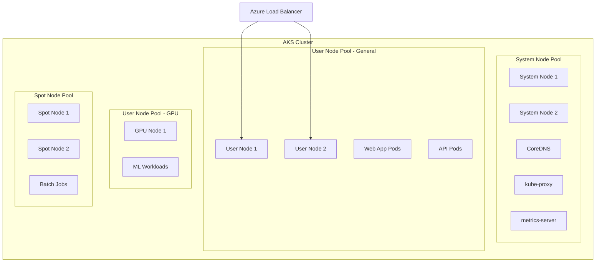
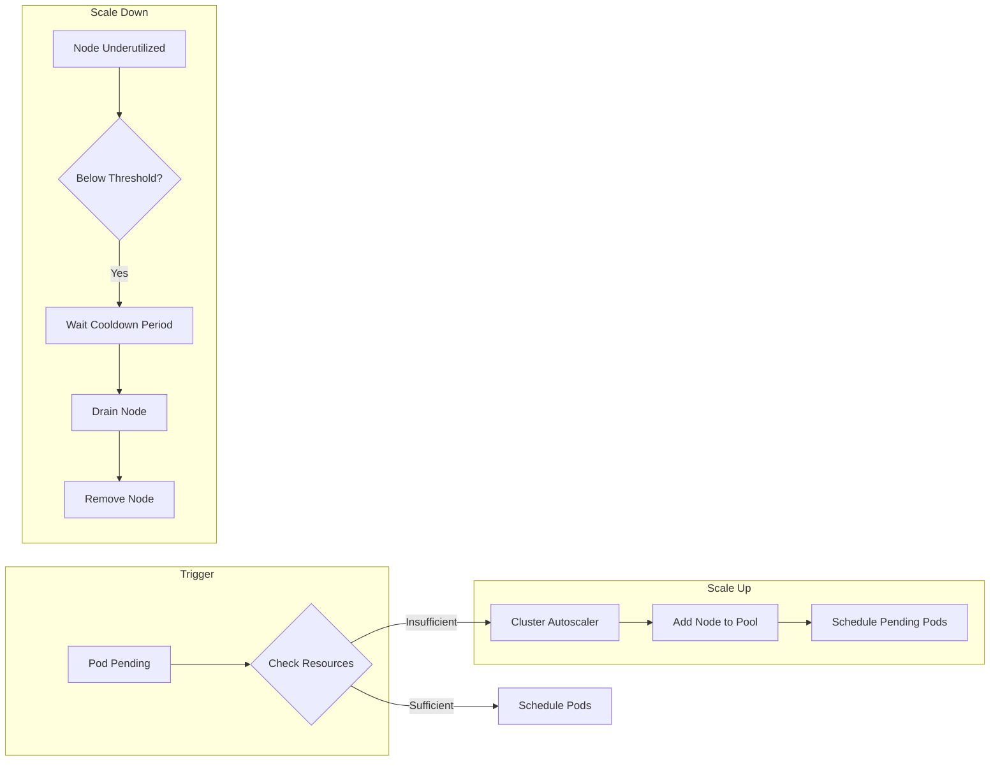
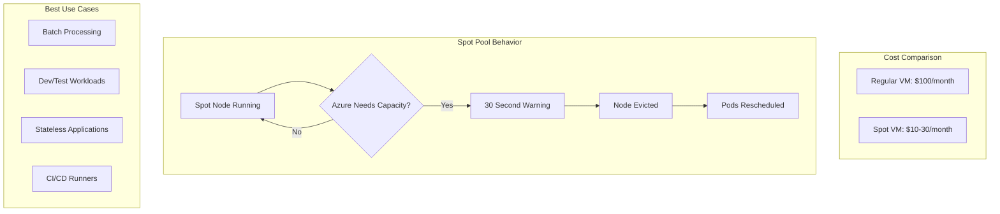

# How to Implement Azure AKS Node Pools

Author: [nawazdhandala](https://github.com/nawazdhandala)

Tags: Azure, AKS, Kubernetes, NodePools

Description: Learn how to implement Azure AKS node pools for workload isolation, cost optimization, and better resource management.

---

Azure Kubernetes Service (AKS) node pools provide a powerful mechanism for isolating workloads, optimizing costs, and managing cluster resources efficiently. This guide walks you through setting up and configuring node pools for various use cases.

## Understanding Node Pool Architecture

Before diving into configuration, let us understand how node pools fit into the AKS architecture.



## System vs User Node Pools

AKS distinguishes between two types of node pools: system and user. Each serves a distinct purpose in your cluster.

### System Node Pool Configuration

System node pools host critical cluster components like CoreDNS and the metrics server. Every AKS cluster requires at least one system node pool.

```bash
# Create a new AKS cluster with a system node pool
az aks create \
    --resource-group myResourceGroup \
    --name myAKSCluster \
    --node-count 2 \
    --node-vm-size Standard_DS2_v2 \
    --nodepool-name systempool \
    --nodepool-mode System \
    --generate-ssh-keys

# The system node pool automatically gets the following taint:
# CriticalAddonsOnly=true:NoSchedule
# This prevents non-critical workloads from being scheduled on system nodes
```

### User Node Pool Configuration

User node pools run your application workloads. You can create multiple user node pools with different VM sizes and configurations.

```bash
# Add a user node pool for general workloads
az aks nodepool add \
    --resource-group myResourceGroup \
    --cluster-name myAKSCluster \
    --name generalpool \
    --mode User \
    --node-count 3 \
    --node-vm-size Standard_DS3_v2 \
    --labels workload=general environment=production

# Add a user node pool for memory-intensive workloads
az aks nodepool add \
    --resource-group myResourceGroup \
    --cluster-name myAKSCluster \
    --name memorypool \
    --mode User \
    --node-count 2 \
    --node-vm-size Standard_E4s_v3 \
    --labels workload=memory-intensive

# Add a GPU node pool for machine learning workloads
az aks nodepool add \
    --resource-group myResourceGroup \
    --cluster-name myAKSCluster \
    --name gpupool \
    --mode User \
    --node-count 1 \
    --node-vm-size Standard_NC6s_v3 \
    --labels workload=gpu accelerator=nvidia
```

## Node Pool Autoscaling Setup

Autoscaling allows your node pools to scale based on workload demands automatically. This helps optimize costs and ensures sufficient capacity.

```bash
# Enable cluster autoscaler on an existing node pool
az aks nodepool update \
    --resource-group myResourceGroup \
    --cluster-name myAKSCluster \
    --name generalpool \
    --enable-cluster-autoscaler \
    --min-count 2 \
    --max-count 10

# Create a new node pool with autoscaling enabled from the start
az aks nodepool add \
    --resource-group myResourceGroup \
    --cluster-name myAKSCluster \
    --name autoscalepool \
    --mode User \
    --node-count 3 \
    --node-vm-size Standard_DS2_v2 \
    --enable-cluster-autoscaler \
    --min-count 1 \
    --max-count 20

# Update autoscaler configuration with advanced settings
az aks update \
    --resource-group myResourceGroup \
    --name myAKSCluster \
    --cluster-autoscaler-profile \
        scale-down-delay-after-add=10m \
        scale-down-unneeded-time=10m \
        scale-down-utilization-threshold=0.5 \
        max-graceful-termination-sec=600 \
        scan-interval=10s
```

### Autoscaling Flow



## Taint and Toleration Configuration

Taints and tolerations work together to ensure pods are scheduled on appropriate node pools. This is essential for workload isolation.

### Applying Taints to Node Pools

```bash
# Add a taint to a node pool during creation
az aks nodepool add \
    --resource-group myResourceGroup \
    --cluster-name myAKSCluster \
    --name gpupool \
    --mode User \
    --node-count 2 \
    --node-vm-size Standard_NC6s_v3 \
    --node-taints gpu=true:NoSchedule

# Add multiple taints to a node pool
az aks nodepool add \
    --resource-group myResourceGroup \
    --cluster-name myAKSCluster \
    --name isolatedpool \
    --mode User \
    --node-count 2 \
    --node-vm-size Standard_DS4_v2 \
    --node-taints dedicated=highpriority:NoSchedule,environment=production:NoExecute
```

### Configuring Tolerations in Pods

```yaml
# deployment-gpu-workload.yaml
# This deployment tolerates the GPU node taint and uses node selectors
# to ensure pods run only on GPU nodes
apiVersion: apps/v1
kind: Deployment
metadata:
  name: ml-training-job
  namespace: machine-learning
spec:
  replicas: 2
  selector:
    matchLabels:
      app: ml-training
  template:
    metadata:
      labels:
        app: ml-training
    spec:
      # Tolerations allow pods to be scheduled on tainted nodes
      tolerations:
        - key: "gpu"
          operator: "Equal"
          value: "true"
          effect: "NoSchedule"
      # Node selector ensures pods only run on GPU nodes
      nodeSelector:
        workload: gpu
        accelerator: nvidia
      containers:
        - name: training
          image: myregistry.azurecr.io/ml-training:v1.0
          resources:
            limits:
              nvidia.com/gpu: 1
              memory: "16Gi"
            requests:
              nvidia.com/gpu: 1
              memory: "8Gi"
```

```yaml
# deployment-high-priority.yaml
# This deployment uses multiple tolerations for isolated node pools
apiVersion: apps/v1
kind: Deployment
metadata:
  name: critical-service
  namespace: production
spec:
  replicas: 3
  selector:
    matchLabels:
      app: critical-service
  template:
    metadata:
      labels:
        app: critical-service
    spec:
      tolerations:
        # Tolerate the dedicated node taint
        - key: "dedicated"
          operator: "Equal"
          value: "highpriority"
          effect: "NoSchedule"
        # Tolerate the production environment taint
        - key: "environment"
          operator: "Equal"
          value: "production"
          effect: "NoExecute"
      affinity:
        nodeAffinity:
          requiredDuringSchedulingIgnoredDuringExecution:
            nodeSelectorTerms:
              - matchExpressions:
                  - key: agentpool
                    operator: In
                    values:
                      - isolatedpool
      containers:
        - name: service
          image: myregistry.azurecr.io/critical-service:v2.0
          ports:
            - containerPort: 8080
```

## Spot Node Pools for Cost Optimization

Spot node pools use Azure Spot VMs, which offer significant cost savings (up to 90%) for fault-tolerant workloads.



### Creating Spot Node Pools

```bash
# Create a spot node pool with a maximum price limit
az aks nodepool add \
    --resource-group myResourceGroup \
    --cluster-name myAKSCluster \
    --name spotpool \
    --mode User \
    --priority Spot \
    --eviction-policy Delete \
    --spot-max-price -1 \
    --node-count 3 \
    --node-vm-size Standard_DS3_v2 \
    --enable-cluster-autoscaler \
    --min-count 0 \
    --max-count 10 \
    --labels kubernetes.azure.com/scalesetpriority=spot

# The spot node pool automatically gets this taint:
# kubernetes.azure.com/scalesetpriority=spot:NoSchedule

# Create a spot pool with a specific max price (in USD per hour)
az aks nodepool add \
    --resource-group myResourceGroup \
    --cluster-name myAKSCluster \
    --name budgetspot \
    --mode User \
    --priority Spot \
    --eviction-policy Delete \
    --spot-max-price 0.05 \
    --node-count 2 \
    --node-vm-size Standard_DS2_v2
```

### Deploying Workloads to Spot Pools

```yaml
# batch-job-spot.yaml
# Batch job configured to run on spot nodes with proper tolerations
# and pod disruption handling
apiVersion: batch/v1
kind: Job
metadata:
  name: data-processing-batch
  namespace: batch-jobs
spec:
  parallelism: 5
  completions: 10
  backoffLimit: 3
  template:
    spec:
      # Tolerate the spot node taint
      tolerations:
        - key: "kubernetes.azure.com/scalesetpriority"
          operator: "Equal"
          value: "spot"
          effect: "NoSchedule"
      # Ensure scheduling on spot nodes
      affinity:
        nodeAffinity:
          requiredDuringSchedulingIgnoredDuringExecution:
            nodeSelectorTerms:
              - matchExpressions:
                  - key: "kubernetes.azure.com/scalesetpriority"
                    operator: In
                    values:
                      - "spot"
      # Handle spot eviction gracefully
      terminationGracePeriodSeconds: 25
      containers:
        - name: processor
          image: myregistry.azurecr.io/batch-processor:v1.0
          resources:
            requests:
              cpu: "500m"
              memory: "1Gi"
            limits:
              cpu: "1000m"
              memory: "2Gi"
          # Save checkpoint on termination signal
          lifecycle:
            preStop:
              exec:
                command: ["/bin/sh", "-c", "save-checkpoint.sh"]
      restartPolicy: OnFailure
```

```yaml
# deployment-spot-tolerant.yaml
# Stateless web application that can run on spot nodes
apiVersion: apps/v1
kind: Deployment
metadata:
  name: stateless-api
  namespace: applications
spec:
  replicas: 6
  selector:
    matchLabels:
      app: stateless-api
  template:
    metadata:
      labels:
        app: stateless-api
    spec:
      tolerations:
        - key: "kubernetes.azure.com/scalesetpriority"
          operator: "Equal"
          value: "spot"
          effect: "NoSchedule"
      affinity:
        nodeAffinity:
          preferredDuringSchedulingIgnoredDuringExecution:
            - weight: 100
              preference:
                matchExpressions:
                  - key: "kubernetes.azure.com/scalesetpriority"
                    operator: In
                    values:
                      - "spot"
        # Spread pods across nodes for high availability
        podAntiAffinity:
          preferredDuringSchedulingIgnoredDuringExecution:
            - weight: 100
              podAffinityTerm:
                labelSelector:
                  matchExpressions:
                    - key: app
                      operator: In
                      values:
                        - stateless-api
                topologyKey: kubernetes.io/hostname
      containers:
        - name: api
          image: myregistry.azurecr.io/api:v3.0
          ports:
            - containerPort: 3000
          readinessProbe:
            httpGet:
              path: /health
              port: 3000
            initialDelaySeconds: 5
            periodSeconds: 10
---
# Pod Disruption Budget to maintain availability during evictions
apiVersion: policy/v1
kind: PodDisruptionBudget
metadata:
  name: stateless-api-pdb
  namespace: applications
spec:
  minAvailable: 3
  selector:
    matchLabels:
      app: stateless-api
```

## Complete Node Pool Strategy Example

Here is a complete example combining all concepts for a production-ready cluster:

```bash
#!/bin/bash
# complete-cluster-setup.sh
# This script sets up a production AKS cluster with multiple node pools
# for different workload types

RESOURCE_GROUP="production-rg"
CLUSTER_NAME="production-aks"
LOCATION="eastus"

# Create resource group
az group create --name $RESOURCE_GROUP --location $LOCATION

# Create the AKS cluster with a system node pool
# System pool uses availability zones for high availability
az aks create \
    --resource-group $RESOURCE_GROUP \
    --name $CLUSTER_NAME \
    --node-count 3 \
    --node-vm-size Standard_DS2_v2 \
    --nodepool-name system \
    --nodepool-mode System \
    --zones 1 2 3 \
    --enable-managed-identity \
    --network-plugin azure \
    --network-policy azure \
    --generate-ssh-keys

# Add general purpose user node pool for standard workloads
az aks nodepool add \
    --resource-group $RESOURCE_GROUP \
    --cluster-name $CLUSTER_NAME \
    --name general \
    --mode User \
    --node-count 3 \
    --node-vm-size Standard_DS3_v2 \
    --zones 1 2 3 \
    --enable-cluster-autoscaler \
    --min-count 2 \
    --max-count 20 \
    --labels tier=standard

# Add high-memory node pool for data processing
az aks nodepool add \
    --resource-group $RESOURCE_GROUP \
    --cluster-name $CLUSTER_NAME \
    --name highmem \
    --mode User \
    --node-count 2 \
    --node-vm-size Standard_E8s_v3 \
    --zones 1 2 3 \
    --enable-cluster-autoscaler \
    --min-count 1 \
    --max-count 10 \
    --labels tier=highmem \
    --node-taints workload=highmem:NoSchedule

# Add spot node pool for batch and dev workloads
az aks nodepool add \
    --resource-group $RESOURCE_GROUP \
    --cluster-name $CLUSTER_NAME \
    --name spot \
    --mode User \
    --priority Spot \
    --eviction-policy Delete \
    --spot-max-price -1 \
    --node-count 2 \
    --node-vm-size Standard_DS3_v2 \
    --enable-cluster-autoscaler \
    --min-count 0 \
    --max-count 50 \
    --labels tier=spot

# Add GPU node pool for ML workloads
az aks nodepool add \
    --resource-group $RESOURCE_GROUP \
    --cluster-name $CLUSTER_NAME \
    --name gpu \
    --mode User \
    --node-count 0 \
    --node-vm-size Standard_NC6s_v3 \
    --enable-cluster-autoscaler \
    --min-count 0 \
    --max-count 5 \
    --labels tier=gpu accelerator=nvidia \
    --node-taints nvidia.com/gpu=present:NoSchedule

echo "Cluster setup complete!"
az aks get-credentials --resource-group $RESOURCE_GROUP --name $CLUSTER_NAME
```

## Monitoring Node Pools

Track node pool health and utilization with Azure Monitor:

```bash
# Enable monitoring on the cluster
az aks enable-addons \
    --resource-group myResourceGroup \
    --name myAKSCluster \
    --addons monitoring

# View node pool status
az aks nodepool list \
    --resource-group myResourceGroup \
    --cluster-name myAKSCluster \
    --output table

# Check autoscaler events
kubectl get events --field-selector reason=ScaledUpGroup
kubectl get events --field-selector reason=ScaledDownGroup
```

## Summary

Azure AKS node pools provide a flexible framework for:

- **Workload Isolation**: Separate critical system components from application workloads
- **Resource Optimization**: Match node specifications to workload requirements
- **Cost Management**: Use spot instances for fault-tolerant workloads
- **Automatic Scaling**: Scale node capacity based on demand

By combining system node pools, user node pools, taints, tolerations, and autoscaling, you can build a Kubernetes cluster that efficiently handles diverse workloads while optimizing costs.
