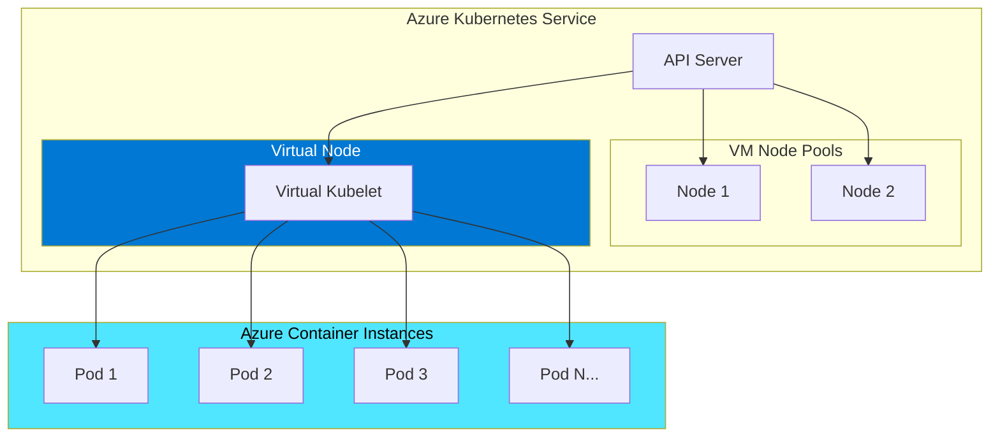
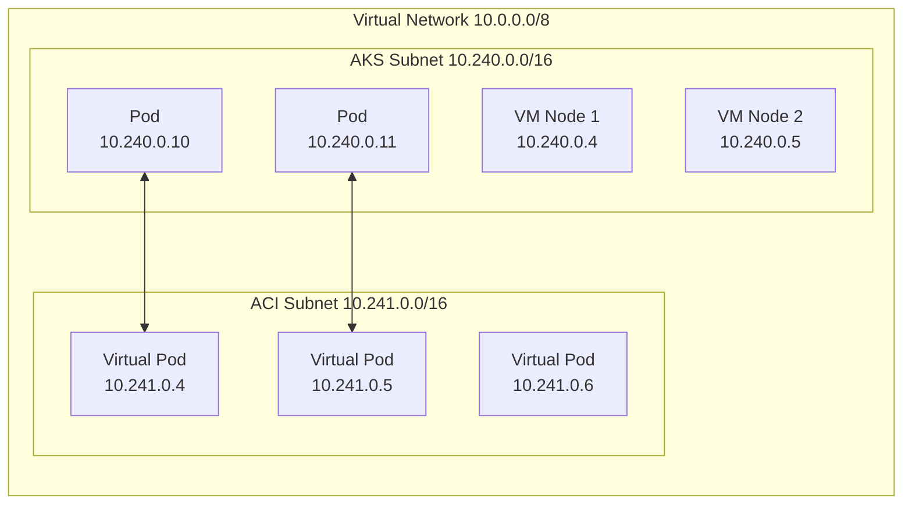
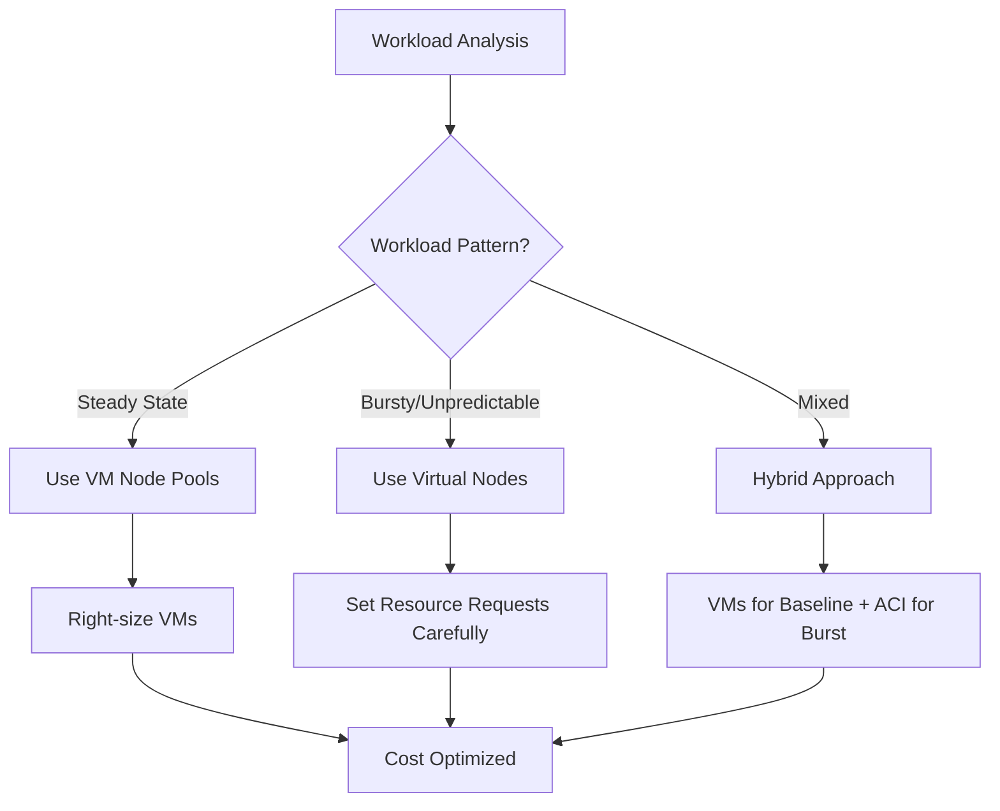

# How to Create Azure AKS Virtual Nodes

Author: [nawazdhandala](https://github.com/nawazdhandala)

Tags: Azure, AKS, Kubernetes, Serverless, Virtual Nodes, ACI, Containers

Description: Learn how to set up Azure AKS virtual nodes with Azure Container Instances for serverless, burst-capable Kubernetes workloads.

---

Virtual nodes let you run pods on Azure Container Instances (ACI) instead of dedicated VMs. Your cluster can burst to thousands of containers in seconds without managing node pools or waiting for VMs to provision. You pay only for the seconds your containers run.

## Understanding Virtual Nodes Architecture

Virtual nodes appear as regular nodes in your cluster, but pods scheduled on them run in ACI. The virtual kubelet bridges Kubernetes and ACI.



When you schedule a pod to a virtual node, the virtual kubelet translates the pod spec into an ACI container group. ACI handles the actual container execution.

## Prerequisites

Before enabling virtual nodes, you need:

- An Azure subscription with sufficient ACI quota
- Azure CLI version 2.0.49 or later
- An AKS cluster with advanced networking (Azure CNI)
- A subnet dedicated to ACI

### Check Your Azure CLI Version

```bash
# Verify Azure CLI version
az --version

# Update if needed
az upgrade
```

### Register the Required Providers

```bash
# Register the ContainerInstance provider
az provider register --namespace Microsoft.ContainerInstance

# Check registration status
az provider show --namespace Microsoft.ContainerInstance --query "registrationState"
```

## Setting Up the Network

Virtual nodes require Azure CNI networking with a dedicated subnet for ACI. ACI containers get IP addresses from this subnet and can communicate directly with pods on VM nodes.



### Create the Virtual Network and Subnets

```bash
# Set variables for your environment
RESOURCE_GROUP="myResourceGroup"
LOCATION="eastus"
VNET_NAME="myVNet"
AKS_SUBNET_NAME="aksSubnet"
ACI_SUBNET_NAME="aciSubnet"

# Create resource group
az group create \
    --name $RESOURCE_GROUP \
    --location $LOCATION

# Create virtual network with AKS subnet
az network vnet create \
    --resource-group $RESOURCE_GROUP \
    --name $VNET_NAME \
    --address-prefixes 10.0.0.0/8 \
    --subnet-name $AKS_SUBNET_NAME \
    --subnet-prefix 10.240.0.0/16

# Create dedicated subnet for ACI
# This subnet must be delegated to Microsoft.ContainerInstance/containerGroups
az network vnet subnet create \
    --resource-group $RESOURCE_GROUP \
    --vnet-name $VNET_NAME \
    --name $ACI_SUBNET_NAME \
    --address-prefix 10.241.0.0/16 \
    --delegations Microsoft.ContainerInstance/containerGroups
```

### Get Subnet IDs

```bash
# Get the AKS subnet ID for cluster creation
AKS_SUBNET_ID=$(az network vnet subnet show \
    --resource-group $RESOURCE_GROUP \
    --vnet-name $VNET_NAME \
    --name $AKS_SUBNET_NAME \
    --query id -o tsv)

# Get the ACI subnet ID for virtual nodes
ACI_SUBNET_ID=$(az network vnet subnet show \
    --resource-group $RESOURCE_GROUP \
    --vnet-name $VNET_NAME \
    --name $ACI_SUBNET_NAME \
    --query id -o tsv)

echo "AKS Subnet ID: $AKS_SUBNET_ID"
echo "ACI Subnet ID: $ACI_SUBNET_ID"
```

## Creating an AKS Cluster with Virtual Nodes

You can enable virtual nodes during cluster creation or add them to an existing cluster.

### Create a New Cluster with Virtual Nodes

```bash
# Set cluster variables
CLUSTER_NAME="myAKSCluster"

# Create AKS cluster with virtual nodes enabled
az aks create \
    --resource-group $RESOURCE_GROUP \
    --name $CLUSTER_NAME \
    --node-count 2 \
    --network-plugin azure \
    --vnet-subnet-id $AKS_SUBNET_ID \
    --aci-subnet-name $ACI_SUBNET_NAME \
    --enable-addons virtual-node \
    --generate-ssh-keys

# Get cluster credentials
az aks get-credentials \
    --resource-group $RESOURCE_GROUP \
    --name $CLUSTER_NAME
```

### Enable Virtual Nodes on an Existing Cluster

```bash
# Your cluster must already use Azure CNI networking
# Enable the virtual-node addon
az aks enable-addons \
    --resource-group $RESOURCE_GROUP \
    --name $CLUSTER_NAME \
    --addons virtual-node \
    --subnet-name $ACI_SUBNET_NAME
```

### Verify Virtual Node is Running

```bash
# Check that the virtual node appears in your cluster
kubectl get nodes

# You should see output like:
# NAME                                STATUS   ROLES   AGE   VERSION
# aks-nodepool1-12345678-vmss000000   Ready    agent   10m   v1.28.3
# aks-nodepool1-12345678-vmss000001   Ready    agent   10m   v1.28.3
# virtual-node-aci-linux              Ready    agent   5m    v1.28.3-vk-azure-aci-1.6.0
```

## Scheduling Pods to Virtual Nodes

There are two ways to schedule pods to virtual nodes: using nodeSelector or tolerations.

### Method 1: Using nodeSelector

The simplest approach is to use a nodeSelector that targets the virtual node.

```yaml
# virtual-node-pod.yaml
apiVersion: v1
kind: Pod
metadata:
  name: demo-virtual-node
  labels:
    app: demo
spec:
  containers:
    - name: demo
      image: mcr.microsoft.com/azuredocs/aci-helloworld
      ports:
        - containerPort: 80
      resources:
        requests:
          cpu: "0.5"
          memory: "256Mi"
        limits:
          cpu: "1"
          memory: "512Mi"
  # Schedule to the virtual node
  nodeSelector:
    kubernetes.io/role: agent
    beta.kubernetes.io/os: linux
    type: virtual-kubelet
  # Virtual nodes have a taint that must be tolerated
  tolerations:
    - key: virtual-kubelet.io/provider
      operator: Exists
    - key: azure.com/aci
      effect: NoSchedule
```

```bash
# Deploy the pod
kubectl apply -f virtual-node-pod.yaml

# Check pod status and node assignment
kubectl get pod demo-virtual-node -o wide

# You should see the pod running on virtual-node-aci-linux
```

### Method 2: Using Node Affinity

For more control, use node affinity rules.

```yaml
# virtual-node-affinity.yaml
apiVersion: apps/v1
kind: Deployment
metadata:
  name: demo-deployment
spec:
  replicas: 5
  selector:
    matchLabels:
      app: demo
  template:
    metadata:
      labels:
        app: demo
    spec:
      containers:
        - name: demo
          image: mcr.microsoft.com/azuredocs/aci-helloworld
          resources:
            requests:
              cpu: "0.25"
              memory: "128Mi"
            limits:
              cpu: "0.5"
              memory: "256Mi"
      affinity:
        nodeAffinity:
          # Prefer virtual node but allow VM nodes as fallback
          preferredDuringSchedulingIgnoredDuringExecution:
            - weight: 1
              preference:
                matchExpressions:
                  - key: type
                    operator: In
                    values:
                      - virtual-kubelet
      tolerations:
        - key: virtual-kubelet.io/provider
          operator: Exists
        - key: azure.com/aci
          effect: NoSchedule
```

### Burst Scaling with Virtual Nodes

Use a combination of VM nodes and virtual nodes for cost-effective scaling. Run baseline workloads on VMs and burst to ACI during peak demand.

```yaml
# burst-deployment.yaml
apiVersion: apps/v1
kind: Deployment
metadata:
  name: burst-app
spec:
  replicas: 10
  selector:
    matchLabels:
      app: burst-app
  template:
    metadata:
      labels:
        app: burst-app
    spec:
      containers:
        - name: app
          image: nginx:alpine
          resources:
            requests:
              cpu: "100m"
              memory: "128Mi"
            limits:
              cpu: "200m"
              memory: "256Mi"
      affinity:
        nodeAffinity:
          # Strongly prefer VM nodes for cost efficiency
          preferredDuringSchedulingIgnoredDuringExecution:
            - weight: 100
              preference:
                matchExpressions:
                  - key: type
                    operator: NotIn
                    values:
                      - virtual-kubelet
      # But tolerate virtual nodes for overflow
      tolerations:
        - key: virtual-kubelet.io/provider
          operator: Exists
        - key: azure.com/aci
          effect: NoSchedule
```

```bash
# Deploy the burst application
kubectl apply -f burst-deployment.yaml

# Watch pods get scheduled - some will land on VMs, overflow goes to ACI
kubectl get pods -o wide -w

# Scale up to trigger burst to virtual nodes
kubectl scale deployment burst-app --replicas=50
```

## Exposing Virtual Node Pods

Pods on virtual nodes can be exposed using Kubernetes Services. They get IPs from the ACI subnet and are directly routable within the VNet.

### Internal Load Balancer

```yaml
# internal-service.yaml
apiVersion: v1
kind: Service
metadata:
  name: demo-internal
  annotations:
    service.beta.kubernetes.io/azure-load-balancer-internal: "true"
spec:
  type: LoadBalancer
  ports:
    - port: 80
      targetPort: 80
  selector:
    app: demo
```

### Using Ingress

```yaml
# ingress.yaml
apiVersion: networking.k8s.io/v1
kind: Ingress
metadata:
  name: demo-ingress
  annotations:
    kubernetes.io/ingress.class: nginx
spec:
  rules:
    - host: demo.example.com
      http:
        paths:
          - path: /
            pathType: Prefix
            backend:
              service:
                name: demo-internal
                port:
                  number: 80
```

## Monitoring Virtual Node Pods

Virtual node pods report metrics through the standard Kubernetes metrics pipeline.

```bash
# View pod logs
kubectl logs demo-virtual-node

# Get pod metrics (requires metrics-server)
kubectl top pod demo-virtual-node

# Describe pod for detailed ACI information
kubectl describe pod demo-virtual-node
```

### Container Insights

Enable Container Insights for comprehensive monitoring.

```bash
# Enable monitoring addon
az aks enable-addons \
    --resource-group $RESOURCE_GROUP \
    --name $CLUSTER_NAME \
    --addons monitoring \
    --workspace-resource-id <LOG_ANALYTICS_WORKSPACE_ID>
```

## Limitations and Best Practices

Virtual nodes have specific limitations you must understand before adoption.

### Limitations

| Feature | Support Status |
|---------|---------------|
| Linux containers | Supported |
| Windows containers | Not supported |
| DaemonSets | Not applicable |
| Privileged containers | Not supported |
| Host networking | Not supported |
| Persistent volumes | Azure Files only |
| GPU workloads | Supported (specific SKUs) |
| Init containers | Supported |
| Service mesh | Limited support |
| hostPath volumes | Not supported |

### Best Practices

**1. Set Resource Requests and Limits**

ACI bills based on requested resources. Always specify requests to control costs.

```yaml
resources:
  requests:
    cpu: "0.5"      # You pay for this
    memory: "1Gi"   # You pay for this
  limits:
    cpu: "2"
    memory: "4Gi"
```

**2. Use Startup and Liveness Probes**

ACI container groups restart automatically on failure. Probes help Kubernetes track health.

```yaml
livenessProbe:
  httpGet:
    path: /health
    port: 8080
  initialDelaySeconds: 30
  periodSeconds: 10
startupProbe:
  httpGet:
    path: /ready
    port: 8080
  failureThreshold: 30
  periodSeconds: 10
```

**3. Handle Cold Starts**

ACI containers have cold start latency (typically 5-30 seconds). Design your architecture accordingly.

```yaml
# Use startup probes with generous timeouts
startupProbe:
  httpGet:
    path: /health
    port: 8080
  initialDelaySeconds: 10
  periodSeconds: 5
  failureThreshold: 30  # Allow up to 150 seconds for startup
```

**4. Use Azure Files for Persistence**

ACI supports Azure Files volumes. Avoid workloads requiring block storage.

```yaml
apiVersion: v1
kind: Pod
metadata:
  name: pod-with-storage
spec:
  containers:
    - name: app
      image: nginx
      volumeMounts:
        - name: azure-files
          mountPath: /data
  volumes:
    - name: azure-files
      azureFile:
        secretName: azure-file-secret
        shareName: myshare
        readOnly: false
  nodeSelector:
    type: virtual-kubelet
  tolerations:
    - key: virtual-kubelet.io/provider
      operator: Exists
```

**5. Implement Graceful Shutdown**

ACI sends SIGTERM and waits 30 seconds before SIGKILL. Handle signals properly.

```yaml
spec:
  terminationGracePeriodSeconds: 30
  containers:
    - name: app
      # Your app should handle SIGTERM
      lifecycle:
        preStop:
          exec:
            command: ["/bin/sh", "-c", "sleep 5"]
```

## Cost Optimization

Virtual nodes can reduce costs for bursty workloads, but continuous usage may be more expensive than VMs.

### Cost Comparison Workflow



### Calculate ACI Costs

ACI charges per second based on:
- vCPU: ~$0.000012/vCPU/second
- Memory: ~$0.0000012/GB/second

```bash
# Example: 0.5 vCPU, 1GB memory pod running for 1 hour
# vCPU cost: 0.5 * 0.000012 * 3600 = $0.0216
# Memory cost: 1 * 0.0000012 * 3600 = $0.00432
# Total: ~$0.026/hour per pod

# Compare with a D2s_v3 VM at ~$0.096/hour that can run 4 similar pods
# VM cost per pod: ~$0.024/hour

# ACI is more expensive for steady workloads but cheaper for burst
```

## Troubleshooting

### Pod Stuck in Pending

```bash
# Check events for scheduling issues
kubectl describe pod <pod-name>

# Common causes:
# - Missing tolerations
# - ACI subnet has no available IPs
# - ACI quota exceeded
# - Region does not support required container size

# Check ACI quota
az container list --resource-group MC_${RESOURCE_GROUP}_${CLUSTER_NAME}_${LOCATION}
```

### Pod Fails to Start

```bash
# Check ACI container group directly
az container logs \
    --resource-group MC_${RESOURCE_GROUP}_${CLUSTER_NAME}_${LOCATION} \
    --name <container-group-name>

# Common causes:
# - Image pull failures (check registry credentials)
# - Container crashes (check application logs)
# - Resource limits too low
```

### Network Connectivity Issues

```bash
# Verify subnet delegation
az network vnet subnet show \
    --resource-group $RESOURCE_GROUP \
    --vnet-name $VNET_NAME \
    --name $ACI_SUBNET_NAME \
    --query delegations

# Verify pods can reach cluster DNS
kubectl exec -it demo-virtual-node -- nslookup kubernetes.default

# Check network policy is not blocking traffic
kubectl get networkpolicies --all-namespaces
```

## Cleanup

Remove virtual nodes when no longer needed.

```bash
# Disable virtual nodes addon
az aks disable-addons \
    --resource-group $RESOURCE_GROUP \
    --name $CLUSTER_NAME \
    --addons virtual-node

# Delete ACI subnet (optional)
az network vnet subnet delete \
    --resource-group $RESOURCE_GROUP \
    --vnet-name $VNET_NAME \
    --name $ACI_SUBNET_NAME
```

---

Virtual nodes provide instant, serverless container capacity without managing VM infrastructure. They work best for burst workloads, batch processing, and CI/CD pipelines where you need elastic capacity that scales to zero. Use them alongside VM node pools for a cost-effective hybrid approach that handles both steady-state and peak demand.
