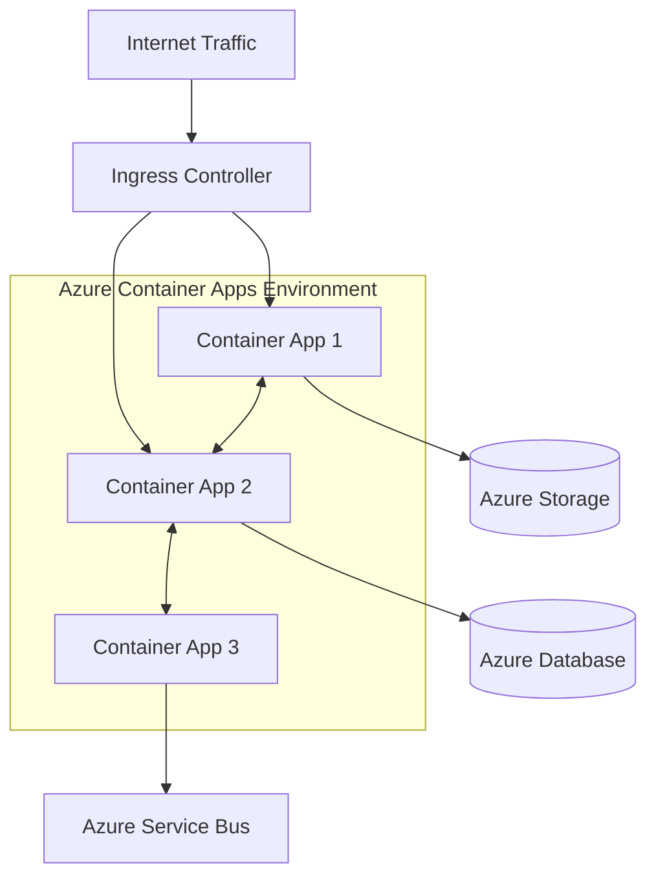
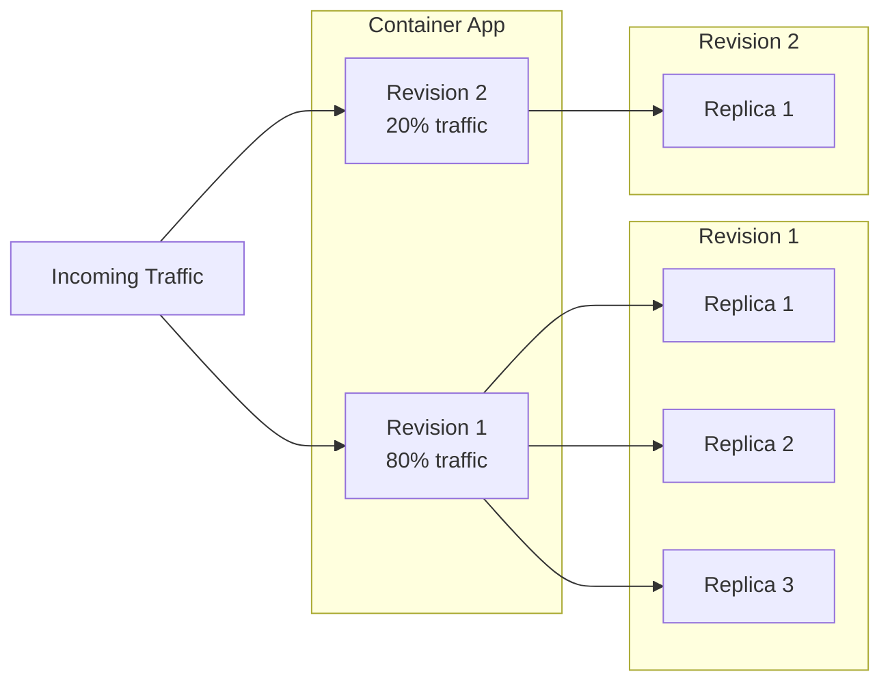
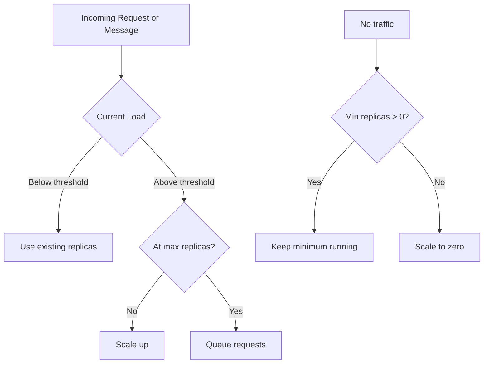
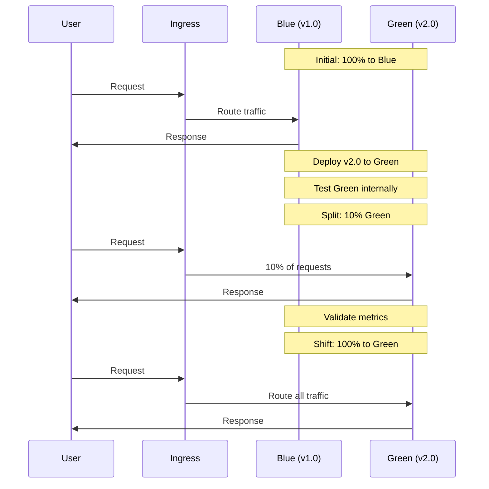

# How to Implement Azure Container Apps

Author: [nawazdhandala](https://github.com/nawazdhandala)

Tags: Azure, Containers, Kubernetes, DevOps, Serverless, Cloud

Description: A practical guide to deploying containerized applications on Azure Container Apps, covering environment setup, scaling, ingress, secrets management, and real-world deployment patterns.

---

Azure Container Apps is a serverless container platform built on Kubernetes. You get the power of containers without managing clusters, nodes, or control planes. It sits between Azure App Service and full AKS, offering the sweet spot for teams that want container flexibility without Kubernetes overhead.

## What Is Azure Container Apps?

Azure Container Apps runs on top of Kubernetes (AKS internally) but abstracts away all the cluster management. You deploy containers, define scaling rules, and Azure handles the rest.



Key features:
- **Serverless scaling:** Scale to zero when idle, scale up based on HTTP traffic, queue depth, or custom metrics
- **Built-in ingress:** HTTPS endpoints with automatic TLS certificates
- **Dapr integration:** Microservices building blocks out of the box
- **Revisions:** Blue-green and canary deployments with traffic splitting

## When to Choose Container Apps

| Scenario | Best Choice | Why |
| --- | --- | --- |
| Simple web APIs | Container Apps | Zero cluster management, scales to zero |
| Event-driven processing | Container Apps | Queue-based scaling built in |
| Complex microservices with custom networking | AKS | Full Kubernetes control |
| Legacy apps needing lift-and-shift | App Service | No containerization required |
| Batch processing jobs | Container Apps Jobs | Serverless job execution |

Choose Container Apps when you want containers without becoming a Kubernetes admin.

## Prerequisites

Before starting, you need these tools installed.

```bash
# Install Azure CLI if you do not have it
# macOS
brew install azure-cli

# Linux
curl -sL https://aka.ms/InstallAzureCLIDeb | sudo bash

# Windows (PowerShell)
winget install Microsoft.AzureCLI

# Verify installation
az --version
```

Login to Azure and set your subscription.

```bash
# Login to your Azure account
az login

# List subscriptions and pick one
az account list --output table

# Set the subscription you want to use
az account set --subscription "Your-Subscription-Name"
```

Install the Container Apps extension for the Azure CLI.

```bash
# Add the containerapp extension
az extension add --name containerapp --upgrade

# Register the required resource providers
az provider register --namespace Microsoft.App
az provider register --namespace Microsoft.OperationalInsights
```

## Creating Your First Container App

### Step 1: Create a Resource Group

Resource groups organize related Azure resources. Create one for your container apps.

```bash
# Define variables for easy reuse
RESOURCE_GROUP="rg-containerapps-demo"
LOCATION="eastus"

# Create the resource group
az group create \
  --name $RESOURCE_GROUP \
  --location $LOCATION
```

### Step 2: Create a Container Apps Environment

The environment is a secure boundary around your container apps. Apps in the same environment share a virtual network and can communicate internally.

```bash
# Define environment name
ENVIRONMENT="containerapps-env"

# Create the Container Apps environment
az containerapp env create \
  --name $ENVIRONMENT \
  --resource-group $RESOURCE_GROUP \
  --location $LOCATION
```

This takes a few minutes. Azure provisions a Log Analytics workspace automatically.

### Step 3: Deploy a Container App

Deploy a simple container from a public registry. This example uses a basic Node.js app.

```bash
# Deploy a container app with external ingress
az containerapp create \
  --name my-api \
  --resource-group $RESOURCE_GROUP \
  --environment $ENVIRONMENT \
  --image mcr.microsoft.com/azuredocs/containerapps-helloworld:latest \
  --target-port 80 \
  --ingress external \
  --query properties.configuration.ingress.fqdn \
  --output tsv
```

The command returns a URL like `my-api.happyocean-12345678.eastus.azurecontainerapps.io`. Open it in your browser to see your running app.

## Container App Architecture



Understanding the hierarchy:
- **Container App:** The top-level resource
- **Revision:** An immutable snapshot of your app configuration
- **Replica:** A running instance of a revision

## Deploying from Azure Container Registry

For production workloads, store images in Azure Container Registry (ACR).

### Create an ACR Instance

```bash
# Define registry name (must be globally unique)
REGISTRY_NAME="mycontainerregistry$(openssl rand -hex 4)"

# Create the container registry
az acr create \
  --name $REGISTRY_NAME \
  --resource-group $RESOURCE_GROUP \
  --sku Basic \
  --admin-enabled true
```

### Build and Push Your Image

Here is a sample Dockerfile for a Python Flask application.

```dockerfile
# Use Python 3.11 slim image for smaller footprint
FROM python:3.11-slim

# Set working directory
WORKDIR /app

# Copy requirements first for better layer caching
COPY requirements.txt .

# Install dependencies
RUN pip install --no-cache-dir -r requirements.txt

# Copy application code
COPY . .

# Expose the port your app runs on
EXPOSE 8000

# Run the application with gunicorn for production
CMD ["gunicorn", "--bind", "0.0.0.0:8000", "app:app"]
```

Build and push using ACR tasks (no local Docker needed).

```bash
# Build and push directly in Azure
az acr build \
  --registry $REGISTRY_NAME \
  --image myapp:v1.0.0 \
  --file Dockerfile \
  .
```

### Deploy from ACR

Enable managed identity for seamless authentication between Container Apps and ACR.

```bash
# Get ACR login server
ACR_LOGIN_SERVER=$(az acr show \
  --name $REGISTRY_NAME \
  --query loginServer \
  --output tsv)

# Create container app with ACR image using system-assigned identity
az containerapp create \
  --name myapp \
  --resource-group $RESOURCE_GROUP \
  --environment $ENVIRONMENT \
  --image $ACR_LOGIN_SERVER/myapp:v1.0.0 \
  --registry-server $ACR_LOGIN_SERVER \
  --registry-identity system \
  --target-port 8000 \
  --ingress external \
  --cpu 0.5 \
  --memory 1.0Gi
```

## Scaling Configuration

Container Apps offers three scaling triggers: HTTP traffic, Azure Service Bus queues, and custom metrics.

### HTTP Scaling

Scale based on concurrent HTTP requests per replica.

```bash
# Update scaling rules for HTTP traffic
az containerapp update \
  --name myapp \
  --resource-group $RESOURCE_GROUP \
  --min-replicas 1 \
  --max-replicas 10 \
  --scale-rule-name http-scaling \
  --scale-rule-type http \
  --scale-rule-http-concurrency 100
```

This configuration:
- Keeps at least 1 replica running (no cold starts)
- Scales up to 10 replicas maximum
- Adds a replica when concurrent requests exceed 100 per replica

### Queue-Based Scaling

For background workers processing messages from Azure Service Bus.

```bash
# Create a queue-triggered container app
az containerapp create \
  --name queue-worker \
  --resource-group $RESOURCE_GROUP \
  --environment $ENVIRONMENT \
  --image $ACR_LOGIN_SERVER/worker:v1.0.0 \
  --registry-server $ACR_LOGIN_SERVER \
  --registry-identity system \
  --min-replicas 0 \
  --max-replicas 20 \
  --secrets "sb-connection=<your-service-bus-connection-string>" \
  --scale-rule-name queue-scaling \
  --scale-rule-type azure-servicebus \
  --scale-rule-metadata \
    queueName=myqueue \
    messageCount=10 \
  --scale-rule-auth \
    connection=sb-connection
```

This worker scales to zero when the queue is empty and scales up as messages arrive.

### Scaling Decision Flow



## Managing Secrets and Environment Variables

Never hardcode secrets in your container images. Container Apps provides secure secret management.

### Adding Secrets

```bash
# Add secrets to your container app
az containerapp secret set \
  --name myapp \
  --resource-group $RESOURCE_GROUP \
  --secrets \
    db-password="SuperSecretPassword123" \
    api-key="your-api-key-here"
```

### Using Secrets as Environment Variables

```bash
# Update the app to use secrets as environment variables
az containerapp update \
  --name myapp \
  --resource-group $RESOURCE_GROUP \
  --set-env-vars \
    DATABASE_PASSWORD=secretref:db-password \
    EXTERNAL_API_KEY=secretref:api-key \
    APP_ENV=production \
    LOG_LEVEL=info
```

The `secretref:` prefix tells Container Apps to inject the secret value securely.

### Using Azure Key Vault (Recommended for Production)

For enterprise scenarios, reference secrets directly from Key Vault.

```bash
# Create a Key Vault
KEYVAULT_NAME="kv-containerapps-$(openssl rand -hex 4)"

az keyvault create \
  --name $KEYVAULT_NAME \
  --resource-group $RESOURCE_GROUP \
  --location $LOCATION

# Add a secret to Key Vault
az keyvault secret set \
  --vault-name $KEYVAULT_NAME \
  --name "DatabasePassword" \
  --value "ProductionSecretPassword"

# Get the secret URI
SECRET_URI=$(az keyvault secret show \
  --vault-name $KEYVAULT_NAME \
  --name "DatabasePassword" \
  --query id \
  --output tsv)

# Enable system identity on your container app
az containerapp identity assign \
  --name myapp \
  --resource-group $RESOURCE_GROUP \
  --system-assigned

# Get the identity principal ID
IDENTITY_ID=$(az containerapp show \
  --name myapp \
  --resource-group $RESOURCE_GROUP \
  --query identity.principalId \
  --output tsv)

# Grant Key Vault access to the container app identity
az keyvault set-policy \
  --name $KEYVAULT_NAME \
  --object-id $IDENTITY_ID \
  --secret-permissions get

# Reference the Key Vault secret in your container app
az containerapp secret set \
  --name myapp \
  --resource-group $RESOURCE_GROUP \
  --secrets "db-password=keyvaultref:$SECRET_URI,identityref:system"
```

## Revisions and Traffic Splitting

Revisions enable safe deployments through traffic splitting.

### Deploy a New Revision

```bash
# Deploy a new version of your app
az containerapp update \
  --name myapp \
  --resource-group $RESOURCE_GROUP \
  --image $ACR_LOGIN_SERVER/myapp:v2.0.0
```

This creates a new revision. By default, 100% of traffic shifts to the new revision.

### Canary Deployments with Traffic Splitting

For safer rollouts, split traffic between revisions.

```bash
# List current revisions
az containerapp revision list \
  --name myapp \
  --resource-group $RESOURCE_GROUP \
  --output table

# Split traffic: 90% to old revision, 10% to new
az containerapp ingress traffic set \
  --name myapp \
  --resource-group $RESOURCE_GROUP \
  --revision-weight \
    myapp--abc123=90 \
    myapp--def456=10
```

### Blue-Green Deployment Pattern



### Automatic Rollback

Monitor your new revision and rollback if issues arise.

```bash
# Rollback: send all traffic to the previous revision
az containerapp ingress traffic set \
  --name myapp \
  --resource-group $RESOURCE_GROUP \
  --revision-weight myapp--abc123=100
```

## Dapr Integration

Dapr (Distributed Application Runtime) provides building blocks for microservices: service invocation, state management, pub/sub, and more.

### Enable Dapr on Your Container App

```bash
# Create a container app with Dapr enabled
az containerapp create \
  --name order-service \
  --resource-group $RESOURCE_GROUP \
  --environment $ENVIRONMENT \
  --image $ACR_LOGIN_SERVER/order-service:v1.0.0 \
  --registry-server $ACR_LOGIN_SERVER \
  --registry-identity system \
  --target-port 8080 \
  --ingress internal \
  --enable-dapr \
  --dapr-app-id order-service \
  --dapr-app-port 8080
```

### Dapr Service Invocation

Call other services without knowing their URLs.

```python
# Python example: calling another service via Dapr
import requests

# Instead of hardcoding URLs, use Dapr's service invocation
# Dapr sidecar runs on localhost:3500
DAPR_PORT = 3500

def get_inventory(product_id):
    # This calls the inventory-service container app
    response = requests.get(
        f"http://localhost:{DAPR_PORT}/v1.0/invoke/inventory-service/method/products/{product_id}"
    )
    return response.json()
```

### Dapr Pub/Sub

Publish and subscribe to events across services.

```yaml
# pubsub-component.yaml
componentType: pubsub.azure.servicebus
version: v1
metadata:
  - name: connectionString
    secretRef: sb-connection
secrets:
  - name: sb-connection
    value: "<service-bus-connection-string>"
scopes:
  - order-service
  - notification-service
```

Deploy the component.

```bash
# Add Dapr component to the environment
az containerapp env dapr-component set \
  --name $ENVIRONMENT \
  --resource-group $RESOURCE_GROUP \
  --dapr-component-name pubsub \
  --yaml pubsub-component.yaml
```

## YAML Configuration (Infrastructure as Code)

For production deployments, define your container apps in YAML.

### Complete Container App YAML

```yaml
# container-app.yaml
properties:
  managedEnvironmentId: /subscriptions/<sub-id>/resourceGroups/rg-containerapps-demo/providers/Microsoft.App/managedEnvironments/containerapps-env
  configuration:
    activeRevisionsMode: Multiple
    ingress:
      external: true
      targetPort: 8080
      transport: http
      traffic:
        - latestRevision: true
          weight: 100
    registries:
      - server: mycontainerregistry.azurecr.io
        identity: system
    secrets:
      - name: db-password
        value: "<secret-value>"
  template:
    containers:
      - name: myapp
        image: mycontainerregistry.azurecr.io/myapp:v1.0.0
        resources:
          cpu: 0.5
          memory: 1Gi
        env:
          - name: DATABASE_PASSWORD
            secretRef: db-password
          - name: APP_ENV
            value: production
        probes:
          - type: liveness
            httpGet:
              path: /health
              port: 8080
            initialDelaySeconds: 10
            periodSeconds: 30
          - type: readiness
            httpGet:
              path: /ready
              port: 8080
            initialDelaySeconds: 5
            periodSeconds: 10
    scale:
      minReplicas: 2
      maxReplicas: 10
      rules:
        - name: http-scaling
          http:
            metadata:
              concurrentRequests: "100"
```

Deploy using the YAML file.

```bash
# Create or update from YAML
az containerapp create \
  --name myapp \
  --resource-group $RESOURCE_GROUP \
  --yaml container-app.yaml
```

### Bicep Template (Recommended for Azure IaC)

```bicep
// main.bicep
param location string = resourceGroup().location
param environmentName string = 'containerapps-env'
param appName string = 'myapp'
param containerImage string

// Create the Container Apps environment
resource environment 'Microsoft.App/managedEnvironments@2023-05-01' = {
  name: environmentName
  location: location
  properties: {
    zoneRedundant: true
  }
}

// Create the Container App
resource containerApp 'Microsoft.App/containerApps@2023-05-01' = {
  name: appName
  location: location
  properties: {
    managedEnvironmentId: environment.id
    configuration: {
      ingress: {
        external: true
        targetPort: 8080
        transport: 'http'
      }
    }
    template: {
      containers: [
        {
          name: appName
          image: containerImage
          resources: {
            cpu: json('0.5')
            memory: '1Gi'
          }
          probes: [
            {
              type: 'Liveness'
              httpGet: {
                path: '/health'
                port: 8080
              }
              initialDelaySeconds: 10
              periodSeconds: 30
            }
          ]
        }
      ]
      scale: {
        minReplicas: 2
        maxReplicas: 10
      }
    }
  }
}

output fqdn string = containerApp.properties.configuration.ingress.fqdn
```

Deploy the Bicep template.

```bash
# Deploy with Bicep
az deployment group create \
  --resource-group $RESOURCE_GROUP \
  --template-file main.bicep \
  --parameters containerImage="$ACR_LOGIN_SERVER/myapp:v1.0.0"
```

## Monitoring and Observability

Container Apps integrates with Azure Monitor and Log Analytics.

### View Logs

```bash
# Stream logs in real-time
az containerapp logs show \
  --name myapp \
  --resource-group $RESOURCE_GROUP \
  --follow

# Query historical logs
az containerapp logs show \
  --name myapp \
  --resource-group $RESOURCE_GROUP \
  --type system
```

### Log Analytics Queries

Access deeper insights through Log Analytics.

```kusto
// Find all errors in the last hour
ContainerAppConsoleLogs_CL
| where TimeGenerated > ago(1h)
| where Log_s contains "error" or Log_s contains "exception"
| project TimeGenerated, ContainerAppName_s, Log_s
| order by TimeGenerated desc

// Request latency percentiles
ContainerAppSystemLogs_CL
| where TimeGenerated > ago(1h)
| where Type_s == "Request"
| summarize
    p50=percentile(DurationMs_d, 50),
    p95=percentile(DurationMs_d, 95),
    p99=percentile(DurationMs_d, 99)
    by bin(TimeGenerated, 5m)
| render timechart
```

### OpenTelemetry Integration

For comprehensive observability, export telemetry to OpenTelemetry-compatible backends.

```bash
# Set OpenTelemetry endpoint
az containerapp update \
  --name myapp \
  --resource-group $RESOURCE_GROUP \
  --set-env-vars \
    OTEL_EXPORTER_OTLP_ENDPOINT="https://your-otlp-endpoint.com" \
    OTEL_SERVICE_NAME="myapp"
```

## Production Checklist

Before going to production, verify these items:

| Category | Item | Command to Verify |
| --- | --- | --- |
| Scaling | Min replicas > 0 for critical apps | `az containerapp show --name myapp -g $RESOURCE_GROUP --query properties.template.scale` |
| Health | Liveness and readiness probes configured | Check YAML template |
| Secrets | No hardcoded secrets, using Key Vault | `az containerapp secret list --name myapp -g $RESOURCE_GROUP` |
| Networking | VNet integration for internal services | `az containerapp env show --name $ENVIRONMENT -g $RESOURCE_GROUP` |
| Monitoring | Log Analytics workspace connected | Check environment configuration |
| Identity | Managed identity enabled | `az containerapp identity show --name myapp -g $RESOURCE_GROUP` |

## Cost Optimization Tips

1. **Scale to zero:** For non-critical workloads, set `minReplicas: 0` to avoid charges during idle periods
2. **Right-size resources:** Start with 0.25 CPU and 0.5Gi memory, scale up based on actual usage
3. **Use consumption plan:** The default billing model charges only for active resources
4. **Share environments:** Multiple apps in one environment share infrastructure costs
5. **Monitor with cost alerts:** Set budget alerts in Azure Cost Management

```bash
# Check current resource allocation
az containerapp show \
  --name myapp \
  --resource-group $RESOURCE_GROUP \
  --query properties.template.containers[0].resources
```

## Cleanup

Remove all resources when you are done experimenting.

```bash
# Delete the entire resource group (removes everything)
az group delete \
  --name $RESOURCE_GROUP \
  --yes \
  --no-wait
```

---

Azure Container Apps delivers the simplicity of serverless with the flexibility of containers. Start with a simple deployment, add scaling rules based on your traffic patterns, and integrate Dapr when your microservices architecture demands it. The platform handles the Kubernetes complexity so you can focus on shipping features.
