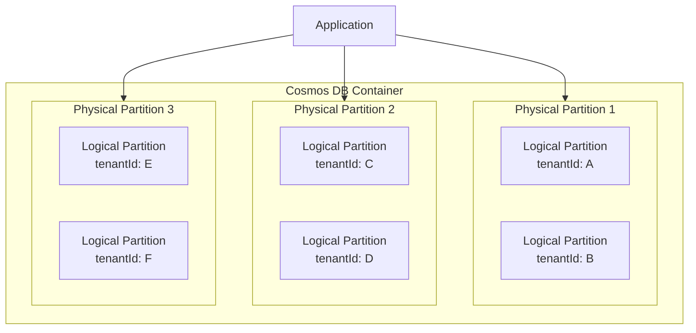
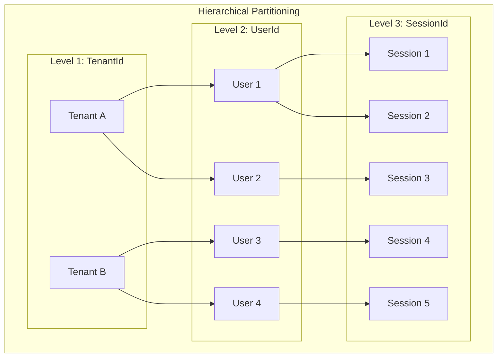
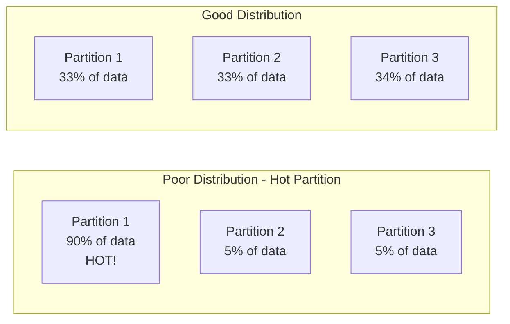

# How to Create Azure Cosmos DB Partitioning

Author: [nawazdhandala](https://github.com/nawazdhandala)

Tags: Azure, CosmosDB, Database, Partitioning

Description: Learn how to design effective partition strategies in Azure Cosmos DB for optimal scalability and performance.

---

Azure Cosmos DB is a globally distributed, multi-model database service that automatically scales to meet your application's demands. At the heart of this scalability lies partitioning, a mechanism that distributes your data across multiple physical resources. Understanding how to design an effective partitioning strategy is crucial for building high-performance applications.

## Understanding Partitions in Cosmos DB

Cosmos DB uses two types of partitions to organize and distribute data:

### Logical Partitions

A logical partition consists of a set of items that share the same partition key value. Think of it as a logical grouping of related documents. Each logical partition can store up to 20 GB of data.

### Physical Partitions

Physical partitions are the actual infrastructure resources that store and serve your data. Cosmos DB automatically manages physical partitions behind the scenes. Multiple logical partitions can reside on a single physical partition, and as your data grows, Cosmos DB automatically splits and redistributes logical partitions across more physical partitions.



## Partition Key Selection Strategies

Choosing the right partition key is the most important design decision you will make. A good partition key should have:

1. **High cardinality** - Many distinct values to distribute data evenly
2. **Even distribution** - Avoid hot partitions where one partition receives most of the traffic
3. **Query efficiency** - Support your most frequent queries

### Strategy 1: Natural Keys

Use a property that naturally varies across your data and aligns with your query patterns.

```javascript
// Good partition key for a multi-tenant application
// Each tenant's data is isolated and queries are scoped to a tenant
const orderDocument = {
    id: "order-12345",
    tenantId: "tenant-abc",  // Partition key
    customerId: "cust-789",
    orderDate: "2026-01-30",
    items: [
        { productId: "prod-001", quantity: 2, price: 29.99 }
    ],
    total: 59.98
};

// Create container with tenantId as partition key
const containerDefinition = {
    id: "orders",
    partitionKey: {
        paths: ["/tenantId"]
    }
};
```

### Strategy 2: Composite Keys

When no single property provides enough cardinality, combine multiple properties.

```javascript
// For IoT scenarios with many devices sending frequent readings
const sensorReading = {
    id: "reading-98765",
    // Composite partition key combining device and time bucket
    partitionKey: "device-001_2026-01",  // deviceId + year-month
    deviceId: "device-001",
    timestamp: "2026-01-30T14:30:00Z",
    temperature: 23.5,
    humidity: 45.2
};
```

### Strategy 3: Query-Driven Selection

Analyze your query patterns and choose a partition key that supports point reads and efficient queries.

```javascript
// E-commerce application with user-centric queries
// Most queries filter by userId, making it an ideal partition key
const userActivity = {
    id: "activity-54321",
    userId: "user-12345",  // Partition key
    activityType: "page_view",
    page: "/products/laptop-pro",
    timestamp: "2026-01-30T10:15:00Z",
    sessionId: "session-abc123"
};

// Efficient query - scoped to single partition
const query = {
    query: "SELECT * FROM c WHERE c.userId = @userId AND c.activityType = @type",
    parameters: [
        { name: "@userId", value: "user-12345" },
        { name: "@type", value: "page_view" }
    ]
};
```

## Synthetic Partition Keys

When your data does not have a naturally suitable partition key, you can create a synthetic one by combining existing properties or generating computed values.

### Combining Multiple Properties

```javascript
// Create a synthetic partition key by concatenating properties
function createDocument(category, region, productId) {
    // Synthetic key provides better distribution than category or region alone
    const syntheticPartitionKey = `${category}-${region}`;

    return {
        id: productId,
        partitionKey: syntheticPartitionKey,  // Synthetic partition key
        category: category,
        region: region,
        productId: productId,
        name: "Premium Widget",
        price: 149.99,
        inventory: 500
    };
}

// Example usage
const product = createDocument("electronics", "us-west", "prod-78901");
// partitionKey = "electronics-us-west"
```

### Random Suffix Strategy

For write-heavy workloads where you need to spread writes across partitions:

```javascript
// Add a random suffix to distribute writes across multiple partitions
function createHighVolumeDocument(eventType, data) {
    // Generate random suffix between 0 and 9
    // This creates 10 logical partitions per event type
    const randomSuffix = Math.floor(Math.random() * 10);
    const syntheticKey = `${eventType}-${randomSuffix}`;

    return {
        id: generateUUID(),
        partitionKey: syntheticKey,  // e.g., "click-7"
        eventType: eventType,
        timestamp: new Date().toISOString(),
        data: data
    };
}

// Note: Queries must fan out across all suffixes
async function queryAllPartitions(container, eventType) {
    const results = [];

    // Query each partition suffix
    for (let suffix = 0; suffix < 10; suffix++) {
        const query = {
            query: "SELECT * FROM c WHERE c.partitionKey = @pk",
            parameters: [{ name: "@pk", value: `${eventType}-${suffix}` }]
        };

        const { resources } = await container.items.query(query).fetchAll();
        results.push(...resources);
    }

    return results;
}
```

### Hash-Based Distribution

```javascript
// Use a hash function for deterministic distribution
const crypto = require('crypto');

function createHashBasedPartitionKey(customerId, bucketCount = 100) {
    // Create MD5 hash and take first 8 characters
    const hash = crypto.createHash('md5').update(customerId).digest('hex');
    const numericHash = parseInt(hash.substring(0, 8), 16);
    const bucket = numericHash % bucketCount;

    return `bucket-${bucket.toString().padStart(3, '0')}`;
}

// Example document with hash-based partition key
const transaction = {
    id: "txn-11111",
    partitionKey: createHashBasedPartitionKey("cust-12345"),  // e.g., "bucket-047"
    customerId: "cust-12345",
    amount: 250.00,
    timestamp: "2026-01-30T16:45:00Z"
};
```

## Hierarchical Partition Keys

Hierarchical partition keys allow you to define up to three levels of partition keys, providing more granular data distribution and enabling efficient queries at different levels of the hierarchy.



### Creating a Container with Hierarchical Partition Keys

```javascript
const { CosmosClient } = require("@azure/cosmos");

// Initialize the Cosmos client
const client = new CosmosClient({
    endpoint: "https://your-account.documents.azure.com:443/",
    key: "your-account-key"
});

async function createHierarchicalContainer() {
    const database = client.database("myDatabase");

    // Define container with hierarchical partition key
    const containerDefinition = {
        id: "userSessions",
        partitionKey: {
            paths: ["/tenantId", "/userId", "/sessionId"],  // Three-level hierarchy
            kind: "MultiHash",
            version: 2
        }
    };

    const { container } = await database.containers.createIfNotExists(
        containerDefinition,
        { throughput: 10000 }
    );

    console.log("Container created with hierarchical partition key");
    return container;
}
```

### Working with Hierarchical Partitions

```javascript
// Document structure for hierarchical partitioning
const sessionEvent = {
    id: "event-99999",
    tenantId: "contoso",        // Level 1 partition key
    userId: "user-456",         // Level 2 partition key
    sessionId: "sess-789",      // Level 3 partition key
    eventType: "button_click",
    elementId: "submit-form",
    timestamp: "2026-01-30T12:00:00Z",
    metadata: {
        browser: "Chrome",
        platform: "Windows"
    }
};

// Insert document with hierarchical partition key
async function insertSessionEvent(container, event) {
    const { resource } = await container.items.create(event);
    return resource;
}

// Query at different hierarchy levels
async function queryByTenant(container, tenantId) {
    // Queries all users and sessions for a tenant
    const query = {
        query: "SELECT * FROM c WHERE c.tenantId = @tenantId",
        parameters: [{ name: "@tenantId", value: tenantId }]
    };

    const { resources } = await container.items.query(query).fetchAll();
    return resources;
}

async function queryByTenantAndUser(container, tenantId, userId) {
    // More efficient - narrows to specific user within tenant
    const query = {
        query: "SELECT * FROM c WHERE c.tenantId = @tenantId AND c.userId = @userId",
        parameters: [
            { name: "@tenantId", value: tenantId },
            { name: "@userId", value: userId }
        ]
    };

    const { resources } = await container.items.query(query).fetchAll();
    return resources;
}

async function querySpecificSession(container, tenantId, userId, sessionId) {
    // Most efficient - targets exact logical partition
    const query = {
        query: `SELECT * FROM c
                WHERE c.tenantId = @tenantId
                AND c.userId = @userId
                AND c.sessionId = @sessionId`,
        parameters: [
            { name: "@tenantId", value: tenantId },
            { name: "@userId", value: userId },
            { name: "@sessionId", value: sessionId }
        ]
    };

    const { resources } = await container.items.query(query).fetchAll();
    return resources;
}
```

## Partition Distribution and Hot Partitions

Understanding how data is distributed across partitions helps you avoid performance bottlenecks.



### Monitoring Partition Usage

```javascript
// Query to analyze partition key distribution
async function analyzePartitionDistribution(container) {
    const query = {
        query: `SELECT
                    c.partitionKey as PartitionKey,
                    COUNT(1) as DocumentCount
                FROM c
                GROUP BY c.partitionKey
                ORDER BY COUNT(1) DESC`
    };

    const { resources } = await container.items.query(query).fetchAll();

    // Calculate distribution statistics
    const totalDocs = resources.reduce((sum, p) => sum + p.DocumentCount, 0);
    const avgDocs = totalDocs / resources.length;

    console.log("Partition Distribution Analysis:");
    console.log(`Total Documents: ${totalDocs}`);
    console.log(`Number of Partitions: ${resources.length}`);
    console.log(`Average Documents per Partition: ${avgDocs.toFixed(2)}`);

    // Identify potential hot partitions (more than 3x average)
    const hotPartitions = resources.filter(p => p.DocumentCount > avgDocs * 3);
    if (hotPartitions.length > 0) {
        console.log("\nWarning - Potential Hot Partitions:");
        hotPartitions.forEach(p => {
            console.log(`  ${p.PartitionKey}: ${p.DocumentCount} documents`);
        });
    }

    return resources;
}
```

## Best Practices Summary

1. **Choose partition keys wisely** - This decision cannot be changed without migrating data to a new container.

2. **Avoid low-cardinality keys** - Keys like boolean fields or status values create hot partitions.

3. **Consider query patterns** - Include the partition key in your WHERE clause for optimal performance.

4. **Use hierarchical keys for complex scenarios** - Multi-tenant applications with user-level isolation benefit greatly from hierarchical partitioning.

5. **Monitor and analyze** - Regularly check partition metrics in Azure Portal to identify imbalances.

6. **Plan for growth** - A partition key that works for 1,000 documents may not work for 1,000,000.

## Conclusion

Effective partitioning is the foundation of a scalable Cosmos DB solution. By understanding the differences between logical and physical partitions, selecting appropriate partition keys, and leveraging advanced features like synthetic and hierarchical partition keys, you can build applications that scale seamlessly from thousands to billions of operations.

Take the time to analyze your data patterns and query requirements before choosing a partition strategy. The effort invested in proper partition design will pay dividends in performance, cost efficiency, and operational simplicity as your application grows.
