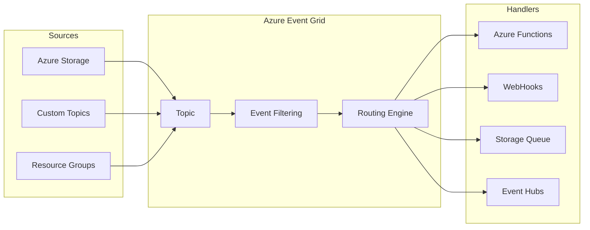
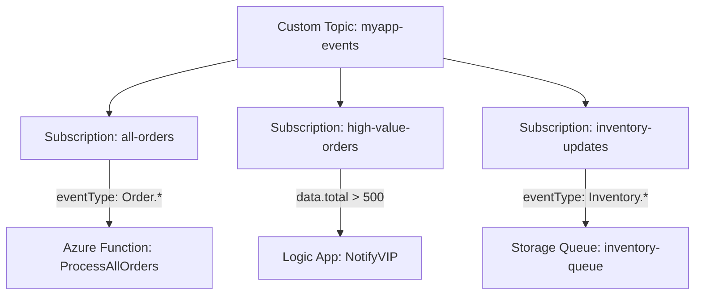
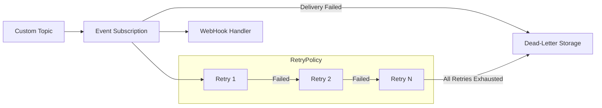

# How to Build Azure Event Grid

Author: [nawazdhandala](https://github.com/nawazdhandala)

Tags: Azure, Event Grid, Events, Serverless

Description: A hands-on guide to building event-driven architectures with Azure Event Grid, covering custom topics, subscriptions, filtering, and dead-letter handling.

---

Azure Event Grid is Microsoft's fully managed event routing service. It connects event sources to handlers with minimal latency and high throughput. Instead of polling for changes, your applications react to events as they happen.

## How Event Grid Works



Event Grid operates on three core concepts:

1. **Topics** are where events get published. System topics are built into Azure services. Custom topics are yours to create.
2. **Event Subscriptions** define which events go where. You can filter by event type, subject, or custom properties.
3. **Event Handlers** receive and process events. These can be Azure Functions, Logic Apps, WebHooks, or storage queues.

## Creating a Custom Topic

Custom topics let you publish your own events. Start by creating one:

```bash
# Set variables
RESOURCE_GROUP="rg-events-demo"
LOCATION="eastus"
TOPIC_NAME="myapp-events"

# Create resource group
az group create --name $RESOURCE_GROUP --location $LOCATION

# Create custom topic
az eventgrid topic create \
  --name $TOPIC_NAME \
  --resource-group $RESOURCE_GROUP \
  --location $LOCATION
```

Retrieve the topic endpoint and key for publishing:

```bash
# Get the topic endpoint
TOPIC_ENDPOINT=$(az eventgrid topic show \
  --name $TOPIC_NAME \
  --resource-group $RESOURCE_GROUP \
  --query "endpoint" \
  --output tsv)

# Get the access key
TOPIC_KEY=$(az eventgrid topic key list \
  --name $TOPIC_NAME \
  --resource-group $RESOURCE_GROUP \
  --query "key1" \
  --output tsv)

echo "Endpoint: $TOPIC_ENDPOINT"
echo "Key: $TOPIC_KEY"
```

## Publishing Events

Events follow the CloudEvents 1.0 schema or the Event Grid schema. Here is how to publish using both.

### Event Grid Schema

```bash
# Publish an event using Event Grid schema
az eventgrid event publish \
  --endpoint $TOPIC_ENDPOINT \
  --access-key $TOPIC_KEY \
  --events '[{
    "id": "1001",
    "eventType": "Order.Created",
    "subject": "orders/12345",
    "eventTime": "2026-01-30T10:00:00Z",
    "data": {
      "orderId": "12345",
      "customerId": "cust-789",
      "total": 99.99
    },
    "dataVersion": "1.0"
  }]'
```

### CloudEvents Schema

```bash
# Publish using CloudEvents schema
curl -X POST "$TOPIC_ENDPOINT" \
  -H "Content-Type: application/cloudevents+json; charset=utf-8" \
  -H "aeg-sas-key: $TOPIC_KEY" \
  -d '{
    "specversion": "1.0",
    "type": "Order.Created",
    "source": "/myapp/orders",
    "id": "1002",
    "time": "2026-01-30T10:05:00Z",
    "data": {
      "orderId": "12346",
      "customerId": "cust-790",
      "total": 149.99
    }
  }'
```

### Publishing from Code (Python)

```python
from azure.eventgrid import EventGridPublisherClient
from azure.core.credentials import AzureKeyCredential
from azure.eventgrid import EventGridEvent
import datetime

endpoint = "https://myapp-events.eastus-1.eventgrid.azure.net/api/events"
key = "your-access-key"

client = EventGridPublisherClient(endpoint, AzureKeyCredential(key))

event = EventGridEvent(
    event_type="Order.Created",
    subject="orders/12347",
    data={
        "orderId": "12347",
        "customerId": "cust-791",
        "total": 249.99
    },
    data_version="1.0"
)

client.send([event])
print("Event published")
```

## Creating Event Subscriptions

Subscriptions connect topics to handlers. Here is the event flow with subscriptions:



### WebHook Subscription

```bash
# Create a subscription with a WebHook endpoint
az eventgrid event-subscription create \
  --name orders-webhook \
  --source-resource-id "/subscriptions/{sub-id}/resourceGroups/$RESOURCE_GROUP/providers/Microsoft.EventGrid/topics/$TOPIC_NAME" \
  --endpoint "https://myapp.azurewebsites.net/api/events" \
  --endpoint-type webhook
```

### Azure Function Subscription

```bash
# Subscribe to an Azure Function
FUNCTION_RESOURCE_ID="/subscriptions/{sub-id}/resourceGroups/$RESOURCE_GROUP/providers/Microsoft.Web/sites/myapp-functions/functions/ProcessOrder"

az eventgrid event-subscription create \
  --name orders-function \
  --source-resource-id "/subscriptions/{sub-id}/resourceGroups/$RESOURCE_GROUP/providers/Microsoft.EventGrid/topics/$TOPIC_NAME" \
  --endpoint-type azurefunction \
  --endpoint $FUNCTION_RESOURCE_ID
```

### Storage Queue Subscription

```bash
# Subscribe to a Storage Queue
STORAGE_QUEUE_ID="/subscriptions/{sub-id}/resourceGroups/$RESOURCE_GROUP/providers/Microsoft.Storage/storageAccounts/mystorageaccount/queueServices/default/queues/events-queue"

az eventgrid event-subscription create \
  --name orders-queue \
  --source-resource-id "/subscriptions/{sub-id}/resourceGroups/$RESOURCE_GROUP/providers/Microsoft.EventGrid/topics/$TOPIC_NAME" \
  --endpoint-type storagequeue \
  --endpoint $STORAGE_QUEUE_ID
```

## Event Filtering

Filtering lets you route specific events to specific handlers. Event Grid supports three filter types.

### Event Type Filtering

```bash
# Only receive Order.Created events
az eventgrid event-subscription create \
  --name new-orders-only \
  --source-resource-id "/subscriptions/{sub-id}/resourceGroups/$RESOURCE_GROUP/providers/Microsoft.EventGrid/topics/$TOPIC_NAME" \
  --endpoint "https://myapp.azurewebsites.net/api/new-orders" \
  --included-event-types "Order.Created"
```

### Subject Filtering

```bash
# Filter by subject prefix and suffix
az eventgrid event-subscription create \
  --name premium-orders \
  --source-resource-id "/subscriptions/{sub-id}/resourceGroups/$RESOURCE_GROUP/providers/Microsoft.EventGrid/topics/$TOPIC_NAME" \
  --endpoint "https://myapp.azurewebsites.net/api/premium" \
  --subject-begins-with "orders/premium" \
  --subject-ends-with ".json"
```

### Advanced Filtering

Advanced filters let you filter on event data properties:

```bash
# Filter on data properties using advanced filters
az eventgrid event-subscription create \
  --name high-value-orders \
  --source-resource-id "/subscriptions/{sub-id}/resourceGroups/$RESOURCE_GROUP/providers/Microsoft.EventGrid/topics/$TOPIC_NAME" \
  --endpoint "https://myapp.azurewebsites.net/api/high-value" \
  --advanced-filter data.total NumberGreaterThan 500
```

Multiple advanced filters (all must match):

```bash
az eventgrid event-subscription create \
  --name vip-large-orders \
  --source-resource-id "/subscriptions/{sub-id}/resourceGroups/$RESOURCE_GROUP/providers/Microsoft.EventGrid/topics/$TOPIC_NAME" \
  --endpoint "https://myapp.azurewebsites.net/api/vip" \
  --advanced-filter data.total NumberGreaterThan 1000 \
  --advanced-filter data.customerTier StringIn Premium VIP
```

Available filter operators:

| Operator | Description |
|----------|-------------|
| NumberIn | Value is in the list |
| NumberNotIn | Value is not in the list |
| NumberGreaterThan | Value is greater than |
| NumberLessThan | Value is less than |
| StringContains | String contains substring |
| StringBeginsWith | String starts with |
| StringEndsWith | String ends with |
| StringIn | String is in the list |
| BoolEquals | Boolean equals |
| IsNullOrUndefined | Value is null or missing |
| IsNotNull | Value exists |

## Dead-Letter Destinations

When Event Grid cannot deliver an event after all retries, it can send the event to a dead-letter destination. This prevents data loss and enables troubleshooting.



### Configure Dead-Letter Storage

First, create a storage account and container:

```bash
# Create storage account for dead-letters
STORAGE_ACCOUNT="myappdeadletters"

az storage account create \
  --name $STORAGE_ACCOUNT \
  --resource-group $RESOURCE_GROUP \
  --location $LOCATION \
  --sku Standard_LRS

# Create container
az storage container create \
  --name deadletters \
  --account-name $STORAGE_ACCOUNT
```

Then create or update a subscription with dead-lettering:

```bash
# Get storage account resource ID
STORAGE_ID=$(az storage account show \
  --name $STORAGE_ACCOUNT \
  --resource-group $RESOURCE_GROUP \
  --query id \
  --output tsv)

# Create subscription with dead-letter destination
az eventgrid event-subscription create \
  --name orders-with-dlq \
  --source-resource-id "/subscriptions/{sub-id}/resourceGroups/$RESOURCE_GROUP/providers/Microsoft.EventGrid/topics/$TOPIC_NAME" \
  --endpoint "https://myapp.azurewebsites.net/api/orders" \
  --deadletter-endpoint "$STORAGE_ID/blobServices/default/containers/deadletters"
```

### Configure Retry Policy

Customize retry behavior alongside dead-lettering:

```bash
az eventgrid event-subscription create \
  --name orders-custom-retry \
  --source-resource-id "/subscriptions/{sub-id}/resourceGroups/$RESOURCE_GROUP/providers/Microsoft.EventGrid/topics/$TOPIC_NAME" \
  --endpoint "https://myapp.azurewebsites.net/api/orders" \
  --deadletter-endpoint "$STORAGE_ID/blobServices/default/containers/deadletters" \
  --max-delivery-attempts 10 \
  --event-ttl 1440
```

Parameters:
- `max-delivery-attempts`: Number of retries (1-30, default 30)
- `event-ttl`: Time to live in minutes (1-1440, default 1440)

### Process Dead-Lettered Events

Create an Azure Function to process dead-lettered events:

```python
import azure.functions as func
import json
import logging

def main(blob: func.InputStream):
    logging.info(f"Processing dead-letter: {blob.name}")

    content = blob.read().decode('utf-8')
    event = json.loads(content)

    logging.info(f"Event type: {event.get('eventType')}")
    logging.info(f"Subject: {event.get('subject')}")
    logging.info(f"Dead-letter reason: {event.get('deadLetterReason')}")
    logging.info(f"Delivery attempts: {event.get('deliveryAttempts')}")

    # Implement your recovery logic here
    # - Retry with backoff
    # - Send to alternate endpoint
    # - Alert operations team
```

## Handling Events in Azure Functions

Here is a complete Azure Function that receives and processes Event Grid events:

```python
import azure.functions as func
import json
import logging

app = func.FunctionApp()

@app.function_name(name="ProcessOrderEvents")
@app.event_grid_trigger(arg_name="event")
def process_order(event: func.EventGridEvent):
    logging.info(f"Event ID: {event.id}")
    logging.info(f"Event Type: {event.event_type}")
    logging.info(f"Subject: {event.subject}")

    data = event.get_json()

    if event.event_type == "Order.Created":
        handle_new_order(data)
    elif event.event_type == "Order.Updated":
        handle_order_update(data)
    elif event.event_type == "Order.Cancelled":
        handle_order_cancellation(data)

def handle_new_order(data):
    order_id = data.get("orderId")
    total = data.get("total")
    logging.info(f"New order {order_id} for ${total}")
    # Process new order

def handle_order_update(data):
    order_id = data.get("orderId")
    logging.info(f"Order {order_id} updated")
    # Process update

def handle_order_cancellation(data):
    order_id = data.get("orderId")
    logging.info(f"Order {order_id} cancelled")
    # Process cancellation
```

## System Topics

System topics automatically emit events from Azure services. You do not need to create a custom topic.

### Subscribe to Blob Storage Events

```bash
# Create system topic for storage account
az eventgrid system-topic create \
  --name storage-events \
  --resource-group $RESOURCE_GROUP \
  --location $LOCATION \
  --source "/subscriptions/{sub-id}/resourceGroups/$RESOURCE_GROUP/providers/Microsoft.Storage/storageAccounts/mystorageaccount" \
  --topic-type Microsoft.Storage.StorageAccounts

# Subscribe to blob created events
az eventgrid system-topic event-subscription create \
  --name blob-created \
  --resource-group $RESOURCE_GROUP \
  --system-topic-name storage-events \
  --endpoint "https://myapp.azurewebsites.net/api/blob-handler" \
  --included-event-types Microsoft.Storage.BlobCreated \
  --subject-begins-with "/blobServices/default/containers/uploads/"
```

### Common System Topic Event Types

| Azure Service | Event Types |
|--------------|-------------|
| Blob Storage | BlobCreated, BlobDeleted |
| Resource Groups | ResourceWriteSuccess, ResourceDeleteSuccess |
| Container Registry | ImagePushed, ImageDeleted |
| IoT Hub | DeviceCreated, DeviceTelemetry |
| Service Bus | ActiveMessagesAvailable |
| Key Vault | SecretNewVersionCreated, CertificateExpired |

## Event Domains

For multi-tenant applications, event domains let you manage thousands of topics under a single endpoint:

```bash
# Create an event domain
az eventgrid domain create \
  --name myapp-domain \
  --resource-group $RESOURCE_GROUP \
  --location $LOCATION

# Publish to a domain topic (auto-created)
DOMAIN_ENDPOINT=$(az eventgrid domain show \
  --name myapp-domain \
  --resource-group $RESOURCE_GROUP \
  --query endpoint \
  --output tsv)

DOMAIN_KEY=$(az eventgrid domain key list \
  --name myapp-domain \
  --resource-group $RESOURCE_GROUP \
  --query key1 \
  --output tsv)

# Publish event to tenant-specific topic
curl -X POST "$DOMAIN_ENDPOINT" \
  -H "Content-Type: application/json" \
  -H "aeg-sas-key: $DOMAIN_KEY" \
  -d '[{
    "id": "1",
    "eventType": "Order.Created",
    "subject": "orders/123",
    "eventTime": "2026-01-30T12:00:00Z",
    "topic": "tenant-abc",
    "data": {"orderId": "123"},
    "dataVersion": "1.0"
  }]'
```

## Monitoring and Troubleshooting

### View Metrics

```bash
# List event subscription metrics
az monitor metrics list \
  --resource "/subscriptions/{sub-id}/resourceGroups/$RESOURCE_GROUP/providers/Microsoft.EventGrid/topics/$TOPIC_NAME" \
  --metric "PublishSuccessCount,DeliverySuccessCount,DeadLetteredCount" \
  --interval PT1H
```

### Check Subscription Health

```bash
# Get subscription details
az eventgrid event-subscription show \
  --name orders-webhook \
  --source-resource-id "/subscriptions/{sub-id}/resourceGroups/$RESOURCE_GROUP/providers/Microsoft.EventGrid/topics/$TOPIC_NAME"
```

### Enable Diagnostic Logs

```bash
# Enable diagnostic logging to Log Analytics
az monitor diagnostic-settings create \
  --name eventgrid-logs \
  --resource "/subscriptions/{sub-id}/resourceGroups/$RESOURCE_GROUP/providers/Microsoft.EventGrid/topics/$TOPIC_NAME" \
  --workspace "/subscriptions/{sub-id}/resourceGroups/$RESOURCE_GROUP/providers/Microsoft.OperationalInsights/workspaces/myworkspace" \
  --logs '[{"category": "DeliveryFailures", "enabled": true}]' \
  --metrics '[{"category": "AllMetrics", "enabled": true}]'
```

## Best Practices

1. **Use CloudEvents schema** for new applications. It is an industry standard and improves interoperability.

2. **Always configure dead-letter destinations** in production. Events that cannot be delivered should never disappear silently.

3. **Keep event payloads small**. Event Grid has a 1MB limit per event. Store large data elsewhere and include a reference in the event.

4. **Use advanced filtering** to reduce noise at the subscription level rather than filtering in your handler code.

5. **Implement idempotent handlers**. Event Grid guarantees at-least-once delivery, so your handlers may receive duplicate events.

6. **Monitor delivery metrics**. Set up alerts for failed deliveries and dead-lettered events.

7. **Validate webhook endpoints**. Event Grid sends a validation request when you create a subscription. Your endpoint must echo back the validation code.

---

Azure Event Grid simplifies event-driven architectures by handling the routing, filtering, and delivery mechanics. You focus on publishing events and writing handlers. Start with a custom topic and a single subscription, then expand as your event-driven patterns mature.
