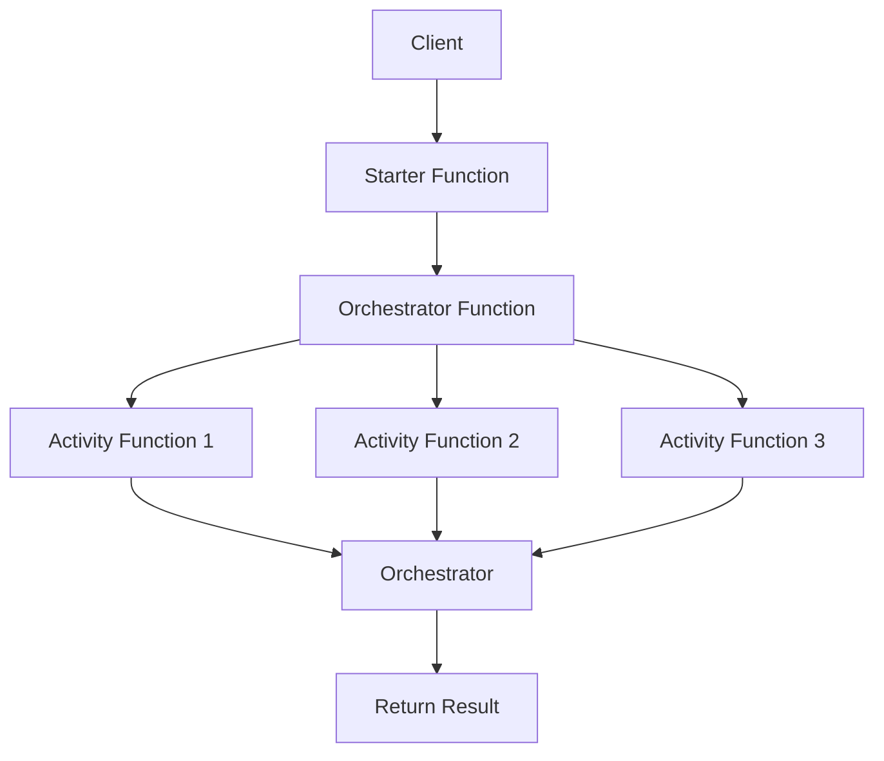
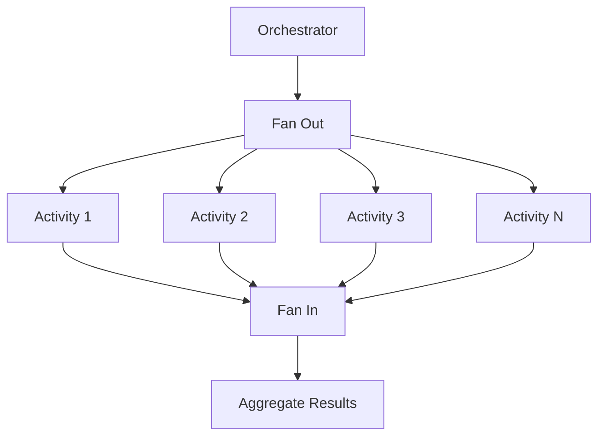
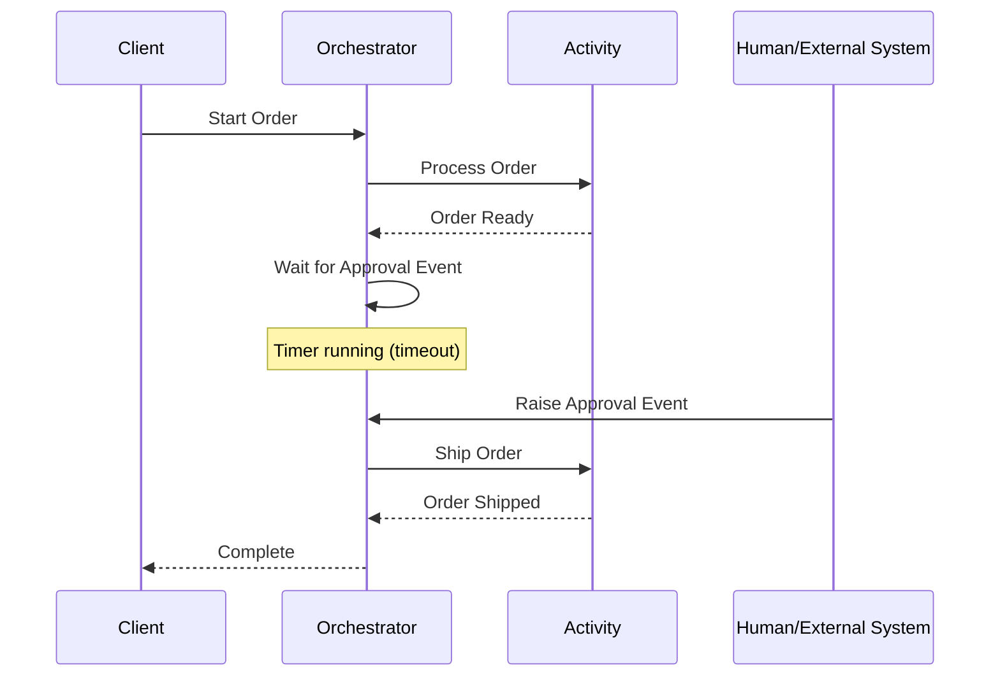

# How to Create Azure Functions Durable

Author: [nawazdhandala](https://github.com/nawazdhandala)

Tags: Azure, Serverless, Functions, DevOps

Description: Learn how to build stateful, long-running workflows in Azure using Durable Functions with practical orchestration patterns and real-world examples.

---

Azure Functions provide a serverless compute platform that lets you run event-driven code without managing infrastructure. However, standard Azure Functions are stateless and short-lived, which limits their usefulness for complex workflows. Azure Durable Functions extend the standard Functions model to support stateful, long-running operations with orchestration patterns that would otherwise require significant custom code.

## What Are Durable Functions?

Durable Functions is an extension of Azure Functions that lets you write stateful functions in a serverless environment. The extension manages state, checkpoints, and restarts for you, enabling you to:

- Define workflows in code using orchestrator functions
- Chain functions together with automatic retry and error handling
- Fan out work to parallel functions and aggregate results
- Wait for external events and human interaction
- Maintain state across function invocations



## Key Components

Durable Functions consist of three main function types:

| Component | Purpose | Characteristics |
|-----------|---------|-----------------|
| **Starter Function** | Entry point that starts orchestrations | HTTP triggered, short-lived |
| **Orchestrator Function** | Defines the workflow logic | Deterministic, replayable |
| **Activity Function** | Performs actual work | Can be long-running, stateless |

## Setting Up Your Project

### Prerequisites

Before you begin, ensure you have the following installed:

- Azure Functions Core Tools v4+
- .NET 6 SDK or later (for C#) or Node.js 18+ (for JavaScript/TypeScript)
- Azure subscription
- Visual Studio Code with Azure Functions extension

### Creating a New Project

Create a new Azure Functions project with Durable Functions support.

```bash
# Create a new directory and initialize the project
mkdir durable-functions-demo
cd durable-functions-demo

# Initialize a new Functions project (JavaScript/TypeScript)
func init --worker-runtime node --language typescript

# Install the Durable Functions extension
npm install durable-functions
npm install @azure/functions
```

For C# projects, you would use:

```bash
# Initialize a C# Functions project
func init --worker-runtime dotnet

# Add the Durable Functions NuGet package
dotnet add package Microsoft.Azure.WebJobs.Extensions.DurableTask
```

## Building Your First Durable Function

Let's create a simple workflow that processes an order by validating it, charging payment, and sending confirmation.

### Project Structure

```
durable-functions-demo/
├── src/
│   ├── functions/
│   │   ├── httpStarter.ts       # HTTP trigger to start orchestration
│   │   ├── orderOrchestrator.ts # Orchestrator function
│   │   └── activities/
│   │       ├── validateOrder.ts
│   │       ├── processPayment.ts
│   │       └── sendConfirmation.ts
├── host.json
├── local.settings.json
└── package.json
```

### The Starter Function

The starter function provides an HTTP endpoint to kick off orchestrations.

```typescript
// src/functions/httpStarter.ts
import { app, HttpRequest, HttpResponseInit, InvocationContext } from '@azure/functions';
import * as df from 'durable-functions';

// This function serves as the entry point for starting new orchestrations
// It accepts an HTTP request with order data and returns orchestration status URLs
app.http('httpStarter', {
    route: 'orchestrators/{orchestratorName}',
    extraInputs: [df.input.durableClient()],
    handler: async (request: HttpRequest, context: InvocationContext): Promise<HttpResponseInit> => {
        // Get the Durable Functions client from the input binding
        const client = df.getClient(context);

        // Parse the request body to get order data
        const body = await request.json() as Record<string, unknown>;

        // Extract the orchestrator name from the route parameters
        const orchestratorName = request.params.orchestratorName;

        // Start a new orchestration instance with the provided input
        const instanceId = await client.startNew(orchestratorName, {
            input: body
        });

        context.log(`Started orchestration with ID = '${instanceId}'.`);

        // Return URLs for checking status, sending events, and terminating
        return client.createCheckStatusResponse(request, instanceId);
    }
});
```

### The Orchestrator Function

The orchestrator defines the workflow logic and coordinates activity functions.

```typescript
// src/functions/orderOrchestrator.ts
import * as df from 'durable-functions';
import { OrchestrationContext, OrchestrationHandler } from 'durable-functions';

// Define the order interface for type safety
interface OrderData {
    orderId: string;
    customerId: string;
    items: Array<{
        productId: string;
        quantity: number;
        price: number;
    }>;
    paymentMethod: string;
}

// Define the orchestration result interface
interface OrchestrationResult {
    orderId: string;
    status: string;
    validationResult: boolean;
    paymentResult: { transactionId: string; amount: number };
    confirmationResult: { sent: boolean; timestamp: string };
}

// The orchestrator function coordinates the workflow
// IMPORTANT: Orchestrators must be deterministic - no random values, current time, or I/O
const orderOrchestrator: OrchestrationHandler = function* (context: OrchestrationContext) {
    const orderData = context.df.getInput() as OrderData;

    // Step 1: Validate the order
    // callActivity schedules the activity and yields until it completes
    const validationResult: boolean = yield context.df.callActivity('validateOrder', orderData);

    if (!validationResult) {
        // Return early if validation fails
        return {
            orderId: orderData.orderId,
            status: 'ValidationFailed',
            validationResult
        };
    }

    // Step 2: Process payment
    // Activities can throw exceptions which bubble up to the orchestrator
    const paymentResult: { transactionId: string; amount: number } = yield context.df.callActivity('processPayment', {
        orderId: orderData.orderId,
        customerId: orderData.customerId,
        amount: calculateTotal(orderData.items),
        paymentMethod: orderData.paymentMethod
    });

    // Step 3: Send confirmation
    const confirmationResult: { sent: boolean; timestamp: string } = yield context.df.callActivity('sendConfirmation', {
        orderId: orderData.orderId,
        customerId: orderData.customerId,
        transactionId: paymentResult.transactionId
    });

    // Return the complete result
    const result: OrchestrationResult = {
        orderId: orderData.orderId,
        status: 'Completed',
        validationResult,
        paymentResult,
        confirmationResult
    };

    return result;
};

// Helper function to calculate order total
function calculateTotal(items: Array<{ quantity: number; price: number }>): number {
    return items.reduce((sum, item) => sum + (item.quantity * item.price), 0);
}

// Register the orchestrator with Durable Functions
df.app.orchestration('orderOrchestrator', orderOrchestrator);
```

### Activity Functions

Activity functions perform the actual work. They can make network calls, access databases, and perform I/O operations.

```typescript
// src/functions/activities/validateOrder.ts
import * as df from 'durable-functions';
import { ActivityHandler } from 'durable-functions';

interface OrderData {
    orderId: string;
    customerId: string;
    items: Array<{
        productId: string;
        quantity: number;
        price: number;
    }>;
}

// Activity functions perform the actual work
// They can be long-running and make external API calls
const validateOrder: ActivityHandler = async (orderData: OrderData): Promise<boolean> => {
    // Validate that the order has items
    if (!orderData.items || orderData.items.length === 0) {
        return false;
    }

    // Validate that all items have positive quantities
    for (const item of orderData.items) {
        if (item.quantity <= 0 || item.price <= 0) {
            return false;
        }
    }

    // In a real application, you would check inventory, validate customer, etc.
    // For example:
    // const inventoryCheck = await inventoryService.checkAvailability(orderData.items);
    // const customerValid = await customerService.validateCustomer(orderData.customerId);

    return true;
};

df.app.activity('validateOrder', { handler: validateOrder });
```

```typescript
// src/functions/activities/processPayment.ts
import * as df from 'durable-functions';
import { ActivityHandler } from 'durable-functions';

interface PaymentInput {
    orderId: string;
    customerId: string;
    amount: number;
    paymentMethod: string;
}

interface PaymentResult {
    transactionId: string;
    amount: number;
    status: string;
}

// Process payment through a payment gateway
// This activity could call Stripe, PayPal, or another payment processor
const processPayment: ActivityHandler = async (input: PaymentInput): Promise<PaymentResult> => {
    // Simulate payment processing delay
    await new Promise(resolve => setTimeout(resolve, 1000));

    // In production, you would integrate with a real payment gateway
    // const stripe = require('stripe')(process.env.STRIPE_SECRET_KEY);
    // const charge = await stripe.charges.create({
    //     amount: input.amount * 100,
    //     currency: 'usd',
    //     customer: input.customerId,
    // });

    // Generate a mock transaction ID
    const transactionId = `txn_${Date.now()}_${input.orderId}`;

    return {
        transactionId,
        amount: input.amount,
        status: 'Completed'
    };
};

df.app.activity('processPayment', { handler: processPayment });
```

```typescript
// src/functions/activities/sendConfirmation.ts
import * as df from 'durable-functions';
import { ActivityHandler } from 'durable-functions';

interface ConfirmationInput {
    orderId: string;
    customerId: string;
    transactionId: string;
}

interface ConfirmationResult {
    sent: boolean;
    timestamp: string;
    channel: string;
}

// Send order confirmation via email or other channels
const sendConfirmation: ActivityHandler = async (input: ConfirmationInput): Promise<ConfirmationResult> => {
    // In production, you would integrate with an email service
    // await sendGrid.send({
    //     to: customerEmail,
    //     subject: `Order Confirmation - ${input.orderId}`,
    //     body: `Your order has been processed. Transaction: ${input.transactionId}`
    // });

    console.log(`Sending confirmation for order ${input.orderId}`);

    return {
        sent: true,
        timestamp: new Date().toISOString(),
        channel: 'email'
    };
};

df.app.activity('sendConfirmation', { handler: sendConfirmation });
```

## Advanced Patterns

### Fan-Out/Fan-In Pattern

Process multiple items in parallel and aggregate results. This pattern is useful for batch processing scenarios.



```typescript
// src/functions/batchOrchestrator.ts
import * as df from 'durable-functions';
import { OrchestrationContext, OrchestrationHandler, Task } from 'durable-functions';

interface BatchInput {
    items: string[];
    batchSize: number;
}

interface ProcessResult {
    itemId: string;
    success: boolean;
    result: unknown;
}

// Fan-out/fan-in pattern for parallel processing
// Useful for batch operations where items can be processed independently
const batchOrchestrator: OrchestrationHandler = function* (context: OrchestrationContext) {
    const input = context.df.getInput() as BatchInput;
    const items = input.items;

    // Create an array of parallel tasks
    // Each task processes one item independently
    const parallelTasks: Task[] = items.map(item =>
        context.df.callActivity('processItem', item)
    );

    // Wait for all tasks to complete (fan-in)
    // This is similar to Promise.all() but works with the Durable Task framework
    const results: ProcessResult[] = yield context.df.Task.all(parallelTasks);

    // Aggregate results
    const summary = {
        total: results.length,
        successful: results.filter(r => r.success).length,
        failed: results.filter(r => !r.success).length,
        results: results
    };

    return summary;
};

df.app.orchestration('batchOrchestrator', batchOrchestrator);
```

### Human Interaction Pattern

Wait for external events like approvals before continuing the workflow.



```typescript
// src/functions/approvalOrchestrator.ts
import * as df from 'durable-functions';
import { OrchestrationContext, OrchestrationHandler } from 'durable-functions';

interface ApprovalInput {
    requestId: string;
    requestedBy: string;
    amount: number;
    description: string;
}

interface ApprovalEvent {
    approved: boolean;
    approvedBy: string;
    comments?: string;
}

// Human interaction pattern with timeout
// Useful for approval workflows, manual reviews, or any process requiring human input
const approvalOrchestrator: OrchestrationHandler = function* (context: OrchestrationContext) {
    const input = context.df.getInput() as ApprovalInput;

    // Send notification to approver
    yield context.df.callActivity('sendApprovalRequest', {
        requestId: input.requestId,
        requestedBy: input.requestedBy,
        amount: input.amount,
        description: input.description
    });

    // Set up a timeout - use context.df.currentUtcDateTime for determinism
    // IMPORTANT: Never use Date.now() or new Date() in orchestrators
    const expiration = new Date(context.df.currentUtcDateTime.getTime() + 72 * 60 * 60 * 1000); // 72 hours
    const timeoutTask = context.df.createTimer(expiration);

    // Wait for either approval event or timeout
    const approvalTask = context.df.waitForExternalEvent<ApprovalEvent>('ApprovalResponse');

    // Race between approval and timeout
    const winner = yield context.df.Task.any([approvalTask, timeoutTask]);

    if (winner === timeoutTask) {
        // Timeout occurred - escalate or auto-reject
        yield context.df.callActivity('handleTimeout', input.requestId);
        return {
            status: 'TimedOut',
            requestId: input.requestId
        };
    }

    // Cancel the timer since we got a response
    timeoutTask.cancel();

    // Get the approval result
    const approvalResult = approvalTask.result;

    if (approvalResult.approved) {
        // Process the approved request
        yield context.df.callActivity('processApprovedRequest', {
            requestId: input.requestId,
            approvedBy: approvalResult.approvedBy
        });

        return {
            status: 'Approved',
            requestId: input.requestId,
            approvedBy: approvalResult.approvedBy
        };
    } else {
        // Handle rejection
        yield context.df.callActivity('processRejectedRequest', {
            requestId: input.requestId,
            rejectedBy: approvalResult.approvedBy,
            reason: approvalResult.comments
        });

        return {
            status: 'Rejected',
            requestId: input.requestId,
            rejectedBy: approvalResult.approvedBy,
            reason: approvalResult.comments
        };
    }
};

df.app.orchestration('approvalOrchestrator', approvalOrchestrator);
```

To raise the approval event from an external system:

```typescript
// src/functions/raiseApprovalEvent.ts
import { app, HttpRequest, HttpResponseInit, InvocationContext } from '@azure/functions';
import * as df from 'durable-functions';

// Endpoint for external systems to send approval decisions
app.http('raiseApprovalEvent', {
    methods: ['POST'],
    route: 'approval/{instanceId}',
    extraInputs: [df.input.durableClient()],
    handler: async (request: HttpRequest, context: InvocationContext): Promise<HttpResponseInit> => {
        const client = df.getClient(context);
        const instanceId = request.params.instanceId;
        const body = await request.json() as { approved: boolean; approvedBy: string; comments?: string };

        // Raise the event that the orchestrator is waiting for
        await client.raiseEvent(instanceId, 'ApprovalResponse', {
            approved: body.approved,
            approvedBy: body.approvedBy,
            comments: body.comments
        });

        return {
            status: 202,
            body: JSON.stringify({ message: 'Approval event raised successfully' })
        };
    }
});
```

### Retry Pattern with Exponential Backoff

Handle transient failures with configurable retry policies.

```typescript
// src/functions/resilientOrchestrator.ts
import * as df from 'durable-functions';
import { OrchestrationContext, OrchestrationHandler, RetryOptions } from 'durable-functions';

interface ApiCallInput {
    endpoint: string;
    payload: Record<string, unknown>;
}

// Configure retry behavior for activity calls
// This helps handle transient failures like network issues or rate limiting
const retryOptions: RetryOptions = new df.RetryOptions(
    5000,   // First retry interval: 5 seconds
    5       // Maximum number of attempts
);

// Configure exponential backoff
// Each retry waits longer: 5s, 10s, 20s, 40s, 80s (capped at maxRetryInterval)
retryOptions.backoffCoefficient = 2;
retryOptions.maxRetryInterval = 60000; // Cap at 60 seconds
retryOptions.retryTimeout = 300000;    // Total timeout: 5 minutes

const resilientOrchestrator: OrchestrationHandler = function* (context: OrchestrationContext) {
    const input = context.df.getInput() as ApiCallInput;

    try {
        // Call activity with retry policy
        // If the activity throws, it will be retried according to retryOptions
        const result = yield context.df.callActivityWithRetry(
            'callExternalApi',
            retryOptions,
            input
        );

        return {
            status: 'Success',
            result
        };
    } catch (error) {
        // All retries exhausted - handle the permanent failure
        context.df.setCustomStatus('PermanentFailure');

        // Optionally call a compensation activity
        yield context.df.callActivity('handlePermanentFailure', {
            input,
            error: error instanceof Error ? error.message : 'Unknown error'
        });

        return {
            status: 'Failed',
            error: error instanceof Error ? error.message : 'Unknown error'
        };
    }
};

df.app.orchestration('resilientOrchestrator', resilientOrchestrator);
```

### Sub-Orchestration Pattern

Break complex workflows into smaller, reusable orchestrations.

```typescript
// src/functions/mainOrchestrator.ts
import * as df from 'durable-functions';
import { OrchestrationContext, OrchestrationHandler } from 'durable-functions';

interface OrderInput {
    orderId: string;
    customerId: string;
    items: Array<{ productId: string; quantity: number }>;
    shippingAddress: string;
}

// Main orchestrator that delegates to sub-orchestrations
// This pattern helps manage complexity and enables reuse
const mainOrchestrator: OrchestrationHandler = function* (context: OrchestrationContext) {
    const order = context.df.getInput() as OrderInput;

    // Sub-orchestration for inventory management
    // This could be a complex workflow on its own
    const inventoryResult = yield context.df.callSubOrchestrator(
        'inventoryOrchestrator',
        order.items
    );

    if (!inventoryResult.success) {
        return {
            status: 'Failed',
            reason: 'Inventory unavailable',
            details: inventoryResult
        };
    }

    // Sub-orchestration for payment processing
    const paymentResult = yield context.df.callSubOrchestrator(
        'paymentOrchestrator',
        {
            orderId: order.orderId,
            customerId: order.customerId,
            amount: inventoryResult.totalAmount
        }
    );

    // Sub-orchestration for fulfillment
    const fulfillmentResult = yield context.df.callSubOrchestrator(
        'fulfillmentOrchestrator',
        {
            orderId: order.orderId,
            items: order.items,
            shippingAddress: order.shippingAddress
        }
    );

    return {
        status: 'Completed',
        orderId: order.orderId,
        inventory: inventoryResult,
        payment: paymentResult,
        fulfillment: fulfillmentResult
    };
};

df.app.orchestration('mainOrchestrator', mainOrchestrator);
```

## Monitoring and Management

### Checking Orchestration Status

```typescript
// src/functions/getStatus.ts
import { app, HttpRequest, HttpResponseInit, InvocationContext } from '@azure/functions';
import * as df from 'durable-functions';

// Query the status of an orchestration instance
app.http('getStatus', {
    methods: ['GET'],
    route: 'status/{instanceId}',
    extraInputs: [df.input.durableClient()],
    handler: async (request: HttpRequest, context: InvocationContext): Promise<HttpResponseInit> => {
        const client = df.getClient(context);
        const instanceId = request.params.instanceId;

        // Get detailed status including input, output, and history
        const status = await client.getStatus(instanceId, {
            showHistory: true,
            showHistoryOutput: true,
            showInput: true
        });

        if (!status) {
            return {
                status: 404,
                body: JSON.stringify({ error: 'Instance not found' })
            };
        }

        return {
            status: 200,
            headers: { 'Content-Type': 'application/json' },
            body: JSON.stringify(status)
        };
    }
});
```

### Purging Old Instances

Clean up completed orchestrations to manage storage costs.

```typescript
// src/functions/purgeHistory.ts
import { app, HttpRequest, HttpResponseInit, InvocationContext } from '@azure/functions';
import * as df from 'durable-functions';
import { OrchestrationRuntimeStatus } from 'durable-functions';

// Purge completed orchestrations older than specified days
app.http('purgeHistory', {
    methods: ['POST'],
    route: 'admin/purge',
    extraInputs: [df.input.durableClient()],
    handler: async (request: HttpRequest, context: InvocationContext): Promise<HttpResponseInit> => {
        const client = df.getClient(context);
        const body = await request.json() as { daysOld: number };
        const daysOld = body.daysOld || 30;

        const cutoffDate = new Date();
        cutoffDate.setDate(cutoffDate.getDate() - daysOld);

        // Purge completed and terminated instances
        const purgeResult = await client.purgeInstancesBy({
            createdTimeFrom: new Date(0), // Beginning of time
            createdTimeTo: cutoffDate,
            runtimeStatus: [
                OrchestrationRuntimeStatus.Completed,
                OrchestrationRuntimeStatus.Terminated,
                OrchestrationRuntimeStatus.Failed
            ]
        });

        return {
            status: 200,
            body: JSON.stringify({
                message: `Purged ${purgeResult.instancesDeleted} instances older than ${daysOld} days`
            })
        };
    }
});
```

## Configuration Best Practices

### host.json Settings

Configure Durable Functions behavior in your `host.json` file.

```json
{
    "version": "2.0",
    "extensions": {
        "durableTask": {
            "storageProvider": {
                "connectionStringName": "AzureWebJobsStorage",
                "partitionCount": 4
            },
            "tracing": {
                "traceInputsAndOutputs": false,
                "traceReplayEvents": false
            },
            "maxConcurrentActivityFunctions": 10,
            "maxConcurrentOrchestratorFunctions": 5,
            "extendedSessionsEnabled": true,
            "extendedSessionIdleTimeoutInSeconds": 30
        }
    },
    "logging": {
        "logLevel": {
            "DurableTask.AzureStorage": "Warning",
            "DurableTask.Core": "Warning"
        }
    }
}
```

### Local Development Settings

Configure `local.settings.json` for local development.

```json
{
    "IsEncrypted": false,
    "Values": {
        "AzureWebJobsStorage": "UseDevelopmentStorage=true",
        "FUNCTIONS_WORKER_RUNTIME": "node"
    }
}
```

## Deployment

### Azure CLI Deployment

```bash
# Create a resource group
az group create --name durable-functions-rg --location eastus

# Create a storage account (required for Durable Functions state)
az storage account create \
    --name durablefuncsstorage \
    --resource-group durable-functions-rg \
    --location eastus \
    --sku Standard_LRS

# Create a Function App
az functionapp create \
    --name my-durable-functions-app \
    --resource-group durable-functions-rg \
    --storage-account durablefuncsstorage \
    --consumption-plan-location eastus \
    --runtime node \
    --runtime-version 18 \
    --functions-version 4

# Deploy your code
func azure functionapp publish my-durable-functions-app
```

### Infrastructure as Code with Bicep

```bicep
// main.bicep
param location string = resourceGroup().location
param functionAppName string
param storageAccountName string

// Storage account for Durable Functions state
resource storageAccount 'Microsoft.Storage/storageAccounts@2023-01-01' = {
  name: storageAccountName
  location: location
  sku: {
    name: 'Standard_LRS'
  }
  kind: 'StorageV2'
}

// App Service Plan (Consumption)
resource hostingPlan 'Microsoft.Web/serverfarms@2023-01-01' = {
  name: '${functionAppName}-plan'
  location: location
  sku: {
    name: 'Y1'
    tier: 'Dynamic'
  }
}

// Function App
resource functionApp 'Microsoft.Web/sites@2023-01-01' = {
  name: functionAppName
  location: location
  kind: 'functionapp'
  properties: {
    serverFarmId: hostingPlan.id
    siteConfig: {
      appSettings: [
        {
          name: 'AzureWebJobsStorage'
          value: 'DefaultEndpointsProtocol=https;AccountName=${storageAccount.name};EndpointSuffix=core.windows.net;AccountKey=${storageAccount.listKeys().keys[0].value}'
        }
        {
          name: 'FUNCTIONS_EXTENSION_VERSION'
          value: '~4'
        }
        {
          name: 'FUNCTIONS_WORKER_RUNTIME'
          value: 'node'
        }
      ]
    }
  }
}
```

## Real-World Use Cases

### E-commerce Order Processing

Process orders through validation, payment, inventory reservation, and fulfillment with automatic compensation if any step fails.

### Document Processing Pipeline

Extract text from documents, analyze content with AI, and route to appropriate workflows based on classification.

### Long-Running Data Import

Import large datasets in chunks with progress tracking, allowing users to monitor status and resume if interrupted.

### Approval Workflows

Route requests through multi-level approval chains with timeouts, escalation, and audit logging.

## Summary

| Pattern | Use Case | Key Feature |
|---------|----------|-------------|
| **Function Chaining** | Sequential workflows | Ordered execution |
| **Fan-Out/Fan-In** | Parallel processing | Concurrent activities |
| **Human Interaction** | Approval workflows | External events with timeout |
| **Monitor** | Polling scenarios | Recurring timer |
| **Aggregator** | Stateful processing | Accumulate data over time |

Azure Durable Functions provide a robust framework for building complex, stateful workflows without managing infrastructure. By combining orchestrators, activities, and external events, you can model virtually any business process while benefiting from automatic state management, checkpointing, and retry capabilities.

Start with simple function chaining to understand the programming model, then progressively adopt more advanced patterns as your workflows grow in complexity. The key is to keep orchestrator functions deterministic and delegate all I/O operations to activity functions.

---

*Want to monitor your Azure Functions and Durable workflows? Check out [OneUptime](https://oneuptime.com) for comprehensive observability across your serverless applications.*

**Related Reading:**

- [Traces and Spans in OpenTelemetry](https://oneuptime.com/blog/post/2025-08-27-traces-and-spans-in-opentelemetry/view)
- [How to Instrument Express.js Applications with OpenTelemetry](https://oneuptime.com/blog/post/2026-01-06-nodejs-express-opentelemetry-instrumentation/view)
- [The Five Stages of SRE Maturity](https://oneuptime.com/blog/post/2025-09-01-the-five-stages-of-sre-maturity/view)
