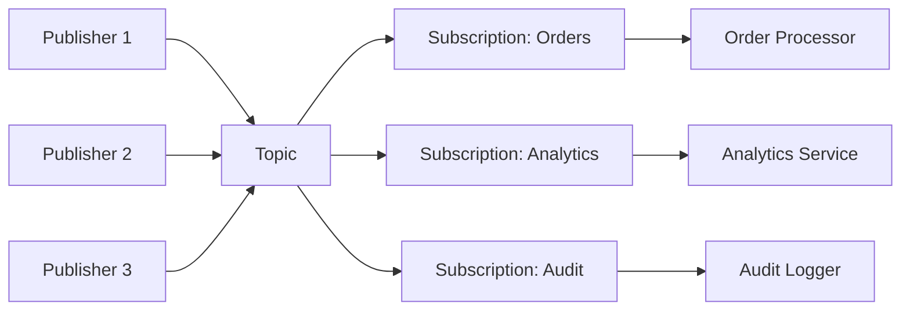
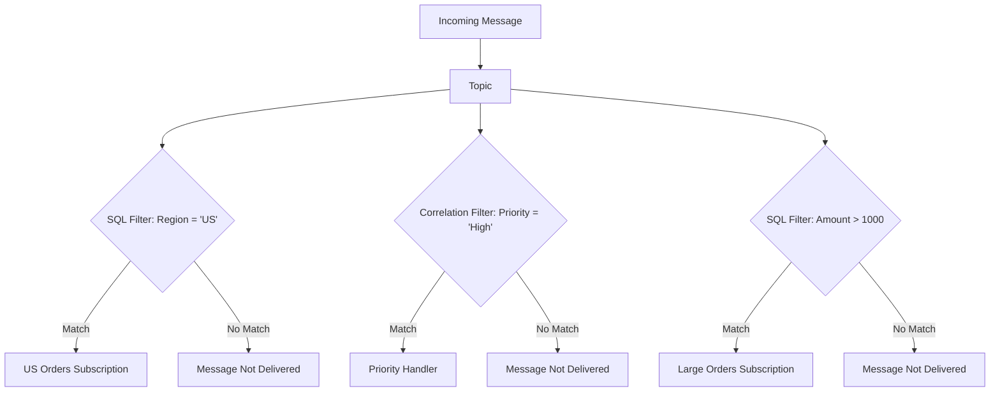
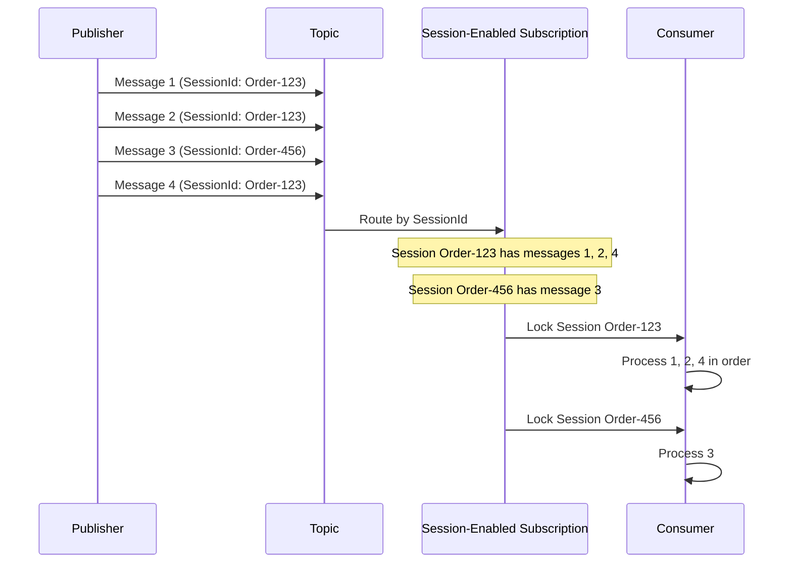
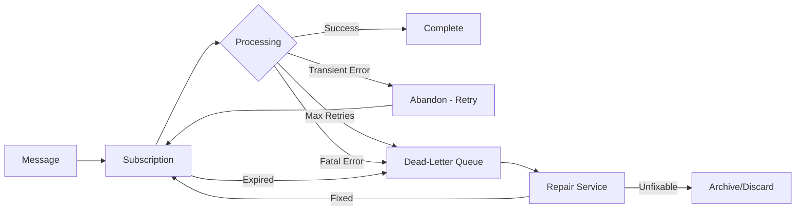

# How to Implement Azure Service Bus Topics

Author: [nawazdhandala](https://github.com/nawazdhandala)

Tags: Azure, ServiceBus, Messaging, PubSub

Description: Learn how to build scalable publish-subscribe messaging patterns using Azure Service Bus Topics with filters, sessions, and dead-letter handling.

---

Azure Service Bus Topics provide a powerful publish-subscribe messaging model for decoupling services in distributed systems. Unlike queues where each message goes to a single consumer, topics allow multiple subscribers to receive their own copy of each message, optionally filtered by rules you define.

## Understanding the Topic Architecture

A topic acts as a message distribution point. Publishers send messages to the topic, and each subscription attached to that topic receives a copy of qualifying messages. Subscriptions behave like virtual queues with their own independent receive cursor.



## Creating Topics and Subscriptions

Start by provisioning your namespace and creating the topic with its subscriptions. You can do this through the Azure Portal, CLI, or code.

### Using Azure CLI

```bash
# Create a Service Bus namespace
az servicebus namespace create \
  --name my-servicebus-ns \
  --resource-group my-rg \
  --location eastus \
  --sku Standard

# Create a topic
az servicebus topic create \
  --name order-events \
  --namespace-name my-servicebus-ns \
  --resource-group my-rg \
  --default-message-time-to-live P14D \
  --max-size 5120

# Create subscriptions for different consumers
az servicebus topic subscription create \
  --name orders-processor \
  --topic-name order-events \
  --namespace-name my-servicebus-ns \
  --resource-group my-rg \
  --max-delivery-count 10 \
  --dead-lettering-on-message-expiration true

az servicebus topic subscription create \
  --name analytics-consumer \
  --topic-name order-events \
  --namespace-name my-servicebus-ns \
  --resource-group my-rg \
  --max-delivery-count 5
```

### Using C# SDK

```csharp
using Azure.Messaging.ServiceBus.Administration;

// Create the administration client
var adminClient = new ServiceBusAdministrationClient(connectionString);

// Create a topic with specific settings
var topicOptions = new CreateTopicOptions("order-events")
{
    // Messages expire after 14 days if not consumed
    DefaultMessageTimeToLive = TimeSpan.FromDays(14),

    // Enable duplicate detection with a 10-minute window
    RequiresDuplicateDetection = true,
    DuplicateDetectionHistoryTimeWindow = TimeSpan.FromMinutes(10),

    // Maximum topic size in MB
    MaxSizeInMegabytes = 5120,

    // Enable partitioning for higher throughput
    EnablePartitioning = true
};

await adminClient.CreateTopicAsync(topicOptions);

// Create a subscription with dead-lettering enabled
var subscriptionOptions = new CreateSubscriptionOptions("order-events", "orders-processor")
{
    // Move to dead-letter after 10 failed deliveries
    MaxDeliveryCount = 10,

    // Dead-letter expired messages instead of discarding
    DeadLetteringOnMessageExpiration = true,

    // Lock duration for processing
    LockDuration = TimeSpan.FromMinutes(5)
};

await adminClient.CreateSubscriptionAsync(subscriptionOptions);
```

## Subscription Filters and Actions

Filters determine which messages a subscription receives. Without filters, a subscription gets every message sent to the topic. With filters, you can route specific message types to specific subscribers.

### Filter Types

Azure Service Bus supports three filter types:

1. **SQL Filters** - Use SQL-like syntax to match message properties
2. **Correlation Filters** - Match exact property values (more efficient)
3. **Boolean Filters** - TrueFilter (all messages) or FalseFilter (no messages)



### Creating Filters with Code

```csharp
using Azure.Messaging.ServiceBus.Administration;

var adminClient = new ServiceBusAdministrationClient(connectionString);

// SQL Filter: Match messages where region is US and amount exceeds 100
var sqlFilter = new SqlRuleFilter("Region = 'US' AND Amount > 100");

var sqlRule = new CreateRuleOptions("USHighValueOrders", sqlFilter)
{
    // Actions can modify message properties before delivery
    Action = new SqlRuleAction("SET Priority = 'High'")
};

await adminClient.CreateRuleAsync("order-events", "us-processor", sqlRule);

// Correlation Filter: More efficient for exact matches
var correlationFilter = new CorrelationRuleFilter
{
    Subject = "OrderCreated",
    ApplicationProperties =
    {
        { "Priority", "Critical" },
        { "Region", "EU" }
    }
};

var correlationRule = new CreateRuleOptions("CriticalEUOrders", correlationFilter);
await adminClient.CreateRuleAsync("order-events", "critical-handler", correlationRule);

// Remove the default rule that accepts all messages
await adminClient.DeleteRuleAsync("order-events", "us-processor", "$Default");
```

### Filter Actions

Actions modify message properties as they flow into a subscription. This lets you enrich or transform messages without changing the publisher.

```csharp
// Create a rule with an action that adds computed properties
var filterWithAction = new SqlRuleFilter("Amount > 10000");
var action = new SqlRuleAction(@"
    SET Priority = 'VIP';
    SET ProcessingTier = 'Premium';
    SET EstimatedProcessTime = '2h'
");

var rule = new CreateRuleOptions("VIPOrders", filterWithAction)
{
    Action = action
};

await adminClient.CreateRuleAsync("order-events", "vip-processor", rule);
```

## Publishing Messages

Publishers send messages to the topic without knowledge of subscribers. Include application properties that filters can evaluate.

```csharp
using Azure.Messaging.ServiceBus;

// Create a sender for the topic
await using var client = new ServiceBusClient(connectionString);
await using var sender = client.CreateSender("order-events");

// Create a message with properties for filtering
var order = new OrderCreatedEvent
{
    OrderId = Guid.NewGuid(),
    CustomerId = "CUST-12345",
    Amount = 15000.00m,
    Region = "US",
    CreatedAt = DateTime.UtcNow
};

var message = new ServiceBusMessage(JsonSerializer.SerializeToUtf8Bytes(order))
{
    // Subject helps with correlation filtering
    Subject = "OrderCreated",

    // Content type for proper deserialization
    ContentType = "application/json",

    // Message ID for duplicate detection
    MessageId = order.OrderId.ToString(),

    // Correlation ID for request tracking
    CorrelationId = Activity.Current?.Id ?? Guid.NewGuid().ToString()
};

// Application properties used by subscription filters
message.ApplicationProperties["Region"] = order.Region;
message.ApplicationProperties["Amount"] = (double)order.Amount;
message.ApplicationProperties["CustomerTier"] = "Gold";
message.ApplicationProperties["Priority"] = order.Amount > 10000 ? "High" : "Normal";

await sender.SendMessageAsync(message);
Console.WriteLine($"Published order {order.OrderId} to topic");
```

### Batch Publishing for Throughput

```csharp
// Create a batch for efficient sending
using ServiceBusMessageBatch batch = await sender.CreateMessageBatchAsync();

foreach (var order in ordersToPublish)
{
    var message = CreateOrderMessage(order);

    // TryAddMessage returns false if batch is full
    if (!batch.TryAddMessage(message))
    {
        // Send current batch and create a new one
        await sender.SendMessagesAsync(batch);
        batch.Dispose();

        batch = await sender.CreateMessageBatchAsync();

        if (!batch.TryAddMessage(message))
        {
            throw new Exception($"Message too large for batch: {order.OrderId}");
        }
    }
}

// Send any remaining messages
if (batch.Count > 0)
{
    await sender.SendMessagesAsync(batch);
}
```

## Receiving Messages from Subscriptions

Each subscription maintains its own message cursor. Consumers can process messages independently without affecting other subscriptions.

```csharp
using Azure.Messaging.ServiceBus;

await using var client = new ServiceBusClient(connectionString);

// Create a receiver for a specific subscription
await using var receiver = client.CreateReceiver(
    topicName: "order-events",
    subscriptionName: "orders-processor",
    new ServiceBusReceiverOptions
    {
        // PeekLock allows complete/abandon, ReceiveAndDelete auto-removes
        ReceiveMode = ServiceBusReceiveMode.PeekLock,

        // Prefetch improves throughput by fetching ahead
        PrefetchCount = 10
    }
);

// Receive and process messages
while (true)
{
    // Wait up to 30 seconds for a message
    var message = await receiver.ReceiveMessageAsync(TimeSpan.FromSeconds(30));

    if (message == null)
    {
        Console.WriteLine("No messages available, waiting...");
        continue;
    }

    try
    {
        // Deserialize and process the message
        var order = JsonSerializer.Deserialize<OrderCreatedEvent>(message.Body);
        Console.WriteLine($"Processing order {order.OrderId} from {order.Region}");

        await ProcessOrderAsync(order);

        // Mark as successfully processed
        await receiver.CompleteMessageAsync(message);
    }
    catch (TransientException ex)
    {
        // Abandon returns message to queue for retry
        Console.WriteLine($"Transient error, will retry: {ex.Message}");
        await receiver.AbandonMessageAsync(message);
    }
    catch (Exception ex)
    {
        // Dead-letter for manual investigation
        Console.WriteLine($"Fatal error, dead-lettering: {ex.Message}");
        await receiver.DeadLetterMessageAsync(message,
            deadLetterReason: "ProcessingFailed",
            deadLetterErrorDescription: ex.Message);
    }
}
```

### Using the Processor for Scalable Consumption

The `ServiceBusProcessor` handles concurrent message processing and automatic renewal of message locks.

```csharp
await using var client = new ServiceBusClient(connectionString);

// Configure the processor for concurrent processing
var processor = client.CreateProcessor(
    topicName: "order-events",
    subscriptionName: "orders-processor",
    new ServiceBusProcessorOptions
    {
        // Process up to 10 messages concurrently
        MaxConcurrentCalls = 10,

        // Automatically renew locks during long processing
        MaxAutoLockRenewalDuration = TimeSpan.FromMinutes(30),

        // Prefetch for throughput
        PrefetchCount = 20,

        // Start from oldest unprocessed message
        ReceiveMode = ServiceBusReceiveMode.PeekLock
    }
);

// Handler for processing messages
processor.ProcessMessageAsync += async args =>
{
    var message = args.Message;
    var order = JsonSerializer.Deserialize<OrderCreatedEvent>(message.Body);

    Console.WriteLine($"[{DateTime.UtcNow:HH:mm:ss}] Processing {order.OrderId}");

    await ProcessOrderAsync(order);

    // Complete is called automatically on success
    // To abandon or dead-letter, throw an exception
};

// Handler for errors
processor.ProcessErrorAsync += args =>
{
    Console.WriteLine($"Error: {args.Exception.Message}");
    Console.WriteLine($"Source: {args.ErrorSource}");
    return Task.CompletedTask;
};

// Start processing
await processor.StartProcessingAsync();
Console.WriteLine("Processor started. Press any key to stop.");
Console.ReadKey();

// Graceful shutdown
await processor.StopProcessingAsync();
```

## Message Sessions for Ordered Processing

By default, Service Bus does not guarantee message order. Sessions provide ordered, exactly-once delivery for related messages.



### Enabling Sessions on Subscriptions

```bash
# Create a session-enabled subscription
az servicebus topic subscription create \
  --name ordered-processor \
  --topic-name order-events \
  --namespace-name my-servicebus-ns \
  --resource-group my-rg \
  --enable-session true
```

### Publishing Session Messages

```csharp
// Messages with the same SessionId are delivered in order
var message1 = new ServiceBusMessage("Step 1: Validate order")
{
    SessionId = "ORDER-12345",  // Groups related messages
    Subject = "OrderWorkflow"
};

var message2 = new ServiceBusMessage("Step 2: Reserve inventory")
{
    SessionId = "ORDER-12345",  // Same session as message1
    Subject = "OrderWorkflow"
};

var message3 = new ServiceBusMessage("Step 3: Process payment")
{
    SessionId = "ORDER-12345",
    Subject = "OrderWorkflow"
};

// Send in any order; receiver gets them in sequence
await sender.SendMessagesAsync(new[] { message3, message1, message2 });
```

### Receiving Session Messages

```csharp
// Accept the next available session
await using var sessionReceiver = await client.AcceptNextSessionAsync(
    topicName: "order-events",
    subscriptionName: "ordered-processor",
    new ServiceBusSessionReceiverOptions
    {
        ReceiveMode = ServiceBusReceiveMode.PeekLock
    }
);

Console.WriteLine($"Accepted session: {sessionReceiver.SessionId}");

// Process all messages in this session
while (true)
{
    var message = await sessionReceiver.ReceiveMessageAsync(TimeSpan.FromSeconds(5));

    if (message == null)
    {
        Console.WriteLine("Session complete, no more messages");
        break;
    }

    Console.WriteLine($"Processing: {message.Body}");
    await sessionReceiver.CompleteMessageAsync(message);
}

// Session state can store workflow progress
await sessionReceiver.SetSessionStateAsync(
    BinaryData.FromString("{\"step\": \"completed\", \"timestamp\": \"2026-01-30T10:00:00Z\"}")
);
```

### Session Processor for Multiple Sessions

```csharp
var sessionProcessor = client.CreateSessionProcessor(
    topicName: "order-events",
    subscriptionName: "ordered-processor",
    new ServiceBusSessionProcessorOptions
    {
        // Process multiple sessions in parallel
        MaxConcurrentSessions = 8,

        // But only one message per session at a time (preserves order)
        MaxConcurrentCallsPerSession = 1,

        // Keep session lock alive during processing
        SessionIdleTimeout = TimeSpan.FromMinutes(5)
    }
);

sessionProcessor.ProcessMessageAsync += async args =>
{
    Console.WriteLine($"Session {args.SessionId}: {args.Message.Body}");

    // Retrieve session state
    var state = await args.GetSessionStateAsync();
    if (state != null)
    {
        var progress = JsonSerializer.Deserialize<WorkflowState>(state);
        Console.WriteLine($"Resuming from step {progress.CurrentStep}");
    }

    await ProcessWorkflowStepAsync(args.Message);

    // Update session state
    await args.SetSessionStateAsync(
        BinaryData.FromObjectAsJson(new WorkflowState { CurrentStep = "Completed" })
    );
};

sessionProcessor.ProcessErrorAsync += args =>
{
    Console.WriteLine($"Session error: {args.Exception.Message}");
    return Task.CompletedTask;
};

await sessionProcessor.StartProcessingAsync();
```

## Dead-Letter Handling

Dead-letter queues (DLQ) capture messages that cannot be processed. Every subscription has its own DLQ. Messages land here when:

- Max delivery count is exceeded
- Messages expire with dead-lettering enabled
- Filter evaluation errors occur
- You explicitly dead-letter a message



### Monitoring and Processing Dead-Letters

```csharp
// Create a receiver for the dead-letter queue
var dlqPath = $"order-events/Subscriptions/orders-processor/$DeadLetterQueue";
await using var dlqReceiver = client.CreateReceiver(dlqPath);

Console.WriteLine("Processing dead-lettered messages...");

while (true)
{
    var message = await dlqReceiver.ReceiveMessageAsync(TimeSpan.FromSeconds(10));

    if (message == null)
    {
        Console.WriteLine("No more dead-lettered messages");
        break;
    }

    // Inspect why the message was dead-lettered
    Console.WriteLine($"Message ID: {message.MessageId}");
    Console.WriteLine($"Dead-letter reason: {message.DeadLetterReason}");
    Console.WriteLine($"Error description: {message.DeadLetterErrorDescription}");
    Console.WriteLine($"Delivery count: {message.DeliveryCount}");
    Console.WriteLine($"Enqueued time: {message.EnqueuedTime}");

    // Attempt to repair and resubmit
    if (CanRepairMessage(message))
    {
        var repairedMessage = RepairMessage(message);
        await sender.SendMessageAsync(repairedMessage);
        Console.WriteLine("Message repaired and resubmitted");
    }
    else
    {
        // Archive for later analysis
        await ArchiveMessageAsync(message);
        Console.WriteLine("Message archived for investigation");
    }

    // Remove from DLQ
    await dlqReceiver.CompleteMessageAsync(message);
}
```

### Automated Dead-Letter Processor

```csharp
public class DeadLetterProcessor : BackgroundService
{
    private readonly ServiceBusClient _client;
    private readonly ILogger<DeadLetterProcessor> _logger;

    protected override async Task ExecuteAsync(CancellationToken stoppingToken)
    {
        var dlqPath = "order-events/Subscriptions/orders-processor/$DeadLetterQueue";
        var receiver = _client.CreateReceiver(dlqPath);
        var sender = _client.CreateSender("order-events");

        while (!stoppingToken.IsCancellationRequested)
        {
            try
            {
                var messages = await receiver.ReceiveMessagesAsync(
                    maxMessages: 10,
                    maxWaitTime: TimeSpan.FromSeconds(30),
                    cancellationToken: stoppingToken
                );

                foreach (var message in messages)
                {
                    await ProcessDeadLetteredMessageAsync(message, receiver, sender);
                }
            }
            catch (Exception ex)
            {
                _logger.LogError(ex, "Error processing dead-letter queue");
                await Task.Delay(TimeSpan.FromSeconds(30), stoppingToken);
            }
        }
    }

    private async Task ProcessDeadLetteredMessageAsync(
        ServiceBusReceivedMessage message,
        ServiceBusReceiver receiver,
        ServiceBusSender sender)
    {
        var metrics = new Dictionary<string, object>
        {
            ["MessageId"] = message.MessageId,
            ["DeadLetterReason"] = message.DeadLetterReason,
            ["OriginalEnqueueTime"] = message.EnqueuedTime,
            ["DeliveryCount"] = message.DeliveryCount
        };

        _logger.LogWarning("Processing DLQ message: {@Metrics}", metrics);

        // Categorize the failure
        var action = CategorizeFailure(message);

        switch (action)
        {
            case FailureAction.Retry:
                // Create a new message for retry with backoff
                var retryMessage = CloneForRetry(message);

                // Schedule for future delivery
                retryMessage.ScheduledEnqueueTime = DateTimeOffset.UtcNow.AddMinutes(5);

                await sender.SendMessageAsync(retryMessage);
                await receiver.CompleteMessageAsync(message);
                _logger.LogInformation("Scheduled retry for {MessageId}", message.MessageId);
                break;

            case FailureAction.ManualReview:
                // Move to a review queue or notify operators
                await NotifyOperatorsAsync(message);
                await receiver.CompleteMessageAsync(message);
                break;

            case FailureAction.Discard:
                // Log and complete without retry
                _logger.LogWarning("Discarding unrecoverable message {MessageId}",
                    message.MessageId);
                await receiver.CompleteMessageAsync(message);
                break;
        }
    }

    private FailureAction CategorizeFailure(ServiceBusReceivedMessage message)
    {
        return message.DeadLetterReason switch
        {
            "MaxDeliveryCountExceeded" =>
                message.DeliveryCount < 20 ? FailureAction.Retry : FailureAction.ManualReview,
            "TTLExpiredException" => FailureAction.Discard,
            "ProcessingFailed" => FailureAction.ManualReview,
            _ => FailureAction.ManualReview
        };
    }
}
```

## Complete Example: Order Processing System

Here is a full example tying everything together.

```csharp
// Startup configuration
public static class ServiceBusConfiguration
{
    public static IServiceCollection AddOrderEventBus(
        this IServiceCollection services,
        string connectionString)
    {
        // Register the Service Bus client
        services.AddSingleton(new ServiceBusClient(connectionString));

        // Register senders and processors
        services.AddSingleton<IOrderEventPublisher, OrderEventPublisher>();
        services.AddHostedService<OrderProcessorService>();
        services.AddHostedService<AnalyticsProcessorService>();
        services.AddHostedService<DeadLetterMonitorService>();

        return services;
    }
}

// Publisher abstraction
public interface IOrderEventPublisher
{
    Task PublishOrderCreatedAsync(OrderCreatedEvent order);
    Task PublishOrderUpdatedAsync(OrderUpdatedEvent order);
    Task PublishBatchAsync(IEnumerable<IOrderEvent> events);
}

public class OrderEventPublisher : IOrderEventPublisher, IAsyncDisposable
{
    private readonly ServiceBusSender _sender;

    public OrderEventPublisher(ServiceBusClient client)
    {
        _sender = client.CreateSender("order-events");
    }

    public async Task PublishOrderCreatedAsync(OrderCreatedEvent order)
    {
        var message = new ServiceBusMessage(JsonSerializer.SerializeToUtf8Bytes(order))
        {
            MessageId = order.OrderId.ToString(),
            Subject = "OrderCreated",
            ContentType = "application/json",
            SessionId = order.CustomerId  // Group by customer for ordering
        };

        // Add filterable properties
        message.ApplicationProperties["EventType"] = "OrderCreated";
        message.ApplicationProperties["Region"] = order.Region;
        message.ApplicationProperties["Amount"] = (double)order.TotalAmount;
        message.ApplicationProperties["CustomerTier"] = order.CustomerTier;

        await _sender.SendMessageAsync(message);
    }

    public async Task PublishBatchAsync(IEnumerable<IOrderEvent> events)
    {
        using var batch = await _sender.CreateMessageBatchAsync();

        foreach (var evt in events)
        {
            var message = CreateMessage(evt);

            if (!batch.TryAddMessage(message))
            {
                await _sender.SendMessagesAsync(batch);
                batch.Dispose();

                using var newBatch = await _sender.CreateMessageBatchAsync();
                newBatch.TryAddMessage(message);
            }
        }

        if (batch.Count > 0)
        {
            await _sender.SendMessagesAsync(batch);
        }
    }

    public async ValueTask DisposeAsync()
    {
        await _sender.DisposeAsync();
    }
}

// Consumer service
public class OrderProcessorService : BackgroundService
{
    private readonly ServiceBusClient _client;
    private readonly IOrderService _orderService;
    private readonly ILogger<OrderProcessorService> _logger;
    private ServiceBusProcessor _processor;

    protected override async Task ExecuteAsync(CancellationToken stoppingToken)
    {
        _processor = _client.CreateProcessor(
            topicName: "order-events",
            subscriptionName: "orders-processor",
            new ServiceBusProcessorOptions
            {
                MaxConcurrentCalls = 16,
                MaxAutoLockRenewalDuration = TimeSpan.FromMinutes(30),
                PrefetchCount = 32
            }
        );

        _processor.ProcessMessageAsync += HandleMessageAsync;
        _processor.ProcessErrorAsync += HandleErrorAsync;

        await _processor.StartProcessingAsync(stoppingToken);

        // Wait until cancellation
        await Task.Delay(Timeout.Infinite, stoppingToken);
    }

    private async Task HandleMessageAsync(ProcessMessageEventArgs args)
    {
        var eventType = args.Message.Subject;

        using var scope = _logger.BeginScope(new Dictionary<string, object>
        {
            ["MessageId"] = args.Message.MessageId,
            ["EventType"] = eventType,
            ["CorrelationId"] = args.Message.CorrelationId
        });

        _logger.LogInformation("Processing {EventType} message", eventType);

        try
        {
            switch (eventType)
            {
                case "OrderCreated":
                    var created = JsonSerializer.Deserialize<OrderCreatedEvent>(
                        args.Message.Body.ToArray());
                    await _orderService.HandleOrderCreatedAsync(created);
                    break;

                case "OrderUpdated":
                    var updated = JsonSerializer.Deserialize<OrderUpdatedEvent>(
                        args.Message.Body.ToArray());
                    await _orderService.HandleOrderUpdatedAsync(updated);
                    break;

                default:
                    _logger.LogWarning("Unknown event type: {EventType}", eventType);
                    break;
            }

            // Message auto-completes on success
        }
        catch (ValidationException ex)
        {
            // Invalid message, dead-letter immediately
            _logger.LogError(ex, "Validation failed, dead-lettering");
            await args.DeadLetterMessageAsync(
                args.Message,
                deadLetterReason: "ValidationFailed",
                deadLetterErrorDescription: ex.Message
            );
        }
        catch (TransientException ex)
        {
            // Transient error, throw to trigger retry
            _logger.LogWarning(ex, "Transient error, will retry");
            throw;
        }
    }

    private Task HandleErrorAsync(ProcessErrorEventArgs args)
    {
        _logger.LogError(args.Exception,
            "Error from {Source}: {Message}",
            args.ErrorSource,
            args.Exception.Message);

        return Task.CompletedTask;
    }

    public override async Task StopAsync(CancellationToken cancellationToken)
    {
        await _processor.StopProcessingAsync(cancellationToken);
        await _processor.DisposeAsync();
        await base.StopAsync(cancellationToken);
    }
}
```

## Monitoring and Observability

Track topic and subscription health with these key metrics.

```csharp
// Emit custom metrics for observability platforms
public class ServiceBusMetrics
{
    private readonly ServiceBusAdministrationClient _adminClient;

    public async Task<TopicMetrics> GetTopicMetricsAsync(string topicName)
    {
        var topicInfo = await _adminClient.GetTopicRuntimePropertiesAsync(topicName);

        return new TopicMetrics
        {
            SizeInBytes = topicInfo.Value.SizeInBytes,
            ScheduledMessageCount = topicInfo.Value.ScheduledMessageCount,
            SubscriptionCount = topicInfo.Value.SubscriptionCount
        };
    }

    public async Task<SubscriptionMetrics> GetSubscriptionMetricsAsync(
        string topicName,
        string subscriptionName)
    {
        var subInfo = await _adminClient.GetSubscriptionRuntimePropertiesAsync(
            topicName,
            subscriptionName);

        return new SubscriptionMetrics
        {
            ActiveMessageCount = subInfo.Value.ActiveMessageCount,
            DeadLetterMessageCount = subInfo.Value.DeadLetterMessageCount,
            TransferMessageCount = subInfo.Value.TransferMessageCount,
            TransferDeadLetterMessageCount = subInfo.Value.TransferDeadLetterMessageCount
        };
    }
}

// Alert when dead-letter queues grow
public class DeadLetterMonitorService : BackgroundService
{
    private readonly ServiceBusAdministrationClient _adminClient;
    private readonly IAlertService _alertService;

    protected override async Task ExecuteAsync(CancellationToken stoppingToken)
    {
        while (!stoppingToken.IsCancellationRequested)
        {
            var subscriptions = new[] { "orders-processor", "analytics-consumer" };

            foreach (var sub in subscriptions)
            {
                var props = await _adminClient.GetSubscriptionRuntimePropertiesAsync(
                    "order-events",
                    sub,
                    stoppingToken);

                if (props.Value.DeadLetterMessageCount > 100)
                {
                    await _alertService.SendAlertAsync(
                        severity: AlertSeverity.Warning,
                        title: $"High DLQ count for {sub}",
                        message: $"Dead-letter queue has {props.Value.DeadLetterMessageCount} messages"
                    );
                }
            }

            await Task.Delay(TimeSpan.FromMinutes(5), stoppingToken);
        }
    }
}
```

## Best Practices

1. **Use correlation filters when possible.** They evaluate faster than SQL filters because they use hash lookups instead of expression parsing.

2. **Set appropriate TTLs.** Messages without consumers should not live forever. Configure `DefaultMessageTimeToLive` on topics and subscriptions.

3. **Enable dead-lettering on expiration.** Expired messages should go to the DLQ for analysis, not silently disappear.

4. **Use sessions for ordering.** If message order matters within a logical group, use session IDs. Do not assume FIFO without sessions.

5. **Size your prefetch carefully.** High prefetch improves throughput but increases memory usage. Start with 10-20 and tune based on message size.

6. **Implement idempotent handlers.** Messages can be delivered more than once. Use message IDs or business keys to detect duplicates.

7. **Monitor DLQ depth.** A growing dead-letter queue indicates processing problems. Alert on thresholds and investigate promptly.

8. **Handle poison messages gracefully.** After max retries, dead-letter with a clear reason. Build tooling to inspect and replay DLQ messages.

Azure Service Bus Topics provide a robust foundation for event-driven architectures. With proper filter configuration, session management, and dead-letter handling, you can build decoupled systems that scale independently and recover gracefully from failures.
