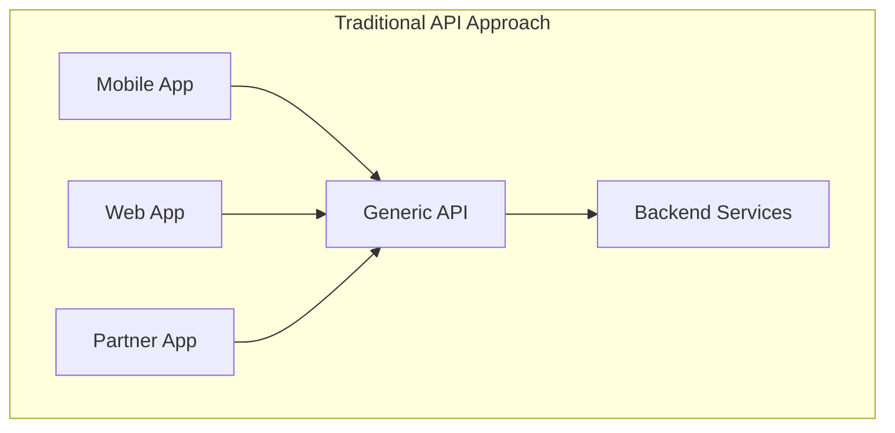
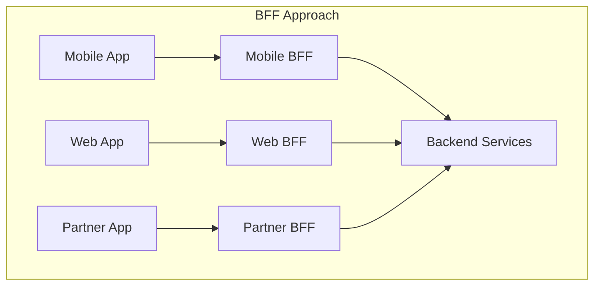
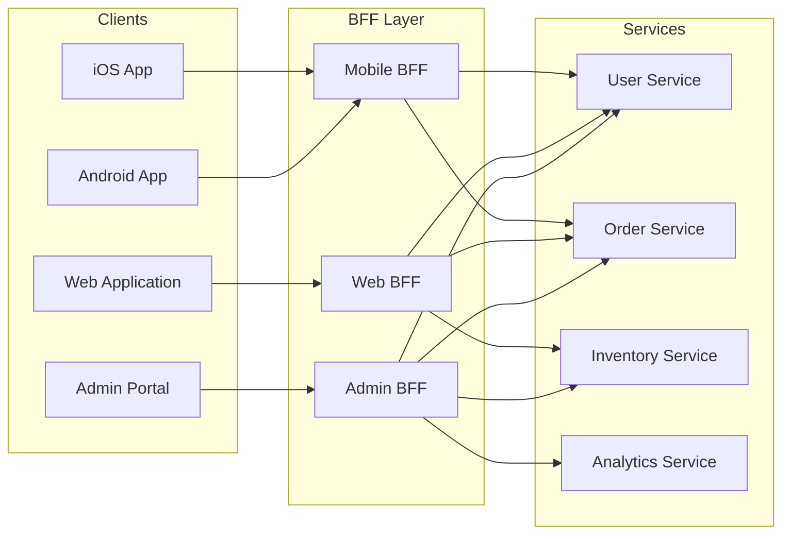
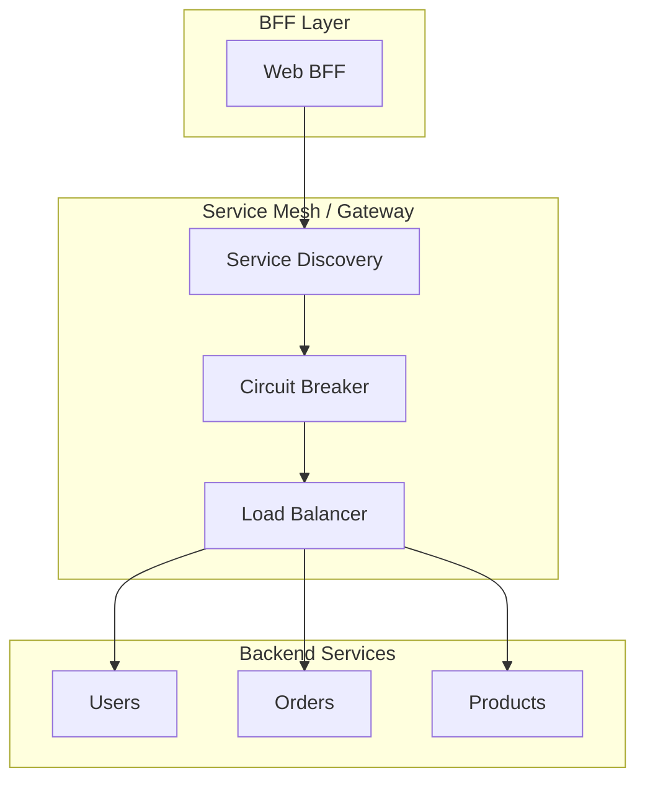

# How to Implement Backend for Frontend Pattern

Author: [nawazdhandala](https://github.com/nawazdhandala)

Tags: Microservices, BFF, Architecture, API

Description: A practical guide to implementing the Backend for Frontend pattern with examples for mobile, web, data aggregation, and authentication handling.

---

The Backend for Frontend (BFF) pattern creates dedicated backend services tailored to specific frontend applications. Instead of forcing a mobile app and web dashboard to share the same generic API, each client gets its own backend that speaks its language.

## Why BFF Exists

Generic APIs try to serve everyone and end up serving no one well. A mobile app needs minimal payloads and offline-friendly responses. A web dashboard needs rich data with complex filtering. A third-party integration needs stable versioned endpoints.





## When to Use BFF

Use BFF when:
- Different clients need different data shapes
- Mobile and web teams move at different speeds
- You need client-specific optimizations (caching, compression, batching)
- Authentication flows differ between platforms

Skip BFF when:
- You have a single client type
- Your API is already simple and client-specific
- You lack the team capacity to maintain multiple backends

## Architecture Overview



## Implementing a Mobile BFF

Mobile clients have unique constraints: limited bandwidth, battery concerns, and intermittent connectivity. The mobile BFF addresses these by aggregating data and minimizing round trips.

### Project Structure

```
mobile-bff/
  src/
    controllers/
      dashboard.controller.ts
      orders.controller.ts
      profile.controller.ts
    services/
      aggregation.service.ts
      cache.service.ts
    middleware/
      compression.middleware.ts
      auth.middleware.ts
    routes/
      index.ts
    app.ts
  package.json
  tsconfig.json
```

### Express Setup

```typescript
// src/app.ts
import express from 'express';
import compression from 'compression';
import { authMiddleware } from './middleware/auth.middleware';
import { routes } from './routes';

const app = express();

// Aggressive compression for mobile
app.use(compression({ level: 9 }));
app.use(express.json());
app.use(authMiddleware);
app.use('/api/mobile/v1', routes);

export default app;
```

### Data Aggregation for Mobile Dashboard

Instead of making clients call multiple endpoints, aggregate everything into one response.

```typescript
// src/controllers/dashboard.controller.ts
import { Request, Response } from 'express';
import { UserService } from '../services/user.service';
import { OrderService } from '../services/order.service';
import { NotificationService } from '../services/notification.service';

interface MobileDashboardResponse {
  user: {
    id: string;
    name: string;
    avatarUrl: string;
  };
  recentOrders: {
    id: string;
    status: string;
    total: number;
    itemCount: number;
  }[];
  unreadNotifications: number;
  quickActions: string[];
}

export class DashboardController {
  constructor(
    private userService: UserService,
    private orderService: OrderService,
    private notificationService: NotificationService
  ) {}

  async getDashboard(req: Request, res: Response) {
    const userId = req.user.id;

    // Fetch all data in parallel
    const [user, orders, notifications] = await Promise.all([
      this.userService.getUser(userId),
      this.orderService.getRecentOrders(userId, { limit: 5 }),
      this.notificationService.getUnreadCount(userId)
    ]);

    // Transform to mobile-optimized shape
    const response: MobileDashboardResponse = {
      user: {
        id: user.id,
        name: user.firstName,
        avatarUrl: user.avatar?.thumbnail || '/default-avatar.png'
      },
      recentOrders: orders.map(order => ({
        id: order.id,
        status: order.status,
        total: order.totalAmount,
        itemCount: order.items.length
      })),
      unreadNotifications: notifications,
      quickActions: this.getQuickActionsForUser(user)
    };

    res.json(response);
  }

  private getQuickActionsForUser(user: any): string[] {
    const actions = ['new_order', 'track_order'];
    if (user.loyaltyTier === 'gold') {
      actions.push('exclusive_deals');
    }
    return actions;
  }
}
```

### Offline-Friendly Responses

Include metadata that helps mobile apps handle offline scenarios.

```typescript
// src/middleware/offline.middleware.ts
import { Request, Response, NextFunction } from 'express';
import crypto from 'crypto';

export function offlineSupport(req: Request, res: Response, next: NextFunction) {
  const originalJson = res.json.bind(res);

  res.json = (data: any) => {
    const enrichedResponse = {
      data,
      _meta: {
        timestamp: new Date().toISOString(),
        etag: generateEtag(data),
        cacheDuration: getCacheDuration(req.path),
        offlineCapable: true
      }
    };
    return originalJson(enrichedResponse);
  };

  next();
}

function generateEtag(data: any): string {
  return crypto
    .createHash('md5')
    .update(JSON.stringify(data))
    .digest('hex');
}

function getCacheDuration(path: string): number {
  const cacheDurations: Record<string, number> = {
    '/dashboard': 300,      // 5 minutes
    '/profile': 3600,       // 1 hour
    '/orders': 60,          // 1 minute
    '/catalog': 1800        // 30 minutes
  };

  for (const [pattern, duration] of Object.entries(cacheDurations)) {
    if (path.includes(pattern)) return duration;
  }
  return 60;
}
```

## Implementing a Web BFF

Web applications typically need richer data, support for complex filtering, and real-time updates.

### Rich Data Responses

```typescript
// src/controllers/orders.controller.ts
import { Request, Response } from 'express';

interface WebOrderListResponse {
  orders: {
    id: string;
    orderNumber: string;
    status: string;
    statusHistory: { status: string; timestamp: string; actor: string }[];
    customer: {
      id: string;
      name: string;
      email: string;
      phone: string;
      segment: string;
    };
    items: {
      productId: string;
      name: string;
      sku: string;
      quantity: number;
      unitPrice: number;
      totalPrice: number;
      imageUrl: string;
    }[];
    shipping: {
      method: string;
      address: object;
      trackingNumber: string | null;
      estimatedDelivery: string | null;
    };
    payment: {
      method: string;
      status: string;
      transactionId: string;
    };
    totals: {
      subtotal: number;
      tax: number;
      shipping: number;
      discount: number;
      total: number;
    };
    createdAt: string;
    updatedAt: string;
  }[];
  pagination: {
    page: number;
    pageSize: number;
    totalItems: number;
    totalPages: number;
  };
  filters: {
    applied: Record<string, any>;
    available: {
      statuses: string[];
      dateRange: { min: string; max: string };
      paymentMethods: string[];
    };
  };
}

export class OrdersController {
  async listOrders(req: Request, res: Response) {
    const {
      page = 1,
      pageSize = 20,
      status,
      startDate,
      endDate,
      search,
      sortBy = 'createdAt',
      sortOrder = 'desc'
    } = req.query;

    // Build query with all filters
    const query = this.buildOrderQuery({
      status: status as string,
      startDate: startDate as string,
      endDate: endDate as string,
      search: search as string
    });

    const [orders, totalCount, filterOptions] = await Promise.all([
      this.orderService.findOrders(query, {
        page: Number(page),
        pageSize: Number(pageSize),
        sortBy: sortBy as string,
        sortOrder: sortOrder as 'asc' | 'desc'
      }),
      this.orderService.countOrders(query),
      this.orderService.getFilterOptions()
    ]);

    // Enrich with related data
    const enrichedOrders = await this.enrichOrdersForWeb(orders);

    const response: WebOrderListResponse = {
      orders: enrichedOrders,
      pagination: {
        page: Number(page),
        pageSize: Number(pageSize),
        totalItems: totalCount,
        totalPages: Math.ceil(totalCount / Number(pageSize))
      },
      filters: {
        applied: { status, startDate, endDate, search },
        available: filterOptions
      }
    };

    res.json(response);
  }

  private async enrichOrdersForWeb(orders: any[]) {
    const customerIds = [...new Set(orders.map(o => o.customerId))];
    const customers = await this.customerService.getByIds(customerIds);
    const customerMap = new Map(customers.map(c => [c.id, c]));

    return orders.map(order => ({
      ...order,
      customer: customerMap.get(order.customerId),
      statusHistory: order.history || []
    }));
  }
}
```

### Server-Sent Events for Real-Time Updates

```typescript
// src/controllers/realtime.controller.ts
import { Request, Response } from 'express';
import { EventEmitter } from 'events';

const orderEvents = new EventEmitter();

export class RealtimeController {
  subscribeToOrders(req: Request, res: Response) {
    res.setHeader('Content-Type', 'text/event-stream');
    res.setHeader('Cache-Control', 'no-cache');
    res.setHeader('Connection', 'keep-alive');

    const userId = req.user.id;

    const handler = (event: any) => {
      if (event.userId === userId) {
        res.write(`event: ${event.type}\n`);
        res.write(`data: ${JSON.stringify(event.data)}\n\n`);
      }
    };

    orderEvents.on('order_update', handler);

    req.on('close', () => {
      orderEvents.off('order_update', handler);
    });
  }
}

// Called by internal services when orders change
export function emitOrderUpdate(userId: string, orderId: string, data: any) {
  orderEvents.emit('order_update', {
    type: 'order_update',
    userId,
    data: { orderId, ...data }
  });
}
```

## Data Aggregation Patterns

### Sequential Aggregation

Use when data from one service is needed to query another.

```typescript
async function getOrderWithRecommendations(orderId: string) {
  // First, get the order
  const order = await orderService.getOrder(orderId);

  // Then use order data to get recommendations
  const productIds = order.items.map(item => item.productId);
  const recommendations = await recommendationService.getRelated(productIds);

  return {
    order,
    recommendations
  };
}
```

### Parallel Aggregation

Use when data sources are independent.

```typescript
async function getUserDashboard(userId: string) {
  const [profile, orders, notifications, recommendations] = await Promise.all([
    userService.getProfile(userId),
    orderService.getRecent(userId),
    notificationService.getUnread(userId),
    recommendationService.getForUser(userId)
  ]);

  return { profile, orders, notifications, recommendations };
}
```

### Partial Failure Handling

Do not let one failing service break the entire response.

```typescript
async function getDashboardWithFallbacks(userId: string) {
  const results = await Promise.allSettled([
    userService.getProfile(userId),
    orderService.getRecent(userId),
    notificationService.getUnread(userId),
    recommendationService.getForUser(userId)
  ]);

  return {
    profile: results[0].status === 'fulfilled'
      ? results[0].value
      : { error: 'Profile unavailable' },
    orders: results[1].status === 'fulfilled'
      ? results[1].value
      : [],
    notifications: results[2].status === 'fulfilled'
      ? results[2].value
      : { count: 0, error: 'Unable to fetch notifications' },
    recommendations: results[3].status === 'fulfilled'
      ? results[3].value
      : []
  };
}
```

### Caching Aggregated Data

```typescript
import NodeCache from 'node-cache';

const cache = new NodeCache({ stdTTL: 300 });

async function getCachedDashboard(userId: string) {
  const cacheKey = `dashboard:${userId}`;

  const cached = cache.get(cacheKey);
  if (cached) {
    return { ...cached, _cached: true };
  }

  const dashboard = await getDashboardWithFallbacks(userId);
  cache.set(cacheKey, dashboard);

  return dashboard;
}

// Invalidate on updates
function invalidateDashboardCache(userId: string) {
  cache.del(`dashboard:${userId}`);
}
```

## Authentication Handling

Each BFF can handle authentication differently based on client needs.

### Mobile BFF: Token Refresh

```typescript
// src/middleware/auth.middleware.ts
import jwt from 'jsonwebtoken';

interface TokenPayload {
  userId: string;
  deviceId: string;
  exp: number;
}

export async function mobileAuthMiddleware(req: Request, res: Response, next: NextFunction) {
  const authHeader = req.headers.authorization;

  if (!authHeader?.startsWith('Bearer ')) {
    return res.status(401).json({ error: 'Missing authorization header' });
  }

  const token = authHeader.substring(7);

  try {
    const payload = jwt.verify(token, process.env.JWT_SECRET!) as TokenPayload;

    // Check if token is about to expire (within 5 minutes)
    const expiresIn = payload.exp - Math.floor(Date.now() / 1000);
    if (expiresIn < 300) {
      const newToken = await refreshToken(payload);
      res.setHeader('X-New-Token', newToken);
    }

    req.user = { id: payload.userId, deviceId: payload.deviceId };
    next();
  } catch (error) {
    if (error instanceof jwt.TokenExpiredError) {
      return res.status(401).json({
        error: 'Token expired',
        code: 'TOKEN_EXPIRED'
      });
    }
    return res.status(401).json({ error: 'Invalid token' });
  }
}

async function refreshToken(payload: TokenPayload): Promise<string> {
  return jwt.sign(
    { userId: payload.userId, deviceId: payload.deviceId },
    process.env.JWT_SECRET!,
    { expiresIn: '7d' }
  );
}
```

### Web BFF: Session-Based Auth with CSRF Protection

```typescript
// src/middleware/web-auth.middleware.ts
import session from 'express-session';
import csrf from 'csurf';
import RedisStore from 'connect-redis';
import { createClient } from 'redis';

const redisClient = createClient({ url: process.env.REDIS_URL });

export const sessionMiddleware = session({
  store: new RedisStore({ client: redisClient }),
  secret: process.env.SESSION_SECRET!,
  resave: false,
  saveUninitialized: false,
  cookie: {
    secure: process.env.NODE_ENV === 'production',
    httpOnly: true,
    sameSite: 'strict',
    maxAge: 24 * 60 * 60 * 1000 // 24 hours
  }
});

export const csrfProtection = csrf({ cookie: false });

export function webAuthMiddleware(req: Request, res: Response, next: NextFunction) {
  if (!req.session?.userId) {
    return res.status(401).json({ error: 'Not authenticated' });
  }

  req.user = { id: req.session.userId };
  next();
}
```

### OAuth Integration for Admin BFF

```typescript
// src/controllers/auth.controller.ts
import { OAuth2Client } from 'google-auth-library';

const oauthClient = new OAuth2Client(
  process.env.GOOGLE_CLIENT_ID,
  process.env.GOOGLE_CLIENT_SECRET,
  process.env.GOOGLE_REDIRECT_URI
);

export class AuthController {
  getLoginUrl(req: Request, res: Response) {
    const url = oauthClient.generateAuthUrl({
      access_type: 'offline',
      scope: ['email', 'profile'],
      state: req.query.returnTo as string
    });
    res.json({ url });
  }

  async handleCallback(req: Request, res: Response) {
    const { code, state } = req.query;

    const { tokens } = await oauthClient.getToken(code as string);
    oauthClient.setCredentials(tokens);

    const ticket = await oauthClient.verifyIdToken({
      idToken: tokens.id_token!,
      audience: process.env.GOOGLE_CLIENT_ID
    });

    const payload = ticket.getPayload()!;

    // Verify user is allowed admin access
    const user = await userService.findByEmail(payload.email!);
    if (!user?.isAdmin) {
      return res.status(403).json({ error: 'Admin access required' });
    }

    // Create session
    req.session.userId = user.id;
    req.session.isAdmin = true;

    res.redirect(state as string || '/admin');
  }
}
```

## Service Communication



### HTTP Client with Circuit Breaker

```typescript
// src/lib/service-client.ts
import axios, { AxiosInstance } from 'axios';
import CircuitBreaker from 'opossum';

interface ServiceClientOptions {
  baseURL: string;
  timeout?: number;
  circuitBreakerOptions?: CircuitBreaker.Options;
}

export function createServiceClient(options: ServiceClientOptions) {
  const client = axios.create({
    baseURL: options.baseURL,
    timeout: options.timeout || 5000
  });

  const breaker = new CircuitBreaker(
    async (config: any) => client.request(config),
    {
      timeout: 10000,
      errorThresholdPercentage: 50,
      resetTimeout: 30000,
      ...options.circuitBreakerOptions
    }
  );

  breaker.on('open', () => {
    console.log(`Circuit opened for ${options.baseURL}`);
  });

  breaker.on('halfOpen', () => {
    console.log(`Circuit half-open for ${options.baseURL}`);
  });

  breaker.on('close', () => {
    console.log(`Circuit closed for ${options.baseURL}`);
  });

  return {
    get: (url: string, config?: any) => breaker.fire({ method: 'get', url, ...config }),
    post: (url: string, data?: any, config?: any) => breaker.fire({ method: 'post', url, data, ...config }),
    put: (url: string, data?: any, config?: any) => breaker.fire({ method: 'put', url, data, ...config }),
    delete: (url: string, config?: any) => breaker.fire({ method: 'delete', url, ...config })
  };
}

// Usage
const userServiceClient = createServiceClient({
  baseURL: process.env.USER_SERVICE_URL!,
  timeout: 3000
});

const orderServiceClient = createServiceClient({
  baseURL: process.env.ORDER_SERVICE_URL!,
  timeout: 5000
});
```

## GraphQL as BFF Alternative

Instead of REST endpoints, you can use GraphQL to let clients specify exactly what they need.

```typescript
// src/schema/types.ts
import { gql } from 'apollo-server-express';

export const typeDefs = gql`
  type User {
    id: ID!
    name: String!
    email: String!
    orders(limit: Int): [Order!]!
    notifications: NotificationSummary!
  }

  type Order {
    id: ID!
    status: OrderStatus!
    items: [OrderItem!]!
    total: Float!
    createdAt: String!
  }

  type OrderItem {
    product: Product!
    quantity: Int!
    price: Float!
  }

  type Product {
    id: ID!
    name: String!
    imageUrl: String!
  }

  type NotificationSummary {
    unreadCount: Int!
    latest: [Notification!]!
  }

  type Notification {
    id: ID!
    message: String!
    read: Boolean!
    createdAt: String!
  }

  enum OrderStatus {
    PENDING
    PROCESSING
    SHIPPED
    DELIVERED
    CANCELLED
  }

  type Query {
    me: User
    order(id: ID!): Order
    orders(status: OrderStatus, limit: Int, offset: Int): [Order!]!
  }
`;
```

```typescript
// src/schema/resolvers.ts
export const resolvers = {
  Query: {
    me: (_, __, { user, dataSources }) =>
      dataSources.userService.getUser(user.id),

    order: (_, { id }, { dataSources }) =>
      dataSources.orderService.getOrder(id),

    orders: (_, { status, limit, offset }, { user, dataSources }) =>
      dataSources.orderService.getUserOrders(user.id, { status, limit, offset })
  },

  User: {
    orders: (user, { limit }, { dataSources }) =>
      dataSources.orderService.getUserOrders(user.id, { limit }),

    notifications: (user, _, { dataSources }) =>
      dataSources.notificationService.getSummary(user.id)
  },

  Order: {
    items: (order, _, { dataSources }) =>
      dataSources.orderService.getOrderItems(order.id)
  },

  OrderItem: {
    product: (item, _, { dataSources }) =>
      dataSources.productService.getProduct(item.productId)
  }
};
```

## Deployment Considerations

### Kubernetes Deployment

```yaml
apiVersion: apps/v1
kind: Deployment
metadata:
  name: mobile-bff
  labels:
    app: mobile-bff
spec:
  replicas: 3
  selector:
    matchLabels:
      app: mobile-bff
  template:
    metadata:
      labels:
        app: mobile-bff
    spec:
      containers:
        - name: mobile-bff
          image: myregistry/mobile-bff:v1.2.0
          ports:
            - containerPort: 3000
          env:
            - name: USER_SERVICE_URL
              value: "http://user-service:8080"
            - name: ORDER_SERVICE_URL
              value: "http://order-service:8080"
            - name: JWT_SECRET
              valueFrom:
                secretKeyRef:
                  name: bff-secrets
                  key: jwt-secret
          resources:
            requests:
              memory: "256Mi"
              cpu: "200m"
            limits:
              memory: "512Mi"
              cpu: "500m"
          livenessProbe:
            httpGet:
              path: /health
              port: 3000
            initialDelaySeconds: 10
            periodSeconds: 10
          readinessProbe:
            httpGet:
              path: /ready
              port: 3000
            initialDelaySeconds: 5
            periodSeconds: 5
---
apiVersion: v1
kind: Service
metadata:
  name: mobile-bff
spec:
  selector:
    app: mobile-bff
  ports:
    - port: 80
      targetPort: 3000
```

### API Gateway Configuration

```yaml
# Kong Gateway configuration
apiVersion: configuration.konghq.com/v1
kind: KongIngress
metadata:
  name: mobile-bff-ingress
route:
  protocols:
    - https
  strip_path: true
  preserve_host: true
---
apiVersion: networking.k8s.io/v1
kind: Ingress
metadata:
  name: mobile-bff
  annotations:
    konghq.com/override: mobile-bff-ingress
    konghq.com/plugins: rate-limiting,cors
spec:
  ingressClassName: kong
  rules:
    - host: api.example.com
      http:
        paths:
          - path: /mobile
            pathType: Prefix
            backend:
              service:
                name: mobile-bff
                port:
                  number: 80
          - path: /web
            pathType: Prefix
            backend:
              service:
                name: web-bff
                port:
                  number: 80
```

## Observability

### OpenTelemetry Instrumentation

```typescript
// src/tracing.ts
import { NodeSDK } from '@opentelemetry/sdk-node';
import { getNodeAutoInstrumentations } from '@opentelemetry/auto-instrumentations-node';
import { OTLPTraceExporter } from '@opentelemetry/exporter-trace-otlp-http';

const sdk = new NodeSDK({
  serviceName: 'mobile-bff',
  traceExporter: new OTLPTraceExporter({
    url: process.env.OTEL_EXPORTER_OTLP_ENDPOINT
  }),
  instrumentations: [
    getNodeAutoInstrumentations({
      '@opentelemetry/instrumentation-express': { enabled: true },
      '@opentelemetry/instrumentation-http': { enabled: true }
    })
  ]
});

sdk.start();
```

### Custom Metrics

```typescript
// src/metrics.ts
import { MeterProvider, PeriodicExportingMetricReader } from '@opentelemetry/sdk-metrics';
import { OTLPMetricExporter } from '@opentelemetry/exporter-metrics-otlp-http';

const meterProvider = new MeterProvider({
  readers: [
    new PeriodicExportingMetricReader({
      exporter: new OTLPMetricExporter(),
      exportIntervalMillis: 60000
    })
  ]
});

const meter = meterProvider.getMeter('mobile-bff');

export const requestCounter = meter.createCounter('bff_requests_total', {
  description: 'Total number of requests to BFF'
});

export const aggregationDuration = meter.createHistogram('bff_aggregation_duration_ms', {
  description: 'Time spent aggregating data from backend services'
});

// Usage in controllers
import { requestCounter, aggregationDuration } from '../metrics';

async function handleRequest(req: Request, res: Response) {
  requestCounter.add(1, { endpoint: req.path, method: req.method });

  const start = Date.now();
  const data = await aggregateData();
  aggregationDuration.record(Date.now() - start, { endpoint: req.path });

  res.json(data);
}
```

## Common Pitfalls

**Duplicating Business Logic**: BFFs should transform and aggregate, not contain business rules. Keep domain logic in backend services.

**Creating Too Many BFFs**: One per major client type is enough. Do not create a BFF for every screen or feature.

**Tight Coupling**: BFFs should be independently deployable. Avoid sharing databases or requiring synchronized deployments.

**Ignoring Versioning**: When you change a BFF API, clients may not update immediately. Support multiple versions during transition periods.

**Skipping Caching**: BFFs are ideal caching points. Use aggressive caching for data that does not change frequently.

## Checklist

- [ ] Identify distinct client needs (mobile vs web vs partners)
- [ ] Design client-specific response shapes
- [ ] Implement parallel data aggregation
- [ ] Handle partial failures gracefully
- [ ] Add caching at the BFF layer
- [ ] Configure authentication per client type
- [ ] Set up circuit breakers for service calls
- [ ] Add OpenTelemetry instrumentation
- [ ] Deploy with proper health checks
- [ ] Document API contracts per BFF

---

The Backend for Frontend pattern adds complexity but pays dividends when clients have genuinely different needs. Start with a single BFF for your most constrained client (usually mobile), prove the value, then expand. The key is keeping BFFs thin and focused on aggregation and transformation while leaving business logic in your core services.
