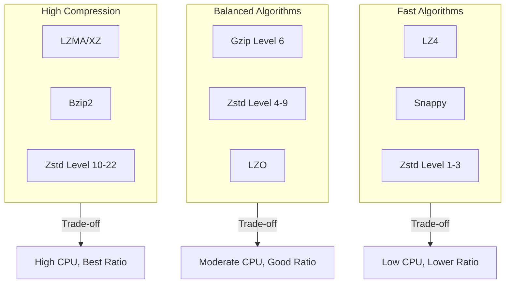
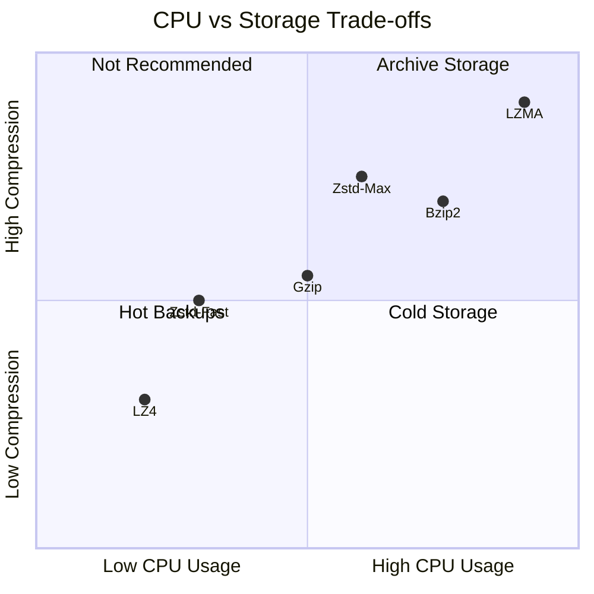
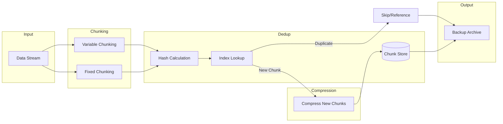
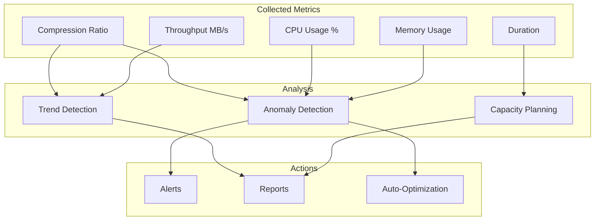
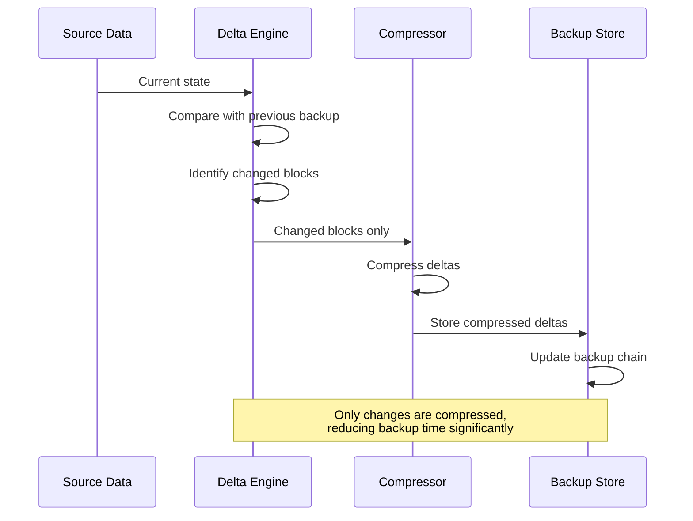
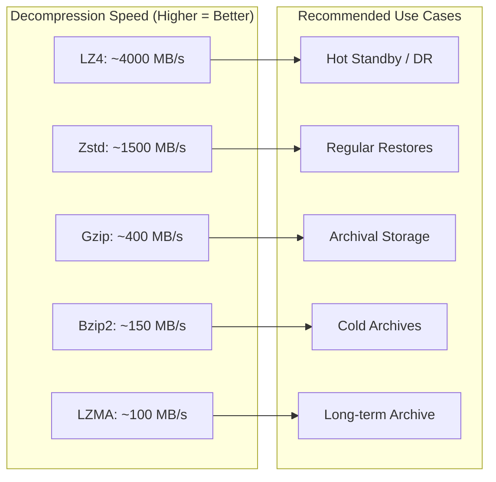

# How to Implement Backup Compression Details

Author: [nawazdhandala](https://github.com/nawazdhandala)

Tags: Backup, Compression, Performance, Storage

Description: Learn detailed backup compression techniques for storage and transfer optimization.

---

Backup compression is a critical component of any robust data protection strategy. By reducing the size of your backup data, you can save storage costs, accelerate transfer speeds, and optimize your overall backup infrastructure. This guide explores the intricacies of backup compression, from algorithm selection to monitoring and optimization.

---

## TL;DR

- Choose compression algorithms based on your CPU vs storage trade-offs
- Integrate deduplication with compression for maximum space savings
- Monitor compression ratios to detect data anomalies and optimize performance
- Implement incremental compression to reduce backup windows
- Balance compression speed with decompression requirements for recovery scenarios
- Use parallel compression to maximize throughput on modern multi-core systems

---

## Compression Algorithm Selection

Choosing the right compression algorithm is foundational to your backup strategy. Different algorithms offer varying trade-offs between compression ratio, CPU usage, and speed.

### Common Compression Algorithms



### Algorithm Comparison

Here is a practical comparison of popular compression algorithms:

| Algorithm | Compression Ratio | Compression Speed | Decompression Speed | CPU Usage |
|-----------|-------------------|-------------------|---------------------|-----------|
| LZ4       | 2.0-2.5x          | Very Fast         | Very Fast           | Low       |
| Zstd      | 2.5-4.0x          | Fast              | Fast                | Moderate  |
| Gzip      | 2.5-3.5x          | Moderate          | Fast                | Moderate  |
| Bzip2     | 3.5-4.5x          | Slow              | Moderate            | High      |
| LZMA/XZ   | 4.0-5.0x          | Very Slow         | Moderate            | Very High |

### Implementing Algorithm Selection

This Python class provides a framework for selecting and applying compression algorithms based on your backup requirements:

```python
import lz4.frame
import zstandard as zstd
import gzip
import bz2
import lzma
from enum import Enum
from typing import BinaryIO
import time

class CompressionAlgorithm(Enum):
    """Supported compression algorithms with their characteristics."""
    LZ4 = "lz4"           # Fastest, lowest ratio
    ZSTD = "zstd"         # Best balance of speed and ratio
    GZIP = "gzip"         # Universal compatibility
    BZIP2 = "bzip2"       # Higher ratio, slower
    LZMA = "lzma"         # Maximum compression, slowest

class BackupCompressor:
    """
    Handles backup compression with configurable algorithms.

    The compressor automatically tracks metrics like compression ratio
    and throughput to help optimize your backup strategy.
    """

    def __init__(self, algorithm: CompressionAlgorithm, level: int = None):
        self.algorithm = algorithm
        # Set default compression levels optimized for backup workloads
        self.level = level or self._default_level(algorithm)
        self.metrics = {
            "bytes_in": 0,
            "bytes_out": 0,
            "compression_time": 0
        }

    def _default_level(self, algorithm: CompressionAlgorithm) -> int:
        """Return optimal default compression level for each algorithm."""
        defaults = {
            CompressionAlgorithm.LZ4: 0,      # LZ4 uses acceleration, not levels
            CompressionAlgorithm.ZSTD: 3,     # Good balance for backups
            CompressionAlgorithm.GZIP: 6,     # Standard gzip level
            CompressionAlgorithm.BZIP2: 9,    # Maximum bzip2 compression
            CompressionAlgorithm.LZMA: 6      # Balanced LZMA preset
        }
        return defaults[algorithm]

    def compress(self, data: bytes) -> bytes:
        """
        Compress data using the configured algorithm.

        Args:
            data: Raw bytes to compress

        Returns:
            Compressed bytes with algorithm-specific header
        """
        start_time = time.time()

        if self.algorithm == CompressionAlgorithm.LZ4:
            compressed = lz4.frame.compress(data)
        elif self.algorithm == CompressionAlgorithm.ZSTD:
            cctx = zstd.ZstdCompressor(level=self.level)
            compressed = cctx.compress(data)
        elif self.algorithm == CompressionAlgorithm.GZIP:
            compressed = gzip.compress(data, compresslevel=self.level)
        elif self.algorithm == CompressionAlgorithm.BZIP2:
            compressed = bz2.compress(data, compresslevel=self.level)
        elif self.algorithm == CompressionAlgorithm.LZMA:
            compressed = lzma.compress(data, preset=self.level)

        # Track metrics for monitoring
        self.metrics["bytes_in"] += len(data)
        self.metrics["bytes_out"] += len(compressed)
        self.metrics["compression_time"] += time.time() - start_time

        return compressed

    def get_compression_ratio(self) -> float:
        """Calculate the overall compression ratio achieved."""
        if self.metrics["bytes_out"] == 0:
            return 0.0
        return self.metrics["bytes_in"] / self.metrics["bytes_out"]

    def get_throughput_mbps(self) -> float:
        """Calculate compression throughput in MB/s."""
        if self.metrics["compression_time"] == 0:
            return 0.0
        mb_processed = self.metrics["bytes_in"] / (1024 * 1024)
        return mb_processed / self.metrics["compression_time"]


# Example usage: Select algorithm based on backup type
def select_algorithm_for_backup(backup_type: str, priority: str) -> BackupCompressor:
    """
    Select the optimal compression algorithm based on backup requirements.

    Args:
        backup_type: Type of data being backed up (database, logs, media)
        priority: What to optimize for (speed, ratio, balanced)

    Returns:
        Configured BackupCompressor instance
    """
    if priority == "speed":
        # For time-critical backups, use LZ4
        return BackupCompressor(CompressionAlgorithm.LZ4)
    elif priority == "ratio":
        # For archival storage, maximize compression
        return BackupCompressor(CompressionAlgorithm.LZMA, level=9)
    else:
        # Default: balanced approach with Zstd
        if backup_type == "database":
            # Databases compress well with higher Zstd levels
            return BackupCompressor(CompressionAlgorithm.ZSTD, level=6)
        elif backup_type == "logs":
            # Text logs compress extremely well
            return BackupCompressor(CompressionAlgorithm.ZSTD, level=9)
        else:
            # General purpose compression
            return BackupCompressor(CompressionAlgorithm.ZSTD, level=3)
```

---

## CPU vs Storage Trade-offs

Understanding the relationship between CPU resources and storage savings is essential for optimizing your backup infrastructure.

### The Trade-off Matrix



### Implementing Adaptive Compression

This implementation automatically adjusts compression based on available system resources:

```python
import psutil
import threading
from dataclasses import dataclass
from typing import Optional

@dataclass
class SystemResources:
    """Current system resource availability."""
    cpu_percent: float
    memory_available_gb: float
    io_wait_percent: float

class AdaptiveCompressor:
    """
    Dynamically adjusts compression based on system resources.

    This compressor monitors CPU, memory, and I/O to automatically
    select the optimal compression strategy for current conditions.
    """

    # Thresholds for switching compression strategies
    CPU_HIGH_THRESHOLD = 70.0    # Percent CPU usage
    CPU_LOW_THRESHOLD = 30.0     # Percent CPU usage
    MEMORY_LOW_THRESHOLD = 2.0   # GB available

    def __init__(self):
        self.current_algorithm = CompressionAlgorithm.ZSTD
        self.current_level = 3
        self._lock = threading.Lock()

    def get_system_resources(self) -> SystemResources:
        """Sample current system resource utilization."""
        cpu = psutil.cpu_percent(interval=0.1)
        memory = psutil.virtual_memory().available / (1024**3)

        # Get I/O wait if available (Linux)
        try:
            io_wait = psutil.cpu_times_percent().iowait
        except AttributeError:
            io_wait = 0.0

        return SystemResources(
            cpu_percent=cpu,
            memory_available_gb=memory,
            io_wait_percent=io_wait
        )

    def adapt_compression(self) -> tuple[CompressionAlgorithm, int]:
        """
        Determine optimal compression settings based on current resources.

        Returns:
            Tuple of (algorithm, compression_level)
        """
        resources = self.get_system_resources()

        with self._lock:
            if resources.cpu_percent > self.CPU_HIGH_THRESHOLD:
                # System is under heavy load - use fastest compression
                self.current_algorithm = CompressionAlgorithm.LZ4
                self.current_level = 0
                print(f"High CPU ({resources.cpu_percent}%) - switching to LZ4")

            elif resources.cpu_percent < self.CPU_LOW_THRESHOLD:
                # CPU is idle - maximize compression ratio
                self.current_algorithm = CompressionAlgorithm.ZSTD
                self.current_level = 9
                print(f"Low CPU ({resources.cpu_percent}%) - using Zstd level 9")

            elif resources.memory_available_gb < self.MEMORY_LOW_THRESHOLD:
                # Low memory - use memory-efficient algorithm
                self.current_algorithm = CompressionAlgorithm.GZIP
                self.current_level = 6
                print(f"Low memory ({resources.memory_available_gb:.1f}GB) - using Gzip")

            else:
                # Normal conditions - balanced compression
                self.current_algorithm = CompressionAlgorithm.ZSTD
                self.current_level = 3

            return self.current_algorithm, self.current_level

    def compress_adaptive(self, data: bytes) -> tuple[bytes, dict]:
        """
        Compress data using adaptively selected algorithm.

        Returns:
            Tuple of (compressed_data, metadata_dict)
        """
        algorithm, level = self.adapt_compression()
        compressor = BackupCompressor(algorithm, level)

        compressed = compressor.compress(data)

        metadata = {
            "algorithm": algorithm.value,
            "level": level,
            "original_size": len(data),
            "compressed_size": len(compressed),
            "ratio": compressor.get_compression_ratio()
        }

        return compressed, metadata


# Example: CPU-aware backup compression
def run_backup_with_adaptive_compression(source_path: str, dest_path: str):
    """
    Run a backup job that adapts compression to system load.

    This approach is ideal for systems that run backups alongside
    production workloads, as it backs off compression intensity
    when CPU resources are needed elsewhere.
    """
    adaptive = AdaptiveCompressor()

    with open(source_path, 'rb') as source:
        with open(dest_path, 'wb') as dest:
            # Process in chunks to allow adaptation
            chunk_size = 1024 * 1024  # 1MB chunks

            while chunk := source.read(chunk_size):
                compressed, metadata = adaptive.compress_adaptive(chunk)

                # Write chunk header with metadata for decompression
                header = f"{metadata['algorithm']}:{metadata['original_size']}:"
                dest.write(header.encode())
                dest.write(compressed)

    print(f"Backup complete with adaptive compression")
```

### Bash Script for CPU-Aware Compression

For simpler use cases, this bash script selects compression based on current CPU load:

```bash
#!/bin/bash
# cpu-aware-backup.sh - Select compression based on CPU availability

# Get current CPU usage (macOS and Linux compatible)
get_cpu_usage() {
    if [[ "$OSTYPE" == "darwin"* ]]; then
        # macOS: use top command
        top -l 1 | grep "CPU usage" | awk '{print $3}' | tr -d '%'
    else
        # Linux: use /proc/stat
        grep 'cpu ' /proc/stat | awk '{usage=($2+$4)*100/($2+$4+$5)} END {print usage}'
    fi
}

# Select compression tool based on CPU availability
select_compressor() {
    local cpu_usage=$(get_cpu_usage)

    echo "Current CPU usage: ${cpu_usage}%"

    if (( $(echo "$cpu_usage > 70" | bc -l) )); then
        # High CPU - use fastest compression
        echo "lz4"
    elif (( $(echo "$cpu_usage < 30" | bc -l) )); then
        # Low CPU - use maximum compression
        echo "zstd --ultra -22"
    else
        # Moderate CPU - balanced compression
        echo "zstd -3"
    fi
}

# Main backup function
backup_with_adaptive_compression() {
    local source="$1"
    local dest="$2"

    local compressor=$(select_compressor)
    echo "Selected compressor: $compressor"

    # Perform backup with selected compression
    if [[ "$compressor" == "lz4" ]]; then
        tar cf - "$source" | lz4 -1 > "$dest.tar.lz4"
        echo "Compressed with LZ4 (fast mode)"
    elif [[ "$compressor" == *"ultra"* ]]; then
        tar cf - "$source" | zstd --ultra -22 -T0 > "$dest.tar.zst"
        echo "Compressed with Zstd (maximum compression)"
    else
        tar cf - "$source" | zstd -3 -T0 > "$dest.tar.zst"
        echo "Compressed with Zstd (balanced mode)"
    fi

    # Report compression results
    original_size=$(du -sb "$source" | cut -f1)
    compressed_size=$(stat -f%z "$dest".tar.* 2>/dev/null || stat -c%s "$dest".tar.*)
    ratio=$(echo "scale=2; $original_size / $compressed_size" | bc)

    echo "Original: $original_size bytes"
    echo "Compressed: $compressed_size bytes"
    echo "Ratio: ${ratio}:1"
}

# Usage: ./cpu-aware-backup.sh /path/to/source /path/to/backup
backup_with_adaptive_compression "$1" "$2"
```

---

## Deduplication Integration

Combining deduplication with compression maximizes storage efficiency. The key is determining the optimal order and granularity for your data.

### Deduplication Pipeline Architecture



### Content-Defined Chunking with Compression

This implementation uses content-defined chunking (CDC) for deduplication combined with compression:

```python
import hashlib
from typing import Iterator, Dict, Set
from dataclasses import dataclass
import struct

@dataclass
class Chunk:
    """Represents a deduplicated chunk of data."""
    hash: str
    data: bytes
    offset: int
    size: int
    compressed: bool = False

class DeduplicatingCompressor:
    """
    Combines content-defined chunking with compression for
    maximum storage efficiency.

    The deduplication happens first at the chunk level, then
    only unique chunks are compressed. This approach:
    1. Maximizes deduplication ratio by working on raw data
    2. Only compresses unique data, saving CPU cycles
    3. Allows chunk-level recovery without full decompression
    """

    # Rabin fingerprint parameters for CDC
    WINDOW_SIZE = 48
    MIN_CHUNK_SIZE = 2 * 1024       # 2KB minimum
    MAX_CHUNK_SIZE = 64 * 1024      # 64KB maximum
    AVG_CHUNK_SIZE = 8 * 1024       # 8KB average target

    def __init__(self, compressor: BackupCompressor):
        self.compressor = compressor
        self.chunk_index: Dict[str, bytes] = {}  # hash -> compressed data
        self.seen_hashes: Set[str] = set()
        self.stats = {
            "total_chunks": 0,
            "unique_chunks": 0,
            "duplicate_chunks": 0,
            "bytes_before_dedup": 0,
            "bytes_after_dedup": 0,
            "bytes_after_compression": 0
        }

    def _rolling_hash(self, data: bytes, start: int) -> int:
        """
        Calculate rolling hash for content-defined chunking.
        Uses a simple polynomial rolling hash for chunk boundary detection.
        """
        if start + self.WINDOW_SIZE > len(data):
            return 0

        window = data[start:start + self.WINDOW_SIZE]
        hash_value = 0
        for byte in window:
            hash_value = (hash_value * 31 + byte) & 0xFFFFFFFF
        return hash_value

    def _find_chunk_boundary(self, data: bytes, start: int) -> int:
        """
        Find the next chunk boundary using content-defined chunking.

        CDC ensures that insertions or deletions in the data stream
        only affect nearby chunks, maximizing deduplication.
        """
        pos = start + self.MIN_CHUNK_SIZE

        while pos < len(data) and pos - start < self.MAX_CHUNK_SIZE:
            # Check if this position is a chunk boundary
            # Boundary when low bits of hash match a pattern
            hash_val = self._rolling_hash(data, pos)
            if hash_val & (self.AVG_CHUNK_SIZE - 1) == 0:
                return pos
            pos += 1

        # Return max chunk size or end of data
        return min(start + self.MAX_CHUNK_SIZE, len(data))

    def chunk_data(self, data: bytes) -> Iterator[Chunk]:
        """
        Split data into content-defined chunks.

        Yields Chunk objects with hash, data, and position information.
        """
        offset = 0

        while offset < len(data):
            # Find next chunk boundary
            boundary = self._find_chunk_boundary(data, offset)
            chunk_data = data[offset:boundary]

            # Calculate chunk hash for deduplication
            chunk_hash = hashlib.sha256(chunk_data).hexdigest()

            yield Chunk(
                hash=chunk_hash,
                data=chunk_data,
                offset=offset,
                size=len(chunk_data)
            )

            offset = boundary

    def deduplicate_and_compress(self, data: bytes) -> tuple[list, bytes]:
        """
        Process data through deduplication and compression pipeline.

        Returns:
            Tuple of (chunk_manifest, compressed_unique_chunks)
        """
        manifest = []  # List of chunk references
        new_compressed_data = bytearray()

        self.stats["bytes_before_dedup"] += len(data)

        for chunk in self.chunk_data(data):
            self.stats["total_chunks"] += 1

            if chunk.hash in self.seen_hashes:
                # Duplicate chunk - just reference it
                self.stats["duplicate_chunks"] += 1
                manifest.append({
                    "type": "reference",
                    "hash": chunk.hash,
                    "offset": chunk.offset,
                    "size": chunk.size
                })
            else:
                # New unique chunk - compress and store
                self.stats["unique_chunks"] += 1
                self.seen_hashes.add(chunk.hash)

                compressed = self.compressor.compress(chunk.data)
                self.chunk_index[chunk.hash] = compressed

                self.stats["bytes_after_dedup"] += len(chunk.data)
                self.stats["bytes_after_compression"] += len(compressed)

                manifest.append({
                    "type": "new",
                    "hash": chunk.hash,
                    "offset": chunk.offset,
                    "size": chunk.size,
                    "compressed_size": len(compressed)
                })

                new_compressed_data.extend(compressed)

        return manifest, bytes(new_compressed_data)

    def get_efficiency_report(self) -> dict:
        """Generate a report on deduplication and compression efficiency."""
        dedup_ratio = (
            self.stats["bytes_before_dedup"] / self.stats["bytes_after_dedup"]
            if self.stats["bytes_after_dedup"] > 0 else 0
        )
        compression_ratio = (
            self.stats["bytes_after_dedup"] / self.stats["bytes_after_compression"]
            if self.stats["bytes_after_compression"] > 0 else 0
        )
        total_ratio = (
            self.stats["bytes_before_dedup"] / self.stats["bytes_after_compression"]
            if self.stats["bytes_after_compression"] > 0 else 0
        )

        return {
            "total_chunks": self.stats["total_chunks"],
            "unique_chunks": self.stats["unique_chunks"],
            "duplicate_chunks": self.stats["duplicate_chunks"],
            "duplicate_percentage": (
                self.stats["duplicate_chunks"] / self.stats["total_chunks"] * 100
                if self.stats["total_chunks"] > 0 else 0
            ),
            "deduplication_ratio": f"{dedup_ratio:.2f}:1",
            "compression_ratio": f"{compression_ratio:.2f}:1",
            "total_reduction_ratio": f"{total_ratio:.2f}:1",
            "space_saved_bytes": (
                self.stats["bytes_before_dedup"] -
                self.stats["bytes_after_compression"]
            )
        }


# Example usage
def backup_with_dedup_compression(source_files: list[str], backup_path: str):
    """
    Backup multiple files with deduplication and compression.

    This approach is particularly effective for:
    - VM images with shared base layers
    - Source code repositories with similar files
    - Log files with repetitive patterns
    - Database dumps with redundant data
    """
    compressor = BackupCompressor(CompressionAlgorithm.ZSTD, level=6)
    dedup = DeduplicatingCompressor(compressor)

    all_manifests = []

    for source in source_files:
        with open(source, 'rb') as f:
            data = f.read()

        manifest, compressed = dedup.deduplicate_and_compress(data)
        all_manifests.append({
            "source": source,
            "manifest": manifest
        })

        # Append compressed unique chunks to backup
        with open(backup_path, 'ab') as backup:
            backup.write(compressed)

    # Print efficiency report
    report = dedup.get_efficiency_report()
    print(f"Deduplication + Compression Report:")
    print(f"  Total chunks processed: {report['total_chunks']}")
    print(f"  Duplicate chunks: {report['duplicate_chunks']} ({report['duplicate_percentage']:.1f}%)")
    print(f"  Deduplication ratio: {report['deduplication_ratio']}")
    print(f"  Compression ratio: {report['compression_ratio']}")
    print(f"  Total reduction: {report['total_reduction_ratio']}")
    print(f"  Space saved: {report['space_saved_bytes'] / (1024*1024):.2f} MB")

    return all_manifests
```

---

## Compression Ratio Monitoring

Monitoring compression ratios over time helps detect anomalies, optimize settings, and plan storage capacity.

### Compression Metrics Dashboard



### Implementing Compression Monitoring

```python
import time
import statistics
from datetime import datetime
from collections import deque
from dataclasses import dataclass, field
from typing import Optional, Callable

@dataclass
class CompressionMetric:
    """Single compression operation metric."""
    timestamp: datetime
    algorithm: str
    level: int
    original_size: int
    compressed_size: int
    duration_seconds: float
    cpu_percent: float

    @property
    def ratio(self) -> float:
        return self.original_size / self.compressed_size if self.compressed_size > 0 else 0

    @property
    def throughput_mbps(self) -> float:
        mb = self.original_size / (1024 * 1024)
        return mb / self.duration_seconds if self.duration_seconds > 0 else 0

class CompressionMonitor:
    """
    Monitors compression performance and detects anomalies.

    This monitor tracks compression ratios over time, establishes
    baselines, and alerts when compression behavior deviates
    significantly from expected patterns.
    """

    # Anomaly detection thresholds
    RATIO_DEVIATION_THRESHOLD = 0.3    # 30% deviation from baseline
    THROUGHPUT_MIN_THRESHOLD = 10.0    # Minimum 10 MB/s

    def __init__(self,
                 history_size: int = 1000,
                 alert_callback: Optional[Callable] = None):
        self.metrics: deque[CompressionMetric] = deque(maxlen=history_size)
        self.alert_callback = alert_callback or self._default_alert
        self.baseline_ratio: Optional[float] = None
        self.baseline_throughput: Optional[float] = None

    def _default_alert(self, alert_type: str, message: str, metric: CompressionMetric):
        """Default alert handler - prints to console."""
        print(f"[ALERT] {alert_type}: {message}")
        print(f"  Metric: ratio={metric.ratio:.2f}, throughput={metric.throughput_mbps:.1f} MB/s")

    def record_metric(self, metric: CompressionMetric):
        """
        Record a compression metric and check for anomalies.

        This method should be called after each compression operation
        to build a history and detect issues early.
        """
        self.metrics.append(metric)

        # Update baseline after collecting enough samples
        if len(self.metrics) >= 10 and self.baseline_ratio is None:
            self._calculate_baseline()

        # Check for anomalies if baseline exists
        if self.baseline_ratio is not None:
            self._check_anomalies(metric)

    def _calculate_baseline(self):
        """Calculate baseline metrics from collected history."""
        ratios = [m.ratio for m in self.metrics]
        throughputs = [m.throughput_mbps for m in self.metrics]

        self.baseline_ratio = statistics.median(ratios)
        self.baseline_throughput = statistics.median(throughputs)

        print(f"Baseline established: ratio={self.baseline_ratio:.2f}, "
              f"throughput={self.baseline_throughput:.1f} MB/s")

    def _check_anomalies(self, metric: CompressionMetric):
        """Check if the metric indicates an anomaly."""
        # Check compression ratio deviation
        ratio_deviation = abs(metric.ratio - self.baseline_ratio) / self.baseline_ratio
        if ratio_deviation > self.RATIO_DEVIATION_THRESHOLD:
            if metric.ratio < self.baseline_ratio:
                self.alert_callback(
                    "LOW_COMPRESSION_RATIO",
                    f"Compression ratio {metric.ratio:.2f} is {ratio_deviation*100:.0f}% "
                    f"below baseline {self.baseline_ratio:.2f}. "
                    "Possible causes: encrypted data, already compressed files, or data corruption.",
                    metric
                )
            else:
                self.alert_callback(
                    "HIGH_COMPRESSION_RATIO",
                    f"Compression ratio {metric.ratio:.2f} is {ratio_deviation*100:.0f}% "
                    f"above baseline {self.baseline_ratio:.2f}. "
                    "Possible causes: highly redundant data or mostly zeros/nulls.",
                    metric
                )

        # Check throughput degradation
        if metric.throughput_mbps < self.THROUGHPUT_MIN_THRESHOLD:
            self.alert_callback(
                "LOW_THROUGHPUT",
                f"Compression throughput {metric.throughput_mbps:.1f} MB/s is below "
                f"minimum threshold {self.THROUGHPUT_MIN_THRESHOLD} MB/s. "
                "Check CPU resources and compression level settings.",
                metric
            )

    def get_statistics(self) -> dict:
        """Get comprehensive compression statistics."""
        if not self.metrics:
            return {"error": "No metrics collected"}

        ratios = [m.ratio for m in self.metrics]
        throughputs = [m.throughput_mbps for m in self.metrics]
        durations = [m.duration_seconds for m in self.metrics]

        return {
            "sample_count": len(self.metrics),
            "ratio": {
                "min": min(ratios),
                "max": max(ratios),
                "mean": statistics.mean(ratios),
                "median": statistics.median(ratios),
                "stddev": statistics.stdev(ratios) if len(ratios) > 1 else 0
            },
            "throughput_mbps": {
                "min": min(throughputs),
                "max": max(throughputs),
                "mean": statistics.mean(throughputs),
                "median": statistics.median(throughputs)
            },
            "duration_seconds": {
                "min": min(durations),
                "max": max(durations),
                "mean": statistics.mean(durations),
                "total": sum(durations)
            },
            "baseline_ratio": self.baseline_ratio,
            "baseline_throughput": self.baseline_throughput
        }

    def generate_report(self) -> str:
        """Generate a human-readable compression report."""
        stats = self.get_statistics()

        report = []
        report.append("=" * 60)
        report.append("COMPRESSION MONITORING REPORT")
        report.append("=" * 60)
        report.append(f"Samples collected: {stats['sample_count']}")
        report.append("")
        report.append("Compression Ratio:")
        report.append(f"  Average: {stats['ratio']['mean']:.2f}:1")
        report.append(f"  Range: {stats['ratio']['min']:.2f}:1 - {stats['ratio']['max']:.2f}:1")
        report.append(f"  Std Dev: {stats['ratio']['stddev']:.3f}")
        report.append("")
        report.append("Throughput:")
        report.append(f"  Average: {stats['throughput_mbps']['mean']:.1f} MB/s")
        report.append(f"  Range: {stats['throughput_mbps']['min']:.1f} - {stats['throughput_mbps']['max']:.1f} MB/s")
        report.append("")
        report.append("Duration:")
        report.append(f"  Average: {stats['duration_seconds']['mean']:.2f}s")
        report.append(f"  Total: {stats['duration_seconds']['total']:.1f}s")
        report.append("=" * 60)

        return "\n".join(report)


# Integration with backup compression
def monitored_compress(data: bytes, compressor: BackupCompressor,
                       monitor: CompressionMonitor) -> bytes:
    """Compress data while recording metrics for monitoring."""
    import psutil

    start_time = time.time()
    start_cpu = psutil.cpu_percent()

    compressed = compressor.compress(data)

    duration = time.time() - start_time
    end_cpu = psutil.cpu_percent()

    # Record metric
    metric = CompressionMetric(
        timestamp=datetime.now(),
        algorithm=compressor.algorithm.value,
        level=compressor.level,
        original_size=len(data),
        compressed_size=len(compressed),
        duration_seconds=duration,
        cpu_percent=(start_cpu + end_cpu) / 2
    )

    monitor.record_metric(metric)

    return compressed
```

---

## Incremental Compression

Incremental compression optimizes backup windows by only compressing changed data while maintaining compression efficiency.

### Incremental Backup Flow



### Implementing Incremental Compression

```python
import hashlib
import json
from pathlib import Path
from typing import Dict, List, Optional
from dataclasses import dataclass
import os

@dataclass
class BlockSignature:
    """Signature for a data block used in change detection."""
    offset: int
    size: int
    weak_hash: int      # Rolling hash for quick comparison
    strong_hash: str    # SHA-256 for verification

@dataclass
class DeltaBlock:
    """Represents a changed block to be backed up."""
    offset: int
    data: bytes
    block_type: str  # "modified", "new", "deleted"

class IncrementalCompressor:
    """
    Implements incremental compression for efficient backups.

    This compressor tracks block-level changes between backup runs
    and only compresses modified data, dramatically reducing backup
    time for large datasets with small changes.
    """

    BLOCK_SIZE = 64 * 1024  # 64KB blocks for change detection

    def __init__(self, compressor: BackupCompressor, signature_path: str):
        self.compressor = compressor
        self.signature_path = signature_path
        self.previous_signatures: Dict[int, BlockSignature] = {}
        self.current_signatures: Dict[int, BlockSignature] = {}

        # Load previous signatures if they exist
        self._load_signatures()

    def _load_signatures(self):
        """Load block signatures from previous backup."""
        sig_file = Path(self.signature_path)
        if sig_file.exists():
            with open(sig_file, 'r') as f:
                data = json.load(f)
                for sig_data in data.get('signatures', []):
                    sig = BlockSignature(**sig_data)
                    self.previous_signatures[sig.offset] = sig
            print(f"Loaded {len(self.previous_signatures)} block signatures from previous backup")

    def _save_signatures(self):
        """Save current block signatures for next backup."""
        sig_data = {
            'signatures': [
                {
                    'offset': sig.offset,
                    'size': sig.size,
                    'weak_hash': sig.weak_hash,
                    'strong_hash': sig.strong_hash
                }
                for sig in self.current_signatures.values()
            ]
        }
        with open(self.signature_path, 'w') as f:
            json.dump(sig_data, f)

    def _calculate_weak_hash(self, data: bytes) -> int:
        """Calculate a fast rolling hash for quick comparison."""
        hash_value = 0
        for byte in data:
            hash_value = ((hash_value << 5) + hash_value + byte) & 0xFFFFFFFF
        return hash_value

    def _calculate_strong_hash(self, data: bytes) -> str:
        """Calculate SHA-256 hash for verification."""
        return hashlib.sha256(data).hexdigest()

    def _create_block_signature(self, data: bytes, offset: int) -> BlockSignature:
        """Create signature for a data block."""
        return BlockSignature(
            offset=offset,
            size=len(data),
            weak_hash=self._calculate_weak_hash(data),
            strong_hash=self._calculate_strong_hash(data)
        )

    def _detect_changes(self, data: bytes) -> List[DeltaBlock]:
        """
        Detect which blocks have changed since the last backup.

        Uses a two-phase comparison:
        1. Fast weak hash comparison to identify potential changes
        2. Strong hash verification for actual changed blocks
        """
        changes = []
        offset = 0

        while offset < len(data):
            # Get current block
            block_end = min(offset + self.BLOCK_SIZE, len(data))
            block_data = data[offset:block_end]

            # Create signature for current block
            current_sig = self._create_block_signature(block_data, offset)
            self.current_signatures[offset] = current_sig

            # Check if block existed in previous backup
            prev_sig = self.previous_signatures.get(offset)

            if prev_sig is None:
                # New block - not in previous backup
                changes.append(DeltaBlock(
                    offset=offset,
                    data=block_data,
                    block_type="new"
                ))
            elif prev_sig.weak_hash != current_sig.weak_hash:
                # Weak hash mismatch - definitely changed
                changes.append(DeltaBlock(
                    offset=offset,
                    data=block_data,
                    block_type="modified"
                ))
            elif prev_sig.strong_hash != current_sig.strong_hash:
                # Weak hash matched but strong hash different (rare collision)
                changes.append(DeltaBlock(
                    offset=offset,
                    data=block_data,
                    block_type="modified"
                ))
            # else: Block unchanged, skip it

            offset = block_end

        # Check for deleted blocks (existed before but not now)
        current_offsets = set(self.current_signatures.keys())
        for prev_offset in self.previous_signatures.keys():
            if prev_offset not in current_offsets:
                changes.append(DeltaBlock(
                    offset=prev_offset,
                    data=b'',
                    block_type="deleted"
                ))

        return changes

    def compress_incremental(self, data: bytes) -> tuple[bytes, dict]:
        """
        Perform incremental compression on the data.

        Returns:
            Tuple of (compressed_delta_data, backup_metadata)
        """
        # Detect changes
        changes = self._detect_changes(data)

        # Calculate statistics
        total_changed_bytes = sum(len(c.data) for c in changes if c.block_type != "deleted")

        if not changes:
            # No changes detected
            return b'', {
                "backup_type": "incremental",
                "changes_detected": False,
                "blocks_changed": 0,
                "bytes_changed": 0
            }

        # Compress only the changed blocks
        compressed_chunks = []
        for change in changes:
            if change.block_type != "deleted":
                compressed = self.compressor.compress(change.data)
                compressed_chunks.append({
                    "offset": change.offset,
                    "type": change.block_type,
                    "compressed_data": compressed,
                    "original_size": len(change.data),
                    "compressed_size": len(compressed)
                })

        # Serialize compressed delta
        # In production, use a binary format for efficiency
        delta_data = self._serialize_delta(compressed_chunks, changes)

        # Save signatures for next backup
        self._save_signatures()

        # Calculate compression efficiency
        total_compressed = sum(c["compressed_size"] for c in compressed_chunks)

        metadata = {
            "backup_type": "incremental",
            "changes_detected": True,
            "blocks_changed": len(changes),
            "blocks_modified": len([c for c in changes if c.block_type == "modified"]),
            "blocks_new": len([c for c in changes if c.block_type == "new"]),
            "blocks_deleted": len([c for c in changes if c.block_type == "deleted"]),
            "bytes_changed": total_changed_bytes,
            "bytes_compressed": total_compressed,
            "compression_ratio": total_changed_bytes / total_compressed if total_compressed > 0 else 0,
            "full_size": len(data),
            "delta_percentage": (total_changed_bytes / len(data) * 100) if len(data) > 0 else 0
        }

        return delta_data, metadata

    def _serialize_delta(self, compressed_chunks: list, changes: list) -> bytes:
        """Serialize the delta data for storage."""
        # Simple serialization - in production, use a proper binary format
        delta = {
            "version": 1,
            "chunks": [
                {
                    "offset": c["offset"],
                    "type": c["type"],
                    "original_size": c["original_size"],
                    "data": c["compressed_data"].hex()
                }
                for c in compressed_chunks
            ],
            "deleted_offsets": [c.offset for c in changes if c.block_type == "deleted"]
        }
        return json.dumps(delta).encode()


# Example usage
def run_incremental_backup(source_path: str, backup_dir: str):
    """
    Run an incremental backup with compression.

    First run creates a full backup, subsequent runs only backup changes.
    """
    compressor = BackupCompressor(CompressionAlgorithm.ZSTD, level=6)
    signature_file = os.path.join(backup_dir, "signatures.json")

    incremental = IncrementalCompressor(compressor, signature_file)

    # Read source data
    with open(source_path, 'rb') as f:
        data = f.read()

    # Perform incremental compression
    delta_data, metadata = incremental.compress_incremental(data)

    if metadata["changes_detected"]:
        # Save the delta
        timestamp = datetime.now().strftime("%Y%m%d_%H%M%S")
        delta_file = os.path.join(backup_dir, f"delta_{timestamp}.zst")

        with open(delta_file, 'wb') as f:
            f.write(delta_data)

        print(f"Incremental backup completed:")
        print(f"  Changed: {metadata['bytes_changed']} bytes ({metadata['delta_percentage']:.1f}% of total)")
        print(f"  Compressed to: {metadata['bytes_compressed']} bytes")
        print(f"  Compression ratio: {metadata['compression_ratio']:.2f}:1")
        print(f"  Blocks: {metadata['blocks_modified']} modified, "
              f"{metadata['blocks_new']} new, {metadata['blocks_deleted']} deleted")
    else:
        print("No changes detected - backup skipped")

    return metadata
```

---

## Decompression Speed Considerations

Recovery time is often more critical than backup time. Optimizing decompression speed ensures faster disaster recovery.

### Decompression Performance Comparison



### Implementing Recovery-Optimized Compression

```python
import concurrent.futures
from typing import BinaryIO
import struct

class RecoveryOptimizedCompressor:
    """
    Compression strategy optimized for fast recovery.

    Key principles:
    1. Chunk data for parallel decompression
    2. Store decompression metadata upfront
    3. Allow random-access decompression
    4. Use algorithms with fast decompression
    """

    # Chunk size optimized for parallel decompression
    CHUNK_SIZE = 1024 * 1024  # 1MB chunks

    def __init__(self, max_workers: int = 4):
        self.max_workers = max_workers
        # Use Zstd for best decompression speed with good ratio
        self.compressor = BackupCompressor(CompressionAlgorithm.ZSTD, level=3)

    def compress_for_recovery(self, data: bytes) -> tuple[bytes, dict]:
        """
        Compress data optimized for fast parallel recovery.

        The output format includes:
        - Header with chunk index for random access
        - Independently compressed chunks for parallel decompression
        """
        chunks = []
        chunk_index = []
        offset = 0

        # Split into chunks
        while offset < len(data):
            chunk_end = min(offset + self.CHUNK_SIZE, len(data))
            chunk_data = data[offset:chunk_end]
            chunks.append(chunk_data)
            offset = chunk_end

        # Compress chunks in parallel
        compressed_chunks = []
        with concurrent.futures.ThreadPoolExecutor(max_workers=self.max_workers) as executor:
            futures = {
                executor.submit(self.compressor.compress, chunk): i
                for i, chunk in enumerate(chunks)
            }

            results = {}
            for future in concurrent.futures.as_completed(futures):
                idx = futures[future]
                results[idx] = future.result()

            # Maintain order
            for i in range(len(chunks)):
                compressed_chunks.append(results[i])

        # Build chunk index
        current_offset = 0
        for i, (original, compressed) in enumerate(zip(chunks, compressed_chunks)):
            chunk_index.append({
                "chunk_id": i,
                "original_offset": i * self.CHUNK_SIZE,
                "original_size": len(original),
                "compressed_offset": current_offset,
                "compressed_size": len(compressed)
            })
            current_offset += len(compressed)

        # Serialize output
        output = self._serialize_with_index(compressed_chunks, chunk_index)

        metadata = {
            "total_chunks": len(chunks),
            "chunk_size": self.CHUNK_SIZE,
            "original_size": len(data),
            "compressed_size": len(output),
            "parallel_decompression": True,
            "random_access": True
        }

        return output, metadata

    def _serialize_with_index(self, compressed_chunks: list, chunk_index: list) -> bytes:
        """Serialize compressed data with index header."""
        # Header format:
        # - Magic bytes (4 bytes)
        # - Index size (4 bytes)
        # - Index data (JSON)
        # - Compressed chunks

        import json

        index_json = json.dumps(chunk_index).encode()

        output = bytearray()
        output.extend(b'RCMP')  # Magic bytes for Recovery-optimized CoMPression
        output.extend(struct.pack('<I', len(index_json)))
        output.extend(index_json)

        for chunk in compressed_chunks:
            output.extend(chunk)

        return bytes(output)

    def decompress_parallel(self, compressed_data: bytes) -> bytes:
        """
        Decompress data using parallel processing.

        This method leverages the chunk index to decompress
        multiple chunks simultaneously, significantly reducing
        recovery time.
        """
        # Parse header
        if compressed_data[:4] != b'RCMP':
            raise ValueError("Invalid compressed data format")

        index_size = struct.unpack('<I', compressed_data[4:8])[0]
        index_json = compressed_data[8:8+index_size]
        chunk_index = json.loads(index_json)

        data_start = 8 + index_size

        # Extract compressed chunks
        compressed_chunks = []
        for entry in chunk_index:
            start = data_start + entry["compressed_offset"]
            end = start + entry["compressed_size"]
            compressed_chunks.append(compressed_data[start:end])

        # Decompress in parallel
        decompressor = zstd.ZstdDecompressor()

        with concurrent.futures.ThreadPoolExecutor(max_workers=self.max_workers) as executor:
            futures = {
                executor.submit(decompressor.decompress, chunk): i
                for i, chunk in enumerate(compressed_chunks)
            }

            results = {}
            for future in concurrent.futures.as_completed(futures):
                idx = futures[future]
                results[idx] = future.result()

        # Reassemble in order
        output = bytearray()
        for i in range(len(chunk_index)):
            output.extend(results[i])

        return bytes(output)

    def decompress_range(self, compressed_data: bytes, start: int, length: int) -> bytes:
        """
        Decompress only a specific range of the original data.

        This is useful for:
        - Recovering specific files from a backup
        - Partial restores
        - Verification of specific data sections
        """
        # Parse header
        if compressed_data[:4] != b'RCMP':
            raise ValueError("Invalid compressed data format")

        index_size = struct.unpack('<I', compressed_data[4:8])[0]
        index_json = compressed_data[8:8+index_size]
        chunk_index = json.loads(index_json)

        data_start = 8 + index_size

        # Find chunks that contain the requested range
        end = start + length
        needed_chunks = []

        for entry in chunk_index:
            chunk_start = entry["original_offset"]
            chunk_end = chunk_start + entry["original_size"]

            if chunk_start < end and chunk_end > start:
                needed_chunks.append(entry)

        # Decompress only needed chunks
        decompressor = zstd.ZstdDecompressor()
        decompressed_parts = []

        for entry in needed_chunks:
            cstart = data_start + entry["compressed_offset"]
            cend = cstart + entry["compressed_size"]
            compressed_chunk = compressed_data[cstart:cend]

            decompressed = decompressor.decompress(compressed_chunk)
            decompressed_parts.append((entry["original_offset"], decompressed))

        # Extract the requested range
        result = bytearray()
        for offset, data in decompressed_parts:
            # Calculate which part of this chunk we need
            chunk_start = max(0, start - offset)
            chunk_end = min(len(data), end - offset)
            result.extend(data[chunk_start:chunk_end])

        return bytes(result)


# Benchmark decompression speeds
def benchmark_decompression(data: bytes):
    """
    Benchmark decompression speed for different algorithms.

    Use this to select the optimal algorithm for your recovery
    time objectives (RTO).
    """
    import lz4.frame
    import zstandard as zstd
    import gzip
    import bz2

    algorithms = {
        "LZ4": (lz4.frame.compress, lz4.frame.decompress),
        "Zstd": (
            lambda d: zstd.ZstdCompressor(level=3).compress(d),
            lambda d: zstd.ZstdDecompressor().decompress(d)
        ),
        "Gzip": (
            lambda d: gzip.compress(d, compresslevel=6),
            gzip.decompress
        ),
        "Bzip2": (
            lambda d: bz2.compress(d, compresslevel=9),
            bz2.decompress
        )
    }

    results = []

    for name, (compress_fn, decompress_fn) in algorithms.items():
        # Compress
        compressed = compress_fn(data)
        ratio = len(data) / len(compressed)

        # Benchmark decompression
        iterations = 5
        start = time.time()
        for _ in range(iterations):
            decompress_fn(compressed)
        duration = (time.time() - start) / iterations

        speed_mbps = (len(compressed) / (1024 * 1024)) / duration

        results.append({
            "algorithm": name,
            "ratio": ratio,
            "decompression_speed_mbps": speed_mbps,
            "recovery_time_1gb": 1024 / speed_mbps
        })

    print("Decompression Benchmark Results:")
    print("-" * 70)
    print(f"{'Algorithm':<10} {'Ratio':<10} {'Speed (MB/s)':<15} {'Time for 1GB':<15}")
    print("-" * 70)

    for r in sorted(results, key=lambda x: -x["decompression_speed_mbps"]):
        print(f"{r['algorithm']:<10} {r['ratio']:.2f}:1     "
              f"{r['decompression_speed_mbps']:.1f}           "
              f"{r['recovery_time_1gb']:.2f}s")

    return results
```

---

## Putting It All Together

Here is a complete backup compression solution that integrates all the concepts covered:

```python
#!/usr/bin/env python3
"""
Complete backup compression solution with:
- Adaptive algorithm selection
- Deduplication integration
- Incremental compression
- Compression monitoring
- Recovery optimization
"""

import os
import json
from datetime import datetime
from pathlib import Path

class BackupCompressionManager:
    """
    Enterprise-grade backup compression manager.

    Combines all compression techniques into a unified interface
    for production backup systems.
    """

    def __init__(self, backup_dir: str, config: dict = None):
        self.backup_dir = Path(backup_dir)
        self.backup_dir.mkdir(parents=True, exist_ok=True)

        self.config = config or {
            "compression_priority": "balanced",  # speed, balanced, ratio
            "enable_deduplication": True,
            "enable_incremental": True,
            "enable_monitoring": True,
            "recovery_optimized": True,
            "max_workers": 4
        }

        # Initialize components
        self.monitor = CompressionMonitor() if self.config["enable_monitoring"] else None
        self.adaptive = AdaptiveCompressor()

    def backup(self, source_path: str, backup_name: str = None) -> dict:
        """
        Perform a complete backup with compression.

        Returns detailed backup metadata and statistics.
        """
        backup_name = backup_name or datetime.now().strftime("%Y%m%d_%H%M%S")
        backup_path = self.backup_dir / backup_name
        backup_path.mkdir(exist_ok=True)

        # Read source data
        with open(source_path, 'rb') as f:
            data = f.read()

        metadata = {
            "backup_name": backup_name,
            "source": source_path,
            "original_size": len(data),
            "timestamp": datetime.now().isoformat(),
            "config": self.config
        }

        # Apply deduplication if enabled
        if self.config["enable_deduplication"]:
            algorithm, level = self.adaptive.adapt_compression()
            compressor = BackupCompressor(algorithm, level)
            dedup = DeduplicatingCompressor(compressor)

            manifest, compressed_data = dedup.deduplicate_and_compress(data)
            metadata["deduplication"] = dedup.get_efficiency_report()
            metadata["manifest"] = manifest
        else:
            # Direct compression
            algorithm, level = self.adaptive.adapt_compression()
            compressor = BackupCompressor(algorithm, level)
            compressed_data = compressor.compress(data)

        # Save compressed data
        compressed_file = backup_path / "data.compressed"
        with open(compressed_file, 'wb') as f:
            f.write(compressed_data)

        metadata["compressed_size"] = len(compressed_data)
        metadata["compression_ratio"] = len(data) / len(compressed_data)
        metadata["algorithm"] = algorithm.value
        metadata["level"] = level

        # Save metadata
        metadata_file = backup_path / "metadata.json"
        with open(metadata_file, 'w') as f:
            json.dump(metadata, f, indent=2, default=str)

        # Record monitoring metrics
        if self.monitor:
            print(self.monitor.generate_report())

        return metadata

    def restore(self, backup_name: str, dest_path: str) -> dict:
        """
        Restore a backup with optimal decompression.

        Uses parallel decompression when available for faster recovery.
        """
        backup_path = self.backup_dir / backup_name

        # Load metadata
        with open(backup_path / "metadata.json", 'r') as f:
            metadata = json.load(f)

        # Load compressed data
        with open(backup_path / "data.compressed", 'rb') as f:
            compressed_data = f.read()

        # Decompress
        algorithm = CompressionAlgorithm(metadata["algorithm"])

        if algorithm == CompressionAlgorithm.ZSTD:
            decompressor = zstd.ZstdDecompressor()
            data = decompressor.decompress(compressed_data)
        elif algorithm == CompressionAlgorithm.LZ4:
            data = lz4.frame.decompress(compressed_data)
        elif algorithm == CompressionAlgorithm.GZIP:
            data = gzip.decompress(compressed_data)
        elif algorithm == CompressionAlgorithm.BZIP2:
            data = bz2.decompress(compressed_data)
        elif algorithm == CompressionAlgorithm.LZMA:
            data = lzma.decompress(compressed_data)

        # Write restored data
        with open(dest_path, 'wb') as f:
            f.write(data)

        return {
            "restored_size": len(data),
            "source_backup": backup_name,
            "destination": dest_path,
            "timestamp": datetime.now().isoformat()
        }


# CLI interface
if __name__ == "__main__":
    import argparse

    parser = argparse.ArgumentParser(description="Backup Compression Manager")
    parser.add_argument("action", choices=["backup", "restore", "benchmark"])
    parser.add_argument("--source", help="Source file for backup")
    parser.add_argument("--dest", help="Destination for restore")
    parser.add_argument("--backup-dir", default="./backups", help="Backup directory")
    parser.add_argument("--name", help="Backup name")

    args = parser.parse_args()

    manager = BackupCompressionManager(args.backup_dir)

    if args.action == "backup":
        result = manager.backup(args.source, args.name)
        print(f"Backup completed: {result['backup_name']}")
        print(f"  Original: {result['original_size']} bytes")
        print(f"  Compressed: {result['compressed_size']} bytes")
        print(f"  Ratio: {result['compression_ratio']:.2f}:1")

    elif args.action == "restore":
        result = manager.restore(args.name, args.dest)
        print(f"Restore completed: {result['destination']}")
        print(f"  Size: {result['restored_size']} bytes")
```

---

## Best Practices Summary

1. **Choose algorithms based on your priorities**: Use LZ4 for speed-critical backups, Zstd for balanced workloads, and LZMA for archival storage.

2. **Implement adaptive compression**: Automatically adjust compression based on system resources to avoid impacting production workloads.

3. **Combine deduplication with compression**: Apply deduplication first, then compress unique chunks for maximum space savings.

4. **Monitor compression ratios**: Track compression metrics over time to detect anomalies and optimize settings.

5. **Use incremental compression**: Only compress changed data to minimize backup windows.

6. **Optimize for recovery**: Consider decompression speed when selecting algorithms, and use chunked formats for parallel recovery.

7. **Test your recovery process**: Regularly verify that backups can be decompressed correctly and within your RTO requirements.

---

## Conclusion

Backup compression is a nuanced discipline that requires balancing multiple trade-offs: CPU usage vs storage savings, compression speed vs decompression speed, and complexity vs maintainability. By implementing the techniques covered in this guide - adaptive algorithm selection, deduplication integration, incremental compression, and recovery optimization - you can build a backup system that efficiently protects your data while meeting your performance requirements.

Start with the basics: choose an appropriate algorithm for your workload and monitor your compression ratios. As your needs grow, layer in deduplication and incremental compression to further optimize your backup infrastructure.

---

*For more information on monitoring backup jobs, see our guide on [Monitoring Backup Jobs with OneUptime](https://oneuptime.com/blog/post/2025-09-25-monitoring-backup-jobs-with-oneuptime/view).*
