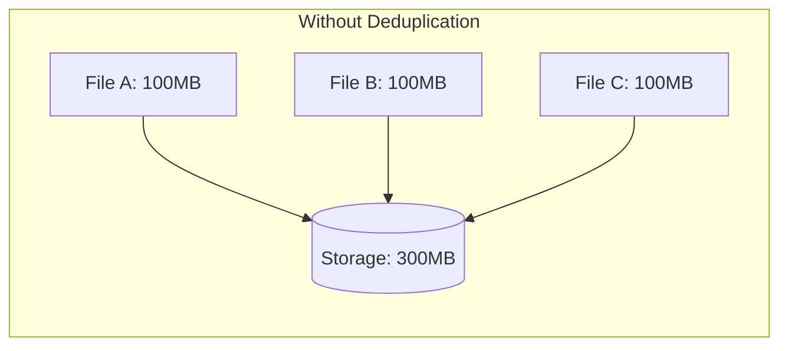
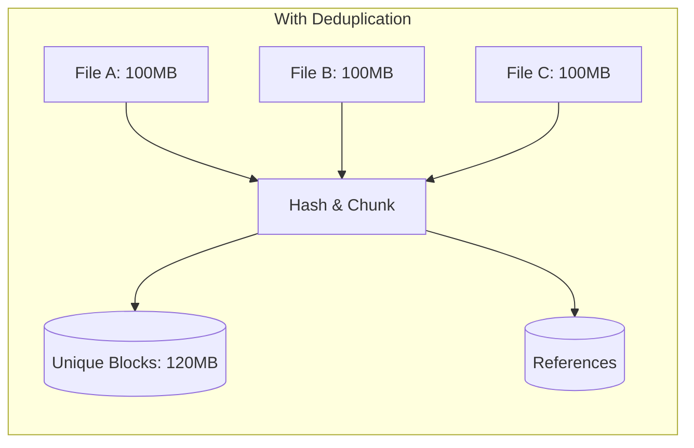
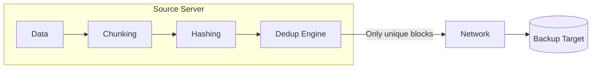
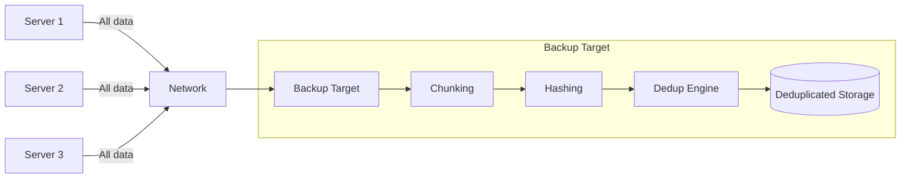
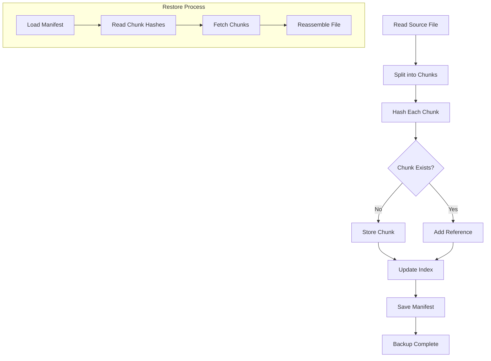
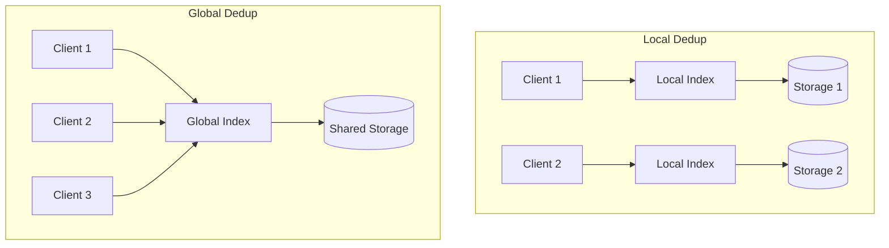

# How to Create Backup Deduplication

Author: [nawazdhandala](https://github.com/nawazdhandala)

Tags: Backup, Deduplication, Storage, Data Protection

Description: A practical guide to implementing backup deduplication that reduces storage costs and speeds up backup windows.

---

Backups grow fast. A typical enterprise doubles its backup storage every 18 months, and most of that growth is redundant data. The same operating system files, the same application binaries, the same unchanged documents copied over and over. Deduplication solves this by storing unique data blocks exactly once, then referencing them whenever duplicates appear.

This guide covers the internals of backup deduplication: how it works, where to run it, which hash algorithms to choose, and how to implement it yourself.

---

## What Deduplication Actually Does

Traditional backups store complete copies of files. If you back up 100 virtual machines running the same OS, you store 100 copies of identical system files. Deduplication breaks files into chunks, fingerprints each chunk with a hash, and stores only the unique chunks.





The typical deduplication ratio for backup workloads ranges from 10:1 to 50:1. That means 10TB of backup data compresses to 1TB or less of actual storage.

---

## Source vs Target Deduplication

Deduplication can happen at two points in the backup pipeline:

### Source-Side Deduplication

The backup client on the source machine performs deduplication before sending data over the network.

**Advantages:**
- Reduces network bandwidth significantly
- Less data to transfer means faster backup windows
- Lower load on backup server

**Disadvantages:**
- Adds CPU overhead to production servers
- Requires dedup-aware backup agents
- Each client maintains its own hash index (or queries a central index)



### Target-Side Deduplication

The backup server receives all data and deduplicates it after arrival.

**Advantages:**
- No impact on production servers
- Centralized dedup index improves global deduplication
- Works with any backup agent

**Disadvantages:**
- Full data traverses the network
- Backup server needs significant CPU and RAM
- Higher network costs



### Inline vs Post-Process Deduplication

**Inline deduplication** happens as data arrives. Each block is hashed and checked before writing. This saves storage immediately but adds latency to the backup stream.

**Post-process deduplication** writes data first, then deduplicates in a background job. This keeps backup windows fast but requires temporary staging space.

Most production systems use inline deduplication because the storage savings outweigh the minor latency cost.

---

## Block-Level Deduplication

The core of any dedup system is how it divides data into blocks. There are two main approaches:

### Fixed-Length Chunking

Divide files into equal-sized blocks (typically 4KB to 64KB).

```python
def fixed_chunk(data: bytes, chunk_size: int = 8192) -> list[bytes]:
    """Split data into fixed-size chunks."""
    chunks = []
    for i in range(0, len(data), chunk_size):
        chunks.append(data[i:i + chunk_size])
    return chunks
```

**Problem:** If you insert a single byte at the beginning of a file, every chunk boundary shifts. The entire file appears as new unique blocks, destroying deduplication efficiency.

### Variable-Length Chunking (Content-Defined Chunking)

Use the data itself to determine chunk boundaries. The most common technique is Rabin fingerprinting.

```python
import hashlib

def rabin_chunk(data: bytes,
                min_size: int = 2048,
                max_size: int = 65536,
                target_size: int = 8192) -> list[bytes]:
    """
    Content-defined chunking using a rolling hash.
    Chunk boundaries are determined by the data content,
    not fixed positions.
    """
    chunks = []
    start = 0
    pos = 0
    window_size = 48

    # Mask determines average chunk size (target_size)
    # For 8KB average: mask = 0x1FFF (13 bits set)
    mask = target_size - 1

    rolling_hash = 0

    while pos < len(data):
        # Update rolling hash with current byte
        if pos >= window_size:
            # Remove contribution of byte leaving the window
            rolling_hash ^= data[pos - window_size]
        rolling_hash = ((rolling_hash << 1) | (data[pos] & 1)) & 0xFFFFFFFF

        chunk_len = pos - start + 1

        # Check for chunk boundary
        boundary = False
        if chunk_len >= min_size:
            if (rolling_hash & mask) == 0:
                boundary = True
            elif chunk_len >= max_size:
                boundary = True

        if boundary:
            chunks.append(data[start:pos + 1])
            start = pos + 1

        pos += 1

    # Handle remaining data
    if start < len(data):
        chunks.append(data[start:])

    return chunks
```

Variable-length chunking handles insertions and deletions gracefully. Only the affected chunks change; the rest of the file still deduplicates against previous versions.

---

## Hash Algorithms for Deduplication

Each chunk needs a fingerprint to identify duplicates. The hash must be:
- Fast enough for high throughput
- Collision-resistant (different data should not produce the same hash)

### Common Choices

| Algorithm | Hash Size | Speed | Collision Resistance |
|-----------|-----------|-------|---------------------|
| MD5 | 128 bits | Very fast | Weak (broken for security, fine for dedup) |
| SHA-1 | 160 bits | Fast | Weak (broken for security, acceptable for dedup) |
| SHA-256 | 256 bits | Moderate | Strong |
| xxHash | 64/128 bits | Extremely fast | Good for dedup |
| BLAKE3 | 256 bits | Very fast | Strong |

For deduplication, cryptographic strength matters less than speed and collision avoidance. Many production systems use xxHash or BLAKE3 for performance, with SHA-256 as a fallback for verification.

### Implementation Example

```python
import hashlib
import xxhash

class ChunkStore:
    """Simple chunk store with deduplication."""

    def __init__(self):
        self.chunks = {}  # hash -> data
        self.references = {}  # hash -> reference count

    def hash_chunk(self, data: bytes) -> str:
        """Generate a hash for a chunk using xxHash for speed."""
        return xxhash.xxh128(data).hexdigest()

    def store_chunk(self, data: bytes) -> str:
        """Store a chunk, returning its hash. Deduplicates automatically."""
        chunk_hash = self.hash_chunk(data)

        if chunk_hash in self.chunks:
            # Duplicate found, just increment reference
            self.references[chunk_hash] += 1
        else:
            # New unique chunk
            self.chunks[chunk_hash] = data
            self.references[chunk_hash] = 1

        return chunk_hash

    def get_chunk(self, chunk_hash: str) -> bytes:
        """Retrieve a chunk by its hash."""
        return self.chunks.get(chunk_hash)

    def delete_reference(self, chunk_hash: str):
        """Remove a reference. Delete chunk when references hit zero."""
        if chunk_hash in self.references:
            self.references[chunk_hash] -= 1
            if self.references[chunk_hash] <= 0:
                del self.chunks[chunk_hash]
                del self.references[chunk_hash]

    def stats(self) -> dict:
        """Return deduplication statistics."""
        total_refs = sum(self.references.values())
        unique_chunks = len(self.chunks)
        stored_bytes = sum(len(c) for c in self.chunks.values())

        return {
            "unique_chunks": unique_chunks,
            "total_references": total_refs,
            "stored_bytes": stored_bytes,
            "dedup_ratio": total_refs / unique_chunks if unique_chunks > 0 else 1
        }
```

---

## Building a Deduplication Pipeline

Here is a complete example that ties together chunking, hashing, and storage:

```python
import os
import json
from dataclasses import dataclass
from typing import Iterator

@dataclass
class FileManifest:
    """Tracks how a file maps to deduplicated chunks."""
    filename: str
    size: int
    chunk_hashes: list[str]

class DedupBackup:
    """A simple deduplicating backup system."""

    def __init__(self, storage_path: str):
        self.storage_path = storage_path
        self.chunk_dir = os.path.join(storage_path, "chunks")
        self.manifest_dir = os.path.join(storage_path, "manifests")

        os.makedirs(self.chunk_dir, exist_ok=True)
        os.makedirs(self.manifest_dir, exist_ok=True)

        self.index = self._load_index()

    def _load_index(self) -> dict:
        """Load the chunk index from disk."""
        index_path = os.path.join(self.storage_path, "index.json")
        if os.path.exists(index_path):
            with open(index_path, "r") as f:
                return json.load(f)
        return {"chunks": {}, "stats": {"total_input": 0, "stored": 0}}

    def _save_index(self):
        """Persist the chunk index to disk."""
        index_path = os.path.join(self.storage_path, "index.json")
        with open(index_path, "w") as f:
            json.dump(self.index, f)

    def _chunk_path(self, chunk_hash: str) -> str:
        """Return the storage path for a chunk (with directory sharding)."""
        # Shard into 256 directories to avoid filesystem limits
        shard = chunk_hash[:2]
        shard_dir = os.path.join(self.chunk_dir, shard)
        os.makedirs(shard_dir, exist_ok=True)
        return os.path.join(shard_dir, chunk_hash)

    def backup_file(self, filepath: str) -> FileManifest:
        """Backup a file with deduplication."""
        chunk_hashes = []
        file_size = 0

        with open(filepath, "rb") as f:
            data = f.read()

        file_size = len(data)
        self.index["stats"]["total_input"] += file_size

        # Use content-defined chunking
        chunks = rabin_chunk(data)

        for chunk in chunks:
            chunk_hash = xxhash.xxh128(chunk).hexdigest()
            chunk_hashes.append(chunk_hash)

            # Store if new
            if chunk_hash not in self.index["chunks"]:
                chunk_path = self._chunk_path(chunk_hash)
                with open(chunk_path, "wb") as f:
                    f.write(chunk)
                self.index["chunks"][chunk_hash] = len(chunk)
                self.index["stats"]["stored"] += len(chunk)

        # Save manifest
        manifest = FileManifest(
            filename=os.path.basename(filepath),
            size=file_size,
            chunk_hashes=chunk_hashes
        )

        manifest_path = os.path.join(
            self.manifest_dir,
            f"{manifest.filename}.manifest.json"
        )
        with open(manifest_path, "w") as f:
            json.dump({
                "filename": manifest.filename,
                "size": manifest.size,
                "chunk_hashes": manifest.chunk_hashes
            }, f)

        self._save_index()
        return manifest

    def restore_file(self, manifest_path: str, output_path: str):
        """Restore a file from its manifest."""
        with open(manifest_path, "r") as f:
            manifest_data = json.load(f)

        with open(output_path, "wb") as out:
            for chunk_hash in manifest_data["chunk_hashes"]:
                chunk_path = self._chunk_path(chunk_hash)
                with open(chunk_path, "rb") as chunk_file:
                    out.write(chunk_file.read())

    def dedup_ratio(self) -> float:
        """Calculate the current deduplication ratio."""
        stats = self.index["stats"]
        if stats["stored"] == 0:
            return 1.0
        return stats["total_input"] / stats["stored"]
```

---

## Deduplication Workflow

Here is how a complete backup with deduplication flows:



---

## Optimizing Deduplication Performance

### Index Caching

The hash index becomes the bottleneck at scale. Solutions:

```python
from functools import lru_cache

class OptimizedChunkStore:
    def __init__(self):
        self.disk_index = {}  # Persistent
        self._cache = {}  # In-memory LRU
        self._cache_size = 1_000_000  # Cache 1M hashes

    @lru_cache(maxsize=1_000_000)
    def chunk_exists(self, chunk_hash: str) -> bool:
        """Check if chunk exists with caching."""
        return chunk_hash in self.disk_index
```

### Bloom Filters

For massive indexes, use a Bloom filter as a first-pass check:

```python
from pybloom_live import BloomFilter

class BloomChunkIndex:
    def __init__(self, expected_chunks: int = 10_000_000):
        # 1% false positive rate
        self.bloom = BloomFilter(capacity=expected_chunks, error_rate=0.01)
        self.actual_index = {}

    def add_chunk(self, chunk_hash: str, chunk_data: bytes):
        self.bloom.add(chunk_hash)
        self.actual_index[chunk_hash] = chunk_data

    def maybe_exists(self, chunk_hash: str) -> bool:
        """Fast check. True means 'possibly exists', False means 'definitely not'."""
        return chunk_hash in self.bloom

    def definitely_exists(self, chunk_hash: str) -> bool:
        """Slower but accurate check."""
        if not self.maybe_exists(chunk_hash):
            return False
        return chunk_hash in self.actual_index
```

### Parallel Processing

Chunk and hash in parallel for better throughput:

```python
from concurrent.futures import ThreadPoolExecutor, as_completed

def parallel_dedup_backup(files: list[str], backup: DedupBackup, workers: int = 4):
    """Backup multiple files in parallel."""
    results = []

    with ThreadPoolExecutor(max_workers=workers) as executor:
        futures = {
            executor.submit(backup.backup_file, f): f
            for f in files
        }

        for future in as_completed(futures):
            filepath = futures[future]
            try:
                manifest = future.result()
                results.append((filepath, manifest))
            except Exception as e:
                print(f"Failed to backup {filepath}: {e}")

    return results
```

---

## Global vs Local Deduplication

**Local deduplication** deduplicates within a single backup job or client. Simpler but less effective.

**Global deduplication** deduplicates across all backups from all clients. Much better ratios (that Windows system32 folder is stored once, not 10,000 times) but requires a shared index.



For source-side dedup with a global index, clients query the backup server before uploading:

```python
def source_side_backup_with_global_dedup(
    filepath: str,
    server_url: str
) -> list[str]:
    """
    Source-side backup that checks a global index.
    Only uploads chunks the server does not have.
    """
    import requests

    with open(filepath, "rb") as f:
        data = f.read()

    chunks = rabin_chunk(data)
    chunk_hashes = []

    for chunk in chunks:
        chunk_hash = xxhash.xxh128(chunk).hexdigest()
        chunk_hashes.append(chunk_hash)

        # Check if server has this chunk
        response = requests.head(f"{server_url}/chunks/{chunk_hash}")

        if response.status_code == 404:
            # Server does not have it, upload
            requests.put(
                f"{server_url}/chunks/{chunk_hash}",
                data=chunk,
                headers={"Content-Type": "application/octet-stream"}
            )

    # Register the file manifest
    requests.post(
        f"{server_url}/manifests",
        json={"filename": filepath, "chunks": chunk_hashes}
    )

    return chunk_hashes
```

---

## Handling Deduplication Edge Cases

### Hash Collisions

While extremely rare with 128-bit or 256-bit hashes, collisions can cause data corruption. Mitigate with:

1. **Dual hashing:** Store two different hashes per chunk
2. **Size verification:** Check chunk size matches before considering it a duplicate
3. **Periodic verification:** Background job that re-hashes stored chunks

```python
def safe_chunk_match(
    new_chunk: bytes,
    stored_hash: str,
    stored_size: int
) -> bool:
    """Verify chunk match with multiple checks."""
    if len(new_chunk) != stored_size:
        return False

    new_hash = xxhash.xxh128(new_chunk).hexdigest()
    if new_hash != stored_hash:
        return False

    # Optional: secondary hash for critical data
    # new_sha = hashlib.sha256(new_chunk).hexdigest()
    # return new_sha == stored_sha

    return True
```

### Garbage Collection

When backups are deleted, chunks may no longer be referenced. Reference counting handles this:

```python
def garbage_collect(backup: DedupBackup):
    """Remove chunks with zero references."""
    # Build reference counts from all manifests
    ref_counts = {}

    for manifest_file in os.listdir(backup.manifest_dir):
        manifest_path = os.path.join(backup.manifest_dir, manifest_file)
        with open(manifest_path) as f:
            manifest = json.load(f)

        for chunk_hash in manifest["chunk_hashes"]:
            ref_counts[chunk_hash] = ref_counts.get(chunk_hash, 0) + 1

    # Remove unreferenced chunks
    for chunk_hash in list(backup.index["chunks"].keys()):
        if chunk_hash not in ref_counts:
            chunk_path = backup._chunk_path(chunk_hash)
            os.remove(chunk_path)
            del backup.index["chunks"][chunk_hash]

    backup._save_index()
```

---

## Compression and Deduplication

Deduplication and compression complement each other:

1. **Deduplicate first:** Removes redundant blocks
2. **Compress second:** Compresses the unique blocks

Do not compress before deduplication. Compression changes byte patterns, destroying dedup efficiency.

```python
import zlib

def store_chunk_compressed(
    chunk_store: ChunkStore,
    data: bytes,
    compression_level: int = 6
) -> tuple[str, int]:
    """Store a chunk with compression after dedup check."""
    chunk_hash = chunk_store.hash_chunk(data)

    if chunk_hash in chunk_store.chunks:
        # Duplicate, no need to compress
        return chunk_hash, 0

    # New chunk, compress then store
    compressed = zlib.compress(data, level=compression_level)
    chunk_store.chunks[chunk_hash] = compressed
    chunk_store.references[chunk_hash] = 1

    return chunk_hash, len(compressed)
```

---

## Monitoring Deduplication Effectiveness

Track these metrics:

```python
@dataclass
class DedupMetrics:
    total_input_bytes: int
    unique_bytes_stored: int
    dedup_ratio: float
    chunk_count: int
    average_chunk_size: float
    largest_chunk: int
    smallest_chunk: int

def collect_metrics(backup: DedupBackup) -> DedupMetrics:
    """Collect deduplication metrics for monitoring."""
    stats = backup.index["stats"]
    chunks = backup.index["chunks"]

    chunk_sizes = list(chunks.values())

    return DedupMetrics(
        total_input_bytes=stats["total_input"],
        unique_bytes_stored=stats["stored"],
        dedup_ratio=stats["total_input"] / max(stats["stored"], 1),
        chunk_count=len(chunks),
        average_chunk_size=sum(chunk_sizes) / max(len(chunk_sizes), 1),
        largest_chunk=max(chunk_sizes) if chunk_sizes else 0,
        smallest_chunk=min(chunk_sizes) if chunk_sizes else 0
    )
```

Expose these to your monitoring system. If dedup ratios drop suddenly, investigate: it might mean new data types that do not deduplicate well, or a bug in chunking.

---

## Production Considerations

### Encryption

Deduplicate before encryption. Encrypted data appears random and will not deduplicate.

For secure multi-tenant systems, consider convergent encryption: derive the encryption key from the chunk content itself. Identical chunks encrypt to identical ciphertext, preserving dedup.

```python
from cryptography.hazmat.primitives.ciphers import Cipher, algorithms, modes
from cryptography.hazmat.backends import default_backend
import hashlib

def convergent_encrypt(data: bytes) -> tuple[bytes, bytes]:
    """Encrypt data using a key derived from the data itself."""
    # Derive key from content hash
    key = hashlib.sha256(data).digest()

    # Fixed IV for convergent encryption (or derive from content)
    iv = hashlib.md5(data).digest()

    cipher = Cipher(algorithms.AES(key), modes.CTR(iv), backend=default_backend())
    encryptor = cipher.encryptor()

    ciphertext = encryptor.update(data) + encryptor.finalize()
    return ciphertext, key
```

### Disaster Recovery

Store chunk indexes redundantly. Losing the index makes chunks unrecoverable. Consider:

- Replicate the index to multiple storage locations
- Store index snapshots in a separate system
- Include enough metadata in chunk storage to rebuild the index

### Testing

Always verify restores. A dedup system that cannot restore is worthless:

```python
def verify_backup_integrity(backup: DedupBackup, original_path: str):
    """Verify a backup can be restored correctly."""
    import tempfile
    import filecmp

    manifest_path = os.path.join(
        backup.manifest_dir,
        f"{os.path.basename(original_path)}.manifest.json"
    )

    with tempfile.NamedTemporaryFile(delete=False) as tmp:
        backup.restore_file(manifest_path, tmp.name)

        if not filecmp.cmp(original_path, tmp.name, shallow=False):
            raise ValueError("Restore verification failed: files differ")

        os.unlink(tmp.name)

    return True
```

---

## Conclusion

Backup deduplication is not magic. It is chunking, hashing, and reference counting. The complexity comes from doing it fast enough at scale and handling edge cases gracefully.

Start with these fundamentals:
- Use content-defined chunking to handle file modifications
- Pick a fast hash algorithm (xxHash or BLAKE3 for most cases)
- Implement proper reference counting for garbage collection
- Always verify restores

For production systems, consider established tools like Borg Backup, Restic, or enterprise solutions that have solved the hard problems. But understanding the internals helps you choose the right tool and debug when things go wrong.

Your storage budget will thank you.
