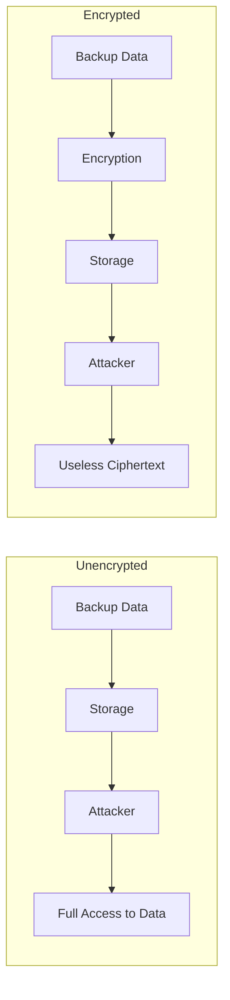
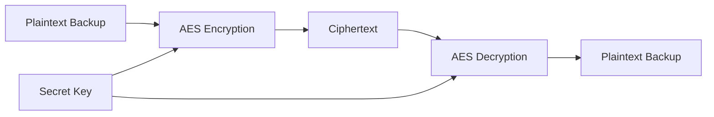
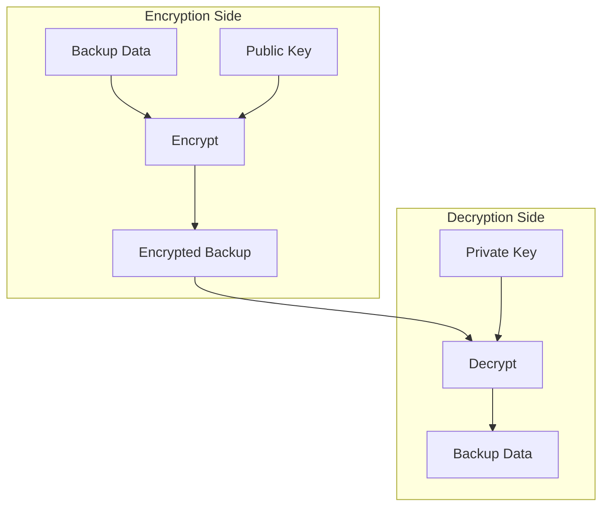
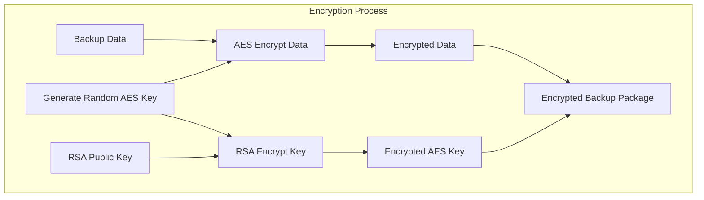
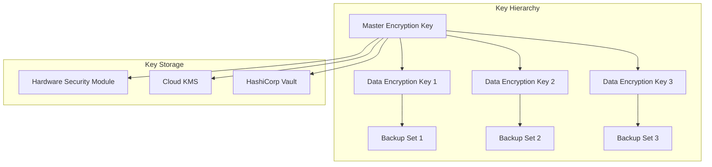
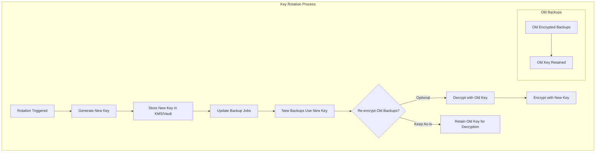
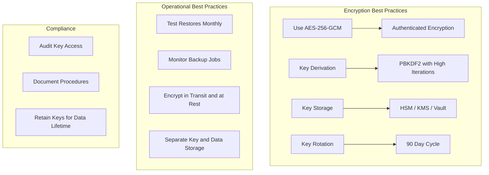

# How to Create Backup Encryption

Author: [nawazdhandala](https://github.com/nawazdhandala)

Tags: Backup, Security, Encryption, Data Protection

Description: Learn how to implement backup encryption for protecting sensitive data at rest.

---

Backups are worthless if attackers can read them. Unencrypted backups expose your most sensitive data to theft, compliance violations, and catastrophic breaches. This guide shows you how to implement robust backup encryption that keeps your data safe even when backup media is compromised.

## Why Encrypt Backups?

Backups often contain your most valuable data: database dumps, configuration files, secrets, and user data. Without encryption:

- Stolen backup drives expose everything
- Cloud storage breaches leak sensitive data
- Insider threats can exfiltrate backups
- Compliance regulations (GDPR, HIPAA, PCI-DSS) require encryption



## Understanding Encryption Algorithms

### Symmetric Encryption (AES)

AES (Advanced Encryption Standard) is the gold standard for encrypting backup data. It uses the same key for encryption and decryption.



**Key sizes:**
- AES-128: Good security, fast performance
- AES-256: Maximum security, slightly slower (recommended for backups)

### Asymmetric Encryption (RSA/ECC)

Asymmetric encryption uses a public key for encryption and a private key for decryption. Useful for scenarios where you want to encrypt without having the decryption key present.



### Hybrid Encryption (Recommended)

Combine both approaches: use asymmetric encryption to protect the symmetric key, and symmetric encryption for the actual data.



## Encryption Implementation Examples

### OpenSSL Command Line Encryption

```bash
#!/bin/bash
# backup-encrypt.sh
# Encrypts backup files using AES-256-GCM with a password

# Configuration
BACKUP_DIR="/var/backups"
ENCRYPTED_DIR="/var/backups/encrypted"
PASSWORD_FILE="/etc/backup/.encryption_key"

# Create encrypted backup directory if it doesn't exist
mkdir -p "$ENCRYPTED_DIR"

# Function to encrypt a single file
encrypt_file() {
    local input_file="$1"
    local output_file="$2"

    # Read password from secure file
    # The password file should have permissions 600 and be owned by root
    local password=$(cat "$PASSWORD_FILE")

    # Encrypt using AES-256-GCM (authenticated encryption)
    # -pbkdf2: Use PBKDF2 key derivation (more secure than default)
    # -iter 100000: 100,000 iterations for key derivation
    # -salt: Add random salt (enabled by default but explicit is good)
    openssl enc -aes-256-gcm \
        -pbkdf2 \
        -iter 100000 \
        -salt \
        -in "$input_file" \
        -out "$output_file" \
        -pass "pass:$password"

    # Clear password from memory
    unset password

    echo "Encrypted: $input_file -> $output_file"
}

# Function to decrypt a file
decrypt_file() {
    local input_file="$1"
    local output_file="$2"
    local password=$(cat "$PASSWORD_FILE")

    openssl enc -aes-256-gcm \
        -d \
        -pbkdf2 \
        -iter 100000 \
        -in "$input_file" \
        -out "$output_file" \
        -pass "pass:$password"

    unset password
    echo "Decrypted: $input_file -> $output_file"
}

# Main execution
case "$1" in
    encrypt)
        encrypt_file "$2" "$3"
        ;;
    decrypt)
        decrypt_file "$2" "$3"
        ;;
    *)
        echo "Usage: $0 {encrypt|decrypt} <input_file> <output_file>"
        exit 1
        ;;
esac
```

### Python Backup Encryption

```python
#!/usr/bin/env python3
"""
backup_encryption.py
Implements AES-256-GCM encryption for backup files with proper key management.
"""

import os
import sys
import struct
from pathlib import Path
from typing import Tuple

# Use cryptography library for secure encryption
# Install with: pip install cryptography
from cryptography.hazmat.primitives.ciphers.aead import AESGCM
from cryptography.hazmat.primitives import hashes
from cryptography.hazmat.primitives.kdf.pbkdf2 import PBKDF2HMAC
from cryptography.hazmat.backends import default_backend


class BackupEncryption:
    """
    Handles encryption and decryption of backup files using AES-256-GCM.

    AES-GCM provides both confidentiality and authenticity, ensuring
    that encrypted data cannot be tampered with without detection.
    """

    # Security parameters
    KEY_LENGTH = 32  # 256 bits for AES-256
    NONCE_LENGTH = 12  # 96 bits recommended for GCM
    SALT_LENGTH = 16  # 128 bits for PBKDF2 salt
    ITERATIONS = 100000  # PBKDF2 iteration count

    def __init__(self, password: str = None, key: bytes = None):
        """
        Initialize encryption with either a password or raw key.

        Args:
            password: Human-readable password (will be derived to key)
            key: Raw 32-byte encryption key
        """
        if key:
            # Use provided key directly
            self.key = key
        elif password:
            # Store password for later key derivation with salt
            self.password = password
            self.key = None
        else:
            raise ValueError("Must provide either password or key")

    def _derive_key(self, salt: bytes) -> bytes:
        """
        Derive encryption key from password using PBKDF2.

        PBKDF2 makes brute-force attacks computationally expensive
        by requiring many iterations of hashing.
        """
        kdf = PBKDF2HMAC(
            algorithm=hashes.SHA256(),
            length=self.KEY_LENGTH,
            salt=salt,
            iterations=self.ITERATIONS,
            backend=default_backend()
        )
        return kdf.derive(self.password.encode('utf-8'))

    def encrypt_file(self, input_path: str, output_path: str) -> None:
        """
        Encrypt a file using AES-256-GCM.

        Output format:
        [salt (16 bytes)][nonce (12 bytes)][ciphertext + tag]
        """
        # Generate random salt and nonce
        salt = os.urandom(self.SALT_LENGTH)
        nonce = os.urandom(self.NONCE_LENGTH)

        # Derive key if using password
        if self.key:
            key = self.key
        else:
            key = self._derive_key(salt)

        # Create cipher
        aesgcm = AESGCM(key)

        # Read plaintext
        with open(input_path, 'rb') as f:
            plaintext = f.read()

        # Encrypt (GCM automatically appends authentication tag)
        ciphertext = aesgcm.encrypt(nonce, plaintext, None)

        # Write output: salt + nonce + ciphertext
        with open(output_path, 'wb') as f:
            f.write(salt)
            f.write(nonce)
            f.write(ciphertext)

        print(f"Encrypted {input_path} -> {output_path}")
        print(f"  Original size: {len(plaintext)} bytes")
        print(f"  Encrypted size: {len(ciphertext) + self.SALT_LENGTH + self.NONCE_LENGTH} bytes")

    def decrypt_file(self, input_path: str, output_path: str) -> None:
        """
        Decrypt a file encrypted with encrypt_file().

        Verifies authentication tag to detect tampering.
        """
        with open(input_path, 'rb') as f:
            # Read salt and nonce
            salt = f.read(self.SALT_LENGTH)
            nonce = f.read(self.NONCE_LENGTH)
            ciphertext = f.read()

        # Derive key if using password
        if self.key:
            key = self.key
        else:
            key = self._derive_key(salt)

        # Create cipher and decrypt
        aesgcm = AESGCM(key)

        try:
            plaintext = aesgcm.decrypt(nonce, ciphertext, None)
        except Exception as e:
            raise ValueError("Decryption failed - wrong key or corrupted data") from e

        # Write decrypted data
        with open(output_path, 'wb') as f:
            f.write(plaintext)

        print(f"Decrypted {input_path} -> {output_path}")


def generate_key() -> bytes:
    """Generate a random 256-bit encryption key."""
    return os.urandom(32)


def main():
    """Example usage of backup encryption."""

    # Example 1: Password-based encryption
    password = "my-secure-backup-password-2024"
    encryptor = BackupEncryption(password=password)

    # Encrypt a backup file
    encryptor.encrypt_file(
        "/var/backups/database.sql",
        "/var/backups/encrypted/database.sql.enc"
    )

    # Decrypt when needed
    encryptor.decrypt_file(
        "/var/backups/encrypted/database.sql.enc",
        "/var/backups/restored/database.sql"
    )

    # Example 2: Key-based encryption (more secure for automation)
    key = generate_key()
    print(f"Generated key (store securely): {key.hex()}")

    encryptor = BackupEncryption(key=key)
    encryptor.encrypt_file(
        "/var/backups/configs.tar",
        "/var/backups/encrypted/configs.tar.enc"
    )


if __name__ == "__main__":
    main()
```

### Go Backup Encryption

```go
// backup_encryption.go
// Implements AES-256-GCM encryption for backup files in Go

package main

import (
    "crypto/aes"
    "crypto/cipher"
    "crypto/rand"
    "crypto/sha256"
    "fmt"
    "io"
    "os"

    "golang.org/x/crypto/pbkdf2"
)

const (
    // KeyLength is the size of AES-256 key in bytes
    KeyLength = 32
    // NonceLength is the recommended size for GCM nonce
    NonceLength = 12
    // SaltLength for PBKDF2 key derivation
    SaltLength = 16
    // Iterations for PBKDF2 - higher is more secure but slower
    Iterations = 100000
)

// BackupEncryptor handles encryption and decryption of backup files
type BackupEncryptor struct {
    password string
    key      []byte
}

// NewBackupEncryptor creates a new encryptor with a password
func NewBackupEncryptor(password string) *BackupEncryptor {
    return &BackupEncryptor{password: password}
}

// NewBackupEncryptorWithKey creates a new encryptor with a raw key
func NewBackupEncryptorWithKey(key []byte) *BackupEncryptor {
    if len(key) != KeyLength {
        panic("key must be 32 bytes for AES-256")
    }
    return &BackupEncryptor{key: key}
}

// deriveKey derives an encryption key from password and salt using PBKDF2
func (e *BackupEncryptor) deriveKey(salt []byte) []byte {
    if e.key != nil {
        return e.key
    }
    // PBKDF2 with SHA-256 for key derivation
    return pbkdf2.Key([]byte(e.password), salt, Iterations, KeyLength, sha256.New)
}

// EncryptFile encrypts a file using AES-256-GCM
// Output format: [salt (16 bytes)][nonce (12 bytes)][ciphertext + tag]
func (e *BackupEncryptor) EncryptFile(inputPath, outputPath string) error {
    // Read input file
    plaintext, err := os.ReadFile(inputPath)
    if err != nil {
        return fmt.Errorf("failed to read input file: %w", err)
    }

    // Generate random salt and nonce
    salt := make([]byte, SaltLength)
    if _, err := io.ReadFull(rand.Reader, salt); err != nil {
        return fmt.Errorf("failed to generate salt: %w", err)
    }

    nonce := make([]byte, NonceLength)
    if _, err := io.ReadFull(rand.Reader, nonce); err != nil {
        return fmt.Errorf("failed to generate nonce: %w", err)
    }

    // Derive key from password
    key := e.deriveKey(salt)

    // Create AES cipher
    block, err := aes.NewCipher(key)
    if err != nil {
        return fmt.Errorf("failed to create cipher: %w", err)
    }

    // Create GCM mode
    gcm, err := cipher.NewGCM(block)
    if err != nil {
        return fmt.Errorf("failed to create GCM: %w", err)
    }

    // Encrypt data (GCM appends authentication tag automatically)
    ciphertext := gcm.Seal(nil, nonce, plaintext, nil)

    // Write output: salt + nonce + ciphertext
    output, err := os.Create(outputPath)
    if err != nil {
        return fmt.Errorf("failed to create output file: %w", err)
    }
    defer output.Close()

    // Write salt
    if _, err := output.Write(salt); err != nil {
        return fmt.Errorf("failed to write salt: %w", err)
    }

    // Write nonce
    if _, err := output.Write(nonce); err != nil {
        return fmt.Errorf("failed to write nonce: %w", err)
    }

    // Write ciphertext
    if _, err := output.Write(ciphertext); err != nil {
        return fmt.Errorf("failed to write ciphertext: %w", err)
    }

    fmt.Printf("Encrypted %s -> %s\n", inputPath, outputPath)
    fmt.Printf("  Original size: %d bytes\n", len(plaintext))
    fmt.Printf("  Encrypted size: %d bytes\n", SaltLength+NonceLength+len(ciphertext))

    return nil
}

// DecryptFile decrypts a file encrypted with EncryptFile
func (e *BackupEncryptor) DecryptFile(inputPath, outputPath string) error {
    // Read encrypted file
    data, err := os.ReadFile(inputPath)
    if err != nil {
        return fmt.Errorf("failed to read input file: %w", err)
    }

    // Validate minimum size
    minSize := SaltLength + NonceLength + 16 // 16 bytes for GCM tag
    if len(data) < minSize {
        return fmt.Errorf("encrypted file too small")
    }

    // Extract salt, nonce, and ciphertext
    salt := data[:SaltLength]
    nonce := data[SaltLength : SaltLength+NonceLength]
    ciphertext := data[SaltLength+NonceLength:]

    // Derive key from password
    key := e.deriveKey(salt)

    // Create AES cipher
    block, err := aes.NewCipher(key)
    if err != nil {
        return fmt.Errorf("failed to create cipher: %w", err)
    }

    // Create GCM mode
    gcm, err := cipher.NewGCM(block)
    if err != nil {
        return fmt.Errorf("failed to create GCM: %w", err)
    }

    // Decrypt and verify authentication tag
    plaintext, err := gcm.Open(nil, nonce, ciphertext, nil)
    if err != nil {
        return fmt.Errorf("decryption failed - wrong key or corrupted data: %w", err)
    }

    // Write decrypted data
    if err := os.WriteFile(outputPath, plaintext, 0600); err != nil {
        return fmt.Errorf("failed to write output file: %w", err)
    }

    fmt.Printf("Decrypted %s -> %s\n", inputPath, outputPath)

    return nil
}

// GenerateKey generates a cryptographically secure random key
func GenerateKey() ([]byte, error) {
    key := make([]byte, KeyLength)
    if _, err := io.ReadFull(rand.Reader, key); err != nil {
        return nil, fmt.Errorf("failed to generate key: %w", err)
    }
    return key, nil
}

func main() {
    // Example usage
    encryptor := NewBackupEncryptor("my-secure-password")

    // Encrypt a backup
    if err := encryptor.EncryptFile("/var/backups/data.tar", "/var/backups/data.tar.enc"); err != nil {
        fmt.Fprintf(os.Stderr, "Encryption error: %v\n", err)
        os.Exit(1)
    }

    // Decrypt when needed
    if err := encryptor.DecryptFile("/var/backups/data.tar.enc", "/var/backups/data.tar.restored"); err != nil {
        fmt.Fprintf(os.Stderr, "Decryption error: %v\n", err)
        os.Exit(1)
    }
}
```

## Key Management

Encryption is only as secure as your key management. A perfect encryption algorithm is worthless if keys are stored insecurely.

### Key Management Architecture



### HashiCorp Vault Integration

```python
#!/usr/bin/env python3
"""
vault_backup_encryption.py
Integrates backup encryption with HashiCorp Vault for key management.
"""

import os
import hvac
from backup_encryption import BackupEncryption, generate_key


class VaultKeyManager:
    """
    Manages encryption keys using HashiCorp Vault.

    Vault provides:
    - Secure key storage with encryption at rest
    - Access control and audit logging
    - Key rotation capabilities
    - Dynamic secrets
    """

    def __init__(self, vault_url: str, token: str = None):
        """
        Initialize Vault client.

        Args:
            vault_url: Vault server URL (e.g., https://vault.example.com:8200)
            token: Vault token (or set VAULT_TOKEN env var)
        """
        self.client = hvac.Client(
            url=vault_url,
            token=token or os.environ.get('VAULT_TOKEN')
        )

        # Verify connection
        if not self.client.is_authenticated():
            raise ValueError("Failed to authenticate with Vault")

    def store_key(self, key_name: str, key: bytes) -> None:
        """
        Store an encryption key in Vault's KV secrets engine.

        Args:
            key_name: Identifier for the key
            key: Raw encryption key bytes
        """
        # Store key as hex string in KV v2 engine
        self.client.secrets.kv.v2.create_or_update_secret(
            path=f"backup-keys/{key_name}",
            secret={
                'key': key.hex(),
                'algorithm': 'AES-256-GCM',
                'created_at': str(os.popen('date -u +%Y-%m-%dT%H:%M:%SZ').read().strip())
            }
        )
        print(f"Stored key '{key_name}' in Vault")

    def get_key(self, key_name: str) -> bytes:
        """
        Retrieve an encryption key from Vault.

        Args:
            key_name: Identifier for the key

        Returns:
            Raw encryption key bytes
        """
        secret = self.client.secrets.kv.v2.read_secret_version(
            path=f"backup-keys/{key_name}"
        )
        key_hex = secret['data']['data']['key']
        return bytes.fromhex(key_hex)

    def rotate_key(self, key_name: str) -> bytes:
        """
        Rotate an encryption key by generating a new version.

        The old key remains available for decrypting old backups.

        Args:
            key_name: Identifier for the key

        Returns:
            New encryption key bytes
        """
        # Generate new key
        new_key = generate_key()

        # Store as new version (Vault KV v2 automatically versions)
        self.store_key(key_name, new_key)

        print(f"Rotated key '{key_name}' to new version")
        return new_key

    def get_key_version(self, key_name: str, version: int) -> bytes:
        """
        Retrieve a specific version of an encryption key.

        Useful for decrypting old backups after key rotation.

        Args:
            key_name: Identifier for the key
            version: Version number to retrieve

        Returns:
            Raw encryption key bytes
        """
        secret = self.client.secrets.kv.v2.read_secret_version(
            path=f"backup-keys/{key_name}",
            version=version
        )
        key_hex = secret['data']['data']['key']
        return bytes.fromhex(key_hex)


def encrypted_backup_with_vault(
    vault_url: str,
    key_name: str,
    input_path: str,
    output_path: str
) -> None:
    """
    Encrypt a backup file using a key from Vault.

    Args:
        vault_url: Vault server URL
        key_name: Name of the encryption key in Vault
        input_path: Path to file to encrypt
        output_path: Path for encrypted output
    """
    # Get key from Vault
    vault = VaultKeyManager(vault_url)
    key = vault.get_key(key_name)

    # Encrypt backup
    encryptor = BackupEncryption(key=key)
    encryptor.encrypt_file(input_path, output_path)

    # Clear key from memory
    del key


# Example usage
if __name__ == "__main__":
    vault_url = "https://vault.example.com:8200"

    # Initialize key manager
    vault = VaultKeyManager(vault_url)

    # Generate and store a new key
    key = generate_key()
    vault.store_key("production-backup-key", key)

    # Encrypt backup using Vault-managed key
    encrypted_backup_with_vault(
        vault_url,
        "production-backup-key",
        "/var/backups/database.sql",
        "/var/backups/encrypted/database.sql.enc"
    )
```

### AWS KMS Integration

```python
#!/usr/bin/env python3
"""
aws_kms_backup_encryption.py
Implements envelope encryption using AWS KMS for backup files.
"""

import os
import boto3
from backup_encryption import BackupEncryption


class AWSKMSEncryption:
    """
    Uses AWS KMS for key management with envelope encryption.

    Envelope encryption:
    1. Generate a data key using KMS
    2. Use plaintext data key to encrypt backup locally
    3. Store encrypted data key with the backup
    4. KMS never sees your data, only manages key encryption
    """

    def __init__(self, kms_key_id: str, region: str = 'us-east-1'):
        """
        Initialize KMS client.

        Args:
            kms_key_id: KMS key ID, ARN, or alias
            region: AWS region
        """
        self.kms_client = boto3.client('kms', region_name=region)
        self.kms_key_id = kms_key_id

    def encrypt_file(self, input_path: str, output_path: str) -> None:
        """
        Encrypt a file using envelope encryption with KMS.

        Output format:
        [encrypted_key_length (4 bytes)][encrypted_key][encrypted_data]
        """
        # Generate data key using KMS
        # KMS returns both plaintext and encrypted versions
        response = self.kms_client.generate_data_key(
            KeyId=self.kms_key_id,
            KeySpec='AES_256'
        )

        plaintext_key = response['Plaintext']
        encrypted_key = response['CiphertextBlob']

        # Encrypt backup with plaintext key
        encryptor = BackupEncryption(key=plaintext_key)

        # First encrypt to temp file
        temp_encrypted = output_path + '.tmp'
        encryptor.encrypt_file(input_path, temp_encrypted)

        # Read encrypted data
        with open(temp_encrypted, 'rb') as f:
            encrypted_data = f.read()

        # Write final output with encrypted key prepended
        with open(output_path, 'wb') as f:
            # Write length of encrypted key (4 bytes, big-endian)
            f.write(len(encrypted_key).to_bytes(4, 'big'))
            # Write encrypted key
            f.write(encrypted_key)
            # Write encrypted data
            f.write(encrypted_data)

        # Cleanup
        os.remove(temp_encrypted)

        # Clear plaintext key from memory
        del plaintext_key

        print(f"Encrypted {input_path} -> {output_path} using KMS envelope encryption")

    def decrypt_file(self, input_path: str, output_path: str) -> None:
        """
        Decrypt a file encrypted with encrypt_file().
        """
        with open(input_path, 'rb') as f:
            # Read encrypted key length
            key_length = int.from_bytes(f.read(4), 'big')
            # Read encrypted key
            encrypted_key = f.read(key_length)
            # Read encrypted data
            encrypted_data = f.read()

        # Decrypt data key using KMS
        response = self.kms_client.decrypt(
            CiphertextBlob=encrypted_key
        )
        plaintext_key = response['Plaintext']

        # Write encrypted data to temp file
        temp_encrypted = input_path + '.data.tmp'
        with open(temp_encrypted, 'wb') as f:
            f.write(encrypted_data)

        # Decrypt backup with plaintext key
        encryptor = BackupEncryption(key=plaintext_key)
        encryptor.decrypt_file(temp_encrypted, output_path)

        # Cleanup
        os.remove(temp_encrypted)
        del plaintext_key

        print(f"Decrypted {input_path} -> {output_path}")


# Example usage
if __name__ == "__main__":
    # Use KMS key alias
    kms = AWSKMSEncryption(
        kms_key_id='alias/backup-encryption-key',
        region='us-east-1'
    )

    # Encrypt backup
    kms.encrypt_file(
        '/var/backups/database.sql',
        '/var/backups/encrypted/database.sql.enc'
    )

    # Decrypt when needed
    kms.decrypt_file(
        '/var/backups/encrypted/database.sql.enc',
        '/var/backups/restored/database.sql'
    )
```

## Key Rotation

Regular key rotation limits the impact of key compromise and satisfies compliance requirements.

### Key Rotation Workflow



### Automated Key Rotation Script

```python
#!/usr/bin/env python3
"""
key_rotation.py
Automates encryption key rotation for backup systems.
"""

import os
import json
import datetime
from pathlib import Path
from typing import List, Dict
from dataclasses import dataclass
from backup_encryption import BackupEncryption, generate_key


@dataclass
class KeyMetadata:
    """Metadata for an encryption key."""
    key_id: str
    created_at: str
    expires_at: str
    status: str  # 'active', 'rotation', 'retired'


class KeyRotationManager:
    """
    Manages encryption key lifecycle and rotation.

    Key states:
    - active: Current key used for new backups
    - rotation: Previous key, still valid for decryption
    - retired: Old key, scheduled for deletion
    """

    def __init__(self, key_store_path: str, rotation_days: int = 90):
        """
        Initialize key rotation manager.

        Args:
            key_store_path: Directory to store encrypted keys and metadata
            rotation_days: Days until key rotation is required
        """
        self.key_store = Path(key_store_path)
        self.key_store.mkdir(parents=True, exist_ok=True)
        self.rotation_days = rotation_days
        self.metadata_file = self.key_store / 'key_metadata.json'

        # Load or initialize metadata
        self._load_metadata()

    def _load_metadata(self) -> None:
        """Load key metadata from disk."""
        if self.metadata_file.exists():
            with open(self.metadata_file, 'r') as f:
                data = json.load(f)
                self.keys = {
                    k: KeyMetadata(**v) for k, v in data.items()
                }
        else:
            self.keys = {}

    def _save_metadata(self) -> None:
        """Save key metadata to disk."""
        data = {
            k: {
                'key_id': v.key_id,
                'created_at': v.created_at,
                'expires_at': v.expires_at,
                'status': v.status
            }
            for k, v in self.keys.items()
        }
        with open(self.metadata_file, 'w') as f:
            json.dump(data, f, indent=2)

    def generate_new_key(self) -> str:
        """
        Generate a new encryption key and store it.

        Returns:
            Key ID of the new key
        """
        # Generate key
        key = generate_key()
        key_id = f"key-{datetime.datetime.utcnow().strftime('%Y%m%d%H%M%S')}"

        # Calculate expiration
        created = datetime.datetime.utcnow()
        expires = created + datetime.timedelta(days=self.rotation_days)

        # Store key (in production, encrypt with master key)
        key_file = self.key_store / f"{key_id}.key"
        with open(key_file, 'wb') as f:
            f.write(key)
        os.chmod(key_file, 0o600)

        # Update metadata
        self.keys[key_id] = KeyMetadata(
            key_id=key_id,
            created_at=created.isoformat(),
            expires_at=expires.isoformat(),
            status='active'
        )
        self._save_metadata()

        print(f"Generated new key: {key_id}")
        return key_id

    def get_active_key(self) -> tuple:
        """
        Get the current active encryption key.

        Returns:
            Tuple of (key_id, key_bytes)
        """
        for key_id, metadata in self.keys.items():
            if metadata.status == 'active':
                key_file = self.key_store / f"{key_id}.key"
                with open(key_file, 'rb') as f:
                    return key_id, f.read()

        # No active key, generate one
        key_id = self.generate_new_key()
        return self.get_active_key()

    def get_key_by_id(self, key_id: str) -> bytes:
        """
        Get a specific key by ID.

        Args:
            key_id: Key identifier

        Returns:
            Key bytes
        """
        key_file = self.key_store / f"{key_id}.key"
        if not key_file.exists():
            raise ValueError(f"Key not found: {key_id}")

        with open(key_file, 'rb') as f:
            return f.read()

    def rotate_keys(self) -> str:
        """
        Perform key rotation.

        1. Mark current active key as 'rotation'
        2. Generate new active key
        3. Mark old rotation keys as 'retired'

        Returns:
            New active key ID
        """
        # Move current active to rotation status
        for key_id, metadata in self.keys.items():
            if metadata.status == 'active':
                metadata.status = 'rotation'
                print(f"Key {key_id} moved to rotation status")
            elif metadata.status == 'rotation':
                metadata.status = 'retired'
                print(f"Key {key_id} marked as retired")

        # Generate new active key
        new_key_id = self.generate_new_key()

        self._save_metadata()
        return new_key_id

    def check_rotation_needed(self) -> bool:
        """
        Check if key rotation is needed based on expiration.

        Returns:
            True if rotation is needed
        """
        now = datetime.datetime.utcnow()

        for metadata in self.keys.values():
            if metadata.status == 'active':
                expires = datetime.datetime.fromisoformat(metadata.expires_at)
                if now >= expires:
                    return True

        return False

    def cleanup_retired_keys(self, grace_period_days: int = 365) -> List[str]:
        """
        Delete retired keys older than grace period.

        Args:
            grace_period_days: Days to keep retired keys

        Returns:
            List of deleted key IDs
        """
        deleted = []
        now = datetime.datetime.utcnow()
        grace = datetime.timedelta(days=grace_period_days)

        for key_id, metadata in list(self.keys.items()):
            if metadata.status == 'retired':
                created = datetime.datetime.fromisoformat(metadata.created_at)
                if now - created > grace:
                    # Delete key file
                    key_file = self.key_store / f"{key_id}.key"
                    if key_file.exists():
                        os.remove(key_file)

                    # Remove from metadata
                    del self.keys[key_id]
                    deleted.append(key_id)
                    print(f"Deleted retired key: {key_id}")

        self._save_metadata()
        return deleted


def main():
    """Example key rotation workflow."""

    # Initialize manager
    manager = KeyRotationManager(
        key_store_path='/var/lib/backup-keys',
        rotation_days=90
    )

    # Get active key for encryption
    key_id, key = manager.get_active_key()
    print(f"Active key: {key_id}")

    # Encrypt a backup
    encryptor = BackupEncryption(key=key)
    encryptor.encrypt_file(
        '/var/backups/database.sql',
        f'/var/backups/encrypted/database.sql.{key_id}.enc'
    )

    # Check if rotation is needed
    if manager.check_rotation_needed():
        print("Key rotation required!")
        new_key_id = manager.rotate_keys()
        print(f"Rotated to new key: {new_key_id}")

    # Cleanup old keys
    manager.cleanup_retired_keys(grace_period_days=365)


if __name__ == "__main__":
    main()
```

## Database Backup Encryption

### PostgreSQL Encrypted Backup

```bash
#!/bin/bash
# postgres_encrypted_backup.sh
# Creates encrypted PostgreSQL backups

set -e

# Configuration
DB_HOST="localhost"
DB_NAME="production"
DB_USER="backup_user"
BACKUP_DIR="/var/backups/postgres"
ENCRYPTION_KEY_FILE="/etc/backup/.pg_encryption_key"
RETENTION_DAYS=30

# Create backup directory
mkdir -p "$BACKUP_DIR"

# Generate timestamp
TIMESTAMP=$(date +%Y%m%d-%H%M%S)
BACKUP_FILE="$BACKUP_DIR/${DB_NAME}-${TIMESTAMP}.sql.gz.enc"

# Function to create encrypted backup
create_backup() {
    echo "Starting encrypted backup of $DB_NAME..."

    # Read encryption key from secure file
    # File should have permissions 600 and be owned by root
    ENCRYPTION_KEY=$(cat "$ENCRYPTION_KEY_FILE")

    # Create backup pipeline:
    # 1. pg_dump: Create SQL dump
    # 2. gzip: Compress data
    # 3. openssl: Encrypt with AES-256-GCM
    pg_dump \
        -h "$DB_HOST" \
        -U "$DB_USER" \
        -d "$DB_NAME" \
        --no-password \
        -F plain \
        | gzip -9 \
        | openssl enc -aes-256-gcm \
            -pbkdf2 \
            -iter 100000 \
            -salt \
            -pass "pass:$ENCRYPTION_KEY" \
            -out "$BACKUP_FILE"

    # Clear key from memory
    unset ENCRYPTION_KEY

    # Set secure permissions on backup file
    chmod 600 "$BACKUP_FILE"

    # Get backup size
    BACKUP_SIZE=$(du -h "$BACKUP_FILE" | cut -f1)
    echo "Backup completed: $BACKUP_FILE ($BACKUP_SIZE)"
}

# Function to restore from encrypted backup
restore_backup() {
    local backup_file="$1"
    local target_db="$2"

    if [ -z "$backup_file" ] || [ -z "$target_db" ]; then
        echo "Usage: restore_backup <backup_file> <target_database>"
        return 1
    fi

    echo "Restoring $backup_file to $target_db..."

    ENCRYPTION_KEY=$(cat "$ENCRYPTION_KEY_FILE")

    # Decrypt, decompress, and restore
    openssl enc -aes-256-gcm \
        -d \
        -pbkdf2 \
        -iter 100000 \
        -pass "pass:$ENCRYPTION_KEY" \
        -in "$backup_file" \
        | gunzip \
        | psql -h "$DB_HOST" -U "$DB_USER" -d "$target_db"

    unset ENCRYPTION_KEY

    echo "Restore completed"
}

# Function to cleanup old backups
cleanup_old_backups() {
    echo "Cleaning up backups older than $RETENTION_DAYS days..."

    find "$BACKUP_DIR" -name "*.enc" -mtime +$RETENTION_DAYS -delete

    echo "Cleanup completed"
}

# Function to verify backup integrity
verify_backup() {
    local backup_file="$1"

    echo "Verifying backup: $backup_file"

    ENCRYPTION_KEY=$(cat "$ENCRYPTION_KEY_FILE")

    # Try to decrypt first few bytes to verify key is correct
    if openssl enc -aes-256-gcm \
        -d \
        -pbkdf2 \
        -iter 100000 \
        -pass "pass:$ENCRYPTION_KEY" \
        -in "$backup_file" 2>/dev/null | gunzip | head -c 100 >/dev/null; then
        echo "Backup verification: PASSED"
        unset ENCRYPTION_KEY
        return 0
    else
        echo "Backup verification: FAILED"
        unset ENCRYPTION_KEY
        return 1
    fi
}

# Main execution
case "${1:-backup}" in
    backup)
        create_backup
        cleanup_old_backups
        ;;
    restore)
        restore_backup "$2" "$3"
        ;;
    verify)
        verify_backup "$2"
        ;;
    cleanup)
        cleanup_old_backups
        ;;
    *)
        echo "Usage: $0 {backup|restore|verify|cleanup}"
        exit 1
        ;;
esac
```

### MySQL Encrypted Backup

```bash
#!/bin/bash
# mysql_encrypted_backup.sh
# Creates encrypted MySQL/MariaDB backups

set -e

# Configuration
DB_HOST="localhost"
DB_USER="backup_user"
BACKUP_DIR="/var/backups/mysql"
ENCRYPTION_KEY_FILE="/etc/backup/.mysql_encryption_key"
RETENTION_DAYS=30

# Read credentials from secure file
# Create this file with: mysql_config_editor set --login-path=backup --host=localhost --user=backup_user --password
MYSQL_DEFAULTS_FILE="/etc/backup/.my.cnf"

mkdir -p "$BACKUP_DIR"
TIMESTAMP=$(date +%Y%m%d-%H%M%S)

# Function to backup all databases
backup_all_databases() {
    echo "Starting encrypted backup of all databases..."

    ENCRYPTION_KEY=$(cat "$ENCRYPTION_KEY_FILE")
    BACKUP_FILE="$BACKUP_DIR/all-databases-${TIMESTAMP}.sql.gz.enc"

    # Backup all databases with single transaction for consistency
    mysqldump \
        --defaults-file="$MYSQL_DEFAULTS_FILE" \
        --host="$DB_HOST" \
        --single-transaction \
        --routines \
        --triggers \
        --events \
        --all-databases \
        | gzip -9 \
        | openssl enc -aes-256-gcm \
            -pbkdf2 \
            -iter 100000 \
            -salt \
            -pass "pass:$ENCRYPTION_KEY" \
            -out "$BACKUP_FILE"

    unset ENCRYPTION_KEY
    chmod 600 "$BACKUP_FILE"

    echo "Backup completed: $BACKUP_FILE"
}

# Function to backup a single database
backup_single_database() {
    local db_name="$1"

    echo "Starting encrypted backup of $db_name..."

    ENCRYPTION_KEY=$(cat "$ENCRYPTION_KEY_FILE")
    BACKUP_FILE="$BACKUP_DIR/${db_name}-${TIMESTAMP}.sql.gz.enc"

    mysqldump \
        --defaults-file="$MYSQL_DEFAULTS_FILE" \
        --host="$DB_HOST" \
        --single-transaction \
        --routines \
        --triggers \
        "$db_name" \
        | gzip -9 \
        | openssl enc -aes-256-gcm \
            -pbkdf2 \
            -iter 100000 \
            -salt \
            -pass "pass:$ENCRYPTION_KEY" \
            -out "$BACKUP_FILE"

    unset ENCRYPTION_KEY
    chmod 600 "$BACKUP_FILE"

    echo "Backup completed: $BACKUP_FILE"
}

# Function to restore from encrypted backup
restore_database() {
    local backup_file="$1"
    local target_db="$2"

    echo "Restoring $backup_file..."

    ENCRYPTION_KEY=$(cat "$ENCRYPTION_KEY_FILE")

    openssl enc -aes-256-gcm \
        -d \
        -pbkdf2 \
        -iter 100000 \
        -pass "pass:$ENCRYPTION_KEY" \
        -in "$backup_file" \
        | gunzip \
        | mysql \
            --defaults-file="$MYSQL_DEFAULTS_FILE" \
            --host="$DB_HOST" \
            ${target_db:+--database="$target_db"}

    unset ENCRYPTION_KEY

    echo "Restore completed"
}

# Main execution
case "${1:-backup}" in
    backup-all)
        backup_all_databases
        ;;
    backup)
        backup_single_database "$2"
        ;;
    restore)
        restore_database "$2" "$3"
        ;;
    *)
        echo "Usage: $0 {backup-all|backup <db>|restore <file> [target_db]}"
        exit 1
        ;;
esac
```

## Complete Backup System with Encryption

### Kubernetes CronJob for Encrypted Backups

```yaml
# encrypted-backup-cronjob.yaml
# Kubernetes CronJob that creates encrypted backups and uploads to S3

apiVersion: v1
kind: Secret
metadata:
  name: backup-encryption-key
  namespace: backup-system
type: Opaque
stringData:
  # Generate with: openssl rand -base64 32
  encryption-key: "YOUR_BASE64_ENCODED_KEY_HERE"
---
apiVersion: v1
kind: Secret
metadata:
  name: aws-credentials
  namespace: backup-system
type: Opaque
stringData:
  access-key-id: "YOUR_AWS_ACCESS_KEY"
  secret-access-key: "YOUR_AWS_SECRET_KEY"
---
apiVersion: v1
kind: ConfigMap
metadata:
  name: backup-scripts
  namespace: backup-system
data:
  backup.sh: |
    #!/bin/bash
    set -e

    # Configuration from environment
    TIMESTAMP=$(date +%Y%m%d-%H%M%S)
    BACKUP_NAME="${BACKUP_PREFIX:-backup}-${TIMESTAMP}"

    echo "Starting encrypted backup: $BACKUP_NAME"

    # Create backup (customize based on your data source)
    case "$BACKUP_TYPE" in
      postgres)
        pg_dump -h "$DB_HOST" -U "$DB_USER" -d "$DB_NAME" \
          | gzip -9 \
          | openssl enc -aes-256-gcm -pbkdf2 -iter 100000 -salt \
              -pass "pass:$ENCRYPTION_KEY" \
              -out "/tmp/${BACKUP_NAME}.sql.gz.enc"
        ;;
      files)
        tar czf - "$BACKUP_SOURCE" \
          | openssl enc -aes-256-gcm -pbkdf2 -iter 100000 -salt \
              -pass "pass:$ENCRYPTION_KEY" \
              -out "/tmp/${BACKUP_NAME}.tar.gz.enc"
        ;;
    esac

    # Upload to S3
    aws s3 cp "/tmp/${BACKUP_NAME}."* "s3://${S3_BUCKET}/${S3_PREFIX}/"

    # Cleanup local file
    rm -f "/tmp/${BACKUP_NAME}."*

    # Cleanup old backups in S3 (keep last N days)
    if [ -n "$RETENTION_DAYS" ]; then
      aws s3 ls "s3://${S3_BUCKET}/${S3_PREFIX}/" | while read -r line; do
        createDate=$(echo "$line" | awk '{print $1}')
        createDate=$(date -d "$createDate" +%s 2>/dev/null || echo 0)
        olderThan=$(date -d "${RETENTION_DAYS} days ago" +%s)
        if [ "$createDate" -lt "$olderThan" ] && [ "$createDate" -gt 0 ]; then
          fileName=$(echo "$line" | awk '{print $4}')
          echo "Deleting old backup: $fileName"
          aws s3 rm "s3://${S3_BUCKET}/${S3_PREFIX}/$fileName"
        fi
      done
    fi

    echo "Backup completed successfully"
---
apiVersion: batch/v1
kind: CronJob
metadata:
  name: encrypted-database-backup
  namespace: backup-system
spec:
  # Run daily at 2 AM
  schedule: "0 2 * * *"
  concurrencyPolicy: Forbid
  successfulJobsHistoryLimit: 3
  failedJobsHistoryLimit: 3
  jobTemplate:
    spec:
      backoffLimit: 3
      template:
        spec:
          restartPolicy: OnFailure
          containers:
            - name: backup
              image: postgres:15-alpine
              command: ["/bin/bash", "/scripts/backup.sh"]
              env:
                - name: BACKUP_TYPE
                  value: "postgres"
                - name: BACKUP_PREFIX
                  value: "production-db"
                - name: DB_HOST
                  value: "postgres.database.svc.cluster.local"
                - name: DB_NAME
                  value: "production"
                - name: DB_USER
                  value: "backup_user"
                - name: PGPASSWORD
                  valueFrom:
                    secretKeyRef:
                      name: postgres-credentials
                      key: password
                - name: ENCRYPTION_KEY
                  valueFrom:
                    secretKeyRef:
                      name: backup-encryption-key
                      key: encryption-key
                - name: S3_BUCKET
                  value: "my-backup-bucket"
                - name: S3_PREFIX
                  value: "database-backups"
                - name: RETENTION_DAYS
                  value: "30"
                - name: AWS_ACCESS_KEY_ID
                  valueFrom:
                    secretKeyRef:
                      name: aws-credentials
                      key: access-key-id
                - name: AWS_SECRET_ACCESS_KEY
                  valueFrom:
                    secretKeyRef:
                      name: aws-credentials
                      key: secret-access-key
                - name: AWS_DEFAULT_REGION
                  value: "us-east-1"
              volumeMounts:
                - name: scripts
                  mountPath: /scripts
              resources:
                requests:
                  memory: "256Mi"
                  cpu: "100m"
                limits:
                  memory: "1Gi"
                  cpu: "500m"
          volumes:
            - name: scripts
              configMap:
                name: backup-scripts
                defaultMode: 0755
```

## Best Practices Summary



### Security Checklist

1. **Algorithm Selection**
   - Use AES-256-GCM for authenticated encryption
   - Use PBKDF2 or Argon2 for key derivation
   - Never use ECB mode or deprecated algorithms (DES, 3DES, RC4)

2. **Key Management**
   - Store keys separately from encrypted data
   - Use HSM, KMS, or Vault for key storage
   - Implement key rotation (90 days recommended)
   - Maintain key history for decrypting old backups

3. **Operational Security**
   - Test backup restoration monthly
   - Monitor backup job success/failure
   - Alert on failed or missing backups
   - Encrypt backups both in transit and at rest

4. **Access Control**
   - Limit key access to authorized personnel
   - Use separate keys for different environments
   - Audit all key access and usage
   - Implement break-glass procedures for emergencies

5. **Documentation**
   - Document encryption procedures
   - Maintain runbooks for restore operations
   - Record key rotation history
   - Keep offline copies of critical keys (securely stored)

---

Backup encryption is not optional in today's threat landscape. Unencrypted backups are a liability waiting to become a breach. Implement encryption now, manage your keys properly, test your restores regularly, and sleep better knowing your data is protected even if backup media is compromised.

