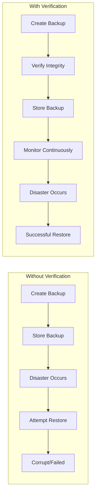
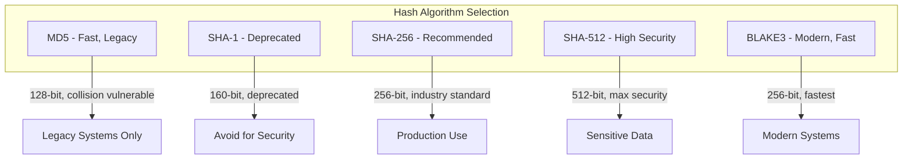
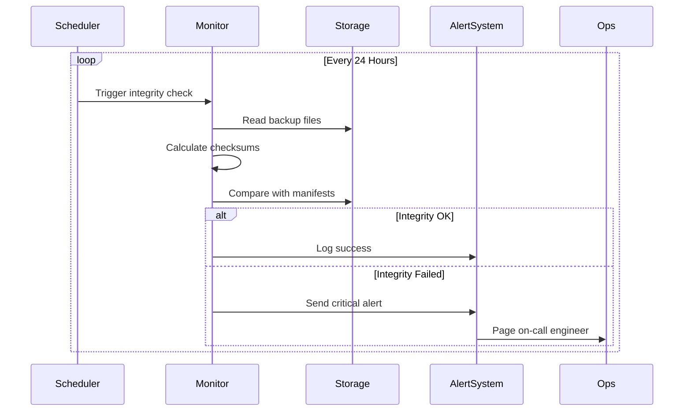
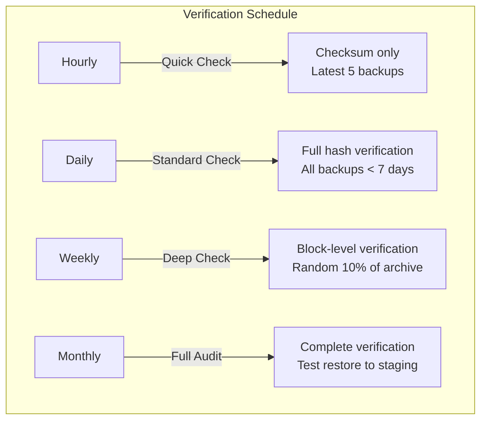
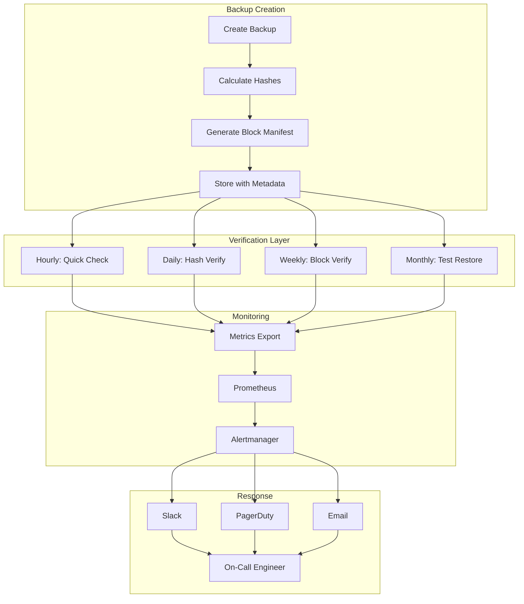

# How to Implement Backup Integrity Checks

Author: [nawazdhandala](https://github.com/nawazdhandala)

Tags: Backup, Integrity, Validation, Data Protection

Description: Learn how to verify backup integrity to ensure reliable data recovery.

---

A backup you cannot restore is not a backup. Organizations lose data not because they lack backups, but because they never verified those backups actually work. This guide covers comprehensive strategies for implementing backup integrity checks that catch corruption before disaster strikes.

## The Backup Integrity Problem



Backups can fail silently. Disk corruption, network issues, incomplete writes, and storage degradation all cause backup failures that go unnoticed until recovery time.

## Checksum Verification

Checksums provide a fingerprint of your data. If the checksum matches, the data is intact.

### Generating Checksums During Backup

```bash
#!/bin/bash
# backup-with-checksum.sh

BACKUP_DIR="/backups"
SOURCE_DIR="/data"
DATE=$(date +%Y%m%d-%H%M%S)
BACKUP_FILE="$BACKUP_DIR/backup-$DATE.tar.gz"
CHECKSUM_FILE="$BACKUP_DIR/backup-$DATE.sha256"

# Create backup
tar -czf "$BACKUP_FILE" "$SOURCE_DIR"

# Generate checksum
sha256sum "$BACKUP_FILE" > "$CHECKSUM_FILE"

echo "Backup created: $BACKUP_FILE"
echo "Checksum: $(cat $CHECKSUM_FILE)"
```

### Verifying Checksums

```bash
#!/bin/bash
# verify-checksum.sh

verify_backup() {
    local backup_file=$1
    local checksum_file=$2

    if [ ! -f "$backup_file" ]; then
        echo "ERROR: Backup file not found: $backup_file"
        return 1
    fi

    if [ ! -f "$checksum_file" ]; then
        echo "ERROR: Checksum file not found: $checksum_file"
        return 1
    fi

    # Verify checksum
    if sha256sum -c "$checksum_file" 2>/dev/null; then
        echo "SUCCESS: Backup integrity verified"
        return 0
    else
        echo "FAILURE: Backup checksum mismatch - data may be corrupted"
        return 1
    fi
}

# Usage
verify_backup "/backups/backup-20260130.tar.gz" "/backups/backup-20260130.sha256"
```

## Hash Comparison Methods

Different hash algorithms offer varying levels of security and performance.



### Multi-Algorithm Verification Script

```python
#!/usr/bin/env python3
"""
backup_integrity.py - Multi-algorithm backup verification
"""

import hashlib
import os
import json
from datetime import datetime
from pathlib import Path
from typing import Dict, Optional

class BackupIntegrityChecker:
    """Verify backup integrity using multiple hash algorithms."""

    ALGORITHMS = ['md5', 'sha256', 'sha512']
    CHUNK_SIZE = 8192  # 8KB chunks for memory efficiency

    def __init__(self, backup_path: str):
        self.backup_path = Path(backup_path)
        self.manifest_path = self.backup_path.with_suffix('.manifest.json')

    def calculate_hashes(self, file_path: Path) -> Dict[str, str]:
        """Calculate multiple hashes for a file."""
        hashers = {alg: hashlib.new(alg) for alg in self.ALGORITHMS}

        with open(file_path, 'rb') as f:
            while chunk := f.read(self.CHUNK_SIZE):
                for hasher in hashers.values():
                    hasher.update(chunk)

        return {alg: hasher.hexdigest() for alg, hasher in hashers.items()}

    def create_manifest(self) -> Dict:
        """Create integrity manifest for backup."""
        if not self.backup_path.exists():
            raise FileNotFoundError(f"Backup not found: {self.backup_path}")

        hashes = self.calculate_hashes(self.backup_path)

        manifest = {
            'backup_file': str(self.backup_path),
            'created_at': datetime.utcnow().isoformat(),
            'file_size': self.backup_path.stat().st_size,
            'hashes': hashes
        }

        with open(self.manifest_path, 'w') as f:
            json.dump(manifest, f, indent=2)

        print(f"Manifest created: {self.manifest_path}")
        return manifest

    def verify_integrity(self) -> bool:
        """Verify backup against stored manifest."""
        if not self.manifest_path.exists():
            raise FileNotFoundError(f"Manifest not found: {self.manifest_path}")

        with open(self.manifest_path, 'r') as f:
            manifest = json.load(f)

        # Check file size first (fast check)
        current_size = self.backup_path.stat().st_size
        if current_size != manifest['file_size']:
            print(f"FAILURE: File size mismatch")
            print(f"  Expected: {manifest['file_size']}")
            print(f"  Actual: {current_size}")
            return False

        # Calculate current hashes
        current_hashes = self.calculate_hashes(self.backup_path)

        # Compare all algorithms
        all_match = True
        for alg in self.ALGORITHMS:
            expected = manifest['hashes'][alg]
            actual = current_hashes[alg]

            if expected == actual:
                print(f"  {alg.upper()}: OK")
            else:
                print(f"  {alg.upper()}: MISMATCH")
                print(f"    Expected: {expected}")
                print(f"    Actual: {actual}")
                all_match = False

        if all_match:
            print("SUCCESS: All integrity checks passed")
        else:
            print("FAILURE: Backup corruption detected")

        return all_match


if __name__ == '__main__':
    import sys

    if len(sys.argv) < 3:
        print("Usage: backup_integrity.py <create|verify> <backup_path>")
        sys.exit(1)

    action = sys.argv[1]
    backup_path = sys.argv[2]

    checker = BackupIntegrityChecker(backup_path)

    if action == 'create':
        checker.create_manifest()
    elif action == 'verify':
        success = checker.verify_integrity()
        sys.exit(0 if success else 1)
```

## Continuous Integrity Monitoring

Backups can degrade over time. Continuous monitoring catches bit rot before it becomes data loss.



### Continuous Monitoring Service

```python
#!/usr/bin/env python3
"""
backup_monitor.py - Continuous backup integrity monitoring
"""

import os
import time
import json
import logging
import hashlib
from pathlib import Path
from datetime import datetime, timedelta
from typing import List, Dict, Optional
import smtplib
from email.mime.text import MIMEText

# Configure logging
logging.basicConfig(
    level=logging.INFO,
    format='%(asctime)s - %(levelname)s - %(message)s'
)
logger = logging.getLogger(__name__)


class BackupMonitor:
    """Monitor backup integrity continuously."""

    def __init__(self, backup_dir: str, config: Dict):
        self.backup_dir = Path(backup_dir)
        self.config = config
        self.results_file = self.backup_dir / '.integrity_results.json'

    def find_backups(self) -> List[Path]:
        """Find all backup files in directory."""
        patterns = self.config.get('backup_patterns', ['*.tar.gz', '*.sql.gz', '*.dump'])
        backups = []

        for pattern in patterns:
            backups.extend(self.backup_dir.glob(pattern))

        return sorted(backups, key=lambda p: p.stat().st_mtime, reverse=True)

    def calculate_hash(self, file_path: Path, algorithm: str = 'sha256') -> str:
        """Calculate file hash."""
        hasher = hashlib.new(algorithm)

        with open(file_path, 'rb') as f:
            while chunk := f.read(8192):
                hasher.update(chunk)

        return hasher.hexdigest()

    def load_previous_results(self) -> Dict:
        """Load previous integrity check results."""
        if self.results_file.exists():
            with open(self.results_file, 'r') as f:
                return json.load(f)
        return {}

    def save_results(self, results: Dict):
        """Save integrity check results."""
        with open(self.results_file, 'w') as f:
            json.dump(results, f, indent=2)

    def check_integrity(self, backup_path: Path) -> Dict:
        """Check integrity of a single backup."""
        manifest_path = backup_path.with_suffix(backup_path.suffix + '.manifest.json')

        result = {
            'file': str(backup_path),
            'checked_at': datetime.utcnow().isoformat(),
            'size': backup_path.stat().st_size,
            'status': 'unknown'
        }

        # If no manifest exists, create one
        if not manifest_path.exists():
            logger.info(f"Creating manifest for: {backup_path.name}")
            current_hash = self.calculate_hash(backup_path)
            manifest = {
                'hash': current_hash,
                'size': result['size'],
                'created_at': datetime.utcnow().isoformat()
            }
            with open(manifest_path, 'w') as f:
                json.dump(manifest, f, indent=2)
            result['status'] = 'manifest_created'
            result['hash'] = current_hash
            return result

        # Load manifest and verify
        with open(manifest_path, 'r') as f:
            manifest = json.load(f)

        # Check size first
        if manifest['size'] != result['size']:
            result['status'] = 'size_mismatch'
            result['expected_size'] = manifest['size']
            return result

        # Verify hash
        current_hash = self.calculate_hash(backup_path)
        result['hash'] = current_hash

        if current_hash == manifest['hash']:
            result['status'] = 'verified'
        else:
            result['status'] = 'hash_mismatch'
            result['expected_hash'] = manifest['hash']

        return result

    def run_checks(self) -> List[Dict]:
        """Run integrity checks on all backups."""
        backups = self.find_backups()
        results = []

        logger.info(f"Found {len(backups)} backup files to verify")

        for backup in backups:
            logger.info(f"Checking: {backup.name}")
            result = self.check_integrity(backup)
            results.append(result)

            if result['status'] == 'verified':
                logger.info(f"  Status: OK")
            elif result['status'] == 'manifest_created':
                logger.info(f"  Status: New manifest created")
            else:
                logger.error(f"  Status: {result['status'].upper()}")

        # Save results
        self.save_results({
            'last_check': datetime.utcnow().isoformat(),
            'results': results
        })

        return results

    def send_alert(self, failures: List[Dict]):
        """Send alert for integrity failures."""
        if not failures:
            return

        smtp_config = self.config.get('smtp', {})
        if not smtp_config.get('enabled'):
            logger.warning("SMTP not configured, skipping alert")
            return

        subject = f"CRITICAL: Backup Integrity Failure - {len(failures)} files"
        body = "The following backups failed integrity verification:\n\n"

        for failure in failures:
            body += f"File: {failure['file']}\n"
            body += f"Status: {failure['status']}\n"
            if 'expected_hash' in failure:
                body += f"Expected: {failure['expected_hash']}\n"
                body += f"Actual: {failure['hash']}\n"
            body += "\n"

        body += "\nImmediate action required to investigate and restore from known good backups."

        msg = MIMEText(body)
        msg['Subject'] = subject
        msg['From'] = smtp_config['from']
        msg['To'] = smtp_config['to']

        try:
            with smtplib.SMTP(smtp_config['host'], smtp_config.get('port', 587)) as server:
                server.starttls()
                server.login(smtp_config['user'], smtp_config['password'])
                server.send_message(msg)
            logger.info("Alert email sent successfully")
        except Exception as e:
            logger.error(f"Failed to send alert email: {e}")


def main():
    """Main monitoring loop."""
    config = {
        'backup_patterns': ['*.tar.gz', '*.sql.gz', '*.dump'],
        'check_interval_hours': 24,
        'smtp': {
            'enabled': os.environ.get('SMTP_ENABLED', 'false').lower() == 'true',
            'host': os.environ.get('SMTP_HOST', 'smtp.example.com'),
            'port': int(os.environ.get('SMTP_PORT', '587')),
            'user': os.environ.get('SMTP_USER', ''),
            'password': os.environ.get('SMTP_PASSWORD', ''),
            'from': os.environ.get('ALERT_FROM', 'backups@example.com'),
            'to': os.environ.get('ALERT_TO', 'ops@example.com')
        }
    }

    backup_dir = os.environ.get('BACKUP_DIR', '/backups')
    monitor = BackupMonitor(backup_dir, config)

    logger.info("Starting backup integrity monitor")

    while True:
        results = monitor.run_checks()

        # Find failures
        failures = [r for r in results if r['status'] not in ['verified', 'manifest_created']]

        if failures:
            logger.critical(f"{len(failures)} backup(s) failed integrity check!")
            monitor.send_alert(failures)
        else:
            logger.info("All backups passed integrity verification")

        # Sleep until next check
        interval = config['check_interval_hours'] * 3600
        logger.info(f"Next check in {config['check_interval_hours']} hours")
        time.sleep(interval)


if __name__ == '__main__':
    main()
```

## Corruption Detection Strategies

### Deep Archive Verification

For long-term storage, implement periodic full verification:

```bash
#!/bin/bash
# deep-verify.sh - Full archive verification

set -e

BACKUP_FILE=$1
TEMP_DIR=$(mktemp -d)
trap "rm -rf $TEMP_DIR" EXIT

echo "=== Deep Archive Verification ==="
echo "File: $BACKUP_FILE"
echo "Temp dir: $TEMP_DIR"

# 1. Verify archive integrity
echo ""
echo "Step 1: Testing archive integrity..."
if tar -tzf "$BACKUP_FILE" > /dev/null 2>&1; then
    echo "  Archive structure: OK"
else
    echo "  Archive structure: CORRUPTED"
    exit 1
fi

# 2. Extract and verify contents
echo ""
echo "Step 2: Extracting archive..."
tar -xzf "$BACKUP_FILE" -C "$TEMP_DIR"

# 3. Count files
FILE_COUNT=$(find "$TEMP_DIR" -type f | wc -l)
echo "  Extracted files: $FILE_COUNT"

# 4. Check for empty files that shouldn't be empty
echo ""
echo "Step 3: Checking for unexpected empty files..."
EMPTY_FILES=$(find "$TEMP_DIR" -type f -empty | wc -l)
if [ "$EMPTY_FILES" -gt 0 ]; then
    echo "  WARNING: Found $EMPTY_FILES empty files"
    find "$TEMP_DIR" -type f -empty
else
    echo "  No unexpected empty files"
fi

# 5. Verify file permissions are preserved
echo ""
echo "Step 4: Checking file permissions..."
ZERO_PERM=$(find "$TEMP_DIR" -type f -perm 000 | wc -l)
if [ "$ZERO_PERM" -gt 0 ]; then
    echo "  WARNING: Found $ZERO_PERM files with no permissions"
else
    echo "  File permissions: OK"
fi

# 6. Database dump validation (if applicable)
echo ""
echo "Step 5: Validating database dumps..."
for dump in $(find "$TEMP_DIR" -name "*.sql" -o -name "*.sql.gz"); do
    if [[ "$dump" == *.gz ]]; then
        if gzip -t "$dump" 2>/dev/null; then
            echo "  $dump: OK (gzip valid)"
        else
            echo "  $dump: CORRUPTED"
            exit 1
        fi
    else
        # Check SQL has proper ending
        if tail -1 "$dump" | grep -q "Dump completed"; then
            echo "  $dump: OK (complete)"
        else
            echo "  $dump: WARNING (may be truncated)"
        fi
    fi
done

echo ""
echo "=== Verification Complete ==="
echo "Result: PASSED"
```

### Block-Level Verification

For large backups, verify in blocks to identify specific corruption locations:

```python
#!/usr/bin/env python3
"""
block_verify.py - Block-level backup verification
"""

import hashlib
import json
from pathlib import Path
from typing import Dict, List, Tuple

class BlockVerifier:
    """Verify backups at block level for precise corruption detection."""

    def __init__(self, block_size: int = 1024 * 1024):  # 1MB blocks
        self.block_size = block_size

    def create_block_manifest(self, file_path: Path) -> Dict:
        """Create block-level integrity manifest."""
        blocks = []
        file_size = file_path.stat().st_size
        total_blocks = (file_size + self.block_size - 1) // self.block_size

        with open(file_path, 'rb') as f:
            block_num = 0
            while True:
                block = f.read(self.block_size)
                if not block:
                    break

                block_hash = hashlib.sha256(block).hexdigest()
                blocks.append({
                    'block': block_num,
                    'offset': block_num * self.block_size,
                    'size': len(block),
                    'hash': block_hash
                })

                block_num += 1
                if block_num % 100 == 0:
                    print(f"  Processed {block_num}/{total_blocks} blocks...")

        manifest = {
            'file': str(file_path),
            'file_size': file_size,
            'block_size': self.block_size,
            'total_blocks': len(blocks),
            'file_hash': self._calculate_file_hash(file_path),
            'blocks': blocks
        }

        return manifest

    def _calculate_file_hash(self, file_path: Path) -> str:
        """Calculate overall file hash."""
        hasher = hashlib.sha256()
        with open(file_path, 'rb') as f:
            while chunk := f.read(8192):
                hasher.update(chunk)
        return hasher.hexdigest()

    def verify_blocks(self, file_path: Path, manifest: Dict) -> Tuple[bool, List[int]]:
        """Verify file against block manifest, return corrupted block numbers."""
        corrupted_blocks = []

        with open(file_path, 'rb') as f:
            for block_info in manifest['blocks']:
                f.seek(block_info['offset'])
                block = f.read(block_info['size'])

                current_hash = hashlib.sha256(block).hexdigest()

                if current_hash != block_info['hash']:
                    corrupted_blocks.append(block_info['block'])
                    print(f"  Block {block_info['block']}: CORRUPTED")
                    print(f"    Offset: {block_info['offset']}")
                    print(f"    Expected: {block_info['hash'][:16]}...")
                    print(f"    Actual: {current_hash[:16]}...")

        return len(corrupted_blocks) == 0, corrupted_blocks

    def report_corruption(self, file_path: Path, corrupted_blocks: List[int], manifest: Dict):
        """Generate detailed corruption report."""
        print("\n=== Corruption Report ===")
        print(f"File: {file_path}")
        print(f"Total blocks: {manifest['total_blocks']}")
        print(f"Corrupted blocks: {len(corrupted_blocks)}")
        print(f"Corruption rate: {100 * len(corrupted_blocks) / manifest['total_blocks']:.2f}%")

        if corrupted_blocks:
            print("\nCorrupted regions:")

            # Group consecutive blocks
            regions = []
            start = corrupted_blocks[0]
            end = start

            for block in corrupted_blocks[1:]:
                if block == end + 1:
                    end = block
                else:
                    regions.append((start, end))
                    start = block
                    end = block
            regions.append((start, end))

            for start, end in regions:
                start_offset = start * manifest['block_size']
                end_offset = (end + 1) * manifest['block_size']
                size = end_offset - start_offset

                if start == end:
                    print(f"  Block {start}: offset {start_offset} ({size} bytes)")
                else:
                    print(f"  Blocks {start}-{end}: offset {start_offset}-{end_offset} ({size} bytes)")


def main():
    import sys

    if len(sys.argv) < 3:
        print("Usage: block_verify.py <create|verify> <backup_file>")
        sys.exit(1)

    action = sys.argv[1]
    backup_path = Path(sys.argv[2])
    manifest_path = backup_path.with_suffix(backup_path.suffix + '.blocks.json')

    verifier = BlockVerifier(block_size=1024*1024)  # 1MB blocks

    if action == 'create':
        print(f"Creating block manifest for: {backup_path}")
        manifest = verifier.create_block_manifest(backup_path)

        with open(manifest_path, 'w') as f:
            json.dump(manifest, f, indent=2)

        print(f"\nManifest created: {manifest_path}")
        print(f"Total blocks: {manifest['total_blocks']}")
        print(f"File hash: {manifest['file_hash']}")

    elif action == 'verify':
        print(f"Verifying: {backup_path}")

        with open(manifest_path, 'r') as f:
            manifest = json.load(f)

        success, corrupted = verifier.verify_blocks(backup_path, manifest)

        if success:
            print("\nSUCCESS: All blocks verified")
        else:
            verifier.report_corruption(backup_path, corrupted, manifest)
            sys.exit(1)


if __name__ == '__main__':
    main()
```

## Automated Verification Schedules

### Kubernetes CronJob for Backup Verification

```yaml
apiVersion: batch/v1
kind: CronJob
metadata:
  name: backup-integrity-check
  namespace: backup-system
spec:
  schedule: "0 3 * * *"  # Daily at 3 AM
  concurrencyPolicy: Forbid
  jobTemplate:
    spec:
      template:
        spec:
          containers:
            - name: verifier
              image: backup-tools:latest
              command:
                - /bin/sh
                - -c
                - |
                  set -e

                  echo "Starting backup integrity verification..."

                  # Verify all backups
                  FAILURES=0
                  for manifest in /backups/*.manifest.json; do
                    backup_file="${manifest%.manifest.json}"

                    if [ -f "$backup_file" ]; then
                      echo "Verifying: $backup_file"
                      if python /scripts/backup_integrity.py verify "$backup_file"; then
                        echo "  Result: OK"
                      else
                        echo "  Result: FAILED"
                        FAILURES=$((FAILURES + 1))
                      fi
                    fi
                  done

                  # Report results
                  if [ $FAILURES -gt 0 ]; then
                    echo "CRITICAL: $FAILURES backup(s) failed verification"

                    # Send alert via webhook
                    curl -X POST "$ALERT_WEBHOOK_URL" \
                      -H "Content-Type: application/json" \
                      -d "{\"text\": \"Backup integrity check failed: $FAILURES failures\"}"

                    exit 1
                  fi

                  echo "All backups verified successfully"
              env:
                - name: ALERT_WEBHOOK_URL
                  valueFrom:
                    secretKeyRef:
                      name: alert-config
                      key: webhook-url
              volumeMounts:
                - name: backups
                  mountPath: /backups
                  readOnly: true
                - name: scripts
                  mountPath: /scripts
          volumes:
            - name: backups
              persistentVolumeClaim:
                claimName: backup-storage
            - name: scripts
              configMap:
                name: backup-scripts
          restartPolicy: OnFailure
```

### Tiered Verification Schedule



### Implementing Tiered Verification

```python
#!/usr/bin/env python3
"""
tiered_verification.py - Multi-tier backup verification
"""

import os
import random
from datetime import datetime, timedelta
from pathlib import Path
from typing import List
import subprocess

class TieredVerifier:
    """Implement tiered backup verification strategy."""

    def __init__(self, backup_dir: str):
        self.backup_dir = Path(backup_dir)

    def get_backups_by_age(self, max_days: int) -> List[Path]:
        """Get backups newer than max_days."""
        cutoff = datetime.now() - timedelta(days=max_days)
        backups = []

        for backup in self.backup_dir.glob('*.tar.gz'):
            if datetime.fromtimestamp(backup.stat().st_mtime) > cutoff:
                backups.append(backup)

        return sorted(backups, key=lambda p: p.stat().st_mtime, reverse=True)

    def hourly_check(self):
        """Quick checksum verification of latest backups."""
        print("=== Hourly Quick Check ===")
        backups = self.get_backups_by_age(1)[:5]  # Latest 5 from past day

        for backup in backups:
            manifest = backup.with_suffix(backup.suffix + '.manifest.json')
            if manifest.exists():
                # Quick size check only
                import json
                with open(manifest) as f:
                    expected_size = json.load(f)['file_size']

                actual_size = backup.stat().st_size
                status = "OK" if actual_size == expected_size else "SIZE MISMATCH"
                print(f"  {backup.name}: {status}")

    def daily_check(self):
        """Full hash verification of recent backups."""
        print("=== Daily Standard Check ===")
        backups = self.get_backups_by_age(7)

        for backup in backups:
            result = subprocess.run(
                ['python', 'backup_integrity.py', 'verify', str(backup)],
                capture_output=True,
                text=True
            )
            status = "OK" if result.returncode == 0 else "FAILED"
            print(f"  {backup.name}: {status}")

    def weekly_check(self):
        """Block-level verification of sample backups."""
        print("=== Weekly Deep Check ===")
        all_backups = list(self.backup_dir.glob('*.tar.gz'))

        # Random 10% sample
        sample_size = max(1, len(all_backups) // 10)
        sample = random.sample(all_backups, sample_size)

        for backup in sample:
            print(f"  Deep verification: {backup.name}")
            result = subprocess.run(
                ['python', 'block_verify.py', 'verify', str(backup)],
                capture_output=True,
                text=True
            )
            status = "OK" if result.returncode == 0 else "FAILED"
            print(f"    Result: {status}")

    def monthly_check(self):
        """Full audit with test restore."""
        print("=== Monthly Full Audit ===")

        # Get oldest and newest backups
        all_backups = sorted(
            self.backup_dir.glob('*.tar.gz'),
            key=lambda p: p.stat().st_mtime
        )

        if not all_backups:
            print("  No backups found")
            return

        test_backups = [all_backups[0], all_backups[-1]]  # Oldest and newest

        for backup in test_backups:
            print(f"\n  Testing restore: {backup.name}")

            # Create temp directory for restore test
            import tempfile
            with tempfile.TemporaryDirectory() as temp_dir:
                result = subprocess.run(
                    ['tar', '-xzf', str(backup), '-C', temp_dir],
                    capture_output=True,
                    text=True
                )

                if result.returncode == 0:
                    # Count extracted files
                    file_count = sum(1 for _ in Path(temp_dir).rglob('*') if _.is_file())
                    print(f"    Restore: OK ({file_count} files)")
                else:
                    print(f"    Restore: FAILED")
                    print(f"    Error: {result.stderr}")


if __name__ == '__main__':
    import sys

    tier = sys.argv[1] if len(sys.argv) > 1 else 'daily'
    backup_dir = os.environ.get('BACKUP_DIR', '/backups')

    verifier = TieredVerifier(backup_dir)

    if tier == 'hourly':
        verifier.hourly_check()
    elif tier == 'daily':
        verifier.daily_check()
    elif tier == 'weekly':
        verifier.weekly_check()
    elif tier == 'monthly':
        verifier.monthly_check()
```

## Alerting on Integrity Failures

### Prometheus Metrics and Alerts

```yaml
# prometheus-rules.yaml
apiVersion: monitoring.coreos.com/v1
kind: PrometheusRule
metadata:
  name: backup-integrity-alerts
  namespace: monitoring
spec:
  groups:
    - name: backup-integrity
      interval: 30s
      rules:
        # Record verification results
        - record: backup_verification_status
          expr: |
            backup_verification_success_total / backup_verification_total

        # Alert on any failure
        - alert: BackupIntegrityFailure
          expr: backup_verification_failed_total > 0
          for: 5m
          labels:
            severity: critical
          annotations:
            summary: "Backup integrity check failed"
            description: "{{ $value }} backup(s) failed integrity verification"
            runbook_url: "https://wiki.example.com/runbooks/backup-integrity-failure"

        # Alert on missing verification
        - alert: BackupVerificationMissing
          expr: |
            time() - backup_last_verification_timestamp > 86400
          for: 1h
          labels:
            severity: warning
          annotations:
            summary: "Backup verification not running"
            description: "No backup verification in over 24 hours"

        # Alert on high corruption rate
        - alert: BackupCorruptionRateHigh
          expr: |
            (backup_verification_failed_total / backup_verification_total) > 0.05
          for: 15m
          labels:
            severity: critical
          annotations:
            summary: "High backup corruption rate detected"
            description: "More than 5% of backups are failing integrity checks"
```

### Webhook Alert Handler

```python
#!/usr/bin/env python3
"""
alert_handler.py - Handle backup integrity alerts
"""

from flask import Flask, request, jsonify
import requests
import os

app = Flask(__name__)

SLACK_WEBHOOK = os.environ.get('SLACK_WEBHOOK_URL')
PAGERDUTY_KEY = os.environ.get('PAGERDUTY_ROUTING_KEY')


def send_slack_alert(alert: dict):
    """Send alert to Slack."""
    severity = alert.get('labels', {}).get('severity', 'unknown')
    color = '#ff0000' if severity == 'critical' else '#ffaa00'

    payload = {
        'attachments': [{
            'color': color,
            'title': alert.get('annotations', {}).get('summary', 'Backup Alert'),
            'text': alert.get('annotations', {}).get('description', ''),
            'fields': [
                {
                    'title': 'Severity',
                    'value': severity,
                    'short': True
                },
                {
                    'title': 'Status',
                    'value': alert.get('status', 'unknown'),
                    'short': True
                }
            ]
        }]
    }

    requests.post(SLACK_WEBHOOK, json=payload)


def send_pagerduty_alert(alert: dict):
    """Send alert to PagerDuty."""
    severity = alert.get('labels', {}).get('severity', 'warning')
    pd_severity = 'critical' if severity == 'critical' else 'warning'

    payload = {
        'routing_key': PAGERDUTY_KEY,
        'event_action': 'trigger',
        'payload': {
            'summary': alert.get('annotations', {}).get('summary', 'Backup Alert'),
            'severity': pd_severity,
            'source': 'backup-monitor',
            'custom_details': {
                'description': alert.get('annotations', {}).get('description', ''),
                'runbook': alert.get('annotations', {}).get('runbook_url', '')
            }
        }
    }

    requests.post(
        'https://events.pagerduty.com/v2/enqueue',
        json=payload
    )


@app.route('/webhook', methods=['POST'])
def handle_alert():
    """Handle incoming alerts from Prometheus Alertmanager."""
    data = request.json

    for alert in data.get('alerts', []):
        alert_name = alert.get('labels', {}).get('alertname', '')

        if 'Backup' in alert_name or 'Integrity' in alert_name:
            print(f"Processing alert: {alert_name}")

            if SLACK_WEBHOOK:
                send_slack_alert(alert)

            if PAGERDUTY_KEY and alert.get('labels', {}).get('severity') == 'critical':
                send_pagerduty_alert(alert)

    return jsonify({'status': 'ok'})


if __name__ == '__main__':
    app.run(host='0.0.0.0', port=5000)
```

## Complete Verification Pipeline



## Best Practices

1. **Multiple algorithms**: Use at least SHA-256 for production; consider SHA-512 for sensitive data

2. **Block-level verification**: Enable precise corruption detection for large backups

3. **Tiered schedules**: Balance thoroughness with resource usage through tiered verification

4. **Test restores**: The ultimate integrity test is a successful restore - do this monthly

5. **Immutable storage**: Store checksums separately from backups, ideally on immutable storage

6. **Alert immediately**: Integrity failures require immediate investigation

7. **Track metrics**: Monitor verification success rates, duration, and coverage

8. **Document procedures**: Clear runbooks for responding to integrity failures

---

Backup integrity verification is not optional - it is the difference between having backups and having recoverable backups. Implement checksums at creation time, verify continuously, and test restores regularly. The time invested in verification pays off when disaster strikes and your backups actually work.
