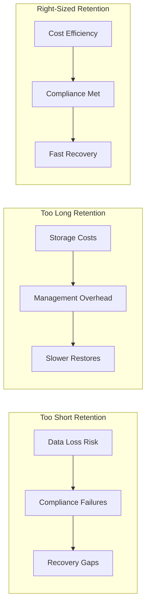
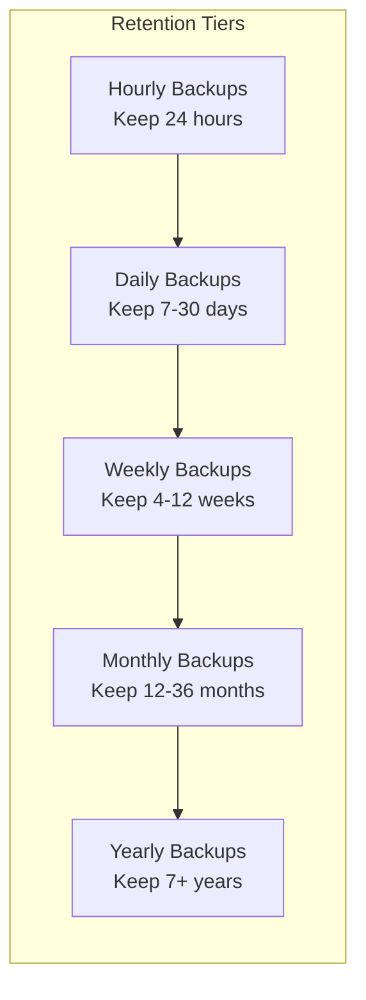
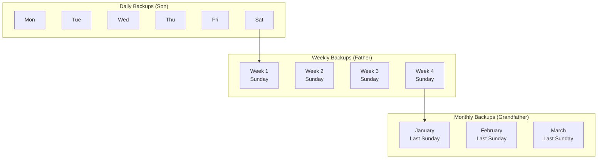
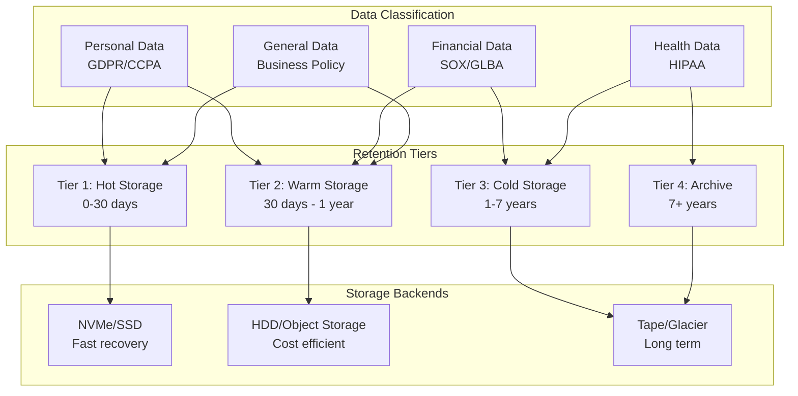
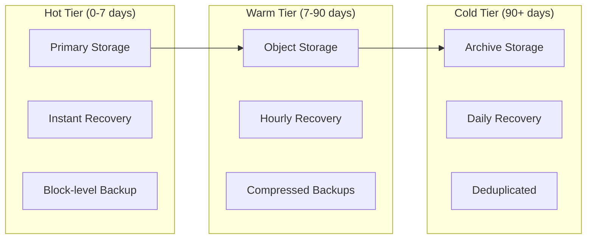
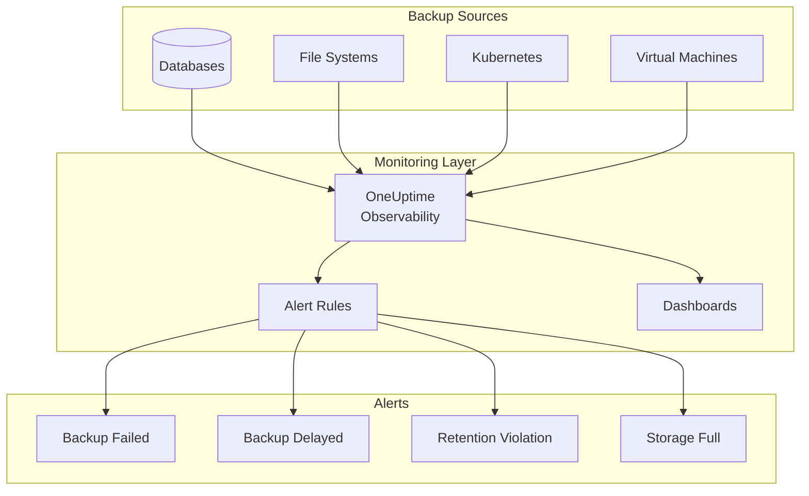

# How to Build Backup Retention Design

Author: [nawazdhandala](https://github.com/nawazdhandala)

Tags: Backup, Data Protection, Compliance, SRE

Description: Learn how to design backup retention policies that balance recovery needs with storage costs.

---

Backup retention design is the art of keeping enough recovery points to protect your data without drowning in storage costs. Get it wrong and you either lose critical data or pay for terabytes of backups you will never use. This guide walks through the principles, patterns, and practical implementations for building retention policies that work.

## Why Retention Design Matters



The goal is to land in that sweet spot where you have enough backups to recover from any realistic scenario while keeping costs under control.

---

## Core Concepts

### Recovery Point Objective (RPO)

RPO defines the maximum acceptable data loss measured in time. If your RPO is 1 hour, you need backups at least every hour.

### Recovery Time Objective (RTO)

RTO defines how quickly you must restore service. This affects backup format and storage location.

### Retention Period

How long you keep each backup before deletion. Different backup types often have different retention periods.



---

## The GFS Rotation Scheme

Grandfather-Father-Son (GFS) is the industry standard for backup rotation. It provides multiple recovery points while minimizing storage.

### How GFS Works



### GFS Retention Example

| Tier | Frequency | Retention | Backups Kept |
|------|-----------|-----------|--------------|
| Son (Daily) | Every day | 6 days | 6 |
| Father (Weekly) | Every Sunday | 4 weeks | 4 |
| Grandfather (Monthly) | Last Sunday of month | 12 months | 12 |
| Yearly | December 31st | 7 years | 7 |

Total backups stored: 29 (instead of 2,555 for daily backups over 7 years)

---

## Implementing GFS in Code

### Python GFS Retention Calculator

```python
#!/usr/bin/env python3
"""
GFS Backup Retention Calculator

This module calculates which backups to keep based on GFS rotation rules.
It helps determine which backup files should be retained and which can
be safely deleted.
"""

from datetime import datetime, timedelta
from typing import List, Dict, Set
from dataclasses import dataclass


@dataclass
class RetentionPolicy:
    """
    Defines the retention periods for each backup tier.

    Attributes:
        daily_retention: Number of daily backups to keep
        weekly_retention: Number of weekly backups to keep
        monthly_retention: Number of monthly backups to keep
        yearly_retention: Number of yearly backups to keep
        weekly_day: Day of week for weekly backups (0=Monday, 6=Sunday)
        monthly_day: Day of month for monthly backups (0=last day)
    """
    daily_retention: int = 7
    weekly_retention: int = 4
    monthly_retention: int = 12
    yearly_retention: int = 7
    weekly_day: int = 6  # Sunday
    monthly_day: int = 0  # Last day of month


def calculate_retention(
    backup_dates: List[datetime],
    policy: RetentionPolicy,
    reference_date: datetime = None
) -> Dict[str, Set[datetime]]:
    """
    Calculate which backups to keep based on GFS policy.

    Args:
        backup_dates: List of backup timestamps
        policy: RetentionPolicy configuration
        reference_date: Date to calculate retention from (defaults to now)

    Returns:
        Dictionary with 'keep' and 'delete' sets of dates
    """
    if reference_date is None:
        reference_date = datetime.now()

    # Sort backups from newest to oldest
    sorted_backups = sorted(backup_dates, reverse=True)

    keep = set()

    # Daily retention: keep the most recent N daily backups
    daily_count = 0
    for backup in sorted_backups:
        if daily_count >= policy.daily_retention:
            break
        # Only count one backup per day
        backup_date = backup.date()
        if not any(k.date() == backup_date for k in keep):
            keep.add(backup)
            daily_count += 1

    # Weekly retention: keep backups from the specified weekday
    weekly_count = 0
    for backup in sorted_backups:
        if weekly_count >= policy.weekly_retention:
            break
        # Check if this backup is on the weekly backup day
        if backup.weekday() == policy.weekly_day:
            # Make sure we do not already have a backup from this week
            week_num = backup.isocalendar()[1]
            year = backup.year
            if not any(
                k.isocalendar()[1] == week_num and k.year == year
                for k in keep if k.weekday() == policy.weekly_day
            ):
                keep.add(backup)
                weekly_count += 1

    # Monthly retention: keep backups from the last day of each month
    monthly_count = 0
    months_seen = set()
    for backup in sorted_backups:
        if monthly_count >= policy.monthly_retention:
            break
        month_key = (backup.year, backup.month)
        if month_key not in months_seen:
            # Find the last backup of this month
            last_of_month = max(
                b for b in sorted_backups
                if b.year == backup.year and b.month == backup.month
            )
            keep.add(last_of_month)
            months_seen.add(month_key)
            monthly_count += 1

    # Yearly retention: keep backups from December (or last backup of year)
    yearly_count = 0
    years_seen = set()
    for backup in sorted_backups:
        if yearly_count >= policy.yearly_retention:
            break
        if backup.year not in years_seen:
            # Find the last backup of this year
            last_of_year = max(
                b for b in sorted_backups if b.year == backup.year
            )
            keep.add(last_of_year)
            years_seen.add(backup.year)
            yearly_count += 1

    # Everything not in keep goes to delete
    delete = set(sorted_backups) - keep

    return {
        'keep': keep,
        'delete': delete
    }


# Example usage
if __name__ == "__main__":
    # Generate sample backup dates (daily backups for 2 years)
    today = datetime.now()
    sample_backups = [
        today - timedelta(days=i)
        for i in range(730)  # 2 years of daily backups
    ]

    # Apply default GFS policy
    policy = RetentionPolicy()
    result = calculate_retention(sample_backups, policy)

    print(f"Total backups: {len(sample_backups)}")
    print(f"Backups to keep: {len(result['keep'])}")
    print(f"Backups to delete: {len(result['delete'])}")
    print(f"Storage reduction: {len(result['delete'])/len(sample_backups)*100:.1f}%")
```

### Bash GFS Cleanup Script

```bash
#!/bin/bash
# gfs-cleanup.sh
# Implements GFS retention policy for file-based backups

set -euo pipefail

# Configuration - customize these values for your environment
BACKUP_DIR="${BACKUP_DIR:-/var/backups}"
DAILY_RETENTION="${DAILY_RETENTION:-7}"      # Keep 7 daily backups
WEEKLY_RETENTION="${WEEKLY_RETENTION:-4}"    # Keep 4 weekly backups
MONTHLY_RETENTION="${MONTHLY_RETENTION:-12}" # Keep 12 monthly backups
YEARLY_RETENTION="${YEARLY_RETENTION:-7}"    # Keep 7 yearly backups
DRY_RUN="${DRY_RUN:-false}"                  # Set to true for testing

# Backup file pattern - adjust to match your naming convention
# Expected format: backup-YYYY-MM-DD-HHMMSS.tar.gz
BACKUP_PATTERN="backup-*.tar.gz"

log() {
    echo "[$(date '+%Y-%m-%d %H:%M:%S')] $1"
}

get_backup_date() {
    # Extract date from filename: backup-2024-01-15-120000.tar.gz
    local filename="$1"
    local date_part=$(echo "$filename" | grep -oE '[0-9]{4}-[0-9]{2}-[0-9]{2}')
    echo "$date_part"
}

get_day_of_week() {
    # Returns 0-6 (Sunday-Saturday)
    date -d "$1" +%w
}

get_day_of_month() {
    date -d "$1" +%d
}

is_last_day_of_month() {
    local check_date="$1"
    local next_day=$(date -d "$check_date + 1 day" +%d)
    # If tomorrow is day 1, today is the last day of month
    [[ "$next_day" == "01" ]]
}

main() {
    log "Starting GFS retention cleanup"
    log "Backup directory: $BACKUP_DIR"
    log "Retention policy: ${DAILY_RETENTION}d/${WEEKLY_RETENTION}w/${MONTHLY_RETENTION}m/${YEARLY_RETENTION}y"

    if [[ ! -d "$BACKUP_DIR" ]]; then
        log "ERROR: Backup directory does not exist"
        exit 1
    fi

    # Arrays to track which backups to keep
    declare -A keep_daily
    declare -A keep_weekly
    declare -A keep_monthly
    declare -A keep_yearly

    # Get all backup files sorted by date (newest first)
    mapfile -t backups < <(
        find "$BACKUP_DIR" -name "$BACKUP_PATTERN" -type f -printf '%T@ %p\n' |
        sort -rn |
        cut -d' ' -f2-
    )

    log "Found ${#backups[@]} backup files"

    daily_count=0
    weekly_count=0
    monthly_count=0
    yearly_count=0

    for backup in "${backups[@]}"; do
        filename=$(basename "$backup")
        backup_date=$(get_backup_date "$filename")

        if [[ -z "$backup_date" ]]; then
            log "WARNING: Cannot parse date from $filename, skipping"
            continue
        fi

        # Check for daily retention
        if [[ $daily_count -lt $DAILY_RETENTION ]]; then
            if [[ -z "${keep_daily[$backup_date]:-}" ]]; then
                keep_daily[$backup_date]="$backup"
                ((daily_count++))
                log "KEEP (daily): $filename"
                continue
            fi
        fi

        # Check for weekly retention (Sundays)
        day_of_week=$(get_day_of_week "$backup_date")
        if [[ "$day_of_week" == "0" && $weekly_count -lt $WEEKLY_RETENTION ]]; then
            week_key=$(date -d "$backup_date" +%Y-W%V)
            if [[ -z "${keep_weekly[$week_key]:-}" ]]; then
                keep_weekly[$week_key]="$backup"
                ((weekly_count++))
                log "KEEP (weekly): $filename"
                continue
            fi
        fi

        # Check for monthly retention (last day of month)
        if is_last_day_of_month "$backup_date" && [[ $monthly_count -lt $MONTHLY_RETENTION ]]; then
            month_key=$(date -d "$backup_date" +%Y-%m)
            if [[ -z "${keep_monthly[$month_key]:-}" ]]; then
                keep_monthly[$month_key]="$backup"
                ((monthly_count++))
                log "KEEP (monthly): $filename"
                continue
            fi
        fi

        # Check for yearly retention (December 31)
        if [[ "$(date -d "$backup_date" +%m-%d)" == "12-31" && $yearly_count -lt $YEARLY_RETENTION ]]; then
            year_key=$(date -d "$backup_date" +%Y)
            if [[ -z "${keep_yearly[$year_key]:-}" ]]; then
                keep_yearly[$year_key]="$backup"
                ((yearly_count++))
                log "KEEP (yearly): $filename"
                continue
            fi
        fi

        # If we get here, this backup should be deleted
        if [[ "$DRY_RUN" == "true" ]]; then
            log "DELETE (dry-run): $filename"
        else
            log "DELETE: $filename"
            rm -f "$backup"
        fi
    done

    log "Cleanup complete"
    log "Kept: ${daily_count} daily, ${weekly_count} weekly, ${monthly_count} monthly, ${yearly_count} yearly"
}

main "$@"
```

---

## Compliance-Driven Retention

Different regulations require different retention periods. Here is a reference table:

| Regulation | Typical Retention | Data Types | Notes |
|------------|-------------------|------------|-------|
| GDPR | Until purpose fulfilled | Personal data | Right to erasure complicates retention |
| HIPAA | 6 years | Health records | From date created or last in effect |
| SOX | 7 years | Financial records | Audit trails and communications |
| PCI-DSS | 1 year | Cardholder data | Audit logs specifically |
| GLBA | 5-7 years | Financial data | Customer records |
| SEC Rule 17a-4 | 6 years | Broker-dealer records | First 2 years immediately accessible |

### Compliance Architecture



---

## Storage Tiering for Cost Optimization

### Tiered Storage Architecture



### Cost Comparison by Tier

| Tier | Storage Cost | Retrieval Cost | Retrieval Time | Use Case |
|------|--------------|----------------|----------------|----------|
| Hot (SSD/NVMe) | $0.10-0.20/GB/mo | None | Instant | Active recovery |
| Warm (S3 Standard) | $0.023/GB/mo | $0.01/1000 requests | Minutes | Recent backups |
| Cold (S3 IA) | $0.0125/GB/mo | $0.01/GB | Hours | Older backups |
| Archive (Glacier) | $0.004/GB/mo | $0.03-0.05/GB | 1-12 hours | Compliance |
| Deep Archive | $0.00099/GB/mo | $0.02/GB | 12-48 hours | Legal hold |

### Automated Tiering with Lifecycle Policies

```yaml
# S3 Lifecycle Policy for Backup Tiering
# Apply this to your backup bucket for automatic cost optimization

apiVersion: v1
kind: ConfigMap
metadata:
  name: backup-lifecycle-policy
data:
  lifecycle.json: |
    {
      "Rules": [
        {
          "ID": "backup-tiering",
          "Status": "Enabled",
          "Filter": {
            "Prefix": "backups/"
          },
          "Transitions": [
            {
              "Days": 30,
              "StorageClass": "STANDARD_IA"
            },
            {
              "Days": 90,
              "StorageClass": "GLACIER"
            },
            {
              "Days": 365,
              "StorageClass": "DEEP_ARCHIVE"
            }
          ],
          "Expiration": {
            "Days": 2555
          },
          "NoncurrentVersionTransitions": [
            {
              "NoncurrentDays": 30,
              "StorageClass": "GLACIER"
            }
          ],
          "NoncurrentVersionExpiration": {
            "NoncurrentDays": 90
          }
        }
      ]
    }
```

---

## Kubernetes Backup Retention with Velero

### Velero Schedule with Retention

```yaml
# Velero backup schedule with GFS-style retention
# This creates daily backups with automatic expiration

apiVersion: velero.io/v1
kind: Schedule
metadata:
  name: daily-cluster-backup
  namespace: velero
spec:
  # Run daily at 2 AM UTC
  schedule: "0 2 * * *"

  # Backup configuration
  template:
    # Keep daily backups for 7 days
    ttl: 168h  # 7 days in hours

    # Include all namespaces except system ones
    includedNamespaces:
      - "*"
    excludedNamespaces:
      - kube-system
      - velero

    # Include persistent volumes
    snapshotVolumes: true

    # Storage location for backups
    storageLocation: default

    # Volume snapshot location
    volumeSnapshotLocations:
      - default

    # Labels for backup identification
    metadata:
      labels:
        backup-type: daily
        retention-tier: hot

---
apiVersion: velero.io/v1
kind: Schedule
metadata:
  name: weekly-cluster-backup
  namespace: velero
spec:
  # Run every Sunday at 3 AM UTC
  schedule: "0 3 * * 0"

  template:
    # Keep weekly backups for 4 weeks
    ttl: 672h  # 28 days in hours

    includedNamespaces:
      - "*"
    excludedNamespaces:
      - kube-system
      - velero

    snapshotVolumes: true
    storageLocation: default
    volumeSnapshotLocations:
      - default

    metadata:
      labels:
        backup-type: weekly
        retention-tier: warm

---
apiVersion: velero.io/v1
kind: Schedule
metadata:
  name: monthly-cluster-backup
  namespace: velero
spec:
  # Run on the 1st of each month at 4 AM UTC
  schedule: "0 4 1 * *"

  template:
    # Keep monthly backups for 12 months
    ttl: 8760h  # 365 days in hours

    includedNamespaces:
      - "*"
    excludedNamespaces:
      - kube-system
      - velero

    snapshotVolumes: true
    storageLocation: default
    volumeSnapshotLocations:
      - default

    metadata:
      labels:
        backup-type: monthly
        retention-tier: cold
```

---

## Database-Specific Retention

### PostgreSQL with pgBackRest

```yaml
# pgBackRest configuration with tiered retention
# Implements GFS rotation for PostgreSQL backups

[global]
# Repository configuration
repo1-path=/var/lib/pgbackrest
repo1-retention-full=4
repo1-retention-diff=7
repo1-retention-archive=14

# S3 repository for long-term storage
repo2-type=s3
repo2-s3-bucket=pg-backups-archive
repo2-s3-region=us-east-1
repo2-path=/pgbackrest
repo2-retention-full=12
repo2-retention-archive-type=full
repo2-retention-archive=12

# Encryption for compliance
repo1-cipher-type=aes-256-cbc
repo2-cipher-type=aes-256-cbc

[main]
pg1-path=/var/lib/postgresql/15/main

# Compression for storage efficiency
compress-type=zst
compress-level=3

# Parallel backup for speed
process-max=4
```

### PostgreSQL Backup Script with Retention

```bash
#!/bin/bash
# pg-backup-gfs.sh
# PostgreSQL backup script implementing GFS retention

set -euo pipefail

# Configuration
PG_HOST="${PG_HOST:-localhost}"
PG_PORT="${PG_PORT:-5432}"
PG_USER="${PG_USER:-postgres}"
PG_DATABASE="${PG_DATABASE:-all}"
BACKUP_DIR="${BACKUP_DIR:-/var/backups/postgresql}"
S3_BUCKET="${S3_BUCKET:-}"

# Retention settings
DAILY_RETENTION=7
WEEKLY_RETENTION=4
MONTHLY_RETENTION=12

# Date variables
TODAY=$(date +%Y-%m-%d)
DAY_OF_WEEK=$(date +%u)  # 1=Monday, 7=Sunday
DAY_OF_MONTH=$(date +%d)
TIMESTAMP=$(date +%Y%m%d-%H%M%S)

log() {
    echo "[$(date '+%Y-%m-%d %H:%M:%S')] $1"
}

create_backup() {
    local backup_type="$1"
    local backup_file="${BACKUP_DIR}/${backup_type}/pg-${PG_DATABASE}-${TIMESTAMP}.sql.gz"

    mkdir -p "$(dirname "$backup_file")"

    log "Creating $backup_type backup: $backup_file"

    if [[ "$PG_DATABASE" == "all" ]]; then
        # Backup all databases
        pg_dumpall -h "$PG_HOST" -p "$PG_PORT" -U "$PG_USER" | gzip > "$backup_file"
    else
        # Backup specific database
        pg_dump -h "$PG_HOST" -p "$PG_PORT" -U "$PG_USER" "$PG_DATABASE" | gzip > "$backup_file"
    fi

    # Upload to S3 if configured
    if [[ -n "$S3_BUCKET" ]]; then
        log "Uploading to S3: s3://${S3_BUCKET}/${backup_type}/"
        aws s3 cp "$backup_file" "s3://${S3_BUCKET}/${backup_type}/"
    fi

    log "Backup complete: $(du -h "$backup_file" | cut -f1)"
}

cleanup_old_backups() {
    local backup_type="$1"
    local retention_days="$2"
    local backup_path="${BACKUP_DIR}/${backup_type}"

    log "Cleaning up $backup_type backups older than $retention_days days"

    find "$backup_path" -name "*.sql.gz" -type f -mtime +"$retention_days" -delete 2>/dev/null || true

    # Cleanup S3 if configured
    if [[ -n "$S3_BUCKET" ]]; then
        local cutoff_date=$(date -d "-${retention_days} days" +%Y-%m-%d)
        aws s3 ls "s3://${S3_BUCKET}/${backup_type}/" | while read -r line; do
            file_date=$(echo "$line" | awk '{print $1}')
            file_name=$(echo "$line" | awk '{print $4}')
            if [[ "$file_date" < "$cutoff_date" ]]; then
                log "Deleting old S3 backup: $file_name"
                aws s3 rm "s3://${S3_BUCKET}/${backup_type}/${file_name}"
            fi
        done
    fi
}

main() {
    log "Starting PostgreSQL GFS backup"

    # Always create a daily backup
    create_backup "daily"
    cleanup_old_backups "daily" "$DAILY_RETENTION"

    # Create weekly backup on Sunday (day 7)
    if [[ "$DAY_OF_WEEK" == "7" ]]; then
        log "Sunday detected - creating weekly backup"
        create_backup "weekly"
        cleanup_old_backups "weekly" "$((WEEKLY_RETENTION * 7))"
    fi

    # Create monthly backup on the 1st of the month
    if [[ "$DAY_OF_MONTH" == "01" ]]; then
        log "First of month detected - creating monthly backup"
        create_backup "monthly"
        cleanup_old_backups "monthly" "$((MONTHLY_RETENTION * 30))"
    fi

    log "GFS backup complete"
}

main "$@"
```

---

## Monitoring Backup Retention

### OneUptime Backup Monitoring Dashboard



### Prometheus Alerting Rules

```yaml
# Prometheus alerts for backup retention monitoring
# Deploy these rules to catch backup issues before they become problems

apiVersion: monitoring.coreos.com/v1
kind: PrometheusRule
metadata:
  name: backup-retention-alerts
  namespace: monitoring
spec:
  groups:
    - name: backup.retention
      rules:
        # Alert if daily backup is missing
        - alert: DailyBackupMissing
          expr: |
            time() - backup_last_success_timestamp{type="daily"} > 86400
          for: 1h
          labels:
            severity: warning
          annotations:
            summary: "Daily backup missing for {{ $labels.database }}"
            description: "No successful daily backup in the last 24 hours"

        # Alert if weekly backup is missing
        - alert: WeeklyBackupMissing
          expr: |
            time() - backup_last_success_timestamp{type="weekly"} > 604800
          for: 1h
          labels:
            severity: warning
          annotations:
            summary: "Weekly backup missing for {{ $labels.database }}"
            description: "No successful weekly backup in the last 7 days"

        # Alert if backup storage is running low
        - alert: BackupStorageNearFull
          expr: |
            (backup_storage_used_bytes / backup_storage_total_bytes) * 100 > 80
          for: 30m
          labels:
            severity: warning
          annotations:
            summary: "Backup storage over 80% full"
            description: "Backup storage is {{ $value }}% full"

        # Alert if retention policy is being violated
        - alert: RetentionPolicyViolation
          expr: |
            backup_retained_count{type="monthly"} < 12
          for: 1h
          labels:
            severity: critical
          annotations:
            summary: "Monthly backup retention below requirement"
            description: "Only {{ $value }} monthly backups retained, policy requires 12"

        # Alert if backup is taking too long
        - alert: BackupDurationExceeded
          expr: |
            backup_duration_seconds > 3600
          for: 10m
          labels:
            severity: warning
          annotations:
            summary: "Backup taking longer than expected"
            description: "Backup for {{ $labels.database }} running for {{ $value }} seconds"
```

---

## Retention Policy Templates

### Template 1: Small Business (Cost-Focused)

```yaml
# Minimal retention for small workloads
# Balances data protection with storage costs

retention_policy:
  name: small-business
  description: Cost-optimized retention for small workloads

  tiers:
    daily:
      retention: 7 days
      storage: local

    weekly:
      retention: 4 weeks
      storage: s3-standard

    monthly:
      retention: 3 months
      storage: s3-infrequent-access

  # No yearly retention - reduces long-term costs
  # Total recovery points: ~15 backups
```

### Template 2: Enterprise (Compliance-Focused)

```yaml
# Enterprise retention meeting SOX and HIPAA requirements
# Prioritizes compliance and audit trails

retention_policy:
  name: enterprise-compliance
  description: Compliance-focused retention for regulated industries

  tiers:
    hourly:
      retention: 24 hours
      storage: local-ssd
      purpose: Fast recovery from recent issues

    daily:
      retention: 30 days
      storage: s3-standard
      purpose: Operational recovery

    weekly:
      retention: 12 weeks
      storage: s3-standard-ia
      purpose: Point-in-time recovery

    monthly:
      retention: 7 years
      storage: glacier
      purpose: Compliance and audit

    yearly:
      retention: 10 years
      storage: glacier-deep-archive
      purpose: Legal hold and archive

  # Encryption required for all tiers
  encryption: aes-256

  # Immutability for compliance
  immutable: true
  immutable_duration: 365 days
```

### Template 3: SaaS Application (Multi-Tenant)

```yaml
# SaaS retention with tenant isolation
# Supports per-tenant customization

retention_policy:
  name: saas-multi-tenant
  description: Multi-tenant SaaS backup retention

  default_tiers:
    continuous:
      retention: 72 hours
      storage: local
      type: wal-archive

    daily:
      retention: 14 days
      storage: s3-standard

    weekly:
      retention: 8 weeks
      storage: s3-standard-ia

    monthly:
      retention: 12 months
      storage: glacier

  # Per-tenant overrides
  tenant_overrides:
    enterprise_tier:
      daily:
        retention: 30 days
      monthly:
        retention: 7 years

    starter_tier:
      daily:
        retention: 7 days
      monthly:
        retention: 3 months
```

---

## Testing Your Retention Design

### Recovery Testing Checklist

1. **Daily Recovery Test** (automated)
   - Restore latest daily backup to test environment
   - Verify data integrity with checksums
   - Run application smoke tests

2. **Weekly Recovery Test** (semi-automated)
   - Full restore from weekly backup
   - Verify all recovery points exist
   - Document restore time

3. **Monthly Disaster Recovery Drill**
   - Complete restore from cold storage
   - Test multi-region recovery
   - Update runbooks based on findings

4. **Annual Compliance Audit**
   - Verify retention periods meet requirements
   - Test oldest backup restoration
   - Document chain of custody

### Recovery Test Script

```python
#!/usr/bin/env python3
"""
Backup Recovery Test Automation

This script automates the testing of backup restores to ensure
backups are valid and can be successfully restored.
"""

import subprocess
import hashlib
import sys
from datetime import datetime
from pathlib import Path
from typing import Optional
import json


class BackupRecoveryTest:
    """
    Automates backup recovery testing with validation.

    This class handles the restore process and validates
    that the restored data matches expected checksums.
    """

    def __init__(self, backup_dir: str, restore_dir: str):
        """
        Initialize the recovery test.

        Args:
            backup_dir: Directory containing backup files
            restore_dir: Directory to restore backups to
        """
        self.backup_dir = Path(backup_dir)
        self.restore_dir = Path(restore_dir)
        self.results = []

    def find_latest_backup(self, backup_type: str) -> Optional[Path]:
        """
        Find the most recent backup of a given type.

        Args:
            backup_type: Type of backup (daily, weekly, monthly)

        Returns:
            Path to the latest backup file or None if not found
        """
        backup_path = self.backup_dir / backup_type
        if not backup_path.exists():
            return None

        backups = sorted(
            backup_path.glob("*.sql.gz"),
            key=lambda p: p.stat().st_mtime,
            reverse=True
        )

        return backups[0] if backups else None

    def restore_backup(self, backup_file: Path) -> bool:
        """
        Restore a backup file to the test database.

        Args:
            backup_file: Path to the backup file

        Returns:
            True if restore succeeded, False otherwise
        """
        try:
            # Decompress and restore
            cmd = f"gunzip -c {backup_file} | psql -h localhost -U postgres -d test_restore"
            result = subprocess.run(
                cmd,
                shell=True,
                capture_output=True,
                timeout=3600  # 1 hour timeout
            )
            return result.returncode == 0
        except subprocess.TimeoutExpired:
            return False

    def validate_restore(self, expected_checksum: str) -> bool:
        """
        Validate restored data against expected checksum.

        Args:
            expected_checksum: MD5 checksum of expected data

        Returns:
            True if validation passed, False otherwise
        """
        # Export restored data and compute checksum
        cmd = "pg_dump -h localhost -U postgres test_restore | md5sum"
        result = subprocess.run(cmd, shell=True, capture_output=True, text=True)

        actual_checksum = result.stdout.split()[0]
        return actual_checksum == expected_checksum

    def run_test(self, backup_type: str) -> dict:
        """
        Run a complete recovery test for a backup type.

        Args:
            backup_type: Type of backup to test

        Returns:
            Dictionary with test results
        """
        start_time = datetime.now()

        result = {
            "backup_type": backup_type,
            "test_time": start_time.isoformat(),
            "success": False,
            "restore_time_seconds": 0,
            "error": None
        }

        # Find latest backup
        backup_file = self.find_latest_backup(backup_type)
        if not backup_file:
            result["error"] = f"No {backup_type} backup found"
            return result

        result["backup_file"] = str(backup_file)
        result["backup_size_mb"] = backup_file.stat().st_size / (1024 * 1024)

        # Perform restore
        if not self.restore_backup(backup_file):
            result["error"] = "Restore failed"
            return result

        end_time = datetime.now()
        result["restore_time_seconds"] = (end_time - start_time).total_seconds()
        result["success"] = True

        self.results.append(result)
        return result

    def generate_report(self) -> str:
        """
        Generate a summary report of all test results.

        Returns:
            JSON formatted report string
        """
        return json.dumps({
            "test_run": datetime.now().isoformat(),
            "results": self.results,
            "summary": {
                "total_tests": len(self.results),
                "passed": sum(1 for r in self.results if r["success"]),
                "failed": sum(1 for r in self.results if not r["success"])
            }
        }, indent=2)


if __name__ == "__main__":
    tester = BackupRecoveryTest(
        backup_dir="/var/backups/postgresql",
        restore_dir="/tmp/restore_test"
    )

    # Test each backup tier
    for backup_type in ["daily", "weekly", "monthly"]:
        print(f"Testing {backup_type} backup...")
        result = tester.run_test(backup_type)
        status = "PASSED" if result["success"] else "FAILED"
        print(f"  {status}: {result.get('error', 'OK')}")

    # Generate report
    print("\n" + tester.generate_report())
```

---

## Key Takeaways

1. **Use GFS rotation** to balance recovery points with storage costs
2. **Match retention to compliance requirements** for your industry
3. **Implement storage tiering** to optimize costs over time
4. **Monitor backup health** with alerts for missed or failed backups
5. **Test restores regularly** to ensure backups actually work
6. **Document your retention policy** and review it annually
7. **Automate everything** to reduce human error and toil

---

## Further Reading

- [NIST SP 800-184 Guide for Cybersecurity Event Recovery](https://csrc.nist.gov/publications/detail/sp/800-184/final)
- [Velero Documentation](https://velero.io/docs/)
- [AWS Backup Best Practices](https://docs.aws.amazon.com/aws-backup/latest/devguide/best-practices.html)
- [PostgreSQL Backup and Recovery](https://www.postgresql.org/docs/current/backup.html)

A well-designed backup retention policy is invisible when everything works and invaluable when disaster strikes. Take the time to design it right, automate the implementation, and test it regularly. Your future self will thank you.
