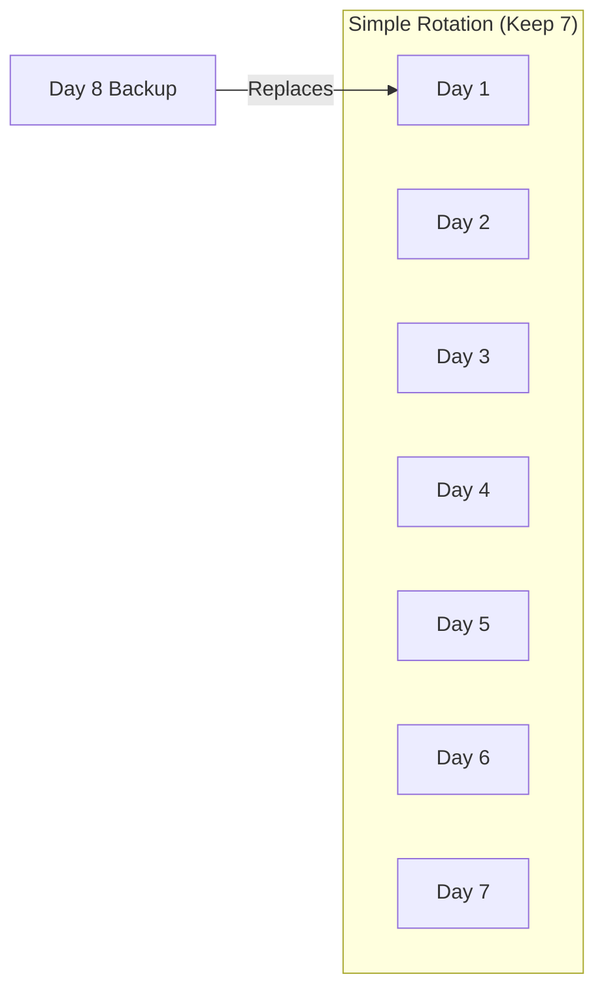
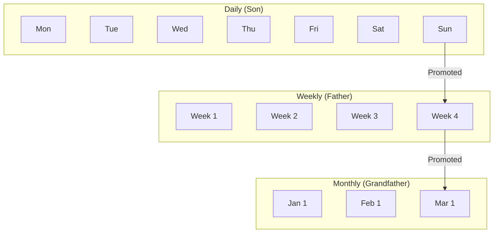
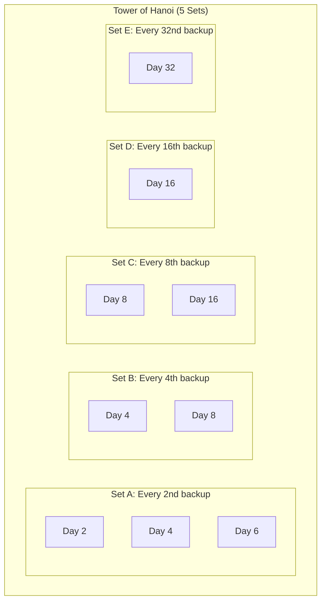
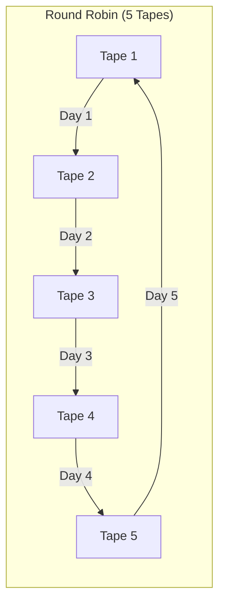
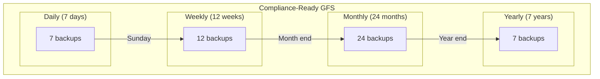
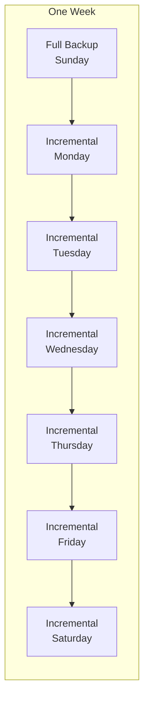

# How to Implement Backup Rotation Schemes

Author: [nawazdhandala](https://github.com/nawazdhandala)

Tags: Backup, Rotation, Data Protection, Storage

Description: Learn how to implement backup rotation schemes like GFS and Tower of Hanoi to balance storage costs, retention requirements, and recovery objectives.

---

Backup rotation schemes determine which backups to keep and which to delete. A good rotation scheme balances storage costs against recovery needs. Too few backups and you risk data loss. Too many and storage costs spiral out of control.

This guide covers the most effective backup rotation strategies, when to use each one, and how to implement them in your infrastructure.

---

## TL;DR

- Backup rotation schemes manage which backups to retain and for how long
- GFS (Grandfather-Father-Son) is the most common scheme, keeping daily, weekly, and monthly backups
- Tower of Hanoi provides efficient storage with logarithmic growth
- Choose your scheme based on RPO/RTO requirements, compliance needs, and storage budget
- Automate rotation with scripts or backup software to avoid human error

---

## Why Backup Rotation Matters

Without a rotation scheme, you face two bad options:

1. **Keep everything**: Storage costs grow unbounded
2. **Delete old backups manually**: Human error leads to gaps in recovery points

A proper rotation scheme provides:

- **Predictable storage costs**: Know exactly how much space backups need
- **Guaranteed recovery points**: Always have backups at required intervals
- **Compliance alignment**: Meet regulatory retention requirements
- **Automated management**: No manual intervention needed

---

## Common Backup Rotation Schemes

### 1. Simple Rotation (FIFO)

The simplest scheme: keep the last N backups, delete everything older.



**Pros:**
- Easy to understand and implement
- Predictable storage usage

**Cons:**
- No long-term recovery points
- Cannot recover data from weeks or months ago

**Best for:**
- Development environments
- Non-critical data
- Systems with low storage budgets

### 2. Grandfather-Father-Son (GFS)

The most widely used rotation scheme. It keeps backups at three tiers: daily (son), weekly (father), and monthly (grandfather).



**Standard GFS Configuration:**
- 7 daily backups (one week)
- 4 weekly backups (one month)
- 12 monthly backups (one year)

**Total backups: 23** (covering an entire year)

**Storage calculation:**
```
Full backup size: 100 GB
Daily incrementals: ~10 GB each

Storage needed:
- 7 daily incrementals: 70 GB
- 4 weekly fulls: 400 GB
- 12 monthly fulls: 1,200 GB
Total: ~1,670 GB for one year of coverage
```

### 3. Tower of Hanoi Rotation

Based on the puzzle of the same name, this scheme provides efficient storage with logarithmic growth. Each backup set has a different retention period based on its position.



**Tower of Hanoi Schedule:**

| Day | Tape Set Used |
|-----|---------------|
| 1   | A |
| 2   | B |
| 3   | A |
| 4   | C |
| 5   | A |
| 6   | B |
| 7   | A |
| 8   | D |
| 9   | A |
| 10  | B |
| ... | ... |

**Pros:**
- Very storage efficient
- Logarithmic growth instead of linear
- Good historical coverage

**Cons:**
- Complex to implement manually
- Recovery points are not evenly distributed
- Harder to understand and audit

### 4. Round Robin Rotation

Uses a fixed number of backup media, cycling through them repeatedly.



**Best for:**
- Small environments with limited media
- Tape-based backup systems
- Situations where simplicity is critical

---

## Implementing GFS Rotation

### Bash Script Implementation

```bash
#!/bin/bash
# gfs-rotation.sh - Grandfather-Father-Son backup rotation

BACKUP_DIR="/backups"
DAILY_KEEP=7
WEEKLY_KEEP=4
MONTHLY_KEEP=12

# Create backup directories
mkdir -p "$BACKUP_DIR"/{daily,weekly,monthly}

# Get current date info
DAY_OF_WEEK=$(date +%u)  # 1=Monday, 7=Sunday
DAY_OF_MONTH=$(date +%d)
TIMESTAMP=$(date +%Y%m%d-%H%M%S)

# Create today's backup
BACKUP_FILE="backup-$TIMESTAMP.tar.gz"
tar -czf "/tmp/$BACKUP_FILE" /data

# Determine backup type and destination
if [ "$DAY_OF_MONTH" = "01" ]; then
    # First of month: monthly backup
    cp "/tmp/$BACKUP_FILE" "$BACKUP_DIR/monthly/"
    echo "Created monthly backup: $BACKUP_FILE"

elif [ "$DAY_OF_WEEK" = "7" ]; then
    # Sunday: weekly backup
    cp "/tmp/$BACKUP_FILE" "$BACKUP_DIR/weekly/"
    echo "Created weekly backup: $BACKUP_FILE"

else
    # Regular day: daily backup
    cp "/tmp/$BACKUP_FILE" "$BACKUP_DIR/daily/"
    echo "Created daily backup: $BACKUP_FILE"
fi

# Cleanup old backups
cleanup_old_backups() {
    local dir=$1
    local keep=$2

    # List files by date, keep newest N, delete rest
    ls -t "$dir"/*.tar.gz 2>/dev/null | tail -n +$((keep + 1)) | xargs -r rm -v
}

cleanup_old_backups "$BACKUP_DIR/daily" $DAILY_KEEP
cleanup_old_backups "$BACKUP_DIR/weekly" $WEEKLY_KEEP
cleanup_old_backups "$BACKUP_DIR/monthly" $MONTHLY_KEEP

# Cleanup temp file
rm "/tmp/$BACKUP_FILE"

echo "Backup rotation complete"
```

### Python Implementation with Logging

```python
import os
import shutil
import logging
from datetime import datetime, timedelta
from pathlib import Path

logging.basicConfig(level=logging.INFO)
logger = logging.getLogger(__name__)

class GFSRotation:
    def __init__(self, backup_dir, daily_keep=7, weekly_keep=4, monthly_keep=12):
        self.backup_dir = Path(backup_dir)
        self.daily_keep = daily_keep
        self.weekly_keep = weekly_keep
        self.monthly_keep = monthly_keep

        # Create directories
        for subdir in ['daily', 'weekly', 'monthly']:
            (self.backup_dir / subdir).mkdir(parents=True, exist_ok=True)

    def get_backup_type(self, date=None):
        """Determine backup type based on date."""
        if date is None:
            date = datetime.now()

        if date.day == 1:
            return 'monthly'
        elif date.weekday() == 6:  # Sunday
            return 'weekly'
        else:
            return 'daily'

    def store_backup(self, backup_file, backup_type=None):
        """Store backup in appropriate directory."""
        if backup_type is None:
            backup_type = self.get_backup_type()

        dest_dir = self.backup_dir / backup_type
        dest_path = dest_dir / os.path.basename(backup_file)

        shutil.copy2(backup_file, dest_path)
        logger.info(f"Stored {backup_type} backup: {dest_path}")

        return dest_path

    def cleanup(self):
        """Remove old backups according to retention policy."""
        retention = {
            'daily': self.daily_keep,
            'weekly': self.weekly_keep,
            'monthly': self.monthly_keep
        }

        for backup_type, keep_count in retention.items():
            dir_path = self.backup_dir / backup_type
            backups = sorted(dir_path.glob('*.tar.gz'),
                           key=lambda p: p.stat().st_mtime,
                           reverse=True)

            for old_backup in backups[keep_count:]:
                old_backup.unlink()
                logger.info(f"Deleted old {backup_type} backup: {old_backup}")

    def list_backups(self):
        """List all current backups."""
        result = {}
        for backup_type in ['daily', 'weekly', 'monthly']:
            dir_path = self.backup_dir / backup_type
            backups = sorted(dir_path.glob('*.tar.gz'),
                           key=lambda p: p.stat().st_mtime,
                           reverse=True)
            result[backup_type] = [str(b) for b in backups]
        return result


# Usage example
if __name__ == '__main__':
    gfs = GFSRotation('/backups')

    # Store a backup
    gfs.store_backup('/tmp/backup-20260130.tar.gz')

    # Cleanup old backups
    gfs.cleanup()

    # List current backups
    for backup_type, files in gfs.list_backups().items():
        print(f"\n{backup_type.upper()} backups:")
        for f in files:
            print(f"  {f}")
```

---

## Implementing Tower of Hanoi Rotation

### Understanding the Pattern

The Tower of Hanoi pattern follows this sequence for determining which set to use:

```
Day 1:  A (binary: 001, trailing zeros: 0)
Day 2:  B (binary: 010, trailing zeros: 1)
Day 3:  A (binary: 011, trailing zeros: 0)
Day 4:  C (binary: 100, trailing zeros: 2)
Day 5:  A (binary: 101, trailing zeros: 0)
Day 6:  B (binary: 110, trailing zeros: 1)
Day 7:  A (binary: 111, trailing zeros: 0)
Day 8:  D (binary: 1000, trailing zeros: 3)
```

The set is determined by the number of trailing zeros in the binary representation of the day number.

### Bash Implementation

```bash
#!/bin/bash
# tower-of-hanoi.sh - Tower of Hanoi backup rotation

BACKUP_DIR="/backups/hanoi"
NUM_SETS=5  # A, B, C, D, E

# Create set directories
for i in $(seq 0 $((NUM_SETS - 1))); do
    mkdir -p "$BACKUP_DIR/set_$i"
done

# Count trailing zeros in binary representation
count_trailing_zeros() {
    local n=$1
    local count=0

    while [ $((n % 2)) -eq 0 ] && [ $n -gt 0 ]; do
        count=$((count + 1))
        n=$((n / 2))
    done

    echo $count
}

# Get day number (days since epoch or backup start)
DAY_NUM=$(( ($(date +%s) / 86400) % (2 ** NUM_SETS) + 1 ))

# Determine which set to use
SET_INDEX=$(count_trailing_zeros $DAY_NUM)
if [ $SET_INDEX -ge $NUM_SETS ]; then
    SET_INDEX=$((NUM_SETS - 1))
fi

SET_DIR="$BACKUP_DIR/set_$SET_INDEX"
TIMESTAMP=$(date +%Y%m%d-%H%M%S)
BACKUP_FILE="backup-$TIMESTAMP.tar.gz"

echo "Day $DAY_NUM: Using set $SET_INDEX"

# Create backup
tar -czf "$SET_DIR/$BACKUP_FILE" /data

# Each set keeps only 1 backup (overwritten each cycle)
# Cleanup older backups in this set
ls -t "$SET_DIR"/*.tar.gz 2>/dev/null | tail -n +2 | xargs -r rm -v

echo "Backup complete: $SET_DIR/$BACKUP_FILE"
```

### Python Implementation

```python
import os
from datetime import datetime, timedelta
from pathlib import Path
import shutil

class TowerOfHanoiRotation:
    def __init__(self, backup_dir, num_sets=5):
        self.backup_dir = Path(backup_dir)
        self.num_sets = num_sets
        self.set_names = [chr(ord('A') + i) for i in range(num_sets)]

        # Create set directories
        for name in self.set_names:
            (self.backup_dir / f"set_{name}").mkdir(parents=True, exist_ok=True)

    def count_trailing_zeros(self, n):
        """Count trailing zeros in binary representation."""
        if n == 0:
            return 0
        count = 0
        while n % 2 == 0:
            count += 1
            n //= 2
        return count

    def get_set_for_day(self, day_number):
        """Determine which set to use for a given day."""
        set_index = self.count_trailing_zeros(day_number)
        # Cap at maximum set index
        set_index = min(set_index, self.num_sets - 1)
        return self.set_names[set_index]

    def store_backup(self, backup_file, day_number=None):
        """Store backup in the appropriate set."""
        if day_number is None:
            # Use days since epoch
            day_number = (datetime.now() - datetime(1970, 1, 1)).days + 1

        set_name = self.get_set_for_day(day_number)
        dest_dir = self.backup_dir / f"set_{set_name}"
        dest_path = dest_dir / os.path.basename(backup_file)

        # Copy backup
        shutil.copy2(backup_file, dest_path)

        # Remove older backups in this set (keep only latest)
        for old_file in dest_dir.glob('*.tar.gz'):
            if old_file != dest_path:
                old_file.unlink()

        return dest_path, set_name

    def print_schedule(self, days=32):
        """Print the backup schedule for N days."""
        print(f"Tower of Hanoi Schedule ({self.num_sets} sets):")
        print("-" * 30)
        for day in range(1, days + 1):
            set_name = self.get_set_for_day(day)
            print(f"Day {day:3d}: Set {set_name}")


# Usage
hanoi = TowerOfHanoiRotation('/backups/hanoi', num_sets=5)
hanoi.print_schedule(16)
```

---

## Retention Periods and Compliance

Different industries have different retention requirements:

### Common Compliance Requirements

| Industry | Regulation | Retention Period |
|----------|------------|------------------|
| Healthcare | HIPAA | 6 years |
| Financial | SOX | 7 years |
| Financial | SEC Rule 17a-4 | 6 years |
| Government | FISMA | 3 years |
| General | GDPR | As needed (minimize) |
| Retail | PCI-DSS | 1 year |

### Designing for Compliance



**Extended GFS for 7-Year Retention:**

```bash
# Extended retention configuration
DAILY_KEEP=7      # One week
WEEKLY_KEEP=12    # Three months
MONTHLY_KEEP=24   # Two years
YEARLY_KEEP=7     # Seven years

# Total backups: 7 + 12 + 24 + 7 = 50 backups for 7 years
```

---

## Storage Optimization Strategies

### Incremental Backups with Rotation

Combine full and incremental backups to reduce storage:



```bash
#!/bin/bash
# incremental-gfs.sh

BACKUP_DIR="/backups"
DATA_DIR="/data"
DAY_OF_WEEK=$(date +%u)

if [ "$DAY_OF_WEEK" = "7" ]; then
    # Sunday: Full backup
    tar -czf "$BACKUP_DIR/full-$(date +%Y%m%d).tar.gz" "$DATA_DIR"

    # Update snapshot file for incrementals
    tar -czf "$BACKUP_DIR/full-$(date +%Y%m%d).tar.gz" \
        --listed-incremental="$BACKUP_DIR/snapshot.snar" \
        "$DATA_DIR"
else
    # Weekday: Incremental backup
    tar -czf "$BACKUP_DIR/incr-$(date +%Y%m%d).tar.gz" \
        --listed-incremental="$BACKUP_DIR/snapshot.snar" \
        "$DATA_DIR"
fi
```

### Deduplication Integration

Modern backup systems use deduplication to reduce storage:

```
Without deduplication:
- 7 daily backups x 100 GB = 700 GB

With deduplication (90% reduction):
- 7 daily backups = ~100 GB (first full) + 6 x 10 GB (changes) = 160 GB
```

### Compression Considerations

| Compression | Speed | Ratio | Best For |
|-------------|-------|-------|----------|
| gzip | Fast | 3:1 | General use |
| bzip2 | Medium | 4:1 | Text-heavy data |
| xz | Slow | 5:1 | Archival storage |
| lz4 | Very fast | 2:1 | Real-time backups |
| zstd | Fast | 4:1 | Best balance |

---

## Monitoring Backup Rotation

### Key Metrics to Track

```python
def check_rotation_health(backup_dir):
    """Check if rotation scheme is working correctly."""
    issues = []

    # Check daily backups
    daily_count = len(list(Path(backup_dir, 'daily').glob('*.tar.gz')))
    if daily_count < 5:
        issues.append(f"Only {daily_count} daily backups (expected >= 5)")

    # Check weekly backups
    weekly_count = len(list(Path(backup_dir, 'weekly').glob('*.tar.gz')))
    if weekly_count < 2:
        issues.append(f"Only {weekly_count} weekly backups (expected >= 2)")

    # Check for gaps
    daily_files = sorted(Path(backup_dir, 'daily').glob('*.tar.gz'),
                        key=lambda p: p.stat().st_mtime)

    for i in range(1, len(daily_files)):
        prev_time = datetime.fromtimestamp(daily_files[i-1].stat().st_mtime)
        curr_time = datetime.fromtimestamp(daily_files[i].stat().st_mtime)
        gap = (curr_time - prev_time).days

        if gap > 1:
            issues.append(f"Gap of {gap} days between backups")

    return issues
```

### Alerting on Rotation Failures

Set up alerts for:

- Missing expected backups
- Backup size anomalies (too small or too large)
- Failed promotions (daily to weekly, weekly to monthly)
- Storage capacity warnings
- Compliance violations (missing required retention)

---

## Choosing the Right Rotation Scheme

### Decision Matrix

| Requirement | Simple | GFS | Tower of Hanoi |
|-------------|--------|-----|----------------|
| Easy to understand | Yes | Yes | No |
| Storage efficient | No | Medium | Yes |
| Compliance friendly | No | Yes | No |
| Long-term recovery | No | Yes | Yes |
| Predictable schedule | Yes | Yes | No |
| Audit friendly | Yes | Yes | No |

### Recommendations by Use Case

**Development/Test Environments:**
- Use simple rotation (keep last 7-14 days)
- Low storage overhead
- Quick recovery for recent changes

**Production Databases:**
- Use GFS with extended retention
- Align with compliance requirements
- Consider hourly granularity for critical data

**Archive/Cold Storage:**
- Use GFS with yearly tier
- Optimize for long-term retention
- Consider write-once storage

**High-Volume Environments:**
- Use Tower of Hanoi for storage efficiency
- Combine with deduplication
- Automate completely

---

## Common Mistakes to Avoid

1. **No verification**: Always verify backups can be restored
2. **Same storage location**: Store backups offsite or in different availability zone
3. **Manual rotation**: Automate to prevent human error
4. **Ignoring compliance**: Know your retention requirements before designing
5. **No monitoring**: Track backup success and storage usage
6. **Skipping documentation**: Document your rotation scheme for DR scenarios

---

## Conclusion

Backup rotation schemes are essential for balancing recovery needs against storage costs. The right scheme depends on your specific requirements:

- **GFS** works for most organizations and maps well to compliance requirements
- **Tower of Hanoi** saves storage but adds complexity
- **Simple rotation** fits development environments and non-critical data

Whatever scheme you choose, automate it completely and monitor for failures. A backup strategy is only as good as its execution.

Start with GFS if you are unsure. It provides a good balance of recovery points, storage efficiency, and simplicity. Adjust retention periods based on your compliance requirements and recovery objectives.

---

*For more on monitoring backup jobs, see our guide on [Monitoring Backup Jobs with OneUptime](https://oneuptime.com/blog/post/monitoring-backup-jobs-with-oneuptime).*
