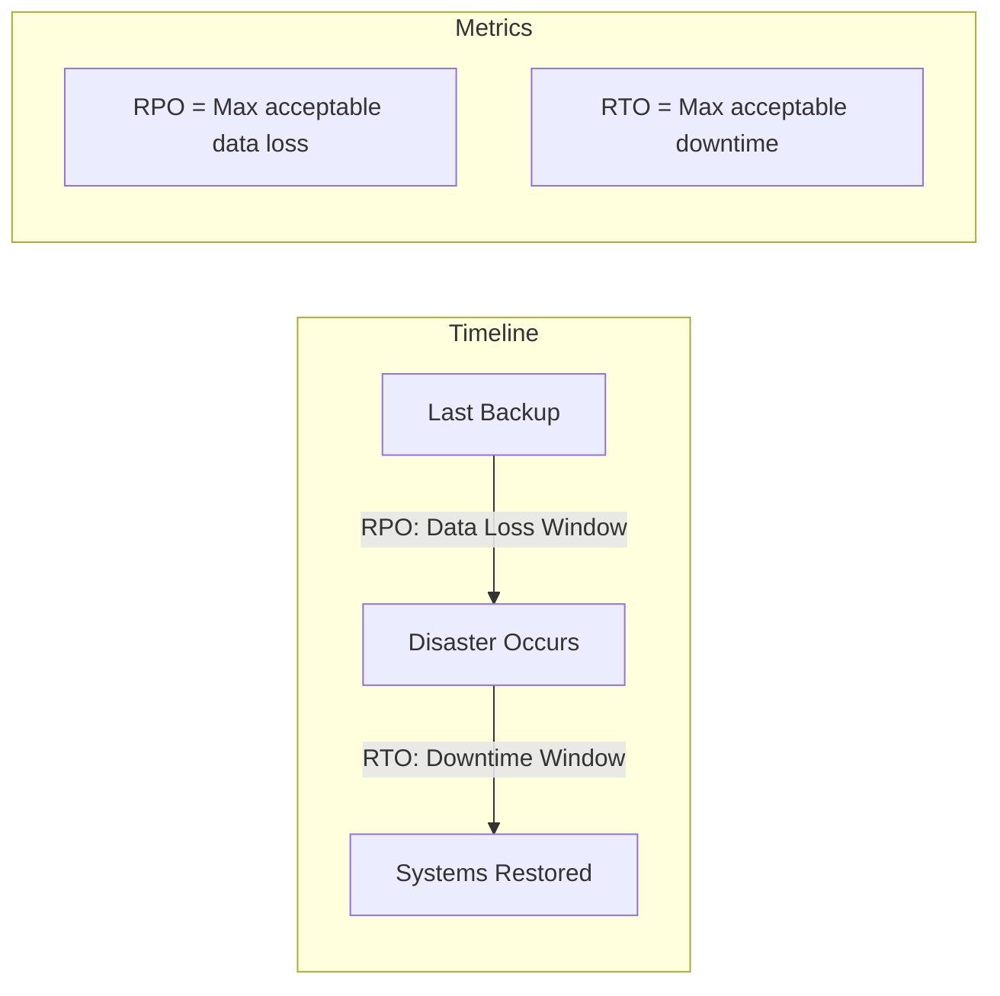
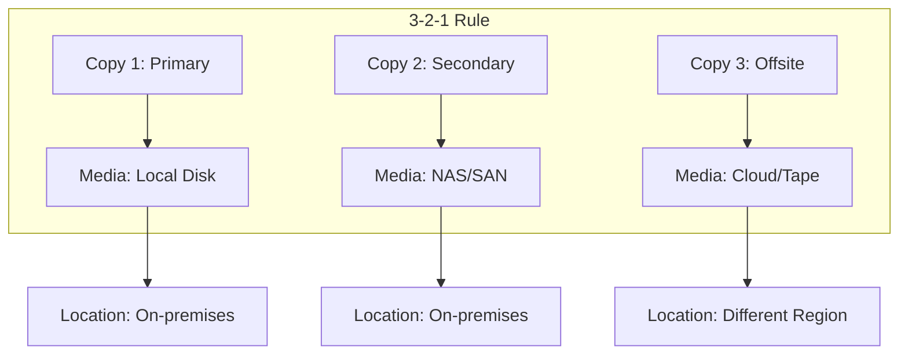
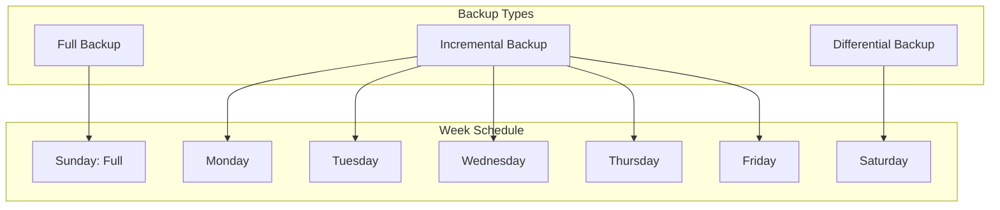
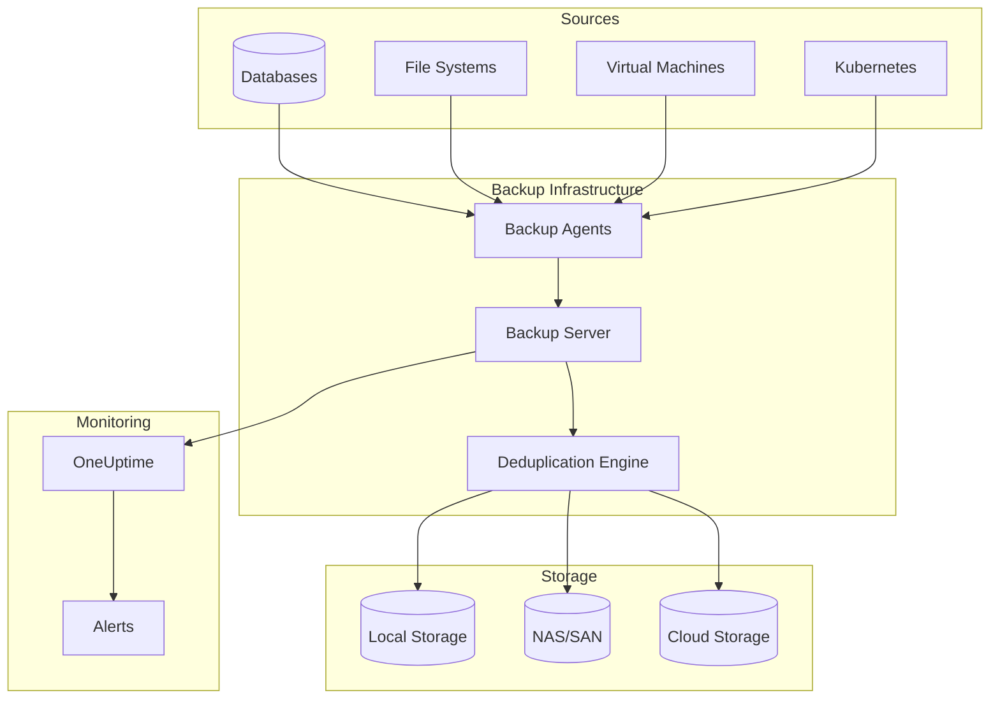
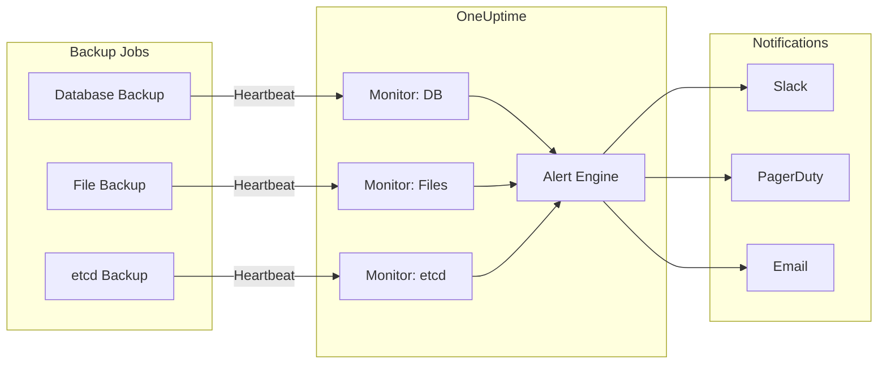

# How to Build Backup Strategy Design

Author: [nawazdhandala](https://github.com/nawazdhandala)

Tags: Backup, Disaster Recovery, Database, DevOps

Description: A practical guide to designing a robust backup strategy that protects your data, meets recovery objectives, and scales with your infrastructure.

---

Data loss can end a business overnight. Whether from hardware failure, human error, ransomware, or natural disaster, the question is not if you will need backups but when. This guide walks you through designing a backup strategy that actually works when disaster strikes.

---

## TL;DR

- Define Recovery Time Objective (RTO) and Recovery Point Objective (RPO) for each system
- Implement the 3-2-1 rule: 3 copies, 2 different media types, 1 offsite
- Automate backup jobs and monitor them with heartbeat checks
- Test restores regularly because untested backups are not backups
- Document everything and keep runbooks up to date

---

## Understanding Backup Fundamentals

Before designing your strategy, understand the core concepts that drive backup decisions.

### RTO and RPO

These two metrics define your backup requirements:



**Recovery Point Objective (RPO)**: How much data can you afford to lose? An RPO of 1 hour means you need backups at least every hour.

**Recovery Time Objective (RTO)**: How long can systems be down? An RTO of 4 hours means you must restore operations within 4 hours.

### The 3-2-1 Backup Rule

The gold standard for backup architecture:



- **3 copies** of your data (1 primary, 2 backups)
- **2 different media types** (local disk and cloud, or disk and tape)
- **1 offsite copy** (geographically separate from primary)

---

## Designing Your Backup Strategy

### Step 1: Classify Your Data

Not all data needs the same protection level. Create a tiered classification:

| Tier | Data Type | RPO | RTO | Backup Frequency | Retention |
|------|-----------|-----|-----|------------------|-----------|
| Tier 1 | Production databases, financial data | 15 min | 1 hour | Continuous/hourly | 90 days |
| Tier 2 | Application data, user files | 1 hour | 4 hours | Hourly | 30 days |
| Tier 3 | Development, logs, caches | 24 hours | 24 hours | Daily | 7 days |
| Tier 4 | Archives, cold storage | 1 week | 1 week | Weekly | 1 year |

### Step 2: Choose Backup Types

Different backup types serve different purposes. Use them together for optimal protection.



**Full Backup**: Complete copy of all data. Slowest but simplest to restore.

**Incremental Backup**: Only data changed since the last backup (any type). Fast backup, slower restore.

**Differential Backup**: Data changed since last full backup. Middle ground for both.

### Step 3: Design the Backup Architecture

A complete backup architecture addresses storage, automation, and monitoring.



---

## Implementing Database Backups

Databases require special attention because they hold your most critical data.

### PostgreSQL Backup Strategy

This script implements a tiered PostgreSQL backup strategy with WAL archiving for point-in-time recovery.

```bash
#!/bin/bash
# postgres-backup.sh - Comprehensive PostgreSQL backup strategy

# Configuration - adjust these for your environment
DB_NAME="production"
BACKUP_DIR="/var/backups/postgres"
S3_BUCKET="s3://company-backups/postgres"
RETENTION_DAYS=30
HEARTBEAT_URL="https://oneuptime.com/heartbeat/pg_backup_xyz"

# Create timestamped backup directory
TIMESTAMP=$(date +%Y%m%d_%H%M%S)
BACKUP_PATH="$BACKUP_DIR/$DB_NAME-$TIMESTAMP"
mkdir -p "$BACKUP_PATH"

# Function to send heartbeat to OneUptime for monitoring
send_heartbeat() {
    local status=$1
    local message=$2
    curl -s -X POST "$HEARTBEAT_URL" \
        -H "Content-Type: application/json" \
        -d "{\"status\":\"$status\",\"message\":\"$message\",\"timestamp\":\"$(date -u +%Y-%m-%dT%H:%M:%SZ)\"}"
}

# Notify backup start
send_heartbeat "started" "Beginning PostgreSQL backup for $DB_NAME"

# Create the backup using pg_dump with custom format for compression
# -Fc enables custom format with compression
# -Z9 sets maximum compression level
if pg_dump -Fc -Z9 -f "$BACKUP_PATH/backup.dump" "$DB_NAME"; then
    # Calculate backup size for monitoring
    BACKUP_SIZE=$(du -sh "$BACKUP_PATH/backup.dump" | cut -f1)

    # Upload to S3 for offsite storage
    if aws s3 cp "$BACKUP_PATH/backup.dump" "$S3_BUCKET/$DB_NAME-$TIMESTAMP.dump"; then
        send_heartbeat "completed" "Backup successful: $BACKUP_SIZE uploaded to S3"
    else
        send_heartbeat "warning" "Backup created but S3 upload failed"
    fi
else
    send_heartbeat "failed" "pg_dump failed for $DB_NAME"
    exit 1
fi

# Cleanup old local backups to manage disk space
find "$BACKUP_DIR" -type f -name "*.dump" -mtime +$RETENTION_DAYS -delete

echo "Backup completed: $BACKUP_PATH/backup.dump ($BACKUP_SIZE)"
```

### Enabling Point-in-Time Recovery

For Tier 1 databases, enable continuous WAL archiving for minimal data loss.

```bash
# postgresql.conf - Enable WAL archiving for point-in-time recovery
# These settings allow recovering to any point in time, not just backup times

archive_mode = on
archive_command = 'aws s3 cp %p s3://company-backups/wal/%f'

# For high-traffic databases, tune these values:
# wal_level must be replica or logical for archiving to work
wal_level = replica

# Checkpoint settings balance performance with recovery speed
checkpoint_timeout = 15min
max_wal_size = 2GB
```

### MySQL Backup Strategy

MySQL backups using a combination of full and incremental backups with binary log archiving.

```bash
#!/bin/bash
# mysql-backup.sh - MySQL backup with binary log archiving

DB_NAME="production"
BACKUP_DIR="/var/backups/mysql"
TIMESTAMP=$(date +%Y%m%d_%H%M%S)
HEARTBEAT_URL="https://oneuptime.com/heartbeat/mysql_backup_xyz"

# Send monitoring heartbeat
send_heartbeat() {
    curl -s -X POST "$HEARTBEAT_URL" \
        -H "Content-Type: application/json" \
        -d "{\"status\":\"$1\",\"database\":\"$DB_NAME\",\"size\":\"$2\"}"
}

send_heartbeat "started" "0"

# Full backup using mysqldump with single-transaction for consistency
# --single-transaction ensures a consistent snapshot without locking tables
# --routines and --triggers include stored procedures and triggers
mysqldump \
    --single-transaction \
    --routines \
    --triggers \
    --flush-logs \
    "$DB_NAME" | gzip > "$BACKUP_DIR/$DB_NAME-$TIMESTAMP.sql.gz"

if [ $? -eq 0 ]; then
    SIZE=$(du -sh "$BACKUP_DIR/$DB_NAME-$TIMESTAMP.sql.gz" | cut -f1)
    send_heartbeat "completed" "$SIZE"
else
    send_heartbeat "failed" "0"
    exit 1
fi
```

---

## File System Backup Strategies

### Incremental Backups with rsync

Use rsync with hard links for efficient incremental backups that look like full backups.

```bash
#!/bin/bash
# rsync-incremental.sh - Efficient incremental backups with hard links

SOURCE="/data"
BACKUP_BASE="/backups"
LATEST_LINK="$BACKUP_BASE/latest"
TIMESTAMP=$(date +%Y%m%d_%H%M%S)
BACKUP_PATH="$BACKUP_BASE/$TIMESTAMP"

# Create incremental backup using hard links to save space
# --link-dest creates hard links to unchanged files from the previous backup
# This means each backup directory appears complete, but only changed files use new space
rsync -avz --delete \
    --link-dest="$LATEST_LINK" \
    "$SOURCE/" \
    "$BACKUP_PATH/"

# Update the 'latest' symlink to point to this backup
# Remove old symlink first to avoid errors
rm -f "$LATEST_LINK"
ln -s "$BACKUP_PATH" "$LATEST_LINK"

# Calculate actual disk usage (accounting for hard links)
DISK_USAGE=$(du -sh "$BACKUP_PATH" | cut -f1)
echo "Backup completed: $BACKUP_PATH (disk usage: $DISK_USAGE)"
```

### Backup Exclusion Patterns

Define what to exclude to keep backups lean and fast.

```bash
# backup-exclude.txt - Common exclusions for system backups
# Exclude these patterns to reduce backup size and time

# Cache directories that can be regenerated
**/node_modules/**
**/.cache/**
**/cache/**
**/__pycache__/**

# Build artifacts and temporary files
**/build/**
**/dist/**
**/*.tmp
**/*.log
**/*.swp

# System and runtime directories
/proc/**
/sys/**
/dev/**
/run/**
/tmp/**
/var/tmp/**

# Container and virtualization data (backup separately)
/var/lib/docker/**
/var/lib/containerd/**

# Large media files (backup to separate tier)
**/*.iso
**/*.mp4
**/*.mov
```

---

## Kubernetes Backup Strategy

Kubernetes clusters need a specialized approach that covers both cluster state and application data.

### Using Velero for Cluster Backups

Velero backs up Kubernetes resources and persistent volumes together.

```yaml
# velero-schedule.yaml - Automated Kubernetes backup schedule
# This creates daily backups of all namespaces with 30-day retention

apiVersion: velero.io/v1
kind: Schedule
metadata:
  name: daily-cluster-backup
  namespace: velero
spec:
  # Run daily at 2 AM UTC
  schedule: "0 2 * * *"
  template:
    # Include all namespaces except system ones
    includedNamespaces:
      - "*"
    excludedNamespaces:
      - kube-system
      - velero
    # Snapshot persistent volumes for stateful applications
    snapshotVolumes: true
    # Keep backups for 30 days
    ttl: 720h
    # Include cluster-scoped resources like ClusterRoles
    includeClusterResources: true
    storageLocation: default
    volumeSnapshotLocations:
      - default
```

### Namespace-Specific Backups

For critical applications, create more frequent targeted backups.

```yaml
# production-backup.yaml - Frequent backup for production namespace
apiVersion: velero.io/v1
kind: Schedule
metadata:
  name: production-hourly-backup
  namespace: velero
spec:
  # Every hour for production workloads
  schedule: "0 * * * *"
  template:
    includedNamespaces:
      - production
    snapshotVolumes: true
    # Shorter retention for frequent backups
    ttl: 168h  # 7 days
    # Label selector to backup only specific applications
    labelSelector:
      matchLabels:
        backup: critical
```

### etcd Backup for Cluster State

For self-managed Kubernetes, backup etcd separately as the source of truth.

```bash
#!/bin/bash
# etcd-backup.sh - Kubernetes etcd backup for disaster recovery

BACKUP_DIR="/var/backups/etcd"
TIMESTAMP=$(date +%Y%m%d_%H%M%S)
SNAPSHOT_FILE="$BACKUP_DIR/etcd-$TIMESTAMP.db"

# Set etcd connection parameters
export ETCDCTL_API=3
export ETCDCTL_ENDPOINTS=https://127.0.0.1:2379
export ETCDCTL_CACERT=/etc/kubernetes/pki/etcd/ca.crt
export ETCDCTL_CERT=/etc/kubernetes/pki/etcd/server.crt
export ETCDCTL_KEY=/etc/kubernetes/pki/etcd/server.key

# Create snapshot - this captures the entire cluster state
etcdctl snapshot save "$SNAPSHOT_FILE"

# Verify the snapshot is valid and complete
etcdctl snapshot status "$SNAPSHOT_FILE" --write-out=table

# Upload to remote storage for disaster recovery
aws s3 cp "$SNAPSHOT_FILE" "s3://company-backups/etcd/"

# Clean up old local snapshots (keep last 7 days)
find "$BACKUP_DIR" -name "etcd-*.db" -mtime +7 -delete

echo "etcd backup completed: $SNAPSHOT_FILE"
```

---

## Backup Automation and Scheduling

### Cron-Based Scheduling

Create a systematic backup schedule using cron.

```bash
# /etc/cron.d/backup-schedule - Comprehensive backup schedule
# Organize backups by type and frequency

# Minute Hour Day Month Weekday Command

# Database backups - stagger to avoid resource contention
0  2  *  *  *  /opt/scripts/postgres-backup.sh full
0  */4 *  *  *  /opt/scripts/postgres-backup.sh incremental
30 2  *  *  *  /opt/scripts/mysql-backup.sh full

# File system backups
0  3  *  *  *  /opt/scripts/rsync-backup.sh /data
0  4  *  *  0  /opt/scripts/rsync-backup.sh /data full  # Weekly full

# Kubernetes backups
0  1  *  *  *  /opt/scripts/etcd-backup.sh
0  */6 *  *  *  /opt/scripts/velero-backup.sh

# Verification jobs
0  6  *  *  0  /opt/scripts/verify-backups.sh
```

### Backup Job Wrapper Script

Wrap backup jobs with consistent logging and monitoring.

```bash
#!/bin/bash
# backup-wrapper.sh - Standardized backup job wrapper with monitoring

JOB_NAME=$1
SCRIPT=$2
HEARTBEAT_URL=$3
LOG_DIR="/var/log/backups"
LOG_FILE="$LOG_DIR/$JOB_NAME-$(date +%Y%m%d).log"

# Ensure log directory exists
mkdir -p "$LOG_DIR"

# Function to log messages with timestamps
log() {
    echo "[$(date '+%Y-%m-%d %H:%M:%S')] $1" | tee -a "$LOG_FILE"
}

# Function to send heartbeat with status
heartbeat() {
    local status=$1
    local duration=$2
    curl -s -X POST "$HEARTBEAT_URL" \
        -H "Content-Type: application/json" \
        -d "{\"status\":\"$status\",\"job\":\"$JOB_NAME\",\"duration\":$duration}"
}

log "Starting backup job: $JOB_NAME"
START_TIME=$(date +%s)

# Send start notification to monitoring
heartbeat "started" 0

# Execute the actual backup script and capture output
if "$SCRIPT" >> "$LOG_FILE" 2>&1; then
    END_TIME=$(date +%s)
    DURATION=$((END_TIME - START_TIME))
    log "Backup completed successfully in ${DURATION}s"
    heartbeat "completed" $DURATION
else
    END_TIME=$(date +%s)
    DURATION=$((END_TIME - START_TIME))
    log "Backup FAILED after ${DURATION}s"
    heartbeat "failed" $DURATION
    exit 1
fi
```

---

## Monitoring and Alerting

Backups that are not monitored might as well not exist.

### OneUptime Backup Monitoring

Set up incoming request monitors to track backup job health.



### Python Monitoring Integration

Add comprehensive monitoring to your backup scripts.

```python
# backup_monitor.py - Backup monitoring integration for OneUptime

import requests
import time
import os
from datetime import datetime
from functools import wraps

class BackupMonitor:
    """
    Monitor backup jobs using OneUptime heartbeat endpoints.
    Tracks start, completion, and failure states with metadata.
    """

    def __init__(self, heartbeat_url, job_name):
        self.heartbeat_url = heartbeat_url
        self.job_name = job_name
        self.start_time = None

    def send_heartbeat(self, status, **kwargs):
        """Send a heartbeat signal with status and optional metadata."""
        payload = {
            "status": status,
            "job_name": self.job_name,
            "hostname": os.uname().nodename,
            "timestamp": datetime.utcnow().isoformat(),
            **kwargs
        }

        try:
            response = requests.post(
                self.heartbeat_url,
                json=payload,
                timeout=10
            )
            return response.status_code == 200
        except requests.RequestException as e:
            # Log but do not fail the backup if monitoring fails
            print(f"Heartbeat failed: {e}")
            return False

    def start(self, **metadata):
        """Mark backup job as started."""
        self.start_time = time.time()
        return self.send_heartbeat("started", **metadata)

    def complete(self, **metadata):
        """Mark backup job as completed with duration."""
        duration = time.time() - self.start_time if self.start_time else 0
        return self.send_heartbeat(
            "completed",
            duration_seconds=round(duration, 2),
            **metadata
        )

    def fail(self, error_message, **metadata):
        """Mark backup job as failed with error details."""
        duration = time.time() - self.start_time if self.start_time else 0
        return self.send_heartbeat(
            "failed",
            duration_seconds=round(duration, 2),
            error=error_message,
            **metadata
        )


def monitored_backup(heartbeat_url, job_name):
    """
    Decorator to automatically monitor backup functions.
    Wraps the function with start/complete/fail heartbeats.
    """
    def decorator(func):
        @wraps(func)
        def wrapper(*args, **kwargs):
            monitor = BackupMonitor(heartbeat_url, job_name)
            monitor.start()

            try:
                result = func(*args, **kwargs)
                monitor.complete(result=str(result))
                return result
            except Exception as e:
                monitor.fail(str(e))
                raise

        return wrapper
    return decorator


# Example usage with the decorator
@monitored_backup(
    heartbeat_url="https://oneuptime.com/heartbeat/db_backup_xyz",
    job_name="production_database"
)
def backup_database():
    """Perform database backup with automatic monitoring."""
    # Your backup logic here
    import subprocess
    result = subprocess.run(
        ["pg_dump", "-Fc", "production"],
        capture_output=True,
        check=True
    )
    return f"Backup size: {len(result.stdout)} bytes"
```

---

## Testing and Verification

### Automated Restore Testing

Schedule regular restore tests to verify backup integrity.

```bash
#!/bin/bash
# test-restore.sh - Automated backup restore verification

BACKUP_FILE=$1
TEST_DB="restore_test_$(date +%Y%m%d)"
HEARTBEAT_URL="https://oneuptime.com/heartbeat/restore_test_xyz"

send_result() {
    curl -s -X POST "$HEARTBEAT_URL" \
        -H "Content-Type: application/json" \
        -d "{\"status\":\"$1\",\"backup\":\"$BACKUP_FILE\",\"message\":\"$2\"}"
}

echo "Starting restore test for: $BACKUP_FILE"
send_result "started" "Beginning restore verification"

# Create isolated test database
createdb "$TEST_DB"

# Restore backup to test database
# pg_restore with -d specifies the target database
if pg_restore -d "$TEST_DB" "$BACKUP_FILE"; then
    # Run verification queries to ensure data integrity
    TABLES=$(psql -d "$TEST_DB" -c "SELECT count(*) FROM information_schema.tables WHERE table_schema='public';" -t)
    ROWS=$(psql -d "$TEST_DB" -c "SELECT sum(n_tup_ins) FROM pg_stat_user_tables;" -t)

    echo "Restore successful: $TABLES tables, approximately $ROWS rows"
    send_result "completed" "Verified: $TABLES tables restored"
else
    echo "Restore FAILED"
    send_result "failed" "pg_restore failed"
fi

# Clean up test database
dropdb "$TEST_DB"
```

### Backup Verification Checklist

Implement these checks in your verification process:

```python
# verify_backup.py - Comprehensive backup verification

import os
import hashlib
import subprocess
from datetime import datetime, timedelta

def verify_backup(backup_path, expected_min_size_mb=100):
    """
    Verify a backup file meets basic integrity requirements.
    Returns a dict with verification results.
    """
    results = {
        "path": backup_path,
        "exists": False,
        "size_ok": False,
        "age_ok": False,
        "checksum": None,
        "errors": []
    }

    # Check file exists
    if not os.path.exists(backup_path):
        results["errors"].append("Backup file not found")
        return results
    results["exists"] = True

    # Check file size (detect truncated or empty backups)
    size_mb = os.path.getsize(backup_path) / (1024 * 1024)
    if size_mb >= expected_min_size_mb:
        results["size_ok"] = True
        results["size_mb"] = round(size_mb, 2)
    else:
        results["errors"].append(f"Backup too small: {size_mb:.2f}MB")

    # Check file age (ensure backup is recent)
    mtime = datetime.fromtimestamp(os.path.getmtime(backup_path))
    age = datetime.now() - mtime
    if age < timedelta(hours=25):  # Allow some buffer for daily backups
        results["age_ok"] = True
        results["age_hours"] = round(age.total_seconds() / 3600, 2)
    else:
        results["errors"].append(f"Backup too old: {age}")

    # Calculate checksum for integrity verification
    sha256 = hashlib.sha256()
    with open(backup_path, "rb") as f:
        for chunk in iter(lambda: f.read(8192), b""):
            sha256.update(chunk)
    results["checksum"] = sha256.hexdigest()

    return results


def verify_database_backup(backup_path):
    """
    Verify a PostgreSQL backup can be read and contains expected structure.
    """
    results = verify_backup(backup_path)

    if not results["exists"]:
        return results

    # Use pg_restore to list contents without actually restoring
    try:
        output = subprocess.run(
            ["pg_restore", "-l", backup_path],
            capture_output=True,
            text=True,
            check=True
        )

        # Count objects in the backup
        lines = output.stdout.strip().split("\n")
        results["object_count"] = len(lines)
        results["structure_valid"] = True

    except subprocess.CalledProcessError as e:
        results["errors"].append(f"pg_restore verification failed: {e}")
        results["structure_valid"] = False

    return results
```

---

## Disaster Recovery Planning

### Recovery Runbook Template

Document your recovery procedures before you need them.

```markdown
# Database Recovery Runbook

## Prerequisites
- Access to backup storage (S3 bucket, NAS)
- Database credentials with restore permissions
- Sufficient disk space for restoration

## Recovery Steps

### 1. Assess the Situation
- Identify the cause of data loss
- Determine the recovery point (which backup to use)
- Estimate recovery time

### 2. Locate the Backup
```bash
# List available backups
aws s3 ls s3://company-backups/postgres/ --recursive | sort -k1,2 | tail -20
```

### 3. Download the Backup
```bash
# Download latest backup
aws s3 cp s3://company-backups/postgres/production-YYYYMMDD.dump /tmp/restore.dump
```

### 4. Verify the Backup
```bash
# Check backup integrity before restoring
pg_restore -l /tmp/restore.dump | head -50
```

### 5. Restore the Database
```bash
# Stop application traffic first
kubectl scale deployment app --replicas=0

# Restore to the database
pg_restore -d production -c /tmp/restore.dump

# Restart application
kubectl scale deployment app --replicas=3
```

### 6. Verify Recovery
- Run data integrity checks
- Verify application functionality
- Check for missing recent data

### 7. Post-Recovery
- Document the incident
- Update backup procedures if needed
- Notify stakeholders
```

### Recovery Time Estimation

Build a reference table for recovery planning:

| Backup Size | Download Time | Restore Time | Total RTO |
|-------------|---------------|--------------|-----------|
| 10 GB | 10 min | 15 min | ~30 min |
| 100 GB | 90 min | 2 hours | ~4 hours |
| 1 TB | 12 hours | 8 hours | ~24 hours |
| 10 TB | 5 days | 3 days | ~1 week |

Adjust based on your network speed and storage performance.

---

## Best Practices Summary

### Do These Things

1. **Automate everything**: Manual backups get forgotten
2. **Monitor backup jobs**: Use heartbeat monitoring to detect failures
3. **Test restores monthly**: Untested backups are not backups
4. **Encrypt sensitive data**: Backups often contain secrets and PII
5. **Document procedures**: Runbooks save time during emergencies
6. **Version your backup scripts**: Track changes in git
7. **Separate backup credentials**: Use dedicated service accounts

### Avoid These Mistakes

1. **Single copy backups**: One backup is zero backups
2. **Same location storage**: Local backups do not survive site disasters
3. **No retention policy**: Uncontrolled growth fills storage
4. **Skipping verification**: Corrupted backups waste storage and trust
5. **Ignoring monitoring alerts**: Alert fatigue leads to missed failures
6. **Incomplete scope**: Forgetting configuration files, secrets, or schemas

---

## Conclusion

A solid backup strategy protects against the inevitable: hardware fails, humans make mistakes, and disasters happen. By designing your strategy around clear RTO and RPO requirements, implementing the 3-2-1 rule, automating and monitoring your backups, and regularly testing restores, you build confidence that your data is protected.

Start with your most critical systems, establish reliable backup patterns, and expand coverage methodically. The time invested in backup strategy design pays dividends when disaster strikes and recovery is measured in hours instead of days.

Your backup strategy should be boring and reliable. If it is exciting, something has gone wrong.

---

Ready to monitor your backup jobs? OneUptime provides heartbeat monitoring to track backup status, alert on failures, and ensure your data protection strategy actually works when you need it most.
