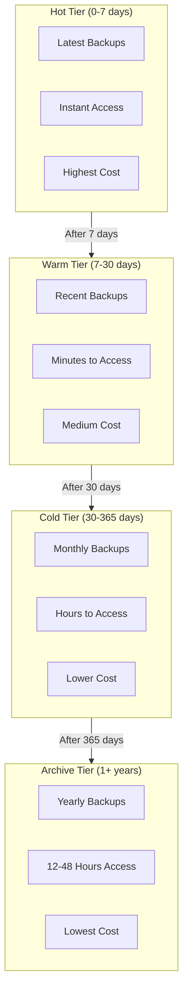
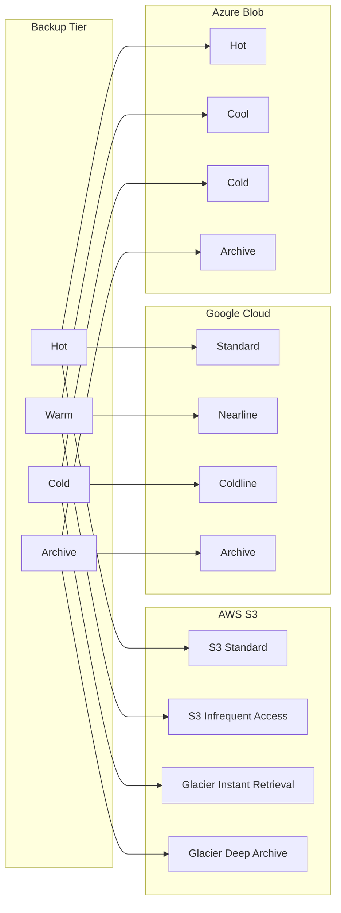
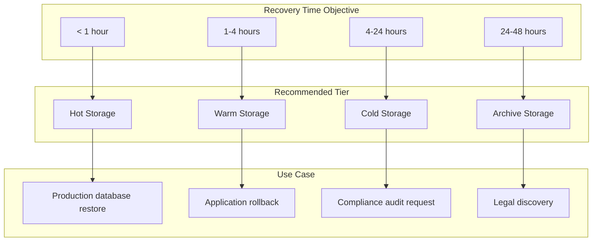
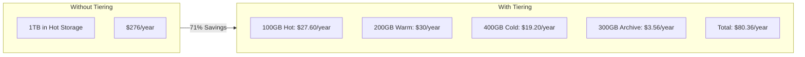
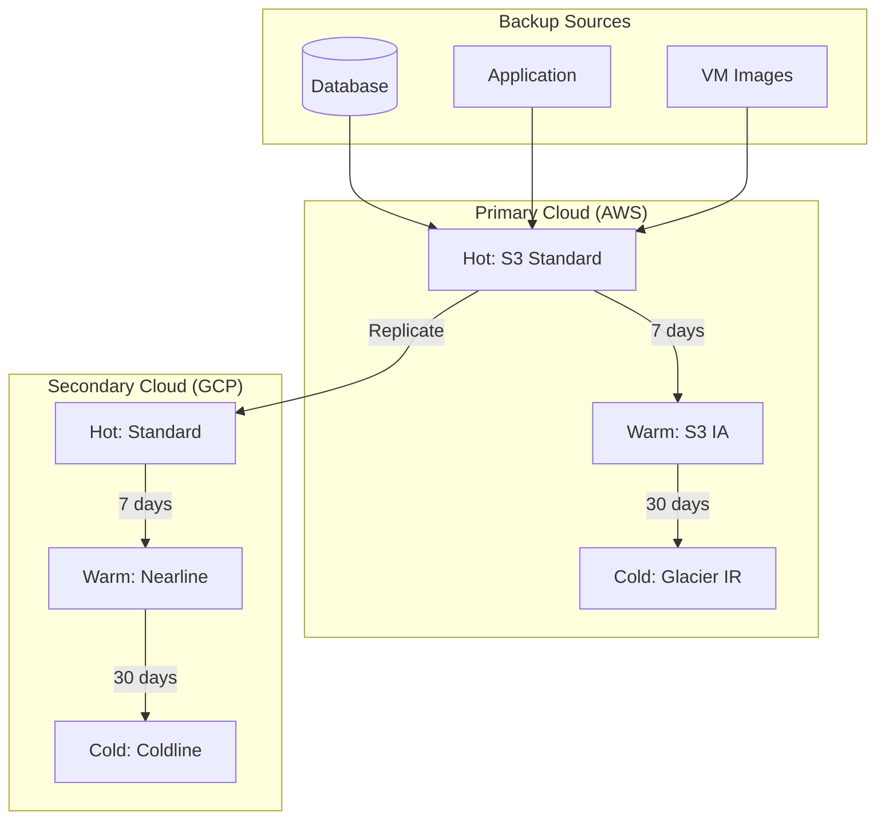

# How to Build Backup Tiering

Author: [nawazdhandala](https://github.com/nawazdhandala)

Tags: Backup, Storage, Cost Optimization, Disaster Recovery

Description: Learn how to implement backup tiering for cost-effective long-term storage.

---

Backup storage costs can spiral out of control. You're paying premium prices to store backups you might never need - or worse, paying slow-access prices for data you need immediately. Backup tiering solves this by placing backups in the right storage class based on access patterns and recovery requirements.

## Understanding Backup Tiers



## Backup Tier Definitions

### Hot Storage

Hot storage is for backups you need immediately. This includes the most recent daily backups and any backup that might be needed for quick recovery.

| Characteristic | Value |
|----------------|-------|
| Access Time | Milliseconds |
| Typical Retention | 1-7 days |
| Use Case | Recent backups, instant recovery |
| Cost | $0.023/GB/month (S3 Standard) |
| Retrieval Cost | None |

### Warm Storage

Warm storage balances cost with reasonable access times. Perfect for backups older than a week but still potentially needed.

| Characteristic | Value |
|----------------|-------|
| Access Time | Milliseconds to minutes |
| Typical Retention | 7-30 days |
| Use Case | Point-in-time recovery, compliance |
| Cost | $0.0125/GB/month (S3 IA) |
| Retrieval Cost | $0.01/GB |

### Cold Storage

Cold storage is for backups you rarely access but must retain. Monthly or quarterly backups often live here.

| Characteristic | Value |
|----------------|-------|
| Access Time | Minutes to hours |
| Typical Retention | 30-365 days |
| Use Case | Regulatory compliance, disaster recovery |
| Cost | $0.004/GB/month (S3 Glacier IR) |
| Retrieval Cost | $0.03/GB |

### Archive Storage

Archive storage is the cheapest tier for data you almost never need but must keep for legal or compliance reasons.

| Characteristic | Value |
|----------------|-------|
| Access Time | 12-48 hours |
| Typical Retention | 1-7+ years |
| Use Case | Legal holds, long-term compliance |
| Cost | $0.00099/GB/month (S3 Glacier Deep Archive) |
| Retrieval Cost | $0.02/GB (48h) - $0.10/GB (12h) |

## Hot/Warm/Cold Storage Mapping

Different cloud providers offer different storage classes. Here's how they map:



### Cloud Provider Comparison

```yaml
# Storage cost comparison (per GB/month)
aws:
  hot: $0.023      # S3 Standard
  warm: $0.0125    # S3 Infrequent Access
  cold: $0.004     # Glacier Instant Retrieval
  archive: $0.00099 # Glacier Deep Archive

gcp:
  hot: $0.020      # Standard
  warm: $0.010     # Nearline
  cold: $0.004     # Coldline
  archive: $0.0012 # Archive

azure:
  hot: $0.0184     # Hot
  warm: $0.01      # Cool
  cold: $0.0036    # Cold
  archive: $0.00099 # Archive
```

## Lifecycle Policies

Lifecycle policies automate the movement of backups between tiers. Set them once and let the cloud handle transitions.

### AWS S3 Lifecycle Policy

```json
{
  "Rules": [
    {
      "ID": "BackupTieringPolicy",
      "Status": "Enabled",
      "Filter": {
        "Prefix": "backups/"
      },
      "Transitions": [
        {
          "Days": 7,
          "StorageClass": "STANDARD_IA"
        },
        {
          "Days": 30,
          "StorageClass": "GLACIER_IR"
        },
        {
          "Days": 365,
          "StorageClass": "DEEP_ARCHIVE"
        }
      ],
      "Expiration": {
        "Days": 2555
      }
    }
  ]
}
```

Apply with AWS CLI:

```bash
aws s3api put-bucket-lifecycle-configuration \
  --bucket my-backup-bucket \
  --lifecycle-configuration file://lifecycle-policy.json
```

### Terraform Lifecycle Configuration

```hcl
resource "aws_s3_bucket" "backups" {
  bucket = "company-backups"
}

resource "aws_s3_bucket_lifecycle_configuration" "backup_tiering" {
  bucket = aws_s3_bucket.backups.id

  rule {
    id     = "database-backups"
    status = "Enabled"

    filter {
      prefix = "database/"
    }

    transition {
      days          = 7
      storage_class = "STANDARD_IA"
    }

    transition {
      days          = 30
      storage_class = "GLACIER_IR"
    }

    transition {
      days          = 365
      storage_class = "DEEP_ARCHIVE"
    }

    expiration {
      days = 2555  # 7 years
    }
  }

  rule {
    id     = "application-backups"
    status = "Enabled"

    filter {
      prefix = "application/"
    }

    transition {
      days          = 3
      storage_class = "STANDARD_IA"
    }

    transition {
      days          = 14
      storage_class = "GLACIER_IR"
    }

    expiration {
      days = 90  # 3 months
    }
  }

  rule {
    id     = "compliance-backups"
    status = "Enabled"

    filter {
      prefix = "compliance/"
    }

    # Keep in hot storage for 30 days
    transition {
      days          = 30
      storage_class = "GLACIER_IR"
    }

    transition {
      days          = 365
      storage_class = "DEEP_ARCHIVE"
    }

    # 7-year retention for compliance
    expiration {
      days = 2555
    }
  }
}
```

### Google Cloud Storage Lifecycle

```yaml
# gcs-lifecycle.yaml
lifecycle:
  rule:
    - action:
        type: SetStorageClass
        storageClass: NEARLINE
      condition:
        age: 7
        matchesPrefix:
          - "backups/"
    - action:
        type: SetStorageClass
        storageClass: COLDLINE
      condition:
        age: 30
        matchesPrefix:
          - "backups/"
    - action:
        type: SetStorageClass
        storageClass: ARCHIVE
      condition:
        age: 365
        matchesPrefix:
          - "backups/"
    - action:
        type: Delete
      condition:
        age: 2555
        matchesPrefix:
          - "backups/"
```

Apply with gsutil:

```bash
gsutil lifecycle set gcs-lifecycle.yaml gs://my-backup-bucket
```

### Azure Blob Lifecycle Policy

```json
{
  "rules": [
    {
      "enabled": true,
      "name": "BackupTiering",
      "type": "Lifecycle",
      "definition": {
        "actions": {
          "baseBlob": {
            "tierToCool": {
              "daysAfterModificationGreaterThan": 7
            },
            "tierToCold": {
              "daysAfterModificationGreaterThan": 30
            },
            "tierToArchive": {
              "daysAfterModificationGreaterThan": 365
            },
            "delete": {
              "daysAfterModificationGreaterThan": 2555
            }
          }
        },
        "filters": {
          "prefixMatch": ["backups/"],
          "blobTypes": ["blockBlob"]
        }
      }
    }
  ]
}
```

## Access Time Requirements

Different backup types have different recovery time objectives (RTOs). Match your tier to your RTO:



### Calculating Required Access Time

```python
#!/usr/bin/env python3
"""
Calculate backup tier based on RTO requirements
"""

def calculate_tier(rto_hours: float, data_size_gb: float) -> dict:
    """
    Determine optimal backup tier based on RTO and data size

    Args:
        rto_hours: Recovery Time Objective in hours
        data_size_gb: Size of backup in GB

    Returns:
        Dictionary with recommended tier and cost estimate
    """

    tiers = {
        'hot': {
            'access_time_hours': 0,
            'retrieval_gbps': 10,  # Fast retrieval
            'storage_cost_gb_month': 0.023,
            'retrieval_cost_gb': 0
        },
        'warm': {
            'access_time_hours': 0,
            'retrieval_gbps': 1,  # Moderate retrieval
            'storage_cost_gb_month': 0.0125,
            'retrieval_cost_gb': 0.01
        },
        'cold': {
            'access_time_hours': 0.5,  # 30 min to initiate
            'retrieval_gbps': 0.5,
            'storage_cost_gb_month': 0.004,
            'retrieval_cost_gb': 0.03
        },
        'archive': {
            'access_time_hours': 12,  # 12 hour minimum
            'retrieval_gbps': 0.1,
            'storage_cost_gb_month': 0.00099,
            'retrieval_cost_gb': 0.02
        }
    }

    for tier_name, tier_config in tiers.items():
        # Calculate total recovery time
        access_time = tier_config['access_time_hours']
        transfer_time = (data_size_gb / tier_config['retrieval_gbps'] / 3600)
        total_time = access_time + transfer_time

        if total_time <= rto_hours:
            monthly_cost = data_size_gb * tier_config['storage_cost_gb_month']
            retrieval_cost = data_size_gb * tier_config['retrieval_cost_gb']

            return {
                'recommended_tier': tier_name,
                'estimated_recovery_time_hours': round(total_time, 2),
                'monthly_storage_cost': round(monthly_cost, 2),
                'retrieval_cost': round(retrieval_cost, 2),
                'meets_rto': True
            }

    return {
        'recommended_tier': 'hot',
        'error': 'No tier meets RTO - consider hot storage or smaller backup chunks',
        'meets_rto': False
    }


# Example usage
if __name__ == '__main__':
    # Database backup: 500GB, need within 1 hour
    result = calculate_tier(rto_hours=1, data_size_gb=500)
    print(f"Database backup (500GB, 1hr RTO): {result}")

    # Application backup: 100GB, need within 4 hours
    result = calculate_tier(rto_hours=4, data_size_gb=100)
    print(f"Application backup (100GB, 4hr RTO): {result}")

    # Compliance archive: 1TB, need within 24 hours
    result = calculate_tier(rto_hours=24, data_size_gb=1000)
    print(f"Compliance archive (1TB, 24hr RTO): {result}")
```

Output:

```
Database backup (500GB, 1hr RTO): {'recommended_tier': 'hot', 'estimated_recovery_time_hours': 0.01, 'monthly_storage_cost': 11.5, 'retrieval_cost': 0, 'meets_rto': True}
Application backup (100GB, 4hr RTO): {'recommended_tier': 'warm', 'estimated_recovery_time_hours': 0.03, 'monthly_storage_cost': 1.25, 'retrieval_cost': 1.0, 'meets_rto': True}
Compliance archive (1TB, 24hr RTO): {'recommended_tier': 'archive', 'estimated_recovery_time_hours': 14.78, 'monthly_storage_cost': 0.99, 'retrieval_cost': 20.0, 'meets_rto': True}
```

## Cost Optimization Through Tiering

The power of tiering becomes clear when you calculate long-term costs:



### Cost Calculator

```python
#!/usr/bin/env python3
"""
Calculate cost savings from backup tiering
"""

def calculate_tiering_savings(
    total_backups_gb: float,
    retention_days: int,
    daily_backup_gb: float
) -> dict:
    """
    Calculate cost savings from implementing backup tiering

    Args:
        total_backups_gb: Total backup storage in GB
        retention_days: Number of days to retain backups
        daily_backup_gb: Daily backup size in GB
    """

    # Storage costs per GB per month
    costs = {
        'hot': 0.023,
        'warm': 0.0125,
        'cold': 0.004,
        'archive': 0.00099
    }

    # Without tiering - everything in hot storage
    no_tiering_monthly = total_backups_gb * costs['hot']
    no_tiering_yearly = no_tiering_monthly * 12

    # With tiering - distribute based on age
    # Hot: Days 1-7 (7 days of backups)
    hot_gb = min(daily_backup_gb * 7, total_backups_gb)

    # Warm: Days 8-30 (23 days of backups)
    warm_gb = min(daily_backup_gb * 23, max(0, total_backups_gb - hot_gb))

    # Cold: Days 31-365 (335 days of backups)
    cold_gb = min(daily_backup_gb * 335, max(0, total_backups_gb - hot_gb - warm_gb))

    # Archive: Days 366+ (remaining backups)
    archive_gb = max(0, total_backups_gb - hot_gb - warm_gb - cold_gb)

    tiered_monthly = (
        hot_gb * costs['hot'] +
        warm_gb * costs['warm'] +
        cold_gb * costs['cold'] +
        archive_gb * costs['archive']
    )
    tiered_yearly = tiered_monthly * 12

    savings_yearly = no_tiering_yearly - tiered_yearly
    savings_percent = (savings_yearly / no_tiering_yearly) * 100

    return {
        'without_tiering': {
            'monthly': round(no_tiering_monthly, 2),
            'yearly': round(no_tiering_yearly, 2)
        },
        'with_tiering': {
            'monthly': round(tiered_monthly, 2),
            'yearly': round(tiered_yearly, 2),
            'distribution': {
                'hot_gb': round(hot_gb, 2),
                'warm_gb': round(warm_gb, 2),
                'cold_gb': round(cold_gb, 2),
                'archive_gb': round(archive_gb, 2)
            }
        },
        'savings': {
            'yearly': round(savings_yearly, 2),
            'percent': round(savings_percent, 1)
        }
    }


# Example: Company with 10TB of backups, 2-year retention, 50GB daily
if __name__ == '__main__':
    result = calculate_tiering_savings(
        total_backups_gb=10000,  # 10TB
        retention_days=730,      # 2 years
        daily_backup_gb=50       # 50GB/day
    )

    print("Backup Tiering Cost Analysis")
    print("=" * 40)
    print(f"\nWithout Tiering:")
    print(f"  Monthly: ${result['without_tiering']['monthly']}")
    print(f"  Yearly:  ${result['without_tiering']['yearly']}")

    print(f"\nWith Tiering:")
    print(f"  Monthly: ${result['with_tiering']['monthly']}")
    print(f"  Yearly:  ${result['with_tiering']['yearly']}")

    dist = result['with_tiering']['distribution']
    print(f"\n  Distribution:")
    print(f"    Hot:     {dist['hot_gb']} GB")
    print(f"    Warm:    {dist['warm_gb']} GB")
    print(f"    Cold:    {dist['cold_gb']} GB")
    print(f"    Archive: {dist['archive_gb']} GB")

    print(f"\nSavings:")
    print(f"  Yearly:  ${result['savings']['yearly']}")
    print(f"  Percent: {result['savings']['percent']}%")
```

Output:

```
Backup Tiering Cost Analysis
========================================

Without Tiering:
  Monthly: $230.0
  Yearly:  $2760.0

With Tiering:
  Monthly: $55.26
  Yearly:  $663.12

  Distribution:
    Hot:     350.0 GB
    Warm:    1150.0 GB
    Cold:    8500.0 GB
    Archive: 0 GB

Savings:
  Yearly:  $2096.88
  Percent: 76.0%
```

## Tier Transition Automation

### Kubernetes CronJob for Backup Tiering

```yaml
apiVersion: batch/v1
kind: CronJob
metadata:
  name: backup-tier-manager
  namespace: backup-system
spec:
  schedule: "0 2 * * *"  # Daily at 2 AM
  jobTemplate:
    spec:
      template:
        spec:
          serviceAccountName: backup-manager
          containers:
            - name: tier-manager
              image: amazon/aws-cli:latest
              env:
                - name: AWS_ACCESS_KEY_ID
                  valueFrom:
                    secretKeyRef:
                      name: aws-credentials
                      key: access-key
                - name: AWS_SECRET_ACCESS_KEY
                  valueFrom:
                    secretKeyRef:
                      name: aws-credentials
                      key: secret-key
                - name: BACKUP_BUCKET
                  value: "company-backups"
              command:
                - /bin/sh
                - -c
                - |
                  #!/bin/bash
                  set -e

                  echo "Starting backup tier management..."

                  # Get current date for age calculations
                  NOW=$(date +%s)

                  # List all objects and their storage classes
                  aws s3api list-objects-v2 \
                    --bucket $BACKUP_BUCKET \
                    --query 'Contents[].{Key: Key, LastModified: LastModified, StorageClass: StorageClass}' \
                    --output json > /tmp/objects.json

                  # Process objects that need tier changes
                  # (This supplements lifecycle policies for edge cases)

                  # Find objects older than 7 days still in STANDARD
                  jq -r '.[] | select(.StorageClass == "STANDARD" or .StorageClass == null) | .Key' /tmp/objects.json | while read key; do
                    # Get object age
                    MODIFIED=$(aws s3api head-object --bucket $BACKUP_BUCKET --key "$key" --query 'LastModified' --output text)
                    MOD_EPOCH=$(date -d "$MODIFIED" +%s)
                    AGE_DAYS=$(( (NOW - MOD_EPOCH) / 86400 ))

                    if [ $AGE_DAYS -ge 7 ] && [ $AGE_DAYS -lt 30 ]; then
                      echo "Moving $key to STANDARD_IA (age: $AGE_DAYS days)"
                      aws s3 cp "s3://$BACKUP_BUCKET/$key" "s3://$BACKUP_BUCKET/$key" \
                        --storage-class STANDARD_IA
                    fi
                  done

                  echo "Tier management complete"
          restartPolicy: OnFailure
```

### Python Backup Tiering Script

```python
#!/usr/bin/env python3
"""
Automated backup tiering manager
Manages backup lifecycle across storage tiers
"""

import boto3
from datetime import datetime, timedelta
from typing import Optional
import logging

logging.basicConfig(level=logging.INFO)
logger = logging.getLogger(__name__)


class BackupTierManager:
    """Manages backup tiering across S3 storage classes"""

    TIER_CONFIG = {
        'hot': {
            'storage_class': 'STANDARD',
            'max_age_days': 7
        },
        'warm': {
            'storage_class': 'STANDARD_IA',
            'max_age_days': 30
        },
        'cold': {
            'storage_class': 'GLACIER_IR',
            'max_age_days': 365
        },
        'archive': {
            'storage_class': 'DEEP_ARCHIVE',
            'max_age_days': 2555  # ~7 years
        }
    }

    def __init__(self, bucket_name: str, prefix: str = 'backups/'):
        self.s3 = boto3.client('s3')
        self.bucket_name = bucket_name
        self.prefix = prefix

    def get_recommended_tier(self, age_days: int) -> str:
        """Determine recommended tier based on backup age"""
        for tier_name, config in self.TIER_CONFIG.items():
            if age_days <= config['max_age_days']:
                return tier_name
        return 'archive'

    def get_storage_class(self, tier: str) -> str:
        """Get S3 storage class for a tier"""
        return self.TIER_CONFIG[tier]['storage_class']

    def list_backups(self) -> list:
        """List all backups with their current storage class and age"""
        paginator = self.s3.get_paginator('list_objects_v2')
        backups = []

        for page in paginator.paginate(Bucket=self.bucket_name, Prefix=self.prefix):
            for obj in page.get('Contents', []):
                age = (datetime.now(obj['LastModified'].tzinfo) - obj['LastModified']).days

                backups.append({
                    'key': obj['Key'],
                    'size_gb': obj['Size'] / (1024**3),
                    'last_modified': obj['LastModified'],
                    'age_days': age,
                    'current_storage_class': obj.get('StorageClass', 'STANDARD'),
                    'recommended_tier': self.get_recommended_tier(age)
                })

        return backups

    def transition_backup(self, key: str, target_storage_class: str) -> bool:
        """Transition a backup to a new storage class"""
        try:
            # Copy object to itself with new storage class
            self.s3.copy_object(
                Bucket=self.bucket_name,
                Key=key,
                CopySource={'Bucket': self.bucket_name, 'Key': key},
                StorageClass=target_storage_class,
                MetadataDirective='COPY'
            )
            logger.info(f"Transitioned {key} to {target_storage_class}")
            return True
        except Exception as e:
            logger.error(f"Failed to transition {key}: {e}")
            return False

    def run_tiering(self, dry_run: bool = True) -> dict:
        """Run tiering process on all backups"""
        backups = self.list_backups()
        results = {
            'total_backups': len(backups),
            'transitions': [],
            'already_optimal': 0,
            'errors': []
        }

        for backup in backups:
            recommended_class = self.get_storage_class(backup['recommended_tier'])
            current_class = backup['current_storage_class']

            # Skip if already in optimal tier
            if current_class == recommended_class:
                results['already_optimal'] += 1
                continue

            # Skip if current tier is more archived than recommended
            # (don't move from archive back to cold, etc.)
            tier_order = ['STANDARD', 'STANDARD_IA', 'GLACIER_IR', 'DEEP_ARCHIVE']
            if tier_order.index(current_class) >= tier_order.index(recommended_class):
                results['already_optimal'] += 1
                continue

            transition = {
                'key': backup['key'],
                'from': current_class,
                'to': recommended_class,
                'age_days': backup['age_days'],
                'size_gb': backup['size_gb']
            }

            if dry_run:
                transition['status'] = 'dry_run'
                logger.info(f"[DRY RUN] Would transition {backup['key']} from {current_class} to {recommended_class}")
            else:
                success = self.transition_backup(backup['key'], recommended_class)
                transition['status'] = 'success' if success else 'failed'
                if not success:
                    results['errors'].append(backup['key'])

            results['transitions'].append(transition)

        return results

    def generate_report(self) -> dict:
        """Generate a tiering status report"""
        backups = self.list_backups()

        report = {
            'total_backups': len(backups),
            'total_size_gb': sum(b['size_gb'] for b in backups),
            'by_tier': {},
            'needing_transition': []
        }

        for tier_name in self.TIER_CONFIG.keys():
            tier_backups = [b for b in backups if b['recommended_tier'] == tier_name]
            storage_class = self.get_storage_class(tier_name)

            correctly_tiered = [b for b in tier_backups
                               if b['current_storage_class'] == storage_class]

            report['by_tier'][tier_name] = {
                'count': len(tier_backups),
                'size_gb': sum(b['size_gb'] for b in tier_backups),
                'correctly_tiered': len(correctly_tiered)
            }

            # Find backups needing transition
            for backup in tier_backups:
                if backup['current_storage_class'] != storage_class:
                    report['needing_transition'].append({
                        'key': backup['key'],
                        'current': backup['current_storage_class'],
                        'recommended': storage_class,
                        'age_days': backup['age_days']
                    })

        return report


# Example usage
if __name__ == '__main__':
    manager = BackupTierManager(
        bucket_name='company-backups',
        prefix='database/'
    )

    # Generate report
    print("Generating tiering report...")
    report = manager.generate_report()

    print(f"\nTotal backups: {report['total_backups']}")
    print(f"Total size: {report['total_size_gb']:.2f} GB")

    print("\nBy Tier:")
    for tier, stats in report['by_tier'].items():
        print(f"  {tier}: {stats['count']} backups, {stats['size_gb']:.2f} GB, "
              f"{stats['correctly_tiered']} correctly tiered")

    print(f"\nBackups needing transition: {len(report['needing_transition'])}")

    # Run tiering (dry run)
    print("\n" + "="*50)
    print("Running tiering (dry run)...")
    results = manager.run_tiering(dry_run=True)

    print(f"\nResults:")
    print(f"  Total backups: {results['total_backups']}")
    print(f"  Already optimal: {results['already_optimal']}")
    print(f"  Transitions needed: {len(results['transitions'])}")
```

## Multi-Cloud Tiering Strategy

For organizations using multiple clouds, implement consistent tiering across providers:



### Cross-Cloud Replication Script

```bash
#!/bin/bash
# cross-cloud-backup-sync.sh
# Synchronize backups between AWS and GCP

set -e

AWS_BUCKET="company-backups"
GCP_BUCKET="gs://company-backups-dr"

# Sync hot tier backups to DR site
echo "Syncing hot tier backups to GCP..."

# Get recent backups (last 7 days)
aws s3 ls "s3://$AWS_BUCKET/backups/" --recursive | \
  awk -v date="$(date -d '7 days ago' +%Y-%m-%d)" '$1 >= date {print $4}' | \
  while read key; do
    echo "Syncing: $key"
    # Download from AWS
    aws s3 cp "s3://$AWS_BUCKET/$key" "/tmp/$(basename $key)"
    # Upload to GCP
    gsutil cp "/tmp/$(basename $key)" "$GCP_BUCKET/$key"
    # Cleanup
    rm "/tmp/$(basename $key)"
  done

echo "Cross-cloud sync complete"
```

## Monitoring Backup Tiering

### Prometheus Metrics

```yaml
# prometheus-rules.yaml
apiVersion: monitoring.coreos.com/v1
kind: PrometheusRule
metadata:
  name: backup-tiering-alerts
spec:
  groups:
    - name: backup-tiering
      rules:
        - alert: BackupTieringFailed
          expr: |
            increase(backup_tier_transition_failures_total[1h]) > 0
          for: 5m
          labels:
            severity: warning
          annotations:
            summary: "Backup tiering transitions failing"

        - alert: BackupsInWrongTier
          expr: |
            backup_objects_wrong_tier > 100
          for: 1h
          labels:
            severity: warning
          annotations:
            summary: "Many backups in suboptimal storage tier"

        - alert: BackupStorageCostAnomaly
          expr: |
            (backup_storage_cost_daily - backup_storage_cost_daily offset 7d)
            / backup_storage_cost_daily offset 7d > 0.2
          for: 1d
          labels:
            severity: info
          annotations:
            summary: "Backup storage cost increased by >20%"
```

### CloudWatch Dashboard (Terraform)

```hcl
resource "aws_cloudwatch_dashboard" "backup_tiering" {
  dashboard_name = "backup-tiering"

  dashboard_body = jsonencode({
    widgets = [
      {
        type   = "metric"
        x      = 0
        y      = 0
        width  = 12
        height = 6
        properties = {
          title  = "Storage by Class"
          region = "us-east-1"
          metrics = [
            ["AWS/S3", "BucketSizeBytes", "BucketName", "company-backups", "StorageType", "StandardStorage"],
            ["...", "StandardIAStorage"],
            ["...", "GlacierInstantRetrievalStorage"],
            ["...", "DeepArchiveStorage"]
          ]
          period = 86400
          stat   = "Average"
        }
      },
      {
        type   = "metric"
        x      = 12
        y      = 0
        width  = 12
        height = 6
        properties = {
          title  = "Object Count by Class"
          region = "us-east-1"
          metrics = [
            ["AWS/S3", "NumberOfObjects", "BucketName", "company-backups", "StorageType", "AllStorageTypes"]
          ]
          period = 86400
          stat   = "Average"
        }
      }
    ]
  })
}
```

## Best Practices for Backup Tiering

1. **Start with lifecycle policies** - Let the cloud provider handle transitions automatically
2. **Match tiers to RTOs** - Don't put critical backups in archive storage
3. **Consider retrieval costs** - Archive storage is cheap until you need to restore
4. **Monitor tier distribution** - Track storage by tier to ensure policies are working
5. **Test restores from each tier** - Verify you can meet RTOs before a real disaster
6. **Document retention requirements** - Compliance often dictates minimum retention periods
7. **Use object tagging** - Tag backups with retention requirements and compliance categories
8. **Implement cross-region replication** - Hot tier backups should exist in multiple regions

## Common Pitfalls

| Pitfall | Solution |
|---------|----------|
| Putting everything in hot storage | Implement lifecycle policies immediately |
| Ignoring retrieval costs | Budget for occasional restores from cold tiers |
| No restore testing | Monthly restore drills from each tier |
| Manual tier management | Automate with lifecycle policies and scripts |
| Same tiering for all data | Create separate policies for different backup types |
| Not monitoring costs | Set up cost anomaly alerts |

---

Backup tiering is not just about saving money - it's about building a sustainable backup strategy that balances cost, performance, and compliance requirements. Start with automatic lifecycle policies, monitor your tier distribution, and regularly test restores from each tier. The 60-80% cost savings make tiering one of the highest-impact optimizations for backup infrastructure.
