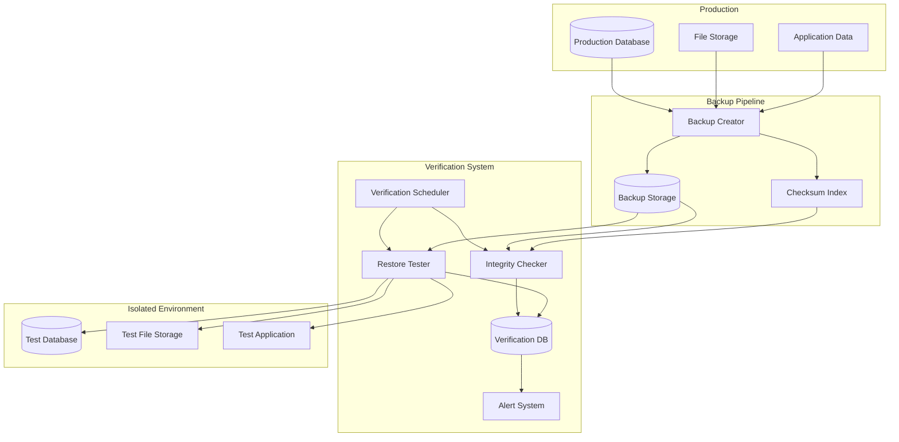
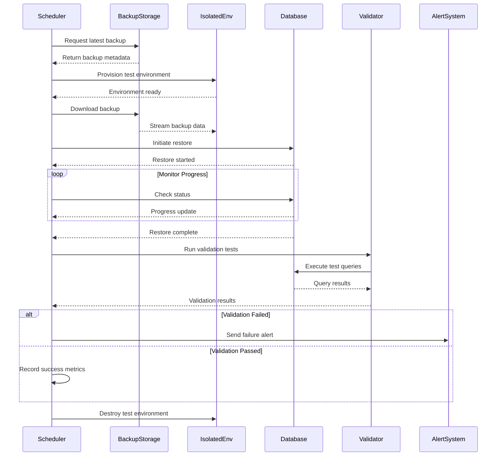
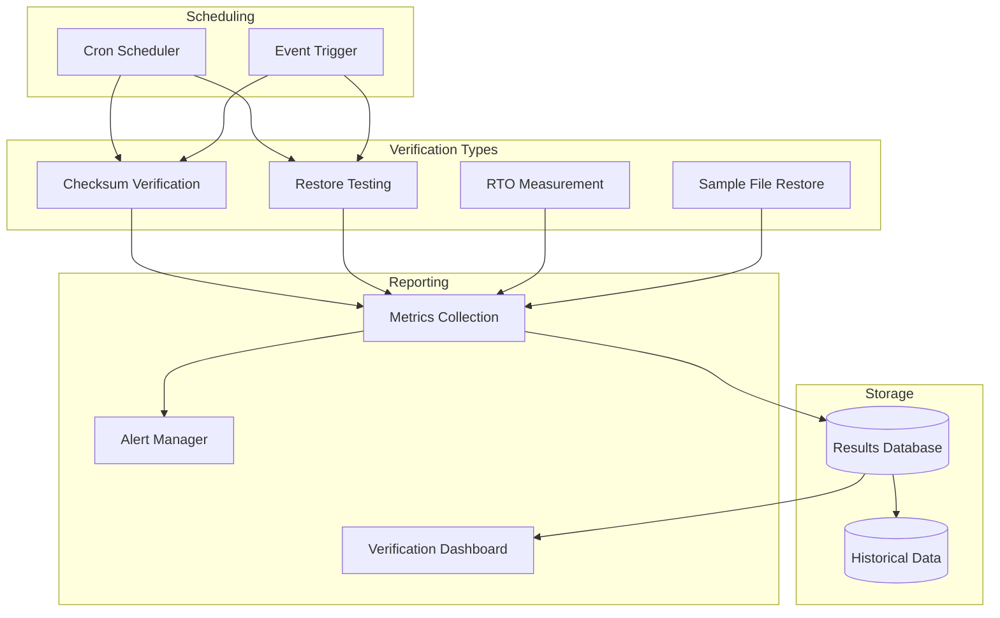

# How to Build Backup Verification Testing

Author: [nawazdhandala](https://github.com/nawazdhandala)

Tags: Backup, Testing, Data Protection, SRE

Description: Learn how to verify backup integrity and test restore procedures regularly.

---

Backups are worthless if they cannot be restored. Many organizations discover their backups are corrupted or incomplete only during an actual disaster. This guide covers how to build automated backup verification testing to ensure your data is protected and recoverable.

## Why Backup Verification Matters

The most common backup failures include:
- Corrupted backup files that cannot be restored
- Incomplete backups missing critical data
- Backups that take too long to restore (exceeding RTO)
- Untested restore procedures that fail under pressure
- Missing dependencies or configuration files

## Backup Verification Architecture



## Integrity Verification with Checksums

Checksums detect corruption at the bit level. Every backup should have associated checksums that are verified independently.

### Generating Checksums During Backup

```python
#!/usr/bin/env python3
"""
Backup checksum generator and verifier.
Generates SHA-256 checksums for backup files and stores them
in a separate manifest for later verification.
"""

import hashlib
import json
import os
from datetime import datetime
from pathlib import Path
from typing import Dict, List, Optional


class BackupChecksumManager:
    """
    Manages checksum generation and verification for backup files.
    Supports both file-level and block-level checksums.
    """

    def __init__(self, backup_dir: str, manifest_dir: str):
        """
        Initialize the checksum manager.

        Args:
            backup_dir: Directory containing backup files
            manifest_dir: Directory to store checksum manifests
        """
        self.backup_dir = Path(backup_dir)
        self.manifest_dir = Path(manifest_dir)
        self.manifest_dir.mkdir(parents=True, exist_ok=True)

    def calculate_file_checksum(
        self,
        file_path: Path,
        algorithm: str = "sha256",
        block_size: int = 65536
    ) -> str:
        """
        Calculate checksum for a single file.

        Args:
            file_path: Path to the file
            algorithm: Hash algorithm to use (sha256, sha512, md5)
            block_size: Size of blocks to read at a time

        Returns:
            Hexadecimal checksum string
        """
        # Select the hash algorithm
        hasher = hashlib.new(algorithm)

        # Read file in blocks to handle large files efficiently
        with open(file_path, "rb") as f:
            while True:
                block = f.read(block_size)
                if not block:
                    break
                hasher.update(block)

        return hasher.hexdigest()

    def generate_manifest(self, backup_id: str) -> Dict:
        """
        Generate a checksum manifest for all files in a backup.

        Args:
            backup_id: Unique identifier for this backup

        Returns:
            Dictionary containing all file checksums and metadata
        """
        manifest = {
            "backup_id": backup_id,
            "created_at": datetime.utcnow().isoformat(),
            "algorithm": "sha256",
            "files": []
        }

        # Walk through all backup files
        for file_path in self.backup_dir.rglob("*"):
            if file_path.is_file():
                relative_path = file_path.relative_to(self.backup_dir)
                checksum = self.calculate_file_checksum(file_path)
                file_size = file_path.stat().st_size

                manifest["files"].append({
                    "path": str(relative_path),
                    "checksum": checksum,
                    "size": file_size,
                    "modified": datetime.fromtimestamp(
                        file_path.stat().st_mtime
                    ).isoformat()
                })

        # Calculate manifest checksum for tamper detection
        manifest_content = json.dumps(manifest["files"], sort_keys=True)
        manifest["manifest_checksum"] = hashlib.sha256(
            manifest_content.encode()
        ).hexdigest()

        # Save manifest to file
        manifest_path = self.manifest_dir / f"{backup_id}.json"
        with open(manifest_path, "w") as f:
            json.dump(manifest, f, indent=2)

        return manifest

    def verify_backup(self, backup_id: str) -> Dict:
        """
        Verify a backup against its stored manifest.

        Args:
            backup_id: Unique identifier of the backup to verify

        Returns:
            Dictionary containing verification results
        """
        # Load the manifest
        manifest_path = self.manifest_dir / f"{backup_id}.json"
        if not manifest_path.exists():
            return {
                "success": False,
                "error": f"Manifest not found for backup {backup_id}"
            }

        with open(manifest_path, "r") as f:
            manifest = json.load(f)

        results = {
            "backup_id": backup_id,
            "verified_at": datetime.utcnow().isoformat(),
            "total_files": len(manifest["files"]),
            "verified_files": 0,
            "failed_files": [],
            "missing_files": [],
            "success": True
        }

        # Verify each file
        for file_info in manifest["files"]:
            file_path = self.backup_dir / file_info["path"]

            if not file_path.exists():
                results["missing_files"].append(file_info["path"])
                results["success"] = False
                continue

            # Calculate current checksum
            current_checksum = self.calculate_file_checksum(file_path)

            if current_checksum != file_info["checksum"]:
                results["failed_files"].append({
                    "path": file_info["path"],
                    "expected": file_info["checksum"],
                    "actual": current_checksum
                })
                results["success"] = False
            else:
                results["verified_files"] += 1

        return results


# Example usage
if __name__ == "__main__":
    manager = BackupChecksumManager(
        backup_dir="/backups/daily/2024-01-15",
        manifest_dir="/backups/manifests"
    )

    # Generate manifest after backup
    manifest = manager.generate_manifest("daily-2024-01-15")
    print(f"Generated manifest with {len(manifest['files'])} files")

    # Verify backup integrity
    results = manager.verify_backup("daily-2024-01-15")
    if results["success"]:
        print(f"Backup verified: {results['verified_files']} files OK")
    else:
        print(f"Verification failed: {len(results['failed_files'])} corrupted")
        print(f"Missing files: {len(results['missing_files'])}")
```

### Block-Level Checksum Verification

For large database backups, block-level checksums provide faster verification:

```python
#!/usr/bin/env python3
"""
Block-level checksum verification for large backup files.
Divides files into blocks and verifies checksums in parallel.
"""

import hashlib
import json
from concurrent.futures import ThreadPoolExecutor, as_completed
from dataclasses import dataclass
from pathlib import Path
from typing import List, Tuple


@dataclass
class BlockChecksum:
    """Represents a checksum for a single block of data."""
    block_number: int
    offset: int
    size: int
    checksum: str


class BlockLevelVerifier:
    """
    Verifies large files using block-level checksums.
    Enables parallel verification and identifies corrupted regions.
    """

    def __init__(self, block_size: int = 1024 * 1024):  # 1MB blocks
        """
        Initialize the block-level verifier.

        Args:
            block_size: Size of each block in bytes (default 1MB)
        """
        self.block_size = block_size

    def generate_block_checksums(self, file_path: Path) -> List[BlockChecksum]:
        """
        Generate checksums for each block in a file.

        Args:
            file_path: Path to the file

        Returns:
            List of BlockChecksum objects
        """
        checksums = []
        block_number = 0
        offset = 0

        with open(file_path, "rb") as f:
            while True:
                block = f.read(self.block_size)
                if not block:
                    break

                # Calculate checksum for this block
                checksum = hashlib.sha256(block).hexdigest()

                checksums.append(BlockChecksum(
                    block_number=block_number,
                    offset=offset,
                    size=len(block),
                    checksum=checksum
                ))

                block_number += 1
                offset += len(block)

        return checksums

    def verify_block(
        self,
        file_path: Path,
        expected: BlockChecksum
    ) -> Tuple[int, bool, str]:
        """
        Verify a single block against its expected checksum.

        Args:
            file_path: Path to the file
            expected: Expected block checksum

        Returns:
            Tuple of (block_number, is_valid, actual_checksum)
        """
        with open(file_path, "rb") as f:
            f.seek(expected.offset)
            block = f.read(expected.size)

        actual_checksum = hashlib.sha256(block).hexdigest()
        is_valid = actual_checksum == expected.checksum

        return expected.block_number, is_valid, actual_checksum

    def verify_file_parallel(
        self,
        file_path: Path,
        expected_checksums: List[BlockChecksum],
        max_workers: int = 4
    ) -> dict:
        """
        Verify all blocks in parallel using multiple threads.

        Args:
            file_path: Path to the file to verify
            expected_checksums: List of expected block checksums
            max_workers: Maximum number of parallel workers

        Returns:
            Verification results including any corrupted blocks
        """
        results = {
            "file": str(file_path),
            "total_blocks": len(expected_checksums),
            "verified_blocks": 0,
            "corrupted_blocks": [],
            "success": True
        }

        # Submit all verification tasks
        with ThreadPoolExecutor(max_workers=max_workers) as executor:
            futures = {
                executor.submit(
                    self.verify_block,
                    file_path,
                    checksum
                ): checksum
                for checksum in expected_checksums
            }

            # Collect results as they complete
            for future in as_completed(futures):
                block_num, is_valid, actual = future.result()

                if is_valid:
                    results["verified_blocks"] += 1
                else:
                    expected = futures[future]
                    results["corrupted_blocks"].append({
                        "block": block_num,
                        "offset": expected.offset,
                        "expected": expected.checksum,
                        "actual": actual
                    })
                    results["success"] = False

        return results


# Example usage
if __name__ == "__main__":
    verifier = BlockLevelVerifier(block_size=1024 * 1024)  # 1MB blocks

    # Generate checksums for backup file
    backup_file = Path("/backups/database.sql.gz")
    checksums = verifier.generate_block_checksums(backup_file)

    # Save checksums
    with open("/backups/database.sql.gz.checksums", "w") as f:
        json.dump([
            {
                "block": c.block_number,
                "offset": c.offset,
                "size": c.size,
                "checksum": c.checksum
            }
            for c in checksums
        ], f)

    # Later, verify the backup
    results = verifier.verify_file_parallel(backup_file, checksums)
    print(f"Verified {results['verified_blocks']}/{results['total_blocks']} blocks")
```

## Automated Restore Testing

Integrity checks confirm data is not corrupted, but restore testing confirms backups actually work. This requires spinning up isolated environments and performing real restores.

### Restore Testing Workflow



### Database Restore Validator

```python
#!/usr/bin/env python3
"""
Database restore validation framework.
Performs comprehensive tests to verify restored database integrity.
"""

import hashlib
import time
from abc import ABC, abstractmethod
from dataclasses import dataclass
from datetime import datetime
from typing import Any, Dict, List, Optional

import psycopg2


@dataclass
class ValidationResult:
    """Result of a single validation test."""
    test_name: str
    passed: bool
    expected: Any
    actual: Any
    duration_ms: float
    message: str


class DatabaseValidator(ABC):
    """Abstract base class for database validation."""

    @abstractmethod
    def connect(self) -> None:
        """Establish database connection."""
        pass

    @abstractmethod
    def validate_schema(self) -> ValidationResult:
        """Verify database schema is intact."""
        pass

    @abstractmethod
    def validate_row_counts(self) -> List[ValidationResult]:
        """Verify expected row counts in critical tables."""
        pass

    @abstractmethod
    def validate_data_integrity(self) -> List[ValidationResult]:
        """Run data integrity checks."""
        pass


class PostgresRestoreValidator(DatabaseValidator):
    """
    Validates PostgreSQL database restores.
    Performs schema, data, and integrity validation.
    """

    def __init__(
        self,
        host: str,
        port: int,
        database: str,
        user: str,
        password: str,
        expected_counts: Dict[str, int],
        checksum_queries: Dict[str, str]
    ):
        """
        Initialize the PostgreSQL validator.

        Args:
            host: Database host
            port: Database port
            database: Database name
            user: Database user
            password: Database password
            expected_counts: Expected row counts per table
            checksum_queries: Queries that return checksums for data validation
        """
        self.host = host
        self.port = port
        self.database = database
        self.user = user
        self.password = password
        self.expected_counts = expected_counts
        self.checksum_queries = checksum_queries
        self.conn = None

    def connect(self) -> None:
        """Establish connection to the restored database."""
        self.conn = psycopg2.connect(
            host=self.host,
            port=self.port,
            database=self.database,
            user=self.user,
            password=self.password
        )

    def validate_schema(self) -> ValidationResult:
        """
        Verify all expected tables exist with correct columns.

        Returns:
            ValidationResult with schema validation status
        """
        start_time = time.time()

        # Query to get all tables and their columns
        query = """
            SELECT table_name, column_name, data_type
            FROM information_schema.columns
            WHERE table_schema = 'public'
            ORDER BY table_name, ordinal_position
        """

        with self.conn.cursor() as cur:
            cur.execute(query)
            schema = {}
            for row in cur.fetchall():
                table_name, column_name, data_type = row
                if table_name not in schema:
                    schema[table_name] = []
                schema[table_name].append((column_name, data_type))

        # Check expected tables exist
        missing_tables = []
        for table in self.expected_counts.keys():
            if table not in schema:
                missing_tables.append(table)

        duration = (time.time() - start_time) * 1000
        passed = len(missing_tables) == 0

        return ValidationResult(
            test_name="schema_validation",
            passed=passed,
            expected=list(self.expected_counts.keys()),
            actual=list(schema.keys()),
            duration_ms=duration,
            message=f"Missing tables: {missing_tables}" if missing_tables else "All tables present"
        )

    def validate_row_counts(self) -> List[ValidationResult]:
        """
        Verify row counts match expected values within tolerance.

        Returns:
            List of ValidationResults for each table
        """
        results = []
        tolerance = 0.01  # Allow 1% variance

        for table, expected_count in self.expected_counts.items():
            start_time = time.time()

            query = f"SELECT COUNT(*) FROM {table}"

            try:
                with self.conn.cursor() as cur:
                    cur.execute(query)
                    actual_count = cur.fetchone()[0]

                # Calculate if within tolerance
                if expected_count > 0:
                    variance = abs(actual_count - expected_count) / expected_count
                    passed = variance <= tolerance
                else:
                    passed = actual_count == expected_count

                duration = (time.time() - start_time) * 1000

                results.append(ValidationResult(
                    test_name=f"row_count_{table}",
                    passed=passed,
                    expected=expected_count,
                    actual=actual_count,
                    duration_ms=duration,
                    message=f"Variance: {variance*100:.2f}%" if expected_count > 0 else "OK"
                ))

            except Exception as e:
                results.append(ValidationResult(
                    test_name=f"row_count_{table}",
                    passed=False,
                    expected=expected_count,
                    actual=None,
                    duration_ms=0,
                    message=f"Error: {str(e)}"
                ))

        return results

    def validate_data_integrity(self) -> List[ValidationResult]:
        """
        Run checksum queries to verify data integrity.

        Returns:
            List of ValidationResults for each checksum test
        """
        results = []

        for test_name, query in self.checksum_queries.items():
            start_time = time.time()

            try:
                with self.conn.cursor() as cur:
                    cur.execute(query)
                    result = cur.fetchone()[0]

                duration = (time.time() - start_time) * 1000

                # Hash the result for consistent comparison
                checksum = hashlib.md5(str(result).encode()).hexdigest()

                results.append(ValidationResult(
                    test_name=f"integrity_{test_name}",
                    passed=True,  # Will be compared against baseline
                    expected="baseline",
                    actual=checksum,
                    duration_ms=duration,
                    message="Checksum computed successfully"
                ))

            except Exception as e:
                results.append(ValidationResult(
                    test_name=f"integrity_{test_name}",
                    passed=False,
                    expected="baseline",
                    actual=None,
                    duration_ms=0,
                    message=f"Error: {str(e)}"
                ))

        return results

    def run_all_validations(self) -> Dict:
        """
        Run all validation tests and return comprehensive results.

        Returns:
            Dictionary with all validation results and summary
        """
        self.connect()

        all_results = []

        # Schema validation
        schema_result = self.validate_schema()
        all_results.append(schema_result)

        # Row count validation
        count_results = self.validate_row_counts()
        all_results.extend(count_results)

        # Data integrity validation
        integrity_results = self.validate_data_integrity()
        all_results.extend(integrity_results)

        # Summary
        passed_count = sum(1 for r in all_results if r.passed)
        total_count = len(all_results)

        return {
            "timestamp": datetime.utcnow().isoformat(),
            "database": self.database,
            "total_tests": total_count,
            "passed_tests": passed_count,
            "failed_tests": total_count - passed_count,
            "success": passed_count == total_count,
            "results": [
                {
                    "test": r.test_name,
                    "passed": r.passed,
                    "expected": r.expected,
                    "actual": r.actual,
                    "duration_ms": r.duration_ms,
                    "message": r.message
                }
                for r in all_results
            ]
        }


# Example usage
if __name__ == "__main__":
    validator = PostgresRestoreValidator(
        host="test-db.internal",
        port=5432,
        database="app_restored",
        user="validator",
        password="secret",
        expected_counts={
            "users": 150000,
            "orders": 2500000,
            "products": 50000,
            "transactions": 10000000
        },
        checksum_queries={
            "user_emails": "SELECT md5(string_agg(email, '')) FROM users ORDER BY id",
            "order_totals": "SELECT SUM(total) FROM orders",
            "recent_transactions": """
                SELECT COUNT(*), SUM(amount)
                FROM transactions
                WHERE created_at > NOW() - INTERVAL '30 days'
            """
        }
    )

    results = validator.run_all_validations()

    if results["success"]:
        print(f"Validation passed: {results['passed_tests']}/{results['total_tests']} tests")
    else:
        print(f"Validation failed: {results['failed_tests']} failures")
        for r in results["results"]:
            if not r["passed"]:
                print(f"  - {r['test']}: {r['message']}")
```

## Continuous Backup Verification Pipeline

Integrate backup verification into your CI/CD or scheduled jobs for continuous assurance.

### Kubernetes CronJob for Verification

```yaml
# backup-verification-cronjob.yaml
# Runs daily backup verification tests against the latest backup
apiVersion: batch/v1
kind: CronJob
metadata:
  name: backup-verification
  namespace: backup-system
spec:
  # Run verification daily at 3 AM
  schedule: "0 3 * * *"
  # Prevent concurrent runs
  concurrencyPolicy: Forbid
  # Keep history for debugging
  successfulJobsHistoryLimit: 7
  failedJobsHistoryLimit: 3
  jobTemplate:
    spec:
      # Timeout after 2 hours
      activeDeadlineSeconds: 7200
      template:
        spec:
          restartPolicy: Never
          serviceAccountName: backup-verifier
          containers:
            - name: verifier
              image: backup-tools:latest
              env:
                # Backup storage credentials
                - name: BACKUP_STORAGE_ENDPOINT
                  valueFrom:
                    secretKeyRef:
                      name: backup-credentials
                      key: endpoint
                - name: BACKUP_STORAGE_KEY
                  valueFrom:
                    secretKeyRef:
                      name: backup-credentials
                      key: access-key
                # Alert webhook for failures
                - name: ALERT_WEBHOOK_URL
                  valueFrom:
                    secretKeyRef:
                      name: alert-config
                      key: webhook-url
                # Verification database for isolated testing
                - name: TEST_DB_HOST
                  value: "backup-test-db.backup-system.svc"
                - name: TEST_DB_PASSWORD
                  valueFrom:
                    secretKeyRef:
                      name: test-db-credentials
                      key: password
              command:
                - /bin/bash
                - -c
                - |
                  set -e

                  echo "Starting backup verification..."

                  # Step 1: Get latest backup metadata
                  LATEST_BACKUP=$(backup-cli list --latest --format json)
                  BACKUP_ID=$(echo $LATEST_BACKUP | jq -r '.backup_id')
                  BACKUP_DATE=$(echo $LATEST_BACKUP | jq -r '.created_at')

                  echo "Verifying backup: $BACKUP_ID from $BACKUP_DATE"

                  # Step 2: Verify checksums
                  echo "Running checksum verification..."
                  backup-cli verify-checksum --backup-id $BACKUP_ID

                  # Step 3: Download and restore to test database
                  echo "Restoring to test environment..."
                  backup-cli restore \
                    --backup-id $BACKUP_ID \
                    --target-host $TEST_DB_HOST \
                    --target-db backup_test \
                    --drop-existing

                  # Step 4: Run validation tests
                  echo "Running validation tests..."
                  backup-validator \
                    --host $TEST_DB_HOST \
                    --database backup_test \
                    --config /etc/validation/config.yaml \
                    --output /tmp/results.json

                  # Step 5: Record results
                  PASSED=$(jq '.success' /tmp/results.json)
                  if [ "$PASSED" = "true" ]; then
                    echo "Verification PASSED"
                    backup-cli record-verification \
                      --backup-id $BACKUP_ID \
                      --status success \
                      --results /tmp/results.json
                  else
                    echo "Verification FAILED"
                    backup-cli record-verification \
                      --backup-id $BACKUP_ID \
                      --status failed \
                      --results /tmp/results.json

                    # Send alert
                    curl -X POST $ALERT_WEBHOOK_URL \
                      -H "Content-Type: application/json" \
                      -d @/tmp/results.json

                    exit 1
                  fi
              volumeMounts:
                - name: validation-config
                  mountPath: /etc/validation
                  readOnly: true
              resources:
                requests:
                  memory: "512Mi"
                  cpu: "500m"
                limits:
                  memory: "2Gi"
                  cpu: "2000m"
          volumes:
            - name: validation-config
              configMap:
                name: backup-validation-config
```

### Verification Metrics and Alerting

```yaml
# prometheus-rules.yaml
# Alerting rules for backup verification failures
apiVersion: monitoring.coreos.com/v1
kind: PrometheusRule
metadata:
  name: backup-verification-alerts
  namespace: monitoring
spec:
  groups:
    - name: backup-verification
      rules:
        # Alert if verification job fails
        - alert: BackupVerificationFailed
          expr: |
            kube_job_status_failed{job_name=~"backup-verification.*"} > 0
          for: 5m
          labels:
            severity: critical
          annotations:
            summary: "Backup verification failed"
            description: "The backup verification job has failed. Backups may be corrupted or unrestorable."

        # Alert if no successful verification in 48 hours
        - alert: BackupVerificationStale
          expr: |
            time() - backup_verification_last_success_timestamp > 172800
          for: 1h
          labels:
            severity: warning
          annotations:
            summary: "No successful backup verification in 48 hours"
            description: "Backup verification has not succeeded in over 48 hours. Check for job failures or scheduling issues."

        # Alert if restore time exceeds RTO
        - alert: BackupRestoreTimeExceedsRTO
          expr: |
            backup_verification_restore_duration_seconds > 3600
          for: 0m
          labels:
            severity: warning
          annotations:
            summary: "Backup restore time exceeds RTO"
            description: "Backup restore took {{ $value | humanizeDuration }} which exceeds the 1 hour RTO target."

        # Alert if checksum verification fails
        - alert: BackupChecksumMismatch
          expr: |
            backup_verification_checksum_failures > 0
          for: 0m
          labels:
            severity: critical
          annotations:
            summary: "Backup checksum verification failed"
            description: "{{ $value }} files failed checksum verification. Backup data may be corrupted."
```

## Recovery Time Objective (RTO) Testing

Measure how long restores actually take to ensure you can meet your RTO commitments.

```python
#!/usr/bin/env python3
"""
RTO (Recovery Time Objective) measurement and validation.
Measures actual restore times against defined RTO targets.
"""

import time
from dataclasses import dataclass
from datetime import datetime, timedelta
from typing import Callable, Dict, List, Optional


@dataclass
class RTOMetrics:
    """Metrics from an RTO test."""
    backup_id: str
    backup_size_gb: float
    download_time_seconds: float
    restore_time_seconds: float
    validation_time_seconds: float
    total_time_seconds: float
    rto_target_seconds: float
    meets_rto: bool


class RTOTester:
    """
    Tests backup restore operations against RTO targets.
    Measures each phase of recovery independently.
    """

    def __init__(
        self,
        rto_target: timedelta,
        backup_downloader: Callable,
        restore_executor: Callable,
        validator: Callable
    ):
        """
        Initialize the RTO tester.

        Args:
            rto_target: Target RTO as timedelta
            backup_downloader: Function to download backup
            restore_executor: Function to execute restore
            validator: Function to validate restored data
        """
        self.rto_target = rto_target
        self.backup_downloader = backup_downloader
        self.restore_executor = restore_executor
        self.validator = validator

    def measure_phase(
        self,
        phase_name: str,
        phase_func: Callable,
        *args,
        **kwargs
    ) -> tuple:
        """
        Execute a phase and measure its duration.

        Args:
            phase_name: Name of the phase for logging
            phase_func: Function to execute
            *args: Positional arguments for the function
            **kwargs: Keyword arguments for the function

        Returns:
            Tuple of (result, duration_seconds)
        """
        print(f"Starting phase: {phase_name}")
        start_time = time.time()

        result = phase_func(*args, **kwargs)

        duration = time.time() - start_time
        print(f"Phase {phase_name} completed in {duration:.2f} seconds")

        return result, duration

    def run_rto_test(
        self,
        backup_id: str,
        backup_size_gb: float
    ) -> RTOMetrics:
        """
        Run a complete RTO test for a backup.

        Args:
            backup_id: ID of the backup to test
            backup_size_gb: Size of the backup in GB

        Returns:
            RTOMetrics with detailed timing information
        """
        print(f"Starting RTO test for backup {backup_id}")
        print(f"Backup size: {backup_size_gb} GB")
        print(f"RTO target: {self.rto_target}")

        # Phase 1: Download backup
        _, download_time = self.measure_phase(
            "download",
            self.backup_downloader,
            backup_id
        )

        # Phase 2: Execute restore
        _, restore_time = self.measure_phase(
            "restore",
            self.restore_executor,
            backup_id
        )

        # Phase 3: Validate restored data
        _, validation_time = self.measure_phase(
            "validation",
            self.validator,
            backup_id
        )

        # Calculate total time
        total_time = download_time + restore_time + validation_time
        rto_target_seconds = self.rto_target.total_seconds()
        meets_rto = total_time <= rto_target_seconds

        metrics = RTOMetrics(
            backup_id=backup_id,
            backup_size_gb=backup_size_gb,
            download_time_seconds=download_time,
            restore_time_seconds=restore_time,
            validation_time_seconds=validation_time,
            total_time_seconds=total_time,
            rto_target_seconds=rto_target_seconds,
            meets_rto=meets_rto
        )

        # Print summary
        print("\n=== RTO Test Results ===")
        print(f"Download time:   {download_time:.2f}s")
        print(f"Restore time:    {restore_time:.2f}s")
        print(f"Validation time: {validation_time:.2f}s")
        print(f"Total time:      {total_time:.2f}s")
        print(f"RTO target:      {rto_target_seconds:.2f}s")
        print(f"Result:          {'PASS' if meets_rto else 'FAIL'}")

        return metrics


def analyze_rto_trends(metrics_history: List[RTOMetrics]) -> Dict:
    """
    Analyze RTO test results over time to identify trends.

    Args:
        metrics_history: List of historical RTO test results

    Returns:
        Dictionary with trend analysis
    """
    if not metrics_history:
        return {"error": "No metrics to analyze"}

    # Calculate averages
    avg_download = sum(m.download_time_seconds for m in metrics_history) / len(metrics_history)
    avg_restore = sum(m.restore_time_seconds for m in metrics_history) / len(metrics_history)
    avg_validation = sum(m.validation_time_seconds for m in metrics_history) / len(metrics_history)
    avg_total = sum(m.total_time_seconds for m in metrics_history) / len(metrics_history)

    # Success rate
    success_count = sum(1 for m in metrics_history if m.meets_rto)
    success_rate = success_count / len(metrics_history) * 100

    # Identify slowest phase
    phases = {
        "download": avg_download,
        "restore": avg_restore,
        "validation": avg_validation
    }
    slowest_phase = max(phases, key=phases.get)

    return {
        "total_tests": len(metrics_history),
        "success_rate_percent": success_rate,
        "average_total_time_seconds": avg_total,
        "average_download_time_seconds": avg_download,
        "average_restore_time_seconds": avg_restore,
        "average_validation_time_seconds": avg_validation,
        "slowest_phase": slowest_phase,
        "recommendation": f"Optimize {slowest_phase} phase to improve RTO" if success_rate < 100 else "RTO targets met consistently"
    }
```

## File-Level Restore Verification

For file-based backups, verify individual files can be restored correctly.

```bash
#!/bin/bash
# file-restore-verification.sh
# Verifies file-level backup restore capabilities

set -euo pipefail

# Configuration
BACKUP_SOURCE="/backups/latest"
RESTORE_TARGET="/tmp/restore-test"
MANIFEST_FILE="/backups/manifests/latest.json"
LOG_FILE="/var/log/backup-verification.log"

# Initialize logging
log() {
    local level=$1
    shift
    echo "[$(date -u +"%Y-%m-%dT%H:%M:%SZ")] [$level] $*" | tee -a "$LOG_FILE"
}

# Clean up test environment
cleanup() {
    log "INFO" "Cleaning up test environment"
    rm -rf "$RESTORE_TARGET"
}

trap cleanup EXIT

# Create test environment
setup() {
    log "INFO" "Setting up test environment"
    mkdir -p "$RESTORE_TARGET"
}

# Verify single file restore
verify_file_restore() {
    local file_path=$1
    local expected_checksum=$2
    local expected_size=$3

    log "INFO" "Verifying file: $file_path"

    # Restore the file
    local restore_path="$RESTORE_TARGET/$file_path"
    mkdir -p "$(dirname "$restore_path")"

    # Copy from backup (simulating restore operation)
    cp "$BACKUP_SOURCE/$file_path" "$restore_path"

    # Verify file exists
    if [ ! -f "$restore_path" ]; then
        log "ERROR" "File not restored: $file_path"
        return 1
    fi

    # Verify checksum
    local actual_checksum
    actual_checksum=$(sha256sum "$restore_path" | cut -d' ' -f1)
    if [ "$actual_checksum" != "$expected_checksum" ]; then
        log "ERROR" "Checksum mismatch for $file_path"
        log "ERROR" "Expected: $expected_checksum"
        log "ERROR" "Actual: $actual_checksum"
        return 1
    fi

    # Verify size
    local actual_size
    actual_size=$(stat -f%z "$restore_path" 2>/dev/null || stat -c%s "$restore_path")
    if [ "$actual_size" != "$expected_size" ]; then
        log "ERROR" "Size mismatch for $file_path"
        log "ERROR" "Expected: $expected_size bytes"
        log "ERROR" "Actual: $actual_size bytes"
        return 1
    fi

    log "INFO" "File verified successfully: $file_path"
    return 0
}

# Run sample-based verification
run_sample_verification() {
    local sample_size=${1:-10}
    local total_files
    local verified=0
    local failed=0

    log "INFO" "Starting sample-based verification with $sample_size files"

    # Get random sample of files from manifest
    total_files=$(jq '.files | length' "$MANIFEST_FILE")
    log "INFO" "Total files in backup: $total_files"

    # Select random files for verification
    local indices
    indices=$(shuf -i 0-$((total_files-1)) -n "$sample_size")

    for idx in $indices; do
        local file_info
        file_info=$(jq ".files[$idx]" "$MANIFEST_FILE")

        local path checksum size
        path=$(echo "$file_info" | jq -r '.path')
        checksum=$(echo "$file_info" | jq -r '.checksum')
        size=$(echo "$file_info" | jq -r '.size')

        if verify_file_restore "$path" "$checksum" "$size"; then
            ((verified++))
        else
            ((failed++))
        fi
    done

    log "INFO" "Verification complete: $verified passed, $failed failed"

    # Return failure if any files failed
    [ "$failed" -eq 0 ]
}

# Main execution
main() {
    log "INFO" "Starting file restore verification"

    setup

    # Run sample verification with 20 random files
    if run_sample_verification 20; then
        log "INFO" "All sample verifications passed"
        exit 0
    else
        log "ERROR" "Some verifications failed"
        exit 1
    fi
}

main "$@"
```

## Building a Complete Verification Framework

Bring all verification components together into a unified framework.



## Best Practices Summary

1. **Automate everything**: Manual verification gets skipped under pressure
2. **Test regularly**: Weekly verification minimum, daily for critical data
3. **Use isolated environments**: Never test restores against production
4. **Measure RTO**: Know actual restore times, not theoretical ones
5. **Alert on failures**: Verification failures need immediate attention
6. **Keep checksums separate**: Store checksums in a different location than backups
7. **Test full and incremental**: Verify both backup types work correctly
8. **Document procedures**: Runbooks for restore operations are essential
9. **Version your verification tests**: Track changes to validation logic
10. **Review results regularly**: Dashboards should be checked, not just alerts

## Conclusion

Backup verification testing transforms backups from a hopeful insurance policy into a reliable recovery capability. By implementing automated checksum verification, restore testing, and RTO measurement, you gain confidence that your backups will work when disaster strikes.

Start with basic checksum verification, then add restore testing to an isolated environment. Measure your actual RTO against targets, and alert on any failures. Your future self, facing a data loss incident at 3 AM, will thank you for building this verification pipeline.

For comprehensive backup monitoring and alerting, consider using OneUptime (https://oneuptime.com) to track backup job success, verification results, and alert on any failures in your backup infrastructure.

---
