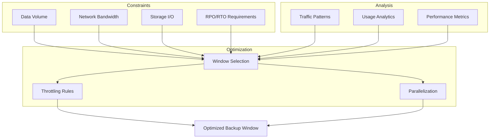
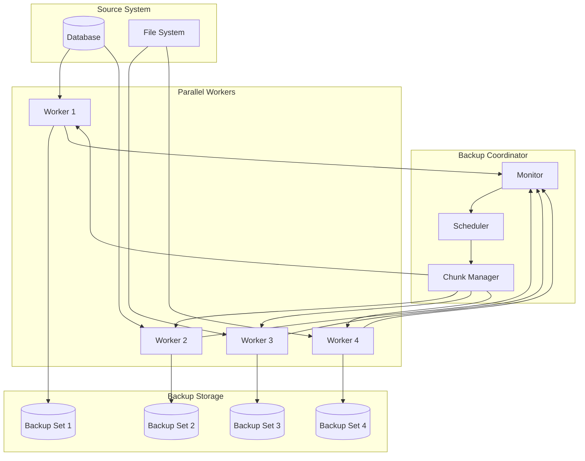
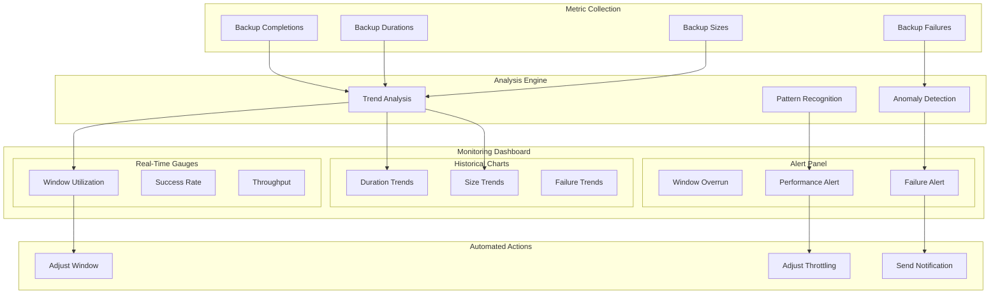

# How to Create Backup Window Optimization

Author: [nawazdhandala](https://github.com/nawazdhandala)

Tags: Backup, Disaster Recovery, Performance, SRE

Description: Learn how to optimize backup windows for minimal production impact.

---

Backup operations are critical for data protection, but poorly timed or resource-hungry backups can cripple production systems. Backup window optimization ensures your data protection strategy works without compromising performance or availability.

This guide covers everything from analyzing your backup windows to implementing advanced optimization techniques that keep both your data safe and your systems responsive.

---

## TL;DR

- Analyze existing backup patterns to identify optimal windows
- Schedule backups during off-peak hours using traffic analysis
- Implement parallel backup strategies for faster completion
- Use resource throttling to limit backup impact on production
- Apply incremental and deduplication techniques to reduce backup size
- Monitor and continuously adjust backup windows based on metrics

---

## Why Backup Window Optimization Matters

Unoptimized backup windows cause real problems:

- **Performance degradation**: Heavy I/O operations slow down production workloads
- **Extended maintenance windows**: Long backup times limit operational flexibility
- **Failed backups**: Windows too short for data volume cause incomplete backups
- **User impact**: Backups during peak hours affect application responsiveness
- **Resource contention**: CPU, memory, and network compete with production traffic
- **Compliance risks**: Missed backup windows violate data protection requirements

The goal is simple: complete backups successfully while minimizing production impact.

---

## Understanding Backup Windows

A backup window is the time period allocated for backup operations. Optimizing it involves balancing several factors:



---

## Backup Window Analysis

### Step 1: Measure Current Backup Performance

Before optimizing, understand your baseline:

```bash
#!/bin/bash
# backup-metrics.sh - Collect backup performance metrics

BACKUP_NAME="$1"
LOG_FILE="/var/log/backup-metrics.log"

# Record start time
START_TIME=$(date +%s)
START_TIMESTAMP=$(date -Iseconds)

echo "[$START_TIMESTAMP] Backup $BACKUP_NAME started" >> "$LOG_FILE"

# Capture initial system state
INITIAL_CPU=$(top -l 1 | grep "CPU usage" | awk '{print $3}' | tr -d '%')
INITIAL_IO=$(iostat -d 1 1 | tail -1 | awk '{print $3}')
INITIAL_NET=$(netstat -ib | grep en0 | head -1 | awk '{print $7}')

# Run your backup command here
# pg_dump, rsync, etc.

# Record end time and calculate duration
END_TIME=$(date +%s)
DURATION=$((END_TIME - START_TIME))

# Capture final state
FINAL_CPU=$(top -l 1 | grep "CPU usage" | awk '{print $3}' | tr -d '%')
FINAL_IO=$(iostat -d 1 1 | tail -1 | awk '{print $3}')
FINAL_NET=$(netstat -ib | grep en0 | head -1 | awk '{print $7}')

# Log metrics
echo "[$START_TIMESTAMP] Backup $BACKUP_NAME completed in ${DURATION}s" >> "$LOG_FILE"
echo "  CPU: ${INITIAL_CPU}% -> ${FINAL_CPU}%" >> "$LOG_FILE"
echo "  I/O: ${INITIAL_IO} -> ${FINAL_IO}" >> "$LOG_FILE"
```

### Step 2: Analyze Traffic Patterns

Identify low-traffic periods for optimal backup scheduling:

```python
import pandas as pd
from datetime import datetime, timedelta
import matplotlib.pyplot as plt

def analyze_traffic_patterns(metrics_file: str) -> dict:
    """
    Analyze application traffic to identify optimal backup windows.
    Returns hourly traffic patterns averaged over the analysis period.
    """
    # Load metrics data (requests per minute, response times, etc.)
    df = pd.read_csv(metrics_file, parse_dates=['timestamp'])

    # Group by hour of day to find patterns
    df['hour'] = df['timestamp'].dt.hour
    hourly_traffic = df.groupby('hour').agg({
        'requests': 'mean',
        'response_time_ms': 'mean',
        'cpu_percent': 'mean',
        'io_wait': 'mean'
    }).round(2)

    # Calculate a "busyness score" combining all metrics
    # Lower score = better backup window
    hourly_traffic['busyness_score'] = (
        hourly_traffic['requests'] / hourly_traffic['requests'].max() * 0.4 +
        hourly_traffic['cpu_percent'] / 100 * 0.3 +
        hourly_traffic['io_wait'] / hourly_traffic['io_wait'].max() * 0.3
    )

    # Find the best 4-hour window
    best_start_hour = None
    best_score = float('inf')

    for start_hour in range(24):
        # Calculate average busyness for a 4-hour window
        window_hours = [(start_hour + i) % 24 for i in range(4)]
        window_score = hourly_traffic.loc[window_hours, 'busyness_score'].mean()

        if window_score < best_score:
            best_score = window_score
            best_start_hour = start_hour

    return {
        'hourly_patterns': hourly_traffic.to_dict(),
        'recommended_window_start': best_start_hour,
        'recommended_window_end': (best_start_hour + 4) % 24,
        'window_busyness_score': best_score
    }

# Example usage
# result = analyze_traffic_patterns('/var/log/app-metrics.csv')
# print(f"Optimal backup window: {result['recommended_window_start']}:00 - {result['recommended_window_end']}:00")
```

### Step 3: Map Data Growth Trends

Understanding data growth helps predict future backup window requirements:

```python
from datetime import datetime
import statistics

def analyze_backup_trends(backup_history: list) -> dict:
    """
    Analyze backup history to predict future window requirements.

    backup_history: List of dicts with 'date', 'size_gb', 'duration_minutes'
    """
    # Calculate growth rates
    sizes = [b['size_gb'] for b in backup_history]
    durations = [b['duration_minutes'] for b in backup_history]

    # Week-over-week growth rate
    if len(sizes) >= 2:
        growth_rates = []
        for i in range(1, len(sizes)):
            if sizes[i-1] > 0:
                rate = (sizes[i] - sizes[i-1]) / sizes[i-1]
                growth_rates.append(rate)

        avg_growth_rate = statistics.mean(growth_rates) if growth_rates else 0
    else:
        avg_growth_rate = 0

    # Current averages
    current_avg_size = statistics.mean(sizes[-4:]) if len(sizes) >= 4 else sizes[-1]
    current_avg_duration = statistics.mean(durations[-4:]) if len(durations) >= 4 else durations[-1]

    # Project 30 days ahead
    projected_size = current_avg_size * (1 + avg_growth_rate) ** 4  # 4 weeks
    projected_duration = current_avg_duration * (projected_size / current_avg_size)

    return {
        'current_avg_size_gb': round(current_avg_size, 2),
        'current_avg_duration_min': round(current_avg_duration, 2),
        'weekly_growth_rate': round(avg_growth_rate * 100, 2),
        'projected_size_30d_gb': round(projected_size, 2),
        'projected_duration_30d_min': round(projected_duration, 2),
        'recommended_window_buffer': round(projected_duration * 1.25, 0)  # 25% buffer
    }
```

---

## Off-Peak Scheduling

### Automated Schedule Selection

Create a scheduler that automatically picks optimal backup times:

```python
import schedule
import time
from datetime import datetime, timedelta
from typing import Callable, Optional

class AdaptiveBackupScheduler:
    """
    Schedules backups during optimal windows based on system metrics.
    Automatically adjusts timing based on observed patterns.
    """

    def __init__(self, metrics_collector: Callable, backup_func: Callable):
        self.metrics_collector = metrics_collector
        self.backup_func = backup_func
        self.optimal_windows = []
        self.last_analysis = None

    def analyze_and_schedule(self):
        """Analyze current metrics and schedule backup for optimal time."""
        metrics = self.metrics_collector()

        # Find hours with lowest activity (simple heuristic)
        hourly_load = metrics.get('hourly_cpu_avg', {})

        if hourly_load:
            # Sort hours by load, pick lowest
            sorted_hours = sorted(hourly_load.items(), key=lambda x: x[1])
            optimal_hour = sorted_hours[0][0]
        else:
            # Default to 2 AM if no metrics available
            optimal_hour = 2

        self.optimal_windows.append({
            'scheduled_hour': optimal_hour,
            'scheduled_at': datetime.now().isoformat(),
            'load_at_hour': hourly_load.get(optimal_hour, 'unknown')
        })

        return optimal_hour

    def run_if_optimal(self):
        """
        Check if current time is within optimal window and run backup.
        Called periodically to check conditions.
        """
        current_hour = datetime.now().hour
        current_metrics = self.metrics_collector()

        # Check if we're in a good window
        cpu_threshold = 30  # Only backup if CPU < 30%
        io_threshold = 20   # Only backup if I/O wait < 20%

        cpu_ok = current_metrics.get('cpu_percent', 100) < cpu_threshold
        io_ok = current_metrics.get('io_wait', 100) < io_threshold

        # Also check if it's within preferred hours (midnight to 6 AM)
        time_ok = 0 <= current_hour <= 6

        if cpu_ok and io_ok and time_ok:
            print(f"[{datetime.now()}] Conditions optimal, starting backup")
            self.backup_func()
            return True
        else:
            print(f"[{datetime.now()}] Conditions not optimal: CPU={cpu_ok}, IO={io_ok}, Time={time_ok}")
            return False


# Example cron-based scheduling for different backup types
BACKUP_SCHEDULES = """
# Full backups - Sunday 1 AM (lowest traffic window)
0 1 * * 0 /opt/backup/full-backup.sh

# Incremental backups - Daily 2 AM
0 2 * * 1-6 /opt/backup/incremental-backup.sh

# Transaction log backups - Every 4 hours during off-peak
0 2,6,10,14,18,22 * * * /opt/backup/txlog-backup.sh

# Application data - Daily 3 AM
0 3 * * * /opt/backup/app-data-backup.sh
"""
```

### Time Zone Considerations

For global systems, optimize across time zones:

```python
from datetime import datetime, timezone
import pytz

def find_global_backup_window(regional_traffic: dict) -> dict:
    """
    Find optimal backup window for globally distributed systems.

    regional_traffic: Dict mapping region to peak hours (local time)
    Example: {'us-east': [9,17], 'eu-west': [8,18], 'ap-south': [10,19]}
    """

    # Convert all regional peaks to UTC
    region_timezones = {
        'us-east': 'America/New_York',
        'us-west': 'America/Los_Angeles',
        'eu-west': 'Europe/London',
        'eu-central': 'Europe/Berlin',
        'ap-south': 'Asia/Kolkata',
        'ap-east': 'Asia/Tokyo'
    }

    # Track which UTC hours have regional peaks
    utc_peak_hours = set()

    for region, peak_range in regional_traffic.items():
        tz = pytz.timezone(region_timezones.get(region, 'UTC'))

        for local_hour in range(peak_range[0], peak_range[1] + 1):
            # Convert local peak hour to UTC
            local_time = datetime.now(tz).replace(hour=local_hour, minute=0)
            utc_hour = local_time.astimezone(pytz.UTC).hour
            utc_peak_hours.add(utc_hour)

    # Find consecutive off-peak hours
    all_hours = set(range(24))
    off_peak_hours = sorted(all_hours - utc_peak_hours)

    # Find longest consecutive window
    best_window = []
    current_window = []

    for hour in off_peak_hours:
        if not current_window or hour == current_window[-1] + 1:
            current_window.append(hour)
        else:
            if len(current_window) > len(best_window):
                best_window = current_window
            current_window = [hour]

    if len(current_window) > len(best_window):
        best_window = current_window

    return {
        'optimal_window_utc': best_window,
        'window_start_utc': best_window[0] if best_window else None,
        'window_end_utc': best_window[-1] if best_window else None,
        'window_duration_hours': len(best_window),
        'peak_hours_utc': sorted(utc_peak_hours)
    }
```

---

## Parallel Backup Strategies

### Parallel Database Backups

Split large databases into parallel backup streams:

```bash
#!/bin/bash
# parallel-pg-backup.sh - Parallel PostgreSQL backup

DB_NAME="production"
BACKUP_DIR="/backup/postgres"
PARALLEL_JOBS=4
TIMESTAMP=$(date +%Y%m%d_%H%M%S)

# Create backup directory
mkdir -p "$BACKUP_DIR/$TIMESTAMP"

# Get list of tables grouped by size for balanced parallelization
psql -d "$DB_NAME" -t -c "
    SELECT schemaname || '.' || tablename
    FROM pg_tables
    WHERE schemaname NOT IN ('pg_catalog', 'information_schema')
    ORDER BY pg_total_relation_size(schemaname || '.' || tablename) DESC
" | tr -d ' ' > /tmp/tables.txt

# Split tables into parallel groups
split -n l/$PARALLEL_JOBS /tmp/tables.txt /tmp/table_group_

# Function to backup a group of tables
backup_table_group() {
    local group_file=$1
    local group_id=$2

    while read -r table; do
        if [ -n "$table" ]; then
            echo "Backing up $table in group $group_id"
            pg_dump -d "$DB_NAME" -t "$table" -Fc \
                -f "$BACKUP_DIR/$TIMESTAMP/${table//\./_}.dump"
        fi
    done < "$group_file"
}

# Run parallel backups
echo "Starting parallel backup with $PARALLEL_JOBS jobs"
START_TIME=$(date +%s)

for group_file in /tmp/table_group_*; do
    group_id=$(basename "$group_file" | sed 's/table_group_//')
    backup_table_group "$group_file" "$group_id" &
done

# Wait for all parallel jobs to complete
wait

END_TIME=$(date +%s)
DURATION=$((END_TIME - START_TIME))

echo "Parallel backup completed in ${DURATION}s"

# Create manifest file
ls -la "$BACKUP_DIR/$TIMESTAMP/" > "$BACKUP_DIR/$TIMESTAMP/manifest.txt"
echo "Total duration: ${DURATION}s" >> "$BACKUP_DIR/$TIMESTAMP/manifest.txt"
```

### Parallel File System Backups

Use multiple rsync streams for large file systems:

```python
import subprocess
import os
from concurrent.futures import ThreadPoolExecutor, as_completed
from pathlib import Path
from typing import List, Tuple
import time

class ParallelBackup:
    """
    Parallel file system backup using multiple rsync streams.
    Splits source directory into chunks for parallel processing.
    """

    def __init__(self, source: str, destination: str, parallel_jobs: int = 4):
        self.source = Path(source)
        self.destination = destination
        self.parallel_jobs = parallel_jobs
        self.results = []

    def _get_subdirectories(self) -> List[Path]:
        """Get top-level subdirectories for parallel processing."""
        subdirs = [d for d in self.source.iterdir() if d.is_dir()]
        # Also include files in root as a pseudo-directory
        root_files = [f for f in self.source.iterdir() if f.is_file()]
        if root_files:
            subdirs.append(self.source / "__root_files__")
        return subdirs

    def _backup_directory(self, subdir: Path) -> Tuple[str, bool, float, str]:
        """Backup a single directory using rsync."""
        start_time = time.time()

        if subdir.name == "__root_files__":
            # Handle root-level files
            rsync_cmd = [
                'rsync', '-avz', '--progress',
                '--include=*/', '--include=*',
                '--exclude=*/',
                f'{self.source}/',
                f'{self.destination}/'
            ]
        else:
            rsync_cmd = [
                'rsync', '-avz', '--progress',
                f'{subdir}/',
                f'{self.destination}/{subdir.name}/'
            ]

        try:
            result = subprocess.run(
                rsync_cmd,
                capture_output=True,
                text=True,
                timeout=3600  # 1 hour timeout per directory
            )

            duration = time.time() - start_time
            success = result.returncode == 0

            return (str(subdir), success, duration, result.stderr if not success else "")

        except subprocess.TimeoutExpired:
            duration = time.time() - start_time
            return (str(subdir), False, duration, "Timeout after 1 hour")
        except Exception as e:
            duration = time.time() - start_time
            return (str(subdir), False, duration, str(e))

    def run(self) -> dict:
        """Execute parallel backup and return results."""
        subdirs = self._get_subdirectories()

        print(f"Starting parallel backup with {self.parallel_jobs} workers")
        print(f"Processing {len(subdirs)} directories")

        start_time = time.time()

        with ThreadPoolExecutor(max_workers=self.parallel_jobs) as executor:
            futures = {
                executor.submit(self._backup_directory, subdir): subdir
                for subdir in subdirs
            }

            for future in as_completed(futures):
                subdir = futures[future]
                path, success, duration, error = future.result()

                status = "SUCCESS" if success else "FAILED"
                print(f"[{status}] {path} - {duration:.2f}s")

                self.results.append({
                    'path': path,
                    'success': success,
                    'duration': duration,
                    'error': error
                })

        total_duration = time.time() - start_time
        successful = sum(1 for r in self.results if r['success'])

        return {
            'total_directories': len(subdirs),
            'successful': successful,
            'failed': len(subdirs) - successful,
            'total_duration_seconds': round(total_duration, 2),
            'parallel_jobs': self.parallel_jobs,
            'details': self.results
        }


# Example usage
# backup = ParallelBackup('/data/app', 'backup-server:/backups/app', parallel_jobs=4)
# results = backup.run()
```

### Architecture for Parallel Backups



---

## Resource Throttling

### I/O Throttling with ionice and cgroups

Limit backup impact on disk I/O:

```bash
#!/bin/bash
# throttled-backup.sh - Resource-throttled backup script

# Set I/O priority to idle (only use I/O when system is idle)
# Class 3 = idle, only gets I/O time when no other process needs it
ionice -c 3 -p $$

# Set CPU priority to low
renice 19 $$ > /dev/null

# Create cgroup for backup process with I/O limits
CGROUP_NAME="backup_throttle"

# Setup cgroup (requires root)
if [ -d /sys/fs/cgroup/blkio ]; then
    mkdir -p /sys/fs/cgroup/blkio/$CGROUP_NAME

    # Limit to 50MB/s read and 30MB/s write
    # Format: major:minor bytes_per_second
    # Get device major:minor with: cat /sys/block/sda/dev
    DEVICE_ID="8:0"  # Adjust for your device

    echo "$DEVICE_ID 52428800" > /sys/fs/cgroup/blkio/$CGROUP_NAME/blkio.throttle.read_bps_device
    echo "$DEVICE_ID 31457280" > /sys/fs/cgroup/blkio/$CGROUP_NAME/blkio.throttle.write_bps_device

    # Add current process to cgroup
    echo $$ > /sys/fs/cgroup/blkio/$CGROUP_NAME/cgroup.procs
fi

# Now run the actual backup with resource limits applied
echo "Starting throttled backup at $(date)"
rsync -avz /data/ /backup/data/

echo "Backup completed at $(date)"
```

### Bandwidth Throttling for Network Backups

```python
import subprocess
import time
from typing import Optional

class ThrottledBackup:
    """
    Network backup with bandwidth throttling.
    Uses rsync's --bwlimit or trickle for throttling.
    """

    def __init__(self,
                 source: str,
                 destination: str,
                 bandwidth_limit_kbps: int = 10000,  # 10 MB/s default
                 time_based_throttling: bool = True):
        self.source = source
        self.destination = destination
        self.bandwidth_limit = bandwidth_limit_kbps
        self.time_based = time_based_throttling

    def _get_current_limit(self) -> int:
        """
        Get bandwidth limit based on time of day.
        Full speed during off-peak, throttled during business hours.
        """
        if not self.time_based:
            return self.bandwidth_limit

        current_hour = time.localtime().tm_hour

        # Off-peak hours (midnight to 6 AM): full speed
        if 0 <= current_hour < 6:
            return 0  # 0 means no limit in rsync

        # Peak hours (9 AM to 6 PM): heavy throttling
        elif 9 <= current_hour < 18:
            return self.bandwidth_limit // 4  # 25% of limit

        # Shoulder hours: moderate throttling
        else:
            return self.bandwidth_limit // 2  # 50% of limit

    def run_rsync(self) -> dict:
        """Execute rsync with bandwidth throttling."""
        limit = self._get_current_limit()

        cmd = ['rsync', '-avz', '--progress']

        if limit > 0:
            cmd.extend(['--bwlimit', str(limit)])

        cmd.extend([self.source, self.destination])

        print(f"Running backup with bandwidth limit: {limit} KB/s")
        start_time = time.time()

        result = subprocess.run(cmd, capture_output=True, text=True)

        duration = time.time() - start_time

        return {
            'success': result.returncode == 0,
            'duration_seconds': round(duration, 2),
            'bandwidth_limit_kbps': limit,
            'stdout': result.stdout,
            'stderr': result.stderr
        }


class AdaptiveThrottler:
    """
    Dynamically adjust backup throttling based on system load.
    Monitors CPU, I/O, and network to auto-adjust limits.
    """

    def __init__(self,
                 target_cpu_percent: float = 30.0,
                 target_io_percent: float = 40.0,
                 initial_throttle_percent: float = 50.0):
        self.target_cpu = target_cpu_percent
        self.target_io = target_io_percent
        self.current_throttle = initial_throttle_percent
        self.min_throttle = 10.0
        self.max_throttle = 100.0

    def get_system_metrics(self) -> dict:
        """Get current system CPU and I/O metrics."""
        # Using top for CPU (simplified)
        try:
            result = subprocess.run(
                ['top', '-l', '1', '-n', '0'],
                capture_output=True,
                text=True,
                timeout=5
            )

            # Parse CPU usage from top output
            for line in result.stdout.split('\n'):
                if 'CPU usage' in line:
                    parts = line.split()
                    user = float(parts[2].replace('%', ''))
                    sys = float(parts[4].replace('%', ''))
                    return {'cpu_percent': user + sys, 'io_wait': 0}

            return {'cpu_percent': 50, 'io_wait': 0}
        except Exception:
            return {'cpu_percent': 50, 'io_wait': 0}

    def adjust_throttle(self) -> float:
        """Adjust throttle based on current system metrics."""
        metrics = self.get_system_metrics()
        cpu = metrics['cpu_percent']

        # If CPU is above target, reduce backup speed
        if cpu > self.target_cpu:
            adjustment = (cpu - self.target_cpu) / self.target_cpu * 10
            self.current_throttle = max(
                self.min_throttle,
                self.current_throttle - adjustment
            )
        # If CPU is well below target, increase backup speed
        elif cpu < self.target_cpu * 0.7:
            adjustment = (self.target_cpu - cpu) / self.target_cpu * 5
            self.current_throttle = min(
                self.max_throttle,
                self.current_throttle + adjustment
            )

        return self.current_throttle
```

### Database Query Throttling

Throttle database backup queries to avoid locking:

```sql
-- PostgreSQL: Configure backup-friendly settings
-- Run these before starting a backup session

-- Reduce checkpoint frequency impact
SET maintenance_work_mem = '256MB';

-- Use a dedicated backup connection with lower priority
-- Create a backup role with resource limits
CREATE ROLE backup_user WITH LOGIN PASSWORD 'secure_password';

-- In postgresql.conf, configure resource queues (if using pgBouncer)
-- Or use pg_hint_plan for query-level throttling

-- For large table dumps, use COPY with throttling
-- This function adds artificial delays to reduce I/O burst
CREATE OR REPLACE FUNCTION throttled_export(
    table_name TEXT,
    output_file TEXT,
    rows_per_batch INT DEFAULT 10000,
    delay_ms INT DEFAULT 100
) RETURNS VOID AS $$
DECLARE
    total_rows INT;
    offset_val INT := 0;
BEGIN
    EXECUTE format('SELECT COUNT(*) FROM %I', table_name) INTO total_rows;

    WHILE offset_val < total_rows LOOP
        -- Export batch
        EXECUTE format(
            'COPY (SELECT * FROM %I OFFSET %s LIMIT %s) TO %L',
            table_name, offset_val, rows_per_batch,
            output_file || '.' || offset_val
        );

        -- Throttle delay
        PERFORM pg_sleep(delay_ms / 1000.0);

        offset_val := offset_val + rows_per_batch;
    END LOOP;
END;
$$ LANGUAGE plpgsql;
```

---

## Impact Minimization Techniques

### Incremental Backups

Reduce backup window by only backing up changes:

```bash
#!/bin/bash
# incremental-backup.sh - Efficient incremental backup

BACKUP_BASE="/backup"
SOURCE="/data"
TODAY=$(date +%Y%m%d)
YESTERDAY=$(date -d "yesterday" +%Y%m%d 2>/dev/null || date -v-1d +%Y%m%d)

# Check for previous backup to use as reference
if [ -d "$BACKUP_BASE/$YESTERDAY" ]; then
    LINK_DEST="--link-dest=$BACKUP_BASE/$YESTERDAY"
    echo "Using yesterday's backup as reference for incremental"
else
    # Find most recent backup
    LATEST=$(ls -td "$BACKUP_BASE"/20* 2>/dev/null | head -1)
    if [ -n "$LATEST" ]; then
        LINK_DEST="--link-dest=$LATEST"
        echo "Using $LATEST as reference for incremental"
    else
        LINK_DEST=""
        echo "No previous backup found, performing full backup"
    fi
fi

# Create today's backup directory
mkdir -p "$BACKUP_BASE/$TODAY"

# Run incremental backup
# --link-dest creates hard links to unchanged files, saving space and time
rsync -avz --delete \
    $LINK_DEST \
    "$SOURCE/" \
    "$BACKUP_BASE/$TODAY/"

# Report space savings
FULL_SIZE=$(du -sh "$SOURCE" | cut -f1)
BACKUP_SIZE=$(du -sh "$BACKUP_BASE/$TODAY" | cut -f1)
echo "Source size: $FULL_SIZE"
echo "Backup size (new/changed only): $BACKUP_SIZE"
```

### Changed Block Tracking

For databases, use changed block tracking to minimize backup data:

```python
import hashlib
from pathlib import Path
from typing import Dict, List, Tuple
import json
import os

class BlockLevelBackup:
    """
    Block-level incremental backup that only copies changed blocks.
    Dramatically reduces backup time for large files with small changes.
    """

    BLOCK_SIZE = 4 * 1024 * 1024  # 4MB blocks

    def __init__(self, source_file: str, backup_dir: str):
        self.source = Path(source_file)
        self.backup_dir = Path(backup_dir)
        self.manifest_file = self.backup_dir / f"{self.source.name}.manifest"

    def _calculate_block_hashes(self) -> List[Tuple[int, str]]:
        """Calculate hash for each block in the source file."""
        hashes = []

        with open(self.source, 'rb') as f:
            block_num = 0
            while True:
                block = f.read(self.BLOCK_SIZE)
                if not block:
                    break

                block_hash = hashlib.sha256(block).hexdigest()
                hashes.append((block_num, block_hash))
                block_num += 1

        return hashes

    def _load_previous_manifest(self) -> Dict[int, str]:
        """Load block hashes from previous backup."""
        if self.manifest_file.exists():
            with open(self.manifest_file, 'r') as f:
                data = json.load(f)
                return {item['block']: item['hash'] for item in data['blocks']}
        return {}

    def backup(self) -> dict:
        """
        Perform block-level incremental backup.
        Only copies blocks that have changed since last backup.
        """
        current_hashes = self._calculate_block_hashes()
        previous_hashes = self._load_previous_manifest()

        changed_blocks = []
        unchanged_blocks = []

        for block_num, block_hash in current_hashes:
            if previous_hashes.get(block_num) != block_hash:
                changed_blocks.append(block_num)
            else:
                unchanged_blocks.append(block_num)

        # Create backup of changed blocks only
        self.backup_dir.mkdir(parents=True, exist_ok=True)
        backup_file = self.backup_dir / f"{self.source.name}.{len(os.listdir(self.backup_dir))}"

        bytes_written = 0
        with open(self.source, 'rb') as src, open(backup_file, 'wb') as dst:
            # Write header with block map
            header = {
                'source': str(self.source),
                'total_blocks': len(current_hashes),
                'changed_blocks': changed_blocks,
                'block_size': self.BLOCK_SIZE
            }
            header_json = json.dumps(header).encode()
            dst.write(len(header_json).to_bytes(4, 'big'))
            dst.write(header_json)

            # Write only changed blocks
            for block_num in changed_blocks:
                src.seek(block_num * self.BLOCK_SIZE)
                block = src.read(self.BLOCK_SIZE)
                dst.write(block)
                bytes_written += len(block)

        # Save new manifest
        manifest = {
            'timestamp': str(Path(backup_file).stat().st_mtime),
            'blocks': [{'block': num, 'hash': hash_val} for num, hash_val in current_hashes]
        }
        with open(self.manifest_file, 'w') as f:
            json.dump(manifest, f)

        total_size = self.source.stat().st_size

        return {
            'total_blocks': len(current_hashes),
            'changed_blocks': len(changed_blocks),
            'unchanged_blocks': len(unchanged_blocks),
            'bytes_backed_up': bytes_written,
            'total_file_size': total_size,
            'savings_percent': round((1 - bytes_written / total_size) * 100, 2) if total_size > 0 else 0,
            'backup_file': str(backup_file)
        }
```

### Snapshot-Based Backups

Use filesystem snapshots for instant consistent backups:

```bash
#!/bin/bash
# snapshot-backup.sh - LVM/ZFS snapshot-based backup

VOLUME_GROUP="vg_data"
LOGICAL_VOLUME="lv_database"
SNAPSHOT_NAME="backup_snapshot"
SNAPSHOT_SIZE="10G"
MOUNT_POINT="/mnt/backup_snapshot"
BACKUP_DEST="/backup/database"

echo "Creating LVM snapshot..."
START_TIME=$(date +%s)

# Create snapshot (instant operation)
lvcreate -L "$SNAPSHOT_SIZE" -s -n "$SNAPSHOT_NAME" "/dev/$VOLUME_GROUP/$LOGICAL_VOLUME"

SNAPSHOT_TIME=$(date +%s)
echo "Snapshot created in $((SNAPSHOT_TIME - START_TIME))s"

# Mount snapshot read-only
mkdir -p "$MOUNT_POINT"
mount -o ro "/dev/$VOLUME_GROUP/$SNAPSHOT_NAME" "$MOUNT_POINT"

# Now backup from snapshot (production continues unaffected)
echo "Starting backup from snapshot..."
rsync -avz "$MOUNT_POINT/" "$BACKUP_DEST/"

BACKUP_TIME=$(date +%s)
echo "Backup completed in $((BACKUP_TIME - SNAPSHOT_TIME))s"

# Cleanup
umount "$MOUNT_POINT"
lvremove -f "/dev/$VOLUME_GROUP/$SNAPSHOT_NAME"

TOTAL_TIME=$((BACKUP_TIME - START_TIME))
echo "Total operation time: ${TOTAL_TIME}s"
echo "Production impact time: $((SNAPSHOT_TIME - START_TIME))s (snapshot only)"
```

---

## Window Monitoring and Adjustment

### Real-Time Backup Monitoring Dashboard

```python
from dataclasses import dataclass
from datetime import datetime, timedelta
from typing import List, Dict, Optional
import statistics

@dataclass
class BackupMetrics:
    """Metrics for a single backup execution."""
    backup_name: str
    start_time: datetime
    end_time: datetime
    size_bytes: int
    success: bool
    error_message: Optional[str] = None

    @property
    def duration_seconds(self) -> float:
        return (self.end_time - self.start_time).total_seconds()

    @property
    def throughput_mbps(self) -> float:
        if self.duration_seconds > 0:
            return (self.size_bytes / 1024 / 1024) / self.duration_seconds
        return 0


class BackupWindowMonitor:
    """
    Monitor backup window utilization and recommend adjustments.
    Tracks metrics over time to identify optimization opportunities.
    """

    def __init__(self):
        self.metrics_history: List[BackupMetrics] = []
        self.window_config = {
            'start_hour': 1,
            'end_hour': 6,
            'max_duration_hours': 5
        }

    def record_backup(self, metrics: BackupMetrics):
        """Record a backup execution for analysis."""
        self.metrics_history.append(metrics)

    def analyze_window_utilization(self, days: int = 30) -> dict:
        """Analyze how well the backup window is being utilized."""
        cutoff = datetime.now() - timedelta(days=days)
        recent_metrics = [m for m in self.metrics_history if m.start_time > cutoff]

        if not recent_metrics:
            return {'error': 'No metrics available for analysis'}

        # Calculate statistics
        durations = [m.duration_seconds / 3600 for m in recent_metrics]  # Hours
        success_rate = sum(1 for m in recent_metrics if m.success) / len(recent_metrics)

        avg_duration = statistics.mean(durations)
        max_duration = max(durations)
        std_duration = statistics.stdev(durations) if len(durations) > 1 else 0

        window_size = self.window_config['end_hour'] - self.window_config['start_hour']
        utilization = avg_duration / window_size * 100

        # Check for overruns
        overruns = [m for m in recent_metrics
                   if m.end_time.hour >= self.window_config['end_hour']]

        # Generate recommendations
        recommendations = []

        if utilization > 80:
            recommendations.append({
                'priority': 'high',
                'issue': 'Window utilization above 80%',
                'recommendation': 'Expand backup window or implement parallelization'
            })

        if len(overruns) > 0:
            recommendations.append({
                'priority': 'critical',
                'issue': f'{len(overruns)} backups exceeded window',
                'recommendation': 'Increase window size or optimize backup process'
            })

        if std_duration > avg_duration * 0.3:
            recommendations.append({
                'priority': 'medium',
                'issue': 'High variance in backup duration',
                'recommendation': 'Investigate inconsistent backup times'
            })

        if success_rate < 0.95:
            recommendations.append({
                'priority': 'high',
                'issue': f'Success rate below 95% ({success_rate*100:.1f}%)',
                'recommendation': 'Review failed backups and fix root causes'
            })

        return {
            'analysis_period_days': days,
            'total_backups': len(recent_metrics),
            'success_rate': round(success_rate * 100, 2),
            'avg_duration_hours': round(avg_duration, 2),
            'max_duration_hours': round(max_duration, 2),
            'duration_std_hours': round(std_duration, 2),
            'window_utilization_percent': round(utilization, 2),
            'window_overruns': len(overruns),
            'recommendations': recommendations
        }

    def suggest_window_adjustment(self) -> dict:
        """Suggest optimal window configuration based on historical data."""
        if len(self.metrics_history) < 7:
            return {'error': 'Need at least 7 days of data for recommendations'}

        # Analyze completion times
        completion_hours = [m.end_time.hour + m.end_time.minute/60
                          for m in self.metrics_history if m.success]

        # Calculate needed window
        p95_completion = sorted(completion_hours)[int(len(completion_hours) * 0.95)]

        # Add 20% buffer
        recommended_end = int(p95_completion * 1.2)

        # Ensure reasonable bounds
        recommended_end = min(recommended_end, 8)  # No later than 8 AM
        recommended_end = max(recommended_end, self.window_config['start_hour'] + 2)

        return {
            'current_window': f"{self.window_config['start_hour']}:00 - {self.window_config['end_hour']}:00",
            'recommended_window': f"{self.window_config['start_hour']}:00 - {recommended_end}:00",
            'p95_completion_hour': round(p95_completion, 2),
            'buffer_percent': 20,
            'confidence': 'high' if len(self.metrics_history) > 30 else 'medium'
        }
```

### Automated Window Adjustment

```python
import json
from datetime import datetime
from pathlib import Path

class AdaptiveWindowManager:
    """
    Automatically adjusts backup windows based on observed performance.
    Implements a feedback loop for continuous optimization.
    """

    def __init__(self, config_file: str):
        self.config_file = Path(config_file)
        self.config = self._load_config()
        self.adjustment_history = []

    def _load_config(self) -> dict:
        """Load current window configuration."""
        if self.config_file.exists():
            with open(self.config_file, 'r') as f:
                return json.load(f)
        return {
            'windows': {
                'full_backup': {'start': 1, 'end': 5, 'days': [0]},  # Sunday
                'incremental': {'start': 2, 'end': 4, 'days': [1,2,3,4,5,6]},
                'transaction_log': {'start': 0, 'end': 24, 'interval_hours': 4}
            },
            'throttling': {
                'peak_hours': [9, 17],
                'peak_bandwidth_percent': 25,
                'offpeak_bandwidth_percent': 100
            },
            'last_adjustment': None
        }

    def _save_config(self):
        """Save updated configuration."""
        with open(self.config_file, 'w') as f:
            json.dump(self.config, f, indent=2, default=str)

    def evaluate_and_adjust(self, recent_metrics: list) -> dict:
        """
        Evaluate recent backup performance and adjust windows if needed.

        Adjustments are conservative and require multiple observations
        before making changes.
        """
        adjustments_made = []

        # Analyze each backup type
        for backup_type in ['full_backup', 'incremental']:
            type_metrics = [m for m in recent_metrics if m.get('type') == backup_type]

            if len(type_metrics) < 3:
                continue

            window = self.config['windows'][backup_type]
            window_duration = window['end'] - window['start']

            # Calculate average and max duration
            durations = [m['duration_hours'] for m in type_metrics]
            avg_duration = sum(durations) / len(durations)
            max_duration = max(durations)

            # Check if window is too tight
            if max_duration > window_duration * 0.9:
                # Extend window by 1 hour
                new_end = min(window['end'] + 1, 8)  # Cap at 8 AM

                if new_end != window['end']:
                    self.config['windows'][backup_type]['end'] = new_end
                    adjustments_made.append({
                        'type': backup_type,
                        'change': 'extended',
                        'old_end': window['end'],
                        'new_end': new_end,
                        'reason': f'Max duration ({max_duration:.2f}h) approached window limit'
                    })

            # Check if window can be shrunk (all backups finishing early)
            elif max_duration < window_duration * 0.5:
                # Consider shrinking, but be conservative
                headroom_hours = window_duration - max_duration
                if headroom_hours > 2:  # Only shrink if >2 hours headroom
                    new_end = window['start'] + int(max_duration * 1.5)  # 50% buffer

                    if new_end < window['end']:
                        self.config['windows'][backup_type]['end'] = new_end
                        adjustments_made.append({
                            'type': backup_type,
                            'change': 'shrunk',
                            'old_end': window['end'],
                            'new_end': new_end,
                            'reason': f'Backups consistently finishing early'
                        })

        # Save if changes were made
        if adjustments_made:
            self.config['last_adjustment'] = datetime.now().isoformat()
            self._save_config()

            self.adjustment_history.append({
                'timestamp': datetime.now().isoformat(),
                'adjustments': adjustments_made
            })

        return {
            'adjustments_made': len(adjustments_made),
            'details': adjustments_made,
            'current_config': self.config['windows']
        }
```

### Monitoring Dashboard Visualization



---

## Best Practices Summary

### Backup Window Optimization Checklist

```
Pre-Optimization Analysis:
[ ] Measure current backup duration and variance
[ ] Map application traffic patterns by hour
[ ] Identify peak and off-peak periods
[ ] Document data growth trends
[ ] Calculate required backup window size

Scheduling Optimization:
[ ] Schedule full backups during lowest traffic periods
[ ] Use incremental backups to reduce window requirements
[ ] Implement time-zone aware scheduling for global systems
[ ] Configure automatic schedule adjustment

Performance Optimization:
[ ] Enable parallel backup streams where supported
[ ] Implement block-level or file-level deduplication
[ ] Use compression to reduce transfer time
[ ] Configure snapshot-based backups for minimal impact

Resource Management:
[ ] Set I/O priority for backup processes
[ ] Configure bandwidth throttling during business hours
[ ] Implement adaptive throttling based on system load
[ ] Use dedicated backup network paths if available

Monitoring and Adjustment:
[ ] Track backup duration and success metrics
[ ] Alert on window overruns
[ ] Implement automated window adjustment
[ ] Review and optimize quarterly
```

### Key Metrics to Track

| Metric | Target | Action if Exceeded |
|--------|--------|-------------------|
| Window utilization | < 80% | Extend window or parallelize |
| Backup success rate | > 99% | Investigate failures |
| Duration variance | < 20% of mean | Identify inconsistency causes |
| Window overruns | 0 per month | Expand window immediately |
| Throughput | > baseline | Optimize if degrading |

---

## Conclusion

Backup window optimization is essential for maintaining both data protection and system performance. By implementing the strategies in this guide, you can:

- **Minimize production impact** through intelligent scheduling and throttling
- **Reduce backup duration** with parallelization and incremental techniques
- **Ensure backup success** by right-sizing windows based on data analysis
- **Continuously improve** through monitoring and automated adjustment

Start by analyzing your current backup patterns, identify quick wins like off-peak scheduling and throttling, then implement more advanced techniques like parallel backups and adaptive window management.

Remember: the best backup strategy is one that completes successfully every time without anyone noticing it ran.

---

*For more information on monitoring your backup jobs, see our guide on [Monitoring Backup Jobs with OneUptime](/blog/post/2025-09-25-monitoring-backup-jobs-with-oneuptime/view).*
