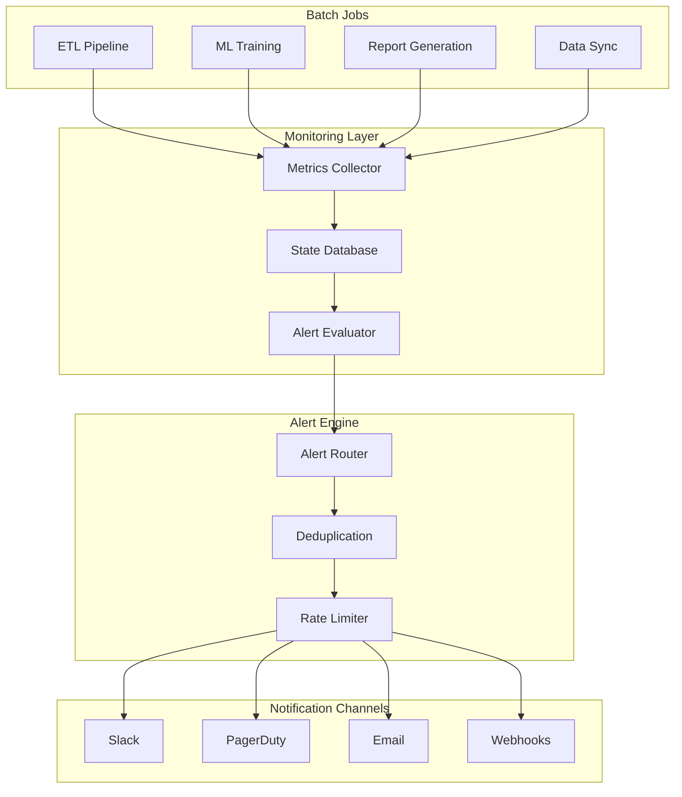
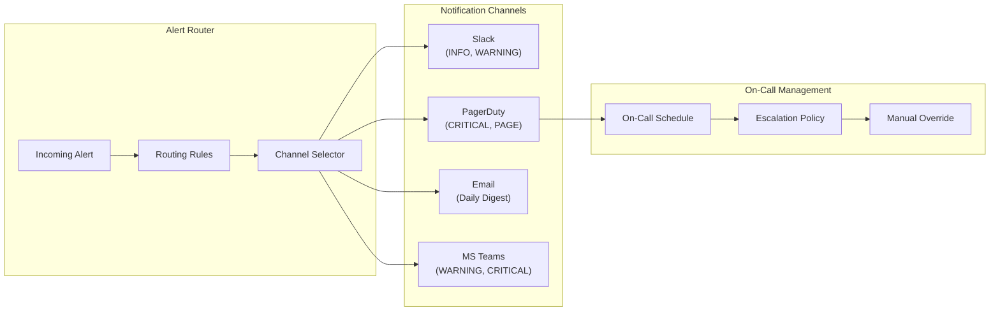
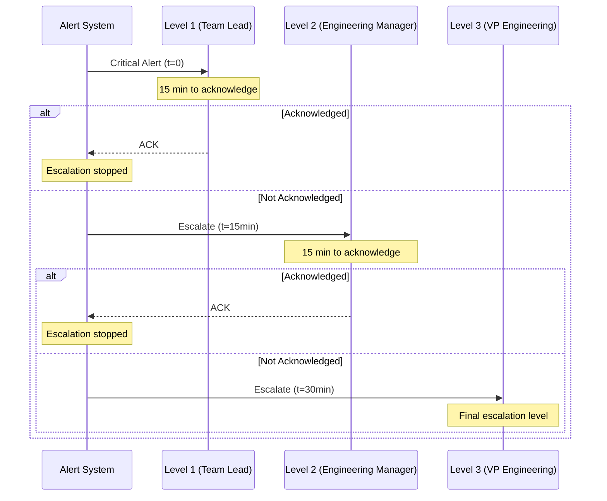

# How to Build Batch Alerting

Author: [nawazdhandala](https://github.com/nawazdhandala)

Tags: Batch Processing, Alerting, SLA, Data Pipelines

Description: Learn to build batch alerting for notifying teams about job failures, SLA breaches, and data quality issues.

---

Batch processing jobs are the backbone of modern data infrastructure. They power everything from ETL pipelines to machine learning model training. However, when these jobs fail silently or miss their deadlines, the consequences can be severe. This guide walks you through building a robust batch alerting system that keeps your team informed without overwhelming them with noise.

## Why Batch Alerting Matters

Unlike real-time systems where failures are immediately visible, batch jobs often run in the background during off-peak hours. A failed nightly data sync might go unnoticed until a business user complains about stale dashboards the next morning. Effective batch alerting bridges this gap by proactively notifying the right people at the right time.

## Architecture Overview

Before diving into implementation details, let us understand the high-level architecture of a batch alerting system.



## Core Components

### 1. Job State Tracking

The foundation of batch alerting is accurate job state tracking. Every batch job should report its status to a central monitoring system.

```python
# job_tracker.py
# This module provides utilities for tracking batch job execution states
# and emitting metrics for alerting purposes.

from dataclasses import dataclass, field
from datetime import datetime, timedelta
from enum import Enum
from typing import Optional, Dict, Any
import json
import redis


class JobStatus(Enum):
    """Enumeration of possible job states throughout execution lifecycle."""
    PENDING = "pending"      # Job is scheduled but not yet started
    RUNNING = "running"      # Job is currently executing
    SUCCESS = "success"      # Job completed successfully
    FAILED = "failed"        # Job encountered an error and terminated
    TIMEOUT = "timeout"      # Job exceeded its maximum allowed runtime
    SKIPPED = "skipped"      # Job was intentionally skipped (e.g., no data to process)


@dataclass
class JobExecution:
    """
    Represents a single execution instance of a batch job.

    Attributes:
        job_id: Unique identifier for the job definition
        execution_id: Unique identifier for this specific run
        status: Current state of the job execution
        start_time: When the job began executing
        end_time: When the job finished (None if still running)
        metadata: Additional context about the execution
        error_message: Description of failure if status is FAILED
        records_processed: Count of items processed (for data jobs)
    """
    job_id: str
    execution_id: str
    status: JobStatus
    start_time: datetime
    end_time: Optional[datetime] = None
    metadata: Dict[str, Any] = field(default_factory=dict)
    error_message: Optional[str] = None
    records_processed: int = 0

    @property
    def duration_seconds(self) -> Optional[float]:
        """Calculate execution duration in seconds."""
        if self.end_time and self.start_time:
            return (self.end_time - self.start_time).total_seconds()
        return None

    def to_dict(self) -> Dict[str, Any]:
        """Serialize execution data for storage."""
        return {
            "job_id": self.job_id,
            "execution_id": self.execution_id,
            "status": self.status.value,
            "start_time": self.start_time.isoformat(),
            "end_time": self.end_time.isoformat() if self.end_time else None,
            "metadata": self.metadata,
            "error_message": self.error_message,
            "records_processed": self.records_processed
        }


class JobTracker:
    """
    Central service for tracking batch job executions.

    Uses Redis for fast state storage and retrieval. Each job execution
    is stored with a TTL to prevent unbounded storage growth.
    """

    def __init__(self, redis_client: redis.Redis, retention_days: int = 30):
        """
        Initialize the job tracker.

        Args:
            redis_client: Connected Redis client instance
            retention_days: How long to retain job execution records
        """
        self.redis = redis_client
        self.retention_seconds = retention_days * 24 * 60 * 60

    def start_execution(self, job_id: str, execution_id: str,
                        metadata: Optional[Dict[str, Any]] = None) -> JobExecution:
        """
        Record the start of a job execution.

        Args:
            job_id: The job definition identifier
            execution_id: Unique ID for this execution run
            metadata: Optional context information

        Returns:
            JobExecution object representing this run
        """
        execution = JobExecution(
            job_id=job_id,
            execution_id=execution_id,
            status=JobStatus.RUNNING,
            start_time=datetime.utcnow(),
            metadata=metadata or {}
        )

        # Store in Redis with structured key for efficient querying
        key = f"job_execution:{job_id}:{execution_id}"
        self.redis.setex(
            key,
            self.retention_seconds,
            json.dumps(execution.to_dict())
        )

        # Also update the latest execution pointer for this job
        self.redis.set(f"job_latest:{job_id}", execution_id)

        return execution

    def complete_execution(self, execution: JobExecution, status: JobStatus,
                          error_message: Optional[str] = None,
                          records_processed: int = 0) -> JobExecution:
        """
        Mark a job execution as complete with final status.

        Args:
            execution: The execution object to update
            status: Final status (SUCCESS, FAILED, etc.)
            error_message: Error details if failed
            records_processed: Number of records handled

        Returns:
            Updated JobExecution object
        """
        execution.status = status
        execution.end_time = datetime.utcnow()
        execution.error_message = error_message
        execution.records_processed = records_processed

        # Update the stored record
        key = f"job_execution:{execution.job_id}:{execution.execution_id}"
        self.redis.setex(
            key,
            self.retention_seconds,
            json.dumps(execution.to_dict())
        )

        # Emit metrics for the alerting system to evaluate
        self._emit_completion_metrics(execution)

        return execution

    def _emit_completion_metrics(self, execution: JobExecution) -> None:
        """
        Publish job completion metrics for downstream alerting.

        Metrics are published to a Redis stream that the alert
        evaluator subscribes to for real-time processing.
        """
        metrics = {
            "job_id": execution.job_id,
            "execution_id": execution.execution_id,
            "status": execution.status.value,
            "duration_seconds": execution.duration_seconds,
            "records_processed": execution.records_processed,
            "timestamp": datetime.utcnow().isoformat()
        }

        # Add to metrics stream for alert evaluation
        self.redis.xadd(
            "job_metrics_stream",
            metrics,
            maxlen=100000  # Keep last 100k metrics
        )
```

### 2. Alert Condition Definitions

Define what conditions should trigger alerts. A flexible configuration system allows teams to customize alerting behavior without code changes.

```python
# alert_conditions.py
# Defines the alert condition types and evaluation logic for batch jobs.

from abc import ABC, abstractmethod
from dataclasses import dataclass
from datetime import datetime, timedelta
from enum import Enum
from typing import List, Optional, Dict, Any
import re


class AlertSeverity(Enum):
    """Alert severity levels following standard incident management practices."""
    INFO = "info"           # Informational, no action required
    WARNING = "warning"     # Potential issue, monitor closely
    CRITICAL = "critical"   # Immediate attention required
    PAGE = "page"           # Wake someone up, production is impacted


class AlertConditionType(Enum):
    """Types of conditions that can trigger batch job alerts."""
    JOB_FAILURE = "job_failure"           # Job terminated with error
    SLA_BREACH = "sla_breach"             # Job missed its deadline
    DURATION_ANOMALY = "duration_anomaly" # Job took unusually long or short
    NO_DATA = "no_data"                   # Job processed zero records
    DATA_QUALITY = "data_quality"         # Data validation failures
    MISSING_RUN = "missing_run"           # Expected job did not start


@dataclass
class AlertCondition:
    """
    Configuration for a single alert condition.

    Attributes:
        condition_type: The type of condition being checked
        job_pattern: Regex pattern to match job IDs (e.g., "etl_.*" for all ETL jobs)
        severity: How urgent is this alert
        threshold: Numeric threshold for the condition (meaning varies by type)
        message_template: Template for alert message with {placeholders}
        enabled: Whether this condition is actively evaluated
    """
    condition_type: AlertConditionType
    job_pattern: str
    severity: AlertSeverity
    threshold: Optional[float] = None
    message_template: str = ""
    enabled: bool = True

    def matches_job(self, job_id: str) -> bool:
        """Check if this condition applies to the given job."""
        return bool(re.match(self.job_pattern, job_id))


class AlertConditionEvaluator(ABC):
    """Base class for condition evaluation logic."""

    @abstractmethod
    def evaluate(self, execution: Dict[str, Any],
                 condition: AlertCondition) -> Optional[Dict[str, Any]]:
        """
        Evaluate whether an alert should fire.

        Args:
            execution: Job execution data
            condition: The condition configuration to check

        Returns:
            Alert details dict if condition is met, None otherwise
        """
        pass


class JobFailureEvaluator(AlertConditionEvaluator):
    """Evaluates job failure conditions."""

    def evaluate(self, execution: Dict[str, Any],
                 condition: AlertCondition) -> Optional[Dict[str, Any]]:
        """Check if job failed and generate alert if so."""
        if execution.get("status") != "failed":
            return None

        return {
            "condition_type": AlertConditionType.JOB_FAILURE.value,
            "job_id": execution["job_id"],
            "execution_id": execution["execution_id"],
            "severity": condition.severity.value,
            "message": condition.message_template.format(
                job_id=execution["job_id"],
                error=execution.get("error_message", "Unknown error"),
                execution_id=execution["execution_id"]
            ),
            "timestamp": datetime.utcnow().isoformat()
        }


class SLABreachEvaluator(AlertConditionEvaluator):
    """
    Evaluates SLA breach conditions.

    SLAs are defined as maximum allowed duration in seconds.
    If a job exceeds this threshold, an alert is triggered.
    """

    def evaluate(self, execution: Dict[str, Any],
                 condition: AlertCondition) -> Optional[Dict[str, Any]]:
        """Check if job exceeded its SLA duration threshold."""
        duration = execution.get("duration_seconds")

        # Can only evaluate if we have duration data
        if duration is None or condition.threshold is None:
            return None

        # Check if duration exceeds the SLA threshold
        if duration <= condition.threshold:
            return None

        breach_amount = duration - condition.threshold
        breach_percentage = (breach_amount / condition.threshold) * 100

        return {
            "condition_type": AlertConditionType.SLA_BREACH.value,
            "job_id": execution["job_id"],
            "execution_id": execution["execution_id"],
            "severity": condition.severity.value,
            "message": condition.message_template.format(
                job_id=execution["job_id"],
                duration=duration,
                threshold=condition.threshold,
                breach_percentage=round(breach_percentage, 1)
            ),
            "actual_duration": duration,
            "sla_threshold": condition.threshold,
            "timestamp": datetime.utcnow().isoformat()
        }


class DurationAnomalyEvaluator(AlertConditionEvaluator):
    """
    Evaluates duration anomalies based on historical data.

    Uses a simple standard deviation approach to detect jobs
    that run significantly faster or slower than normal.
    """

    def __init__(self, history_provider):
        """
        Args:
            history_provider: Service to fetch historical execution data
        """
        self.history = history_provider

    def evaluate(self, execution: Dict[str, Any],
                 condition: AlertCondition) -> Optional[Dict[str, Any]]:
        """Detect if job duration is anomalous compared to history."""
        duration = execution.get("duration_seconds")
        if duration is None:
            return None

        # Fetch historical durations for this job
        job_id = execution["job_id"]
        historical = self.history.get_recent_durations(job_id, days=14)

        if len(historical) < 5:
            # Not enough history to establish baseline
            return None

        # Calculate mean and standard deviation
        mean_duration = sum(historical) / len(historical)
        variance = sum((d - mean_duration) ** 2 for d in historical) / len(historical)
        std_dev = variance ** 0.5

        # Threshold is number of standard deviations (default 3)
        num_std_devs = condition.threshold or 3.0

        # Check if current duration is anomalous
        deviation = abs(duration - mean_duration)
        if deviation <= (num_std_devs * std_dev):
            return None

        direction = "slower" if duration > mean_duration else "faster"

        return {
            "condition_type": AlertConditionType.DURATION_ANOMALY.value,
            "job_id": job_id,
            "execution_id": execution["execution_id"],
            "severity": condition.severity.value,
            "message": condition.message_template.format(
                job_id=job_id,
                duration=round(duration, 1),
                mean=round(mean_duration, 1),
                direction=direction
            ),
            "actual_duration": duration,
            "expected_duration": mean_duration,
            "timestamp": datetime.utcnow().isoformat()
        }


class NoDataEvaluator(AlertConditionEvaluator):
    """Evaluates conditions where jobs process zero records."""

    def evaluate(self, execution: Dict[str, Any],
                 condition: AlertCondition) -> Optional[Dict[str, Any]]:
        """Check if a completed job processed no records."""
        # Only alert on successful jobs with no data
        # Failed jobs will trigger failure alerts instead
        if execution.get("status") != "success":
            return None

        records = execution.get("records_processed", 0)
        if records > 0:
            return None

        return {
            "condition_type": AlertConditionType.NO_DATA.value,
            "job_id": execution["job_id"],
            "execution_id": execution["execution_id"],
            "severity": condition.severity.value,
            "message": condition.message_template.format(
                job_id=execution["job_id"],
                execution_id=execution["execution_id"]
            ),
            "timestamp": datetime.utcnow().isoformat()
        }
```

### 3. SLA Configuration

Service Level Agreements (SLAs) define when batch jobs must complete. Here is a configuration-driven approach to SLA management.

```yaml
# sla_config.yaml
# Define SLA requirements for batch jobs.
# Times are in the job's configured timezone.

defaults:
  # Default SLA settings applied to all jobs unless overridden
  timezone: "America/New_York"
  grace_period_minutes: 15

jobs:
  # Daily ETL job must complete by 6 AM
  daily_etl_main:
    deadline: "06:00"
    max_duration_minutes: 120
    severity_escalation:
      warning_minutes_before: 30   # Warn 30 min before deadline
      critical_minutes_before: 15  # Critical 15 min before
    business_days_only: false

  # Report generation for business users
  daily_sales_report:
    deadline: "08:00"
    max_duration_minutes: 45
    severity_escalation:
      warning_minutes_before: 60
      critical_minutes_before: 30
    business_days_only: true  # Only runs Mon-Fri

  # Hourly sync job has tighter SLAs
  hourly_data_sync:
    deadline_offset_minutes: 45  # Must complete within 45 min of each hour
    max_duration_minutes: 30
    severity_escalation:
      warning_minutes_before: 10
      critical_minutes_before: 5

  # Weekly ML model training
  weekly_model_training:
    schedule: "sunday"
    deadline: "23:00"
    max_duration_minutes: 480  # 8 hours
    severity_escalation:
      warning_minutes_before: 120
      critical_minutes_before: 60
```

```python
# sla_manager.py
# Manages SLA definitions and evaluates job compliance.

from dataclasses import dataclass
from datetime import datetime, time, timedelta
from typing import Optional, Dict, Any
import yaml
from zoneinfo import ZoneInfo


@dataclass
class SLADefinition:
    """
    Represents the SLA requirements for a single batch job.

    Attributes:
        job_id: The job this SLA applies to
        deadline: Time by which job must complete (for daily jobs)
        deadline_offset_minutes: Minutes after schedule start to complete (for frequent jobs)
        max_duration_minutes: Maximum allowed runtime
        timezone: Timezone for deadline evaluation
        warning_minutes_before: When to send warning alert
        critical_minutes_before: When to escalate to critical
        business_days_only: Whether to skip weekends and holidays
    """
    job_id: str
    deadline: Optional[time] = None
    deadline_offset_minutes: Optional[int] = None
    max_duration_minutes: int = 60
    timezone: str = "UTC"
    warning_minutes_before: int = 30
    critical_minutes_before: int = 15
    business_days_only: bool = False


class SLAManager:
    """
    Manages SLA definitions and provides compliance evaluation.

    Loads SLA configuration from YAML and provides methods to
    check if jobs are meeting their service level agreements.
    """

    def __init__(self, config_path: str):
        """
        Initialize the SLA manager with configuration.

        Args:
            config_path: Path to the SLA configuration YAML file
        """
        self.config_path = config_path
        self.slas: Dict[str, SLADefinition] = {}
        self.defaults: Dict[str, Any] = {}
        self._load_config()

    def _load_config(self) -> None:
        """Load and parse the SLA configuration file."""
        with open(self.config_path, 'r') as f:
            config = yaml.safe_load(f)

        self.defaults = config.get('defaults', {})

        for job_id, job_config in config.get('jobs', {}).items():
            self.slas[job_id] = self._parse_job_sla(job_id, job_config)

    def _parse_job_sla(self, job_id: str, config: Dict[str, Any]) -> SLADefinition:
        """Parse a single job's SLA configuration."""
        # Start with defaults
        timezone = config.get('timezone', self.defaults.get('timezone', 'UTC'))

        # Parse deadline time if specified
        deadline = None
        if 'deadline' in config:
            hour, minute = map(int, config['deadline'].split(':'))
            deadline = time(hour, minute)

        # Get escalation settings
        escalation = config.get('severity_escalation', {})

        return SLADefinition(
            job_id=job_id,
            deadline=deadline,
            deadline_offset_minutes=config.get('deadline_offset_minutes'),
            max_duration_minutes=config.get('max_duration_minutes', 60),
            timezone=timezone,
            warning_minutes_before=escalation.get('warning_minutes_before', 30),
            critical_minutes_before=escalation.get('critical_minutes_before', 15),
            business_days_only=config.get('business_days_only', False)
        )

    def get_sla(self, job_id: str) -> Optional[SLADefinition]:
        """Retrieve the SLA definition for a job."""
        return self.slas.get(job_id)

    def check_deadline_compliance(self, job_id: str,
                                   completion_time: datetime) -> Dict[str, Any]:
        """
        Check if a job met its deadline.

        Args:
            job_id: The job to check
            completion_time: When the job finished (UTC)

        Returns:
            Dict with compliance status and details
        """
        sla = self.get_sla(job_id)
        if not sla or not sla.deadline:
            return {"compliant": True, "reason": "No deadline defined"}

        # Convert completion time to job's timezone
        tz = ZoneInfo(sla.timezone)
        local_completion = completion_time.astimezone(tz)

        # Check if this is a business day (if required)
        if sla.business_days_only and local_completion.weekday() >= 5:
            return {"compliant": True, "reason": "Non-business day"}

        # Build the deadline datetime for today
        deadline_dt = datetime.combine(
            local_completion.date(),
            sla.deadline,
            tzinfo=tz
        )

        # Calculate time difference
        time_diff = (local_completion - deadline_dt).total_seconds() / 60

        if time_diff <= 0:
            return {
                "compliant": True,
                "minutes_before_deadline": abs(time_diff),
                "deadline": deadline_dt.isoformat()
            }
        else:
            return {
                "compliant": False,
                "minutes_after_deadline": time_diff,
                "deadline": deadline_dt.isoformat(),
                "severity": self._determine_breach_severity(sla, time_diff)
            }

    def _determine_breach_severity(self, sla: SLADefinition,
                                    minutes_late: float) -> str:
        """Determine alert severity based on how late the job is."""
        if minutes_late > sla.critical_minutes_before:
            return "critical"
        elif minutes_late > sla.warning_minutes_before:
            return "warning"
        return "info"

    def get_approaching_deadlines(self, current_time: datetime,
                                   running_jobs: Dict[str, datetime]) -> list:
        """
        Find jobs that are approaching their SLA deadlines.

        This is used for proactive alerting before deadlines are missed.

        Args:
            current_time: Current timestamp (UTC)
            running_jobs: Dict of job_id to start_time for running jobs

        Returns:
            List of jobs approaching their deadlines with severity
        """
        approaching = []

        for job_id, start_time in running_jobs.items():
            sla = self.get_sla(job_id)
            if not sla or not sla.deadline:
                continue

            # Convert to job timezone
            tz = ZoneInfo(sla.timezone)
            local_time = current_time.astimezone(tz)

            # Build deadline for today
            deadline_dt = datetime.combine(
                local_time.date(),
                sla.deadline,
                tzinfo=tz
            )

            # Calculate minutes until deadline
            minutes_until = (deadline_dt - local_time).total_seconds() / 60

            # Check if we should alert
            if minutes_until <= sla.warning_minutes_before:
                severity = "critical" if minutes_until <= sla.critical_minutes_before else "warning"
                approaching.append({
                    "job_id": job_id,
                    "deadline": deadline_dt.isoformat(),
                    "minutes_remaining": round(minutes_until, 1),
                    "severity": severity,
                    "running_since": start_time.isoformat()
                })

        return approaching
```

## Notification Channel Implementation

Different alert severities should route to appropriate notification channels. Here is a flexible multi-channel notification system.



```python
# notification_channels.py
# Implements various notification channel integrations.

from abc import ABC, abstractmethod
from dataclasses import dataclass
from datetime import datetime
from typing import Dict, Any, List, Optional
import json
import httpx
import asyncio


@dataclass
class NotificationPayload:
    """
    Standardized notification payload that channels receive.

    Attributes:
        alert_id: Unique identifier for this alert
        title: Brief summary of the alert
        message: Detailed alert message
        severity: Alert severity level
        job_id: The batch job that triggered this alert
        metadata: Additional context and data
        timestamp: When the alert was generated
    """
    alert_id: str
    title: str
    message: str
    severity: str
    job_id: str
    metadata: Dict[str, Any]
    timestamp: datetime


class NotificationChannel(ABC):
    """Abstract base class for notification channel implementations."""

    @abstractmethod
    async def send(self, payload: NotificationPayload) -> bool:
        """
        Send a notification through this channel.

        Args:
            payload: The notification to send

        Returns:
            True if notification was sent successfully
        """
        pass

    @abstractmethod
    def supports_severity(self, severity: str) -> bool:
        """Check if this channel handles the given severity level."""
        pass


class SlackChannel(NotificationChannel):
    """
    Slack notification channel using incoming webhooks.

    Formats alerts as rich Slack messages with color-coded
    attachments based on severity.
    """

    # Severity to Slack color mapping
    SEVERITY_COLORS = {
        "info": "#36a64f",      # Green
        "warning": "#ffcc00",    # Yellow
        "critical": "#ff0000",   # Red
        "page": "#8b0000"        # Dark red
    }

    def __init__(self, webhook_url: str, channel: str = "#alerts",
                 supported_severities: Optional[List[str]] = None):
        """
        Initialize Slack channel.

        Args:
            webhook_url: Slack incoming webhook URL
            channel: Default channel to post to
            supported_severities: List of severities this channel handles
        """
        self.webhook_url = webhook_url
        self.channel = channel
        self.supported = supported_severities or ["info", "warning", "critical"]

    def supports_severity(self, severity: str) -> bool:
        """Check if Slack should handle this severity."""
        return severity in self.supported

    async def send(self, payload: NotificationPayload) -> bool:
        """Send alert to Slack with rich formatting."""
        # Build the Slack message payload
        slack_message = {
            "channel": self.channel,
            "username": "Batch Alert Bot",
            "icon_emoji": self._get_emoji(payload.severity),
            "attachments": [
                {
                    "color": self.SEVERITY_COLORS.get(payload.severity, "#808080"),
                    "title": payload.title,
                    "text": payload.message,
                    "fields": [
                        {
                            "title": "Job ID",
                            "value": payload.job_id,
                            "short": True
                        },
                        {
                            "title": "Severity",
                            "value": payload.severity.upper(),
                            "short": True
                        },
                        {
                            "title": "Time",
                            "value": payload.timestamp.strftime("%Y-%m-%d %H:%M:%S UTC"),
                            "short": True
                        },
                        {
                            "title": "Alert ID",
                            "value": payload.alert_id,
                            "short": True
                        }
                    ],
                    "footer": "Batch Alerting System",
                    "ts": int(payload.timestamp.timestamp())
                }
            ]
        }

        # Add any relevant metadata as additional fields
        if payload.metadata:
            for key, value in list(payload.metadata.items())[:4]:
                slack_message["attachments"][0]["fields"].append({
                    "title": key.replace("_", " ").title(),
                    "value": str(value),
                    "short": True
                })

        # Send to Slack
        async with httpx.AsyncClient() as client:
            try:
                response = await client.post(
                    self.webhook_url,
                    json=slack_message,
                    timeout=10.0
                )
                return response.status_code == 200
            except httpx.RequestError as e:
                print(f"Failed to send Slack notification: {e}")
                return False

    def _get_emoji(self, severity: str) -> str:
        """Get appropriate emoji for severity level."""
        emojis = {
            "info": ":information_source:",
            "warning": ":warning:",
            "critical": ":rotating_light:",
            "page": ":fire:"
        }
        return emojis.get(severity, ":bell:")


class PagerDutyChannel(NotificationChannel):
    """
    PagerDuty integration for critical and page-level alerts.

    Creates incidents in PagerDuty that follow the configured
    escalation policies.
    """

    def __init__(self, routing_key: str,
                 supported_severities: Optional[List[str]] = None):
        """
        Initialize PagerDuty channel.

        Args:
            routing_key: PagerDuty Events API v2 routing key
            supported_severities: Severities to handle (default: critical, page)
        """
        self.routing_key = routing_key
        self.events_url = "https://events.pagerduty.com/v2/enqueue"
        self.supported = supported_severities or ["critical", "page"]

    def supports_severity(self, severity: str) -> bool:
        """Check if PagerDuty should handle this severity."""
        return severity in self.supported

    async def send(self, payload: NotificationPayload) -> bool:
        """Create a PagerDuty incident for the alert."""
        # Map our severity to PagerDuty severity
        pd_severity = "critical" if payload.severity == "page" else payload.severity

        # Build PagerDuty event payload
        pd_event = {
            "routing_key": self.routing_key,
            "event_action": "trigger",
            "dedup_key": f"batch_alert_{payload.job_id}_{payload.alert_id}",
            "payload": {
                "summary": payload.title,
                "source": "batch-alerting-system",
                "severity": pd_severity,
                "timestamp": payload.timestamp.isoformat(),
                "component": payload.job_id,
                "group": "batch-jobs",
                "class": payload.metadata.get("condition_type", "unknown"),
                "custom_details": {
                    "message": payload.message,
                    "job_id": payload.job_id,
                    "alert_id": payload.alert_id,
                    **payload.metadata
                }
            },
            "links": [
                {
                    "href": f"https://monitoring.example.com/jobs/{payload.job_id}",
                    "text": "View Job Details"
                }
            ]
        }

        # Send to PagerDuty
        async with httpx.AsyncClient() as client:
            try:
                response = await client.post(
                    self.events_url,
                    json=pd_event,
                    timeout=10.0
                )
                return response.status_code == 202
            except httpx.RequestError as e:
                print(f"Failed to send PagerDuty notification: {e}")
                return False


class EmailChannel(NotificationChannel):
    """
    Email notification channel for digest-style notifications.

    Typically used for non-urgent alerts that can be batched
    into periodic summaries.
    """

    def __init__(self, smtp_config: Dict[str, Any],
                 recipients: List[str],
                 supported_severities: Optional[List[str]] = None):
        """
        Initialize email channel.

        Args:
            smtp_config: SMTP server configuration
            recipients: List of email addresses to notify
            supported_severities: Severities to handle
        """
        self.smtp_config = smtp_config
        self.recipients = recipients
        self.supported = supported_severities or ["info", "warning"]

    def supports_severity(self, severity: str) -> bool:
        """Check if email should handle this severity."""
        return severity in self.supported

    async def send(self, payload: NotificationPayload) -> bool:
        """
        Queue email for sending.

        In production, this would integrate with an email service.
        For digest mode, emails are batched and sent periodically.
        """
        # Build email content
        email_body = f"""
        Batch Job Alert
        ================

        Job ID: {payload.job_id}
        Severity: {payload.severity.upper()}
        Time: {payload.timestamp.strftime("%Y-%m-%d %H:%M:%S UTC")}

        {payload.title}

        {payload.message}

        Additional Details:
        {json.dumps(payload.metadata, indent=2)}

        ---
        Alert ID: {payload.alert_id}
        """

        # In production, use aiosmtplib or similar
        # This is a simplified example
        print(f"Would send email to {self.recipients}: {payload.title}")
        return True


class NotificationRouter:
    """
    Routes alerts to appropriate notification channels based on severity
    and other routing rules.
    """

    def __init__(self):
        """Initialize the router with empty channel list."""
        self.channels: List[NotificationChannel] = []

    def register_channel(self, channel: NotificationChannel) -> None:
        """Add a notification channel to the router."""
        self.channels.append(channel)

    async def route_alert(self, payload: NotificationPayload) -> Dict[str, bool]:
        """
        Route an alert to all applicable channels.

        Args:
            payload: The alert notification to route

        Returns:
            Dict mapping channel type to success status
        """
        results = {}

        # Find all channels that handle this severity
        applicable_channels = [
            ch for ch in self.channels
            if ch.supports_severity(payload.severity)
        ]

        if not applicable_channels:
            print(f"No channels configured for severity: {payload.severity}")
            return results

        # Send to all applicable channels concurrently
        tasks = [ch.send(payload) for ch in applicable_channels]
        send_results = await asyncio.gather(*tasks, return_exceptions=True)

        # Map results to channel types
        for channel, result in zip(applicable_channels, send_results):
            channel_name = channel.__class__.__name__
            if isinstance(result, Exception):
                results[channel_name] = False
                print(f"Channel {channel_name} failed: {result}")
            else:
                results[channel_name] = result

        return results
```

## Escalation Policies

When alerts are not acknowledged, they should escalate to ensure someone responds. Here is an escalation policy implementation.



```python
# escalation_policy.py
# Implements escalation policies for unacknowledged alerts.

from dataclasses import dataclass, field
from datetime import datetime, timedelta
from enum import Enum
from typing import List, Dict, Any, Optional, Callable
import asyncio


class EscalationStatus(Enum):
    """Status of an alert in the escalation process."""
    PENDING = "pending"           # Awaiting acknowledgment
    ACKNOWLEDGED = "acknowledged"  # Someone has taken ownership
    ESCALATED = "escalated"       # Moved to next level
    RESOLVED = "resolved"         # Issue has been fixed
    SUPPRESSED = "suppressed"     # Manually suppressed


@dataclass
class EscalationLevel:
    """
    Represents a single level in an escalation policy.

    Attributes:
        level: Numeric level (1 = first responders)
        name: Human-readable name for this level
        targets: List of user IDs or group IDs to notify
        timeout_minutes: How long to wait before escalating further
        notification_channels: Which channels to use at this level
    """
    level: int
    name: str
    targets: List[str]
    timeout_minutes: int
    notification_channels: List[str] = field(default_factory=lambda: ["slack"])


@dataclass
class EscalationPolicy:
    """
    Defines the complete escalation path for alerts.

    Attributes:
        policy_id: Unique identifier for this policy
        name: Human-readable policy name
        levels: Ordered list of escalation levels
        repeat_after_minutes: If set, restart escalation after this time
    """
    policy_id: str
    name: str
    levels: List[EscalationLevel]
    repeat_after_minutes: Optional[int] = None


@dataclass
class EscalatingAlert:
    """
    Tracks the escalation state of a single alert.

    Attributes:
        alert_id: The alert being tracked
        policy: The escalation policy being followed
        current_level: Current escalation level (0-indexed)
        status: Current status of the alert
        created_at: When the alert was first triggered
        last_escalation: When the last escalation occurred
        acknowledged_by: User who acknowledged (if any)
        acknowledged_at: When acknowledgment occurred
    """
    alert_id: str
    policy: EscalationPolicy
    current_level: int = 0
    status: EscalationStatus = EscalationStatus.PENDING
    created_at: datetime = field(default_factory=datetime.utcnow)
    last_escalation: Optional[datetime] = None
    acknowledged_by: Optional[str] = None
    acknowledged_at: Optional[datetime] = None


class EscalationManager:
    """
    Manages the escalation lifecycle for alerts.

    Tracks active alerts and automatically escalates them
    based on their assigned policies when not acknowledged.
    """

    def __init__(self, notification_callback: Callable):
        """
        Initialize the escalation manager.

        Args:
            notification_callback: Async function to call when notifying.
                                   Signature: (alert_id, level, targets) -> bool
        """
        self.active_alerts: Dict[str, EscalatingAlert] = {}
        self.policies: Dict[str, EscalationPolicy] = {}
        self.notify = notification_callback
        self._running = False

    def register_policy(self, policy: EscalationPolicy) -> None:
        """Register an escalation policy for use."""
        self.policies[policy.policy_id] = policy

    async def start_escalation(self, alert_id: str, policy_id: str,
                                initial_payload: Dict[str, Any]) -> None:
        """
        Begin escalation tracking for a new alert.

        Args:
            alert_id: Unique identifier for the alert
            policy_id: Which escalation policy to use
            initial_payload: Alert data to include in notifications
        """
        policy = self.policies.get(policy_id)
        if not policy:
            raise ValueError(f"Unknown escalation policy: {policy_id}")

        if not policy.levels:
            raise ValueError(f"Policy {policy_id} has no escalation levels")

        # Create tracking record
        escalating = EscalatingAlert(
            alert_id=alert_id,
            policy=policy,
            last_escalation=datetime.utcnow()
        )
        self.active_alerts[alert_id] = escalating

        # Notify first level immediately
        first_level = policy.levels[0]
        await self.notify(
            alert_id=alert_id,
            level=first_level,
            payload=initial_payload
        )

    async def acknowledge(self, alert_id: str, user_id: str) -> bool:
        """
        Acknowledge an alert, stopping further escalation.

        Args:
            alert_id: The alert to acknowledge
            user_id: Who is acknowledging

        Returns:
            True if acknowledgment was recorded
        """
        alert = self.active_alerts.get(alert_id)
        if not alert:
            return False

        if alert.status != EscalationStatus.PENDING:
            return False

        alert.status = EscalationStatus.ACKNOWLEDGED
        alert.acknowledged_by = user_id
        alert.acknowledged_at = datetime.utcnow()

        return True

    async def resolve(self, alert_id: str) -> bool:
        """
        Mark an alert as resolved.

        Args:
            alert_id: The alert to resolve

        Returns:
            True if resolution was recorded
        """
        alert = self.active_alerts.get(alert_id)
        if not alert:
            return False

        alert.status = EscalationStatus.RESOLVED

        # Remove from active tracking after a delay
        # (keeps brief history for debugging)
        asyncio.create_task(self._cleanup_resolved(alert_id, delay_seconds=300))

        return True

    async def _cleanup_resolved(self, alert_id: str, delay_seconds: int) -> None:
        """Remove resolved alert from tracking after delay."""
        await asyncio.sleep(delay_seconds)
        self.active_alerts.pop(alert_id, None)

    async def check_escalations(self) -> None:
        """
        Check all active alerts for escalation.

        This should be called periodically (e.g., every minute)
        by the main alert processing loop.
        """
        now = datetime.utcnow()

        for alert_id, alert in list(self.active_alerts.items()):
            # Skip non-pending alerts
            if alert.status != EscalationStatus.PENDING:
                continue

            # Get current level configuration
            if alert.current_level >= len(alert.policy.levels):
                # Already at maximum escalation
                continue

            current_level = alert.policy.levels[alert.current_level]

            # Check if timeout has passed
            time_since_last = now - (alert.last_escalation or alert.created_at)
            if time_since_last < timedelta(minutes=current_level.timeout_minutes):
                continue

            # Time to escalate
            await self._escalate_alert(alert)

    async def _escalate_alert(self, alert: EscalatingAlert) -> None:
        """Escalate an alert to the next level."""
        next_level_idx = alert.current_level + 1

        if next_level_idx >= len(alert.policy.levels):
            # Check if we should repeat the escalation
            if alert.policy.repeat_after_minutes:
                # Reset to first level
                alert.current_level = 0
                alert.last_escalation = datetime.utcnow()
                await self.notify(
                    alert_id=alert.alert_id,
                    level=alert.policy.levels[0],
                    payload={"escalation_note": "Escalation cycle repeated"}
                )
            return

        # Move to next level
        alert.current_level = next_level_idx
        alert.last_escalation = datetime.utcnow()
        alert.status = EscalationStatus.ESCALATED

        next_level = alert.policy.levels[next_level_idx]
        await self.notify(
            alert_id=alert.alert_id,
            level=next_level,
            payload={"escalation_note": f"Escalated to level {next_level_idx + 1}"}
        )


# Example escalation policy definitions
DEFAULT_POLICIES = [
    EscalationPolicy(
        policy_id="standard",
        name="Standard Escalation",
        levels=[
            EscalationLevel(
                level=1,
                name="On-Call Engineer",
                targets=["oncall-primary"],
                timeout_minutes=15,
                notification_channels=["slack", "pagerduty"]
            ),
            EscalationLevel(
                level=2,
                name="Engineering Manager",
                targets=["eng-manager"],
                timeout_minutes=15,
                notification_channels=["slack", "pagerduty", "sms"]
            ),
            EscalationLevel(
                level=3,
                name="VP Engineering",
                targets=["vp-eng"],
                timeout_minutes=30,
                notification_channels=["pagerduty", "phone"]
            )
        ]
    ),
    EscalationPolicy(
        policy_id="business-hours",
        name="Business Hours Only",
        levels=[
            EscalationLevel(
                level=1,
                name="Team Lead",
                targets=["team-leads"],
                timeout_minutes=30,
                notification_channels=["slack", "email"]
            ),
            EscalationLevel(
                level=2,
                name="Department Manager",
                targets=["dept-manager"],
                timeout_minutes=60,
                notification_channels=["slack", "email"]
            )
        ]
    )
]
```

## Alert Fatigue Prevention

One of the biggest challenges with alerting systems is alert fatigue. Too many alerts lead to ignored alerts. Here are strategies to combat this.

```python
# alert_fatigue_prevention.py
# Implements strategies to reduce alert noise and prevent fatigue.

from collections import defaultdict
from dataclasses import dataclass, field
from datetime import datetime, timedelta
from typing import Dict, List, Optional, Set, Tuple
import hashlib


@dataclass
class AlertDeduplicationConfig:
    """
    Configuration for alert deduplication.

    Attributes:
        window_minutes: Time window for considering alerts as duplicates
        max_alerts_per_window: Maximum alerts before suppression kicks in
        dedup_keys: Fields to use for generating dedup signature
    """
    window_minutes: int = 60
    max_alerts_per_window: int = 3
    dedup_keys: List[str] = field(default_factory=lambda: ["job_id", "condition_type"])


@dataclass
class AlertThrottleConfig:
    """
    Configuration for alert rate limiting.

    Attributes:
        window_minutes: Time window for rate limiting
        max_alerts: Maximum alerts allowed in window
        cooldown_minutes: How long to suppress after hitting limit
    """
    window_minutes: int = 15
    max_alerts: int = 10
    cooldown_minutes: int = 30


class AlertDeduplicator:
    """
    Deduplicates alerts to prevent repeated notifications for the same issue.

    Uses a fingerprinting approach to identify duplicate alerts within
    a configurable time window.
    """

    def __init__(self, config: AlertDeduplicationConfig):
        """
        Initialize deduplicator.

        Args:
            config: Deduplication configuration
        """
        self.config = config
        # Maps fingerprint to list of (timestamp, alert_id) tuples
        self.seen_alerts: Dict[str, List[Tuple[datetime, str]]] = defaultdict(list)

    def _generate_fingerprint(self, alert: Dict) -> str:
        """
        Generate a fingerprint for deduplication.

        The fingerprint is based on configured dedup keys.
        """
        key_parts = []
        for key in self.config.dedup_keys:
            value = alert.get(key, "")
            key_parts.append(f"{key}={value}")

        fingerprint_input = "|".join(key_parts)
        return hashlib.md5(fingerprint_input.encode()).hexdigest()

    def _cleanup_old_entries(self, fingerprint: str, now: datetime) -> None:
        """Remove entries older than the dedup window."""
        cutoff = now - timedelta(minutes=self.config.window_minutes)
        self.seen_alerts[fingerprint] = [
            (ts, aid) for ts, aid in self.seen_alerts[fingerprint]
            if ts > cutoff
        ]

    def should_suppress(self, alert: Dict) -> Tuple[bool, Optional[str]]:
        """
        Check if an alert should be suppressed as a duplicate.

        Args:
            alert: The alert to check

        Returns:
            Tuple of (should_suppress, reason)
        """
        fingerprint = self._generate_fingerprint(alert)
        now = datetime.utcnow()

        # Clean up old entries first
        self._cleanup_old_entries(fingerprint, now)

        # Check how many alerts we have seen with this fingerprint
        recent_count = len(self.seen_alerts[fingerprint])

        if recent_count >= self.config.max_alerts_per_window:
            return True, f"Suppressed: {recent_count} similar alerts in last {self.config.window_minutes} minutes"

        # Record this alert
        alert_id = alert.get("alert_id", str(now.timestamp()))
        self.seen_alerts[fingerprint].append((now, alert_id))

        return False, None

    def get_suppression_stats(self) -> Dict[str, int]:
        """Get statistics about currently suppressed alert types."""
        stats = {}
        now = datetime.utcnow()

        for fingerprint, alerts in self.seen_alerts.items():
            # Count only recent alerts
            cutoff = now - timedelta(minutes=self.config.window_minutes)
            recent = [a for a in alerts if a[0] > cutoff]
            if len(recent) >= self.config.max_alerts_per_window:
                stats[fingerprint] = len(recent)

        return stats


class AlertThrottler:
    """
    Rate limits alerts to prevent overwhelming notification channels.

    When the alert rate exceeds thresholds, switches to digest mode
    or suppresses non-critical alerts.
    """

    def __init__(self, config: AlertThrottleConfig):
        """
        Initialize throttler.

        Args:
            config: Throttle configuration
        """
        self.config = config
        # Track alert timestamps per job
        self.alert_history: Dict[str, List[datetime]] = defaultdict(list)
        # Track when throttling started for each job
        self.throttle_start: Dict[str, datetime] = {}

    def _cleanup_old_entries(self, job_id: str, now: datetime) -> None:
        """Remove entries older than the throttle window."""
        cutoff = now - timedelta(minutes=self.config.window_minutes)
        self.alert_history[job_id] = [
            ts for ts in self.alert_history[job_id] if ts > cutoff
        ]

    def should_throttle(self, alert: Dict) -> Tuple[bool, Optional[str]]:
        """
        Check if an alert should be throttled.

        Args:
            alert: The alert to check

        Returns:
            Tuple of (should_throttle, reason)
        """
        job_id = alert.get("job_id", "unknown")
        severity = alert.get("severity", "info")
        now = datetime.utcnow()

        # Never throttle page-level alerts
        if severity == "page":
            return False, None

        # Check if we are in cooldown
        if job_id in self.throttle_start:
            cooldown_end = self.throttle_start[job_id] + timedelta(
                minutes=self.config.cooldown_minutes
            )
            if now < cooldown_end:
                remaining = (cooldown_end - now).seconds // 60
                return True, f"Throttled: cooldown active, {remaining} minutes remaining"
            else:
                # Cooldown expired
                del self.throttle_start[job_id]

        # Clean up and count recent alerts
        self._cleanup_old_entries(job_id, now)
        recent_count = len(self.alert_history[job_id])

        if recent_count >= self.config.max_alerts:
            # Start throttling
            self.throttle_start[job_id] = now
            return True, f"Throttled: {recent_count} alerts in {self.config.window_minutes} minutes"

        # Record this alert
        self.alert_history[job_id].append(now)

        return False, None


class AlertAggregator:
    """
    Aggregates multiple related alerts into summary notifications.

    Instead of sending 50 individual failure alerts, sends one
    summary: "50 jobs failed in the last hour".
    """

    def __init__(self, aggregation_window_minutes: int = 5,
                 min_alerts_to_aggregate: int = 5):
        """
        Initialize aggregator.

        Args:
            aggregation_window_minutes: Time window for collecting alerts
            min_alerts_to_aggregate: Minimum alerts before aggregating
        """
        self.window_minutes = aggregation_window_minutes
        self.min_alerts = min_alerts_to_aggregate
        # Buffer of alerts waiting for aggregation
        self.buffer: Dict[str, List[Dict]] = defaultdict(list)
        # Timestamp of last flush per category
        self.last_flush: Dict[str, datetime] = {}

    def _get_aggregation_key(self, alert: Dict) -> str:
        """Generate key for grouping related alerts."""
        # Group by condition type and severity
        condition = alert.get("condition_type", "unknown")
        severity = alert.get("severity", "info")
        return f"{condition}:{severity}"

    def add_alert(self, alert: Dict) -> Optional[Dict]:
        """
        Add an alert to the aggregation buffer.

        Args:
            alert: The alert to potentially aggregate

        Returns:
            Aggregated alert if threshold reached, None otherwise
        """
        key = self._get_aggregation_key(alert)
        now = datetime.utcnow()

        # Check if we should flush the buffer
        if key in self.last_flush:
            time_since_flush = now - self.last_flush[key]
            if time_since_flush >= timedelta(minutes=self.window_minutes):
                return self._flush_buffer(key)
        else:
            self.last_flush[key] = now

        # Add to buffer
        self.buffer[key].append(alert)

        # Check if we have enough to aggregate
        if len(self.buffer[key]) >= self.min_alerts:
            return self._flush_buffer(key)

        return None

    def _flush_buffer(self, key: str) -> Optional[Dict]:
        """
        Flush the buffer for a given key and create aggregated alert.

        Args:
            key: The aggregation key to flush

        Returns:
            Aggregated alert dict or None if buffer was empty
        """
        alerts = self.buffer.pop(key, [])
        self.last_flush[key] = datetime.utcnow()

        if not alerts:
            return None

        if len(alerts) == 1:
            # No need to aggregate a single alert
            return alerts[0]

        # Create aggregated summary
        condition_type, severity = key.split(":")
        job_ids = list(set(a.get("job_id", "unknown") for a in alerts))

        return {
            "alert_id": f"agg_{datetime.utcnow().timestamp()}",
            "condition_type": condition_type,
            "severity": severity,
            "title": f"Aggregated Alert: {len(alerts)} {condition_type} events",
            "message": self._build_aggregated_message(alerts, job_ids),
            "aggregated_count": len(alerts),
            "affected_jobs": job_ids[:10],  # Limit to first 10
            "total_affected_jobs": len(job_ids),
            "timestamp": datetime.utcnow().isoformat()
        }

    def _build_aggregated_message(self, alerts: List[Dict],
                                   job_ids: List[str]) -> str:
        """Build a summary message for aggregated alerts."""
        lines = [
            f"Aggregated {len(alerts)} alerts affecting {len(job_ids)} jobs:",
            ""
        ]

        # Group by job for the message
        by_job = defaultdict(list)
        for alert in alerts:
            job_id = alert.get("job_id", "unknown")
            by_job[job_id].append(alert)

        for job_id, job_alerts in list(by_job.items())[:5]:
            lines.append(f"  - {job_id}: {len(job_alerts)} alerts")

        if len(by_job) > 5:
            lines.append(f"  ... and {len(by_job) - 5} more jobs")

        return "\n".join(lines)

    def flush_all(self) -> List[Dict]:
        """
        Flush all buffered alerts.

        Called periodically to ensure alerts do not get stuck in buffer.
        """
        aggregated = []
        for key in list(self.buffer.keys()):
            result = self._flush_buffer(key)
            if result:
                aggregated.append(result)
        return aggregated


class SmartAlertFilter:
    """
    Combines deduplication, throttling, and aggregation into a single
    filter pipeline that intelligently manages alert flow.
    """

    def __init__(self,
                 dedup_config: Optional[AlertDeduplicationConfig] = None,
                 throttle_config: Optional[AlertThrottleConfig] = None,
                 aggregation_window: int = 5):
        """
        Initialize the smart filter with all components.

        Args:
            dedup_config: Deduplication settings
            throttle_config: Throttle settings
            aggregation_window: Minutes to wait before aggregating
        """
        self.deduplicator = AlertDeduplicator(
            dedup_config or AlertDeduplicationConfig()
        )
        self.throttler = AlertThrottler(
            throttle_config or AlertThrottleConfig()
        )
        self.aggregator = AlertAggregator(
            aggregation_window_minutes=aggregation_window
        )
        # Track suppression reasons for observability
        self.suppression_log: List[Dict] = []

    def process_alert(self, alert: Dict) -> Optional[Dict]:
        """
        Process an alert through the filter pipeline.

        Args:
            alert: Raw alert to process

        Returns:
            Alert to send (possibly aggregated), or None if suppressed
        """
        # Step 1: Check for duplicates
        is_dup, reason = self.deduplicator.should_suppress(alert)
        if is_dup:
            self._log_suppression(alert, "deduplication", reason)
            return None

        # Step 2: Check throttle limits
        is_throttled, reason = self.throttler.should_throttle(alert)
        if is_throttled:
            self._log_suppression(alert, "throttle", reason)
            return None

        # Step 3: Try to aggregate with similar alerts
        aggregated = self.aggregator.add_alert(alert)

        return aggregated

    def _log_suppression(self, alert: Dict, reason_type: str,
                         details: Optional[str]) -> None:
        """Log when an alert is suppressed for observability."""
        self.suppression_log.append({
            "timestamp": datetime.utcnow().isoformat(),
            "alert_id": alert.get("alert_id"),
            "job_id": alert.get("job_id"),
            "reason_type": reason_type,
            "details": details
        })

        # Keep only last 1000 entries
        if len(self.suppression_log) > 1000:
            self.suppression_log = self.suppression_log[-1000:]

    def get_suppression_report(self) -> Dict:
        """Generate a report of suppressed alerts."""
        by_reason = defaultdict(int)
        by_job = defaultdict(int)

        for entry in self.suppression_log:
            by_reason[entry["reason_type"]] += 1
            by_job[entry["job_id"]] += 1

        return {
            "total_suppressed": len(self.suppression_log),
            "by_reason": dict(by_reason),
            "top_suppressed_jobs": dict(
                sorted(by_job.items(), key=lambda x: -x[1])[:10]
            )
        }
```

## Data Quality Alerting

Beyond job failures, data quality issues are equally important to catch. Here is a data quality monitoring integration.

```python
# data_quality_alerts.py
# Monitors data quality metrics and generates alerts for anomalies.

from dataclasses import dataclass
from datetime import datetime, timedelta
from typing import Dict, Any, List, Optional, Callable
from enum import Enum
import statistics


class DataQualityMetric(Enum):
    """Types of data quality metrics to monitor."""
    ROW_COUNT = "row_count"             # Number of records
    NULL_RATE = "null_rate"             # Percentage of nulls in key columns
    UNIQUENESS = "uniqueness"           # Percentage of unique values
    FRESHNESS = "freshness"             # Age of most recent data
    SCHEMA_DRIFT = "schema_drift"       # Changes in data structure
    VALUE_RANGE = "value_range"         # Values within expected bounds
    PATTERN_MATCH = "pattern_match"     # Values match expected patterns


@dataclass
class DataQualityCheck:
    """
    Definition of a single data quality check.

    Attributes:
        check_id: Unique identifier for this check
        job_id: The batch job this check applies to
        metric: Type of quality metric being checked
        column: Column name to check (if applicable)
        threshold_min: Minimum acceptable value
        threshold_max: Maximum acceptable value
        severity: Alert severity if check fails
    """
    check_id: str
    job_id: str
    metric: DataQualityMetric
    column: Optional[str] = None
    threshold_min: Optional[float] = None
    threshold_max: Optional[float] = None
    severity: str = "warning"


@dataclass
class DataQualityResult:
    """Result of running a data quality check."""
    check: DataQualityCheck
    passed: bool
    actual_value: float
    message: str
    timestamp: datetime


class DataQualityMonitor:
    """
    Monitors data quality metrics for batch jobs and generates alerts.

    Integrates with the batch alerting system to notify teams
    when data quality issues are detected.
    """

    def __init__(self, history_days: int = 30):
        """
        Initialize the data quality monitor.

        Args:
            history_days: Days of history to use for anomaly detection
        """
        self.checks: Dict[str, List[DataQualityCheck]] = {}
        self.history: Dict[str, List[float]] = {}
        self.history_days = history_days

    def register_check(self, check: DataQualityCheck) -> None:
        """Register a data quality check for a job."""
        if check.job_id not in self.checks:
            self.checks[check.job_id] = []
        self.checks[check.job_id].append(check)

    def record_metric(self, check_id: str, value: float) -> None:
        """Record a metric value for historical comparison."""
        if check_id not in self.history:
            self.history[check_id] = []
        self.history[check_id].append(value)

        # Keep only recent history
        max_points = self.history_days * 24  # Assuming hourly checks
        if len(self.history[check_id]) > max_points:
            self.history[check_id] = self.history[check_id][-max_points:]

    def run_checks(self, job_id: str,
                   metrics: Dict[str, Any]) -> List[DataQualityResult]:
        """
        Run all registered checks for a job.

        Args:
            job_id: The job to check
            metrics: Dictionary of metric name to value

        Returns:
            List of check results
        """
        results = []

        for check in self.checks.get(job_id, []):
            result = self._evaluate_check(check, metrics)
            results.append(result)

            # Record the metric for future anomaly detection
            if result.actual_value is not None:
                self.record_metric(check.check_id, result.actual_value)

        return results

    def _evaluate_check(self, check: DataQualityCheck,
                        metrics: Dict[str, Any]) -> DataQualityResult:
        """Evaluate a single data quality check."""
        # Get the metric value
        metric_key = f"{check.metric.value}"
        if check.column:
            metric_key = f"{check.column}_{check.metric.value}"

        value = metrics.get(metric_key)

        if value is None:
            return DataQualityResult(
                check=check,
                passed=False,
                actual_value=0,
                message=f"Metric {metric_key} not found in job output",
                timestamp=datetime.utcnow()
            )

        # Check against thresholds
        passed = True
        message_parts = []

        if check.threshold_min is not None and value < check.threshold_min:
            passed = False
            message_parts.append(
                f"Value {value} below minimum threshold {check.threshold_min}"
            )

        if check.threshold_max is not None and value > check.threshold_max:
            passed = False
            message_parts.append(
                f"Value {value} above maximum threshold {check.threshold_max}"
            )

        # Also check for statistical anomalies
        if passed and check.check_id in self.history:
            is_anomaly, anomaly_msg = self._check_statistical_anomaly(
                check.check_id, value
            )
            if is_anomaly:
                passed = False
                message_parts.append(anomaly_msg)

        message = "; ".join(message_parts) if message_parts else "Check passed"

        return DataQualityResult(
            check=check,
            passed=passed,
            actual_value=value,
            message=message,
            timestamp=datetime.utcnow()
        )

    def _check_statistical_anomaly(self, check_id: str,
                                    value: float) -> tuple:
        """
        Check if a value is statistically anomalous.

        Uses z-score to detect values that deviate significantly
        from historical norms.
        """
        history = self.history.get(check_id, [])

        if len(history) < 10:
            return False, ""

        mean = statistics.mean(history)
        stdev = statistics.stdev(history)

        if stdev == 0:
            return False, ""

        z_score = abs(value - mean) / stdev

        if z_score > 3:
            direction = "above" if value > mean else "below"
            return True, (
                f"Statistical anomaly detected: value {value} is {z_score:.1f} "
                f"standard deviations {direction} the mean ({mean:.1f})"
            )

        return False, ""

    def generate_alerts(self, results: List[DataQualityResult]) -> List[Dict]:
        """
        Generate alerts for failed data quality checks.

        Args:
            results: List of check results

        Returns:
            List of alert dictionaries
        """
        alerts = []

        for result in results:
            if result.passed:
                continue

            alerts.append({
                "alert_id": f"dq_{result.check.check_id}_{result.timestamp.timestamp()}",
                "condition_type": "data_quality",
                "job_id": result.check.job_id,
                "severity": result.check.severity,
                "title": f"Data Quality Alert: {result.check.metric.value}",
                "message": result.message,
                "metadata": {
                    "check_id": result.check.check_id,
                    "metric": result.check.metric.value,
                    "column": result.check.column,
                    "actual_value": result.actual_value,
                    "threshold_min": result.check.threshold_min,
                    "threshold_max": result.check.threshold_max
                },
                "timestamp": result.timestamp.isoformat()
            })

        return alerts


# Example usage and configuration
SAMPLE_DATA_QUALITY_CHECKS = [
    DataQualityCheck(
        check_id="orders_row_count",
        job_id="daily_orders_etl",
        metric=DataQualityMetric.ROW_COUNT,
        threshold_min=1000,  # Expect at least 1000 orders per day
        severity="critical"
    ),
    DataQualityCheck(
        check_id="orders_email_null",
        job_id="daily_orders_etl",
        metric=DataQualityMetric.NULL_RATE,
        column="customer_email",
        threshold_max=0.05,  # Max 5% null emails
        severity="warning"
    ),
    DataQualityCheck(
        check_id="orders_amount_range",
        job_id="daily_orders_etl",
        metric=DataQualityMetric.VALUE_RANGE,
        column="order_amount",
        threshold_min=0,
        threshold_max=100000,  # No orders over $100k
        severity="critical"
    ),
    DataQualityCheck(
        check_id="users_uniqueness",
        job_id="daily_users_sync",
        metric=DataQualityMetric.UNIQUENESS,
        column="user_id",
        threshold_min=1.0,  # Must be 100% unique
        severity="critical"
    )
]
```

## Complete Alert Processing Pipeline

Here is how all the components fit together in a complete alert processing pipeline.

```python
# alert_pipeline.py
# Complete alert processing pipeline that ties all components together.

import asyncio
from datetime import datetime
from typing import Dict, Any, Optional
import redis.asyncio as redis


class BatchAlertPipeline:
    """
    Complete alert processing pipeline for batch jobs.

    Coordinates job tracking, condition evaluation, alert filtering,
    notification routing, and escalation management.
    """

    def __init__(self, config: Dict[str, Any]):
        """
        Initialize the alert pipeline.

        Args:
            config: Pipeline configuration dictionary
        """
        self.config = config
        self.redis: Optional[redis.Redis] = None

        # Initialize components (these would be properly configured in production)
        self.job_tracker = None
        self.sla_manager = None
        self.condition_evaluators = {}
        self.alert_filter = None
        self.notification_router = None
        self.escalation_manager = None
        self.data_quality_monitor = None

    async def initialize(self) -> None:
        """Initialize all pipeline components."""
        # Connect to Redis
        self.redis = redis.Redis(
            host=self.config.get("redis_host", "localhost"),
            port=self.config.get("redis_port", 6379),
            decode_responses=True
        )

        # Initialize components with configuration
        # In production, these would be fully configured
        print("Pipeline initialized successfully")

    async def process_job_completion(self, execution_data: Dict[str, Any]) -> None:
        """
        Process a completed job and generate any necessary alerts.

        This is the main entry point called when a batch job finishes.

        Args:
            execution_data: Job execution details including status, duration, etc.
        """
        job_id = execution_data.get("job_id")
        print(f"Processing completion for job: {job_id}")

        alerts_to_send = []

        # Step 1: Check for job failure
        if execution_data.get("status") == "failed":
            alerts_to_send.append(self._create_failure_alert(execution_data))

        # Step 2: Check SLA compliance
        sla_alert = await self._check_sla_compliance(execution_data)
        if sla_alert:
            alerts_to_send.append(sla_alert)

        # Step 3: Check data quality (if metrics provided)
        if "quality_metrics" in execution_data:
            dq_alerts = await self._check_data_quality(
                job_id,
                execution_data["quality_metrics"]
            )
            alerts_to_send.extend(dq_alerts)

        # Step 4: Check for duration anomalies
        duration_alert = await self._check_duration_anomaly(execution_data)
        if duration_alert:
            alerts_to_send.append(duration_alert)

        # Step 5: Process alerts through filter pipeline
        for alert in alerts_to_send:
            await self._process_alert(alert)

    def _create_failure_alert(self, execution_data: Dict[str, Any]) -> Dict:
        """Create an alert for a failed job."""
        return {
            "alert_id": f"fail_{execution_data['execution_id']}",
            "condition_type": "job_failure",
            "job_id": execution_data["job_id"],
            "severity": "critical",
            "title": f"Job Failed: {execution_data['job_id']}",
            "message": execution_data.get("error_message", "Unknown error"),
            "metadata": {
                "execution_id": execution_data["execution_id"],
                "duration_seconds": execution_data.get("duration_seconds"),
                "error_message": execution_data.get("error_message")
            },
            "timestamp": datetime.utcnow().isoformat()
        }

    async def _check_sla_compliance(self,
                                     execution_data: Dict[str, Any]) -> Optional[Dict]:
        """Check if the job met its SLA requirements."""
        # This would use the SLAManager in production
        job_id = execution_data["job_id"]
        duration = execution_data.get("duration_seconds", 0)

        # Example: Check if job exceeded 2 hour threshold
        max_duration = 7200  # 2 hours
        if duration > max_duration:
            return {
                "alert_id": f"sla_{execution_data['execution_id']}",
                "condition_type": "sla_breach",
                "job_id": job_id,
                "severity": "warning",
                "title": f"SLA Breach: {job_id}",
                "message": f"Job took {duration}s, exceeding {max_duration}s threshold",
                "metadata": {
                    "actual_duration": duration,
                    "threshold": max_duration,
                    "breach_percentage": ((duration - max_duration) / max_duration) * 100
                },
                "timestamp": datetime.utcnow().isoformat()
            }
        return None

    async def _check_data_quality(self, job_id: str,
                                   metrics: Dict[str, Any]) -> list:
        """Run data quality checks and return any alerts."""
        # This would use DataQualityMonitor in production
        alerts = []

        # Example check: Row count threshold
        row_count = metrics.get("row_count", 0)
        if row_count == 0:
            alerts.append({
                "alert_id": f"dq_nodata_{job_id}_{datetime.utcnow().timestamp()}",
                "condition_type": "data_quality",
                "job_id": job_id,
                "severity": "warning",
                "title": f"No Data: {job_id}",
                "message": "Job completed successfully but processed zero records",
                "metadata": {"row_count": row_count},
                "timestamp": datetime.utcnow().isoformat()
            })

        return alerts

    async def _check_duration_anomaly(self,
                                       execution_data: Dict[str, Any]) -> Optional[Dict]:
        """Check for unusual job duration."""
        # This would use historical data in production
        return None

    async def _process_alert(self, alert: Dict) -> None:
        """
        Process an alert through the filter and notification pipeline.

        Args:
            alert: The alert to process
        """
        # Step 1: Apply deduplication, throttling, and aggregation
        # In production, this would use SmartAlertFilter

        # Step 2: Route to appropriate notification channels
        # In production, this would use NotificationRouter

        # Step 3: Start escalation if needed
        # In production, this would use EscalationManager

        print(f"Alert processed: {alert['title']} [{alert['severity']}]")

    async def run_periodic_checks(self) -> None:
        """
        Run periodic checks that are not triggered by job completion.

        This includes:
        - Missing job detection (scheduled job did not start)
        - SLA deadline approaching warnings
        - Escalation timeout checks
        """
        while True:
            try:
                # Check for approaching SLA deadlines
                # Check for missing scheduled jobs
                # Process pending escalations

                await asyncio.sleep(60)  # Run every minute
            except asyncio.CancelledError:
                break
            except Exception as e:
                print(f"Error in periodic checks: {e}")
                await asyncio.sleep(60)

    async def shutdown(self) -> None:
        """Gracefully shut down the pipeline."""
        if self.redis:
            await self.redis.close()
        print("Pipeline shut down")


async def main():
    """Example of running the alert pipeline."""
    config = {
        "redis_host": "localhost",
        "redis_port": 6379
    }

    pipeline = BatchAlertPipeline(config)
    await pipeline.initialize()

    # Example: Process a job completion event
    await pipeline.process_job_completion({
        "job_id": "daily_etl_main",
        "execution_id": "exec_12345",
        "status": "failed",
        "start_time": "2024-01-15T02:00:00Z",
        "end_time": "2024-01-15T02:45:00Z",
        "duration_seconds": 2700,
        "error_message": "Database connection timeout after 30 retries",
        "records_processed": 0
    })

    await pipeline.shutdown()


if __name__ == "__main__":
    asyncio.run(main())
```

## Monitoring Your Alerting System

An alerting system needs its own monitoring to ensure it is working correctly.

```python
# alert_system_metrics.py
# Self-monitoring for the batch alerting system.

from dataclasses import dataclass, field
from datetime import datetime, timedelta
from typing import Dict, List
from collections import defaultdict


@dataclass
class AlertSystemMetrics:
    """
    Metrics for monitoring the health of the alerting system itself.

    These metrics help identify issues like:
    - Alert delivery failures
    - Processing delays
    - Filter effectiveness
    - Channel reliability
    """
    # Alert processing metrics
    alerts_received: int = 0
    alerts_sent: int = 0
    alerts_suppressed: int = 0
    alerts_aggregated: int = 0

    # Timing metrics
    avg_processing_time_ms: float = 0.0
    max_processing_time_ms: float = 0.0

    # Channel metrics
    channel_success: Dict[str, int] = field(default_factory=dict)
    channel_failure: Dict[str, int] = field(default_factory=dict)

    # Error tracking
    processing_errors: int = 0
    last_error: str = ""
    last_error_time: datetime = None


class AlertSystemMonitor:
    """
    Monitors the alerting system's health and performance.

    Collects metrics that should be exposed to your infrastructure
    monitoring system (Prometheus, Datadog, etc.).
    """

    def __init__(self):
        """Initialize the monitor."""
        self.metrics = AlertSystemMetrics()
        self.processing_times: List[float] = []
        self.hourly_stats: Dict[str, Dict] = defaultdict(lambda: {
            "received": 0,
            "sent": 0,
            "suppressed": 0
        })

    def record_alert_received(self) -> None:
        """Record that an alert was received for processing."""
        self.metrics.alerts_received += 1
        self._update_hourly_stat("received")

    def record_alert_sent(self, channel: str, success: bool) -> None:
        """Record the result of sending an alert."""
        if success:
            self.metrics.alerts_sent += 1
            self.metrics.channel_success[channel] = \
                self.metrics.channel_success.get(channel, 0) + 1
            self._update_hourly_stat("sent")
        else:
            self.metrics.channel_failure[channel] = \
                self.metrics.channel_failure.get(channel, 0) + 1

    def record_alert_suppressed(self, reason: str) -> None:
        """Record that an alert was suppressed."""
        self.metrics.alerts_suppressed += 1
        self._update_hourly_stat("suppressed")

    def record_processing_time(self, duration_ms: float) -> None:
        """Record how long it took to process an alert."""
        self.processing_times.append(duration_ms)

        # Update max
        if duration_ms > self.metrics.max_processing_time_ms:
            self.metrics.max_processing_time_ms = duration_ms

        # Update average (keep last 1000 samples)
        if len(self.processing_times) > 1000:
            self.processing_times = self.processing_times[-1000:]

        self.metrics.avg_processing_time_ms = \
            sum(self.processing_times) / len(self.processing_times)

    def record_error(self, error: str) -> None:
        """Record a processing error."""
        self.metrics.processing_errors += 1
        self.metrics.last_error = error
        self.metrics.last_error_time = datetime.utcnow()

    def _update_hourly_stat(self, stat_type: str) -> None:
        """Update hourly statistics."""
        hour_key = datetime.utcnow().strftime("%Y-%m-%d-%H")
        self.hourly_stats[hour_key][stat_type] += 1

        # Clean up old hourly stats (keep 48 hours)
        cutoff = datetime.utcnow() - timedelta(hours=48)
        cutoff_key = cutoff.strftime("%Y-%m-%d-%H")
        self.hourly_stats = defaultdict(
            lambda: {"received": 0, "sent": 0, "suppressed": 0},
            {k: v for k, v in self.hourly_stats.items() if k >= cutoff_key}
        )

    def get_health_status(self) -> Dict:
        """
        Get the current health status of the alerting system.

        Returns a dictionary suitable for health check endpoints.
        """
        now = datetime.utcnow()

        # Calculate success rate
        total_attempts = sum(self.metrics.channel_success.values()) + \
                        sum(self.metrics.channel_failure.values())
        success_rate = (
            sum(self.metrics.channel_success.values()) / total_attempts * 100
            if total_attempts > 0 else 100
        )

        # Determine health status
        status = "healthy"
        if success_rate < 90:
            status = "degraded"
        if success_rate < 50:
            status = "unhealthy"

        # Check for recent errors
        if self.metrics.last_error_time:
            error_age = now - self.metrics.last_error_time
            if error_age < timedelta(minutes=5):
                status = "degraded" if status == "healthy" else status

        return {
            "status": status,
            "success_rate_percent": round(success_rate, 2),
            "alerts_processed": self.metrics.alerts_received,
            "alerts_delivered": self.metrics.alerts_sent,
            "suppression_rate_percent": round(
                self.metrics.alerts_suppressed / max(self.metrics.alerts_received, 1) * 100,
                2
            ),
            "avg_processing_time_ms": round(self.metrics.avg_processing_time_ms, 2),
            "total_errors": self.metrics.processing_errors,
            "last_error": self.metrics.last_error if self.metrics.last_error else None,
            "channel_health": {
                channel: {
                    "success": self.metrics.channel_success.get(channel, 0),
                    "failure": self.metrics.channel_failure.get(channel, 0)
                }
                for channel in set(
                    list(self.metrics.channel_success.keys()) +
                    list(self.metrics.channel_failure.keys())
                )
            }
        }

    def export_prometheus_metrics(self) -> str:
        """
        Export metrics in Prometheus format.

        Returns a string suitable for a /metrics endpoint.
        """
        lines = []

        # Counter metrics
        lines.append(f"batch_alerts_received_total {self.metrics.alerts_received}")
        lines.append(f"batch_alerts_sent_total {self.metrics.alerts_sent}")
        lines.append(f"batch_alerts_suppressed_total {self.metrics.alerts_suppressed}")
        lines.append(f"batch_alerts_errors_total {self.metrics.processing_errors}")

        # Gauge metrics
        lines.append(f"batch_alerts_processing_time_avg_ms {self.metrics.avg_processing_time_ms}")
        lines.append(f"batch_alerts_processing_time_max_ms {self.metrics.max_processing_time_ms}")

        # Per-channel metrics
        for channel, count in self.metrics.channel_success.items():
            lines.append(f'batch_alerts_channel_success_total{{channel="{channel}"}} {count}')

        for channel, count in self.metrics.channel_failure.items():
            lines.append(f'batch_alerts_channel_failure_total{{channel="{channel}"}} {count}')

        return "\n".join(lines)
```

## Best Practices Summary

When implementing batch alerting, keep these principles in mind:

1. **Start with failures, then expand**: Begin by alerting on job failures. Once that works reliably, add SLA monitoring, data quality checks, and anomaly detection.

2. **Use appropriate severity levels**: Reserve critical and page-level alerts for issues that truly require immediate attention. Overusing high severities leads to alert fatigue.

3. **Implement deduplication early**: Nothing burns out an on-call engineer faster than receiving the same alert 100 times in an hour.

4. **Provide actionable context**: Every alert should include enough information for the responder to start investigating immediately.

5. **Monitor your monitoring**: An alerting system that silently fails is worse than no alerting system at all.

6. **Test your escalation paths**: Regularly verify that escalations actually reach the intended recipients.

7. **Review and tune regularly**: Schedule monthly reviews of alert volume, suppression rates, and response times. Adjust thresholds and routing rules based on what you learn.

## Conclusion

Building effective batch alerting requires careful attention to many details: accurate state tracking, flexible condition evaluation, intelligent filtering, reliable delivery, and proper escalation handling. The code examples in this guide provide a foundation you can adapt to your specific needs.

Remember that alerting is not just a technical problem. It is about ensuring the right people get the right information at the right time. Work closely with your on-call teams to understand their needs and continuously refine your alerting strategy based on their feedback.

Start simple, measure everything, and iterate based on real-world experience. Your future self (and your on-call engineers) will thank you.
