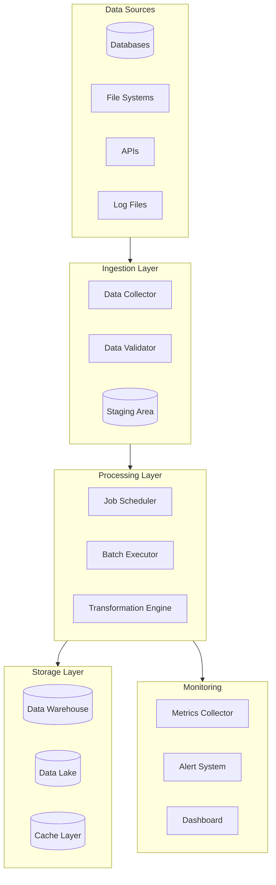
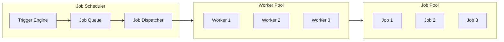
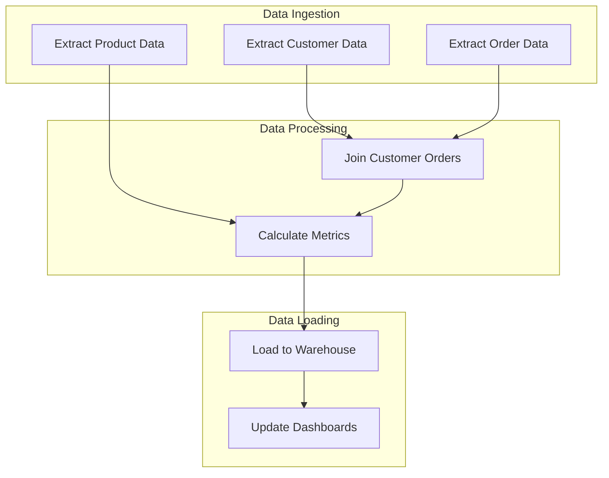
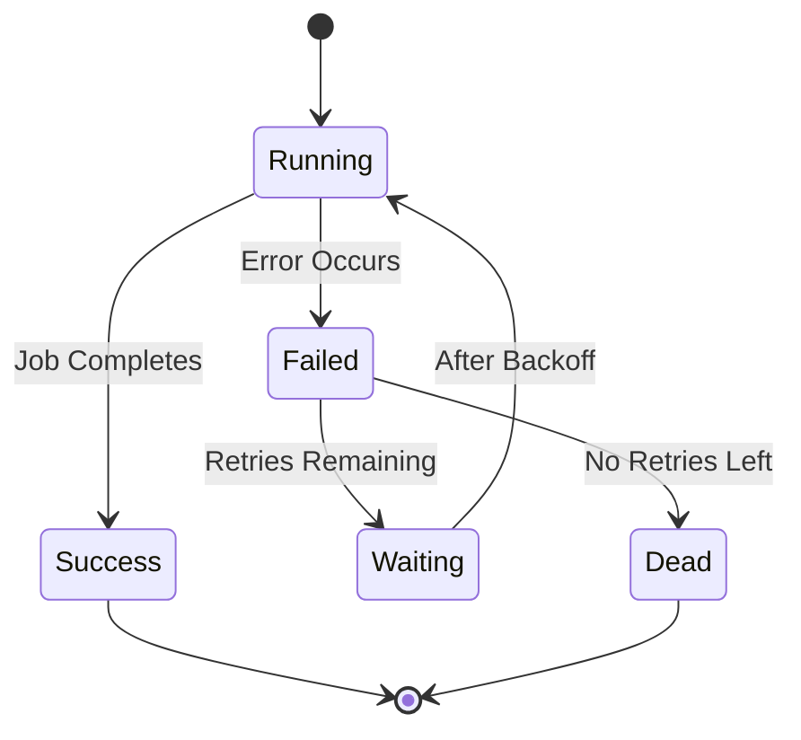
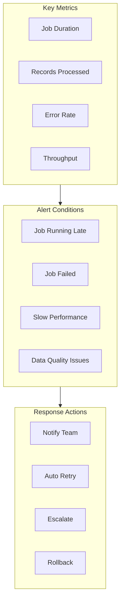
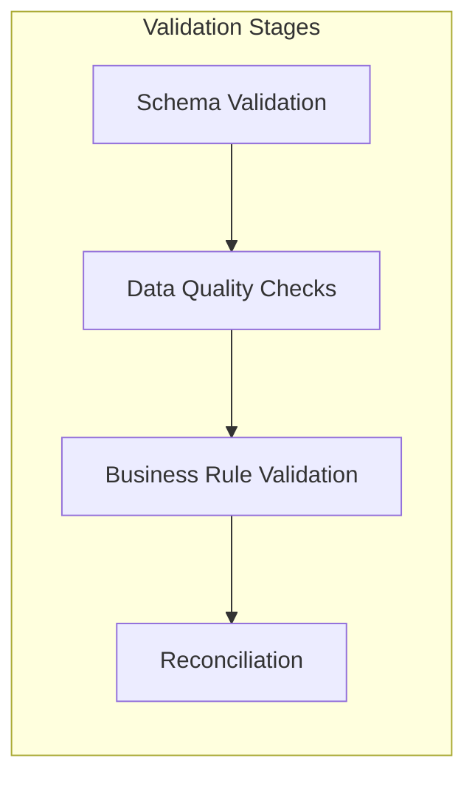

# How to Build Batch Processing Architecture

Author: [nawazdhandala](https://github.com/nawazdhandala)

Tags: Batch Processing, Data Engineering, Architecture, ETL

Description: Learn how to design batch processing architecture for reliable large-scale data processing.

---

Batch processing remains a cornerstone of modern data engineering. While streaming architectures get much attention, batch processing handles the majority of data workloads in enterprises today. This guide covers how to build robust batch processing systems that scale reliably.

## What is Batch Processing?

Batch processing involves collecting data over a period, then processing it as a single unit. Unlike real-time processing, batch jobs run at scheduled intervals and handle large volumes of data efficiently.

### When to Use Batch Processing

- Processing historical data for analytics
- Running ETL pipelines on a schedule
- Generating daily, weekly, or monthly reports
- Training machine learning models
- Data warehouse loading and transformation

## Architecture Overview

A well-designed batch processing architecture consists of several key components working together.



## Core Components

### 1. Job Scheduling

Job scheduling determines when and how batch jobs execute. A good scheduler handles dependencies, retries, and parallelization.



#### Apache Airflow DAG Example

Apache Airflow is a popular choice for orchestrating batch workflows. Here is an example DAG for a data pipeline:

```python
# airflow_batch_dag.py
# This DAG orchestrates a daily ETL pipeline with proper dependencies

from datetime import datetime, timedelta
from airflow import DAG
from airflow.operators.python import PythonOperator
from airflow.operators.bash import BashOperator
from airflow.sensors.filesystem import FileSensor

# Default arguments applied to all tasks in this DAG
default_args = {
    'owner': 'data-engineering',
    'depends_on_past': False,  # Each run is independent
    'email_on_failure': True,
    'email_on_retry': False,
    'retries': 3,  # Retry failed tasks up to 3 times
    'retry_delay': timedelta(minutes=5),  # Wait 5 minutes between retries
    'retry_exponential_backoff': True,  # Increase delay with each retry
    'max_retry_delay': timedelta(minutes=30),  # Cap retry delay at 30 minutes
}

# Define the DAG with schedule and catchup settings
dag = DAG(
    'daily_batch_pipeline',
    default_args=default_args,
    description='Daily batch processing pipeline for sales data',
    schedule_interval='0 2 * * *',  # Run at 2 AM daily
    start_date=datetime(2026, 1, 1),
    catchup=False,  # Do not backfill missed runs
    tags=['batch', 'etl', 'sales'],
)


def extract_data(**context):
    """
    Extract data from source systems.
    Uses execution_date for incremental extraction.
    """
    execution_date = context['execution_date']
    # Extract only data for the specific execution date
    print(f"Extracting data for {execution_date}")
    # Implementation: Connect to source DB, query records, save to staging
    return {'records_extracted': 10000}


def validate_data(**context):
    """
    Validate extracted data before transformation.
    Checks for schema conformance and data quality.
    """
    ti = context['task_instance']
    extract_result = ti.xcom_pull(task_ids='extract_task')
    record_count = extract_result['records_extracted']

    # Validate minimum record threshold
    if record_count < 100:
        raise ValueError(f"Too few records: {record_count}")

    print(f"Validated {record_count} records")
    return {'validation_status': 'passed'}


def transform_data(**context):
    """
    Apply business transformations to the validated data.
    Includes deduplication, enrichment, and aggregation.
    """
    print("Applying transformations")
    # Implementation: Read from staging, transform, write to processed area
    return {'records_transformed': 9500}


def load_data(**context):
    """
    Load transformed data into the target data warehouse.
    Uses upsert logic to handle updates.
    """
    ti = context['task_instance']
    transform_result = ti.xcom_pull(task_ids='transform_task')
    print(f"Loading {transform_result['records_transformed']} records to warehouse")
    # Implementation: Bulk insert into data warehouse


# Task definitions with proper dependencies

# Wait for source file to be available before starting
wait_for_file = FileSensor(
    task_id='wait_for_source_file',
    filepath='/data/incoming/sales_{{ ds }}.csv',
    poke_interval=300,  # Check every 5 minutes
    timeout=3600,  # Timeout after 1 hour
    dag=dag,
)

# Extract data from source
extract_task = PythonOperator(
    task_id='extract_task',
    python_callable=extract_data,
    provide_context=True,
    dag=dag,
)

# Validate extracted data
validate_task = PythonOperator(
    task_id='validate_task',
    python_callable=validate_data,
    provide_context=True,
    dag=dag,
)

# Transform the validated data
transform_task = PythonOperator(
    task_id='transform_task',
    python_callable=transform_data,
    provide_context=True,
    dag=dag,
)

# Load data to warehouse
load_task = PythonOperator(
    task_id='load_task',
    python_callable=load_data,
    provide_context=True,
    dag=dag,
)

# Clean up temporary files after successful load
cleanup_task = BashOperator(
    task_id='cleanup_task',
    bash_command='rm -f /data/staging/{{ ds }}/*',
    dag=dag,
)

# Define task dependencies (execution order)
wait_for_file >> extract_task >> validate_task >> transform_task >> load_task >> cleanup_task
```

### 2. Dependency Management

Complex batch systems have jobs that depend on each other. Managing these dependencies correctly prevents data inconsistencies.



#### Handling Dependencies in Code

```python
# dependency_manager.py
# A simple dependency manager for batch jobs

from collections import defaultdict
from enum import Enum
from typing import List, Dict, Set, Callable
import logging

logging.basicConfig(level=logging.INFO)
logger = logging.getLogger(__name__)


class JobStatus(Enum):
    """Possible states for a batch job."""
    PENDING = "pending"
    RUNNING = "running"
    COMPLETED = "completed"
    FAILED = "failed"
    SKIPPED = "skipped"


class Job:
    """
    Represents a single batch job with its dependencies.

    Attributes:
        name: Unique identifier for the job
        dependencies: Set of job names this job depends on
        execute_fn: Function to call when running the job
        status: Current execution status
    """

    def __init__(self, name: str, execute_fn: Callable, dependencies: List[str] = None):
        self.name = name
        self.execute_fn = execute_fn
        self.dependencies = set(dependencies or [])
        self.status = JobStatus.PENDING

    def can_run(self, completed_jobs: Set[str]) -> bool:
        """Check if all dependencies are satisfied."""
        return self.dependencies.issubset(completed_jobs)

    def execute(self) -> bool:
        """
        Execute the job and return success status.
        Updates job status based on execution result.
        """
        try:
            self.status = JobStatus.RUNNING
            logger.info(f"Starting job: {self.name}")
            self.execute_fn()
            self.status = JobStatus.COMPLETED
            logger.info(f"Completed job: {self.name}")
            return True
        except Exception as e:
            self.status = JobStatus.FAILED
            logger.error(f"Failed job: {self.name} - {str(e)}")
            return False


class DependencyManager:
    """
    Manages job execution order based on dependencies.
    Uses topological sorting to determine execution sequence.
    """

    def __init__(self):
        self.jobs: Dict[str, Job] = {}
        self.completed_jobs: Set[str] = set()
        self.failed_jobs: Set[str] = set()

    def add_job(self, job: Job) -> None:
        """Register a job with the manager."""
        self.jobs[job.name] = job

    def get_runnable_jobs(self) -> List[Job]:
        """
        Find all jobs that can run now.
        A job is runnable if:
        - It has not been executed yet
        - All its dependencies have completed successfully
        """
        runnable = []
        for job in self.jobs.values():
            if job.status == JobStatus.PENDING and job.can_run(self.completed_jobs):
                # Skip jobs that depend on failed jobs
                if not job.dependencies.intersection(self.failed_jobs):
                    runnable.append(job)
                else:
                    job.status = JobStatus.SKIPPED
                    logger.warning(f"Skipping {job.name} due to failed dependency")
        return runnable

    def run_all(self) -> Dict[str, JobStatus]:
        """
        Execute all jobs respecting dependencies.
        Returns final status of all jobs.
        """
        while True:
            runnable = self.get_runnable_jobs()
            if not runnable:
                break

            # Execute runnable jobs (could be parallelized)
            for job in runnable:
                success = job.execute()
                if success:
                    self.completed_jobs.add(job.name)
                else:
                    self.failed_jobs.add(job.name)

        return {name: job.status for name, job in self.jobs.items()}


# Example usage
if __name__ == "__main__":
    manager = DependencyManager()

    # Define jobs with their dependencies
    manager.add_job(Job("extract_customers", lambda: print("Extracting customers")))
    manager.add_job(Job("extract_orders", lambda: print("Extracting orders")))
    manager.add_job(Job(
        "join_data",
        lambda: print("Joining customer and order data"),
        dependencies=["extract_customers", "extract_orders"]
    ))
    manager.add_job(Job(
        "load_warehouse",
        lambda: print("Loading to warehouse"),
        dependencies=["join_data"]
    ))

    # Execute all jobs
    results = manager.run_all()
    print(f"Final status: {results}")
```

### 3. Retry Strategies

Network failures, resource contention, and transient errors are common in batch processing. Robust retry strategies keep your pipelines running.



#### Implementing Retry Logic

```python
# retry_handler.py
# Configurable retry handler with exponential backoff

import time
import random
import logging
from functools import wraps
from typing import Callable, Type, Tuple, Optional

logging.basicConfig(level=logging.INFO)
logger = logging.getLogger(__name__)


class RetryConfig:
    """
    Configuration for retry behavior.

    Attributes:
        max_retries: Maximum number of retry attempts
        base_delay: Initial delay between retries in seconds
        max_delay: Maximum delay cap for exponential backoff
        exponential_base: Multiplier for exponential backoff
        jitter: Whether to add randomness to prevent thundering herd
        retryable_exceptions: Tuple of exception types that trigger retry
    """

    def __init__(
        self,
        max_retries: int = 3,
        base_delay: float = 1.0,
        max_delay: float = 60.0,
        exponential_base: float = 2.0,
        jitter: bool = True,
        retryable_exceptions: Tuple[Type[Exception], ...] = (Exception,)
    ):
        self.max_retries = max_retries
        self.base_delay = base_delay
        self.max_delay = max_delay
        self.exponential_base = exponential_base
        self.jitter = jitter
        self.retryable_exceptions = retryable_exceptions


def calculate_backoff(
    attempt: int,
    config: RetryConfig
) -> float:
    """
    Calculate delay before next retry using exponential backoff.

    Formula: min(base_delay * (exponential_base ^ attempt), max_delay)
    With optional jitter: delay * random(0.5, 1.5)
    """
    # Calculate exponential delay
    delay = config.base_delay * (config.exponential_base ** attempt)

    # Apply maximum cap
    delay = min(delay, config.max_delay)

    # Add jitter to prevent synchronized retries across workers
    if config.jitter:
        delay = delay * (0.5 + random.random())

    return delay


def with_retry(config: Optional[RetryConfig] = None):
    """
    Decorator that adds retry logic to a function.

    Usage:
        @with_retry(RetryConfig(max_retries=5))
        def my_flaky_function():
            # This will be retried up to 5 times on failure
            pass
    """
    if config is None:
        config = RetryConfig()

    def decorator(func: Callable):
        @wraps(func)
        def wrapper(*args, **kwargs):
            last_exception = None

            for attempt in range(config.max_retries + 1):
                try:
                    return func(*args, **kwargs)
                except config.retryable_exceptions as e:
                    last_exception = e

                    if attempt < config.max_retries:
                        delay = calculate_backoff(attempt, config)
                        logger.warning(
                            f"Attempt {attempt + 1} failed for {func.__name__}: {e}. "
                            f"Retrying in {delay:.2f}s"
                        )
                        time.sleep(delay)
                    else:
                        logger.error(
                            f"All {config.max_retries + 1} attempts failed for {func.__name__}"
                        )

            # Raise the last exception after all retries exhausted
            raise last_exception

        return wrapper
    return decorator


class RetryableJob:
    """
    A batch job with built-in retry capabilities.
    Tracks retry history for debugging and monitoring.
    """

    def __init__(self, name: str, execute_fn: Callable, config: RetryConfig = None):
        self.name = name
        self.execute_fn = execute_fn
        self.config = config or RetryConfig()
        self.attempt_history = []

    def run(self) -> bool:
        """
        Execute the job with retry logic.
        Returns True if successful, False if all retries exhausted.
        """
        for attempt in range(self.config.max_retries + 1):
            start_time = time.time()
            try:
                self.execute_fn()
                self.attempt_history.append({
                    'attempt': attempt + 1,
                    'status': 'success',
                    'duration': time.time() - start_time
                })
                return True
            except self.config.retryable_exceptions as e:
                self.attempt_history.append({
                    'attempt': attempt + 1,
                    'status': 'failed',
                    'error': str(e),
                    'duration': time.time() - start_time
                })

                if attempt < self.config.max_retries:
                    delay = calculate_backoff(attempt, self.config)
                    logger.warning(f"Job {self.name} attempt {attempt + 1} failed. Retrying in {delay:.2f}s")
                    time.sleep(delay)

        return False


# Example: Different retry strategies for different error types
class DatabaseConnectionError(Exception):
    """Transient database connection error."""
    pass


class DataValidationError(Exception):
    """Data validation error - not retryable."""
    pass


# Retry only transient errors
transient_retry_config = RetryConfig(
    max_retries=5,
    base_delay=2.0,
    max_delay=120.0,
    retryable_exceptions=(DatabaseConnectionError, ConnectionError, TimeoutError)
)


@with_retry(transient_retry_config)
def fetch_data_from_database():
    """Fetch data with automatic retry on connection errors."""
    # Implementation here
    pass
```

## Processing Frameworks

### Apache Spark for Large Scale Batch Processing

Apache Spark excels at processing large datasets across distributed clusters.

```python
# spark_batch_job.py
# PySpark batch job for processing sales data

from pyspark.sql import SparkSession
from pyspark.sql.functions import (
    col, sum as spark_sum, count, avg,
    to_date, year, month, dayofmonth,
    when, lit, coalesce
)
from pyspark.sql.types import (
    StructType, StructField, StringType,
    DoubleType, TimestampType, IntegerType
)
import logging

logging.basicConfig(level=logging.INFO)
logger = logging.getLogger(__name__)


def create_spark_session(app_name: str) -> SparkSession:
    """
    Create and configure a Spark session for batch processing.

    Configuration optimized for batch workloads:
    - Adaptive query execution for dynamic optimization
    - Broadcast join threshold for small table joins
    - Shuffle partitions based on data volume
    """
    return (
        SparkSession.builder
        .appName(app_name)
        # Enable adaptive query execution
        .config("spark.sql.adaptive.enabled", "true")
        .config("spark.sql.adaptive.coalescePartitions.enabled", "true")
        # Optimize shuffle operations
        .config("spark.sql.shuffle.partitions", "200")
        # Memory management
        .config("spark.memory.fraction", "0.8")
        .config("spark.memory.storageFraction", "0.3")
        # Broadcast join threshold (10MB)
        .config("spark.sql.autoBroadcastJoinThreshold", "10485760")
        .getOrCreate()
    )


def define_schemas():
    """
    Define explicit schemas for input data.
    Using explicit schemas improves performance by avoiding schema inference.
    """
    sales_schema = StructType([
        StructField("transaction_id", StringType(), False),
        StructField("customer_id", StringType(), False),
        StructField("product_id", StringType(), False),
        StructField("quantity", IntegerType(), False),
        StructField("unit_price", DoubleType(), False),
        StructField("transaction_date", TimestampType(), False),
        StructField("store_id", StringType(), True),
    ])

    customer_schema = StructType([
        StructField("customer_id", StringType(), False),
        StructField("customer_name", StringType(), True),
        StructField("segment", StringType(), True),
        StructField("region", StringType(), True),
    ])

    return sales_schema, customer_schema


def extract_data(spark: SparkSession, date: str, sales_schema, customer_schema):
    """
    Extract data from source systems.

    Args:
        spark: Active Spark session
        date: Processing date in YYYY-MM-DD format
        sales_schema: Schema for sales data
        customer_schema: Schema for customer data

    Returns:
        Tuple of (sales_df, customers_df)
    """
    logger.info(f"Extracting data for date: {date}")

    # Read sales data with explicit schema
    # Using parquet for columnar storage efficiency
    sales_df = (
        spark.read
        .schema(sales_schema)
        .parquet(f"s3://data-lake/raw/sales/date={date}")
    )

    # Read customer dimension table
    # This is typically a smaller dataset, good for broadcast join
    customers_df = (
        spark.read
        .schema(customer_schema)
        .parquet("s3://data-lake/dimensions/customers/")
    )

    # Log record counts for monitoring
    sales_count = sales_df.count()
    logger.info(f"Extracted {sales_count} sales records")

    return sales_df, customers_df


def transform_data(sales_df, customers_df):
    """
    Apply business transformations to the data.

    Transformations include:
    - Calculate total amount per transaction
    - Join with customer dimension for enrichment
    - Handle null values with defaults
    - Add date dimension columns
    """
    logger.info("Applying transformations")

    # Calculate derived columns
    enriched_sales = (
        sales_df
        # Calculate total transaction amount
        .withColumn("total_amount", col("quantity") * col("unit_price"))
        # Extract date components for partitioning
        .withColumn("sale_date", to_date(col("transaction_date")))
        .withColumn("sale_year", year(col("transaction_date")))
        .withColumn("sale_month", month(col("transaction_date")))
        .withColumn("sale_day", dayofmonth(col("transaction_date")))
        # Categorize transaction size
        .withColumn(
            "transaction_size",
            when(col("total_amount") < 50, lit("small"))
            .when(col("total_amount") < 200, lit("medium"))
            .otherwise(lit("large"))
        )
    )

    # Join with customer data
    # Using broadcast hint for smaller customer table
    from pyspark.sql.functions import broadcast

    final_df = (
        enriched_sales
        .join(
            broadcast(customers_df),
            on="customer_id",
            how="left"
        )
        # Handle null values from left join
        .withColumn("segment", coalesce(col("segment"), lit("Unknown")))
        .withColumn("region", coalesce(col("region"), lit("Unknown")))
    )

    return final_df


def calculate_aggregations(df):
    """
    Calculate business metrics and aggregations.

    Returns:
        Tuple of (daily_metrics_df, customer_metrics_df)
    """
    logger.info("Calculating aggregations")

    # Daily sales metrics
    daily_metrics = (
        df
        .groupBy("sale_date", "region")
        .agg(
            spark_sum("total_amount").alias("total_revenue"),
            count("transaction_id").alias("transaction_count"),
            avg("total_amount").alias("avg_transaction_value"),
            spark_sum("quantity").alias("total_units_sold")
        )
    )

    # Customer segment metrics
    customer_metrics = (
        df
        .groupBy("customer_id", "segment", "region")
        .agg(
            spark_sum("total_amount").alias("customer_total_spend"),
            count("transaction_id").alias("customer_transaction_count"),
            avg("total_amount").alias("customer_avg_transaction")
        )
    )

    return daily_metrics, customer_metrics


def load_data(daily_metrics, customer_metrics, output_date: str):
    """
    Write transformed data to the data warehouse.

    Uses partitioning for efficient querying and
    overwrites only the specific date partition.
    """
    logger.info(f"Loading data for date: {output_date}")

    # Write daily metrics partitioned by date
    (
        daily_metrics
        .write
        .mode("overwrite")
        .partitionBy("sale_date")
        .parquet(f"s3://data-warehouse/metrics/daily_sales/")
    )

    # Write customer metrics
    (
        customer_metrics
        .coalesce(10)  # Reduce number of output files
        .write
        .mode("overwrite")
        .parquet(f"s3://data-warehouse/metrics/customer_summary/date={output_date}")
    )

    logger.info("Data loading complete")


def run_batch_job(processing_date: str):
    """
    Main entry point for the batch job.

    Args:
        processing_date: Date to process in YYYY-MM-DD format
    """
    logger.info(f"Starting batch job for {processing_date}")

    # Initialize Spark
    spark = create_spark_session("SalesBatchJob")

    try:
        # Define schemas
        sales_schema, customer_schema = define_schemas()

        # Extract
        sales_df, customers_df = extract_data(
            spark, processing_date, sales_schema, customer_schema
        )

        # Transform
        transformed_df = transform_data(sales_df, customers_df)

        # Cache transformed data since it is used multiple times
        transformed_df.cache()

        # Aggregate
        daily_metrics, customer_metrics = calculate_aggregations(transformed_df)

        # Load
        load_data(daily_metrics, customer_metrics, processing_date)

        logger.info("Batch job completed successfully")

    except Exception as e:
        logger.error(f"Batch job failed: {str(e)}")
        raise
    finally:
        spark.stop()


if __name__ == "__main__":
    import sys
    date = sys.argv[1] if len(sys.argv) > 1 else "2026-01-30"
    run_batch_job(date)
```

### Spring Batch for Java Enterprise Applications

Spring Batch provides a robust framework for batch processing in Java environments.

```java
// BatchConfiguration.java
// Spring Batch configuration for processing customer records

package com.example.batch.config;

import com.example.batch.model.Customer;
import com.example.batch.model.CustomerReport;
import com.example.batch.processor.CustomerProcessor;
import com.example.batch.listener.JobCompletionListener;
import org.springframework.batch.core.Job;
import org.springframework.batch.core.Step;
import org.springframework.batch.core.configuration.annotation.EnableBatchProcessing;
import org.springframework.batch.core.job.builder.JobBuilder;
import org.springframework.batch.core.launch.support.RunIdIncrementer;
import org.springframework.batch.core.repository.JobRepository;
import org.springframework.batch.core.step.builder.StepBuilder;
import org.springframework.batch.item.database.JdbcBatchItemWriter;
import org.springframework.batch.item.database.builder.JdbcBatchItemWriterBuilder;
import org.springframework.batch.item.file.FlatFileItemReader;
import org.springframework.batch.item.file.builder.FlatFileItemReaderBuilder;
import org.springframework.context.annotation.Bean;
import org.springframework.context.annotation.Configuration;
import org.springframework.core.io.ClassPathResource;
import org.springframework.transaction.PlatformTransactionManager;

import javax.sql.DataSource;

/**
 * Spring Batch configuration for customer data processing.
 *
 * This configuration defines:
 * - Reader: Reads customer data from CSV files
 * - Processor: Transforms and validates customer records
 * - Writer: Writes processed records to the database
 */
@Configuration
@EnableBatchProcessing
public class BatchConfiguration {

    /**
     * Configure the file reader for customer CSV data.
     *
     * Features:
     * - Skips the header line
     * - Maps CSV columns to Customer object fields
     * - Handles malformed records gracefully
     */
    @Bean
    public FlatFileItemReader<Customer> customerReader() {
        return new FlatFileItemReaderBuilder<Customer>()
            .name("customerItemReader")
            .resource(new ClassPathResource("data/customers.csv"))
            .linesToSkip(1) // Skip header row
            .delimited()
            .delimiter(",")
            .names("customerId", "firstName", "lastName", "email", "segment", "registrationDate")
            .targetType(Customer.class)
            .build();
    }

    /**
     * Configure the processor that transforms customer records.
     *
     * The processor handles:
     * - Data validation
     * - Field transformation
     * - Business rule application
     */
    @Bean
    public CustomerProcessor customerProcessor() {
        return new CustomerProcessor();
    }

    /**
     * Configure the database writer for processed records.
     *
     * Uses JDBC batch operations for efficient bulk inserts.
     * The batchSize parameter controls commit frequency.
     */
    @Bean
    public JdbcBatchItemWriter<CustomerReport> customerWriter(DataSource dataSource) {
        return new JdbcBatchItemWriterBuilder<CustomerReport>()
            .sql("""
                INSERT INTO customer_reports
                (customer_id, full_name, email, segment, registration_year, processed_at)
                VALUES
                (:customerId, :fullName, :email, :segment, :registrationYear, :processedAt)
                """)
            .dataSource(dataSource)
            .beanMapped()
            .build();
    }

    /**
     * Define the main processing step.
     *
     * Configuration:
     * - Chunk size of 100: Process 100 records per transaction
     * - Fault tolerance: Skip up to 10 bad records
     * - Retry: Retry failed writes up to 3 times
     */
    @Bean
    public Step processCustomersStep(
            JobRepository jobRepository,
            PlatformTransactionManager transactionManager,
            FlatFileItemReader<Customer> reader,
            CustomerProcessor processor,
            JdbcBatchItemWriter<CustomerReport> writer) {

        return new StepBuilder("processCustomersStep", jobRepository)
            // Process 100 records per chunk/transaction
            .<Customer, CustomerReport>chunk(100, transactionManager)
            .reader(reader)
            .processor(processor)
            .writer(writer)
            // Fault tolerance configuration
            .faultTolerant()
            .skipLimit(10) // Allow up to 10 skipped records
            .skip(IllegalArgumentException.class) // Skip records with validation errors
            .retryLimit(3) // Retry failed operations up to 3 times
            .retry(org.springframework.dao.DeadlockLoserDataAccessException.class)
            .build();
    }

    /**
     * Define the complete batch job.
     *
     * The job:
     * - Uses an incrementer for unique job instances
     * - Includes a completion listener for notifications
     * - Can be extended with multiple steps
     */
    @Bean
    public Job processCustomersJob(
            JobRepository jobRepository,
            JobCompletionListener listener,
            Step processCustomersStep) {

        return new JobBuilder("processCustomersJob", jobRepository)
            .incrementer(new RunIdIncrementer())
            .listener(listener)
            .start(processCustomersStep)
            // Add more steps as needed:
            // .next(validateStep)
            // .next(reportStep)
            .build();
    }
}
```

```java
// CustomerProcessor.java
// Processor component for transforming customer records

package com.example.batch.processor;

import com.example.batch.model.Customer;
import com.example.batch.model.CustomerReport;
import org.slf4j.Logger;
import org.slf4j.LoggerFactory;
import org.springframework.batch.item.ItemProcessor;

import java.time.LocalDate;
import java.time.LocalDateTime;

/**
 * Processes individual Customer records into CustomerReport objects.
 *
 * Responsibilities:
 * - Validate incoming data
 * - Transform fields as needed
 * - Apply business rules
 * - Return null to filter out invalid records
 */
public class CustomerProcessor implements ItemProcessor<Customer, CustomerReport> {

    private static final Logger logger = LoggerFactory.getLogger(CustomerProcessor.class);

    /**
     * Process a single customer record.
     *
     * @param customer The input customer record
     * @return Processed CustomerReport or null to skip
     * @throws IllegalArgumentException for invalid data
     */
    @Override
    public CustomerReport process(Customer customer) throws Exception {
        logger.debug("Processing customer: {}", customer.getCustomerId());

        // Validate required fields
        if (customer.getEmail() == null || customer.getEmail().isBlank()) {
            logger.warn("Skipping customer {} - missing email", customer.getCustomerId());
            return null; // Returning null skips this record
        }

        // Validate email format
        if (!isValidEmail(customer.getEmail())) {
            throw new IllegalArgumentException(
                "Invalid email format for customer: " + customer.getCustomerId()
            );
        }

        // Transform and build the report
        CustomerReport report = new CustomerReport();
        report.setCustomerId(customer.getCustomerId());
        report.setFullName(buildFullName(customer));
        report.setEmail(customer.getEmail().toLowerCase().trim());
        report.setSegment(normalizeSegment(customer.getSegment()));
        report.setRegistrationYear(extractYear(customer.getRegistrationDate()));
        report.setProcessedAt(LocalDateTime.now());

        logger.debug("Successfully processed customer: {}", customer.getCustomerId());
        return report;
    }

    /**
     * Build full name from first and last name.
     * Handles null values gracefully.
     */
    private String buildFullName(Customer customer) {
        String firstName = customer.getFirstName() != null ? customer.getFirstName().trim() : "";
        String lastName = customer.getLastName() != null ? customer.getLastName().trim() : "";
        return (firstName + " " + lastName).trim();
    }

    /**
     * Normalize segment values to standard categories.
     */
    private String normalizeSegment(String segment) {
        if (segment == null || segment.isBlank()) {
            return "STANDARD";
        }
        return switch (segment.toUpperCase().trim()) {
            case "GOLD", "PREMIUM", "VIP" -> "PREMIUM";
            case "SILVER", "PLUS" -> "PLUS";
            default -> "STANDARD";
        };
    }

    /**
     * Extract year from registration date.
     */
    private int extractYear(LocalDate date) {
        return date != null ? date.getYear() : LocalDate.now().getYear();
    }

    /**
     * Simple email validation.
     */
    private boolean isValidEmail(String email) {
        return email != null && email.contains("@") && email.contains(".");
    }
}
```

```java
// RetryConfiguration.java
// Configure retry behavior for Spring Batch

package com.example.batch.config;

import org.springframework.batch.core.step.skip.SkipPolicy;
import org.springframework.context.annotation.Bean;
import org.springframework.context.annotation.Configuration;
import org.springframework.retry.RetryPolicy;
import org.springframework.retry.backoff.ExponentialBackOffPolicy;
import org.springframework.retry.policy.SimpleRetryPolicy;
import org.springframework.retry.support.RetryTemplate;

import java.util.HashMap;
import java.util.Map;

/**
 * Retry and skip policy configuration for batch jobs.
 *
 * Defines how the batch job handles:
 * - Transient failures (with retry)
 * - Permanent failures (with skip)
 */
@Configuration
public class RetryConfiguration {

    /**
     * Configure retry template with exponential backoff.
     *
     * Backoff progression:
     * - Initial interval: 1 second
     * - Multiplier: 2.0
     * - Max interval: 30 seconds
     */
    @Bean
    public RetryTemplate retryTemplate() {
        RetryTemplate template = new RetryTemplate();

        // Configure exponential backoff
        ExponentialBackOffPolicy backOffPolicy = new ExponentialBackOffPolicy();
        backOffPolicy.setInitialInterval(1000L);  // 1 second
        backOffPolicy.setMultiplier(2.0);          // Double each retry
        backOffPolicy.setMaxInterval(30000L);      // Max 30 seconds
        template.setBackOffPolicy(backOffPolicy);

        // Configure retry policy for specific exceptions
        Map<Class<? extends Throwable>, Boolean> retryableExceptions = new HashMap<>();
        retryableExceptions.put(java.net.SocketTimeoutException.class, true);
        retryableExceptions.put(org.springframework.dao.TransientDataAccessException.class, true);
        retryableExceptions.put(java.io.IOException.class, true);

        SimpleRetryPolicy retryPolicy = new SimpleRetryPolicy(3, retryableExceptions);
        template.setRetryPolicy(retryPolicy);

        return template;
    }

    /**
     * Custom skip policy that limits skips and logs issues.
     *
     * Allows skipping:
     * - Data validation errors (up to limit)
     * - Parse errors for malformed records
     */
    @Bean
    public SkipPolicy customSkipPolicy() {
        return (throwable, skipCount) -> {
            // Allow skipping validation errors up to 100 times
            if (throwable instanceof IllegalArgumentException) {
                return skipCount < 100;
            }

            // Allow skipping parse errors up to 50 times
            if (throwable instanceof org.springframework.batch.item.file.FlatFileParseException) {
                return skipCount < 50;
            }

            // Do not skip other exceptions
            return false;
        };
    }
}
```

## Monitoring and Observability

Monitoring batch jobs is critical for maintaining reliability. Here is what to track:



### Implementing Batch Monitoring

```python
# batch_monitor.py
# Monitoring and alerting for batch jobs

import time
import logging
from dataclasses import dataclass, field
from datetime import datetime, timedelta
from typing import Dict, List, Optional, Callable
from enum import Enum

logging.basicConfig(level=logging.INFO)
logger = logging.getLogger(__name__)


class AlertSeverity(Enum):
    """Severity levels for alerts."""
    INFO = "info"
    WARNING = "warning"
    CRITICAL = "critical"


@dataclass
class JobMetrics:
    """
    Metrics collected during batch job execution.

    Attributes:
        job_name: Identifier for the batch job
        start_time: When the job started
        end_time: When the job completed (None if running)
        records_read: Number of records read from source
        records_written: Number of records written to target
        records_failed: Number of records that failed processing
        retry_count: Number of retry attempts made
    """
    job_name: str
    start_time: datetime = field(default_factory=datetime.now)
    end_time: Optional[datetime] = None
    records_read: int = 0
    records_written: int = 0
    records_failed: int = 0
    retry_count: int = 0
    custom_metrics: Dict[str, float] = field(default_factory=dict)

    @property
    def duration_seconds(self) -> Optional[float]:
        """Calculate job duration in seconds."""
        if self.end_time is None:
            return (datetime.now() - self.start_time).total_seconds()
        return (self.end_time - self.start_time).total_seconds()

    @property
    def error_rate(self) -> float:
        """Calculate the error rate as a percentage."""
        total = self.records_read
        if total == 0:
            return 0.0
        return (self.records_failed / total) * 100

    @property
    def throughput(self) -> float:
        """Calculate records processed per second."""
        duration = self.duration_seconds
        if duration is None or duration == 0:
            return 0.0
        return self.records_written / duration


@dataclass
class AlertRule:
    """
    Defines conditions that trigger alerts.

    Attributes:
        name: Human readable name for the rule
        condition: Function that takes JobMetrics and returns True if alert should fire
        severity: Alert severity level
        message_template: Template for alert message
    """
    name: str
    condition: Callable[[JobMetrics], bool]
    severity: AlertSeverity
    message_template: str


class BatchMonitor:
    """
    Monitors batch job execution and triggers alerts.

    Features:
    - Tracks job metrics in real time
    - Evaluates alert rules on job completion
    - Supports custom metric collection
    - Integrates with notification systems
    """

    def __init__(self):
        self.active_jobs: Dict[str, JobMetrics] = {}
        self.completed_jobs: List[JobMetrics] = []
        self.alert_rules: List[AlertRule] = []
        self.alert_handlers: List[Callable] = []

        # Register default alert rules
        self._register_default_rules()

    def _register_default_rules(self):
        """Register standard monitoring rules."""

        # Alert if job takes too long
        self.alert_rules.append(AlertRule(
            name="long_running_job",
            condition=lambda m: m.duration_seconds > 3600,  # 1 hour
            severity=AlertSeverity.WARNING,
            message_template="Job {job_name} has been running for {duration:.0f} seconds"
        ))

        # Alert on high error rate
        self.alert_rules.append(AlertRule(
            name="high_error_rate",
            condition=lambda m: m.error_rate > 5.0,  # 5% threshold
            severity=AlertSeverity.CRITICAL,
            message_template="Job {job_name} has error rate of {error_rate:.2f}%"
        ))

        # Alert if no records processed
        self.alert_rules.append(AlertRule(
            name="no_records_processed",
            condition=lambda m: m.records_written == 0 and m.end_time is not None,
            severity=AlertSeverity.CRITICAL,
            message_template="Job {job_name} processed zero records"
        ))

        # Alert on multiple retries
        self.alert_rules.append(AlertRule(
            name="excessive_retries",
            condition=lambda m: m.retry_count > 3,
            severity=AlertSeverity.WARNING,
            message_template="Job {job_name} required {retry_count} retries"
        ))

    def start_job(self, job_name: str) -> JobMetrics:
        """
        Start tracking a new job execution.

        Args:
            job_name: Unique identifier for this job run

        Returns:
            JobMetrics object for updating during execution
        """
        metrics = JobMetrics(job_name=job_name)
        self.active_jobs[job_name] = metrics
        logger.info(f"Started monitoring job: {job_name}")
        return metrics

    def update_metrics(
        self,
        job_name: str,
        records_read: int = 0,
        records_written: int = 0,
        records_failed: int = 0,
        **custom_metrics
    ):
        """
        Update metrics for a running job.

        Args:
            job_name: The job to update
            records_read: Increment read count
            records_written: Increment write count
            records_failed: Increment failure count
            **custom_metrics: Additional custom metrics to track
        """
        if job_name not in self.active_jobs:
            logger.warning(f"Attempting to update unknown job: {job_name}")
            return

        metrics = self.active_jobs[job_name]
        metrics.records_read += records_read
        metrics.records_written += records_written
        metrics.records_failed += records_failed
        metrics.custom_metrics.update(custom_metrics)

    def complete_job(self, job_name: str, success: bool = True):
        """
        Mark a job as complete and evaluate alerts.

        Args:
            job_name: The job that completed
            success: Whether the job succeeded
        """
        if job_name not in self.active_jobs:
            logger.warning(f"Completing unknown job: {job_name}")
            return

        metrics = self.active_jobs.pop(job_name)
        metrics.end_time = datetime.now()
        self.completed_jobs.append(metrics)

        # Log completion
        status = "successfully" if success else "with errors"
        logger.info(
            f"Job {job_name} completed {status}. "
            f"Duration: {metrics.duration_seconds:.2f}s, "
            f"Records: {metrics.records_written}/{metrics.records_read}, "
            f"Errors: {metrics.records_failed}"
        )

        # Evaluate alert rules
        self._evaluate_alerts(metrics)

    def _evaluate_alerts(self, metrics: JobMetrics):
        """Check all alert rules and fire alerts as needed."""
        for rule in self.alert_rules:
            try:
                if rule.condition(metrics):
                    self._fire_alert(rule, metrics)
            except Exception as e:
                logger.error(f"Error evaluating rule {rule.name}: {e}")

    def _fire_alert(self, rule: AlertRule, metrics: JobMetrics):
        """Send alert through configured handlers."""
        message = rule.message_template.format(
            job_name=metrics.job_name,
            duration=metrics.duration_seconds,
            error_rate=metrics.error_rate,
            retry_count=metrics.retry_count,
            records_read=metrics.records_read,
            records_written=metrics.records_written,
            records_failed=metrics.records_failed
        )

        logger.warning(f"ALERT [{rule.severity.value.upper()}] {rule.name}: {message}")

        # Call registered alert handlers
        for handler in self.alert_handlers:
            try:
                handler(rule.severity, rule.name, message, metrics)
            except Exception as e:
                logger.error(f"Alert handler failed: {e}")

    def add_alert_handler(self, handler: Callable):
        """Register a custom alert handler."""
        self.alert_handlers.append(handler)

    def get_job_summary(self, job_name: str) -> Optional[Dict]:
        """Get summary metrics for a completed job."""
        for metrics in self.completed_jobs:
            if metrics.job_name == job_name:
                return {
                    'job_name': metrics.job_name,
                    'duration_seconds': metrics.duration_seconds,
                    'records_read': metrics.records_read,
                    'records_written': metrics.records_written,
                    'records_failed': metrics.records_failed,
                    'error_rate': metrics.error_rate,
                    'throughput': metrics.throughput,
                    'retry_count': metrics.retry_count
                }
        return None


# Example usage with a batch job
def run_monitored_batch_job():
    """Example of running a batch job with monitoring."""
    monitor = BatchMonitor()

    # Add custom alert handler (e.g., send to Slack)
    def slack_handler(severity, rule_name, message, metrics):
        if severity == AlertSeverity.CRITICAL:
            # send_to_slack(message)
            print(f"Would send to Slack: {message}")

    monitor.add_alert_handler(slack_handler)

    # Start monitoring
    job_name = "daily_sales_etl_2026_01_30"
    metrics = monitor.start_job(job_name)

    # Simulate batch processing
    try:
        # Processing loop
        for batch_num in range(10):
            # Simulate processing a batch
            time.sleep(0.1)
            monitor.update_metrics(
                job_name,
                records_read=1000,
                records_written=990,
                records_failed=10,
                batch_number=batch_num
            )

        monitor.complete_job(job_name, success=True)

    except Exception as e:
        monitor.complete_job(job_name, success=False)
        raise

    # Get final summary
    summary = monitor.get_job_summary(job_name)
    print(f"Job Summary: {summary}")


if __name__ == "__main__":
    run_monitored_batch_job()
```

## Best Practices

### 1. Idempotency

Design jobs to be safely re-runnable. Running a job multiple times should produce the same result.

```python
# idempotent_writer.py
# Example of idempotent data writing

def write_data_idempotent(df, target_table: str, date_partition: str):
    """
    Write data in an idempotent manner.

    Strategy: Delete existing data for the partition, then insert new data.
    This ensures re-running produces the same result.
    """
    # Delete existing data for this partition
    execute_sql(f"""
        DELETE FROM {target_table}
        WHERE date_partition = '{date_partition}'
    """)

    # Insert new data
    df.write.mode("append").insertInto(target_table)
```

### 2. Checkpointing

For long-running jobs, save progress periodically to enable recovery.

```python
# checkpoint_manager.py
# Checkpoint management for resumable batch jobs

import json
from pathlib import Path
from typing import Any, Dict, Optional

class CheckpointManager:
    """Manages checkpoints for resumable batch processing."""

    def __init__(self, checkpoint_dir: str, job_id: str):
        self.checkpoint_path = Path(checkpoint_dir) / f"{job_id}.checkpoint"

    def save(self, state: Dict[str, Any]):
        """Save current processing state."""
        with open(self.checkpoint_path, 'w') as f:
            json.dump(state, f)

    def load(self) -> Optional[Dict[str, Any]]:
        """Load previous checkpoint if exists."""
        if self.checkpoint_path.exists():
            with open(self.checkpoint_path, 'r') as f:
                return json.load(f)
        return None

    def clear(self):
        """Remove checkpoint after successful completion."""
        if self.checkpoint_path.exists():
            self.checkpoint_path.unlink()
```

### 3. Data Validation

Always validate data at each stage of processing.



## Conclusion

Building robust batch processing architecture requires attention to scheduling, dependency management, retry strategies, and monitoring. The frameworks and patterns covered in this guide provide a solid foundation for reliable data processing at scale.

Key takeaways:

1. **Design for failure**: Implement comprehensive retry logic with exponential backoff
2. **Manage dependencies carefully**: Use DAG-based orchestration for complex workflows
3. **Monitor everything**: Track metrics and set up alerts for anomalies
4. **Make jobs idempotent**: Enable safe re-runs without side effects
5. **Use checkpointing**: Save progress for long-running jobs

Whether you choose Apache Spark for distributed processing, Spring Batch for Java enterprise applications, or Apache Airflow for orchestration, these principles apply universally to batch processing systems.

## Further Reading

- Apache Spark Documentation: https://spark.apache.org/docs/latest/
- Spring Batch Reference: https://docs.spring.io/spring-batch/reference/
- Apache Airflow Documentation: https://airflow.apache.org/docs/
- Designing Data-Intensive Applications by Martin Kleppmann
