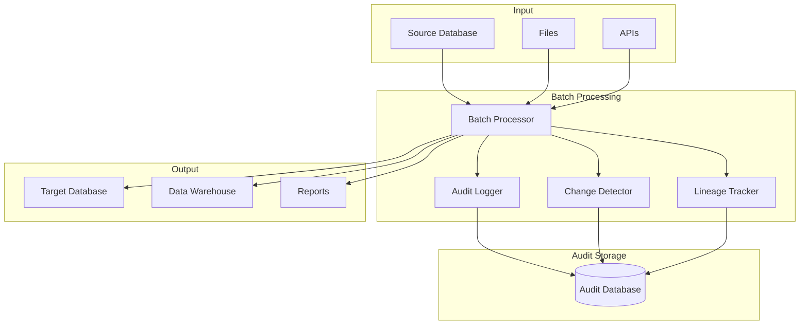
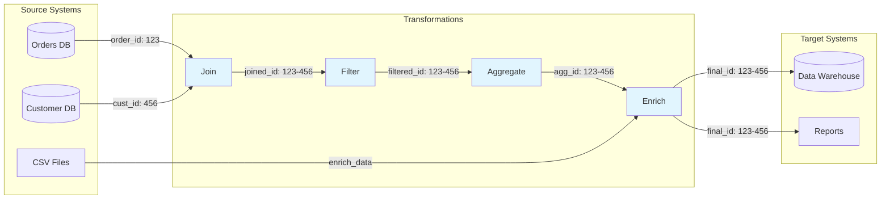
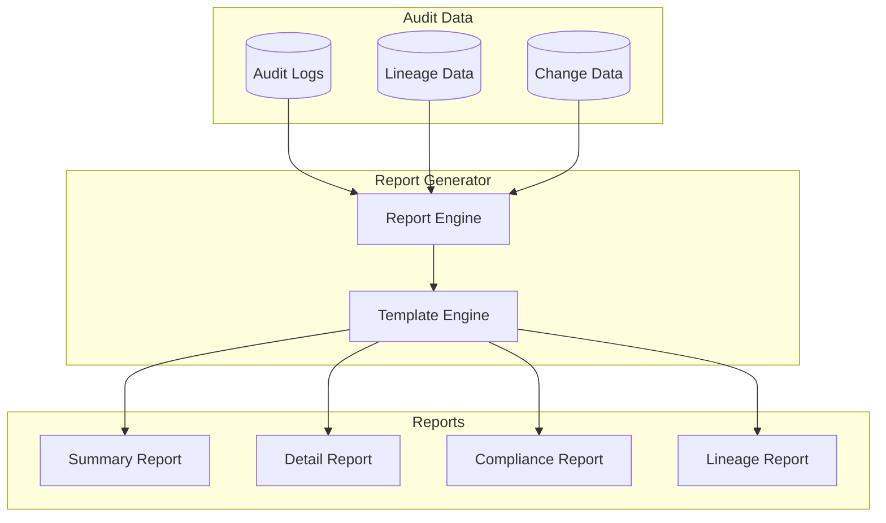

# How to Build Batch Audit

Author: [nawazdhandala](https://github.com/nawazdhandala)

Tags: Batch Processing, Audit, Compliance, Data Governance

Description: Learn to build batch audit capabilities for tracking data lineage, changes, and compliance requirements.

---

Batch processing systems handle massive amounts of data, but without proper auditing, you have no visibility into what happened, when it happened, or why. Whether you need to meet compliance requirements like SOX, GDPR, or HIPAA, or simply want to debug data issues, a robust batch audit system is essential.

## Why Batch Audit Matters

Every organization processing data at scale faces these challenges:

- **Compliance**: Regulations require proof of data handling
- **Debugging**: Understanding why data looks wrong
- **Data lineage**: Tracking where data came from and where it went
- **Change detection**: Knowing what changed between runs
- **Accountability**: Who ran what and when

## Batch Audit Architecture



## Core Components

### 1. Audit Event Model

Start with a well-designed audit event structure that captures everything you need.

```python
# audit_models.py
# Core data models for batch audit events

from dataclasses import dataclass, field
from datetime import datetime
from enum import Enum
from typing import Any, Dict, List, Optional
import uuid
import hashlib
import json


class AuditEventType(Enum):
    """Types of audit events in batch processing."""
    BATCH_START = "batch_start"
    BATCH_END = "batch_end"
    RECORD_READ = "record_read"
    RECORD_TRANSFORM = "record_transform"
    RECORD_WRITE = "record_write"
    RECORD_SKIP = "record_skip"
    RECORD_ERROR = "record_error"
    VALIDATION_PASS = "validation_pass"
    VALIDATION_FAIL = "validation_fail"
    CHECKPOINT = "checkpoint"


class ChangeType(Enum):
    """Types of changes detected in data."""
    INSERT = "insert"
    UPDATE = "update"
    DELETE = "delete"
    NO_CHANGE = "no_change"


@dataclass
class AuditEvent:
    """
    Represents a single audit event in batch processing.

    Each event captures what happened, when, where, and why.
    This forms the foundation of your audit trail.
    """
    # Unique identifier for this event
    event_id: str = field(default_factory=lambda: str(uuid.uuid4()))

    # Batch run identifier (groups all events from one batch run)
    batch_id: str = ""

    # Type of event
    event_type: AuditEventType = AuditEventType.BATCH_START

    # When this event occurred
    timestamp: datetime = field(default_factory=datetime.utcnow)

    # Source of the data (table, file, API endpoint)
    source: str = ""

    # Target destination
    target: str = ""

    # Record identifier in source system
    record_id: Optional[str] = None

    # Hash of record content for integrity verification
    record_hash: Optional[str] = None

    # Change type if applicable
    change_type: Optional[ChangeType] = None

    # Before and after values for changes
    old_value: Optional[Dict[str, Any]] = None
    new_value: Optional[Dict[str, Any]] = None

    # User or service that initiated the batch
    actor: str = ""

    # Additional context
    metadata: Dict[str, Any] = field(default_factory=dict)

    # Error information if applicable
    error_message: Optional[str] = None
    error_stack: Optional[str] = None

    def to_dict(self) -> Dict[str, Any]:
        """Convert event to dictionary for storage."""
        return {
            "event_id": self.event_id,
            "batch_id": self.batch_id,
            "event_type": self.event_type.value,
            "timestamp": self.timestamp.isoformat(),
            "source": self.source,
            "target": self.target,
            "record_id": self.record_id,
            "record_hash": self.record_hash,
            "change_type": self.change_type.value if self.change_type else None,
            "old_value": self.old_value,
            "new_value": self.new_value,
            "actor": self.actor,
            "metadata": self.metadata,
            "error_message": self.error_message,
            "error_stack": self.error_stack,
        }


@dataclass
class BatchRun:
    """
    Represents a complete batch processing run.

    This is the top-level container for all audit events
    from a single execution of a batch job.
    """
    batch_id: str = field(default_factory=lambda: str(uuid.uuid4()))
    job_name: str = ""
    start_time: datetime = field(default_factory=datetime.utcnow)
    end_time: Optional[datetime] = None
    status: str = "running"
    actor: str = ""

    # Counters for summary statistics
    records_read: int = 0
    records_written: int = 0
    records_skipped: int = 0
    records_errored: int = 0

    # Configuration used for this run
    config: Dict[str, Any] = field(default_factory=dict)

    # Input and output sources
    sources: List[str] = field(default_factory=list)
    targets: List[str] = field(default_factory=list)


@dataclass
class DataLineage:
    """
    Tracks the lineage of a single record through the pipeline.

    This allows you to trace any output record back to its
    original source, through all transformations.
    """
    lineage_id: str = field(default_factory=lambda: str(uuid.uuid4()))
    batch_id: str = ""

    # Source information
    source_system: str = ""
    source_table: str = ""
    source_record_id: str = ""
    source_timestamp: Optional[datetime] = None

    # Target information
    target_system: str = ""
    target_table: str = ""
    target_record_id: str = ""
    target_timestamp: Optional[datetime] = None

    # Transformation chain
    transformations: List[Dict[str, Any]] = field(default_factory=list)

    # Hash chain for integrity verification
    source_hash: str = ""
    target_hash: str = ""


def compute_record_hash(record: Dict[str, Any]) -> str:
    """
    Compute a deterministic hash of a record.

    Used for integrity verification and change detection.
    The hash is computed from a sorted JSON representation
    to ensure consistency regardless of key order.
    """
    # Sort keys for deterministic hashing
    serialized = json.dumps(record, sort_keys=True, default=str)
    return hashlib.sha256(serialized.encode()).hexdigest()
```

### 2. Audit Logger

The audit logger is the heart of the system. It captures events asynchronously to minimize performance impact.

```python
# audit_logger.py
# High-performance audit logging with batched writes

import asyncio
import logging
from datetime import datetime
from typing import Any, Dict, List, Optional
from collections import deque
import threading
import time
from contextlib import contextmanager

from audit_models import (
    AuditEvent,
    AuditEventType,
    BatchRun,
    ChangeType,
    compute_record_hash,
)


class AuditLogger:
    """
    Asynchronous audit logger with batched writes.

    Events are queued in memory and flushed to storage
    periodically or when the buffer reaches capacity.
    This minimizes the performance impact on batch processing.
    """

    def __init__(
        self,
        storage_backend: "AuditStorage",
        buffer_size: int = 1000,
        flush_interval_seconds: float = 5.0,
    ):
        self.storage = storage_backend
        self.buffer_size = buffer_size
        self.flush_interval = flush_interval_seconds

        # Thread-safe event buffer
        self._buffer: deque = deque(maxlen=buffer_size * 2)
        self._lock = threading.Lock()

        # Current batch run context
        self._current_batch: Optional[BatchRun] = None

        # Background flush thread
        self._running = False
        self._flush_thread: Optional[threading.Thread] = None

        # Logger for internal errors
        self._logger = logging.getLogger(__name__)

    def start(self) -> None:
        """Start the background flush thread."""
        self._running = True
        self._flush_thread = threading.Thread(
            target=self._flush_loop,
            daemon=True,
        )
        self._flush_thread.start()

    def stop(self) -> None:
        """Stop the logger and flush remaining events."""
        self._running = False
        if self._flush_thread:
            self._flush_thread.join(timeout=10)
        self._flush_to_storage()

    def _flush_loop(self) -> None:
        """Background thread that periodically flushes events."""
        while self._running:
            time.sleep(self.flush_interval)
            self._flush_to_storage()

    def _flush_to_storage(self) -> None:
        """Flush buffered events to storage."""
        events_to_write: List[AuditEvent] = []

        with self._lock:
            while self._buffer:
                events_to_write.append(self._buffer.popleft())

        if events_to_write:
            try:
                self.storage.write_events(events_to_write)
            except Exception as e:
                self._logger.error(f"Failed to flush audit events: {e}")
                # Re-queue events on failure
                with self._lock:
                    for event in events_to_write:
                        self._buffer.appendleft(event)

    def _enqueue(self, event: AuditEvent) -> None:
        """Add event to buffer, flush if needed."""
        with self._lock:
            self._buffer.append(event)

            # Flush if buffer is getting full
            if len(self._buffer) >= self.buffer_size:
                # Schedule immediate flush
                threading.Thread(
                    target=self._flush_to_storage,
                    daemon=True,
                ).start()

    @contextmanager
    def batch_run(
        self,
        job_name: str,
        actor: str,
        config: Optional[Dict[str, Any]] = None,
    ):
        """
        Context manager for a batch run.

        Usage:
            with audit_logger.batch_run("daily_etl", "scheduler") as batch:
                # Process records
                pass
        """
        batch = BatchRun(
            job_name=job_name,
            actor=actor,
            config=config or {},
        )
        self._current_batch = batch

        # Log batch start
        self._enqueue(AuditEvent(
            batch_id=batch.batch_id,
            event_type=AuditEventType.BATCH_START,
            actor=actor,
            metadata={
                "job_name": job_name,
                "config": config,
            },
        ))

        try:
            yield batch
            batch.status = "completed"
        except Exception as e:
            batch.status = "failed"
            self._enqueue(AuditEvent(
                batch_id=batch.batch_id,
                event_type=AuditEventType.RECORD_ERROR,
                actor=actor,
                error_message=str(e),
            ))
            raise
        finally:
            batch.end_time = datetime.utcnow()

            # Log batch end with summary
            self._enqueue(AuditEvent(
                batch_id=batch.batch_id,
                event_type=AuditEventType.BATCH_END,
                actor=actor,
                metadata={
                    "status": batch.status,
                    "records_read": batch.records_read,
                    "records_written": batch.records_written,
                    "records_skipped": batch.records_skipped,
                    "records_errored": batch.records_errored,
                    "duration_seconds": (
                        batch.end_time - batch.start_time
                    ).total_seconds(),
                },
            ))

            # Final flush
            self._flush_to_storage()

            # Store batch run summary
            self.storage.write_batch_run(batch)

            self._current_batch = None

    def log_record_read(
        self,
        source: str,
        record_id: str,
        record: Dict[str, Any],
    ) -> None:
        """Log a record being read from source."""
        if self._current_batch:
            self._current_batch.records_read += 1

        self._enqueue(AuditEvent(
            batch_id=self._current_batch.batch_id if self._current_batch else "",
            event_type=AuditEventType.RECORD_READ,
            source=source,
            record_id=record_id,
            record_hash=compute_record_hash(record),
            actor=self._current_batch.actor if self._current_batch else "",
        ))

    def log_record_write(
        self,
        target: str,
        record_id: str,
        record: Dict[str, Any],
        change_type: ChangeType,
        old_value: Optional[Dict[str, Any]] = None,
    ) -> None:
        """Log a record being written to target."""
        if self._current_batch:
            self._current_batch.records_written += 1

        self._enqueue(AuditEvent(
            batch_id=self._current_batch.batch_id if self._current_batch else "",
            event_type=AuditEventType.RECORD_WRITE,
            target=target,
            record_id=record_id,
            record_hash=compute_record_hash(record),
            change_type=change_type,
            old_value=old_value,
            new_value=record,
            actor=self._current_batch.actor if self._current_batch else "",
        ))

    def log_record_skip(
        self,
        source: str,
        record_id: str,
        reason: str,
    ) -> None:
        """Log a record being skipped."""
        if self._current_batch:
            self._current_batch.records_skipped += 1

        self._enqueue(AuditEvent(
            batch_id=self._current_batch.batch_id if self._current_batch else "",
            event_type=AuditEventType.RECORD_SKIP,
            source=source,
            record_id=record_id,
            metadata={"reason": reason},
            actor=self._current_batch.actor if self._current_batch else "",
        ))

    def log_record_error(
        self,
        source: str,
        record_id: str,
        error: Exception,
    ) -> None:
        """Log a record processing error."""
        if self._current_batch:
            self._current_batch.records_errored += 1

        import traceback

        self._enqueue(AuditEvent(
            batch_id=self._current_batch.batch_id if self._current_batch else "",
            event_type=AuditEventType.RECORD_ERROR,
            source=source,
            record_id=record_id,
            error_message=str(error),
            error_stack=traceback.format_exc(),
            actor=self._current_batch.actor if self._current_batch else "",
        ))

    def log_checkpoint(
        self,
        checkpoint_data: Dict[str, Any],
    ) -> None:
        """Log a processing checkpoint for recovery."""
        self._enqueue(AuditEvent(
            batch_id=self._current_batch.batch_id if self._current_batch else "",
            event_type=AuditEventType.CHECKPOINT,
            metadata=checkpoint_data,
            actor=self._current_batch.actor if self._current_batch else "",
        ))

        # Force flush checkpoint events
        self._flush_to_storage()
```

### 3. Change Detection (CDC)

Change Data Capture identifies what changed between runs. This is critical for incremental processing and audit trails.

```python
# change_detector.py
# Change Data Capture for batch processing

from dataclasses import dataclass
from datetime import datetime
from typing import Any, Dict, List, Optional, Set, Tuple
import hashlib
import json

from audit_models import ChangeType, compute_record_hash


@dataclass
class ChangeRecord:
    """Represents a detected change in data."""
    record_id: str
    change_type: ChangeType
    old_value: Optional[Dict[str, Any]]
    new_value: Optional[Dict[str, Any]]
    changed_fields: List[str]
    old_hash: Optional[str]
    new_hash: Optional[str]


class ChangeDetector:
    """
    Detects changes between two datasets.

    Uses hash comparison for efficient change detection
    and provides detailed field-level change information.
    """

    def __init__(
        self,
        key_fields: List[str],
        ignore_fields: Optional[List[str]] = None,
    ):
        """
        Initialize the change detector.

        Args:
            key_fields: Fields that uniquely identify a record
            ignore_fields: Fields to exclude from change detection
                          (e.g., updated_at timestamps)
        """
        self.key_fields = key_fields
        self.ignore_fields = set(ignore_fields or [])

    def get_record_key(self, record: Dict[str, Any]) -> str:
        """Extract the unique key from a record."""
        key_values = [str(record.get(field, "")) for field in self.key_fields]
        return "|".join(key_values)

    def get_comparable_record(self, record: Dict[str, Any]) -> Dict[str, Any]:
        """Remove ignored fields from record for comparison."""
        return {
            k: v for k, v in record.items()
            if k not in self.ignore_fields
        }

    def detect_changes(
        self,
        old_records: List[Dict[str, Any]],
        new_records: List[Dict[str, Any]],
    ) -> List[ChangeRecord]:
        """
        Detect all changes between old and new datasets.

        Returns a list of ChangeRecord objects describing
        inserts, updates, and deletes.
        """
        changes: List[ChangeRecord] = []

        # Build lookup maps
        old_map: Dict[str, Dict[str, Any]] = {
            self.get_record_key(r): r for r in old_records
        }
        new_map: Dict[str, Dict[str, Any]] = {
            self.get_record_key(r): r for r in new_records
        }

        old_keys = set(old_map.keys())
        new_keys = set(new_map.keys())

        # Detect inserts (in new but not in old)
        for key in new_keys - old_keys:
            new_record = new_map[key]
            changes.append(ChangeRecord(
                record_id=key,
                change_type=ChangeType.INSERT,
                old_value=None,
                new_value=new_record,
                changed_fields=list(new_record.keys()),
                old_hash=None,
                new_hash=compute_record_hash(new_record),
            ))

        # Detect deletes (in old but not in new)
        for key in old_keys - new_keys:
            old_record = old_map[key]
            changes.append(ChangeRecord(
                record_id=key,
                change_type=ChangeType.DELETE,
                old_value=old_record,
                new_value=None,
                changed_fields=list(old_record.keys()),
                old_hash=compute_record_hash(old_record),
                new_hash=None,
            ))

        # Detect updates (in both, but different)
        for key in old_keys & new_keys:
            old_record = old_map[key]
            new_record = new_map[key]

            # Compare without ignored fields
            old_comparable = self.get_comparable_record(old_record)
            new_comparable = self.get_comparable_record(new_record)

            old_hash = compute_record_hash(old_comparable)
            new_hash = compute_record_hash(new_comparable)

            if old_hash != new_hash:
                # Find which fields changed
                changed_fields = self._find_changed_fields(
                    old_comparable,
                    new_comparable,
                )

                changes.append(ChangeRecord(
                    record_id=key,
                    change_type=ChangeType.UPDATE,
                    old_value=old_record,
                    new_value=new_record,
                    changed_fields=changed_fields,
                    old_hash=old_hash,
                    new_hash=new_hash,
                ))

        return changes

    def _find_changed_fields(
        self,
        old_record: Dict[str, Any],
        new_record: Dict[str, Any],
    ) -> List[str]:
        """Identify which specific fields changed."""
        changed = []

        all_keys = set(old_record.keys()) | set(new_record.keys())

        for key in all_keys:
            old_val = old_record.get(key)
            new_val = new_record.get(key)

            if old_val != new_val:
                changed.append(key)

        return changed


class IncrementalChangeDetector:
    """
    Detects changes using a hash store for incremental processing.

    Instead of comparing full datasets, this stores hashes of
    previously processed records and compares against them.
    More memory efficient for large datasets.
    """

    def __init__(
        self,
        hash_store: "HashStore",
        key_fields: List[str],
        ignore_fields: Optional[List[str]] = None,
    ):
        self.hash_store = hash_store
        self.key_fields = key_fields
        self.ignore_fields = set(ignore_fields or [])

    def get_record_key(self, record: Dict[str, Any]) -> str:
        """Extract the unique key from a record."""
        key_values = [str(record.get(field, "")) for field in self.key_fields]
        return "|".join(key_values)

    def detect_change(
        self,
        record: Dict[str, Any],
    ) -> Tuple[ChangeType, Optional[str]]:
        """
        Detect if a single record has changed.

        Returns the change type and the old hash if applicable.
        """
        key = self.get_record_key(record)

        # Remove ignored fields for hashing
        comparable = {
            k: v for k, v in record.items()
            if k not in self.ignore_fields
        }
        new_hash = compute_record_hash(comparable)

        # Check hash store
        old_hash = self.hash_store.get(key)

        if old_hash is None:
            # New record
            return ChangeType.INSERT, None
        elif old_hash != new_hash:
            # Changed record
            return ChangeType.UPDATE, old_hash
        else:
            # No change
            return ChangeType.NO_CHANGE, old_hash

    def update_hash(self, record: Dict[str, Any]) -> None:
        """Update the stored hash for a record."""
        key = self.get_record_key(record)
        comparable = {
            k: v for k, v in record.items()
            if k not in self.ignore_fields
        }
        new_hash = compute_record_hash(comparable)
        self.hash_store.set(key, new_hash)

    def mark_deleted(self, record_key: str) -> None:
        """Mark a record as deleted in the hash store."""
        self.hash_store.delete(record_key)


class HashStore:
    """
    Interface for storing record hashes.

    Implement this with your preferred storage backend
    (Redis, database, file system, etc.)
    """

    def get(self, key: str) -> Optional[str]:
        """Get the stored hash for a key."""
        raise NotImplementedError

    def set(self, key: str, hash_value: str) -> None:
        """Store a hash for a key."""
        raise NotImplementedError

    def delete(self, key: str) -> None:
        """Delete a stored hash."""
        raise NotImplementedError

    def get_all_keys(self) -> Set[str]:
        """Get all stored keys (for delete detection)."""
        raise NotImplementedError


class RedisHashStore(HashStore):
    """Redis-backed hash store for distributed processing."""

    def __init__(self, redis_client, prefix: str = "batch_audit:hash:"):
        self.redis = redis_client
        self.prefix = prefix

    def _key(self, key: str) -> str:
        return f"{self.prefix}{key}"

    def get(self, key: str) -> Optional[str]:
        value = self.redis.get(self._key(key))
        return value.decode() if value else None

    def set(self, key: str, hash_value: str) -> None:
        self.redis.set(self._key(key), hash_value)

    def delete(self, key: str) -> None:
        self.redis.delete(self._key(key))

    def get_all_keys(self) -> Set[str]:
        keys = self.redis.keys(f"{self.prefix}*")
        return {k.decode().replace(self.prefix, "") for k in keys}
```

## Data Lineage Tracking

Data lineage tracks the journey of each record from source to destination through all transformations.



```python
# lineage_tracker.py
# Data lineage tracking for batch processing

from dataclasses import dataclass, field
from datetime import datetime
from typing import Any, Dict, List, Optional
import uuid
import json

from audit_models import DataLineage, compute_record_hash


@dataclass
class TransformationStep:
    """Represents a single transformation in the lineage chain."""
    step_id: str = field(default_factory=lambda: str(uuid.uuid4()))
    step_name: str = ""
    step_type: str = ""  # e.g., "filter", "join", "aggregate", "map"
    timestamp: datetime = field(default_factory=datetime.utcnow)
    input_hash: str = ""
    output_hash: str = ""
    parameters: Dict[str, Any] = field(default_factory=dict)
    description: str = ""


class LineageTracker:
    """
    Tracks data lineage through the processing pipeline.

    Records the complete transformation history of each record,
    allowing you to trace any output back to its sources.
    """

    def __init__(self, storage: "LineageStorage"):
        self.storage = storage
        self._active_lineages: Dict[str, DataLineage] = {}

    def start_lineage(
        self,
        batch_id: str,
        source_system: str,
        source_table: str,
        source_record_id: str,
        source_data: Dict[str, Any],
    ) -> str:
        """
        Start tracking lineage for a record.

        Returns a lineage ID that should be passed through
        all subsequent transformations.
        """
        lineage = DataLineage(
            batch_id=batch_id,
            source_system=source_system,
            source_table=source_table,
            source_record_id=source_record_id,
            source_timestamp=datetime.utcnow(),
            source_hash=compute_record_hash(source_data),
        )

        self._active_lineages[lineage.lineage_id] = lineage
        return lineage.lineage_id

    def add_transformation(
        self,
        lineage_id: str,
        step_name: str,
        step_type: str,
        input_data: Dict[str, Any],
        output_data: Dict[str, Any],
        parameters: Optional[Dict[str, Any]] = None,
        description: str = "",
    ) -> None:
        """
        Record a transformation step in the lineage.

        Call this after each transformation to build the
        complete transformation chain.
        """
        if lineage_id not in self._active_lineages:
            raise ValueError(f"Unknown lineage ID: {lineage_id}")

        lineage = self._active_lineages[lineage_id]

        step = TransformationStep(
            step_name=step_name,
            step_type=step_type,
            input_hash=compute_record_hash(input_data),
            output_hash=compute_record_hash(output_data),
            parameters=parameters or {},
            description=description,
        )

        lineage.transformations.append({
            "step_id": step.step_id,
            "step_name": step.step_name,
            "step_type": step.step_type,
            "timestamp": step.timestamp.isoformat(),
            "input_hash": step.input_hash,
            "output_hash": step.output_hash,
            "parameters": step.parameters,
            "description": step.description,
        })

    def complete_lineage(
        self,
        lineage_id: str,
        target_system: str,
        target_table: str,
        target_record_id: str,
        target_data: Dict[str, Any],
    ) -> DataLineage:
        """
        Complete the lineage tracking and store it.

        Call this when the record reaches its final destination.
        """
        if lineage_id not in self._active_lineages:
            raise ValueError(f"Unknown lineage ID: {lineage_id}")

        lineage = self._active_lineages.pop(lineage_id)

        lineage.target_system = target_system
        lineage.target_table = target_table
        lineage.target_record_id = target_record_id
        lineage.target_timestamp = datetime.utcnow()
        lineage.target_hash = compute_record_hash(target_data)

        # Store the completed lineage
        self.storage.store_lineage(lineage)

        return lineage

    def merge_lineages(
        self,
        lineage_ids: List[str],
        merge_description: str = "",
    ) -> str:
        """
        Merge multiple lineages when joining data.

        When records from multiple sources are combined,
        use this to create a new lineage that references
        all parent lineages.
        """
        new_lineage = DataLineage(
            batch_id=self._active_lineages[lineage_ids[0]].batch_id,
            source_system="merged",
            source_table="multiple",
            source_record_id="|".join(lineage_ids),
        )

        # Record the merge as a transformation
        new_lineage.transformations.append({
            "step_id": str(uuid.uuid4()),
            "step_name": "merge",
            "step_type": "join",
            "timestamp": datetime.utcnow().isoformat(),
            "parent_lineages": lineage_ids,
            "description": merge_description,
        })

        # Store parent lineages
        for lid in lineage_ids:
            if lid in self._active_lineages:
                parent = self._active_lineages.pop(lid)
                parent.target_system = "merged"
                parent.target_table = "intermediate"
                parent.target_record_id = new_lineage.lineage_id
                self.storage.store_lineage(parent)

        self._active_lineages[new_lineage.lineage_id] = new_lineage
        return new_lineage.lineage_id


class LineageStorage:
    """Interface for lineage storage backend."""

    def store_lineage(self, lineage: DataLineage) -> None:
        raise NotImplementedError

    def get_lineage(self, lineage_id: str) -> Optional[DataLineage]:
        raise NotImplementedError

    def get_lineage_by_target(
        self,
        target_system: str,
        target_table: str,
        target_record_id: str,
    ) -> List[DataLineage]:
        """Find all lineages that produced a target record."""
        raise NotImplementedError

    def get_lineage_by_source(
        self,
        source_system: str,
        source_table: str,
        source_record_id: str,
    ) -> List[DataLineage]:
        """Find all lineages originating from a source record."""
        raise NotImplementedError
```

## Complete Batch Processor with Audit

Here is a complete example bringing all the pieces together.

```python
# batch_processor.py
# Complete batch processor with integrated audit capabilities

from dataclasses import dataclass
from datetime import datetime
from typing import Any, Callable, Dict, Iterator, List, Optional
import logging

from audit_logger import AuditLogger
from change_detector import ChangeDetector, IncrementalChangeDetector, ChangeType
from lineage_tracker import LineageTracker
from audit_models import compute_record_hash


@dataclass
class ProcessingResult:
    """Result of processing a batch."""
    batch_id: str
    records_processed: int
    records_inserted: int
    records_updated: int
    records_deleted: int
    records_skipped: int
    records_errored: int
    start_time: datetime
    end_time: datetime

    @property
    def duration_seconds(self) -> float:
        return (self.end_time - self.start_time).total_seconds()


class AuditedBatchProcessor:
    """
    Batch processor with built-in audit capabilities.

    Handles:
    - Audit logging of all operations
    - Change detection
    - Data lineage tracking
    - Error handling with audit trail
    - Checkpointing for recovery
    """

    def __init__(
        self,
        audit_logger: AuditLogger,
        lineage_tracker: LineageTracker,
        change_detector: Optional[ChangeDetector] = None,
    ):
        self.audit = audit_logger
        self.lineage = lineage_tracker
        self.change_detector = change_detector
        self.logger = logging.getLogger(__name__)

    def process_batch(
        self,
        job_name: str,
        actor: str,
        source_name: str,
        target_name: str,
        reader: Callable[[], Iterator[Dict[str, Any]]],
        transformer: Callable[[Dict[str, Any]], Optional[Dict[str, Any]]],
        writer: Callable[[Dict[str, Any], ChangeType], None],
        record_id_field: str = "id",
        checkpoint_interval: int = 1000,
        config: Optional[Dict[str, Any]] = None,
    ) -> ProcessingResult:
        """
        Process a batch of records with full audit trail.

        Args:
            job_name: Name of the batch job
            actor: User or service running the job
            source_name: Name of the data source
            target_name: Name of the data target
            reader: Function that yields source records
            transformer: Function that transforms records (return None to skip)
            writer: Function that writes records to target
            record_id_field: Field name for record ID
            checkpoint_interval: How often to save checkpoints
            config: Job configuration to audit

        Returns:
            ProcessingResult with statistics
        """
        start_time = datetime.utcnow()

        # Initialize counters
        inserted = 0
        updated = 0
        deleted = 0
        skipped = 0
        errored = 0
        processed = 0

        with self.audit.batch_run(job_name, actor, config) as batch:
            try:
                for record in reader():
                    processed += 1
                    record_id = str(record.get(record_id_field, processed))

                    try:
                        # Log the read
                        self.audit.log_record_read(
                            source=source_name,
                            record_id=record_id,
                            record=record,
                        )

                        # Start lineage tracking
                        lineage_id = self.lineage.start_lineage(
                            batch_id=batch.batch_id,
                            source_system=source_name.split(".")[0],
                            source_table=source_name,
                            source_record_id=record_id,
                            source_data=record,
                        )

                        # Transform the record
                        transformed = transformer(record)

                        if transformed is None:
                            # Record was filtered out
                            self.audit.log_record_skip(
                                source=source_name,
                                record_id=record_id,
                                reason="Filtered by transformer",
                            )
                            skipped += 1
                            continue

                        # Track the transformation
                        self.lineage.add_transformation(
                            lineage_id=lineage_id,
                            step_name="transform",
                            step_type="map",
                            input_data=record,
                            output_data=transformed,
                            description="Main transformation",
                        )

                        # Detect change type
                        change_type = ChangeType.INSERT
                        old_value = None

                        if self.change_detector:
                            change_type, old_hash = (
                                self.change_detector.detect_change(transformed)
                            )

                            if change_type == ChangeType.NO_CHANGE:
                                self.audit.log_record_skip(
                                    source=source_name,
                                    record_id=record_id,
                                    reason="No change detected",
                                )
                                skipped += 1
                                continue

                        # Write the record
                        writer(transformed, change_type)

                        # Log the write
                        self.audit.log_record_write(
                            target=target_name,
                            record_id=record_id,
                            record=transformed,
                            change_type=change_type,
                            old_value=old_value,
                        )

                        # Complete lineage
                        self.lineage.complete_lineage(
                            lineage_id=lineage_id,
                            target_system=target_name.split(".")[0],
                            target_table=target_name,
                            target_record_id=record_id,
                            target_data=transformed,
                        )

                        # Update change detector hash store
                        if self.change_detector:
                            self.change_detector.update_hash(transformed)

                        # Update counters
                        if change_type == ChangeType.INSERT:
                            inserted += 1
                        elif change_type == ChangeType.UPDATE:
                            updated += 1
                        elif change_type == ChangeType.DELETE:
                            deleted += 1

                        # Checkpoint periodically
                        if processed % checkpoint_interval == 0:
                            self.audit.log_checkpoint({
                                "processed": processed,
                                "last_record_id": record_id,
                                "inserted": inserted,
                                "updated": updated,
                                "skipped": skipped,
                            })
                            self.logger.info(
                                f"Checkpoint: processed {processed} records"
                            )

                    except Exception as e:
                        self.logger.error(
                            f"Error processing record {record_id}: {e}"
                        )
                        self.audit.log_record_error(
                            source=source_name,
                            record_id=record_id,
                            error=e,
                        )
                        errored += 1

                        # Decide whether to continue or abort
                        # Here we continue, but you might want to
                        # abort after too many errors
                        continue

            except Exception as e:
                self.logger.error(f"Batch processing failed: {e}")
                raise

        end_time = datetime.utcnow()

        return ProcessingResult(
            batch_id=batch.batch_id,
            records_processed=processed,
            records_inserted=inserted,
            records_updated=updated,
            records_deleted=deleted,
            records_skipped=skipped,
            records_errored=errored,
            start_time=start_time,
            end_time=end_time,
        )
```

## Compliance Reporting

Generate audit reports for compliance requirements like SOX, GDPR, and HIPAA.



```python
# compliance_reporter.py
# Compliance reporting for batch audit

from dataclasses import dataclass
from datetime import datetime, timedelta
from typing import Any, Dict, List, Optional
import json


@dataclass
class ComplianceReport:
    """A compliance report for batch processing."""
    report_id: str
    report_type: str
    generated_at: datetime
    period_start: datetime
    period_end: datetime
    summary: Dict[str, Any]
    details: List[Dict[str, Any]]
    compliance_status: str
    findings: List[Dict[str, Any]]


class ComplianceReporter:
    """
    Generates compliance reports from audit data.

    Supports various compliance frameworks including:
    - SOX (Sarbanes-Oxley)
    - GDPR (General Data Protection Regulation)
    - HIPAA (Health Insurance Portability and Accountability Act)
    """

    def __init__(self, audit_storage: "AuditStorage"):
        self.storage = audit_storage

    def generate_sox_report(
        self,
        period_start: datetime,
        period_end: datetime,
    ) -> ComplianceReport:
        """
        Generate SOX compliance report.

        SOX requires:
        - Complete audit trail of financial data changes
        - Access controls documentation
        - Change management records
        """
        # Query audit data for the period
        batch_runs = self.storage.get_batch_runs(period_start, period_end)
        audit_events = self.storage.get_events(period_start, period_end)

        # Calculate summary statistics
        total_batches = len(batch_runs)
        successful_batches = sum(
            1 for b in batch_runs if b.status == "completed"
        )
        failed_batches = sum(
            1 for b in batch_runs if b.status == "failed"
        )

        total_records = sum(b.records_read for b in batch_runs)
        total_changes = sum(b.records_written for b in batch_runs)
        total_errors = sum(b.records_errored for b in batch_runs)

        # Identify findings (potential compliance issues)
        findings = []

        # Check for unauthorized access
        unauthorized = [
            e for e in audit_events
            if e.metadata.get("unauthorized", False)
        ]
        if unauthorized:
            findings.append({
                "severity": "high",
                "type": "unauthorized_access",
                "count": len(unauthorized),
                "description": "Unauthorized access attempts detected",
                "events": [e.event_id for e in unauthorized[:10]],
            })

        # Check for failed batches
        if failed_batches > 0:
            findings.append({
                "severity": "medium",
                "type": "batch_failures",
                "count": failed_batches,
                "description": "Batch processing failures occurred",
                "batches": [
                    b.batch_id for b in batch_runs if b.status == "failed"
                ],
            })

        # Check error rate
        error_rate = total_errors / total_records if total_records > 0 else 0
        if error_rate > 0.01:  # More than 1% error rate
            findings.append({
                "severity": "medium",
                "type": "high_error_rate",
                "error_rate": error_rate,
                "description": f"Error rate of {error_rate:.2%} exceeds threshold",
            })

        # Determine compliance status
        high_severity = sum(
            1 for f in findings if f["severity"] == "high"
        )
        compliance_status = (
            "non_compliant" if high_severity > 0
            else "compliant_with_findings" if findings
            else "compliant"
        )

        return ComplianceReport(
            report_id=f"sox_{datetime.utcnow().strftime('%Y%m%d%H%M%S')}",
            report_type="sox",
            generated_at=datetime.utcnow(),
            period_start=period_start,
            period_end=period_end,
            summary={
                "total_batches": total_batches,
                "successful_batches": successful_batches,
                "failed_batches": failed_batches,
                "total_records_processed": total_records,
                "total_changes_made": total_changes,
                "total_errors": total_errors,
                "error_rate": error_rate,
                "unique_actors": len(set(b.actor for b in batch_runs)),
            },
            details=[
                {
                    "batch_id": b.batch_id,
                    "job_name": b.job_name,
                    "actor": b.actor,
                    "start_time": b.start_time.isoformat(),
                    "end_time": b.end_time.isoformat() if b.end_time else None,
                    "status": b.status,
                    "records_read": b.records_read,
                    "records_written": b.records_written,
                    "records_errored": b.records_errored,
                }
                for b in batch_runs
            ],
            compliance_status=compliance_status,
            findings=findings,
        )

    def generate_gdpr_report(
        self,
        period_start: datetime,
        period_end: datetime,
        data_subject_id: Optional[str] = None,
    ) -> ComplianceReport:
        """
        Generate GDPR compliance report.

        GDPR requires:
        - Right to access (what data do we have)
        - Right to rectification (history of changes)
        - Right to erasure (proof of deletion)
        - Data portability
        """
        # Query lineage data for personal data processing
        lineages = self.storage.get_lineages(period_start, period_end)

        # If specific data subject requested, filter
        if data_subject_id:
            lineages = [
                l for l in lineages
                if data_subject_id in l.source_record_id
                or data_subject_id in l.target_record_id
            ]

        # Analyze data processing activities
        processing_activities = {}
        for lineage in lineages:
            key = f"{lineage.source_system}->{lineage.target_system}"
            if key not in processing_activities:
                processing_activities[key] = {
                    "source": lineage.source_system,
                    "target": lineage.target_system,
                    "count": 0,
                    "transformations": set(),
                }
            processing_activities[key]["count"] += 1
            for t in lineage.transformations:
                processing_activities[key]["transformations"].add(
                    t.get("step_type", "unknown")
                )

        # Convert sets to lists for JSON serialization
        for activity in processing_activities.values():
            activity["transformations"] = list(activity["transformations"])

        findings = []

        # Check for data leaving approved systems
        approved_targets = {"warehouse", "analytics", "reporting"}
        unauthorized_transfers = [
            l for l in lineages
            if l.target_system.lower() not in approved_targets
        ]
        if unauthorized_transfers:
            findings.append({
                "severity": "high",
                "type": "unauthorized_data_transfer",
                "count": len(unauthorized_transfers),
                "description": "Data transferred to unauthorized systems",
            })

        compliance_status = (
            "non_compliant" if any(f["severity"] == "high" for f in findings)
            else "compliant"
        )

        return ComplianceReport(
            report_id=f"gdpr_{datetime.utcnow().strftime('%Y%m%d%H%M%S')}",
            report_type="gdpr",
            generated_at=datetime.utcnow(),
            period_start=period_start,
            period_end=period_end,
            summary={
                "total_lineages": len(lineages),
                "processing_activities": len(processing_activities),
                "data_subject_filter": data_subject_id,
            },
            details=list(processing_activities.values()),
            compliance_status=compliance_status,
            findings=findings,
        )

    def generate_data_lineage_report(
        self,
        target_system: str,
        target_table: str,
        target_record_id: str,
    ) -> Dict[str, Any]:
        """
        Generate a complete lineage report for a specific record.

        Traces the record back through all transformations
        to its original source(s).
        """
        lineages = self.storage.get_lineage_by_target(
            target_system,
            target_table,
            target_record_id,
        )

        if not lineages:
            return {
                "found": False,
                "message": "No lineage found for this record",
            }

        report = {
            "found": True,
            "target": {
                "system": target_system,
                "table": target_table,
                "record_id": target_record_id,
            },
            "lineages": [],
        }

        for lineage in lineages:
            lineage_detail = {
                "lineage_id": lineage.lineage_id,
                "source": {
                    "system": lineage.source_system,
                    "table": lineage.source_table,
                    "record_id": lineage.source_record_id,
                    "timestamp": lineage.source_timestamp.isoformat()
                    if lineage.source_timestamp else None,
                    "hash": lineage.source_hash,
                },
                "target": {
                    "system": lineage.target_system,
                    "table": lineage.target_table,
                    "record_id": lineage.target_record_id,
                    "timestamp": lineage.target_timestamp.isoformat()
                    if lineage.target_timestamp else None,
                    "hash": lineage.target_hash,
                },
                "transformations": lineage.transformations,
                "transformation_count": len(lineage.transformations),
            }
            report["lineages"].append(lineage_detail)

        return report

    def export_report(
        self,
        report: ComplianceReport,
        format: str = "json",
    ) -> str:
        """Export report to various formats."""
        if format == "json":
            return json.dumps({
                "report_id": report.report_id,
                "report_type": report.report_type,
                "generated_at": report.generated_at.isoformat(),
                "period_start": report.period_start.isoformat(),
                "period_end": report.period_end.isoformat(),
                "compliance_status": report.compliance_status,
                "summary": report.summary,
                "findings": report.findings,
                "details": report.details,
            }, indent=2)

        elif format == "html":
            return self._generate_html_report(report)

        else:
            raise ValueError(f"Unsupported format: {format}")

    def _generate_html_report(self, report: ComplianceReport) -> str:
        """Generate HTML formatted report."""
        status_color = {
            "compliant": "green",
            "compliant_with_findings": "orange",
            "non_compliant": "red",
        }.get(report.compliance_status, "gray")

        findings_html = ""
        for finding in report.findings:
            severity_color = {
                "high": "red",
                "medium": "orange",
                "low": "yellow",
            }.get(finding["severity"], "gray")

            findings_html += f"""
            <div class="finding" style="border-left: 4px solid {severity_color}; padding: 10px; margin: 10px 0;">
                <strong>{finding['type']}</strong> ({finding['severity']})<br>
                {finding['description']}
            </div>
            """

        return f"""
        <!DOCTYPE html>
        <html>
        <head>
            <title>{report.report_type.upper()} Compliance Report</title>
            <style>
                body {{ font-family: Arial, sans-serif; margin: 40px; }}
                .header {{ border-bottom: 2px solid #333; padding-bottom: 20px; }}
                .status {{
                    display: inline-block;
                    padding: 10px 20px;
                    background: {status_color};
                    color: white;
                    border-radius: 5px;
                }}
                .summary {{ background: #f5f5f5; padding: 20px; margin: 20px 0; }}
                table {{ border-collapse: collapse; width: 100%; }}
                th, td {{ border: 1px solid #ddd; padding: 8px; text-align: left; }}
                th {{ background: #333; color: white; }}
            </style>
        </head>
        <body>
            <div class="header">
                <h1>{report.report_type.upper()} Compliance Report</h1>
                <p>Report ID: {report.report_id}</p>
                <p>Generated: {report.generated_at.isoformat()}</p>
                <p>Period: {report.period_start.date()} to {report.period_end.date()}</p>
                <div class="status">{report.compliance_status.replace('_', ' ').title()}</div>
            </div>

            <div class="summary">
                <h2>Summary</h2>
                <ul>
                    {''.join(f'<li><strong>{k}:</strong> {v}</li>' for k, v in report.summary.items())}
                </ul>
            </div>

            <div class="findings">
                <h2>Findings ({len(report.findings)})</h2>
                {findings_html if findings_html else '<p>No findings</p>'}
            </div>

            <div class="details">
                <h2>Batch Run Details</h2>
                <table>
                    <tr>
                        <th>Batch ID</th>
                        <th>Job Name</th>
                        <th>Actor</th>
                        <th>Status</th>
                        <th>Records</th>
                        <th>Errors</th>
                    </tr>
                    {''.join(f'''
                    <tr>
                        <td>{d.get('batch_id', '')[:8]}...</td>
                        <td>{d.get('job_name', '')}</td>
                        <td>{d.get('actor', '')}</td>
                        <td>{d.get('status', '')}</td>
                        <td>{d.get('records_written', 0)}</td>
                        <td>{d.get('records_errored', 0)}</td>
                    </tr>
                    ''' for d in report.details[:20])}
                </table>
            </div>
        </body>
        </html>
        """
```

## Storage Backends

Here are implementations for common storage backends.

```python
# audit_storage.py
# Storage backends for audit data

from datetime import datetime
from typing import Any, Dict, List, Optional
import json


class AuditStorage:
    """Interface for audit data storage."""

    def write_events(self, events: List["AuditEvent"]) -> None:
        raise NotImplementedError

    def write_batch_run(self, batch_run: "BatchRun") -> None:
        raise NotImplementedError

    def get_events(
        self,
        start_time: datetime,
        end_time: datetime,
        batch_id: Optional[str] = None,
    ) -> List["AuditEvent"]:
        raise NotImplementedError

    def get_batch_runs(
        self,
        start_time: datetime,
        end_time: datetime,
    ) -> List["BatchRun"]:
        raise NotImplementedError


class PostgresAuditStorage(AuditStorage):
    """
    PostgreSQL storage backend for audit data.

    Uses JSONB for flexible metadata storage while
    maintaining queryable indexed columns.
    """

    def __init__(self, connection_pool):
        self.pool = connection_pool
        self._ensure_tables()

    def _ensure_tables(self) -> None:
        """Create audit tables if they do not exist."""
        with self.pool.connection() as conn:
            with conn.cursor() as cur:
                # Audit events table
                cur.execute("""
                    CREATE TABLE IF NOT EXISTS audit_events (
                        event_id UUID PRIMARY KEY,
                        batch_id UUID NOT NULL,
                        event_type VARCHAR(50) NOT NULL,
                        timestamp TIMESTAMPTZ NOT NULL,
                        source VARCHAR(255),
                        target VARCHAR(255),
                        record_id VARCHAR(255),
                        record_hash VARCHAR(64),
                        change_type VARCHAR(20),
                        actor VARCHAR(255),
                        metadata JSONB,
                        old_value JSONB,
                        new_value JSONB,
                        error_message TEXT,
                        error_stack TEXT,
                        created_at TIMESTAMPTZ DEFAULT NOW()
                    );

                    CREATE INDEX IF NOT EXISTS idx_audit_events_batch_id
                        ON audit_events(batch_id);
                    CREATE INDEX IF NOT EXISTS idx_audit_events_timestamp
                        ON audit_events(timestamp);
                    CREATE INDEX IF NOT EXISTS idx_audit_events_record_id
                        ON audit_events(record_id);
                    CREATE INDEX IF NOT EXISTS idx_audit_events_event_type
                        ON audit_events(event_type);
                """)

                # Batch runs table
                cur.execute("""
                    CREATE TABLE IF NOT EXISTS batch_runs (
                        batch_id UUID PRIMARY KEY,
                        job_name VARCHAR(255) NOT NULL,
                        start_time TIMESTAMPTZ NOT NULL,
                        end_time TIMESTAMPTZ,
                        status VARCHAR(50) NOT NULL,
                        actor VARCHAR(255),
                        records_read INTEGER DEFAULT 0,
                        records_written INTEGER DEFAULT 0,
                        records_skipped INTEGER DEFAULT 0,
                        records_errored INTEGER DEFAULT 0,
                        config JSONB,
                        sources JSONB,
                        targets JSONB,
                        created_at TIMESTAMPTZ DEFAULT NOW()
                    );

                    CREATE INDEX IF NOT EXISTS idx_batch_runs_job_name
                        ON batch_runs(job_name);
                    CREATE INDEX IF NOT EXISTS idx_batch_runs_start_time
                        ON batch_runs(start_time);
                    CREATE INDEX IF NOT EXISTS idx_batch_runs_status
                        ON batch_runs(status);
                """)

                # Data lineage table
                cur.execute("""
                    CREATE TABLE IF NOT EXISTS data_lineage (
                        lineage_id UUID PRIMARY KEY,
                        batch_id UUID NOT NULL,
                        source_system VARCHAR(255),
                        source_table VARCHAR(255),
                        source_record_id VARCHAR(255),
                        source_timestamp TIMESTAMPTZ,
                        source_hash VARCHAR(64),
                        target_system VARCHAR(255),
                        target_table VARCHAR(255),
                        target_record_id VARCHAR(255),
                        target_timestamp TIMESTAMPTZ,
                        target_hash VARCHAR(64),
                        transformations JSONB,
                        created_at TIMESTAMPTZ DEFAULT NOW()
                    );

                    CREATE INDEX IF NOT EXISTS idx_lineage_source
                        ON data_lineage(source_system, source_table, source_record_id);
                    CREATE INDEX IF NOT EXISTS idx_lineage_target
                        ON data_lineage(target_system, target_table, target_record_id);
                    CREATE INDEX IF NOT EXISTS idx_lineage_batch_id
                        ON data_lineage(batch_id);
                """)

                conn.commit()

    def write_events(self, events: List["AuditEvent"]) -> None:
        """Batch insert audit events."""
        if not events:
            return

        with self.pool.connection() as conn:
            with conn.cursor() as cur:
                values = [
                    (
                        e.event_id,
                        e.batch_id,
                        e.event_type.value,
                        e.timestamp,
                        e.source,
                        e.target,
                        e.record_id,
                        e.record_hash,
                        e.change_type.value if e.change_type else None,
                        e.actor,
                        json.dumps(e.metadata),
                        json.dumps(e.old_value) if e.old_value else None,
                        json.dumps(e.new_value) if e.new_value else None,
                        e.error_message,
                        e.error_stack,
                    )
                    for e in events
                ]

                cur.executemany("""
                    INSERT INTO audit_events (
                        event_id, batch_id, event_type, timestamp,
                        source, target, record_id, record_hash,
                        change_type, actor, metadata,
                        old_value, new_value, error_message, error_stack
                    ) VALUES (
                        %s, %s, %s, %s, %s, %s, %s, %s, %s, %s, %s, %s, %s, %s, %s
                    )
                """, values)

                conn.commit()

    def write_batch_run(self, batch_run: "BatchRun") -> None:
        """Insert or update batch run record."""
        with self.pool.connection() as conn:
            with conn.cursor() as cur:
                cur.execute("""
                    INSERT INTO batch_runs (
                        batch_id, job_name, start_time, end_time,
                        status, actor, records_read, records_written,
                        records_skipped, records_errored, config,
                        sources, targets
                    ) VALUES (
                        %s, %s, %s, %s, %s, %s, %s, %s, %s, %s, %s, %s, %s
                    )
                    ON CONFLICT (batch_id) DO UPDATE SET
                        end_time = EXCLUDED.end_time,
                        status = EXCLUDED.status,
                        records_read = EXCLUDED.records_read,
                        records_written = EXCLUDED.records_written,
                        records_skipped = EXCLUDED.records_skipped,
                        records_errored = EXCLUDED.records_errored
                """, (
                    batch_run.batch_id,
                    batch_run.job_name,
                    batch_run.start_time,
                    batch_run.end_time,
                    batch_run.status,
                    batch_run.actor,
                    batch_run.records_read,
                    batch_run.records_written,
                    batch_run.records_skipped,
                    batch_run.records_errored,
                    json.dumps(batch_run.config),
                    json.dumps(batch_run.sources),
                    json.dumps(batch_run.targets),
                ))

                conn.commit()
```

## Usage Example

Here is a complete example showing how to use all the components together.

```python
# example_usage.py
# Complete example of batch processing with audit

import logging
from datetime import datetime, timedelta

# Configure logging
logging.basicConfig(level=logging.INFO)
logger = logging.getLogger(__name__)


def main():
    """
    Example: Process customer orders with full audit trail.
    """
    # Initialize storage backends
    # In production, use real database connections
    from audit_storage import PostgresAuditStorage
    from audit_logger import AuditLogger
    from lineage_tracker import LineageTracker, LineageStorage
    from change_detector import IncrementalChangeDetector, RedisHashStore
    from batch_processor import AuditedBatchProcessor
    from compliance_reporter import ComplianceReporter

    # Mock storage for example
    class MockLineageStorage(LineageStorage):
        def __init__(self):
            self.lineages = []

        def store_lineage(self, lineage):
            self.lineages.append(lineage)

        def get_lineage(self, lineage_id):
            return next(
                (l for l in self.lineages if l.lineage_id == lineage_id),
                None
            )

        def get_lineage_by_target(self, system, table, record_id):
            return [
                l for l in self.lineages
                if l.target_system == system
                and l.target_table == table
                and l.target_record_id == record_id
            ]

        def get_lineage_by_source(self, system, table, record_id):
            return [
                l for l in self.lineages
                if l.source_system == system
                and l.source_table == table
                and l.source_record_id == record_id
            ]

    class MockAuditStorage:
        def __init__(self):
            self.events = []
            self.batch_runs = []

        def write_events(self, events):
            self.events.extend(events)

        def write_batch_run(self, batch_run):
            self.batch_runs.append(batch_run)

        def get_events(self, start, end, batch_id=None):
            return [
                e for e in self.events
                if start <= e.timestamp <= end
            ]

        def get_batch_runs(self, start, end):
            return [
                b for b in self.batch_runs
                if start <= b.start_time <= end
            ]

        def get_lineages(self, start, end):
            return []

    # Initialize components
    audit_storage = MockAuditStorage()
    lineage_storage = MockLineageStorage()

    audit_logger = AuditLogger(
        storage_backend=audit_storage,
        buffer_size=100,
        flush_interval_seconds=1.0,
    )
    audit_logger.start()

    lineage_tracker = LineageTracker(lineage_storage)

    # Create processor
    processor = AuditedBatchProcessor(
        audit_logger=audit_logger,
        lineage_tracker=lineage_tracker,
    )

    # Sample data
    orders = [
        {"id": "1", "customer": "Alice", "amount": 100.00, "status": "pending"},
        {"id": "2", "customer": "Bob", "amount": 250.50, "status": "pending"},
        {"id": "3", "customer": "Charlie", "amount": 75.25, "status": "pending"},
    ]

    # Define reader
    def read_orders():
        for order in orders:
            yield order

    # Define transformer
    def transform_order(order):
        # Skip small orders
        if order["amount"] < 50:
            return None

        # Enrich and transform
        return {
            "id": order["id"],
            "customer_name": order["customer"].upper(),
            "total_amount": order["amount"],
            "status": "processed",
            "processed_at": datetime.utcnow().isoformat(),
        }

    # Define writer (mock)
    processed_orders = []

    def write_order(order, change_type):
        processed_orders.append(order)
        logger.info(f"Wrote order {order['id']} ({change_type.value})")

    # Process the batch
    result = processor.process_batch(
        job_name="daily_order_processing",
        actor="scheduler@example.com",
        source_name="orders_db.orders",
        target_name="warehouse.processed_orders",
        reader=read_orders,
        transformer=transform_order,
        writer=write_order,
        record_id_field="id",
        config={
            "min_amount": 50,
            "environment": "production",
        },
    )

    # Stop audit logger
    audit_logger.stop()

    # Print results
    logger.info(f"Batch completed: {result.batch_id}")
    logger.info(f"  Records processed: {result.records_processed}")
    logger.info(f"  Records inserted: {result.records_inserted}")
    logger.info(f"  Records skipped: {result.records_skipped}")
    logger.info(f"  Duration: {result.duration_seconds:.2f}s")

    # Generate compliance report
    reporter = ComplianceReporter(audit_storage)

    report = reporter.generate_sox_report(
        period_start=datetime.utcnow() - timedelta(days=1),
        period_end=datetime.utcnow(),
    )

    logger.info(f"Compliance status: {report.compliance_status}")
    logger.info(f"Findings: {len(report.findings)}")

    # Export report
    html_report = reporter.export_report(report, format="html")
    with open("/tmp/compliance_report.html", "w") as f:
        f.write(html_report)
    logger.info("Report exported to /tmp/compliance_report.html")


if __name__ == "__main__":
    main()
```

## Best Practices

### 1. Performance Optimization

- **Buffer audit events**: Write in batches, not per record
- **Use async writes**: Do not block processing for audit logging
- **Partition audit tables**: By date for efficient querying and retention
- **Index strategically**: Focus on common query patterns

### 2. Data Retention

```sql
-- Example retention policy for PostgreSQL
-- Keep detailed events for 90 days, summaries for 7 years

-- Partition by month
CREATE TABLE audit_events_2026_01 PARTITION OF audit_events
    FOR VALUES FROM ('2026-01-01') TO ('2026-02-01');

-- Archive old partitions
CREATE TABLE audit_events_archive (LIKE audit_events);

-- Move old data to archive
INSERT INTO audit_events_archive
SELECT * FROM audit_events
WHERE timestamp < NOW() - INTERVAL '90 days';

-- Drop old partitions
DROP TABLE audit_events_2025_10;
```

### 3. Security Considerations

- **Encrypt sensitive data**: Hash or encrypt PII in audit logs
- **Immutable storage**: Use append only tables or write once storage
- **Access controls**: Restrict who can read or modify audit data
- **Tamper detection**: Use hash chains for integrity verification

### 4. Monitoring

Monitor your audit system itself:

- **Buffer depth**: Alert if audit buffer is filling faster than draining
- **Write latency**: Track how long it takes to persist audit events
- **Storage growth**: Monitor audit table sizes
- **Query performance**: Track report generation times

---

A robust batch audit system is not just about compliance. It gives you confidence that your data processing is correct, provides debugging superpowers when things go wrong, and creates a foundation for data governance. Start with the basics and expand as your needs grow.
