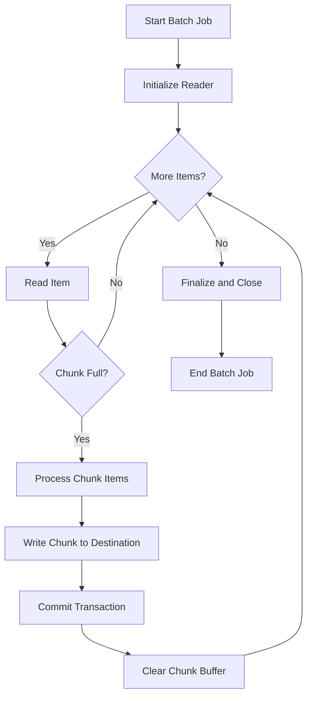
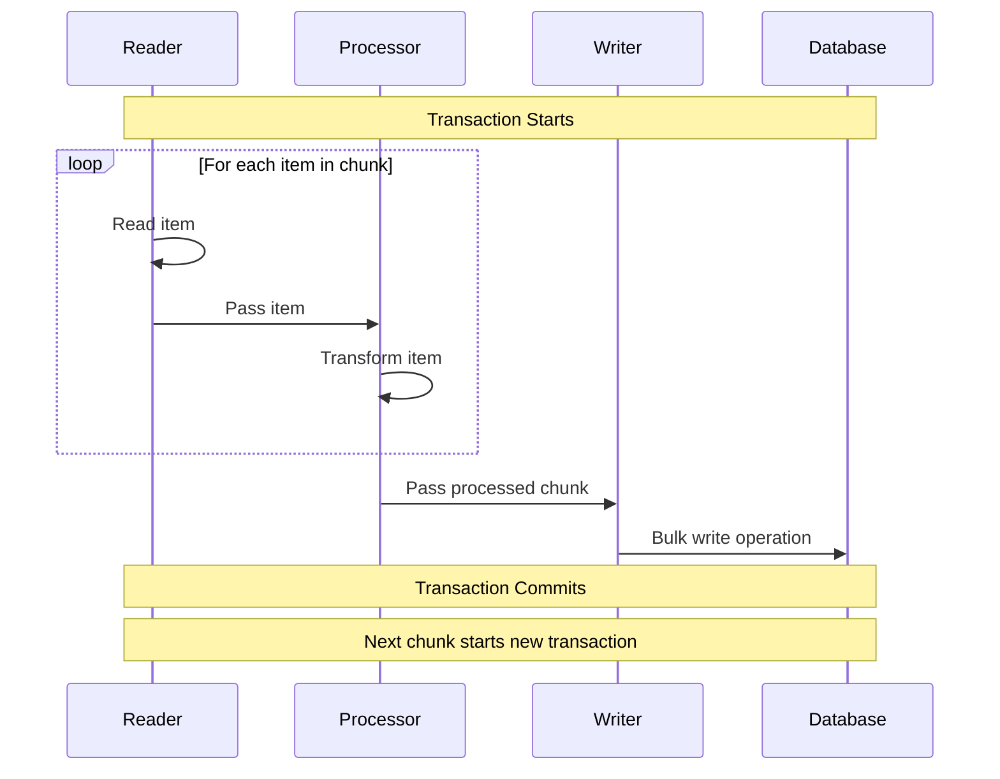
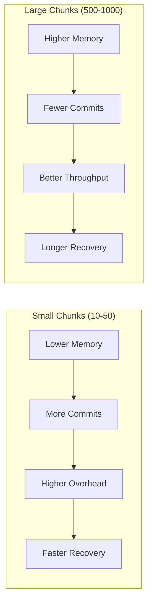
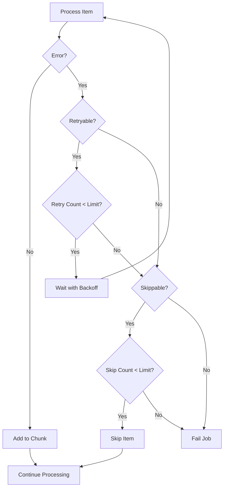

# How to Create Chunk Processing

Author: [nawazdhandala](https://github.com/nawazdhandala)

Tags: Batch Processing, Chunk, Spring Batch, Data Processing

Description: Learn to create chunk processing for efficient batch data transformation with commit intervals.

---

> Processing millions of records one at a time is slow and memory-intensive. **Chunk processing** groups records into manageable batches, processes them together, and commits the results in controlled intervals. This pattern dramatically improves throughput while keeping memory usage predictable.

When you need to process large datasets (database migrations, ETL pipelines, report generation, data synchronization), chunk-oriented processing is the industry standard approach. Instead of loading everything into memory or committing after every single record, you work in "chunks" of N items at a time.

This guide covers the chunk processing model, transaction boundaries, tuning strategies, and practical implementations in both Spring Batch (Java) and plain Node.js/TypeScript.

---

## Table of Contents

1. What Is Chunk Processing?
2. Chunk-Oriented Processing Model
3. Transaction Boundaries and Commit Intervals
4. Chunk Size Tuning Strategies
5. Spring Batch Implementation
6. Node.js/TypeScript Implementation
7. Error Handling and Skip Logic
8. Monitoring and Observability
9. Common Pitfalls
10. Summary

---

## 1. What Is Chunk Processing?

Chunk processing is a pattern where you:

1. **Read** a batch of items (the "chunk") from a data source
2. **Process** each item in the chunk (transform, validate, enrich)
3. **Write** the entire chunk to the destination in a single operation
4. **Commit** the transaction after the chunk completes successfully

This approach balances throughput with reliability. If something fails mid-chunk, you only lose the current chunk, not all the work done before it.

| Approach | Memory Usage | Commit Frequency | Recovery Granularity |
|----------|--------------|------------------|----------------------|
| One-at-a-time | Low | Every record | Individual record |
| Load all | Very High | Once at end | Entire dataset |
| Chunk processing | Moderate (configurable) | Every N records | Per chunk |

---

## 2. Chunk-Oriented Processing Model

The chunk-oriented processing model follows a simple three-phase pattern that repeats until all data is processed.



Each phase has a specific responsibility:

### Read Phase
- Fetch items one at a time from the source (database cursor, file stream, API pagination)
- Accumulate items into a chunk buffer until the chunk size is reached
- Return null/empty when no more items exist

### Process Phase
- Transform each item in the chunk
- Apply business logic, validation, enrichment
- Items can be filtered out (returning null skips them)

### Write Phase
- Receive the entire processed chunk at once
- Perform bulk insert/update operations
- This is where database batching provides the biggest performance gains

---

## 3. Transaction Boundaries and Commit Intervals

Understanding transaction boundaries is critical for reliable chunk processing.



### Commit Interval

The commit interval determines how many items are processed before a database commit occurs. This is typically equal to your chunk size, but they can be configured separately in some frameworks.

```
Chunk Size = 100
Commit Interval = 100

Records 1-100:   [Read -> Process -> Write] -> COMMIT
Records 101-200: [Read -> Process -> Write] -> COMMIT
Records 201-300: [Read -> Process -> Write] -> COMMIT
```

### Transaction Boundary Rules

1. **One transaction per chunk**: The entire read-process-write cycle for a chunk happens within a single transaction
2. **Rollback scope**: If any part of a chunk fails, the entire chunk is rolled back
3. **Restart capability**: Job can resume from the last committed chunk after a failure
4. **Isolation**: Each chunk is independent, so parallel processing of different chunks is possible

---

## 4. Chunk Size Tuning Strategies

Choosing the right chunk size affects performance, memory usage, and failure recovery.



### Factors to Consider

| Factor | Smaller Chunk | Larger Chunk |
|--------|---------------|--------------|
| Memory per chunk | Lower | Higher |
| Commit overhead | Higher (more commits) | Lower (fewer commits) |
| Network round trips | More frequent | Less frequent |
| Failure recovery time | Faster (less re-work) | Slower (more re-work) |
| Database lock duration | Shorter | Longer |

### Recommended Starting Points

| Use Case | Starting Chunk Size | Reasoning |
|----------|---------------------|-----------|
| Simple transformations | 500-1000 | Low memory per item, maximize throughput |
| Complex processing | 100-200 | Higher memory per item, balance load |
| External API calls | 50-100 | Rate limiting, avoid timeouts |
| Large objects (images, docs) | 10-50 | Memory constraints |
| Critical financial data | 50-100 | Minimize rollback impact |

### Tuning Process

1. Start with a baseline (e.g., 100 items)
2. Measure throughput (records/second)
3. Monitor memory usage during processing
4. Watch for database lock contention
5. Adjust and re-measure

---

## 5. Spring Batch Implementation

Spring Batch is the de facto standard for batch processing in Java. Here is a complete chunk processing example.

### Dependencies (Maven)

```xml
<dependencies>
    <dependency>
        <groupId>org.springframework.boot</groupId>
        <artifactId>spring-boot-starter-batch</artifactId>
    </dependency>
    <dependency>
        <groupId>org.springframework.boot</groupId>
        <artifactId>spring-boot-starter-data-jpa</artifactId>
    </dependency>
    <dependency>
        <groupId>com.h2database</groupId>
        <artifactId>h2</artifactId>
        <scope>runtime</scope>
    </dependency>
</dependencies>
```

### Domain Objects

```java
// Customer.java - Input domain object representing raw customer data
public class Customer {
    private Long id;
    private String firstName;
    private String lastName;
    private String email;
    private String status;

    // Constructors
    public Customer() {}

    public Customer(Long id, String firstName, String lastName,
                    String email, String status) {
        this.id = id;
        this.firstName = firstName;
        this.lastName = lastName;
        this.email = email;
        this.status = status;
    }

    // Getters and setters
    public Long getId() { return id; }
    public void setId(Long id) { this.id = id; }

    public String getFirstName() { return firstName; }
    public void setFirstName(String firstName) { this.firstName = firstName; }

    public String getLastName() { return lastName; }
    public void setLastName(String lastName) { this.lastName = lastName; }

    public String getEmail() { return email; }
    public void setEmail(String email) { this.email = email; }

    public String getStatus() { return status; }
    public void setStatus(String status) { this.status = status; }
}
```

```java
// ProcessedCustomer.java - Output domain object after transformation
public class ProcessedCustomer {
    private Long id;
    private String fullName;        // Combined first + last name
    private String normalizedEmail; // Lowercase, trimmed email
    private boolean isActive;       // Derived from status field
    private LocalDateTime processedAt;

    // Constructors
    public ProcessedCustomer() {}

    public ProcessedCustomer(Long id, String fullName, String normalizedEmail,
                             boolean isActive, LocalDateTime processedAt) {
        this.id = id;
        this.fullName = fullName;
        this.normalizedEmail = normalizedEmail;
        this.isActive = isActive;
        this.processedAt = processedAt;
    }

    // Getters and setters omitted for brevity
}
```

### ItemReader - Reading Data in Chunks

```java
// CustomerItemReader.java - Reads customers from database using pagination
@Component
public class CustomerItemReader extends JdbcPagingItemReader<Customer> {

    public CustomerItemReader(DataSource dataSource) {
        // Set the data source for database connection
        setDataSource(dataSource);

        // Page size determines how many records are fetched per database query
        // This is different from chunk size - page size is for reading efficiency
        setPageSize(100);

        // Configure the query provider for pagination
        SqlPagingQueryProviderFactoryBean queryProvider =
            new SqlPagingQueryProviderFactoryBean();
        queryProvider.setDataSource(dataSource);
        queryProvider.setSelectClause("SELECT id, first_name, last_name, email, status");
        queryProvider.setFromClause("FROM customers");
        queryProvider.setWhereClause("WHERE status != 'DELETED'");
        queryProvider.setSortKey("id"); // Required for consistent pagination

        try {
            setQueryProvider(queryProvider.getObject());
        } catch (Exception e) {
            throw new RuntimeException("Failed to create query provider", e);
        }

        // Map database rows to Customer objects
        setRowMapper((rs, rowNum) -> new Customer(
            rs.getLong("id"),
            rs.getString("first_name"),
            rs.getString("last_name"),
            rs.getString("email"),
            rs.getString("status")
        ));
    }
}
```

### ItemProcessor - Transforming Each Item

```java
// CustomerItemProcessor.java - Transforms Customer to ProcessedCustomer
@Component
public class CustomerItemProcessor implements ItemProcessor<Customer, ProcessedCustomer> {

    private static final Logger log = LoggerFactory.getLogger(CustomerItemProcessor.class);

    /**
     * Process a single customer record.
     *
     * @param customer The input customer from the reader
     * @return The processed customer, or null to skip this record
     */
    @Override
    public ProcessedCustomer process(Customer customer) throws Exception {
        // Validate email - skip records with invalid emails
        if (customer.getEmail() == null || !customer.getEmail().contains("@")) {
            log.warn("Skipping customer {} - invalid email: {}",
                     customer.getId(), customer.getEmail());
            return null; // Returning null skips this item
        }

        // Transform the data
        String fullName = String.format("%s %s",
            customer.getFirstName().trim(),
            customer.getLastName().trim());

        String normalizedEmail = customer.getEmail()
            .toLowerCase()
            .trim();

        boolean isActive = "ACTIVE".equalsIgnoreCase(customer.getStatus());

        // Create and return the processed object
        ProcessedCustomer processed = new ProcessedCustomer(
            customer.getId(),
            fullName,
            normalizedEmail,
            isActive,
            LocalDateTime.now()
        );

        log.debug("Processed customer {}: {} -> {}",
                  customer.getId(), customer.getEmail(), normalizedEmail);

        return processed;
    }
}
```

### ItemWriter - Writing Chunks to Database

```java
// ProcessedCustomerItemWriter.java - Writes processed customers in bulk
@Component
public class ProcessedCustomerItemWriter implements ItemWriter<ProcessedCustomer> {

    private static final Logger log = LoggerFactory.getLogger(ProcessedCustomerItemWriter.class);

    private final JdbcTemplate jdbcTemplate;

    public ProcessedCustomerItemWriter(JdbcTemplate jdbcTemplate) {
        this.jdbcTemplate = jdbcTemplate;
    }

    /**
     * Write a chunk of processed customers to the database.
     * This method receives the entire chunk at once for efficient bulk operations.
     *
     * @param chunk The list of processed customers to write
     */
    @Override
    public void write(Chunk<? extends ProcessedCustomer> chunk) throws Exception {
        List<? extends ProcessedCustomer> items = chunk.getItems();

        log.info("Writing chunk of {} processed customers", items.size());

        // Use batch update for efficient bulk insert
        String sql = """
            INSERT INTO processed_customers
            (id, full_name, normalized_email, is_active, processed_at)
            VALUES (?, ?, ?, ?, ?)
            ON CONFLICT (id) DO UPDATE SET
                full_name = EXCLUDED.full_name,
                normalized_email = EXCLUDED.normalized_email,
                is_active = EXCLUDED.is_active,
                processed_at = EXCLUDED.processed_at
            """;

        // Batch all inserts in a single database round trip
        jdbcTemplate.batchUpdate(sql, new BatchPreparedStatementSetter() {
            @Override
            public void setValues(PreparedStatement ps, int i) throws SQLException {
                ProcessedCustomer customer = items.get(i);
                ps.setLong(1, customer.getId());
                ps.setString(2, customer.getFullName());
                ps.setString(3, customer.getNormalizedEmail());
                ps.setBoolean(4, customer.isActive());
                ps.setTimestamp(5, Timestamp.valueOf(customer.getProcessedAt()));
            }

            @Override
            public int getBatchSize() {
                return items.size();
            }
        });

        log.info("Successfully wrote {} customers to processed_customers table",
                 items.size());
    }
}
```

### Job Configuration - Putting It All Together

```java
// BatchConfiguration.java - Configures the chunk-oriented batch job
@Configuration
@EnableBatchProcessing
public class BatchConfiguration {

    private final JobRepository jobRepository;
    private final PlatformTransactionManager transactionManager;

    public BatchConfiguration(JobRepository jobRepository,
                              PlatformTransactionManager transactionManager) {
        this.jobRepository = jobRepository;
        this.transactionManager = transactionManager;
    }

    /**
     * Define the chunk-oriented step.
     *
     * Key configuration:
     * - chunk(100): Process 100 items before committing
     * - reader: Fetches Customer objects from source
     * - processor: Transforms Customer to ProcessedCustomer
     * - writer: Bulk writes ProcessedCustomer to destination
     */
    @Bean
    public Step processCustomersStep(CustomerItemReader reader,
                                     CustomerItemProcessor processor,
                                     ProcessedCustomerItemWriter writer) {
        return new StepBuilder("processCustomersStep", jobRepository)
            // Define chunk size - this is the commit interval
            // Every 100 items, the transaction commits
            .<Customer, ProcessedCustomer>chunk(100, transactionManager)

            // Wire up the reader, processor, and writer
            .reader(reader)
            .processor(processor)
            .writer(writer)

            // Configure fault tolerance
            .faultTolerant()
            .skipLimit(10) // Allow up to 10 skipped items
            .skip(ValidationException.class) // Skip on validation errors
            .retryLimit(3) // Retry transient failures up to 3 times
            .retry(TransientDataAccessException.class)

            // Add a listener for monitoring
            .listener(new ChunkListener() {
                @Override
                public void beforeChunk(ChunkContext context) {
                    // Called before each chunk starts
                }

                @Override
                public void afterChunk(ChunkContext context) {
                    // Called after each chunk commits successfully
                    int count = context.getStepContext()
                        .getStepExecution()
                        .getWriteCount();
                    log.info("Chunk committed. Total written: {}", count);
                }

                @Override
                public void afterChunkError(ChunkContext context) {
                    // Called when a chunk fails
                    log.error("Chunk failed, will be rolled back");
                }
            })
            .build();
    }

    /**
     * Define the batch job with the chunk processing step.
     */
    @Bean
    public Job processCustomersJob(Step processCustomersStep) {
        return new JobBuilder("processCustomersJob", jobRepository)
            .incrementer(new RunIdIncrementer())
            .start(processCustomersStep)
            .build();
    }
}
```

---

## 6. Node.js/TypeScript Implementation

Here is a pure TypeScript implementation of chunk processing without Spring Batch.

### Types and Interfaces

```typescript
// types.ts - Core type definitions for chunk processing

/**
 * ItemReader reads items one at a time from a data source.
 * Returns null when no more items are available.
 */
export interface ItemReader<T> {
  read(): Promise<T | null>;
  open(): Promise<void>;
  close(): Promise<void>;
}

/**
 * ItemProcessor transforms an input item to an output item.
 * Returns null to skip the item.
 */
export interface ItemProcessor<In, O> {
  process(item: In): Promise<O | null>;
}

/**
 * ItemWriter receives a chunk of items and writes them in bulk.
 */
export interface ItemWriter<T> {
  write(items: T[]): Promise<void>;
}

/**
 * ChunkListener provides hooks for monitoring chunk execution.
 */
export interface ChunkListener {
  beforeChunk?(chunkNumber: number): void;
  afterChunk?(chunkNumber: number, itemCount: number): void;
  onChunkError?(chunkNumber: number, error: Error): void;
}

/**
 * Configuration options for chunk processing.
 */
export interface ChunkProcessorConfig {
  chunkSize: number;           // Number of items per chunk
  skipLimit?: number;          // Max items to skip before failing
  retryLimit?: number;         // Max retries per item
  retryableErrors?: string[];  // Error types that can be retried
}
```

### Chunk Processor Core

```typescript
// chunk-processor.ts - Core chunk processing engine

import {
  ItemReader,
  ItemProcessor,
  ItemWriter,
  ChunkListener,
  ChunkProcessorConfig
} from './types';

/**
 * ChunkProcessor orchestrates the read-process-write cycle.
 *
 * It reads items until a chunk is full, processes all items in the chunk,
 * then writes the entire chunk in a single operation.
 */
export class ChunkProcessor<In, O> {
  private reader: ItemReader<In>;
  private processor: ItemProcessor<In, O>;
  private writer: ItemWriter<O>;
  private config: ChunkProcessorConfig;
  private listeners: ChunkListener[] = [];

  // Metrics for monitoring
  private totalRead = 0;
  private totalWritten = 0;
  private totalSkipped = 0;
  private totalChunks = 0;

  constructor(
    reader: ItemReader<In>,
    processor: ItemProcessor<In, O>,
    writer: ItemWriter<O>,
    config: ChunkProcessorConfig
  ) {
    this.reader = reader;
    this.processor = processor;
    this.writer = writer;
    this.config = {
      skipLimit: 10,
      retryLimit: 3,
      retryableErrors: [],
      ...config
    };
  }

  /**
   * Add a listener for chunk lifecycle events.
   */
  addListener(listener: ChunkListener): void {
    this.listeners.push(listener);
  }

  /**
   * Execute the batch job, processing all items in chunks.
   */
  async execute(): Promise<ChunkProcessorResult> {
    const startTime = Date.now();

    try {
      // Initialize the reader (open database connections, file handles, etc.)
      await this.reader.open();

      // Process chunks until no more items
      let hasMore = true;
      while (hasMore) {
        hasMore = await this.processChunk();
      }

      return {
        success: true,
        totalRead: this.totalRead,
        totalWritten: this.totalWritten,
        totalSkipped: this.totalSkipped,
        totalChunks: this.totalChunks,
        durationMs: Date.now() - startTime
      };
    } finally {
      // Always close the reader to release resources
      await this.reader.close();
    }
  }

  /**
   * Process a single chunk of items.
   * Returns false when no more items are available.
   */
  private async processChunk(): Promise<boolean> {
    this.totalChunks++;
    const chunkNumber = this.totalChunks;

    // Notify listeners that a chunk is starting
    this.listeners.forEach(l => l.beforeChunk?.(chunkNumber));

    try {
      // Phase 1: Read items until chunk is full or no more items
      const inputItems: In[] = [];
      for (let i = 0; i < this.config.chunkSize; i++) {
        const item = await this.reader.read();
        if (item === null) {
          break; // No more items
        }
        inputItems.push(item);
        this.totalRead++;
      }

      // If no items were read, we are done
      if (inputItems.length === 0) {
        return false;
      }

      // Phase 2: Process each item in the chunk
      const processedItems: O[] = [];
      for (const item of inputItems) {
        const processed = await this.processItemWithRetry(item);
        if (processed !== null) {
          processedItems.push(processed);
        } else {
          this.totalSkipped++;
          this.checkSkipLimit();
        }
      }

      // Phase 3: Write the chunk to the destination
      if (processedItems.length > 0) {
        await this.writer.write(processedItems);
        this.totalWritten += processedItems.length;
      }

      // Notify listeners that the chunk completed successfully
      this.listeners.forEach(l => l.afterChunk?.(chunkNumber, processedItems.length));

      // Return true if we read a full chunk (more items may exist)
      return inputItems.length === this.config.chunkSize;

    } catch (error) {
      // Notify listeners of the error
      this.listeners.forEach(l => l.onChunkError?.(chunkNumber, error as Error));
      throw error;
    }
  }

  /**
   * Process a single item with retry logic.
   */
  private async processItemWithRetry(item: In): Promise<O | null> {
    let lastError: Error | null = null;

    for (let attempt = 1; attempt <= this.config.retryLimit!; attempt++) {
      try {
        return await this.processor.process(item);
      } catch (error) {
        lastError = error as Error;

        // Check if this error type is retryable
        const isRetryable = this.config.retryableErrors?.some(
          errType => lastError?.name === errType || lastError?.message.includes(errType)
        );

        if (!isRetryable || attempt === this.config.retryLimit) {
          throw lastError;
        }

        // Exponential backoff before retry
        await this.sleep(Math.pow(2, attempt) * 100);
      }
    }

    throw lastError;
  }

  /**
   * Check if we have exceeded the skip limit.
   */
  private checkSkipLimit(): void {
    if (this.totalSkipped > this.config.skipLimit!) {
      throw new Error(
        `Skip limit exceeded: ${this.totalSkipped} items skipped, limit is ${this.config.skipLimit}`
      );
    }
  }

  private sleep(ms: number): Promise<void> {
    return new Promise(resolve => setTimeout(resolve, ms));
  }
}

export interface ChunkProcessorResult {
  success: boolean;
  totalRead: number;
  totalWritten: number;
  totalSkipped: number;
  totalChunks: number;
  durationMs: number;
}
```

### Example Implementation

```typescript
// example-batch-job.ts - Complete working example

import { Pool, PoolClient } from 'pg';
import {
  ItemReader,
  ItemProcessor,
  ItemWriter
} from './types';
import { ChunkProcessor } from './chunk-processor';

// Domain types
interface RawOrder {
  id: number;
  customerId: number;
  amount: number;
  status: string;
  createdAt: Date;
}

interface ProcessedOrder {
  id: number;
  customerId: number;
  amount: number;
  tax: number;
  total: number;
  status: string;
  processedAt: Date;
}

/**
 * Database cursor reader for efficient memory usage.
 * Uses a server-side cursor to stream results.
 */
class OrderReader implements ItemReader<RawOrder> {
  private pool: Pool;
  private client: PoolClient | null = null;
  private cursor: any = null;
  private buffer: RawOrder[] = [];
  private fetchSize = 100; // Fetch 100 rows at a time from cursor

  constructor(pool: Pool) {
    this.pool = pool;
  }

  async open(): Promise<void> {
    // Get a dedicated connection for the cursor
    this.client = await this.pool.connect();

    // Begin a transaction (required for cursors in PostgreSQL)
    await this.client.query('BEGIN');

    // Declare a server-side cursor
    await this.client.query(`
      DECLARE order_cursor CURSOR FOR
      SELECT id, customer_id, amount, status, created_at
      FROM orders
      WHERE status = 'PENDING'
      ORDER BY id
    `);

    console.log('OrderReader opened - cursor initialized');
  }

  async read(): Promise<RawOrder | null> {
    // If buffer is empty, fetch more rows from cursor
    if (this.buffer.length === 0) {
      const result = await this.client!.query(
        `FETCH ${this.fetchSize} FROM order_cursor`
      );

      if (result.rows.length === 0) {
        return null; // No more data
      }

      // Map database rows to domain objects
      this.buffer = result.rows.map(row => ({
        id: row.id,
        customerId: row.customer_id,
        amount: parseFloat(row.amount),
        status: row.status,
        createdAt: row.created_at
      }));
    }

    // Return the next item from the buffer
    return this.buffer.shift() || null;
  }

  async close(): Promise<void> {
    if (this.client) {
      await this.client.query('CLOSE order_cursor');
      await this.client.query('COMMIT');
      this.client.release();
      console.log('OrderReader closed - cursor released');
    }
  }
}

/**
 * Processor that calculates tax and total for each order.
 */
class OrderProcessor implements ItemProcessor<RawOrder, ProcessedOrder> {
  private taxRate: number;

  constructor(taxRate: number = 0.08) {
    this.taxRate = taxRate;
  }

  async process(order: RawOrder): Promise<ProcessedOrder | null> {
    // Skip orders with zero or negative amounts
    if (order.amount <= 0) {
      console.log(`Skipping order ${order.id} - invalid amount: ${order.amount}`);
      return null;
    }

    // Calculate tax and total
    const tax = Math.round(order.amount * this.taxRate * 100) / 100;
    const total = Math.round((order.amount + tax) * 100) / 100;

    // Return the processed order
    return {
      id: order.id,
      customerId: order.customerId,
      amount: order.amount,
      tax,
      total,
      status: 'PROCESSED',
      processedAt: new Date()
    };
  }
}

/**
 * Writer that bulk inserts processed orders.
 */
class OrderWriter implements ItemWriter<ProcessedOrder> {
  private pool: Pool;

  constructor(pool: Pool) {
    this.pool = pool;
  }

  async write(orders: ProcessedOrder[]): Promise<void> {
    const client = await this.pool.connect();

    try {
      // Start a transaction for this chunk
      await client.query('BEGIN');

      // Build a bulk insert query
      const values: any[] = [];
      const placeholders: string[] = [];

      orders.forEach((order, index) => {
        const offset = index * 7;
        placeholders.push(
          `($${offset + 1}, $${offset + 2}, $${offset + 3}, $${offset + 4}, $${offset + 5}, $${offset + 6}, $${offset + 7})`
        );
        values.push(
          order.id,
          order.customerId,
          order.amount,
          order.tax,
          order.total,
          order.status,
          order.processedAt
        );
      });

      const sql = `
        INSERT INTO processed_orders
        (id, customer_id, amount, tax, total, status, processed_at)
        VALUES ${placeholders.join(', ')}
        ON CONFLICT (id) DO UPDATE SET
          tax = EXCLUDED.tax,
          total = EXCLUDED.total,
          status = EXCLUDED.status,
          processed_at = EXCLUDED.processed_at
      `;

      await client.query(sql, values);

      // Also update the original orders to mark them as processed
      const orderIds = orders.map(o => o.id);
      await client.query(
        `UPDATE orders SET status = 'PROCESSED' WHERE id = ANY($1)`,
        [orderIds]
      );

      // Commit the transaction
      await client.query('COMMIT');

      console.log(`Wrote ${orders.length} orders successfully`);

    } catch (error) {
      // Rollback on any error
      await client.query('ROLLBACK');
      throw error;
    } finally {
      client.release();
    }
  }
}

/**
 * Main function to run the batch job.
 */
async function runOrderProcessingJob(): Promise<void> {
  // Create database connection pool
  const pool = new Pool({
    host: process.env.DB_HOST || 'localhost',
    port: parseInt(process.env.DB_PORT || '5432'),
    database: process.env.DB_NAME || 'orders_db',
    user: process.env.DB_USER || 'batch_user',
    password: process.env.DB_PASSWORD,
    max: 10 // Connection pool size
  });

  try {
    // Create the chunk processor with components
    const processor = new ChunkProcessor<RawOrder, ProcessedOrder>(
      new OrderReader(pool),
      new OrderProcessor(0.08), // 8% tax rate
      new OrderWriter(pool),
      {
        chunkSize: 100,    // Process 100 orders per chunk
        skipLimit: 50,     // Allow up to 50 skipped orders
        retryLimit: 3,     // Retry failed items up to 3 times
        retryableErrors: ['ECONNRESET', 'ETIMEDOUT']
      }
    );

    // Add monitoring listener
    processor.addListener({
      beforeChunk(chunkNumber) {
        console.log(`Starting chunk ${chunkNumber}...`);
      },
      afterChunk(chunkNumber, itemCount) {
        console.log(`Chunk ${chunkNumber} completed: ${itemCount} items written`);
      },
      onChunkError(chunkNumber, error) {
        console.error(`Chunk ${chunkNumber} failed:`, error.message);
      }
    });

    // Execute the batch job
    console.log('Starting order processing batch job...');
    const result = await processor.execute();

    // Report results
    console.log('Batch job completed:');
    console.log(`  Total read: ${result.totalRead}`);
    console.log(`  Total written: ${result.totalWritten}`);
    console.log(`  Total skipped: ${result.totalSkipped}`);
    console.log(`  Total chunks: ${result.totalChunks}`);
    console.log(`  Duration: ${result.durationMs}ms`);
    console.log(`  Throughput: ${Math.round(result.totalRead / (result.durationMs / 1000))} items/sec`);

  } finally {
    // Clean up database connections
    await pool.end();
  }
}

// Run the job
runOrderProcessingJob().catch(console.error);
```

---

## 7. Error Handling and Skip Logic

Robust error handling is essential for production batch jobs.



### Skip Policy Implementation

```typescript
// skip-policy.ts - Configurable skip behavior

export interface SkipPolicy {
  shouldSkip(error: Error, skipCount: number): boolean;
}

/**
 * Skip specific error types up to a limit.
 */
export class LimitedSkipPolicy implements SkipPolicy {
  private skippableErrors: Set<string>;
  private limit: number;

  constructor(skippableErrors: string[], limit: number) {
    this.skippableErrors = new Set(skippableErrors);
    this.limit = limit;
  }

  shouldSkip(error: Error, skipCount: number): boolean {
    // Check if we have exceeded the skip limit
    if (skipCount >= this.limit) {
      return false;
    }

    // Check if this error type is skippable
    return this.skippableErrors.has(error.name) ||
           this.skippableErrors.has(error.constructor.name);
  }
}

/**
 * Never skip any errors - fail immediately.
 */
export class NeverSkipPolicy implements SkipPolicy {
  shouldSkip(): boolean {
    return false;
  }
}

/**
 * Skip all errors up to a limit (use with caution).
 */
export class AlwaysSkipPolicy implements SkipPolicy {
  private limit: number;

  constructor(limit: number) {
    this.limit = limit;
  }

  shouldSkip(error: Error, skipCount: number): boolean {
    return skipCount < this.limit;
  }
}
```

### Retry with Exponential Backoff

```typescript
// retry-policy.ts - Retry configuration

export interface RetryPolicy {
  shouldRetry(error: Error, attemptCount: number): boolean;
  getDelayMs(attemptCount: number): number;
}

/**
 * Exponential backoff retry for transient errors.
 */
export class ExponentialBackoffRetryPolicy implements RetryPolicy {
  private retryableErrors: Set<string>;
  private maxAttempts: number;
  private baseDelayMs: number;
  private maxDelayMs: number;

  constructor(options: {
    retryableErrors: string[];
    maxAttempts: number;
    baseDelayMs?: number;
    maxDelayMs?: number;
  }) {
    this.retryableErrors = new Set(options.retryableErrors);
    this.maxAttempts = options.maxAttempts;
    this.baseDelayMs = options.baseDelayMs || 100;
    this.maxDelayMs = options.maxDelayMs || 30000;
  }

  shouldRetry(error: Error, attemptCount: number): boolean {
    if (attemptCount >= this.maxAttempts) {
      return false;
    }

    return this.retryableErrors.has(error.name) ||
           this.retryableErrors.has(error.constructor.name) ||
           // Also check error message for common patterns
           error.message.includes('ECONNRESET') ||
           error.message.includes('ETIMEDOUT') ||
           error.message.includes('deadlock');
  }

  getDelayMs(attemptCount: number): number {
    // Exponential backoff: 100ms, 200ms, 400ms, 800ms, ...
    const delay = this.baseDelayMs * Math.pow(2, attemptCount - 1);

    // Add jitter to prevent thundering herd
    const jitter = Math.random() * 0.3 * delay;

    return Math.min(delay + jitter, this.maxDelayMs);
  }
}
```

---

## 8. Monitoring and Observability

Track these metrics for healthy batch jobs:

| Metric | Description | Alert Threshold |
|--------|-------------|-----------------|
| `batch.items.read` | Total items read from source | N/A (informational) |
| `batch.items.written` | Total items written to destination | < expected count |
| `batch.items.skipped` | Items skipped due to errors | > 1% of total |
| `batch.chunks.completed` | Number of committed chunks | N/A (informational) |
| `batch.chunk.duration_ms` | Time to process each chunk | > 2x average |
| `batch.throughput.items_per_sec` | Processing rate | < baseline |
| `batch.errors.total` | Total errors encountered | > threshold |

### OpenTelemetry Integration

```typescript
// batch-telemetry.ts - Add observability to batch jobs

import { trace, metrics, SpanStatusCode } from '@opentelemetry/api';

const tracer = trace.getTracer('batch-processor');
const meter = metrics.getMeter('batch-processor');

// Create metrics instruments
const itemsReadCounter = meter.createCounter('batch.items.read', {
  description: 'Number of items read from source'
});

const itemsWrittenCounter = meter.createCounter('batch.items.written', {
  description: 'Number of items written to destination'
});

const itemsSkippedCounter = meter.createCounter('batch.items.skipped', {
  description: 'Number of items skipped due to errors'
});

const chunkDurationHistogram = meter.createHistogram('batch.chunk.duration_ms', {
  description: 'Duration of each chunk in milliseconds',
  unit: 'ms'
});

/**
 * Instrumented chunk listener for observability.
 */
export class TelemetryChunkListener implements ChunkListener {
  private jobName: string;
  private chunkStartTime: number = 0;

  constructor(jobName: string) {
    this.jobName = jobName;
  }

  beforeChunk(chunkNumber: number): void {
    this.chunkStartTime = Date.now();
  }

  afterChunk(chunkNumber: number, itemCount: number): void {
    const duration = Date.now() - this.chunkStartTime;

    // Record metrics
    itemsWrittenCounter.add(itemCount, { job: this.jobName });
    chunkDurationHistogram.record(duration, { job: this.jobName });
  }

  onChunkError(chunkNumber: number, error: Error): void {
    // Record error in current span
    const span = trace.getActiveSpan();
    if (span) {
      span.recordException(error);
      span.setStatus({ code: SpanStatusCode.ERROR, message: error.message });
    }
  }
}

/**
 * Wrap batch execution with a trace span.
 */
export async function executeWithTelemetry<In, O>(
  processor: ChunkProcessor<In, O>,
  jobName: string
): Promise<ChunkProcessorResult> {
  return tracer.startActiveSpan(`batch.job.${jobName}`, async (span) => {
    span.setAttribute('batch.job.name', jobName);

    try {
      const result = await processor.execute();

      // Record final metrics
      span.setAttribute('batch.total.read', result.totalRead);
      span.setAttribute('batch.total.written', result.totalWritten);
      span.setAttribute('batch.total.skipped', result.totalSkipped);
      span.setAttribute('batch.total.chunks', result.totalChunks);
      span.setAttribute('batch.duration.ms', result.durationMs);

      return result;
    } catch (error) {
      span.recordException(error as Error);
      span.setStatus({ code: SpanStatusCode.ERROR });
      throw error;
    } finally {
      span.end();
    }
  });
}
```

---

## 9. Common Pitfalls

### 1. Chunk Size Too Large

**Problem**: Memory exhaustion or long transaction locks.

**Solution**: Start with 100-500 items and tune based on monitoring.

```typescript
// Bad: Processing millions in one chunk
const processor = new ChunkProcessor(reader, transformer, writer, {
  chunkSize: 1000000 // This will likely cause OOM
});

// Good: Reasonable chunk size
const processor = new ChunkProcessor(reader, transformer, writer, {
  chunkSize: 500
});
```

### 2. Not Using Database Batching in Writer

**Problem**: One SQL statement per item defeats the purpose of chunking.

```typescript
// Bad: Individual inserts
async write(items: Order[]): Promise<void> {
  for (const item of items) {
    await db.query('INSERT INTO orders VALUES ($1)', [item]); // N round trips!
  }
}

// Good: Bulk insert
async write(items: Order[]): Promise<void> {
  const values = items.map(i => `(${i.id}, ${i.amount})`).join(',');
  await db.query(`INSERT INTO orders VALUES ${values}`); // 1 round trip
}
```

### 3. Forgetting Transaction Boundaries

**Problem**: Each read/write has its own transaction, losing atomicity.

```typescript
// Bad: No transaction management
async write(items: Order[]): Promise<void> {
  await db.query('INSERT ...', items); // Auto-commit after each statement
}

// Good: Explicit transaction
async write(items: Order[]): Promise<void> {
  const client = await pool.connect();
  try {
    await client.query('BEGIN');
    await client.query('INSERT ...', items);
    await client.query('COMMIT');
  } catch (e) {
    await client.query('ROLLBACK');
    throw e;
  } finally {
    client.release();
  }
}
```

### 4. Loading All Data Before Processing

**Problem**: Memory exhaustion with large datasets.

```typescript
// Bad: Load everything into memory
const allRecords = await db.query('SELECT * FROM orders'); // Millions of rows!
for (const record of allRecords) {
  process(record);
}

// Good: Use cursor or pagination
const cursor = db.cursor('SELECT * FROM orders');
let row;
while ((row = await cursor.read()) !== null) {
  process(row);
}
```

### 5. No Restart Capability

**Problem**: Job failure means starting from scratch.

**Solution**: Track progress and implement checkpoint/restart.

```typescript
// Track the last successfully processed ID
async saveCheckpoint(lastId: number): Promise<void> {
  await db.query(
    'UPDATE job_state SET last_processed_id = $1 WHERE job_name = $2',
    [lastId, this.jobName]
  );
}

// Resume from checkpoint on restart
async getStartingPoint(): Promise<number> {
  const result = await db.query(
    'SELECT last_processed_id FROM job_state WHERE job_name = $1',
    [this.jobName]
  );
  return result.rows[0]?.last_processed_id || 0;
}
```

---

## 10. Summary

Chunk processing is the foundation of efficient batch data processing. Key takeaways:

| Concept | Key Point |
|---------|-----------|
| Chunk Model | Read items into a buffer, process the buffer, write in bulk |
| Transaction Boundaries | One transaction per chunk, commit after write phase |
| Chunk Size | Balance memory, throughput, and recovery time (start with 100-500) |
| Error Handling | Use skip and retry policies for resilience |
| Monitoring | Track read/write counts, chunk duration, error rates |

The chunk-oriented pattern provides:

- **Predictable memory usage**: Only one chunk in memory at a time
- **Efficient I/O**: Bulk database operations instead of individual statements
- **Failure isolation**: Only the current chunk is lost on failure
- **Restart capability**: Resume from the last committed chunk

Whether you use Spring Batch, custom TypeScript, or another framework, the fundamental pattern remains the same: read, process, write, commit, repeat.

---

**Related Reading:**

- [Three Pillars of Observability: Logs, Metrics, Traces](https://oneuptime.com/blog/post/2025-08-20-three-pillars-of-observability-logs-metrics-traces/view)
- [How to Structure Logs Properly in OpenTelemetry](https://oneuptime.com/blog/post/2025-08-28-how-to-structure-logs-properly-in-opentelemetry/view)
- [Basics of Profiling](https://oneuptime.com/blog/post/2025-09-09-basics-of-profiling/view)

---

*Building batch processing pipelines? Monitor your jobs with [OneUptime](https://oneuptime.com) to track throughput, catch failures early, and maintain visibility across your data processing infrastructure.*
