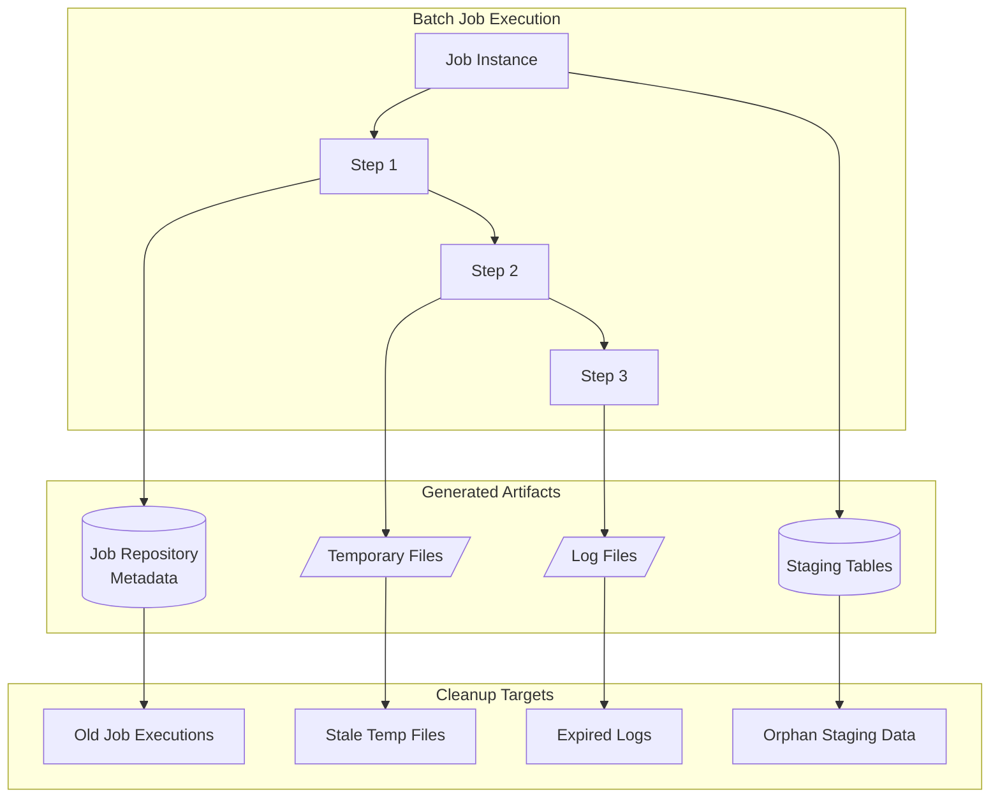
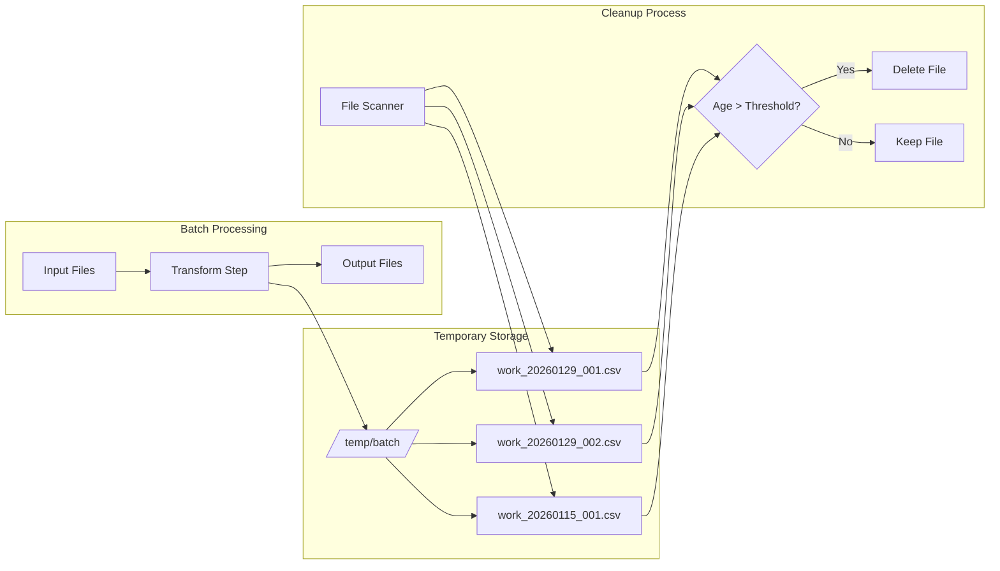
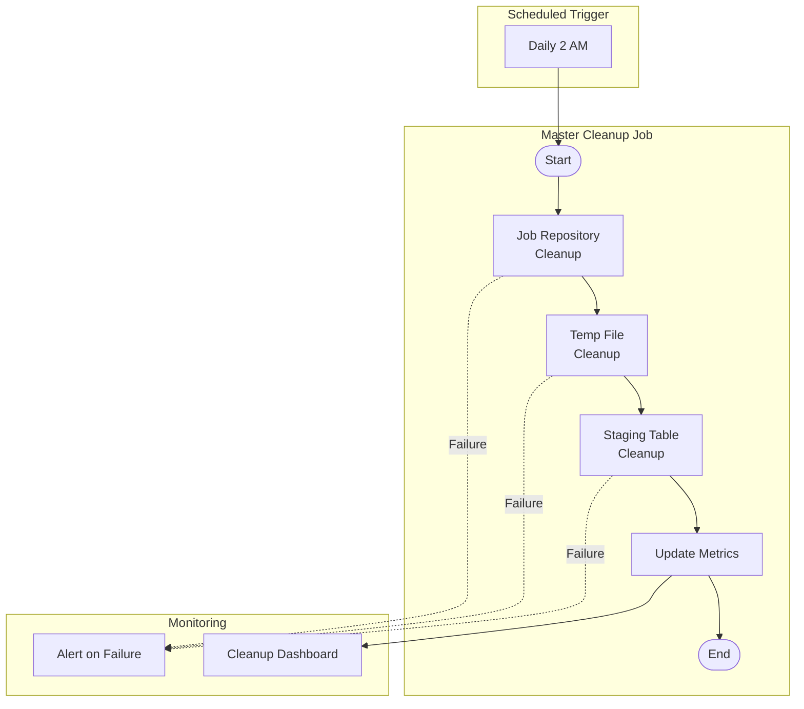
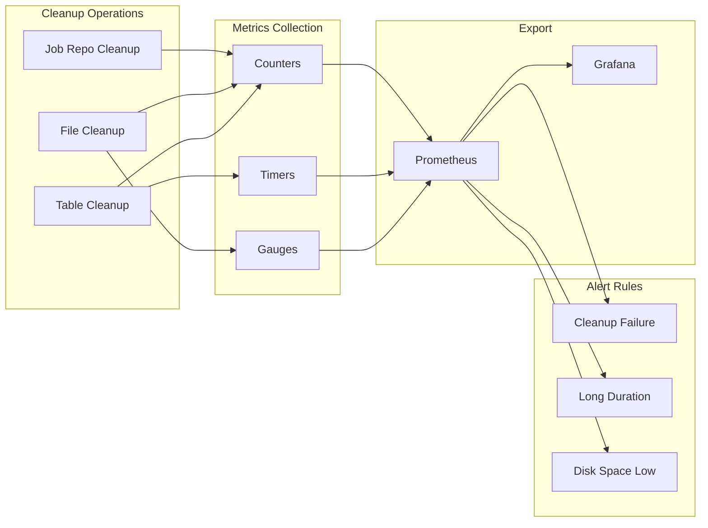

# How to Create Batch Cleanup

Author: [nawazdhandala](https://github.com/nawazdhandala)

Tags: Batch Processing, Cleanup, Maintenance, Spring Batch

Description: Learn to create batch cleanup strategies for removing old job executions and temporary data.

---

Batch processing systems accumulate data over time. Job execution histories, temporary files, and stale records can consume storage and degrade performance. A well-designed cleanup strategy keeps your batch infrastructure healthy without manual intervention.

## Understanding Batch Data Accumulation

When batch jobs run repeatedly, they generate metadata and artifacts that persist beyond the job's lifecycle. Without cleanup, this data grows unbounded.



## 1. Job Repository Cleanup

Spring Batch stores execution history in database tables. The `JobRepository` tracks job instances, executions, step executions, and execution context. Over months of operation, these tables can grow to millions of rows.

### Retention Policy Configuration

Define a retention policy that balances operational needs with storage constraints. Most teams keep 30 to 90 days of history for troubleshooting while removing older records.

`config/BatchCleanupConfig.java`

```java
package com.example.batch.config;

import org.springframework.batch.core.JobExecution;
import org.springframework.batch.core.explore.JobExplorer;
import org.springframework.batch.core.launch.JobOperator;
import org.springframework.batch.core.repository.JobRepository;
import org.springframework.beans.factory.annotation.Value;
import org.springframework.context.annotation.Bean;
import org.springframework.context.annotation.Configuration;
import org.springframework.scheduling.annotation.EnableScheduling;

import javax.sql.DataSource;
import java.time.Duration;

@Configuration
@EnableScheduling
public class BatchCleanupConfig {

    // Number of days to retain job execution history
    // Configurable via application.properties: batch.cleanup.retention-days=30
    @Value("${batch.cleanup.retention-days:30}")
    private int retentionDays;

    // Maximum number of records to delete per cleanup run
    // Prevents long-running transactions that could lock tables
    @Value("${batch.cleanup.batch-size:1000}")
    private int batchSize;

    // Convert retention days to Duration for cleaner time calculations
    @Bean
    public Duration retentionPeriod() {
        return Duration.ofDays(retentionDays);
    }

    // Create the cleanup service with injected dependencies
    @Bean
    public JobRepositoryCleanupService cleanupService(
            DataSource dataSource,
            JobExplorer jobExplorer,
            JobRepository jobRepository) {
        return new JobRepositoryCleanupService(
            dataSource,
            jobExplorer,
            jobRepository,
            retentionDays,
            batchSize
        );
    }
}
```

### Job Repository Cleanup Service

The cleanup service removes old executions while preserving referential integrity. Delete operations must follow the correct order: step execution context, step executions, job execution context, job executions, then job instances.

`service/JobRepositoryCleanupService.java`

```java
package com.example.batch.service;

import org.slf4j.Logger;
import org.slf4j.LoggerFactory;
import org.springframework.batch.core.JobExecution;
import org.springframework.batch.core.JobInstance;
import org.springframework.batch.core.StepExecution;
import org.springframework.batch.core.explore.JobExplorer;
import org.springframework.batch.core.repository.JobRepository;
import org.springframework.jdbc.core.JdbcTemplate;
import org.springframework.scheduling.annotation.Scheduled;
import org.springframework.stereotype.Service;
import org.springframework.transaction.annotation.Transactional;

import javax.sql.DataSource;
import java.time.LocalDateTime;
import java.time.ZoneId;
import java.util.Date;
import java.util.List;
import java.util.Set;
import java.util.stream.Collectors;

@Service
public class JobRepositoryCleanupService {

    private static final Logger logger = LoggerFactory.getLogger(JobRepositoryCleanupService.class);

    private final JdbcTemplate jdbcTemplate;
    private final JobExplorer jobExplorer;
    private final JobRepository jobRepository;
    private final int retentionDays;
    private final int batchSize;

    // SQL statements for deleting batch metadata tables
    // Order matters: child tables must be deleted before parent tables
    private static final String DELETE_STEP_EXECUTION_CONTEXT =
        "DELETE FROM BATCH_STEP_EXECUTION_CONTEXT WHERE STEP_EXECUTION_ID IN " +
        "(SELECT STEP_EXECUTION_ID FROM BATCH_STEP_EXECUTION WHERE JOB_EXECUTION_ID = ?)";

    private static final String DELETE_STEP_EXECUTIONS =
        "DELETE FROM BATCH_STEP_EXECUTION WHERE JOB_EXECUTION_ID = ?";

    private static final String DELETE_JOB_EXECUTION_CONTEXT =
        "DELETE FROM BATCH_JOB_EXECUTION_CONTEXT WHERE JOB_EXECUTION_ID = ?";

    private static final String DELETE_JOB_EXECUTION_PARAMS =
        "DELETE FROM BATCH_JOB_EXECUTION_PARAMS WHERE JOB_EXECUTION_ID = ?";

    private static final String DELETE_JOB_EXECUTION =
        "DELETE FROM BATCH_JOB_EXECUTION WHERE JOB_EXECUTION_ID = ?";

    public JobRepositoryCleanupService(
            DataSource dataSource,
            JobExplorer jobExplorer,
            JobRepository jobRepository,
            int retentionDays,
            int batchSize) {
        this.jdbcTemplate = new JdbcTemplate(dataSource);
        this.jobExplorer = jobExplorer;
        this.jobRepository = jobRepository;
        this.retentionDays = retentionDays;
        this.batchSize = batchSize;
    }

    // Run cleanup daily at 2 AM
    // Cron format: second minute hour day month weekday
    @Scheduled(cron = "0 0 2 * * *")
    public void scheduledCleanup() {
        logger.info("Starting scheduled batch cleanup, retention: {} days", retentionDays);
        CleanupResult result = cleanupOldExecutions();
        logger.info("Cleanup complete: {} job executions removed", result.getDeletedExecutions());
    }

    // Main cleanup method that removes executions older than retention period
    @Transactional
    public CleanupResult cleanupOldExecutions() {
        // Calculate cutoff date based on retention policy
        LocalDateTime cutoffDate = LocalDateTime.now().minusDays(retentionDays);
        Date cutoff = Date.from(cutoffDate.atZone(ZoneId.systemDefault()).toInstant());

        int totalDeleted = 0;

        // Get all job names registered in the repository
        List<String> jobNames = jobExplorer.getJobNames();

        for (String jobName : jobNames) {
            // Process each job type separately
            int deleted = cleanupJobExecutions(jobName, cutoff);
            totalDeleted += deleted;

            // Respect batch size limit to prevent memory issues
            if (totalDeleted >= batchSize) {
                logger.info("Batch size limit reached, will continue in next run");
                break;
            }
        }

        // Clean up orphaned job instances (instances with no executions)
        int orphanedInstances = cleanupOrphanedJobInstances();

        return new CleanupResult(totalDeleted, orphanedInstances);
    }

    // Remove executions for a specific job that are older than cutoff
    private int cleanupJobExecutions(String jobName, Date cutoff) {
        int deleted = 0;

        // Get job instances for this job name
        List<JobInstance> instances = jobExplorer.findJobInstancesByJobName(jobName, 0, batchSize);

        for (JobInstance instance : instances) {
            // Get all executions for this instance
            List<JobExecution> executions = jobExplorer.getJobExecutions(instance);

            for (JobExecution execution : executions) {
                // Only delete completed executions that are old enough
                // Never delete running or recently completed jobs
                if (isEligibleForCleanup(execution, cutoff)) {
                    deleteJobExecution(execution.getId());
                    deleted++;
                    logger.debug("Deleted job execution: {} for job: {}",
                        execution.getId(), jobName);
                }
            }
        }

        return deleted;
    }

    // Check if an execution can be safely deleted
    private boolean isEligibleForCleanup(JobExecution execution, Date cutoff) {
        // Never delete running jobs
        if (execution.isRunning()) {
            return false;
        }

        // Check if execution ended before cutoff date
        Date endTime = execution.getEndTime();
        if (endTime == null) {
            // Use start time for jobs that never completed properly
            endTime = execution.getStartTime();
        }

        return endTime != null && endTime.before(cutoff);
    }

    // Delete a single job execution and all related records
    private void deleteJobExecution(Long executionId) {
        // Delete in order: children first, then parents
        // This maintains referential integrity

        // 1. Delete step execution context (grandchild)
        jdbcTemplate.update(DELETE_STEP_EXECUTION_CONTEXT, executionId);

        // 2. Delete step executions (child)
        jdbcTemplate.update(DELETE_STEP_EXECUTIONS, executionId);

        // 3. Delete job execution context
        jdbcTemplate.update(DELETE_JOB_EXECUTION_CONTEXT, executionId);

        // 4. Delete job execution parameters
        jdbcTemplate.update(DELETE_JOB_EXECUTION_PARAMS, executionId);

        // 5. Delete the job execution itself
        jdbcTemplate.update(DELETE_JOB_EXECUTION, executionId);
    }

    // Remove job instances that have no remaining executions
    private int cleanupOrphanedJobInstances() {
        String sql = "DELETE FROM BATCH_JOB_INSTANCE WHERE JOB_INSTANCE_ID NOT IN " +
                     "(SELECT DISTINCT JOB_INSTANCE_ID FROM BATCH_JOB_EXECUTION)";
        return jdbcTemplate.update(sql);
    }

    // Result class to report cleanup statistics
    public static class CleanupResult {
        private final int deletedExecutions;
        private final int deletedInstances;

        public CleanupResult(int deletedExecutions, int deletedInstances) {
            this.deletedExecutions = deletedExecutions;
            this.deletedInstances = deletedInstances;
        }

        public int getDeletedExecutions() {
            return deletedExecutions;
        }

        public int getDeletedInstances() {
            return deletedInstances;
        }
    }
}
```

## 2. Temporary File Cleanup

Batch jobs often create temporary files for intermediate processing. These files must be cleaned up to prevent disk exhaustion.



### Temporary File Cleanup Service

`service/TempFileCleanupService.java`

```java
package com.example.batch.service;

import org.slf4j.Logger;
import org.slf4j.LoggerFactory;
import org.springframework.beans.factory.annotation.Value;
import org.springframework.scheduling.annotation.Scheduled;
import org.springframework.stereotype.Service;

import java.io.IOException;
import java.nio.file.*;
import java.nio.file.attribute.BasicFileAttributes;
import java.time.Duration;
import java.time.Instant;
import java.util.ArrayList;
import java.util.List;
import java.util.concurrent.atomic.AtomicLong;

@Service
public class TempFileCleanupService {

    private static final Logger logger = LoggerFactory.getLogger(TempFileCleanupService.class);

    // Base directory for batch temporary files
    // Default to system temp directory with batch subdirectory
    @Value("${batch.temp.directory:${java.io.tmpdir}/batch}")
    private String tempDirectory;

    // Hours after which temp files are considered stale
    @Value("${batch.temp.retention-hours:24}")
    private int retentionHours;

    // File patterns to clean up (glob syntax)
    // Default: work files, intermediate CSV, and partial uploads
    @Value("${batch.temp.patterns:work_*.csv,*.tmp,*.partial}")
    private String[] filePatterns;

    // Run every hour to clean stale temporary files
    @Scheduled(cron = "0 0 * * * *")
    public void scheduledCleanup() {
        logger.info("Starting temp file cleanup in: {}", tempDirectory);
        CleanupStats stats = cleanupTempFiles();
        logger.info("Temp cleanup complete: {} files deleted, {} bytes freed",
            stats.getFilesDeleted(), stats.getBytesFreed());
    }

    // Main cleanup method that removes stale temp files
    public CleanupStats cleanupTempFiles() {
        Path tempPath = Paths.get(tempDirectory);

        // Verify temp directory exists
        if (!Files.exists(tempPath)) {
            logger.warn("Temp directory does not exist: {}", tempDirectory);
            return new CleanupStats(0, 0);
        }

        // Calculate cutoff time based on retention policy
        Instant cutoff = Instant.now().minus(Duration.ofHours(retentionHours));

        AtomicLong filesDeleted = new AtomicLong(0);
        AtomicLong bytesFreed = new AtomicLong(0);
        List<Path> failedDeletions = new ArrayList<>();

        try {
            // Walk the directory tree and process each file
            Files.walkFileTree(tempPath, new SimpleFileVisitor<Path>() {
                @Override
                public FileVisitResult visitFile(Path file, BasicFileAttributes attrs) {
                    // Check if file matches any cleanup pattern
                    if (matchesPattern(file) && isStale(attrs, cutoff)) {
                        try {
                            long size = attrs.size();
                            Files.delete(file);
                            filesDeleted.incrementAndGet();
                            bytesFreed.addAndGet(size);
                            logger.debug("Deleted stale temp file: {}", file);
                        } catch (IOException e) {
                            // Track failures but continue processing
                            logger.warn("Failed to delete temp file: {}", file, e);
                            failedDeletions.add(file);
                        }
                    }
                    return FileVisitResult.CONTINUE;
                }

                @Override
                public FileVisitResult postVisitDirectory(Path dir, IOException exc) {
                    // Try to remove empty directories (except root temp dir)
                    if (!dir.equals(tempPath)) {
                        tryDeleteEmptyDirectory(dir);
                    }
                    return FileVisitResult.CONTINUE;
                }
            });
        } catch (IOException e) {
            logger.error("Error walking temp directory: {}", tempDirectory, e);
        }

        if (!failedDeletions.isEmpty()) {
            logger.warn("Failed to delete {} files", failedDeletions.size());
        }

        return new CleanupStats(filesDeleted.get(), bytesFreed.get());
    }

    // Check if filename matches any configured cleanup pattern
    private boolean matchesPattern(Path file) {
        String fileName = file.getFileName().toString();
        for (String pattern : filePatterns) {
            // Convert glob pattern to regex for matching
            PathMatcher matcher = FileSystems.getDefault()
                .getPathMatcher("glob:" + pattern);
            if (matcher.matches(file.getFileName())) {
                return true;
            }
        }
        return false;
    }

    // Check if file is older than retention threshold
    private boolean isStale(BasicFileAttributes attrs, Instant cutoff) {
        // Use last modified time to determine staleness
        // Files still being written will have recent modification times
        return attrs.lastModifiedTime().toInstant().isBefore(cutoff);
    }

    // Attempt to delete a directory if it's empty
    private void tryDeleteEmptyDirectory(Path dir) {
        try {
            // This will only succeed if directory is empty
            Files.delete(dir);
            logger.debug("Removed empty directory: {}", dir);
        } catch (DirectoryNotEmptyException e) {
            // Directory still has files, ignore
        } catch (IOException e) {
            logger.debug("Could not remove directory: {}", dir);
        }
    }

    // Statistics class for cleanup reporting
    public static class CleanupStats {
        private final long filesDeleted;
        private final long bytesFreed;

        public CleanupStats(long filesDeleted, long bytesFreed) {
            this.filesDeleted = filesDeleted;
            this.bytesFreed = bytesFreed;
        }

        public long getFilesDeleted() {
            return filesDeleted;
        }

        public long getBytesFreed() {
            return bytesFreed;
        }

        // Human-readable bytes freed
        public String getBytesFreeFormatted() {
            if (bytesFreed < 1024) return bytesFreed + " B";
            if (bytesFreed < 1024 * 1024) return (bytesFreed / 1024) + " KB";
            if (bytesFreed < 1024 * 1024 * 1024) return (bytesFreed / (1024 * 1024)) + " MB";
            return (bytesFreed / (1024 * 1024 * 1024)) + " GB";
        }
    }
}
```

## 3. Staging Table Cleanup

Batch jobs often use staging tables for intermediate data. A cleanup job should purge processed records while preserving data integrity.

`job/StagingTableCleanupJob.java`

```java
package com.example.batch.job;

import org.slf4j.Logger;
import org.slf4j.LoggerFactory;
import org.springframework.batch.core.Job;
import org.springframework.batch.core.Step;
import org.springframework.batch.core.job.builder.JobBuilder;
import org.springframework.batch.core.repository.JobRepository;
import org.springframework.batch.core.step.builder.StepBuilder;
import org.springframework.batch.core.step.tasklet.Tasklet;
import org.springframework.batch.repeat.RepeatStatus;
import org.springframework.beans.factory.annotation.Value;
import org.springframework.context.annotation.Bean;
import org.springframework.context.annotation.Configuration;
import org.springframework.jdbc.core.JdbcTemplate;
import org.springframework.transaction.PlatformTransactionManager;

import javax.sql.DataSource;
import java.time.LocalDateTime;
import java.time.format.DateTimeFormatter;

@Configuration
public class StagingTableCleanupJob {

    private static final Logger logger = LoggerFactory.getLogger(StagingTableCleanupJob.class);

    // Days to retain staging data before cleanup
    @Value("${batch.staging.retention-days:7}")
    private int stagingRetentionDays;

    // Define the cleanup job with sequential steps
    @Bean
    public Job stagingCleanupJob(
            JobRepository jobRepository,
            Step cleanupOrderStagingStep,
            Step cleanupInventoryStagingStep,
            Step cleanupAuditLogStep,
            Step vacuumTablesStep) {

        return new JobBuilder("stagingCleanupJob", jobRepository)
            // Clean order staging table first
            .start(cleanupOrderStagingStep)
            // Then inventory staging
            .next(cleanupInventoryStagingStep)
            // Then audit logs
            .next(cleanupAuditLogStep)
            // Finally, reclaim disk space
            .next(vacuumTablesStep)
            .build();
    }

    // Step to clean order staging table
    @Bean
    public Step cleanupOrderStagingStep(
            JobRepository jobRepository,
            PlatformTransactionManager transactionManager,
            DataSource dataSource) {

        return new StepBuilder("cleanupOrderStagingStep", jobRepository)
            .tasklet(createCleanupTasklet(dataSource, "ORDER_STAGING", "processed_at"),
                     transactionManager)
            .build();
    }

    // Step to clean inventory staging table
    @Bean
    public Step cleanupInventoryStagingStep(
            JobRepository jobRepository,
            PlatformTransactionManager transactionManager,
            DataSource dataSource) {

        return new StepBuilder("cleanupInventoryStagingStep", jobRepository)
            .tasklet(createCleanupTasklet(dataSource, "INVENTORY_STAGING", "load_timestamp"),
                     transactionManager)
            .build();
    }

    // Step to clean audit log entries
    @Bean
    public Step cleanupAuditLogStep(
            JobRepository jobRepository,
            PlatformTransactionManager transactionManager,
            DataSource dataSource) {

        return new StepBuilder("cleanupAuditLogStep", jobRepository)
            .tasklet(createCleanupTasklet(dataSource, "BATCH_AUDIT_LOG", "created_at"),
                     transactionManager)
            .build();
    }

    // Factory method to create cleanup tasklets for different tables
    private Tasklet createCleanupTasklet(DataSource dataSource, String tableName, String dateColumn) {
        return (contribution, chunkContext) -> {
            JdbcTemplate jdbcTemplate = new JdbcTemplate(dataSource);

            // Calculate cutoff timestamp
            LocalDateTime cutoff = LocalDateTime.now().minusDays(stagingRetentionDays);
            String cutoffStr = cutoff.format(DateTimeFormatter.ISO_LOCAL_DATE_TIME);

            // Build delete query with parameterized table and column names
            // Note: Table/column names cannot be parameterized, so validate them
            String sql = String.format(
                "DELETE FROM %s WHERE %s < ? AND status = 'PROCESSED'",
                validateIdentifier(tableName),
                validateIdentifier(dateColumn)
            );

            // Execute deletion and log results
            int deletedRows = jdbcTemplate.update(sql, cutoff);

            logger.info("Cleaned up {} rows from {} older than {}",
                deletedRows, tableName, cutoffStr);

            // Store statistics in step execution context for reporting
            contribution.incrementWriteCount(deletedRows);

            return RepeatStatus.FINISHED;
        };
    }

    // Validate SQL identifiers to prevent injection
    // Only allow alphanumeric characters and underscores
    private String validateIdentifier(String identifier) {
        if (!identifier.matches("^[A-Za-z_][A-Za-z0-9_]*$")) {
            throw new IllegalArgumentException("Invalid SQL identifier: " + identifier);
        }
        return identifier;
    }

    // Step to reclaim disk space after deletions (PostgreSQL specific)
    @Bean
    public Step vacuumTablesStep(
            JobRepository jobRepository,
            PlatformTransactionManager transactionManager,
            DataSource dataSource) {

        return new StepBuilder("vacuumTablesStep", jobRepository)
            .tasklet((contribution, chunkContext) -> {
                JdbcTemplate jdbcTemplate = new JdbcTemplate(dataSource);

                // VACUUM reclaims space from deleted rows
                // ANALYZE updates statistics for query planner
                String[] tables = {"ORDER_STAGING", "INVENTORY_STAGING", "BATCH_AUDIT_LOG"};

                for (String table : tables) {
                    try {
                        // Note: VACUUM cannot run inside a transaction in PostgreSQL
                        // This requires autocommit mode or a separate connection
                        jdbcTemplate.execute("VACUUM ANALYZE " + validateIdentifier(table));
                        logger.info("Vacuumed table: {}", table);
                    } catch (Exception e) {
                        // Log but don't fail the job for vacuum errors
                        logger.warn("Failed to vacuum {}: {}", table, e.getMessage());
                    }
                }

                return RepeatStatus.FINISHED;
            }, transactionManager)
            .build();
    }
}
```

## 4. Cleanup Job Orchestration

Coordinate multiple cleanup tasks with a master cleanup job that runs on a schedule.



### Cleanup Orchestrator

`orchestrator/CleanupOrchestrator.java`

```java
package com.example.batch.orchestrator;

import com.example.batch.service.JobRepositoryCleanupService;
import com.example.batch.service.TempFileCleanupService;
import org.slf4j.Logger;
import org.slf4j.LoggerFactory;
import org.springframework.batch.core.Job;
import org.springframework.batch.core.JobParameters;
import org.springframework.batch.core.JobParametersBuilder;
import org.springframework.batch.core.launch.JobLauncher;
import org.springframework.beans.factory.annotation.Qualifier;
import org.springframework.scheduling.annotation.Scheduled;
import org.springframework.stereotype.Component;

import io.micrometer.core.instrument.Counter;
import io.micrometer.core.instrument.MeterRegistry;
import io.micrometer.core.instrument.Timer;

import java.time.Duration;
import java.time.Instant;

@Component
public class CleanupOrchestrator {

    private static final Logger logger = LoggerFactory.getLogger(CleanupOrchestrator.class);

    private final JobRepositoryCleanupService jobRepoCleanupService;
    private final TempFileCleanupService tempFileCleanupService;
    private final JobLauncher jobLauncher;
    private final Job stagingCleanupJob;

    // Metrics for monitoring cleanup operations
    private final Counter cleanupSuccessCounter;
    private final Counter cleanupFailureCounter;
    private final Timer cleanupDurationTimer;

    public CleanupOrchestrator(
            JobRepositoryCleanupService jobRepoCleanupService,
            TempFileCleanupService tempFileCleanupService,
            JobLauncher jobLauncher,
            @Qualifier("stagingCleanupJob") Job stagingCleanupJob,
            MeterRegistry meterRegistry) {

        this.jobRepoCleanupService = jobRepoCleanupService;
        this.tempFileCleanupService = tempFileCleanupService;
        this.jobLauncher = jobLauncher;
        this.stagingCleanupJob = stagingCleanupJob;

        // Register metrics for observability
        this.cleanupSuccessCounter = Counter.builder("batch.cleanup.success")
            .description("Number of successful cleanup runs")
            .register(meterRegistry);

        this.cleanupFailureCounter = Counter.builder("batch.cleanup.failure")
            .description("Number of failed cleanup runs")
            .register(meterRegistry);

        this.cleanupDurationTimer = Timer.builder("batch.cleanup.duration")
            .description("Duration of cleanup operations")
            .register(meterRegistry);
    }

    // Master cleanup schedule: runs daily at 2 AM
    // Coordinates all cleanup activities in sequence
    @Scheduled(cron = "0 0 2 * * *")
    public void runAllCleanupTasks() {
        logger.info("Starting master cleanup orchestration");
        Instant startTime = Instant.now();

        boolean allSuccessful = true;
        CleanupReport report = new CleanupReport();

        try {
            // Phase 1: Clean job repository metadata
            logger.info("Phase 1: Job repository cleanup");
            JobRepositoryCleanupService.CleanupResult repoResult =
                jobRepoCleanupService.cleanupOldExecutions();
            report.setJobExecutionsDeleted(repoResult.getDeletedExecutions());
            report.setJobInstancesDeleted(repoResult.getDeletedInstances());

        } catch (Exception e) {
            logger.error("Job repository cleanup failed", e);
            allSuccessful = false;
        }

        try {
            // Phase 2: Clean temporary files
            logger.info("Phase 2: Temp file cleanup");
            TempFileCleanupService.CleanupStats fileStats =
                tempFileCleanupService.cleanupTempFiles();
            report.setTempFilesDeleted(fileStats.getFilesDeleted());
            report.setBytesFreed(fileStats.getBytesFreed());

        } catch (Exception e) {
            logger.error("Temp file cleanup failed", e);
            allSuccessful = false;
        }

        try {
            // Phase 3: Run staging table cleanup job
            logger.info("Phase 3: Staging table cleanup");
            JobParameters params = new JobParametersBuilder()
                .addLong("runTime", System.currentTimeMillis())
                .toJobParameters();
            jobLauncher.run(stagingCleanupJob, params);
            report.setStagingCleanupCompleted(true);

        } catch (Exception e) {
            logger.error("Staging cleanup job failed", e);
            allSuccessful = false;
        }

        // Record metrics
        Duration duration = Duration.between(startTime, Instant.now());
        cleanupDurationTimer.record(duration);

        if (allSuccessful) {
            cleanupSuccessCounter.increment();
            logger.info("Master cleanup completed successfully in {}", duration);
        } else {
            cleanupFailureCounter.increment();
            logger.warn("Master cleanup completed with errors in {}", duration);
        }

        // Log summary report
        logger.info("Cleanup Report: {}", report);
    }

    // Report class for summarizing cleanup results
    public static class CleanupReport {
        private int jobExecutionsDeleted;
        private int jobInstancesDeleted;
        private long tempFilesDeleted;
        private long bytesFreed;
        private boolean stagingCleanupCompleted;

        // Getters and setters
        public void setJobExecutionsDeleted(int count) { this.jobExecutionsDeleted = count; }
        public void setJobInstancesDeleted(int count) { this.jobInstancesDeleted = count; }
        public void setTempFilesDeleted(long count) { this.tempFilesDeleted = count; }
        public void setBytesFreed(long bytes) { this.bytesFreed = bytes; }
        public void setStagingCleanupCompleted(boolean completed) {
            this.stagingCleanupCompleted = completed;
        }

        @Override
        public String toString() {
            return String.format(
                "JobExecutions=%d, JobInstances=%d, TempFiles=%d, BytesFreed=%d, StagingComplete=%s",
                jobExecutionsDeleted, jobInstancesDeleted, tempFilesDeleted,
                bytesFreed, stagingCleanupCompleted
            );
        }
    }
}
```

## 5. Retention Policy Configuration

Centralize retention policies in configuration for easy adjustment without code changes.

`application.yaml`

```yaml
# Batch cleanup configuration
batch:
  cleanup:
    # Job repository retention settings
    retention-days: 30          # Keep job history for 30 days
    batch-size: 1000            # Delete up to 1000 records per run

  # Temporary file settings
  temp:
    directory: /var/batch/temp  # Base directory for temp files
    retention-hours: 24         # Clean files older than 24 hours
    patterns:                   # File patterns to clean (glob syntax)
      - "work_*.csv"
      - "*.tmp"
      - "*.partial"
      - "chunk_*.dat"

  # Staging table settings
  staging:
    retention-days: 7           # Keep processed staging data for 7 days
    tables:                     # Tables to clean
      - name: ORDER_STAGING
        date-column: processed_at
        status-column: status
        status-value: PROCESSED
      - name: INVENTORY_STAGING
        date-column: load_timestamp
        status-column: status
        status-value: COMPLETED
      - name: BATCH_AUDIT_LOG
        date-column: created_at
        # No status check for audit logs

# Schedule configuration
spring:
  scheduling:
    # Enable scheduled task execution
    enabled: true

  # DataSource for batch tables
  datasource:
    url: jdbc:postgresql://localhost:5432/batchdb
    username: ${DB_USERNAME}
    password: ${DB_PASSWORD}

# Monitoring configuration
management:
  endpoints:
    web:
      exposure:
        include: health,metrics,prometheus
  metrics:
    tags:
      application: batch-processor
```

## 6. Monitoring and Alerting

Track cleanup operations with metrics and set up alerts for failures.



### Prometheus Alert Rules

`prometheus/cleanup-alerts.yaml`

```yaml
# Alert rules for batch cleanup monitoring
groups:
  - name: batch-cleanup-alerts
    rules:
      # Alert if cleanup job fails
      - alert: BatchCleanupFailed
        expr: increase(batch_cleanup_failure_total[1h]) > 0
        for: 5m
        labels:
          severity: warning
        annotations:
          summary: "Batch cleanup job failed"
          description: "The batch cleanup job has failed. Check logs for details."

      # Alert if cleanup takes too long
      - alert: BatchCleanupSlow
        expr: batch_cleanup_duration_seconds > 3600
        for: 5m
        labels:
          severity: warning
        annotations:
          summary: "Batch cleanup taking too long"
          description: "Cleanup has been running for {{ $value }} seconds."

      # Alert if temp directory is filling up
      - alert: BatchTempDiskSpaceLow
        expr: (node_filesystem_avail_bytes{mountpoint="/var/batch"} / node_filesystem_size_bytes{mountpoint="/var/batch"}) < 0.1
        for: 10m
        labels:
          severity: critical
        annotations:
          summary: "Batch temp directory low on disk space"
          description: "Less than 10% disk space remaining on batch temp volume."

      # Alert if job repository is growing too fast
      - alert: BatchJobHistoryGrowing
        expr: increase(batch_job_execution_count[24h]) > 10000
        for: 1h
        labels:
          severity: info
        annotations:
          summary: "Batch job history growing rapidly"
          description: "Consider adjusting retention policy or cleanup frequency."
```

## 7. Testing Cleanup Jobs

Test cleanup logic thoroughly to avoid accidental data loss.

`test/JobRepositoryCleanupServiceTest.java`

```java
package com.example.batch.service;

import org.junit.jupiter.api.BeforeEach;
import org.junit.jupiter.api.Test;
import org.junit.jupiter.api.extension.ExtendWith;
import org.springframework.batch.core.*;
import org.springframework.batch.core.explore.JobExplorer;
import org.springframework.batch.core.launch.JobLauncher;
import org.springframework.batch.core.repository.JobRepository;
import org.springframework.beans.factory.annotation.Autowired;
import org.springframework.boot.test.context.SpringBootTest;
import org.springframework.jdbc.core.JdbcTemplate;
import org.springframework.test.context.junit.jupiter.SpringExtension;
import org.springframework.transaction.annotation.Transactional;

import javax.sql.DataSource;
import java.time.LocalDateTime;
import java.time.ZoneId;
import java.util.Date;

import static org.assertj.core.api.Assertions.assertThat;

@ExtendWith(SpringExtension.class)
@SpringBootTest
@Transactional
class JobRepositoryCleanupServiceTest {

    @Autowired
    private JobRepositoryCleanupService cleanupService;

    @Autowired
    private JobRepository jobRepository;

    @Autowired
    private JobLauncher jobLauncher;

    @Autowired
    private JobExplorer jobExplorer;

    @Autowired
    private DataSource dataSource;

    @Autowired
    private Job testJob;

    private JdbcTemplate jdbcTemplate;

    @BeforeEach
    void setUp() {
        jdbcTemplate = new JdbcTemplate(dataSource);
    }

    @Test
    void shouldDeleteOldJobExecutions() throws Exception {
        // Given: Create an old job execution (45 days ago)
        JobParameters params = new JobParametersBuilder()
            .addLong("timestamp", System.currentTimeMillis())
            .toJobParameters();

        JobExecution oldExecution = jobLauncher.run(testJob, params);

        // Manually backdate the execution to simulate old data
        LocalDateTime oldDate = LocalDateTime.now().minusDays(45);
        Date oldTimestamp = Date.from(oldDate.atZone(ZoneId.systemDefault()).toInstant());

        jdbcTemplate.update(
            "UPDATE BATCH_JOB_EXECUTION SET END_TIME = ? WHERE JOB_EXECUTION_ID = ?",
            oldTimestamp, oldExecution.getId()
        );

        // When: Run cleanup with 30-day retention
        JobRepositoryCleanupService.CleanupResult result = cleanupService.cleanupOldExecutions();

        // Then: Old execution should be deleted
        assertThat(result.getDeletedExecutions()).isGreaterThan(0);
        assertThat(jobExplorer.getJobExecution(oldExecution.getId())).isNull();
    }

    @Test
    void shouldNotDeleteRecentJobExecutions() throws Exception {
        // Given: Create a recent job execution
        JobParameters params = new JobParametersBuilder()
            .addLong("timestamp", System.currentTimeMillis())
            .toJobParameters();

        JobExecution recentExecution = jobLauncher.run(testJob, params);
        Long executionId = recentExecution.getId();

        // When: Run cleanup
        cleanupService.cleanupOldExecutions();

        // Then: Recent execution should still exist
        assertThat(jobExplorer.getJobExecution(executionId)).isNotNull();
    }

    @Test
    void shouldNotDeleteRunningJobExecutions() throws Exception {
        // Given: Create a job execution and mark it as running
        JobParameters params = new JobParametersBuilder()
            .addLong("timestamp", System.currentTimeMillis())
            .toJobParameters();

        // Start job but don't let it complete (mock scenario)
        JobExecution runningExecution = jobRepository.createJobExecution(
            "runningJob", params);
        runningExecution.setStatus(BatchStatus.STARTED);
        jobRepository.update(runningExecution);

        // Backdate to make it appear old
        LocalDateTime oldDate = LocalDateTime.now().minusDays(45);
        Date oldTimestamp = Date.from(oldDate.atZone(ZoneId.systemDefault()).toInstant());

        jdbcTemplate.update(
            "UPDATE BATCH_JOB_EXECUTION SET START_TIME = ? WHERE JOB_EXECUTION_ID = ?",
            oldTimestamp, runningExecution.getId()
        );

        // When: Run cleanup
        cleanupService.cleanupOldExecutions();

        // Then: Running execution should NOT be deleted (even if old)
        assertThat(jobExplorer.getJobExecution(runningExecution.getId())).isNotNull();
    }

    @Test
    void shouldCleanupOrphanedJobInstances() {
        // Given: Count current orphaned instances
        int initialOrphans = countOrphanedInstances();

        // Create an orphaned job instance (instance with no executions)
        jdbcTemplate.update(
            "INSERT INTO BATCH_JOB_INSTANCE (JOB_INSTANCE_ID, VERSION, JOB_NAME, JOB_KEY) " +
            "VALUES (?, ?, ?, ?)",
            999999L, 0, "orphanedJob", "uniqueKey123"
        );

        // When: Run cleanup
        JobRepositoryCleanupService.CleanupResult result = cleanupService.cleanupOldExecutions();

        // Then: Orphaned instance should be deleted
        assertThat(result.getDeletedInstances()).isGreaterThan(0);
        assertThat(countOrphanedInstances()).isLessThanOrEqualTo(initialOrphans);
    }

    private int countOrphanedInstances() {
        return jdbcTemplate.queryForObject(
            "SELECT COUNT(*) FROM BATCH_JOB_INSTANCE WHERE JOB_INSTANCE_ID NOT IN " +
            "(SELECT DISTINCT JOB_INSTANCE_ID FROM BATCH_JOB_EXECUTION)",
            Integer.class
        );
    }
}
```

## Best Practices Summary

1. **Schedule cleanup during low-traffic periods** to minimize impact on running jobs
2. **Use batch-size limits** to prevent long-running cleanup transactions
3. **Never delete running job executions** regardless of their age
4. **Maintain referential integrity** by deleting child records before parents
5. **Reclaim disk space** with VACUUM or similar operations after large deletions
6. **Monitor cleanup metrics** to detect failures and performance degradation
7. **Test cleanup logic thoroughly** to avoid accidental data loss
8. **Configure retention policies externally** for easy adjustment without deployment
9. **Log cleanup statistics** for auditing and capacity planning
10. **Set up alerts** for cleanup failures and disk space issues

---

A robust batch cleanup strategy prevents storage bloat and maintains system performance. By automating cleanup with proper safeguards, you ensure your batch processing infrastructure remains healthy and efficient over time.
