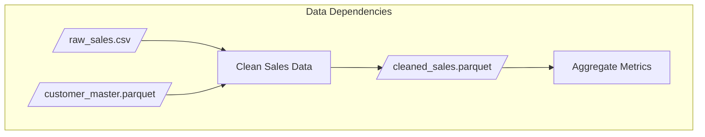
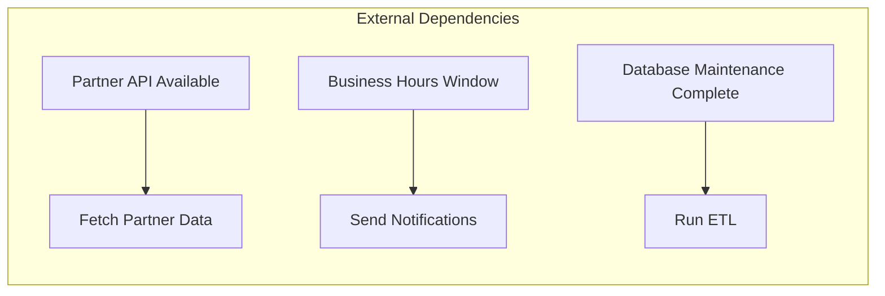
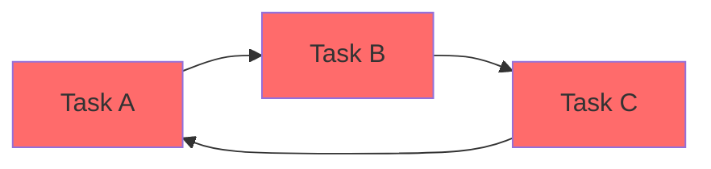
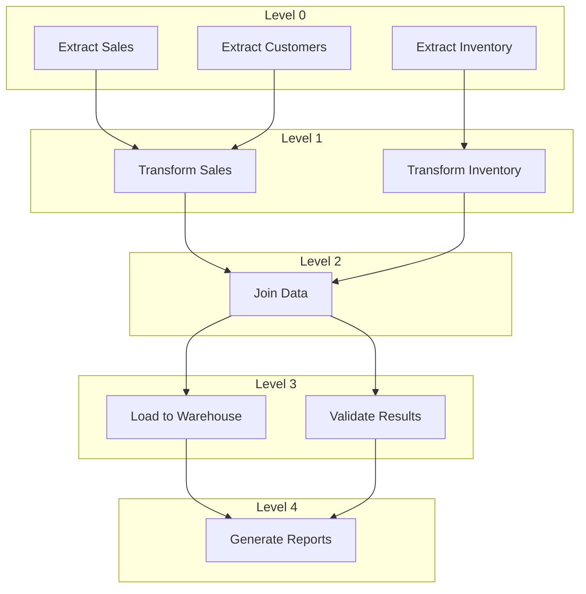
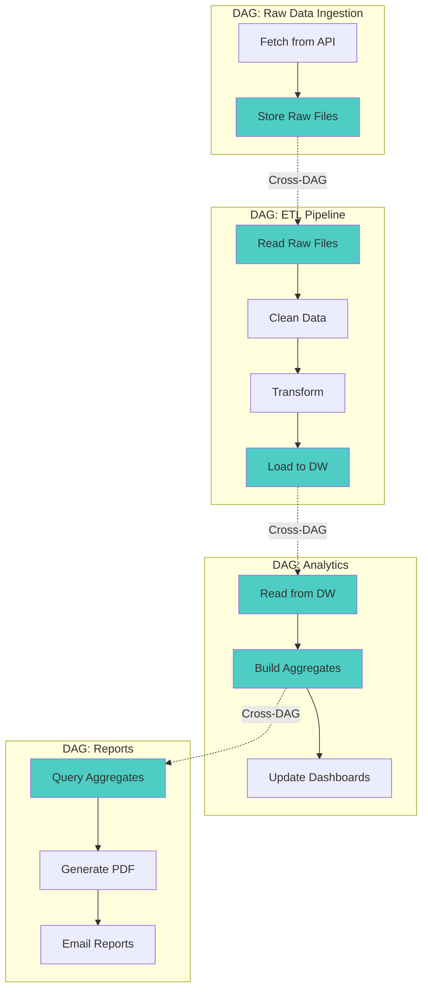
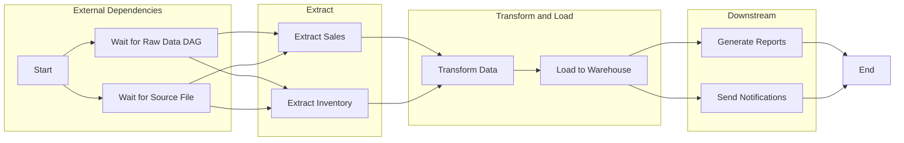

# How to Create Batch Dependency Management

Author: [nawazdhandala](https://github.com/nawazdhandala)

Tags: Batch Processing, Dependencies, DAG, Airflow

Description: Learn to create batch dependency management for orchestrating complex job workflows with proper ordering.

---

Data pipelines rarely execute as standalone tasks. Instead, they form intricate webs of dependencies where one job's output becomes another's input. This guide covers how to model, validate, and execute batch workflows using Directed Acyclic Graphs (DAGs), with practical examples you can adapt for production.

## Understanding Dependency Types

Before diving into implementation, you need to understand the three primary dependency types that govern batch processing workflows.

### Task Dependencies

Task dependencies define execution order between jobs. A task cannot start until all its upstream tasks have completed successfully. This is the most common dependency type.


### Data Dependencies

Data dependencies go beyond execution order. They specify that a task requires specific datasets, files, or database tables to exist before it can run. Even if an upstream task completes, the downstream task may wait for data validation.



### External Dependencies

External dependencies represent conditions outside your workflow. These include waiting for third-party API availability, upstream system completion signals, time windows, or resource availability like database connections.



## Building a Dependency Graph

The foundation of batch dependency management is a proper graph structure. Here is a Python implementation of a DAG that supports all three dependency types.

`dependency_graph.py`

```python
from enum import Enum
from dataclasses import dataclass, field
from typing import Callable, Optional
from collections import defaultdict
import time


class DependencyType(Enum):
    """
    Enum representing the three types of dependencies in batch processing.

    TASK: Standard execution order dependency
    DATA: Requires specific data artifacts to exist
    EXTERNAL: Waits for external conditions or systems
    """
    TASK = "task"
    DATA = "data"
    EXTERNAL = "external"


@dataclass
class Dependency:
    """
    Represents a single dependency relationship between tasks.

    Attributes:
        source: The upstream task that must complete first
        target: The downstream task that depends on source
        dep_type: The type of dependency (task, data, or external)
        condition: Optional callable that returns True when dependency is satisfied
        data_artifact: For DATA dependencies, the path or identifier of required data
    """
    source: str
    target: str
    dep_type: DependencyType = DependencyType.TASK
    condition: Optional[Callable[[], bool]] = None
    data_artifact: Optional[str] = None


@dataclass
class Task:
    """
    Represents a single task in the batch processing workflow.

    Attributes:
        name: Unique identifier for the task
        execute: Callable that performs the task's work
        timeout_seconds: Maximum time allowed for task execution
        retries: Number of retry attempts on failure
        retry_delay_seconds: Wait time between retry attempts
    """
    name: str
    execute: Callable[[], bool]
    timeout_seconds: int = 3600
    retries: int = 3
    retry_delay_seconds: int = 60


class DependencyGraph:
    """
    A Directed Acyclic Graph for managing batch job dependencies.

    This class provides methods to:
    - Add tasks and define dependencies between them
    - Detect circular dependencies before execution
    - Compute execution order using topological sort
    - Track task status throughout the workflow
    """

    def __init__(self):
        # Store all tasks by name for quick lookup
        self.tasks: dict[str, Task] = {}

        # Adjacency list: maps each task to its downstream dependents
        self.edges: dict[str, list[Dependency]] = defaultdict(list)

        # Reverse adjacency: maps each task to its upstream dependencies
        self.reverse_edges: dict[str, list[Dependency]] = defaultdict(list)

        # Track execution status for each task
        self.status: dict[str, str] = {}  # pending, running, success, failed, skipped

    def add_task(self, task: Task) -> None:
        """
        Register a task in the graph.

        Args:
            task: The Task object to add

        Raises:
            ValueError: If a task with the same name already exists
        """
        if task.name in self.tasks:
            raise ValueError(f"Task '{task.name}' already exists in the graph")

        self.tasks[task.name] = task
        self.status[task.name] = "pending"

    def add_dependency(
        self,
        source: str,
        target: str,
        dep_type: DependencyType = DependencyType.TASK,
        condition: Optional[Callable[[], bool]] = None,
        data_artifact: Optional[str] = None
    ) -> None:
        """
        Create a dependency relationship between two tasks.

        The target task will not execute until:
        - The source task has completed successfully
        - Any specified condition returns True
        - Any specified data artifact exists

        Args:
            source: Name of the upstream task
            target: Name of the downstream task
            dep_type: Type of dependency relationship
            condition: Optional function that must return True
            data_artifact: Optional path to required data

        Raises:
            ValueError: If either task does not exist in the graph
        """
        if source not in self.tasks:
            raise ValueError(f"Source task '{source}' not found in graph")
        if target not in self.tasks:
            raise ValueError(f"Target task '{target}' not found in graph")

        dependency = Dependency(
            source=source,
            target=target,
            dep_type=dep_type,
            condition=condition,
            data_artifact=data_artifact
        )

        # Store in both directions for efficient traversal
        self.edges[source].append(dependency)
        self.reverse_edges[target].append(dependency)

    def get_upstream_tasks(self, task_name: str) -> list[str]:
        """
        Get all tasks that must complete before the specified task.

        Args:
            task_name: Name of the task to check

        Returns:
            List of upstream task names
        """
        return [dep.source for dep in self.reverse_edges[task_name]]

    def get_downstream_tasks(self, task_name: str) -> list[str]:
        """
        Get all tasks that depend on the specified task.

        Args:
            task_name: Name of the task to check

        Returns:
            List of downstream task names
        """
        return [dep.target for dep in self.edges[task_name]]
```

## Circular Dependency Detection

Circular dependencies make execution impossible since tasks would wait for each other indefinitely. You must detect and reject them before execution begins.

`circular_detection.py`

```python
from enum import Enum
from typing import Optional


class VisitState(Enum):
    """
    States used during depth-first search for cycle detection.

    UNVISITED: Node has not been explored yet
    VISITING: Node is currently in the DFS stack (path being explored)
    VISITED: Node and all its descendants have been fully explored
    """
    UNVISITED = 0
    VISITING = 1
    VISITED = 2


def detect_circular_dependencies(graph: "DependencyGraph") -> Optional[list[str]]:
    """
    Detect circular dependencies in the graph using depth-first search.

    This algorithm uses three-color marking:
    - White (UNVISITED): Node not yet discovered
    - Gray (VISITING): Node is in current DFS path
    - Black (VISITED): Node fully processed

    A cycle exists if we encounter a gray node during traversal,
    meaning we have found a back edge to an ancestor.

    Args:
        graph: The DependencyGraph to check

    Returns:
        List of task names forming a cycle, or None if no cycle exists

    Time Complexity: O(V + E) where V is tasks, E is dependencies
    Space Complexity: O(V) for the state tracking and recursion stack
    """
    state = {task: VisitState.UNVISITED for task in graph.tasks}
    # Track the path to reconstruct the cycle if found
    parent = {task: None for task in graph.tasks}

    def dfs(task: str, path: list[str]) -> Optional[list[str]]:
        """
        Recursive DFS helper that returns cycle path if found.

        Args:
            task: Current task being visited
            path: Current path from root to this task

        Returns:
            Cycle path if found, None otherwise
        """
        state[task] = VisitState.VISITING
        path.append(task)

        # Check all downstream tasks (outgoing edges)
        for dependency in graph.edges[task]:
            downstream = dependency.target

            if state[downstream] == VisitState.VISITING:
                # Found a back edge - cycle detected!
                # Extract the cycle from the current path
                cycle_start = path.index(downstream)
                cycle = path[cycle_start:] + [downstream]
                return cycle

            if state[downstream] == VisitState.UNVISITED:
                parent[downstream] = task
                result = dfs(downstream, path)
                if result:
                    return result

        # Mark as fully explored and backtrack
        state[task] = VisitState.VISITED
        path.pop()
        return None

    # Try DFS from each unvisited node to handle disconnected components
    for task in graph.tasks:
        if state[task] == VisitState.UNVISITED:
            cycle = dfs(task, [])
            if cycle:
                return cycle

    return None


def validate_graph(graph: "DependencyGraph") -> None:
    """
    Validate the dependency graph before execution.

    Performs multiple validation checks:
    1. Circular dependency detection
    2. Orphan task detection (tasks with no path to execution)
    3. Missing task references in dependencies

    Args:
        graph: The DependencyGraph to validate

    Raises:
        ValueError: If any validation check fails
    """
    # Check for circular dependencies
    cycle = detect_circular_dependencies(graph)
    if cycle:
        cycle_str = " -> ".join(cycle)
        raise ValueError(
            f"Circular dependency detected: {cycle_str}\n"
            f"Please review your task dependencies and remove the cycle."
        )

    # Check for orphan tasks (no incoming edges and not a root task)
    root_tasks = []
    for task in graph.tasks:
        if not graph.reverse_edges[task]:
            root_tasks.append(task)

    if not root_tasks:
        raise ValueError(
            "No root tasks found. Every task has dependencies, "
            "which means the graph cannot start execution."
        )

    print(f"Graph validation passed. Root tasks: {root_tasks}")
```

Here is a visual example of a circular dependency that would be detected:



## Topological Sort for Execution Order

Once you confirm no cycles exist, topological sort determines the correct execution order. Tasks are ordered so that all dependencies come before their dependents.

`topological_sort.py`

```python
from collections import deque


def topological_sort(graph: "DependencyGraph") -> list[str]:
    """
    Compute a valid execution order using Kahn's algorithm.

    Kahn's algorithm uses BFS with in-degree tracking:
    1. Start with all tasks that have no dependencies (in-degree = 0)
    2. Process each task, reducing in-degree of its dependents
    3. When a dependent's in-degree reaches 0, add it to the queue
    4. Repeat until all tasks are processed

    This approach naturally handles parallel execution levels since
    all tasks at the same "depth" can run concurrently.

    Args:
        graph: The validated DependencyGraph

    Returns:
        List of task names in valid execution order

    Raises:
        RuntimeError: If not all tasks could be sorted (indicates a cycle
                      that was not caught by validation)
    """
    # Calculate in-degree (number of incoming edges) for each task
    in_degree = {task: 0 for task in graph.tasks}
    for task in graph.tasks:
        for dep in graph.edges[task]:
            in_degree[dep.target] += 1

    # Initialize queue with tasks that have no dependencies
    # These are the "root" tasks that can start immediately
    queue = deque()
    for task, degree in in_degree.items():
        if degree == 0:
            queue.append(task)

    execution_order = []

    while queue:
        # Get the next task ready for execution
        current = queue.popleft()
        execution_order.append(current)

        # Reduce in-degree for all downstream tasks
        # This simulates "completing" the current task
        for dep in graph.edges[current]:
            downstream = dep.target
            in_degree[downstream] -= 1

            # When all dependencies are satisfied, task is ready
            if in_degree[downstream] == 0:
                queue.append(downstream)

    # Verify all tasks were processed
    if len(execution_order) != len(graph.tasks):
        unprocessed = set(graph.tasks.keys()) - set(execution_order)
        raise RuntimeError(
            f"Could not sort all tasks. Unprocessed: {unprocessed}. "
            f"This indicates a cycle in the graph."
        )

    return execution_order


def get_parallel_execution_levels(graph: "DependencyGraph") -> list[list[str]]:
    """
    Group tasks into parallel execution levels.

    Tasks in the same level have no dependencies on each other
    and can run concurrently. This maximizes parallelism while
    respecting all dependency constraints.

    Args:
        graph: The validated DependencyGraph

    Returns:
        List of levels, where each level is a list of task names
        that can execute in parallel

    Example output:
        [
            ['extract_a', 'extract_b'],  # Level 0: run in parallel
            ['transform'],                # Level 1: depends on level 0
            ['load', 'validate'],         # Level 2: can run in parallel
            ['report']                    # Level 3: depends on level 2
        ]
    """
    in_degree = {task: 0 for task in graph.tasks}
    for task in graph.tasks:
        for dep in graph.edges[task]:
            in_degree[dep.target] += 1

    # Start with tasks that have no dependencies
    current_level = [task for task, degree in in_degree.items() if degree == 0]
    levels = []

    while current_level:
        levels.append(current_level)
        next_level = []

        # Process all tasks in current level
        for task in current_level:
            for dep in graph.edges[task]:
                downstream = dep.target
                in_degree[downstream] -= 1

                # Task is ready when all its dependencies are processed
                if in_degree[downstream] == 0:
                    next_level.append(downstream)

        current_level = next_level

    return levels
```

Visualizing parallel execution levels:



## Cross-DAG Dependencies

Production systems often have multiple DAGs that depend on each other. A common pattern is having one DAG wait for another to complete before starting.

`cross_dag.py`

```python
from dataclasses import dataclass
from datetime import datetime, timedelta
from typing import Optional
import time


@dataclass
class DAGRun:
    """
    Represents a single execution instance of a DAG.

    Attributes:
        dag_id: Unique identifier for the DAG definition
        run_id: Unique identifier for this specific run
        execution_date: Logical date for this run
        status: Current state (pending, running, success, failed)
        start_time: When execution began
        end_time: When execution completed
    """
    dag_id: str
    run_id: str
    execution_date: datetime
    status: str  # pending, running, success, failed
    start_time: Optional[datetime] = None
    end_time: Optional[datetime] = None


class CrossDAGDependencyManager:
    """
    Manages dependencies between different DAGs.

    This class enables:
    - DAG-to-DAG dependencies (DAG B waits for DAG A)
    - Time-based dependencies (wait for yesterday's run)
    - Conditional dependencies (only wait if condition is met)

    Use cases:
    - Data pipeline stages owned by different teams
    - Downstream analytics waiting for upstream ETL
    - Report generation waiting for data refresh
    """

    def __init__(self):
        # Track all DAG runs by (dag_id, execution_date)
        self.dag_runs: dict[tuple[str, datetime], DAGRun] = {}

        # Cross-DAG dependencies: target_dag -> [(source_dag, offset_days)]
        self.cross_dependencies: dict[str, list[tuple[str, int]]] = {}

    def register_dag_run(self, dag_run: DAGRun) -> None:
        """
        Register a DAG run for dependency tracking.

        Args:
            dag_run: The DAGRun instance to register
        """
        key = (dag_run.dag_id, dag_run.execution_date)
        self.dag_runs[key] = dag_run

    def add_cross_dag_dependency(
        self,
        source_dag: str,
        target_dag: str,
        execution_date_offset_days: int = 0
    ) -> None:
        """
        Define a cross-DAG dependency.

        The target DAG will wait for the source DAG to complete
        for the execution date plus the specified offset.

        Args:
            source_dag: DAG that must complete first
            target_dag: DAG that depends on source
            execution_date_offset_days: Days to add to execution date
                                         Use -1 to wait for yesterday's run
                                         Use 0 to wait for same-day run

        Example:
            # Daily reports wait for previous day's ETL
            manager.add_cross_dag_dependency(
                source_dag="etl_pipeline",
                target_dag="daily_reports",
                execution_date_offset_days=-1
            )
        """
        if target_dag not in self.cross_dependencies:
            self.cross_dependencies[target_dag] = []

        self.cross_dependencies[target_dag].append(
            (source_dag, execution_date_offset_days)
        )

    def check_dependencies_satisfied(
        self,
        dag_id: str,
        execution_date: datetime,
        timeout_seconds: int = 3600
    ) -> bool:
        """
        Check if all cross-DAG dependencies are satisfied.

        This method polls for dependency completion, useful when
        integrated with a scheduler or orchestrator.

        Args:
            dag_id: The DAG that wants to run
            execution_date: The execution date for the run
            timeout_seconds: Maximum time to wait for dependencies

        Returns:
            True if all dependencies are satisfied, False if timeout
        """
        if dag_id not in self.cross_dependencies:
            return True  # No dependencies defined

        start_time = time.time()

        while time.time() - start_time < timeout_seconds:
            all_satisfied = True

            for source_dag, offset_days in self.cross_dependencies[dag_id]:
                # Calculate the execution date we need to check
                source_date = execution_date + timedelta(days=offset_days)
                key = (source_dag, source_date)

                if key not in self.dag_runs:
                    print(f"Waiting for {source_dag} run on {source_date}")
                    all_satisfied = False
                    continue

                dag_run = self.dag_runs[key]
                if dag_run.status != "success":
                    print(
                        f"Waiting for {source_dag} to succeed. "
                        f"Current status: {dag_run.status}"
                    )
                    all_satisfied = False

            if all_satisfied:
                return True

            # Poll every 30 seconds
            time.sleep(30)

        return False

    def get_dependency_status(
        self,
        dag_id: str,
        execution_date: datetime
    ) -> dict[str, str]:
        """
        Get the status of all dependencies for a DAG run.

        Args:
            dag_id: The DAG to check dependencies for
            execution_date: The execution date

        Returns:
            Dictionary mapping source DAG names to their status
        """
        status = {}

        if dag_id not in self.cross_dependencies:
            return status

        for source_dag, offset_days in self.cross_dependencies[dag_id]:
            source_date = execution_date + timedelta(days=offset_days)
            key = (source_dag, source_date)

            if key in self.dag_runs:
                status[f"{source_dag}@{source_date.date()}"] = \
                    self.dag_runs[key].status
            else:
                status[f"{source_dag}@{source_date.date()}"] = "not_found"

        return status
```

Visualizing cross-DAG dependencies:



## Implementation with Apache Airflow

Apache Airflow is the industry standard for batch workflow orchestration. Here is how to implement the dependency patterns in Airflow.

`airflow_dag.py`

```python
from datetime import datetime, timedelta
from airflow import DAG
from airflow.operators.python import PythonOperator
from airflow.operators.empty import EmptyOperator
from airflow.sensors.external_task import ExternalTaskSensor
from airflow.sensors.filesystem import FileSensor
from airflow.utils.task_group import TaskGroup


# Default arguments applied to all tasks in the DAG
# These provide sensible defaults for retries, alerts, and timeouts
default_args = {
    "owner": "data-engineering",
    "depends_on_past": False,  # Don't require previous day's run to succeed
    "email_on_failure": True,
    "email_on_retry": False,
    "retries": 3,
    "retry_delay": timedelta(minutes=5),
    "execution_timeout": timedelta(hours=2),
}


# Task implementation functions
def extract_sales_data(**context):
    """
    Extract sales data from the source system.

    Uses Airflow's context to access execution date and other
    runtime information. The execution_date is the logical date
    for this run, not the actual runtime.
    """
    execution_date = context["execution_date"]
    print(f"Extracting sales data for {execution_date}")
    # Your extraction logic here
    return {"records_extracted": 50000}


def extract_inventory_data(**context):
    """Extract inventory data from warehouse management system."""
    execution_date = context["execution_date"]
    print(f"Extracting inventory data for {execution_date}")
    return {"records_extracted": 12000}


def transform_data(**context):
    """
    Transform and join extracted data.

    Uses XCom to pull results from upstream tasks. XCom enables
    passing small amounts of data between tasks.
    """
    ti = context["ti"]

    # Pull results from upstream extraction tasks
    sales_result = ti.xcom_pull(task_ids="extract.extract_sales")
    inventory_result = ti.xcom_pull(task_ids="extract.extract_inventory")

    print(f"Transforming {sales_result['records_extracted']} sales records")
    print(f"Transforming {inventory_result['records_extracted']} inventory records")

    return {"records_transformed": 62000}


def load_to_warehouse(**context):
    """Load transformed data to the data warehouse."""
    ti = context["ti"]
    transform_result = ti.xcom_pull(task_ids="transform_data")
    print(f"Loading {transform_result['records_transformed']} records to warehouse")


def generate_reports(**context):
    """Generate daily business reports from warehouse data."""
    print("Generating daily reports")


def send_notifications(**context):
    """Send completion notifications to stakeholders."""
    print("Sending notifications")


# Define the DAG with comprehensive documentation
with DAG(
    dag_id="sales_etl_pipeline",
    default_args=default_args,
    description="Daily sales and inventory ETL pipeline",
    # Schedule to run daily at 2 AM UTC
    schedule_interval="0 2 * * *",
    start_date=datetime(2026, 1, 1),
    # Prevent backfilling all historical dates on first run
    catchup=False,
    # Custom tags for filtering in the Airflow UI
    tags=["etl", "sales", "daily"],
    # Maximum active runs prevents resource exhaustion
    max_active_runs=1,
    doc_md="""
    ## Sales ETL Pipeline

    This DAG orchestrates the daily sales data pipeline:

    1. **Extract**: Pull data from source systems
    2. **Transform**: Clean, validate, and join data
    3. **Load**: Insert into the data warehouse
    4. **Report**: Generate business reports

    ### Dependencies
    - Requires `raw_data_ingestion` DAG to complete first
    - Waits for source files to be available

    ### Alerts
    - On-call team notified on any task failure
    - SLA miss alerts if not complete by 6 AM UTC
    """,
) as dag:

    # Start marker task for clear DAG visualization
    start = EmptyOperator(task_id="start")

    # External task sensor waits for another DAG to complete
    # This implements cross-DAG dependencies
    wait_for_upstream = ExternalTaskSensor(
        task_id="wait_for_raw_data_ingestion",
        # The upstream DAG we are waiting for
        external_dag_id="raw_data_ingestion",
        # The specific task that must succeed (None = entire DAG)
        external_task_id=None,
        # How the execution dates should align
        # timedelta(0) means same execution date
        execution_delta=timedelta(0),
        # Timeout after 1 hour of waiting
        timeout=3600,
        # Check every 60 seconds
        poke_interval=60,
        # Use reschedule mode to free up worker slots while waiting
        mode="reschedule",
    )

    # File sensor implements data dependencies
    # Waits for required input file to exist
    wait_for_file = FileSensor(
        task_id="wait_for_source_file",
        # Path to the expected input file
        filepath="/data/incoming/sales_{{ ds }}.csv",
        # Use reschedule mode for long waits
        mode="reschedule",
        poke_interval=300,  # Check every 5 minutes
        timeout=7200,  # Timeout after 2 hours
    )

    # Task group organizes related tasks visually
    # Extraction tasks can run in parallel
    with TaskGroup(group_id="extract") as extract_group:
        extract_sales = PythonOperator(
            task_id="extract_sales",
            python_callable=extract_sales_data,
            # Provide context to access execution date, etc.
            provide_context=True,
        )

        extract_inventory = PythonOperator(
            task_id="extract_inventory",
            python_callable=extract_inventory_data,
            provide_context=True,
        )

    # Transform task depends on all extractions completing
    transform = PythonOperator(
        task_id="transform_data",
        python_callable=transform_data,
        provide_context=True,
    )

    # Load task depends on transform completing
    load = PythonOperator(
        task_id="load_to_warehouse",
        python_callable=load_to_warehouse,
        provide_context=True,
    )

    # Downstream tasks can run in parallel after load
    with TaskGroup(group_id="downstream") as downstream_group:
        reports = PythonOperator(
            task_id="generate_reports",
            python_callable=generate_reports,
            provide_context=True,
        )

        notify = PythonOperator(
            task_id="send_notifications",
            python_callable=send_notifications,
            provide_context=True,
            # This task can be skipped without failing the DAG
            trigger_rule="all_done",
        )

    # End marker for clear visualization
    end = EmptyOperator(task_id="end")

    # Define the dependency chain using the >> operator
    # This creates the DAG structure shown in the UI

    # Start leads to external dependencies check
    start >> [wait_for_upstream, wait_for_file]

    # Both external dependencies must complete before extraction
    [wait_for_upstream, wait_for_file] >> extract_group

    # Extraction group feeds into transform
    extract_group >> transform

    # Transform feeds into load
    transform >> load

    # Load feeds into downstream tasks
    load >> downstream_group

    # Downstream group feeds into end
    downstream_group >> end
```

The resulting DAG visualization:



## Handling Dependency Failures

When dependencies fail, you need strategies to handle the failure gracefully. Here are common patterns for failure handling.

`failure_handling.py`

```python
from enum import Enum
from dataclasses import dataclass
from typing import Callable, Optional
import time


class FailureStrategy(Enum):
    """
    Strategies for handling dependency failures.

    FAIL_FAST: Stop the entire workflow immediately
    SKIP_DOWNSTREAM: Skip tasks that depend on the failed task
    RETRY_WITH_BACKOFF: Retry the failed task with exponential backoff
    CONTINUE_ON_FAILURE: Mark as failed but continue with other branches
    TRIGGER_ALERT: Send alert and wait for manual intervention
    """
    FAIL_FAST = "fail_fast"
    SKIP_DOWNSTREAM = "skip_downstream"
    RETRY_WITH_BACKOFF = "retry_with_backoff"
    CONTINUE_ON_FAILURE = "continue_on_failure"
    TRIGGER_ALERT = "trigger_alert"


@dataclass
class RetryConfig:
    """
    Configuration for retry behavior.

    Attributes:
        max_retries: Maximum number of retry attempts
        initial_delay_seconds: Wait time before first retry
        max_delay_seconds: Maximum wait time between retries
        exponential_base: Base for exponential backoff calculation
    """
    max_retries: int = 3
    initial_delay_seconds: int = 60
    max_delay_seconds: int = 3600
    exponential_base: float = 2.0


class FailureHandler:
    """
    Handles task failures in the dependency graph.

    This class provides:
    - Multiple failure strategies for different use cases
    - Exponential backoff retry logic
    - Downstream task state management
    - Alert integration for critical failures
    """

    def __init__(
        self,
        graph: "DependencyGraph",
        default_strategy: FailureStrategy = FailureStrategy.RETRY_WITH_BACKOFF,
        retry_config: Optional[RetryConfig] = None,
        alert_callback: Optional[Callable[[str, str], None]] = None
    ):
        """
        Initialize the failure handler.

        Args:
            graph: The DependencyGraph being executed
            default_strategy: Default strategy for handling failures
            retry_config: Configuration for retry behavior
            alert_callback: Function to call for alerts (task_name, message)
        """
        self.graph = graph
        self.default_strategy = default_strategy
        self.retry_config = retry_config or RetryConfig()
        self.alert_callback = alert_callback

        # Track retry attempts per task
        self.retry_counts: dict[str, int] = {}

    def handle_failure(
        self,
        task_name: str,
        error: Exception,
        strategy: Optional[FailureStrategy] = None
    ) -> bool:
        """
        Handle a task failure according to the specified strategy.

        Args:
            task_name: Name of the failed task
            error: The exception that caused the failure
            strategy: Override strategy for this specific failure

        Returns:
            True if execution should continue, False to stop
        """
        strategy = strategy or self.default_strategy

        print(f"Task '{task_name}' failed with error: {error}")
        print(f"Applying failure strategy: {strategy.value}")

        if strategy == FailureStrategy.FAIL_FAST:
            return self._handle_fail_fast(task_name, error)

        elif strategy == FailureStrategy.SKIP_DOWNSTREAM:
            return self._handle_skip_downstream(task_name)

        elif strategy == FailureStrategy.RETRY_WITH_BACKOFF:
            return self._handle_retry(task_name, error)

        elif strategy == FailureStrategy.CONTINUE_ON_FAILURE:
            return self._handle_continue(task_name)

        elif strategy == FailureStrategy.TRIGGER_ALERT:
            return self._handle_alert(task_name, error)

        return False

    def _handle_fail_fast(self, task_name: str, error: Exception) -> bool:
        """Stop execution immediately on failure."""
        self.graph.status[task_name] = "failed"

        # Mark all pending tasks as cancelled
        for name, status in self.graph.status.items():
            if status == "pending":
                self.graph.status[name] = "cancelled"

        return False  # Stop execution

    def _handle_skip_downstream(self, task_name: str) -> bool:
        """Skip all tasks that depend on the failed task."""
        self.graph.status[task_name] = "failed"

        # Find all downstream tasks recursively
        to_skip = set()
        queue = [task_name]

        while queue:
            current = queue.pop(0)
            for downstream in self.graph.get_downstream_tasks(current):
                if downstream not in to_skip:
                    to_skip.add(downstream)
                    queue.append(downstream)

        # Mark downstream tasks as skipped
        for name in to_skip:
            self.graph.status[name] = "skipped"
            print(f"Skipping task '{name}' due to upstream failure")

        return True  # Continue with other branches

    def _handle_retry(self, task_name: str, error: Exception) -> bool:
        """Retry the task with exponential backoff."""
        if task_name not in self.retry_counts:
            self.retry_counts[task_name] = 0

        self.retry_counts[task_name] += 1
        attempt = self.retry_counts[task_name]

        if attempt > self.retry_config.max_retries:
            print(f"Task '{task_name}' exceeded max retries ({self.retry_config.max_retries})")
            self.graph.status[task_name] = "failed"
            return self._handle_skip_downstream(task_name)

        # Calculate backoff delay with exponential increase
        delay = min(
            self.retry_config.initial_delay_seconds * (
                self.retry_config.exponential_base ** (attempt - 1)
            ),
            self.retry_config.max_delay_seconds
        )

        print(f"Retrying task '{task_name}' in {delay} seconds (attempt {attempt})")
        time.sleep(delay)

        # Reset status to pending for retry
        self.graph.status[task_name] = "pending"
        return True  # Continue execution (will retry)

    def _handle_continue(self, task_name: str) -> bool:
        """Mark as failed but continue execution of independent branches."""
        self.graph.status[task_name] = "failed"
        return True  # Continue with other branches

    def _handle_alert(self, task_name: str, error: Exception) -> bool:
        """Send alert and pause for manual intervention."""
        self.graph.status[task_name] = "failed"

        message = f"Task '{task_name}' failed and requires manual intervention. Error: {error}"

        if self.alert_callback:
            self.alert_callback(task_name, message)
        else:
            print(f"ALERT: {message}")

        # In a real system, this would integrate with PagerDuty, Slack, etc.
        return False  # Stop and wait for manual intervention


def get_failed_task_report(graph: "DependencyGraph") -> dict:
    """
    Generate a report of all failed and skipped tasks.

    Args:
        graph: The DependencyGraph after execution

    Returns:
        Dictionary containing failure analysis
    """
    failed = [name for name, status in graph.status.items() if status == "failed"]
    skipped = [name for name, status in graph.status.items() if status == "skipped"]
    success = [name for name, status in graph.status.items() if status == "success"]

    return {
        "total_tasks": len(graph.tasks),
        "successful": len(success),
        "failed": len(failed),
        "skipped": len(skipped),
        "failed_tasks": failed,
        "skipped_tasks": skipped,
        "success_rate": len(success) / len(graph.tasks) * 100 if graph.tasks else 0
    }
```

## Complete Workflow Executor

Here is a complete executor that ties together all the components into a production-ready system.

`workflow_executor.py`

```python
from concurrent.futures import ThreadPoolExecutor, as_completed
from dataclasses import dataclass
from datetime import datetime
from typing import Optional
import time
import threading


@dataclass
class ExecutionResult:
    """
    Result of executing a single task.

    Attributes:
        task_name: Name of the executed task
        success: Whether the task completed successfully
        start_time: When execution started
        end_time: When execution ended
        error: Exception if the task failed
        output: Any output returned by the task
    """
    task_name: str
    success: bool
    start_time: datetime
    end_time: datetime
    error: Optional[Exception] = None
    output: Optional[dict] = None


class WorkflowExecutor:
    """
    Executes a dependency graph with parallel task execution.

    Features:
    - Parallel execution of independent tasks
    - Dependency tracking and enforcement
    - Failure handling with configurable strategies
    - Real-time status updates
    - Execution metrics collection
    """

    def __init__(
        self,
        graph: "DependencyGraph",
        max_parallel_tasks: int = 4,
        failure_handler: Optional["FailureHandler"] = None
    ):
        """
        Initialize the workflow executor.

        Args:
            graph: The validated DependencyGraph to execute
            max_parallel_tasks: Maximum concurrent task executions
            failure_handler: Optional handler for task failures
        """
        self.graph = graph
        self.max_parallel_tasks = max_parallel_tasks
        self.failure_handler = failure_handler

        # Thread-safe tracking of completed tasks
        self.completed_tasks: set[str] = set()
        self.lock = threading.Lock()

        # Execution metrics
        self.results: dict[str, ExecutionResult] = {}
        self.execution_start: Optional[datetime] = None
        self.execution_end: Optional[datetime] = None

    def _can_execute(self, task_name: str) -> bool:
        """
        Check if a task's dependencies are all satisfied.

        A task can execute when:
        1. All upstream tasks have completed successfully
        2. All data dependencies exist (if specified)
        3. All external conditions are met (if specified)

        Args:
            task_name: Name of the task to check

        Returns:
            True if the task can execute
        """
        for dep in self.graph.reverse_edges[task_name]:
            # Check if upstream task completed successfully
            if dep.source not in self.completed_tasks:
                return False

            # Check data dependency condition if specified
            if dep.condition and not dep.condition():
                return False

        return True

    def _execute_task(self, task_name: str) -> ExecutionResult:
        """
        Execute a single task and return the result.

        Args:
            task_name: Name of the task to execute

        Returns:
            ExecutionResult with success/failure information
        """
        task = self.graph.tasks[task_name]
        start_time = datetime.now()

        self.graph.status[task_name] = "running"
        print(f"[{start_time.isoformat()}] Starting task: {task_name}")

        try:
            # Execute the task's callable
            output = task.execute()

            end_time = datetime.now()
            duration = (end_time - start_time).total_seconds()

            print(f"[{end_time.isoformat()}] Completed task: {task_name} ({duration:.2f}s)")

            return ExecutionResult(
                task_name=task_name,
                success=True,
                start_time=start_time,
                end_time=end_time,
                output=output
            )

        except Exception as e:
            end_time = datetime.now()
            print(f"[{end_time.isoformat()}] Failed task: {task_name} - {e}")

            return ExecutionResult(
                task_name=task_name,
                success=False,
                start_time=start_time,
                end_time=end_time,
                error=e
            )

    def execute(self) -> dict:
        """
        Execute the entire workflow with dependency management.

        This method:
        1. Validates the graph has no cycles
        2. Identifies tasks ready to run (no dependencies)
        3. Executes ready tasks in parallel
        4. Marks completed tasks and finds newly ready tasks
        5. Repeats until all tasks complete or failure occurs

        Returns:
            Dictionary with execution summary and metrics
        """
        self.execution_start = datetime.now()
        print(f"Starting workflow execution at {self.execution_start.isoformat()}")

        # Track tasks that are ready to execute
        pending_tasks = set(self.graph.tasks.keys())

        with ThreadPoolExecutor(max_workers=self.max_parallel_tasks) as executor:
            while pending_tasks:
                # Find tasks that can execute now
                ready_tasks = [
                    task for task in pending_tasks
                    if self._can_execute(task)
                ]

                if not ready_tasks:
                    # No tasks ready - check if we are stuck
                    if pending_tasks:
                        print(f"Warning: {len(pending_tasks)} tasks pending but none ready")
                        print(f"Pending: {pending_tasks}")
                        break

                # Submit ready tasks for parallel execution
                future_to_task = {
                    executor.submit(self._execute_task, task): task
                    for task in ready_tasks
                }

                # Process completed tasks
                for future in as_completed(future_to_task):
                    task_name = future_to_task[future]
                    result = future.result()
                    self.results[task_name] = result

                    if result.success:
                        with self.lock:
                            self.completed_tasks.add(task_name)
                            self.graph.status[task_name] = "success"
                        pending_tasks.discard(task_name)
                    else:
                        # Handle failure
                        if self.failure_handler:
                            should_continue = self.failure_handler.handle_failure(
                                task_name, result.error
                            )
                            if not should_continue:
                                pending_tasks.clear()
                                break
                        else:
                            self.graph.status[task_name] = "failed"

                        pending_tasks.discard(task_name)

        self.execution_end = datetime.now()
        return self._generate_summary()

    def _generate_summary(self) -> dict:
        """
        Generate execution summary with metrics.

        Returns:
            Dictionary containing execution statistics
        """
        total_duration = (
            self.execution_end - self.execution_start
        ).total_seconds() if self.execution_end else 0

        successful = sum(1 for r in self.results.values() if r.success)
        failed = sum(1 for r in self.results.values() if not r.success)

        task_durations = {
            name: (r.end_time - r.start_time).total_seconds()
            for name, r in self.results.items()
        }

        return {
            "total_tasks": len(self.graph.tasks),
            "successful": successful,
            "failed": failed,
            "skipped": len(self.graph.tasks) - successful - failed,
            "total_duration_seconds": total_duration,
            "task_durations": task_durations,
            "status_by_task": dict(self.graph.status),
            "start_time": self.execution_start.isoformat() if self.execution_start else None,
            "end_time": self.execution_end.isoformat() if self.execution_end else None,
        }


# Example usage demonstrating the complete workflow
if __name__ == "__main__":
    # Import our modules (in practice, these would be separate files)
    # from dependency_graph import DependencyGraph, Task, DependencyType
    # from circular_detection import validate_graph
    # from failure_handling import FailureHandler, FailureStrategy, RetryConfig

    # Create sample tasks
    def task_factory(name: str):
        """Factory function to create sample task executables."""
        def execute():
            print(f"Executing {name}")
            time.sleep(1)  # Simulate work
            return {"status": "complete"}
        return execute

    # Build the graph
    graph = DependencyGraph()

    # Add tasks
    for name in ["extract_a", "extract_b", "transform", "load", "report"]:
        graph.add_task(Task(name=name, execute=task_factory(name)))

    # Define dependencies
    graph.add_dependency("extract_a", "transform")
    graph.add_dependency("extract_b", "transform")
    graph.add_dependency("transform", "load")
    graph.add_dependency("load", "report")

    # Validate the graph
    validate_graph(graph)

    # Configure failure handling
    failure_handler = FailureHandler(
        graph=graph,
        default_strategy=FailureStrategy.RETRY_WITH_BACKOFF,
        retry_config=RetryConfig(max_retries=3, initial_delay_seconds=10)
    )

    # Execute the workflow
    executor = WorkflowExecutor(
        graph=graph,
        max_parallel_tasks=4,
        failure_handler=failure_handler
    )

    summary = executor.execute()
    print("\nExecution Summary:")
    print(f"  Total tasks: {summary['total_tasks']}")
    print(f"  Successful: {summary['successful']}")
    print(f"  Failed: {summary['failed']}")
    print(f"  Duration: {summary['total_duration_seconds']:.2f}s")
```

## Best Practices Summary

When implementing batch dependency management, keep these principles in mind:

1. **Always validate before execution**: Run circular dependency detection before starting any workflow. Catching cycles early prevents wasted compute time.

2. **Use appropriate dependency types**: Task dependencies for execution order, data dependencies for artifact requirements, and external dependencies for cross-system coordination.

3. **Design for parallelism**: Structure your DAG to maximize parallel execution. Independent tasks should not have artificial dependencies.

4. **Implement idempotency**: Tasks should be safe to retry. Use unique identifiers and upsert operations to handle partial failures.

5. **Monitor dependency wait times**: Track how long tasks wait for dependencies. Long waits indicate bottlenecks in your pipeline design.

6. **Version your DAGs**: Treat workflow definitions as code. Use Git, code review, and CI/CD for changes.

7. **Plan for failure**: Every task will eventually fail. Design retry strategies, alerting, and recovery procedures before you need them.

---

Batch dependency management transforms chaotic job execution into reliable, maintainable workflows. Whether you build your own system or use tools like Airflow, the fundamentals remain the same: model dependencies as a DAG, validate before execution, handle failures gracefully, and monitor everything.
