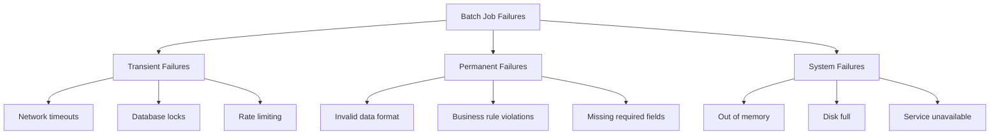
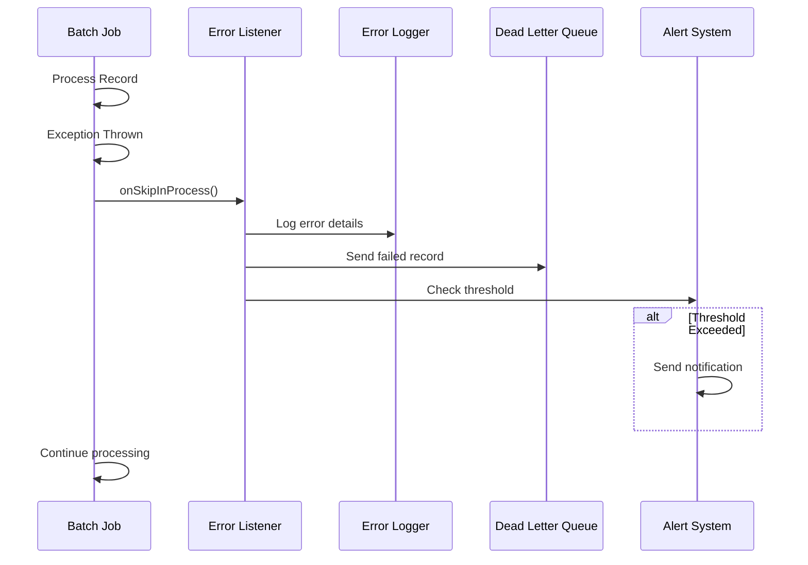
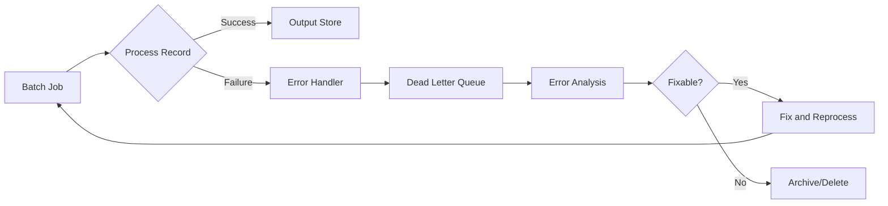
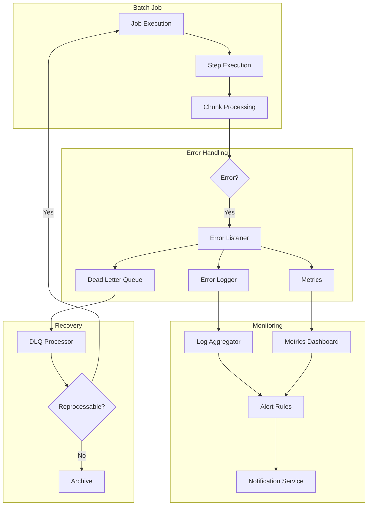

# How to Implement Batch Error Handling

Author: [nawazdhandala](https://github.com/nawazdhandala)

Tags: Batch Processing, Error Handling, Fault Tolerance, Spring Batch

Description: Learn to implement batch error handling for gracefully managing failures in data processing pipelines.

---

## Introduction

Batch processing is fundamental to modern data pipelines, handling everything from ETL operations to report generation. However, when processing millions of records, failures are inevitable. A single corrupt record should not bring down your entire batch job. This post explores comprehensive error handling strategies that make your batch processing robust and production-ready.

## Understanding Batch Processing Failure Modes

Before implementing error handling, it is essential to understand the types of failures you might encounter:



## Skip Policy Implementation

Skip policies allow your batch job to continue processing even when individual records fail. Spring Batch provides excellent support for this pattern.

### Basic Skip Configuration

```java
// BatchConfiguration.java
// Configure a step with skip policy for handling bad records

@Configuration
@EnableBatchProcessing
public class BatchConfiguration {

    @Autowired
    private JobBuilderFactory jobBuilderFactory;

    @Autowired
    private StepBuilderFactory stepBuilderFactory;

    @Bean
    public Step processRecordsStep(
            ItemReader<InputRecord> reader,
            ItemProcessor<InputRecord, OutputRecord> processor,
            ItemWriter<OutputRecord> writer,
            SkipPolicy customSkipPolicy) {

        return stepBuilderFactory.get("processRecordsStep")
                // Process records in chunks of 100
                .<InputRecord, OutputRecord>chunk(100)
                .reader(reader)
                .processor(processor)
                .writer(writer)
                // Enable fault tolerance features
                .faultTolerant()
                // Skip up to 1000 records with these exceptions
                .skipLimit(1000)
                .skip(ValidationException.class)
                .skip(DataFormatException.class)
                // Never skip these critical exceptions
                .noSkip(DatabaseConnectionException.class)
                // Use custom skip policy for complex logic
                .skipPolicy(customSkipPolicy)
                .build();
    }
}
```

### Custom Skip Policy

```java
// CustomSkipPolicy.java
// Implements sophisticated skip logic based on exception type and count

@Component
public class CustomSkipPolicy implements SkipPolicy {

    // Maximum percentage of records that can be skipped
    private static final double MAX_SKIP_PERCENTAGE = 0.05;

    // Counter for total processed records
    private final AtomicLong totalRecords = new AtomicLong(0);

    // Counter for skipped records
    private final AtomicLong skippedRecords = new AtomicLong(0);

    @Override
    public boolean shouldSkip(Throwable throwable, int skipCount)
            throws SkipLimitExceededException {

        // Never skip critical system exceptions
        if (throwable instanceof OutOfMemoryError ||
            throwable instanceof DatabaseConnectionException) {
            return false;
        }

        // Always skip validation exceptions up to limit
        if (throwable instanceof ValidationException) {
            long total = totalRecords.get();
            long skipped = skippedRecords.incrementAndGet();

            // Check if skip percentage exceeds threshold
            if (total > 0 && (double) skipped / total > MAX_SKIP_PERCENTAGE) {
                throw new SkipLimitExceededException(
                    skipCount,
                    new RuntimeException(
                        "Skip percentage exceeded " +
                        (MAX_SKIP_PERCENTAGE * 100) + "%"
                    )
                );
            }
            return true;
        }

        // Skip transient exceptions with retry exhausted
        if (throwable instanceof TransientDataAccessException) {
            return skipCount < 100;
        }

        return false;
    }

    // Call this method to track total records processed
    public void incrementTotalRecords() {
        totalRecords.incrementAndGet();
    }

    // Reset counters for new job execution
    public void reset() {
        totalRecords.set(0);
        skippedRecords.set(0);
    }
}
```

## Error Listeners for Monitoring and Logging

Error listeners provide hooks into the batch processing lifecycle, enabling comprehensive error tracking.



### Comprehensive Skip Listener

```java
// BatchErrorListener.java
// Listens to skip events and handles error logging and dead letter queue

@Component
@Slf4j
public class BatchErrorListener implements SkipListener<InputRecord, OutputRecord> {

    private final DeadLetterQueueService dlqService;
    private final MetricsService metricsService;
    private final AlertService alertService;

    // Threshold for triggering alerts
    private static final int ALERT_THRESHOLD = 50;

    // Counter for errors in current chunk
    private final AtomicInteger chunkErrorCount = new AtomicInteger(0);

    public BatchErrorListener(
            DeadLetterQueueService dlqService,
            MetricsService metricsService,
            AlertService alertService) {
        this.dlqService = dlqService;
        this.metricsService = metricsService;
        this.alertService = alertService;
    }

    @Override
    public void onSkipInRead(Throwable throwable) {
        // Handle errors during the read phase
        log.error("Error reading record: {}", throwable.getMessage());

        // Record metric for monitoring dashboards
        metricsService.incrementCounter("batch.read.errors");

        // Create error record with context
        ErrorRecord errorRecord = ErrorRecord.builder()
                .phase("READ")
                .errorMessage(throwable.getMessage())
                .exceptionType(throwable.getClass().getSimpleName())
                .timestamp(Instant.now())
                .stackTrace(getStackTraceAsString(throwable))
                .build();

        // Send to dead letter queue for later analysis
        dlqService.send(errorRecord);
    }

    @Override
    public void onSkipInProcess(InputRecord item, Throwable throwable) {
        // Handle errors during the processing phase
        log.error("Error processing record with ID {}: {}",
                item.getId(), throwable.getMessage());

        // Record detailed metric with tags
        metricsService.incrementCounter(
                "batch.process.errors",
                "exception_type", throwable.getClass().getSimpleName()
        );

        // Create comprehensive error record
        ErrorRecord errorRecord = ErrorRecord.builder()
                .phase("PROCESS")
                .originalRecord(serializeRecord(item))
                .errorMessage(throwable.getMessage())
                .exceptionType(throwable.getClass().getSimpleName())
                .timestamp(Instant.now())
                .recordId(item.getId())
                .stackTrace(getStackTraceAsString(throwable))
                .build();

        dlqService.send(errorRecord);

        // Check if we need to alert
        checkAndAlert();
    }

    @Override
    public void onSkipInWrite(OutputRecord item, Throwable throwable) {
        // Handle errors during the write phase
        log.error("Error writing record with ID {}: {}",
                item.getId(), throwable.getMessage());

        metricsService.incrementCounter("batch.write.errors");

        ErrorRecord errorRecord = ErrorRecord.builder()
                .phase("WRITE")
                .originalRecord(serializeRecord(item))
                .errorMessage(throwable.getMessage())
                .exceptionType(throwable.getClass().getSimpleName())
                .timestamp(Instant.now())
                .recordId(item.getId())
                .build();

        dlqService.send(errorRecord);
        checkAndAlert();
    }

    private void checkAndAlert() {
        int errorCount = chunkErrorCount.incrementAndGet();

        // Send alert if threshold exceeded
        if (errorCount >= ALERT_THRESHOLD) {
            alertService.sendAlert(
                    AlertLevel.WARNING,
                    "Batch job error threshold exceeded",
                    String.format("Error count: %d in current execution", errorCount)
            );
        }
    }

    private String getStackTraceAsString(Throwable throwable) {
        StringWriter sw = new StringWriter();
        throwable.printStackTrace(new PrintWriter(sw));
        return sw.toString();
    }

    private String serializeRecord(Object record) {
        try {
            return new ObjectMapper().writeValueAsString(record);
        } catch (JsonProcessingException e) {
            return record.toString();
        }
    }

    // Reset counters at the start of each job
    public void resetCounters() {
        chunkErrorCount.set(0);
    }
}
```

## Dead Letter Queue Implementation

A Dead Letter Queue (DLQ) stores failed records for later analysis and reprocessing.



### Dead Letter Queue Service

```java
// DeadLetterQueueService.java
// Service for managing failed records in a dead letter queue

@Service
@Slf4j
public class DeadLetterQueueService {

    private final JdbcTemplate jdbcTemplate;
    private final ObjectMapper objectMapper;

    // SQL for inserting failed records
    private static final String INSERT_DLQ_SQL = """
        INSERT INTO dead_letter_queue
        (id, job_name, phase, record_data, error_message,
         exception_type, stack_trace, created_at, status)
        VALUES (?, ?, ?, ?, ?, ?, ?, ?, ?)
        """;

    public DeadLetterQueueService(
            JdbcTemplate jdbcTemplate,
            ObjectMapper objectMapper) {
        this.jdbcTemplate = jdbcTemplate;
        this.objectMapper = objectMapper;
    }

    /**
     * Send a failed record to the dead letter queue
     * @param errorRecord The error record containing failure details
     */
    public void send(ErrorRecord errorRecord) {
        try {
            String id = UUID.randomUUID().toString();

            jdbcTemplate.update(
                    INSERT_DLQ_SQL,
                    id,
                    errorRecord.getJobName(),
                    errorRecord.getPhase(),
                    errorRecord.getOriginalRecord(),
                    errorRecord.getErrorMessage(),
                    errorRecord.getExceptionType(),
                    truncateStackTrace(errorRecord.getStackTrace()),
                    Timestamp.from(errorRecord.getTimestamp()),
                    DLQStatus.PENDING.name()
            );

            log.debug("Record sent to DLQ with ID: {}", id);

        } catch (Exception e) {
            // Log but do not throw to avoid disrupting batch job
            log.error("Failed to write to dead letter queue: {}", e.getMessage());
        }
    }

    /**
     * Retrieve pending records for reprocessing
     * @param limit Maximum number of records to retrieve
     * @return List of error records pending reprocessing
     */
    public List<ErrorRecord> getPendingRecords(int limit) {
        String sql = """
            SELECT * FROM dead_letter_queue
            WHERE status = 'PENDING'
            ORDER BY created_at ASC
            LIMIT ?
            """;

        return jdbcTemplate.query(sql, new Object[]{limit}, (rs, rowNum) -> {
            return ErrorRecord.builder()
                    .id(rs.getString("id"))
                    .jobName(rs.getString("job_name"))
                    .phase(rs.getString("phase"))
                    .originalRecord(rs.getString("record_data"))
                    .errorMessage(rs.getString("error_message"))
                    .exceptionType(rs.getString("exception_type"))
                    .timestamp(rs.getTimestamp("created_at").toInstant())
                    .build();
        });
    }

    /**
     * Mark a record as processed after successful reprocessing
     * @param recordId The ID of the record to mark
     */
    public void markAsProcessed(String recordId) {
        String sql = "UPDATE dead_letter_queue SET status = 'PROCESSED' WHERE id = ?";
        jdbcTemplate.update(sql, recordId);
    }

    /**
     * Mark a record as permanently failed
     * @param recordId The ID of the record to mark
     * @param reason The reason for permanent failure
     */
    public void markAsFailed(String recordId, String reason) {
        String sql = """
            UPDATE dead_letter_queue
            SET status = 'FAILED', failure_reason = ?
            WHERE id = ?
            """;
        jdbcTemplate.update(sql, reason, recordId);
    }

    private String truncateStackTrace(String stackTrace) {
        // Limit stack trace to 4000 characters for database storage
        if (stackTrace != null && stackTrace.length() > 4000) {
            return stackTrace.substring(0, 4000);
        }
        return stackTrace;
    }
}

// DLQStatus.java
// Enum representing possible states of a dead letter queue record

public enum DLQStatus {
    PENDING,    // Awaiting reprocessing
    PROCESSING, // Currently being reprocessed
    PROCESSED,  // Successfully reprocessed
    FAILED      // Permanently failed
}
```

### Database Schema for DLQ

```sql
-- dead_letter_queue.sql
-- Schema for storing failed batch records

CREATE TABLE dead_letter_queue (
    id VARCHAR(36) PRIMARY KEY,
    job_name VARCHAR(100) NOT NULL,
    phase VARCHAR(20) NOT NULL,
    record_data TEXT,
    error_message VARCHAR(1000),
    exception_type VARCHAR(200),
    stack_trace TEXT,
    created_at TIMESTAMP NOT NULL DEFAULT CURRENT_TIMESTAMP,
    processed_at TIMESTAMP,
    status VARCHAR(20) NOT NULL DEFAULT 'PENDING',
    failure_reason VARCHAR(500),
    retry_count INT DEFAULT 0,

    -- Indexes for efficient querying
    INDEX idx_dlq_status (status),
    INDEX idx_dlq_created (created_at),
    INDEX idx_dlq_job (job_name)
);
```

## Retry Mechanism Implementation

Implement retry logic for transient failures before skipping records.

```java
// RetryConfiguration.java
// Configure retry behavior for handling transient failures

@Configuration
public class RetryConfiguration {

    @Bean
    public Step retryableStep(
            ItemReader<InputRecord> reader,
            ItemProcessor<InputRecord, OutputRecord> processor,
            ItemWriter<OutputRecord> writer,
            RetryListener retryListener) {

        return stepBuilderFactory.get("retryableStep")
                .<InputRecord, OutputRecord>chunk(100)
                .reader(reader)
                .processor(processor)
                .writer(writer)
                .faultTolerant()
                // Retry configuration
                .retryLimit(3)
                .retry(TransientDataAccessException.class)
                .retry(OptimisticLockingFailureException.class)
                .retry(SocketTimeoutException.class)
                // Do not retry these exceptions
                .noRetry(ValidationException.class)
                .noRetry(NonTransientDataAccessException.class)
                // Custom retry policy with exponential backoff
                .retryPolicy(exponentialBackoffRetryPolicy())
                // Add listener for retry events
                .listener(retryListener)
                // Skip after retries exhausted
                .skipLimit(500)
                .skip(TransientDataAccessException.class)
                .build();
    }

    @Bean
    public RetryPolicy exponentialBackoffRetryPolicy() {
        Map<Class<? extends Throwable>, Boolean> retryableExceptions = new HashMap<>();
        retryableExceptions.put(TransientDataAccessException.class, true);
        retryableExceptions.put(SocketTimeoutException.class, true);

        // Create policy that retries up to 3 times
        SimpleRetryPolicy simpleRetryPolicy = new SimpleRetryPolicy(
                3, retryableExceptions, true);

        return simpleRetryPolicy;
    }

    @Bean
    public BackOffPolicy exponentialBackOffPolicy() {
        ExponentialBackOffPolicy backOffPolicy = new ExponentialBackOffPolicy();
        // Start with 1 second delay
        backOffPolicy.setInitialInterval(1000);
        // Double the delay each retry
        backOffPolicy.setMultiplier(2.0);
        // Maximum delay of 30 seconds
        backOffPolicy.setMaxInterval(30000);
        return backOffPolicy;
    }
}
```

### Retry Listener for Logging

```java
// BatchRetryListener.java
// Listens to retry events for monitoring and logging

@Component
@Slf4j
public class BatchRetryListener implements RetryListener {

    private final MetricsService metricsService;

    public BatchRetryListener(MetricsService metricsService) {
        this.metricsService = metricsService;
    }

    @Override
    public <T, E extends Throwable> boolean open(
            RetryContext context,
            RetryCallback<T, E> callback) {
        // Called before first retry attempt
        return true;
    }

    @Override
    public <T, E extends Throwable> void close(
            RetryContext context,
            RetryCallback<T, E> callback,
            Throwable throwable) {
        // Called after all retries completed
        if (throwable != null) {
            log.warn("All retry attempts exhausted. Final exception: {}",
                    throwable.getMessage());
        }
    }

    @Override
    public <T, E extends Throwable> void onError(
            RetryContext context,
            RetryCallback<T, E> callback,
            Throwable throwable) {

        int retryCount = context.getRetryCount();

        log.warn("Retry attempt {} failed: {}",
                retryCount, throwable.getMessage());

        // Record metric for each retry
        metricsService.incrementCounter(
                "batch.retry.attempts",
                "attempt_number", String.valueOf(retryCount),
                "exception_type", throwable.getClass().getSimpleName()
        );
    }
}
```

## Error Logging Strategy

Implement structured logging for better error analysis and debugging.

```java
// ErrorLoggingService.java
// Centralized error logging with structured format

@Service
@Slf4j
public class ErrorLoggingService {

    private final ObjectMapper objectMapper;

    public ErrorLoggingService(ObjectMapper objectMapper) {
        this.objectMapper = objectMapper;
    }

    /**
     * Log batch error with full context in structured format
     * @param context The batch error context
     */
    public void logBatchError(BatchErrorContext context) {
        // Create structured log entry
        StructuredLogEntry entry = StructuredLogEntry.builder()
                .timestamp(Instant.now())
                .level("ERROR")
                .jobName(context.getJobName())
                .stepName(context.getStepName())
                .phase(context.getPhase())
                .recordId(context.getRecordId())
                .errorCode(classifyError(context.getException()))
                .errorMessage(context.getException().getMessage())
                .exceptionType(context.getException().getClass().getName())
                .chunkNumber(context.getChunkNumber())
                .recordsProcessed(context.getRecordsProcessed())
                .build();

        // Log as JSON for easy parsing by log aggregators
        try {
            String jsonLog = objectMapper.writeValueAsString(entry);
            log.error("BATCH_ERROR: {}", jsonLog);
        } catch (JsonProcessingException e) {
            // Fallback to standard logging
            log.error("Batch error in job {} step {}: {}",
                    context.getJobName(),
                    context.getStepName(),
                    context.getException().getMessage(),
                    context.getException());
        }
    }

    /**
     * Classify error for easier analysis and alerting
     * @param throwable The exception to classify
     * @return Error code string
     */
    private String classifyError(Throwable throwable) {
        if (throwable instanceof ValidationException) {
            return "VALIDATION_ERROR";
        } else if (throwable instanceof DataAccessException) {
            return "DATABASE_ERROR";
        } else if (throwable instanceof SocketTimeoutException) {
            return "NETWORK_TIMEOUT";
        } else if (throwable instanceof OutOfMemoryError) {
            return "MEMORY_ERROR";
        } else {
            return "UNKNOWN_ERROR";
        }
    }
}

// StructuredLogEntry.java
// Data class for structured log entries

@Data
@Builder
public class StructuredLogEntry {
    private Instant timestamp;
    private String level;
    private String jobName;
    private String stepName;
    private String phase;
    private String recordId;
    private String errorCode;
    private String errorMessage;
    private String exceptionType;
    private Long chunkNumber;
    private Long recordsProcessed;
}
```

## Chunk-Level Error Handling

Handle errors at the chunk level for better transaction management.

```java
// ChunkErrorHandler.java
// Handles errors at the chunk level with transaction awareness

@Component
@Slf4j
public class ChunkErrorHandler implements ChunkListener {

    private final DeadLetterQueueService dlqService;
    private final TransactionTemplate transactionTemplate;

    // Track items in current chunk for error recovery
    private final ThreadLocal<List<Object>> currentChunkItems =
            ThreadLocal.withInitial(ArrayList::new);

    public ChunkErrorHandler(
            DeadLetterQueueService dlqService,
            PlatformTransactionManager transactionManager) {
        this.dlqService = dlqService;
        this.transactionTemplate = new TransactionTemplate(transactionManager);
        // Use separate transaction for error handling
        this.transactionTemplate.setPropagationBehavior(
                TransactionDefinition.PROPAGATION_REQUIRES_NEW);
    }

    @Override
    public void beforeChunk(ChunkContext context) {
        // Clear items from previous chunk
        currentChunkItems.get().clear();
        log.debug("Starting chunk processing");
    }

    @Override
    public void afterChunk(ChunkContext context) {
        // Chunk completed successfully
        currentChunkItems.get().clear();
        log.debug("Chunk completed successfully");
    }

    @Override
    public void afterChunkError(ChunkContext context) {
        // Handle chunk-level failure
        log.error("Chunk failed, handling error recovery");

        // Save failed chunk items to DLQ in separate transaction
        transactionTemplate.execute(status -> {
            List<Object> failedItems = currentChunkItems.get();

            for (Object item : failedItems) {
                ErrorRecord errorRecord = ErrorRecord.builder()
                        .phase("CHUNK")
                        .originalRecord(item.toString())
                        .errorMessage("Chunk transaction rolled back")
                        .timestamp(Instant.now())
                        .build();

                dlqService.send(errorRecord);
            }

            return null;
        });

        currentChunkItems.get().clear();
    }

    /**
     * Track item being processed in current chunk
     * @param item The item to track
     */
    public void trackItem(Object item) {
        currentChunkItems.get().add(item);
    }
}
```

## Complete Batch Job Configuration

Here is a complete configuration bringing all error handling components together.

```java
// CompleteBatchConfiguration.java
// Full batch job configuration with comprehensive error handling

@Configuration
@EnableBatchProcessing
@Slf4j
public class CompleteBatchConfiguration {

    @Autowired
    private JobBuilderFactory jobBuilderFactory;

    @Autowired
    private StepBuilderFactory stepBuilderFactory;

    @Bean
    public Job dataProcessingJob(
            Step processStep,
            JobExecutionListener jobListener) {

        return jobBuilderFactory.get("dataProcessingJob")
                .incrementer(new RunIdIncrementer())
                .listener(jobListener)
                .start(processStep)
                .build();
    }

    @Bean
    public Step processStep(
            ItemReader<InputRecord> reader,
            ItemProcessor<InputRecord, OutputRecord> processor,
            ItemWriter<OutputRecord> writer,
            BatchErrorListener skipListener,
            BatchRetryListener retryListener,
            ChunkErrorHandler chunkListener,
            CustomSkipPolicy skipPolicy) {

        return stepBuilderFactory.get("processStep")
                .<InputRecord, OutputRecord>chunk(100)
                .reader(reader)
                .processor(processor)
                .writer(writer)
                // Enable fault tolerance
                .faultTolerant()
                // Retry configuration
                .retryLimit(3)
                .retry(TransientDataAccessException.class)
                .retry(SocketTimeoutException.class)
                .backOffPolicy(exponentialBackOffPolicy())
                // Skip configuration
                .skipPolicy(skipPolicy)
                // Listeners
                .listener((SkipListener<InputRecord, OutputRecord>) skipListener)
                .listener(retryListener)
                .listener(chunkListener)
                .build();
    }

    @Bean
    public BackOffPolicy exponentialBackOffPolicy() {
        ExponentialBackOffPolicy policy = new ExponentialBackOffPolicy();
        policy.setInitialInterval(1000);
        policy.setMultiplier(2.0);
        policy.setMaxInterval(30000);
        return policy;
    }

    @Bean
    public JobExecutionListener jobListener(
            ErrorLoggingService errorLoggingService,
            AlertService alertService) {

        return new JobExecutionListener() {

            @Override
            public void beforeJob(JobExecution jobExecution) {
                log.info("Starting job: {}", jobExecution.getJobInstance().getJobName());
            }

            @Override
            public void afterJob(JobExecution jobExecution) {
                // Log job completion status
                log.info("Job {} completed with status: {}",
                        jobExecution.getJobInstance().getJobName(),
                        jobExecution.getStatus());

                // Check for failures and alert
                if (jobExecution.getStatus() == BatchStatus.FAILED) {
                    alertService.sendAlert(
                            AlertLevel.CRITICAL,
                            "Batch job failed",
                            String.format("Job %s failed: %s",
                                    jobExecution.getJobInstance().getJobName(),
                                    jobExecution.getAllFailureExceptions())
                    );
                }

                // Log summary statistics
                jobExecution.getStepExecutions().forEach(step -> {
                    log.info("Step {} summary - Read: {}, Written: {}, Skipped: {}",
                            step.getStepName(),
                            step.getReadCount(),
                            step.getWriteCount(),
                            step.getSkipCount());
                });
            }
        };
    }
}
```

## Monitoring and Alerting Architecture



## Best Practices Summary

1. **Classify Your Exceptions**: Distinguish between transient and permanent failures to apply appropriate handling strategies.

2. **Use Skip Policies Wisely**: Set reasonable skip limits based on your data quality expectations and business requirements.

3. **Implement Retry with Backoff**: Use exponential backoff for transient failures to avoid overwhelming downstream systems.

4. **Log Structured Errors**: Use structured logging to enable efficient error analysis and automated alerting.

5. **Dead Letter Queue**: Always implement a DLQ for failed records to enable later analysis and reprocessing.

6. **Monitor Skip Rates**: Track the percentage of skipped records. A sudden increase may indicate upstream data quality issues.

7. **Test Error Scenarios**: Include error scenarios in your test suite to verify your error handling works as expected.

## Conclusion

Robust error handling is crucial for production batch processing systems. By implementing skip policies, retry mechanisms, dead letter queues, and comprehensive logging, you can build resilient data pipelines that gracefully handle failures while maintaining data integrity. The key is to fail fast for unrecoverable errors while providing recovery paths for transient issues.

Remember that the goal is not to prevent all failures but to handle them gracefully and provide visibility into what went wrong. With proper error handling in place, your batch jobs can process millions of records reliably, even when individual records fail.
