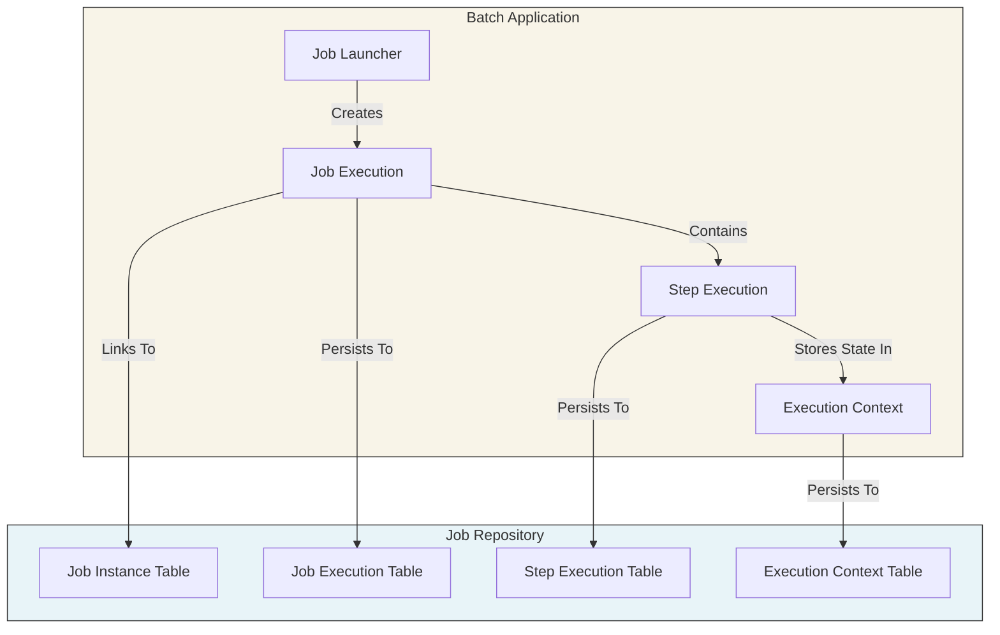
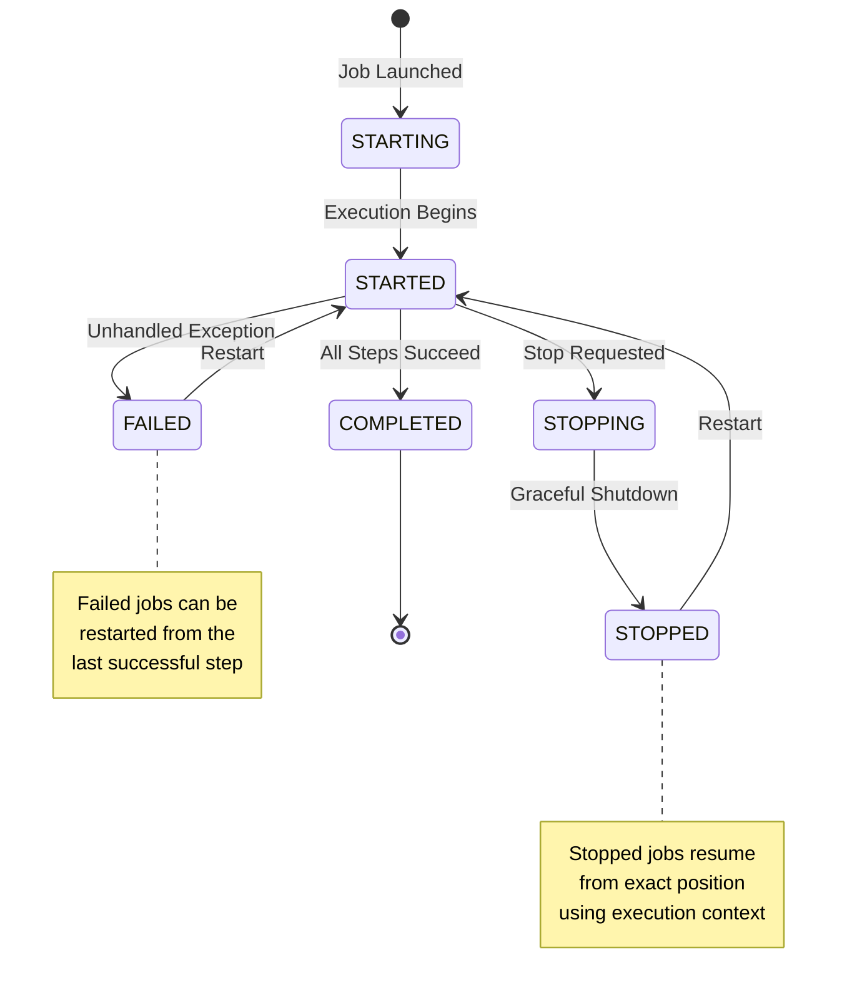
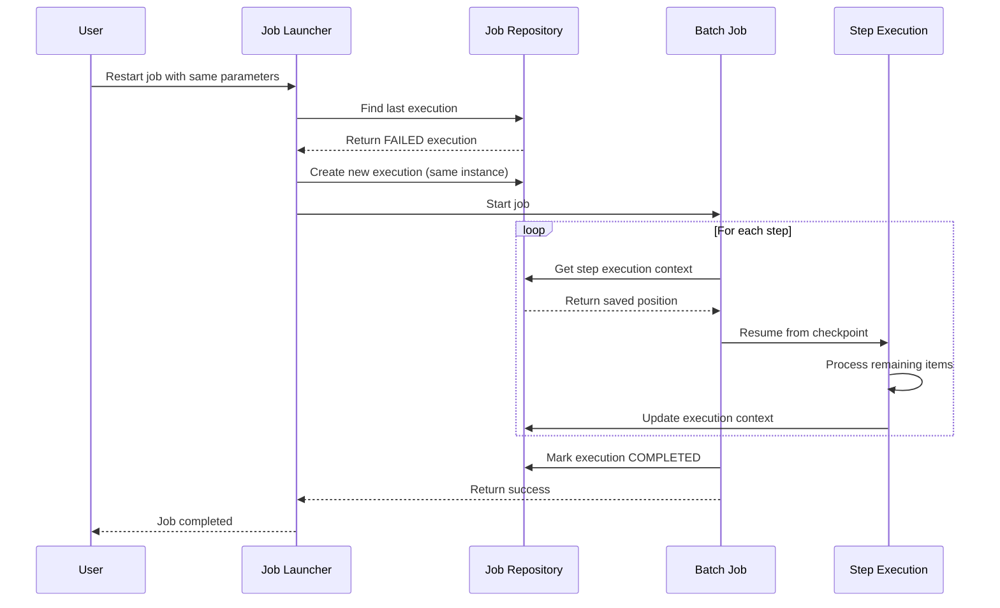

# How to Implement Batch History

Author: [nawazdhandala](https://github.com/nawazdhandala)

Tags: Batch Processing, History, Job Repository, Spring Batch

Description: Learn to implement batch history for maintaining execution records and enabling job restartability.

---

Batch processing systems need reliable history tracking to answer critical questions: Which jobs ran? Did they succeed? Can we restart a failed job from where it left off? A well-designed **batch history** implementation provides execution records, failure diagnostics, and restart capabilities. This guide walks through building a complete batch history system using Spring Batch as the reference framework.

## 1. Understanding Batch History Architecture

Batch history relies on a **Job Repository** that persists metadata about job executions. This repository stores information about when jobs started, how they progressed, and whether they completed successfully. The following diagram shows how components interact during batch execution.



The repository stores four types of records:

- **Job Instance**: A logical job run identified by job name and parameters
- **Job Execution**: A physical attempt to run a job instance
- **Step Execution**: Individual step attempts within a job execution
- **Execution Context**: Serialized state for restart capability

## 2. Job Repository Database Schema

The job repository requires specific tables to store execution history. Below is the complete schema that Spring Batch uses. These tables form the foundation for all history queries and restart operations.

```sql
-- Job Instance: Logical definition of a batch job run
-- One instance per unique combination of job name + identifying parameters
CREATE TABLE batch_job_instance (
    job_instance_id BIGINT PRIMARY KEY,           -- Unique identifier
    version BIGINT,                                -- Optimistic locking version
    job_name VARCHAR(100) NOT NULL,               -- Name of the batch job
    job_key VARCHAR(32) NOT NULL,                 -- Hash of identifying parameters
    CONSTRAINT job_inst_un UNIQUE (job_name, job_key)
);

-- Job Execution: Physical attempt to run a job instance
-- Multiple executions possible per instance (restarts after failure)
CREATE TABLE batch_job_execution (
    job_execution_id BIGINT PRIMARY KEY,          -- Unique identifier
    version BIGINT,                                -- Optimistic locking version
    job_instance_id BIGINT NOT NULL,              -- Links to job instance
    create_time TIMESTAMP NOT NULL,               -- When execution record was created
    start_time TIMESTAMP,                          -- When job actually started running
    end_time TIMESTAMP,                            -- When job finished (success or failure)
    status VARCHAR(10),                            -- COMPLETED, FAILED, STOPPED, etc.
    exit_code VARCHAR(2500),                       -- Detailed exit status string
    exit_message VARCHAR(2500),                    -- Human-readable result message
    last_updated TIMESTAMP,                        -- Last modification timestamp
    CONSTRAINT job_inst_exec_fk FOREIGN KEY (job_instance_id)
        REFERENCES batch_job_instance(job_instance_id)
);

-- Job Execution Parameters: Runtime parameters passed to job
-- Supports typed parameters (STRING, LONG, DOUBLE, DATE) with identifying flag
CREATE TABLE batch_job_execution_params (
    job_execution_id BIGINT NOT NULL,             -- Links to job execution
    parameter_name VARCHAR(100) NOT NULL,         -- Parameter key name
    parameter_type VARCHAR(100) NOT NULL,         -- Java type of parameter value
    parameter_value VARCHAR(2500),                -- Serialized parameter value
    identifying CHAR(1) NOT NULL,                 -- Y/N: affects job instance identity
    CONSTRAINT job_exec_params_fk FOREIGN KEY (job_execution_id)
        REFERENCES batch_job_execution(job_execution_id)
);

-- Step Execution: Individual step attempt within a job execution
-- Tracks detailed metrics for each processing step
CREATE TABLE batch_step_execution (
    step_execution_id BIGINT PRIMARY KEY,         -- Unique identifier
    version BIGINT NOT NULL,                       -- Optimistic locking version
    step_name VARCHAR(100) NOT NULL,              -- Name of the step
    job_execution_id BIGINT NOT NULL,             -- Links to parent job execution
    create_time TIMESTAMP NOT NULL,               -- When step record was created
    start_time TIMESTAMP,                          -- When step started executing
    end_time TIMESTAMP,                            -- When step finished
    status VARCHAR(10),                            -- COMPLETED, FAILED, etc.
    commit_count BIGINT,                           -- Number of commits performed
    read_count BIGINT,                             -- Items read from source
    filter_count BIGINT,                           -- Items filtered out by processor
    write_count BIGINT,                            -- Items written to destination
    read_skip_count BIGINT,                        -- Items skipped during read
    write_skip_count BIGINT,                       -- Items skipped during write
    process_skip_count BIGINT,                     -- Items skipped during processing
    rollback_count BIGINT,                         -- Number of rollbacks
    exit_code VARCHAR(2500),                       -- Detailed exit status
    exit_message VARCHAR(2500),                    -- Human-readable result
    last_updated TIMESTAMP,                        -- Last modification timestamp
    CONSTRAINT job_exec_step_fk FOREIGN KEY (job_execution_id)
        REFERENCES batch_job_execution(job_execution_id)
);

-- Execution Context: Serialized state for job and step executions
-- Enables restart capability by storing processing position
CREATE TABLE batch_step_execution_context (
    step_execution_id BIGINT PRIMARY KEY,         -- Links to step execution
    short_context VARCHAR(2500) NOT NULL,         -- Context if under 2500 chars
    serialized_context TEXT,                       -- Full serialized context (JSON/binary)
    CONSTRAINT step_exec_ctx_fk FOREIGN KEY (step_execution_id)
        REFERENCES batch_step_execution(step_execution_id)
);

CREATE TABLE batch_job_execution_context (
    job_execution_id BIGINT PRIMARY KEY,          -- Links to job execution
    short_context VARCHAR(2500) NOT NULL,         -- Context if under 2500 chars
    serialized_context TEXT,                       -- Full serialized context
    CONSTRAINT job_exec_ctx_fk FOREIGN KEY (job_execution_id)
        REFERENCES batch_job_execution(job_execution_id)
);

-- Sequences for generating unique IDs
CREATE SEQUENCE batch_step_execution_seq START WITH 1 INCREMENT BY 1;
CREATE SEQUENCE batch_job_execution_seq START WITH 1 INCREMENT BY 1;
CREATE SEQUENCE batch_job_seq START WITH 1 INCREMENT BY 1;

-- Indexes for common query patterns
CREATE INDEX idx_job_exec_instance ON batch_job_execution(job_instance_id);
CREATE INDEX idx_job_exec_status ON batch_job_execution(status);
CREATE INDEX idx_job_exec_start_time ON batch_job_execution(start_time);
CREATE INDEX idx_step_exec_job ON batch_step_execution(job_execution_id);
CREATE INDEX idx_step_exec_status ON batch_step_execution(status);
```

## 3. Configuring the Job Repository

Configure Spring Batch to use a persistent job repository. This configuration enables automatic history tracking and restart support. The `@EnableBatchProcessing` annotation sets up the infrastructure, while the datasource configuration points to your history database.

`BatchHistoryConfig.java`

```java
package com.example.batch.config;

import javax.sql.DataSource;
import org.springframework.batch.core.configuration.annotation.EnableBatchProcessing;
import org.springframework.batch.core.explore.JobExplorer;
import org.springframework.batch.core.explore.support.JobExplorerFactoryBean;
import org.springframework.batch.core.launch.JobLauncher;
import org.springframework.batch.core.launch.support.TaskExecutorJobLauncher;
import org.springframework.batch.core.repository.JobRepository;
import org.springframework.batch.core.repository.support.JobRepositoryFactoryBean;
import org.springframework.context.annotation.Bean;
import org.springframework.context.annotation.Configuration;
import org.springframework.jdbc.datasource.DataSourceTransactionManager;
import org.springframework.transaction.PlatformTransactionManager;

/**
 * Configures batch infrastructure with persistent job repository.
 * All job executions, step executions, and execution contexts
 * are stored in the configured database for history and restart.
 */
@Configuration
@EnableBatchProcessing
public class BatchHistoryConfig {

    /**
     * Creates the job repository that stores all execution history.
     * Uses JDBC for persistence, enabling restart after application restart.
     *
     * @param dataSource Database connection for history tables
     * @param transactionManager Transaction manager for atomic updates
     * @return Configured job repository
     */
    @Bean
    public JobRepository jobRepository(DataSource dataSource,
                                        PlatformTransactionManager transactionManager)
            throws Exception {
        JobRepositoryFactoryBean factory = new JobRepositoryFactoryBean();
        factory.setDataSource(dataSource);
        factory.setTransactionManager(transactionManager);

        // Use database-specific incrementer for ID generation
        factory.setDatabaseType("POSTGRES");

        // Table prefix allows multiple batch apps to share a database
        factory.setTablePrefix("batch_");

        // Validate that metadata schema exists on startup
        factory.setValidateTransactionState(true);

        factory.afterPropertiesSet();
        return factory.getObject();
    }

    /**
     * Job explorer provides read-only access to execution history.
     * Use this for querying past executions without modifying state.
     *
     * @param dataSource Database connection for history tables
     * @return Configured job explorer for history queries
     */
    @Bean
    public JobExplorer jobExplorer(DataSource dataSource) throws Exception {
        JobExplorerFactoryBean factory = new JobExplorerFactoryBean();
        factory.setDataSource(dataSource);
        factory.setTablePrefix("batch_");
        factory.afterPropertiesSet();
        return factory.getObject();
    }

    /**
     * Job launcher for starting batch jobs.
     * Configured for synchronous execution; use TaskExecutor for async.
     *
     * @param jobRepository Repository for persisting execution state
     * @return Configured job launcher
     */
    @Bean
    public JobLauncher jobLauncher(JobRepository jobRepository) throws Exception {
        TaskExecutorJobLauncher launcher = new TaskExecutorJobLauncher();
        launcher.setJobRepository(jobRepository);
        launcher.afterPropertiesSet();
        return launcher;
    }

    /**
     * Transaction manager for job repository operations.
     * Ensures atomic updates to execution state.
     *
     * @param dataSource Database connection
     * @return Platform transaction manager
     */
    @Bean
    public PlatformTransactionManager transactionManager(DataSource dataSource) {
        return new DataSourceTransactionManager(dataSource);
    }
}
```

## 4. Execution State Flow

Understanding the state transitions helps diagnose issues and implement proper error handling. The following diagram shows how job and step executions progress through various states.



Step executions follow a similar pattern but include additional states for chunk processing. Each chunk commit updates the step execution context with the current position.

## 5. Querying Execution History

Build a history service to query past executions. This service provides methods for common history queries like finding recent failures, checking job status, and retrieving execution details.

`BatchHistoryService.java`

```java
package com.example.batch.service;

import java.time.LocalDateTime;
import java.util.List;
import java.util.Optional;
import java.util.stream.Collectors;
import org.springframework.batch.core.BatchStatus;
import org.springframework.batch.core.JobExecution;
import org.springframework.batch.core.JobInstance;
import org.springframework.batch.core.StepExecution;
import org.springframework.batch.core.explore.JobExplorer;
import org.springframework.stereotype.Service;

/**
 * Service for querying batch execution history.
 * Provides methods to inspect past job runs, diagnose failures,
 * and check if jobs are eligible for restart.
 */
@Service
public class BatchHistoryService {

    private final JobExplorer jobExplorer;

    public BatchHistoryService(JobExplorer jobExplorer) {
        this.jobExplorer = jobExplorer;
    }

    /**
     * Retrieves the most recent execution for a job.
     * Useful for checking current status or getting restart candidate.
     *
     * @param jobName Name of the batch job
     * @return Most recent execution or empty if job never ran
     */
    public Optional<JobExecution> getLastExecution(String jobName) {
        // Get the most recent job instance
        List<JobInstance> instances = jobExplorer.findJobInstancesByJobName(
            jobName, 0, 1  // Start at 0, fetch 1 instance
        );

        if (instances.isEmpty()) {
            return Optional.empty();
        }

        // Get all executions for this instance (includes restarts)
        List<JobExecution> executions = jobExplorer.getJobExecutions(instances.get(0));

        // Return the most recent execution
        return executions.stream()
            .max((e1, e2) -> e1.getStartTime().compareTo(e2.getStartTime()));
    }

    /**
     * Finds all failed job executions within a time window.
     * Use this for alerting and failure dashboards.
     *
     * @param jobName Name of the batch job
     * @param since Start of time window
     * @return List of failed executions
     */
    public List<JobExecution> getFailedExecutions(String jobName, LocalDateTime since) {
        // Get recent instances (adjust count based on expected volume)
        List<JobInstance> instances = jobExplorer.findJobInstancesByJobName(
            jobName, 0, 100
        );

        return instances.stream()
            .flatMap(instance -> jobExplorer.getJobExecutions(instance).stream())
            .filter(exec -> exec.getStatus() == BatchStatus.FAILED)
            .filter(exec -> exec.getStartTime() != null &&
                           !exec.getStartTime().isBefore(java.sql.Timestamp.valueOf(since).toInstant()))
            .collect(Collectors.toList());
    }

    /**
     * Checks if a job instance can be restarted.
     * A job is restartable if its last execution failed or was stopped.
     *
     * @param jobName Name of the batch job
     * @return true if job can be restarted
     */
    public boolean isRestartable(String jobName) {
        return getLastExecution(jobName)
            .map(exec -> exec.getStatus() == BatchStatus.FAILED ||
                        exec.getStatus() == BatchStatus.STOPPED)
            .orElse(false);
    }

    /**
     * Gets detailed step execution history for a job run.
     * Includes read/write counts and skip statistics.
     *
     * @param jobExecutionId ID of the job execution
     * @return List of step executions with metrics
     */
    public List<StepExecution> getStepHistory(Long jobExecutionId) {
        JobExecution execution = jobExplorer.getJobExecution(jobExecutionId);
        if (execution == null) {
            return List.of();
        }
        return List.copyOf(execution.getStepExecutions());
    }

    /**
     * Gets execution statistics for reporting.
     * Returns counts grouped by status for the specified job.
     *
     * @param jobName Name of the batch job
     * @param instanceCount Number of recent instances to analyze
     * @return Execution statistics
     */
    public ExecutionStats getExecutionStats(String jobName, int instanceCount) {
        List<JobInstance> instances = jobExplorer.findJobInstancesByJobName(
            jobName, 0, instanceCount
        );

        long completed = 0, failed = 0, running = 0;

        for (JobInstance instance : instances) {
            for (JobExecution exec : jobExplorer.getJobExecutions(instance)) {
                switch (exec.getStatus()) {
                    case COMPLETED -> completed++;
                    case FAILED -> failed++;
                    case STARTED, STARTING -> running++;
                    default -> {} // Ignore other states
                }
            }
        }

        return new ExecutionStats(completed, failed, running);
    }

    /**
     * Simple record for execution statistics.
     */
    public record ExecutionStats(long completed, long failed, long running) {}
}
```

## 6. SQL Queries for History Analysis

Beyond the Java API, direct SQL queries enable custom reporting and integration with monitoring tools. Below are common queries for analyzing batch history.

```sql
-- Find all failed job executions in the last 24 hours
-- Useful for daily failure reports and alerting
SELECT
    ji.job_name,
    je.job_execution_id,
    je.start_time,
    je.end_time,
    je.exit_code,
    je.exit_message
FROM batch_job_execution je
JOIN batch_job_instance ji ON je.job_instance_id = ji.job_instance_id
WHERE je.status = 'FAILED'
  AND je.start_time > NOW() - INTERVAL '24 hours'
ORDER BY je.start_time DESC;

-- Get execution duration statistics by job name
-- Helps identify performance trends and anomalies
SELECT
    ji.job_name,
    COUNT(*) as execution_count,
    AVG(EXTRACT(EPOCH FROM (je.end_time - je.start_time))) as avg_duration_seconds,
    MIN(EXTRACT(EPOCH FROM (je.end_time - je.start_time))) as min_duration_seconds,
    MAX(EXTRACT(EPOCH FROM (je.end_time - je.start_time))) as max_duration_seconds
FROM batch_job_execution je
JOIN batch_job_instance ji ON je.job_instance_id = ji.job_instance_id
WHERE je.status = 'COMPLETED'
  AND je.start_time > NOW() - INTERVAL '7 days'
GROUP BY ji.job_name
ORDER BY ji.job_name;

-- Find steps with high skip counts (potential data quality issues)
-- Monitors for processing problems that don't cause outright failures
SELECT
    ji.job_name,
    se.step_name,
    se.job_execution_id,
    se.read_skip_count,
    se.process_skip_count,
    se.write_skip_count,
    se.start_time
FROM batch_step_execution se
JOIN batch_job_execution je ON se.job_execution_id = je.job_execution_id
JOIN batch_job_instance ji ON je.job_instance_id = ji.job_instance_id
WHERE (se.read_skip_count + se.process_skip_count + se.write_skip_count) > 0
  AND se.start_time > NOW() - INTERVAL '7 days'
ORDER BY (se.read_skip_count + se.process_skip_count + se.write_skip_count) DESC
LIMIT 50;

-- Get processing throughput by step
-- Useful for capacity planning and optimization
SELECT
    ji.job_name,
    se.step_name,
    se.read_count,
    se.write_count,
    EXTRACT(EPOCH FROM (se.end_time - se.start_time)) as duration_seconds,
    CASE
        WHEN se.end_time > se.start_time THEN
            se.write_count / EXTRACT(EPOCH FROM (se.end_time - se.start_time))
        ELSE 0
    END as items_per_second
FROM batch_step_execution se
JOIN batch_job_execution je ON se.job_execution_id = je.job_execution_id
JOIN batch_job_instance ji ON je.job_instance_id = ji.job_instance_id
WHERE se.status = 'COMPLETED'
  AND se.start_time > NOW() - INTERVAL '24 hours'
ORDER BY items_per_second DESC;

-- Find jobs that are currently running or stuck
-- Identifies orphaned executions after application crashes
SELECT
    ji.job_name,
    je.job_execution_id,
    je.start_time,
    je.last_updated,
    NOW() - je.last_updated as time_since_update
FROM batch_job_execution je
JOIN batch_job_instance ji ON je.job_instance_id = ji.job_instance_id
WHERE je.status IN ('STARTED', 'STARTING', 'STOPPING')
ORDER BY je.start_time;
```

## 7. Implementing Job Restart

A major benefit of batch history is restart capability. When a job fails, it can resume from the last successful checkpoint rather than starting over. The following diagram shows the restart flow.



`BatchRestartService.java`

```java
package com.example.batch.service;

import java.util.Set;
import org.springframework.batch.core.Job;
import org.springframework.batch.core.JobExecution;
import org.springframework.batch.core.JobParameters;
import org.springframework.batch.core.JobParametersInvalidException;
import org.springframework.batch.core.explore.JobExplorer;
import org.springframework.batch.core.launch.JobLauncher;
import org.springframework.batch.core.launch.JobOperator;
import org.springframework.batch.core.launch.NoSuchJobException;
import org.springframework.batch.core.launch.NoSuchJobExecutionException;
import org.springframework.batch.core.repository.JobExecutionAlreadyRunningException;
import org.springframework.batch.core.repository.JobInstanceAlreadyCompleteException;
import org.springframework.batch.core.repository.JobRestartException;
import org.springframework.stereotype.Service;

/**
 * Service for restarting failed or stopped batch jobs.
 * Uses execution history to resume from the last checkpoint.
 */
@Service
public class BatchRestartService {

    private final JobOperator jobOperator;
    private final JobExplorer jobExplorer;
    private final JobLauncher jobLauncher;

    public BatchRestartService(JobOperator jobOperator,
                               JobExplorer jobExplorer,
                               JobLauncher jobLauncher) {
        this.jobOperator = jobOperator;
        this.jobExplorer = jobExplorer;
        this.jobLauncher = jobLauncher;
    }

    /**
     * Restarts the most recent failed execution of a job.
     * The job resumes from the last committed chunk position.
     *
     * @param jobName Name of the job to restart
     * @return New job execution ID
     * @throws NoSuchJobException if job does not exist
     * @throws JobRestartException if job cannot be restarted
     */
    public Long restartLastFailedExecution(String jobName)
            throws NoSuchJobException, NoSuchJobExecutionException,
                   JobRestartException, JobInstanceAlreadyCompleteException,
                   JobParametersInvalidException, JobExecutionAlreadyRunningException {

        // Find all running executions for this job
        Set<Long> runningExecutions = jobOperator.getRunningExecutions(jobName);
        if (!runningExecutions.isEmpty()) {
            throw new JobExecutionAlreadyRunningException(
                "Job " + jobName + " already has running executions: " + runningExecutions
            );
        }

        // Find the most recent execution
        Set<Long> executions = jobOperator.getExecutions(
            jobExplorer.getLastJobInstance(jobName).getInstanceId()
        );

        Long lastExecutionId = executions.stream()
            .max(Long::compareTo)
            .orElseThrow(() -> new NoSuchJobExecutionException(
                "No executions found for job: " + jobName
            ));

        // Restart returns the new execution ID
        return jobOperator.restart(lastExecutionId);
    }

    /**
     * Restarts a specific job execution by ID.
     * Use when you need to restart a particular historical run.
     *
     * @param executionId ID of the execution to restart
     * @return New job execution ID
     */
    public Long restartExecution(Long executionId)
            throws NoSuchJobExecutionException, JobRestartException,
                   JobInstanceAlreadyCompleteException, JobParametersInvalidException,
                   NoSuchJobException, JobExecutionAlreadyRunningException {
        return jobOperator.restart(executionId);
    }

    /**
     * Starts a job fresh, abandoning any previous failed executions.
     * Use when you want to reprocess from the beginning.
     *
     * @param job The job to run
     * @param parameters Job parameters (must differ from previous runs)
     * @return Job execution with status
     */
    public JobExecution startFresh(Job job, JobParameters parameters) throws Exception {
        // Adding a timestamp parameter ensures a new job instance
        // even if other parameters match a previous run
        return jobLauncher.run(job, parameters);
    }

    /**
     * Abandons a stuck execution so the job can be restarted.
     * Use when an execution shows as STARTED but the process died.
     *
     * @param executionId ID of the stuck execution
     */
    public void abandonExecution(Long executionId)
            throws NoSuchJobExecutionException, JobExecutionAlreadyRunningException {
        jobOperator.abandon(executionId);
    }
}
```

## 8. History Retention and Cleanup

Batch history tables grow over time and need periodic cleanup. Implement a retention policy that keeps recent history while removing old records. The following job handles automated cleanup.

`HistoryRetentionConfig.java`

```java
package com.example.batch.config;

import javax.sql.DataSource;
import org.springframework.batch.core.Job;
import org.springframework.batch.core.Step;
import org.springframework.batch.core.job.builder.JobBuilder;
import org.springframework.batch.core.repository.JobRepository;
import org.springframework.batch.core.step.builder.StepBuilder;
import org.springframework.batch.core.step.tasklet.Tasklet;
import org.springframework.batch.repeat.RepeatStatus;
import org.springframework.beans.factory.annotation.Value;
import org.springframework.context.annotation.Bean;
import org.springframework.context.annotation.Configuration;
import org.springframework.jdbc.core.JdbcTemplate;
import org.springframework.transaction.PlatformTransactionManager;

/**
 * Configuration for batch history retention.
 * Creates a job that removes old execution records.
 */
@Configuration
public class HistoryRetentionConfig {

    // Number of days to retain history (configurable via properties)
    @Value("${batch.history.retention.days:90}")
    private int retentionDays;

    /**
     * Job that cleans up old batch history records.
     * Run this on a schedule (e.g., weekly) via CronJob or scheduler.
     */
    @Bean
    public Job historyCleanupJob(JobRepository jobRepository,
                                  Step cleanupStep) {
        return new JobBuilder("historyCleanupJob", jobRepository)
            .start(cleanupStep)
            .build();
    }

    /**
     * Step that performs the actual cleanup.
     * Deletes records in the correct order to respect foreign keys.
     */
    @Bean
    public Step cleanupStep(JobRepository jobRepository,
                            PlatformTransactionManager transactionManager,
                            Tasklet cleanupTasklet) {
        return new StepBuilder("cleanupStep", jobRepository)
            .tasklet(cleanupTasklet, transactionManager)
            .build();
    }

    /**
     * Tasklet that executes cleanup SQL statements.
     * Order matters: delete child records before parent records.
     */
    @Bean
    public Tasklet cleanupTasklet(DataSource dataSource) {
        return (contribution, chunkContext) -> {
            JdbcTemplate jdbc = new JdbcTemplate(dataSource);
            String cutoffDate = String.format(
                "NOW() - INTERVAL '%d days'", retentionDays
            );

            // Delete in order: contexts -> step executions ->
            // parameters -> job executions -> job instances

            // 1. Delete step execution contexts for old executions
            int stepCtxDeleted = jdbc.update("""
                DELETE FROM batch_step_execution_context
                WHERE step_execution_id IN (
                    SELECT se.step_execution_id
                    FROM batch_step_execution se
                    JOIN batch_job_execution je ON se.job_execution_id = je.job_execution_id
                    WHERE je.end_time < """ + cutoffDate + """
                    AND je.status IN ('COMPLETED', 'FAILED', 'ABANDONED')
                )
                """);

            // 2. Delete job execution contexts
            int jobCtxDeleted = jdbc.update("""
                DELETE FROM batch_job_execution_context
                WHERE job_execution_id IN (
                    SELECT job_execution_id
                    FROM batch_job_execution
                    WHERE end_time < """ + cutoffDate + """
                    AND status IN ('COMPLETED', 'FAILED', 'ABANDONED')
                )
                """);

            // 3. Delete step executions
            int stepsDeleted = jdbc.update("""
                DELETE FROM batch_step_execution
                WHERE job_execution_id IN (
                    SELECT job_execution_id
                    FROM batch_job_execution
                    WHERE end_time < """ + cutoffDate + """
                    AND status IN ('COMPLETED', 'FAILED', 'ABANDONED')
                )
                """);

            // 4. Delete job execution parameters
            int paramsDeleted = jdbc.update("""
                DELETE FROM batch_job_execution_params
                WHERE job_execution_id IN (
                    SELECT job_execution_id
                    FROM batch_job_execution
                    WHERE end_time < """ + cutoffDate + """
                    AND status IN ('COMPLETED', 'FAILED', 'ABANDONED')
                )
                """);

            // 5. Delete job executions
            int execsDeleted = jdbc.update("""
                DELETE FROM batch_job_execution
                WHERE end_time < """ + cutoffDate + """
                AND status IN ('COMPLETED', 'FAILED', 'ABANDONED')
                """);

            // 6. Delete orphaned job instances (no remaining executions)
            int instancesDeleted = jdbc.update("""
                DELETE FROM batch_job_instance
                WHERE job_instance_id NOT IN (
                    SELECT DISTINCT job_instance_id
                    FROM batch_job_execution
                )
                """);

            // Log cleanup results
            System.out.printf(
                "History cleanup completed: %d step contexts, %d job contexts, " +
                "%d steps, %d params, %d executions, %d instances deleted%n",
                stepCtxDeleted, jobCtxDeleted, stepsDeleted,
                paramsDeleted, execsDeleted, instancesDeleted
            );

            return RepeatStatus.FINISHED;
        };
    }
}
```

## 9. Monitoring Batch History

Expose batch history metrics for monitoring dashboards. The following component publishes execution metrics that can be scraped by Prometheus or similar tools.

`BatchHistoryMetrics.java`

```java
package com.example.batch.metrics;

import io.micrometer.core.instrument.Gauge;
import io.micrometer.core.instrument.MeterRegistry;
import io.micrometer.core.instrument.Timer;
import java.util.List;
import java.util.concurrent.TimeUnit;
import org.springframework.batch.core.BatchStatus;
import org.springframework.batch.core.JobExecution;
import org.springframework.batch.core.JobInstance;
import org.springframework.batch.core.explore.JobExplorer;
import org.springframework.scheduling.annotation.Scheduled;
import org.springframework.stereotype.Component;

/**
 * Publishes batch execution metrics to Micrometer.
 * Enables monitoring of batch job health and performance.
 */
@Component
public class BatchHistoryMetrics {

    private final JobExplorer jobExplorer;
    private final MeterRegistry registry;

    public BatchHistoryMetrics(JobExplorer jobExplorer, MeterRegistry registry) {
        this.jobExplorer = jobExplorer;
        this.registry = registry;

        // Register gauges for each known job
        registerJobMetrics();
    }

    /**
     * Registers metrics gauges for batch jobs.
     * Call this at startup and when new jobs are deployed.
     */
    private void registerJobMetrics() {
        List<String> jobNames = jobExplorer.getJobNames();

        for (String jobName : jobNames) {
            // Gauge for failed execution count
            Gauge.builder("batch.job.failures", () -> countByStatus(jobName, BatchStatus.FAILED))
                .tag("job", jobName)
                .description("Number of failed executions")
                .register(registry);

            // Gauge for completed execution count
            Gauge.builder("batch.job.completions", () -> countByStatus(jobName, BatchStatus.COMPLETED))
                .tag("job", jobName)
                .description("Number of completed executions")
                .register(registry);

            // Gauge for running execution count
            Gauge.builder("batch.job.running", () -> countByStatus(jobName, BatchStatus.STARTED))
                .tag("job", jobName)
                .description("Number of currently running executions")
                .register(registry);
        }
    }

    /**
     * Counts executions with a specific status for a job.
     * Looks at recent instances to avoid scanning full history.
     */
    private long countByStatus(String jobName, BatchStatus status) {
        List<JobInstance> instances = jobExplorer.findJobInstancesByJobName(
            jobName, 0, 100  // Check last 100 instances
        );

        return instances.stream()
            .flatMap(instance -> jobExplorer.getJobExecutions(instance).stream())
            .filter(exec -> exec.getStatus() == status)
            .count();
    }

    /**
     * Records execution duration as a timer metric.
     * Call this from a job listener after execution completes.
     *
     * @param execution The completed job execution
     */
    public void recordExecutionDuration(JobExecution execution) {
        if (execution.getStartTime() == null || execution.getEndTime() == null) {
            return;
        }

        long durationMs = execution.getEndTime().toEpochMilli() -
                          execution.getStartTime().toEpochMilli();

        Timer.builder("batch.job.duration")
            .tag("job", execution.getJobInstance().getJobName())
            .tag("status", execution.getStatus().toString())
            .description("Job execution duration")
            .register(registry)
            .record(durationMs, TimeUnit.MILLISECONDS);
    }

    /**
     * Periodic check for stuck jobs (no update in 30 minutes).
     * Logs warning for investigation.
     */
    @Scheduled(fixedRate = 300000)  // Every 5 minutes
    public void checkForStuckJobs() {
        for (String jobName : jobExplorer.getJobNames()) {
            List<JobInstance> instances = jobExplorer.findJobInstancesByJobName(
                jobName, 0, 10
            );

            for (JobInstance instance : instances) {
                for (JobExecution exec : jobExplorer.getJobExecutions(instance)) {
                    if (exec.getStatus() == BatchStatus.STARTED) {
                        long minutesSinceUpdate =
                            (System.currentTimeMillis() - exec.getLastUpdated().toEpochMilli())
                            / 60000;

                        if (minutesSinceUpdate > 30) {
                            System.err.printf(
                                "WARNING: Job %s execution %d may be stuck " +
                                "(no update in %d minutes)%n",
                                jobName, exec.getId(), minutesSinceUpdate
                            );
                        }
                    }
                }
            }
        }
    }
}
```

## 10. REST API for History Access

Expose batch history through a REST API for integration with dashboards and admin tools.

`BatchHistoryController.java`

```java
package com.example.batch.controller;

import com.example.batch.service.BatchHistoryService;
import com.example.batch.service.BatchHistoryService.ExecutionStats;
import com.example.batch.service.BatchRestartService;
import java.util.List;
import java.util.Map;
import java.util.stream.Collectors;
import org.springframework.batch.core.JobExecution;
import org.springframework.batch.core.StepExecution;
import org.springframework.batch.core.explore.JobExplorer;
import org.springframework.http.ResponseEntity;
import org.springframework.web.bind.annotation.*;

/**
 * REST controller for batch history operations.
 * Provides endpoints for querying history and triggering restarts.
 */
@RestController
@RequestMapping("/api/batch")
public class BatchHistoryController {

    private final BatchHistoryService historyService;
    private final BatchRestartService restartService;
    private final JobExplorer jobExplorer;

    public BatchHistoryController(BatchHistoryService historyService,
                                   BatchRestartService restartService,
                                   JobExplorer jobExplorer) {
        this.historyService = historyService;
        this.restartService = restartService;
        this.jobExplorer = jobExplorer;
    }

    /**
     * Lists all known batch jobs.
     * GET /api/batch/jobs
     */
    @GetMapping("/jobs")
    public List<String> listJobs() {
        return jobExplorer.getJobNames();
    }

    /**
     * Gets the last execution for a job.
     * GET /api/batch/jobs/{jobName}/last
     */
    @GetMapping("/jobs/{jobName}/last")
    public ResponseEntity<Map<String, Object>> getLastExecution(
            @PathVariable String jobName) {
        return historyService.getLastExecution(jobName)
            .map(exec -> ResponseEntity.ok(formatExecution(exec)))
            .orElse(ResponseEntity.notFound().build());
    }

    /**
     * Gets execution statistics for a job.
     * GET /api/batch/jobs/{jobName}/stats
     */
    @GetMapping("/jobs/{jobName}/stats")
    public ExecutionStats getStats(@PathVariable String jobName,
                                   @RequestParam(defaultValue = "100") int count) {
        return historyService.getExecutionStats(jobName, count);
    }

    /**
     * Gets step details for a specific execution.
     * GET /api/batch/executions/{executionId}/steps
     */
    @GetMapping("/executions/{executionId}/steps")
    public List<Map<String, Object>> getStepHistory(@PathVariable Long executionId) {
        return historyService.getStepHistory(executionId).stream()
            .map(this::formatStepExecution)
            .collect(Collectors.toList());
    }

    /**
     * Restarts a failed job.
     * POST /api/batch/jobs/{jobName}/restart
     */
    @PostMapping("/jobs/{jobName}/restart")
    public ResponseEntity<Map<String, Object>> restartJob(@PathVariable String jobName) {
        try {
            Long newExecutionId = restartService.restartLastFailedExecution(jobName);
            return ResponseEntity.ok(Map.of(
                "status", "restarted",
                "newExecutionId", newExecutionId
            ));
        } catch (Exception e) {
            return ResponseEntity.badRequest().body(Map.of(
                "status", "error",
                "message", e.getMessage()
            ));
        }
    }

    /**
     * Formats a job execution for JSON response.
     */
    private Map<String, Object> formatExecution(JobExecution exec) {
        return Map.of(
            "id", exec.getId(),
            "jobName", exec.getJobInstance().getJobName(),
            "status", exec.getStatus().toString(),
            "startTime", exec.getStartTime() != null ? exec.getStartTime().toString() : "N/A",
            "endTime", exec.getEndTime() != null ? exec.getEndTime().toString() : "N/A",
            "exitCode", exec.getExitStatus().getExitCode(),
            "exitDescription", exec.getExitStatus().getExitDescription()
        );
    }

    /**
     * Formats a step execution for JSON response.
     */
    private Map<String, Object> formatStepExecution(StepExecution step) {
        return Map.of(
            "id", step.getId(),
            "stepName", step.getStepName(),
            "status", step.getStatus().toString(),
            "readCount", step.getReadCount(),
            "writeCount", step.getWriteCount(),
            "skipCount", step.getSkipCount(),
            "commitCount", step.getCommitCount(),
            "rollbackCount", step.getRollbackCount()
        );
    }
}
```

## Summary

Implementing batch history provides several critical capabilities:

1. **Execution Tracking**: Know exactly when jobs ran, how long they took, and what they processed
2. **Failure Diagnosis**: Quickly identify failed jobs with detailed step-level metrics and exit messages
3. **Restart Capability**: Resume failed jobs from the last checkpoint without reprocessing completed data
4. **Operational Visibility**: Expose metrics for monitoring dashboards and alerting
5. **Compliance**: Maintain audit trails of batch processing for regulatory requirements

The job repository schema forms the foundation. Build services on top for querying history, restarting jobs, and cleaning up old records. Expose REST endpoints and metrics for integration with your operational tooling. With proper batch history in place, your batch processing becomes observable, recoverable, and production-ready.
