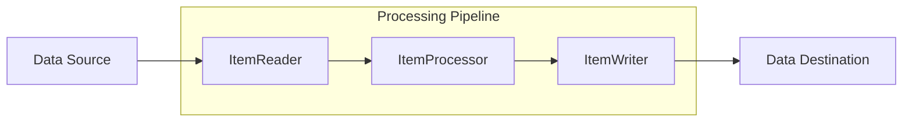
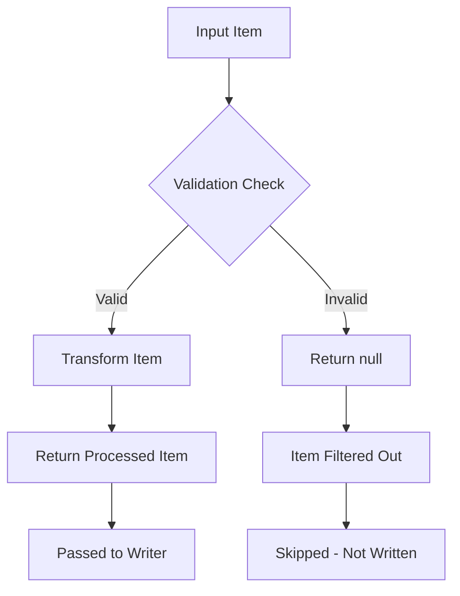
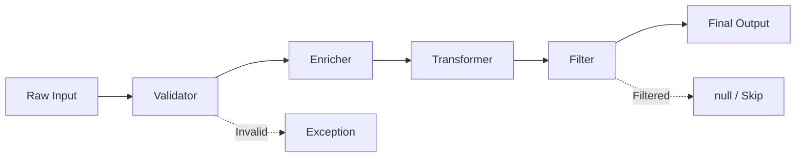
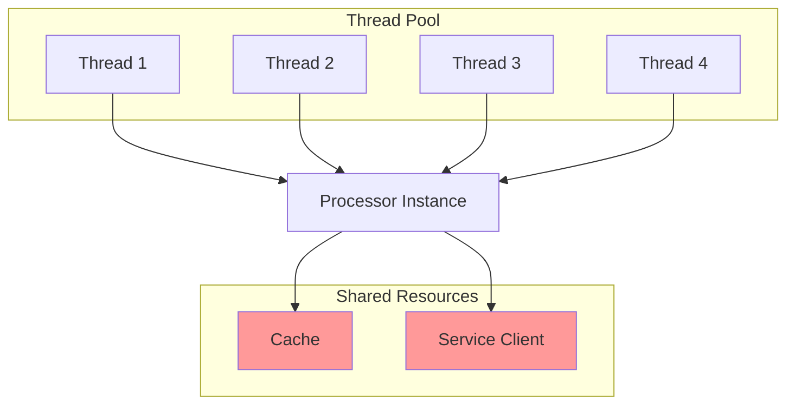

# How to Implement Item Processors

Author: [nawazdhandala](https://github.com/nawazdhandala)

Tags: Batch Processing, Item Processor, Spring Batch, Data Transformation

Description: Learn to implement item processors for transforming, filtering, and validating data in batch pipelines.

---

Item processors sit at the heart of batch data pipelines. They transform, filter, validate, and enrich data as it flows from readers to writers. A well-designed processor keeps your batch jobs maintainable, testable, and performant.

This guide covers implementing item processors from basic transformations to advanced composition patterns.

## The Role of Item Processors in Batch Processing

Batch processing follows a reader-processor-writer pattern. The reader fetches data from a source, the processor transforms each item, and the writer persists results to a destination.



Item processors handle:
- **Transformation**: Converting data from one format to another
- **Validation**: Ensuring data meets business rules before writing
- **Filtering**: Skipping records that should not be processed
- **Enrichment**: Adding data from external sources
- **Aggregation**: Combining or summarizing data

## Basic Item Processor Implementation

### The ItemProcessor Interface

In Spring Batch, the `ItemProcessor` interface defines a single method that transforms an input item into an output item. The generic types allow different input and output types.

```java
// Spring Batch ItemProcessor interface
// I = Input type (what comes from the reader)
// O = Output type (what goes to the writer)
public interface ItemProcessor<I, O> {

    // Process a single item
    // Returns null to indicate the item should be filtered out
    // Throws exception to trigger skip/retry policies
    O process(I item) throws Exception;
}
```

### Simple Transformation Processor

This processor transforms raw order data into a standardized format. Each method handles one aspect of the transformation, making the code easy to test and modify.

```java
import org.springframework.batch.item.ItemProcessor;
import java.math.BigDecimal;
import java.time.LocalDateTime;

// Transforms raw order data into processed order format
// Input: RawOrder from CSV/database
// Output: ProcessedOrder ready for downstream systems
public class OrderTransformationProcessor
        implements ItemProcessor<RawOrder, ProcessedOrder> {

    @Override
    public ProcessedOrder process(RawOrder rawOrder) throws Exception {
        // Create the output object with transformed data
        ProcessedOrder processed = new ProcessedOrder();

        // Copy identifier fields directly
        processed.setOrderId(rawOrder.getOrderId());
        processed.setCustomerId(rawOrder.getCustomerId());

        // Transform and normalize the product name
        // Remove extra whitespace, convert to uppercase for consistency
        processed.setProductName(
            normalizeProductName(rawOrder.getProductName())
        );

        // Calculate total with tax
        // Business logic: 8.5% tax rate applied to subtotal
        BigDecimal subtotal = rawOrder.getUnitPrice()
            .multiply(BigDecimal.valueOf(rawOrder.getQuantity()));
        BigDecimal tax = subtotal.multiply(BigDecimal.valueOf(0.085));
        processed.setTotalAmount(subtotal.add(tax));

        // Set processing timestamp for audit trail
        processed.setProcessedAt(LocalDateTime.now());

        return processed;
    }

    // Normalize product names for consistent storage and searching
    private String normalizeProductName(String name) {
        if (name == null) {
            return "UNKNOWN";
        }
        // Trim whitespace, collapse multiple spaces, uppercase
        return name.trim()
            .replaceAll("\\s+", " ")
            .toUpperCase();
    }
}
```

## Filtering with Item Processors

Returning `null` from a processor tells the batch framework to skip that item. The item will not be passed to the writer, effectively filtering it from the output.



### Filtering Processor Example

This processor filters out orders that do not meet minimum requirements. Filtered items are logged for audit purposes before returning null.

```java
import org.slf4j.Logger;
import org.slf4j.LoggerFactory;

// Filters orders based on business rules
// Returns null for orders that should not be processed
public class OrderFilterProcessor
        implements ItemProcessor<Order, Order> {

    private static final Logger log =
        LoggerFactory.getLogger(OrderFilterProcessor.class);

    // Minimum order value to process (configurable)
    private final BigDecimal minimumOrderValue;

    // Valid order statuses that should be processed
    private final Set<String> validStatuses;

    public OrderFilterProcessor(
            BigDecimal minimumOrderValue,
            Set<String> validStatuses) {
        this.minimumOrderValue = minimumOrderValue;
        this.validStatuses = validStatuses;
    }

    @Override
    public Order process(Order order) throws Exception {
        // Filter 1: Check minimum order value
        // Small orders may not be worth processing overhead
        if (order.getTotalAmount().compareTo(minimumOrderValue) < 0) {
            log.debug(
                "Filtering order {} - below minimum value: {}",
                order.getOrderId(),
                order.getTotalAmount()
            );
            return null; // Filter out this item
        }

        // Filter 2: Check order status
        // Only process orders in certain states
        if (!validStatuses.contains(order.getStatus())) {
            log.debug(
                "Filtering order {} - invalid status: {}",
                order.getOrderId(),
                order.getStatus()
            );
            return null; // Filter out this item
        }

        // Filter 3: Check for test/dummy orders
        // Test orders should not reach production systems
        if (order.getCustomerId().startsWith("TEST_")) {
            log.debug(
                "Filtering order {} - test customer",
                order.getOrderId()
            );
            return null; // Filter out this item
        }

        // Order passed all filters - continue processing
        return order;
    }
}
```

## Validation in Item Processors

Validation ensures data integrity before writing. Unlike filtering (which silently skips items), validation throws exceptions for invalid data, triggering the batch framework's skip or retry policies.

### Validation Processor with Bean Validation

This processor uses JSR-380 Bean Validation annotations for declarative validation. Invalid items throw exceptions that can trigger skip policies.

```java
import javax.validation.ConstraintViolation;
import javax.validation.Validator;
import javax.validation.ValidatorFactory;
import javax.validation.Validation;
import java.util.Set;
import java.util.stream.Collectors;

// Validates items using Bean Validation (JSR-380)
// Throws ValidationException for invalid items
public class ValidatingItemProcessor<T> implements ItemProcessor<T, T> {

    private final Validator validator;

    public ValidatingItemProcessor() {
        // Create validator instance from default factory
        // In Spring, inject this instead for better testability
        ValidatorFactory factory = Validation.buildDefaultValidatorFactory();
        this.validator = factory.getValidator();
    }

    @Override
    public T process(T item) throws Exception {
        // Validate the item against its constraint annotations
        // Returns empty set if all constraints pass
        Set<ConstraintViolation<T>> violations = validator.validate(item);

        if (!violations.isEmpty()) {
            // Build detailed error message from all violations
            String errorMessage = violations.stream()
                .map(v -> v.getPropertyPath() + ": " + v.getMessage())
                .collect(Collectors.joining(", "));

            // Throw exception to trigger skip/retry policy
            throw new ValidationException(
                "Validation failed for item: " + errorMessage
            );
        }

        // Item is valid - pass through unchanged
        return item;
    }
}

// Example domain object with validation constraints
public class Customer {

    @NotNull(message = "Customer ID is required")
    @Pattern(regexp = "^[A-Z]{2}\\d{6}$",
             message = "Customer ID must be 2 letters followed by 6 digits")
    private String customerId;

    @NotBlank(message = "Name is required")
    @Size(max = 100, message = "Name must not exceed 100 characters")
    private String name;

    @Email(message = "Invalid email format")
    private String email;

    @Min(value = 0, message = "Credit limit cannot be negative")
    private BigDecimal creditLimit;

    // getters and setters...
}
```

### Custom Business Validation

For complex business rules that cannot be expressed with annotations, implement custom validation logic in the processor.

```java
// Custom validation for complex business rules
// Validates orders against customer credit limits and inventory
public class OrderBusinessValidator
        implements ItemProcessor<Order, Order> {

    private final CustomerRepository customerRepository;
    private final InventoryService inventoryService;

    public OrderBusinessValidator(
            CustomerRepository customerRepository,
            InventoryService inventoryService) {
        this.customerRepository = customerRepository;
        this.inventoryService = inventoryService;
    }

    @Override
    public Order process(Order order) throws Exception {
        // Validation 1: Customer exists and is active
        Customer customer = customerRepository
            .findById(order.getCustomerId())
            .orElseThrow(() -> new ValidationException(
                "Customer not found: " + order.getCustomerId()
            ));

        if (!customer.isActive()) {
            throw new ValidationException(
                "Customer account is inactive: " + order.getCustomerId()
            );
        }

        // Validation 2: Order does not exceed credit limit
        BigDecimal availableCredit = customer.getCreditLimit()
            .subtract(customer.getCurrentBalance());

        if (order.getTotalAmount().compareTo(availableCredit) > 0) {
            throw new ValidationException(String.format(
                "Order %s exceeds available credit. " +
                "Order: %s, Available: %s",
                order.getOrderId(),
                order.getTotalAmount(),
                availableCredit
            ));
        }

        // Validation 3: Inventory is available
        for (OrderLine line : order.getOrderLines()) {
            int available = inventoryService
                .getAvailableQuantity(line.getProductId());

            if (available < line.getQuantity()) {
                throw new ValidationException(String.format(
                    "Insufficient inventory for product %s. " +
                    "Requested: %d, Available: %d",
                    line.getProductId(),
                    line.getQuantity(),
                    available
                ));
            }
        }

        // All validations passed
        return order;
    }
}
```

## Processor Chaining and Composition

Real-world batch jobs require multiple processing steps. Chaining processors creates a pipeline where each processor handles one responsibility.



### Using CompositeItemProcessor

Spring Batch provides `CompositeItemProcessor` to chain multiple processors. Processors execute in order, and if any returns null, the chain stops.

```java
import org.springframework.batch.item.support.CompositeItemProcessor;
import org.springframework.context.annotation.Bean;
import org.springframework.context.annotation.Configuration;
import java.util.Arrays;

@Configuration
public class BatchConfiguration {

    @Bean
    public CompositeItemProcessor<RawOrder, ProcessedOrder>
            compositeOrderProcessor() {

        // Create composite processor to chain multiple steps
        CompositeItemProcessor<RawOrder, ProcessedOrder> composite =
            new CompositeItemProcessor<>();

        // Define the processing chain
        // Order matters: validation before transformation, etc.
        composite.setDelegates(Arrays.asList(
            // Step 1: Validate input data
            validatingProcessor(),

            // Step 2: Filter out unwanted records
            filteringProcessor(),

            // Step 3: Enrich with external data
            enrichmentProcessor(),

            // Step 4: Transform to output format
            transformationProcessor()
        ));

        return composite;
    }

    @Bean
    public ItemProcessor<RawOrder, RawOrder> validatingProcessor() {
        return new ValidatingItemProcessor<>();
    }

    @Bean
    public ItemProcessor<RawOrder, RawOrder> filteringProcessor() {
        return new OrderFilterProcessor(
            new BigDecimal("10.00"),
            Set.of("PENDING", "CONFIRMED")
        );
    }

    @Bean
    public ItemProcessor<RawOrder, EnrichedOrder> enrichmentProcessor() {
        return new OrderEnrichmentProcessor(customerService());
    }

    @Bean
    public ItemProcessor<EnrichedOrder, ProcessedOrder> transformationProcessor() {
        return new OrderTransformationProcessor();
    }
}
```

### Custom Processor Chain Builder

For more control over chaining behavior, implement a custom chain builder that handles type transitions and error policies.

```java
import java.util.ArrayList;
import java.util.List;
import java.util.function.Function;

// Fluent builder for processor chains with type safety
// Handles type transitions between processors automatically
public class ProcessorChainBuilder<I, O> {

    private final List<ItemProcessor<?, ?>> processors = new ArrayList<>();

    // Private constructor - use static factory method
    private ProcessorChainBuilder() {}

    // Start a new chain with the first processor
    public static <I, O> ProcessorChainBuilder<I, O> start(
            ItemProcessor<I, O> firstProcessor) {
        ProcessorChainBuilder<I, O> builder = new ProcessorChainBuilder<>();
        builder.processors.add(firstProcessor);
        return builder;
    }

    // Add another processor to the chain
    // Generic type N is the output of the new processor
    @SuppressWarnings("unchecked")
    public <N> ProcessorChainBuilder<I, N> then(
            ItemProcessor<O, N> nextProcessor) {
        processors.add(nextProcessor);
        // Cast is safe because we track types through generics
        return (ProcessorChainBuilder<I, N>) this;
    }

    // Build the final composite processor
    @SuppressWarnings("unchecked")
    public ItemProcessor<I, O> build() {
        // Return single processor if only one in chain
        if (processors.size() == 1) {
            return (ItemProcessor<I, O>) processors.get(0);
        }

        // Create chain processor that executes in sequence
        return item -> {
            Object current = item;

            for (ItemProcessor processor : processors) {
                // Process through each step
                current = processor.process(current);

                // Stop chain if any processor returns null (filter)
                if (current == null) {
                    return null;
                }
            }

            return (O) current;
        };
    }
}

// Usage example
ItemProcessor<RawOrder, ProcessedOrder> processor =
    ProcessorChainBuilder
        .start(new RawOrderValidator())
        .then(new OrderFilter())
        .then(new OrderEnricher())
        .then(new OrderTransformer())
        .build();
```

## Data Enrichment Processors

Enrichment processors add data from external sources. They typically call services, databases, or APIs to fetch additional information.

```java
// Enriches orders with customer and product details
// Fetches data from external services during processing
public class OrderEnrichmentProcessor
        implements ItemProcessor<Order, EnrichedOrder> {

    private final CustomerService customerService;
    private final ProductCatalog productCatalog;
    private final PricingEngine pricingEngine;

    // Cache customer lookups to avoid repeated calls
    // In production, use a proper cache like Caffeine or Redis
    private final Map<String, Customer> customerCache =
        new ConcurrentHashMap<>();

    public OrderEnrichmentProcessor(
            CustomerService customerService,
            ProductCatalog productCatalog,
            PricingEngine pricingEngine) {
        this.customerService = customerService;
        this.productCatalog = productCatalog;
        this.pricingEngine = pricingEngine;
    }

    @Override
    public EnrichedOrder process(Order order) throws Exception {
        EnrichedOrder enriched = new EnrichedOrder(order);

        // Enrich with customer data
        // Use cache to avoid repeated lookups for same customer
        Customer customer = customerCache.computeIfAbsent(
            order.getCustomerId(),
            id -> customerService.getCustomer(id)
        );
        enriched.setCustomerName(customer.getName());
        enriched.setCustomerTier(customer.getLoyaltyTier());
        enriched.setCustomerRegion(customer.getRegion());

        // Enrich each order line with product details
        for (OrderLine line : enriched.getOrderLines()) {
            Product product = productCatalog
                .getProduct(line.getProductId());

            line.setProductName(product.getName());
            line.setCategory(product.getCategory());
            line.setWeight(product.getWeight());

            // Calculate dynamic pricing based on customer tier
            BigDecimal price = pricingEngine.calculatePrice(
                product,
                customer.getLoyaltyTier(),
                line.getQuantity()
            );
            line.setUnitPrice(price);
        }

        // Calculate totals with enriched pricing
        enriched.recalculateTotals();

        return enriched;
    }

    // Clear cache between job runs to prevent stale data
    public void clearCache() {
        customerCache.clear();
    }
}
```

## Parallel Processing Considerations

When processing items in parallel (multi-threaded step), processors must be thread-safe. Avoid shared mutable state or use proper synchronization.



### Thread-Safe Processor Implementation

```java
import java.util.concurrent.ConcurrentHashMap;
import java.util.concurrent.atomic.AtomicLong;

// Thread-safe processor for parallel batch processing
// All shared state uses concurrent data structures
public class ThreadSafeEnrichmentProcessor
        implements ItemProcessor<Order, EnrichedOrder> {

    // Thread-safe cache for customer data
    private final ConcurrentHashMap<String, Customer> customerCache;

    // Thread-safe counters for monitoring
    private final AtomicLong processedCount = new AtomicLong(0);
    private final AtomicLong enrichmentErrors = new AtomicLong(0);

    // Injected service must also be thread-safe
    private final CustomerService customerService;

    public ThreadSafeEnrichmentProcessor(CustomerService customerService) {
        this.customerService = customerService;
        this.customerCache = new ConcurrentHashMap<>();
    }

    @Override
    public EnrichedOrder process(Order order) throws Exception {
        // Increment counter atomically
        processedCount.incrementAndGet();

        try {
            EnrichedOrder enriched = new EnrichedOrder(order);

            // computeIfAbsent is thread-safe
            // Only one thread will call the service for a given key
            Customer customer = customerCache.computeIfAbsent(
                order.getCustomerId(),
                this::fetchCustomer
            );

            enriched.setCustomerName(customer.getName());
            enriched.setCustomerTier(customer.getLoyaltyTier());

            return enriched;

        } catch (Exception e) {
            // Track errors atomically
            enrichmentErrors.incrementAndGet();
            throw e;
        }
    }

    // Separate method for service call - easier to test
    private Customer fetchCustomer(String customerId) {
        return customerService.getCustomer(customerId);
    }

    // Expose metrics for monitoring
    public long getProcessedCount() {
        return processedCount.get();
    }

    public long getErrorCount() {
        return enrichmentErrors.get();
    }
}
```

## Error Handling Strategies

Processors should handle errors appropriately based on the error type and business requirements.

```java
// Processor with comprehensive error handling
// Different errors trigger different behaviors
public class RobustOrderProcessor
        implements ItemProcessor<RawOrder, ProcessedOrder> {

    private static final Logger log =
        LoggerFactory.getLogger(RobustOrderProcessor.class);

    private final OrderService orderService;
    private final int maxRetries;

    public RobustOrderProcessor(OrderService orderService, int maxRetries) {
        this.orderService = orderService;
        this.maxRetries = maxRetries;
    }

    @Override
    public ProcessedOrder process(RawOrder order) throws Exception {
        try {
            return doProcess(order);

        } catch (ValidationException e) {
            // Validation errors: skip the item, do not retry
            // These are data quality issues that won't be fixed by retry
            log.warn("Validation failed for order {}: {}",
                order.getOrderId(), e.getMessage());
            throw e; // Let skip policy handle it

        } catch (TransientException e) {
            // Transient errors: retry with backoff
            // Network issues, temporary service unavailability, etc.
            return processWithRetry(order, e);

        } catch (Exception e) {
            // Unexpected errors: log details and rethrow
            log.error("Unexpected error processing order {}",
                order.getOrderId(), e);
            throw new ProcessingException(
                "Failed to process order: " + order.getOrderId(), e);
        }
    }

    private ProcessedOrder doProcess(RawOrder order) throws Exception {
        // Main processing logic
        ProcessedOrder processed = new ProcessedOrder();
        processed.setOrderId(order.getOrderId());

        // This call might throw TransientException
        OrderDetails details = orderService.fetchDetails(order.getOrderId());
        processed.setDetails(details);

        return processed;
    }

    private ProcessedOrder processWithRetry(
            RawOrder order,
            TransientException initialError) throws Exception {

        Exception lastError = initialError;

        for (int attempt = 1; attempt <= maxRetries; attempt++) {
            try {
                // Exponential backoff: 100ms, 200ms, 400ms, etc.
                long backoffMs = 100L * (1L << (attempt - 1));
                Thread.sleep(backoffMs);

                log.info("Retry attempt {} for order {}",
                    attempt, order.getOrderId());

                return doProcess(order);

            } catch (TransientException e) {
                lastError = e;
                log.warn("Retry {} failed for order {}: {}",
                    attempt, order.getOrderId(), e.getMessage());
            }
        }

        // All retries exhausted
        throw new ProcessingException(
            "Failed after " + maxRetries + " retries", lastError);
    }
}
```

## Testing Item Processors

Processors are easy to unit test because they have a single responsibility and clear inputs/outputs.

```java
import org.junit.jupiter.api.Test;
import org.junit.jupiter.api.BeforeEach;
import static org.assertj.core.api.Assertions.*;
import static org.mockito.Mockito.*;

class OrderTransformationProcessorTest {

    private OrderTransformationProcessor processor;

    @BeforeEach
    void setUp() {
        processor = new OrderTransformationProcessor();
    }

    @Test
    void shouldTransformValidOrder() throws Exception {
        // Arrange: Create input order
        RawOrder input = new RawOrder();
        input.setOrderId("ORD-001");
        input.setCustomerId("CUST-123");
        input.setProductName("  widget pro  ");
        input.setUnitPrice(new BigDecimal("10.00"));
        input.setQuantity(5);

        // Act: Process the order
        ProcessedOrder result = processor.process(input);

        // Assert: Verify transformation
        assertThat(result.getOrderId()).isEqualTo("ORD-001");
        assertThat(result.getProductName()).isEqualTo("WIDGET PRO");

        // Verify tax calculation: (10 * 5) * 1.085 = 54.25
        assertThat(result.getTotalAmount())
            .isEqualByComparingTo(new BigDecimal("54.25"));

        assertThat(result.getProcessedAt()).isNotNull();
    }

    @Test
    void shouldHandleNullProductName() throws Exception {
        // Arrange
        RawOrder input = new RawOrder();
        input.setProductName(null);
        input.setUnitPrice(BigDecimal.ONE);
        input.setQuantity(1);

        // Act
        ProcessedOrder result = processor.process(input);

        // Assert: Null product name becomes "UNKNOWN"
        assertThat(result.getProductName()).isEqualTo("UNKNOWN");
    }
}

class OrderFilterProcessorTest {

    private OrderFilterProcessor processor;

    @BeforeEach
    void setUp() {
        processor = new OrderFilterProcessor(
            new BigDecimal("10.00"),
            Set.of("PENDING", "CONFIRMED")
        );
    }

    @Test
    void shouldFilterOrderBelowMinimumValue() throws Exception {
        // Arrange
        Order order = new Order();
        order.setOrderId("ORD-001");
        order.setTotalAmount(new BigDecimal("5.00"));
        order.setStatus("CONFIRMED");
        order.setCustomerId("CUST-001");

        // Act
        Order result = processor.process(order);

        // Assert: Returns null to filter out the order
        assertThat(result).isNull();
    }

    @Test
    void shouldPassOrderMeetingAllCriteria() throws Exception {
        // Arrange
        Order order = new Order();
        order.setOrderId("ORD-001");
        order.setTotalAmount(new BigDecimal("100.00"));
        order.setStatus("CONFIRMED");
        order.setCustomerId("CUST-001");

        // Act
        Order result = processor.process(order);

        // Assert: Order passes through unchanged
        assertThat(result).isSameAs(order);
    }

    @Test
    void shouldFilterTestOrders() throws Exception {
        // Arrange
        Order order = new Order();
        order.setOrderId("ORD-001");
        order.setTotalAmount(new BigDecimal("100.00"));
        order.setStatus("CONFIRMED");
        order.setCustomerId("TEST_USER_001"); // Test customer

        // Act
        Order result = processor.process(order);

        // Assert: Test orders are filtered
        assertThat(result).isNull();
    }
}

class EnrichmentProcessorTest {

    private OrderEnrichmentProcessor processor;
    private CustomerService mockCustomerService;

    @BeforeEach
    void setUp() {
        // Create mock dependencies
        mockCustomerService = mock(CustomerService.class);
        ProductCatalog mockCatalog = mock(ProductCatalog.class);
        PricingEngine mockPricing = mock(PricingEngine.class);

        processor = new OrderEnrichmentProcessor(
            mockCustomerService,
            mockCatalog,
            mockPricing
        );
    }

    @Test
    void shouldEnrichOrderWithCustomerData() throws Exception {
        // Arrange
        Order order = new Order();
        order.setCustomerId("CUST-001");
        order.setOrderLines(Collections.emptyList());

        Customer customer = new Customer();
        customer.setName("John Doe");
        customer.setLoyaltyTier("GOLD");
        customer.setRegion("US-WEST");

        when(mockCustomerService.getCustomer("CUST-001"))
            .thenReturn(customer);

        // Act
        EnrichedOrder result = processor.process(order);

        // Assert
        assertThat(result.getCustomerName()).isEqualTo("John Doe");
        assertThat(result.getCustomerTier()).isEqualTo("GOLD");
        assertThat(result.getCustomerRegion()).isEqualTo("US-WEST");
    }

    @Test
    void shouldCacheCustomerLookups() throws Exception {
        // Arrange
        Order order1 = new Order();
        order1.setCustomerId("CUST-001");
        order1.setOrderLines(Collections.emptyList());

        Order order2 = new Order();
        order2.setCustomerId("CUST-001"); // Same customer
        order2.setOrderLines(Collections.emptyList());

        Customer customer = new Customer();
        customer.setName("John Doe");

        when(mockCustomerService.getCustomer("CUST-001"))
            .thenReturn(customer);

        // Act: Process two orders for same customer
        processor.process(order1);
        processor.process(order2);

        // Assert: Service called only once due to caching
        verify(mockCustomerService, times(1)).getCustomer("CUST-001");
    }
}
```

## Functional Style Processors

For simple transformations, use Java functional interfaces or lambdas instead of full classes.

```java
import java.util.function.Function;
import java.util.function.Predicate;

// Adapter to use Function as ItemProcessor
public class FunctionalItemProcessor<I, O> implements ItemProcessor<I, O> {

    private final Function<I, O> transformer;

    public FunctionalItemProcessor(Function<I, O> transformer) {
        this.transformer = transformer;
    }

    @Override
    public O process(I item) {
        return transformer.apply(item);
    }

    // Factory method for filtering based on predicate
    // Returns null for items that do not match the predicate
    public static <T> ItemProcessor<T, T> filter(Predicate<T> predicate) {
        return item -> predicate.test(item) ? item : null;
    }

    // Factory method for transformation
    public static <I, O> ItemProcessor<I, O> transform(Function<I, O> fn) {
        return new FunctionalItemProcessor<>(fn);
    }
}

// Usage in configuration
@Bean
public ItemProcessor<Order, Order> minValueFilter() {
    // Filter orders below $10
    return FunctionalItemProcessor.filter(
        order -> order.getTotalAmount().compareTo(TEN) >= 0
    );
}

@Bean
public ItemProcessor<RawOrder, ProcessedOrder> simpleTransformer() {
    // Simple transformation using lambda
    return FunctionalItemProcessor.transform(raw -> {
        ProcessedOrder processed = new ProcessedOrder();
        processed.setOrderId(raw.getOrderId());
        processed.setTotal(raw.calculateTotal());
        return processed;
    });
}
```

## Python Implementation

Item processor patterns apply to any batch framework. Here is an equivalent implementation using Python.

```python
from abc import ABC, abstractmethod
from dataclasses import dataclass
from typing import TypeVar, Generic, Optional, List, Callable
from decimal import Decimal
import logging

# Generic type variables for input and output
I = TypeVar('I')
O = TypeVar('O')

# Abstract base class for item processors
class ItemProcessor(ABC, Generic[I, O]):
    """
    Base class for all item processors.
    Transforms input items to output items.
    Return None to filter out an item.
    """

    @abstractmethod
    def process(self, item: I) -> Optional[O]:
        """Process a single item. Return None to filter."""
        pass


@dataclass
class RawOrder:
    """Input order from data source"""
    order_id: str
    customer_id: str
    product_name: str
    unit_price: Decimal
    quantity: int
    status: str


@dataclass
class ProcessedOrder:
    """Transformed order ready for output"""
    order_id: str
    customer_id: str
    product_name: str
    total_amount: Decimal
    processed: bool = True


class OrderTransformationProcessor(ItemProcessor[RawOrder, ProcessedOrder]):
    """
    Transforms raw orders into processed orders.
    Normalizes product names and calculates totals with tax.
    """

    TAX_RATE = Decimal('0.085')

    def process(self, item: RawOrder) -> ProcessedOrder:
        # Calculate total with tax
        subtotal = item.unit_price * item.quantity
        tax = subtotal * self.TAX_RATE
        total = subtotal + tax

        # Normalize product name
        product_name = self._normalize_name(item.product_name)

        return ProcessedOrder(
            order_id=item.order_id,
            customer_id=item.customer_id,
            product_name=product_name,
            total_amount=total.quantize(Decimal('0.01'))
        )

    def _normalize_name(self, name: str) -> str:
        """Normalize product name for consistent storage"""
        if not name:
            return "UNKNOWN"
        return ' '.join(name.split()).upper()


class OrderFilterProcessor(ItemProcessor[RawOrder, RawOrder]):
    """
    Filters orders based on business rules.
    Returns None for orders that should be skipped.
    """

    def __init__(
        self,
        min_value: Decimal,
        valid_statuses: set
    ):
        self.min_value = min_value
        self.valid_statuses = valid_statuses
        self.logger = logging.getLogger(__name__)

    def process(self, item: RawOrder) -> Optional[RawOrder]:
        # Calculate order value
        order_value = item.unit_price * item.quantity

        # Filter: minimum order value
        if order_value < self.min_value:
            self.logger.debug(
                f"Filtering {item.order_id}: below minimum value"
            )
            return None

        # Filter: valid status
        if item.status not in self.valid_statuses:
            self.logger.debug(
                f"Filtering {item.order_id}: invalid status {item.status}"
            )
            return None

        # Filter: test orders
        if item.customer_id.startswith('TEST_'):
            self.logger.debug(
                f"Filtering {item.order_id}: test customer"
            )
            return None

        return item


class CompositeProcessor(ItemProcessor[I, O]):
    """
    Chains multiple processors together.
    Stops processing if any processor returns None.
    """

    def __init__(self, processors: List[ItemProcessor]):
        self.processors = processors

    def process(self, item: I) -> Optional[O]:
        current = item

        for processor in self.processors:
            current = processor.process(current)

            # Stop chain if item is filtered
            if current is None:
                return None

        return current


class ValidationProcessor(ItemProcessor[I, I]):
    """
    Validates items using a list of validation functions.
    Raises ValidationError for invalid items.
    """

    def __init__(
        self,
        validators: List[Callable[[I], Optional[str]]]
    ):
        # Each validator returns error message or None if valid
        self.validators = validators

    def process(self, item: I) -> I:
        errors = []

        for validator in self.validators:
            error = validator(item)
            if error:
                errors.append(error)

        if errors:
            raise ValidationError(
                f"Validation failed: {', '.join(errors)}"
            )

        return item


class ValidationError(Exception):
    """Raised when validation fails"""
    pass


# Example usage
def create_order_pipeline():
    """Create a complete order processing pipeline"""

    # Define validators
    def validate_order_id(order: RawOrder) -> Optional[str]:
        if not order.order_id:
            return "Order ID is required"
        return None

    def validate_quantity(order: RawOrder) -> Optional[str]:
        if order.quantity <= 0:
            return "Quantity must be positive"
        return None

    # Build pipeline
    pipeline = CompositeProcessor([
        # Step 1: Validate
        ValidationProcessor([
            validate_order_id,
            validate_quantity
        ]),
        # Step 2: Filter
        OrderFilterProcessor(
            min_value=Decimal('10.00'),
            valid_statuses={'PENDING', 'CONFIRMED'}
        ),
        # Step 3: Transform
        OrderTransformationProcessor()
    ])

    return pipeline


# Process items
if __name__ == '__main__':
    pipeline = create_order_pipeline()

    orders = [
        RawOrder('ORD-001', 'CUST-001', 'Widget', Decimal('25.00'), 2, 'PENDING'),
        RawOrder('ORD-002', 'CUST-002', 'Gadget', Decimal('5.00'), 1, 'PENDING'),
        RawOrder('ORD-003', 'TEST_USER', 'Item', Decimal('100.00'), 1, 'CONFIRMED'),
    ]

    for order in orders:
        try:
            result = pipeline.process(order)
            if result:
                print(f"Processed: {result}")
            else:
                print(f"Filtered: {order.order_id}")
        except ValidationError as e:
            print(f"Invalid: {order.order_id} - {e}")
```

## Performance Optimization Tips

### 1. Batch External Calls

Instead of calling external services for each item, collect items and make batch calls.

```java
// Processor that batches external service calls
public class BatchingEnrichmentProcessor
        implements ItemProcessor<Order, EnrichedOrder> {

    private final CustomerService customerService;
    private final int batchSize;
    private final List<Order> pendingOrders = new ArrayList<>();
    private final Map<String, Customer> customerData = new HashMap<>();

    public BatchingEnrichmentProcessor(
            CustomerService customerService,
            int batchSize) {
        this.customerService = customerService;
        this.batchSize = batchSize;
    }

    @Override
    public EnrichedOrder process(Order order) throws Exception {
        // Check if we have customer data cached
        if (!customerData.containsKey(order.getCustomerId())) {
            // Collect unique customer IDs and fetch in batch
            Set<String> customerIds = pendingOrders.stream()
                .map(Order::getCustomerId)
                .collect(Collectors.toSet());
            customerIds.add(order.getCustomerId());

            // Single batch call instead of N individual calls
            Map<String, Customer> batch =
                customerService.getCustomersBatch(customerIds);
            customerData.putAll(batch);
        }

        // Use cached data
        Customer customer = customerData.get(order.getCustomerId());
        return enrichOrder(order, customer);
    }

    private EnrichedOrder enrichOrder(Order order, Customer customer) {
        EnrichedOrder enriched = new EnrichedOrder(order);
        enriched.setCustomerName(customer.getName());
        enriched.setCustomerTier(customer.getLoyaltyTier());
        return enriched;
    }
}
```

### 2. Minimize Object Creation

Reuse objects where possible to reduce garbage collection pressure.

```java
// Processor that reuses transformation objects
public class LowAllocationProcessor
        implements ItemProcessor<RawData, ProcessedData> {

    // Reusable formatter - thread-local for thread safety
    private final ThreadLocal<StringBuilder> stringBuilder =
        ThreadLocal.withInitial(() -> new StringBuilder(256));

    // Reusable date formatter
    private final ThreadLocal<DateTimeFormatter> formatter =
        ThreadLocal.withInitial(() ->
            DateTimeFormatter.ofPattern("yyyy-MM-dd HH:mm:ss"));

    @Override
    public ProcessedData process(RawData item) {
        ProcessedData result = new ProcessedData();

        // Reuse StringBuilder to avoid allocation
        StringBuilder sb = stringBuilder.get();
        sb.setLength(0); // Clear instead of creating new

        sb.append(item.getPrefix());
        sb.append("-");
        sb.append(item.getId());
        result.setFormattedId(sb.toString());

        // Reuse formatter
        result.setTimestamp(
            formatter.get().format(item.getDateTime())
        );

        return result;
    }
}
```

## Summary

Item processors are the transformation engine of batch processing pipelines. Key takeaways:

| Pattern | Use Case | Implementation |
|---------|----------|----------------|
| Transformation | Convert data formats | Map fields, calculate values |
| Filtering | Skip unwanted records | Return null |
| Validation | Ensure data quality | Throw exceptions |
| Enrichment | Add external data | Call services, cache results |
| Composition | Multi-step processing | Chain processors |

Best practices:

1. **Single responsibility**: Each processor does one thing well
2. **Return null to filter**: Framework handles filtered items
3. **Throw exceptions for validation**: Triggers skip/retry policies
4. **Cache external lookups**: Avoid repeated service calls
5. **Thread safety**: Use concurrent data structures for parallel processing
6. **Test thoroughly**: Processors have clear inputs and outputs

Start with simple processors and compose them into pipelines. This keeps code maintainable, testable, and easy to modify as requirements change.
