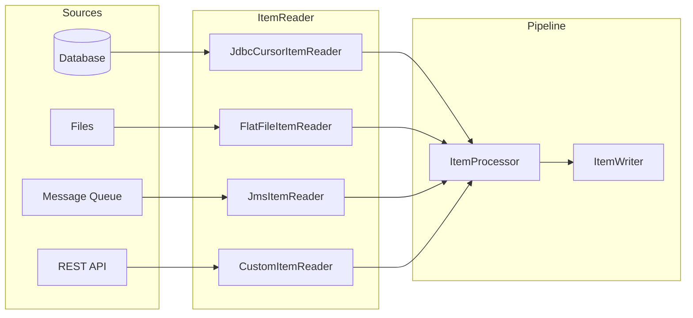
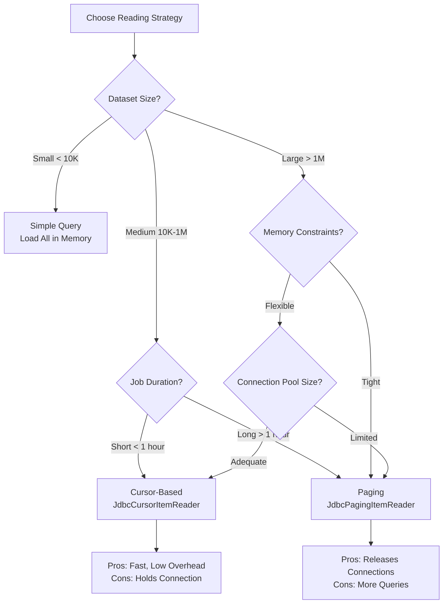
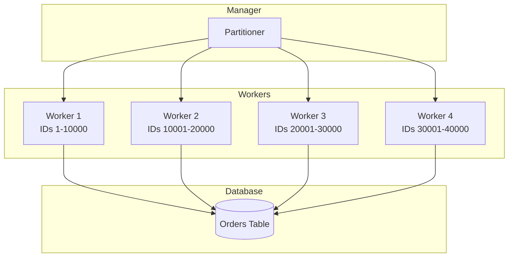

# How to Build Item Readers

Author: [nawazdhandala](https://github.com/nawazdhandala)

Tags: Batch Processing, Item Reader, Spring Batch, Data Ingestion

Description: Learn to build item readers for reading data from various sources in batch processing pipelines.

---

Batch processing pipelines need reliable ways to read data from databases, files, message queues, and APIs. **Item Readers** are the input layer of these pipelines, responsible for fetching records one at a time or in chunks. This guide covers built-in readers, custom implementations, and strategies for handling large datasets efficiently.

## 1. Understanding the Item Reader Pattern

An Item Reader follows a simple contract: return the next item when called, or `null` when exhausted. This pattern enables streaming large datasets without loading everything into memory.



The `ItemReader` interface is minimal but powerful:

```java
/**
 * Core interface for reading items in batch processing.
 * Implementations must be thread-safe if used in multi-threaded steps.
 *
 * @param <T> The type of object returned by the reader
 */
public interface ItemReader<T> {

    /**
     * Reads the next item from the input source.
     *
     * @return The next item, or null if the input is exhausted
     * @throws Exception if there is an error reading
     */
    T read() throws Exception;
}
```

## 2. Built-in JDBC Readers

Spring Batch provides two JDBC-based readers: cursor-based for streaming and paging-based for chunked processing.

### 2.1 Cursor-Based Reader

Use cursor-based reading when you need to stream through large result sets without loading them into memory. The database maintains a server-side cursor, and records are fetched one at a time.

```java
/**
 * Configuration for cursor-based JDBC reading.
 * Best for: Large datasets where memory is constrained.
 * Caution: Holds database connection open for entire read operation.
 */
@Bean
public JdbcCursorItemReader<Customer> customerCursorReader(DataSource dataSource) {
    return new JdbcCursorItemReaderBuilder<Customer>()
        .name("customerCursorReader")          // Unique name for restart tracking
        .dataSource(dataSource)                // Database connection pool
        .sql("SELECT id, name, email, created_at " +
             "FROM customers " +
             "WHERE status = 'ACTIVE' " +
             "ORDER BY id")                    // ORDER BY ensures consistent reads
        .rowMapper(new CustomerRowMapper())    // Maps ResultSet rows to objects
        .fetchSize(1000)                       // Number of rows fetched per network round-trip
        .saveState(true)                       // Enable restart from last position
        .build();
}

/**
 * Maps database rows to Customer domain objects.
 * Keep mappers stateless for thread safety.
 */
public class CustomerRowMapper implements RowMapper<Customer> {

    @Override
    public Customer mapRow(ResultSet rs, int rowNum) throws SQLException {
        Customer customer = new Customer();
        customer.setId(rs.getLong("id"));
        customer.setName(rs.getString("name"));
        customer.setEmail(rs.getString("email"));
        customer.setCreatedAt(rs.getTimestamp("created_at").toLocalDateTime());
        return customer;
    }
}
```

### 2.2 Paging Reader

Paging readers execute separate queries for each page, making them more resilient to long-running jobs. Use pagination when jobs may run for hours or when you cannot hold connections open.

```java
/**
 * Configuration for page-based JDBC reading.
 * Best for: Long-running jobs, distributed environments.
 * Advantage: Releases connections between pages.
 */
@Bean
public JdbcPagingItemReader<Order> orderPagingReader(
        DataSource dataSource,
        PagingQueryProvider queryProvider) {

    // Define parameters for the WHERE clause
    Map<String, Object> params = new HashMap<>();
    params.put("status", "PENDING");
    params.put("minAmount", 100.00);

    return new JdbcPagingItemReaderBuilder<Order>()
        .name("orderPagingReader")
        .dataSource(dataSource)
        .queryProvider(queryProvider)          // Handles database-specific pagination
        .parameterValues(params)               // Bind variables for the query
        .pageSize(500)                         // Records per page/query
        .rowMapper(new BeanPropertyRowMapper<>(Order.class))  // Auto-map by column name
        .saveState(true)
        .build();
}

/**
 * Query provider handles pagination syntax differences between databases.
 * This example uses PostgreSQL-specific syntax.
 */
@Bean
public PagingQueryProvider orderQueryProvider(DataSource dataSource) throws Exception {
    SqlPagingQueryProviderFactoryBean factory = new SqlPagingQueryProviderFactoryBean();
    factory.setDataSource(dataSource);
    factory.setSelectClause("SELECT id, customer_id, amount, order_date");
    factory.setFromClause("FROM orders");
    factory.setWhereClause("WHERE status = :status AND amount >= :minAmount");

    // Sort keys determine pagination boundaries
    // Must be unique to ensure no records are skipped or duplicated
    Map<String, Order> sortKeys = new HashMap<>();
    sortKeys.put("id", Order.ASCENDING);
    factory.setSortKeys(sortKeys);

    return factory.getObject();
}
```

## 3. File-Based Readers

### 3.1 Flat File Reader for CSV/TSV

Reading delimited files is common in data integration. The FlatFileItemReader handles CSV, TSV, and fixed-width formats.

```java
/**
 * Reads customer data from a CSV file.
 * Handles headers, delimiters, and field mapping automatically.
 */
@Bean
public FlatFileItemReader<CustomerRecord> csvReader() {
    return new FlatFileItemReaderBuilder<CustomerRecord>()
        .name("customerCsvReader")
        .resource(new FileSystemResource("/data/imports/customers.csv"))
        .linesToSkip(1)                        // Skip header row
        .lineMapper(customerLineMapper())       // Converts lines to objects
        .strict(true)                          // Fail if file not found
        .saveState(true)                       // Track line number for restart
        .build();
}

/**
 * Line mapper combines tokenizing (splitting) and field mapping.
 */
@Bean
public DefaultLineMapper<CustomerRecord> customerLineMapper() {
    DefaultLineMapper<CustomerRecord> mapper = new DefaultLineMapper<>();

    // Tokenizer splits each line into fields
    DelimitedLineTokenizer tokenizer = new DelimitedLineTokenizer();
    tokenizer.setDelimiter(",");               // CSV comma delimiter
    tokenizer.setNames("id", "name", "email", "phone", "tier");  // Column names
    tokenizer.setStrict(false);                // Allow missing trailing columns

    // Field set mapper converts tokens to domain object
    BeanWrapperFieldSetMapper<CustomerRecord> fieldMapper = new BeanWrapperFieldSetMapper<>();
    fieldMapper.setTargetType(CustomerRecord.class);

    mapper.setLineTokenizer(tokenizer);
    mapper.setFieldSetMapper(fieldMapper);

    return mapper;
}
```

### 3.2 JSON File Reader

For JSON array files, use `JsonItemReader` which streams items without loading the entire file.

```java
/**
 * Reads JSON array items from a file.
 * Example file format: [{"id": 1, "name": "Alice"}, {"id": 2, "name": "Bob"}]
 */
@Bean
public JsonItemReader<Product> jsonReader() {
    return new JsonItemReaderBuilder<Product>()
        .name("productJsonReader")
        .resource(new FileSystemResource("/data/imports/products.json"))
        .jsonObjectReader(new JacksonJsonObjectReader<>(Product.class))
        .saveState(true)
        .build();
}
```

## 4. Message Queue Reader

JMS readers integrate with message brokers like ActiveMQ or RabbitMQ. Each read operation receives and acknowledges a message.

```java
/**
 * Reads messages from a JMS queue.
 * Messages are consumed (removed from queue) after successful processing.
 */
@Bean
public JmsItemReader<PaymentEvent> jmsReader(JmsTemplate jmsTemplate) {
    JmsItemReader<PaymentEvent> reader = new JmsItemReader<>();
    reader.setJmsTemplate(jmsTemplate);
    reader.setItemType(PaymentEvent.class);    // Expected message payload type
    return reader;
}

/**
 * JMS template configuration with connection factory.
 * Set receive timeout to control how long to wait for messages.
 */
@Bean
public JmsTemplate jmsTemplate(ConnectionFactory connectionFactory) {
    JmsTemplate template = new JmsTemplate(connectionFactory);
    template.setDefaultDestinationName("payment-events-queue");
    template.setReceiveTimeout(5000);          // 5 second timeout per read
    template.setMessageConverter(new MappingJackson2MessageConverter());
    return template;
}
```

## 5. Building Custom Item Readers

When built-in readers do not fit your needs, implement a custom reader. Common scenarios include REST API consumption, proprietary file formats, or complex data assembly.

### 5.1 REST API Reader with Pagination

```java
/**
 * Custom reader that fetches data from a paginated REST API.
 * Handles pagination automatically and returns null when all pages are consumed.
 */
@Component
@StepScope  // New instance per step execution for thread safety
public class RestApiItemReader implements ItemReader<UserProfile>, ItemStream {

    private final RestTemplate restTemplate;
    private final String apiBaseUrl;

    // Pagination state
    private int currentPage = 0;
    private int pageSize = 100;
    private List<UserProfile> currentBatch;
    private int currentIndex = 0;
    private boolean exhausted = false;

    public RestApiItemReader(RestTemplate restTemplate,
                             @Value("${api.users.baseUrl}") String apiBaseUrl) {
        this.restTemplate = restTemplate;
        this.apiBaseUrl = apiBaseUrl;
    }

    /**
     * Returns the next item, fetching a new page when the current batch is consumed.
     * Returns null when all pages have been processed.
     */
    @Override
    public UserProfile read() throws Exception {
        // Check if we need to fetch the next page
        if (currentBatch == null || currentIndex >= currentBatch.size()) {
            if (exhausted) {
                return null;  // Signal end of data
            }
            fetchNextPage();

            // Check if the fetched page was empty
            if (currentBatch == null || currentBatch.isEmpty()) {
                exhausted = true;
                return null;
            }
            currentIndex = 0;
        }

        return currentBatch.get(currentIndex++);
    }

    /**
     * Fetches the next page of data from the REST API.
     * Updates pagination state based on response.
     */
    private void fetchNextPage() {
        String url = String.format("%s/users?page=%d&size=%d",
                                   apiBaseUrl, currentPage, pageSize);

        ResponseEntity<ApiResponse<UserProfile>> response = restTemplate.exchange(
            url,
            HttpMethod.GET,
            null,
            new ParameterizedTypeReference<ApiResponse<UserProfile>>() {}
        );

        ApiResponse<UserProfile> body = response.getBody();
        if (body != null && body.getData() != null) {
            currentBatch = body.getData();
            currentPage++;

            // Check if this is the last page
            if (body.getTotalPages() <= currentPage) {
                exhausted = true;
            }
        } else {
            currentBatch = Collections.emptyList();
            exhausted = true;
        }
    }

    /**
     * ItemStream methods enable restart capability.
     * State is saved to ExecutionContext after each chunk.
     */
    @Override
    public void open(ExecutionContext executionContext) {
        if (executionContext.containsKey("currentPage")) {
            currentPage = executionContext.getInt("currentPage");
            currentIndex = executionContext.getInt("currentIndex");
        }
    }

    @Override
    public void update(ExecutionContext executionContext) {
        executionContext.putInt("currentPage", currentPage);
        executionContext.putInt("currentIndex", currentIndex);
    }

    @Override
    public void close() {
        // Cleanup resources if needed
    }
}
```

### 5.2 Composite Reader for Multiple Sources

When you need to read from multiple sources in sequence, use a composite reader.

```java
/**
 * Reads from multiple sources in sequence.
 * Useful for combining data from different systems in a single job.
 */
@Bean
public CompositeItemReader<Transaction> compositeReader(
        ItemReader<Transaction> primaryDbReader,
        ItemReader<Transaction> secondaryDbReader,
        ItemReader<Transaction> archiveFileReader) {

    List<ItemReader<? extends Transaction>> readers = Arrays.asList(
        primaryDbReader,
        secondaryDbReader,
        archiveFileReader
    );

    CompositeItemReader<Transaction> composite = new CompositeItemReader<>();
    composite.setDelegates(readers);
    return composite;
}
```

## 6. Cursor vs Pagination Comparison

Choose the right strategy based on your requirements:



| Aspect | Cursor-Based | Pagination-Based |
|--------|--------------|------------------|
| Connection Usage | Holds connection for entire read | Releases between pages |
| Memory | Streams, low memory | Page buffer in memory |
| Performance | Single query, faster | Multiple queries, slower |
| Restartability | Requires database support | Natural checkpoint at page boundary |
| Best For | Short jobs, streaming | Long jobs, distributed |

## 7. Handling Large Datasets

### 7.1 Chunk-Oriented Processing

Break large datasets into manageable chunks to control memory and enable transaction boundaries.

```java
/**
 * Step configuration with chunk-oriented processing.
 * Each chunk is a transaction boundary for commit/rollback.
 */
@Bean
public Step processOrdersStep(
        JobRepository jobRepository,
        PlatformTransactionManager transactionManager,
        ItemReader<Order> orderReader,
        ItemProcessor<Order, OrderResult> orderProcessor,
        ItemWriter<OrderResult> orderWriter) {

    return new StepBuilder("processOrders", jobRepository)
        .<Order, OrderResult>chunk(100, transactionManager)  // 100 items per transaction
        .reader(orderReader)
        .processor(orderProcessor)
        .writer(orderWriter)
        .faultTolerant()
        .skipLimit(10)                         // Allow up to 10 skipped records
        .skip(InvalidOrderException.class)     // Skip on this exception
        .retryLimit(3)                         // Retry up to 3 times
        .retry(TransientDataAccessException.class)  // Retry on transient errors
        .build();
}
```

### 7.2 Partitioned Reading for Parallelism

Partition data across multiple threads or nodes for faster processing.



```java
/**
 * Partitioner divides work by ID ranges.
 * Each partition gets a unique range to process.
 */
@Component
public class OrderIdRangePartitioner implements Partitioner {

    private final JdbcTemplate jdbcTemplate;

    public OrderIdRangePartitioner(JdbcTemplate jdbcTemplate) {
        this.jdbcTemplate = jdbcTemplate;
    }

    @Override
    public Map<String, ExecutionContext> partition(int gridSize) {
        // Get the ID range from the database
        Long minId = jdbcTemplate.queryForObject(
            "SELECT MIN(id) FROM orders WHERE status = 'PENDING'", Long.class);
        Long maxId = jdbcTemplate.queryForObject(
            "SELECT MAX(id) FROM orders WHERE status = 'PENDING'", Long.class);

        // Handle empty table case
        if (minId == null || maxId == null) {
            return Collections.emptyMap();
        }

        // Calculate range size for each partition
        long rangeSize = (maxId - minId) / gridSize + 1;

        Map<String, ExecutionContext> partitions = new HashMap<>();
        long start = minId;

        for (int i = 0; i < gridSize; i++) {
            ExecutionContext context = new ExecutionContext();
            context.putLong("minId", start);
            context.putLong("maxId", Math.min(start + rangeSize - 1, maxId));

            partitions.put("partition" + i, context);
            start += rangeSize;
        }

        return partitions;
    }
}

/**
 * Reader scoped to a partition's ID range.
 * Uses StepScope to get partition-specific parameters.
 */
@Bean
@StepScope
public JdbcPagingItemReader<Order> partitionedOrderReader(
        DataSource dataSource,
        @Value("#{stepExecutionContext['minId']}") Long minId,
        @Value("#{stepExecutionContext['maxId']}") Long maxId) {

    Map<String, Object> params = new HashMap<>();
    params.put("minId", minId);
    params.put("maxId", maxId);

    return new JdbcPagingItemReaderBuilder<Order>()
        .name("partitionedOrderReader")
        .dataSource(dataSource)
        .selectClause("SELECT id, customer_id, amount, status")
        .fromClause("FROM orders")
        .whereClause("WHERE id BETWEEN :minId AND :maxId AND status = 'PENDING'")
        .sortKeys(Collections.singletonMap("id", Order.ASCENDING))
        .parameterValues(params)
        .pageSize(500)
        .rowMapper(new BeanPropertyRowMapper<>(Order.class))
        .build();
}
```

## 8. Error Handling and Resilience

### 8.1 Retry and Skip Configuration

```java
/**
 * Reader with built-in retry logic for transient failures.
 * Wraps an existing reader with retry behavior.
 */
@Bean
public ItemReader<Customer> resilientReader(ItemReader<Customer> baseReader) {
    return new RetryingItemReader<>(baseReader,
        RetryPolicy.builder()
            .maxRetries(3)
            .backoffMillis(1000)
            .retryOn(TransientDataAccessException.class)
            .retryOn(IOException.class)
            .build());
}

/**
 * Custom retrying reader wrapper.
 * Implements exponential backoff between retries.
 */
public class RetryingItemReader<T> implements ItemReader<T> {

    private final ItemReader<T> delegate;
    private final RetryPolicy retryPolicy;

    public RetryingItemReader(ItemReader<T> delegate, RetryPolicy retryPolicy) {
        this.delegate = delegate;
        this.retryPolicy = retryPolicy;
    }

    @Override
    public T read() throws Exception {
        int attempts = 0;
        Exception lastException = null;

        while (attempts <= retryPolicy.getMaxRetries()) {
            try {
                return delegate.read();
            } catch (Exception e) {
                if (!retryPolicy.shouldRetry(e)) {
                    throw e;  // Non-retryable exception
                }

                lastException = e;
                attempts++;

                if (attempts <= retryPolicy.getMaxRetries()) {
                    // Exponential backoff: 1s, 2s, 4s, etc.
                    long sleepTime = retryPolicy.getBackoffMillis() * (1L << (attempts - 1));
                    Thread.sleep(sleepTime);
                }
            }
        }

        throw new RetryExhaustedException("Max retries exceeded", lastException);
    }
}
```

### 8.2 Validation During Read

```java
/**
 * Validating reader that checks items before returning them.
 * Invalid items can be skipped or trigger exceptions.
 */
public class ValidatingItemReader<T> implements ItemReader<T> {

    private final ItemReader<T> delegate;
    private final Validator<T> validator;
    private final boolean skipInvalid;

    @Override
    public T read() throws Exception {
        T item;

        while ((item = delegate.read()) != null) {
            ValidationResult result = validator.validate(item);

            if (result.isValid()) {
                return item;
            }

            if (skipInvalid) {
                // Log and continue to next item
                log.warn("Skipping invalid item: {}, errors: {}",
                         item, result.getErrors());
                continue;
            }

            throw new ValidationException("Invalid item: " + result.getErrors());
        }

        return null;  // End of data
    }
}
```

## 9. Testing Item Readers

### 9.1 Unit Testing with Mocks

```java
/**
 * Unit test for custom REST API reader.
 * Uses MockRestServiceServer to simulate API responses.
 */
@ExtendWith(MockitoExtension.class)
class RestApiItemReaderTest {

    @Mock
    private RestTemplate restTemplate;

    private RestApiItemReader reader;

    @BeforeEach
    void setUp() {
        reader = new RestApiItemReader(restTemplate, "http://api.example.com");
    }

    @Test
    void shouldReadAllItemsAcrossPages() throws Exception {
        // Arrange: Mock two pages of data
        ApiResponse<UserProfile> page1 = new ApiResponse<>();
        page1.setData(Arrays.asList(
            new UserProfile(1L, "Alice"),
            new UserProfile(2L, "Bob")
        ));
        page1.setTotalPages(2);

        ApiResponse<UserProfile> page2 = new ApiResponse<>();
        page2.setData(Collections.singletonList(
            new UserProfile(3L, "Charlie")
        ));
        page2.setTotalPages(2);

        when(restTemplate.exchange(contains("page=0"), any(), any(), any()))
            .thenReturn(ResponseEntity.ok(page1));
        when(restTemplate.exchange(contains("page=1"), any(), any(), any()))
            .thenReturn(ResponseEntity.ok(page2));

        // Act: Read all items
        List<UserProfile> results = new ArrayList<>();
        UserProfile item;
        while ((item = reader.read()) != null) {
            results.add(item);
        }

        // Assert
        assertThat(results).hasSize(3);
        assertThat(results.get(0).getName()).isEqualTo("Alice");
        assertThat(results.get(2).getName()).isEqualTo("Charlie");
    }

    @Test
    void shouldReturnNullWhenApiReturnsEmptyPage() throws Exception {
        // Arrange
        ApiResponse<UserProfile> emptyResponse = new ApiResponse<>();
        emptyResponse.setData(Collections.emptyList());
        emptyResponse.setTotalPages(0);

        when(restTemplate.exchange(anyString(), any(), any(), any()))
            .thenReturn(ResponseEntity.ok(emptyResponse));

        // Act and Assert
        assertThat(reader.read()).isNull();
    }
}
```

### 9.2 Integration Testing with Embedded Database

```java
/**
 * Integration test using embedded H2 database.
 * Verifies reader behavior with real SQL execution.
 */
@SpringBatchTest
@SpringBootTest
@Sql("/test-data/customers.sql")  // Load test data
class JdbcPagingItemReaderIntegrationTest {

    @Autowired
    private JobLauncherTestUtils jobLauncherTestUtils;

    @Autowired
    private JdbcPagingItemReader<Customer> customerReader;

    @Test
    void shouldReadAllCustomersInPages() throws Exception {
        // Open the reader
        customerReader.open(new ExecutionContext());

        try {
            List<Customer> customers = new ArrayList<>();
            Customer customer;

            while ((customer = customerReader.read()) != null) {
                customers.add(customer);
            }

            // Verify all test records were read
            assertThat(customers).hasSize(250);  // Matches test SQL

            // Verify ordering
            assertThat(customers)
                .extracting(Customer::getId)
                .isSorted();

        } finally {
            customerReader.close();
        }
    }
}
```

## 10. Best Practices Summary

1. **Choose the right reader type**: Use cursor for short jobs with streaming needs, pagination for long-running or distributed jobs.

2. **Always use ORDER BY**: Ensure consistent ordering to prevent duplicates or missed records on restart.

3. **Set appropriate fetch/page sizes**: Balance memory usage against network round-trips. Start with 100-500 and tune based on row size.

4. **Enable state saving**: Use `saveState(true)` and implement `ItemStream` for restartable jobs.

5. **Handle null gracefully**: The `read()` method returning null signals end of data, not an error.

6. **Test with realistic data volumes**: Performance characteristics change significantly at scale.

7. **Monitor connection usage**: Cursor readers hold connections open. Size your pool accordingly.

8. **Use StepScope for parameterized readers**: Enables late binding of partition parameters and job parameters.

---

Item readers form the foundation of batch processing pipelines. By selecting the appropriate reader type and configuring it correctly, you can efficiently process datasets ranging from thousands to billions of records while maintaining reliability and restartability.
