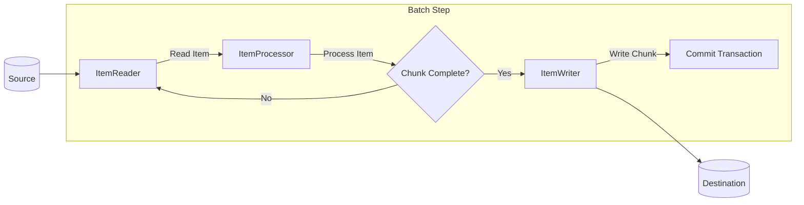
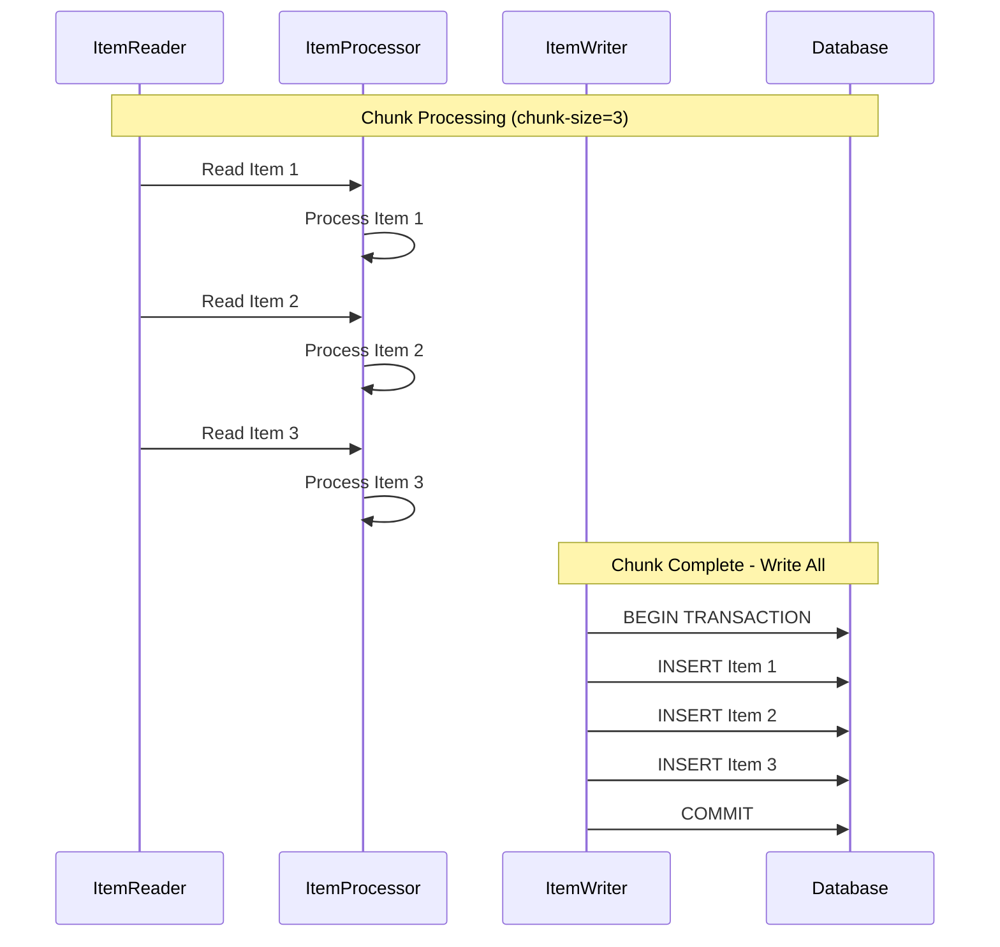
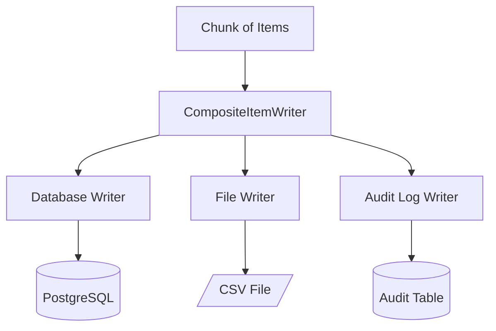
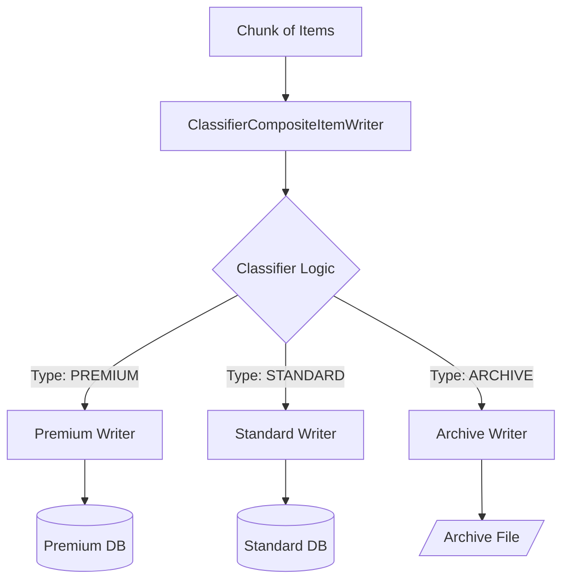
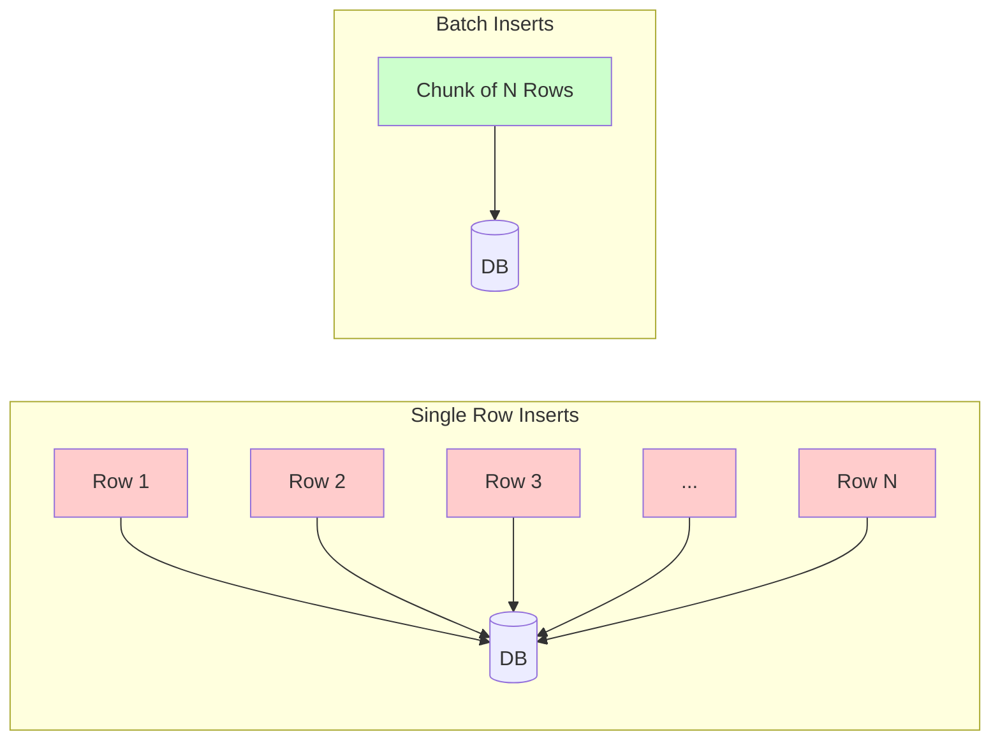

# How to Create Item Writers

Author: [nawazdhandala](https://github.com/nawazdhandala)

Tags: Batch Processing, Item Writer, Spring Batch, Data Output

Description: Learn to create item writers for writing processed data to various destinations in batch pipelines.

---

> Batch processing pipelines follow a simple pattern: **read**, **process**, **write**. The item writer is the final stage where processed data lands in its destination, whether that is a database, file, message queue, or external API.

This guide covers everything you need to know about item writers in Spring Batch: built-in writers for common destinations, custom writers for specialized needs, composite writers for multi-destination output, and performance optimization with batch inserts.

---

## Table of Contents

1. What is an Item Writer?
2. The Batch Processing Pipeline
3. Built-in Item Writers
4. JDBC Item Writer
5. File Item Writers (Flat File and JSON)
6. JMS Item Writer
7. Creating Custom Item Writers
8. Composite Item Writers
9. Classified Item Writers
10. Batch Inserts and Performance Optimization
11. Error Handling and Skip Logic
12. Testing Item Writers
13. Best Practices
14. Common Anti-Patterns

---

## 1. What is an Item Writer?

An item writer is the output component in a batch processing pipeline. It receives a list (chunk) of processed items and writes them to a destination.

| Concept | Description |
|---------|-------------|
| Item Writer | Writes a chunk of items to a destination (database, file, queue, API) |
| Chunk | A batch of items processed together for efficiency |
| Chunk Size | Number of items written in a single transaction |
| Write Operation | Typically happens within a transaction boundary |

The `ItemWriter` interface is simple:

```java
// ItemWriter interface - receives a chunk of items to write
public interface ItemWriter<T> {

    // Write a chunk of items to the destination
    // The chunk parameter contains all items from one processing cycle
    void write(Chunk<? extends T> chunk) throws Exception;
}
```

---

## 2. The Batch Processing Pipeline

Understanding where the item writer fits in the overall pipeline helps clarify its role.



The flow works as follows:

1. **ItemReader** reads items one at a time from the source
2. **ItemProcessor** transforms each item (optional step)
3. Items accumulate until the chunk size is reached
4. **ItemWriter** writes the entire chunk at once
5. Transaction commits after successful write



---

## 3. Built-in Item Writers

Spring Batch provides item writers for common destinations:

| Writer | Destination | Use Case |
|--------|-------------|----------|
| JdbcBatchItemWriter | Relational Database | Writing to SQL databases with batch inserts |
| FlatFileItemWriter | CSV/Text Files | Generating delimited or fixed-width files |
| JsonFileItemWriter | JSON Files | Writing JSON arrays to files |
| JpaItemWriter | JPA Entity Manager | Writing JPA entities |
| JmsItemWriter | Message Queue | Sending messages to JMS destinations |
| KafkaItemWriter | Kafka Topics | Publishing to Kafka |
| MongoItemWriter | MongoDB | Writing to MongoDB collections |

---

## 4. JDBC Item Writer

The `JdbcBatchItemWriter` is the most commonly used writer for database output. It uses JDBC batch operations for optimal performance.

### Basic Configuration

```java
// JdbcBatchItemWriter configuration for Customer entity
@Bean
public JdbcBatchItemWriter<Customer> customerWriter(DataSource dataSource) {
    return new JdbcBatchItemWriterBuilder<Customer>()
        // SQL INSERT statement with named parameters
        .sql("INSERT INTO customers (id, name, email, created_at) " +
             "VALUES (:id, :name, :email, :createdAt)")
        // Map Customer properties to SQL parameters using bean properties
        .itemSqlParameterSourceProvider(new BeanPropertyItemSqlParameterSourceProvider<>())
        // Database connection source
        .dataSource(dataSource)
        .build();
}
```

### Using Prepared Statement Setter

For more control over parameter binding:

```java
// JdbcBatchItemWriter with PreparedStatementSetter for fine-grained control
@Bean
public JdbcBatchItemWriter<Order> orderWriter(DataSource dataSource) {
    return new JdbcBatchItemWriterBuilder<Order>()
        // SQL with positional parameters (?)
        .sql("INSERT INTO orders (order_id, customer_id, total, status, order_date) " +
             "VALUES (?, ?, ?, ?, ?)")
        // Custom PreparedStatementSetter for explicit parameter binding
        .itemPreparedStatementSetter((order, ps) -> {
            ps.setString(1, order.getOrderId());
            ps.setLong(2, order.getCustomerId());
            ps.setBigDecimal(3, order.getTotal());
            ps.setString(4, order.getStatus().name());
            ps.setTimestamp(5, Timestamp.valueOf(order.getOrderDate()));
        })
        .dataSource(dataSource)
        .build();
}
```

### Upsert Operations

Handle insert-or-update scenarios:

```java
// JdbcBatchItemWriter configured for upsert (insert or update on conflict)
@Bean
public JdbcBatchItemWriter<Product> productUpsertWriter(DataSource dataSource) {
    return new JdbcBatchItemWriterBuilder<Product>()
        // PostgreSQL upsert syntax - insert or update on primary key conflict
        .sql("INSERT INTO products (sku, name, price, quantity, updated_at) " +
             "VALUES (:sku, :name, :price, :quantity, :updatedAt) " +
             "ON CONFLICT (sku) DO UPDATE SET " +
             "name = EXCLUDED.name, " +
             "price = EXCLUDED.price, " +
             "quantity = EXCLUDED.quantity, " +
             "updated_at = EXCLUDED.updated_at")
        .itemSqlParameterSourceProvider(new BeanPropertyItemSqlParameterSourceProvider<>())
        .dataSource(dataSource)
        .build();
}
```

---

## 5. File Item Writers

### Flat File Writer (CSV)

```java
// FlatFileItemWriter for generating CSV output
@Bean
public FlatFileItemWriter<Employee> employeeCsvWriter() {
    return new FlatFileItemWriterBuilder<Employee>()
        // Unique writer name for restart capability
        .name("employeeCsvWriter")
        // Output file location
        .resource(new FileSystemResource("output/employees.csv"))
        // Configure CSV format with header and field extraction
        .delimited()
        .delimiter(",")
        // Column headers in the output file
        .names("employeeId", "firstName", "lastName", "department", "salary")
        // Write header line at the start of the file
        .headerCallback(writer -> writer.write("Employee ID,First Name,Last Name,Department,Salary"))
        // Write summary footer at the end of the file
        .footerCallback(writer -> writer.write("# Generated: " + LocalDateTime.now()))
        .build();
}
```

### Custom Line Aggregator

For complex formatting requirements:

```java
// FlatFileItemWriter with custom formatting logic
@Bean
public FlatFileItemWriter<Transaction> transactionWriter() {
    return new FlatFileItemWriterBuilder<Transaction>()
        .name("transactionWriter")
        .resource(new FileSystemResource("output/transactions.txt"))
        // Custom LineAggregator for complete control over output format
        .lineAggregator(transaction -> {
            // Format: TRANSACTION|{id}|{amount}|{timestamp}|{status}
            return String.format("TRANSACTION|%s|%.2f|%s|%s",
                transaction.getId(),
                transaction.getAmount(),
                transaction.getTimestamp().format(DateTimeFormatter.ISO_LOCAL_DATE_TIME),
                transaction.getStatus());
        })
        .build();
}
```

### JSON File Writer

```java
// JsonFileItemWriter for generating JSON array output
@Bean
public JsonFileItemWriter<AuditEvent> auditJsonWriter() {
    return new JsonFileItemWriterBuilder<AuditEvent>()
        .name("auditJsonWriter")
        .resource(new FileSystemResource("output/audit-events.json"))
        // Use Jackson for JSON serialization with custom ObjectMapper
        .jsonObjectMarshaller(new JacksonJsonObjectMarshaller<>(objectMapper()))
        .build();
}

// Configure ObjectMapper with appropriate settings for batch output
@Bean
public ObjectMapper objectMapper() {
    ObjectMapper mapper = new ObjectMapper();
    // Register Java 8 date/time module for LocalDateTime support
    mapper.registerModule(new JavaTimeModule());
    // Format dates as ISO strings instead of timestamps
    mapper.disable(SerializationFeature.WRITE_DATES_AS_TIMESTAMPS);
    // Pretty print for human-readable output
    mapper.enable(SerializationFeature.INDENT_OUTPUT);
    return mapper;
}
```

---

## 6. JMS Item Writer

Write processed items to a message queue for downstream consumers:

```java
// JmsItemWriter for sending items to a message queue
@Bean
public JmsItemWriter<Notification> notificationQueueWriter(JmsTemplate jmsTemplate) {
    JmsItemWriter<Notification> writer = new JmsItemWriter<>();
    // JmsTemplate handles connection and message conversion
    writer.setJmsTemplate(jmsTemplate);
    return writer;
}

// JmsTemplate configuration with JSON message conversion
@Bean
public JmsTemplate jmsTemplate(ConnectionFactory connectionFactory) {
    JmsTemplate template = new JmsTemplate(connectionFactory);
    // Target queue for notification messages
    template.setDefaultDestinationName("notifications-queue");
    // Convert objects to JSON messages automatically
    template.setMessageConverter(new MappingJackson2MessageConverter());
    return template;
}
```

### Custom JMS Message Creation

For more control over message properties:

```java
// Custom ItemWriter for JMS with message property control
@Component
public class EnhancedJmsItemWriter implements ItemWriter<OrderEvent> {

    private final JmsTemplate jmsTemplate;

    public EnhancedJmsItemWriter(JmsTemplate jmsTemplate) {
        this.jmsTemplate = jmsTemplate;
    }

    @Override
    public void write(Chunk<? extends OrderEvent> chunk) throws Exception {
        for (OrderEvent event : chunk) {
            jmsTemplate.send("order-events", session -> {
                // Create JSON message from event object
                ObjectMessage message = session.createObjectMessage();
                message.setObject(event);

                // Set JMS properties for routing and filtering
                message.setStringProperty("eventType", event.getType().name());
                message.setStringProperty("region", event.getRegion());
                message.setIntProperty("priority", event.getPriority());

                // Set message expiration for time-sensitive events
                if (event.isTimeSensitive()) {
                    message.setJMSExpiration(System.currentTimeMillis() + 300000); // 5 minutes
                }

                return message;
            });
        }
    }
}
```

---

## 7. Creating Custom Item Writers

When built-in writers do not meet your needs, create a custom implementation.

### REST API Writer

```java
// Custom ItemWriter for sending data to a REST API
@Component
public class RestApiItemWriter implements ItemWriter<CustomerRecord> {

    private static final Logger log = LoggerFactory.getLogger(RestApiItemWriter.class);

    private final RestTemplate restTemplate;
    private final String apiEndpoint;
    private final int maxRetries;

    public RestApiItemWriter(
            RestTemplate restTemplate,
            @Value("${api.customers.endpoint}") String apiEndpoint,
            @Value("${api.max-retries:3}") int maxRetries) {
        this.restTemplate = restTemplate;
        this.apiEndpoint = apiEndpoint;
        this.maxRetries = maxRetries;
    }

    @Override
    public void write(Chunk<? extends CustomerRecord> chunk) throws Exception {
        log.info("Writing {} customer records to API", chunk.size());

        // Batch the records for efficient API calls
        List<CustomerRecord> records = new ArrayList<>(chunk.getItems());

        // Send as batch request with retry logic
        int attempt = 0;
        while (attempt < maxRetries) {
            try {
                ResponseEntity<BatchResponse> response = restTemplate.postForEntity(
                    apiEndpoint + "/batch",
                    new BatchRequest(records),
                    BatchResponse.class
                );

                if (response.getStatusCode().is2xxSuccessful()) {
                    log.info("Successfully wrote {} records", records.size());
                    return;
                }

                log.warn("API returned non-success status: {}", response.getStatusCode());

            } catch (RestClientException e) {
                attempt++;
                log.warn("API call failed (attempt {}/{}): {}", attempt, maxRetries, e.getMessage());

                if (attempt >= maxRetries) {
                    throw new ItemWriterException("Failed to write to API after " + maxRetries + " attempts", e);
                }

                // Exponential backoff before retry
                Thread.sleep((long) Math.pow(2, attempt) * 1000);
            }
        }
    }
}
```

### Email Notification Writer

```java
// Custom ItemWriter for sending email notifications
@Component
public class EmailNotificationWriter implements ItemWriter<AlertNotification> {

    private final JavaMailSender mailSender;
    private final TemplateEngine templateEngine;

    public EmailNotificationWriter(JavaMailSender mailSender, TemplateEngine templateEngine) {
        this.mailSender = mailSender;
        this.templateEngine = templateEngine;
    }

    @Override
    public void write(Chunk<? extends AlertNotification> chunk) throws Exception {
        for (AlertNotification notification : chunk) {
            MimeMessage message = mailSender.createMimeMessage();
            MimeMessageHelper helper = new MimeMessageHelper(message, true, "UTF-8");

            // Set email headers
            helper.setTo(notification.getRecipientEmail());
            helper.setSubject(notification.getSubject());
            helper.setFrom("alerts@example.com");

            // Render HTML template with notification data
            Context context = new Context();
            context.setVariable("notification", notification);
            context.setVariable("timestamp", LocalDateTime.now());
            String htmlContent = templateEngine.process("alert-email", context);

            helper.setText(htmlContent, true);

            // Attach any files if present
            if (notification.hasAttachments()) {
                for (Attachment attachment : notification.getAttachments()) {
                    helper.addAttachment(attachment.getFilename(), attachment.getResource());
                }
            }

            mailSender.send(message);
        }
    }
}
```

### Elasticsearch Writer

```java
// Custom ItemWriter for indexing documents in Elasticsearch
@Component
public class ElasticsearchItemWriter implements ItemWriter<SearchableDocument> {

    private static final Logger log = LoggerFactory.getLogger(ElasticsearchItemWriter.class);

    private final RestHighLevelClient elasticsearchClient;
    private final String indexName;
    private final ObjectMapper objectMapper;

    public ElasticsearchItemWriter(
            RestHighLevelClient elasticsearchClient,
            @Value("${elasticsearch.index-name}") String indexName,
            ObjectMapper objectMapper) {
        this.elasticsearchClient = elasticsearchClient;
        this.indexName = indexName;
        this.objectMapper = objectMapper;
    }

    @Override
    public void write(Chunk<? extends SearchableDocument> chunk) throws Exception {
        // Use bulk API for efficient indexing
        BulkRequest bulkRequest = new BulkRequest();

        for (SearchableDocument document : chunk) {
            // Create index request for each document
            IndexRequest indexRequest = new IndexRequest(indexName)
                .id(document.getId())
                .source(objectMapper.writeValueAsString(document), XContentType.JSON);

            bulkRequest.add(indexRequest);
        }

        // Execute bulk request
        BulkResponse bulkResponse = elasticsearchClient.bulk(bulkRequest, RequestOptions.DEFAULT);

        // Check for failures
        if (bulkResponse.hasFailures()) {
            log.error("Bulk indexing had failures: {}", bulkResponse.buildFailureMessage());

            // Collect failed document IDs for potential retry
            List<String> failedIds = new ArrayList<>();
            for (BulkItemResponse item : bulkResponse) {
                if (item.isFailed()) {
                    failedIds.add(item.getId());
                }
            }

            throw new ItemWriterException("Failed to index documents: " + failedIds);
        }

        log.info("Successfully indexed {} documents in {}ms",
            chunk.size(), bulkResponse.getTook().getMillis());
    }
}
```

---

## 8. Composite Item Writers

Write to multiple destinations from a single step:



### Configuration

```java
// CompositeItemWriter to write to multiple destinations
@Bean
public CompositeItemWriter<ProcessedOrder> compositeOrderWriter(
        JdbcBatchItemWriter<ProcessedOrder> databaseWriter,
        FlatFileItemWriter<ProcessedOrder> csvWriter,
        JdbcBatchItemWriter<ProcessedOrder> auditWriter) {

    CompositeItemWriter<ProcessedOrder> compositeWriter = new CompositeItemWriter<>();

    // Configure the list of delegate writers
    // Writers are executed in order - if one fails, subsequent writers are not called
    compositeWriter.setDelegates(Arrays.asList(
        databaseWriter,  // Primary storage
        csvWriter,       // Archive file
        auditWriter      // Audit trail
    ));

    return compositeWriter;
}

// Database writer for primary storage
@Bean
public JdbcBatchItemWriter<ProcessedOrder> orderDatabaseWriter(DataSource dataSource) {
    return new JdbcBatchItemWriterBuilder<ProcessedOrder>()
        .sql("INSERT INTO orders (id, customer_id, total, processed_at) " +
             "VALUES (:id, :customerId, :total, :processedAt)")
        .itemSqlParameterSourceProvider(new BeanPropertyItemSqlParameterSourceProvider<>())
        .dataSource(dataSource)
        .build();
}

// File writer for CSV archive
@Bean
public FlatFileItemWriter<ProcessedOrder> orderCsvWriter() {
    return new FlatFileItemWriterBuilder<ProcessedOrder>()
        .name("orderCsvWriter")
        .resource(new FileSystemResource("archive/orders-" +
            LocalDate.now().format(DateTimeFormatter.ISO_DATE) + ".csv"))
        .delimited()
        .names("id", "customerId", "total", "processedAt")
        .build();
}

// Audit writer for compliance tracking
@Bean
public JdbcBatchItemWriter<ProcessedOrder> orderAuditWriter(DataSource dataSource) {
    return new JdbcBatchItemWriterBuilder<ProcessedOrder>()
        .sql("INSERT INTO order_audit (order_id, action, timestamp, details) " +
             "VALUES (:id, 'PROCESSED', CURRENT_TIMESTAMP, :auditDetails)")
        .itemSqlParameterSourceProvider(new BeanPropertyItemSqlParameterSourceProvider<>())
        .dataSource(dataSource)
        .build();
}
```

---

## 9. Classified Item Writers

Route items to different writers based on classification logic:



### Implementation

```java
// ClassifierCompositeItemWriter routes items to different writers based on type
@Bean
public ClassifierCompositeItemWriter<CustomerOrder> classifiedOrderWriter(
        JdbcBatchItemWriter<CustomerOrder> premiumOrderWriter,
        JdbcBatchItemWriter<CustomerOrder> standardOrderWriter,
        FlatFileItemWriter<CustomerOrder> archiveOrderWriter) {

    ClassifierCompositeItemWriter<CustomerOrder> writer = new ClassifierCompositeItemWriter<>();

    // Classifier determines which writer handles each item
    writer.setClassifier(new OrderClassifier(
        premiumOrderWriter,
        standardOrderWriter,
        archiveOrderWriter
    ));

    return writer;
}

// Classifier implementation to route orders based on type
public class OrderClassifier implements Classifier<CustomerOrder, ItemWriter<? super CustomerOrder>> {

    private final ItemWriter<CustomerOrder> premiumWriter;
    private final ItemWriter<CustomerOrder> standardWriter;
    private final ItemWriter<CustomerOrder> archiveWriter;

    public OrderClassifier(
            ItemWriter<CustomerOrder> premiumWriter,
            ItemWriter<CustomerOrder> standardWriter,
            ItemWriter<CustomerOrder> archiveWriter) {
        this.premiumWriter = premiumWriter;
        this.standardWriter = standardWriter;
        this.archiveWriter = archiveWriter;
    }

    @Override
    public ItemWriter<? super CustomerOrder> classify(CustomerOrder order) {
        // Route based on order characteristics
        if (order.getTotal().compareTo(new BigDecimal("1000")) > 0) {
            return premiumWriter;  // High-value orders
        } else if (order.getOrderDate().isBefore(LocalDate.now().minusYears(1))) {
            return archiveWriter;  // Old orders go to archive
        } else {
            return standardWriter; // Regular orders
        }
    }
}
```

---

## 10. Batch Inserts and Performance Optimization

Optimizing write performance is critical for large-scale batch jobs.

### JDBC Batch Size Configuration

```java
// Optimized JdbcBatchItemWriter with batch size configuration
@Bean
public JdbcBatchItemWriter<Transaction> optimizedTransactionWriter(DataSource dataSource) {
    JdbcBatchItemWriter<Transaction> writer = new JdbcBatchItemWriterBuilder<Transaction>()
        .sql("INSERT INTO transactions (id, account_id, amount, type, timestamp) " +
             "VALUES (:id, :accountId, :amount, :type, :timestamp)")
        .itemSqlParameterSourceProvider(new BeanPropertyItemSqlParameterSourceProvider<>())
        .dataSource(dataSource)
        .build();

    // Assert that all updates affect exactly one row
    // Helps catch data integrity issues early
    writer.setAssertUpdates(true);

    return writer;
}

// Step configuration with optimized chunk size
@Bean
public Step transactionProcessingStep(
        JobRepository jobRepository,
        PlatformTransactionManager transactionManager,
        ItemReader<Transaction> reader,
        ItemProcessor<Transaction, Transaction> processor,
        JdbcBatchItemWriter<Transaction> writer) {

    return new StepBuilder("transactionProcessingStep", jobRepository)
        .<Transaction, Transaction>chunk(500, transactionManager)  // Larger chunks for throughput
        .reader(reader)
        .processor(processor)
        .writer(writer)
        // Commit interval matches chunk size by default
        .build();
}
```

### Connection Pool Tuning

```yaml
# application.yml - DataSource configuration for batch workloads
spring:
  datasource:
    hikari:
      # Pool size should accommodate concurrent batch steps
      maximum-pool-size: 20
      minimum-idle: 5
      # Batch operations may take longer
      connection-timeout: 60000
      # Keep connections alive for reuse
      idle-timeout: 300000
      max-lifetime: 1200000
      # PostgreSQL-specific optimizations
      data-source-properties:
        reWriteBatchedInserts: true  # Critical for batch insert performance
        prepareThreshold: 5
```

### Multi-threaded Writing

```java
// Configure parallel step execution for improved throughput
@Bean
public Step parallelWriteStep(
        JobRepository jobRepository,
        PlatformTransactionManager transactionManager,
        ItemReader<DataRecord> reader,
        ItemWriter<DataRecord> writer,
        TaskExecutor taskExecutor) {

    return new StepBuilder("parallelWriteStep", jobRepository)
        .<DataRecord, DataRecord>chunk(100, transactionManager)
        // Thread-safe reader required for parallel execution
        .reader(synchronizedItemReader(reader))
        .writer(writer)
        // Execute with multiple threads
        .taskExecutor(taskExecutor)
        // Limit concurrent threads to prevent resource exhaustion
        .throttleLimit(4)
        .build();
}

// Task executor for parallel step execution
@Bean
public TaskExecutor batchTaskExecutor() {
    ThreadPoolTaskExecutor executor = new ThreadPoolTaskExecutor();
    executor.setCorePoolSize(4);
    executor.setMaxPoolSize(8);
    executor.setQueueCapacity(25);
    executor.setThreadNamePrefix("batch-writer-");
    executor.initialize();
    return executor;
}
```

### Performance Comparison



| Approach | 10,000 Records | Network Round Trips |
|----------|----------------|---------------------|
| Single row inserts | ~45 seconds | 10,000 |
| Batch inserts (chunk=100) | ~3 seconds | 100 |
| Batch inserts (chunk=500) | ~1.5 seconds | 20 |

---

## 11. Error Handling and Skip Logic

Handle write failures gracefully without failing the entire job.

### Skip Policy Configuration

```java
// Step with skip policy for handling write failures
@Bean
public Step faultTolerantWriteStep(
        JobRepository jobRepository,
        PlatformTransactionManager transactionManager,
        ItemReader<Record> reader,
        ItemWriter<Record> writer,
        SkipListener<Record, Record> skipListener) {

    return new StepBuilder("faultTolerantWriteStep", jobRepository)
        .<Record, Record>chunk(100, transactionManager)
        .reader(reader)
        .writer(writer)
        // Enable fault tolerance
        .faultTolerant()
        // Skip specific exceptions during write
        .skipPolicy(new LimitCheckingItemSkipPolicy(
            100,  // Maximum items to skip before failing
            Map.of(
                DataIntegrityViolationException.class, true,  // Skip duplicate key errors
                DeadlockLoserDataAccessException.class, true  // Skip deadlock victims
            )
        ))
        // Retry transient failures
        .retryLimit(3)
        .retry(TransientDataAccessException.class)
        // Log skipped items for investigation
        .listener(skipListener)
        .build();
}

// Skip listener to log and track skipped items
@Component
public class WriteSkipListener implements SkipListener<Record, Record> {

    private static final Logger log = LoggerFactory.getLogger(WriteSkipListener.class);
    private final JdbcTemplate jdbcTemplate;

    public WriteSkipListener(JdbcTemplate jdbcTemplate) {
        this.jdbcTemplate = jdbcTemplate;
    }

    @Override
    public void onSkipInWrite(Record item, Throwable t) {
        log.warn("Skipped writing record {}: {}", item.getId(), t.getMessage());

        // Store skipped item for later review/reprocessing
        jdbcTemplate.update(
            "INSERT INTO skipped_records (record_id, error_message, skipped_at) VALUES (?, ?, ?)",
            item.getId(),
            t.getMessage(),
            LocalDateTime.now()
        );
    }
}
```

### Custom Retry Policy

```java
// Custom retry template for write operations with exponential backoff
@Bean
public RetryTemplate writeRetryTemplate() {
    RetryTemplate template = new RetryTemplate();

    // Exponential backoff: 1s, 2s, 4s
    ExponentialBackOffPolicy backOff = new ExponentialBackOffPolicy();
    backOff.setInitialInterval(1000);
    backOff.setMultiplier(2.0);
    backOff.setMaxInterval(10000);
    template.setBackOffPolicy(backOff);

    // Retry on specific exceptions
    Map<Class<? extends Throwable>, Boolean> retryableExceptions = new HashMap<>();
    retryableExceptions.put(TransientDataAccessException.class, true);
    retryableExceptions.put(ConnectException.class, true);
    retryableExceptions.put(SocketTimeoutException.class, true);

    SimpleRetryPolicy retryPolicy = new SimpleRetryPolicy(3, retryableExceptions);
    template.setRetryPolicy(retryPolicy);

    return template;
}
```

---

## 12. Testing Item Writers

Comprehensive testing ensures writer reliability.

### Unit Testing

```java
// Unit test for custom ItemWriter
@ExtendWith(MockitoExtension.class)
class RestApiItemWriterTest {

    @Mock
    private RestTemplate restTemplate;

    private RestApiItemWriter writer;

    @BeforeEach
    void setUp() {
        writer = new RestApiItemWriter(restTemplate, "http://api.example.com/customers", 3);
    }

    @Test
    void shouldWriteChunkSuccessfully() throws Exception {
        // Given
        List<CustomerRecord> records = Arrays.asList(
            new CustomerRecord("1", "John Doe", "john@example.com"),
            new CustomerRecord("2", "Jane Doe", "jane@example.com")
        );
        Chunk<CustomerRecord> chunk = new Chunk<>(records);

        BatchResponse successResponse = new BatchResponse(2, 0);
        when(restTemplate.postForEntity(anyString(), any(), eq(BatchResponse.class)))
            .thenReturn(ResponseEntity.ok(successResponse));

        // When
        writer.write(chunk);

        // Then
        verify(restTemplate).postForEntity(
            eq("http://api.example.com/customers/batch"),
            argThat(request -> ((BatchRequest) request).getRecords().size() == 2),
            eq(BatchResponse.class)
        );
    }

    @Test
    void shouldRetryOnFailure() throws Exception {
        // Given
        Chunk<CustomerRecord> chunk = new Chunk<>(Collections.singletonList(
            new CustomerRecord("1", "Test", "test@example.com")
        ));

        when(restTemplate.postForEntity(anyString(), any(), eq(BatchResponse.class)))
            .thenThrow(new RestClientException("Connection failed"))
            .thenThrow(new RestClientException("Connection failed"))
            .thenReturn(ResponseEntity.ok(new BatchResponse(1, 0)));

        // When
        writer.write(chunk);

        // Then - should succeed after retries
        verify(restTemplate, times(3)).postForEntity(anyString(), any(), eq(BatchResponse.class));
    }

    @Test
    void shouldThrowAfterMaxRetries() {
        // Given
        Chunk<CustomerRecord> chunk = new Chunk<>(Collections.singletonList(
            new CustomerRecord("1", "Test", "test@example.com")
        ));

        when(restTemplate.postForEntity(anyString(), any(), eq(BatchResponse.class)))
            .thenThrow(new RestClientException("Connection failed"));

        // When/Then
        assertThrows(ItemWriterException.class, () -> writer.write(chunk));
    }
}
```

### Integration Testing

```java
// Integration test with real database
@SpringBatchTest
@SpringBootTest
@Testcontainers
class JdbcBatchItemWriterIntegrationTest {

    @Container
    static PostgreSQLContainer<?> postgres = new PostgreSQLContainer<>("postgres:15")
        .withDatabaseName("testdb")
        .withUsername("test")
        .withPassword("test");

    @Autowired
    private JdbcBatchItemWriter<Customer> customerWriter;

    @Autowired
    private JdbcTemplate jdbcTemplate;

    @DynamicPropertySource
    static void configureProperties(DynamicPropertyRegistry registry) {
        registry.add("spring.datasource.url", postgres::getJdbcUrl);
        registry.add("spring.datasource.username", postgres::getUsername);
        registry.add("spring.datasource.password", postgres::getPassword);
    }

    @BeforeEach
    void setUp() {
        jdbcTemplate.execute("TRUNCATE TABLE customers");
    }

    @Test
    void shouldWriteCustomersToDatabase() throws Exception {
        // Given
        List<Customer> customers = Arrays.asList(
            new Customer(1L, "Alice", "alice@example.com", LocalDateTime.now()),
            new Customer(2L, "Bob", "bob@example.com", LocalDateTime.now()),
            new Customer(3L, "Charlie", "charlie@example.com", LocalDateTime.now())
        );
        Chunk<Customer> chunk = new Chunk<>(customers);

        // When
        customerWriter.write(chunk);

        // Then
        Integer count = jdbcTemplate.queryForObject(
            "SELECT COUNT(*) FROM customers", Integer.class);
        assertEquals(3, count);

        // Verify data integrity
        List<String> names = jdbcTemplate.queryForList(
            "SELECT name FROM customers ORDER BY id", String.class);
        assertEquals(Arrays.asList("Alice", "Bob", "Charlie"), names);
    }
}
```

---

## 13. Best Practices

### Chunk Size Selection

| Data Volume | Recommended Chunk Size | Rationale |
|-------------|------------------------|-----------|
| Small (< 10K) | 50-100 | Simpler debugging, faster feedback |
| Medium (10K-1M) | 100-500 | Balance between throughput and memory |
| Large (> 1M) | 500-1000 | Maximize throughput, reduce commits |

### Writer Design Guidelines

```java
// Well-designed ItemWriter following best practices
@Component
public class OrderItemWriter implements ItemWriter<Order> {

    private static final Logger log = LoggerFactory.getLogger(OrderItemWriter.class);

    private final OrderRepository orderRepository;
    private final MeterRegistry meterRegistry;

    public OrderItemWriter(OrderRepository orderRepository, MeterRegistry meterRegistry) {
        this.orderRepository = orderRepository;
        this.meterRegistry = meterRegistry;
    }

    @Override
    public void write(Chunk<? extends Order> chunk) throws Exception {
        // 1. Log chunk processing start
        log.debug("Writing chunk of {} orders", chunk.size());
        Timer.Sample timer = Timer.start(meterRegistry);

        try {
            // 2. Validate items before write (fail fast)
            validateChunk(chunk);

            // 3. Use batch operations for efficiency
            List<Order> orders = new ArrayList<>(chunk.getItems());
            orderRepository.saveAll(orders);

            // 4. Record metrics
            meterRegistry.counter("batch.orders.written").increment(chunk.size());

        } catch (Exception e) {
            // 5. Log failures with context
            log.error("Failed to write chunk of {} orders: {}", chunk.size(), e.getMessage());
            meterRegistry.counter("batch.orders.write.failures").increment();
            throw e;

        } finally {
            // 6. Record timing
            timer.stop(meterRegistry.timer("batch.orders.write.time"));
        }
    }

    private void validateChunk(Chunk<? extends Order> chunk) {
        for (Order order : chunk) {
            if (order.getId() == null) {
                throw new IllegalArgumentException("Order ID cannot be null");
            }
            if (order.getTotal() == null || order.getTotal().compareTo(BigDecimal.ZERO) < 0) {
                throw new IllegalArgumentException("Invalid order total: " + order.getTotal());
            }
        }
    }
}
```

### Resource Management

```java
// ItemWriter with proper resource lifecycle management
@Component
public class FileBasedItemWriter implements ItemWriter<Report>, InitializingBean, DisposableBean {

    private BufferedWriter fileWriter;
    private final String outputPath;

    public FileBasedItemWriter(@Value("${output.path}") String outputPath) {
        this.outputPath = outputPath;
    }

    @Override
    public void afterPropertiesSet() throws Exception {
        // Initialize resources after dependency injection
        Path path = Paths.get(outputPath);
        Files.createDirectories(path.getParent());
        this.fileWriter = Files.newBufferedWriter(path, StandardOpenOption.CREATE, StandardOpenOption.APPEND);
    }

    @Override
    public void write(Chunk<? extends Report> chunk) throws Exception {
        for (Report report : chunk) {
            fileWriter.write(report.toFormattedString());
            fileWriter.newLine();
        }
        fileWriter.flush();  // Ensure data is written
    }

    @Override
    public void destroy() throws Exception {
        // Clean up resources on shutdown
        if (fileWriter != null) {
            fileWriter.close();
        }
    }
}
```

---

## 14. Common Anti-Patterns

### Anti-Pattern 1: Writing Items Individually

```java
// BAD: Writing items one at a time defeats batch processing purpose
public void write(Chunk<? extends Order> chunk) throws Exception {
    for (Order order : chunk) {
        // This creates N database round trips instead of 1
        jdbcTemplate.update("INSERT INTO orders ...", order.getId(), order.getTotal());
    }
}

// GOOD: Use batch operations
public void write(Chunk<? extends Order> chunk) throws Exception {
    jdbcTemplate.batchUpdate(
        "INSERT INTO orders (id, total) VALUES (?, ?)",
        new BatchPreparedStatementSetter() {
            @Override
            public void setValues(PreparedStatement ps, int i) throws SQLException {
                Order order = chunk.getItems().get(i);
                ps.setLong(1, order.getId());
                ps.setBigDecimal(2, order.getTotal());
            }

            @Override
            public int getBatchSize() {
                return chunk.size();
            }
        }
    );
}
```

### Anti-Pattern 2: Ignoring Transaction Boundaries

```java
// BAD: Manual transaction management conflicts with Spring Batch
public void write(Chunk<? extends Order> chunk) throws Exception {
    try {
        connection.setAutoCommit(false);  // Don't do this!
        // ... writes
        connection.commit();
    } catch (Exception e) {
        connection.rollback();
        throw e;
    }
}

// GOOD: Let Spring Batch manage transactions
// The chunk-oriented processing handles transactions automatically
public void write(Chunk<? extends Order> chunk) throws Exception {
    orderRepository.saveAll(chunk.getItems());
    // Transaction commits after write() returns successfully
}
```

### Anti-Pattern 3: Swallowing Exceptions

```java
// BAD: Silently ignoring failures causes data loss
public void write(Chunk<? extends Order> chunk) throws Exception {
    for (Order order : chunk) {
        try {
            repository.save(order);
        } catch (Exception e) {
            log.warn("Failed to save order: " + order.getId());  // Data lost!
        }
    }
}

// GOOD: Let exceptions propagate for proper handling
public void write(Chunk<? extends Order> chunk) throws Exception {
    try {
        repository.saveAll(chunk.getItems());
    } catch (Exception e) {
        log.error("Failed to write chunk: {}", e.getMessage());
        throw e;  // Let Spring Batch handle via skip/retry policy
    }
}
```

### Anti-Pattern 4: Stateful Writers Without Thread Safety

```java
// BAD: Mutable state in multi-threaded context
public class UnsafeWriter implements ItemWriter<Record> {
    private int writeCount = 0;  // Not thread-safe!

    public void write(Chunk<? extends Record> chunk) {
        writeCount += chunk.size();  // Race condition
    }
}

// GOOD: Use thread-safe constructs
public class SafeWriter implements ItemWriter<Record> {
    private final AtomicInteger writeCount = new AtomicInteger(0);

    public void write(Chunk<? extends Record> chunk) {
        writeCount.addAndGet(chunk.size());  // Thread-safe
    }
}
```

---

## Summary

| Topic | Key Takeaway |
|-------|--------------|
| Built-in Writers | Use JdbcBatchItemWriter for databases, FlatFileItemWriter for files |
| Custom Writers | Implement ItemWriter interface for specialized destinations |
| Composite Writers | Use CompositeItemWriter for multi-destination output |
| Classified Writers | Route items to different writers based on business logic |
| Performance | Use batch inserts, appropriate chunk sizes, and connection pooling |
| Error Handling | Configure skip and retry policies for fault tolerance |
| Testing | Write unit tests with mocks and integration tests with containers |

Item writers are the final piece of the batch processing puzzle. Choose the right writer for your destination, optimize for throughput with batch operations, and implement proper error handling to build robust batch pipelines.

---

*Building batch processing pipelines? Monitor your batch jobs with [OneUptime](https://oneuptime.com) to track execution times, failure rates, and throughput metrics across your data processing infrastructure.*

---

### See Also

- [Spring Batch Reference Documentation](https://docs.spring.io/spring-batch/reference/)
- [Understanding Chunk-Oriented Processing](https://docs.spring.io/spring-batch/reference/step/chunk-oriented-processing.html)
