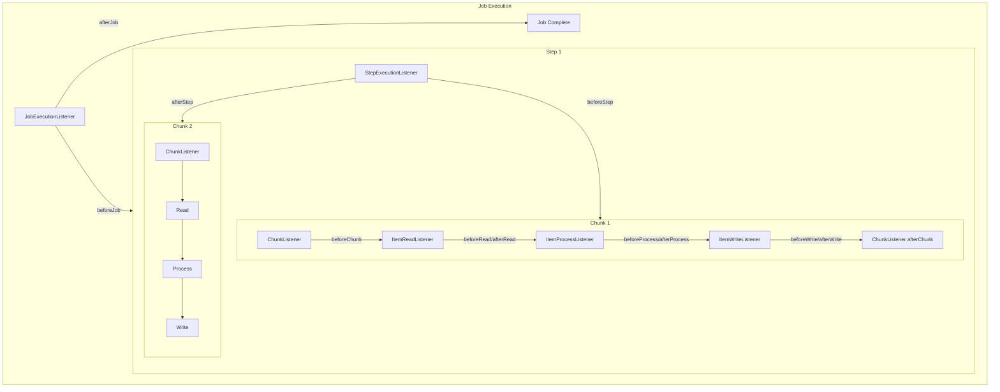
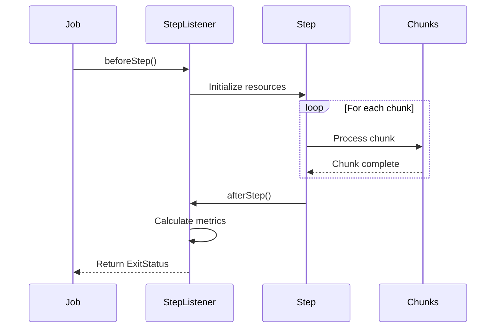
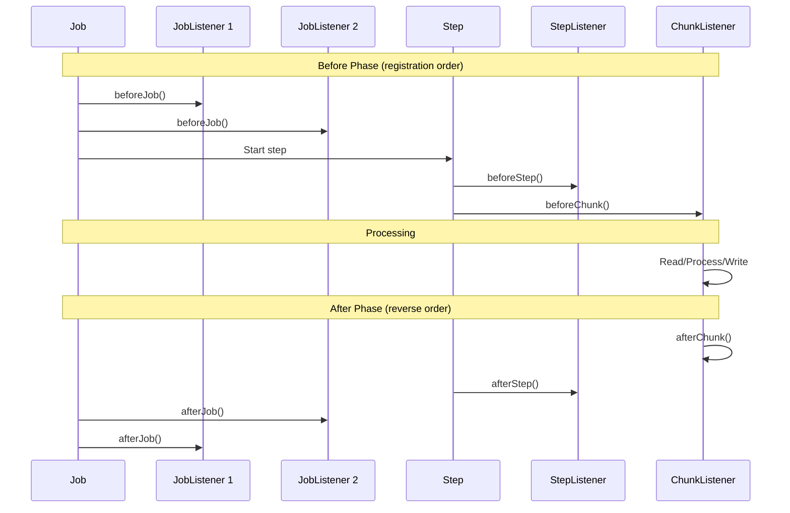

# How to Create Batch Listeners

Author: [nawazdhandala](https://github.com/nawazdhandala)

Tags: Batch Processing, Listeners, Events, Spring Batch

Description: Learn to create batch listeners for hooking into job, step, and chunk lifecycle events.

---

Batch processing systems execute large volumes of data in discrete chunks. **Listeners** let you hook into these processes at critical moments, whether to log progress, handle errors, send notifications, or gather metrics. This guide covers the four main listener types in Spring Batch and shows how to implement them effectively.

## Listener Architecture Overview

Before diving into code, let us understand how listeners fit into the batch processing lifecycle. Spring Batch provides hooks at multiple levels, from the entire job down to individual items.



## 1. Job Execution Listener

The **JobExecutionListener** intercepts the start and end of a batch job. Use it for job-level setup, cleanup, and notifications. This is the broadest scope listener, perfect for logging job duration or sending completion alerts.

### Using the Interface Approach

`listeners/JobCompletionListener.java`

```java
package com.example.batch.listeners;

import org.slf4j.Logger;
import org.slf4j.LoggerFactory;
import org.springframework.batch.core.JobExecution;
import org.springframework.batch.core.JobExecutionListener;
import org.springframework.stereotype.Component;

import java.time.Duration;
import java.time.LocalDateTime;

/**
 * Listener that tracks job execution time and logs completion status.
 * Useful for monitoring batch job performance and sending notifications.
 */
@Component
public class JobCompletionListener implements JobExecutionListener {

    private static final Logger log = LoggerFactory.getLogger(JobCompletionListener.class);

    /**
     * Called before the job starts executing.
     * Use this for initialization, logging, or resource setup.
     */
    @Override
    public void beforeJob(JobExecution jobExecution) {
        // Log job start with parameters for debugging
        log.info("Starting job: {} with parameters: {}",
                jobExecution.getJobInstance().getJobName(),
                jobExecution.getJobParameters());

        // Store start time in execution context for duration calculation
        jobExecution.getExecutionContext()
                .put("startTime", LocalDateTime.now().toString());
    }

    /**
     * Called after the job completes (success or failure).
     * Use this for cleanup, notifications, or metrics reporting.
     */
    @Override
    public void afterJob(JobExecution jobExecution) {
        // Calculate total job duration
        String startTimeStr = jobExecution.getExecutionContext()
                .getString("startTime");
        LocalDateTime startTime = LocalDateTime.parse(startTimeStr);
        Duration duration = Duration.between(startTime, LocalDateTime.now());

        // Log completion status with duration
        log.info("Job {} completed with status: {} in {} seconds",
                jobExecution.getJobInstance().getJobName(),
                jobExecution.getStatus(),
                duration.getSeconds());

        // Handle different completion states
        switch (jobExecution.getStatus()) {
            case COMPLETED:
                // Send success notification
                sendSuccessNotification(jobExecution);
                break;
            case FAILED:
                // Log all exceptions and send failure alert
                jobExecution.getAllFailureExceptions()
                        .forEach(ex -> log.error("Job failure: ", ex));
                sendFailureAlert(jobExecution);
                break;
            default:
                log.warn("Job ended with unexpected status: {}",
                        jobExecution.getStatus());
        }
    }

    private void sendSuccessNotification(JobExecution jobExecution) {
        // Integration with notification service (Slack, email, etc.)
        log.info("Sending success notification for job: {}",
                jobExecution.getJobInstance().getJobName());
    }

    private void sendFailureAlert(JobExecution jobExecution) {
        // Integration with alerting service (PagerDuty, OneUptime, etc.)
        log.error("Sending failure alert for job: {}",
                jobExecution.getJobInstance().getJobName());
    }
}
```

### Using Annotations

For simpler cases, use `@BeforeJob` and `@AfterJob` annotations on any POJO. This approach requires less boilerplate and works well for straightforward logging scenarios.

`listeners/AnnotatedJobListener.java`

```java
package com.example.batch.listeners;

import org.slf4j.Logger;
import org.slf4j.LoggerFactory;
import org.springframework.batch.core.JobExecution;
import org.springframework.batch.core.annotation.BeforeJob;
import org.springframework.batch.core.annotation.AfterJob;
import org.springframework.stereotype.Component;

/**
 * Simplified job listener using annotations instead of interface.
 * Spring Batch wraps this POJO with a listener adapter automatically.
 */
@Component
public class AnnotatedJobListener {

    private static final Logger log = LoggerFactory.getLogger(AnnotatedJobListener.class);

    @BeforeJob
    public void logJobStart(JobExecution jobExecution) {
        log.info("Job {} is starting", jobExecution.getJobInstance().getJobName());
    }

    @AfterJob
    public void logJobEnd(JobExecution jobExecution) {
        log.info("Job {} finished with status: {}",
                jobExecution.getJobInstance().getJobName(),
                jobExecution.getStatus());
    }
}
```

## 2. Step Execution Listener

The **StepExecutionListener** hooks into individual steps within a job. Steps are the building blocks of batch jobs, and this listener lets you perform setup or teardown specific to each step.

`listeners/StepProgressListener.java`

```java
package com.example.batch.listeners;

import org.slf4j.Logger;
import org.slf4j.LoggerFactory;
import org.springframework.batch.core.ExitStatus;
import org.springframework.batch.core.StepExecution;
import org.springframework.batch.core.StepExecutionListener;
import org.springframework.stereotype.Component;

/**
 * Listener that tracks step-level metrics and handles step transitions.
 * Captures read/write/skip counts and can modify exit status.
 */
@Component
public class StepProgressListener implements StepExecutionListener {

    private static final Logger log = LoggerFactory.getLogger(StepProgressListener.class);

    /**
     * Called before step execution begins.
     * Use for step-specific initialization or validation.
     */
    @Override
    public void beforeStep(StepExecution stepExecution) {
        log.info("Starting step: {} in job: {}",
                stepExecution.getStepName(),
                stepExecution.getJobExecution().getJobInstance().getJobName());

        // Initialize step-specific counters in execution context
        stepExecution.getExecutionContext().putInt("customMetric", 0);
    }

    /**
     * Called after step execution completes.
     * Can modify the ExitStatus to influence step flow decisions.
     *
     * @return Modified exit status or null to keep original
     */
    @Override
    public ExitStatus afterStep(StepExecution stepExecution) {
        // Log comprehensive step metrics
        log.info("Step {} completed - Read: {}, Written: {}, Skipped: {}, Filtered: {}",
                stepExecution.getStepName(),
                stepExecution.getReadCount(),
                stepExecution.getWriteCount(),
                stepExecution.getSkipCount(),
                stepExecution.getFilterCount());

        // Example: Modify exit status based on skip count threshold
        int skipThreshold = 100;
        if (stepExecution.getSkipCount() > skipThreshold) {
            log.warn("Skip count {} exceeds threshold {}, marking step for review",
                    stepExecution.getSkipCount(), skipThreshold);
            // Return custom exit status for conditional flow
            return new ExitStatus("COMPLETED_WITH_SKIPS");
        }

        // Return null to keep the original exit status
        return null;
    }
}
```

### Step Listener Flow Diagram



## 3. Chunk Listener

The **ChunkListener** intercepts chunk-level events. Chunks are the transactional boundaries in Spring Batch, where items are read, processed, and written together. This listener is essential for tracking chunk progress and handling chunk-level errors.

`listeners/ChunkMetricsListener.java`

```java
package com.example.batch.listeners;

import org.slf4j.Logger;
import org.slf4j.LoggerFactory;
import org.springframework.batch.core.ChunkListener;
import org.springframework.batch.core.scope.context.ChunkContext;
import org.springframework.stereotype.Component;

import java.util.concurrent.atomic.AtomicInteger;

/**
 * Listener that tracks chunk processing metrics.
 * Useful for progress reporting and performance monitoring.
 */
@Component
public class ChunkMetricsListener implements ChunkListener {

    private static final Logger log = LoggerFactory.getLogger(ChunkMetricsListener.class);

    // Thread-safe counter for concurrent job executions
    private final AtomicInteger chunkCount = new AtomicInteger(0);

    /**
     * Called before chunk processing begins.
     * Transaction has been started but no items read yet.
     */
    @Override
    public void beforeChunk(ChunkContext context) {
        int currentChunk = chunkCount.incrementAndGet();
        log.debug("Starting chunk {} in step: {}",
                currentChunk,
                context.getStepContext().getStepName());

        // Store chunk start time for duration tracking
        context.setAttribute("chunkStartTime", System.currentTimeMillis());
    }

    /**
     * Called after chunk processing completes successfully.
     * All items have been written and transaction committed.
     */
    @Override
    public void afterChunk(ChunkContext context) {
        long startTime = (Long) context.getAttribute("chunkStartTime");
        long duration = System.currentTimeMillis() - startTime;

        // Get chunk statistics from step execution
        int readCount = context.getStepContext().getStepExecution().getReadCount();
        int writeCount = context.getStepContext().getStepExecution().getWriteCount();

        log.info("Chunk {} completed in {}ms - Total processed: {} items",
                chunkCount.get(), duration, writeCount);

        // Emit metrics to monitoring system
        emitChunkMetrics(context.getStepContext().getStepName(), duration);
    }

    /**
     * Called when chunk processing fails and transaction rolls back.
     * Use for error logging and alerting on chunk failures.
     */
    @Override
    public void afterChunkError(ChunkContext context) {
        log.error("Chunk {} failed in step: {}. Transaction rolled back.",
                chunkCount.get(),
                context.getStepContext().getStepName());

        // Record failure for later analysis
        recordChunkFailure(context);
    }

    private void emitChunkMetrics(String stepName, long durationMs) {
        // Integration with metrics backend (Prometheus, Datadog, etc.)
        log.debug("Emitting metrics for step: {}, duration: {}ms", stepName, durationMs);
    }

    private void recordChunkFailure(ChunkContext context) {
        // Store failure details for debugging
        log.debug("Recording chunk failure details for analysis");
    }
}
```

## 4. Item Listeners

Item listeners provide the finest granularity, hooking into individual read, process, and write operations. These are crucial for detailed logging, error handling, and transformation tracking.

### ItemReadListener

`listeners/ItemReadListener.java`

```java
package com.example.batch.listeners;

import org.slf4j.Logger;
import org.slf4j.LoggerFactory;
import org.springframework.batch.core.ItemReadListener;
import org.springframework.stereotype.Component;

import com.example.batch.model.CustomerRecord;

/**
 * Listener for item read operations.
 * Tracks successful reads and handles read errors.
 */
@Component
public class CustomerReadListener implements ItemReadListener<CustomerRecord> {

    private static final Logger log = LoggerFactory.getLogger(CustomerReadListener.class);

    /**
     * Called before each item is read from the data source.
     * Useful for logging or preparing resources.
     */
    @Override
    public void beforeRead() {
        // Called before ItemReader.read()
        log.trace("Preparing to read next item");
    }

    /**
     * Called after an item is successfully read.
     * Receives the item that was read (null signals end of input).
     */
    @Override
    public void afterRead(CustomerRecord item) {
        if (item != null) {
            log.debug("Read customer record: id={}, name={}",
                    item.getId(), item.getName());
        }
    }

    /**
     * Called when ItemReader.read() throws an exception.
     * Use for error logging and potentially triggering skip logic.
     */
    @Override
    public void onReadError(Exception ex) {
        log.error("Error reading customer record: {}", ex.getMessage(), ex);
        // Could increment error counter or send alert
    }
}
```

### ItemProcessListener

`listeners/ItemProcessListener.java`

```java
package com.example.batch.listeners;

import org.slf4j.Logger;
import org.slf4j.LoggerFactory;
import org.springframework.batch.core.ItemProcessListener;
import org.springframework.stereotype.Component;

import com.example.batch.model.CustomerRecord;
import com.example.batch.model.EnrichedCustomer;

/**
 * Listener for item processing operations.
 * Tracks transformations and handles processing errors.
 */
@Component
public class CustomerProcessListener
        implements ItemProcessListener<CustomerRecord, EnrichedCustomer> {

    private static final Logger log = LoggerFactory.getLogger(CustomerProcessListener.class);

    /**
     * Called before the processor transforms an item.
     */
    @Override
    public void beforeProcess(CustomerRecord item) {
        log.debug("Processing customer: {}", item.getId());
    }

    /**
     * Called after successful processing.
     * Result may be null if processor filters out the item.
     */
    @Override
    public void afterProcess(CustomerRecord item, EnrichedCustomer result) {
        if (result == null) {
            // Item was filtered out by processor returning null
            log.info("Customer {} filtered out during processing", item.getId());
        } else {
            log.debug("Customer {} transformed to enriched format", item.getId());
        }
    }

    /**
     * Called when processing throws an exception.
     */
    @Override
    public void onProcessError(CustomerRecord item, Exception ex) {
        log.error("Error processing customer {}: {}",
                item.getId(), ex.getMessage(), ex);
    }
}
```

### ItemWriteListener

`listeners/ItemWriteListener.java`

```java
package com.example.batch.listeners;

import org.slf4j.Logger;
import org.slf4j.LoggerFactory;
import org.springframework.batch.core.ItemWriteListener;
import org.springframework.batch.item.Chunk;
import org.springframework.stereotype.Component;

import com.example.batch.model.EnrichedCustomer;

/**
 * Listener for item write operations.
 * Handles batch writes and tracks persistence outcomes.
 */
@Component
public class CustomerWriteListener implements ItemWriteListener<EnrichedCustomer> {

    private static final Logger log = LoggerFactory.getLogger(CustomerWriteListener.class);

    /**
     * Called before items are written.
     * Receives the entire chunk that will be written.
     */
    @Override
    public void beforeWrite(Chunk<? extends EnrichedCustomer> items) {
        log.debug("Preparing to write {} items", items.size());
    }

    /**
     * Called after items are successfully written.
     */
    @Override
    public void afterWrite(Chunk<? extends EnrichedCustomer> items) {
        log.info("Successfully wrote {} customer records", items.size());

        // Log individual items if needed for audit
        items.getItems().forEach(item ->
                log.trace("Wrote customer: {}", item.getCustomerId()));
    }

    /**
     * Called when write operation fails.
     * The entire chunk write is rolled back on error.
     */
    @Override
    public void onWriteError(Exception ex, Chunk<? extends EnrichedCustomer> items) {
        log.error("Failed to write {} items: {}",
                items.size(), ex.getMessage(), ex);

        // Log which items failed for retry or manual processing
        items.getItems().forEach(item ->
                log.error("Failed item: {}", item.getCustomerId()));
    }
}
```

## 5. Registering Listeners in Job Configuration

After creating listeners, register them in your batch job configuration. You can register listeners at the job level, step level, or both.

`config/BatchJobConfig.java`

```java
package com.example.batch.config;

import org.springframework.batch.core.Job;
import org.springframework.batch.core.Step;
import org.springframework.batch.core.job.builder.JobBuilder;
import org.springframework.batch.core.repository.JobRepository;
import org.springframework.batch.core.step.builder.StepBuilder;
import org.springframework.context.annotation.Bean;
import org.springframework.context.annotation.Configuration;
import org.springframework.transaction.PlatformTransactionManager;

import com.example.batch.listeners.*;
import com.example.batch.model.CustomerRecord;
import com.example.batch.model.EnrichedCustomer;

@Configuration
public class BatchJobConfig {

    private final JobRepository jobRepository;
    private final PlatformTransactionManager transactionManager;

    // Inject all listeners
    private final JobCompletionListener jobListener;
    private final StepProgressListener stepListener;
    private final ChunkMetricsListener chunkListener;
    private final CustomerReadListener readListener;
    private final CustomerProcessListener processListener;
    private final CustomerWriteListener writeListener;

    public BatchJobConfig(
            JobRepository jobRepository,
            PlatformTransactionManager transactionManager,
            JobCompletionListener jobListener,
            StepProgressListener stepListener,
            ChunkMetricsListener chunkListener,
            CustomerReadListener readListener,
            CustomerProcessListener processListener,
            CustomerWriteListener writeListener) {
        this.jobRepository = jobRepository;
        this.transactionManager = transactionManager;
        this.jobListener = jobListener;
        this.stepListener = stepListener;
        this.chunkListener = chunkListener;
        this.readListener = readListener;
        this.processListener = processListener;
        this.writeListener = writeListener;
    }

    /**
     * Define the batch job with all listeners attached.
     */
    @Bean
    public Job customerEnrichmentJob(Step enrichmentStep) {
        return new JobBuilder("customerEnrichmentJob", jobRepository)
                // Register job-level listener
                .listener(jobListener)
                .start(enrichmentStep)
                .build();
    }

    /**
     * Define the step with chunk and item listeners.
     */
    @Bean
    public Step enrichmentStep(
            CustomerItemReader reader,
            CustomerItemProcessor processor,
            CustomerItemWriter writer) {

        return new StepBuilder("enrichmentStep", jobRepository)
                // Configure chunk size (items per transaction)
                .<CustomerRecord, EnrichedCustomer>chunk(100, transactionManager)
                .reader(reader)
                .processor(processor)
                .writer(writer)
                // Register step-level listener
                .listener(stepListener)
                // Register chunk listener
                .listener(chunkListener)
                // Register item listeners
                .listener(readListener)
                .listener(processListener)
                .listener(writeListener)
                .build();
    }
}
```

## 6. Composite Listener Pattern

When you need to combine multiple listeners of the same type, use a composite listener. This keeps your configuration clean and allows for modular listener composition.

`listeners/CompositeJobListener.java`

```java
package com.example.batch.listeners;

import org.springframework.batch.core.JobExecution;
import org.springframework.batch.core.JobExecutionListener;
import org.springframework.stereotype.Component;

import java.util.List;

/**
 * Composite listener that delegates to multiple job listeners.
 * Allows modular composition of listener behavior.
 */
@Component
public class CompositeJobListener implements JobExecutionListener {

    private final List<JobExecutionListener> listeners;

    public CompositeJobListener(List<JobExecutionListener> listeners) {
        this.listeners = listeners;
    }

    @Override
    public void beforeJob(JobExecution jobExecution) {
        // Delegate to all listeners in order
        listeners.forEach(listener -> listener.beforeJob(jobExecution));
    }

    @Override
    public void afterJob(JobExecution jobExecution) {
        // Delegate to all listeners in reverse order (cleanup)
        for (int i = listeners.size() - 1; i >= 0; i--) {
            listeners.get(i).afterJob(jobExecution);
        }
    }
}
```

## 7. Common Use Cases

### Sending Slack Notifications

`listeners/SlackNotificationListener.java`

```java
package com.example.batch.listeners;

import org.springframework.batch.core.BatchStatus;
import org.springframework.batch.core.JobExecution;
import org.springframework.batch.core.annotation.AfterJob;
import org.springframework.stereotype.Component;
import org.springframework.web.client.RestTemplate;

import java.util.Map;

/**
 * Sends Slack notifications on job completion.
 */
@Component
public class SlackNotificationListener {

    private final RestTemplate restTemplate;
    private final String webhookUrl;

    public SlackNotificationListener(RestTemplate restTemplate) {
        this.restTemplate = restTemplate;
        this.webhookUrl = System.getenv("SLACK_WEBHOOK_URL");
    }

    @AfterJob
    public void notifySlack(JobExecution jobExecution) {
        String jobName = jobExecution.getJobInstance().getJobName();
        BatchStatus status = jobExecution.getStatus();

        // Build message with status emoji
        String emoji = status == BatchStatus.COMPLETED ? ":white_check_mark:" : ":x:";
        String message = String.format("%s Job *%s* finished with status: *%s*",
                emoji, jobName, status);

        // Send to Slack webhook
        Map<String, String> payload = Map.of("text", message);
        restTemplate.postForObject(webhookUrl, payload, String.class);
    }
}
```

### Tracking Metrics with Prometheus

`listeners/PrometheusMetricsListener.java`

```java
package com.example.batch.listeners;

import io.micrometer.core.instrument.Counter;
import io.micrometer.core.instrument.MeterRegistry;
import io.micrometer.core.instrument.Timer;
import org.springframework.batch.core.ExitStatus;
import org.springframework.batch.core.StepExecution;
import org.springframework.batch.core.StepExecutionListener;
import org.springframework.stereotype.Component;

import java.time.Duration;
import java.util.concurrent.ConcurrentHashMap;
import java.util.Map;

/**
 * Exports batch metrics to Prometheus via Micrometer.
 */
@Component
public class PrometheusMetricsListener implements StepExecutionListener {

    private final MeterRegistry registry;
    private final Map<String, Long> stepStartTimes = new ConcurrentHashMap<>();

    // Counters for tracking item processing
    private final Counter itemsReadCounter;
    private final Counter itemsWrittenCounter;
    private final Counter itemsSkippedCounter;

    public PrometheusMetricsListener(MeterRegistry registry) {
        this.registry = registry;

        // Initialize counters with descriptive names
        this.itemsReadCounter = Counter.builder("batch.items.read")
                .description("Total items read across all batch steps")
                .register(registry);

        this.itemsWrittenCounter = Counter.builder("batch.items.written")
                .description("Total items written across all batch steps")
                .register(registry);

        this.itemsSkippedCounter = Counter.builder("batch.items.skipped")
                .description("Total items skipped across all batch steps")
                .register(registry);
    }

    @Override
    public void beforeStep(StepExecution stepExecution) {
        // Record step start time for duration calculation
        stepStartTimes.put(stepExecution.getStepName(), System.nanoTime());
    }

    @Override
    public ExitStatus afterStep(StepExecution stepExecution) {
        String stepName = stepExecution.getStepName();

        // Record step duration
        Long startTime = stepStartTimes.remove(stepName);
        if (startTime != null) {
            long durationNanos = System.nanoTime() - startTime;
            Timer.builder("batch.step.duration")
                    .tag("step", stepName)
                    .register(registry)
                    .record(Duration.ofNanos(durationNanos));
        }

        // Update item counters
        itemsReadCounter.increment(stepExecution.getReadCount());
        itemsWrittenCounter.increment(stepExecution.getWriteCount());
        itemsSkippedCounter.increment(stepExecution.getSkipCount());

        return null;
    }
}
```

### Audit Logging for Compliance

`listeners/AuditLoggingListener.java`

```java
package com.example.batch.listeners;

import org.slf4j.Logger;
import org.slf4j.LoggerFactory;
import org.springframework.batch.core.ItemWriteListener;
import org.springframework.batch.item.Chunk;
import org.springframework.stereotype.Component;

import com.example.batch.model.SensitiveRecord;
import com.example.batch.service.AuditService;

/**
 * Creates audit trail for compliance-sensitive batch operations.
 */
@Component
public class AuditLoggingListener implements ItemWriteListener<SensitiveRecord> {

    private static final Logger auditLog = LoggerFactory.getLogger("AUDIT");
    private final AuditService auditService;

    public AuditLoggingListener(AuditService auditService) {
        this.auditService = auditService;
    }

    @Override
    public void beforeWrite(Chunk<? extends SensitiveRecord> items) {
        // Log intent before write for non-repudiation
        items.getItems().forEach(item ->
                auditLog.info("AUDIT: Preparing to write record id={}, user={}",
                        item.getId(), item.getModifiedBy()));
    }

    @Override
    public void afterWrite(Chunk<? extends SensitiveRecord> items) {
        // Create permanent audit entries after successful write
        items.getItems().forEach(item -> {
            auditLog.info("AUDIT: Successfully wrote record id={}", item.getId());
            auditService.recordWrite(item.getId(), item.getModifiedBy());
        });
    }

    @Override
    public void onWriteError(Exception ex, Chunk<? extends SensitiveRecord> items) {
        // Log failed writes for investigation
        items.getItems().forEach(item ->
                auditLog.error("AUDIT: Failed to write record id={}, error={}",
                        item.getId(), ex.getMessage()));
    }
}
```

## 8. Listener Execution Order

When multiple listeners are registered, Spring Batch executes them in a defined order. Understanding this order is crucial for listeners that depend on each other.



## 9. Error Handling in Listeners

Listeners should handle their own exceptions to prevent disrupting the batch job. Use try-catch blocks for non-critical operations like notifications or metrics.

```java
@Override
public void afterJob(JobExecution jobExecution) {
    try {
        // Non-critical operation: send notification
        notificationService.sendJobCompleteNotification(jobExecution);
    } catch (Exception ex) {
        // Log but do not rethrow - notification failure should not fail the job
        log.error("Failed to send notification, job continues: {}", ex.getMessage());
    }

    // Critical operation: save final metrics (let exception propagate if needed)
    metricsService.saveJobMetrics(jobExecution);
}
```

## Best Practices Summary

| Practice | Description |
|----------|-------------|
| Keep listeners focused | Each listener should have a single responsibility |
| Use appropriate scope | Job listeners for global concerns, item listeners for detailed tracking |
| Handle exceptions | Catch exceptions in non-critical listeners to prevent job failures |
| Leverage execution context | Share data between listeners using step/job execution context |
| Use annotations for simple cases | `@BeforeJob`, `@AfterJob` reduce boilerplate for basic logging |
| Test listeners independently | Unit test listener logic separate from batch job integration |
| Monitor listener performance | Long-running listener code impacts overall batch performance |

---

Batch listeners are the observability backbone of your batch processing system. They enable logging, metrics collection, notifications, and error handling without polluting your core business logic. Start with job and step listeners for broad visibility, then add item listeners when you need granular tracking. The key is matching the listener scope to your monitoring needs.
