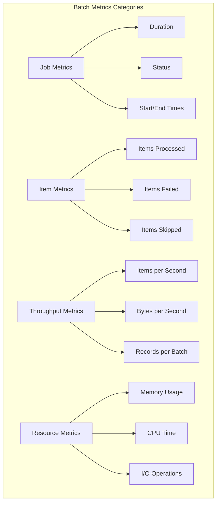
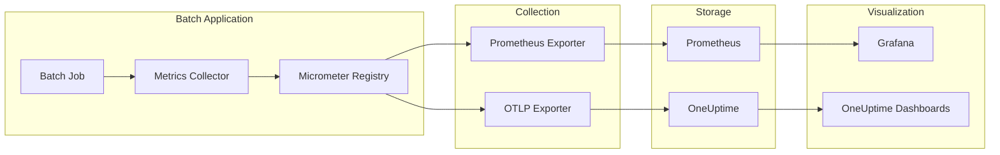
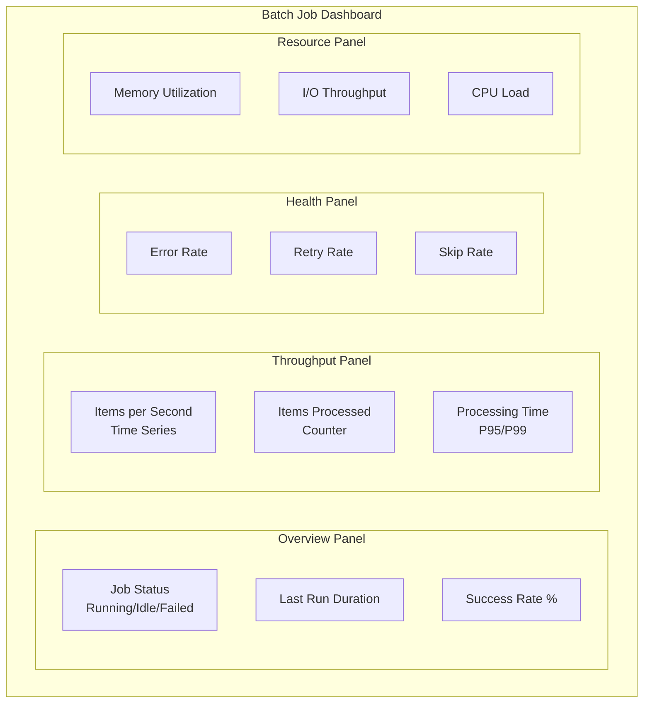

# How to Implement Batch Metrics

Author: [nawazdhandala](https://github.com/nawazdhandala)

Tags: Batch Processing, Metrics, Monitoring, Observability

Description: Learn to implement batch metrics for measuring job performance, throughput, and resource utilization.

---

Batch processing jobs run behind the scenes in nearly every production system. They handle data migrations, report generation, ETL pipelines, cleanup tasks, and scheduled synchronizations. Unlike request/response workloads where latency is immediately visible, batch jobs often fail silently or degrade gradually without anyone noticing until users complain about stale data or missed SLAs.

This guide walks through implementing comprehensive batch metrics that give you visibility into job health, throughput, and resource consumption. We will cover the key metrics every batch system needs, how to instrument them with Micrometer, and how to visualize the results for actionable insights.

---

## Table of Contents

1. Why Batch Metrics Matter
2. Core Batch Metrics Categories
3. Architecture Overview
4. Setting Up Micrometer for Batch Jobs
5. Implementing Job-Level Metrics
6. Implementing Item-Level Metrics
7. Tracking Resource Utilization
8. Error and Retry Metrics
9. Building a Complete Batch Metrics Collector
10. Visualization and Dashboards
11. Alerting Strategies
12. Best Practices

---

## 1. Why Batch Metrics Matter

Batch jobs have unique observability challenges:

| Challenge | Impact Without Metrics |
|-----------|----------------------|
| Silent failures | Jobs fail but no one knows until downstream systems break |
| Performance degradation | Processing time slowly increases until SLAs are missed |
| Resource exhaustion | Memory or disk fills up mid-job, causing partial completion |
| Throughput variance | Volume spikes cause backlogs that cascade to other jobs |
| Data quality issues | Invalid records processed without visibility |

With proper metrics, you can answer critical questions:

- How long did the job take compared to yesterday?
- How many items were processed, skipped, or failed?
- What is the throughput trend over time?
- Are we consuming excessive resources?
- Where in the pipeline are bottlenecks occurring?

---

## 2. Core Batch Metrics Categories

Batch metrics fall into four main categories:



### Key Metrics to Track

| Metric | Type | Purpose |
|--------|------|---------|
| `batch.job.duration` | Timer | Total execution time per job run |
| `batch.job.status` | Counter | Count of completions by status (success/failure) |
| `batch.items.processed` | Counter | Total items successfully processed |
| `batch.items.failed` | Counter | Items that failed processing |
| `batch.items.skipped` | Counter | Items skipped (already processed, filtered) |
| `batch.throughput` | Gauge | Current processing rate |
| `batch.step.duration` | Timer | Time spent in each processing step |
| `batch.errors` | Counter | Errors by type and cause |
| `batch.retries` | Counter | Retry attempts by step |
| `batch.resource.memory` | Gauge | Memory consumption during processing |

---

## 3. Architecture Overview

Here is how batch metrics flow from your application to visualization:



---

## 4. Setting Up Micrometer for Batch Jobs

First, add the necessary dependencies. For a Spring Boot application:

```xml
<!-- pom.xml -->
<dependencies>
    <!-- Core Micrometer -->
    <dependency>
        <groupId>io.micrometer</groupId>
        <artifactId>micrometer-core</artifactId>
        <version>1.12.0</version>
    </dependency>

    <!-- Prometheus Registry for scraping -->
    <dependency>
        <groupId>io.micrometer</groupId>
        <artifactId>micrometer-registry-prometheus</artifactId>
        <version>1.12.0</version>
    </dependency>

    <!-- OTLP Registry for push-based export -->
    <dependency>
        <groupId>io.micrometer</groupId>
        <artifactId>micrometer-registry-otlp</artifactId>
        <version>1.12.0</version>
    </dependency>
</dependencies>
```

For Gradle:

```groovy
// build.gradle
dependencies {
    implementation 'io.micrometer:micrometer-core:1.12.0'
    implementation 'io.micrometer:micrometer-registry-prometheus:1.12.0'
    implementation 'io.micrometer:micrometer-registry-otlp:1.12.0'
}
```

Configure the registry:

```java
// BatchMetricsConfig.java
package com.example.batch.config;

import io.micrometer.core.instrument.MeterRegistry;
import io.micrometer.core.instrument.Tag;
import io.micrometer.core.instrument.Tags;
import io.micrometer.prometheus.PrometheusConfig;
import io.micrometer.prometheus.PrometheusMeterRegistry;
import org.springframework.context.annotation.Bean;
import org.springframework.context.annotation.Configuration;

import java.util.List;

@Configuration
public class BatchMetricsConfig {

    /**
     * Creates a Prometheus registry with common tags for all batch metrics.
     * Common tags help identify the source service and environment.
     */
    @Bean
    public MeterRegistry meterRegistry() {
        PrometheusMeterRegistry registry = new PrometheusMeterRegistry(PrometheusConfig.DEFAULT);

        // Add common tags to all metrics for filtering and grouping
        registry.config().commonTags(List.of(
            Tag.of("service", "batch-processor"),
            Tag.of("environment", System.getenv().getOrDefault("ENV", "development"))
        ));

        return registry;
    }
}
```

---

## 5. Implementing Job-Level Metrics

Job-level metrics capture the overall execution characteristics of each batch run:

```java
// BatchJobMetrics.java
package com.example.batch.metrics;

import io.micrometer.core.instrument.*;
import java.time.Duration;
import java.time.Instant;
import java.util.concurrent.ConcurrentHashMap;
import java.util.concurrent.atomic.AtomicReference;

/**
 * Tracks metrics for batch job execution including duration, status, and timing.
 * Thread-safe for use in concurrent batch processing scenarios.
 */
public class BatchJobMetrics {

    private final MeterRegistry registry;
    private final String jobName;

    // Track active job start times for duration calculation
    private final ConcurrentHashMap<String, Instant> jobStartTimes = new ConcurrentHashMap<>();

    // Gauges for current state visibility
    private final AtomicReference<String> currentStatus = new AtomicReference<>("idle");
    private final AtomicReference<Double> lastDurationSeconds = new AtomicReference<>(0.0);

    public BatchJobMetrics(MeterRegistry registry, String jobName) {
        this.registry = registry;
        this.jobName = jobName;

        // Register gauges for real-time monitoring
        Gauge.builder("batch.job.status.current", currentStatus, ref -> statusToNumeric(ref.get()))
            .tag("job", jobName)
            .description("Current job status: 0=idle, 1=running, 2=success, 3=failed")
            .register(registry);

        Gauge.builder("batch.job.duration.last", lastDurationSeconds, AtomicReference::get)
            .tag("job", jobName)
            .description("Duration of the last completed job run in seconds")
            .baseUnit("seconds")
            .register(registry);
    }

    /**
     * Call at the start of a batch job execution.
     * Records the start time and updates status to running.
     *
     * @param executionId Unique identifier for this job run
     */
    public void jobStarted(String executionId) {
        jobStartTimes.put(executionId, Instant.now());
        currentStatus.set("running");

        // Increment the job start counter
        Counter.builder("batch.job.started")
            .tag("job", jobName)
            .description("Number of times this job has started")
            .register(registry)
            .increment();
    }

    /**
     * Call when a batch job completes successfully.
     * Records duration and updates status counters.
     *
     * @param executionId The execution ID passed to jobStarted
     */
    public void jobCompleted(String executionId) {
        recordJobEnd(executionId, "success");
    }

    /**
     * Call when a batch job fails.
     * Records duration, status, and error information.
     *
     * @param executionId The execution ID passed to jobStarted
     * @param errorType Category of error (e.g., "validation", "io", "timeout")
     */
    public void jobFailed(String executionId, String errorType) {
        recordJobEnd(executionId, "failed");

        // Track failures by error type for root cause analysis
        Counter.builder("batch.job.errors")
            .tag("job", jobName)
            .tag("error_type", errorType)
            .description("Job failures categorized by error type")
            .register(registry)
            .increment();
    }

    /**
     * Internal method to record job completion metrics.
     */
    private void recordJobEnd(String executionId, String status) {
        Instant startTime = jobStartTimes.remove(executionId);

        if (startTime != null) {
            Duration duration = Duration.between(startTime, Instant.now());
            lastDurationSeconds.set(duration.toMillis() / 1000.0);

            // Record duration in a timer for percentile calculations
            Timer.builder("batch.job.duration")
                .tag("job", jobName)
                .tag("status", status)
                .description("Time taken to complete batch job execution")
                .register(registry)
                .record(duration);
        }

        currentStatus.set(status);

        // Increment completion counter
        Counter.builder("batch.job.completed")
            .tag("job", jobName)
            .tag("status", status)
            .description("Number of job completions by status")
            .register(registry)
            .increment();
    }

    /**
     * Converts status string to numeric value for gauge.
     */
    private double statusToNumeric(String status) {
        return switch (status) {
            case "idle" -> 0;
            case "running" -> 1;
            case "success" -> 2;
            case "failed" -> 3;
            default -> -1;
        };
    }
}
```

---

## 6. Implementing Item-Level Metrics

Item-level metrics track what happens to individual records during processing:

```java
// BatchItemMetrics.java
package com.example.batch.metrics;

import io.micrometer.core.instrument.*;
import java.util.concurrent.atomic.AtomicLong;

/**
 * Tracks metrics for individual items processed within a batch job.
 * Provides visibility into processing success, failures, and skip rates.
 */
public class BatchItemMetrics {

    private final MeterRegistry registry;
    private final String jobName;

    // Atomic counters for thread-safe increments
    private final AtomicLong processedCount = new AtomicLong(0);
    private final AtomicLong failedCount = new AtomicLong(0);
    private final AtomicLong skippedCount = new AtomicLong(0);

    // Timer for per-item processing duration
    private final Timer itemProcessingTimer;

    public BatchItemMetrics(MeterRegistry registry, String jobName) {
        this.registry = registry;
        this.jobName = jobName;

        // Register counters with descriptive names
        Counter.builder("batch.items.processed")
            .tag("job", jobName)
            .description("Total number of items successfully processed")
            .register(registry);

        Counter.builder("batch.items.failed")
            .tag("job", jobName)
            .description("Total number of items that failed processing")
            .register(registry);

        Counter.builder("batch.items.skipped")
            .tag("job", jobName)
            .description("Total number of items skipped during processing")
            .register(registry);

        // Timer for tracking individual item processing duration
        this.itemProcessingTimer = Timer.builder("batch.item.duration")
            .tag("job", jobName)
            .description("Time taken to process individual items")
            .publishPercentiles(0.5, 0.95, 0.99)
            .register(registry);

        // Gauges for current batch progress
        Gauge.builder("batch.items.processed.current", processedCount, AtomicLong::get)
            .tag("job", jobName)
            .description("Items processed in current batch run")
            .register(registry);

        Gauge.builder("batch.items.failed.current", failedCount, AtomicLong::get)
            .tag("job", jobName)
            .description("Items failed in current batch run")
            .register(registry);
    }

    /**
     * Record a successfully processed item.
     *
     * @param processingTimeMs Time taken to process this item in milliseconds
     */
    public void itemProcessed(long processingTimeMs) {
        processedCount.incrementAndGet();

        registry.counter("batch.items.processed", "job", jobName).increment();
        itemProcessingTimer.record(java.time.Duration.ofMillis(processingTimeMs));
    }

    /**
     * Record a failed item with categorization.
     *
     * @param failureReason Category of failure for analysis
     */
    public void itemFailed(String failureReason) {
        failedCount.incrementAndGet();

        // Track overall failures
        registry.counter("batch.items.failed", "job", jobName).increment();

        // Track failures by reason for debugging
        Counter.builder("batch.items.failed.by_reason")
            .tag("job", jobName)
            .tag("reason", failureReason)
            .description("Failed items categorized by failure reason")
            .register(registry)
            .increment();
    }

    /**
     * Record a skipped item with categorization.
     *
     * @param skipReason Why the item was skipped (e.g., "duplicate", "filtered", "already_processed")
     */
    public void itemSkipped(String skipReason) {
        skippedCount.incrementAndGet();

        registry.counter("batch.items.skipped", "job", jobName).increment();

        // Track skips by reason for pipeline tuning
        Counter.builder("batch.items.skipped.by_reason")
            .tag("job", jobName)
            .tag("reason", skipReason)
            .description("Skipped items categorized by skip reason")
            .register(registry)
            .increment();
    }

    /**
     * Reset current batch counters at the start of a new job run.
     * Call this in jobStarted() to track per-run metrics.
     */
    public void resetCurrentBatch() {
        processedCount.set(0);
        failedCount.set(0);
        skippedCount.set(0);
    }

    /**
     * Get the current success rate as a percentage.
     * Useful for real-time monitoring dashboards.
     */
    public double getSuccessRate() {
        long total = processedCount.get() + failedCount.get();
        if (total == 0) return 100.0;
        return (processedCount.get() * 100.0) / total;
    }
}
```

---

## 7. Tracking Resource Utilization

Monitor memory, CPU, and I/O during batch execution:

```java
// BatchResourceMetrics.java
package com.example.batch.metrics;

import io.micrometer.core.instrument.*;
import java.lang.management.ManagementFactory;
import java.lang.management.MemoryMXBean;
import java.lang.management.OperatingSystemMXBean;
import java.util.concurrent.atomic.AtomicLong;

/**
 * Tracks resource utilization during batch job execution.
 * Helps identify resource-intensive jobs and prevent exhaustion.
 */
public class BatchResourceMetrics {

    private final MeterRegistry registry;
    private final String jobName;
    private final MemoryMXBean memoryBean;
    private final OperatingSystemMXBean osBean;

    // Track peak resource usage during job execution
    private final AtomicLong peakMemoryBytes = new AtomicLong(0);
    private final AtomicLong bytesRead = new AtomicLong(0);
    private final AtomicLong bytesWritten = new AtomicLong(0);

    public BatchResourceMetrics(MeterRegistry registry, String jobName) {
        this.registry = registry;
        this.jobName = jobName;
        this.memoryBean = ManagementFactory.getMemoryMXBean();
        this.osBean = ManagementFactory.getOperatingSystemMXBean();

        // Register memory gauges
        Gauge.builder("batch.resource.memory.heap.used", memoryBean,
                bean -> bean.getHeapMemoryUsage().getUsed())
            .tag("job", jobName)
            .description("Current heap memory usage in bytes")
            .baseUnit("bytes")
            .register(registry);

        Gauge.builder("batch.resource.memory.heap.max", memoryBean,
                bean -> bean.getHeapMemoryUsage().getMax())
            .tag("job", jobName)
            .description("Maximum heap memory available")
            .baseUnit("bytes")
            .register(registry);

        // Track memory utilization percentage
        Gauge.builder("batch.resource.memory.utilization", this, metrics -> {
                long used = memoryBean.getHeapMemoryUsage().getUsed();
                long max = memoryBean.getHeapMemoryUsage().getMax();
                return max > 0 ? (used * 100.0) / max : 0;
            })
            .tag("job", jobName)
            .description("Heap memory utilization as percentage")
            .baseUnit("percent")
            .register(registry);

        // Track peak memory for the current job run
        Gauge.builder("batch.resource.memory.peak", peakMemoryBytes, AtomicLong::get)
            .tag("job", jobName)
            .description("Peak memory usage during current job run")
            .baseUnit("bytes")
            .register(registry);

        // Register CPU gauge
        Gauge.builder("batch.resource.cpu.load", osBean, OperatingSystemMXBean::getSystemLoadAverage)
            .tag("job", jobName)
            .description("System CPU load average")
            .register(registry);

        // I/O counters
        Gauge.builder("batch.resource.io.bytes_read", bytesRead, AtomicLong::get)
            .tag("job", jobName)
            .description("Total bytes read during job execution")
            .baseUnit("bytes")
            .register(registry);

        Gauge.builder("batch.resource.io.bytes_written", bytesWritten, AtomicLong::get)
            .tag("job", jobName)
            .description("Total bytes written during job execution")
            .baseUnit("bytes")
            .register(registry);
    }

    /**
     * Call periodically during job execution to track peak memory.
     * Typically called after processing each chunk or batch.
     */
    public void sampleMemory() {
        long currentUsed = memoryBean.getHeapMemoryUsage().getUsed();
        peakMemoryBytes.updateAndGet(current -> Math.max(current, currentUsed));
    }

    /**
     * Record bytes read from external sources (files, databases, APIs).
     *
     * @param bytes Number of bytes read
     */
    public void recordBytesRead(long bytes) {
        bytesRead.addAndGet(bytes);

        // Also record as a distribution for rate calculations
        DistributionSummary.builder("batch.resource.io.read")
            .tag("job", jobName)
            .description("Distribution of read operation sizes")
            .baseUnit("bytes")
            .register(registry)
            .record(bytes);
    }

    /**
     * Record bytes written to external destinations.
     *
     * @param bytes Number of bytes written
     */
    public void recordBytesWritten(long bytes) {
        bytesWritten.addAndGet(bytes);

        DistributionSummary.builder("batch.resource.io.write")
            .tag("job", jobName)
            .description("Distribution of write operation sizes")
            .baseUnit("bytes")
            .register(registry)
            .record(bytes);
    }

    /**
     * Reset resource counters at the start of a new job run.
     */
    public void reset() {
        peakMemoryBytes.set(0);
        bytesRead.set(0);
        bytesWritten.set(0);
    }

    /**
     * Get current memory utilization as a percentage.
     */
    public double getMemoryUtilization() {
        long used = memoryBean.getHeapMemoryUsage().getUsed();
        long max = memoryBean.getHeapMemoryUsage().getMax();
        return max > 0 ? (used * 100.0) / max : 0;
    }
}
```

---

## 8. Error and Retry Metrics

Track errors and retry behavior for reliability analysis:

```java
// BatchErrorMetrics.java
package com.example.batch.metrics;

import io.micrometer.core.instrument.*;
import java.util.concurrent.atomic.AtomicInteger;

/**
 * Tracks error patterns and retry behavior in batch processing.
 * Helps identify flaky operations and tune retry policies.
 */
public class BatchErrorMetrics {

    private final MeterRegistry registry;
    private final String jobName;

    // Track retry attempts for circuit breaker decisions
    private final AtomicInteger consecutiveFailures = new AtomicInteger(0);

    public BatchErrorMetrics(MeterRegistry registry, String jobName) {
        this.registry = registry;
        this.jobName = jobName;

        // Gauge for consecutive failures (useful for circuit breaker visualization)
        Gauge.builder("batch.errors.consecutive", consecutiveFailures, AtomicInteger::get)
            .tag("job", jobName)
            .description("Number of consecutive failures without success")
            .register(registry);
    }

    /**
     * Record an error with full categorization.
     *
     * @param step The processing step where the error occurred
     * @param errorType Category of error (e.g., "IOException", "ValidationError")
     * @param recoverable Whether the error is potentially recoverable via retry
     */
    public void recordError(String step, String errorType, boolean recoverable) {
        consecutiveFailures.incrementAndGet();

        Counter.builder("batch.errors.total")
            .tag("job", jobName)
            .tag("step", step)
            .tag("error_type", errorType)
            .tag("recoverable", String.valueOf(recoverable))
            .description("Total errors by step, type, and recoverability")
            .register(registry)
            .increment();
    }

    /**
     * Record a retry attempt.
     *
     * @param step The processing step being retried
     * @param attemptNumber Which retry attempt this is (1-based)
     * @param delayMs Delay before this retry in milliseconds
     */
    public void recordRetry(String step, int attemptNumber, long delayMs) {
        Counter.builder("batch.retries.total")
            .tag("job", jobName)
            .tag("step", step)
            .tag("attempt", String.valueOf(attemptNumber))
            .description("Total retry attempts by step and attempt number")
            .register(registry)
            .increment();

        // Track retry delay distribution
        DistributionSummary.builder("batch.retries.delay")
            .tag("job", jobName)
            .tag("step", step)
            .description("Distribution of retry delays")
            .baseUnit("milliseconds")
            .register(registry)
            .record(delayMs);
    }

    /**
     * Record a successful recovery after retries.
     *
     * @param step The processing step that recovered
     * @param attemptsNeeded Total attempts needed for success
     */
    public void recordRecovery(String step, int attemptsNeeded) {
        consecutiveFailures.set(0);

        Counter.builder("batch.retries.recovered")
            .tag("job", jobName)
            .tag("step", step)
            .description("Successful recoveries after retry")
            .register(registry)
            .increment();

        // Track how many attempts were needed
        DistributionSummary.builder("batch.retries.attempts_to_success")
            .tag("job", jobName)
            .tag("step", step)
            .description("Number of attempts needed for successful recovery")
            .register(registry)
            .record(attemptsNeeded);
    }

    /**
     * Record that retries were exhausted without recovery.
     *
     * @param step The processing step that exhausted retries
     * @param maxAttempts Maximum retry attempts configured
     */
    public void recordExhausted(String step, int maxAttempts) {
        Counter.builder("batch.retries.exhausted")
            .tag("job", jobName)
            .tag("step", step)
            .description("Retry attempts exhausted without recovery")
            .register(registry)
            .increment();
    }

    /**
     * Record a successful operation (resets consecutive failure counter).
     */
    public void recordSuccess() {
        consecutiveFailures.set(0);
    }

    /**
     * Get current consecutive failure count.
     */
    public int getConsecutiveFailures() {
        return consecutiveFailures.get();
    }
}
```

---

## 9. Building a Complete Batch Metrics Collector

Now let us combine everything into a unified metrics collector:

```java
// CompleteBatchMetrics.java
package com.example.batch.metrics;

import io.micrometer.core.instrument.*;
import java.time.Duration;
import java.time.Instant;
import java.util.UUID;
import java.util.concurrent.atomic.AtomicLong;
import java.util.concurrent.atomic.AtomicReference;

/**
 * Complete batch metrics collector that combines job, item, resource, and error metrics.
 * Use this as the primary interface for instrumenting batch jobs.
 *
 * Example usage:
 * <pre>
 * CompleteBatchMetrics metrics = new CompleteBatchMetrics(registry, "data-sync");
 * String executionId = metrics.startJob();
 *
 * for (Record record : records) {
 *     long start = System.currentTimeMillis();
 *     try {
 *         process(record);
 *         metrics.recordItemProcessed(System.currentTimeMillis() - start);
 *     } catch (Exception e) {
 *         metrics.recordItemFailed("processing_error");
 *     }
 * }
 *
 * metrics.completeJob(executionId, true);
 * </pre>
 */
public class CompleteBatchMetrics {

    private final MeterRegistry registry;
    private final String jobName;

    // Sub-collectors for specific metric categories
    private final BatchJobMetrics jobMetrics;
    private final BatchItemMetrics itemMetrics;
    private final BatchResourceMetrics resourceMetrics;
    private final BatchErrorMetrics errorMetrics;

    // Throughput tracking
    private final AtomicLong itemsInWindow = new AtomicLong(0);
    private final AtomicReference<Instant> windowStart = new AtomicReference<>(Instant.now());
    private static final Duration THROUGHPUT_WINDOW = Duration.ofSeconds(10);

    public CompleteBatchMetrics(MeterRegistry registry, String jobName) {
        this.registry = registry;
        this.jobName = jobName;

        // Initialize sub-collectors
        this.jobMetrics = new BatchJobMetrics(registry, jobName);
        this.itemMetrics = new BatchItemMetrics(registry, jobName);
        this.resourceMetrics = new BatchResourceMetrics(registry, jobName);
        this.errorMetrics = new BatchErrorMetrics(registry, jobName);

        // Register throughput gauge
        Gauge.builder("batch.throughput.items_per_second", this, metrics -> metrics.calculateThroughput())
            .tag("job", jobName)
            .description("Current processing throughput in items per second")
            .register(registry);
    }

    /**
     * Start a new job execution. Call this at the beginning of your batch job.
     *
     * @return Unique execution ID to pass to completeJob()
     */
    public String startJob() {
        String executionId = UUID.randomUUID().toString();

        // Reset all counters for the new run
        itemMetrics.resetCurrentBatch();
        resourceMetrics.reset();
        itemsInWindow.set(0);
        windowStart.set(Instant.now());

        jobMetrics.jobStarted(executionId);

        return executionId;
    }

    /**
     * Complete a job execution. Call this when your batch job finishes.
     *
     * @param executionId The ID returned from startJob()
     * @param success Whether the job completed successfully
     */
    public void completeJob(String executionId, boolean success) {
        if (success) {
            jobMetrics.jobCompleted(executionId);
        } else {
            jobMetrics.jobFailed(executionId, "unknown");
        }

        // Record final throughput snapshot
        recordThroughputSnapshot();
    }

    /**
     * Complete a job execution with error details.
     *
     * @param executionId The ID returned from startJob()
     * @param errorType Category of the failure
     */
    public void completeJobWithError(String executionId, String errorType) {
        jobMetrics.jobFailed(executionId, errorType);
        recordThroughputSnapshot();
    }

    /**
     * Record a successfully processed item.
     *
     * @param processingTimeMs Time taken to process this item
     */
    public void recordItemProcessed(long processingTimeMs) {
        itemMetrics.itemProcessed(processingTimeMs);
        errorMetrics.recordSuccess();
        itemsInWindow.incrementAndGet();

        // Sample memory periodically (every 100 items)
        if (itemsInWindow.get() % 100 == 0) {
            resourceMetrics.sampleMemory();
        }
    }

    /**
     * Record a failed item.
     *
     * @param reason Category of failure
     */
    public void recordItemFailed(String reason) {
        itemMetrics.itemFailed(reason);
        errorMetrics.recordError("processing", reason, true);
    }

    /**
     * Record a skipped item.
     *
     * @param reason Why the item was skipped
     */
    public void recordItemSkipped(String reason) {
        itemMetrics.itemSkipped(reason);
    }

    /**
     * Record a retry attempt.
     *
     * @param step The step being retried
     * @param attempt Which attempt number (1-based)
     * @param delayMs Delay before retry
     */
    public void recordRetry(String step, int attempt, long delayMs) {
        errorMetrics.recordRetry(step, attempt, delayMs);
    }

    /**
     * Record I/O bytes read.
     *
     * @param bytes Number of bytes read
     */
    public void recordBytesRead(long bytes) {
        resourceMetrics.recordBytesRead(bytes);
    }

    /**
     * Record I/O bytes written.
     *
     * @param bytes Number of bytes written
     */
    public void recordBytesWritten(long bytes) {
        resourceMetrics.recordBytesWritten(bytes);
    }

    /**
     * Get the current success rate as a percentage.
     */
    public double getSuccessRate() {
        return itemMetrics.getSuccessRate();
    }

    /**
     * Get current memory utilization as a percentage.
     */
    public double getMemoryUtilization() {
        return resourceMetrics.getMemoryUtilization();
    }

    /**
     * Calculate current throughput based on sliding window.
     */
    private double calculateThroughput() {
        Instant start = windowStart.get();
        long items = itemsInWindow.get();

        Duration elapsed = Duration.between(start, Instant.now());
        if (elapsed.isZero()) return 0;

        double seconds = elapsed.toMillis() / 1000.0;
        return items / seconds;
    }

    /**
     * Record throughput snapshot and reset window.
     */
    private void recordThroughputSnapshot() {
        double throughput = calculateThroughput();

        DistributionSummary.builder("batch.throughput.snapshot")
            .tag("job", jobName)
            .description("Throughput snapshots for trend analysis")
            .baseUnit("items_per_second")
            .register(registry)
            .record(throughput);
    }
}
```

---

## 10. Visualization and Dashboards

Here is how to structure your batch metrics dashboard:



### Prometheus Queries for Key Metrics

```promql
# Job duration over time (P95)
histogram_quantile(0.95,
  rate(batch_job_duration_seconds_bucket{job="data-sync"}[5m])
)

# Current throughput
batch_throughput_items_per_second{job="data-sync"}

# Success rate (last hour)
(
  sum(rate(batch_items_processed_total{job="data-sync"}[1h]))
  /
  (
    sum(rate(batch_items_processed_total{job="data-sync"}[1h])) +
    sum(rate(batch_items_failed_total{job="data-sync"}[1h]))
  )
) * 100

# Error rate by type
sum by (error_type) (
  rate(batch_items_failed_by_reason_total{job="data-sync"}[5m])
)

# Memory utilization trend
batch_resource_memory_utilization{job="data-sync"}

# Retry rate
rate(batch_retries_total{job="data-sync"}[5m])

# Job execution frequency
rate(batch_job_started_total{job="data-sync"}[1h]) * 3600
```

### Grafana Dashboard JSON (Key Panels)

```json
{
  "panels": [
    {
      "title": "Job Duration (P95)",
      "type": "timeseries",
      "targets": [
        {
          "expr": "histogram_quantile(0.95, rate(batch_job_duration_seconds_bucket{job=\"$job\"}[5m]))",
          "legendFormat": "P95 Duration"
        }
      ],
      "fieldConfig": {
        "defaults": {
          "unit": "s"
        }
      }
    },
    {
      "title": "Items Processed",
      "type": "stat",
      "targets": [
        {
          "expr": "sum(batch_items_processed_current{job=\"$job\"})",
          "legendFormat": "Processed"
        }
      ]
    },
    {
      "title": "Success Rate",
      "type": "gauge",
      "targets": [
        {
          "expr": "(sum(rate(batch_items_processed_total{job=\"$job\"}[1h])) / (sum(rate(batch_items_processed_total{job=\"$job\"}[1h])) + sum(rate(batch_items_failed_total{job=\"$job\"}[1h]))) * 100)",
          "legendFormat": "Success %"
        }
      ],
      "fieldConfig": {
        "defaults": {
          "thresholds": {
            "steps": [
              {"color": "red", "value": 0},
              {"color": "yellow", "value": 90},
              {"color": "green", "value": 99}
            ]
          }
        }
      }
    }
  ]
}
```

---

## 11. Alerting Strategies

Configure alerts for critical batch job conditions:

```yaml
# prometheus-alerts.yml
groups:
  - name: batch_processing_alerts
    rules:
      # Alert when a job takes too long
      - alert: BatchJobDurationHigh
        expr: |
          histogram_quantile(0.95, rate(batch_job_duration_seconds_bucket[5m])) > 3600
        for: 5m
        labels:
          severity: warning
        annotations:
          summary: "Batch job {{ $labels.job }} taking too long"
          description: "P95 duration is {{ $value | humanizeDuration }}"

      # Alert on low success rate
      - alert: BatchJobSuccessRateLow
        expr: |
          (
            sum by (job) (rate(batch_items_processed_total[1h]))
            /
            (
              sum by (job) (rate(batch_items_processed_total[1h])) +
              sum by (job) (rate(batch_items_failed_total[1h]))
            )
          ) < 0.95
        for: 15m
        labels:
          severity: critical
        annotations:
          summary: "Batch job {{ $labels.job }} has low success rate"
          description: "Success rate is {{ $value | humanizePercentage }}"

      # Alert on job failure
      - alert: BatchJobFailed
        expr: |
          increase(batch_job_completed_total{status="failed"}[5m]) > 0
        labels:
          severity: critical
        annotations:
          summary: "Batch job {{ $labels.job }} failed"

      # Alert on high memory usage
      - alert: BatchJobMemoryHigh
        expr: |
          batch_resource_memory_utilization > 85
        for: 10m
        labels:
          severity: warning
        annotations:
          summary: "Batch job {{ $labels.job }} using high memory"
          description: "Memory utilization is {{ $value }}%"

      # Alert on high retry rate
      - alert: BatchJobRetryRateHigh
        expr: |
          rate(batch_retries_total[5m]) > 10
        for: 5m
        labels:
          severity: warning
        annotations:
          summary: "Batch job {{ $labels.job }} has high retry rate"
          description: "Retry rate is {{ $value }} per second"

      # Alert when job has not run
      - alert: BatchJobNotRunning
        expr: |
          time() - batch_job_completed_timestamp > 86400
        labels:
          severity: warning
        annotations:
          summary: "Batch job {{ $labels.job }} has not run in 24 hours"
```

---

## 12. Best Practices

### Do

1. **Use consistent naming conventions**: Follow the pattern `batch.<category>.<metric>.<detail>`
2. **Add meaningful tags**: Include job name, step, and status as dimensions
3. **Track both totals and rates**: Counters for totals, gauges for current state
4. **Sample resources periodically**: Avoid per-item sampling overhead
5. **Reset per-run counters**: Track both cumulative and per-execution metrics
6. **Set appropriate histogram buckets**: Match your SLAs (e.g., 1s, 5s, 30s, 60s, 300s)

### Avoid

1. **High-cardinality tags**: Never use IDs, timestamps, or unbounded values as tags
2. **Over-instrumentation**: Focus on actionable metrics, not exhaustive tracking
3. **Ignoring resource metrics**: Memory leaks often cause silent batch failures
4. **Missing error categorization**: Generic error counts are not useful for debugging
5. **Forgetting to end timers**: Use try/finally blocks to ensure completion

### Example: Complete Batch Job Implementation

```java
// DataSyncJob.java
package com.example.batch.jobs;

import com.example.batch.metrics.CompleteBatchMetrics;
import io.micrometer.core.instrument.MeterRegistry;
import org.slf4j.Logger;
import org.slf4j.LoggerFactory;

import java.util.List;

/**
 * Example batch job demonstrating proper metrics instrumentation.
 */
public class DataSyncJob {

    private static final Logger log = LoggerFactory.getLogger(DataSyncJob.class);
    private final CompleteBatchMetrics metrics;
    private final DataSource dataSource;
    private final DataTarget dataTarget;

    public DataSyncJob(MeterRegistry registry, DataSource dataSource, DataTarget dataTarget) {
        this.metrics = new CompleteBatchMetrics(registry, "data-sync");
        this.dataSource = dataSource;
        this.dataTarget = dataTarget;
    }

    /**
     * Execute the batch sync job with full metrics instrumentation.
     */
    public void execute() {
        // Start job and get execution ID for tracking
        String executionId = metrics.startJob();
        log.info("Starting data sync job, execution={}", executionId);

        try {
            // Read data and track bytes
            List<Record> records = dataSource.readAll();
            metrics.recordBytesRead(records.stream().mapToLong(Record::sizeInBytes).sum());

            int processed = 0;
            int failed = 0;
            int skipped = 0;

            // Process each record with individual tracking
            for (Record record : records) {
                long startTime = System.currentTimeMillis();

                try {
                    // Check if already processed (skip)
                    if (dataTarget.exists(record.getId())) {
                        metrics.recordItemSkipped("already_exists");
                        skipped++;
                        continue;
                    }

                    // Process with retry support
                    boolean success = processWithRetry(record, 3);

                    if (success) {
                        metrics.recordItemProcessed(System.currentTimeMillis() - startTime);
                        metrics.recordBytesWritten(record.sizeInBytes());
                        processed++;
                    } else {
                        metrics.recordItemFailed("max_retries_exceeded");
                        failed++;
                    }

                } catch (ValidationException e) {
                    // Validation errors are not retryable
                    metrics.recordItemFailed("validation_error");
                    failed++;
                    log.warn("Validation failed for record={}: {}", record.getId(), e.getMessage());
                }
            }

            log.info("Data sync completed: processed={}, failed={}, skipped={}",
                processed, failed, skipped);

            // Complete with success if no critical failures
            boolean success = failed == 0 || metrics.getSuccessRate() >= 99.0;
            metrics.completeJob(executionId, success);

        } catch (Exception e) {
            log.error("Data sync job failed", e);
            metrics.completeJobWithError(executionId, e.getClass().getSimpleName());
            throw e;
        }
    }

    /**
     * Process a record with retry logic and metrics tracking.
     */
    private boolean processWithRetry(Record record, int maxAttempts) {
        for (int attempt = 1; attempt <= maxAttempts; attempt++) {
            try {
                dataTarget.write(record);

                if (attempt > 1) {
                    // Record successful recovery after retries
                    log.info("Record {} succeeded on attempt {}", record.getId(), attempt);
                }

                return true;

            } catch (TransientException e) {
                // Calculate exponential backoff delay
                long delay = (long) Math.pow(2, attempt) * 100;
                metrics.recordRetry("write", attempt, delay);

                if (attempt < maxAttempts) {
                    log.warn("Transient error processing record={}, attempt={}, retrying in {}ms",
                        record.getId(), attempt, delay);
                    sleep(delay);
                } else {
                    log.error("Max retries exceeded for record={}", record.getId());
                }
            }
        }

        return false;
    }

    private void sleep(long millis) {
        try {
            Thread.sleep(millis);
        } catch (InterruptedException e) {
            Thread.currentThread().interrupt();
        }
    }
}
```

---

## Summary

Implementing comprehensive batch metrics provides visibility into job health, performance, and resource utilization. The key categories to track are:

| Category | Key Metrics | Why It Matters |
|----------|-------------|----------------|
| Job Level | Duration, status, frequency | Overall health and SLA compliance |
| Item Level | Processed, failed, skipped | Data quality and completeness |
| Throughput | Items/second, bytes/second | Performance and capacity planning |
| Resources | Memory, CPU, I/O | Preventing silent failures |
| Errors | By type, retry rates | Root cause analysis |

By combining Micrometer instrumentation with proper visualization and alerting, you can transform batch jobs from black boxes into observable, reliable workloads.

---

**Related Reading:**

- [18 SRE Metrics Worth Tracking (And Why)](https://oneuptime.com/blog/post/2025-11-28-sre-metrics-to-track/view)
- [Traces and Spans in OpenTelemetry](https://oneuptime.com/blog/post/2025-08-27-traces-and-spans-in-opentelemetry/view)
- [Monitoring Backup Jobs with OneUptime](https://oneuptime.com/blog/post/2025-09-25-monitoring-backup-jobs-with-oneuptime/view)

