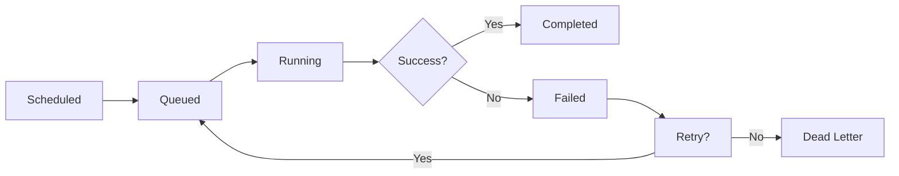
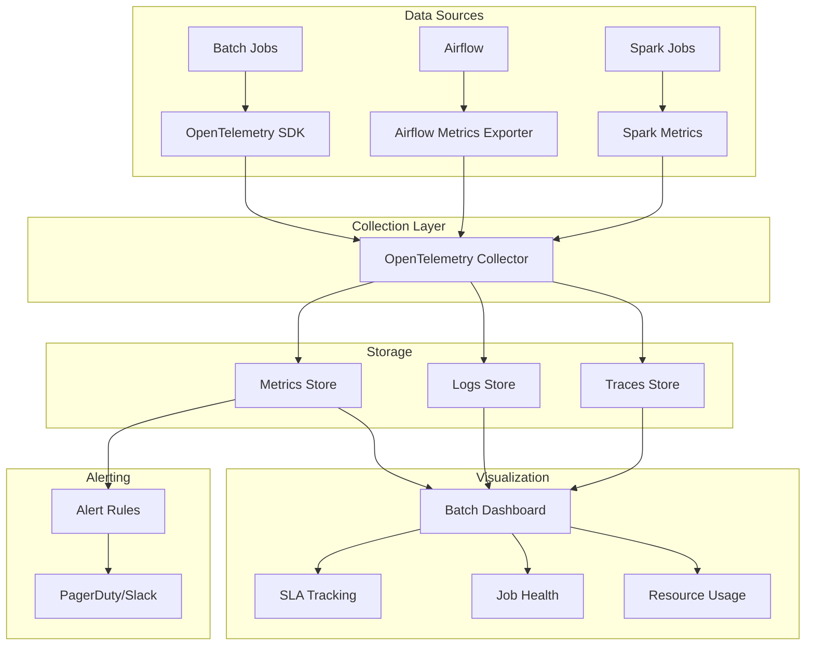
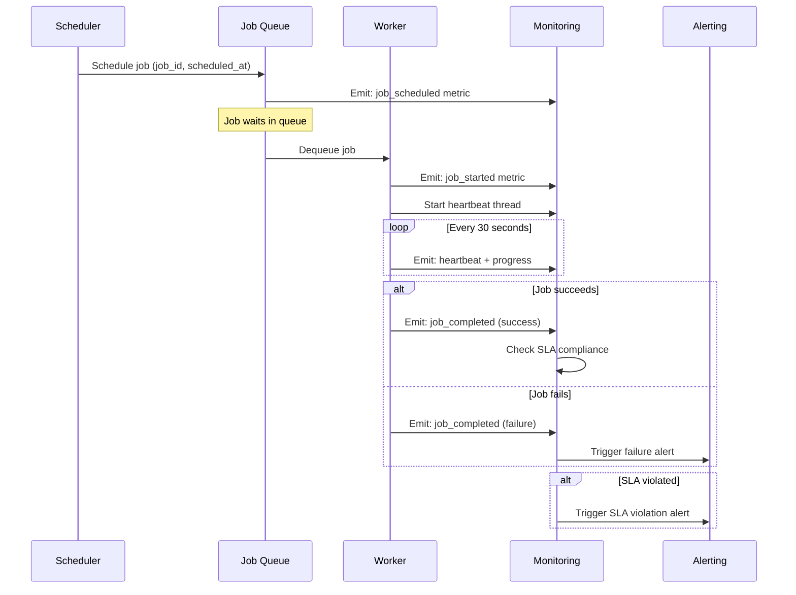

# How to Create Batch Monitoring

Author: [nawazdhandala](https://github.com/nawazdhandala)

Tags: Batch Processing, Monitoring, Observability, Airflow

Description: Learn to create batch monitoring for tracking job health, performance, and completion status.

---

Batch jobs are the silent workhorses of modern data infrastructure. ETL pipelines, nightly reports, data migrations, ML model training, and scheduled aggregations all run as batch processes. When they fail silently or miss SLAs, the downstream impact can be catastrophic: stale dashboards, broken analytics, compliance violations, and unhappy stakeholders.

Yet batch monitoring is often an afterthought. Teams instrument their APIs with precision but leave batch jobs in the dark. This post shows you how to build comprehensive batch monitoring from the ground up.

## Why Batch Monitoring Matters

Unlike request/response systems, batch jobs have unique failure modes:

- **Silent failures**: A job completes but processes zero records
- **SLA breaches**: The job runs but takes 4 hours instead of 30 minutes
- **Partial failures**: 95% of records succeed, 5% silently drop
- **Resource exhaustion**: Memory spikes cause OOM kills mid-processing
- **Dependency failures**: Upstream data arrives late or corrupted
- **Zombie jobs**: Processes hang indefinitely without progress

Traditional uptime monitoring misses all of these. You need purpose-built batch observability.

---

## Core Metrics for Batch Jobs

Every batch job should emit these fundamental metrics:

### 1. Duration Metrics

```python
# Python example using OpenTelemetry
import time
from opentelemetry import metrics

# Initialize meter for batch job metrics
meter = metrics.get_meter("batch_job_metrics")

# Create a histogram to track job duration distribution
job_duration_histogram = meter.create_histogram(
    name="batch_job_duration_seconds",
    description="Time taken for batch job to complete",
    unit="s"
)

# Create a gauge to track currently running jobs
running_jobs_gauge = meter.create_up_down_counter(
    name="batch_jobs_running",
    description="Number of currently running batch jobs"
)

def run_batch_job(job_name: str, job_type: str):
    """
    Execute a batch job with duration tracking.

    Args:
        job_name: Unique identifier for this job instance
        job_type: Category of job (etl, report, migration, etc.)
    """
    # Record that a new job has started
    running_jobs_gauge.add(1, {"job_name": job_name, "job_type": job_type})

    start_time = time.time()
    try:
        # Your batch processing logic goes here
        process_batch_data()
        status = "success"
    except Exception as e:
        status = "failure"
        raise
    finally:
        # Calculate total duration and record the metric
        duration = time.time() - start_time
        job_duration_histogram.record(
            duration,
            {
                "job_name": job_name,
                "job_type": job_type,
                "status": status
            }
        )
        # Decrement running jobs counter
        running_jobs_gauge.add(-1, {"job_name": job_name, "job_type": job_type})
```

### 2. Throughput Metrics

```python
# Track records processed per job run
records_processed_counter = meter.create_counter(
    name="batch_job_records_processed_total",
    description="Total number of records processed by batch jobs"
)

records_failed_counter = meter.create_counter(
    name="batch_job_records_failed_total",
    description="Total number of records that failed processing"
)

def process_records(records: list, job_name: str):
    """
    Process a batch of records with throughput tracking.

    Args:
        records: List of records to process
        job_name: Identifier for the batch job
    """
    success_count = 0
    failure_count = 0

    for record in records:
        try:
            # Process individual record
            transform_and_load(record)
            success_count += 1
        except Exception as e:
            # Log the failure but continue processing other records
            log_record_failure(record, e)
            failure_count += 1

    # Record throughput metrics with labels for filtering
    records_processed_counter.add(
        success_count,
        {"job_name": job_name, "status": "success"}
    )
    records_failed_counter.add(
        failure_count,
        {"job_name": job_name}
    )

    return success_count, failure_count
```

### 3. Error Rate Metrics

```python
# Track job-level success and failure rates
job_completion_counter = meter.create_counter(
    name="batch_job_completions_total",
    description="Total batch job completions by status"
)

def track_job_completion(job_name: str, job_type: str, success: bool, error_type: str = None):
    """
    Record job completion status for error rate calculation.

    Args:
        job_name: Identifier for the batch job
        job_type: Category of job
        success: Whether the job completed successfully
        error_type: Type of error if job failed (optional)
    """
    attributes = {
        "job_name": job_name,
        "job_type": job_type,
        "status": "success" if success else "failure"
    }

    # Add error type label for failed jobs to enable error categorization
    if not success and error_type:
        attributes["error_type"] = error_type

    job_completion_counter.add(1, attributes)
```

---

## Batch Job Lifecycle Monitoring

Understanding where a job spends its time requires lifecycle instrumentation:



Track time spent in each phase:

```python
from enum import Enum
from dataclasses import dataclass
from datetime import datetime
from typing import Optional

class JobPhase(Enum):
    """Enum representing the phases of a batch job lifecycle."""
    SCHEDULED = "scheduled"
    QUEUED = "queued"
    RUNNING = "running"
    COMPLETED = "completed"
    FAILED = "failed"
    RETRYING = "retrying"

@dataclass
class BatchJobMetrics:
    """
    Data class to track timing metrics for each phase of a batch job.

    Attributes:
        job_id: Unique identifier for this job run
        job_name: Name of the batch job
        scheduled_at: When the job was scheduled
        queued_at: When the job entered the queue
        started_at: When the job began execution
        completed_at: When the job finished (success or failure)
        current_phase: Current phase of the job
        retry_count: Number of retry attempts
    """
    job_id: str
    job_name: str
    scheduled_at: datetime
    queued_at: Optional[datetime] = None
    started_at: Optional[datetime] = None
    completed_at: Optional[datetime] = None
    current_phase: JobPhase = JobPhase.SCHEDULED
    retry_count: int = 0

    def queue_wait_time(self) -> Optional[float]:
        """Calculate seconds spent waiting in queue before execution."""
        if self.queued_at and self.started_at:
            return (self.started_at - self.queued_at).total_seconds()
        return None

    def execution_time(self) -> Optional[float]:
        """Calculate seconds spent in actual execution."""
        if self.started_at and self.completed_at:
            return (self.completed_at - self.started_at).total_seconds()
        return None

    def total_time(self) -> Optional[float]:
        """Calculate total time from scheduling to completion."""
        if self.scheduled_at and self.completed_at:
            return (self.completed_at - self.scheduled_at).total_seconds()
        return None

# Create histograms for each phase duration
queue_wait_histogram = meter.create_histogram(
    name="batch_job_queue_wait_seconds",
    description="Time jobs spend waiting in queue",
    unit="s"
)

execution_histogram = meter.create_histogram(
    name="batch_job_execution_seconds",
    description="Time jobs spend in actual execution",
    unit="s"
)

def emit_lifecycle_metrics(metrics: BatchJobMetrics):
    """
    Emit timing metrics for all phases of a completed job.

    Args:
        metrics: BatchJobMetrics instance with timing data
    """
    labels = {"job_name": metrics.job_name}

    # Record queue wait time if available
    queue_wait = metrics.queue_wait_time()
    if queue_wait is not None:
        queue_wait_histogram.record(queue_wait, labels)

    # Record execution time if available
    execution = metrics.execution_time()
    if execution is not None:
        execution_histogram.record(execution, labels)
```

---

## SLA Tracking and Alerting

Define and monitor SLAs for your batch jobs:

```python
from dataclasses import dataclass
from datetime import datetime, timedelta
from typing import Callable

@dataclass
class BatchJobSLA:
    """
    Service Level Agreement definition for a batch job.

    Attributes:
        job_name: Name of the batch job this SLA applies to
        max_duration_seconds: Maximum allowed execution time
        must_complete_by: Time of day the job must finish (e.g., "06:00")
        max_failure_rate: Maximum acceptable failure rate (0.0 to 1.0)
        min_records_processed: Minimum records that must be processed
    """
    job_name: str
    max_duration_seconds: int
    must_complete_by: str  # Time in HH:MM format
    max_failure_rate: float  # 0.0 to 1.0
    min_records_processed: int

# Define SLA thresholds for different job types
SLA_DEFINITIONS = {
    "daily_etl_pipeline": BatchJobSLA(
        job_name="daily_etl_pipeline",
        max_duration_seconds=3600,      # Must complete within 1 hour
        must_complete_by="06:00",        # Must finish before 6 AM
        max_failure_rate=0.01,           # Less than 1% failure rate
        min_records_processed=100000     # Must process at least 100k records
    ),
    "hourly_aggregation": BatchJobSLA(
        job_name="hourly_aggregation",
        max_duration_seconds=900,        # Must complete within 15 minutes
        must_complete_by=None,           # Runs hourly, no specific deadline
        max_failure_rate=0.05,           # Less than 5% failure rate
        min_records_processed=10000      # Must process at least 10k records
    ),
    "weekly_report": BatchJobSLA(
        job_name="weekly_report",
        max_duration_seconds=7200,       # Must complete within 2 hours
        must_complete_by="08:00",        # Must finish before 8 AM Monday
        max_failure_rate=0.0,            # Zero tolerance for failures
        min_records_processed=1000000    # Must process at least 1M records
    )
}

# Create metrics for SLA violations
sla_violation_counter = meter.create_counter(
    name="batch_job_sla_violations_total",
    description="Total SLA violations by type"
)

def check_sla_compliance(
    job_name: str,
    duration_seconds: float,
    completion_time: datetime,
    failure_rate: float,
    records_processed: int
) -> list[str]:
    """
    Check if a job run complied with its SLA and record violations.

    Args:
        job_name: Name of the completed job
        duration_seconds: How long the job took to run
        completion_time: When the job finished
        failure_rate: Percentage of records that failed (0.0 to 1.0)
        records_processed: Total records successfully processed

    Returns:
        List of SLA violation types that occurred
    """
    sla = SLA_DEFINITIONS.get(job_name)
    if not sla:
        return []  # No SLA defined for this job

    violations = []

    # Check duration SLA
    if duration_seconds > sla.max_duration_seconds:
        violations.append("duration_exceeded")
        sla_violation_counter.add(1, {
            "job_name": job_name,
            "violation_type": "duration_exceeded"
        })

    # Check completion time SLA
    if sla.must_complete_by:
        deadline_hour, deadline_minute = map(int, sla.must_complete_by.split(":"))
        deadline = completion_time.replace(
            hour=deadline_hour,
            minute=deadline_minute,
            second=0,
            microsecond=0
        )
        if completion_time > deadline:
            violations.append("deadline_missed")
            sla_violation_counter.add(1, {
                "job_name": job_name,
                "violation_type": "deadline_missed"
            })

    # Check failure rate SLA
    if failure_rate > sla.max_failure_rate:
        violations.append("failure_rate_exceeded")
        sla_violation_counter.add(1, {
            "job_name": job_name,
            "violation_type": "failure_rate_exceeded"
        })

    # Check minimum records SLA
    if records_processed < sla.min_records_processed:
        violations.append("insufficient_records")
        sla_violation_counter.add(1, {
            "job_name": job_name,
            "violation_type": "insufficient_records"
        })

    return violations
```

---

## Apache Airflow Integration

For teams using Apache Airflow, here is how to add comprehensive monitoring:

```python
from airflow import DAG
from airflow.operators.python import PythonOperator
from airflow.utils.state import State
from datetime import datetime, timedelta
import logging

# Configure structured logging for better observability
logger = logging.getLogger(__name__)

def create_monitored_dag(
    dag_id: str,
    schedule_interval: str,
    default_args: dict
) -> DAG:
    """
    Create an Airflow DAG with built-in monitoring callbacks.

    Args:
        dag_id: Unique identifier for the DAG
        schedule_interval: Cron expression or timedelta for scheduling
        default_args: Default arguments for all tasks in the DAG

    Returns:
        Configured DAG with monitoring callbacks
    """

    def on_task_success(context):
        """
        Callback executed when a task completes successfully.
        Emits metrics and logs for successful task execution.
        """
        task_instance = context['task_instance']
        dag_id = context['dag'].dag_id
        task_id = task_instance.task_id
        execution_date = context['execution_date']

        # Calculate task duration from Airflow's internal tracking
        duration = (
            task_instance.end_date - task_instance.start_date
        ).total_seconds()

        # Emit success metrics
        job_duration_histogram.record(duration, {
            "dag_id": dag_id,
            "task_id": task_id,
            "status": "success"
        })

        job_completion_counter.add(1, {
            "dag_id": dag_id,
            "task_id": task_id,
            "status": "success"
        })

        # Log structured success message for correlation
        logger.info(
            "Task completed successfully",
            extra={
                "dag_id": dag_id,
                "task_id": task_id,
                "execution_date": str(execution_date),
                "duration_seconds": duration
            }
        )

    def on_task_failure(context):
        """
        Callback executed when a task fails.
        Emits failure metrics and logs exception details.
        """
        task_instance = context['task_instance']
        dag_id = context['dag'].dag_id
        task_id = task_instance.task_id
        exception = context.get('exception')

        # Emit failure metrics with error categorization
        job_completion_counter.add(1, {
            "dag_id": dag_id,
            "task_id": task_id,
            "status": "failure",
            "error_type": type(exception).__name__ if exception else "unknown"
        })

        # Log structured failure message with exception details
        logger.error(
            "Task failed",
            extra={
                "dag_id": dag_id,
                "task_id": task_id,
                "exception_type": type(exception).__name__ if exception else None,
                "exception_message": str(exception) if exception else None
            }
        )

    def on_dag_success(context):
        """
        Callback executed when entire DAG run completes successfully.
        Calculates total DAG duration and checks SLA compliance.
        """
        dag_run = context['dag_run']
        dag_id = context['dag'].dag_id

        # Calculate total DAG duration
        duration = (dag_run.end_date - dag_run.start_date).total_seconds()

        # Emit DAG-level success metrics
        job_duration_histogram.record(duration, {
            "dag_id": dag_id,
            "level": "dag",
            "status": "success"
        })

        logger.info(
            "DAG completed successfully",
            extra={
                "dag_id": dag_id,
                "duration_seconds": duration,
                "execution_date": str(dag_run.execution_date)
            }
        )

    # Merge monitoring callbacks with user-provided defaults
    monitored_default_args = {
        **default_args,
        "on_success_callback": on_task_success,
        "on_failure_callback": on_task_failure,
    }

    # Create and return the monitored DAG
    dag = DAG(
        dag_id=dag_id,
        schedule_interval=schedule_interval,
        default_args=monitored_default_args,
        on_success_callback=on_dag_success,
        catchup=False,  # Disable backfill by default
        tags=['monitored']  # Tag for filtering in Airflow UI
    )

    return dag


# Example usage: Create a monitored ETL pipeline
default_args = {
    'owner': 'data-team',
    'depends_on_past': False,
    'email_on_failure': True,
    'email_on_retry': False,
    'retries': 3,
    'retry_delay': timedelta(minutes=5),
}

# Create the DAG with monitoring enabled
etl_dag = create_monitored_dag(
    dag_id='daily_customer_etl',
    schedule_interval='0 2 * * *',  # Run at 2 AM daily
    default_args=default_args
)

# Define tasks within the DAG context
with etl_dag:

    def extract_data(**context):
        """Extract data from source systems."""
        logger.info("Starting data extraction")
        # Extraction logic here
        records_extracted = 150000

        # Push metrics to XCom for downstream tasks
        context['task_instance'].xcom_push(
            key='records_extracted',
            value=records_extracted
        )
        return records_extracted

    def transform_data(**context):
        """Transform extracted data."""
        # Pull extraction count from upstream task
        records_extracted = context['task_instance'].xcom_pull(
            task_ids='extract',
            key='records_extracted'
        )

        logger.info(f"Transforming {records_extracted} records")
        # Transformation logic here
        records_transformed = records_extracted - 100  # Some records filtered

        context['task_instance'].xcom_push(
            key='records_transformed',
            value=records_transformed
        )
        return records_transformed

    def load_data(**context):
        """Load transformed data to destination."""
        records_transformed = context['task_instance'].xcom_pull(
            task_ids='transform',
            key='records_transformed'
        )

        logger.info(f"Loading {records_transformed} records")
        # Load logic here

        # Record final throughput metrics
        records_processed_counter.add(
            records_transformed,
            {"dag_id": "daily_customer_etl", "status": "success"}
        )

    # Create task operators
    extract_task = PythonOperator(
        task_id='extract',
        python_callable=extract_data,
        provide_context=True
    )

    transform_task = PythonOperator(
        task_id='transform',
        python_callable=transform_data,
        provide_context=True
    )

    load_task = PythonOperator(
        task_id='load',
        python_callable=load_data,
        provide_context=True
    )

    # Define task dependencies
    extract_task >> transform_task >> load_task
```

---

## Heartbeat Monitoring for Long-Running Jobs

For jobs that run for hours, implement heartbeat monitoring:

```python
import threading
import time
from datetime import datetime
from typing import Optional

class BatchJobHeartbeat:
    """
    Heartbeat monitor for long-running batch jobs.

    Emits periodic heartbeats during job execution to detect
    hung or zombie processes that stop making progress.

    Attributes:
        job_id: Unique identifier for this job run
        job_name: Name of the batch job
        interval_seconds: How often to emit heartbeats
        progress_callback: Optional callback to get current progress
    """

    def __init__(
        self,
        job_id: str,
        job_name: str,
        interval_seconds: int = 60,
        progress_callback: Optional[callable] = None
    ):
        self.job_id = job_id
        self.job_name = job_name
        self.interval_seconds = interval_seconds
        self.progress_callback = progress_callback
        self._stop_event = threading.Event()
        self._heartbeat_thread: Optional[threading.Thread] = None
        self._last_progress = 0
        self._records_processed = 0

    def start(self):
        """Start the heartbeat monitoring thread."""
        self._stop_event.clear()
        self._heartbeat_thread = threading.Thread(
            target=self._heartbeat_loop,
            daemon=True  # Thread dies when main process exits
        )
        self._heartbeat_thread.start()

    def stop(self):
        """Stop the heartbeat monitoring thread."""
        self._stop_event.set()
        if self._heartbeat_thread:
            self._heartbeat_thread.join(timeout=5)

    def update_progress(self, records_processed: int):
        """
        Update the current progress for heartbeat reporting.

        Args:
            records_processed: Current count of processed records
        """
        self._records_processed = records_processed

    def _heartbeat_loop(self):
        """
        Internal loop that emits periodic heartbeat metrics.
        Runs in a separate thread until stop() is called.
        """
        while not self._stop_event.is_set():
            # Get current progress
            current_progress = self._records_processed
            if self.progress_callback:
                current_progress = self.progress_callback()

            # Calculate progress rate since last heartbeat
            progress_delta = current_progress - self._last_progress
            self._last_progress = current_progress

            # Emit heartbeat metric
            heartbeat_gauge.set(
                1,  # Heartbeat signal
                {
                    "job_id": self.job_id,
                    "job_name": self.job_name
                }
            )

            # Emit progress rate metric
            progress_rate_gauge.set(
                progress_delta / self.interval_seconds,
                {
                    "job_id": self.job_id,
                    "job_name": self.job_name
                }
            )

            # Log heartbeat for debugging
            logger.debug(
                "Job heartbeat",
                extra={
                    "job_id": self.job_id,
                    "job_name": self.job_name,
                    "records_processed": current_progress,
                    "progress_rate": progress_delta / self.interval_seconds
                }
            )

            # Wait for next interval or stop signal
            self._stop_event.wait(timeout=self.interval_seconds)

# Create heartbeat and progress rate gauges
heartbeat_gauge = meter.create_gauge(
    name="batch_job_heartbeat",
    description="Heartbeat signal from running batch jobs"
)

progress_rate_gauge = meter.create_gauge(
    name="batch_job_progress_rate",
    description="Records processed per second"
)


def run_long_batch_job(job_id: str, job_name: str, data_source):
    """
    Execute a long-running batch job with heartbeat monitoring.

    Args:
        job_id: Unique identifier for this job run
        job_name: Name of the batch job
        data_source: Iterator or generator yielding records to process
    """
    heartbeat = BatchJobHeartbeat(
        job_id=job_id,
        job_name=job_name,
        interval_seconds=30  # Emit heartbeat every 30 seconds
    )

    try:
        heartbeat.start()
        records_processed = 0

        for record in data_source:
            # Process the record
            process_record(record)
            records_processed += 1

            # Update progress for heartbeat reporting
            heartbeat.update_progress(records_processed)

    finally:
        # Always stop heartbeat thread on completion or failure
        heartbeat.stop()
```

---

## Building a Batch Monitoring Dashboard

Here is the architecture for a comprehensive batch monitoring dashboard:



### Key Dashboard Panels

```yaml
# Dashboard configuration for batch job monitoring
# Use this as a template for Grafana or similar tools

dashboard:
  title: "Batch Job Monitoring"

  panels:
    # Panel 1: Job Success Rate Over Time
    - title: "Job Success Rate"
      type: "timeseries"
      query: |
        # Calculate success rate as percentage
        sum(rate(batch_job_completions_total{status="success"}[5m]))
        /
        sum(rate(batch_job_completions_total[5m]))
        * 100
      thresholds:
        - value: 95
          color: green
        - value: 90
          color: yellow
        - value: 0
          color: red

    # Panel 2: Job Duration Percentiles
    - title: "Job Duration (p50, p95, p99)"
      type: "timeseries"
      queries:
        - label: "p50"
          query: |
            histogram_quantile(0.50,
              sum(rate(batch_job_duration_seconds_bucket[5m]))
              by (le, job_name)
            )
        - label: "p95"
          query: |
            histogram_quantile(0.95,
              sum(rate(batch_job_duration_seconds_bucket[5m]))
              by (le, job_name)
            )
        - label: "p99"
          query: |
            histogram_quantile(0.99,
              sum(rate(batch_job_duration_seconds_bucket[5m]))
              by (le, job_name)
            )

    # Panel 3: Records Processed Throughput
    - title: "Records Processed per Minute"
      type: "timeseries"
      query: |
        sum(rate(batch_job_records_processed_total[1m]))
        by (job_name) * 60

    # Panel 4: Currently Running Jobs
    - title: "Running Jobs"
      type: "stat"
      query: |
        sum(batch_jobs_running) by (job_name)

    # Panel 5: SLA Violations
    - title: "SLA Violations (24h)"
      type: "table"
      query: |
        sum(increase(batch_job_sla_violations_total[24h]))
        by (job_name, violation_type)

    # Panel 6: Queue Wait Time
    - title: "Queue Wait Time Distribution"
      type: "heatmap"
      query: |
        sum(rate(batch_job_queue_wait_seconds_bucket[5m]))
        by (le, job_name)

    # Panel 7: Job Failure Breakdown
    - title: "Failures by Error Type"
      type: "piechart"
      query: |
        sum(increase(batch_job_completions_total{status="failure"}[24h]))
        by (error_type)

    # Panel 8: Heartbeat Status
    - title: "Job Heartbeat Status"
      type: "state-timeline"
      query: |
        batch_job_heartbeat
      description: "Shows which jobs are actively sending heartbeats"
```

---

## Alert Rules for Batch Monitoring

Configure alerts for common failure scenarios:

```yaml
# Alerting rules for batch job monitoring
# Compatible with Prometheus Alertmanager or similar systems

groups:
  - name: batch_job_alerts
    rules:
      # Alert when job duration exceeds SLA threshold
      - alert: BatchJobDurationSLABreach
        expr: |
          histogram_quantile(0.95,
            sum(rate(batch_job_duration_seconds_bucket[15m]))
            by (le, job_name)
          ) > 3600
        for: 5m
        labels:
          severity: warning
        annotations:
          summary: "Batch job {{ $labels.job_name }} exceeding duration SLA"
          description: |
            The 95th percentile duration for {{ $labels.job_name }}
            is {{ $value | humanizeDuration }}, exceeding the 1 hour SLA.
          runbook_url: "https://wiki.example.com/runbooks/batch-job-slow"

      # Alert when job failure rate is too high
      - alert: BatchJobHighFailureRate
        expr: |
          (
            sum(rate(batch_job_completions_total{status="failure"}[1h]))
            by (job_name)
          )
          /
          (
            sum(rate(batch_job_completions_total[1h]))
            by (job_name)
          ) > 0.05
        for: 10m
        labels:
          severity: critical
        annotations:
          summary: "High failure rate for {{ $labels.job_name }}"
          description: |
            Failure rate is {{ $value | humanizePercentage }}
            over the last hour, exceeding 5% threshold.
          runbook_url: "https://wiki.example.com/runbooks/batch-job-failures"

      # Alert when job stops sending heartbeats
      - alert: BatchJobHeartbeatMissing
        expr: |
          absent_over_time(batch_job_heartbeat{job_name=~".+"}[5m])
        for: 5m
        labels:
          severity: critical
        annotations:
          summary: "Batch job heartbeat missing"
          description: |
            No heartbeat received from batch job in the last 5 minutes.
            The job may be hung or crashed.
          runbook_url: "https://wiki.example.com/runbooks/batch-job-hung"

      # Alert when no records are being processed
      - alert: BatchJobZeroThroughput
        expr: |
          sum(rate(batch_job_records_processed_total[15m]))
          by (job_name) == 0
          and
          batch_jobs_running > 0
        for: 10m
        labels:
          severity: warning
        annotations:
          summary: "Batch job {{ $labels.job_name }} has zero throughput"
          description: |
            Job is running but has not processed any records in 15 minutes.
            This may indicate a hung job or upstream data issue.

      # Alert when job has not run recently
      - alert: BatchJobNotRunRecently
        expr: |
          time() - max(batch_job_last_success_timestamp)
          by (job_name) > 86400
        for: 30m
        labels:
          severity: warning
        annotations:
          summary: "Batch job {{ $labels.job_name }} has not run successfully in 24h"
          description: |
            Last successful run was {{ $value | humanizeDuration }} ago.
            Check if the job is scheduled correctly.

      # Alert on SLA violations
      - alert: BatchJobSLAViolation
        expr: |
          increase(batch_job_sla_violations_total[1h]) > 0
        for: 0m
        labels:
          severity: critical
        annotations:
          summary: "SLA violation for {{ $labels.job_name }}"
          description: |
            SLA violation type: {{ $labels.violation_type }}
            This requires immediate attention.
```

---

## Tracing Batch Jobs with OpenTelemetry

Add distributed tracing to understand job execution flow:

```python
from opentelemetry import trace
from opentelemetry.trace import Status, StatusCode
from opentelemetry.sdk.trace import TracerProvider
from opentelemetry.sdk.trace.export import BatchSpanProcessor
from opentelemetry.exporter.otlp.proto.grpc.trace_exporter import OTLPSpanExporter
import contextlib

# Initialize the tracer provider with OTLP exporter
provider = TracerProvider()
processor = BatchSpanProcessor(
    OTLPSpanExporter(endpoint="http://otel-collector:4317")
)
provider.add_span_processor(processor)
trace.set_tracer_provider(provider)

# Create a tracer for batch job operations
tracer = trace.get_tracer("batch_job_tracer")


@contextlib.contextmanager
def traced_batch_job(job_name: str, job_id: str, metadata: dict = None):
    """
    Context manager that wraps a batch job execution in a trace span.

    Args:
        job_name: Name of the batch job
        job_id: Unique identifier for this job run
        metadata: Optional metadata to attach to the span

    Yields:
        The active span for adding child spans and events

    Example:
        with traced_batch_job("daily_etl", "run-123") as span:
            extract_data()
            span.add_event("Extraction complete", {"records": 10000})
            transform_data()
    """
    # Create the root span for this batch job
    with tracer.start_as_current_span(
        name=f"batch_job.{job_name}",
        kind=trace.SpanKind.INTERNAL
    ) as span:
        # Set standard attributes for filtering and grouping
        span.set_attribute("batch.job.name", job_name)
        span.set_attribute("batch.job.id", job_id)
        span.set_attribute("batch.job.type", "batch")

        # Add any custom metadata as attributes
        if metadata:
            for key, value in metadata.items():
                span.set_attribute(f"batch.job.{key}", value)

        try:
            yield span
            # Mark span as successful if no exception raised
            span.set_status(Status(StatusCode.OK))
        except Exception as e:
            # Record exception details in the span
            span.set_status(Status(StatusCode.ERROR, str(e)))
            span.record_exception(e)
            raise


def traced_batch_step(step_name: str):
    """
    Decorator to create a child span for each step in a batch job.

    Args:
        step_name: Name of the processing step

    Example:
        @traced_batch_step("extract")
        def extract_data():
            ...
    """
    def decorator(func):
        def wrapper(*args, **kwargs):
            with tracer.start_as_current_span(
                name=f"batch_step.{step_name}",
                kind=trace.SpanKind.INTERNAL
            ) as span:
                span.set_attribute("batch.step.name", step_name)
                try:
                    result = func(*args, **kwargs)
                    span.set_status(Status(StatusCode.OK))
                    return result
                except Exception as e:
                    span.set_status(Status(StatusCode.ERROR, str(e)))
                    span.record_exception(e)
                    raise
        return wrapper
    return decorator


# Example: Fully traced ETL pipeline
@traced_batch_step("extract")
def extract_from_source(source_config: dict) -> list:
    """Extract records from the configured source."""
    span = trace.get_current_span()

    # Simulate extraction
    records = fetch_records(source_config)

    # Add extraction metrics to span
    span.set_attribute("batch.records.extracted", len(records))
    span.add_event("Extraction complete", {
        "source": source_config.get("name"),
        "record_count": len(records)
    })

    return records


@traced_batch_step("transform")
def transform_records(records: list) -> list:
    """Apply transformations to extracted records."""
    span = trace.get_current_span()

    transformed = []
    errors = 0

    for record in records:
        try:
            transformed.append(apply_transformations(record))
        except Exception as e:
            errors += 1
            # Log individual record failures as span events
            span.add_event("Transform error", {
                "record_id": record.get("id"),
                "error": str(e)
            })

    span.set_attribute("batch.records.transformed", len(transformed))
    span.set_attribute("batch.records.transform_errors", errors)

    return transformed


@traced_batch_step("load")
def load_to_destination(records: list, destination_config: dict) -> int:
    """Load transformed records to the destination."""
    span = trace.get_current_span()

    loaded_count = bulk_insert(records, destination_config)

    span.set_attribute("batch.records.loaded", loaded_count)
    span.add_event("Load complete", {
        "destination": destination_config.get("name"),
        "record_count": loaded_count
    })

    return loaded_count


def run_etl_pipeline(job_id: str, config: dict):
    """
    Execute the complete ETL pipeline with full tracing.

    Args:
        job_id: Unique identifier for this pipeline run
        config: Pipeline configuration including source and destination
    """
    with traced_batch_job(
        job_name="customer_etl_pipeline",
        job_id=job_id,
        metadata={"environment": config.get("environment")}
    ) as root_span:

        # Each step creates a child span automatically
        raw_records = extract_from_source(config["source"])
        root_span.add_event("Extract phase complete")

        transformed_records = transform_records(raw_records)
        root_span.add_event("Transform phase complete")

        loaded_count = load_to_destination(
            transformed_records,
            config["destination"]
        )
        root_span.add_event("Load phase complete")

        # Record final metrics on the root span
        root_span.set_attribute("batch.total_records_processed", loaded_count)
```

---

## Batch Job Flow Visualization



---

## Integrating with OneUptime

OneUptime provides native support for batch job monitoring through its OpenTelemetry-compatible ingestion:

```python
from opentelemetry.exporter.otlp.proto.grpc.trace_exporter import OTLPSpanExporter
from opentelemetry.exporter.otlp.proto.grpc.metric_exporter import OTLPMetricExporter
from opentelemetry.sdk.trace.export import BatchSpanProcessor
from opentelemetry.sdk.metrics.export import PeriodicExportingMetricReader

def configure_oneuptime_export(
    oneuptime_endpoint: str,
    service_name: str
):
    """
    Configure OpenTelemetry to export batch job telemetry to OneUptime.

    Args:
        oneuptime_endpoint: OneUptime OTLP endpoint URL
        service_name: Name of your batch processing service

    Example:
        configure_oneuptime_export(
            oneuptime_endpoint="https://otlp.oneuptime.com:4317",
            service_name="batch-etl-service"
        )
    """
    from opentelemetry.sdk.resources import Resource
    from opentelemetry.sdk.trace import TracerProvider
    from opentelemetry.sdk.metrics import MeterProvider
    from opentelemetry import trace, metrics

    # Define resource attributes for service identification
    resource = Resource.create({
        "service.name": service_name,
        "service.namespace": "batch-processing",
        "deployment.environment": os.environ.get("ENVIRONMENT", "production")
    })

    # Configure trace export to OneUptime
    trace_exporter = OTLPSpanExporter(
        endpoint=oneuptime_endpoint,
        insecure=False  # Use TLS in production
    )
    trace_provider = TracerProvider(resource=resource)
    trace_provider.add_span_processor(BatchSpanProcessor(trace_exporter))
    trace.set_tracer_provider(trace_provider)

    # Configure metrics export to OneUptime
    metric_exporter = OTLPMetricExporter(
        endpoint=oneuptime_endpoint,
        insecure=False
    )
    metric_reader = PeriodicExportingMetricReader(
        metric_exporter,
        export_interval_millis=60000  # Export every 60 seconds
    )
    metric_provider = MeterProvider(
        resource=resource,
        metric_readers=[metric_reader]
    )
    metrics.set_meter_provider(metric_provider)

    print(f"Configured OneUptime export to {oneuptime_endpoint}")
```

---

## Best Practices Summary

1. **Instrument early**: Add monitoring before batch jobs hit production
2. **Track the full lifecycle**: Queue time, execution time, and completion status
3. **Use heartbeats**: Detect hung jobs before SLAs are breached
4. **Define SLAs explicitly**: Duration, completion time, and throughput minimums
5. **Correlate signals**: Link traces, metrics, and logs with job IDs
6. **Alert on deviations**: Not just failures, but slowdowns and throughput drops
7. **Visualize trends**: Duration percentiles over time reveal degradation early
8. **Test monitoring**: Run chaos experiments to verify alerts fire correctly

---

## Quick Start Checklist

- [ ] Add OpenTelemetry SDK to your batch job code
- [ ] Instrument duration, throughput, and error metrics
- [ ] Implement heartbeat monitoring for long-running jobs
- [ ] Define SLAs for critical batch jobs
- [ ] Configure alerting rules for failures and SLA breaches
- [ ] Build a dashboard with key batch monitoring panels
- [ ] Add distributed tracing to understand job execution flow
- [ ] Export telemetry to OneUptime or your preferred backend
- [ ] Document runbooks for common batch job issues
- [ ] Schedule regular review of batch job performance trends

---

## Related Reading

- [Logs, Metrics, and Traces: The Three Pillars of Observability](https://oneuptime.com/blog/post/2025-08-20-three-pillars-of-observability-logs-metrics-traces/view)
- [Monitoring Backup Jobs with OneUptime](https://oneuptime.com/blog/post/2025-09-25-monitoring-backup-jobs-with-oneuptime/view)
- [How to Reduce Noise in OpenTelemetry](https://oneuptime.com/blog/post/2025-08-25-how-to-reduce-noise-in-opentelemetry/view)
- [What is OpenTelemetry Collector and Why Use One](https://oneuptime.com/blog/post/2025-09-18-what-is-opentelemetry-collector-and-why-use-one/view)

---

Batch jobs deserve the same monitoring attention as your user-facing APIs. With the patterns in this guide, you can catch failures before users notice, meet SLAs consistently, and debug issues in minutes instead of hours.

Start with the basics (duration, throughput, errors), add heartbeats for long-running jobs, and build up to full distributed tracing. Your on-call engineers will thank you.
