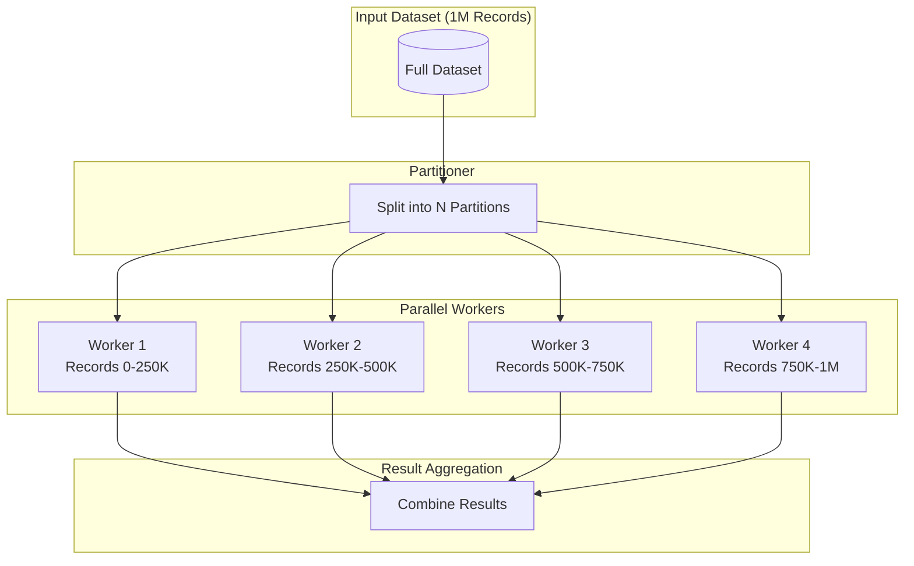
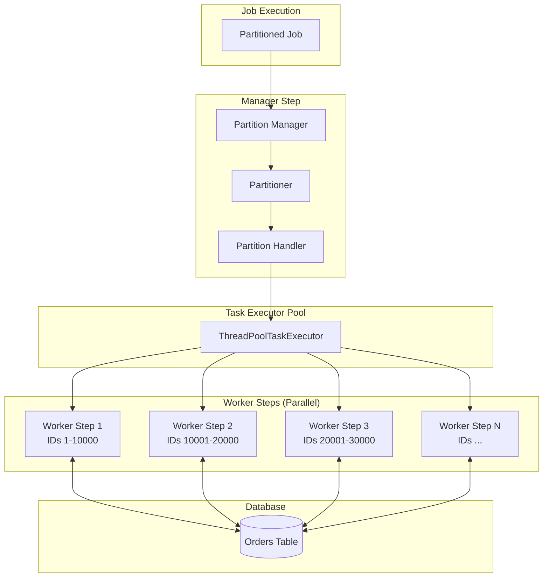
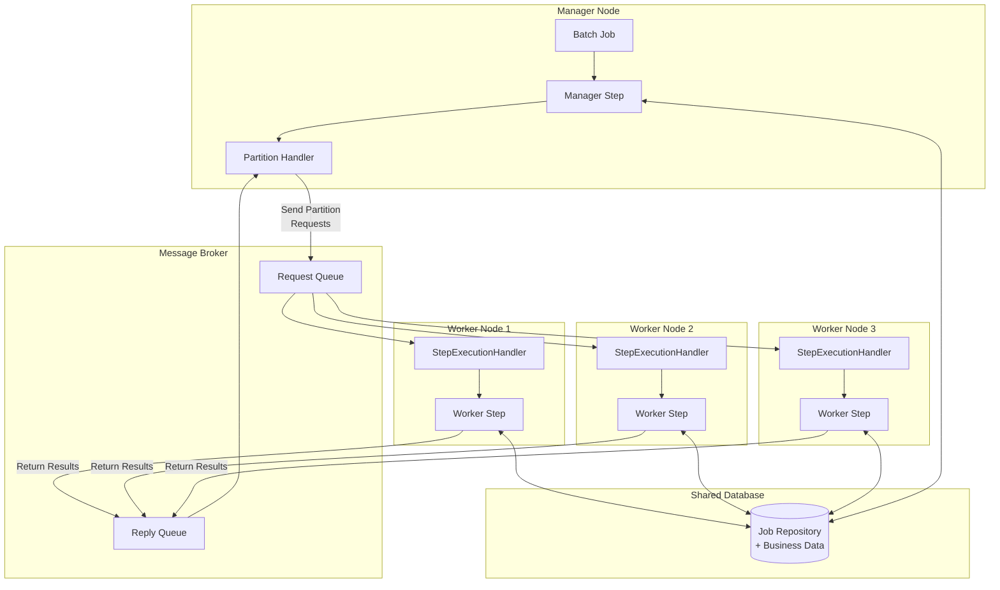

# How to Implement Partitioned Processing

Author: [nawazdhandala](https://github.com/nawazdhandala)

Tags: Batch Processing, Partitioning, Parallel Processing, Spring Batch

Description: Learn to implement partitioned processing for parallel batch execution across multiple workers.

---

Batch processing often involves handling millions of records. Processing them sequentially takes hours or days. Partitioned processing splits the workload into independent chunks that run in parallel across multiple workers, dramatically reducing total execution time.

This guide covers partitioning strategies, implementation patterns, worker coordination, and scalability considerations with practical code examples.

## What is Partitioned Processing?

Partitioned processing divides a large dataset into smaller, independent partitions. Each partition is processed by a separate worker thread, process, or node. The results are aggregated after all partitions complete.



## When to Use Partitioned Processing

| Scenario | Use Partitioning? | Reason |
|----------|-------------------|--------|
| Processing 10M database records | Yes | Sequential would take hours |
| Importing files from multiple sources | Yes | Files are naturally independent |
| ETL pipeline with independent transforms | Yes | No cross-record dependencies |
| Sequential report generation | No | Records depend on previous calculations |
| Processing 1000 records | Maybe | Overhead may exceed benefit |
| Records with cross-partition dependencies | No | Requires coordination between partitions |

## Partitioning Strategies

### Range-Based Partitioning

Divide data by ID ranges or date ranges. Works well when data is evenly distributed across the range.

```java
/**
 * RangePartitioner divides a dataset into partitions based on ID ranges.
 * Each partition processes a contiguous range of IDs (e.g., IDs 1-1000, 1001-2000).
 *
 * Best for: Datasets with sequential IDs and relatively even distribution.
 * Caution: Uneven ID distribution leads to partition skew.
 */
public class RangePartitioner implements Partitioner {

    private final JdbcTemplate jdbcTemplate;

    public RangePartitioner(JdbcTemplate jdbcTemplate) {
        this.jdbcTemplate = jdbcTemplate;
    }

    @Override
    public Map<String, ExecutionContext> partition(int gridSize) {
        Map<String, ExecutionContext> partitions = new HashMap<>();

        // Query the min and max IDs to determine the full range
        Long minId = jdbcTemplate.queryForObject(
            "SELECT MIN(id) FROM orders WHERE status = 'PENDING'",
            Long.class
        );
        Long maxId = jdbcTemplate.queryForObject(
            "SELECT MAX(id) FROM orders WHERE status = 'PENDING'",
            Long.class
        );

        // Handle edge case: no records to process
        if (minId == null || maxId == null) {
            return partitions;
        }

        // Calculate how many records each partition should handle
        long totalRange = maxId - minId + 1;
        long rangePerPartition = (long) Math.ceil((double) totalRange / gridSize);

        // Create partition execution contexts with non-overlapping ID ranges
        for (int i = 0; i < gridSize; i++) {
            ExecutionContext context = new ExecutionContext();

            // Calculate start and end IDs for this partition
            long startId = minId + (i * rangePerPartition);
            long endId = Math.min(startId + rangePerPartition - 1, maxId);

            // Store partition boundaries in the execution context
            // Workers will use these to query only their assigned records
            context.putLong("startId", startId);
            context.putLong("endId", endId);
            context.putInt("partitionNumber", i);

            partitions.put("partition" + i, context);
        }

        return partitions;
    }
}
```

### Hash-Based Partitioning

Distribute records evenly using a hash function. Guarantees balanced partitions regardless of data distribution.

```java
/**
 * HashPartitioner assigns records to partitions using modulo hashing.
 * Records with ID % gridSize = N go to partition N.
 *
 * Best for: Datasets with non-sequential or unevenly distributed IDs.
 * Advantage: Guarantees even distribution across partitions.
 */
public class HashPartitioner implements Partitioner {

    @Override
    public Map<String, ExecutionContext> partition(int gridSize) {
        Map<String, ExecutionContext> partitions = new HashMap<>();

        // Each partition will process records where: record_id % gridSize = partitionIndex
        // This ensures perfect distribution regardless of ID patterns
        for (int i = 0; i < gridSize; i++) {
            ExecutionContext context = new ExecutionContext();

            // Store the modulo value this partition handles
            // Worker query: WHERE id % :gridSize = :moduloValue
            context.putInt("moduloValue", i);
            context.putInt("gridSize", gridSize);
            context.putInt("partitionNumber", i);

            partitions.put("partition" + i, context);
        }

        return partitions;
    }
}

/**
 * ItemReader that fetches records for a specific hash partition.
 * Uses modulo arithmetic in the SQL query for server-side filtering.
 */
public class HashPartitionedItemReader implements ItemReader<Order> {

    private final JdbcTemplate jdbcTemplate;
    private final int moduloValue;
    private final int gridSize;
    private Iterator<Order> iterator;

    public HashPartitionedItemReader(JdbcTemplate jdbcTemplate,
                                     int moduloValue,
                                     int gridSize) {
        this.jdbcTemplate = jdbcTemplate;
        this.moduloValue = moduloValue;
        this.gridSize = gridSize;
    }

    @Override
    public Order read() {
        // Lazy initialization: fetch all records for this partition on first read
        if (iterator == null) {
            // The modulo operation happens in the database for efficiency
            // Only records assigned to this partition are fetched
            List<Order> orders = jdbcTemplate.query(
                "SELECT * FROM orders WHERE status = 'PENDING' AND MOD(id, ?) = ?",
                new OrderRowMapper(),
                gridSize,
                moduloValue
            );
            iterator = orders.iterator();
        }

        // Return next record or null when partition is exhausted
        return iterator.hasNext() ? iterator.next() : null;
    }
}
```

### Key-Based Partitioning

Group related records together to maintain data locality. Essential when processing requires related records to be in the same partition.

```java
/**
 * KeyPartitioner groups records by a business key (e.g., customer_id).
 * All records for a given customer are processed by the same worker.
 *
 * Best for: Processing that requires all related records together,
 * such as calculating per-customer totals or applying customer-specific rules.
 */
public class KeyPartitioner implements Partitioner {

    private final JdbcTemplate jdbcTemplate;

    public KeyPartitioner(JdbcTemplate jdbcTemplate) {
        this.jdbcTemplate = jdbcTemplate;
    }

    @Override
    public Map<String, ExecutionContext> partition(int gridSize) {
        Map<String, ExecutionContext> partitions = new HashMap<>();

        // Get all distinct customer IDs that have pending orders
        List<Long> customerIds = jdbcTemplate.queryForList(
            "SELECT DISTINCT customer_id FROM orders WHERE status = 'PENDING'",
            Long.class
        );

        // Distribute customers across partitions using round-robin
        // This ensures each partition gets roughly the same number of customers
        Map<Integer, List<Long>> customersByPartition = new HashMap<>();
        for (int i = 0; i < gridSize; i++) {
            customersByPartition.put(i, new ArrayList<>());
        }

        for (int i = 0; i < customerIds.size(); i++) {
            // Assign customer to partition using modulo
            int partitionIndex = i % gridSize;
            customersByPartition.get(partitionIndex).add(customerIds.get(i));
        }

        // Create execution contexts with the list of customer IDs for each partition
        for (int i = 0; i < gridSize; i++) {
            ExecutionContext context = new ExecutionContext();

            // Convert customer list to comma-separated string for SQL IN clause
            String customerIdList = customersByPartition.get(i).stream()
                .map(String::valueOf)
                .collect(Collectors.joining(","));

            context.putString("customerIds", customerIdList);
            context.putInt("partitionNumber", i);

            partitions.put("partition" + i, context);
        }

        return partitions;
    }
}
```

## Spring Batch Partitioned Processing

Spring Batch provides built-in support for partitioned processing with the `PartitionHandler` and `Partitioner` interfaces.

### Basic Partitioned Step Configuration

```java
/**
 * Spring Batch configuration for partitioned processing.
 * Demonstrates local partitioning with a TaskExecutor-based PartitionHandler.
 */
@Configuration
@EnableBatchProcessing
public class PartitionedJobConfig {

    @Autowired
    private JobBuilderFactory jobBuilderFactory;

    @Autowired
    private StepBuilderFactory stepBuilderFactory;

    @Autowired
    private DataSource dataSource;

    /**
     * Main job definition with a single partitioned step.
     */
    @Bean
    public Job partitionedJob() {
        return jobBuilderFactory.get("partitionedOrderProcessingJob")
            .start(partitionedStep())
            .build();
    }

    /**
     * Manager step that orchestrates partition distribution.
     * The manager creates partitions and delegates to worker steps.
     */
    @Bean
    public Step partitionedStep() {
        return stepBuilderFactory.get("partitionedStep")
            .partitioner("workerStep", partitioner())  // Define how to split work
            .partitionHandler(partitionHandler())       // Define how to execute partitions
            .build();
    }

    /**
     * Partitioner that divides the dataset by ID ranges.
     */
    @Bean
    public Partitioner partitioner() {
        return new RangePartitioner(new JdbcTemplate(dataSource));
    }

    /**
     * PartitionHandler executes worker steps in parallel using a TaskExecutor.
     * gridSize determines the number of partitions (and maximum parallelism).
     */
    @Bean
    public PartitionHandler partitionHandler() {
        TaskExecutorPartitionHandler handler = new TaskExecutorPartitionHandler();

        // Reference to the step that processes each partition
        handler.setStep(workerStep());

        // Thread pool for parallel execution
        handler.setTaskExecutor(taskExecutor());

        // Number of partitions to create (adjust based on data size and CPU cores)
        handler.setGridSize(8);

        return handler;
    }

    /**
     * Thread pool for executing partition workers.
     * Core pool size should match gridSize for full parallelism.
     */
    @Bean
    public TaskExecutor taskExecutor() {
        ThreadPoolTaskExecutor executor = new ThreadPoolTaskExecutor();
        executor.setCorePoolSize(8);       // Matches gridSize for full parallelism
        executor.setMaxPoolSize(8);        // No dynamic scaling needed
        executor.setQueueCapacity(0);      // Reject if all threads busy
        executor.setThreadNamePrefix("partition-worker-");
        executor.initialize();
        return executor;
    }

    /**
     * Worker step that processes a single partition.
     * Each worker reads, processes, and writes its assigned records.
     */
    @Bean
    public Step workerStep() {
        return stepBuilderFactory.get("workerStep")
            .<Order, ProcessedOrder>chunk(100)  // Process 100 records per transaction
            .reader(partitionedReader(null, null))
            .processor(orderProcessor())
            .writer(orderWriter())
            .build();
    }

    /**
     * ItemReader scoped to step execution context.
     * Each partition gets different startId/endId values from the partitioner.
     *
     * @StepScope ensures a new reader instance per partition with injected values.
     */
    @Bean
    @StepScope
    public JdbcPagingItemReader<Order> partitionedReader(
            @Value("#{stepExecutionContext['startId']}") Long startId,
            @Value("#{stepExecutionContext['endId']}") Long endId) {

        JdbcPagingItemReader<Order> reader = new JdbcPagingItemReader<>();
        reader.setDataSource(dataSource);
        reader.setPageSize(100);
        reader.setRowMapper(new OrderRowMapper());

        // Configure pagination query with partition boundaries
        SqlPagingQueryProviderFactoryBean queryProvider = new SqlPagingQueryProviderFactoryBean();
        queryProvider.setDataSource(dataSource);
        queryProvider.setSelectClause("SELECT *");
        queryProvider.setFromClause("FROM orders");

        // WHERE clause filters to only this partition's ID range
        queryProvider.setWhereClause("WHERE status = 'PENDING' AND id >= :startId AND id <= :endId");
        queryProvider.setSortKey("id");

        try {
            reader.setQueryProvider(queryProvider.getObject());
        } catch (Exception e) {
            throw new RuntimeException("Failed to create query provider", e);
        }

        // Inject partition boundaries as query parameters
        Map<String, Object> params = new HashMap<>();
        params.put("startId", startId);
        params.put("endId", endId);
        reader.setParameterValues(params);

        return reader;
    }

    @Bean
    public ItemProcessor<Order, ProcessedOrder> orderProcessor() {
        return order -> {
            // Perform business logic transformation
            ProcessedOrder processed = new ProcessedOrder();
            processed.setOrderId(order.getId());
            processed.setTotalWithTax(order.getTotal().multiply(new BigDecimal("1.08")));
            processed.setProcessedAt(LocalDateTime.now());
            return processed;
        };
    }

    @Bean
    public JdbcBatchItemWriter<ProcessedOrder> orderWriter() {
        JdbcBatchItemWriter<ProcessedOrder> writer = new JdbcBatchItemWriter<>();
        writer.setDataSource(dataSource);
        writer.setSql("INSERT INTO processed_orders (order_id, total_with_tax, processed_at) " +
                      "VALUES (:orderId, :totalWithTax, :processedAt)");
        writer.setItemSqlParameterSourceProvider(new BeanPropertyItemSqlParameterSourceProvider<>());
        return writer;
    }
}
```

### Architecture Diagram



## Remote Partitioning for Distributed Processing

For processing that exceeds a single machine's capacity, Spring Batch supports remote partitioning where workers run on separate nodes.

```java
/**
 * Remote partitioning configuration using Spring Integration messaging.
 * The manager sends partition metadata to workers via a message channel.
 * Workers on remote nodes process partitions and send results back.
 */
@Configuration
public class RemotePartitioningConfig {

    /**
     * Manager step sends partition execution contexts to remote workers.
     * Uses MessageChannelPartitionHandler for message-based communication.
     */
    @Bean
    public Step managerStep() {
        return stepBuilderFactory.get("managerStep")
            .partitioner("workerStep", partitioner())
            .partitionHandler(messageChannelPartitionHandler())
            .build();
    }

    /**
     * MessageChannelPartitionHandler sends StepExecution requests to workers
     * and aggregates results when all partitions complete.
     */
    @Bean
    public PartitionHandler messageChannelPartitionHandler() {
        MessageChannelPartitionHandler handler = new MessageChannelPartitionHandler();

        // Channel for sending partition requests to workers
        handler.setStepName("workerStep");
        handler.setGridSize(16);  // 16 partitions distributed across remote workers

        // Messaging gateway for request/reply pattern
        handler.setMessagingOperations(messagingTemplate());

        return handler;
    }

    /**
     * Messaging template configured for partition request/reply.
     */
    @Bean
    public MessagingTemplate messagingTemplate() {
        MessagingTemplate template = new MessagingTemplate();
        template.setDefaultChannel(requestChannel());
        template.setReceiveTimeout(60000);  // 60 second timeout for worker response
        return template;
    }

    /**
     * Outbound channel for partition requests.
     * Configure this to route to your messaging infrastructure (RabbitMQ, Kafka, etc.)
     */
    @Bean
    public DirectChannel requestChannel() {
        return new DirectChannel();
    }

    /**
     * Inbound channel for partition results from workers.
     */
    @Bean
    public DirectChannel replyChannel() {
        return new DirectChannel();
    }
}

/**
 * Worker node configuration that listens for partition requests.
 * Deploy this configuration on each worker node in your cluster.
 */
@Configuration
public class RemoteWorkerConfig {

    @Autowired
    private StepBuilderFactory stepBuilderFactory;

    /**
     * StepExecutionRequestHandler processes partition requests from the manager.
     * It runs the worker step locally and returns results.
     */
    @Bean
    @ServiceActivator(inputChannel = "requestChannel", outputChannel = "replyChannel")
    public StepExecutionRequestHandler stepExecutionRequestHandler() {
        StepExecutionRequestHandler handler = new StepExecutionRequestHandler();
        handler.setJobExplorer(jobExplorer);
        handler.setStepLocator(stepLocator());
        return handler;
    }

    /**
     * Step locator resolves step names to Step beans.
     */
    @Bean
    public StepLocator stepLocator() {
        return new BeanFactoryStepLocator();
    }

    /**
     * Worker step definition (same as in local partitioning).
     * Each remote worker runs this step for its assigned partition.
     */
    @Bean
    public Step workerStep() {
        return stepBuilderFactory.get("workerStep")
            .<Order, ProcessedOrder>chunk(100)
            .reader(partitionedReader(null, null))
            .processor(orderProcessor())
            .writer(orderWriter())
            .build();
    }
}
```

### Remote Partitioning Architecture



## Generic Partition Coordinator

For non-Spring Batch applications, here is a generic partition coordinator implementation.

```java
/**
 * Generic partition coordinator for parallel batch processing.
 * Manages partition lifecycle: creation, execution, monitoring, and aggregation.
 *
 * @param <T> Input record type
 * @param <R> Result type after processing
 */
public class PartitionCoordinator<T, R> {

    private final ExecutorService executorService;
    private final int partitionCount;
    private final AtomicInteger completedPartitions = new AtomicInteger(0);
    private final AtomicInteger failedPartitions = new AtomicInteger(0);
    private final ConcurrentHashMap<Integer, PartitionStatus> partitionStatuses;

    /**
     * Creates a coordinator with a fixed thread pool.
     *
     * @param partitionCount Number of partitions to create
     * @param threadPoolSize Number of threads for parallel execution
     */
    public PartitionCoordinator(int partitionCount, int threadPoolSize) {
        this.partitionCount = partitionCount;
        this.partitionStatuses = new ConcurrentHashMap<>();

        // Create thread pool with custom naming for easier debugging
        this.executorService = Executors.newFixedThreadPool(threadPoolSize, r -> {
            Thread t = new Thread(r);
            t.setName("partition-worker-" + t.getId());
            return t;
        });
    }

    /**
     * Execute partitioned processing with the provided components.
     *
     * @param dataSource Provides data for each partition
     * @param processor Processes individual records
     * @param aggregator Combines results from all partitions
     * @return Aggregated result
     */
    public R execute(
            PartitionedDataSource<T> dataSource,
            RecordProcessor<T, R> processor,
            ResultAggregator<R> aggregator) throws InterruptedException, ExecutionException {

        // Submit all partitions for parallel execution
        List<Future<PartitionResult<R>>> futures = new ArrayList<>();

        for (int partitionId = 0; partitionId < partitionCount; partitionId++) {
            final int id = partitionId;

            // Initialize partition status tracking
            partitionStatuses.put(id, new PartitionStatus(id, PartitionState.PENDING));

            // Submit partition work to thread pool
            Future<PartitionResult<R>> future = executorService.submit(() ->
                processPartition(id, dataSource, processor)
            );

            futures.add(future);
        }

        // Collect results from all partitions
        List<R> partitionResults = new ArrayList<>();

        for (int i = 0; i < futures.size(); i++) {
            try {
                PartitionResult<R> result = futures.get(i).get();

                if (result.isSuccess()) {
                    partitionResults.add(result.getResult());
                    completedPartitions.incrementAndGet();
                } else {
                    failedPartitions.incrementAndGet();
                    // Log error but continue processing other partitions
                    System.err.println("Partition " + i + " failed: " + result.getError());
                }
            } catch (ExecutionException e) {
                failedPartitions.incrementAndGet();
                System.err.println("Partition " + i + " threw exception: " + e.getCause());
            }
        }

        // Aggregate results from successful partitions
        return aggregator.aggregate(partitionResults);
    }

    /**
     * Process a single partition: fetch data, process records, track progress.
     */
    private PartitionResult<R> processPartition(
            int partitionId,
            PartitionedDataSource<T> dataSource,
            RecordProcessor<T, R> processor) {

        PartitionStatus status = partitionStatuses.get(partitionId);
        status.setState(PartitionState.RUNNING);
        status.setStartTime(System.currentTimeMillis());

        try {
            // Fetch records for this partition
            List<T> records = dataSource.getRecordsForPartition(partitionId, partitionCount);
            status.setTotalRecords(records.size());

            // Process each record and track progress
            List<R> results = new ArrayList<>();
            for (int i = 0; i < records.size(); i++) {
                R result = processor.process(records.get(i));
                results.add(result);

                // Update progress
                status.setProcessedRecords(i + 1);
            }

            // Mark partition complete
            status.setState(PartitionState.COMPLETED);
            status.setEndTime(System.currentTimeMillis());

            // Combine partition results (processor may return partial aggregations)
            R partitionResult = processor.combineResults(results);
            return PartitionResult.success(partitionResult);

        } catch (Exception e) {
            status.setState(PartitionState.FAILED);
            status.setError(e.getMessage());
            status.setEndTime(System.currentTimeMillis());
            return PartitionResult.failure(e);
        }
    }

    /**
     * Get current status of all partitions for monitoring.
     */
    public Map<Integer, PartitionStatus> getPartitionStatuses() {
        return new HashMap<>(partitionStatuses);
    }

    /**
     * Get overall progress as a percentage.
     */
    public double getOverallProgress() {
        int totalRecords = partitionStatuses.values().stream()
            .mapToInt(PartitionStatus::getTotalRecords)
            .sum();
        int processedRecords = partitionStatuses.values().stream()
            .mapToInt(PartitionStatus::getProcessedRecords)
            .sum();

        return totalRecords > 0 ? (double) processedRecords / totalRecords * 100 : 0;
    }

    /**
     * Shutdown the executor service gracefully.
     */
    public void shutdown() {
        executorService.shutdown();
        try {
            if (!executorService.awaitTermination(60, TimeUnit.SECONDS)) {
                executorService.shutdownNow();
            }
        } catch (InterruptedException e) {
            executorService.shutdownNow();
            Thread.currentThread().interrupt();
        }
    }
}

/**
 * Status tracking for individual partitions.
 */
class PartitionStatus {
    private final int partitionId;
    private volatile PartitionState state;
    private volatile int totalRecords;
    private volatile int processedRecords;
    private volatile long startTime;
    private volatile long endTime;
    private volatile String error;

    // Constructor and getters/setters omitted for brevity
}

enum PartitionState {
    PENDING,
    RUNNING,
    COMPLETED,
    FAILED
}
```

## Database-Level Partitioning Support

For very large datasets, leverage database partitioning features for optimal performance.

```java
/**
 * PostgreSQL table partitioning example for time-series batch data.
 * Database-level partitioning improves query performance and allows
 * parallel scans across partition tables.
 */
public class DatabasePartitioningSetup {

    private final JdbcTemplate jdbcTemplate;

    /**
     * Create a range-partitioned table for orders by date.
     * Each partition contains one month of data.
     */
    public void createPartitionedTable() {
        // Create parent table with partitioning specification
        jdbcTemplate.execute("""
            CREATE TABLE orders (
                id BIGSERIAL,
                customer_id BIGINT NOT NULL,
                order_date DATE NOT NULL,
                total DECIMAL(10,2) NOT NULL,
                status VARCHAR(20) NOT NULL,
                PRIMARY KEY (id, order_date)
            ) PARTITION BY RANGE (order_date)
        """);

        // Create monthly partitions
        // Each partition is a separate physical table that can be scanned in parallel
        jdbcTemplate.execute("""
            CREATE TABLE orders_2024_01 PARTITION OF orders
            FOR VALUES FROM ('2024-01-01') TO ('2024-02-01')
        """);

        jdbcTemplate.execute("""
            CREATE TABLE orders_2024_02 PARTITION OF orders
            FOR VALUES FROM ('2024-02-01') TO ('2024-03-01')
        """);

        // Create indexes on partitions for efficient queries
        // Each partition gets its own index for parallel index scans
        jdbcTemplate.execute("""
            CREATE INDEX idx_orders_2024_01_status
            ON orders_2024_01 (status) WHERE status = 'PENDING'
        """);
    }

    /**
     * Query planner will scan only relevant partitions (partition pruning).
     * This dramatically improves query performance for date-filtered queries.
     */
    public List<Order> getOrdersForMonth(String yearMonth) {
        return jdbcTemplate.query(
            """
            SELECT * FROM orders
            WHERE order_date >= ?::date
            AND order_date < (?::date + INTERVAL '1 month')
            AND status = 'PENDING'
            """,
            new OrderRowMapper(),
            yearMonth + "-01",
            yearMonth + "-01"
        );
    }
}

/**
 * Partitioner that leverages database partitions for parallel processing.
 * Each batch partition corresponds to a database partition for optimal I/O.
 */
public class DatabaseAlignedPartitioner implements Partitioner {

    private final JdbcTemplate jdbcTemplate;

    @Override
    public Map<String, ExecutionContext> partition(int gridSize) {
        Map<String, ExecutionContext> partitions = new HashMap<>();

        // Query PostgreSQL for existing table partitions
        List<String> dbPartitions = jdbcTemplate.queryForList(
            """
            SELECT child.relname AS partition_name
            FROM pg_inherits
            JOIN pg_class parent ON pg_inherits.inhparent = parent.oid
            JOIN pg_class child ON pg_inherits.inhrelid = child.oid
            WHERE parent.relname = 'orders'
            ORDER BY child.relname
            """,
            String.class
        );

        // Create one batch partition per database partition
        // This aligns batch parallelism with database I/O parallelism
        for (int i = 0; i < dbPartitions.size(); i++) {
            ExecutionContext context = new ExecutionContext();
            context.putString("tableName", dbPartitions.get(i));
            context.putInt("partitionNumber", i);
            partitions.put("partition" + i, context);
        }

        return partitions;
    }
}
```

## Handling Partition Failures

Implement robust error handling to manage partition failures without losing completed work.

```java
/**
 * Partition failure handling strategies.
 * Demonstrates retry, skip, and compensation patterns.
 */
public class PartitionFailureHandler {

    private final int maxRetries;
    private final long retryDelayMs;

    public PartitionFailureHandler(int maxRetries, long retryDelayMs) {
        this.maxRetries = maxRetries;
        this.retryDelayMs = retryDelayMs;
    }

    /**
     * Execute partition with retry logic.
     * Retries transient failures (network, deadlock) but not business logic errors.
     */
    public <R> R executeWithRetry(
            int partitionId,
            Callable<R> partitionWork) throws Exception {

        int attempts = 0;
        Exception lastException = null;

        while (attempts < maxRetries) {
            try {
                return partitionWork.call();
            } catch (Exception e) {
                lastException = e;
                attempts++;

                // Only retry transient failures
                if (isTransientFailure(e) && attempts < maxRetries) {
                    System.out.println(String.format(
                        "Partition %d attempt %d failed, retrying in %dms: %s",
                        partitionId, attempts, retryDelayMs, e.getMessage()
                    ));
                    Thread.sleep(retryDelayMs * attempts);  // Exponential backoff
                } else {
                    // Non-transient failure or max retries exceeded
                    break;
                }
            }
        }

        throw new PartitionProcessingException(
            "Partition " + partitionId + " failed after " + attempts + " attempts",
            lastException
        );
    }

    /**
     * Determine if an exception is transient and worth retrying.
     */
    private boolean isTransientFailure(Exception e) {
        // Network timeouts, database deadlocks, temporary unavailability
        return e instanceof java.net.SocketTimeoutException
            || e instanceof java.sql.SQLTransientException
            || e.getMessage().contains("deadlock")
            || e.getMessage().contains("connection reset");
    }

    /**
     * Track failed partitions for later reprocessing.
     * Failed partition metadata is stored for manual or automated retry.
     */
    public void recordFailedPartition(
            int partitionId,
            ExecutionContext context,
            Exception error,
            JdbcTemplate jdbcTemplate) {

        jdbcTemplate.update(
            """
            INSERT INTO failed_partitions
            (partition_id, context_json, error_message, failed_at, retry_count)
            VALUES (?, ?::jsonb, ?, NOW(), 0)
            ON CONFLICT (partition_id) DO UPDATE SET
                error_message = EXCLUDED.error_message,
                failed_at = NOW(),
                retry_count = failed_partitions.retry_count + 1
            """,
            partitionId,
            serializeContext(context),
            error.getMessage()
        );
    }

    /**
     * Retrieve failed partitions for reprocessing.
     */
    public List<FailedPartition> getFailedPartitions(JdbcTemplate jdbcTemplate) {
        return jdbcTemplate.query(
            """
            SELECT partition_id, context_json, error_message, failed_at, retry_count
            FROM failed_partitions
            WHERE retry_count < ?
            ORDER BY failed_at
            """,
            (rs, rowNum) -> new FailedPartition(
                rs.getInt("partition_id"),
                deserializeContext(rs.getString("context_json")),
                rs.getString("error_message"),
                rs.getTimestamp("failed_at").toLocalDateTime(),
                rs.getInt("retry_count")
            ),
            maxRetries
        );
    }
}
```

## Monitoring and Observability

Track partition execution for debugging and performance optimization.

```java
/**
 * Partition metrics collector for monitoring batch job health.
 * Integrates with Micrometer for metrics export to monitoring systems.
 */
public class PartitionMetricsCollector {

    private final MeterRegistry meterRegistry;
    private final Map<Integer, Timer.Sample> partitionTimers = new ConcurrentHashMap<>();

    public PartitionMetricsCollector(MeterRegistry meterRegistry) {
        this.meterRegistry = meterRegistry;
    }

    /**
     * Record partition start for duration tracking.
     */
    public void recordPartitionStart(int partitionId, String jobName) {
        // Start timer for duration measurement
        Timer.Sample sample = Timer.start(meterRegistry);
        partitionTimers.put(partitionId, sample);

        // Track active partitions gauge
        Gauge.builder("batch.partitions.active", partitionTimers, Map::size)
            .tag("job", jobName)
            .register(meterRegistry);
    }

    /**
     * Record partition completion with metrics.
     */
    public void recordPartitionComplete(
            int partitionId,
            String jobName,
            int recordsProcessed,
            boolean success) {

        // Stop timer and record duration
        Timer.Sample sample = partitionTimers.remove(partitionId);
        if (sample != null) {
            sample.stop(Timer.builder("batch.partition.duration")
                .tag("job", jobName)
                .tag("partition", String.valueOf(partitionId))
                .tag("status", success ? "success" : "failure")
                .register(meterRegistry));
        }

        // Record throughput
        Counter.builder("batch.partition.records.processed")
            .tag("job", jobName)
            .tag("partition", String.valueOf(partitionId))
            .register(meterRegistry)
            .increment(recordsProcessed);

        // Record completion status
        Counter.builder("batch.partition.completions")
            .tag("job", jobName)
            .tag("status", success ? "success" : "failure")
            .register(meterRegistry)
            .increment();
    }

    /**
     * Record partition progress for long-running jobs.
     */
    public void recordPartitionProgress(
            int partitionId,
            String jobName,
            int processedRecords,
            int totalRecords) {

        double progressPercent = totalRecords > 0
            ? (double) processedRecords / totalRecords * 100
            : 0;

        Gauge.builder("batch.partition.progress", () -> progressPercent)
            .tag("job", jobName)
            .tag("partition", String.valueOf(partitionId))
            .register(meterRegistry);
    }
}

/**
 * Logging listener for partition lifecycle events.
 * Provides structured logging for debugging and audit trails.
 */
public class PartitionLoggingListener implements StepExecutionListener {

    private static final Logger log = LoggerFactory.getLogger(PartitionLoggingListener.class);

    @Override
    public void beforeStep(StepExecution stepExecution) {
        ExecutionContext ctx = stepExecution.getExecutionContext();

        log.info("Partition started: job={}, step={}, partition={}, range=[{}-{}]",
            stepExecution.getJobExecution().getJobInstance().getJobName(),
            stepExecution.getStepName(),
            ctx.getInt("partitionNumber", -1),
            ctx.getLong("startId", 0L),
            ctx.getLong("endId", 0L)
        );
    }

    @Override
    public ExitStatus afterStep(StepExecution stepExecution) {
        long duration = System.currentTimeMillis() -
            stepExecution.getStartTime().toInstant(java.time.ZoneOffset.UTC).toEpochMilli();

        log.info("Partition completed: job={}, step={}, partition={}, " +
                 "status={}, readCount={}, writeCount={}, duration={}ms",
            stepExecution.getJobExecution().getJobInstance().getJobName(),
            stepExecution.getStepName(),
            stepExecution.getExecutionContext().getInt("partitionNumber", -1),
            stepExecution.getStatus(),
            stepExecution.getReadCount(),
            stepExecution.getWriteCount(),
            duration
        );

        return stepExecution.getExitStatus();
    }
}
```

## Scalability Patterns

### Dynamic Partition Sizing

Adjust partition count based on data volume for optimal resource utilization.

```java
/**
 * Dynamic partitioner that adjusts partition count based on data volume.
 * Prevents over-partitioning (too much overhead) and under-partitioning (poor parallelism).
 */
public class DynamicPartitioner implements Partitioner {

    private final JdbcTemplate jdbcTemplate;
    private final int recordsPerPartition;  // Target records per partition
    private final int minPartitions;
    private final int maxPartitions;

    public DynamicPartitioner(
            JdbcTemplate jdbcTemplate,
            int recordsPerPartition,
            int minPartitions,
            int maxPartitions) {
        this.jdbcTemplate = jdbcTemplate;
        this.recordsPerPartition = recordsPerPartition;
        this.minPartitions = minPartitions;
        this.maxPartitions = maxPartitions;
    }

    @Override
    public Map<String, ExecutionContext> partition(int gridSize) {
        // Count total records to process
        Long totalRecords = jdbcTemplate.queryForObject(
            "SELECT COUNT(*) FROM orders WHERE status = 'PENDING'",
            Long.class
        );

        if (totalRecords == null || totalRecords == 0) {
            return Collections.emptyMap();
        }

        // Calculate optimal partition count
        // More records = more partitions, but within configured bounds
        int optimalPartitions = (int) Math.ceil((double) totalRecords / recordsPerPartition);
        int actualPartitions = Math.max(minPartitions, Math.min(maxPartitions, optimalPartitions));

        System.out.println(String.format(
            "Dynamic partitioning: %d records, %d partitions (%d records/partition)",
            totalRecords, actualPartitions, totalRecords / actualPartitions
        ));

        // Create partitions using range-based strategy
        return createRangePartitions(actualPartitions);
    }

    private Map<String, ExecutionContext> createRangePartitions(int partitionCount) {
        // Implementation similar to RangePartitioner
        // ... omitted for brevity
        return new HashMap<>();
    }
}
```

### Backpressure and Throttling

Control processing rate to avoid overwhelming downstream systems.

```java
/**
 * Throttled partition executor that limits concurrent partitions
 * and implements backpressure when downstream systems are slow.
 */
public class ThrottledPartitionExecutor<T, R> {

    private final Semaphore concurrencyLimiter;
    private final RateLimiter rateLimiter;
    private final ExecutorService executor;

    /**
     * @param maxConcurrentPartitions Maximum partitions running simultaneously
     * @param recordsPerSecond Maximum records processed per second across all partitions
     */
    public ThrottledPartitionExecutor(int maxConcurrentPartitions, double recordsPerSecond) {
        this.concurrencyLimiter = new Semaphore(maxConcurrentPartitions);
        this.rateLimiter = RateLimiter.create(recordsPerSecond);  // Guava RateLimiter
        this.executor = Executors.newCachedThreadPool();
    }

    /**
     * Execute a partition with concurrency and rate limiting.
     */
    public Future<R> executePartition(
            int partitionId,
            Callable<List<T>> dataFetcher,
            Function<T, R> processor,
            Consumer<R> resultHandler) {

        return executor.submit(() -> {
            // Acquire permit before starting (blocks if at max concurrency)
            concurrencyLimiter.acquire();

            try {
                List<T> records = dataFetcher.call();
                R lastResult = null;

                for (T record : records) {
                    // Wait for rate limiter permit (implements backpressure)
                    rateLimiter.acquire();

                    // Process record
                    R result = processor.apply(record);
                    resultHandler.accept(result);
                    lastResult = result;
                }

                return lastResult;

            } finally {
                // Release permit for another partition to start
                concurrencyLimiter.release();
            }
        });
    }

    /**
     * Adjust rate limit dynamically based on downstream health.
     * Call this from a health check or circuit breaker.
     */
    public void adjustRateLimit(double newRecordsPerSecond) {
        rateLimiter.setRate(newRecordsPerSecond);
    }
}
```

## Best Practices Summary

| Aspect | Recommendation |
|--------|----------------|
| **Partition Count** | 2-4x CPU cores for CPU-bound; consider I/O parallelism for I/O-bound |
| **Partition Strategy** | Range for sequential data; Hash for skewed data; Key for related records |
| **Error Handling** | Retry transient failures; Record failed partitions for later reprocessing |
| **Monitoring** | Track per-partition metrics: duration, throughput, error rate |
| **Chunk Size** | 100-1000 records per chunk; tune based on memory and transaction overhead |
| **Database Alignment** | Align batch partitions with database partitions when possible |
| **Backpressure** | Implement rate limiting to protect downstream systems |

## Summary

Partitioned processing transforms batch jobs from sequential bottlenecks into parallel powerhouses. Key takeaways:

1. **Choose the right partitioning strategy**: Range for even distributions, hash for skewed data, key-based when records must stay together.

2. **Size partitions appropriately**: Too few partitions underutilize resources; too many add coordination overhead.

3. **Handle failures gracefully**: Implement retry logic and record failed partitions for reprocessing.

4. **Monitor partition health**: Track duration, throughput, and errors per partition to identify bottlenecks.

5. **Consider database alignment**: When using database-level partitioning, align batch partitions with database partitions for optimal I/O.

Partitioned processing scales horizontally, so start with local thread-based partitioning and migrate to remote partitioning when you outgrow a single machine.
