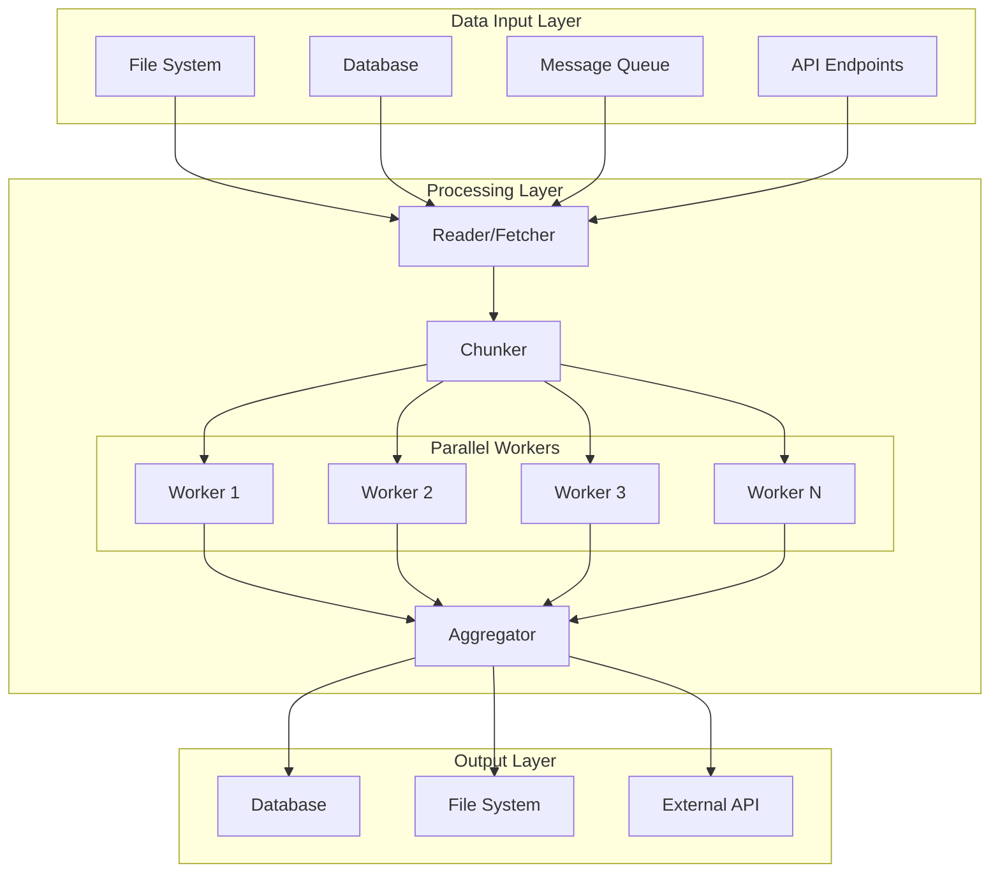
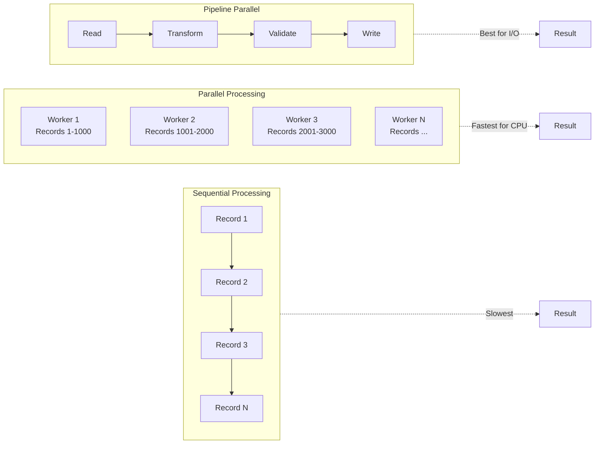
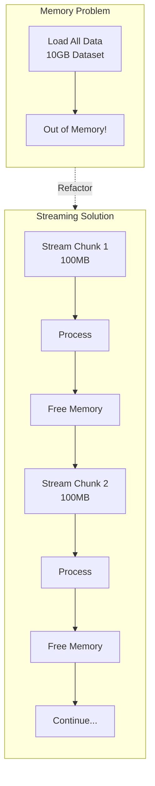
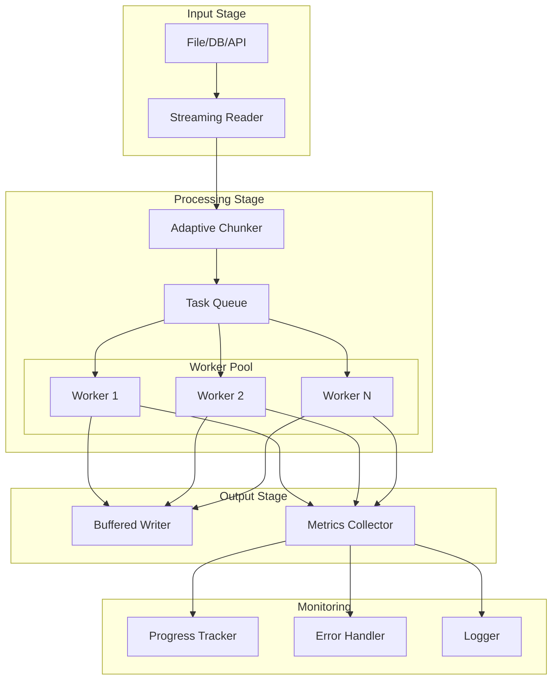

# How to Create Batch Performance Optimization

Author: [nawazdhandala](https://github.com/nawazdhandala)

Tags: Batch Processing, Performance, Optimization, Tuning

Description: Learn to create batch performance optimization strategies for faster and more efficient data processing.

---

Processing millions of records efficiently requires more than just writing a loop. Batch processing optimization combines multiple strategies: intelligent chunking, parallelization, memory management, and I/O tuning. This guide covers practical techniques to transform slow batch jobs into high-performance data pipelines.

## Understanding Batch Processing Bottlenecks

Before optimizing, identify where time is spent. Batch jobs typically face these bottlenecks:

| Bottleneck | Symptoms | Solution |
|------------|----------|----------|
| CPU-bound | High CPU usage, slow computations | Parallelization, algorithm optimization |
| Memory-bound | Out of memory errors, excessive GC | Chunking, streaming, memory pooling |
| I/O-bound | Low CPU usage, slow disk/network | Async I/O, buffering, connection pooling |
| Database-bound | Query timeouts, lock contention | Batch inserts, read replicas, indexing |

## Batch Processing Architecture



## Chunk Size Optimization

Chunk size dramatically affects performance. Too small means overhead dominates. Too large causes memory issues and reduces parallelism benefits.

### Finding Optimal Chunk Size

The optimal chunk size balances memory usage, parallelization overhead, and processing efficiency. Start with these guidelines and measure for your specific workload.

```python
import time
import psutil
import statistics
from typing import List, Callable, Any
from dataclasses import dataclass

@dataclass
class ChunkMetrics:
    """Metrics collected during chunk processing benchmark."""
    chunk_size: int
    avg_time_per_record: float  # milliseconds
    memory_peak_mb: float
    throughput: float  # records per second


def benchmark_chunk_sizes(
    data: List[Any],
    process_func: Callable[[List[Any]], None],
    chunk_sizes: List[int],
    iterations: int = 3
) -> List[ChunkMetrics]:
    """
    Benchmark different chunk sizes to find optimal configuration.

    Runs each chunk size multiple times and collects timing and memory metrics.
    Returns metrics sorted by throughput (highest first).

    Args:
        data: Sample dataset to process
        process_func: Function that processes a chunk of data
        chunk_sizes: List of chunk sizes to test
        iterations: Number of times to run each chunk size for averaging

    Returns:
        List of ChunkMetrics sorted by throughput descending
    """
    results = []

    for chunk_size in chunk_sizes:
        times = []
        memory_peaks = []

        for _ in range(iterations):
            # Reset memory tracking before each run
            process = psutil.Process()
            start_memory = process.memory_info().rss / 1024 / 1024
            peak_memory = start_memory

            start_time = time.perf_counter()

            # Process data in chunks of current size
            for i in range(0, len(data), chunk_size):
                chunk = data[i:i + chunk_size]
                process_func(chunk)

                # Track peak memory during processing
                current_memory = process.memory_info().rss / 1024 / 1024
                peak_memory = max(peak_memory, current_memory)

            elapsed = time.perf_counter() - start_time
            times.append(elapsed)
            memory_peaks.append(peak_memory - start_memory)

        # Calculate averages across iterations
        avg_time = statistics.mean(times)
        avg_memory = statistics.mean(memory_peaks)
        throughput = len(data) / avg_time

        results.append(ChunkMetrics(
            chunk_size=chunk_size,
            avg_time_per_record=(avg_time / len(data)) * 1000,
            memory_peak_mb=avg_memory,
            throughput=throughput
        ))

    # Sort by throughput descending to show best performers first
    return sorted(results, key=lambda x: x.throughput, reverse=True)


# Example: Finding optimal chunk size for data transformation
def transform_records(records: List[dict]) -> List[dict]:
    """CPU-intensive transformation applied to each record."""
    return [
        {
            **record,
            'processed': True,
            'computed_value': sum(record.get('values', [0])) ** 0.5
        }
        for record in records
    ]


# Generate test data
test_data = [{'id': i, 'values': list(range(100))} for i in range(100000)]

# Test various chunk sizes
chunk_sizes_to_test = [100, 500, 1000, 2500, 5000, 10000]

print("Benchmarking chunk sizes...")
metrics = benchmark_chunk_sizes(
    data=test_data,
    process_func=transform_records,
    chunk_sizes=chunk_sizes_to_test
)

print("\nResults (sorted by throughput):")
print(f"{'Chunk Size':>12} {'Throughput':>15} {'Time/Record':>15} {'Memory Peak':>12}")
print("-" * 58)
for m in metrics:
    print(f"{m.chunk_size:>12} {m.throughput:>12.0f}/sec {m.avg_time_per_record:>12.4f}ms {m.memory_peak_mb:>10.1f}MB")
```

### Adaptive Chunk Sizing

Instead of fixed chunk sizes, adapt based on system resources and processing characteristics. This approach monitors memory pressure and adjusts dynamically.

```python
import psutil
from typing import Iterator, List, TypeVar, Callable
from dataclasses import dataclass

T = TypeVar('T')

@dataclass
class AdaptiveChunkConfig:
    """Configuration for adaptive chunk sizing."""
    min_chunk_size: int = 100
    max_chunk_size: int = 10000
    target_memory_percent: float = 70.0  # Target memory utilization
    growth_factor: float = 1.5  # How much to grow chunk size
    shrink_factor: float = 0.5  # How much to shrink on memory pressure


class AdaptiveChunker:
    """
    Dynamically adjusts chunk size based on memory pressure.

    Starts with a base chunk size and increases it when memory is available,
    or decreases when approaching memory limits. This maximizes throughput
    while preventing out-of-memory errors.
    """

    def __init__(self, config: AdaptiveChunkConfig = None):
        self.config = config or AdaptiveChunkConfig()
        self.current_chunk_size = self.config.min_chunk_size
        self._consecutive_successes = 0

    def get_memory_percent(self) -> float:
        """Get current system memory utilization as percentage."""
        return psutil.virtual_memory().percent

    def adjust_chunk_size(self, processing_succeeded: bool) -> None:
        """
        Adjust chunk size based on processing outcome and memory state.

        On success with low memory pressure: grow chunk size for better throughput.
        On failure or high memory pressure: shrink chunk size to prevent OOM.
        """
        memory_percent = self.get_memory_percent()

        if not processing_succeeded or memory_percent > self.config.target_memory_percent:
            # Memory pressure or failure: shrink immediately
            self.current_chunk_size = max(
                self.config.min_chunk_size,
                int(self.current_chunk_size * self.config.shrink_factor)
            )
            self._consecutive_successes = 0
        else:
            # Success with acceptable memory: consider growing
            self._consecutive_successes += 1

            # Only grow after multiple consecutive successes to avoid oscillation
            if self._consecutive_successes >= 3:
                self.current_chunk_size = min(
                    self.config.max_chunk_size,
                    int(self.current_chunk_size * self.config.growth_factor)
                )
                self._consecutive_successes = 0

    def chunk_iterator(
        self,
        data: List[T],
        process_func: Callable[[List[T]], bool]
    ) -> Iterator[int]:
        """
        Process data with adaptive chunking.

        Yields the number of records processed in each chunk.
        Automatically adjusts chunk size based on processing results.

        Args:
            data: Full dataset to process
            process_func: Function to process each chunk, returns True on success

        Yields:
            Number of records processed in each iteration
        """
        offset = 0

        while offset < len(data):
            # Get current chunk based on adaptive size
            chunk_end = min(offset + self.current_chunk_size, len(data))
            chunk = data[offset:chunk_end]

            # Process and track success/failure
            try:
                success = process_func(chunk)
            except MemoryError:
                success = False

            # Adjust for next iteration
            self.adjust_chunk_size(success)

            if success:
                processed_count = len(chunk)
                offset = chunk_end
                yield processed_count
            else:
                # On failure, retry with smaller chunk (already adjusted)
                # Do not advance offset
                continue


# Usage example with database inserts
def process_and_insert(records: List[dict]) -> bool:
    """
    Process records and insert into database.
    Returns True on success, False on failure.
    """
    try:
        # Transform records
        transformed = [transform_record(r) for r in records]

        # Bulk insert (example with SQLAlchemy pattern)
        # session.bulk_insert_mappings(Model, transformed)
        # session.commit()

        return True
    except Exception as e:
        print(f"Processing failed: {e}")
        return False


# Run adaptive processing
chunker = AdaptiveChunker(AdaptiveChunkConfig(
    min_chunk_size=500,
    max_chunk_size=50000,
    target_memory_percent=75.0
))

total_processed = 0
for count in chunker.chunk_iterator(large_dataset, process_and_insert):
    total_processed += count
    print(f"Processed {count} records (chunk size: {chunker.current_chunk_size})")

print(f"Total processed: {total_processed}")
```

## Parallelization Strategies



### Thread Pool for I/O-Bound Work

For tasks that spend most time waiting on I/O (database queries, API calls, file reads), use thread pools. Threads efficiently handle blocking operations.

```python
import concurrent.futures
from typing import List, Callable, TypeVar, Iterator
import threading
import queue
import time

T = TypeVar('T')
R = TypeVar('R')


class BatchProcessor:
    """
    High-performance batch processor using thread pools.

    Optimized for I/O-bound workloads where tasks spend time waiting
    on external resources (databases, APIs, file systems).
    """

    def __init__(
        self,
        max_workers: int = None,
        chunk_size: int = 1000
    ):
        """
        Initialize batch processor.

        Args:
            max_workers: Number of threads. Defaults to min(32, cpu_count + 4)
                        which is Python's default for I/O-bound work.
            chunk_size: Records per chunk for processing.
        """
        # Python's default formula optimized for I/O-bound work
        self.max_workers = max_workers or min(32, (threading.active_count() or 1) + 4)
        self.chunk_size = chunk_size
        self._stats = {'processed': 0, 'failed': 0, 'start_time': None}
        self._lock = threading.Lock()

    def process_parallel(
        self,
        items: List[T],
        processor: Callable[[T], R],
        error_handler: Callable[[T, Exception], None] = None
    ) -> List[R]:
        """
        Process items in parallel using thread pool.

        Args:
            items: List of items to process
            processor: Function to apply to each item
            error_handler: Optional callback for failed items

        Returns:
            List of successful results (failed items excluded)
        """
        self._stats = {'processed': 0, 'failed': 0, 'start_time': time.time()}
        results = []

        with concurrent.futures.ThreadPoolExecutor(
            max_workers=self.max_workers
        ) as executor:
            # Submit all tasks and track which item each future corresponds to
            future_to_item = {
                executor.submit(processor, item): item
                for item in items
            }

            # Process completions as they finish (not in submission order)
            for future in concurrent.futures.as_completed(future_to_item):
                item = future_to_item[future]

                try:
                    result = future.result()
                    results.append(result)

                    with self._lock:
                        self._stats['processed'] += 1

                except Exception as e:
                    with self._lock:
                        self._stats['failed'] += 1

                    if error_handler:
                        error_handler(item, e)

        return results

    def process_chunks_parallel(
        self,
        items: List[T],
        chunk_processor: Callable[[List[T]], List[R]]
    ) -> Iterator[List[R]]:
        """
        Process items in parallel chunks.

        More efficient than item-by-item when there is per-item overhead
        (database connections, API rate limits, etc).

        Args:
            items: Full list of items
            chunk_processor: Function that processes a list of items

        Yields:
            Results from each chunk as they complete
        """
        # Create chunks
        chunks = [
            items[i:i + self.chunk_size]
            for i in range(0, len(items), self.chunk_size)
        ]

        with concurrent.futures.ThreadPoolExecutor(
            max_workers=self.max_workers
        ) as executor:
            # Submit all chunks
            futures = [
                executor.submit(chunk_processor, chunk)
                for chunk in chunks
            ]

            # Yield results as chunks complete
            for future in concurrent.futures.as_completed(futures):
                yield future.result()

    def get_stats(self) -> dict:
        """Get current processing statistics."""
        elapsed = time.time() - self._stats['start_time'] if self._stats['start_time'] else 0
        return {
            **self._stats,
            'elapsed_seconds': elapsed,
            'throughput': self._stats['processed'] / elapsed if elapsed > 0 else 0
        }


# Example: Parallel API calls with error handling
def fetch_user_data(user_id: int) -> dict:
    """Fetch user data from external API."""
    import requests
    response = requests.get(f"https://api.example.com/users/{user_id}")
    response.raise_for_status()
    return response.json()


def handle_fetch_error(user_id: int, error: Exception) -> None:
    """Log failed fetch attempts for retry."""
    print(f"Failed to fetch user {user_id}: {error}")
    # Add to retry queue, log to monitoring, etc.


processor = BatchProcessor(max_workers=20, chunk_size=100)

user_ids = list(range(1, 10001))  # 10,000 users to fetch

results = processor.process_parallel(
    items=user_ids,
    processor=fetch_user_data,
    error_handler=handle_fetch_error
)

stats = processor.get_stats()
print(f"Processed {stats['processed']} users in {stats['elapsed_seconds']:.2f}s")
print(f"Throughput: {stats['throughput']:.0f} users/sec")
print(f"Failed: {stats['failed']}")
```

### Process Pool for CPU-Bound Work

For CPU-intensive operations (data transformation, calculations, compression), use process pools. Each process has its own Python interpreter, bypassing the GIL.

```python
import multiprocessing as mp
from concurrent.futures import ProcessPoolExecutor, as_completed
from typing import List, Callable, TypeVar, Any
import os

T = TypeVar('T')
R = TypeVar('R')


def get_optimal_workers() -> int:
    """
    Calculate optimal number of workers for CPU-bound tasks.

    Leaves one core free for system processes and the main process.
    Caps at 61 on Windows due to ProcessPoolExecutor limitations.
    """
    cpu_count = os.cpu_count() or 1
    optimal = max(1, cpu_count - 1)

    # Windows limitation
    if os.name == 'nt':
        optimal = min(optimal, 61)

    return optimal


class CPUBoundBatchProcessor:
    """
    Batch processor optimized for CPU-intensive workloads.

    Uses process pools to bypass Python's GIL limitation,
    enabling true parallel execution across CPU cores.
    """

    def __init__(self, max_workers: int = None):
        self.max_workers = max_workers or get_optimal_workers()

    def map_parallel(
        self,
        items: List[T],
        processor: Callable[[T], R],
        chunk_size: int = None
    ) -> List[R]:
        """
        Apply processor to all items in parallel.

        Args:
            items: Items to process
            processor: Function to apply (must be picklable)
            chunk_size: Items per task. Auto-calculated if None.

        Returns:
            Results in same order as input items
        """
        # Auto-calculate chunk size for good load balancing
        # Aim for ~4 tasks per worker to handle uneven processing times
        if chunk_size is None:
            chunk_size = max(1, len(items) // (self.max_workers * 4))

        with ProcessPoolExecutor(max_workers=self.max_workers) as executor:
            # map() preserves order and handles chunking internally
            results = list(executor.map(processor, items, chunksize=chunk_size))

        return results

    def process_chunks_parallel(
        self,
        items: List[T],
        chunk_processor: Callable[[List[T]], List[R]],
        chunk_size: int = 1000
    ) -> List[R]:
        """
        Process items in chunks across processes.

        More efficient when there is per-call overhead or when
        processing benefits from batch operations (vectorization, bulk I/O).

        Args:
            items: All items to process
            chunk_processor: Function that processes a chunk
            chunk_size: Items per chunk

        Returns:
            Flattened results from all chunks
        """
        # Create chunks
        chunks = [
            items[i:i + chunk_size]
            for i in range(0, len(items), chunk_size)
        ]

        all_results = []

        with ProcessPoolExecutor(max_workers=self.max_workers) as executor:
            # Submit chunks and collect results
            futures = {
                executor.submit(chunk_processor, chunk): idx
                for idx, chunk in enumerate(chunks)
            }

            # Collect results maintaining order
            results_by_idx = {}
            for future in as_completed(futures):
                idx = futures[future]
                results_by_idx[idx] = future.result()

            # Flatten in original order
            for idx in range(len(chunks)):
                all_results.extend(results_by_idx[idx])

        return all_results


# Worker functions must be defined at module level for pickling
def compute_heavy_transformation(record: dict) -> dict:
    """
    CPU-intensive transformation.

    This runs in a separate process, utilizing a dedicated CPU core.
    """
    import math

    # Simulate heavy computation
    values = record.get('data', [])

    result = {
        'id': record['id'],
        'sum': sum(values),
        'mean': sum(values) / len(values) if values else 0,
        'std_dev': (
            sum((x - sum(values)/len(values))**2 for x in values) / len(values)
        ) ** 0.5 if values else 0,
        'normalized': [
            (x - min(values)) / (max(values) - min(values))
            if max(values) != min(values) else 0
            for x in values
        ]
    }

    return result


def process_chunk_with_numpy(records: List[dict]) -> List[dict]:
    """
    Process chunk using vectorized NumPy operations.

    Batch processing with NumPy is significantly faster than
    processing records one at a time.
    """
    import numpy as np

    # Extract data into arrays for vectorized operations
    ids = [r['id'] for r in records]
    data_arrays = [np.array(r.get('data', [])) for r in records]

    results = []
    for i, arr in enumerate(data_arrays):
        if len(arr) > 0:
            results.append({
                'id': ids[i],
                'sum': float(np.sum(arr)),
                'mean': float(np.mean(arr)),
                'std_dev': float(np.std(arr)),
                'normalized': ((arr - arr.min()) / (arr.max() - arr.min())).tolist()
                    if arr.max() != arr.min() else [0] * len(arr)
            })
        else:
            results.append({'id': ids[i], 'sum': 0, 'mean': 0, 'std_dev': 0, 'normalized': []})

    return results


if __name__ == '__main__':
    # Generate test data
    import random
    test_records = [
        {'id': i, 'data': [random.random() * 100 for _ in range(1000)]}
        for i in range(10000)
    ]

    processor = CPUBoundBatchProcessor()

    # Option 1: Process individual items in parallel
    results = processor.map_parallel(
        items=test_records,
        processor=compute_heavy_transformation
    )

    # Option 2: Process chunks with vectorized operations (faster)
    results = processor.process_chunks_parallel(
        items=test_records,
        chunk_processor=process_chunk_with_numpy,
        chunk_size=500
    )

    print(f"Processed {len(results)} records")
```

## Memory Optimization



### Generator-Based Processing

Generators process data lazily, keeping memory usage constant regardless of dataset size. This pattern is essential for files larger than available RAM.

```python
import csv
from typing import Iterator, Dict, Any, Callable, TypeVar
from pathlib import Path
import gzip
import json

T = TypeVar('T')


def stream_csv(
    file_path: Path,
    chunk_size: int = 10000
) -> Iterator[list[dict]]:
    """
    Stream CSV file in chunks without loading entire file.

    Memory usage stays constant regardless of file size.
    Supports both regular and gzip-compressed CSV files.

    Args:
        file_path: Path to CSV file (supports .csv and .csv.gz)
        chunk_size: Number of rows per chunk

    Yields:
        Lists of row dictionaries
    """
    # Choose opener based on file extension
    opener = gzip.open if file_path.suffix == '.gz' else open
    mode = 'rt'  # Text mode for CSV

    with opener(file_path, mode, encoding='utf-8') as f:
        reader = csv.DictReader(f)
        chunk = []

        for row in reader:
            chunk.append(row)

            if len(chunk) >= chunk_size:
                yield chunk
                chunk = []  # Release memory

        # Yield remaining rows
        if chunk:
            yield chunk


def stream_jsonl(
    file_path: Path,
    chunk_size: int = 10000
) -> Iterator[list[dict]]:
    """
    Stream JSON Lines file in chunks.

    JSON Lines format has one JSON object per line, making it
    ideal for streaming large datasets.

    Args:
        file_path: Path to .jsonl file
        chunk_size: Records per chunk

    Yields:
        Lists of parsed JSON objects
    """
    opener = gzip.open if str(file_path).endswith('.gz') else open

    with opener(file_path, 'rt', encoding='utf-8') as f:
        chunk = []

        for line in f:
            line = line.strip()
            if line:  # Skip empty lines
                chunk.append(json.loads(line))

                if len(chunk) >= chunk_size:
                    yield chunk
                    chunk = []

        if chunk:
            yield chunk


def stream_transform(
    input_stream: Iterator[list[T]],
    transformer: Callable[[T], Any]
) -> Iterator[list[Any]]:
    """
    Apply transformation to streamed chunks.

    Maintains constant memory by processing one chunk at a time.

    Args:
        input_stream: Generator yielding chunks
        transformer: Function to apply to each item

    Yields:
        Transformed chunks
    """
    for chunk in input_stream:
        yield [transformer(item) for item in chunk]


def stream_filter(
    input_stream: Iterator[list[T]],
    predicate: Callable[[T], bool]
) -> Iterator[list[T]]:
    """
    Filter streamed chunks.

    Args:
        input_stream: Generator yielding chunks
        predicate: Function returning True for items to keep

    Yields:
        Filtered chunks (may be smaller than input chunks)
    """
    for chunk in input_stream:
        filtered = [item for item in chunk if predicate(item)]
        if filtered:  # Only yield non-empty chunks
            yield filtered


# Example: Process 50GB CSV file with constant memory
def process_large_file(input_path: Path, output_path: Path) -> int:
    """
    Process large CSV file with constant memory usage.

    Demonstrates chaining streaming operations.
    """
    processed_count = 0

    # Create processing pipeline (all generators, no memory accumulation)
    chunks = stream_csv(input_path, chunk_size=10000)

    # Filter to relevant records
    filtered = stream_filter(
        chunks,
        predicate=lambda r: float(r.get('amount', 0)) > 100
    )

    # Transform records
    transformed = stream_transform(
        filtered,
        transformer=lambda r: {
            'id': r['id'],
            'amount': float(r['amount']),
            'processed': True
        }
    )

    # Write output in streaming fashion
    with open(output_path, 'w', newline='') as f:
        writer = None

        for chunk in transformed:
            if not writer and chunk:
                # Initialize writer with first chunk's keys
                writer = csv.DictWriter(f, fieldnames=chunk[0].keys())
                writer.writeheader()

            writer.writerows(chunk)
            processed_count += len(chunk)

    return processed_count


# Memory-efficient aggregation
def stream_aggregate(
    input_stream: Iterator[list[dict]],
    group_key: str,
    value_key: str
) -> dict[str, float]:
    """
    Aggregate streamed data with minimal memory.

    Only stores aggregation results, not source data.
    Memory = O(unique groups), not O(total records).

    Args:
        input_stream: Generator yielding chunks
        group_key: Field to group by
        value_key: Field to sum

    Returns:
        Dictionary mapping group to sum
    """
    aggregates = {}

    for chunk in input_stream:
        for record in chunk:
            group = record.get(group_key)
            value = float(record.get(value_key, 0))

            # Accumulate in-place
            aggregates[group] = aggregates.get(group, 0) + value

    return aggregates
```

### Object Pool Pattern

Creating and destroying objects repeatedly causes GC pressure. Object pools reuse objects, reducing allocation overhead.

```python
from typing import TypeVar, Generic, Callable, List
from threading import Lock
from dataclasses import dataclass
import time

T = TypeVar('T')


class ObjectPool(Generic[T]):
    """
    Thread-safe object pool for reusing expensive objects.

    Reduces garbage collection pressure by reusing objects instead of
    creating new ones. Particularly useful for database connections,
    HTTP sessions, or any object with expensive initialization.
    """

    def __init__(
        self,
        factory: Callable[[], T],
        reset_func: Callable[[T], None] = None,
        initial_size: int = 10,
        max_size: int = 100
    ):
        """
        Initialize object pool.

        Args:
            factory: Function that creates new objects
            reset_func: Function to reset object state before reuse
            initial_size: Objects to pre-create
            max_size: Maximum pool size
        """
        self.factory = factory
        self.reset_func = reset_func or (lambda x: None)
        self.max_size = max_size

        self._pool: List[T] = []
        self._lock = Lock()
        self._created_count = 0

        # Pre-create initial objects
        for _ in range(initial_size):
            self._pool.append(self.factory())
            self._created_count += 1

    def acquire(self) -> T:
        """
        Get an object from the pool.

        Returns existing object if available, creates new one if pool
        is empty and under max_size.

        Returns:
            Object from pool or newly created

        Raises:
            RuntimeError: If pool is exhausted and at max_size
        """
        with self._lock:
            if self._pool:
                return self._pool.pop()

            if self._created_count < self.max_size:
                self._created_count += 1
                return self.factory()

            raise RuntimeError("Object pool exhausted")

    def release(self, obj: T) -> None:
        """
        Return object to pool for reuse.

        Resets object state before adding back to pool.

        Args:
            obj: Object to return
        """
        self.reset_func(obj)

        with self._lock:
            if len(self._pool) < self.max_size:
                self._pool.append(obj)
            # If pool is full, object is discarded (GC will clean up)

    def __enter__(self) -> 'PooledObject[T]':
        """Context manager support for automatic release."""
        return PooledObject(self, self.acquire())

    def __exit__(self, *args):
        pass  # Actual release handled by PooledObject


@dataclass
class PooledObject(Generic[T]):
    """Wrapper that auto-releases object when done."""
    pool: ObjectPool[T]
    obj: T

    def __enter__(self) -> T:
        return self.obj

    def __exit__(self, *args):
        self.pool.release(self.obj)


# Example: Buffer pool for I/O operations
class ByteBuffer:
    """Reusable byte buffer for I/O operations."""

    def __init__(self, size: int = 64 * 1024):  # 64KB default
        self.data = bytearray(size)
        self.size = size
        self.position = 0

    def reset(self) -> None:
        """Reset buffer for reuse (does not reallocate)."""
        self.position = 0
        # Note: We don't clear data - just reset position
        # This avoids unnecessary memory operations


def reset_buffer(buf: ByteBuffer) -> None:
    """Reset function for buffer pool."""
    buf.reset()


# Create buffer pool
buffer_pool = ObjectPool(
    factory=lambda: ByteBuffer(64 * 1024),  # 64KB buffers
    reset_func=reset_buffer,
    initial_size=20,
    max_size=100
)


def process_file_with_pooled_buffers(file_path: str) -> int:
    """
    Read file using pooled buffers to reduce allocations.
    """
    total_bytes = 0

    with open(file_path, 'rb') as f:
        while True:
            # Acquire buffer from pool
            with buffer_pool as buf:
                bytes_read = f.readinto(buf.data)

                if bytes_read == 0:
                    break

                # Process data in buffer
                total_bytes += bytes_read
            # Buffer automatically returned to pool

    return total_bytes


# Example: Database connection pool pattern
class DatabaseConnection:
    """Simulated database connection."""

    def __init__(self, connection_string: str):
        self.connection_string = connection_string
        self.in_transaction = False
        # Simulate connection setup time
        time.sleep(0.1)

    def reset(self) -> None:
        """Reset connection state for reuse."""
        if self.in_transaction:
            self.rollback()
        self.in_transaction = False

    def rollback(self) -> None:
        """Rollback current transaction."""
        self.in_transaction = False


def create_db_connection() -> DatabaseConnection:
    return DatabaseConnection("postgresql://localhost/mydb")


def reset_db_connection(conn: DatabaseConnection) -> None:
    conn.reset()


db_pool = ObjectPool(
    factory=create_db_connection,
    reset_func=reset_db_connection,
    initial_size=5,
    max_size=20
)


def execute_batch_with_pooled_connections(queries: List[str]) -> None:
    """Execute queries using pooled connections."""
    for query in queries:
        with db_pool as conn:
            # Connection automatically acquired and released
            # execute(conn, query)
            pass
```

## I/O Optimization

### Buffered Writing

Writing records one at a time is extremely slow due to system call overhead. Buffer writes and flush periodically.

```python
import csv
import json
from typing import List, Any, Iterator
from pathlib import Path
from io import StringIO, BytesIO
import gzip


class BufferedWriter:
    """
    Buffered writer that batches writes for performance.

    Reduces system calls by buffering data and writing in batches.
    Supports automatic flushing based on size or record count.
    """

    def __init__(
        self,
        file_path: Path,
        buffer_size: int = 10000,
        compress: bool = False
    ):
        """
        Initialize buffered writer.

        Args:
            file_path: Output file path
            buffer_size: Records to buffer before flushing
            compress: Whether to gzip compress output
        """
        self.file_path = file_path
        self.buffer_size = buffer_size
        self.compress = compress

        self._buffer: List[Any] = []
        self._file = None
        self._writer = None
        self._records_written = 0

    def __enter__(self) -> 'BufferedWriter':
        if self.compress:
            self._file = gzip.open(self.file_path, 'wt', encoding='utf-8')
        else:
            self._file = open(self.file_path, 'w', encoding='utf-8', newline='')
        return self

    def __exit__(self, *args):
        self.flush()  # Write remaining buffer
        self._file.close()

    def write(self, record: dict) -> None:
        """
        Buffer a record for writing.

        Automatically flushes when buffer is full.
        """
        self._buffer.append(record)

        if len(self._buffer) >= self.buffer_size:
            self.flush()

    def write_many(self, records: List[dict]) -> None:
        """
        Buffer multiple records.

        More efficient than calling write() in a loop.
        """
        self._buffer.extend(records)

        if len(self._buffer) >= self.buffer_size:
            self.flush()

    def flush(self) -> None:
        """Write buffered records to file."""
        if not self._buffer:
            return

        # Initialize CSV writer with first record's keys
        if self._writer is None and self._buffer:
            self._writer = csv.DictWriter(
                self._file,
                fieldnames=self._buffer[0].keys()
            )
            self._writer.writeheader()

        self._writer.writerows(self._buffer)
        self._records_written += len(self._buffer)
        self._buffer = []

    @property
    def records_written(self) -> int:
        return self._records_written + len(self._buffer)


class BufferedJSONLWriter:
    """
    Buffered writer for JSON Lines format.

    Uses memory buffer to reduce I/O calls, then writes
    entire buffer at once.
    """

    def __init__(
        self,
        file_path: Path,
        buffer_size_mb: float = 10.0
    ):
        self.file_path = file_path
        self.buffer_size_bytes = int(buffer_size_mb * 1024 * 1024)

        self._buffer = StringIO()
        self._current_size = 0
        self._file = None

    def __enter__(self) -> 'BufferedJSONLWriter':
        self._file = open(self.file_path, 'w', encoding='utf-8')
        return self

    def __exit__(self, *args):
        self.flush()
        self._file.close()

    def write(self, record: dict) -> None:
        """Buffer a JSON record."""
        line = json.dumps(record, separators=(',', ':')) + '\n'
        self._buffer.write(line)
        self._current_size += len(line)

        if self._current_size >= self.buffer_size_bytes:
            self.flush()

    def flush(self) -> None:
        """Write buffer to file."""
        if self._current_size == 0:
            return

        self._file.write(self._buffer.getvalue())
        self._buffer = StringIO()
        self._current_size = 0


# Example: Efficient batch file processing
def process_and_write_efficiently(
    input_path: Path,
    output_path: Path,
    transform: callable
) -> int:
    """
    Process large file with buffered I/O.

    Combines streaming input with buffered output for
    optimal I/O performance.
    """
    processed = 0

    with BufferedWriter(output_path, buffer_size=50000) as writer:
        for chunk in stream_csv(input_path, chunk_size=10000):
            # Transform chunk
            transformed = [transform(record) for record in chunk]

            # Buffered write (actual I/O happens every 50k records)
            writer.write_many(transformed)
            processed += len(chunk)

    return processed
```

### Database Batch Operations

Individual database operations are slow. Batch operations dramatically improve throughput.

```python
from typing import List, Dict, Any, Iterator
from contextlib import contextmanager
import time


class BatchDatabaseWriter:
    """
    Efficient batch database writer.

    Groups INSERT operations into batches and uses bulk insert
    methods for dramatically better performance.
    """

    def __init__(
        self,
        connection,
        table_name: str,
        batch_size: int = 1000
    ):
        """
        Initialize batch writer.

        Args:
            connection: Database connection
            table_name: Target table name
            batch_size: Records per batch insert
        """
        self.connection = connection
        self.table_name = table_name
        self.batch_size = batch_size

        self._buffer: List[Dict[str, Any]] = []
        self._total_inserted = 0

    def insert(self, record: Dict[str, Any]) -> None:
        """Buffer record for batch insert."""
        self._buffer.append(record)

        if len(self._buffer) >= self.batch_size:
            self._flush()

    def insert_many(self, records: List[Dict[str, Any]]) -> None:
        """Buffer multiple records."""
        self._buffer.extend(records)

        while len(self._buffer) >= self.batch_size:
            self._flush()

    def _flush(self) -> None:
        """Execute batch insert."""
        if not self._buffer:
            return

        batch = self._buffer[:self.batch_size]
        self._buffer = self._buffer[self.batch_size:]

        # Build bulk insert query
        columns = list(batch[0].keys())
        placeholders = ', '.join(['%s'] * len(columns))
        columns_str = ', '.join(columns)

        query = f"""
            INSERT INTO {self.table_name} ({columns_str})
            VALUES ({placeholders})
        """

        # Execute as batch
        values = [tuple(record[col] for col in columns) for record in batch]

        cursor = self.connection.cursor()
        cursor.executemany(query, values)
        self.connection.commit()

        self._total_inserted += len(batch)

    def flush(self) -> None:
        """Flush remaining buffer."""
        while self._buffer:
            self._flush()

    def __enter__(self) -> 'BatchDatabaseWriter':
        return self

    def __exit__(self, *args):
        self.flush()

    @property
    def total_inserted(self) -> int:
        return self._total_inserted


# PostgreSQL-specific COPY optimization
class PostgresCopyWriter:
    """
    Ultra-fast PostgreSQL bulk loading using COPY.

    COPY is the fastest way to load data into PostgreSQL,
    often 10x faster than bulk INSERT.
    """

    def __init__(
        self,
        connection,
        table_name: str,
        columns: List[str]
    ):
        self.connection = connection
        self.table_name = table_name
        self.columns = columns

    def copy_from_iterator(
        self,
        records: Iterator[Dict[str, Any]],
        batch_size: int = 10000
    ) -> int:
        """
        Load records using PostgreSQL COPY protocol.

        Streams data directly to PostgreSQL's COPY command
        for maximum throughput.
        """
        from io import StringIO

        cursor = self.connection.cursor()
        total_copied = 0

        batch = []
        for record in records:
            # Format record as tab-separated values
            row = '\t'.join(
                str(record.get(col, '\\N'))  # \N for NULL
                for col in self.columns
            )
            batch.append(row)

            if len(batch) >= batch_size:
                # Create file-like object from batch
                data = StringIO('\n'.join(batch) + '\n')

                # Execute COPY
                cursor.copy_from(
                    data,
                    self.table_name,
                    columns=self.columns,
                    sep='\t',
                    null='\\N'
                )
                self.connection.commit()

                total_copied += len(batch)
                batch = []

        # Handle remaining records
        if batch:
            data = StringIO('\n'.join(batch) + '\n')
            cursor.copy_from(
                data,
                self.table_name,
                columns=self.columns,
                sep='\t',
                null='\\N'
            )
            self.connection.commit()
            total_copied += len(batch)

        return total_copied


# Performance comparison
def benchmark_insert_methods(connection, records: List[dict]) -> dict:
    """
    Compare different insert methods.

    Returns timing for each method.
    """
    results = {}

    # Method 1: Individual INSERTs (slowest)
    start = time.perf_counter()
    cursor = connection.cursor()
    for record in records[:1000]:  # Only test subset
        cursor.execute(
            "INSERT INTO test (col1, col2) VALUES (%s, %s)",
            (record['col1'], record['col2'])
        )
    connection.commit()
    results['individual_insert'] = time.perf_counter() - start

    # Method 2: Batch INSERT with executemany
    start = time.perf_counter()
    cursor.executemany(
        "INSERT INTO test (col1, col2) VALUES (%s, %s)",
        [(r['col1'], r['col2']) for r in records[:1000]]
    )
    connection.commit()
    results['executemany'] = time.perf_counter() - start

    # Method 3: COPY (fastest)
    start = time.perf_counter()
    copy_writer = PostgresCopyWriter(
        connection,
        'test',
        ['col1', 'col2']
    )
    copy_writer.copy_from_iterator(iter(records[:1000]))
    results['copy'] = time.perf_counter() - start

    return results
```

## Complete Pipeline Example

Here is a complete, production-ready batch processing pipeline that combines all optimization techniques.



```python
import multiprocessing as mp
from concurrent.futures import ProcessPoolExecutor, as_completed
from dataclasses import dataclass, field
from typing import List, Dict, Any, Callable, Iterator, Optional
from pathlib import Path
import time
import logging
import json
import csv
from queue import Queue
from threading import Thread, Event

# Configure logging
logging.basicConfig(
    level=logging.INFO,
    format='%(asctime)s - %(levelname)s - %(message)s'
)
logger = logging.getLogger(__name__)


@dataclass
class PipelineConfig:
    """Configuration for batch processing pipeline."""
    input_path: Path
    output_path: Path
    chunk_size: int = 10000
    max_workers: int = field(default_factory=lambda: max(1, mp.cpu_count() - 1))
    buffer_size: int = 50000
    error_threshold: float = 0.01  # Max 1% errors before abort
    progress_interval: int = 10000  # Log progress every N records


@dataclass
class PipelineMetrics:
    """Metrics collected during pipeline execution."""
    total_records: int = 0
    processed_records: int = 0
    failed_records: int = 0
    start_time: float = field(default_factory=time.time)
    end_time: Optional[float] = None

    @property
    def elapsed_seconds(self) -> float:
        end = self.end_time or time.time()
        return end - self.start_time

    @property
    def throughput(self) -> float:
        if self.elapsed_seconds > 0:
            return self.processed_records / self.elapsed_seconds
        return 0.0

    @property
    def error_rate(self) -> float:
        total = self.processed_records + self.failed_records
        if total > 0:
            return self.failed_records / total
        return 0.0


class BatchPipeline:
    """
    Production-grade batch processing pipeline.

    Combines all optimization techniques:
    - Streaming input to handle files larger than memory
    - Parallel processing with configurable worker pool
    - Adaptive chunk sizing based on performance
    - Buffered output for efficient I/O
    - Comprehensive error handling and metrics
    """

    def __init__(
        self,
        config: PipelineConfig,
        transformer: Callable[[Dict[str, Any]], Dict[str, Any]],
        validator: Callable[[Dict[str, Any]], bool] = None
    ):
        """
        Initialize pipeline.

        Args:
            config: Pipeline configuration
            transformer: Function to transform each record
            validator: Optional function to validate records
        """
        self.config = config
        self.transformer = transformer
        self.validator = validator or (lambda x: True)
        self.metrics = PipelineMetrics()
        self._should_stop = Event()

    def run(self) -> PipelineMetrics:
        """
        Execute the pipeline.

        Returns:
            Metrics from pipeline execution
        """
        logger.info(f"Starting pipeline with {self.config.max_workers} workers")
        logger.info(f"Input: {self.config.input_path}")
        logger.info(f"Output: {self.config.output_path}")

        self.metrics = PipelineMetrics()

        try:
            # Count total records for progress tracking
            self.metrics.total_records = self._count_records()
            logger.info(f"Total records to process: {self.metrics.total_records}")

            # Process with parallel workers
            self._process_parallel()

        except Exception as e:
            logger.error(f"Pipeline failed: {e}")
            raise
        finally:
            self.metrics.end_time = time.time()

        self._log_final_metrics()
        return self.metrics

    def _count_records(self) -> int:
        """Count total records in input file."""
        count = 0
        with open(self.config.input_path, 'r') as f:
            # Skip header
            next(f, None)
            for _ in f:
                count += 1
        return count

    def _stream_chunks(self) -> Iterator[List[Dict[str, Any]]]:
        """Stream input file in chunks."""
        with open(self.config.input_path, 'r', newline='') as f:
            reader = csv.DictReader(f)
            chunk = []

            for row in reader:
                chunk.append(row)

                if len(chunk) >= self.config.chunk_size:
                    yield chunk
                    chunk = []

            if chunk:
                yield chunk

    def _process_parallel(self) -> None:
        """Process chunks in parallel."""
        # Open output file with buffering
        with open(self.config.output_path, 'w', newline='') as out_file:
            writer = None
            buffer = []

            with ProcessPoolExecutor(max_workers=self.config.max_workers) as executor:
                # Submit chunks as futures
                futures = {}
                chunk_idx = 0

                for chunk in self._stream_chunks():
                    # Check error threshold
                    if self.metrics.error_rate > self.config.error_threshold:
                        logger.error("Error threshold exceeded, stopping pipeline")
                        self._should_stop.set()
                        break

                    future = executor.submit(
                        process_chunk_worker,
                        chunk,
                        self.transformer,
                        self.validator
                    )
                    futures[future] = chunk_idx
                    chunk_idx += 1

                # Collect results as they complete
                for future in as_completed(futures):
                    if self._should_stop.is_set():
                        break

                    try:
                        results, errors = future.result()

                        # Update metrics
                        self.metrics.processed_records += len(results)
                        self.metrics.failed_records += errors

                        # Buffer results
                        buffer.extend(results)

                        # Flush buffer when full
                        if len(buffer) >= self.config.buffer_size:
                            self._flush_buffer(out_file, buffer, writer)
                            if writer is None and buffer:
                                writer = csv.DictWriter(
                                    out_file,
                                    fieldnames=buffer[0].keys()
                                )
                                writer.writeheader()
                            writer.writerows(buffer)
                            buffer = []

                        # Log progress
                        if self.metrics.processed_records % self.config.progress_interval < self.config.chunk_size:
                            self._log_progress()

                    except Exception as e:
                        logger.error(f"Chunk processing failed: {e}")
                        self.metrics.failed_records += self.config.chunk_size

            # Flush remaining buffer
            if buffer:
                if writer is None:
                    writer = csv.DictWriter(out_file, fieldnames=buffer[0].keys())
                    writer.writeheader()
                writer.writerows(buffer)

    def _flush_buffer(
        self,
        file,
        buffer: List[Dict],
        writer: Optional[csv.DictWriter]
    ) -> csv.DictWriter:
        """Flush buffer to file."""
        if not buffer:
            return writer

        if writer is None:
            writer = csv.DictWriter(file, fieldnames=buffer[0].keys())
            writer.writeheader()

        writer.writerows(buffer)
        return writer

    def _log_progress(self) -> None:
        """Log current progress."""
        progress = (self.metrics.processed_records / self.metrics.total_records) * 100
        logger.info(
            f"Progress: {progress:.1f}% "
            f"({self.metrics.processed_records:,}/{self.metrics.total_records:,}) "
            f"Throughput: {self.metrics.throughput:,.0f} records/sec "
            f"Errors: {self.metrics.failed_records:,}"
        )

    def _log_final_metrics(self) -> None:
        """Log final pipeline metrics."""
        logger.info("=" * 60)
        logger.info("Pipeline Complete")
        logger.info(f"Total Records: {self.metrics.total_records:,}")
        logger.info(f"Processed: {self.metrics.processed_records:,}")
        logger.info(f"Failed: {self.metrics.failed_records:,}")
        logger.info(f"Error Rate: {self.metrics.error_rate:.2%}")
        logger.info(f"Duration: {self.metrics.elapsed_seconds:.2f} seconds")
        logger.info(f"Throughput: {self.metrics.throughput:,.0f} records/sec")
        logger.info("=" * 60)


def process_chunk_worker(
    chunk: List[Dict[str, Any]],
    transformer: Callable,
    validator: Callable
) -> tuple[List[Dict[str, Any]], int]:
    """
    Worker function for processing chunks.

    Runs in separate process for true parallelism.
    Must be defined at module level for pickling.

    Args:
        chunk: Records to process
        transformer: Transformation function
        validator: Validation function

    Returns:
        Tuple of (successful results, error count)
    """
    results = []
    errors = 0

    for record in chunk:
        try:
            # Validate
            if not validator(record):
                errors += 1
                continue

            # Transform
            transformed = transformer(record)
            results.append(transformed)

        except Exception:
            errors += 1

    return results, errors


# Example usage
def example_transformer(record: Dict[str, Any]) -> Dict[str, Any]:
    """Example transformation function."""
    return {
        'id': record['id'],
        'value': float(record.get('amount', 0)) * 1.1,
        'category': record.get('type', 'unknown').upper(),
        'processed_at': time.time()
    }


def example_validator(record: Dict[str, Any]) -> bool:
    """Example validation function."""
    return (
        'id' in record and
        record.get('amount', '').replace('.', '').isdigit()
    )


if __name__ == '__main__':
    config = PipelineConfig(
        input_path=Path('input_data.csv'),
        output_path=Path('output_data.csv'),
        chunk_size=10000,
        max_workers=4,
        buffer_size=50000
    )

    pipeline = BatchPipeline(
        config=config,
        transformer=example_transformer,
        validator=example_validator
    )

    metrics = pipeline.run()

    print(f"\nFinal throughput: {metrics.throughput:,.0f} records/second")
```

## Performance Tuning Checklist

Use this checklist to systematically optimize batch processing jobs:

### Profiling
- [ ] Profile to identify actual bottlenecks (CPU, memory, I/O, network)
- [ ] Measure baseline performance before optimization
- [ ] Set specific performance targets

### Chunk Sizing
- [ ] Benchmark multiple chunk sizes with your actual data
- [ ] Consider memory constraints when setting maximum chunk size
- [ ] Implement adaptive chunking for variable workloads

### Parallelization
- [ ] Use thread pools for I/O-bound work
- [ ] Use process pools for CPU-bound work
- [ ] Set worker count based on workload type (CPU cores for CPU-bound, higher for I/O)
- [ ] Avoid over-parallelization that causes contention

### Memory
- [ ] Use generators/streaming for large datasets
- [ ] Implement object pools for frequently created objects
- [ ] Monitor memory usage and GC pauses
- [ ] Clear references to allow garbage collection

### I/O
- [ ] Buffer writes (do not write record by record)
- [ ] Use bulk database operations (batch INSERT, COPY)
- [ ] Compress output for storage efficiency
- [ ] Use connection pooling for databases and APIs

### Error Handling
- [ ] Implement retry logic with exponential backoff
- [ ] Set error thresholds to abort failed jobs early
- [ ] Log errors with enough context for debugging
- [ ] Separate error records for manual review

### Monitoring
- [ ] Track throughput in real-time
- [ ] Log progress at regular intervals
- [ ] Alert on error rate thresholds
- [ ] Collect metrics for optimization iterations

## Summary

Batch processing optimization is about identifying bottlenecks and applying the right techniques:

| Bottleneck | Primary Techniques |
|------------|-------------------|
| CPU-bound | Process pools, algorithm optimization, vectorization |
| Memory-bound | Streaming, chunking, object pools, generators |
| I/O-bound | Thread pools, buffering, async I/O, connection pools |
| Database-bound | Batch operations, COPY, read replicas, indexing |

Start with measurement. Profile your batch jobs to find actual bottlenecks. Apply optimizations incrementally and measure the impact of each change. The techniques in this guide can transform jobs that take hours into jobs that complete in minutes.
