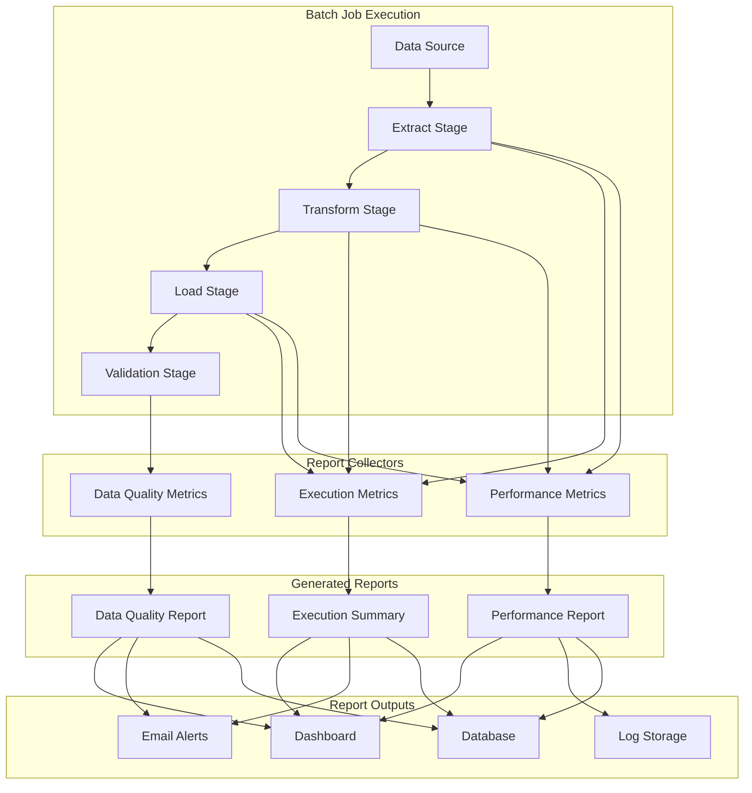
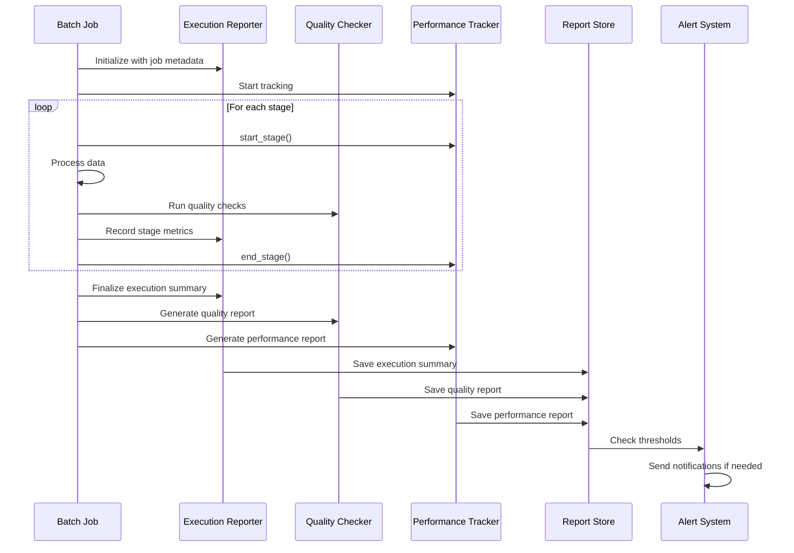
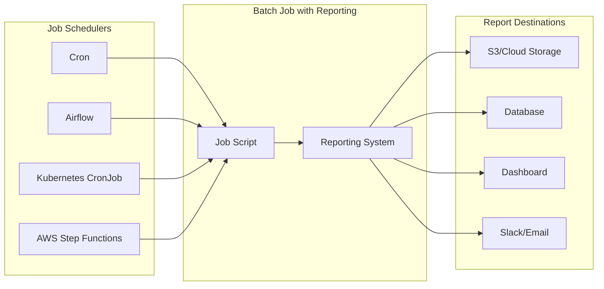

# How to Implement Batch Reporting

Author: [nawazdhandala](https://github.com/nawazdhandala)

Tags: Batch Processing, Reporting, Analytics, Data Pipelines

Description: Learn to implement batch reporting for generating execution summaries and data quality reports.

---

Batch processing systems handle enormous volumes of data, but without proper reporting, you are flying blind. Whether you are processing millions of transactions overnight or running ETL pipelines that feed your analytics warehouse, knowing what happened during execution is critical. This guide walks you through implementing comprehensive batch reporting that covers execution summaries, data quality metrics, and performance insights.

---

## Why Batch Reporting Matters

Batch jobs often run unattended, typically during off-peak hours. When something goes wrong at 3 AM, you need answers fast:

- How many records were processed successfully?
- Which records failed and why?
- How long did each stage take?
- Is data quality degrading over time?
- Are there performance trends we should address?

Good batch reporting transforms reactive firefighting into proactive monitoring. Instead of discovering issues when downstream systems break, you catch problems in the reports themselves.

---

## Batch Reporting Architecture Overview

Before diving into code, let us understand how the pieces fit together.



The architecture separates concerns into three layers: collectors gather metrics during execution, report generators aggregate and format the data, and output handlers distribute reports to various destinations.

---

## Report Types and Their Purpose

### 1. Execution Summary Report

The execution summary provides a high-level view of what the batch job accomplished. It answers the basic questions: Did it work? How much was processed?

```python
from dataclasses import dataclass, field
from datetime import datetime
from typing import Dict, List, Optional
from enum import Enum


class JobStatus(Enum):
    """
    Represents the final status of a batch job execution.
    SUCCESS: All records processed without errors
    PARTIAL: Some records failed but job completed
    FAILED: Job terminated due to critical error
    """
    SUCCESS = "success"
    PARTIAL = "partial"
    FAILED = "failed"


@dataclass
class StageMetrics:
    """
    Captures metrics for a single processing stage.
    Each batch job typically has multiple stages (extract, transform, load).
    """
    stage_name: str
    records_input: int = 0
    records_output: int = 0
    records_filtered: int = 0
    records_failed: int = 0
    start_time: Optional[datetime] = None
    end_time: Optional[datetime] = None
    error_messages: List[str] = field(default_factory=list)

    @property
    def duration_seconds(self) -> float:
        """Calculate stage duration in seconds."""
        if self.start_time and self.end_time:
            return (self.end_time - self.start_time).total_seconds()
        return 0.0

    @property
    def success_rate(self) -> float:
        """Calculate the percentage of successfully processed records."""
        if self.records_input == 0:
            return 100.0
        return ((self.records_input - self.records_failed) / self.records_input) * 100


@dataclass
class ExecutionSummary:
    """
    Complete execution summary for a batch job run.
    Aggregates metrics across all stages and provides overall status.
    """
    job_name: str
    job_id: str
    run_date: datetime
    start_time: datetime
    end_time: Optional[datetime] = None
    status: JobStatus = JobStatus.SUCCESS
    total_records_processed: int = 0
    total_records_failed: int = 0
    stages: Dict[str, StageMetrics] = field(default_factory=dict)
    parameters: Dict[str, str] = field(default_factory=dict)

    @property
    def total_duration_seconds(self) -> float:
        """Total job duration from start to end."""
        if self.start_time and self.end_time:
            return (self.end_time - self.start_time).total_seconds()
        return 0.0

    @property
    def overall_success_rate(self) -> float:
        """Overall success rate across all records."""
        total = self.total_records_processed + self.total_records_failed
        if total == 0:
            return 100.0
        return (self.total_records_processed / total) * 100

    def add_stage(self, stage: StageMetrics) -> None:
        """Register a stage's metrics in the summary."""
        self.stages[stage.stage_name] = stage
        # Update totals based on the final stage (usually load or validation)
        if stage.stage_name in ['load', 'validation', 'output']:
            self.total_records_processed = stage.records_output
            self.total_records_failed += stage.records_failed

    def determine_final_status(self) -> None:
        """
        Set the final job status based on collected metrics.
        Called at job completion to determine SUCCESS, PARTIAL, or FAILED.
        """
        if self.total_records_failed == 0:
            self.status = JobStatus.SUCCESS
        elif self.total_records_processed > 0:
            self.status = JobStatus.PARTIAL
        else:
            self.status = JobStatus.FAILED
```

### 2. Data Quality Report

Data quality reports track the health of your data over time. They help identify issues like missing fields, invalid formats, or outliers that might indicate upstream problems.

```python
from dataclasses import dataclass, field
from datetime import datetime
from typing import Dict, List, Any
from enum import Enum


class QualityCheckType(Enum):
    """
    Types of data quality checks that can be performed.
    Each type addresses a different aspect of data quality.
    """
    COMPLETENESS = "completeness"      # Are required fields populated?
    VALIDITY = "validity"              # Do values match expected formats/ranges?
    UNIQUENESS = "uniqueness"          # Are there duplicate records?
    CONSISTENCY = "consistency"        # Do related fields have consistent values?
    TIMELINESS = "timeliness"          # Is data arriving within expected windows?
    ACCURACY = "accuracy"              # Do values match known reference data?


@dataclass
class QualityCheckResult:
    """
    Result of a single data quality check.
    Captures pass/fail status along with detailed metrics.
    """
    check_name: str
    check_type: QualityCheckType
    field_name: str
    total_records: int
    passed_records: int
    failed_records: int
    threshold_percent: float  # Minimum acceptable pass rate
    sample_failures: List[Dict[str, Any]] = field(default_factory=list)

    @property
    def pass_rate(self) -> float:
        """Calculate the percentage of records passing this check."""
        if self.total_records == 0:
            return 100.0
        return (self.passed_records / self.total_records) * 100

    @property
    def passed(self) -> bool:
        """Determine if the check passed based on threshold."""
        return self.pass_rate >= self.threshold_percent


@dataclass
class DataQualityReport:
    """
    Comprehensive data quality report for a batch run.
    Aggregates all quality checks and provides overall health score.
    """
    job_name: str
    job_id: str
    run_date: datetime
    checks: List[QualityCheckResult] = field(default_factory=list)

    @property
    def overall_score(self) -> float:
        """
        Calculate weighted average quality score.
        Returns a score from 0-100 representing overall data health.
        """
        if not self.checks:
            return 100.0
        total_weight = sum(check.total_records for check in self.checks)
        if total_weight == 0:
            return 100.0
        weighted_sum = sum(
            check.pass_rate * check.total_records
            for check in self.checks
        )
        return weighted_sum / total_weight

    @property
    def failed_checks(self) -> List[QualityCheckResult]:
        """Return list of checks that did not meet their threshold."""
        return [check for check in self.checks if not check.passed]

    @property
    def critical_issues(self) -> List[QualityCheckResult]:
        """Return checks with pass rate below 90%."""
        return [check for check in self.checks if check.pass_rate < 90]

    def add_check(self, check: QualityCheckResult) -> None:
        """Add a quality check result to the report."""
        self.checks.append(check)


class DataQualityChecker:
    """
    Performs data quality checks on batch data.
    Configure checks during initialization, then run against your dataset.
    """

    def __init__(self, job_name: str, job_id: str):
        self.job_name = job_name
        self.job_id = job_id
        self.checks_config: List[Dict[str, Any]] = []

    def add_completeness_check(
        self,
        field_name: str,
        threshold: float = 99.0
    ) -> None:
        """
        Add a check to verify a field is not null or empty.

        Args:
            field_name: The field to check for completeness
            threshold: Minimum percentage of non-null values required
        """
        self.checks_config.append({
            'type': QualityCheckType.COMPLETENESS,
            'field': field_name,
            'threshold': threshold,
            'name': f"completeness_{field_name}"
        })

    def add_validity_check(
        self,
        field_name: str,
        validator: callable,
        threshold: float = 99.0
    ) -> None:
        """
        Add a check to verify field values match expected format.

        Args:
            field_name: The field to validate
            validator: Function that returns True for valid values
            threshold: Minimum percentage of valid values required
        """
        self.checks_config.append({
            'type': QualityCheckType.VALIDITY,
            'field': field_name,
            'validator': validator,
            'threshold': threshold,
            'name': f"validity_{field_name}"
        })

    def add_uniqueness_check(
        self,
        field_name: str,
        threshold: float = 100.0
    ) -> None:
        """
        Add a check to verify field values are unique.

        Args:
            field_name: The field that should contain unique values
            threshold: Minimum percentage of unique values required
        """
        self.checks_config.append({
            'type': QualityCheckType.UNIQUENESS,
            'field': field_name,
            'threshold': threshold,
            'name': f"uniqueness_{field_name}"
        })

    def run_checks(self, data: List[Dict[str, Any]]) -> DataQualityReport:
        """
        Execute all configured checks against the provided data.

        Args:
            data: List of records to check (each record is a dictionary)

        Returns:
            DataQualityReport containing results of all checks
        """
        report = DataQualityReport(
            job_name=self.job_name,
            job_id=self.job_id,
            run_date=datetime.now()
        )

        for config in self.checks_config:
            if config['type'] == QualityCheckType.COMPLETENESS:
                result = self._check_completeness(data, config)
            elif config['type'] == QualityCheckType.VALIDITY:
                result = self._check_validity(data, config)
            elif config['type'] == QualityCheckType.UNIQUENESS:
                result = self._check_uniqueness(data, config)
            else:
                continue

            report.add_check(result)

        return report

    def _check_completeness(
        self,
        data: List[Dict],
        config: Dict
    ) -> QualityCheckResult:
        """Check that a field is populated in all records."""
        field = config['field']
        passed = 0
        failed = 0
        sample_failures = []

        for i, record in enumerate(data):
            value = record.get(field)
            # Check for None, empty string, or whitespace-only
            if value is not None and str(value).strip():
                passed += 1
            else:
                failed += 1
                # Keep sample of failures for debugging
                if len(sample_failures) < 5:
                    sample_failures.append({
                        'record_index': i,
                        'field': field,
                        'value': value
                    })

        return QualityCheckResult(
            check_name=config['name'],
            check_type=QualityCheckType.COMPLETENESS,
            field_name=field,
            total_records=len(data),
            passed_records=passed,
            failed_records=failed,
            threshold_percent=config['threshold'],
            sample_failures=sample_failures
        )

    def _check_validity(
        self,
        data: List[Dict],
        config: Dict
    ) -> QualityCheckResult:
        """Check that field values pass the validator function."""
        field = config['field']
        validator = config['validator']
        passed = 0
        failed = 0
        sample_failures = []

        for i, record in enumerate(data):
            value = record.get(field)
            try:
                if validator(value):
                    passed += 1
                else:
                    failed += 1
                    if len(sample_failures) < 5:
                        sample_failures.append({
                            'record_index': i,
                            'field': field,
                            'value': value
                        })
            except Exception:
                failed += 1
                if len(sample_failures) < 5:
                    sample_failures.append({
                        'record_index': i,
                        'field': field,
                        'value': value,
                        'error': 'Validator raised exception'
                    })

        return QualityCheckResult(
            check_name=config['name'],
            check_type=QualityCheckType.VALIDITY,
            field_name=field,
            total_records=len(data),
            passed_records=passed,
            failed_records=failed,
            threshold_percent=config['threshold'],
            sample_failures=sample_failures
        )

    def _check_uniqueness(
        self,
        data: List[Dict],
        config: Dict
    ) -> QualityCheckResult:
        """Check that field values are unique across all records."""
        field = config['field']
        seen_values = {}
        duplicates = []

        for i, record in enumerate(data):
            value = record.get(field)
            if value in seen_values:
                duplicates.append({
                    'record_index': i,
                    'field': field,
                    'value': value,
                    'first_seen_at': seen_values[value]
                })
            else:
                seen_values[value] = i

        unique_count = len(seen_values)
        duplicate_count = len(duplicates)

        return QualityCheckResult(
            check_name=config['name'],
            check_type=QualityCheckType.UNIQUENESS,
            field_name=field,
            total_records=len(data),
            passed_records=unique_count,
            failed_records=duplicate_count,
            threshold_percent=config['threshold'],
            sample_failures=duplicates[:5]  # Keep only first 5 samples
        )
```

### 3. Performance Report

Performance reports track how long each stage takes and identify bottlenecks. They are essential for capacity planning and optimization.

```python
from dataclasses import dataclass, field
from datetime import datetime
from typing import Dict, List, Optional
import statistics


@dataclass
class StagePerformance:
    """
    Performance metrics for a single batch processing stage.
    Tracks timing, throughput, and resource utilization.
    """
    stage_name: str
    start_time: datetime
    end_time: datetime
    records_processed: int
    bytes_processed: int = 0
    peak_memory_mb: float = 0.0
    avg_cpu_percent: float = 0.0

    @property
    def duration_seconds(self) -> float:
        """Total stage duration in seconds."""
        return (self.end_time - self.start_time).total_seconds()

    @property
    def records_per_second(self) -> float:
        """Throughput measured in records per second."""
        if self.duration_seconds == 0:
            return 0.0
        return self.records_processed / self.duration_seconds

    @property
    def mb_per_second(self) -> float:
        """Throughput measured in megabytes per second."""
        if self.duration_seconds == 0 or self.bytes_processed == 0:
            return 0.0
        mb = self.bytes_processed / (1024 * 1024)
        return mb / self.duration_seconds


@dataclass
class PerformanceReport:
    """
    Complete performance report for a batch job execution.
    Provides stage-by-stage breakdown and historical comparison.
    """
    job_name: str
    job_id: str
    run_date: datetime
    stages: List[StagePerformance] = field(default_factory=list)
    historical_avg_duration: Optional[float] = None  # From past runs

    @property
    def total_duration_seconds(self) -> float:
        """Sum of all stage durations."""
        return sum(stage.duration_seconds for stage in self.stages)

    @property
    def total_records_processed(self) -> int:
        """Total records processed across all stages."""
        if not self.stages:
            return 0
        # Use the last stage's count as the final output
        return self.stages[-1].records_processed

    @property
    def slowest_stage(self) -> Optional[StagePerformance]:
        """Identify the stage that took the longest."""
        if not self.stages:
            return None
        return max(self.stages, key=lambda s: s.duration_seconds)

    @property
    def bottleneck_stage(self) -> Optional[StagePerformance]:
        """
        Identify the performance bottleneck.
        This is the stage with the lowest throughput (records/second).
        """
        if not self.stages:
            return None
        stages_with_throughput = [
            s for s in self.stages if s.records_per_second > 0
        ]
        if not stages_with_throughput:
            return None
        return min(stages_with_throughput, key=lambda s: s.records_per_second)

    @property
    def performance_vs_historical(self) -> Optional[float]:
        """
        Compare current run against historical average.
        Returns percentage difference (negative means faster than average).
        """
        if self.historical_avg_duration is None:
            return None
        if self.historical_avg_duration == 0:
            return None
        diff = self.total_duration_seconds - self.historical_avg_duration
        return (diff / self.historical_avg_duration) * 100

    def add_stage(self, stage: StagePerformance) -> None:
        """Add a stage's performance metrics to the report."""
        self.stages.append(stage)

    def get_stage_breakdown(self) -> Dict[str, float]:
        """
        Get duration breakdown by stage as percentages.
        Useful for identifying which stages consume the most time.
        """
        total = self.total_duration_seconds
        if total == 0:
            return {}
        return {
            stage.stage_name: (stage.duration_seconds / total) * 100
            for stage in self.stages
        }


class PerformanceTracker:
    """
    Tracks performance metrics during batch job execution.
    Use context managers to automatically capture stage timing.
    """

    def __init__(self, job_name: str, job_id: str):
        self.job_name = job_name
        self.job_id = job_id
        self.stages: List[StagePerformance] = []
        self._current_stage: Optional[Dict] = None

    def start_stage(self, stage_name: str) -> None:
        """Begin tracking a new processing stage."""
        self._current_stage = {
            'name': stage_name,
            'start_time': datetime.now(),
            'records': 0,
            'bytes': 0
        }

    def update_stage_progress(
        self,
        records: int,
        bytes_processed: int = 0
    ) -> None:
        """Update the current stage with progress information."""
        if self._current_stage:
            self._current_stage['records'] = records
            self._current_stage['bytes'] = bytes_processed

    def end_stage(
        self,
        peak_memory_mb: float = 0.0,
        avg_cpu_percent: float = 0.0
    ) -> StagePerformance:
        """
        Complete the current stage and record final metrics.

        Returns:
            StagePerformance object with all captured metrics
        """
        if not self._current_stage:
            raise ValueError("No stage is currently being tracked")

        stage = StagePerformance(
            stage_name=self._current_stage['name'],
            start_time=self._current_stage['start_time'],
            end_time=datetime.now(),
            records_processed=self._current_stage['records'],
            bytes_processed=self._current_stage['bytes'],
            peak_memory_mb=peak_memory_mb,
            avg_cpu_percent=avg_cpu_percent
        )

        self.stages.append(stage)
        self._current_stage = None
        return stage

    def generate_report(
        self,
        historical_avg: Optional[float] = None
    ) -> PerformanceReport:
        """
        Generate the final performance report.

        Args:
            historical_avg: Optional average duration from past runs

        Returns:
            PerformanceReport with all stage metrics
        """
        return PerformanceReport(
            job_name=self.job_name,
            job_id=self.job_id,
            run_date=datetime.now(),
            stages=self.stages.copy(),
            historical_avg_duration=historical_avg
        )
```

---

## Complete Batch Reporting System

Now let us combine everything into a cohesive reporting system.



```python
import json
import logging
from dataclasses import dataclass, field, asdict
from datetime import datetime
from typing import Dict, List, Any, Optional
from pathlib import Path
import uuid


# Configure logging for the reporting system
logging.basicConfig(
    level=logging.INFO,
    format='%(asctime)s - %(name)s - %(levelname)s - %(message)s'
)
logger = logging.getLogger('batch_reporting')


@dataclass
class BatchReport:
    """
    Unified batch report combining all report types.
    This is the main output of the reporting system.
    """
    job_name: str
    job_id: str
    run_date: datetime
    execution_summary: ExecutionSummary
    quality_report: DataQualityReport
    performance_report: PerformanceReport

    def to_dict(self) -> Dict[str, Any]:
        """Convert report to dictionary for serialization."""
        return {
            'job_name': self.job_name,
            'job_id': self.job_id,
            'run_date': self.run_date.isoformat(),
            'execution': {
                'status': self.execution_summary.status.value,
                'total_processed': self.execution_summary.total_records_processed,
                'total_failed': self.execution_summary.total_records_failed,
                'success_rate': self.execution_summary.overall_success_rate,
                'duration_seconds': self.execution_summary.total_duration_seconds
            },
            'quality': {
                'overall_score': self.quality_report.overall_score,
                'checks_passed': len(self.quality_report.checks) - len(self.quality_report.failed_checks),
                'checks_failed': len(self.quality_report.failed_checks),
                'critical_issues': len(self.quality_report.critical_issues)
            },
            'performance': {
                'total_duration': self.performance_report.total_duration_seconds,
                'records_processed': self.performance_report.total_records_processed,
                'slowest_stage': (
                    self.performance_report.slowest_stage.stage_name
                    if self.performance_report.slowest_stage else None
                ),
                'vs_historical': self.performance_report.performance_vs_historical
            }
        }


class BatchReportingSystem:
    """
    Complete batch reporting system that integrates all report types.
    Use this class to track and generate reports for batch jobs.
    """

    def __init__(
        self,
        job_name: str,
        output_dir: str = './reports',
        alert_thresholds: Optional[Dict[str, float]] = None
    ):
        """
        Initialize the batch reporting system.

        Args:
            job_name: Name of the batch job being tracked
            output_dir: Directory to store generated reports
            alert_thresholds: Optional thresholds for alerting
        """
        self.job_name = job_name
        self.job_id = str(uuid.uuid4())[:8]
        self.output_dir = Path(output_dir)
        self.output_dir.mkdir(parents=True, exist_ok=True)

        # Default alert thresholds
        self.thresholds = alert_thresholds or {
            'min_success_rate': 95.0,
            'min_quality_score': 90.0,
            'max_duration_multiplier': 2.0  # 2x historical average
        }

        # Initialize component trackers
        self.execution_summary = ExecutionSummary(
            job_name=job_name,
            job_id=self.job_id,
            run_date=datetime.now(),
            start_time=datetime.now()
        )
        self.quality_checker = DataQualityChecker(job_name, self.job_id)
        self.performance_tracker = PerformanceTracker(job_name, self.job_id)

        self._quality_report: Optional[DataQualityReport] = None

        logger.info(f"Initialized batch reporting for job: {job_name} (ID: {self.job_id})")

    def configure_quality_checks(
        self,
        completeness_fields: List[str],
        validity_checks: List[Dict[str, Any]] = None,
        uniqueness_fields: List[str] = None
    ) -> None:
        """
        Configure data quality checks for the batch job.

        Args:
            completeness_fields: Fields that must not be null
            validity_checks: List of {field, validator, threshold} dicts
            uniqueness_fields: Fields that must be unique
        """
        # Add completeness checks
        for field_name in completeness_fields:
            self.quality_checker.add_completeness_check(field_name)

        # Add validity checks
        if validity_checks:
            for check in validity_checks:
                self.quality_checker.add_validity_check(
                    field_name=check['field'],
                    validator=check['validator'],
                    threshold=check.get('threshold', 99.0)
                )

        # Add uniqueness checks
        if uniqueness_fields:
            for field_name in uniqueness_fields:
                self.quality_checker.add_uniqueness_check(field_name)

        logger.info(f"Configured {len(completeness_fields)} completeness checks")

    def start_stage(self, stage_name: str) -> None:
        """Begin tracking a processing stage."""
        self.performance_tracker.start_stage(stage_name)
        logger.info(f"Started stage: {stage_name}")

    def end_stage(
        self,
        stage_name: str,
        records_input: int,
        records_output: int,
        records_failed: int = 0,
        bytes_processed: int = 0,
        peak_memory_mb: float = 0.0,
        avg_cpu_percent: float = 0.0,
        error_messages: List[str] = None
    ) -> None:
        """
        Complete a processing stage and record all metrics.

        Args:
            stage_name: Name of the stage being completed
            records_input: Number of records that entered the stage
            records_output: Number of records successfully processed
            records_failed: Number of records that failed
            bytes_processed: Total bytes processed in this stage
            peak_memory_mb: Peak memory usage during the stage
            avg_cpu_percent: Average CPU utilization
            error_messages: List of error messages encountered
        """
        # Update performance tracker
        self.performance_tracker.update_stage_progress(records_output, bytes_processed)
        self.performance_tracker.end_stage(peak_memory_mb, avg_cpu_percent)

        # Create stage metrics for execution summary
        stage_metrics = StageMetrics(
            stage_name=stage_name,
            records_input=records_input,
            records_output=records_output,
            records_filtered=records_input - records_output - records_failed,
            records_failed=records_failed,
            start_time=self.performance_tracker.stages[-1].start_time,
            end_time=self.performance_tracker.stages[-1].end_time,
            error_messages=error_messages or []
        )
        self.execution_summary.add_stage(stage_metrics)

        logger.info(
            f"Completed stage: {stage_name} - "
            f"Input: {records_input}, Output: {records_output}, Failed: {records_failed}"
        )

    def run_quality_checks(self, data: List[Dict[str, Any]]) -> DataQualityReport:
        """
        Execute all configured quality checks against the data.

        Args:
            data: The processed data to validate

        Returns:
            DataQualityReport with all check results
        """
        self._quality_report = self.quality_checker.run_checks(data)

        logger.info(
            f"Quality checks complete - Score: {self._quality_report.overall_score:.1f}%, "
            f"Failed checks: {len(self._quality_report.failed_checks)}"
        )

        return self._quality_report

    def finalize(
        self,
        historical_avg_duration: Optional[float] = None
    ) -> BatchReport:
        """
        Finalize the batch job and generate the complete report.

        Args:
            historical_avg_duration: Average duration from past runs for comparison

        Returns:
            BatchReport containing all collected metrics
        """
        # Finalize execution summary
        self.execution_summary.end_time = datetime.now()
        self.execution_summary.determine_final_status()

        # Generate performance report
        performance_report = self.performance_tracker.generate_report(
            historical_avg=historical_avg_duration
        )

        # Use empty quality report if checks were not run
        quality_report = self._quality_report or DataQualityReport(
            job_name=self.job_name,
            job_id=self.job_id,
            run_date=datetime.now()
        )

        # Create unified report
        batch_report = BatchReport(
            job_name=self.job_name,
            job_id=self.job_id,
            run_date=datetime.now(),
            execution_summary=self.execution_summary,
            quality_report=quality_report,
            performance_report=performance_report
        )

        # Save report to file
        self._save_report(batch_report)

        # Check thresholds and generate alerts
        alerts = self._check_thresholds(batch_report)
        if alerts:
            self._send_alerts(alerts, batch_report)

        logger.info(
            f"Batch job finalized - Status: {self.execution_summary.status.value}, "
            f"Duration: {self.execution_summary.total_duration_seconds:.1f}s"
        )

        return batch_report

    def _save_report(self, report: BatchReport) -> Path:
        """Save the report to a JSON file."""
        filename = f"{self.job_name}_{self.job_id}_{datetime.now().strftime('%Y%m%d_%H%M%S')}.json"
        filepath = self.output_dir / filename

        with open(filepath, 'w') as f:
            json.dump(report.to_dict(), f, indent=2, default=str)

        logger.info(f"Report saved to: {filepath}")
        return filepath

    def _check_thresholds(self, report: BatchReport) -> List[str]:
        """Check if any metrics exceed alert thresholds."""
        alerts = []

        # Check success rate
        if report.execution_summary.overall_success_rate < self.thresholds['min_success_rate']:
            alerts.append(
                f"Success rate {report.execution_summary.overall_success_rate:.1f}% "
                f"is below threshold {self.thresholds['min_success_rate']}%"
            )

        # Check quality score
        if report.quality_report.overall_score < self.thresholds['min_quality_score']:
            alerts.append(
                f"Quality score {report.quality_report.overall_score:.1f}% "
                f"is below threshold {self.thresholds['min_quality_score']}%"
            )

        # Check duration vs historical
        if report.performance_report.performance_vs_historical:
            max_increase = (self.thresholds['max_duration_multiplier'] - 1) * 100
            if report.performance_report.performance_vs_historical > max_increase:
                alerts.append(
                    f"Duration increased by {report.performance_report.performance_vs_historical:.1f}% "
                    f"compared to historical average (threshold: {max_increase:.0f}%)"
                )

        return alerts

    def _send_alerts(self, alerts: List[str], report: BatchReport) -> None:
        """Send alerts for threshold violations."""
        logger.warning(f"ALERT: {len(alerts)} threshold violations detected")
        for alert in alerts:
            logger.warning(f"  - {alert}")

        # In production, you would integrate with your alerting system here
        # Examples: PagerDuty, Slack, email, etc.
```

---

## Report Scheduling and Automation

Batch reports are most valuable when generated automatically after each job run. Here is how to integrate reporting with common schedulers.



### Integration with Airflow

```python
from airflow import DAG
from airflow.operators.python import PythonOperator
from datetime import datetime, timedelta


def run_batch_job_with_reporting(**context):
    """
    Example Airflow task that runs a batch job with full reporting.
    This demonstrates how to integrate the reporting system with Airflow.
    """
    import re

    # Initialize the reporting system
    reporting = BatchReportingSystem(
        job_name='daily_sales_etl',
        output_dir='/opt/airflow/reports'
    )

    # Configure quality checks for our sales data
    reporting.configure_quality_checks(
        completeness_fields=['order_id', 'customer_id', 'order_date', 'total_amount'],
        validity_checks=[
            {
                'field': 'email',
                'validator': lambda x: re.match(r'^[\w\.-]+@[\w\.-]+\.\w+$', str(x)) is not None,
                'threshold': 98.0
            },
            {
                'field': 'total_amount',
                'validator': lambda x: isinstance(x, (int, float)) and x >= 0,
                'threshold': 99.9
            }
        ],
        uniqueness_fields=['order_id']
    )

    # Stage 1: Extract
    reporting.start_stage('extract')
    raw_data = extract_sales_data()  # Your extraction logic
    reporting.end_stage(
        stage_name='extract',
        records_input=len(raw_data),
        records_output=len(raw_data),
        bytes_processed=calculate_size(raw_data)
    )

    # Stage 2: Transform
    reporting.start_stage('transform')
    transformed_data, transform_failures = transform_sales_data(raw_data)
    reporting.end_stage(
        stage_name='transform',
        records_input=len(raw_data),
        records_output=len(transformed_data),
        records_failed=len(transform_failures),
        error_messages=[str(e) for e in transform_failures[:10]]
    )

    # Stage 3: Load
    reporting.start_stage('load')
    loaded_count, load_failures = load_to_warehouse(transformed_data)
    reporting.end_stage(
        stage_name='load',
        records_input=len(transformed_data),
        records_output=loaded_count,
        records_failed=len(load_failures)
    )

    # Run quality checks on loaded data
    reporting.run_quality_checks(transformed_data)

    # Finalize and get report
    # Get historical average from Airflow XCom or database
    historical_avg = context['ti'].xcom_pull(
        task_ids='get_historical_metrics',
        key='avg_duration'
    ) or 300.0  # Default to 5 minutes

    report = reporting.finalize(historical_avg_duration=historical_avg)

    # Push report summary to XCom for downstream tasks
    context['ti'].xcom_push(key='report_summary', value=report.to_dict())

    # Fail the task if job failed
    if report.execution_summary.status == JobStatus.FAILED:
        raise Exception(f"Batch job failed: {report.execution_summary.total_records_failed} records failed")

    return report.to_dict()


# Define the Airflow DAG
default_args = {
    'owner': 'data-team',
    'depends_on_past': False,
    'email_on_failure': True,
    'email_on_retry': False,
    'retries': 1,
    'retry_delay': timedelta(minutes=5),
}

with DAG(
    'daily_sales_etl_with_reporting',
    default_args=default_args,
    description='Daily sales ETL with comprehensive batch reporting',
    schedule_interval='0 2 * * *',  # Run at 2 AM daily
    start_date=datetime(2026, 1, 1),
    catchup=False,
    tags=['etl', 'sales', 'reporting'],
) as dag:

    run_etl = PythonOperator(
        task_id='run_batch_job',
        python_callable=run_batch_job_with_reporting,
        provide_context=True,
    )
```

### Kubernetes CronJob Example

```yaml
# kubernetes-batch-job.yaml
# This CronJob runs a batch processing job with reporting every night at 2 AM
apiVersion: batch/v1
kind: CronJob
metadata:
  name: daily-data-processing
  namespace: batch-jobs
spec:
  schedule: "0 2 * * *"  # Run at 2 AM daily
  concurrencyPolicy: Forbid  # Do not start new job if previous is running
  successfulJobsHistoryLimit: 7
  failedJobsHistoryLimit: 3
  jobTemplate:
    spec:
      backoffLimit: 2
      activeDeadlineSeconds: 7200  # 2 hour timeout
      template:
        spec:
          restartPolicy: Never
          containers:
          - name: batch-processor
            image: myregistry/batch-processor:latest
            command: ["python", "/app/run_batch_with_reporting.py"]
            env:
            - name: JOB_NAME
              value: "daily-data-processing"
            - name: REPORT_OUTPUT_DIR
              value: "/reports"
            - name: ALERT_SLACK_WEBHOOK
              valueFrom:
                secretKeyRef:
                  name: batch-secrets
                  key: slack-webhook
            volumeMounts:
            - name: reports-volume
              mountPath: /reports
            resources:
              requests:
                memory: "2Gi"
                cpu: "1000m"
              limits:
                memory: "4Gi"
                cpu: "2000m"
          volumes:
          - name: reports-volume
            persistentVolumeClaim:
              claimName: batch-reports-pvc
```

---

## Report Visualization

Raw reports are useful for debugging, but dashboards make patterns visible. Here is how to format reports for common visualization tools.

### Dashboard Metrics Structure

```python
from dataclasses import dataclass
from typing import Dict, List, Any
from datetime import datetime
import json


@dataclass
class DashboardMetrics:
    """
    Formats batch report data for dashboard visualization.
    Supports common dashboard tools like Grafana, Kibana, and custom UIs.
    """

    @staticmethod
    def format_for_grafana(report: BatchReport) -> Dict[str, Any]:
        """
        Format report for Grafana dashboard consumption.
        Returns metrics in a structure suitable for time series visualization.
        """
        timestamp = int(report.run_date.timestamp() * 1000)  # Grafana uses ms

        return {
            'job_name': report.job_name,
            'job_id': report.job_id,
            'timestamp': timestamp,
            'metrics': {
                # Execution metrics
                'execution.status': 1 if report.execution_summary.status == JobStatus.SUCCESS else 0,
                'execution.records_processed': report.execution_summary.total_records_processed,
                'execution.records_failed': report.execution_summary.total_records_failed,
                'execution.success_rate': report.execution_summary.overall_success_rate,
                'execution.duration_seconds': report.execution_summary.total_duration_seconds,

                # Quality metrics
                'quality.overall_score': report.quality_report.overall_score,
                'quality.checks_total': len(report.quality_report.checks),
                'quality.checks_failed': len(report.quality_report.failed_checks),
                'quality.critical_issues': len(report.quality_report.critical_issues),

                # Performance metrics
                'performance.total_duration': report.performance_report.total_duration_seconds,
                'performance.records_per_second': (
                    report.performance_report.total_records_processed /
                    report.performance_report.total_duration_seconds
                    if report.performance_report.total_duration_seconds > 0 else 0
                ),
            },
            'stages': {
                stage.stage_name: {
                    'duration_seconds': stage.duration_seconds,
                    'records_per_second': stage.records_per_second,
                    'success_rate': stage.success_rate
                }
                for stage in report.performance_report.stages
            }
        }

    @staticmethod
    def format_for_slack(report: BatchReport) -> Dict[str, Any]:
        """
        Format report as a Slack message with blocks.
        Creates a visually appealing summary for team notifications.
        """
        # Determine status emoji and color
        if report.execution_summary.status == JobStatus.SUCCESS:
            status_emoji = ":white_check_mark:"
            color = "good"
        elif report.execution_summary.status == JobStatus.PARTIAL:
            status_emoji = ":warning:"
            color = "warning"
        else:
            status_emoji = ":x:"
            color = "danger"

        # Build stage breakdown text
        stage_breakdown = "\n".join([
            f"  - {stage.stage_name}: {stage.duration_seconds:.1f}s ({stage.records_per_second:.0f} rec/s)"
            for stage in report.performance_report.stages
        ])

        # Build quality issues text
        quality_issues = ""
        if report.quality_report.failed_checks:
            quality_issues = "\n*Failed Quality Checks:*\n" + "\n".join([
                f"  - {check.check_name}: {check.pass_rate:.1f}% (threshold: {check.threshold_percent}%)"
                for check in report.quality_report.failed_checks[:5]
            ])

        return {
            "attachments": [
                {
                    "color": color,
                    "blocks": [
                        {
                            "type": "header",
                            "text": {
                                "type": "plain_text",
                                "text": f"{status_emoji} Batch Job: {report.job_name}"
                            }
                        },
                        {
                            "type": "section",
                            "fields": [
                                {
                                    "type": "mrkdwn",
                                    "text": f"*Status:*\n{report.execution_summary.status.value.upper()}"
                                },
                                {
                                    "type": "mrkdwn",
                                    "text": f"*Duration:*\n{report.execution_summary.total_duration_seconds:.1f}s"
                                },
                                {
                                    "type": "mrkdwn",
                                    "text": f"*Records Processed:*\n{report.execution_summary.total_records_processed:,}"
                                },
                                {
                                    "type": "mrkdwn",
                                    "text": f"*Success Rate:*\n{report.execution_summary.overall_success_rate:.1f}%"
                                },
                                {
                                    "type": "mrkdwn",
                                    "text": f"*Quality Score:*\n{report.quality_report.overall_score:.1f}%"
                                },
                                {
                                    "type": "mrkdwn",
                                    "text": f"*Job ID:*\n{report.job_id}"
                                }
                            ]
                        },
                        {
                            "type": "section",
                            "text": {
                                "type": "mrkdwn",
                                "text": f"*Stage Breakdown:*\n{stage_breakdown}{quality_issues}"
                            }
                        }
                    ]
                }
            ]
        }

    @staticmethod
    def format_for_email(report: BatchReport) -> Dict[str, str]:
        """
        Format report as HTML email content.
        Returns subject and body for email notifications.
        """
        status = report.execution_summary.status.value.upper()

        # Build HTML table for stages
        stage_rows = "".join([
            f"""
            <tr>
                <td>{stage.stage_name}</td>
                <td>{stage.duration_seconds:.1f}s</td>
                <td>{stage.records_processed:,}</td>
                <td>{stage.records_per_second:.0f}</td>
            </tr>
            """
            for stage in report.performance_report.stages
        ])

        # Build quality checks section
        quality_section = ""
        if report.quality_report.failed_checks:
            quality_rows = "".join([
                f"""
                <tr style="background-color: #ffebee;">
                    <td>{check.check_name}</td>
                    <td>{check.pass_rate:.1f}%</td>
                    <td>{check.threshold_percent}%</td>
                </tr>
                """
                for check in report.quality_report.failed_checks
            ])
            quality_section = f"""
            <h3 style="color: #d32f2f;">Failed Quality Checks</h3>
            <table border="1" cellpadding="8" cellspacing="0">
                <tr style="background-color: #f5f5f5;">
                    <th>Check Name</th>
                    <th>Pass Rate</th>
                    <th>Threshold</th>
                </tr>
                {quality_rows}
            </table>
            """

        subject = f"[{status}] Batch Job Report: {report.job_name}"

        body = f"""
        <html>
        <body style="font-family: Arial, sans-serif;">
            <h2>Batch Job Report: {report.job_name}</h2>
            <p><strong>Job ID:</strong> {report.job_id}</p>
            <p><strong>Run Date:</strong> {report.run_date.strftime('%Y-%m-%d %H:%M:%S')}</p>

            <h3>Execution Summary</h3>
            <table border="1" cellpadding="8" cellspacing="0">
                <tr>
                    <td><strong>Status</strong></td>
                    <td>{status}</td>
                </tr>
                <tr>
                    <td><strong>Records Processed</strong></td>
                    <td>{report.execution_summary.total_records_processed:,}</td>
                </tr>
                <tr>
                    <td><strong>Records Failed</strong></td>
                    <td>{report.execution_summary.total_records_failed:,}</td>
                </tr>
                <tr>
                    <td><strong>Success Rate</strong></td>
                    <td>{report.execution_summary.overall_success_rate:.1f}%</td>
                </tr>
                <tr>
                    <td><strong>Total Duration</strong></td>
                    <td>{report.execution_summary.total_duration_seconds:.1f}s</td>
                </tr>
                <tr>
                    <td><strong>Quality Score</strong></td>
                    <td>{report.quality_report.overall_score:.1f}%</td>
                </tr>
            </table>

            <h3>Stage Performance</h3>
            <table border="1" cellpadding="8" cellspacing="0">
                <tr style="background-color: #f5f5f5;">
                    <th>Stage</th>
                    <th>Duration</th>
                    <th>Records</th>
                    <th>Throughput (rec/s)</th>
                </tr>
                {stage_rows}
            </table>

            {quality_section}

            <p style="color: #666; margin-top: 20px;">
                This is an automated report from the batch processing system.
            </p>
        </body>
        </html>
        """

        return {
            'subject': subject,
            'body': body
        }
```

---

## Putting It All Together: Complete Example

Here is a full working example that demonstrates the entire reporting system.

```python
#!/usr/bin/env python3
"""
Complete batch processing job with integrated reporting.
This example processes a CSV file and generates comprehensive reports.
"""

import csv
import re
from datetime import datetime
from pathlib import Path
from typing import Dict, List, Any, Tuple


def main():
    """
    Main entry point for the batch job.
    Demonstrates full reporting integration with a realistic ETL pipeline.
    """

    # Initialize the reporting system
    reporting = BatchReportingSystem(
        job_name='customer_data_etl',
        output_dir='./batch_reports',
        alert_thresholds={
            'min_success_rate': 98.0,
            'min_quality_score': 95.0,
            'max_duration_multiplier': 1.5
        }
    )

    # Configure quality checks
    reporting.configure_quality_checks(
        completeness_fields=['customer_id', 'email', 'created_at'],
        validity_checks=[
            {
                'field': 'email',
                'validator': lambda x: (
                    x is not None and
                    re.match(r'^[\w\.-]+@[\w\.-]+\.\w+$', str(x)) is not None
                ),
                'threshold': 99.0
            },
            {
                'field': 'age',
                'validator': lambda x: (
                    x is not None and
                    isinstance(x, (int, float)) and
                    0 < x < 150
                ),
                'threshold': 99.5
            }
        ],
        uniqueness_fields=['customer_id', 'email']
    )

    try:
        # Stage 1: Extract data from source
        reporting.start_stage('extract')
        raw_data = extract_data('./input/customers.csv')
        reporting.end_stage(
            stage_name='extract',
            records_input=len(raw_data),
            records_output=len(raw_data),
            bytes_processed=sum(len(str(r)) for r in raw_data)
        )

        # Stage 2: Transform and clean data
        reporting.start_stage('transform')
        transformed_data, transform_errors = transform_data(raw_data)
        reporting.end_stage(
            stage_name='transform',
            records_input=len(raw_data),
            records_output=len(transformed_data),
            records_failed=len(transform_errors),
            error_messages=transform_errors[:10]
        )

        # Stage 3: Validate data quality
        reporting.start_stage('validation')
        quality_report = reporting.run_quality_checks(transformed_data)
        reporting.end_stage(
            stage_name='validation',
            records_input=len(transformed_data),
            records_output=len(transformed_data),
            records_failed=0
        )

        # Stage 4: Load to destination
        reporting.start_stage('load')
        loaded_count, load_errors = load_data(transformed_data, './output/customers_processed.csv')
        reporting.end_stage(
            stage_name='load',
            records_input=len(transformed_data),
            records_output=loaded_count,
            records_failed=len(load_errors),
            error_messages=load_errors[:10]
        )

        # Finalize and generate report
        # In production, fetch historical average from database
        historical_avg = 120.0  # seconds

        final_report = reporting.finalize(historical_avg_duration=historical_avg)

        # Output formatted reports
        print("\n" + "=" * 60)
        print("BATCH JOB REPORT SUMMARY")
        print("=" * 60)
        print(f"Job: {final_report.job_name}")
        print(f"ID: {final_report.job_id}")
        print(f"Status: {final_report.execution_summary.status.value.upper()}")
        print(f"Duration: {final_report.execution_summary.total_duration_seconds:.1f}s")
        print(f"Records Processed: {final_report.execution_summary.total_records_processed:,}")
        print(f"Success Rate: {final_report.execution_summary.overall_success_rate:.1f}%")
        print(f"Quality Score: {final_report.quality_report.overall_score:.1f}%")
        print("=" * 60)

        # Send to dashboard and notification systems
        dashboard_metrics = DashboardMetrics.format_for_grafana(final_report)
        slack_message = DashboardMetrics.format_for_slack(final_report)
        email_content = DashboardMetrics.format_for_email(final_report)

        # In production, you would send these to their respective systems
        # send_to_grafana(dashboard_metrics)
        # send_to_slack(slack_message)
        # send_email(email_content)

        return final_report

    except Exception as e:
        # Even on failure, try to generate a report
        print(f"Job failed with error: {e}")
        raise


def extract_data(filepath: str) -> List[Dict[str, Any]]:
    """
    Extract data from a CSV file.
    In production, this could read from databases, APIs, or cloud storage.
    """
    data = []
    path = Path(filepath)

    if not path.exists():
        # Generate sample data for demonstration
        return generate_sample_data(1000)

    with open(path, 'r') as f:
        reader = csv.DictReader(f)
        for row in reader:
            data.append(dict(row))

    return data


def transform_data(
    raw_data: List[Dict[str, Any]]
) -> Tuple[List[Dict[str, Any]], List[str]]:
    """
    Transform and clean the raw data.
    Returns transformed records and a list of error messages.
    """
    transformed = []
    errors = []

    for i, record in enumerate(raw_data):
        try:
            # Clean and transform each record
            cleaned = {
                'customer_id': str(record.get('customer_id', '')).strip(),
                'email': str(record.get('email', '')).lower().strip(),
                'name': str(record.get('name', '')).title().strip(),
                'age': int(record.get('age', 0)) if record.get('age') else None,
                'created_at': parse_date(record.get('created_at')),
                'processed_at': datetime.now().isoformat()
            }

            # Skip records without required fields
            if not cleaned['customer_id'] or not cleaned['email']:
                errors.append(f"Record {i}: Missing required fields")
                continue

            transformed.append(cleaned)

        except Exception as e:
            errors.append(f"Record {i}: Transform error - {str(e)}")

    return transformed, errors


def load_data(
    data: List[Dict[str, Any]],
    output_path: str
) -> Tuple[int, List[str]]:
    """
    Load transformed data to the destination.
    Returns count of loaded records and list of error messages.
    """
    errors = []
    loaded = 0

    path = Path(output_path)
    path.parent.mkdir(parents=True, exist_ok=True)

    try:
        with open(path, 'w', newline='') as f:
            if data:
                writer = csv.DictWriter(f, fieldnames=data[0].keys())
                writer.writeheader()
                for record in data:
                    try:
                        writer.writerow(record)
                        loaded += 1
                    except Exception as e:
                        errors.append(f"Load error for {record.get('customer_id')}: {str(e)}")
    except Exception as e:
        errors.append(f"File write error: {str(e)}")

    return loaded, errors


def parse_date(date_str: Any) -> str:
    """Parse various date formats into ISO format."""
    if not date_str:
        return datetime.now().isoformat()

    try:
        # Try common formats
        for fmt in ['%Y-%m-%d', '%m/%d/%Y', '%d-%m-%Y', '%Y/%m/%d']:
            try:
                return datetime.strptime(str(date_str), fmt).isoformat()
            except ValueError:
                continue
        return str(date_str)
    except Exception:
        return datetime.now().isoformat()


def generate_sample_data(count: int) -> List[Dict[str, Any]]:
    """Generate sample customer data for demonstration."""
    import random

    domains = ['example.com', 'test.org', 'demo.net', 'sample.io']
    first_names = ['John', 'Jane', 'Bob', 'Alice', 'Charlie', 'Diana']
    last_names = ['Smith', 'Johnson', 'Williams', 'Brown', 'Jones', 'Garcia']

    data = []
    for i in range(count):
        first = random.choice(first_names)
        last = random.choice(last_names)

        # Introduce some data quality issues for realistic testing
        email = f"{first.lower()}.{last.lower()}@{random.choice(domains)}"
        if random.random() < 0.01:  # 1% invalid emails
            email = "invalid-email"

        age = random.randint(18, 80)
        if random.random() < 0.005:  # 0.5% invalid ages
            age = -1

        customer_id = f"CUST-{i+1:06d}"
        if random.random() < 0.002:  # 0.2% missing customer_id
            customer_id = ""

        data.append({
            'customer_id': customer_id,
            'email': email,
            'name': f"{first} {last}",
            'age': age,
            'created_at': f"2025-{random.randint(1,12):02d}-{random.randint(1,28):02d}"
        })

    return data


if __name__ == '__main__':
    main()
```

---

## Best Practices for Batch Reporting

1. **Start Simple, Then Expand**: Begin with basic execution metrics before adding quality checks and performance tracking.

2. **Set Meaningful Thresholds**: Base your alert thresholds on historical data, not arbitrary numbers. A 99% success rate might be too high for some jobs and too low for others.

3. **Sample Failures Wisely**: Store a small sample of failed records for debugging, but do not keep all failures in memory for large batches.

4. **Separate Report Storage**: Store reports separately from your main database. Use object storage like S3 for historical reports.

5. **Automate Everything**: Reports should generate automatically at the end of every job, not just when you remember to enable them.

6. **Version Your Reports**: Include schema versions in your reports so downstream systems can handle format changes gracefully.

7. **Monitor the Monitor**: Track your reporting system's own performance. If generating reports adds significant overhead, optimize it.

---

## Summary

Batch reporting transforms opaque overnight jobs into transparent, measurable processes. By implementing execution summaries, data quality reports, and performance tracking, you gain visibility into what your batch jobs actually do.

The key components covered in this guide:

- **Execution Summary Reports**: Track overall job status, record counts, and stage-by-stage metrics
- **Data Quality Reports**: Validate completeness, validity, and uniqueness of processed data
- **Performance Reports**: Monitor timing, throughput, and identify bottlenecks
- **Report Scheduling**: Integrate with Airflow, Kubernetes CronJobs, and other schedulers
- **Visualization**: Format reports for dashboards, Slack, and email notifications

Start by adding basic execution tracking to your most critical batch jobs. Once you see the value, expand to include quality checks and performance monitoring. Your future self, debugging a 3 AM failure, will thank you.

---

**Related Reading:**

- [What is OpenTelemetry Collector and Why Use One](https://oneuptime.com/blog/post/2025-09-18-what-is-opentelemetry-collector-and-why-use-one/view)
- [How to Structure Logs Properly in OpenTelemetry](https://oneuptime.com/blog/post/2025-08-28-how-to-structure-logs-properly-in-opentelemetry/view)
- [SRE Metrics to Track](https://oneuptime.com/blog/post/2025-11-28-sre-metrics-to-track/view)

---

*Need comprehensive monitoring for your batch jobs? OneUptime provides unified observability for logs, metrics, and traces, making it easy to track batch job health alongside your real-time services.*
