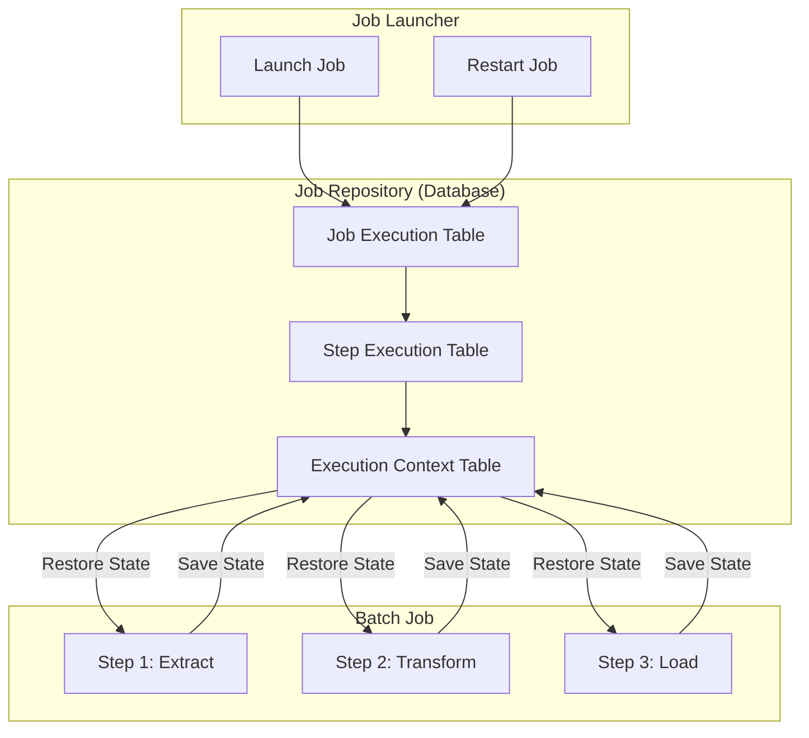
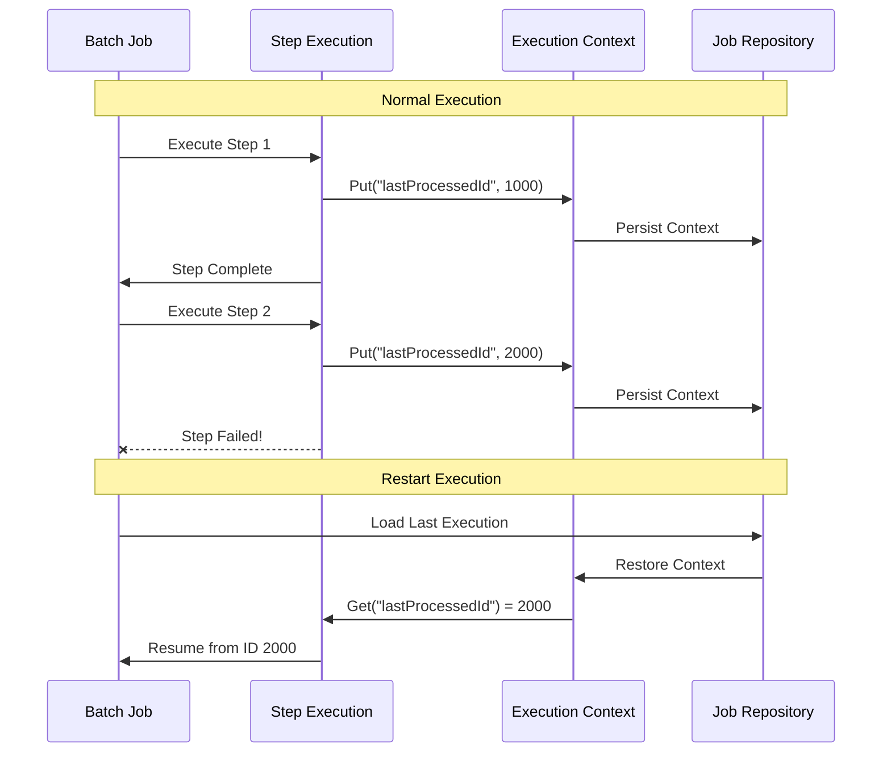
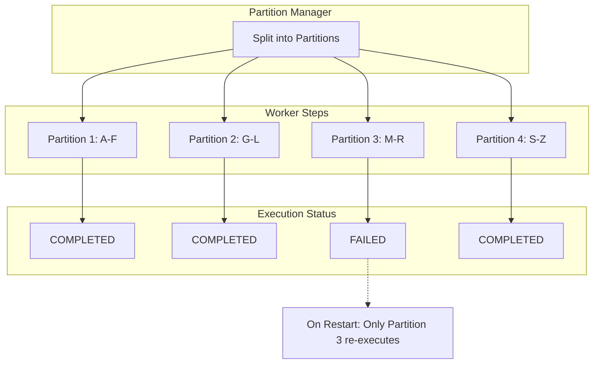

# How to Create Batch Restart

Author: [nawazdhandala](https://github.com/nawazdhandala)

Tags: Batch Processing, Restart, Fault Tolerance, Spring Batch

Description: Learn to create batch restart capabilities for resuming failed jobs from their last successful checkpoint.

---

When a batch job processes millions of records and fails at record 750,000, you have two choices: start over from scratch (wasting hours of work) or restart from the last checkpoint. Batch restart capability transforms unreliable long-running jobs into resilient, production-ready pipelines.

## Why Batch Restart Matters

| Without Restart | With Restart |
|-----------------|--------------|
| Failed job = start over | Resume from checkpoint |
| Hours of wasted processing | Minimal rework |
| Resource waste | Efficient recovery |
| Manual intervention | Automatic resume |
| Data inconsistency risk | Consistent state |

## Core Concepts

### What is Batch Restart?

Batch restart is the ability to resume a failed or stopped batch job from its last successful checkpoint rather than starting from the beginning. This requires:

1. **Execution Context**: Persistent storage of job and step state
2. **Job Repository**: Database tracking job executions and their status
3. **Checkpointing**: Regular saves of processing progress
4. **Idempotent Operations**: Safe to reprocess without side effects

```
Execution Flow with Restart
===========================

First Run (Fails at Step 2):
[Step 1] --> [Step 2] --> X (Failure)
   OK         FAILED

Restart (Resumes from Step 2):
[Step 1] --> [Step 2] --> [Step 3] --> Done
  SKIP        RESUME        OK
```

## Architecture Overview



## Job Repository Configuration

The Job Repository is the foundation of restart capability. It persists all execution metadata to a database.

### Database Schema

```sql
-- Job instance: unique job + parameters combination
CREATE TABLE batch_job_instance (
    job_instance_id BIGINT PRIMARY KEY,
    version BIGINT,
    job_name VARCHAR(100) NOT NULL,
    job_key VARCHAR(32) NOT NULL,
    CONSTRAINT job_inst_un UNIQUE (job_name, job_key)
);

-- Job execution: each run attempt of a job instance
CREATE TABLE batch_job_execution (
    job_execution_id BIGINT PRIMARY KEY,
    version BIGINT,
    job_instance_id BIGINT NOT NULL,
    create_time TIMESTAMP NOT NULL,
    start_time TIMESTAMP,
    end_time TIMESTAMP,
    status VARCHAR(10),
    exit_code VARCHAR(2500),
    exit_message VARCHAR(2500),
    last_updated TIMESTAMP,
    FOREIGN KEY (job_instance_id) REFERENCES batch_job_instance(job_instance_id)
);

-- Step execution: each step within a job execution
CREATE TABLE batch_step_execution (
    step_execution_id BIGINT PRIMARY KEY,
    version BIGINT NOT NULL,
    step_name VARCHAR(100) NOT NULL,
    job_execution_id BIGINT NOT NULL,
    create_time TIMESTAMP NOT NULL,
    start_time TIMESTAMP,
    end_time TIMESTAMP,
    status VARCHAR(10),
    commit_count BIGINT,
    read_count BIGINT,
    filter_count BIGINT,
    write_count BIGINT,
    read_skip_count BIGINT,
    write_skip_count BIGINT,
    process_skip_count BIGINT,
    rollback_count BIGINT,
    exit_code VARCHAR(2500),
    exit_message VARCHAR(2500),
    last_updated TIMESTAMP,
    FOREIGN KEY (job_execution_id) REFERENCES batch_job_execution(job_execution_id)
);

-- Execution context: serialized state for restart
CREATE TABLE batch_step_execution_context (
    step_execution_id BIGINT PRIMARY KEY,
    short_context VARCHAR(2500) NOT NULL,
    serialized_context TEXT,
    FOREIGN KEY (step_execution_id) REFERENCES batch_step_execution(step_execution_id)
);

-- Job execution context: job-level state
CREATE TABLE batch_job_execution_context (
    job_execution_id BIGINT PRIMARY KEY,
    short_context VARCHAR(2500) NOT NULL,
    serialized_context TEXT,
    FOREIGN KEY (job_execution_id) REFERENCES batch_job_execution(job_execution_id)
);
```

### Spring Batch Configuration

```java
// BatchConfiguration.java
// Configures the Job Repository with database persistence for restart support.
// The repository tracks all job and step executions enabling recovery from failures.

package com.example.batch.config;

import org.springframework.batch.core.configuration.annotation.EnableBatchProcessing;
import org.springframework.batch.core.repository.JobRepository;
import org.springframework.batch.core.repository.support.JobRepositoryFactoryBean;
import org.springframework.context.annotation.Bean;
import org.springframework.context.annotation.Configuration;
import org.springframework.transaction.PlatformTransactionManager;

import javax.sql.DataSource;

@Configuration
@EnableBatchProcessing
public class BatchConfiguration {

    // DataSource pointing to the batch metadata database
    private final DataSource dataSource;

    // Transaction manager for atomic commits
    private final PlatformTransactionManager transactionManager;

    public BatchConfiguration(DataSource dataSource,
                             PlatformTransactionManager transactionManager) {
        this.dataSource = dataSource;
        this.transactionManager = transactionManager;
    }

    @Bean
    public JobRepository jobRepository() throws Exception {
        JobRepositoryFactoryBean factory = new JobRepositoryFactoryBean();

        // Connect to database for persistent storage
        factory.setDataSource(dataSource);
        factory.setTransactionManager(transactionManager);

        // Use default table prefix (BATCH_)
        factory.setTablePrefix("BATCH_");

        // Set isolation level for concurrent job executions
        factory.setIsolationLevelForCreate("ISOLATION_SERIALIZABLE");

        // Maximum length for VARCHAR columns
        factory.setMaxVarCharLength(2500);

        factory.afterPropertiesSet();
        return factory.getObject();
    }
}
```

## Execution Context

The Execution Context stores state that survives job restarts. It operates at two levels: Job level (shared across all steps) and Step level (specific to each step).

### Execution Context Flow



### Using Execution Context in Steps

```java
// OrderProcessingTasklet.java
// Demonstrates how to save and restore state using ExecutionContext.
// The lastProcessedId is persisted allowing restart from the last checkpoint.

package com.example.batch.tasklet;

import org.springframework.batch.core.StepContribution;
import org.springframework.batch.core.scope.context.ChunkContext;
import org.springframework.batch.core.step.tasklet.Tasklet;
import org.springframework.batch.item.ExecutionContext;
import org.springframework.batch.repeat.RepeatStatus;

import java.util.List;

public class OrderProcessingTasklet implements Tasklet {

    private static final String LAST_PROCESSED_ID = "lastProcessedId";
    private static final int BATCH_SIZE = 1000;

    private final OrderRepository orderRepository;
    private final OrderProcessor orderProcessor;

    public OrderProcessingTasklet(OrderRepository orderRepository,
                                  OrderProcessor orderProcessor) {
        this.orderRepository = orderRepository;
        this.orderProcessor = orderProcessor;
    }

    @Override
    public RepeatStatus execute(StepContribution contribution,
                                ChunkContext chunkContext) throws Exception {

        // Get the step execution context for this step
        ExecutionContext stepContext = chunkContext
            .getStepContext()
            .getStepExecution()
            .getExecutionContext();

        // Restore last processed ID from previous run (or start from 0)
        Long lastProcessedId = stepContext.containsKey(LAST_PROCESSED_ID)
            ? stepContext.getLong(LAST_PROCESSED_ID)
            : 0L;

        // Fetch next batch of orders starting after the checkpoint
        List<Order> orders = orderRepository.findOrdersAfterId(
            lastProcessedId,
            BATCH_SIZE
        );

        if (orders.isEmpty()) {
            // No more orders to process
            return RepeatStatus.FINISHED;
        }

        // Process each order in the batch
        for (Order order : orders) {
            orderProcessor.process(order);

            // Update checkpoint after each successful process
            // This ensures minimal rework on restart
            lastProcessedId = order.getId();
            stepContext.putLong(LAST_PROCESSED_ID, lastProcessedId);
        }

        // Update contribution metrics for monitoring
        contribution.incrementReadCount();
        contribution.incrementWriteCount();

        // Continue processing (more orders may exist)
        return RepeatStatus.CONTINUABLE;
    }
}
```

### Job-Level Execution Context

```java
// DataExportJob.java
// Shows job-level context for sharing state across multiple steps.
// The export timestamp is set in step 1 and used by all subsequent steps.

package com.example.batch.job;

import org.springframework.batch.core.Job;
import org.springframework.batch.core.Step;
import org.springframework.batch.core.job.builder.JobBuilder;
import org.springframework.batch.core.repository.JobRepository;
import org.springframework.batch.core.step.builder.StepBuilder;
import org.springframework.batch.core.step.tasklet.Tasklet;
import org.springframework.batch.item.ExecutionContext;
import org.springframework.batch.repeat.RepeatStatus;
import org.springframework.context.annotation.Bean;
import org.springframework.context.annotation.Configuration;
import org.springframework.transaction.PlatformTransactionManager;

import java.time.Instant;

@Configuration
public class DataExportJob {

    @Bean
    public Job exportJob(JobRepository jobRepository,
                        Step initializeStep,
                        Step extractStep,
                        Step transformStep,
                        Step loadStep) {
        return new JobBuilder("dataExportJob", jobRepository)
            .start(initializeStep)
            .next(extractStep)
            .next(transformStep)
            .next(loadStep)
            .build();
    }

    @Bean
    public Step initializeStep(JobRepository jobRepository,
                               PlatformTransactionManager transactionManager) {
        return new StepBuilder("initializeStep", jobRepository)
            .tasklet((contribution, chunkContext) -> {
                // Access job-level execution context
                ExecutionContext jobContext = chunkContext
                    .getStepContext()
                    .getStepExecution()
                    .getJobExecution()
                    .getExecutionContext();

                // Set values that all steps can access
                if (!jobContext.containsKey("exportTimestamp")) {
                    jobContext.putString("exportTimestamp", Instant.now().toString());
                    jobContext.putString("exportId", generateExportId());
                }

                return RepeatStatus.FINISHED;
            }, transactionManager)
            .build();
    }

    private String generateExportId() {
        return "EXP-" + System.currentTimeMillis();
    }
}
```

## Configuring Restartability

### Step Configuration Options

```java
// RestartableStepConfiguration.java
// Configures steps with restart behavior including limits and save intervals.

package com.example.batch.config;

import org.springframework.batch.core.Step;
import org.springframework.batch.core.repository.JobRepository;
import org.springframework.batch.core.step.builder.StepBuilder;
import org.springframework.batch.item.ItemProcessor;
import org.springframework.batch.item.ItemReader;
import org.springframework.batch.item.ItemWriter;
import org.springframework.context.annotation.Bean;
import org.springframework.context.annotation.Configuration;
import org.springframework.transaction.PlatformTransactionManager;

@Configuration
public class RestartableStepConfiguration {

    @Bean
    public Step restartableChunkStep(JobRepository jobRepository,
                                     PlatformTransactionManager transactionManager,
                                     ItemReader<InputRecord> reader,
                                     ItemProcessor<InputRecord, OutputRecord> processor,
                                     ItemWriter<OutputRecord> writer) {
        return new StepBuilder("restartableChunkStep", jobRepository)
            // Process 100 items per transaction/chunk
            .<InputRecord, OutputRecord>chunk(100, transactionManager)
            .reader(reader)
            .processor(processor)
            .writer(writer)

            // Allow restart (default is true)
            .allowStartIfComplete(false)

            // Limit restart attempts to prevent infinite loops
            // Set to Integer.MAX_VALUE for unlimited restarts
            .startLimit(3)

            // Save execution context every N items for finer checkpoints
            // Lower values = more frequent saves = more overhead but safer
            .saveState(true)

            .build();
    }

    @Bean
    public Step nonRestartableStep(JobRepository jobRepository,
                                   PlatformTransactionManager transactionManager,
                                   Tasklet oneTimeTasklet) {
        return new StepBuilder("nonRestartableStep", jobRepository)
            .tasklet(oneTimeTasklet, transactionManager)

            // Prevent restart for steps that should run once per job instance
            .allowStartIfComplete(true)

            // Only allow one execution attempt
            .startLimit(1)

            .build();
    }
}
```

### Job Restart Configuration

```java
// JobRestartConfiguration.java
// Configures job-level restart settings and prevents duplicate runs.

package com.example.batch.config;

import org.springframework.batch.core.Job;
import org.springframework.batch.core.Step;
import org.springframework.batch.core.job.builder.JobBuilder;
import org.springframework.batch.core.repository.JobRepository;
import org.springframework.context.annotation.Bean;
import org.springframework.context.annotation.Configuration;

@Configuration
public class JobRestartConfiguration {

    @Bean
    public Job restartableJob(JobRepository jobRepository,
                              Step step1,
                              Step step2,
                              Step step3) {
        return new JobBuilder("restartableJob", jobRepository)
            .start(step1)
            .next(step2)
            .next(step3)

            // Allow job to be restarted after failure
            // Set to false for one-time jobs that should never restart
            .preventRestart()  // Remove this line to enable restart

            .build();
    }

    @Bean
    public Job alwaysRestartableJob(JobRepository jobRepository,
                                    Step extractStep,
                                    Step transformStep,
                                    Step loadStep) {
        return new JobBuilder("dataProcessingJob", jobRepository)
            .start(extractStep)
            .next(transformStep)
            .next(loadStep)
            // Restart is enabled by default (no preventRestart call)
            .build();
    }
}
```

## Restart Strategies

### Strategy 1: Cursor-Based Restart

Best for sequential processing of ordered data.


```java
// CursorBasedItemReader.java
// Implements cursor-based restart by tracking the last processed ID.
// On restart, queries resume from the saved cursor position.

package com.example.batch.reader;

import org.springframework.batch.item.ExecutionContext;
import org.springframework.batch.item.ItemStreamReader;
import org.springframework.batch.item.database.JdbcCursorItemReader;
import org.springframework.batch.item.database.builder.JdbcCursorItemReaderBuilder;

import javax.sql.DataSource;

public class CursorBasedItemReader implements ItemStreamReader<Order> {

    private static final String CURRENT_ID_KEY = "current.order.id";

    private final DataSource dataSource;
    private JdbcCursorItemReader<Order> delegate;
    private Long lastProcessedId = 0L;

    public CursorBasedItemReader(DataSource dataSource) {
        this.dataSource = dataSource;
    }

    @Override
    public void open(ExecutionContext executionContext) {
        // Restore cursor position from previous run
        if (executionContext.containsKey(CURRENT_ID_KEY)) {
            lastProcessedId = executionContext.getLong(CURRENT_ID_KEY);
        }

        // Build reader with dynamic SQL based on checkpoint
        delegate = new JdbcCursorItemReaderBuilder<Order>()
            .name("orderReader")
            .dataSource(dataSource)
            // Start from last processed ID (exclusive)
            .sql("SELECT id, customer_id, amount, status " +
                 "FROM orders WHERE id > ? ORDER BY id")
            .preparedStatementSetter(ps -> ps.setLong(1, lastProcessedId))
            .rowMapper((rs, rowNum) -> new Order(
                rs.getLong("id"),
                rs.getLong("customer_id"),
                rs.getBigDecimal("amount"),
                rs.getString("status")
            ))
            .build();

        delegate.open(executionContext);
    }

    @Override
    public Order read() throws Exception {
        Order order = delegate.read();
        if (order != null) {
            lastProcessedId = order.getId();
        }
        return order;
    }

    @Override
    public void update(ExecutionContext executionContext) {
        // Save current position for restart
        executionContext.putLong(CURRENT_ID_KEY, lastProcessedId);
        delegate.update(executionContext);
    }

    @Override
    public void close() {
        if (delegate != null) {
            delegate.close();
        }
    }
}
```

### Strategy 2: Chunk-Based Restart

Best for bulk operations with transaction boundaries.

```java
// ChunkRestartableStep.java
// Demonstrates chunk-based restart where each committed chunk is a checkpoint.
// Failed chunks are retried; completed chunks are skipped on restart.

package com.example.batch.step;

import org.springframework.batch.core.Step;
import org.springframework.batch.core.repository.JobRepository;
import org.springframework.batch.core.step.builder.StepBuilder;
import org.springframework.batch.item.ItemProcessor;
import org.springframework.batch.item.ItemWriter;
import org.springframework.batch.item.file.FlatFileItemReader;
import org.springframework.batch.item.file.builder.FlatFileItemReaderBuilder;
import org.springframework.context.annotation.Bean;
import org.springframework.context.annotation.Configuration;
import org.springframework.core.io.FileSystemResource;
import org.springframework.transaction.PlatformTransactionManager;

@Configuration
public class ChunkRestartableStep {

    @Bean
    public Step importFileStep(JobRepository jobRepository,
                               PlatformTransactionManager transactionManager) {
        return new StepBuilder("importFileStep", jobRepository)
            // Each chunk of 500 items is a transaction
            // Committed chunks are checkpoints for restart
            .<Record, ProcessedRecord>chunk(500, transactionManager)
            .reader(fileReader())
            .processor(recordProcessor())
            .writer(recordWriter())

            // Enable state saving (critical for restart)
            .saveState(true)

            // Configure retry for transient failures
            .faultTolerant()
            .retryLimit(3)
            .retry(TransientDataAccessException.class)

            // Skip bad records instead of failing entire job
            .skipLimit(100)
            .skip(DataValidationException.class)

            .build();
    }

    @Bean
    public FlatFileItemReader<Record> fileReader() {
        return new FlatFileItemReaderBuilder<Record>()
            .name("recordReader")
            .resource(new FileSystemResource("/data/input/records.csv"))
            .delimited()
            .names("id", "name", "value", "timestamp")
            .targetType(Record.class)
            // Enable restart by saving line count
            .saveState(true)
            .build();
    }

    private ItemProcessor<Record, ProcessedRecord> recordProcessor() {
        return record -> {
            // Transform record
            return new ProcessedRecord(
                record.getId(),
                record.getName().toUpperCase(),
                record.getValue() * 1.1,
                record.getTimestamp()
            );
        };
    }

    private ItemWriter<ProcessedRecord> recordWriter() {
        return items -> {
            // Write to database
            for (ProcessedRecord item : items) {
                // Insert or update logic
            }
        };
    }
}
```

### Strategy 3: Partition-Based Restart

Best for parallel processing with independent partitions.



```java
// PartitionedJobConfiguration.java
// Configures a partitioned job where each partition restarts independently.
// Failed partitions retry while completed partitions are skipped.

package com.example.batch.partition;

import org.springframework.batch.core.Job;
import org.springframework.batch.core.Step;
import org.springframework.batch.core.job.builder.JobBuilder;
import org.springframework.batch.core.partition.support.Partitioner;
import org.springframework.batch.core.repository.JobRepository;
import org.springframework.batch.core.step.builder.StepBuilder;
import org.springframework.batch.item.ExecutionContext;
import org.springframework.context.annotation.Bean;
import org.springframework.context.annotation.Configuration;
import org.springframework.core.task.SimpleAsyncTaskExecutor;
import org.springframework.transaction.PlatformTransactionManager;

import java.util.HashMap;
import java.util.Map;

@Configuration
public class PartitionedJobConfiguration {

    @Bean
    public Job partitionedJob(JobRepository jobRepository,
                              Step managerStep) {
        return new JobBuilder("partitionedJob", jobRepository)
            .start(managerStep)
            .build();
    }

    @Bean
    public Step managerStep(JobRepository jobRepository,
                            Step workerStep,
                            Partitioner rangePartitioner) {
        return new StepBuilder("managerStep", jobRepository)
            // Partition the work across multiple worker steps
            .partitioner("workerStep", rangePartitioner)
            .step(workerStep)
            // Run partitions in parallel
            .taskExecutor(new SimpleAsyncTaskExecutor())
            // Number of concurrent partitions
            .gridSize(4)
            .build();
    }

    @Bean
    public Partitioner rangePartitioner() {
        return gridSize -> {
            Map<String, ExecutionContext> partitions = new HashMap<>();

            // Split data into ranges (e.g., by ID ranges)
            long totalRecords = getTotalRecordCount();
            long rangeSize = totalRecords / gridSize;

            for (int i = 0; i < gridSize; i++) {
                ExecutionContext context = new ExecutionContext();

                long startId = i * rangeSize + 1;
                long endId = (i == gridSize - 1)
                    ? totalRecords
                    : (i + 1) * rangeSize;

                context.putLong("startId", startId);
                context.putLong("endId", endId);
                context.putString("partitionName", "partition" + i);

                partitions.put("partition" + i, context);
            }

            return partitions;
        };
    }

    @Bean
    public Step workerStep(JobRepository jobRepository,
                           PlatformTransactionManager transactionManager,
                           PartitionedItemReader reader,
                           PartitionedItemWriter writer) {
        return new StepBuilder("workerStep", jobRepository)
            .<Record, Record>chunk(100, transactionManager)
            .reader(reader)
            .writer(writer)
            // Each partition maintains its own execution context
            .saveState(true)
            .build();
    }

    private long getTotalRecordCount() {
        // Query database for total count
        return 1000000L;
    }
}
```

## Implementing Idempotent Operations

Restart safety requires idempotent operations. Processing the same record twice should produce the same result.

```java
// IdempotentOrderProcessor.java
// Ensures operations are safe to retry by checking for existing results.

package com.example.batch.processor;

import org.springframework.batch.item.ItemProcessor;
import org.springframework.dao.DuplicateKeyException;

public class IdempotentOrderProcessor implements ItemProcessor<Order, ProcessedOrder> {

    private final OrderRepository orderRepository;
    private final ProcessedOrderRepository processedOrderRepository;

    public IdempotentOrderProcessor(OrderRepository orderRepository,
                                    ProcessedOrderRepository processedOrderRepository) {
        this.orderRepository = orderRepository;
        this.processedOrderRepository = processedOrderRepository;
    }

    @Override
    public ProcessedOrder process(Order order) throws Exception {
        // Check if already processed (idempotency check)
        if (processedOrderRepository.existsByOrderId(order.getId())) {
            // Skip already processed orders
            return null;
        }

        // Process the order
        ProcessedOrder processed = new ProcessedOrder();
        processed.setOrderId(order.getId());
        processed.setProcessedAmount(calculateFinalAmount(order));
        processed.setProcessedAt(Instant.now());
        processed.setStatus("PROCESSED");

        return processed;
    }

    private BigDecimal calculateFinalAmount(Order order) {
        // Business logic for calculating final amount
        return order.getAmount()
            .multiply(BigDecimal.valueOf(1.08))  // Add tax
            .setScale(2, RoundingMode.HALF_UP);
    }
}

// IdempotentItemWriter.java
// Uses upsert pattern to safely handle duplicate writes on restart.

package com.example.batch.writer;

import org.springframework.batch.item.Chunk;
import org.springframework.batch.item.ItemWriter;
import org.springframework.jdbc.core.namedparam.NamedParameterJdbcTemplate;
import org.springframework.jdbc.core.namedparam.SqlParameterSource;
import org.springframework.jdbc.core.namedparam.SqlParameterSourceUtils;

public class IdempotentItemWriter implements ItemWriter<ProcessedOrder> {

    private final NamedParameterJdbcTemplate jdbcTemplate;

    // Upsert SQL: insert if not exists, update if exists
    private static final String UPSERT_SQL = """
        INSERT INTO processed_orders (order_id, amount, status, processed_at)
        VALUES (:orderId, :amount, :status, :processedAt)
        ON CONFLICT (order_id) DO UPDATE SET
            amount = EXCLUDED.amount,
            status = EXCLUDED.status,
            processed_at = EXCLUDED.processed_at
        """;

    public IdempotentItemWriter(NamedParameterJdbcTemplate jdbcTemplate) {
        this.jdbcTemplate = jdbcTemplate;
    }

    @Override
    public void write(Chunk<? extends ProcessedOrder> items) throws Exception {
        SqlParameterSource[] batchParams = SqlParameterSourceUtils
            .createBatch(items.getItems().toArray());

        // Batch upsert is idempotent: safe to retry
        jdbcTemplate.batchUpdate(UPSERT_SQL, batchParams);
    }
}
```

## Job Launcher for Restart

```java
// BatchJobLauncher.java
// Provides methods to launch new jobs and restart failed ones.

package com.example.batch.launcher;

import org.springframework.batch.core.Job;
import org.springframework.batch.core.JobExecution;
import org.springframework.batch.core.JobParameters;
import org.springframework.batch.core.JobParametersBuilder;
import org.springframework.batch.core.explore.JobExplorer;
import org.springframework.batch.core.launch.JobLauncher;
import org.springframework.batch.core.launch.JobOperator;
import org.springframework.stereotype.Service;

import java.util.Date;
import java.util.List;
import java.util.Set;

@Service
public class BatchJobLauncher {

    private final JobLauncher jobLauncher;
    private final JobExplorer jobExplorer;
    private final JobOperator jobOperator;
    private final Job dataProcessingJob;

    public BatchJobLauncher(JobLauncher jobLauncher,
                           JobExplorer jobExplorer,
                           JobOperator jobOperator,
                           Job dataProcessingJob) {
        this.jobLauncher = jobLauncher;
        this.jobExplorer = jobExplorer;
        this.jobOperator = jobOperator;
        this.dataProcessingJob = dataProcessingJob;
    }

    /**
     * Launch a new job execution with the given parameters.
     */
    public JobExecution launchJob(String inputFile) throws Exception {
        JobParameters params = new JobParametersBuilder()
            .addString("inputFile", inputFile)
            .addDate("runDate", new Date())
            .toJobParameters();

        return jobLauncher.run(dataProcessingJob, params);
    }

    /**
     * Restart the most recent failed execution of a job.
     */
    public Long restartLastFailedExecution(String jobName) throws Exception {
        // Find the last execution of this job
        List<Long> executionIds = jobExplorer
            .getJobInstances(jobName, 0, 1)
            .stream()
            .flatMap(instance -> jobExplorer
                .getJobExecutions(instance)
                .stream())
            .filter(execution -> execution.getStatus().isUnsuccessful())
            .map(JobExecution::getId)
            .toList();

        if (executionIds.isEmpty()) {
            throw new IllegalStateException(
                "No failed execution found for job: " + jobName
            );
        }

        // Restart the failed execution
        return jobOperator.restart(executionIds.get(0));
    }

    /**
     * Restart a specific failed execution by ID.
     */
    public Long restartExecution(Long executionId) throws Exception {
        JobExecution execution = jobExplorer.getJobExecution(executionId);

        if (execution == null) {
            throw new IllegalArgumentException(
                "No execution found with ID: " + executionId
            );
        }

        if (!execution.getStatus().isUnsuccessful()) {
            throw new IllegalStateException(
                "Execution " + executionId + " is not in a failed state: " +
                execution.getStatus()
            );
        }

        return jobOperator.restart(executionId);
    }

    /**
     * Get all restartable (failed) executions for a job.
     */
    public List<JobExecution> getRestartableExecutions(String jobName) {
        return jobExplorer
            .getJobInstances(jobName, 0, 100)
            .stream()
            .flatMap(instance -> jobExplorer
                .getJobExecutions(instance)
                .stream())
            .filter(execution -> execution.getStatus().isUnsuccessful())
            .toList();
    }
}
```

## REST API for Job Management

```java
// BatchJobController.java
// REST endpoints for launching, restarting, and monitoring batch jobs.

package com.example.batch.controller;

import org.springframework.batch.core.BatchStatus;
import org.springframework.batch.core.JobExecution;
import org.springframework.batch.core.explore.JobExplorer;
import org.springframework.http.ResponseEntity;
import org.springframework.web.bind.annotation.*;

import java.util.List;
import java.util.Map;

@RestController
@RequestMapping("/api/batch")
public class BatchJobController {

    private final BatchJobLauncher batchJobLauncher;
    private final JobExplorer jobExplorer;

    public BatchJobController(BatchJobLauncher batchJobLauncher,
                             JobExplorer jobExplorer) {
        this.batchJobLauncher = batchJobLauncher;
        this.jobExplorer = jobExplorer;
    }

    /**
     * Launch a new job execution.
     * POST /api/batch/jobs/dataProcessing/launch
     */
    @PostMapping("/jobs/{jobName}/launch")
    public ResponseEntity<Map<String, Object>> launchJob(
            @PathVariable String jobName,
            @RequestBody Map<String, String> params) {
        try {
            JobExecution execution = batchJobLauncher
                .launchJob(params.get("inputFile"));

            return ResponseEntity.ok(Map.of(
                "executionId", execution.getId(),
                "status", execution.getStatus().name(),
                "message", "Job launched successfully"
            ));
        } catch (Exception e) {
            return ResponseEntity.badRequest().body(Map.of(
                "error", e.getMessage()
            ));
        }
    }

    /**
     * Restart a failed job execution.
     * POST /api/batch/executions/123/restart
     */
    @PostMapping("/executions/{executionId}/restart")
    public ResponseEntity<Map<String, Object>> restartExecution(
            @PathVariable Long executionId) {
        try {
            Long newExecutionId = batchJobLauncher
                .restartExecution(executionId);

            return ResponseEntity.ok(Map.of(
                "originalExecutionId", executionId,
                "newExecutionId", newExecutionId,
                "message", "Job restarted successfully"
            ));
        } catch (Exception e) {
            return ResponseEntity.badRequest().body(Map.of(
                "error", e.getMessage()
            ));
        }
    }

    /**
     * Get execution status and details.
     * GET /api/batch/executions/123
     */
    @GetMapping("/executions/{executionId}")
    public ResponseEntity<Map<String, Object>> getExecution(
            @PathVariable Long executionId) {
        JobExecution execution = jobExplorer.getJobExecution(executionId);

        if (execution == null) {
            return ResponseEntity.notFound().build();
        }

        return ResponseEntity.ok(Map.of(
            "executionId", execution.getId(),
            "jobName", execution.getJobInstance().getJobName(),
            "status", execution.getStatus().name(),
            "startTime", execution.getStartTime(),
            "endTime", execution.getEndTime(),
            "exitCode", execution.getExitStatus().getExitCode(),
            "exitDescription", execution.getExitStatus().getExitDescription(),
            "stepExecutions", execution.getStepExecutions().stream()
                .map(step -> Map.of(
                    "stepName", step.getStepName(),
                    "status", step.getStatus().name(),
                    "readCount", step.getReadCount(),
                    "writeCount", step.getWriteCount(),
                    "commitCount", step.getCommitCount(),
                    "rollbackCount", step.getRollbackCount()
                ))
                .toList()
        ));
    }

    /**
     * List all restartable (failed) executions.
     * GET /api/batch/jobs/dataProcessing/restartable
     */
    @GetMapping("/jobs/{jobName}/restartable")
    public ResponseEntity<List<Map<String, Object>>> getRestartableExecutions(
            @PathVariable String jobName) {
        List<Map<String, Object>> executions = batchJobLauncher
            .getRestartableExecutions(jobName)
            .stream()
            .map(exec -> Map.<String, Object>of(
                "executionId", exec.getId(),
                "status", exec.getStatus().name(),
                "startTime", exec.getStartTime(),
                "endTime", exec.getEndTime(),
                "exitDescription", exec.getExitStatus().getExitDescription()
            ))
            .toList();

        return ResponseEntity.ok(executions);
    }
}
```

## Error Handling and Recovery

```java
// ErrorHandlingConfiguration.java
// Configures comprehensive error handling with skip, retry, and listeners.

package com.example.batch.config;

import org.springframework.batch.core.Step;
import org.springframework.batch.core.repository.JobRepository;
import org.springframework.batch.core.step.builder.StepBuilder;
import org.springframework.batch.core.step.skip.SkipPolicy;
import org.springframework.batch.item.ItemProcessor;
import org.springframework.batch.item.ItemReader;
import org.springframework.batch.item.ItemWriter;
import org.springframework.context.annotation.Bean;
import org.springframework.context.annotation.Configuration;
import org.springframework.dao.DeadlockLoserDataAccessException;
import org.springframework.transaction.PlatformTransactionManager;

@Configuration
public class ErrorHandlingConfiguration {

    @Bean
    public Step faultTolerantStep(JobRepository jobRepository,
                                  PlatformTransactionManager transactionManager,
                                  ItemReader<Record> reader,
                                  ItemProcessor<Record, ProcessedRecord> processor,
                                  ItemWriter<ProcessedRecord> writer,
                                  SkipPolicy skipPolicy,
                                  BatchJobListener listener) {
        return new StepBuilder("faultTolerantStep", jobRepository)
            .<Record, ProcessedRecord>chunk(100, transactionManager)
            .reader(reader)
            .processor(processor)
            .writer(writer)

            // Enable fault tolerance
            .faultTolerant()

            // Retry configuration for transient errors
            .retryLimit(3)
            .retry(DeadlockLoserDataAccessException.class)
            .retry(OptimisticLockingFailureException.class)
            .retry(TransientDataAccessException.class)

            // Skip configuration for bad records
            .skipPolicy(skipPolicy)
            .skip(DataValidationException.class)
            .skip(MalformedRecordException.class)
            .noSkip(CriticalDataException.class)  // Never skip critical errors

            // Listener for logging and metrics
            .listener(listener)

            // Save state for restart
            .saveState(true)

            .build();
    }

    @Bean
    public SkipPolicy customSkipPolicy() {
        return (throwable, skipCount) -> {
            // Skip up to 1000 validation errors
            if (throwable instanceof DataValidationException) {
                return skipCount < 1000;
            }
            // Skip up to 100 malformed records
            if (throwable instanceof MalformedRecordException) {
                return skipCount < 100;
            }
            // Never skip other exceptions
            return false;
        };
    }
}

// BatchJobListener.java
// Logs execution events and records metrics for monitoring.

package com.example.batch.listener;

import org.springframework.batch.core.JobExecution;
import org.springframework.batch.core.JobExecutionListener;
import org.springframework.batch.core.StepExecution;
import org.springframework.batch.core.StepExecutionListener;
import org.springframework.stereotype.Component;

@Component
public class BatchJobListener implements JobExecutionListener, StepExecutionListener {

    private final MetricsService metricsService;
    private final AlertService alertService;

    public BatchJobListener(MetricsService metricsService,
                           AlertService alertService) {
        this.metricsService = metricsService;
        this.alertService = alertService;
    }

    @Override
    public void beforeJob(JobExecution jobExecution) {
        log.info("Starting job: {} with execution ID: {}",
            jobExecution.getJobInstance().getJobName(),
            jobExecution.getId());

        metricsService.incrementCounter("batch.job.started",
            "job", jobExecution.getJobInstance().getJobName());
    }

    @Override
    public void afterJob(JobExecution jobExecution) {
        String jobName = jobExecution.getJobInstance().getJobName();
        String status = jobExecution.getStatus().name();

        log.info("Job {} completed with status: {}", jobName, status);

        metricsService.incrementCounter("batch.job.completed",
            "job", jobName,
            "status", status);

        // Alert on failure
        if (jobExecution.getStatus().isUnsuccessful()) {
            alertService.sendAlert(
                "Batch Job Failed",
                String.format("Job %s (execution %d) failed: %s",
                    jobName,
                    jobExecution.getId(),
                    jobExecution.getExitStatus().getExitDescription())
            );
        }
    }

    @Override
    public void beforeStep(StepExecution stepExecution) {
        log.info("Starting step: {}", stepExecution.getStepName());
    }

    @Override
    public ExitStatus afterStep(StepExecution stepExecution) {
        log.info("Step {} completed: read={}, written={}, skipped={}",
            stepExecution.getStepName(),
            stepExecution.getReadCount(),
            stepExecution.getWriteCount(),
            stepExecution.getSkipCount());

        // Record step metrics
        metricsService.recordGauge("batch.step.read_count",
            stepExecution.getReadCount(),
            "step", stepExecution.getStepName());

        metricsService.recordGauge("batch.step.write_count",
            stepExecution.getWriteCount(),
            "step", stepExecution.getStepName());

        return stepExecution.getExitStatus();
    }
}
```

## Testing Restart Behavior

```java
// BatchRestartTest.java
// Tests restart functionality to ensure jobs resume correctly.

package com.example.batch.test;

import org.junit.jupiter.api.Test;
import org.springframework.batch.core.BatchStatus;
import org.springframework.batch.core.Job;
import org.springframework.batch.core.JobExecution;
import org.springframework.batch.core.JobParameters;
import org.springframework.batch.core.JobParametersBuilder;
import org.springframework.batch.core.launch.JobLauncher;
import org.springframework.batch.core.launch.JobOperator;
import org.springframework.batch.test.JobLauncherTestUtils;
import org.springframework.batch.test.context.SpringBatchTest;
import org.springframework.beans.factory.annotation.Autowired;
import org.springframework.boot.test.context.SpringBootTest;
import org.springframework.test.context.ActiveProfiles;

import static org.assertj.core.api.Assertions.assertThat;

@SpringBatchTest
@SpringBootTest
@ActiveProfiles("test")
public class BatchRestartTest {

    @Autowired
    private JobLauncherTestUtils jobLauncherTestUtils;

    @Autowired
    private JobOperator jobOperator;

    @Autowired
    private FailureSimulator failureSimulator;

    @Test
    void shouldRestartFromLastCheckpoint() throws Exception {
        // Arrange: Configure failure at record 500
        failureSimulator.setFailAtRecord(500);

        JobParameters params = new JobParametersBuilder()
            .addString("inputFile", "test-data.csv")
            .addLong("timestamp", System.currentTimeMillis())
            .toJobParameters();

        // Act: First run (should fail)
        JobExecution firstExecution = jobLauncherTestUtils.launchJob(params);

        // Assert: First run failed
        assertThat(firstExecution.getStatus()).isEqualTo(BatchStatus.FAILED);
        assertThat(getProcessedCount()).isEqualTo(500);

        // Arrange: Remove failure condition
        failureSimulator.clearFailure();

        // Act: Restart
        Long restartExecutionId = jobOperator.restart(firstExecution.getId());
        JobExecution restartExecution = waitForCompletion(restartExecutionId);

        // Assert: Restart completed and processed remaining records
        assertThat(restartExecution.getStatus()).isEqualTo(BatchStatus.COMPLETED);
        assertThat(getProcessedCount()).isEqualTo(1000);  // Total records
    }

    @Test
    void shouldSkipCompletedStepsOnRestart() throws Exception {
        // Arrange: Configure failure in step 2
        failureSimulator.setFailInStep("transformStep");

        JobParameters params = new JobParametersBuilder()
            .addString("inputFile", "test-data.csv")
            .addLong("timestamp", System.currentTimeMillis())
            .toJobParameters();

        // Act: First run
        JobExecution firstExecution = jobLauncherTestUtils.launchJob(params);

        // Assert: Step 1 completed, step 2 failed
        assertThat(firstExecution.getStatus()).isEqualTo(BatchStatus.FAILED);
        assertThat(getStepStatus(firstExecution, "extractStep"))
            .isEqualTo(BatchStatus.COMPLETED);
        assertThat(getStepStatus(firstExecution, "transformStep"))
            .isEqualTo(BatchStatus.FAILED);

        // Arrange: Clear failure
        failureSimulator.clearFailure();

        // Track step executions
        int extractStepCountBefore = getStepExecutionCount("extractStep");

        // Act: Restart
        Long restartExecutionId = jobOperator.restart(firstExecution.getId());
        JobExecution restartExecution = waitForCompletion(restartExecutionId);

        // Assert: Step 1 was skipped (not re-executed)
        int extractStepCountAfter = getStepExecutionCount("extractStep");
        assertThat(extractStepCountAfter).isEqualTo(extractStepCountBefore);

        // Assert: Job completed
        assertThat(restartExecution.getStatus()).isEqualTo(BatchStatus.COMPLETED);
    }

    @Test
    void shouldRespectStartLimit() throws Exception {
        // Configure persistent failure
        failureSimulator.setAlwaysFail(true);

        JobParameters params = new JobParametersBuilder()
            .addString("inputFile", "test-data.csv")
            .addLong("timestamp", System.currentTimeMillis())
            .toJobParameters();

        // First run
        JobExecution exec1 = jobLauncherTestUtils.launchJob(params);
        assertThat(exec1.getStatus()).isEqualTo(BatchStatus.FAILED);

        // Second restart
        jobOperator.restart(exec1.getId());

        // Third restart
        jobOperator.restart(exec1.getId());

        // Fourth restart should fail due to start limit (3)
        assertThatThrownBy(() -> jobOperator.restart(exec1.getId()))
            .hasMessageContaining("start limit");
    }

    private JobExecution waitForCompletion(Long executionId) throws Exception {
        // Wait for async execution to complete
        Thread.sleep(5000);
        return jobExplorer.getJobExecution(executionId);
    }
}
```

## Production Checklist

| Category | Item | Status |
|----------|------|--------|
| **Database** | Job repository tables created | |
| **Database** | Indexes on job_instance and job_execution tables | |
| **Database** | Connection pool sized for batch load | |
| **Configuration** | Chunk size tuned for throughput | |
| **Configuration** | Start limits set appropriately | |
| **Configuration** | Retry policies for transient errors | |
| **Idempotency** | Processors handle duplicates | |
| **Idempotency** | Writers use upsert pattern | |
| **Monitoring** | Job execution metrics exported | |
| **Monitoring** | Alerts on job failures | |
| **Testing** | Restart scenarios tested | |
| **Testing** | Idempotency verified | |

## Summary

| Component | Purpose | Key Methods |
|-----------|---------|-------------|
| **Job Repository** | Persists execution state | save(), update() |
| **Execution Context** | Stores checkpoint data | put(), get(), containsKey() |
| **ItemReader** | Tracks read position | open(), read(), update() |
| **ItemWriter** | Idempotent writes | write() with upsert |
| **JobOperator** | Restart operations | restart(), stop() |
| **Listeners** | Monitoring and alerts | beforeJob(), afterJob() |

Batch restart transforms fragile jobs into production-ready pipelines. By persisting execution state, implementing checkpoints, and ensuring idempotent operations, your batch processes can recover gracefully from any failure without data loss or duplication.

---

*For monitoring your batch jobs in production, consider using [OneUptime](https://oneuptime.com) to track execution metrics, set up failure alerts, and visualize job performance over time.*
