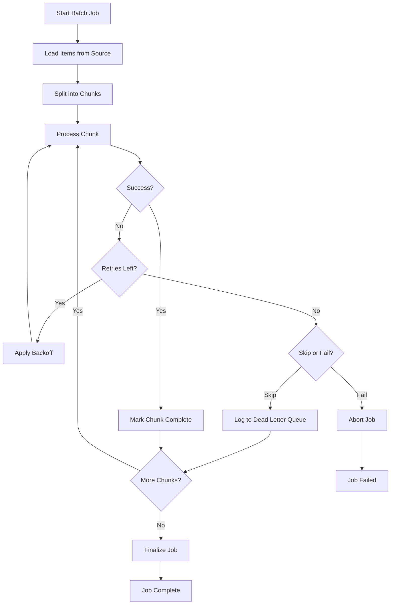
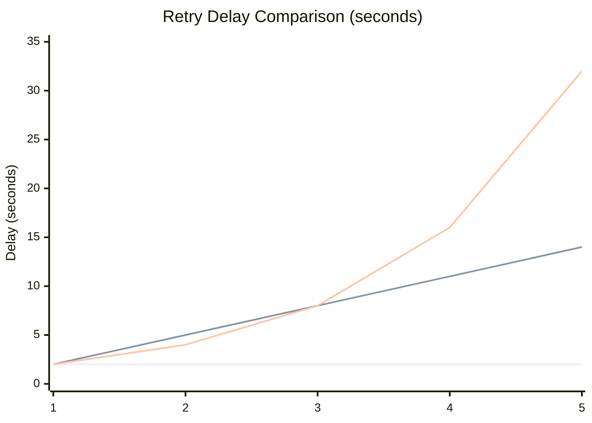
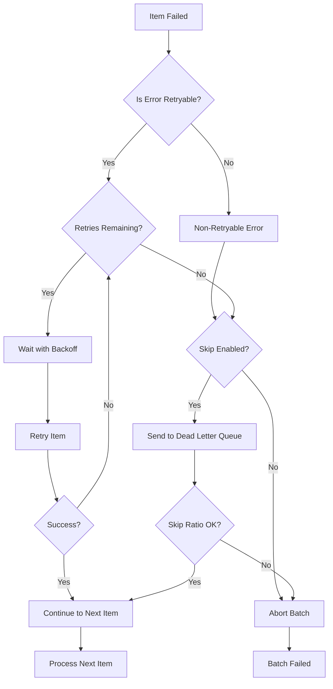
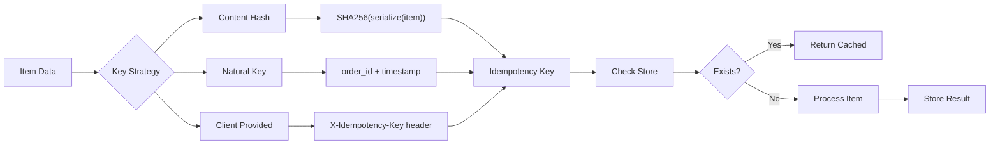

# How to Build Batch Retry Strategies

Author: [nawazdhandala](https://github.com/nawazdhandala)

Tags: Batch Processing, Retry, Fault Tolerance, Reliability

Description: Learn to build batch retry strategies for handling transient failures and ensuring job completion.

---

Batch processing jobs fail. Network timeouts, database locks, rate limits, and temporary service outages all interrupt large data processing tasks. Unlike single API calls, batch jobs require specialized retry strategies that handle partial failures, maintain progress, and ensure idempotent operations. This guide covers production-ready patterns for building resilient batch processing systems.

## Why Batch Retry Is Different

Single request retries and batch retries have fundamentally different requirements:

| Aspect | Single Request | Batch Processing |
|--------|----------------|------------------|
| **Failure scope** | All or nothing | Partial failures common |
| **Progress tracking** | Not needed | Essential for recovery |
| **State management** | Stateless | Stateful checkpoints |
| **Retry granularity** | Whole request | Per-item or per-chunk |
| **Duration** | Seconds | Minutes to hours |

## Batch Processing Flow

The following diagram shows the typical flow of a batch processing system with retry capabilities:



## Retry Policy Types

Different scenarios call for different retry timing strategies. Here are the three most common approaches:

### Fixed Interval Retry

Fixed interval retries wait the same amount of time between each attempt. Simple but can overwhelm recovering services.

```python
import time
from typing import Callable, TypeVar, Optional
from dataclasses import dataclass

T = TypeVar('T')

@dataclass
class RetryConfig:
    """Configuration for retry behavior."""
    max_attempts: int = 3
    delay_seconds: float = 1.0

def retry_fixed(
    func: Callable[[], T],
    config: RetryConfig,
    on_retry: Optional[Callable[[int, Exception], None]] = None
) -> T:
    """
    Retry with fixed delay between attempts.

    Args:
        func: The function to retry
        config: Retry configuration with max_attempts and delay
        on_retry: Optional callback called before each retry

    Returns:
        The result of the function call

    Raises:
        The last exception if all retries fail
    """
    last_exception: Optional[Exception] = None

    for attempt in range(1, config.max_attempts + 1):
        try:
            return func()
        except Exception as e:
            last_exception = e

            if attempt == config.max_attempts:
                break

            if on_retry:
                on_retry(attempt, e)

            # Fixed delay between retries
            time.sleep(config.delay_seconds)

    raise last_exception
```

### Exponential Backoff Retry

Exponential backoff doubles the wait time after each failure, reducing pressure on struggling services.

```python
import time
import random
from typing import Callable, TypeVar, Optional
from dataclasses import dataclass

T = TypeVar('T')

@dataclass
class ExponentialConfig:
    """Configuration for exponential backoff retry."""
    max_attempts: int = 5
    initial_delay: float = 1.0
    max_delay: float = 60.0
    multiplier: float = 2.0
    jitter: bool = True  # Add randomness to prevent thundering herd

def retry_exponential(
    func: Callable[[], T],
    config: ExponentialConfig,
    on_retry: Optional[Callable[[int, float, Exception], None]] = None
) -> T:
    """
    Retry with exponential backoff.

    Each retry waits longer than the previous one:
    Attempt 1: initial_delay
    Attempt 2: initial_delay * multiplier
    Attempt 3: initial_delay * multiplier^2
    ...and so on, capped at max_delay

    Args:
        func: The function to retry
        config: Exponential backoff configuration
        on_retry: Optional callback with (attempt, delay, exception)

    Returns:
        The result of the function call
    """
    last_exception: Optional[Exception] = None
    delay = config.initial_delay

    for attempt in range(1, config.max_attempts + 1):
        try:
            return func()
        except Exception as e:
            last_exception = e

            if attempt == config.max_attempts:
                break

            # Calculate delay with optional jitter
            current_delay = delay
            if config.jitter:
                # Add up to 25% random jitter
                current_delay = delay * (0.75 + random.random() * 0.5)

            if on_retry:
                on_retry(attempt, current_delay, e)

            time.sleep(current_delay)

            # Increase delay for next attempt
            delay = min(delay * config.multiplier, config.max_delay)

    raise last_exception
```

### Linear Backoff Retry

Linear backoff adds a fixed increment to the delay after each failure. Useful when you want predictable, gradual increases.

```python
import time
from typing import Callable, TypeVar, Optional
from dataclasses import dataclass

T = TypeVar('T')

@dataclass
class LinearConfig:
    """Configuration for linear backoff retry."""
    max_attempts: int = 5
    initial_delay: float = 1.0
    increment: float = 2.0  # Add this much delay after each failure
    max_delay: float = 30.0

def retry_linear(
    func: Callable[[], T],
    config: LinearConfig,
    on_retry: Optional[Callable[[int, float, Exception], None]] = None
) -> T:
    """
    Retry with linear backoff.

    Each retry adds a fixed increment to the delay:
    Attempt 1: initial_delay
    Attempt 2: initial_delay + increment
    Attempt 3: initial_delay + 2*increment
    ...and so on, capped at max_delay

    Args:
        func: The function to retry
        config: Linear backoff configuration
        on_retry: Optional callback with (attempt, delay, exception)

    Returns:
        The result of the function call
    """
    last_exception: Optional[Exception] = None

    for attempt in range(1, config.max_attempts + 1):
        try:
            return func()
        except Exception as e:
            last_exception = e

            if attempt == config.max_attempts:
                break

            # Linear delay calculation
            delay = min(
                config.initial_delay + (attempt - 1) * config.increment,
                config.max_delay
            )

            if on_retry:
                on_retry(attempt, delay, e)

            time.sleep(delay)

    raise last_exception
```

## Comparing Retry Policies

The following diagram visualizes how delay grows across different retry policies:



| Policy | Best For | Tradeoff |
|--------|----------|----------|
| **Fixed** | Predictable failures, rate limits | May overwhelm recovering services |
| **Linear** | Gradual recovery scenarios | Moderate pressure reduction |
| **Exponential** | Unknown recovery time, distributed systems | Longer total wait time |

## Retry vs Skip: Handling Persistent Failures

Not all failures should block your entire batch. Some items may have bad data that will never succeed. A robust batch processor needs to decide when to retry and when to skip.

```python
import logging
from typing import Callable, TypeVar, List, Optional, Any
from dataclasses import dataclass, field
from enum import Enum
from datetime import datetime

T = TypeVar('T')

class FailureAction(Enum):
    """What to do when an item fails all retries."""
    RETRY = "retry"      # Keep retrying (up to max)
    SKIP = "skip"        # Skip item, continue batch
    ABORT = "abort"      # Stop the entire batch

@dataclass
class ItemResult:
    """Result of processing a single item."""
    item_id: str
    success: bool
    result: Optional[Any] = None
    error: Optional[str] = None
    attempts: int = 0
    skipped: bool = False

@dataclass
class BatchResult:
    """Summary of batch processing results."""
    total_items: int
    successful: int
    failed: int
    skipped: int
    results: List[ItemResult] = field(default_factory=list)

    @property
    def success_rate(self) -> float:
        if self.total_items == 0:
            return 0.0
        return self.successful / self.total_items

class RetryOrSkipProcessor:
    """
    Batch processor that decides whether to retry or skip failed items.

    Uses configurable rules to determine if an error is retryable.
    Non-retryable errors are sent to a dead letter queue for later analysis.
    """

    def __init__(
        self,
        max_retries: int = 3,
        skip_on_persistent_failure: bool = True,
        max_skip_ratio: float = 0.1,  # Abort if more than 10% items fail
    ):
        self.max_retries = max_retries
        self.skip_on_persistent_failure = skip_on_persistent_failure
        self.max_skip_ratio = max_skip_ratio
        self.dead_letter_queue: List[dict] = []
        self.logger = logging.getLogger(__name__)

    def is_retryable_error(self, error: Exception) -> bool:
        """
        Determine if an error is worth retrying.

        Retryable errors are typically transient:
        - Network timeouts
        - Rate limits (429)
        - Temporary service unavailability (503)
        - Database connection issues

        Non-retryable errors indicate permanent problems:
        - Validation errors (400)
        - Authentication failures (401, 403)
        - Not found (404)
        - Data format issues
        """
        error_str = str(error).lower()

        # Non-retryable patterns
        non_retryable = [
            "validation",
            "invalid",
            "not found",
            "unauthorized",
            "forbidden",
            "bad request",
            "malformed",
        ]

        for pattern in non_retryable:
            if pattern in error_str:
                return False

        # Retryable patterns
        retryable = [
            "timeout",
            "connection",
            "rate limit",
            "too many requests",
            "service unavailable",
            "temporarily",
            "retry",
        ]

        for pattern in retryable:
            if pattern in error_str:
                return True

        # Default to retryable for unknown errors
        return True

    def send_to_dead_letter_queue(
        self,
        item: Any,
        error: Exception,
        attempts: int
    ) -> None:
        """Store failed item for later analysis or manual retry."""
        self.dead_letter_queue.append({
            "item": item,
            "error": str(error),
            "error_type": type(error).__name__,
            "attempts": attempts,
            "timestamp": datetime.utcnow().isoformat(),
        })
        self.logger.warning(
            f"Item sent to dead letter queue after {attempts} attempts: {error}"
        )

    def process_batch(
        self,
        items: List[Any],
        processor: Callable[[Any], T],
        get_item_id: Callable[[Any], str] = str,
    ) -> BatchResult:
        """
        Process a batch of items with retry and skip logic.

        Args:
            items: List of items to process
            processor: Function to process each item
            get_item_id: Function to extract item ID for logging

        Returns:
            BatchResult with success/failure counts and details
        """
        results: List[ItemResult] = []
        skipped_count = 0

        for item in items:
            item_id = get_item_id(item)
            attempts = 0
            last_error: Optional[Exception] = None
            success = False
            result = None

            while attempts < self.max_retries:
                attempts += 1
                try:
                    result = processor(item)
                    success = True
                    break
                except Exception as e:
                    last_error = e

                    # Check if we should retry
                    if not self.is_retryable_error(e):
                        self.logger.info(
                            f"Non-retryable error for {item_id}: {e}"
                        )
                        break

                    if attempts < self.max_retries:
                        self.logger.debug(
                            f"Retrying {item_id}, attempt {attempts + 1}"
                        )

            # Handle final failure
            if not success:
                if self.skip_on_persistent_failure:
                    skipped_count += 1
                    self.send_to_dead_letter_queue(item, last_error, attempts)

                    # Check if too many items are failing
                    current_skip_ratio = skipped_count / len(items)
                    if current_skip_ratio > self.max_skip_ratio:
                        raise RuntimeError(
                            f"Batch abort: skip ratio {current_skip_ratio:.1%} "
                            f"exceeds threshold {self.max_skip_ratio:.1%}"
                        )

                    results.append(ItemResult(
                        item_id=item_id,
                        success=False,
                        error=str(last_error),
                        attempts=attempts,
                        skipped=True,
                    ))
                else:
                    raise last_error
            else:
                results.append(ItemResult(
                    item_id=item_id,
                    success=True,
                    result=result,
                    attempts=attempts,
                ))

        successful = sum(1 for r in results if r.success)
        failed = sum(1 for r in results if not r.success and not r.skipped)

        return BatchResult(
            total_items=len(items),
            successful=successful,
            failed=failed,
            skipped=skipped_count,
            results=results,
        )
```

## Decision Flow: Retry vs Skip vs Abort



## Chunk-Based Processing with Checkpoints

For large batches, process items in chunks and save checkpoints. This allows recovery from failures without reprocessing completed work.

```python
import json
import hashlib
from typing import Callable, TypeVar, List, Optional, Iterator, Any
from dataclasses import dataclass, field, asdict
from datetime import datetime
from pathlib import Path

T = TypeVar('T')

@dataclass
class Checkpoint:
    """Checkpoint state for batch recovery."""
    job_id: str
    total_chunks: int
    completed_chunks: List[int] = field(default_factory=list)
    failed_chunks: List[int] = field(default_factory=list)
    last_updated: str = ""

    def save(self, path: Path) -> None:
        """Persist checkpoint to disk."""
        self.last_updated = datetime.utcnow().isoformat()
        path.write_text(json.dumps(asdict(self), indent=2))

    @classmethod
    def load(cls, path: Path) -> Optional["Checkpoint"]:
        """Load checkpoint from disk if it exists."""
        if path.exists():
            data = json.loads(path.read_text())
            return cls(**data)
        return None

    @property
    def pending_chunks(self) -> List[int]:
        """Get chunks that still need processing."""
        all_chunks = set(range(self.total_chunks))
        done = set(self.completed_chunks)
        return sorted(all_chunks - done)

class ChunkedBatchProcessor:
    """
    Process large batches in chunks with checkpoint recovery.

    Features:
    - Splits work into manageable chunks
    - Saves progress after each chunk
    - Resumes from last checkpoint on restart
    - Retries failed chunks independently
    """

    def __init__(
        self,
        job_id: str,
        chunk_size: int = 100,
        checkpoint_dir: str = "./checkpoints",
        max_chunk_retries: int = 3,
    ):
        self.job_id = job_id
        self.chunk_size = chunk_size
        self.checkpoint_dir = Path(checkpoint_dir)
        self.checkpoint_dir.mkdir(parents=True, exist_ok=True)
        self.max_chunk_retries = max_chunk_retries

        # Generate unique checkpoint file name
        self.checkpoint_path = self.checkpoint_dir / f"{job_id}.checkpoint.json"

    def _chunk_items(self, items: List[Any]) -> Iterator[tuple[int, List[Any]]]:
        """Split items into numbered chunks."""
        for i in range(0, len(items), self.chunk_size):
            chunk_index = i // self.chunk_size
            yield chunk_index, items[i:i + self.chunk_size]

    def process(
        self,
        items: List[Any],
        processor: Callable[[List[Any]], List[T]],
        on_chunk_complete: Optional[Callable[[int, int], None]] = None,
    ) -> List[T]:
        """
        Process items in chunks with checkpoint support.

        Args:
            items: All items to process
            processor: Function that processes a chunk of items
            on_chunk_complete: Callback after each chunk (current, total)

        Returns:
            Combined results from all chunks
        """
        chunks = list(self._chunk_items(items))
        total_chunks = len(chunks)

        # Try to resume from checkpoint
        checkpoint = Checkpoint.load(self.checkpoint_path)
        if checkpoint and checkpoint.job_id == self.job_id:
            print(f"Resuming job {self.job_id} from checkpoint")
            print(f"  Completed: {len(checkpoint.completed_chunks)}/{total_chunks}")
        else:
            checkpoint = Checkpoint(
                job_id=self.job_id,
                total_chunks=total_chunks,
            )

        all_results: dict[int, List[T]] = {}

        # Process pending chunks
        for chunk_index in checkpoint.pending_chunks:
            chunk_items = chunks[chunk_index][1]

            # Retry logic for chunk
            for attempt in range(1, self.max_chunk_retries + 1):
                try:
                    results = processor(chunk_items)
                    all_results[chunk_index] = results

                    # Update checkpoint
                    checkpoint.completed_chunks.append(chunk_index)
                    checkpoint.save(self.checkpoint_path)

                    if on_chunk_complete:
                        on_chunk_complete(
                            len(checkpoint.completed_chunks),
                            total_chunks
                        )

                    break

                except Exception as e:
                    if attempt == self.max_chunk_retries:
                        checkpoint.failed_chunks.append(chunk_index)
                        checkpoint.save(self.checkpoint_path)
                        print(f"Chunk {chunk_index} failed after {attempt} attempts: {e}")
                    else:
                        print(f"Chunk {chunk_index} attempt {attempt} failed, retrying...")

        # Combine results in order
        final_results: List[T] = []
        for i in range(total_chunks):
            if i in all_results:
                final_results.extend(all_results[i])

        # Clean up checkpoint on success
        if not checkpoint.failed_chunks:
            self.checkpoint_path.unlink(missing_ok=True)

        return final_results

# Example usage
def process_user_batch(users: List[dict]) -> List[dict]:
    """Process a chunk of users."""
    results = []
    for user in users:
        # Simulate processing
        results.append({
            "user_id": user["id"],
            "processed": True,
            "timestamp": datetime.utcnow().isoformat(),
        })
    return results

# Create processor with checkpointing
processor = ChunkedBatchProcessor(
    job_id="user-migration-2026-01-30",
    chunk_size=100,
    checkpoint_dir="./batch_checkpoints",
)

# Process with progress callback
users = [{"id": i, "name": f"User {i}"} for i in range(1000)]
results = processor.process(
    users,
    process_user_batch,
    on_chunk_complete=lambda done, total: print(f"Progress: {done}/{total}")
)
```

## Idempotency: Safe to Retry

Idempotent operations produce the same result regardless of how many times they run. This is critical for batch processing because retries should not create duplicate records or double-charge customers.

```python
import hashlib
import json
from typing import Callable, TypeVar, Optional, Any
from dataclasses import dataclass
from datetime import datetime, timedelta
from abc import ABC, abstractmethod

T = TypeVar('T')

class IdempotencyStore(ABC):
    """Abstract store for idempotency keys."""

    @abstractmethod
    def get(self, key: str) -> Optional[dict]:
        """Get stored result for idempotency key."""
        pass

    @abstractmethod
    def set(self, key: str, value: dict, ttl_seconds: int) -> None:
        """Store result with TTL."""
        pass

    @abstractmethod
    def delete(self, key: str) -> None:
        """Remove stored result."""
        pass

class InMemoryIdempotencyStore(IdempotencyStore):
    """Simple in-memory store for development and testing."""

    def __init__(self):
        self._store: dict[str, tuple[dict, datetime]] = {}

    def get(self, key: str) -> Optional[dict]:
        if key in self._store:
            value, expiry = self._store[key]
            if datetime.utcnow() < expiry:
                return value
            del self._store[key]
        return None

    def set(self, key: str, value: dict, ttl_seconds: int) -> None:
        expiry = datetime.utcnow() + timedelta(seconds=ttl_seconds)
        self._store[key] = (value, expiry)

    def delete(self, key: str) -> None:
        self._store.pop(key, None)

@dataclass
class IdempotentResult:
    """Result wrapper that indicates if operation was executed or cached."""
    result: Any
    from_cache: bool
    idempotency_key: str

class IdempotentBatchProcessor:
    """
    Batch processor that ensures operations are idempotent.

    Uses idempotency keys to prevent duplicate processing:
    1. Before processing, check if key exists in store
    2. If exists, return cached result
    3. If not, process and store result
    4. On retry, cached result is returned

    This prevents issues like:
    - Double-charging customers
    - Creating duplicate records
    - Sending duplicate notifications
    """

    def __init__(
        self,
        store: Optional[IdempotencyStore] = None,
        ttl_seconds: int = 86400,  # 24 hours
        key_prefix: str = "batch",
    ):
        self.store = store or InMemoryIdempotencyStore()
        self.ttl_seconds = ttl_seconds
        self.key_prefix = key_prefix

    def generate_idempotency_key(
        self,
        operation: str,
        item: Any,
    ) -> str:
        """
        Generate a unique idempotency key for an operation.

        The key is based on:
        - Operation name (e.g., "create_order")
        - Item data (serialized and hashed)

        Same item + operation always produces same key.
        """
        item_json = json.dumps(item, sort_keys=True, default=str)
        item_hash = hashlib.sha256(item_json.encode()).hexdigest()[:16]
        return f"{self.key_prefix}:{operation}:{item_hash}"

    def process_item(
        self,
        operation: str,
        item: Any,
        processor: Callable[[Any], T],
        custom_key: Optional[str] = None,
    ) -> IdempotentResult:
        """
        Process a single item idempotently.

        Args:
            operation: Name of the operation for key generation
            item: The item to process
            processor: Function to process the item
            custom_key: Optional custom idempotency key

        Returns:
            IdempotentResult with result and cache status
        """
        # Generate or use provided key
        key = custom_key or self.generate_idempotency_key(operation, item)

        # Check cache first
        cached = self.store.get(key)
        if cached is not None:
            return IdempotentResult(
                result=cached["result"],
                from_cache=True,
                idempotency_key=key,
            )

        # Process the item
        try:
            result = processor(item)

            # Store successful result
            self.store.set(
                key,
                {
                    "result": result,
                    "status": "success",
                    "processed_at": datetime.utcnow().isoformat(),
                },
                self.ttl_seconds,
            )

            return IdempotentResult(
                result=result,
                from_cache=False,
                idempotency_key=key,
            )

        except Exception as e:
            # Store failure to prevent retry of non-retryable errors
            error_data = {
                "result": None,
                "status": "failed",
                "error": str(e),
                "error_type": type(e).__name__,
                "processed_at": datetime.utcnow().isoformat(),
            }

            # Only cache non-retryable failures
            if not self._is_retryable(e):
                self.store.set(key, error_data, self.ttl_seconds)

            raise

    def _is_retryable(self, error: Exception) -> bool:
        """Determine if error should be retried."""
        retryable_types = (
            ConnectionError,
            TimeoutError,
            OSError,
        )
        return isinstance(error, retryable_types)

    def process_batch(
        self,
        operation: str,
        items: list,
        processor: Callable[[Any], T],
    ) -> list[IdempotentResult]:
        """
        Process a batch of items idempotently.

        Items that were already processed return cached results.
        This makes the entire batch safe to retry.
        """
        results = []
        for item in items:
            result = self.process_item(operation, item, processor)
            results.append(result)
        return results

# Example: Idempotent payment processing
def process_payment(payment: dict) -> dict:
    """Process a payment (with side effects)."""
    # In reality, this would call a payment gateway
    return {
        "payment_id": payment["id"],
        "amount": payment["amount"],
        "status": "completed",
        "transaction_id": f"txn_{payment['id']}",
    }

# Create idempotent processor
processor = IdempotentBatchProcessor(
    ttl_seconds=86400,  # Results cached for 24 hours
    key_prefix="payments",
)

# Process payments safely
payments = [
    {"id": "pay_001", "amount": 100.00, "customer": "cust_123"},
    {"id": "pay_002", "amount": 250.00, "customer": "cust_456"},
]

results = processor.process_batch("charge", payments, process_payment)

for result in results:
    status = "cached" if result.from_cache else "processed"
    print(f"Payment {result.idempotency_key}: {status}")

# If we retry the same batch, results come from cache
retry_results = processor.process_batch("charge", payments, process_payment)
# All results will have from_cache=True
```

## Idempotency Key Generation Strategies



## Complete Batch Retry System

Here is a production-ready batch processor that combines all the patterns:

```python
import time
import logging
from typing import Callable, TypeVar, List, Optional, Any
from dataclasses import dataclass, field
from enum import Enum
from datetime import datetime
from pathlib import Path

T = TypeVar('T')

class RetryPolicy(Enum):
    """Available retry timing strategies."""
    FIXED = "fixed"
    LINEAR = "linear"
    EXPONENTIAL = "exponential"

@dataclass
class BatchConfig:
    """Complete configuration for batch processing."""
    # Retry settings
    max_retries: int = 3
    retry_policy: RetryPolicy = RetryPolicy.EXPONENTIAL
    initial_delay: float = 1.0
    max_delay: float = 60.0

    # Chunk settings
    chunk_size: int = 100
    checkpoint_enabled: bool = True
    checkpoint_dir: str = "./checkpoints"

    # Failure handling
    skip_on_failure: bool = True
    max_skip_ratio: float = 0.1

    # Idempotency
    idempotency_enabled: bool = True
    idempotency_ttl: int = 86400

@dataclass
class BatchMetrics:
    """Metrics collected during batch processing."""
    start_time: datetime = field(default_factory=datetime.utcnow)
    end_time: Optional[datetime] = None
    total_items: int = 0
    processed: int = 0
    retried: int = 0
    skipped: int = 0
    cached: int = 0

    @property
    def duration_seconds(self) -> float:
        end = self.end_time or datetime.utcnow()
        return (end - self.start_time).total_seconds()

    @property
    def items_per_second(self) -> float:
        if self.duration_seconds == 0:
            return 0
        return self.processed / self.duration_seconds

class BatchProcessor:
    """
    Production-ready batch processor with all retry patterns.

    Features:
    - Configurable retry policies (fixed, linear, exponential)
    - Chunk-based processing with checkpoints
    - Retry vs skip logic with dead letter queue
    - Idempotent operations
    - Comprehensive metrics
    """

    def __init__(self, job_id: str, config: Optional[BatchConfig] = None):
        self.job_id = job_id
        self.config = config or BatchConfig()
        self.logger = logging.getLogger(f"batch.{job_id}")
        self.metrics = BatchMetrics()
        self.dead_letter_queue: List[dict] = []

        # Initialize checkpoint directory
        if self.config.checkpoint_enabled:
            Path(self.config.checkpoint_dir).mkdir(parents=True, exist_ok=True)

    def calculate_delay(self, attempt: int) -> float:
        """Calculate retry delay based on configured policy."""
        if self.config.retry_policy == RetryPolicy.FIXED:
            return self.config.initial_delay

        elif self.config.retry_policy == RetryPolicy.LINEAR:
            delay = self.config.initial_delay + (attempt - 1) * self.config.initial_delay
            return min(delay, self.config.max_delay)

        elif self.config.retry_policy == RetryPolicy.EXPONENTIAL:
            delay = self.config.initial_delay * (2 ** (attempt - 1))
            return min(delay, self.config.max_delay)

        return self.config.initial_delay

    def is_retryable(self, error: Exception) -> bool:
        """Determine if error warrants retry."""
        non_retryable_types = (
            ValueError,
            TypeError,
            KeyError,
        )
        return not isinstance(error, non_retryable_types)

    def process_item_with_retry(
        self,
        item: Any,
        processor: Callable[[Any], T],
        item_id: str,
    ) -> tuple[bool, Optional[T], Optional[Exception]]:
        """
        Process a single item with retry logic.

        Returns:
            Tuple of (success, result, last_error)
        """
        last_error: Optional[Exception] = None

        for attempt in range(1, self.config.max_retries + 1):
            try:
                result = processor(item)
                return True, result, None

            except Exception as e:
                last_error = e
                self.metrics.retried += 1

                if attempt == self.config.max_retries:
                    self.logger.warning(
                        f"Item {item_id} failed after {attempt} attempts: {e}"
                    )
                    break

                if not self.is_retryable(e):
                    self.logger.info(
                        f"Item {item_id} has non-retryable error: {e}"
                    )
                    break

                delay = self.calculate_delay(attempt)
                self.logger.debug(
                    f"Item {item_id} attempt {attempt} failed, "
                    f"retrying in {delay:.1f}s: {e}"
                )
                time.sleep(delay)

        return False, None, last_error

    def process(
        self,
        items: List[Any],
        processor: Callable[[Any], T],
        get_item_id: Callable[[Any], str] = str,
        on_progress: Optional[Callable[[int, int], None]] = None,
    ) -> List[Optional[T]]:
        """
        Process a batch of items with full retry support.

        Args:
            items: Items to process
            processor: Function to process each item
            get_item_id: Function to extract item ID for logging
            on_progress: Optional progress callback (processed, total)

        Returns:
            List of results (None for failed/skipped items)
        """
        self.metrics = BatchMetrics(total_items=len(items))
        results: List[Optional[T]] = []

        self.logger.info(
            f"Starting batch {self.job_id} with {len(items)} items"
        )

        for i, item in enumerate(items):
            item_id = get_item_id(item)

            success, result, error = self.process_item_with_retry(
                item, processor, item_id
            )

            if success:
                results.append(result)
                self.metrics.processed += 1
            else:
                if self.config.skip_on_failure:
                    self.dead_letter_queue.append({
                        "item": item,
                        "item_id": item_id,
                        "error": str(error),
                        "timestamp": datetime.utcnow().isoformat(),
                    })
                    results.append(None)
                    self.metrics.skipped += 1

                    # Check skip ratio
                    skip_ratio = self.metrics.skipped / len(items)
                    if skip_ratio > self.config.max_skip_ratio:
                        raise RuntimeError(
                            f"Batch aborted: skip ratio {skip_ratio:.1%} "
                            f"exceeds {self.config.max_skip_ratio:.1%}"
                        )
                else:
                    raise error

            if on_progress:
                on_progress(i + 1, len(items))

        self.metrics.end_time = datetime.utcnow()

        self.logger.info(
            f"Batch {self.job_id} complete: "
            f"{self.metrics.processed} processed, "
            f"{self.metrics.skipped} skipped, "
            f"{self.metrics.retried} retries, "
            f"{self.metrics.duration_seconds:.1f}s total"
        )

        return results

    def get_dead_letter_items(self) -> List[dict]:
        """Get all items that failed processing."""
        return self.dead_letter_queue.copy()

    def retry_dead_letter_queue(
        self,
        processor: Callable[[Any], T],
    ) -> List[Optional[T]]:
        """Attempt to reprocess failed items."""
        if not self.dead_letter_queue:
            return []

        items = [entry["item"] for entry in self.dead_letter_queue]
        self.dead_letter_queue.clear()

        return self.process(
            items,
            processor,
            get_item_id=lambda x: x.get("item_id", str(x)),
        )

# Example usage
if __name__ == "__main__":
    logging.basicConfig(level=logging.INFO)

    # Configure batch processor
    config = BatchConfig(
        max_retries=3,
        retry_policy=RetryPolicy.EXPONENTIAL,
        initial_delay=0.5,
        max_delay=10.0,
        skip_on_failure=True,
        max_skip_ratio=0.2,
    )

    processor = BatchProcessor("data-migration-001", config)

    # Sample data
    records = [
        {"id": 1, "data": "valid"},
        {"id": 2, "data": "valid"},
        {"id": 3, "data": None},  # Will fail validation
        {"id": 4, "data": "valid"},
    ]

    def process_record(record: dict) -> dict:
        if record["data"] is None:
            raise ValueError("Data cannot be None")
        return {"id": record["id"], "processed": True}

    results = processor.process(
        records,
        process_record,
        get_item_id=lambda r: f"record-{r['id']}",
        on_progress=lambda done, total: print(f"Progress: {done}/{total}"),
    )

    print(f"\nResults: {results}")
    print(f"Failed items: {processor.get_dead_letter_items()}")
```

## Summary

Building robust batch retry strategies requires multiple complementary patterns:

| Pattern | Purpose | When to Use |
|---------|---------|-------------|
| **Fixed retry** | Predictable timing | Rate-limited APIs |
| **Exponential backoff** | Reduce pressure | Recovering services |
| **Linear backoff** | Gradual increase | Moderate load scenarios |
| **Retry vs skip** | Partial success | Non-critical items |
| **Checkpoints** | Resume capability | Long-running jobs |
| **Idempotency** | Safe retries | Operations with side effects |
| **Dead letter queue** | Failure tracking | Analysis and manual retry |

The key principles:

1. **Choose the right retry policy** based on your failure patterns and downstream service characteristics.

2. **Always implement idempotency** for operations with side effects to prevent duplicates.

3. **Use checkpoints** for long-running batches to avoid reprocessing completed work.

4. **Decide retry vs skip** based on whether individual item failures should block the batch.

5. **Monitor your retry metrics** to detect systemic issues before they cascade.

6. **Set appropriate thresholds** for maximum retries, skip ratios, and timeouts to fail fast when needed.

Batch processing reliability comes from accepting that failures will happen and building systems that handle them gracefully.
