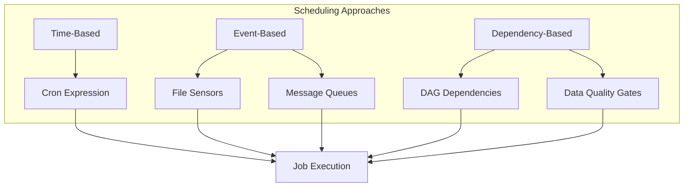
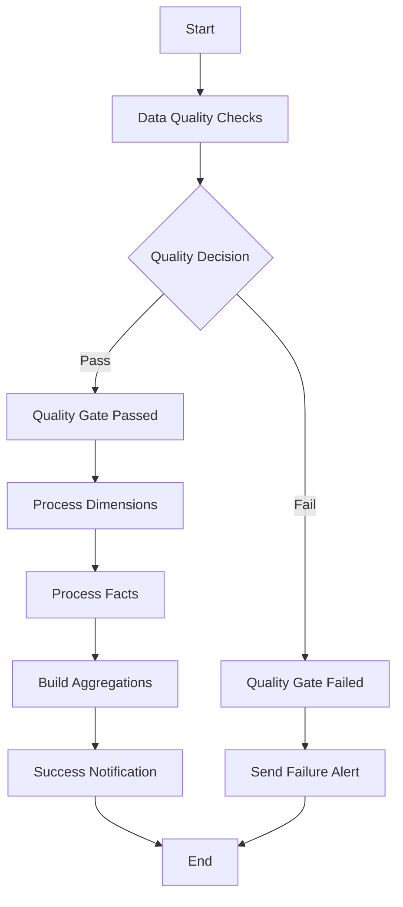
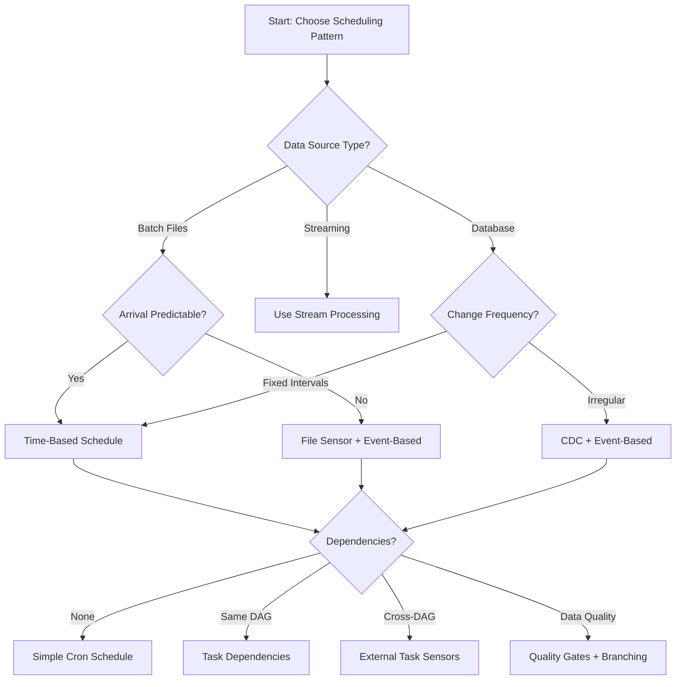

# How to Implement Batch Scheduling Patterns

Author: [nawazdhandala](https://github.com/nawazdhandala)

Tags: Batch Processing, Scheduling, Airflow, Data Pipelines

Description: Learn to implement batch scheduling patterns for reliable and efficient batch job execution.

---

Batch processing remains a cornerstone of modern data engineering. Whether you are processing daily sales reports, aggregating metrics, or running ETL pipelines, understanding batch scheduling patterns is essential for building reliable data systems. This guide covers the fundamental patterns, practical implementations, and best practices for batch job scheduling.

## Understanding Batch Scheduling

Batch scheduling involves orchestrating jobs that process data in discrete chunks rather than in real-time streams. The key decisions revolve around when jobs should run and how they should handle dependencies.

### Core Scheduling Approaches

There are three primary approaches to batch scheduling:

1. **Time-based scheduling**: Jobs run at predetermined intervals (e.g., every hour, daily at midnight)
2. **Event-based scheduling**: Jobs trigger in response to specific events (e.g., file arrival, API webhook)
3. **Dependency-based scheduling**: Jobs run when their upstream dependencies complete successfully



## Time-Based Scheduling with Cron Patterns

Cron expressions provide a powerful and standardized way to define time-based schedules. Understanding cron syntax is fundamental to batch scheduling.

### Cron Expression Anatomy

A cron expression consists of five or six fields:

```
┌───────────── minute (0 - 59)
│ ┌───────────── hour (0 - 23)
│ │ ┌───────────── day of month (1 - 31)
│ │ │ ┌───────────── month (1 - 12)
│ │ │ │ ┌───────────── day of week (0 - 6, Sunday = 0)
│ │ │ │ │
* * * * *
```

### Common Cron Patterns for Data Processing

```python
# Common cron schedules for batch processing

CRON_PATTERNS = {
    # Run every hour at minute 0
    "hourly": "0 * * * *",

    # Run daily at midnight UTC
    "daily_midnight": "0 0 * * *",

    # Run daily at 6 AM for morning reports
    "daily_morning": "0 6 * * *",

    # Run every Monday at 1 AM for weekly aggregations
    "weekly_monday": "0 1 * * 1",

    # Run on the first day of each month at 2 AM
    "monthly": "0 2 1 * *",

    # Run every 15 minutes for near-real-time processing
    "every_15_min": "*/15 * * * *",

    # Run at 3 AM on weekdays only (business day processing)
    "weekday_overnight": "0 3 * * 1-5",

    # Run quarterly (first day of Jan, Apr, Jul, Oct)
    "quarterly": "0 0 1 1,4,7,10 *",
}
```

## Implementing Batch Scheduling with Apache Airflow

Apache Airflow is the most widely adopted workflow orchestration platform for batch processing. Let's explore how to implement various scheduling patterns.

### Basic DAG with Time-Based Schedule

```python
"""
Airflow DAG demonstrating time-based batch scheduling.
This DAG processes daily sales data every night at 2 AM.
"""

from datetime import datetime, timedelta
from airflow import DAG
from airflow.operators.python import PythonOperator
from airflow.operators.empty import EmptyOperator

# Define default arguments that apply to all tasks in the DAG
default_args = {
    "owner": "data-engineering",
    "depends_on_past": False,  # Each run is independent
    "email_on_failure": True,
    "email_on_retry": False,
    "retries": 3,  # Retry failed tasks up to 3 times
    "retry_delay": timedelta(minutes=5),  # Wait 5 minutes between retries
    "execution_timeout": timedelta(hours=2),  # Maximum task runtime
}

# Create the DAG with a daily schedule at 2 AM
dag = DAG(
    dag_id="daily_sales_processing",
    default_args=default_args,
    description="Process daily sales data and generate reports",
    # Schedule to run at 2 AM every day
    schedule_interval="0 2 * * *",
    # Start date determines the first execution
    start_date=datetime(2026, 1, 1),
    # Prevent running all missed schedules if DAG was paused
    catchup=False,
    # Add tags for organization and filtering
    tags=["sales", "daily", "etl"],
)


def extract_sales_data(**context):
    """
    Extract sales data for the execution date.
    The execution_date represents the data interval being processed.
    """
    # Get the logical date (the date of data being processed)
    execution_date = context["logical_date"]

    print(f"Extracting sales data for: {execution_date.strftime('%Y-%m-%d')}")

    # In production, this would query a database or API
    # The date parameter ensures we process the correct partition
    sales_data = {
        "date": execution_date.strftime("%Y-%m-%d"),
        "total_orders": 1500,
        "revenue": 75000.00,
    }

    # Push data to XCom for downstream tasks
    return sales_data


def transform_sales_data(**context):
    """
    Transform and enrich the extracted sales data.
    Pulls data from the upstream extract task via XCom.
    """
    # Retrieve data from the extract task
    ti = context["ti"]
    sales_data = ti.xcom_pull(task_ids="extract_sales")

    # Apply transformations
    transformed = {
        **sales_data,
        "average_order_value": sales_data["revenue"] / sales_data["total_orders"],
        "processed_at": datetime.utcnow().isoformat(),
    }

    print(f"Transformed data: {transformed}")
    return transformed


def load_to_warehouse(**context):
    """
    Load transformed data into the data warehouse.
    This is the final step in the ETL pipeline.
    """
    ti = context["ti"]
    data = ti.xcom_pull(task_ids="transform_sales")

    # In production, this would insert into a database
    print(f"Loading data to warehouse: {data}")

    # Return success indicator
    return {"status": "success", "rows_inserted": 1}


# Define tasks using the PythonOperator
with dag:
    # Start marker for the pipeline
    start = EmptyOperator(task_id="start")

    # Extract task pulls raw data
    extract = PythonOperator(
        task_id="extract_sales",
        python_callable=extract_sales_data,
    )

    # Transform task processes the data
    transform = PythonOperator(
        task_id="transform_sales",
        python_callable=transform_sales_data,
    )

    # Load task writes to the warehouse
    load = PythonOperator(
        task_id="load_to_warehouse",
        python_callable=load_to_warehouse,
    )

    # End marker for the pipeline
    end = EmptyOperator(task_id="end")

    # Define the task execution order
    start >> extract >> transform >> load >> end
```

### Event-Based Scheduling with Sensors

Sensors allow Airflow to wait for external conditions before proceeding. This enables event-driven batch processing.

```python
"""
Airflow DAG demonstrating event-based scheduling using sensors.
This DAG waits for a file to arrive before processing.
"""

from datetime import datetime, timedelta
from airflow import DAG
from airflow.operators.python import PythonOperator
from airflow.sensors.filesystem import FileSensor
from airflow.sensors.external_task import ExternalTaskSensor
from airflow.providers.amazon.aws.sensors.s3 import S3KeySensor

default_args = {
    "owner": "data-engineering",
    "retries": 2,
    "retry_delay": timedelta(minutes=10),
}

dag = DAG(
    dag_id="event_driven_file_processing",
    default_args=default_args,
    description="Process files as they arrive in the landing zone",
    # Run every hour but wait for file to exist
    schedule_interval="@hourly",
    start_date=datetime(2026, 1, 1),
    catchup=False,
    tags=["event-driven", "file-processing"],
)


def process_incoming_file(**context):
    """
    Process the file after the sensor confirms it exists.
    The sensor has already verified the file is present.
    """
    execution_date = context["logical_date"]
    file_path = f"/data/landing/transactions_{execution_date.strftime('%Y%m%d_%H')}.csv"

    print(f"Processing file: {file_path}")

    # File processing logic would go here
    return {"file": file_path, "status": "processed"}


def archive_processed_file(**context):
    """
    Move the processed file to the archive location.
    This prevents reprocessing and maintains data lineage.
    """
    ti = context["ti"]
    result = ti.xcom_pull(task_ids="process_file")

    print(f"Archiving file: {result['file']}")
    return {"archived": True}


with dag:
    # FileSensor waits for a local file to appear
    # The poke_interval determines how often to check
    wait_for_file = FileSensor(
        task_id="wait_for_file",
        # Dynamic file path based on execution time
        filepath="/data/landing/transactions_{{ ds_nodash }}_{{ execution_date.strftime('%H') }}.csv",
        # Check every 60 seconds
        poke_interval=60,
        # Maximum time to wait (2 hours)
        timeout=7200,
        # Use reschedule mode to free up worker slots while waiting
        mode="reschedule",
        # Allow the sensor to succeed if file arrives late
        soft_fail=False,
    )

    # S3KeySensor waits for a file in Amazon S3
    wait_for_s3_file = S3KeySensor(
        task_id="wait_for_s3_file",
        bucket_name="data-lake-landing",
        bucket_key="incoming/{{ ds }}/data.parquet",
        aws_conn_id="aws_default",
        poke_interval=120,
        timeout=14400,  # 4 hours
        mode="reschedule",
    )

    # ExternalTaskSensor waits for another DAG to complete
    wait_for_upstream_dag = ExternalTaskSensor(
        task_id="wait_for_upstream",
        # The DAG we are waiting for
        external_dag_id="upstream_data_ingestion",
        # The specific task to wait for (None means the entire DAG)
        external_task_id=None,
        # How the execution dates should align
        execution_delta=timedelta(hours=0),
        poke_interval=300,
        timeout=18000,
        mode="reschedule",
    )

    # Process the file after sensor succeeds
    process = PythonOperator(
        task_id="process_file",
        python_callable=process_incoming_file,
    )

    # Archive after processing
    archive = PythonOperator(
        task_id="archive_file",
        python_callable=archive_processed_file,
    )

    # File sensor triggers processing
    wait_for_file >> process >> archive

    # S3 sensor can trigger a parallel path
    wait_for_s3_file >> process

    # External task sensor ensures upstream completed
    wait_for_upstream_dag >> process
```

### Dependency-Based Scheduling with DAG Dependencies

Complex data pipelines often require coordinating multiple DAGs with intricate dependencies.

```python
"""
Airflow DAG demonstrating dependency-based scheduling.
This implements a data pipeline with multiple stages and quality gates.
"""

from datetime import datetime, timedelta
from airflow import DAG
from airflow.operators.python import PythonOperator, BranchPythonOperator
from airflow.operators.empty import EmptyOperator
from airflow.utils.trigger_rule import TriggerRule

default_args = {
    "owner": "data-engineering",
    "retries": 2,
    "retry_delay": timedelta(minutes=5),
}

dag = DAG(
    dag_id="dependency_based_pipeline",
    default_args=default_args,
    description="Multi-stage pipeline with quality gates and conditional execution",
    schedule_interval="0 4 * * *",  # 4 AM daily
    start_date=datetime(2026, 1, 1),
    catchup=False,
    tags=["etl", "quality-gates", "dependencies"],
)


def run_data_quality_checks(**context):
    """
    Execute data quality checks on the source data.
    Returns quality metrics that determine downstream execution.
    """
    # Simulate quality check results
    quality_results = {
        "null_percentage": 2.5,  # Percentage of null values
        "duplicate_count": 15,   # Number of duplicates found
        "schema_valid": True,    # Schema validation result
        "row_count": 50000,      # Total rows in source
    }

    print(f"Quality check results: {quality_results}")
    return quality_results


def decide_pipeline_path(**context):
    """
    Branch operator that decides the execution path based on quality results.
    Returns the task_id(s) to execute next.
    """
    ti = context["ti"]
    quality = ti.xcom_pull(task_ids="data_quality_checks")

    # Define quality thresholds
    MAX_NULL_PERCENTAGE = 5.0
    MAX_DUPLICATES = 100

    # Check if data passes quality gates
    if quality["null_percentage"] > MAX_NULL_PERCENTAGE:
        print("FAILED: Too many null values")
        return "quality_gate_failed"

    if quality["duplicate_count"] > MAX_DUPLICATES:
        print("FAILED: Too many duplicates")
        return "quality_gate_failed"

    if not quality["schema_valid"]:
        print("FAILED: Schema validation failed")
        return "quality_gate_failed"

    print("PASSED: All quality gates passed")
    return "quality_gate_passed"


def process_dimension_tables(**context):
    """Process dimension tables first (no dependencies on other processing)."""
    print("Processing dimension tables: customers, products, stores")
    return {"dimensions_processed": True}


def process_fact_tables(**context):
    """
    Process fact tables after dimensions are ready.
    Fact tables have foreign key references to dimensions.
    """
    ti = context["ti"]
    dimensions_ready = ti.xcom_pull(task_ids="process_dimensions")

    if not dimensions_ready:
        raise ValueError("Dimension tables must be processed first")

    print("Processing fact tables: sales, inventory, transactions")
    return {"facts_processed": True}


def build_aggregations(**context):
    """
    Build aggregate tables after facts are loaded.
    These depend on both dimensions and facts being current.
    """
    ti = context["ti"]
    facts_ready = ti.xcom_pull(task_ids="process_facts")

    print("Building aggregations: daily_sales_summary, weekly_inventory")
    return {"aggregations_built": True}


def send_failure_alert(**context):
    """Send alert when quality gates fail."""
    print("ALERT: Pipeline failed quality gates. Manual review required.")
    return {"alert_sent": True}


def send_success_notification(**context):
    """Send notification when pipeline completes successfully."""
    print("SUCCESS: Pipeline completed successfully")
    return {"notification_sent": True}


with dag:
    # Starting point
    start = EmptyOperator(task_id="start")

    # Data quality checks run first
    quality_checks = PythonOperator(
        task_id="data_quality_checks",
        python_callable=run_data_quality_checks,
    )

    # Branch based on quality results
    quality_decision = BranchPythonOperator(
        task_id="quality_decision",
        python_callable=decide_pipeline_path,
    )

    # Success path marker
    quality_passed = EmptyOperator(task_id="quality_gate_passed")

    # Failure path marker
    quality_failed = EmptyOperator(task_id="quality_gate_failed")

    # Process dimensions (can run in parallel with nothing)
    process_dimensions = PythonOperator(
        task_id="process_dimensions",
        python_callable=process_dimension_tables,
    )

    # Process facts (depends on dimensions)
    process_facts = PythonOperator(
        task_id="process_facts",
        python_callable=process_fact_tables,
    )

    # Build aggregations (depends on facts)
    aggregations = PythonOperator(
        task_id="build_aggregations",
        python_callable=build_aggregations,
    )

    # Alert on failure
    failure_alert = PythonOperator(
        task_id="send_failure_alert",
        python_callable=send_failure_alert,
    )

    # Success notification
    success_notification = PythonOperator(
        task_id="send_success_notification",
        python_callable=send_success_notification,
    )

    # End point that runs regardless of which branch was taken
    end = EmptyOperator(
        task_id="end",
        # This task runs when ANY upstream task succeeds (not all)
        trigger_rule=TriggerRule.ONE_SUCCESS,
    )

    # Define the dependency graph
    start >> quality_checks >> quality_decision

    # Success path
    quality_decision >> quality_passed >> process_dimensions >> process_facts >> aggregations >> success_notification >> end

    # Failure path
    quality_decision >> quality_failed >> failure_alert >> end
```



## Implementing Batch Scheduling with Dagster

Dagster offers a modern approach to batch scheduling with its asset-based paradigm. Let's explore how to implement the same patterns.

### Basic Asset-Based Scheduling

```python
"""
Dagster implementation of batch scheduling patterns.
This demonstrates asset-based scheduling with Dagster.
"""

from dagster import (
    asset,
    AssetExecutionContext,
    Definitions,
    ScheduleDefinition,
    define_asset_job,
    AssetSelection,
    DailyPartitionsDefinition,
    FreshnessPolicy,
    AutoMaterializePolicy,
)
from datetime import datetime, timedelta


# Define a daily partition scheme for time-based processing
daily_partitions = DailyPartitionsDefinition(
    start_date="2026-01-01",
    # Timezone for partition boundaries
    timezone="UTC",
    # Format for partition keys
    fmt="%Y-%m-%d",
)


@asset(
    # Partition by day for incremental processing
    partitions_def=daily_partitions,
    # Define how fresh this asset should be
    freshness_policy=FreshnessPolicy(
        maximum_lag_minutes=60 * 6,  # Data should not be more than 6 hours old
    ),
    # Group related assets together
    group_name="raw_data",
    # Add metadata for documentation
    metadata={
        "source": "transactional_database",
        "owner": "data-engineering",
    },
)
def raw_transactions(context: AssetExecutionContext):
    """
    Extract raw transaction data for a specific partition (day).
    This asset represents the raw data landing zone.
    """
    # Get the partition key (date string)
    partition_date = context.partition_key

    context.log.info(f"Extracting transactions for date: {partition_date}")

    # Simulate data extraction
    # In production, this would query a database with date filters
    transactions = [
        {"id": 1, "amount": 100.00, "date": partition_date},
        {"id": 2, "amount": 250.00, "date": partition_date},
        {"id": 3, "amount": 75.50, "date": partition_date},
    ]

    # Return the data (Dagster handles storage via IO managers)
    return transactions


@asset(
    # This asset depends on raw_transactions
    deps=["raw_transactions"],
    partitions_def=daily_partitions,
    group_name="processed_data",
    # Auto-materialize when upstream changes
    auto_materialize_policy=AutoMaterializePolicy.eager(),
)
def cleaned_transactions(context: AssetExecutionContext, raw_transactions):
    """
    Clean and validate transaction data.
    This asset depends on raw_transactions and inherits its partition.
    """
    partition_date = context.partition_key

    context.log.info(f"Cleaning transactions for: {partition_date}")

    # Apply cleaning transformations
    cleaned = []
    for txn in raw_transactions:
        # Remove invalid amounts
        if txn["amount"] <= 0:
            context.log.warning(f"Skipping invalid transaction: {txn['id']}")
            continue

        # Add cleaning timestamp
        cleaned_txn = {
            **txn,
            "cleaned_at": datetime.utcnow().isoformat(),
            "is_valid": True,
        }
        cleaned.append(cleaned_txn)

    return cleaned


@asset(
    deps=["cleaned_transactions"],
    partitions_def=daily_partitions,
    group_name="analytics",
    freshness_policy=FreshnessPolicy(
        maximum_lag_minutes=60 * 12,  # Analytics can lag up to 12 hours
    ),
)
def daily_transaction_summary(context: AssetExecutionContext, cleaned_transactions):
    """
    Compute daily transaction summary statistics.
    This is an aggregate asset that depends on cleaned data.
    """
    partition_date = context.partition_key

    # Calculate summary statistics
    total_amount = sum(txn["amount"] for txn in cleaned_transactions)
    transaction_count = len(cleaned_transactions)
    avg_amount = total_amount / transaction_count if transaction_count > 0 else 0

    summary = {
        "date": partition_date,
        "total_amount": total_amount,
        "transaction_count": transaction_count,
        "average_amount": round(avg_amount, 2),
        "computed_at": datetime.utcnow().isoformat(),
    }

    context.log.info(f"Daily summary: {summary}")
    return summary


# Define a job that materializes all transaction assets
transaction_processing_job = define_asset_job(
    name="transaction_processing_job",
    selection=AssetSelection.groups("raw_data", "processed_data", "analytics"),
    description="Process daily transaction data through the entire pipeline",
)


# Define a schedule for the job
daily_transaction_schedule = ScheduleDefinition(
    name="daily_transaction_schedule",
    job=transaction_processing_job,
    # Run at 3 AM UTC daily
    cron_schedule="0 3 * * *",
    # Execution timezone
    execution_timezone="UTC",
    # Default status when deployed
    default_status="running",
)


# Create the Dagster Definitions object
defs = Definitions(
    assets=[
        raw_transactions,
        cleaned_transactions,
        daily_transaction_summary,
    ],
    jobs=[transaction_processing_job],
    schedules=[daily_transaction_schedule],
)
```

### Event-Based Scheduling with Dagster Sensors

```python
"""
Dagster sensors for event-based scheduling.
Sensors poll for conditions and trigger jobs when met.
"""

from dagster import (
    sensor,
    RunRequest,
    SensorEvaluationContext,
    SkipReason,
    asset_sensor,
    AssetKey,
    EventLogEntry,
    SensorDefinition,
    DefaultSensorStatus,
)
import os
from pathlib import Path


@sensor(
    job=transaction_processing_job,
    minimum_interval_seconds=60,  # Check every 60 seconds
    default_status=DefaultSensorStatus.RUNNING,
)
def file_arrival_sensor(context: SensorEvaluationContext):
    """
    Sensor that triggers processing when new files arrive.
    Monitors a landing directory for new data files.
    """
    landing_path = Path("/data/landing")

    # Get the cursor (last processed timestamp) from sensor state
    last_processed = float(context.cursor) if context.cursor else 0

    # Find new files modified after the cursor
    new_files = []
    latest_mtime = last_processed

    for file_path in landing_path.glob("*.csv"):
        mtime = file_path.stat().st_mtime
        if mtime > last_processed:
            new_files.append(file_path)
            latest_mtime = max(latest_mtime, mtime)

    if not new_files:
        # No new files found, skip this evaluation
        return SkipReason("No new files detected in landing zone")

    # Create a run request for each new file
    run_requests = []
    for file_path in new_files:
        # Extract date from filename for partition key
        # Assumes format: transactions_YYYY-MM-DD.csv
        date_str = file_path.stem.split("_")[1]

        run_requests.append(
            RunRequest(
                run_key=f"file_{file_path.name}_{mtime}",
                partition_key=date_str,
                run_config={
                    "ops": {
                        "raw_transactions": {
                            "config": {
                                "file_path": str(file_path),
                            }
                        }
                    }
                },
                tags={
                    "trigger": "file_sensor",
                    "source_file": file_path.name,
                },
            )
        )

    # Update cursor to latest processed time
    context.update_cursor(str(latest_mtime))

    return run_requests


@asset_sensor(
    asset_key=AssetKey("cleaned_transactions"),
    job=define_asset_job(
        name="downstream_analytics_job",
        selection=AssetSelection.keys("daily_transaction_summary"),
    ),
    default_status=DefaultSensorStatus.RUNNING,
)
def downstream_trigger_sensor(
    context: SensorEvaluationContext,
    asset_event: EventLogEntry,
):
    """
    Sensor that triggers downstream jobs when an upstream asset materializes.
    This creates event-driven dependencies between assets.
    """
    # Get the partition key from the upstream materialization
    partition_key = asset_event.dagster_event.partition

    context.log.info(
        f"Detected materialization of cleaned_transactions "
        f"for partition: {partition_key}"
    )

    # Trigger the downstream job for the same partition
    return RunRequest(
        run_key=f"downstream_{partition_key}_{asset_event.timestamp}",
        partition_key=partition_key,
        tags={
            "trigger": "asset_sensor",
            "upstream_partition": partition_key,
        },
    )
```

## Advanced Scheduling Patterns

### Backfill Management

Handling historical data processing is a common requirement in batch systems.

```python
"""
Backfill management patterns for batch processing.
Demonstrates how to safely process historical data.
"""

from datetime import datetime, timedelta
from airflow import DAG
from airflow.operators.python import PythonOperator
from airflow.models import Variable


def safe_backfill_processor(**context):
    """
    Process data with backfill-aware logic.
    Handles both regular runs and historical backfills.
    """
    # Get execution context
    execution_date = context["logical_date"]
    dag_run = context["dag_run"]

    # Check if this is a backfill run
    is_backfill = dag_run.external_trigger or dag_run.run_type == "backfill"

    # Get current time for comparison
    now = datetime.utcnow()

    # Calculate how old this partition is
    data_age_days = (now - execution_date).days

    print(f"Processing date: {execution_date}")
    print(f"Is backfill: {is_backfill}")
    print(f"Data age: {data_age_days} days")

    # Apply different processing logic based on context
    if is_backfill:
        # Backfill mode: process more carefully, maybe with lower priority
        print("Running in backfill mode with reduced parallelism")
        process_with_backfill_settings(execution_date)
    elif data_age_days > 7:
        # Late data: might need special handling
        print("Processing late-arriving data")
        process_late_data(execution_date)
    else:
        # Normal processing
        print("Running normal processing")
        process_normal(execution_date)


def process_with_backfill_settings(date):
    """Process with settings optimized for backfill."""
    # Use smaller batch sizes to avoid overwhelming systems
    # Implement rate limiting
    # Skip notifications
    pass


def process_late_data(date):
    """Handle late-arriving data that missed its window."""
    # May need to update already-computed aggregates
    # Log for reconciliation purposes
    pass


def process_normal(date):
    """Standard processing path."""
    pass


# DAG configuration for safe backfills
backfill_dag = DAG(
    dag_id="backfill_aware_pipeline",
    default_args={
        "owner": "data-engineering",
        "retries": 3,
        "retry_delay": timedelta(minutes=10),
    },
    schedule_interval="0 5 * * *",
    start_date=datetime(2025, 1, 1),
    # IMPORTANT: Set to False for controlled backfills
    catchup=False,
    # Limit concurrent backfill runs
    max_active_runs=3,
    tags=["backfill-aware"],
)

with backfill_dag:
    process_task = PythonOperator(
        task_id="process_data",
        python_callable=safe_backfill_processor,
        # Control parallelism during backfills
        pool="backfill_pool",
    )
```

### SLA Monitoring and Alerting

```python
"""
SLA monitoring patterns for batch jobs.
Ensures jobs complete within expected timeframes.
"""

from datetime import datetime, timedelta
from airflow import DAG
from airflow.operators.python import PythonOperator
from airflow.operators.email import EmailOperator


def sla_miss_callback(dag, task_list, blocking_task_list, slas, blocking_tis):
    """
    Callback function executed when SLA is missed.
    This allows custom handling of SLA violations.
    """
    # Log the SLA miss details
    print(f"SLA MISS DETECTED!")
    print(f"DAG: {dag.dag_id}")
    print(f"Tasks that missed SLA: {[t.task_id for t in task_list]}")
    print(f"Blocking tasks: {[t.task_id for t in blocking_task_list]}")

    # In production, you might:
    # 1. Send a PagerDuty alert
    # 2. Update a monitoring dashboard
    # 3. Trigger a remediation workflow
    # 4. Notify stakeholders via Slack


sla_monitored_dag = DAG(
    dag_id="sla_monitored_pipeline",
    default_args={
        "owner": "data-engineering",
        "retries": 2,
        "retry_delay": timedelta(minutes=5),
        # Define SLA for all tasks (can be overridden per task)
        "sla": timedelta(hours=2),
    },
    schedule_interval="0 6 * * *",  # Run at 6 AM
    start_date=datetime(2026, 1, 1),
    catchup=False,
    # Register the SLA miss callback
    sla_miss_callback=sla_miss_callback,
    tags=["sla-monitored"],
)


def critical_etl_process(**context):
    """
    Critical ETL process that must complete within SLA.
    """
    print("Running critical ETL process")
    # Simulate processing
    return {"status": "complete"}


with sla_monitored_dag:
    # Task with custom SLA (stricter than DAG default)
    critical_task = PythonOperator(
        task_id="critical_etl",
        python_callable=critical_etl_process,
        # This specific task must complete within 1 hour
        sla=timedelta(hours=1),
    )

    # SLA miss notification email
    notify_sla_miss = EmailOperator(
        task_id="notify_sla_miss",
        to=["data-team@company.com", "oncall@company.com"],
        subject="SLA Miss: {{ dag.dag_id }}",
        html_content="""
        <h2>SLA Violation Detected</h2>
        <p>DAG: {{ dag.dag_id }}</p>
        <p>Execution Date: {{ ds }}</p>
        <p>Please investigate immediately.</p>
        """,
        # Only run if upstream fails or misses SLA
        trigger_rule="one_failed",
    )

    critical_task >> notify_sla_miss
```

## Scheduling Pattern Decision Matrix

Choosing the right scheduling pattern depends on your specific requirements. Here is a decision matrix to guide your choice:



| Pattern | Use Case | Pros | Cons |
|---------|----------|------|------|
| Time-Based | Regular reports, nightly ETL | Predictable, easy to monitor | May process empty batches |
| Event-Based | File arrivals, webhooks | Responsive, efficient | More complex, harder to debug |
| Dependency-Based | Multi-stage pipelines | Ensures data consistency | Can cause cascading delays |
| Hybrid | Complex workflows | Flexible, robust | Increased complexity |

## Best Practices for Batch Scheduling

### 1. Idempotency

Ensure jobs can be safely re-run without side effects:

```python
def idempotent_upsert(**context):
    """
    Example of idempotent data loading.
    Uses MERGE/UPSERT to handle reruns safely.
    """
    execution_date = context["logical_date"]
    partition_key = execution_date.strftime("%Y-%m-%d")

    # Delete existing data for this partition before inserting
    # This makes the operation idempotent
    delete_query = f"""
        DELETE FROM target_table
        WHERE partition_date = '{partition_key}'
    """

    # Then insert new data
    insert_query = f"""
        INSERT INTO target_table
        SELECT * FROM staging_table
        WHERE partition_date = '{partition_key}'
    """

    # Alternative: Use MERGE/UPSERT for atomic operation
    merge_query = f"""
        MERGE INTO target_table t
        USING staging_table s
        ON t.id = s.id AND t.partition_date = '{partition_key}'
        WHEN MATCHED THEN UPDATE SET t.value = s.value
        WHEN NOT MATCHED THEN INSERT (id, value, partition_date)
            VALUES (s.id, s.value, s.partition_date)
    """

    return {"pattern": "idempotent_upsert", "partition": partition_key}
```

### 2. Graceful Failure Handling

```python
def robust_processor(**context):
    """
    Processor with comprehensive error handling.
    """
    try:
        # Main processing logic
        result = process_data()
        return result

    except ConnectionError as e:
        # Transient error: let Airflow retry
        print(f"Connection error (will retry): {e}")
        raise

    except ValueError as e:
        # Data error: log and continue with partial results
        print(f"Data validation error: {e}")
        context["ti"].xcom_push(key="warnings", value=str(e))
        return {"status": "partial", "error": str(e)}

    except Exception as e:
        # Unexpected error: fail loudly
        print(f"Unexpected error: {e}")
        # Send alert before re-raising
        send_alert(f"Critical failure in processor: {e}")
        raise
```

### 3. Monitoring and Observability

```python
"""
Monitoring patterns for batch jobs.
"""

from datetime import datetime
import json


def instrumented_processor(**context):
    """
    Processor with built-in metrics and logging.
    """
    # Record start time
    start_time = datetime.utcnow()

    # Initialize metrics
    metrics = {
        "task_id": context["task"].task_id,
        "dag_id": context["dag"].dag_id,
        "execution_date": context["logical_date"].isoformat(),
        "start_time": start_time.isoformat(),
        "rows_processed": 0,
        "rows_failed": 0,
        "warnings": [],
    }

    try:
        # Process data and track metrics
        for batch in get_data_batches():
            processed, failed = process_batch(batch)
            metrics["rows_processed"] += processed
            metrics["rows_failed"] += failed

        metrics["status"] = "success"

    except Exception as e:
        metrics["status"] = "failed"
        metrics["error"] = str(e)
        raise

    finally:
        # Always record end time and duration
        end_time = datetime.utcnow()
        metrics["end_time"] = end_time.isoformat()
        metrics["duration_seconds"] = (end_time - start_time).total_seconds()

        # Push metrics for monitoring
        context["ti"].xcom_push(key="metrics", value=json.dumps(metrics))

        # Log structured metrics
        print(f"METRICS: {json.dumps(metrics)}")

    return metrics
```

## Conclusion

Effective batch scheduling is about choosing the right patterns for your data characteristics and reliability requirements. The key principles to remember are:

1. **Match scheduling to data characteristics**: Use time-based scheduling for predictable data, event-based for variable arrivals, and dependency-based for complex pipelines.

2. **Design for failure**: Build idempotent jobs, implement proper retry logic, and create clear alerting mechanisms.

3. **Maintain observability**: Instrument your jobs with metrics, logging, and SLA monitoring to catch issues early.

4. **Start simple**: Begin with basic cron schedules and add complexity (sensors, cross-DAG dependencies) only as requirements demand.

5. **Document dependencies**: Use DAG visualization tools and maintain clear documentation of your scheduling architecture.

Whether you choose Airflow, Dagster, or another orchestration platform, these patterns will help you build reliable and maintainable batch processing systems.

## Further Reading

- [Apache Airflow Documentation](https://airflow.apache.org/docs/)
- [Dagster Documentation](https://docs.dagster.io/)
- [Data Engineering Best Practices](https://github.com/apache/airflow)
- [Cron Expression Generator](https://crontab.guru/)
