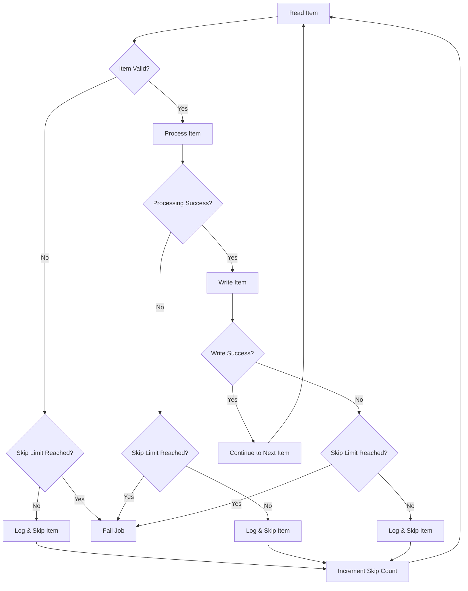
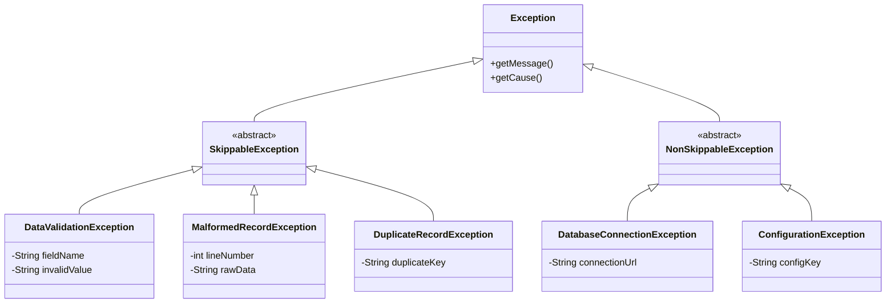
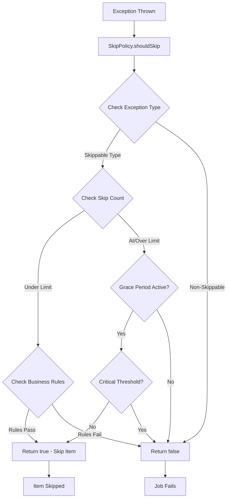
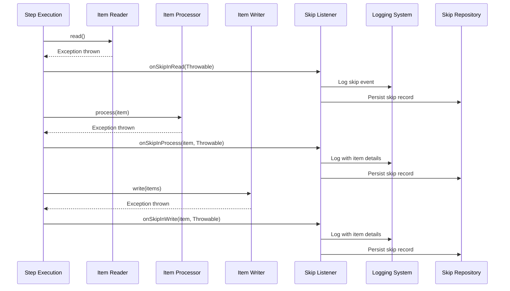
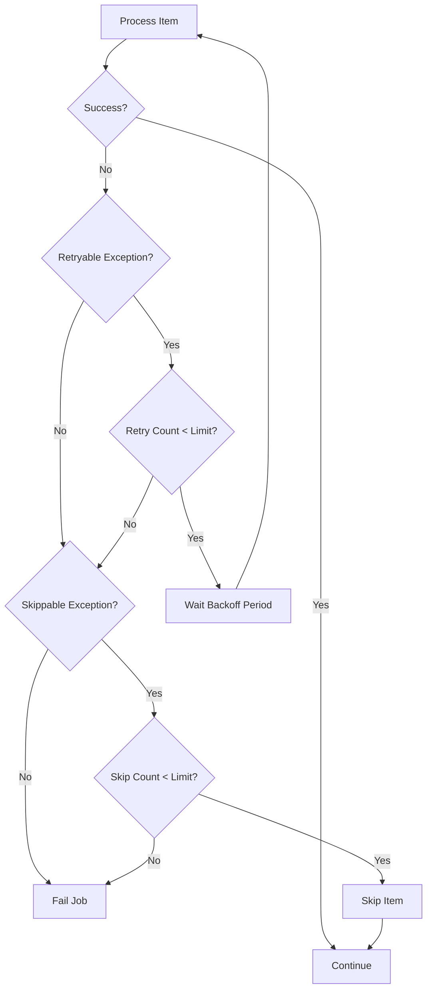
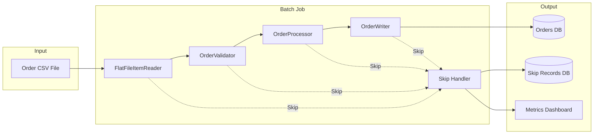

# How to Build Batch Skip Logic

Author: [nawazdhandala](https://github.com/nawazdhandala)

Tags: Batch Processing, Skip, Error Handling, Spring Batch

Description: Learn to build batch skip logic for handling bad records without failing entire batch jobs.

---

## Introduction

When processing large volumes of data in batch jobs, encountering bad or malformed records is inevitable. Without proper handling, a single problematic record can cause your entire batch job to fail, wasting hours of processing time and requiring manual intervention.

**Batch skip logic** allows your jobs to gracefully handle errors by skipping problematic records while continuing to process valid data. This approach ensures that one bad apple does not spoil the entire batch.

In this guide, we will explore how to implement robust skip logic using Spring Batch, covering skip policies, skip limits, skip listeners, and skippable exceptions.

## Understanding Skip Logic Flow

Before diving into implementation, let us visualize how skip logic works within a batch processing pipeline.



## Basic Skip Configuration

The simplest way to enable skip logic in Spring Batch is through the step configuration. Here is a basic example:

```java
// Basic skip configuration for a chunk-oriented step
// This configuration skips up to 10 FlatFileParseException errors
@Bean
public Step importUserStep(JobRepository jobRepository,
                           PlatformTransactionManager transactionManager) {
    return new StepBuilder("importUserStep", jobRepository)
        // Process 100 items per chunk/transaction
        .<User, User>chunk(100, transactionManager)
        .reader(userItemReader())
        .processor(userItemProcessor())
        .writer(userItemWriter())
        // Enable fault tolerance mode (required for skip)
        .faultTolerant()
        // Define which exception types should trigger skip behavior
        .skip(FlatFileParseException.class)
        // Maximum number of items to skip before failing the job
        .skipLimit(10)
        .build();
}
```

## Defining Skippable Exceptions

Not all exceptions should trigger skip behavior. You need to carefully define which exceptions are safe to skip and which should cause immediate job failure.

### Exception Hierarchy for Skip Logic



### Custom Exception Classes

```java
// Base class for all exceptions that can be safely skipped
// Extend this class for specific validation failures
public abstract class SkippableException extends RuntimeException {

    private final String recordIdentifier;
    private final LocalDateTime occurredAt;

    public SkippableException(String message, String recordIdentifier) {
        super(message);
        this.recordIdentifier = recordIdentifier;
        this.occurredAt = LocalDateTime.now();
    }

    public SkippableException(String message, String recordIdentifier, Throwable cause) {
        super(message, cause);
        this.recordIdentifier = recordIdentifier;
        this.occurredAt = LocalDateTime.now();
    }

    public String getRecordIdentifier() {
        return recordIdentifier;
    }

    public LocalDateTime getOccurredAt() {
        return occurredAt;
    }
}

// Thrown when a record fails business validation rules
// Examples: invalid email format, negative amounts, missing required fields
public class DataValidationException extends SkippableException {

    private final String fieldName;
    private final Object invalidValue;
    private final String validationRule;

    public DataValidationException(String recordId, String fieldName,
                                   Object invalidValue, String validationRule) {
        super(String.format("Validation failed for field '%s' with value '%s': %s",
            fieldName, invalidValue, validationRule), recordId);
        this.fieldName = fieldName;
        this.invalidValue = invalidValue;
        this.validationRule = validationRule;
    }

    // Getters omitted for brevity
}

// Thrown when a record cannot be parsed from the input source
// Common causes: CSV format errors, JSON parsing failures, encoding issues
public class MalformedRecordException extends SkippableException {

    private final int lineNumber;
    private final String rawData;

    public MalformedRecordException(int lineNumber, String rawData, Throwable cause) {
        super(String.format("Cannot parse record at line %d", lineNumber),
            "LINE_" + lineNumber, cause);
        this.lineNumber = lineNumber;
        this.rawData = rawData;
    }

    // Getters omitted for brevity
}
```

### Configuring Multiple Skip Exceptions

```java
// Configure multiple exception types for skip behavior
// Include specific exceptions and exclude critical ones
@Bean
public Step dataProcessingStep(JobRepository jobRepository,
                               PlatformTransactionManager transactionManager) {
    return new StepBuilder("dataProcessingStep", jobRepository)
        .<InputRecord, OutputRecord>chunk(50, transactionManager)
        .reader(inputReader())
        .processor(recordProcessor())
        .writer(outputWriter())
        .faultTolerant()
        // Skip these exception types (and their subclasses)
        .skip(DataValidationException.class)
        .skip(MalformedRecordException.class)
        .skip(DuplicateRecordException.class)
        .skip(FlatFileParseException.class)
        // Never skip these exceptions (overrides skip settings)
        .noSkip(DatabaseConnectionException.class)
        .noSkip(OutOfMemoryError.class)
        // Total number of skips allowed across all exception types
        .skipLimit(100)
        .build();
}
```

## Skip Policies

For more sophisticated skip logic, Spring Batch provides the `SkipPolicy` interface. This allows you to implement complex rules that go beyond simple exception type matching.

### Skip Policy Decision Flow



### Custom Skip Policy Implementation

```java
// Custom skip policy that implements sophisticated skip decision logic
// Considers exception type, skip count, time of day, and skip rate
@Component
public class SmartSkipPolicy implements SkipPolicy {

    // Maximum items to skip under normal conditions
    private static final int DEFAULT_SKIP_LIMIT = 50;

    // Extended limit for overnight batch windows
    private static final int EXTENDED_SKIP_LIMIT = 200;

    // If skip rate exceeds this percentage, stop the job
    private static final double MAX_SKIP_RATE = 0.10; // 10%

    private final AtomicInteger totalProcessed = new AtomicInteger(0);
    private final Set<Class<? extends Throwable>> skippableExceptions;

    public SmartSkipPolicy() {
        // Define which exception types are eligible for skipping
        this.skippableExceptions = Set.of(
            DataValidationException.class,
            MalformedRecordException.class,
            DuplicateRecordException.class,
            NumberFormatException.class
        );
    }

    @Override
    public boolean shouldSkip(Throwable throwable, long skipCount)
            throws SkipLimitExceededException {

        // Increment total processed count for rate calculation
        totalProcessed.incrementAndGet();

        // Step 1: Check if exception type is skippable
        if (!isSkippableException(throwable)) {
            // Non-skippable exceptions always fail the job
            return false;
        }

        // Step 2: Determine current skip limit based on context
        int currentLimit = determineSkipLimit();

        // Step 3: Check if we are within the skip limit
        if (skipCount >= currentLimit) {
            throw new SkipLimitExceededException(
                currentLimit, throwable);
        }

        // Step 4: Check skip rate to detect systemic issues
        double skipRate = (double) skipCount / totalProcessed.get();
        if (skipRate > MAX_SKIP_RATE && totalProcessed.get() > 100) {
            // Too many skips indicates a systemic problem
            throw new SkipLimitExceededException(
                currentLimit,
                new RuntimeException("Skip rate exceeded " +
                    (MAX_SKIP_RATE * 100) + "%", throwable));
        }

        // All checks passed, skip this item
        return true;
    }

    // Check if the exception (or its cause chain) is skippable
    private boolean isSkippableException(Throwable throwable) {
        Throwable current = throwable;
        while (current != null) {
            for (Class<? extends Throwable> skippable : skippableExceptions) {
                if (skippable.isInstance(current)) {
                    return true;
                }
            }
            current = current.getCause();
        }
        return false;
    }

    // Determine skip limit based on time of day
    // Allow more skips during overnight batch windows
    private int determineSkipLimit() {
        LocalTime now = LocalTime.now();
        LocalTime batchWindowStart = LocalTime.of(22, 0);  // 10 PM
        LocalTime batchWindowEnd = LocalTime.of(6, 0);     // 6 AM

        boolean isOvernightWindow = now.isAfter(batchWindowStart) ||
                                    now.isBefore(batchWindowEnd);

        return isOvernightWindow ? EXTENDED_SKIP_LIMIT : DEFAULT_SKIP_LIMIT;
    }

    // Reset counters for new job execution
    public void reset() {
        totalProcessed.set(0);
    }
}
```

### Applying Custom Skip Policy

```java
// Apply the custom skip policy to your step configuration
@Bean
public Step intelligentProcessingStep(JobRepository jobRepository,
                                      PlatformTransactionManager transactionManager,
                                      SmartSkipPolicy skipPolicy) {
    return new StepBuilder("intelligentProcessingStep", jobRepository)
        .<Order, ProcessedOrder>chunk(100, transactionManager)
        .reader(orderReader())
        .processor(orderProcessor())
        .writer(orderWriter())
        .faultTolerant()
        // Use custom skip policy instead of simple skip configuration
        .skipPolicy(skipPolicy)
        .build();
}
```

## Skip Listeners

Skip listeners allow you to react to skip events for logging, alerting, and tracking purposes. Spring Batch provides the `SkipListener` interface with callbacks for read, process, and write skips.

### Skip Listener Architecture



### Comprehensive Skip Listener Implementation

```java
// Skip listener that handles all skip events with detailed logging
// and persistence for later analysis and reprocessing
@Component
@Slf4j
public class ComprehensiveSkipListener implements SkipListener<InputRecord, OutputRecord> {

    private final SkipRecordRepository skipRecordRepository;
    private final MeterRegistry meterRegistry;
    private final AlertService alertService;

    // Track skip counts by phase for metrics
    private final AtomicInteger readSkips = new AtomicInteger(0);
    private final AtomicInteger processSkips = new AtomicInteger(0);
    private final AtomicInteger writeSkips = new AtomicInteger(0);

    public ComprehensiveSkipListener(SkipRecordRepository skipRecordRepository,
                                     MeterRegistry meterRegistry,
                                     AlertService alertService) {
        this.skipRecordRepository = skipRecordRepository;
        this.meterRegistry = meterRegistry;
        this.alertService = alertService;
    }

    @Override
    public void onSkipInRead(Throwable throwable) {
        // Increment counter for monitoring
        int skipCount = readSkips.incrementAndGet();

        // Log the skip event with full context
        log.warn("Skip during READ phase [count={}]: {}",
            skipCount, throwable.getMessage());

        // Create skip record for persistence
        SkipRecord record = SkipRecord.builder()
            .phase(SkipPhase.READ)
            .exceptionType(throwable.getClass().getName())
            .exceptionMessage(throwable.getMessage())
            .stackTrace(getStackTraceAsString(throwable))
            .timestamp(LocalDateTime.now())
            .build();

        // Persist for later analysis
        skipRecordRepository.save(record);

        // Update metrics
        meterRegistry.counter("batch.skip",
            "phase", "read",
            "exception", throwable.getClass().getSimpleName())
            .increment();

        // Check if alert threshold reached
        checkAlertThreshold(skipCount, "READ");
    }

    @Override
    public void onSkipInProcess(InputRecord item, Throwable throwable) {
        int skipCount = processSkips.incrementAndGet();

        // Log with item details for debugging
        log.warn("Skip during PROCESS phase [count={}, itemId={}]: {}",
            skipCount, item.getId(), throwable.getMessage());

        // Create detailed skip record including the problematic item
        SkipRecord record = SkipRecord.builder()
            .phase(SkipPhase.PROCESS)
            .itemIdentifier(item.getId())
            .itemData(serializeItem(item))
            .exceptionType(throwable.getClass().getName())
            .exceptionMessage(throwable.getMessage())
            .stackTrace(getStackTraceAsString(throwable))
            .timestamp(LocalDateTime.now())
            .build();

        skipRecordRepository.save(record);

        meterRegistry.counter("batch.skip",
            "phase", "process",
            "exception", throwable.getClass().getSimpleName())
            .increment();

        checkAlertThreshold(skipCount, "PROCESS");
    }

    @Override
    public void onSkipInWrite(OutputRecord item, Throwable throwable) {
        int skipCount = writeSkips.incrementAndGet();

        log.warn("Skip during WRITE phase [count={}, itemId={}]: {}",
            skipCount, item.getId(), throwable.getMessage());

        SkipRecord record = SkipRecord.builder()
            .phase(SkipPhase.WRITE)
            .itemIdentifier(item.getId())
            .itemData(serializeItem(item))
            .exceptionType(throwable.getClass().getName())
            .exceptionMessage(throwable.getMessage())
            .stackTrace(getStackTraceAsString(throwable))
            .timestamp(LocalDateTime.now())
            .build();

        skipRecordRepository.save(record);

        meterRegistry.counter("batch.skip",
            "phase", "write",
            "exception", throwable.getClass().getSimpleName())
            .increment();

        checkAlertThreshold(skipCount, "WRITE");
    }

    // Check if skip count exceeds alert threshold
    private void checkAlertThreshold(int skipCount, String phase) {
        // Alert at 25, 50, and 75 skips
        if (skipCount == 25 || skipCount == 50 || skipCount == 75) {
            alertService.sendAlert(
                AlertLevel.WARNING,
                String.format("Batch job has skipped %d items in %s phase",
                    skipCount, phase));
        }
    }

    // Serialize item to JSON for storage
    private String serializeItem(Object item) {
        try {
            ObjectMapper mapper = new ObjectMapper();
            mapper.registerModule(new JavaTimeModule());
            return mapper.writeValueAsString(item);
        } catch (JsonProcessingException e) {
            return "Serialization failed: " + e.getMessage();
        }
    }

    // Convert stack trace to string for storage
    private String getStackTraceAsString(Throwable throwable) {
        StringWriter sw = new StringWriter();
        throwable.printStackTrace(new PrintWriter(sw));
        // Limit length to avoid database issues
        String stackTrace = sw.toString();
        return stackTrace.length() > 4000 ?
            stackTrace.substring(0, 4000) : stackTrace;
    }

    // Get total skip count across all phases
    public int getTotalSkipCount() {
        return readSkips.get() + processSkips.get() + writeSkips.get();
    }

    // Reset counters for new job execution
    public void reset() {
        readSkips.set(0);
        processSkips.set(0);
        writeSkips.set(0);
    }
}
```

### Skip Record Entity

```java
// Entity for persisting skip records to the database
// Enables analysis, reporting, and reprocessing of skipped items
@Entity
@Table(name = "batch_skip_records")
@Data
@Builder
@NoArgsConstructor
@AllArgsConstructor
public class SkipRecord {

    @Id
    @GeneratedValue(strategy = GenerationType.IDENTITY)
    private Long id;

    @Enumerated(EnumType.STRING)
    @Column(nullable = false)
    private SkipPhase phase;

    @Column(name = "item_identifier")
    private String itemIdentifier;

    @Column(name = "item_data", columnDefinition = "TEXT")
    private String itemData;

    @Column(name = "exception_type", nullable = false)
    private String exceptionType;

    @Column(name = "exception_message", length = 1000)
    private String exceptionMessage;

    @Column(name = "stack_trace", columnDefinition = "TEXT")
    private String stackTrace;

    @Column(nullable = false)
    private LocalDateTime timestamp;

    @Column(name = "job_execution_id")
    private Long jobExecutionId;

    @Column(name = "step_execution_id")
    private Long stepExecutionId;

    // Flag for reprocessing workflow
    @Column(name = "reprocessed")
    private boolean reprocessed = false;

    @Column(name = "reprocessed_at")
    private LocalDateTime reprocessedAt;
}

// Enum for skip phases
public enum SkipPhase {
    READ,
    PROCESS,
    WRITE
}
```

### Registering Skip Listener in Step

```java
// Register the skip listener in the step configuration
@Bean
public Step monitoredProcessingStep(JobRepository jobRepository,
                                    PlatformTransactionManager transactionManager,
                                    ComprehensiveSkipListener skipListener) {
    return new StepBuilder("monitoredProcessingStep", jobRepository)
        .<InputRecord, OutputRecord>chunk(100, transactionManager)
        .reader(inputReader())
        .processor(recordProcessor())
        .writer(outputWriter())
        .faultTolerant()
        .skip(DataValidationException.class)
        .skip(MalformedRecordException.class)
        .skipLimit(100)
        // Register the skip listener
        .listener(skipListener)
        .build();
}
```

## Combining Skip with Retry Logic

In some cases, you may want to retry an operation before skipping. This is useful for transient errors like temporary network issues.

### Retry and Skip Flow



### Retry Before Skip Configuration

```java
// Configure retry logic that falls back to skip after exhausting retries
// This handles transient errors while still skipping persistent failures
@Bean
public Step resilientProcessingStep(JobRepository jobRepository,
                                    PlatformTransactionManager transactionManager,
                                    ComprehensiveSkipListener skipListener) {
    return new StepBuilder("resilientProcessingStep", jobRepository)
        .<Transaction, ProcessedTransaction>chunk(50, transactionManager)
        .reader(transactionReader())
        .processor(transactionProcessor())
        .writer(transactionWriter())
        .faultTolerant()

        // Retry configuration for transient errors
        // These exceptions will be retried before considering skip
        .retry(TransientDataAccessException.class)
        .retry(DeadlockLoserDataAccessException.class)
        .retry(OptimisticLockingFailureException.class)
        .retryLimit(3)

        // Backoff policy: wait between retries with exponential increase
        .backOffPolicy(createExponentialBackOffPolicy())

        // Skip configuration for persistent errors
        // These are skipped immediately (no retry)
        .skip(DataValidationException.class)
        .skip(MalformedRecordException.class)

        // Also skip retryable exceptions after retries exhausted
        .skip(TransientDataAccessException.class)
        .skip(DeadlockLoserDataAccessException.class)

        // Never skip these critical errors
        .noSkip(NonTransientDataAccessException.class)
        .noSkip(OutOfMemoryError.class)

        .skipLimit(100)
        .listener(skipListener)
        .build();
}

// Create exponential backoff policy for retries
// Starts at 1 second, doubles each time, max 30 seconds
private ExponentialBackOffPolicy createExponentialBackOffPolicy() {
    ExponentialBackOffPolicy policy = new ExponentialBackOffPolicy();
    policy.setInitialInterval(1000);    // 1 second
    policy.setMultiplier(2.0);           // Double each time
    policy.setMaxInterval(30000);        // Max 30 seconds
    return policy;
}
```

## Complete Example: Order Processing Batch Job

Let us put everything together in a complete example that processes customer orders.

### Job Architecture



### Order Domain Model

```java
// Input record from CSV file
@Data
@NoArgsConstructor
@AllArgsConstructor
public class OrderInput {
    private String orderId;
    private String customerId;
    private String productCode;
    private String quantity;
    private String unitPrice;
    private String orderDate;
}

// Validated and processed order ready for persistence
@Entity
@Table(name = "orders")
@Data
@Builder
@NoArgsConstructor
@AllArgsConstructor
public class Order {

    @Id
    private String orderId;

    @Column(nullable = false)
    private String customerId;

    @Column(nullable = false)
    private String productCode;

    @Column(nullable = false)
    private Integer quantity;

    @Column(nullable = false)
    private BigDecimal unitPrice;

    @Column(nullable = false)
    private BigDecimal totalAmount;

    @Column(nullable = false)
    private LocalDate orderDate;

    @Column(nullable = false)
    private LocalDateTime processedAt;

    @Enumerated(EnumType.STRING)
    private OrderStatus status;
}

public enum OrderStatus {
    PENDING,
    VALIDATED,
    PROCESSED,
    COMPLETED
}
```

### Order Item Processor with Validation

```java
// Processor that validates and transforms order input
// Throws appropriate exceptions for skip handling
@Component
@Slf4j
public class OrderItemProcessor implements ItemProcessor<OrderInput, Order> {

    private final ProductService productService;
    private final CustomerService customerService;

    public OrderItemProcessor(ProductService productService,
                             CustomerService customerService) {
        this.productService = productService;
        this.customerService = customerService;
    }

    @Override
    public Order process(OrderInput input) throws Exception {
        log.debug("Processing order: {}", input.getOrderId());

        // Validate order ID format
        if (input.getOrderId() == null || input.getOrderId().isBlank()) {
            throw new DataValidationException(
                "UNKNOWN", "orderId", input.getOrderId(),
                "Order ID is required");
        }

        String orderId = input.getOrderId();

        // Validate customer exists
        if (!customerService.exists(input.getCustomerId())) {
            throw new DataValidationException(
                orderId, "customerId", input.getCustomerId(),
                "Customer not found in system");
        }

        // Validate product exists
        if (!productService.exists(input.getProductCode())) {
            throw new DataValidationException(
                orderId, "productCode", input.getProductCode(),
                "Product not found in catalog");
        }

        // Parse and validate quantity
        Integer quantity;
        try {
            quantity = Integer.parseInt(input.getQuantity());
            if (quantity <= 0) {
                throw new DataValidationException(
                    orderId, "quantity", input.getQuantity(),
                    "Quantity must be positive");
            }
        } catch (NumberFormatException e) {
            throw new DataValidationException(
                orderId, "quantity", input.getQuantity(),
                "Quantity must be a valid integer");
        }

        // Parse and validate unit price
        BigDecimal unitPrice;
        try {
            unitPrice = new BigDecimal(input.getUnitPrice());
            if (unitPrice.compareTo(BigDecimal.ZERO) <= 0) {
                throw new DataValidationException(
                    orderId, "unitPrice", input.getUnitPrice(),
                    "Unit price must be positive");
            }
        } catch (NumberFormatException e) {
            throw new DataValidationException(
                orderId, "unitPrice", input.getUnitPrice(),
                "Unit price must be a valid decimal number");
        }

        // Parse and validate order date
        LocalDate orderDate;
        try {
            orderDate = LocalDate.parse(input.getOrderDate());
            if (orderDate.isAfter(LocalDate.now())) {
                throw new DataValidationException(
                    orderId, "orderDate", input.getOrderDate(),
                    "Order date cannot be in the future");
            }
        } catch (DateTimeParseException e) {
            throw new DataValidationException(
                orderId, "orderDate", input.getOrderDate(),
                "Order date must be in YYYY-MM-DD format");
        }

        // Calculate total and build order
        BigDecimal totalAmount = unitPrice.multiply(BigDecimal.valueOf(quantity));

        return Order.builder()
            .orderId(orderId)
            .customerId(input.getCustomerId())
            .productCode(input.getProductCode())
            .quantity(quantity)
            .unitPrice(unitPrice)
            .totalAmount(totalAmount)
            .orderDate(orderDate)
            .processedAt(LocalDateTime.now())
            .status(OrderStatus.PROCESSED)
            .build();
    }
}
```

### Complete Job Configuration

```java
// Complete batch job configuration with skip logic
@Configuration
@EnableBatchProcessing
@Slf4j
public class OrderProcessingJobConfig {

    @Bean
    public Job orderProcessingJob(JobRepository jobRepository,
                                  Step orderProcessingStep,
                                  JobCompletionListener completionListener) {
        return new JobBuilder("orderProcessingJob", jobRepository)
            .incrementer(new RunIdIncrementer())
            .listener(completionListener)
            .start(orderProcessingStep)
            .build();
    }

    @Bean
    public Step orderProcessingStep(JobRepository jobRepository,
                                    PlatformTransactionManager transactionManager,
                                    FlatFileItemReader<OrderInput> reader,
                                    OrderItemProcessor processor,
                                    JpaItemWriter<Order> writer,
                                    SmartSkipPolicy skipPolicy,
                                    ComprehensiveSkipListener skipListener) {
        return new StepBuilder("orderProcessingStep", jobRepository)
            .<OrderInput, Order>chunk(100, transactionManager)
            .reader(reader)
            .processor(processor)
            .writer(writer)
            .faultTolerant()

            // Use custom skip policy for intelligent skip decisions
            .skipPolicy(skipPolicy)

            // Register skip listener for logging and persistence
            .listener(skipListener)

            // Retry transient errors before skipping
            .retry(TransientDataAccessException.class)
            .retryLimit(3)
            .backOffPolicy(exponentialBackOffPolicy())

            .build();
    }

    @Bean
    public FlatFileItemReader<OrderInput> orderReader(
            @Value("${batch.input.file}") String inputFile) {
        return new FlatFileItemReaderBuilder<OrderInput>()
            .name("orderReader")
            .resource(new FileSystemResource(inputFile))
            .delimited()
            .delimiter(",")
            .names("orderId", "customerId", "productCode",
                   "quantity", "unitPrice", "orderDate")
            .targetType(OrderInput.class)
            .linesToSkip(1) // Skip header row
            .build();
    }

    @Bean
    public JpaItemWriter<Order> orderWriter(EntityManagerFactory emf) {
        JpaItemWriter<Order> writer = new JpaItemWriter<>();
        writer.setEntityManagerFactory(emf);
        return writer;
    }

    @Bean
    public ExponentialBackOffPolicy exponentialBackOffPolicy() {
        ExponentialBackOffPolicy policy = new ExponentialBackOffPolicy();
        policy.setInitialInterval(1000);
        policy.setMultiplier(2.0);
        policy.setMaxInterval(30000);
        return policy;
    }
}
```

### Job Completion Listener with Skip Summary

```java
// Listener that generates skip summary after job completion
@Component
@Slf4j
public class JobCompletionListener implements JobExecutionListener {

    private final SkipRecordRepository skipRecordRepository;
    private final NotificationService notificationService;

    public JobCompletionListener(SkipRecordRepository skipRecordRepository,
                                NotificationService notificationService) {
        this.skipRecordRepository = skipRecordRepository;
        this.notificationService = notificationService;
    }

    @Override
    public void beforeJob(JobExecution jobExecution) {
        log.info("Starting job: {} at {}",
            jobExecution.getJobInstance().getJobName(),
            jobExecution.getStartTime());
    }

    @Override
    public void afterJob(JobExecution jobExecution) {
        // Get execution statistics
        long duration = Duration.between(
            jobExecution.getStartTime(),
            jobExecution.getEndTime()).toSeconds();

        // Aggregate skip statistics from all steps
        int totalSkips = 0;
        int totalProcessed = 0;

        for (StepExecution stepExecution : jobExecution.getStepExecutions()) {
            totalSkips += stepExecution.getSkipCount();
            totalProcessed += stepExecution.getReadCount();
        }

        // Calculate success rate
        double successRate = totalProcessed > 0 ?
            ((double) (totalProcessed - totalSkips) / totalProcessed) * 100 : 0;

        // Log summary
        log.info("Job completed: {} | Status: {} | Duration: {}s | " +
                 "Processed: {} | Skipped: {} | Success Rate: {:.2f}%",
            jobExecution.getJobInstance().getJobName(),
            jobExecution.getStatus(),
            duration,
            totalProcessed,
            totalSkips,
            successRate);

        // If there were skips, generate detailed report
        if (totalSkips > 0) {
            generateSkipReport(jobExecution.getId());
        }

        // Send notification based on job outcome
        if (jobExecution.getStatus() == BatchStatus.COMPLETED) {
            if (totalSkips > 0) {
                notificationService.sendWarning(
                    String.format("Job completed with %d skipped records", totalSkips));
            }
        } else if (jobExecution.getStatus() == BatchStatus.FAILED) {
            notificationService.sendError(
                String.format("Job failed after processing %d records", totalProcessed));
        }
    }

    private void generateSkipReport(Long jobExecutionId) {
        // Get skip records for this job execution
        List<SkipRecord> skips = skipRecordRepository
            .findByJobExecutionId(jobExecutionId);

        // Group by exception type
        Map<String, Long> skipsByException = skips.stream()
            .collect(Collectors.groupingBy(
                SkipRecord::getExceptionType,
                Collectors.counting()));

        log.info("Skip Report for Job Execution {}:", jobExecutionId);
        log.info("-".repeat(50));
        skipsByException.forEach((exception, count) ->
            log.info("  {}: {}", exception, count));
        log.info("-".repeat(50));
    }
}
```

## Best Practices

### 1. Set Appropriate Skip Limits

Choose skip limits based on your data quality expectations and business requirements:

```java
// Conservative: For critical data where accuracy is paramount
.skipLimit(10)

// Moderate: For typical business data processing
.skipLimit(100)

// Liberal: For data migration or cleanup jobs
.skipLimit(1000)

// Dynamic: Use custom skip policy for context-aware limits
.skipPolicy(new SmartSkipPolicy())
```

### 2. Log Skip Details

Always log enough information to diagnose and fix the root cause:

```java
// Good: Includes context for debugging
log.warn("Skipped record [id={}, field={}, value={}]: {}",
    record.getId(), "email", record.getEmail(), exception.getMessage());

// Bad: Insufficient information
log.warn("Record skipped");
```

### 3. Persist Skip Records

Store skipped records for later analysis and reprocessing:

```java
// Enable reprocessing of skipped records after fixing issues
@Scheduled(cron = "0 0 1 * * ?") // Run at 1 AM daily
public void reprocessSkippedRecords() {
    List<SkipRecord> pendingSkips = skipRecordRepository
        .findByReprocessedFalse();

    for (SkipRecord skip : pendingSkips) {
        try {
            reprocessService.reprocess(skip);
            skip.setReprocessed(true);
            skip.setReprocessedAt(LocalDateTime.now());
            skipRecordRepository.save(skip);
        } catch (Exception e) {
            log.warn("Reprocessing failed for skip record: {}", skip.getId());
        }
    }
}
```

### 4. Monitor Skip Rates

Set up alerts for abnormal skip rates that may indicate systemic issues:

```java
// Alert when skip rate exceeds threshold
if (skipRate > 0.05) { // More than 5% skipped
    alertService.sendAlert(AlertLevel.WARNING,
        "High skip rate detected: " + (skipRate * 100) + "%");
}
```

### 5. Separate Transient from Permanent Errors

Use retry for transient errors and skip for permanent ones:

```java
// Transient errors: retry
.retry(TransientDataAccessException.class)
.retry(SocketTimeoutException.class)
.retryLimit(3)

// Permanent errors: skip
.skip(DataValidationException.class)
.skip(MalformedRecordException.class)
```

## Conclusion

Batch skip logic is essential for building robust data processing pipelines that can handle real-world data quality issues. By implementing proper skip policies, listeners, and exception handling, you can ensure that your batch jobs complete successfully even when encountering problematic records.

Key takeaways:

1. **Define clear exception hierarchies** to distinguish skippable from non-skippable errors
2. **Use custom skip policies** for sophisticated decision logic based on context
3. **Implement skip listeners** for comprehensive logging, metrics, and persistence
4. **Combine retry with skip** to handle both transient and permanent failures
5. **Monitor and alert** on skip rates to detect systemic issues early
6. **Persist skipped records** for later analysis and reprocessing

With these patterns in place, your batch jobs will be resilient, observable, and maintainable.

## Further Reading

- [Spring Batch Reference Documentation](https://docs.spring.io/spring-batch/docs/current/reference/html/)
- [Spring Batch Skip and Retry Guide](https://docs.spring.io/spring-batch/docs/current/reference/html/step.html#configuringSkip)
- [Error Handling in Spring Batch](https://docs.spring.io/spring-batch/docs/current/reference/html/step.html#faultTolerant)
