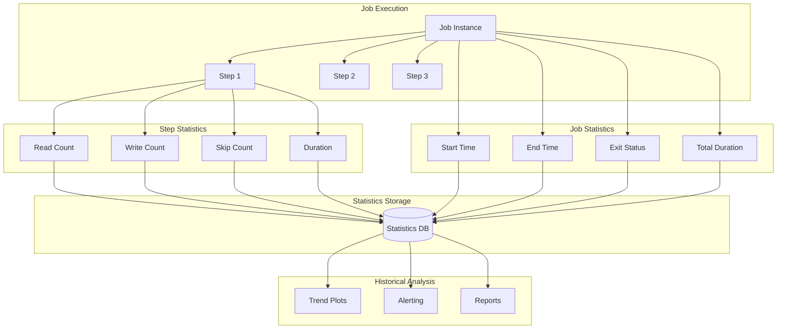
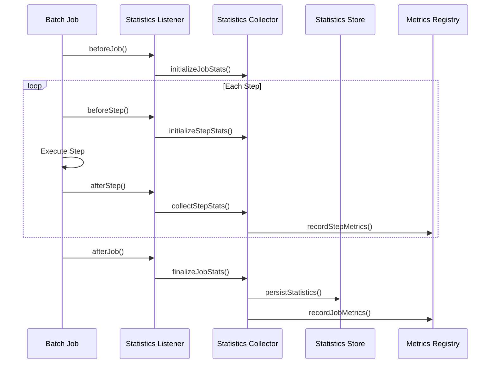
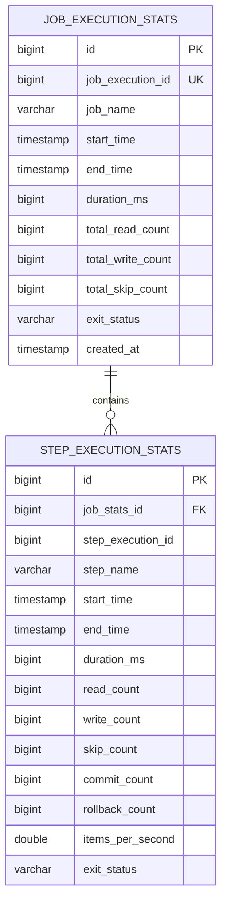
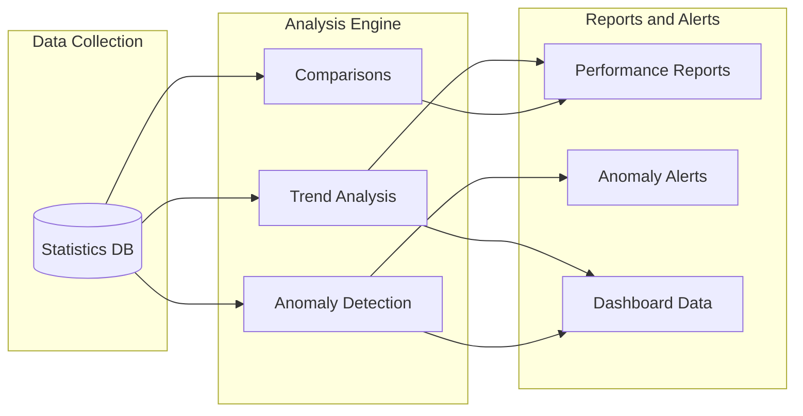

# How to Create Batch Statistics

Author: [nawazdhandala](https://github.com/nawazdhandala)

Tags: Batch Processing, Statistics, Analytics, Spring Batch

Description: Learn to create batch statistics for tracking execution summaries and historical performance data.

---

Batch processing systems handle massive data volumes, but without proper statistics, you are flying blind. This guide shows you how to implement comprehensive batch statistics for tracking job executions, step performance, and historical trends using Spring Batch.

## Batch Statistics Architecture Overview

Before diving into code, let us understand how statistics flow through a batch system. The diagram below shows the relationship between job executions, step executions, and how metrics are collected and stored for analysis.



## 1. Core Statistics Model

Start by defining the data structures that capture batch execution metrics. These models form the foundation for all statistics tracking, storing everything from item counts to timing information.

`model/StepExecutionStatistics.java`

```java
package com.example.batch.statistics.model;

import java.time.Duration;
import java.time.LocalDateTime;

/**
 * Captures detailed statistics for a single step execution.
 * Includes item counts, timing, and error tracking.
 */
public class StepExecutionStatistics {

    // Unique identifier for this step execution
    private Long stepExecutionId;

    // Name of the step (e.g., "readCustomers", "processOrders")
    private String stepName;

    // Item processing counts
    private long readCount;        // Items successfully read from source
    private long writeCount;       // Items successfully written to target
    private long filterCount;      // Items filtered out by processor
    private long skipCount;        // Items skipped due to errors
    private long processCount;     // Items processed (before write)

    // Timing information
    private LocalDateTime startTime;
    private LocalDateTime endTime;
    private Duration duration;

    // Throughput metrics (calculated)
    private double itemsPerSecond;
    private double avgProcessingTimeMs;

    // Error tracking
    private long readSkipCount;    // Skips during read phase
    private long writeSkipCount;   // Skips during write phase
    private long processSkipCount; // Skips during process phase

    // Commit and rollback tracking
    private long commitCount;
    private long rollbackCount;

    // Exit status (COMPLETED, FAILED, STOPPED)
    private String exitStatus;
    private String exitDescription;

    // Default constructor
    public StepExecutionStatistics() {}

    /**
     * Calculate derived metrics after execution completes.
     * Call this method after setting all base values.
     */
    public void calculateDerivedMetrics() {
        // Calculate duration if start and end times are set
        if (startTime != null && endTime != null) {
            this.duration = Duration.between(startTime, endTime);

            // Calculate throughput (items per second)
            long seconds = duration.getSeconds();
            if (seconds > 0) {
                this.itemsPerSecond = (double) writeCount / seconds;
            }
        }

        // Calculate average processing time per item
        if (processCount > 0 && duration != null) {
            this.avgProcessingTimeMs = (double) duration.toMillis() / processCount;
        }
    }

    /**
     * Get total skip count across all phases.
     */
    public long getTotalSkipCount() {
        return readSkipCount + writeSkipCount + processSkipCount;
    }

    /**
     * Check if the step completed without any skips or errors.
     */
    public boolean isCleanExecution() {
        return getTotalSkipCount() == 0 && rollbackCount == 0;
    }

    // Getters and setters omitted for brevity
    // Include standard getters/setters for all fields

    public Long getStepExecutionId() { return stepExecutionId; }
    public void setStepExecutionId(Long id) { this.stepExecutionId = id; }

    public String getStepName() { return stepName; }
    public void setStepName(String name) { this.stepName = name; }

    public long getReadCount() { return readCount; }
    public void setReadCount(long count) { this.readCount = count; }

    public long getWriteCount() { return writeCount; }
    public void setWriteCount(long count) { this.writeCount = count; }

    public LocalDateTime getStartTime() { return startTime; }
    public void setStartTime(LocalDateTime time) { this.startTime = time; }

    public LocalDateTime getEndTime() { return endTime; }
    public void setEndTime(LocalDateTime time) { this.endTime = time; }

    public Duration getDuration() { return duration; }

    public double getItemsPerSecond() { return itemsPerSecond; }

    public String getExitStatus() { return exitStatus; }
    public void setExitStatus(String status) { this.exitStatus = status; }
}
```

`model/JobExecutionStatistics.java`

```java
package com.example.batch.statistics.model;

import java.time.Duration;
import java.time.LocalDateTime;
import java.util.ArrayList;
import java.util.List;

/**
 * Aggregates statistics for an entire job execution.
 * Contains summary metrics and individual step statistics.
 */
public class JobExecutionStatistics {

    // Job identification
    private Long jobExecutionId;
    private Long jobInstanceId;
    private String jobName;

    // Job parameters used for this execution
    private String jobParameters;

    // Timing information
    private LocalDateTime startTime;
    private LocalDateTime endTime;
    private Duration totalDuration;

    // Aggregated counts across all steps
    private long totalReadCount;
    private long totalWriteCount;
    private long totalSkipCount;
    private long totalFilterCount;

    // Step-level statistics
    private List<StepExecutionStatistics> stepStatistics;

    // Job status
    private String exitStatus;
    private String exitDescription;

    // Resource utilization (optional, from monitoring)
    private Double peakMemoryUsageMb;
    private Double avgCpuUtilization;

    public JobExecutionStatistics() {
        this.stepStatistics = new ArrayList<>();
    }

    /**
     * Add statistics for a completed step.
     * Also updates aggregated totals.
     */
    public void addStepStatistics(StepExecutionStatistics stepStats) {
        this.stepStatistics.add(stepStats);

        // Update aggregated counts
        this.totalReadCount += stepStats.getReadCount();
        this.totalWriteCount += stepStats.getWriteCount();
        this.totalSkipCount += stepStats.getTotalSkipCount();
    }

    /**
     * Calculate final job statistics after all steps complete.
     */
    public void finalizeStatistics() {
        if (startTime != null && endTime != null) {
            this.totalDuration = Duration.between(startTime, endTime);
        }

        // Calculate statistics for each step
        for (StepExecutionStatistics step : stepStatistics) {
            step.calculateDerivedMetrics();
        }
    }

    /**
     * Get overall throughput (items written per second).
     */
    public double getOverallThroughput() {
        if (totalDuration == null || totalDuration.getSeconds() == 0) {
            return 0.0;
        }
        return (double) totalWriteCount / totalDuration.getSeconds();
    }

    /**
     * Check if any step had failures or skips.
     */
    public boolean hasIssues() {
        return totalSkipCount > 0 ||
               "FAILED".equals(exitStatus) ||
               stepStatistics.stream().anyMatch(s -> !s.isCleanExecution());
    }

    /**
     * Get the longest running step.
     */
    public StepExecutionStatistics getSlowestStep() {
        return stepStatistics.stream()
            .filter(s -> s.getDuration() != null)
            .max((a, b) -> a.getDuration().compareTo(b.getDuration()))
            .orElse(null);
    }

    // Getters and setters
    public Long getJobExecutionId() { return jobExecutionId; }
    public void setJobExecutionId(Long id) { this.jobExecutionId = id; }

    public String getJobName() { return jobName; }
    public void setJobName(String name) { this.jobName = name; }

    public LocalDateTime getStartTime() { return startTime; }
    public void setStartTime(LocalDateTime time) { this.startTime = time; }

    public LocalDateTime getEndTime() { return endTime; }
    public void setEndTime(LocalDateTime time) { this.endTime = time; }

    public Duration getTotalDuration() { return totalDuration; }

    public List<StepExecutionStatistics> getStepStatistics() { return stepStatistics; }

    public String getExitStatus() { return exitStatus; }
    public void setExitStatus(String status) { this.exitStatus = status; }

    public long getTotalWriteCount() { return totalWriteCount; }
    public long getTotalReadCount() { return totalReadCount; }
}
```

## 2. Statistics Collector Service

The collector service gathers metrics from Spring Batch's execution context and transforms them into our statistics models. It hooks into batch lifecycle events to capture data at the right moments.



`service/BatchStatisticsCollector.java`

```java
package com.example.batch.statistics.service;

import com.example.batch.statistics.model.JobExecutionStatistics;
import com.example.batch.statistics.model.StepExecutionStatistics;
import org.springframework.batch.core.JobExecution;
import org.springframework.batch.core.StepExecution;
import org.springframework.stereotype.Service;

import java.time.LocalDateTime;
import java.time.ZoneId;
import java.util.Date;
import java.util.Map;
import java.util.concurrent.ConcurrentHashMap;

/**
 * Collects and transforms batch execution data into statistics.
 * Thread-safe for concurrent job executions.
 */
@Service
public class BatchStatisticsCollector {

    // Track in-progress job statistics by execution ID
    private final Map<Long, JobExecutionStatistics> activeJobStats =
        new ConcurrentHashMap<>();

    /**
     * Initialize statistics tracking for a new job execution.
     * Called at the start of each job.
     */
    public void initializeJobStatistics(JobExecution jobExecution) {
        JobExecutionStatistics stats = new JobExecutionStatistics();

        // Set job identification
        stats.setJobExecutionId(jobExecution.getId());
        stats.setJobName(jobExecution.getJobInstance().getJobName());
        stats.setStartTime(convertToLocalDateTime(jobExecution.getStartTime()));

        // Store job parameters for reference
        stats.setJobParameters(jobExecution.getJobParameters().toString());

        // Track this job execution
        activeJobStats.put(jobExecution.getId(), stats);
    }

    /**
     * Collect statistics from a completed step execution.
     * Extracts all metrics from Spring Batch's StepExecution object.
     */
    public StepExecutionStatistics collectStepStatistics(StepExecution stepExecution) {
        StepExecutionStatistics stats = new StepExecutionStatistics();

        // Step identification
        stats.setStepExecutionId(stepExecution.getId());
        stats.setStepName(stepExecution.getStepName());

        // Item counts directly from Spring Batch
        stats.setReadCount(stepExecution.getReadCount());
        stats.setWriteCount(stepExecution.getWriteCount());
        stats.setFilterCount(stepExecution.getFilterCount());
        stats.setProcessCount(stepExecution.getProcessSkipCount());

        // Skip counts by phase
        stats.setReadSkipCount(stepExecution.getReadSkipCount());
        stats.setWriteSkipCount(stepExecution.getWriteSkipCount());
        stats.setProcessSkipCount(stepExecution.getProcessSkipCount());
        stats.setSkipCount(stepExecution.getSkipCount());

        // Commit and rollback tracking
        stats.setCommitCount(stepExecution.getCommitCount());
        stats.setRollbackCount(stepExecution.getRollbackCount());

        // Timing information
        stats.setStartTime(convertToLocalDateTime(stepExecution.getStartTime()));
        stats.setEndTime(convertToLocalDateTime(stepExecution.getEndTime()));

        // Exit status
        stats.setExitStatus(stepExecution.getExitStatus().getExitCode());
        stats.setExitDescription(stepExecution.getExitStatus().getExitDescription());

        // Calculate derived metrics
        stats.calculateDerivedMetrics();

        // Add to parent job statistics
        Long jobExecutionId = stepExecution.getJobExecutionId();
        JobExecutionStatistics jobStats = activeJobStats.get(jobExecutionId);
        if (jobStats != null) {
            jobStats.addStepStatistics(stats);
        }

        return stats;
    }

    /**
     * Finalize statistics for a completed job execution.
     * Calculates aggregated metrics and prepares for persistence.
     */
    public JobExecutionStatistics finalizeJobStatistics(JobExecution jobExecution) {
        JobExecutionStatistics stats = activeJobStats.remove(jobExecution.getId());

        if (stats == null) {
            // Job was not tracked, create minimal statistics
            stats = new JobExecutionStatistics();
            stats.setJobExecutionId(jobExecution.getId());
            stats.setJobName(jobExecution.getJobInstance().getJobName());
        }

        // Set final timing and status
        stats.setEndTime(convertToLocalDateTime(jobExecution.getEndTime()));
        stats.setExitStatus(jobExecution.getExitStatus().getExitCode());
        stats.setExitDescription(jobExecution.getExitStatus().getExitDescription());

        // Calculate final derived metrics
        stats.finalizeStatistics();

        return stats;
    }

    /**
     * Convert legacy Date to LocalDateTime.
     */
    private LocalDateTime convertToLocalDateTime(Date date) {
        if (date == null) {
            return null;
        }
        return date.toInstant()
            .atZone(ZoneId.systemDefault())
            .toLocalDateTime();
    }
}
```

## 3. Batch Listener for Statistics Collection

Spring Batch listeners hook into job and step lifecycle events. This listener integrates our statistics collector and handles persistence and alerting.

`listener/StatisticsJobExecutionListener.java`

```java
package com.example.batch.statistics.listener;

import com.example.batch.statistics.model.JobExecutionStatistics;
import com.example.batch.statistics.service.BatchStatisticsCollector;
import com.example.batch.statistics.service.StatisticsPersistenceService;
import com.example.batch.statistics.service.MetricsPublisher;
import org.slf4j.Logger;
import org.slf4j.LoggerFactory;
import org.springframework.batch.core.JobExecution;
import org.springframework.batch.core.JobExecutionListener;
import org.springframework.stereotype.Component;

/**
 * Listens to job lifecycle events and triggers statistics collection.
 * Integrates with persistence and metrics publishing.
 */
@Component
public class StatisticsJobExecutionListener implements JobExecutionListener {

    private static final Logger log = LoggerFactory.getLogger(
        StatisticsJobExecutionListener.class);

    private final BatchStatisticsCollector collector;
    private final StatisticsPersistenceService persistenceService;
    private final MetricsPublisher metricsPublisher;

    public StatisticsJobExecutionListener(
            BatchStatisticsCollector collector,
            StatisticsPersistenceService persistenceService,
            MetricsPublisher metricsPublisher) {
        this.collector = collector;
        this.persistenceService = persistenceService;
        this.metricsPublisher = metricsPublisher;
    }

    /**
     * Called before job execution starts.
     * Initialize statistics tracking.
     */
    @Override
    public void beforeJob(JobExecution jobExecution) {
        log.info("Starting statistics collection for job: {} (execution ID: {})",
            jobExecution.getJobInstance().getJobName(),
            jobExecution.getId());

        collector.initializeJobStatistics(jobExecution);
    }

    /**
     * Called after job execution completes (success or failure).
     * Finalize statistics and persist.
     */
    @Override
    public void afterJob(JobExecution jobExecution) {
        // Collect final statistics
        JobExecutionStatistics stats = collector.finalizeJobStatistics(jobExecution);

        // Log summary
        logJobSummary(stats);

        // Persist to database
        try {
            persistenceService.saveJobStatistics(stats);
        } catch (Exception e) {
            log.error("Failed to persist job statistics for execution {}: {}",
                jobExecution.getId(), e.getMessage());
        }

        // Publish metrics to monitoring system
        try {
            metricsPublisher.publishJobMetrics(stats);
        } catch (Exception e) {
            log.error("Failed to publish metrics for execution {}: {}",
                jobExecution.getId(), e.getMessage());
        }

        // Check for issues and alert if necessary
        if (stats.hasIssues()) {
            log.warn("Job {} completed with issues. Status: {}, Skips: {}",
                stats.getJobName(),
                stats.getExitStatus(),
                stats.getTotalSkipCount());
        }
    }

    /**
     * Log a human-readable summary of the job execution.
     */
    private void logJobSummary(JobExecutionStatistics stats) {
        log.info("=== Job Execution Summary ===");
        log.info("Job: {} (ID: {})", stats.getJobName(), stats.getJobExecutionId());
        log.info("Status: {}", stats.getExitStatus());
        log.info("Duration: {}", formatDuration(stats.getTotalDuration()));
        log.info("Total Read: {}, Written: {}, Skipped: {}",
            stats.getTotalReadCount(),
            stats.getTotalWriteCount(),
            stats.getTotalSkipCount());
        log.info("Throughput: {:.2f} items/second", stats.getOverallThroughput());

        // Log step summaries
        for (var step : stats.getStepStatistics()) {
            log.info("  Step '{}': {} items in {}, {:.2f} items/sec",
                step.getStepName(),
                step.getWriteCount(),
                formatDuration(step.getDuration()),
                step.getItemsPerSecond());
        }
        log.info("=============================");
    }

    private String formatDuration(java.time.Duration duration) {
        if (duration == null) return "N/A";
        long seconds = duration.getSeconds();
        return String.format("%d:%02d:%02d",
            seconds / 3600,
            (seconds % 3600) / 60,
            seconds % 60);
    }
}
```

`listener/StatisticsStepExecutionListener.java`

```java
package com.example.batch.statistics.listener;

import com.example.batch.statistics.model.StepExecutionStatistics;
import com.example.batch.statistics.service.BatchStatisticsCollector;
import com.example.batch.statistics.service.MetricsPublisher;
import org.slf4j.Logger;
import org.slf4j.LoggerFactory;
import org.springframework.batch.core.ExitStatus;
import org.springframework.batch.core.StepExecution;
import org.springframework.batch.core.StepExecutionListener;
import org.springframework.stereotype.Component;

/**
 * Listens to step lifecycle events for granular statistics collection.
 */
@Component
public class StatisticsStepExecutionListener implements StepExecutionListener {

    private static final Logger log = LoggerFactory.getLogger(
        StatisticsStepExecutionListener.class);

    private final BatchStatisticsCollector collector;
    private final MetricsPublisher metricsPublisher;

    public StatisticsStepExecutionListener(
            BatchStatisticsCollector collector,
            MetricsPublisher metricsPublisher) {
        this.collector = collector;
        this.metricsPublisher = metricsPublisher;
    }

    @Override
    public void beforeStep(StepExecution stepExecution) {
        log.debug("Starting step: {}", stepExecution.getStepName());
    }

    @Override
    public ExitStatus afterStep(StepExecution stepExecution) {
        // Collect step statistics
        StepExecutionStatistics stats = collector.collectStepStatistics(stepExecution);

        // Publish step-level metrics
        metricsPublisher.publishStepMetrics(stats);

        // Log step completion
        log.info("Step '{}' completed: read={}, written={}, skipped={}, duration={}ms",
            stats.getStepName(),
            stats.getReadCount(),
            stats.getWriteCount(),
            stats.getTotalSkipCount(),
            stats.getDuration() != null ? stats.getDuration().toMillis() : 0);

        // Return original exit status (do not modify)
        return stepExecution.getExitStatus();
    }
}
```

## 4. Statistics Persistence

Store statistics in a database for historical analysis. This service handles persistence with retry logic for resilience.



`repository/BatchStatisticsRepository.java`

```java
package com.example.batch.statistics.repository;

import com.example.batch.statistics.model.JobExecutionStatistics;
import org.springframework.jdbc.core.JdbcTemplate;
import org.springframework.stereotype.Repository;
import org.springframework.transaction.annotation.Transactional;

import java.sql.Timestamp;
import java.time.LocalDateTime;
import java.util.List;

/**
 * Repository for persisting and querying batch statistics.
 */
@Repository
public class BatchStatisticsRepository {

    private final JdbcTemplate jdbcTemplate;

    public BatchStatisticsRepository(JdbcTemplate jdbcTemplate) {
        this.jdbcTemplate = jdbcTemplate;
    }

    /**
     * Save job execution statistics.
     * Returns the generated ID for the saved record.
     */
    @Transactional
    public Long saveJobStatistics(JobExecutionStatistics stats) {
        // Insert job statistics
        String jobSql = """
            INSERT INTO job_execution_stats
            (job_execution_id, job_name, start_time, end_time, duration_ms,
             total_read_count, total_write_count, total_skip_count,
             exit_status, created_at)
            VALUES (?, ?, ?, ?, ?, ?, ?, ?, ?, ?)
            """;

        jdbcTemplate.update(jobSql,
            stats.getJobExecutionId(),
            stats.getJobName(),
            toTimestamp(stats.getStartTime()),
            toTimestamp(stats.getEndTime()),
            stats.getTotalDuration() != null ? stats.getTotalDuration().toMillis() : null,
            stats.getTotalReadCount(),
            stats.getTotalWriteCount(),
            stats.getTotalSkipCount(),
            stats.getExitStatus(),
            Timestamp.valueOf(LocalDateTime.now()));

        // Get the generated ID
        Long jobStatsId = jdbcTemplate.queryForObject(
            "SELECT LAST_INSERT_ID()", Long.class);

        // Insert step statistics
        String stepSql = """
            INSERT INTO step_execution_stats
            (job_stats_id, step_execution_id, step_name, start_time, end_time,
             duration_ms, read_count, write_count, skip_count,
             commit_count, rollback_count, items_per_second, exit_status)
            VALUES (?, ?, ?, ?, ?, ?, ?, ?, ?, ?, ?, ?, ?)
            """;

        for (var step : stats.getStepStatistics()) {
            jdbcTemplate.update(stepSql,
                jobStatsId,
                step.getStepExecutionId(),
                step.getStepName(),
                toTimestamp(step.getStartTime()),
                toTimestamp(step.getEndTime()),
                step.getDuration() != null ? step.getDuration().toMillis() : null,
                step.getReadCount(),
                step.getWriteCount(),
                step.getTotalSkipCount(),
                step.getCommitCount(),
                step.getRollbackCount(),
                step.getItemsPerSecond(),
                step.getExitStatus());
        }

        return jobStatsId;
    }

    /**
     * Find statistics for a specific job within a date range.
     * Useful for trend analysis and reporting.
     */
    public List<JobExecutionStatistics> findByJobNameAndDateRange(
            String jobName,
            LocalDateTime startDate,
            LocalDateTime endDate) {

        String sql = """
            SELECT * FROM job_execution_stats
            WHERE job_name = ?
            AND start_time BETWEEN ? AND ?
            ORDER BY start_time DESC
            """;

        return jdbcTemplate.query(sql,
            (rs, rowNum) -> {
                JobExecutionStatistics stats = new JobExecutionStatistics();
                stats.setJobExecutionId(rs.getLong("job_execution_id"));
                stats.setJobName(rs.getString("job_name"));
                stats.setStartTime(rs.getTimestamp("start_time").toLocalDateTime());
                stats.setEndTime(rs.getTimestamp("end_time").toLocalDateTime());
                stats.setExitStatus(rs.getString("exit_status"));
                return stats;
            },
            jobName,
            Timestamp.valueOf(startDate),
            Timestamp.valueOf(endDate));
    }

    private Timestamp toTimestamp(LocalDateTime dateTime) {
        return dateTime != null ? Timestamp.valueOf(dateTime) : null;
    }
}
```

## 5. Metrics Publishing for Monitoring

Integrate with monitoring systems like Prometheus or Micrometer to expose real-time batch metrics. This enables dashboards and alerting.

`service/MetricsPublisher.java`

```java
package com.example.batch.statistics.service;

import com.example.batch.statistics.model.JobExecutionStatistics;
import com.example.batch.statistics.model.StepExecutionStatistics;
import io.micrometer.core.instrument.Counter;
import io.micrometer.core.instrument.MeterRegistry;
import io.micrometer.core.instrument.Timer;
import org.springframework.stereotype.Service;

import java.time.Duration;
import java.util.concurrent.TimeUnit;

/**
 * Publishes batch statistics to a metrics registry (e.g., Prometheus).
 * Enables real-time monitoring and alerting.
 */
@Service
public class MetricsPublisher {

    private final MeterRegistry meterRegistry;

    public MetricsPublisher(MeterRegistry meterRegistry) {
        this.meterRegistry = meterRegistry;
    }

    /**
     * Publish metrics for a completed job execution.
     */
    public void publishJobMetrics(JobExecutionStatistics stats) {
        String jobName = stats.getJobName();
        String exitStatus = stats.getExitStatus();

        // Record job duration as a timer
        Timer.builder("batch.job.duration")
            .tag("job", jobName)
            .tag("status", exitStatus)
            .register(meterRegistry)
            .record(stats.getTotalDuration());

        // Record total items processed
        Counter.builder("batch.job.items.total")
            .tag("job", jobName)
            .tag("type", "read")
            .register(meterRegistry)
            .increment(stats.getTotalReadCount());

        Counter.builder("batch.job.items.total")
            .tag("job", jobName)
            .tag("type", "written")
            .register(meterRegistry)
            .increment(stats.getTotalWriteCount());

        Counter.builder("batch.job.items.total")
            .tag("job", jobName)
            .tag("type", "skipped")
            .register(meterRegistry)
            .increment(stats.getTotalSkipCount());

        // Record job execution count by status
        Counter.builder("batch.job.executions")
            .tag("job", jobName)
            .tag("status", exitStatus)
            .register(meterRegistry)
            .increment();

        // Record throughput gauge
        meterRegistry.gauge("batch.job.throughput",
            io.micrometer.core.instrument.Tags.of("job", jobName),
            stats.getOverallThroughput());
    }

    /**
     * Publish metrics for a completed step execution.
     */
    public void publishStepMetrics(StepExecutionStatistics stats) {
        String stepName = stats.getStepName();

        // Record step duration
        if (stats.getDuration() != null) {
            Timer.builder("batch.step.duration")
                .tag("step", stepName)
                .tag("status", stats.getExitStatus())
                .register(meterRegistry)
                .record(stats.getDuration().toMillis(), TimeUnit.MILLISECONDS);
        }

        // Record step item counts
        Counter.builder("batch.step.items")
            .tag("step", stepName)
            .tag("type", "read")
            .register(meterRegistry)
            .increment(stats.getReadCount());

        Counter.builder("batch.step.items")
            .tag("step", stepName)
            .tag("type", "written")
            .register(meterRegistry)
            .increment(stats.getWriteCount());

        // Record commit and rollback counts
        Counter.builder("batch.step.commits")
            .tag("step", stepName)
            .register(meterRegistry)
            .increment(stats.getCommitCount());

        Counter.builder("batch.step.rollbacks")
            .tag("step", stepName)
            .register(meterRegistry)
            .increment(stats.getRollbackCount());
    }
}
```

## 6. Historical Analysis Service

Analyze historical statistics to identify trends, detect anomalies, and generate reports. This service provides insights into batch performance over time.



`service/HistoricalAnalysisService.java`

```java
package com.example.batch.statistics.service;

import com.example.batch.statistics.model.JobExecutionStatistics;
import com.example.batch.statistics.repository.BatchStatisticsRepository;
import org.springframework.jdbc.core.JdbcTemplate;
import org.springframework.stereotype.Service;

import java.time.LocalDateTime;
import java.util.HashMap;
import java.util.List;
import java.util.Map;

/**
 * Provides historical analysis of batch statistics.
 * Includes trend analysis, anomaly detection, and performance comparisons.
 */
@Service
public class HistoricalAnalysisService {

    private final JdbcTemplate jdbcTemplate;
    private final BatchStatisticsRepository repository;

    // Threshold for anomaly detection (standard deviations)
    private static final double ANOMALY_THRESHOLD = 2.0;

    public HistoricalAnalysisService(
            JdbcTemplate jdbcTemplate,
            BatchStatisticsRepository repository) {
        this.jdbcTemplate = jdbcTemplate;
        this.repository = repository;
    }

    /**
     * Calculate average execution time for a job over a time period.
     * Returns metrics including average, min, max, and standard deviation.
     */
    public Map<String, Double> calculateExecutionTimeMetrics(
            String jobName,
            int days) {

        String sql = """
            SELECT
                AVG(duration_ms) as avg_duration,
                MIN(duration_ms) as min_duration,
                MAX(duration_ms) as max_duration,
                STDDEV(duration_ms) as stddev_duration,
                COUNT(*) as execution_count
            FROM job_execution_stats
            WHERE job_name = ?
            AND start_time >= DATE_SUB(NOW(), INTERVAL ? DAY)
            AND exit_status = 'COMPLETED'
            """;

        return jdbcTemplate.queryForObject(sql, (rs, rowNum) -> {
            Map<String, Double> metrics = new HashMap<>();
            metrics.put("avgDurationMs", rs.getDouble("avg_duration"));
            metrics.put("minDurationMs", rs.getDouble("min_duration"));
            metrics.put("maxDurationMs", rs.getDouble("max_duration"));
            metrics.put("stdDevDurationMs", rs.getDouble("stddev_duration"));
            metrics.put("executionCount", rs.getDouble("execution_count"));
            return metrics;
        }, jobName, days);
    }

    /**
     * Detect if the latest execution is an anomaly compared to historical data.
     * Uses standard deviation to identify unusual execution times.
     */
    public AnomalyReport detectAnomalies(
            String jobName,
            JobExecutionStatistics latestExecution) {

        // Get historical metrics
        Map<String, Double> historical = calculateExecutionTimeMetrics(jobName, 30);

        double avgDuration = historical.get("avgDurationMs");
        double stdDev = historical.get("stdDevDurationMs");
        long latestDuration = latestExecution.getTotalDuration().toMillis();

        AnomalyReport report = new AnomalyReport();
        report.setJobName(jobName);
        report.setLatestDurationMs(latestDuration);
        report.setHistoricalAvgMs(avgDuration);
        report.setHistoricalStdDevMs(stdDev);

        // Check if duration is outside normal range
        double zScore = (latestDuration - avgDuration) / stdDev;
        report.setZScore(zScore);
        report.setAnomaly(Math.abs(zScore) > ANOMALY_THRESHOLD);

        if (report.isAnomaly()) {
            if (zScore > 0) {
                report.setMessage(String.format(
                    "Job '%s' took %.1f%% longer than average (%.0fms vs %.0fms avg)",
                    jobName,
                    ((latestDuration - avgDuration) / avgDuration) * 100,
                    (double) latestDuration,
                    avgDuration));
            } else {
                report.setMessage(String.format(
                    "Job '%s' completed %.1f%% faster than average (%.0fms vs %.0fms avg)",
                    jobName,
                    ((avgDuration - latestDuration) / avgDuration) * 100,
                    (double) latestDuration,
                    avgDuration));
            }
        }

        return report;
    }

    /**
     * Get daily execution trends for a job.
     * Returns aggregated statistics per day for charting.
     */
    public List<DailyTrend> getDailyTrends(String jobName, int days) {
        String sql = """
            SELECT
                DATE(start_time) as execution_date,
                COUNT(*) as execution_count,
                AVG(duration_ms) as avg_duration,
                SUM(total_read_count) as total_read,
                SUM(total_write_count) as total_written,
                SUM(total_skip_count) as total_skipped,
                SUM(CASE WHEN exit_status = 'COMPLETED' THEN 1 ELSE 0 END) as successful,
                SUM(CASE WHEN exit_status = 'FAILED' THEN 1 ELSE 0 END) as failed
            FROM job_execution_stats
            WHERE job_name = ?
            AND start_time >= DATE_SUB(NOW(), INTERVAL ? DAY)
            GROUP BY DATE(start_time)
            ORDER BY execution_date
            """;

        return jdbcTemplate.query(sql, (rs, rowNum) -> {
            DailyTrend trend = new DailyTrend();
            trend.setDate(rs.getDate("execution_date").toLocalDate());
            trend.setExecutionCount(rs.getInt("execution_count"));
            trend.setAvgDurationMs(rs.getDouble("avg_duration"));
            trend.setTotalRead(rs.getLong("total_read"));
            trend.setTotalWritten(rs.getLong("total_written"));
            trend.setTotalSkipped(rs.getLong("total_skipped"));
            trend.setSuccessfulCount(rs.getInt("successful"));
            trend.setFailedCount(rs.getInt("failed"));
            return trend;
        }, jobName, days);
    }

    /**
     * Compare performance between two time periods.
     * Useful for before/after analysis of optimizations.
     */
    public PerformanceComparison comparePeriodsPerformance(
            String jobName,
            LocalDateTime period1Start,
            LocalDateTime period1End,
            LocalDateTime period2Start,
            LocalDateTime period2End) {

        String sql = """
            SELECT
                AVG(duration_ms) as avg_duration,
                AVG(total_write_count) as avg_items,
                COUNT(*) as executions
            FROM job_execution_stats
            WHERE job_name = ?
            AND start_time BETWEEN ? AND ?
            AND exit_status = 'COMPLETED'
            """;

        // Get period 1 metrics
        Map<String, Object> period1 = jdbcTemplate.queryForMap(sql,
            jobName, period1Start, period1End);

        // Get period 2 metrics
        Map<String, Object> period2 = jdbcTemplate.queryForMap(sql,
            jobName, period2Start, period2End);

        PerformanceComparison comparison = new PerformanceComparison();
        comparison.setJobName(jobName);
        comparison.setPeriod1AvgDurationMs((Double) period1.get("avg_duration"));
        comparison.setPeriod2AvgDurationMs((Double) period2.get("avg_duration"));

        // Calculate improvement percentage
        double improvement = ((comparison.getPeriod1AvgDurationMs() -
            comparison.getPeriod2AvgDurationMs()) /
            comparison.getPeriod1AvgDurationMs()) * 100;
        comparison.setDurationChangePercent(improvement);

        return comparison;
    }

    /**
     * Get step-level performance breakdown for optimization insights.
     */
    public List<StepPerformanceSummary> getStepPerformanceBreakdown(
            String jobName,
            int days) {

        String sql = """
            SELECT
                s.step_name,
                COUNT(*) as execution_count,
                AVG(s.duration_ms) as avg_duration,
                AVG(s.items_per_second) as avg_throughput,
                SUM(s.skip_count) as total_skips,
                AVG(s.duration_ms) * 100.0 /
                    (SELECT AVG(duration_ms) FROM job_execution_stats
                     WHERE job_name = ? AND start_time >= DATE_SUB(NOW(), INTERVAL ? DAY))
                    as duration_percentage
            FROM step_execution_stats s
            JOIN job_execution_stats j ON s.job_stats_id = j.id
            WHERE j.job_name = ?
            AND j.start_time >= DATE_SUB(NOW(), INTERVAL ? DAY)
            GROUP BY s.step_name
            ORDER BY avg_duration DESC
            """;

        return jdbcTemplate.query(sql, (rs, rowNum) -> {
            StepPerformanceSummary summary = new StepPerformanceSummary();
            summary.setStepName(rs.getString("step_name"));
            summary.setExecutionCount(rs.getInt("execution_count"));
            summary.setAvgDurationMs(rs.getDouble("avg_duration"));
            summary.setAvgThroughput(rs.getDouble("avg_throughput"));
            summary.setTotalSkips(rs.getLong("total_skips"));
            summary.setDurationPercentage(rs.getDouble("duration_percentage"));
            return summary;
        }, jobName, days, jobName, days);
    }

    // Inner classes for result types

    public static class AnomalyReport {
        private String jobName;
        private long latestDurationMs;
        private double historicalAvgMs;
        private double historicalStdDevMs;
        private double zScore;
        private boolean anomaly;
        private String message;

        // Getters and setters
        public String getJobName() { return jobName; }
        public void setJobName(String name) { this.jobName = name; }
        public boolean isAnomaly() { return anomaly; }
        public void setAnomaly(boolean anomaly) { this.anomaly = anomaly; }
        public String getMessage() { return message; }
        public void setMessage(String msg) { this.message = msg; }
        public void setLatestDurationMs(long ms) { this.latestDurationMs = ms; }
        public void setHistoricalAvgMs(double ms) { this.historicalAvgMs = ms; }
        public void setHistoricalStdDevMs(double ms) { this.historicalStdDevMs = ms; }
        public void setZScore(double score) { this.zScore = score; }
    }

    public static class DailyTrend {
        private java.time.LocalDate date;
        private int executionCount;
        private double avgDurationMs;
        private long totalRead;
        private long totalWritten;
        private long totalSkipped;
        private int successfulCount;
        private int failedCount;

        // Getters and setters
        public java.time.LocalDate getDate() { return date; }
        public void setDate(java.time.LocalDate d) { this.date = d; }
        public void setExecutionCount(int c) { this.executionCount = c; }
        public void setAvgDurationMs(double ms) { this.avgDurationMs = ms; }
        public void setTotalRead(long r) { this.totalRead = r; }
        public void setTotalWritten(long w) { this.totalWritten = w; }
        public void setTotalSkipped(long s) { this.totalSkipped = s; }
        public void setSuccessfulCount(int c) { this.successfulCount = c; }
        public void setFailedCount(int c) { this.failedCount = c; }
    }

    public static class PerformanceComparison {
        private String jobName;
        private double period1AvgDurationMs;
        private double period2AvgDurationMs;
        private double durationChangePercent;

        // Getters and setters
        public void setJobName(String name) { this.jobName = name; }
        public double getPeriod1AvgDurationMs() { return period1AvgDurationMs; }
        public void setPeriod1AvgDurationMs(double ms) { this.period1AvgDurationMs = ms; }
        public double getPeriod2AvgDurationMs() { return period2AvgDurationMs; }
        public void setPeriod2AvgDurationMs(double ms) { this.period2AvgDurationMs = ms; }
        public void setDurationChangePercent(double pct) { this.durationChangePercent = pct; }
    }

    public static class StepPerformanceSummary {
        private String stepName;
        private int executionCount;
        private double avgDurationMs;
        private double avgThroughput;
        private long totalSkips;
        private double durationPercentage;

        // Getters and setters
        public void setStepName(String name) { this.stepName = name; }
        public void setExecutionCount(int c) { this.executionCount = c; }
        public void setAvgDurationMs(double ms) { this.avgDurationMs = ms; }
        public void setAvgThroughput(double t) { this.avgThroughput = t; }
        public void setTotalSkips(long s) { this.totalSkips = s; }
        public void setDurationPercentage(double pct) { this.durationPercentage = pct; }
    }
}
```

## 7. Integrating Statistics into Batch Jobs

Wire everything together by configuring your batch jobs to use the statistics listeners. This ensures automatic statistics collection for every job execution.

`config/BatchStatisticsConfig.java`

```java
package com.example.batch.statistics.config;

import com.example.batch.statistics.listener.StatisticsJobExecutionListener;
import com.example.batch.statistics.listener.StatisticsStepExecutionListener;
import org.springframework.batch.core.Job;
import org.springframework.batch.core.Step;
import org.springframework.batch.core.job.builder.JobBuilder;
import org.springframework.batch.core.repository.JobRepository;
import org.springframework.batch.core.step.builder.StepBuilder;
import org.springframework.context.annotation.Bean;
import org.springframework.context.annotation.Configuration;
import org.springframework.transaction.PlatformTransactionManager;

/**
 * Configuration for batch jobs with integrated statistics collection.
 */
@Configuration
public class BatchStatisticsConfig {

    private final StatisticsJobExecutionListener jobListener;
    private final StatisticsStepExecutionListener stepListener;

    public BatchStatisticsConfig(
            StatisticsJobExecutionListener jobListener,
            StatisticsStepExecutionListener stepListener) {
        this.jobListener = jobListener;
        this.stepListener = stepListener;
    }

    /**
     * Example job with statistics collection enabled.
     * The listeners automatically capture all metrics.
     */
    @Bean
    public Job customerImportJob(
            JobRepository jobRepository,
            Step readCustomersStep,
            Step validateCustomersStep,
            Step writeCustomersStep) {

        return new JobBuilder("customerImportJob", jobRepository)
            // Attach job-level statistics listener
            .listener(jobListener)
            // Define job flow
            .start(readCustomersStep)
            .next(validateCustomersStep)
            .next(writeCustomersStep)
            .build();
    }

    /**
     * Example step with statistics collection enabled.
     */
    @Bean
    public Step readCustomersStep(
            JobRepository jobRepository,
            PlatformTransactionManager transactionManager,
            CustomerItemReader reader,
            CustomerItemProcessor processor,
            CustomerItemWriter writer) {

        return new StepBuilder("readCustomersStep", jobRepository)
            // Attach step-level statistics listener
            .listener(stepListener)
            // Configure chunk processing
            .<Customer, Customer>chunk(100, transactionManager)
            .reader(reader)
            .processor(processor)
            .writer(writer)
            // Enable skip counting for statistics
            .faultTolerant()
            .skipLimit(100)
            .skip(ValidationException.class)
            .build();
    }
}
```

## 8. REST API for Statistics Access

Expose statistics through a REST API for dashboards and external tools. This enables integration with monitoring systems and custom reporting.

`controller/BatchStatisticsController.java`

```java
package com.example.batch.statistics.controller;

import com.example.batch.statistics.model.JobExecutionStatistics;
import com.example.batch.statistics.repository.BatchStatisticsRepository;
import com.example.batch.statistics.service.HistoricalAnalysisService;
import com.example.batch.statistics.service.HistoricalAnalysisService.*;
import org.springframework.format.annotation.DateTimeFormat;
import org.springframework.http.ResponseEntity;
import org.springframework.web.bind.annotation.*;

import java.time.LocalDateTime;
import java.util.List;
import java.util.Map;

/**
 * REST API for accessing batch statistics and analysis.
 */
@RestController
@RequestMapping("/api/batch/statistics")
public class BatchStatisticsController {

    private final BatchStatisticsRepository repository;
    private final HistoricalAnalysisService analysisService;

    public BatchStatisticsController(
            BatchStatisticsRepository repository,
            HistoricalAnalysisService analysisService) {
        this.repository = repository;
        this.analysisService = analysisService;
    }

    /**
     * Get statistics for a specific job within a date range.
     *
     * GET /api/batch/statistics/jobs/{jobName}?start=2024-01-01T00:00:00&end=2024-01-31T23:59:59
     */
    @GetMapping("/jobs/{jobName}")
    public ResponseEntity<List<JobExecutionStatistics>> getJobStatistics(
            @PathVariable String jobName,
            @RequestParam @DateTimeFormat(iso = DateTimeFormat.ISO.DATE_TIME)
                LocalDateTime start,
            @RequestParam @DateTimeFormat(iso = DateTimeFormat.ISO.DATE_TIME)
                LocalDateTime end) {

        List<JobExecutionStatistics> stats =
            repository.findByJobNameAndDateRange(jobName, start, end);
        return ResponseEntity.ok(stats);
    }

    /**
     * Get execution time metrics for a job.
     *
     * GET /api/batch/statistics/jobs/{jobName}/metrics?days=30
     */
    @GetMapping("/jobs/{jobName}/metrics")
    public ResponseEntity<Map<String, Double>> getExecutionMetrics(
            @PathVariable String jobName,
            @RequestParam(defaultValue = "30") int days) {

        Map<String, Double> metrics =
            analysisService.calculateExecutionTimeMetrics(jobName, days);
        return ResponseEntity.ok(metrics);
    }

    /**
     * Get daily execution trends.
     *
     * GET /api/batch/statistics/jobs/{jobName}/trends?days=14
     */
    @GetMapping("/jobs/{jobName}/trends")
    public ResponseEntity<List<DailyTrend>> getDailyTrends(
            @PathVariable String jobName,
            @RequestParam(defaultValue = "14") int days) {

        List<DailyTrend> trends = analysisService.getDailyTrends(jobName, days);
        return ResponseEntity.ok(trends);
    }

    /**
     * Get step performance breakdown.
     *
     * GET /api/batch/statistics/jobs/{jobName}/steps?days=30
     */
    @GetMapping("/jobs/{jobName}/steps")
    public ResponseEntity<List<StepPerformanceSummary>> getStepPerformance(
            @PathVariable String jobName,
            @RequestParam(defaultValue = "30") int days) {

        List<StepPerformanceSummary> breakdown =
            analysisService.getStepPerformanceBreakdown(jobName, days);
        return ResponseEntity.ok(breakdown);
    }

    /**
     * Compare performance between two time periods.
     *
     * POST /api/batch/statistics/jobs/{jobName}/compare
     */
    @PostMapping("/jobs/{jobName}/compare")
    public ResponseEntity<PerformanceComparison> comparePerformance(
            @PathVariable String jobName,
            @RequestBody ComparisonRequest request) {

        PerformanceComparison comparison = analysisService.comparePeriodsPerformance(
            jobName,
            request.getPeriod1Start(),
            request.getPeriod1End(),
            request.getPeriod2Start(),
            request.getPeriod2End());

        return ResponseEntity.ok(comparison);
    }

    // Request body for period comparison
    public static class ComparisonRequest {
        private LocalDateTime period1Start;
        private LocalDateTime period1End;
        private LocalDateTime period2Start;
        private LocalDateTime period2End;

        // Getters and setters
        public LocalDateTime getPeriod1Start() { return period1Start; }
        public void setPeriod1Start(LocalDateTime t) { this.period1Start = t; }
        public LocalDateTime getPeriod1End() { return period1End; }
        public void setPeriod1End(LocalDateTime t) { this.period1End = t; }
        public LocalDateTime getPeriod2Start() { return period2Start; }
        public void setPeriod2Start(LocalDateTime t) { this.period2Start = t; }
        public LocalDateTime getPeriod2End() { return period2End; }
        public void setPeriod2End(LocalDateTime t) { this.period2End = t; }
    }
}
```

## 9. Database Schema

Create the database tables for storing batch statistics. This schema supports efficient querying for historical analysis.

`schema/batch_statistics.sql`

```sql
-- Job execution statistics table
-- Stores aggregated metrics for each job run
CREATE TABLE job_execution_stats (
    id BIGINT AUTO_INCREMENT PRIMARY KEY,
    job_execution_id BIGINT NOT NULL UNIQUE,
    job_name VARCHAR(255) NOT NULL,
    job_parameters TEXT,
    start_time TIMESTAMP NOT NULL,
    end_time TIMESTAMP,
    duration_ms BIGINT,
    total_read_count BIGINT DEFAULT 0,
    total_write_count BIGINT DEFAULT 0,
    total_skip_count BIGINT DEFAULT 0,
    total_filter_count BIGINT DEFAULT 0,
    exit_status VARCHAR(50),
    exit_description TEXT,
    peak_memory_mb DOUBLE,
    avg_cpu_utilization DOUBLE,
    created_at TIMESTAMP DEFAULT CURRENT_TIMESTAMP,

    -- Indexes for common queries
    INDEX idx_job_name (job_name),
    INDEX idx_start_time (start_time),
    INDEX idx_job_name_start (job_name, start_time),
    INDEX idx_exit_status (exit_status)
);

-- Step execution statistics table
-- Stores detailed metrics for each step within a job
CREATE TABLE step_execution_stats (
    id BIGINT AUTO_INCREMENT PRIMARY KEY,
    job_stats_id BIGINT NOT NULL,
    step_execution_id BIGINT NOT NULL,
    step_name VARCHAR(255) NOT NULL,
    start_time TIMESTAMP,
    end_time TIMESTAMP,
    duration_ms BIGINT,
    read_count BIGINT DEFAULT 0,
    write_count BIGINT DEFAULT 0,
    filter_count BIGINT DEFAULT 0,
    skip_count BIGINT DEFAULT 0,
    read_skip_count BIGINT DEFAULT 0,
    write_skip_count BIGINT DEFAULT 0,
    process_skip_count BIGINT DEFAULT 0,
    commit_count BIGINT DEFAULT 0,
    rollback_count BIGINT DEFAULT 0,
    items_per_second DOUBLE,
    avg_processing_time_ms DOUBLE,
    exit_status VARCHAR(50),
    exit_description TEXT,

    -- Foreign key to job stats
    FOREIGN KEY (job_stats_id) REFERENCES job_execution_stats(id)
        ON DELETE CASCADE,

    -- Indexes for queries
    INDEX idx_step_name (step_name),
    INDEX idx_job_stats_id (job_stats_id)
);

-- Daily aggregation table for faster trend queries
-- Populated by a scheduled aggregation job
CREATE TABLE job_daily_stats (
    id BIGINT AUTO_INCREMENT PRIMARY KEY,
    job_name VARCHAR(255) NOT NULL,
    stats_date DATE NOT NULL,
    execution_count INT DEFAULT 0,
    successful_count INT DEFAULT 0,
    failed_count INT DEFAULT 0,
    avg_duration_ms DOUBLE,
    min_duration_ms BIGINT,
    max_duration_ms BIGINT,
    total_items_read BIGINT DEFAULT 0,
    total_items_written BIGINT DEFAULT 0,
    total_items_skipped BIGINT DEFAULT 0,
    created_at TIMESTAMP DEFAULT CURRENT_TIMESTAMP,

    -- Unique constraint for daily aggregation
    UNIQUE KEY uk_job_date (job_name, stats_date),

    -- Index for trend queries
    INDEX idx_job_date (job_name, stats_date)
);
```

---

Batch statistics transform opaque batch jobs into observable systems. By capturing execution metrics, persisting historical data, and analyzing trends, you gain the visibility needed to optimize performance, detect anomalies, and ensure reliable data processing. Start with the core statistics model, add listeners to your jobs, and build up to full historical analysis as your batch system matures.
