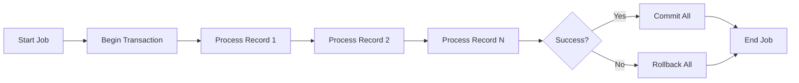
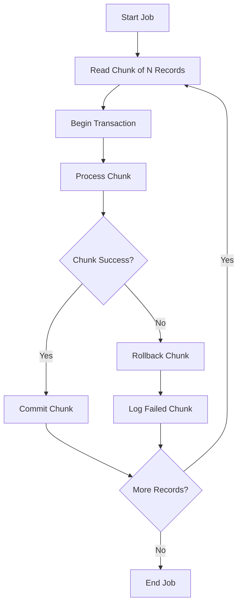
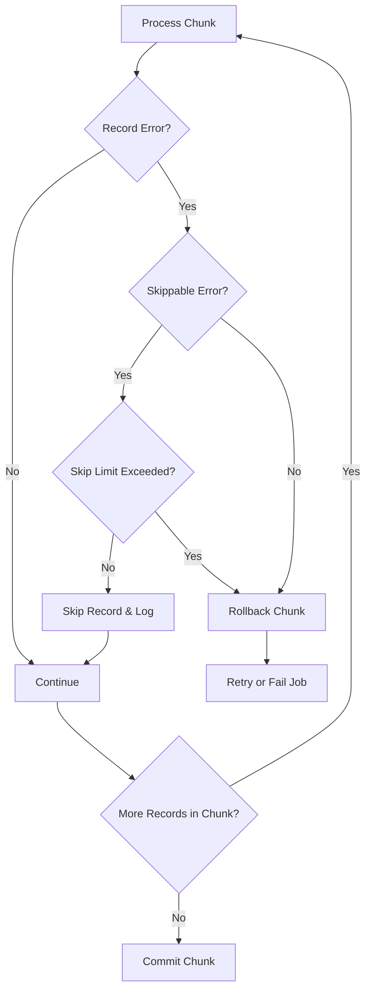
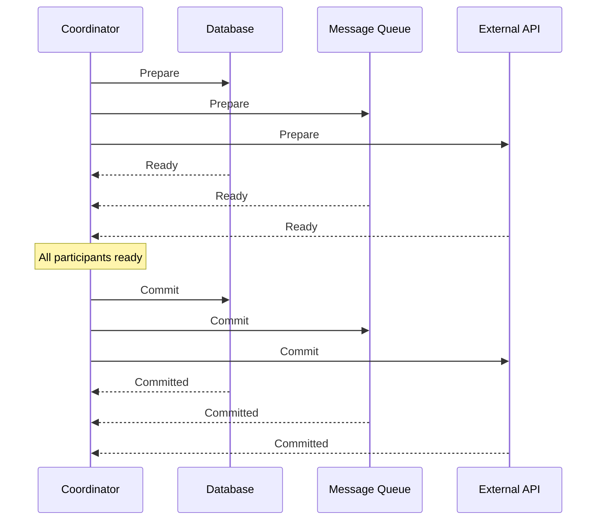
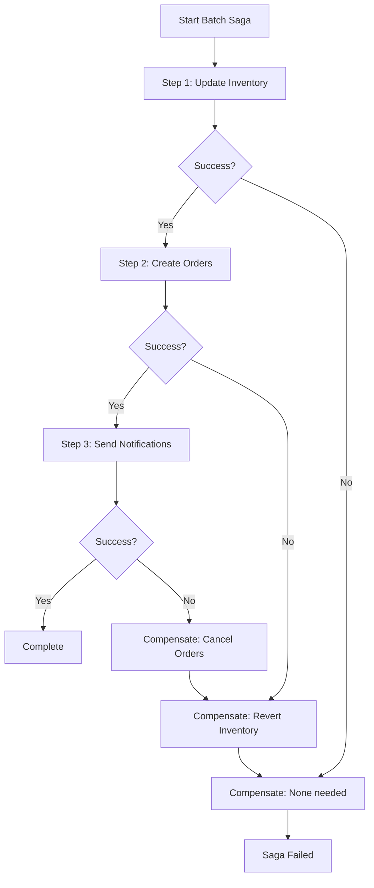
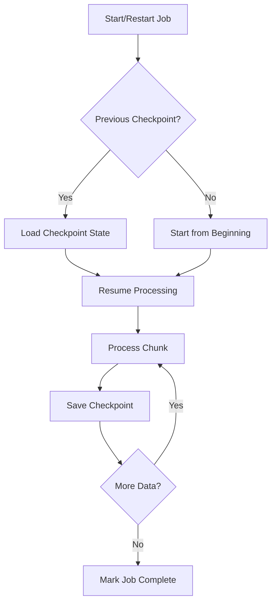

# How to Build Batch Transactions

Author: [nawazdhandala](https://github.com/nawazdhandala)

Tags: Batch Processing, Transactions, ACID, Spring Batch

Description: Learn to build batch transactions for ensuring data consistency and integrity in batch processing.

---

> Batch processing without proper transaction management is like building a house without a foundation. Everything might look fine until a storm hits.

When processing millions of records, a single failure can leave your data in an inconsistent state. Transactions provide the safety net that ensures your batch jobs either complete fully or roll back cleanly. This guide walks you through building robust batch transactions, from basic concepts to distributed systems.

---

## 1. Understanding Batch Transaction Fundamentals

Batch transactions differ from online transaction processing (OLTP) in several important ways:

- **Volume**: Batch jobs process thousands to millions of records
- **Duration**: Jobs can run for minutes to hours
- **Isolation**: Often run during off-peak hours with different isolation requirements
- **Recovery**: Must handle partial failures gracefully

### The ACID Properties in Batch Context

| Property | OLTP Context | Batch Context |
|----------|--------------|---------------|
| Atomicity | Single operation commits or rolls back | Chunk of records commits or rolls back |
| Consistency | Immediate constraint validation | May defer validation for performance |
| Isolation | High isolation between concurrent users | Often runs with reduced isolation |
| Durability | Each transaction persisted immediately | Checkpoints enable restart from last commit |

---

## 2. Transaction Boundaries in Batch Processing

The key architectural decision in batch processing is defining your transaction boundaries. There are three primary strategies:

### Strategy 1: Single Transaction (All or Nothing)



This approach wraps the entire batch in one transaction. Simple but risky for large batches.

```java
// Single transaction approach - suitable for small batches only
// WARNING: Holding a transaction open for large datasets can cause
// lock contention and memory pressure
@Transactional
public void processAllRecords(List<Record> records) {
    // All records processed in a single transaction
    // If any record fails, everything rolls back
    for (Record record : records) {
        processRecord(record);
    }
}
```

**When to use**: Small batches (fewer than 1000 records) where atomicity is critical.

**Drawbacks**: Memory exhaustion, long-held locks, complete restart on failure.

### Strategy 2: Chunk-Level Transactions (Recommended)



This is the standard approach used by frameworks like Spring Batch.

```java
// Spring Batch chunk-oriented processing configuration
// Each chunk is processed in its own transaction
@Configuration
@EnableBatchProcessing
public class BatchConfig {

    @Bean
    public Step orderProcessingStep(
            JobRepository jobRepository,
            PlatformTransactionManager transactionManager,
            ItemReader<Order> reader,
            ItemProcessor<Order, ProcessedOrder> processor,
            ItemWriter<ProcessedOrder> writer) {

        return new StepBuilder("orderProcessingStep", jobRepository)
            // Process 100 records per transaction
            // This is the "chunk size" - tune based on your data and resources
            .<Order, ProcessedOrder>chunk(100, transactionManager)
            .reader(reader)
            .processor(processor)
            .writer(writer)
            // Configure retry for transient failures
            .faultTolerant()
            .retryLimit(3)
            .retry(DeadlockLoserDataAccessException.class)
            // Skip bad records instead of failing the entire job
            .skipLimit(10)
            .skip(ValidationException.class)
            .build();
    }
}
```

**Chunk size considerations**:
- Too small: Excessive transaction overhead
- Too large: Memory pressure and long-held locks
- Sweet spot: Usually 100 to 1000 records (benchmark your specific case)

### Strategy 3: Record-Level Transactions

```java
// Record-level transaction - maximum granularity
// Use when records are independent and failure isolation is critical
public class RecordProcessor {

    @Autowired
    private TransactionTemplate transactionTemplate;

    public BatchResult processRecords(List<Record> records) {
        BatchResult result = new BatchResult();

        for (Record record : records) {
            try {
                // Each record gets its own transaction
                // Provides maximum isolation but highest overhead
                transactionTemplate.execute(status -> {
                    processRecord(record);
                    return null;
                });
                result.incrementSuccess();
            } catch (Exception e) {
                // Record failure without affecting others
                result.addFailure(record.getId(), e.getMessage());
            }
        }

        return result;
    }
}
```

**When to use**: When records are completely independent and you need maximum fault isolation.

---

## 3. Implementing Chunk Transactions with Spring Batch

Spring Batch provides robust transaction management out of the box. Here is a complete example:

```java
// Complete batch job configuration with transaction management
@Configuration
@EnableBatchProcessing
public class PaymentBatchConfig {

    // Define the chunk size as a constant for easy tuning
    private static final int CHUNK_SIZE = 250;

    @Bean
    public Job paymentProcessingJob(
            JobRepository jobRepository,
            Step paymentStep,
            JobCompletionListener listener) {

        return new JobBuilder("paymentProcessingJob", jobRepository)
            .incrementer(new RunIdIncrementer())
            .listener(listener)
            .start(paymentStep)
            .build();
    }

    @Bean
    public Step paymentStep(
            JobRepository jobRepository,
            PlatformTransactionManager transactionManager,
            ItemReader<Payment> reader,
            PaymentProcessor processor,
            ItemWriter<PaymentResult> writer,
            StepExecutionListener stepListener) {

        return new StepBuilder("paymentStep", jobRepository)
            .<Payment, PaymentResult>chunk(CHUNK_SIZE, transactionManager)
            .reader(reader)
            .processor(processor)
            .writer(writer)
            .listener(stepListener)
            // Transaction configuration
            .transactionAttribute(createTransactionAttribute())
            .build();
    }

    // Configure transaction attributes for batch processing
    private TransactionAttribute createTransactionAttribute() {
        DefaultTransactionAttribute attribute = new DefaultTransactionAttribute();

        // Use READ_COMMITTED for better concurrency
        // SERIALIZABLE provides stronger guarantees but reduces throughput
        attribute.setIsolationLevel(TransactionDefinition.ISOLATION_READ_COMMITTED);

        // Propagation REQUIRED means use existing transaction or create new one
        attribute.setPropagationBehavior(TransactionDefinition.PROPAGATION_REQUIRED);

        // Set timeout to prevent runaway transactions (in seconds)
        attribute.setTimeout(300);

        return attribute;
    }
}
```

### The Processor with Business Logic

```java
// Payment processor that handles individual record transformation
// This runs within the chunk transaction
@Component
public class PaymentProcessor implements ItemProcessor<Payment, PaymentResult> {

    @Autowired
    private PaymentValidator validator;

    @Autowired
    private FraudDetectionService fraudService;

    @Override
    public PaymentResult process(Payment payment) throws Exception {
        // Validate the payment
        // Any exception here will cause the chunk to roll back
        ValidationResult validation = validator.validate(payment);
        if (!validation.isValid()) {
            throw new ValidationException(validation.getErrors());
        }

        // Check for fraud
        FraudScore score = fraudService.evaluate(payment);
        if (score.isHighRisk()) {
            // Returning null tells Spring Batch to skip this record
            // The record is not written but also does not cause rollback
            return null;
        }

        // Transform to result
        return PaymentResult.builder()
            .paymentId(payment.getId())
            .status(PaymentStatus.PROCESSED)
            .processedAt(Instant.now())
            .build();
    }
}
```

---

## 4. Rollback Strategies

When failures occur, you need clear strategies for recovery:

### Automatic Rollback with Skip Policy



```java
// Configure skip and retry policies for resilient batch processing
@Bean
public Step resilientStep(
        JobRepository jobRepository,
        PlatformTransactionManager transactionManager) {

    return new StepBuilder("resilientStep", jobRepository)
        .<InputRecord, OutputRecord>chunk(100, transactionManager)
        .reader(reader())
        .processor(processor())
        .writer(writer())
        .faultTolerant()

        // Retry configuration for transient errors
        // These errors might succeed on retry
        .retryLimit(3)
        .retry(DeadlockLoserDataAccessException.class)
        .retry(OptimisticLockingFailureException.class)
        .retry(TransientDataAccessException.class)

        // Backoff policy to avoid hammering a struggling resource
        .backOffPolicy(exponentialBackOffPolicy())

        // Skip configuration for unrecoverable record errors
        // These records are logged and skipped
        .skipLimit(100)
        .skip(ValidationException.class)
        .skip(DataFormatException.class)

        // Never skip these - they indicate systemic problems
        .noSkip(DatabaseConnectionException.class)
        .noSkip(OutOfMemoryError.class)

        // Custom skip listener for logging and alerting
        .listener(skipListener())
        .build();
}

// Exponential backoff prevents thundering herd on retry
private BackOffPolicy exponentialBackOffPolicy() {
    ExponentialBackOffPolicy policy = new ExponentialBackOffPolicy();
    policy.setInitialInterval(100);   // Start with 100ms
    policy.setMultiplier(2.0);         // Double each retry
    policy.setMaxInterval(10000);      // Cap at 10 seconds
    return policy;
}
```

### Custom Rollback Handler

```java
// Custom exception handler for fine-grained rollback control
@Component
public class BatchExceptionHandler implements SkipListener<InputRecord, OutputRecord> {

    @Autowired
    private FailedRecordRepository failedRecordRepo;

    @Autowired
    private AlertService alertService;

    @Override
    public void onSkipInRead(Throwable t) {
        // Handle errors during reading
        // The record could not be read, log the error
        log.error("Failed to read record: {}", t.getMessage());
    }

    @Override
    public void onSkipInProcess(InputRecord item, Throwable t) {
        // Handle errors during processing
        // Save the failed record for later analysis or reprocessing
        FailedRecord failed = FailedRecord.builder()
            .originalId(item.getId())
            .errorMessage(t.getMessage())
            .errorType(t.getClass().getSimpleName())
            .failedAt(Instant.now())
            .rawData(serialize(item))
            .build();

        failedRecordRepo.save(failed);

        // Alert if we are seeing too many failures
        checkFailureThreshold();
    }

    @Override
    public void onSkipInWrite(OutputRecord item, Throwable t) {
        // Handle errors during writing
        log.error("Failed to write record {}: {}", item.getId(), t.getMessage());
    }

    private void checkFailureThreshold() {
        // Track failure rate and alert if threshold exceeded
        long recentFailures = failedRecordRepo.countRecentFailures(
            Instant.now().minus(Duration.ofMinutes(5))
        );

        if (recentFailures > 50) {
            alertService.sendAlert(
                "High failure rate in batch job: " + recentFailures + " failures in 5 minutes"
            );
        }
    }
}
```

---

## 5. Distributed Transactions in Batch Processing

When your batch job spans multiple systems (database, message queue, external API), you need distributed transaction coordination.

### Two-Phase Commit (2PC) Pattern



```java
// JTA-based distributed transaction configuration
// Uses Atomikos as the transaction manager
@Configuration
public class DistributedTransactionConfig {

    @Bean
    public UserTransactionManager atomikosTransactionManager() {
        UserTransactionManager manager = new UserTransactionManager();
        manager.setForceShutdown(false);
        // Set transaction timeout for long-running batches
        manager.setTransactionTimeout(600);
        return manager;
    }

    @Bean
    public JtaTransactionManager transactionManager(
            UserTransactionManager atomikosTransactionManager) {
        JtaTransactionManager manager = new JtaTransactionManager();
        manager.setTransactionManager(atomikosTransactionManager);
        manager.setUserTransaction(atomikosTransactionManager);
        return manager;
    }

    // XA-capable datasource for database
    @Bean
    public DataSource dataSource() {
        AtomikosDataSourceBean ds = new AtomikosDataSourceBean();
        ds.setUniqueResourceName("primaryDb");
        ds.setXaDataSourceClassName("org.postgresql.xa.PGXADataSource");

        Properties props = new Properties();
        props.setProperty("serverName", "localhost");
        props.setProperty("databaseName", "batchdb");
        props.setProperty("user", "batch_user");
        props.setProperty("password", "secure_password");
        ds.setXaProperties(props);

        ds.setPoolSize(10);
        return ds;
    }

    // XA-capable connection factory for JMS
    @Bean
    public ConnectionFactory connectionFactory() {
        AtomikosConnectionFactoryBean cf = new AtomikosConnectionFactoryBean();
        cf.setUniqueResourceName("messageQueue");
        cf.setXaConnectionFactory(createXaConnectionFactory());
        cf.setPoolSize(5);
        return cf;
    }
}
```

### Saga Pattern for Long-Running Batches

For very long batch jobs or when 2PC is not available, the Saga pattern provides eventual consistency:



```java
// Saga orchestrator for distributed batch processing
@Service
public class BatchSagaOrchestrator {

    @Autowired
    private InventoryService inventoryService;

    @Autowired
    private OrderService orderService;

    @Autowired
    private NotificationService notificationService;

    @Autowired
    private SagaStateRepository sagaStateRepo;

    public SagaResult executeBatchSaga(BatchRequest request) {
        // Create saga state for tracking
        SagaState saga = SagaState.create(request.getId());
        sagaStateRepo.save(saga);

        try {
            // Step 1: Update inventory
            InventoryResult inventoryResult = inventoryService.reserveInventory(
                request.getItems()
            );
            saga.markStepComplete("INVENTORY", inventoryResult);
            sagaStateRepo.save(saga);

            // Step 2: Create orders
            OrderResult orderResult = orderService.createOrders(
                request.getOrders()
            );
            saga.markStepComplete("ORDERS", orderResult);
            sagaStateRepo.save(saga);

            // Step 3: Send notifications
            notificationService.sendBatchNotifications(
                request.getNotifications()
            );
            saga.markStepComplete("NOTIFICATIONS", null);
            saga.markComplete();
            sagaStateRepo.save(saga);

            return SagaResult.success(saga);

        } catch (Exception e) {
            // Execute compensating transactions in reverse order
            return compensate(saga, e);
        }
    }

    private SagaResult compensate(SagaState saga, Exception originalError) {
        log.error("Saga failed, starting compensation: {}", originalError.getMessage());

        List<String> compensationErrors = new ArrayList<>();

        // Compensate in reverse order of completion
        if (saga.isStepComplete("ORDERS")) {
            try {
                orderService.cancelOrders(saga.getStepResult("ORDERS"));
                saga.markStepCompensated("ORDERS");
            } catch (Exception e) {
                compensationErrors.add("Failed to compensate orders: " + e.getMessage());
            }
        }

        if (saga.isStepComplete("INVENTORY")) {
            try {
                inventoryService.releaseInventory(saga.getStepResult("INVENTORY"));
                saga.markStepCompensated("INVENTORY");
            } catch (Exception e) {
                compensationErrors.add("Failed to compensate inventory: " + e.getMessage());
            }
        }

        saga.markFailed(originalError.getMessage());
        sagaStateRepo.save(saga);

        if (!compensationErrors.isEmpty()) {
            // Manual intervention required
            alertService.sendCriticalAlert(
                "Saga compensation partially failed",
                compensationErrors
            );
        }

        return SagaResult.failed(saga, originalError, compensationErrors);
    }
}
```

---

## 6. Checkpoint and Restart Patterns

Batch jobs must be restartable. Implement checkpointing to avoid reprocessing:



```java
// Checkpoint-aware batch processor
@Component
public class CheckpointProcessor {

    @Autowired
    private CheckpointRepository checkpointRepo;

    @Autowired
    private TransactionTemplate transactionTemplate;

    public void processWithCheckpoint(String jobId, List<Record> records) {
        // Load last checkpoint
        Checkpoint checkpoint = checkpointRepo.findByJobId(jobId)
            .orElse(new Checkpoint(jobId, 0));

        int startIndex = checkpoint.getLastProcessedIndex();
        int chunkSize = 100;

        log.info("Resuming job {} from index {}", jobId, startIndex);

        for (int i = startIndex; i < records.size(); i += chunkSize) {
            int endIndex = Math.min(i + chunkSize, records.size());
            List<Record> chunk = records.subList(i, endIndex);

            // Process chunk and save checkpoint atomically
            final int currentIndex = endIndex;
            transactionTemplate.execute(status -> {
                // Process all records in the chunk
                for (Record record : chunk) {
                    processRecord(record);
                }

                // Update checkpoint within the same transaction
                // If the transaction rolls back, checkpoint is not updated
                checkpoint.setLastProcessedIndex(currentIndex);
                checkpoint.setLastUpdated(Instant.now());
                checkpointRepo.save(checkpoint);

                return null;
            });

            log.info("Checkpoint saved at index {}", currentIndex);
        }

        // Mark job complete
        checkpoint.setStatus(CheckpointStatus.COMPLETE);
        checkpointRepo.save(checkpoint);
    }
}
```

### Spring Batch Built-in Restartability

```java
// Spring Batch handles restartability automatically through JobRepository
// Configure the job to be restartable
@Bean
public Job restartableJob(JobRepository jobRepository, Step step) {
    return new JobBuilder("restartableJob", jobRepository)
        .incrementer(new RunIdIncrementer())
        // Job can be restarted if it fails
        .preventRestart()  // Remove this line to enable restart
        .start(step)
        .build();
}

// The reader must support restart by using ItemStreamReader
@Bean
public JdbcPagingItemReader<Order> reader(DataSource dataSource) {
    JdbcPagingItemReader<Order> reader = new JdbcPagingItemReader<>();
    reader.setDataSource(dataSource);
    reader.setPageSize(100);

    // This query provider enables restartable paging
    SqlPagingQueryProviderFactoryBean queryProvider =
        new SqlPagingQueryProviderFactoryBean();
    queryProvider.setDataSource(dataSource);
    queryProvider.setSelectClause("SELECT id, customer_id, amount, status");
    queryProvider.setFromClause("FROM orders");
    queryProvider.setWhereClause("WHERE status = 'PENDING'");
    queryProvider.setSortKey("id");  // Required for deterministic paging

    reader.setQueryProvider(queryProvider.getObject());
    reader.setRowMapper(new OrderRowMapper());

    // Save state enables automatic restart from last position
    reader.setSaveState(true);

    return reader;
}
```

---

## 7. Monitoring and Observability

Track your batch transactions to catch issues early:

```java
// Batch metrics and monitoring
@Component
public class BatchMetricsListener implements StepExecutionListener, ChunkListener {

    @Autowired
    private MeterRegistry meterRegistry;

    private Timer chunkTimer;
    private Counter recordsProcessed;
    private Counter recordsFailed;
    private Counter transactionsCommitted;
    private Counter transactionsRolledBack;

    @PostConstruct
    public void init() {
        // Initialize metrics
        recordsProcessed = meterRegistry.counter("batch.records.processed");
        recordsFailed = meterRegistry.counter("batch.records.failed");
        transactionsCommitted = meterRegistry.counter("batch.transactions.committed");
        transactionsRolledBack = meterRegistry.counter("batch.transactions.rolledback");
        chunkTimer = meterRegistry.timer("batch.chunk.duration");
    }

    private Timer.Sample currentChunkSample;

    @Override
    public void beforeChunk(ChunkContext context) {
        // Start timing the chunk
        currentChunkSample = Timer.start(meterRegistry);
    }

    @Override
    public void afterChunk(ChunkContext context) {
        // Record chunk duration
        currentChunkSample.stop(chunkTimer);

        // Record transaction commit
        transactionsCommitted.increment();

        // Record processed count
        StepExecution stepExecution = context.getStepContext().getStepExecution();
        recordsProcessed.increment(stepExecution.getWriteCount());
    }

    @Override
    public void afterChunkError(ChunkContext context) {
        // Record rollback
        transactionsRolledBack.increment();

        // Record failed count
        StepExecution stepExecution = context.getStepContext().getStepExecution();
        recordsFailed.increment(stepExecution.getSkipCount());
    }

    @Override
    public void beforeStep(StepExecution stepExecution) {
        log.info("Starting step: {} with {} items to process",
            stepExecution.getStepName(),
            stepExecution.getExecutionContext().get("item.count"));
    }

    @Override
    public ExitStatus afterStep(StepExecution stepExecution) {
        // Log step summary
        log.info("Step {} completed - Read: {}, Written: {}, Skipped: {}",
            stepExecution.getStepName(),
            stepExecution.getReadCount(),
            stepExecution.getWriteCount(),
            stepExecution.getSkipCount());

        // Check for concerning patterns
        double skipRate = (double) stepExecution.getSkipCount() /
            stepExecution.getReadCount();
        if (skipRate > 0.05) {
            log.warn("High skip rate detected: {}%", skipRate * 100);
        }

        return stepExecution.getExitStatus();
    }
}
```

---

## 8. Best Practices Summary

### Transaction Sizing

| Batch Size | Transaction Strategy | Use Case |
|------------|---------------------|----------|
| < 100 records | Single transaction | Small, critical batches |
| 100 - 10,000 | Chunk (100-500 per tx) | Standard batch processing |
| 10,000 - 1M | Chunk (500-1000 per tx) | Large data migrations |
| > 1M records | Chunk + partitioning | Massive ETL jobs |

### Key Recommendations

1. **Start with chunk-level transactions** - They balance consistency and performance
2. **Configure appropriate timeouts** - Prevent runaway transactions from holding locks
3. **Implement skip policies** - Do not let a single bad record fail your entire job
4. **Use exponential backoff for retries** - Give systems time to recover
5. **Save checkpoints within transactions** - Ensure checkpoint and data stay in sync
6. **Monitor transaction metrics** - Track commit rates, rollback rates, and durations
7. **Test failure scenarios** - Simulate database failures, deadlocks, and timeout conditions
8. **Plan for restartability** - Assume your job will fail and design for recovery

---

## Summary

Building robust batch transactions requires understanding the tradeoffs between consistency, performance, and recoverability. Key takeaways:

- **Choose the right transaction boundary** - Chunk-level is usually the best default
- **Handle failures gracefully** - Use skip policies, retries, and compensation
- **Enable restartability** - Save checkpoints to avoid reprocessing
- **Monitor everything** - Track metrics to catch issues before they escalate

Batch processing is inherently complex, but with proper transaction management, you can build systems that process millions of records reliably while maintaining data integrity.

**Related Reading:**
- [Spring Batch Reference Documentation](https://docs.spring.io/spring-batch/docs/current/reference/html/)
- [ACID Properties in Database Systems](https://oneuptime.com/blog/)
- [Saga Pattern for Distributed Transactions](https://microservices.io/patterns/data/saga.html)

---

*Building reliable batch processing pipelines? Monitor your batch jobs with OneUptime to track execution times, failure rates, and get alerted when things go wrong.*
