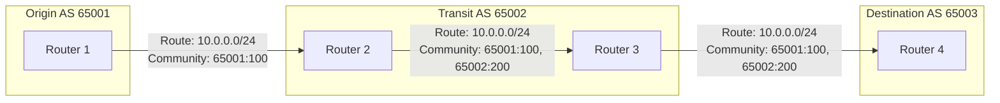
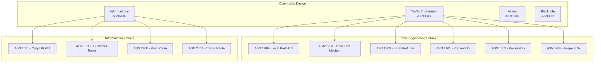
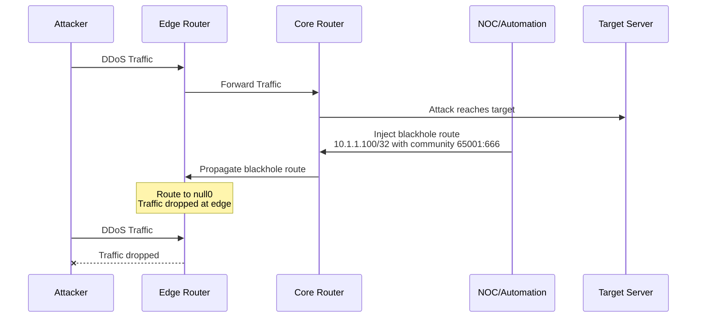
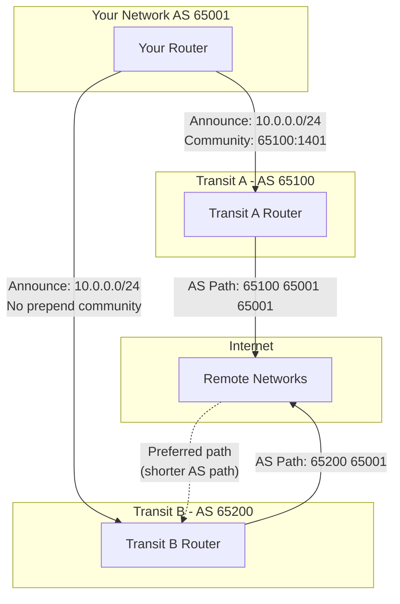
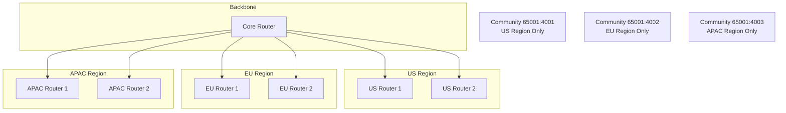
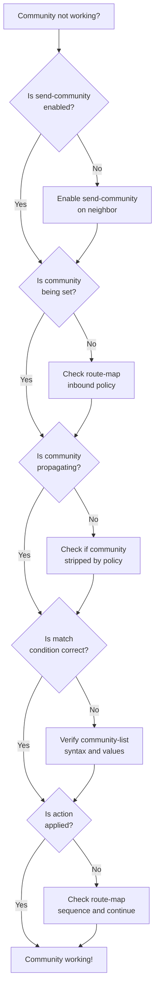

# How to Implement BGP Community Configuration

Author: [nawazdhandala](https://github.com/nawazdhandala)

Tags: BGP, Networking, Routing, Communities

Description: A comprehensive guide to implementing BGP communities for traffic engineering, route filtering, and policy management. Learn how to use standard, extended, and large communities with practical configuration examples for Cisco, Juniper, and FRRouting.

BGP communities are one of the most powerful tools in a network engineer's arsenal. They allow you to tag routes with metadata, enabling sophisticated traffic engineering, route filtering, and policy decisions across your network and with your peers. This guide covers everything you need to know to implement BGP communities effectively in production environments.

## What Are BGP Communities?

BGP communities are optional transitive attributes that can be attached to routes. Think of them as labels or tags that travel with the route as it propagates through the BGP network. They enable you to group routes together and apply policies based on those groupings, rather than matching on prefixes or AS paths.



Communities propagate with routes as they traverse the network. Each AS along the path can read, add, modify, or remove communities based on their policies.

## Types of BGP Communities

### Standard Communities (RFC 1997)

Standard communities are 32-bit values, typically represented as two 16-bit numbers separated by a colon (ASN:value). The first number usually represents the AS number, and the second is a locally significant value.

```
Format: ASN:VALUE (e.g., 65001:100)
Range: 0:0 to 65535:65535
```

### Well-Known Communities

BGP defines several well-known communities with special meanings:

| Community | Value | Description |
|-----------|-------|-------------|
| NO_EXPORT | 65535:65281 | Do not advertise outside the AS |
| NO_ADVERTISE | 65535:65282 | Do not advertise to any peer |
| NO_EXPORT_SUBCONFED | 65535:65283 | Do not advertise outside the local confederation |
| NOPEER | 65535:65284 | Do not advertise to bilateral peers |

### Extended Communities (RFC 4360)

Extended communities are 64-bit values that provide more flexibility and structure. They are commonly used for VPN route targets, traffic engineering, and other advanced features.

```
Format: Type:Administrator:Value
Example: route-target:65001:100
```

### Large Communities (RFC 8092)

Large communities are 96-bit values designed for 32-bit ASN support. They consist of three 32-bit fields.

```
Format: GlobalAdmin:LocalData1:LocalData2
Example: 4200000001:100:200
```

## Community Design Patterns

Before diving into configuration, let's establish a community design framework. A well-designed community scheme makes policy implementation and troubleshooting much easier.

### Traffic Engineering Communities



### Example Community Scheme

Here is a practical community scheme for an AS:

```
# Informational Communities (read-only)
65001:1000  - Route learned from customer
65001:1100  - Route learned from peer
65001:1200  - Route learned from transit
65001:2001  - Learned at datacenter 1
65001:2002  - Learned at datacenter 2
65001:2003  - Learned at datacenter 3

# Action Communities (customer-settable)
65001:3100  - Set local preference to 50 (backup)
65001:3200  - Set local preference to 100 (default)
65001:3300  - Set local preference to 150 (preferred)
65001:3401  - Prepend 1x to all peers
65001:3402  - Prepend 2x to all peers
65001:3403  - Prepend 3x to all peers
65001:666   - Blackhole this route
```

## Configuration Examples

### Cisco IOS/IOS-XE Configuration

#### Defining Community Lists

```cisco
! Standard community list - matches exact community
ip community-list standard CUSTOMER_ROUTES permit 65001:1000

! Expanded community list - supports regex
ip community-list expanded HIGH_PREF permit 65001:330[0-9]

! Match routes tagged for blackholing
ip community-list standard BLACKHOLE permit 65001:666

! Match any customer-settable action community
ip community-list expanded CUSTOMER_ACTIONS permit 65001:3[0-9]+
```

#### Setting Communities on Incoming Routes

```cisco
! Route map for customer BGP session
route-map CUSTOMER_IN permit 10
 description Tag routes from customer and apply requested actions
 ! Add informational community
 set community 65001:1000 additive
 continue 100

route-map CUSTOMER_IN permit 100
 description Apply customer-requested local preference
 match community HIGH_PREF
 set local-preference 150
 continue 200

route-map CUSTOMER_IN permit 110
 description Default local preference for customer routes
 set local-preference 120
 continue 200

route-map CUSTOMER_IN permit 200
 description Check for blackhole request
 match community BLACKHOLE
 set local-preference 200
 set origin igp
 set community 65001:666

route-map CUSTOMER_IN permit 999
 description Accept all other routes
```

#### Applying Communities to BGP Neighbors

```cisco
router bgp 65001
 neighbor 192.0.2.1 remote-as 65100
 neighbor 192.0.2.1 description Customer-A
 neighbor 192.0.2.1 route-map CUSTOMER_IN in
 neighbor 192.0.2.1 route-map CUSTOMER_OUT out
 neighbor 192.0.2.1 send-community both
 !
 neighbor 198.51.100.1 remote-as 65200
 neighbor 198.51.100.1 description Transit-Provider
 neighbor 198.51.100.1 route-map TRANSIT_IN in
 neighbor 198.51.100.1 route-map TRANSIT_OUT out
 neighbor 198.51.100.1 send-community both
```

### Juniper Junos Configuration

#### Defining Community Members

```junos
policy-options {
    community CUSTOMER_ROUTES members 65001:1000;
    community PEER_ROUTES members 65001:1100;
    community TRANSIT_ROUTES members 65001:1200;

    community BLACKHOLE members 65001:666;

    community LOCAL_PREF_50 members 65001:3100;
    community LOCAL_PREF_100 members 65001:3200;
    community LOCAL_PREF_150 members 65001:3300;

    community PREPEND_1X members 65001:3401;
    community PREPEND_2X members 65001:3402;
    community PREPEND_3X members 65001:3403;

    /* Well-known communities */
    community NO_EXPORT members no-export;
    community NO_ADVERTISE members no-advertise;

    /* Community matching with regex */
    community ALL_ACTION_COMMUNITIES members "65001:3.*";
}
```

#### Policy Configuration

```junos
policy-options {
    policy-statement CUSTOMER_IMPORT {
        term TAG_AS_CUSTOMER {
            then {
                community add CUSTOMER_ROUTES;
                next term;
            }
        }

        term PROCESS_HIGH_PREF {
            from community LOCAL_PREF_150;
            then {
                local-preference 150;
                next term;
            }
        }

        term PROCESS_LOW_PREF {
            from community LOCAL_PREF_50;
            then {
                local-preference 50;
                next term;
            }
        }

        term PROCESS_BLACKHOLE {
            from community BLACKHOLE;
            then {
                local-preference 200;
                community add NO_EXPORT;
                next-hop discard;
                accept;
            }
        }

        term DEFAULT_CUSTOMER_PREF {
            then {
                local-preference 120;
                accept;
            }
        }
    }

    policy-statement TRANSIT_EXPORT {
        term STRIP_INTERNAL_COMMUNITIES {
            then {
                community delete ALL_ACTION_COMMUNITIES;
                next term;
            }
        }

        term PREPEND_1X {
            from community PREPEND_1X;
            then {
                as-path-prepend "65001 65001";
                next term;
            }
        }

        term ADVERTISE_CUSTOMERS {
            from community CUSTOMER_ROUTES;
            then accept;
        }

        term REJECT_ALL {
            then reject;
        }
    }
}
```

#### Applying Policies to BGP

```junos
protocols {
    bgp {
        group CUSTOMERS {
            type external;
            import CUSTOMER_IMPORT;
            export CUSTOMER_EXPORT;
            neighbor 192.0.2.1 {
                description "Customer-A";
                peer-as 65100;
            }
        }

        group TRANSIT {
            type external;
            import TRANSIT_IMPORT;
            export TRANSIT_EXPORT;
            neighbor 198.51.100.1 {
                description "Transit-Provider";
                peer-as 65200;
            }
        }
    }
}
```

### FRRouting Configuration

FRRouting is commonly used in software-defined networking and Linux-based routers.

#### Community List Configuration

```frr
! Define community lists
bgp community-list standard CUSTOMER_ROUTES permit 65001:1000
bgp community-list standard PEER_ROUTES permit 65001:1100
bgp community-list standard TRANSIT_ROUTES permit 65001:1200
bgp community-list standard BLACKHOLE permit 65001:666

bgp community-list standard HIGH_PREF permit 65001:3300
bgp community-list standard MED_PREF permit 65001:3200
bgp community-list standard LOW_PREF permit 65001:3100

bgp community-list standard PREPEND_1X permit 65001:3401
bgp community-list standard PREPEND_2X permit 65001:3402
bgp community-list standard PREPEND_3X permit 65001:3403

! Expanded community list with regex
bgp community-list expanded ACTION_COMMUNITIES permit 65001:3[0-9]+
```

#### Route Map Configuration

```frr
! Customer import policy
route-map CUSTOMER_IN permit 10
 description Tag as customer route
 set community 65001:1000 additive
 on-match next

route-map CUSTOMER_IN permit 20
 description Process high preference request
 match community HIGH_PREF
 set local-preference 150
 on-match next

route-map CUSTOMER_IN permit 30
 description Process low preference request
 match community LOW_PREF
 set local-preference 50
 on-match next

route-map CUSTOMER_IN permit 40
 description Process blackhole request
 match community BLACKHOLE
 set local-preference 200
 set ip next-hop 192.0.2.1

route-map CUSTOMER_IN permit 1000
 description Accept remaining routes
 set local-preference 120

! Transit export policy
route-map TRANSIT_OUT permit 10
 description Remove internal action communities
 set comm-list ACTION_COMMUNITIES delete

route-map TRANSIT_OUT permit 20
 description Prepend 1x if requested
 match community PREPEND_1X
 set as-path prepend 65001

route-map TRANSIT_OUT permit 30
 description Prepend 2x if requested
 match community PREPEND_2X
 set as-path prepend 65001 65001

route-map TRANSIT_OUT permit 40
 description Prepend 3x if requested
 match community PREPEND_3X
 set as-path prepend 65001 65001 65001

route-map TRANSIT_OUT permit 50
 description Only advertise customer routes
 match community CUSTOMER_ROUTES
```

#### BGP Configuration

```frr
router bgp 65001
 bgp router-id 10.0.0.1
 no bgp default ipv4-unicast

 neighbor CUSTOMERS peer-group
 neighbor CUSTOMERS remote-as external
 neighbor CUSTOMERS send-community both

 neighbor TRANSIT peer-group
 neighbor TRANSIT remote-as external
 neighbor TRANSIT send-community both

 neighbor 192.0.2.1 peer-group CUSTOMERS
 neighbor 192.0.2.1 remote-as 65100
 neighbor 192.0.2.1 description Customer-A

 neighbor 198.51.100.1 peer-group TRANSIT
 neighbor 198.51.100.1 remote-as 65200
 neighbor 198.51.100.1 description Transit-Provider

 address-family ipv4 unicast
  neighbor CUSTOMERS route-map CUSTOMER_IN in
  neighbor CUSTOMERS route-map CUSTOMER_OUT out
  neighbor TRANSIT route-map TRANSIT_IN in
  neighbor TRANSIT route-map TRANSIT_OUT out
 exit-address-family
```

## Advanced Use Cases

### Remote Triggered Blackhole (RTBH)

RTBH is a DDoS mitigation technique that uses BGP communities to drop traffic at network edges.



#### RTBH Configuration (Cisco)

```cisco
! Define the null route and tag with blackhole community
ip route 192.0.2.100 255.255.255.255 Null0 tag 666

! Redistribute static routes with blackhole tag
route-map BLACKHOLE_INJECT permit 10
 match tag 666
 set community 65001:666
 set origin igp
 set local-preference 200

router bgp 65001
 redistribute static route-map BLACKHOLE_INJECT

! On edge routers - match blackhole community and null route
ip community-list standard BLACKHOLE permit 65001:666

route-map IBGP_IN permit 10
 match community BLACKHOLE
 set ip next-hop 192.0.2.1
 set local-preference 200

ip route 192.0.2.1 255.255.255.255 Null0
```

### Traffic Engineering with Communities

Use communities to influence inbound traffic by signaling prepending preferences to upstream providers.



Many transit providers offer communities that customers can use:

```
# Example Transit Provider Community Actions
TRANSIT_ASN:0       - Do not announce to any peer
TRANSIT_ASN:PEER    - Do not announce to specific peer ASN
TRANSIT_ASN:100     - Prepend 1x to all peers
TRANSIT_ASN:200     - Prepend 2x to all peers
TRANSIT_ASN:300     - Prepend 3x to all peers
TRANSIT_ASN:1XXX    - Prepend to specific region
TRANSIT_ASN:2XXX    - Set local preference
```

### Geographic and Scope-Based Filtering

Use communities to control route propagation based on geography.



#### Geographic Filtering Configuration

```cisco
! Define regional communities
ip community-list standard REGION_US permit 65001:4001
ip community-list standard REGION_EU permit 65001:4002
ip community-list standard REGION_APAC permit 65001:4003
ip community-list standard REGION_GLOBAL permit 65001:4000

! Route map for US region peers
route-map TO_US_PEERS permit 10
 match community REGION_US REGION_GLOBAL

route-map TO_US_PEERS deny 999

! Route map for EU region peers
route-map TO_EU_PEERS permit 10
 match community REGION_EU REGION_GLOBAL

route-map TO_EU_PEERS deny 999

! Route map for APAC region peers
route-map TO_APAC_PEERS permit 10
 match community REGION_APAC REGION_GLOBAL

route-map TO_APAC_PEERS deny 999
```

## Large Communities for 32-bit ASNs

With the exhaustion of 16-bit ASNs, large communities (RFC 8092) provide a solution for networks with 32-bit ASNs.

### Large Community Structure

```
Global Administrator : Local Data 1 : Local Data 2
      (32 bits)         (32 bits)      (32 bits)

Example: 4200000001:100:200
```

### Large Community Configuration (FRRouting)

```frr
! Define large community lists
bgp large-community-list standard CUSTOMER_ROUTES permit 4200000001:1:0
bgp large-community-list standard BLACKHOLE permit 4200000001:666:0
bgp large-community-list standard PREPEND_1X permit 4200000001:100:1

! Route map using large communities
route-map CUSTOMER_IN permit 10
 set large-community 4200000001:1:0 additive

route-map CUSTOMER_IN permit 20
 match large-community BLACKHOLE
 set local-preference 200
 set ip next-hop 192.0.2.1

! BGP configuration
router bgp 4200000001
 neighbor 192.0.2.1 remote-as 4200000100
 neighbor 192.0.2.1 send-community all
```

### Large Community Configuration (Junos)

```junos
policy-options {
    community CUSTOMER_ROUTES_LARGE members large:4200000001:1:0;
    community BLACKHOLE_LARGE members large:4200000001:666:0;
    community PREPEND_LARGE members large:4200000001:100:*;
}

policy-statement CUSTOMER_IMPORT_LARGE {
    term TAG_CUSTOMER {
        then {
            community add CUSTOMER_ROUTES_LARGE;
            next term;
        }
    }

    term BLACKHOLE {
        from community BLACKHOLE_LARGE;
        then {
            local-preference 200;
            next-hop discard;
            accept;
        }
    }
}
```

## Debugging and Verification

### Viewing Communities on Routes

#### Cisco IOS

```cisco
! Show BGP routes with communities
show ip bgp community
show ip bgp community 65001:1000

! Show detailed route information including communities
show ip bgp 10.0.0.0/24

! Show community list matches
show ip bgp community-list CUSTOMER_ROUTES
```

#### Juniper Junos

```junos
# Show routes with specific community
show route community-name CUSTOMER_ROUTES

# Show route details including communities
show route 10.0.0.0/24 detail

# Show all routes with any community
show route community *
```

#### FRRouting

```frr
! Show routes with communities
show ip bgp community
show ip bgp community 65001:1000

! Show large communities
show ip bgp large-community
show ip bgp large-community 4200000001:1:0

! Detailed route view
show ip bgp 10.0.0.0/24
```

### Common Troubleshooting Steps



### Verification Commands Checklist

```bash
# 1. Verify neighbor is configured to send communities
show ip bgp neighbors 192.0.2.1 | include community

# 2. Verify route has expected communities
show ip bgp 10.0.0.0/24 | include Community

# 3. Verify community list is matching
show ip bgp community-list CUSTOMER_ROUTES

# 4. Verify route-map is applied
show ip bgp neighbors 192.0.2.1 | include route-map

# 5. Check policy hit counters (where available)
show route-map CUSTOMER_IN
```

## Best Practices

### 1. Document Your Community Scheme

Maintain clear documentation of your community assignments:

```yaml
# community-scheme.yaml
informational:
  65001:1000: "Route learned from customer"
  65001:1100: "Route learned from peer"
  65001:1200: "Route learned from transit"
  65001:2001: "Learned at DC1 - New York"
  65001:2002: "Learned at DC2 - London"
  65001:2003: "Learned at DC3 - Singapore"

actions:
  65001:3100: "Set local-preference 50"
  65001:3200: "Set local-preference 100"
  65001:3300: "Set local-preference 150"
  65001:3401: "Prepend 1x to all peers"
  65001:3402: "Prepend 2x to all peers"
  65001:3403: "Prepend 3x to all peers"

special:
  65001:666: "Blackhole route"
  65001:0: "Do not advertise"
```

### 2. Strip Internal Communities on Export

Always remove internal action communities before advertising to external peers:

```cisco
route-map TO_EXTERNAL permit 10
 set comm-list INTERNAL_COMMUNITIES delete
```

### 3. Use Additive When Setting Communities

Preserve existing communities when adding new ones:

```cisco
route-map CUSTOMER_IN permit 10
 set community 65001:1000 additive
```

### 4. Implement Consistent Naming Conventions

```
Community Lists:
- CL_CUSTOMER_ROUTES
- CL_BLACKHOLE
- CL_PREPEND_1X

Route Maps:
- RM_CUSTOMER_IN
- RM_CUSTOMER_OUT
- RM_TRANSIT_IN
- RM_TRANSIT_OUT
```

### 5. Test in a Lab Environment

Before deploying community changes to production:

1. Set up a lab topology mirroring production
2. Verify community propagation
3. Confirm policy actions trigger correctly
4. Test failure scenarios
5. Document expected behavior

### 6. Monitor Community Usage

Track which communities are being used and their frequency:

```cisco
! Enable community debugging (use carefully)
debug ip bgp updates
debug ip bgp events

! Use NetFlow/IPFIX to track community usage
```

## Conclusion

BGP communities are essential for modern network operations. They enable:

- **Traffic Engineering**: Control how traffic enters and exits your network
- **Policy Simplification**: Apply complex policies based on simple tags
- **Operational Flexibility**: Implement changes without modifying peer configurations
- **Security**: Implement blackholing and route filtering at scale

Start with a simple community scheme, document it thoroughly, and expand as your needs grow. The investment in a well-designed community structure pays dividends in operational efficiency and network control.

---

*Need to monitor your network infrastructure? OneUptime provides comprehensive monitoring for network devices, BGP sessions, and routing health. Set up alerts for BGP session flaps, route count changes, and policy violations to catch issues before they impact your users.*

**Related Reading:**

- [Why Software Engineers Don't Understand Networking](https://oneuptime.com/blog/post/2025-12-12-why-software-engineers-dont-understand-networking/view)
- [Monitoring IP Addresses with OneUptime](https://oneuptime.com/blog/post/2025-10-27-monitor-ip-addresses-with-oneuptime/view)
- [Monitoring Service Ports with OneUptime](https://oneuptime.com/blog/post/2025-10-27-monitor-service-ports-with-oneuptime/view)
