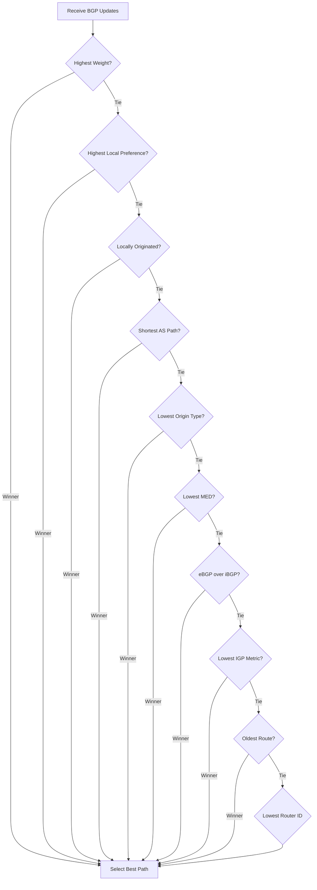
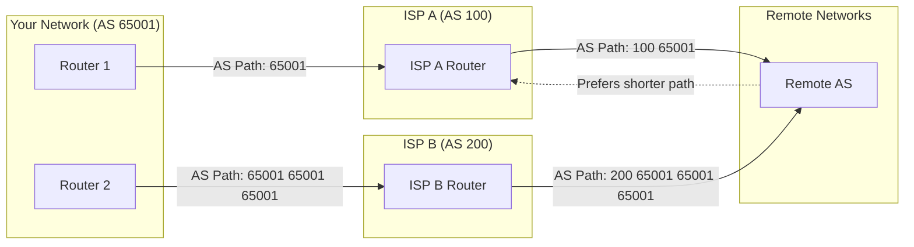
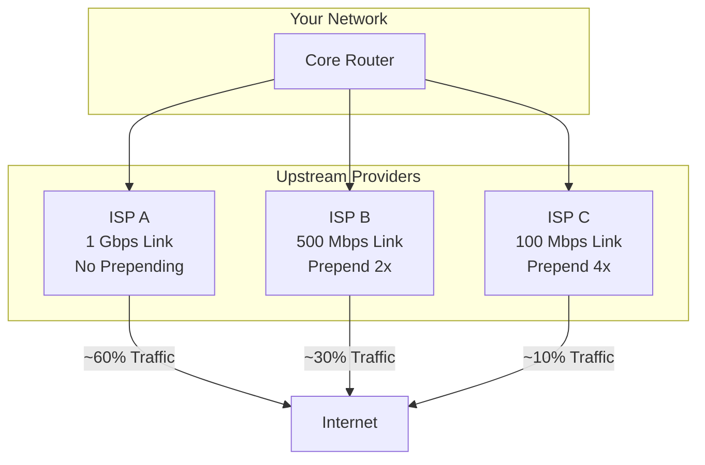
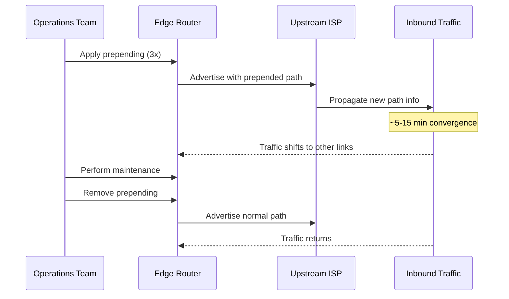
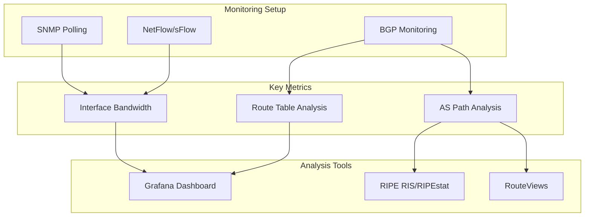
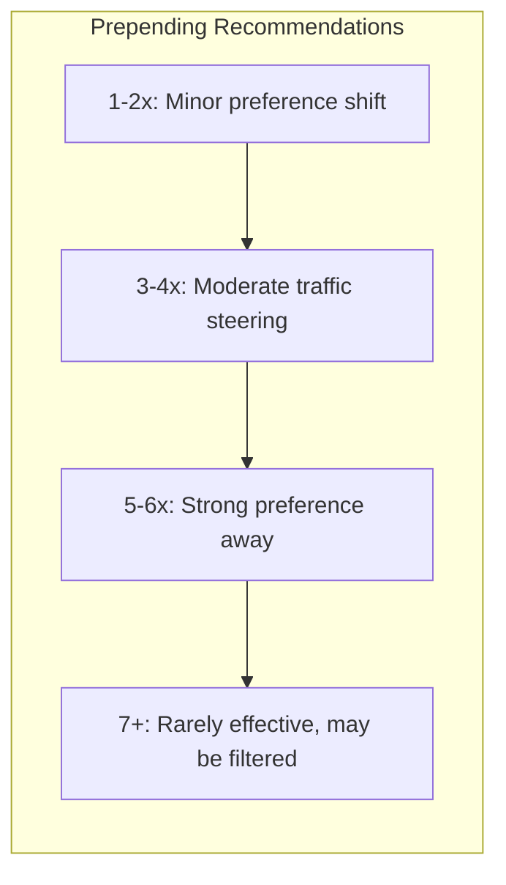
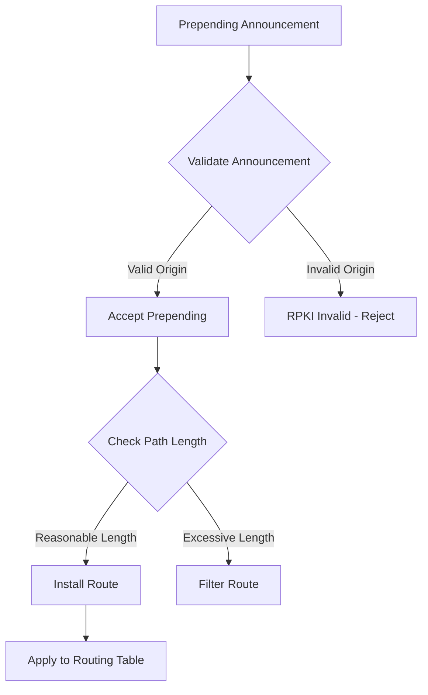
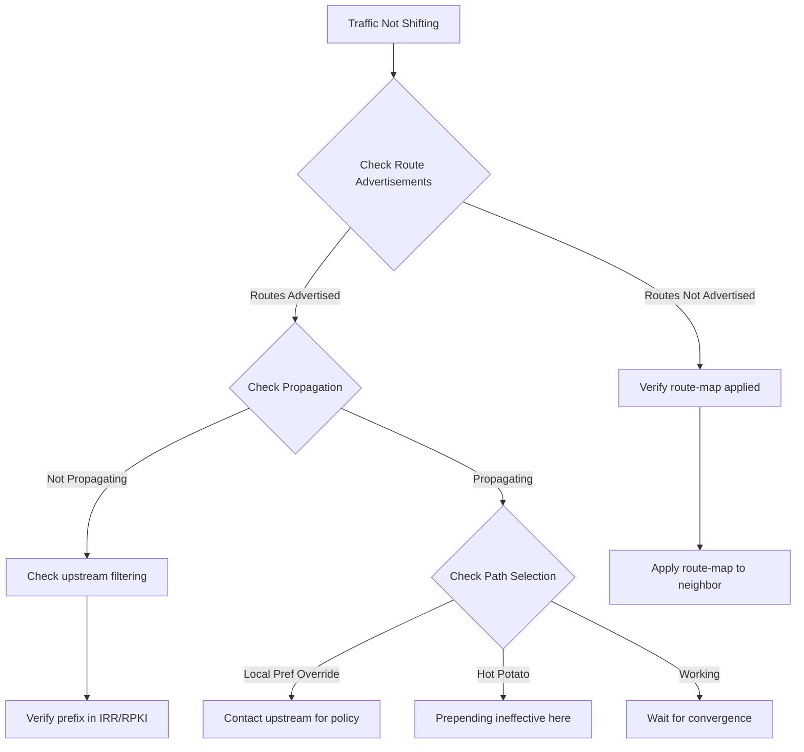

# How to Create BGP Path Prepending

Author: [nawazdhandala](https://github.com/nawazdhandala)

Tags: BGP, Networking, Routing, Traffic Engineering

Description: A comprehensive guide to BGP path prepending for traffic engineering. Learn how to influence inbound traffic paths, implement prepending on different router platforms, and avoid common pitfalls in production networks.

---

> BGP path prepending is one of the most powerful tools for influencing how traffic enters your network. By artificially lengthening the AS path, you can shift traffic away from specific links, balance load across multiple upstreams, or prepare for maintenance windows. Master this technique to take control of your inbound traffic.

Traffic engineering is essential for networks with multiple upstream providers. Path prepending gives you control over which paths external networks use to reach you.

---

## Understanding BGP Path Selection

Before diving into path prepending, you need to understand how BGP selects the best path to a destination. BGP uses a complex decision process with multiple criteria evaluated in order.



The AS path length is the fourth criterion in BGP path selection. When all higher-priority attributes are equal (which is common when receiving routes from different providers), the shorter AS path wins.

---

## What is Path Prepending?

Path prepending involves adding your own AS number multiple times to the AS path when advertising routes to specific neighbors. This makes the path appear longer from that neighbor's perspective, making alternative paths more attractive.



In this example, remote networks see two paths to AS 65001:
- Via ISP A: AS path length = 2 (100, 65001)
- Via ISP B: AS path length = 4 (200, 65001, 65001, 65001)

Most networks will prefer the shorter path through ISP A.

---

## Common Use Cases

### Load Balancing Across Upstreams

When you have multiple upstream providers with unequal bandwidth, use prepending to shift traffic proportionally.



### Maintenance Window Preparation

Before performing maintenance on a link, prepend heavily to drain traffic away.



### Disaster Recovery and Failover

Use prepending to establish primary and backup paths for critical services.

---

## Implementation on Cisco IOS/IOS-XE

### Basic Prepending Configuration

Create a route map that prepends your AS number when advertising to a specific neighbor:

```cisco
! Define the prefix list for routes to prepend
ip prefix-list ADVERTISE-ROUTES seq 10 permit 203.0.113.0/24
ip prefix-list ADVERTISE-ROUTES seq 20 permit 198.51.100.0/24

! Create route map to prepend AS path
route-map PREPEND-TO-ISP-B permit 10
 match ip address prefix-list ADVERTISE-ROUTES
 set as-path prepend 65001 65001 65001

! Apply to BGP neighbor
router bgp 65001
 neighbor 192.0.2.1 remote-as 200
 neighbor 192.0.2.1 description ISP-B-Transit
 neighbor 192.0.2.1 route-map PREPEND-TO-ISP-B out
```

The `set as-path prepend` command adds your AS number the specified number of times. In this example, AS 65001 is added three times, making the total AS path length 4 when received by ISP B (200, 65001, 65001, 65001, 65001).

### Selective Prepending Based on Community

Apply different prepending levels based on BGP communities for granular control:

```cisco
! Define community lists
ip community-list standard PREPEND-1X permit 65001:101
ip community-list standard PREPEND-2X permit 65001:102
ip community-list standard PREPEND-3X permit 65001:103
ip community-list standard NO-PREPEND permit 65001:100

! Route map with community-based prepending
route-map COMMUNITY-PREPEND permit 10
 match community NO-PREPEND
 ! No prepending applied

route-map COMMUNITY-PREPEND permit 20
 match community PREPEND-1X
 set as-path prepend 65001

route-map COMMUNITY-PREPEND permit 30
 match community PREPEND-2X
 set as-path prepend 65001 65001

route-map COMMUNITY-PREPEND permit 40
 match community PREPEND-3X
 set as-path prepend 65001 65001 65001

route-map COMMUNITY-PREPEND permit 50
 ! Default: no prepending for untagged routes
```

### Verification Commands

Verify your prepending configuration is working correctly:

```cisco
! Check route map configuration
show route-map PREPEND-TO-ISP-B

! Verify advertised routes to neighbor
show ip bgp neighbors 192.0.2.1 advertised-routes

! Check the AS path being advertised
show ip bgp 203.0.113.0/24

! View BGP neighbor status and applied policies
show ip bgp neighbors 192.0.2.1
```

---

## Implementation on Juniper JunOS

### Basic Prepending Configuration

Juniper uses policy statements with the `as-path-prepend` action:

```junos
# Define the prefix list
policy-options {
    prefix-list ADVERTISE-ROUTES {
        203.0.113.0/24;
        198.51.100.0/24;
    }

    # Create policy to prepend AS path
    policy-statement PREPEND-TO-ISP-B {
        term prepend-routes {
            from {
                prefix-list ADVERTISE-ROUTES;
            }
            then {
                as-path-prepend "65001 65001 65001";
                accept;
            }
        }
        term accept-rest {
            then accept;
        }
    }
}

# Apply to BGP neighbor
protocols {
    bgp {
        group ISP-B {
            type external;
            peer-as 200;
            neighbor 192.0.2.1 {
                description "ISP B Transit";
                export PREPEND-TO-ISP-B;
            }
        }
    }
}
```

### Using AS Path Prepend with Count

For cleaner configuration when prepending many times:

```junos
policy-options {
    policy-statement PREPEND-HEAVY {
        term heavy-prepend {
            from {
                prefix-list BACKUP-ROUTES;
            }
            then {
                # Prepend AS 65001 five times
                as-path-prepend "65001 65001 65001 65001 65001";
                accept;
            }
        }
    }
}
```

### Verification Commands

```junos
# Show policy configuration
show policy PREPEND-TO-ISP-B

# Check advertised routes
show route advertising-protocol bgp 192.0.2.1

# View detailed route information
show route 203.0.113.0/24 detail

# Check BGP neighbor status
show bgp neighbor 192.0.2.1
```

---

## Implementation on FRRouting (Linux)

FRRouting is commonly used in software-defined networking and cloud environments.

### Basic Configuration

```bash
# Enter configuration mode
vtysh

configure terminal

# Define prefix list
ip prefix-list ADVERTISE-ROUTES seq 10 permit 203.0.113.0/24
ip prefix-list ADVERTISE-ROUTES seq 20 permit 198.51.100.0/24

# Create route map for prepending
route-map PREPEND-TO-ISP-B permit 10
 match ip address prefix-list ADVERTISE-ROUTES
 set as-path prepend 65001 65001 65001

route-map PREPEND-TO-ISP-B permit 20

# Apply to BGP neighbor
router bgp 65001
 neighbor 192.0.2.1 remote-as 200
 neighbor 192.0.2.1 description ISP-B-Transit
 neighbor 192.0.2.1 route-map PREPEND-TO-ISP-B out

end
write memory
```

### FRRouting Configuration File

For declarative configuration in `/etc/frr/frr.conf`:

```frr
frr version 8.4
frr defaults traditional
hostname edge-router
!
ip prefix-list ADVERTISE-ROUTES seq 10 permit 203.0.113.0/24
ip prefix-list ADVERTISE-ROUTES seq 20 permit 198.51.100.0/24
!
route-map PREPEND-TO-ISP-B permit 10
 match ip address prefix-list ADVERTISE-ROUTES
 set as-path prepend 65001 65001 65001
!
route-map PREPEND-TO-ISP-B permit 20
!
router bgp 65001
 bgp router-id 10.0.0.1
 no bgp ebgp-requires-policy
 neighbor 192.0.2.1 remote-as 200
 neighbor 192.0.2.1 description ISP-B-Transit
 !
 address-family ipv4 unicast
  network 203.0.113.0/24
  network 198.51.100.0/24
  neighbor 192.0.2.1 route-map PREPEND-TO-ISP-B out
 exit-address-family
!
```

---

## Implementation on Bird (Internet Routing Daemon)

Bird is popular for route servers and high-performance routing.

### Bird 2.x Configuration

```bird
# Define constants
define MY_AS = 65001;
define ISP_B_AS = 200;

# Filter for prepending to ISP B
filter prepend_to_isp_b {
    # Match our prefixes
    if net ~ [ 203.0.113.0/24, 198.51.100.0/24 ] then {
        # Prepend our AS three times
        bgp_path.prepend(MY_AS);
        bgp_path.prepend(MY_AS);
        bgp_path.prepend(MY_AS);
        accept;
    }
    accept;
}

# BGP protocol for ISP B
protocol bgp isp_b {
    description "ISP B Transit";
    local as MY_AS;
    neighbor 192.0.2.1 as ISP_B_AS;

    ipv4 {
        import all;
        export filter prepend_to_isp_b;
    };
}
```

### Conditional Prepending Based on Community

```bird
function prepend_by_community() {
    # Check for prepending communities
    if (65001, 103) ~ bgp_community then {
        bgp_path.prepend(MY_AS);
        bgp_path.prepend(MY_AS);
        bgp_path.prepend(MY_AS);
    }
    else if (65001, 102) ~ bgp_community then {
        bgp_path.prepend(MY_AS);
        bgp_path.prepend(MY_AS);
    }
    else if (65001, 101) ~ bgp_community then {
        bgp_path.prepend(MY_AS);
    }
    # No prepending for (65001, 100) or no community
}

filter export_to_upstreams {
    if net ~ [ 203.0.113.0/24, 198.51.100.0/24 ] then {
        prepend_by_community();
        accept;
    }
    reject;
}
```

---

## Automation with Ansible

Automate prepending configuration across multiple routers using Ansible.

### Playbook Structure

```yaml
# playbooks/bgp-prepending.yml
---
- name: Configure BGP Path Prepending
  hosts: edge_routers
  gather_facts: false
  vars:
    my_asn: 65001
    prepend_count: 3

  tasks:
    - name: Configure prepending on Cisco IOS
      cisco.ios.ios_config:
        lines:
          - set as-path prepend {{ my_asn | repeat(prepend_count) | join(' ') }}
        parents:
          - route-map PREPEND-TO-{{ item.name }} permit 10
      loop: "{{ bgp_neighbors | selectattr('prepend', 'equalto', true) | list }}"
      when: ansible_network_os == 'cisco.ios.ios'

    - name: Apply route map to neighbor
      cisco.ios.ios_config:
        lines:
          - neighbor {{ item.ip }} route-map PREPEND-TO-{{ item.name }} out
        parents:
          - router bgp {{ my_asn }}
      loop: "{{ bgp_neighbors | selectattr('prepend', 'equalto', true) | list }}"
      when: ansible_network_os == 'cisco.ios.ios'
```

### Inventory with Prepending Variables

```yaml
# inventory/host_vars/edge-router-1.yml
---
bgp_neighbors:
  - name: ISP-A
    ip: 192.0.2.1
    remote_as: 100
    prepend: false

  - name: ISP-B
    ip: 192.0.2.5
    remote_as: 200
    prepend: true
    prepend_count: 3

  - name: ISP-C
    ip: 192.0.2.9
    remote_as: 300
    prepend: true
    prepend_count: 5
```

### Jinja2 Template for FRRouting

```jinja2
{# templates/frr.conf.j2 #}
frr version 8.4
hostname {{ inventory_hostname }}
!

ip prefix-list ADVERTISE-ROUTES seq {{ loop.index * 10 }} permit {{ prefix }}

!


route-map PREPEND-TO-{{ neighbor.name }} permit 10
 match ip address prefix-list ADVERTISE-ROUTES
 set as-path prepend {{ ([my_asn] * neighbor.prepend_count) | join(' ') }}
!
route-map PREPEND-TO-{{ neighbor.name }} permit 20
!


!
router bgp {{ my_asn }}
 bgp router-id {{ router_id }}

 neighbor {{ neighbor.ip }} remote-as {{ neighbor.remote_as }}
 neighbor {{ neighbor.ip }} description {{ neighbor.name }}

 !
 address-family ipv4 unicast

  network {{ prefix }}



  neighbor {{ neighbor.ip }} route-map PREPEND-TO-{{ neighbor.name }} out


 exit-address-family
!
```

---

## Monitoring Prepending Effectiveness

### Traffic Flow Visualization



### Using RIPE RIPEstat API

Query how your prefixes are seen from different vantage points:

```python
#!/usr/bin/env python3
"""
Monitor BGP path prepending effectiveness using RIPE RIPEstat API.
This script checks how your prefix is seen from various global vantage points.
"""

import requests
import json
from collections import Counter

def check_prefix_visibility(prefix: str) -> dict:
    """
    Query RIPEstat for AS path information about a prefix.

    Args:
        prefix: The IP prefix to check (e.g., "203.0.113.0/24")

    Returns:
        Dictionary containing path analysis results
    """
    url = f"https://stat.ripe.net/data/looking-glass/data.json"
    params = {
        "resource": prefix,
        "sourceapp": "bgp-prepend-monitor"
    }

    response = requests.get(url, params=params)
    data = response.json()

    # Analyze AS paths from different vantage points
    paths = []
    for rrcs in data.get("data", {}).get("rrcs", []):
        for peer in rrcs.get("peers", []):
            as_path = peer.get("as_path", "")
            if as_path:
                paths.append(as_path.split())

    return analyze_paths(paths)

def analyze_paths(paths: list) -> dict:
    """
    Analyze collected AS paths to determine prepending effectiveness.

    Args:
        paths: List of AS paths (each path is a list of AS numbers)

    Returns:
        Analysis results including path length distribution
    """
    if not paths:
        return {"error": "No paths found"}

    # Count path lengths
    path_lengths = Counter(len(path) for path in paths)

    # Find entry points (first AS in each path after origin)
    entry_points = Counter()
    for path in paths:
        if len(path) >= 2:
            # The second-to-last AS is typically the entry point to your network
            entry_as = path[-2]
            entry_points[entry_as] += 1

    # Calculate prepend occurrences (repeated AS at the end)
    prepend_counts = []
    for path in paths:
        if path:
            origin_as = path[-1]
            prepend_count = 0
            for asn in reversed(path):
                if asn == origin_as:
                    prepend_count += 1
                else:
                    break
            prepend_counts.append(prepend_count)

    return {
        "total_paths": len(paths),
        "path_length_distribution": dict(path_lengths),
        "entry_point_distribution": dict(entry_points.most_common(10)),
        "avg_prepend_seen": sum(prepend_counts) / len(prepend_counts) if prepend_counts else 0,
        "max_prepend_seen": max(prepend_counts) if prepend_counts else 0
    }

def main():
    prefix = "203.0.113.0/24"  # Replace with your prefix

    print(f"Analyzing BGP visibility for {prefix}")
    print("-" * 50)

    results = check_prefix_visibility(prefix)

    print(f"Total paths observed: {results.get('total_paths', 'N/A')}")
    print(f"\nPath length distribution:")
    for length, count in sorted(results.get('path_length_distribution', {}).items()):
        print(f"  Length {length}: {count} paths")

    print(f"\nTop entry points (upstream ASNs):")
    for asn, count in results.get('entry_point_distribution', {}).items():
        print(f"  AS{asn}: {count} paths")

    print(f"\nPrepending analysis:")
    print(f"  Average prepend count seen: {results.get('avg_prepend_seen', 0):.1f}")
    print(f"  Maximum prepend count seen: {results.get('max_prepend_seen', 0)}")

if __name__ == "__main__":
    main()
```

### Bandwidth Monitoring Script

Monitor interface utilization to verify traffic shift:

```python
#!/usr/bin/env python3
"""
Monitor interface bandwidth to verify BGP prepending effectiveness.
Uses SNMP to collect interface statistics before and after prepending changes.
"""

from pysnmp.hlapi import *
import time
from datetime import datetime

# SNMP OIDs for interface statistics
IF_HC_IN_OCTETS = "1.3.6.1.2.1.31.1.1.1.6"   # 64-bit input counter
IF_HC_OUT_OCTETS = "1.3.6.1.2.1.31.1.1.1.10" # 64-bit output counter

def get_interface_counters(host: str, community: str, if_index: int) -> dict:
    """
    Get current interface octet counters via SNMP.

    Args:
        host: Router hostname or IP
        community: SNMP community string
        if_index: Interface index number

    Returns:
        Dictionary with input and output byte counters
    """
    counters = {}

    for name, oid in [("in", IF_HC_IN_OCTETS), ("out", IF_HC_OUT_OCTETS)]:
        error_indication, error_status, error_index, var_binds = next(
            getCmd(SnmpEngine(),
                   CommunityData(community),
                   UdpTransportTarget((host, 161)),
                   ContextData(),
                   ObjectType(ObjectIdentity(f"{oid}.{if_index}")))
        )

        if error_indication or error_status:
            raise Exception(f"SNMP error: {error_indication or error_status}")

        counters[name] = int(var_binds[0][1])

    return counters

def calculate_bandwidth(counters_start: dict, counters_end: dict,
                        interval_seconds: float) -> dict:
    """
    Calculate bandwidth from counter differences.

    Args:
        counters_start: Starting counter values
        counters_end: Ending counter values
        interval_seconds: Time between measurements

    Returns:
        Bandwidth in bits per second for input and output
    """
    # Handle counter wrap (unlikely with 64-bit counters but good practice)
    def counter_diff(start, end):
        if end >= start:
            return end - start
        return (2**64 - start) + end

    in_bytes = counter_diff(counters_start["in"], counters_end["in"])
    out_bytes = counter_diff(counters_start["out"], counters_end["out"])

    return {
        "in_bps": (in_bytes * 8) / interval_seconds,
        "out_bps": (out_bytes * 8) / interval_seconds,
        "in_mbps": (in_bytes * 8) / interval_seconds / 1_000_000,
        "out_mbps": (out_bytes * 8) / interval_seconds / 1_000_000
    }

def monitor_interfaces(routers: list, interval: int = 60, duration: int = 3600):
    """
    Monitor multiple interfaces and report bandwidth over time.

    Args:
        routers: List of dicts with host, community, if_index, name
        interval: Polling interval in seconds
        duration: Total monitoring duration in seconds
    """
    print(f"Starting bandwidth monitoring for {duration} seconds")
    print(f"Polling interval: {interval} seconds")
    print("-" * 70)

    start_time = time.time()
    previous_counters = {}

    # Get initial counters
    for router in routers:
        key = f"{router['host']}:{router['if_index']}"
        previous_counters[key] = get_interface_counters(
            router["host"], router["community"], router["if_index"]
        )

    time.sleep(interval)

    while time.time() - start_time < duration:
        timestamp = datetime.now().strftime("%Y-%m-%d %H:%M:%S")
        print(f"\n[{timestamp}]")

        for router in routers:
            key = f"{router['host']}:{router['if_index']}"
            current = get_interface_counters(
                router["host"], router["community"], router["if_index"]
            )

            bw = calculate_bandwidth(previous_counters[key], current, interval)

            print(f"  {router['name']:20} | "
                  f"In: {bw['in_mbps']:8.2f} Mbps | "
                  f"Out: {bw['out_mbps']:8.2f} Mbps")

            previous_counters[key] = current

        time.sleep(interval)

if __name__ == "__main__":
    # Define interfaces to monitor
    interfaces = [
        {
            "host": "192.168.1.1",
            "community": "public",
            "if_index": 1,
            "name": "ISP-A (No Prepend)"
        },
        {
            "host": "192.168.1.1",
            "community": "public",
            "if_index": 2,
            "name": "ISP-B (3x Prepend)"
        }
    ]

    monitor_interfaces(interfaces, interval=60, duration=3600)
```

---

## Best Practices and Guidelines

### Prepending Limits



**Key guidelines:**

1. **Start conservative**: Begin with 1-2 prepends and monitor the effect
2. **Maximum practical limit**: Most networks filter paths longer than 50-100 AS hops
3. **Diminishing returns**: After 5-6 prepends, additional prepending rarely changes behavior
4. **Consider alternatives**: Communities or MED may be more effective for some use cases

### When Prepending Does Not Work

Prepending is ineffective when:

1. **Higher-priority attributes differ**: Local preference, weight, or origin override AS path length
2. **Hot potato routing**: Some networks route based on IGP cost, ignoring AS path
3. **Policy overrides**: Upstream providers may have routing policies that ignore path length
4. **Single upstream**: If all traffic enters through one provider, prepending to them just makes paths longer everywhere

### Security Considerations



1. **RPKI/ROA**: Ensure your ROA covers the prepended prefix; prepending does not affect origin validation
2. **Max-prefix limits**: Prepending does not increase prefix count, but monitor for anomalies
3. **BGP hijack protection**: Prepending does not protect against hijacks; use RPKI and monitoring

---

## Troubleshooting Common Issues

### Traffic Not Shifting as Expected



### Diagnostic Commands Summary

**Cisco IOS:**
```cisco
show ip bgp neighbors [ip] advertised-routes
show ip bgp [prefix]
show route-map [name]
show ip bgp summary
```

**Juniper JunOS:**
```junos
show route advertising-protocol bgp [neighbor]
show route [prefix] detail
show policy [name]
show bgp summary
```

**FRRouting:**
```bash
show ip bgp neighbors [ip] advertised-routes
show ip bgp [prefix]
show route-map [name]
show bgp summary
```

---

## Alternative Traffic Engineering Techniques

When prepending is insufficient, consider these alternatives:

| Technique | Direction | Granularity | Complexity |
|-----------|-----------|-------------|------------|
| AS Path Prepending | Inbound | Per-neighbor | Low |
| BGP Communities | Inbound | Per-prefix, per-neighbor | Medium |
| MED (Multi-Exit Discriminator) | Inbound | Per-neighbor (same AS) | Low |
| Local Preference | Outbound | Per-prefix | Low |
| Selective Advertising | Inbound | Per-prefix, per-neighbor | Medium |

### Using Communities with Upstreams

Many transit providers support action communities for prepending:

```cisco
! Example: Using upstream's community to request prepending to their peers
route-map SET-UPSTREAM-COMMUNITY permit 10
 match ip address prefix-list PREPEND-THESE
 set community 100:3333  ! Upstream's "prepend 3x to peers" community
```

Check your upstream's BGP community documentation for supported actions.

---

## Conclusion

BGP path prepending is a powerful but sometimes unpredictable tool for inbound traffic engineering. Key takeaways:

- **Understand the BGP decision process**: Prepending only affects the AS path length criterion
- **Start small and measure**: Begin with minimal prepending and monitor the effects
- **Use monitoring tools**: RIPE RIPEstat, RouteViews, and bandwidth monitoring verify effectiveness
- **Consider alternatives**: BGP communities often provide more predictable control
- **Document your policy**: Maintain clear documentation of prepending decisions and their rationale

With proper implementation and monitoring, path prepending gives you meaningful control over how traffic enters your network, enabling better load distribution, maintenance windows, and disaster recovery capabilities.

---

*Managing a multi-homed network? [OneUptime](https://oneuptime.com) provides comprehensive monitoring for your infrastructure, helping you track the effectiveness of your traffic engineering decisions with real-time metrics and alerting.*
