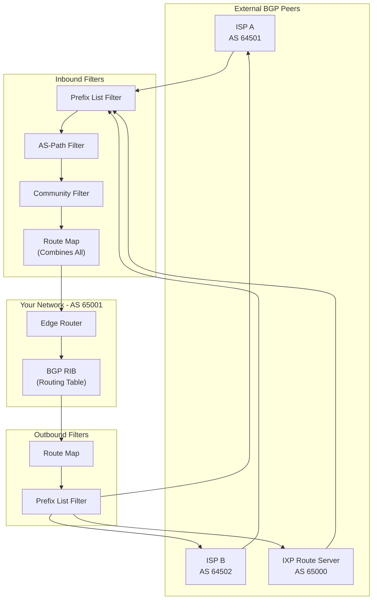
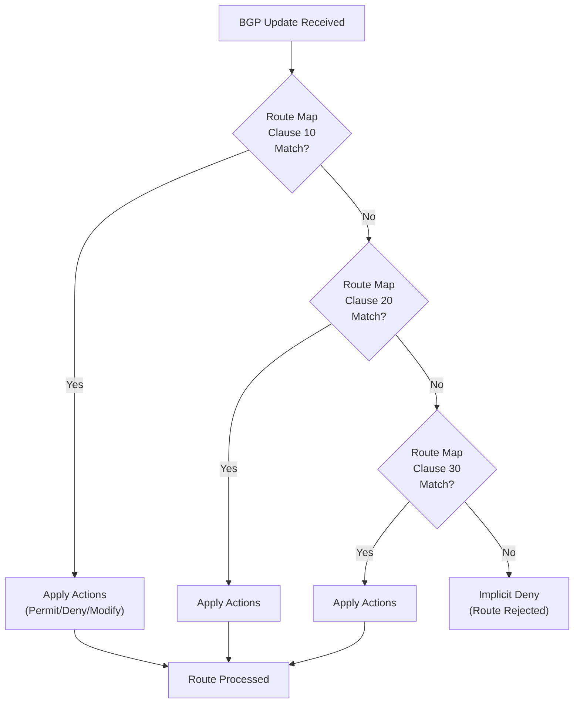
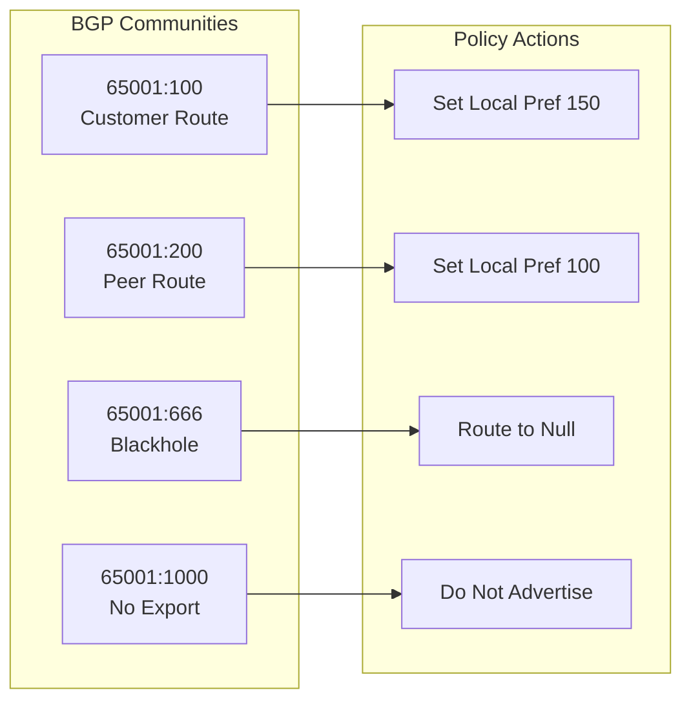
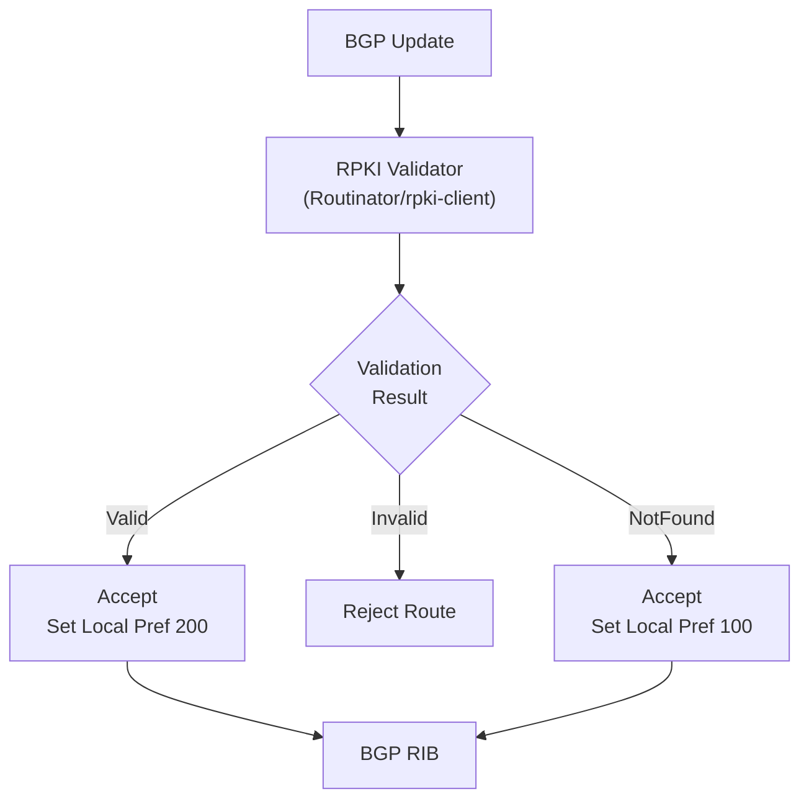
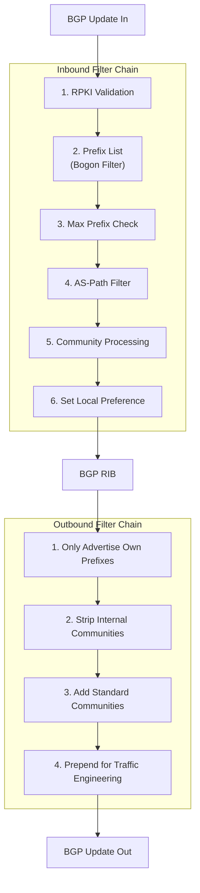

# How to Implement BGP Route Filtering

Author: [nawazdhandala](https://github.com/nawazdhandala)

Tags: BGP, Networking, Routing, Filters

Description: A comprehensive guide to implementing BGP route filtering, covering prefix lists, AS-path filters, route maps, and community-based filtering with practical configuration examples for Cisco, Juniper, and FRRouting.

---

Border Gateway Protocol (BGP) is the backbone of internet routing, connecting autonomous systems (AS) and enabling the global exchange of routing information. However, without proper filtering, your network can advertise routes it should not, accept malicious prefixes, or become a transit path for traffic that does not belong to you. BGP route filtering is not optional - it is essential for network security, stability, and compliance with routing policies.

This guide walks through the major BGP filtering techniques, explains when to use each, and provides production-ready configuration examples across common platforms.

## Why BGP Route Filtering Matters

Before diving into implementation, understand the risks of unfiltered BGP:

- **Route leaks:** Accidentally advertising learned routes to peers can turn your network into an unintended transit.
- **Prefix hijacking:** Accepting bogus announcements can redirect traffic through malicious networks.
- **Table bloat:** Accepting the full internet routing table when you only need specific prefixes wastes memory and CPU.
- **Policy violations:** ISPs and IXPs often require specific filtering as part of peering agreements.

BGP filtering ensures you only advertise what you own and only accept what you need.

## BGP Route Filtering Architecture



This architecture shows how filters are applied in sequence. Inbound filters protect your routing table; outbound filters control what you advertise.

## 1. Prefix List Filtering

Prefix lists are the simplest and most direct filtering method. They match routes based on IP prefix and prefix length.

### When to Use Prefix Lists

- Accept only specific prefixes from customers
- Block bogon (reserved) address space
- Limit accepted prefix lengths (e.g., reject anything more specific than /24)

### Cisco IOS/IOS-XE Configuration

```bash
! Define a prefix list to accept customer prefixes
ip prefix-list CUSTOMER-PREFIXES seq 10 permit 203.0.113.0/24
ip prefix-list CUSTOMER-PREFIXES seq 20 permit 198.51.100.0/24
ip prefix-list CUSTOMER-PREFIXES seq 30 permit 192.0.2.0/24 le 25
! The "le 25" allows /24 and /25 subnets

! Block RFC 1918 private addresses (should never appear in BGP)
ip prefix-list BOGON-FILTER seq 10 deny 10.0.0.0/8 le 32
ip prefix-list BOGON-FILTER seq 20 deny 172.16.0.0/12 le 32
ip prefix-list BOGON-FILTER seq 30 deny 192.168.0.0/16 le 32
ip prefix-list BOGON-FILTER seq 40 deny 0.0.0.0/0
ip prefix-list BOGON-FILTER seq 50 deny 0.0.0.0/0 ge 25
! Reject default route and anything more specific than /24
ip prefix-list BOGON-FILTER seq 1000 permit 0.0.0.0/0 le 24

! Apply to BGP neighbor
router bgp 65001
  neighbor 192.0.2.1 remote-as 64501
  neighbor 192.0.2.1 prefix-list BOGON-FILTER in
  neighbor 192.0.2.1 prefix-list CUSTOMER-PREFIXES out
```

### Juniper Junos Configuration

```bash
# Define prefix list for customer routes
policy-options {
    prefix-list CUSTOMER-PREFIXES {
        203.0.113.0/24;
        198.51.100.0/24;
        192.0.2.0/24;
    }

    prefix-list BOGONS {
        10.0.0.0/8;
        172.16.0.0/12;
        192.168.0.0/16;
        0.0.0.0/0;
    }

    policy-statement FILTER-INBOUND {
        term reject-bogons {
            from {
                prefix-list BOGONS;
            }
            then reject;
        }
        term accept-valid {
            from {
                prefix-list CUSTOMER-PREFIXES;
            }
            then accept;
        }
        term default-deny {
            then reject;
        }
    }
}

protocols {
    bgp {
        group external-peers {
            neighbor 192.0.2.1 {
                import FILTER-INBOUND;
            }
        }
    }
}
```

### FRRouting (FRR) Configuration

FRRouting is commonly used in Linux-based routers and software-defined networks:

```bash
! Configure prefix lists
ip prefix-list CUSTOMER-PREFIXES seq 10 permit 203.0.113.0/24
ip prefix-list CUSTOMER-PREFIXES seq 20 permit 198.51.100.0/24

ip prefix-list BOGON-FILTER seq 10 deny 10.0.0.0/8 le 32
ip prefix-list BOGON-FILTER seq 20 deny 172.16.0.0/12 le 32
ip prefix-list BOGON-FILTER seq 30 deny 192.168.0.0/16 le 32
ip prefix-list BOGON-FILTER seq 40 deny 0.0.0.0/0
ip prefix-list BOGON-FILTER seq 100 permit any

! Apply to BGP neighbor
router bgp 65001
  neighbor 192.0.2.1 remote-as 64501
  address-family ipv4 unicast
    neighbor 192.0.2.1 prefix-list BOGON-FILTER in
    neighbor 192.0.2.1 prefix-list CUSTOMER-PREFIXES out
  exit-address-family
```

## 2. AS-Path Filtering

AS-path filters examine the sequence of autonomous systems a route has traversed. This is powerful for:

- Blocking routes that have passed through specific ASes
- Accepting only routes originated by specific ASes
- Detecting and blocking AS-path manipulation

### AS-Path Regular Expression Basics

| Pattern | Meaning |
| --- | --- |
| `^$` | Routes originated by the neighbor AS (empty AS-path from direct peer) |
| `^64501$` | Routes originated by AS 64501 |
| `_64501_` | Routes passing through AS 64501 anywhere in the path |
| `^64501_` | Routes where AS 64501 is the first AS in the path |
| `.*` | Any AS-path (match all) |
| `^[0-9]+$` | Single-hop routes only |

### Cisco AS-Path Filter Example

```bash
! Create AS-path access lists
ip as-path access-list 10 permit ^64501$
! Accept routes originated by AS 64501

ip as-path access-list 20 deny _64666_
ip as-path access-list 20 permit .*
! Deny routes passing through AS 64666, accept all others

ip as-path access-list 30 permit ^[0-9]+$
! Accept only single-hop routes (customer-originated)

! Apply to BGP neighbor
router bgp 65001
  neighbor 192.0.2.1 remote-as 64501
  neighbor 192.0.2.1 filter-list 10 in
```

### Juniper AS-Path Filter Example

```bash
policy-options {
    as-path DIRECT-CUSTOMER "^64501$";
    as-path BLOCKED-AS ".*64666.*";
    as-path SINGLE-HOP "^[0-9]+$";

    policy-statement AS-PATH-FILTER {
        term block-bad-as {
            from as-path BLOCKED-AS;
            then reject;
        }
        term accept-customer {
            from as-path DIRECT-CUSTOMER;
            then accept;
        }
        term default-deny {
            then reject;
        }
    }
}
```

### FRRouting AS-Path Filter

```bash
! Define AS-path access lists
bgp as-path access-list CUSTOMER-ORIGINATED permit ^64501$
bgp as-path access-list BLOCK-BAD-AS deny _64666_
bgp as-path access-list BLOCK-BAD-AS permit .*

! Apply in route-map
route-map INBOUND-FILTER permit 10
  match as-path CUSTOMER-ORIGINATED

router bgp 65001
  neighbor 192.0.2.1 route-map INBOUND-FILTER in
```

## 3. Route Maps - Combining Multiple Filters

Route maps are the most flexible filtering mechanism. They combine prefix lists, AS-path filters, and other match conditions, and can also modify route attributes.

### Route Map Processing Flow



### Cisco Route Map Example

```bash
! Define match criteria
ip prefix-list ALLOWED-PREFIXES seq 10 permit 203.0.113.0/24
ip prefix-list ALLOWED-PREFIXES seq 20 permit 198.51.100.0/24 le 25

ip as-path access-list 10 permit ^64501$
ip as-path access-list 10 permit ^64501_[0-9]+$

ip community-list standard CUSTOMER-ROUTES permit 65001:100
ip community-list standard BLACKHOLE permit 65001:666

! Build the route map
route-map INBOUND-POLICY permit 10
  description Accept customer-originated routes
  match ip address prefix-list ALLOWED-PREFIXES
  match as-path 10
  set local-preference 150
  set community 65001:100 additive

route-map INBOUND-POLICY permit 20
  description Accept blackhole requests
  match community BLACKHOLE
  set local-preference 200
  set ip next-hop 192.0.2.254

route-map INBOUND-POLICY deny 100
  description Deny everything else

! Apply to neighbor
router bgp 65001
  neighbor 192.0.2.1 remote-as 64501
  neighbor 192.0.2.1 route-map INBOUND-POLICY in
```

### Juniper Policy Chain Example

```bash
policy-options {
    prefix-list ALLOWED-PREFIXES {
        203.0.113.0/24;
        198.51.100.0/24;
    }

    community CUSTOMER-ROUTES members 65001:100;
    community BLACKHOLE members 65001:666;

    as-path CUSTOMER-AS "^64501(_[0-9]+)?$";

    policy-statement INBOUND-POLICY {
        term accept-customer-routes {
            from {
                prefix-list ALLOWED-PREFIXES;
                as-path CUSTOMER-AS;
            }
            then {
                local-preference 150;
                community add CUSTOMER-ROUTES;
                accept;
            }
        }
        term accept-blackhole {
            from community BLACKHOLE;
            then {
                local-preference 200;
                next-hop 192.0.2.254;
                accept;
            }
        }
        term default-deny {
            then reject;
        }
    }
}

protocols {
    bgp {
        group external-peers {
            neighbor 192.0.2.1 {
                import INBOUND-POLICY;
            }
        }
    }
}
```

## 4. Community-Based Filtering

BGP communities are tags attached to routes that enable policy signaling between ASes. They are essential for:

- Traffic engineering (selecting primary/backup paths)
- Blackhole routing for DDoS mitigation
- Controlling route propagation to specific peers

### Standard vs Extended vs Large Communities

| Type | Format | Use Case |
| --- | --- | --- |
| Standard | 16-bit:16-bit (e.g., 65001:100) | Traditional tagging, limited to 16-bit AS numbers |
| Extended | Type:Admin:Value | VPNs, complex policies, target filtering |
| Large | 32-bit:32-bit:32-bit | 4-byte AS support, more flexible tagging |

### Community Filter Examples



### Cisco Community Configuration

```bash
! Define community lists
ip community-list standard CUSTOMER permit 65001:100
ip community-list standard PEER permit 65001:200
ip community-list standard BLACKHOLE permit 65001:666
ip community-list standard NO-EXPORT permit no-export
ip community-list expanded INTERNAL permit 65001:[1-9][0-9][0-9]

! Route map using communities
route-map COMMUNITY-POLICY permit 10
  match community BLACKHOLE
  set ip next-hop 192.0.2.254
  set local-preference 500

route-map COMMUNITY-POLICY permit 20
  match community CUSTOMER
  set local-preference 150

route-map COMMUNITY-POLICY permit 30
  match community PEER
  set local-preference 100

route-map COMMUNITY-POLICY permit 40
  match community NO-EXPORT
  set community no-export additive

! Outbound: strip internal communities before advertising
route-map OUTBOUND-SCRUB permit 10
  set comm-list INTERNAL delete
```

### Juniper Community Configuration

```bash
policy-options {
    community CUSTOMER members 65001:100;
    community PEER members 65001:200;
    community BLACKHOLE members 65001:666;
    community NO-EXPORT members no-export;
    community INTERNAL members "65001:[1-9][0-9][0-9]";

    policy-statement COMMUNITY-POLICY {
        term blackhole {
            from community BLACKHOLE;
            then {
                next-hop 192.0.2.254;
                local-preference 500;
                accept;
            }
        }
        term customer {
            from community CUSTOMER;
            then {
                local-preference 150;
                accept;
            }
        }
        term peer {
            from community PEER;
            then {
                local-preference 100;
                accept;
            }
        }
    }

    policy-statement OUTBOUND-SCRUB {
        term strip-internal {
            then {
                community delete INTERNAL;
                accept;
            }
        }
    }
}
```

## 5. RPKI-Based Filtering (Route Origin Validation)

Resource Public Key Infrastructure (RPKI) adds cryptographic validation to BGP by verifying that an AS is authorized to originate specific prefixes.

### RPKI Validation States

| State | Meaning | Action |
| --- | --- | --- |
| Valid | ROA exists and matches | Accept with preference |
| Invalid | ROA exists but does not match | Reject (likely hijack) |
| NotFound | No ROA exists for prefix | Accept with lower preference |

### RPKI Integration Flow



### Cisco RPKI Configuration

```bash
! Configure connection to RPKI validator (RTR protocol)
router bgp 65001
  bgp rpki server tcp 192.0.2.100 port 8282 refresh 300

! Apply RPKI validation in route-map
route-map RPKI-POLICY permit 10
  match rpki valid
  set local-preference 200

route-map RPKI-POLICY permit 20
  match rpki not-found
  set local-preference 100

route-map RPKI-POLICY deny 30
  match rpki invalid

! Apply to all eBGP peers
router bgp 65001
  neighbor 192.0.2.1 route-map RPKI-POLICY in
```

### FRRouting RPKI Configuration

```bash
! Configure RPKI cache server
rpki
  rpki cache 192.0.2.100 8282 preference 1

! Route map for RPKI validation
route-map RPKI-FILTER permit 10
  match rpki valid
  set local-preference 200

route-map RPKI-FILTER permit 20
  match rpki notfound
  set local-preference 100

route-map RPKI-FILTER deny 30
  match rpki invalid

! Apply to BGP neighbor
router bgp 65001
  neighbor 192.0.2.1 route-map RPKI-FILTER in
```

## 6. Maximum Prefix Limits

Protect your router from memory exhaustion and routing table manipulation by limiting the number of prefixes accepted from each peer.

### Cisco Maximum Prefix Configuration

```bash
router bgp 65001
  ! Warn at 75%, shutdown at 100% of limit
  neighbor 192.0.2.1 maximum-prefix 1000 75 warning-only

  ! Shutdown session if limit exceeded, restart after 30 minutes
  neighbor 192.0.2.2 maximum-prefix 5000 80 restart 30

  ! For transit providers expecting full table
  neighbor 192.0.2.3 maximum-prefix 900000 90
```

### Juniper Maximum Prefix Configuration

```bash
protocols {
    bgp {
        group customers {
            neighbor 192.0.2.1 {
                family inet {
                    unicast {
                        prefix-limit {
                            maximum 1000;
                            teardown 80 idle-timeout 30;
                        }
                    }
                }
            }
        }
    }
}
```

## 7. Complete Filter Implementation Example

Here is a production-ready filter chain that combines all techniques:



### Complete Cisco Configuration

```bash
! === BOGON PREFIX LISTS ===
ip prefix-list BOGONS seq 10 deny 0.0.0.0/8 le 32
ip prefix-list BOGONS seq 20 deny 10.0.0.0/8 le 32
ip prefix-list BOGONS seq 30 deny 100.64.0.0/10 le 32
ip prefix-list BOGONS seq 40 deny 127.0.0.0/8 le 32
ip prefix-list BOGONS seq 50 deny 169.254.0.0/16 le 32
ip prefix-list BOGONS seq 60 deny 172.16.0.0/12 le 32
ip prefix-list BOGONS seq 70 deny 192.0.0.0/24 le 32
ip prefix-list BOGONS seq 80 deny 192.0.2.0/24 le 32
ip prefix-list BOGONS seq 90 deny 192.168.0.0/16 le 32
ip prefix-list BOGONS seq 100 deny 198.18.0.0/15 le 32
ip prefix-list BOGONS seq 110 deny 198.51.100.0/24 le 32
ip prefix-list BOGONS seq 120 deny 203.0.113.0/24 le 32
ip prefix-list BOGONS seq 130 deny 224.0.0.0/4 le 32
ip prefix-list BOGONS seq 140 deny 240.0.0.0/4 le 32
! Reject too specific prefixes
ip prefix-list BOGONS seq 150 deny 0.0.0.0/0 ge 25
! Permit everything else
ip prefix-list BOGONS seq 1000 permit 0.0.0.0/0 le 24

! === OUR PREFIXES (for outbound) ===
ip prefix-list OUR-PREFIXES seq 10 permit 203.0.113.0/24
ip prefix-list OUR-PREFIXES seq 20 permit 198.51.100.0/24

! === AS-PATH FILTERS ===
ip as-path access-list 10 deny _0_
ip as-path access-list 10 deny _23456_
ip as-path access-list 10 deny _[64496-64511]_
ip as-path access-list 10 deny _[65536-65551]_
ip as-path access-list 10 permit .*

! === COMMUNITY LISTS ===
ip community-list standard BLACKHOLE permit 65001:666
ip community-list standard NO-EXPORT permit 65001:999

! === INBOUND ROUTE MAP ===
route-map TRANSIT-IN deny 5
  description Reject RPKI invalid
  match rpki invalid

route-map TRANSIT-IN deny 10
  description Reject bogons
  match ip address prefix-list BOGONS

route-map TRANSIT-IN deny 15
  description Reject bad AS paths
  match as-path 10

route-map TRANSIT-IN permit 20
  description Accept RPKI valid with high preference
  match rpki valid
  set local-preference 200
  set community 65001:100 additive

route-map TRANSIT-IN permit 30
  description Accept RPKI unknown with standard preference
  match rpki not-found
  set local-preference 100
  set community 65001:200 additive

! === OUTBOUND ROUTE MAP ===
route-map TRANSIT-OUT permit 10
  description Only advertise our prefixes
  match ip address prefix-list OUR-PREFIXES
  set community 65001:1000

route-map TRANSIT-OUT deny 100
  description Deny everything else

! === BGP CONFIGURATION ===
router bgp 65001
  bgp log-neighbor-changes
  bgp rpki server tcp 192.0.2.100 port 8282 refresh 300

  ! Transit provider
  neighbor 192.0.2.1 remote-as 64501
  neighbor 192.0.2.1 description Transit-ISP-A
  neighbor 192.0.2.1 maximum-prefix 900000 90 restart 15
  neighbor 192.0.2.1 route-map TRANSIT-IN in
  neighbor 192.0.2.1 route-map TRANSIT-OUT out
  neighbor 192.0.2.1 send-community both
```

## 8. Troubleshooting BGP Filters

When routes are not appearing as expected, use these commands to diagnose filter issues.

### Cisco Troubleshooting Commands

```bash
! Show routes filtered by prefix list
show ip bgp neighbors 192.0.2.1 received-routes
show ip bgp neighbors 192.0.2.1 routes

! Compare received vs accepted (requires soft-reconfiguration inbound)
show ip bgp neighbors 192.0.2.1 received-routes | include 203.0.113
show ip bgp neighbors 192.0.2.1 routes | include 203.0.113

! Test prefix list matches
show ip prefix-list BOGONS 10.0.0.0/8

! Test AS-path regex
show ip bgp regexp ^64501$

! View RPKI validation status
show ip bgp rpki table
show ip bgp 203.0.113.0/24 rpki

! Debug route-map processing
debug ip bgp updates
debug ip bgp updates filter
```

### Juniper Troubleshooting Commands

```bash
# Show received vs accepted routes
show route receive-protocol bgp 192.0.2.1
show route protocol bgp 192.0.2.1

# Test policy against specific prefix
show route 203.0.113.0/24 detail
test policy INBOUND-POLICY 203.0.113.0/24

# View prefix list matches
show policy prefix-list ALLOWED-PREFIXES

# Monitor BGP updates
monitor traffic interface ge-0/0/0 matching "port 179"
```

## 9. Best Practices Summary

| Practice | Rationale |
| --- | --- |
| Always filter bogons | Prevents accepting reserved/private addresses |
| Use strict inbound filters | Default deny, explicit permit |
| Implement RPKI | Cryptographic route origin validation |
| Set maximum prefix limits | Protects against memory exhaustion |
| Filter AS-paths | Detect bogus or manipulated paths |
| Use communities for signaling | Enables flexible policy without reconfiguration |
| Document all filters | Maintainability and troubleshooting |
| Test before production | Validate filters in a lab environment |
| Monitor filter hits | Track rejected routes for security analysis |
| Update bogon lists regularly | New allocations change over time |

## 10. Automating Filter Maintenance

Maintaining BGP filters manually is error-prone. Consider these automation approaches:

### IRR-Based Filter Generation

Use tools like `bgpq4` to generate prefix lists from Internet Routing Registry data:

```bash
# Generate Cisco prefix list from IRR
bgpq4 -4 -l CUSTOMER-PREFIXES AS64501

# Output example:
# ip prefix-list CUSTOMER-PREFIXES permit 203.0.113.0/24
# ip prefix-list CUSTOMER-PREFIXES permit 198.51.100.0/24

# For Juniper format
bgpq4 -4 -J -l CUSTOMER-PREFIXES AS64501

# Automate with cron
0 */6 * * * /usr/bin/bgpq4 -4 -l CUSTOMER-PREFIXES AS64501 > /tmp/prefix-list.txt
```

### RPKI Integration with Routinator

```bash
# Install Routinator
apt install routinator

# Configure /etc/routinator/routinator.conf
[output]
format = "rpki-rtr"
listen = ["192.0.2.100:8282"]

# Start service
systemctl enable --now routinator
```

## Conclusion

BGP route filtering is a foundational skill for any network engineer managing internet connectivity. The key principles are:

1. **Defense in depth** - Combine prefix lists, AS-path filters, communities, and RPKI
2. **Default deny** - Only accept explicitly permitted routes
3. **Automation** - Use IRR data and RPKI to maintain accurate filters
4. **Monitoring** - Track filter hits to detect anomalies and attacks

Start with basic prefix and bogon filters, then progressively add AS-path validation, RPKI, and community-based policies as your network matures. Remember that a misconfigured filter can cause outages or security incidents - always test changes in a lab before production deployment.

For monitoring your BGP sessions and detecting routing anomalies, consider integrating your network telemetry with an observability platform. Tools that support SNMP, streaming telemetry, and custom metrics can alert you when BGP sessions flap or when unexpected routes appear in your table.
